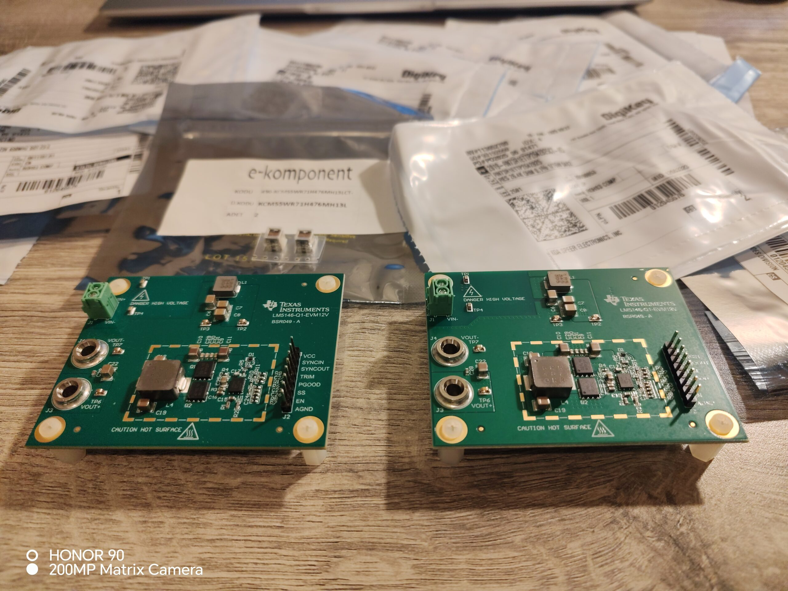
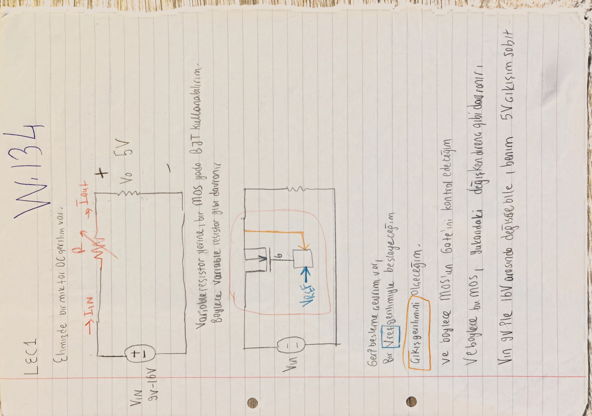
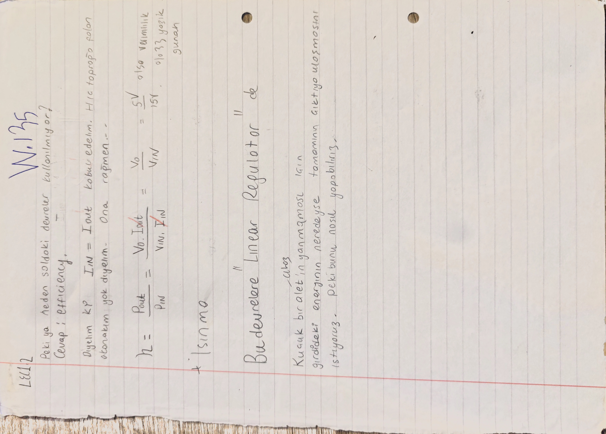

# Proje Durumu ve Okuma Rehberi

Bu dosya, LM5146-Q1 buck converter çalışmasının proje durumu ve okuma rehberi sahibidir. Teknik hesapları yeniden anlatmaz; hangi belgenin ne işe yaradığını, projenin fiziksel olarak nerede kaldığını ve eski defter izlerinin nasıl okunacağını açıklar.

[README özetine dön](README.md)

## Bu Dosyanın Amacı

Bu dosyanın görevi şunları tek yerde tutmaktır:

- çalışma planı,
- arka plan,
- durum özeti,
- tasarım yaklaşımındaki değişim,
- belgenin nasıl okunacağı,
- güncel fiziksel proje durumu,
- kısa değişiklik günlüğü,
- teknik dosyalara geçiş bağlantıları.

Bu dosya komponent hesabı, MOSFET kaybı, kompanzasyon hesabı, EMI filtresi veya LTspice sonucunun primary owner'ı değildir. O konular ilgili teknik dosyalarda yaşar.

## Kapsadığı Eski README Başlıkları

Bu dosya, eski devasa README içindeki şu bölümlerin sadeleştirilmiş owner'ıdır:

- `# LM5146-Q1 Tabanli Buck Converter Tasarimi` içindeki belge felsefesi ve okuma kuralları
- `## 0. Calisma Plani`
- `## 1. Arka Plan`
- `## 2. Durum Ozeti`
- `### 2.1 Ilk tasarim`
- `### 2.2 Yeni tasarim`
- `### 2.3 Tasarim yaklasimindaki degisim`
- `## 11. Degisiklik Gunlugu`
- `### 2026-03-20`

Bu başlık listesi yalnız taşıma/provenance izidir. Güncel teknik okuma için eski uzun README değil, aşağıdaki 00-09 owner dosyaları kullanılmalıdır.

## Proje Kısa Tanımı

Bu çalışma, LM5146-Q1 tabanlı senkron buck converter tasarımının ikinci turudur. Önceki buck converter çalışması bir referans noktası olarak durur; bu repo ise aynı fikri daha ayrıntılı komponent seçimi, kontrol, giriş/çıkış kapasiteleri, EMI, termal ve doğrulama planı ile yeniden ele alır.

Buradaki amaç yalnızca devreyi çizmek değildir. Amaç; hangi karara nasıl gidildiğini, hangi hesabın hangi kaynakla karşılaştırıldığını, hangi parçaların seçildiğini ve projenin fiziksel olarak nerede kaldığını izlenebilir bırakmaktır.

## Güncel Fiziksel Proje Durumu

Bu ayrım repo boyunca korunmalıdır:

| Durum | Açıklama |
|---|---|
| Seçildi | Hesaplar sonucunda bobin, kapasitörler, MOSFET, kompanzasyon elemanları, current-limit/protection elemanları, giriş filtresi ve ilgili pasifler için aday/parça aileleri belirlendi. |
| Satın alındı | BOM klasöründe datasheet izleri bulunan birçok parça seçildi ve satın alındı; harici VCC kaynağı için ikinci bir LM5146-Q1 EVM de alındı. |
| Planlandı | LM5146-Q1 EVM/kart üzerinde rework uygulanması ve ikinci EVM'nin harici VCC kaynağı olarak kullanılması planlandı; birçok elemanın değiştirilmesi öngörüldü. |
| Uygulanmadı | Seçilen bileşenler karta takılmadı; EVM üzerinde planlanan modifikasyon yapılmadı. |
| Durduruldu | Proje daha sonra durduruldu; rework sonrası ölçüm, termal test, EMI testi ve tam LTspice/PSpice kapanışı yapılmadı. |

[Tasarım İzi] Fotoğraf, iki LM5146-Q1 EVM kartını ve satın alınan komponent paketlerini aynı fiziksel durumda gösterir. Bu kayıt “seçildi / satın alındı / planlandı” aşamasını belgeler; kart rework'ünün uygulandığını veya laboratuvar doğrulamasının yapıldığını göstermez.

Bu nedenle repo, tamamlanmış bir donanım doğrulama raporu gibi okunmamalıdır. Hesap ve parça seçim izi güçlüdür; fiziksel kart doğrulaması açık kalmıştır.

## Çalışma Planı

Eski README'deki çalışma planı, bu repo için hâlâ doğru okuma çerçevesini verir:

1. Eski ODT/Markdown aktarımından gelen notları düzenli teknik owner dosyalarına ayırmak.
2. Defter sayfalarını ve görsel kırpımları hesap bağlamından koparmadan korumak.
3. Geçerli hesap, tasarım izi, eski iterasyon, çapraz teyit ve açık kontrol ayrımını görünür tutmak.
4. Kaynakları ve BOM izlerini ilgili teknik kararlarla bağlamak.
5. Teknik owner dosyalarını doldururken README'yi ana indeks olarak hafif tutmak.
6. Sonraki bir turda simülasyon, termal, EMI ve fiziksel ölçüm açıklarını ayrı doğrulama planıyla kapatmak.

Ayrıntılı takip dosyaları:

- [tracking/master_plan.md](tracking/master_plan.md)
- [tracking/readme_split_manifest.md](tracking/readme_split_manifest.md)
- [tracking/readme_redteam_report.md](tracking/readme_redteam_report.md)
- [tracking/open_questions.md](tracking/open_questions.md)

## Arka Plan

İlk tasarım, daha önce tamamlanan buck converter çalışmasıydı. Simülasyonları alınmış ve temel hedefleri sağladığı gösterilmişti. Bu yeni çalışma onun doğrudan kopyası değildir; daha çok aynı fikrin ikinci, daha ayrıntılı ve izlenebilir turudur.

Bu iterasyonda özellikle şu başlıklar daha fazla açıldı:

- LM5146-Q1 ve EVM referanslarının ayrıntılı incelenmesi,
- giriş ve çıkış kapasitörlerinin daha bilinçli seçimi,
- MOSFET dayanım, kayıp ve termal yorumları,
- bootstrap ve current-limit zinciri,
- K-factor tabanlı Type-III kompanzasyon yaklaşımı,
- giriş filtresi, EMI ve yerleşim etkileri,
- LTspice/PSpice doğrulama planı.

## Defter Tam Sayfa Pass 3: `W.134-W.135`

[Tasarım İzi] Defterin 4. ve 5. tam sayfaları, final buck komponent hesabından önceki temel regülatör düşüncesini gösterir. Bu blok yeni final tasarım değeri vermez; lineer regülatör fikrinin neden yüksek güçlü bu projede ana yol olmadığına dair arka planı korur.

`W.134` üzerinde görünen ana izler:

- elde bir DC giriş gerilimi olduğu ve bunun basitçe bir seri eleman/direnç üzerinden yüke aktarıldığı düşüncesi,
- `Vin = 9 V - 16 V` ve `Vo = 5 V` örnek bağlamı,
- değişken direnç yerine MOS veya BJT kullanma fikri,
- `Vref` ile çıkış gerilimini ölçüp geçiş elemanının gate/base tarafını kontrol etme fikri,
- `Vin` değişse bile `5 V` çıkışı sabit tutma hedefi.

`W.135` üzerinde görünen ana izler:

- "neden soldaki devreler kullanılmıyor?" sorusuna verilen cevap: verim,
- basitleştirilmiş kabul olarak `Iin = Iout` ve sıfır quiescent akımı,
- `eta = Pout / Pin = (Vo*Iout) / (Vin*Iin) = Vo / Vin`,
- örnek olarak `5 V / 15 V = 1/3`, yani yaklaşık `%33` verim,
- bu kaybın ısınmaya döneceği ve lineer regülatörlerin daha çok küçük güçlü kullanımlar için uygun olduğu notu.

[Çapraz Teyit] Bu iki sayfa, [01_tasarim_girdileri_ve_kaynaklar.md](01_tasarim_girdileri_ve_kaynaklar.md) içindeki `90%` minimum verim varsayımının teknik arka planını destekler; ancak o sayının primary owner'ı bu dosya değildir. Kayıp ve termal kapanış [06_kayiplar_bootstrap_koruma_ve_termal_kapanis.md](06_kayiplar_bootstrap_koruma_ve_termal_kapanis.md) içinde yaşar.

## Durum Özeti

[Güncel Omurga] Ana tasarım hedefleri ve seçilmiş çalışma noktaları belirlendi: 24-36 V giriş, 14 V çıkış, 50-125 W yük aralığı, 332 kHz anahtarlama ve 35 kHz civarında kontrol hedefi.

[Tasarım İzi] LM5146 quickstart calculator, WEBENCH, datasheet/EVM görselleri, defter sayfaları ve BOM izleri aynı tasarım yolunu farklı açılardan kontrol etmek için kullanıldı.

[Açık Kontrol] Final BOM derating, LTspice/PSpice AC ve transient doğrulaması, giriş filtresi/Middlebrook kontrolü, termal kapanış, EMI ve fiziksel layout/ölçüm tarafı tamamlanmadı.

Kısa hüküm: tasarım düşüncesinin ana omurgası kuruldu; fiziksel rework ve laboratuvar doğrulaması yapılmadan proje durduruldu.

## Tasarım Yaklaşımındaki Değişim

İlk dönemde kontrolcü tasarımı daha önce öğrenilmiş Type-III/PID yaklaşımıyla kurulmuştu. Bu ikinci iterasyonda K-factor yöntemi merkeze alındı. Bu değişim yalnız kompanzasyon devresini değil; power-stage hesabını, kapasitör seçimini, transient düşüncesini, EMI tarafını ve yerleşim kararlarını da daha düzenli ele almayı sağladı.

Eski Type-III/PID izleri silinmez. Onlar nereden gelindiğini ve hangi varsayımların değiştiğini gösterir. Ancak güncel kontrol omurgası; K-factor, calculator çapraz teyidi ve ileride yapılması gereken LTspice/PSpice doğrulaması üzerinden okunmalıdır.

## Belge Nasıl Okunmalı?

Bu repo, tek satır final değer listesi değildir. Aynı konu içinde güncel karar, eski iterasyon, defter izi ve çapraz teyit birlikte durabilir.

Okuma etiketleri:

- `[Güncel Omurga]`: şu anda tasarımın ana hattı olarak kabul edilen karar veya değer.
- `[Tasarım İzi]`: o karara nasıl gidildiğini gösteren ara hesap, kaynak veya defter izi.
- `[Eski İterasyon]`: bugünkü kararı tek başına temsil etmeyen ama süreci anlamak için korunan eski aday.
- `[Çapraz Teyit]`: datasheet, EVM, calculator, WEBENCH, defter veya simülasyonla yapılan karşılaştırma.
- `[Açık Kontrol]`: final BOM, simülasyon, termal, EMI, layout veya ölçümle kapanması gereken konu.

Bir değer iki yerde farklı görünüyorsa sessizce birleştirilmemelidir. Önce hangi owner dosyasında yaşadığına, hangi etiketi taşıdığına ve eski/güncel ayrımına bakılmalıdır.

## Okuma Sırası

Önerilen genel sıra:

1. [README.md](README.md) - repo özeti ve indeks.
2. Bu dosya - proje durumu, okuma rehberi, fiziksel kapanış.
3. [01_tasarim_girdileri_ve_kaynaklar.md](01_tasarim_girdileri_ve_kaynaklar.md) - G94 hedefleri ve kaynak güven seviyesi.
4. [02_startup_pin_programlama_ve_ortak_sabitler.md](02_startup_pin_programlama_ve_ortak_sabitler.md) - ortak `fsw`, duty/timing ve startup.
5. Güç katı dosyaları: [03](03_bobin_ve_cikis_kapasitorleri.md), [04](04_giris_kapasitorleri_ve_giris_agi.md), [05](05_mosfet_secimi_ve_dayanim_mantigi.md), [06](06_kayiplar_bootstrap_koruma_ve_termal_kapanis.md).
6. [07_kontrolcu_ve_kompanzasyon.md](07_kontrolcu_ve_kompanzasyon.md)
7. [08_emi_giris_filtresi_ve_yerlesim.md](08_emi_giris_filtresi_ve_yerlesim.md)
8. [09_simulasyon_gorseller_ve_acik_sorular.md](09_simulasyon_gorseller_ve_acik_sorular.md)

## Kısa Okuma Rotaları

Hızlı genel bakış:

1. [README.md](README.md)
2. Bu dosya
3. [01_tasarim_girdileri_ve_kaynaklar.md](01_tasarim_girdileri_ve_kaynaklar.md)

Güç katı odaklı okuma:

1. [01_tasarim_girdileri_ve_kaynaklar.md](01_tasarim_girdileri_ve_kaynaklar.md)
2. [02_startup_pin_programlama_ve_ortak_sabitler.md](02_startup_pin_programlama_ve_ortak_sabitler.md)
3. [03_bobin_ve_cikis_kapasitorleri.md](03_bobin_ve_cikis_kapasitorleri.md)
4. [04_giris_kapasitorleri_ve_giris_agi.md](04_giris_kapasitorleri_ve_giris_agi.md)
5. [05_mosfet_secimi_ve_dayanim_mantigi.md](05_mosfet_secimi_ve_dayanim_mantigi.md)
6. [06_kayiplar_bootstrap_koruma_ve_termal_kapanis.md](06_kayiplar_bootstrap_koruma_ve_termal_kapanis.md)

Kontrol / kompanzasyon odaklı okuma:

1. [01_tasarim_girdileri_ve_kaynaklar.md](01_tasarim_girdileri_ve_kaynaklar.md)
2. [03_bobin_ve_cikis_kapasitorleri.md](03_bobin_ve_cikis_kapasitorleri.md)
3. [07_kontrolcu_ve_kompanzasyon.md](07_kontrolcu_ve_kompanzasyon.md)
4. [09_simulasyon_gorseller_ve_acik_sorular.md](09_simulasyon_gorseller_ve_acik_sorular.md)

EMI / giriş filtresi odaklı okuma:

1. [01_tasarim_girdileri_ve_kaynaklar.md](01_tasarim_girdileri_ve_kaynaklar.md)
2. [04_giris_kapasitorleri_ve_giris_agi.md](04_giris_kapasitorleri_ve_giris_agi.md)
3. [08_emi_giris_filtresi_ve_yerlesim.md](08_emi_giris_filtresi_ve_yerlesim.md)
4. [09_simulasyon_gorseller_ve_acik_sorular.md](09_simulasyon_gorseller_ve_acik_sorular.md)

## İlgili Teknik Dosyalara Geçiş

| Dosya | Ne zaman okunmalı? |
|---|---|
| [01_tasarim_girdileri_ve_kaynaklar.md](01_tasarim_girdileri_ve_kaynaklar.md) | G94 snapshot, kaynak güven seviyesi ve cross-check kuralı gerektiğinde |
| [02_startup_pin_programlama_ve_ortak_sabitler.md](02_startup_pin_programlama_ve_ortak_sabitler.md) | `fsw`, duty/timing, EN/UVLO, SS/TRK, RT ve VCC/LDO için |
| [03_bobin_ve_cikis_kapasitorleri.md](03_bobin_ve_cikis_kapasitorleri.md) | bobin, Cout, Zout, output bulk ve energy buffer için |
| [04_giris_kapasitorleri_ve_giris_agi.md](04_giris_kapasitorleri_ve_giris_agi.md) | Cin, MLCC, RMS, ESR/ESL, helper MLCC ve giriş bulk için |
| [05_mosfet_secimi_ve_dayanim_mantigi.md](05_mosfet_secimi_ve_dayanim_mantigi.md) | MOSFET seçimi, SOA, avalanche, RDS(on), Qg/Qoss ve dv/dt için |
| [06_kayiplar_bootstrap_koruma_ve_termal_kapanis.md](06_kayiplar_bootstrap_koruma_ve_termal_kapanis.md) | kayıplar, bootstrap, current-limit/protection ve termal kapanış için |
| [07_kontrolcu_ve_kompanzasyon.md](07_kontrolcu_ve_kompanzasyon.md) | feedback divider, plant, crossover, faz marjı, K-factor ve Type-III için |
| [08_emi_giris_filtresi_ve_yerlesim.md](08_emi_giris_filtresi_ve_yerlesim.md) | EMI, giriş filtresi, hot-loop ve layout için |
| [09_simulasyon_gorseller_ve_acik_sorular.md](09_simulasyon_gorseller_ve_acik_sorular.md) | doğrulama planı, görsel mantığı ve açık sorular için |

## Kısa Değişiklik Günlüğü

### 2026-03-20

- Eski ODT ve defter notlarından ilk Markdown iskeleti kuruldu.
- Belge, bitmiş rapor yerine yaşayan tasarım defteri gibi düzenlenmeye başladı.
- G94 spesifikasyon tablosu, güç katı, kontrol, EMI, simülasyon ve açık kontrol bölümleri ilk kez ana gövdeye alındı.
- Defter kırpımları, ODT gömülü görselleri ve kaynak izleri teknik bağlamlarıyla eşleştirilmeye başladı.

### 2026-05-30

- README uzun hesap gövdesinden çıkarılıp ana indeks ve proje özeti rolüne taşındı.
- Eski uzun README gövdesi [tracking/README_before_index_rewrite_2026-05-30.md](tracking/README_before_index_rewrite_2026-05-30.md) olarak yedeklendi; yeni navigasyonda primary kaynak değildir.
- Split planına göre `00`-`09` teknik owner dosyaları oluşturuldu ve dolduruldu.
- Bu dosya, proje durumu ve okuma rehberi owner'ı olarak dolduruldu.

## README Summary'ye Dönüş

Ana özet ve doküman haritası için [README.md](README.md) dosyasına dön.
