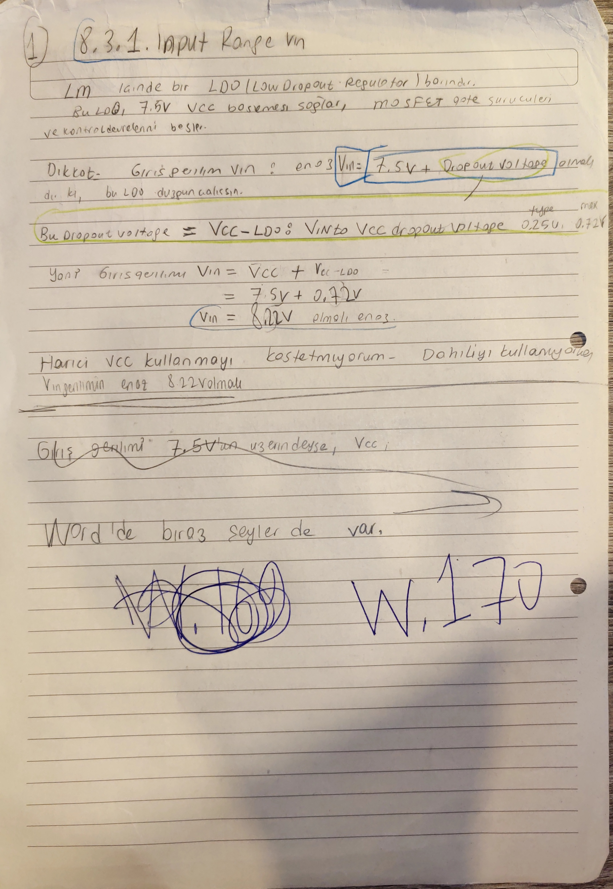

# Startup, Pin Programlama ve Ortak Sabitler

Bu dosya, LM5146-Q1 startup / pin-programming akışının primary owner'ıdır. Global giriş hedefleri ve duty/timing sayıları [01_tasarim_girdileri_ve_kaynaklar.md](01_tasarim_girdileri_ve_kaynaklar.md) dosyasında sabitlenir; burada o sayılar `VCC/LDO`, `EN/UVLO`, `SS/TRK`, `RT` ve startup zinciri içinde kullanılır.

[README özetine dön](README.md)

## Bu Dosyanın Amacı

Bu dosya şu konuları tek startup akışı halinde toplar:

- LM5146-Q1 dahili `VCC/LDO` varsayımı,
- düşük `Vin` / dropout sınırı,
- harici `VCC/DVCC` alternatifinin neden ana yol olmadığı,
- `EN/UVLO` ve `VCC UVLO`,
- `SS/TRK` ve soft-start,
- `RT` pini ve `332 kHz` switching frequency,
- shared duty/timing referans geçidi,
- donanımsal `tON(min)` / `tOFF(min)` büyüklük kontrolü,
- bootstrap, termal ve feedback divider dosyalarına kısa yönlendirme.

## Kapsadığı Eski README Başlıkları

- `### 3.1 Paylaşılan fsw, duty ve zaman alanı owner'ı` içindeki startup/timing kullanımı
- `### 3.2 Startup / pin-programming handoff özeti`
- `### 5.1 Controller pin programming ve startup owner`
- `#### 5.1.1 LM5146-Q1 dahili LDO siniri`
- `#### 5.1.2 Ek notlar: dusuk Vin bolgesinin etkisi`
- `#### 5.1.3 FB divider referans notu`
- `#### 5.1.4 EN/UVLO, SS/TRK ve startup notlari`
- `#### 5.1.5 RT pini ve anahtarlama frekansi`
- `### 5.2 Ortak sabitler, duty ve timing referans geçidi`
- `#### 5.2.1 Donanımsal zaman sınırı kaynak notu`
- `#### 5.2.2 Bootstrap duty referans notu`

## Upstream / Downstream Okuma Bağlantıları

- Upstream: [01_tasarim_girdileri_ve_kaynaklar.md](01_tasarim_girdileri_ve_kaynaklar.md)
- Downstream: [03_bobin_ve_cikis_kapasitorleri.md](03_bobin_ve_cikis_kapasitorleri.md)
- Downstream: [04_giris_kapasitorleri_ve_giris_agi.md](04_giris_kapasitorleri_ve_giris_agi.md)
- Downstream: [06_kayiplar_bootstrap_koruma_ve_termal_kapanis.md](06_kayiplar_bootstrap_koruma_ve_termal_kapanis.md)
- Cross-reference: [07_kontrolcu_ve_kompanzasyon.md](07_kontrolcu_ve_kompanzasyon.md)

## Owner Notu

[Güncel Omurga] Bu dosya, pin-programming ve startup akışının sahibidir. `fsw`, duty ailesi ve zaman penceresi [01](01_tasarim_girdileri_ve_kaynaklar.md) içinde global input olarak tanımlanır; burada `RT`, startup ve bootstrap handoff bağlamında kullanılır.

[Açık Kontrol] Başka dosyalarda `VCC/LDO`, `EN/UVLO`, `SS/TRK` veya `RT` yeniden uzun anlatılmamalı. Gerekirse bu dosyaya kısa pointer bırakılmalı.

## Kullanılan Global Girdiler

Bu dosya aşağıdaki global değerleri [01_tasarim_girdileri_ve_kaynaklar.md](01_tasarim_girdileri_ve_kaynaklar.md) dosyasından alır:

| Girdi | Değer / rol |
|---|---:|
| Normal `Vin` aralığı | `24 V - 36 V` |
| Survive-only input transient | `44 V`, `1 ms` |
| `Vout` | `14 V` |
| `fsw` | `332 kHz` |
| `Tsw` | `≈ 3.01 us` |
| İdeal duty ailesi | `0.389 / 0.583` |
| Verim dahil korumacı duty ailesi | `0.432 / 0.648` |
| Minimum verim varsayımı | `eta ≈ 0.9` |
| Harici bias / VCC | kullanılmayacak ana varsayımı |

Bu değerler burada değiştirilmez. Yerel startup hesabı bu sabitlerin üstüne kurulur.

## Startup Akışının Kısa Haritası

LM5146-Q1 startup ve pin-programming akışı şu sıra ile okunur:

1. `VIN` normal çalışma aralığında gelir.
2. Dahili `VCC/LDO`, gate driver ve kontrol devresi için yerel besleme oluşturur.
3. `EN/UVLO` pinindeki eşikler ve `VCC UVLO` birlikte aşılmadan kontrolcü aktif kabul edilmez.
4. `SS/TRK` rampası, çıkış referansının yumuşak kalkmasını sağlar.
5. `RT` pini `332 kHz` anahtarlama frekansını programlar.
6. Bootstrap ve gate-drive tarafı, bu startup/VCC varsayımını kullanır ama detayları [06_kayiplar_bootstrap_koruma_ve_termal_kapanis.md](06_kayiplar_bootstrap_koruma_ve_termal_kapanis.md) dosyasında kapanır.


Bu görsel, `EN/UVLO`, `VCC UVLO`, `SS/TRK`, PWM logic ve gate driver yolunu aynı kontrolcü bloğu içinde gösterdiği için startup owner'ının görsel girişidir.

## Dahili `VCC/LDO`

[Güncel Omurga] Bu iterasyonda ana yol, LM5146-Q1'in dahili `7.5 V` `VCC/LDO` regülatörünü kullanmaktır. Harici `8 V - 13 V` `VCC/DVCC` seçeneği biliniyor, fakat bu rework planında ana varsayım değildir.

Datasheet/ODT izinde kullanılan dropout aralığı:

```text
VCC-LDO VIN to VCC dropout = 0.25 V typ - 0.72 V max
```

Harici `VCC` kullanılmıyorsa, dahili LDO'nun normal regülasyon için kaba alt sınırı:

```text
Vin,min ≈ 7.5 V + 0.72 V = 8.22 V
```

Düşük giriş örneği:

```text
Vin = 6.0 V
VCC ≈ Vin - 0.25 V ≈ 5.75 V
```

Bu düşük `VCC` bölgesi şu riskleri açar:

- MOSFET `VGS` düşer.
- `RDS(on)` artabilir.
- gate şarj/deşarj süreleri uzayabilir.
- switching kayıpları artabilir.
- OCP/current-sense marjları değişebilir.
- logic-level MOSFET veya harici `VCC` seçeneği yeniden gündeme gelebilir.

Normal proje çalışma aralığı yine `24 V - 36 V`dir. `8.22 V` hesabı çalışma hedefini aşağı çekmez; yalnız startup/dropout sanity sınırını gösterir.


Bu görseller, `7.5 V` dahili LDO, `FB / 0.8 V`, `COMP`, `SS/TRK` ve startup/pin-programming zincirinin aynı kontrolcü iç yapısına bağlı olduğunu gösterir.

## Harici `VCC/DVCC` Alternatifi

[Tasarım İzi] Harici `VCC` yolu bilinçli olarak incelendi. Datasheet/uygulama notlarında `8 V - 13 V` harici ray ile `DVCC` üzerinden dahili LDO'nun baypas edilebileceği görülüyor.

Bu iterasyondaki karar:

- harici `VCC` kullanılmayacak,
- dahili `VCC/LDO` ana yol olacak,
- yüksek `Vin` tarafındaki LDO kaybı termal kapanışta ayrıca kontrol edilecek.


[Yönlendirme - termal] Dahili LDO'nun güç kaybı ve harici `DVCC` alternatifinin termal gerekçesi [06_kayiplar_bootstrap_koruma_ve_termal_kapanis.md](06_kayiplar_bootstrap_koruma_ve_termal_kapanis.md) içinde kapanır.

## Defter İzi: `W.170` Dahili VCC Niyeti

[Tasarım İzi] `W.170`, `8.22 V` minimum `Vin` sınırını defterde yeniden kurar ve tasarım niyetini açık yazar: harici `VCC` değil, dahili `VCC/LDO` yolu kullanılacak.



Tam sayfada korunan izler:

- LM5146 içinde `LDO / low-dropout regulator` olduğu,
- bu LDO'nun `7.5 V` `VCC` beslemesini sağlayıp MOSFET gate sürücülerini ve kontrol devresini beslediği,
- dahili LDO'nun düzgün çalışması için giriş geriliminin en az `VCC + dropout` olması gerektiği,
- dropout için `0.25 V typ` ve `0.72 V max` notu,
- `Vin,min = 7.5 V + 0.72 V = 8.22 V` kontrolü,
- "harici VCC kullanmayı kastetmiyorum; dahiliyi kullanıyoruz" niyeti.


Bu sayfa yeni bir final hesap değildir; `5.1.1-5.1.2` çizgisindeki LDO/dropout okumasını defterde teyit eden tasarım izidir. Normal proje çalışma aralığı olan `24 V - 36 V` değişmez; `8.22 V` yalnız dahili VCC regülasyonunun alt sınır sanity kontrolüdür.

## `EN/UVLO` ve `VCC UVLO`

[Güncel Omurga] `EN/UVLO > 1.2 V` olması tek başına yeterli startup kanıtı değildir. `VCC` rayının kendi UVLO eşiği de aşılmalıdır.

LM5146 `EN/UVLO` bölgesi:

| `EN/UVLO` gerilimi | Durum |
|---|---|
| `< 0.4 V` | shutdown |
| `0.4 V - 1.2 V` | standby |
| `> 1.2 V` | active |

`VCC` UVLO notları:

| Büyüklük | Değer |
|---|---:|
| `VCC-UV` | `≈ 4.93 V typ` |
| `VCC-UVHYS` | `≈ 0.26 V` |


Bu görseller, enable logic ve `VCC UVLO` davranışının aynı startup zinciri içinde okunması gerektiğini gösterir.

## Precision Enable Direnç Bölücü İzleri

[Tasarım İzi] `W.207`, precision enable mantığını ve `EN/UVLO` pinindeki direnç bölücüyü kurar.


Temel ilişki:

```text
RUV1 = (VIN(ON) - VIN(OFF)) / IHYS
```

İkinci denklem, `RUV1`, `RUV2`, `VEN` ve `VIN(ON)` arasındaki bölücü ilişkisini kurar.

[Eski İterasyon] `W.209`, bu denklemleri sayısal bir örneğe indirir:


Defterdeki uygulama:

```text
IHYS = 10 uA
VEN  = 1.2 V
VIN(ON)  = 24 V
VIN(OFF) = 23 V
RUV1 = (24 V - 23 V) / 10 uA = 100 kOhm
RUV2 = 100 kOhm * 1.2 V / (24 V - 1.2 V) ≈ 5.263 kOhm
```

[Çapraz Teyit] LM5146 quickstart calculator tarafında farklı bir UVLO örneği görülür:

```text
VIN(on)  = 30 V
VIN(off) = 28 V
RUV1 = 200 kOhm
RUV2 = 8.25 kOhm
```

Bu fark sessizce birleştirilmez. `W.209` denklemi anlama / ara uygulama izidir; calculator satırı başka bir eşik seçimiyle çalışan cross-check'tir. Final rework uygulanmadığı için UVLO dirençleri kapanmış BOM kararı gibi okunmamalıdır.

## `SS/TRK` ve Soft-start

[Güncel Omurga] Soft-start, çıkışın yavaş rampalanmasını ve inrush/current-limit riskinin azaltılmasını sağlar. `SS/TRK` pinindeki rampa, startup sırasında hata yükseltecinin gördüğü referans davranışını etkiler.

`W.204`, startup sırasında `SS/TRK` pinini sabit `0.8 V` referansın anında uygulanması gibi değil, rampalanan bir takip düğümü gibi okumaya başladığım sayfadır.


Bu sayfadaki ana notlar:

- `EN/UVLO ≈ 1.2 V` olduğunda IC active bölgeye geçer.
- `I_SS`, `C_SS` kapasitörünü doldurur.
- `I_SS = 10 uA`.
- `SS/TRK < 0.8 V` iken referans davranışı startup rampasıyla ilişkilidir.


`PWL` notu final model değil; `SS/TRK` rampasının LTspice tarafında nasıl emule edilebileceğine dair tasarım izidir.

## `C_SS` ve `t_SS` Hesabı

[Güncel Omurga] Seçilen soft-start kapasitörü:

```text
CSS = C26 = 0.047 uF = 47 nF
ISS = 10 uA
VREF = 0.8 V
```

Soft-start süresi:

```text
tSS = CSS * VREF / ISS
tSS = 47 nF * 0.8 V / 10 uA ≈ 3.76 ms
```


[Çapraz Teyit]

- LM5146 quickstart calculator: `CSS = 47 nF`, `tSS = 4 ms`
- WEBENCH snapshot: `SoftStart = 3.8 ms`

Bu üç sayı aynı ailede okunur: `47 nF -> yaklaşık 3.76-4 ms`.

## `RT` Pini ve Switching Frequency

[Güncel Omurga] Bu projede kullanılan anahtarlama frekansı:

```text
fsw = 332 kHz
```

Datasheet frequency adjust ilişkisi:

```text
RRT[kOhm] = 10^4 / fsw[kHz]
```

`332 kHz` için:

```text
RRT = 10^4 / 332 ≈ 30.12 kOhm
```

Pratik seçim / not:

```text
RRT ≈ 30.1 kOhm
```


[Çapraz Teyit]

- LM5146 quickstart calculator: `RRT = 30.1 kOhm`
- WEBENCH operating-values snapshot: `fsw = 332.226 kHz`, `Mode = FCCM`

`332 kHz` değişirse yalnız `RRT` değişmez. `Tsw`, duty zamanları, bobin ripple'ı, `Cin/Cout` ripple hesapları, MOSFET switching/gate-drive kayıpları, bootstrap şarj penceresi ve `35 kHz` civarı loop hedefi birlikte yeniden açılır.

## Shared Duty / Timing Referans Geçidi

[Güncel Omurga] Bu dosya duty hesabını yeniden primary owner gibi sahiplenmez. Global tanım [01_tasarim_girdileri_ve_kaynaklar.md](01_tasarim_girdileri_ve_kaynaklar.md) içindedir. Burada startup ve pin-programming zinciri için kullanılan özet değerler tutulur.

| Büyüklük | Değer / rol |
|---|---:|
| `fsw` | `332 kHz` |
| `Tsw` | `≈ 3.01 us` |
| İdeal duty zarfı | `0.389 / 0.583` |
| Verim dahil duty zarfı | `0.432 / 0.648` |
| `D = 0.5` | pratik kontrol noktası; final duty sınırı değil |
| `tON = D*Tsw` | duty'nin on-time karşılığı |
| `tOFF = (1-D)*Tsw` | duty'nin off-time karşılığı |

Diğer dosyalarda bu tablo yeniden uzun anlatılmayacak; yalnız ilgili kullanım noktası belirtilecek.

[Tasarım İzi] `tracking/defter_sira_ana_fotolu.docx` içindeki 3. tam sayfa (`W.140` olarak okunan sayfa), ideal duty `0.3888-0.5833`, `eta = 0.9` ile `0.432-0.6481` ve `D = 0.5` pratik kontrol noktasını aynı yerde gösterir. Tam sayfa bağlamı ve global duty owner anlatımı [01](01_tasarim_girdileri_ve_kaynaklar.md) içindeki `Defter Tam Sayfa Pass 2: W.53-W.140` altında korunur.

## Donanımsal `tON(min)` / `tOFF(min)` Sınırları

[Çapraz Teyit] LM5146 için ODT/datasheet notunda şu büyüklükler korunur:

```text
tON(min)  = 40 ns
tOFF(min) = 140 ns
```

`fsw = 332 kHz` ve `Tsw ≈ 3.01 us` ile kaba donanımsal duty büyüklük kontrolü:

```text
Dmax,hardware ≈ (Tsw - tOFF,min) / Tsw ≈ 0.953
Dmin,hardware ≈ tON,min * fsw ≈ 0.013
```

Bu sayılar proje duty ailesi değildir. `24-36 V -> 14 V` için gerçek çalışma duty aralığı [01](01_tasarim_girdileri_ve_kaynaklar.md) içindeki ideal/verim dahil duty ailesinden gelir.

[Açık Kontrol] Dead-time, propagation delay ve gerçek kontrolcü davranışı bu iki satırla kapanmış sayılmaz.

## `W.203` Zaman Alanı Kaynak İzi

[Çapraz Teyit] `W.203`, duty cycle, `tON(min)`, `tOFF(min)` ve `FPWM` notunu aynı yerde tutar. Tam global duty yorumu [01](01_tasarim_girdileri_ve_kaynaklar.md) dosyasında yaşar; burada kaynak izi korunur.


Buradaki `Vin = 5.5 V'e kadar inebilir`, neredeyse `%100 duty`, `40 ns / 140 ns`, `FPWM'de sabit switching frequency var` gibi notlar LM5146 genel davranışını anlatır; projenin nominal `24-36 V` çalışma zarfını değiştirmez.

## Bootstrap Tarafına Giden Gerekli Yönlendirme

Bootstrap hesabının primary owner'ı: [06_kayiplar_bootstrap_koruma_ve_termal_kapanis.md](06_kayiplar_bootstrap_koruma_ve_termal_kapanis.md)

Bu dosyadan bootstrap tarafına yalnız şu değerler gider:

| Bootstrap için gereken shared değer | Kaynak |
|---|---|
| `Tsw ≈ 3.01 us` | bu dosya / [01](01_tasarim_girdileri_ve_kaynaklar.md) |
| `Dhigh,max = 0.648` | verim dahil korumacı duty ailesi |
| `Dhigh,min = 0.432` | verim dahil korumacı duty ailesi |
| `Dlow,min = 1 - 0.648 = 0.352` | bootstrap şarj penceresi için |
| dahili `VCC/LDO` varsayımı | bu dosya |

`Rboot`, `Cboot`, `CVCC`, `Qg/Qtotal`, diyot düşümü ve `BST-SW` UVLO hesabı burada anlatılmaz; [06](06_kayiplar_bootstrap_koruma_ve_termal_kapanis.md) içinde yaşar.

## Feedback ve Termal Pointer'ları

- `FB` divider'ın primary owner'ı: [07_kontrolcu_ve_kompanzasyon.md](07_kontrolcu_ve_kompanzasyon.md)
- Controller `VCC/LDO` kaybı ve sıcaklık kapanışı: [06_kayiplar_bootstrap_koruma_ve_termal_kapanis.md](06_kayiplar_bootstrap_koruma_ve_termal_kapanis.md)
- Startup / soft-start simülasyon gözlemleri: [09_simulasyon_gorseller_ve_acik_sorular.md](09_simulasyon_gorseller_ve_acik_sorular.md)

## Açık Kontroller

- [Açık Kontrol] Dahili `VCC/LDO`, gate-drive yükleri ve controller sıcaklığı aynı koşul setinde kapanmalı.
- [Açık Kontrol] UVLO dirençleri için `W.209` ve calculator örneği aynı final eşik seçimi gibi birleştirilmemeli.
- [Açık Kontrol] Startup simülasyonunda `Vin`, `EN/UVLO`, `VCC`, `SS/TRK`, `COMP` ve `Vout` birlikte izlenmeli.
- [Açık Kontrol] `RT = 30.1 kOhm` / `332 kHz` kabulü değişirse güç katı, kayıp, bootstrap ve kontrol hedefleri birlikte yeniden açılmalı.
- [Açık Kontrol] Bootstrap hesabı bu dosyadaki duty/VCC varsayımıyla [06](06_kayiplar_bootstrap_koruma_ve_termal_kapanis.md) içinde tekrar bağlanmalı.

## README Summary'ye Dönüş

Ana indeks için [README.md](README.md) dosyasına dön.
