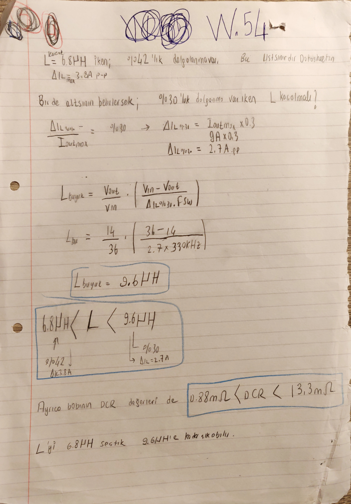
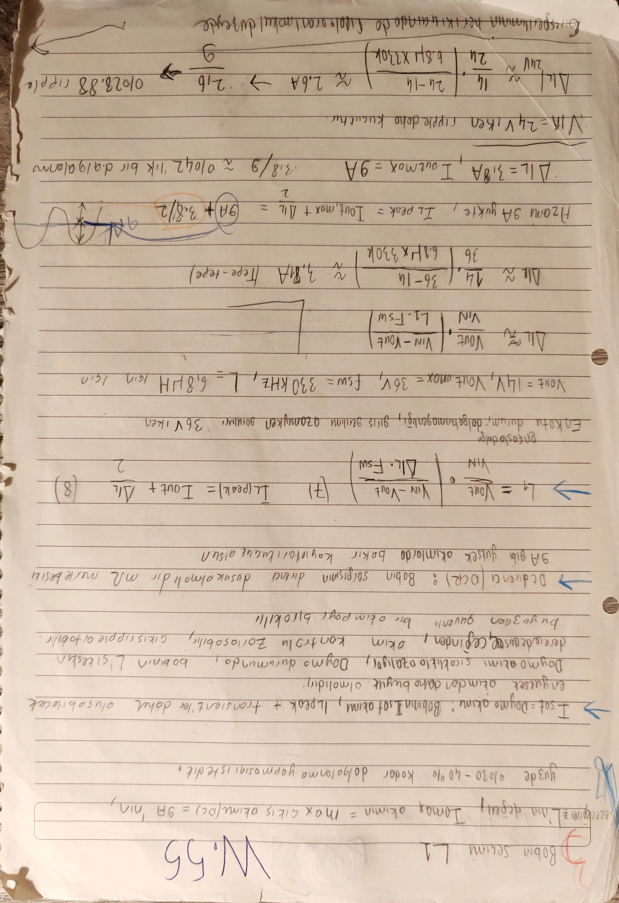

# Bobin ve Çıkış Kapasitörleri

Bu dosya, güç katının çıkış filtresi tarafını tek owner altında toplar: `L1` bobini, bobin ripple'ı, tepe/doyma akımı, `DCR`, çıkış kapasitör bankı, `Zout(fc)`, `Zout(fsw)`, steady-state ripple, load-step overshoot/undershoot ve kontrol plant'ine giden `L/C/ESR` handoff burada yaşar.

[README özetine dön](README.md)

## Bu Dosyanın Amacı

Bu dosyanın işi iki komponent ailesini koparmadan düzenlemektir:

- bobin seçimi: `L`, ripple, `I_L,peak`, `I_sat`, `DCR`, copper loss ve alternatif bobin izi,
- çıkış kapasiteleri: fiziksel / etkin `Cout`, ripple, transient pencere, `ESR/ESL`, output bulk kararı, energy buffer rolü ve plant handoff.

[Güncel Omurga] `L = 6.8 uH` ve derated-etkin ana `Cout ≈ 70 uF` bu owner'ın merkez hattıdır. Bu iki büyüklük kontrol / kompanzasyon tarafında yeniden komponent kararı gibi anlatılmayacak; [07_kontrolcu_ve_kompanzasyon.md](07_kontrolcu_ve_kompanzasyon.md) bu dosyadan gelen plant değerlerini kullanır.

## Kapsadığı Eski README Başlıkları

- `### 5.3 Bobin secimi`
- `#### 5.3.1 Cikis bobini`
- `#### 5.3.2 Slew-rate mantigi`
- `#### 5.3.3 Mevcut durum`
- `#### 5.3.4 Bu bolumde acik tuttugum maddeler`
- `### 5.4 Cikis kapasiteleri`
- `#### 5.4.1 Cikis sigaçlari`
- `#### 5.4.2 Bu iterasyondaki tasarim karari`
- `#### 5.4.3 Overshoot / Undershoot gerilimi ve acik-cevrim cikis impedance`
- `#### 5.4.4 Vripple ve fsw civarindaki Zout`
- `#### 5.4.5 Bulk kapasitör eklemenin getirdigi sifirlar`
- `#### 5.4.6 Slew-rate ve cikis kapasitörlerinin enerji tamponu rolu`
- `#### 5.4.7 Acik teknik dogrulamalar`

## Upstream / Downstream Okuma Bağlantıları

- Upstream global girdiler: [01_tasarim_girdileri_ve_kaynaklar.md](01_tasarim_girdileri_ve_kaynaklar.md)
- Upstream startup / `fsw` handoff: [02_startup_pin_programlama_ve_ortak_sabitler.md](02_startup_pin_programlama_ve_ortak_sabitler.md)
- Downstream giriş ağı: [04_giris_kapasitorleri_ve_giris_agi.md](04_giris_kapasitorleri_ve_giris_agi.md)
- Downstream kayıp / termal kapanış: [06_kayiplar_bootstrap_koruma_ve_termal_kapanis.md](06_kayiplar_bootstrap_koruma_ve_termal_kapanis.md)
- Downstream plant / kompanzasyon: [07_kontrolcu_ve_kompanzasyon.md](07_kontrolcu_ve_kompanzasyon.md)
- Downstream simülasyon: [09_simulasyon_gorseller_ve_acik_sorular.md](09_simulasyon_gorseller_ve_acik_sorular.md)

## Owner Notu

[Güncel Omurga] Bobin ve çıkış kapasitörleri birbirinden ayrı iki BOM satırı gibi değil, aynı output-filter zinciri gibi okunur. Bobin ripple'ı `Cout` alt sınırına girer; `Cout`, `ESR` ve `ESL` ise hem `Vout` ripple'ını hem load-step davranışını hem de kontrol plant'ini etkiler.

[Açık Kontrol] `L`, `DCR`, `Cout`, `ESR_Ceq`, `R_damp` ve `f0` başka dosyalarda uzun uzun yeniden sahiplenilmeyecek. Kontrol, EMI ve simülasyon dosyalarında bu değerlere kısa referans verilecek.

## Kullanılan Global Girdiler

Bu owner, aşağıdaki değerleri [01](01_tasarim_girdileri_ve_kaynaklar.md) ve [02](02_startup_pin_programlama_ve_ortak_sabitler.md) dosyalarından alır; burada yeniden türetmez.

| Girdi | Değer / rol |
|---|---:|
| Normal `Vin` aralığı | `24 V - 36 V` |
| `Vout` | `14 V` |
| `Iout,min` | `50 W / 14 V ≈ 3.571 A` |
| `Iout,max` | `125 W / 14 V ≈ 8.929 A`, hesaplarda pratik `9 A` |
| Load-step | `3.571 A -> 9 A`, fark `≈ 5.429 A` |
| `fsw` | `332 kHz` |
| `Tsw` | `≈ 3.01 us` |
| Statik `Vout` hedefi | `14 V ± 3%` |
| Transient `Vout` zarfı | `14 V ± 20%`; defterde daha sıkı `±10%` denemesi de var |
| Çıkış ripple hedefi | `100 mVpp` |
| Kontrol hedef hattı | `35 kHz` civarı crossover; primary owner [07](07_kontrolcu_ve_kompanzasyon.md) |

## Okuma Haritası

1. Önce `L1` bobininin neden `6.8 uH` seçildiği okunur.
2. Sonra bu bobinden gelen `ΔI_L` değerinin `Cout` hesabına nasıl girdiği takip edilir.
3. Çıkış kapasitörleri `Zout(fc)` ve `Zout(fsw)` olarak iki ayrı frekans penceresinde okunur.
4. Steady-state ripple ile load-step overshoot/undershoot aynı denklemde eritilmez.
5. Çıkış bulk kararı, sadece enerji değil plant ve kompanzasyon kararı olarak tutulur.
6. En sonda kontrol plant'ine giden `L/C/ESR/DCR/Rdamp/f0` handoff netlenir.

## Bobin Seçimi

[Güncel Omurga] Güncel aday bobin `L1 = 6.8 uH` hattıdır. Bu seçim, `W.54-W.56` defter zinciri, gerçek Würth parça izi ve calculator / WEBENCH çapraz teyitleriyle desteklenir.

| Konu | Bu owner'daki okuma |
|---|---:|
| Ana indüktans | `L_F = 6.8 uH` |
| Alternatif iz | `9.6 uH`, daha düşük ripple / daha yavaş transient alternatifi |
| En kötü ripple kontrolü | `Vin = 36 V` tarafında yaklaşık `3.8 A_p-p` |
| Nominal / düşük giriş ripple izi | `Vin = 24 V` tarafında yaklaşık `2.6 A_p-p` |
| Tepe akım | `I_L,peak ≈ 10.9 A` |
| Seçilen bobin doyma akımı | `I_sat ≈ 36.3 A` |
| Seçilen bobin `DCR` | `≈ 0.88 mOhm` |
| Bakır kaybı izi | `9^2 * 0.88 mOhm ≈ 0.071 W` |
| BOM izi | [BOM/L1_Wurth_Elektronik_7443640680B_7443640680B.pdf](BOM/L1_Wurth_Elektronik_7443640680B_7443640680B.pdf) |

### `W.54`: `6.8 uH` Seçimi ve `9.6 uH` Alternatif İzi

[Tasarım İzi] `W.54`, `6.8 uH` seçiminin keyfi olmadığını gösteren ilk defter sayfasıdır. Aynı sayfada daha düşük ripple için `9.6 uH` üst taraf alternatifi korunur.




Sayfada kullanılan ilişki:

```text
L = (Vout / Vin) * (Vin - Vout) / (Delta_IL * fsw)
```

Defter yerleştirmesi:

| Büyüklük | Değer |
|---|---:|
| `Vout` | `14 V` |
| `Vin` | `36 V` |
| `Delta_IL` | `≈ 2.7 A_p-p` |
| `fsw` | `≈ 330 kHz` |
| Üst taraftaki alternatif | `L_ust ≈ 9.6 uH` |

Defterde kutulanan aralık:

```text
6.8 uH < L < 9.6 uH
0.88 mOhm < DCR < 13.3 mOhm
```

[Tasarım İzi] `W.54` defter yazısının metne alınmış okuması:

- `L = 6.8 uH` iken yaklaşık `%42` ripple olduğu not edilmiştir; bu taraf datasheet/hesap üst sınırı gibi okunur.
- `%30` ripple hedefiyle alt ripple tarafı yeniden düşünülür: `Delta_IL,%30 = Iout,max * 0.3`.
- `Iout,max ≈ 9 A` için `Delta_IL,%30 = 9 A * 0.3 = 2.7 A_p-p`.
- `L_buyuk = (Vout / Vin) * ((Vin - Vout) / (Delta_IL,%30 * fsw))` ilişkisi kullanılır.
- `Vin = 36 V`, `Vout = 14 V`, `fsw ≈ 330 kHz`, `Delta_IL = 2.7 A_p-p` ile `L_buyuk ≈ 9.6 uH` bulunur.
- Sayfa, `6.8 uH < L < 9.6 uH` aralığını kutular.
- Sol tarafta `6.8 uH -> %42 -> Delta_IL ≈ 3.8 A`, sağ tarafta `9.6 uH -> %30 -> Delta_IL ≈ 2.7 A` karşılaştırması korunur.
- DCR için kutuda `0.88 mOhm < DCR < 13.3 mOhm` okunur.
- Son not: `L` için `6.8 uH` seçildi; `9.6 uH` değerine kadar çıkılabilir.

[Açık Kontrol] Önceki kısa kırpım okumasında DCR alt sınırı `0.38 mOhm` gibi yazılmıştı. Tam sayfa p016 üzerinde bu satır `0.88 mOhm` olarak okunur ve seçilen bobinin `DCR ≈ 0.88 mOhm` değeriyle uyumludur. Bu nedenle aralık burada `0.88 mOhm < DCR < 13.3 mOhm` olarak görünürleştirildi.

Bu aralık, `6.8 uH` seçimini "ana güncel aday", `9.6 uH` değerini ise daha düşük ripple ama daha yavaş akım cevabı veren alternatif iz olarak tutar.

### `W.55`: Ripple, Tepe Akım ve Doyma Marjı

[Güncel Omurga] `W.55`, bobin seçimindeki ana kriterleri daha açık kurar: ripple oranı, `I_L,peak`, `I_sat` ve `DCR`.




[Tasarım İzi] `W.55` defter yazısının metne alınmış okuması:

- Seçilecek `L` değeri, maksimum çıkış akımı olan `9 A` civarında yaklaşık `%30-%40` ripple verecek şekilde düşünülür.
- `I_sat`, bobinin doyma akımıdır; `I_L,peak` ve transientler dahil oluşabilecek en yüksek akımdan büyük olmalıdır.
- Doyma akımı sıcaklıkla azalır; doyma durumunda bobinin `L` değeri keskin biçimde düşebileceği için akım kontrolü zorlaşabilir ve çıkış ripple'ı artabilir.
- Bu nedenle güvenli bir oturma payı bırakılması gerektiği not edilir.
- `DCR`, bobin sargısının direncidir; mOhm mertebesinde düşük olmalıdır.
- `9 A` gibi yüksek akımlarda bakır kayıplarının küçük kalması için düşük `DCR` istenir.
- Kullanılan ilişkiler: `L1 = (Vout / Vin) * ((Vin - Vout) / (Delta_IL * fsw))` ve `I_L(peak) = Iout + Delta_IL / 2`.
- En kötü ripple durumu giriş gerilimi azami iken, yani `Vin = 36 V` tarafında görülür.
- `Vout = 14 V`, `Vin,max = 36 V`, `fsw = 330 kHz`, `L = 6.8 uH` için `Delta_IL ≈ 3.8 A_p-p` bulunur.
- Azami `9 A` yükte `I_L,peak = Iout,max + Delta_IL/2 = 9 A + 3.8 A/2` olarak kurulur.
- `Delta_IL / Iout,max = 3.8 / 9 ≈ 0.42`, yani yaklaşık `%42` ripple not edilir.
- `Vin = 24 V` iken ripple daha küçüktür: `Delta_IL ≈ 2.6 A_p-p`, `2.6 / 9 ≈ %28.88`.

Temel ilişkiler:

```text
L1 = (Vout / Vin) * (Vin - Vout) / (Delta_IL * fsw)
I_L,peak = Iout + Delta_IL / 2
```

`Vin = 36 V`, `Vout = 14 V`, `fsw ≈ 330 kHz`, `L = 6.8 uH` için:

```text
Delta_IL,36V ≈ 3.8 A_p-p
I_L,peak ≈ 9 A + 3.8 A / 2 ≈ 10.9 A
Delta_IL / Iout,max ≈ 3.8 / 9 ≈ 0.42
```

`Vin = 24 V` için defterde daha küçük ripple notu korunur:

```text
Delta_IL,24V ≈ 2.6 A_p-p
Delta_IL / Iout,max ≈ 28.9%
```

Bu sayfada `36 V` en kötü ripple tarafı olarak okunur; buck'ta giriş arttıkça bobin ripple'ı büyür.

### `W.56`: Gerçek Bobin, `Isat`, `DCR` ve Bakır Kaybı

[Güncel Omurga] `W.56`, defterdeki soyut kriteri gerçek bobin parçasına bağlar.


Okunan ana değerler:

```text
I_L,peak ≈ 9 A + 1.9 A ≈ 10.9 A
I_sat ≈ 36.3 A
DCR ≈ 0.88 mOhm
P_bakir ≈ I^2 * R_DCR ≈ 9^2 * 0.88 mOhm ≈ 0.071 W
```

`I_sat` ile rated / RMS current aynı şey gibi okunmayacak. `36.3 A` doyma marjı için rahat görünür; bobinin rated RMS akımı, sıcaklık artışı, DCR toleransı ve PCB üzerindeki termal yol [06](06_kayiplar_bootstrap_koruma_ve_termal_kapanis.md) tarafında kapanacak.

### Bobin Çapraz Teyitleri

[Çapraz Teyit] `LM5146_quickstart_calculator_revB1.xlsm` bobin tarafında şu checkpoint'i verir:

| Calculator satırı | Değer / okuma |
|---|---:|
| Önerilen `L_O` | `≈ 7.504 uH` |
| Seçilen `L_O` | `6.8 uH` |
| `DCR` | `0.88 mOhm` |
| Nominal ripple | `≈ 3.373 A_p-p` |

`WEBENCH` operating-values snapshot'ında bobin akımı için:

```text
I_L,pp = 3.805 A
ripple ratio = 42.277%
```

Bu, `W.55` tarafındaki `3.8 A_p-p` ve `3.8 / 9 ≈ 0.42` hesabıyla aynı yöndedir. `WEBENCH` sonucu nihai doğrulama değil, bobin owner'ı altında çapraz teyittir.

### Bobin Slew-rate Etkisi

[Tasarım İzi] Bobin seçimi sadece ripple hesabı değildir. `L` büyüdükçe ripple azalır; fakat yük adımında bobin akımının yetişme hızı da azalır.

Temel fizik:

```text
dI_L / dt ≈ V_L / L
```

Bu nedenle bobin seçimi iki kapıyı aynı anda etkiler:

- steady-state ripple akımı,
- load-step sırasında `Cout` tarafından taşınacak geçici fark akımı.

Gerçek devrede MOSFET `RDS(on)`, bobin `DCR`, layout direnci ve diğer kayıplar ideal slew-rate'i azaltabilir. Bu not, çıkış kapasitörü energy-buffer bölümüne bağlanır.

## Çıkış Kapasitörü Owner

[Güncel Omurga] Çıkış kapasiteleri bu projede "kaç uF koydum?" sorusu değildir. Aynı anda üç rol taşır:

- `Vout` ripple için `f_sw` civarındaki `Zout`,
- load-step sırasında `Zout(f_c)` ve energy-buffer davranışı,
- `ESR/ESL/bulk` seçiminin plant ve kompanzasyon üzerindeki etkisi.

5.3'ten gelen ana girdiler:

```text
L = 6.8 uH
Delta_IL ≈ 3.8 A_p-p
alternatif iz: L = 9.6 uH -> Delta_IL ≈ 2.7 A_p-p
```

### Cout Owner Özeti

| Konu | Bu owner'daki karar / iz |
|---|---|
| Statik `Vout` window | `14 V ± 3%`; WEBENCH `Vout Actual = 13.8 V` bu zarf içinde |
| Transient `Vout` window | `14 V ± 20%`; defterde `±10%` denemesi de korunur |
| Steady-state ripple window | `100 mVpp`; WEBENCH `Vout p-p = 122.002 mV` `[Açık Kontrol]` |
| Fiziksel / etkin kapasite dili | EVM izi `5 x 22 uF` MLCC + `C28 = 0.1 uF`; plant hesabında derated-etkin ana `Cout ≈ 70 uF` |
| Minimum `Cout`, ripple | `W.34` yaklaşık `14.57 uF`; `W.58` ile `6.8 uH / 3.8 A_p-p -> ≈14 uF`, `9.6 uH / 2.7 A_p-p -> ≈10 uF` |
| Minimum `Cout`, transient | `W.37/W.59` yaklaşık `2.3 uF`; daha sıkı `±10%` denemede `≈4.86 uF` |
| `Zout(fc)` | Load-step overshoot/undershoot ve `35 kHz` civarı crossover ile ilişkilidir |
| `Zout(fsw)` | Steady-state ripple, `332 kHz`, `Delta_IL` ve MLCC `ESR/ESL` ile ilişkilidir |
| Output bulk kararı | Bu iterasyonda ana yol MLCC ağı; bulk eklenirse plant ve kompanzasyon yeniden açılır |
| Energy buffer | Load-step sırasında ilk fark akımı `Cout` tarafından taşınır |

## Fiziksel ve Etkin `Cout` Dili

[Güncel Omurga] EVM fiziksel bankı ile plant hesabındaki etkin kapasite aynı cümlede ama aynı anlamda değildir.


Bu fotoğraf, çıkış tarafında `C18-C22 = 22 uF` MLCC grubunu ve paralel `C28 = 0.1 uF` yardımcı kapasitörü gösterir.


ODT görseli aynı kararın şema izidir. `C28 = 0.1 uF`, ilk `H_filter(s)` hesabında ana enerji depolama elemanı gibi sayılmaz; yüksek frekanslı spike / ringing tarafında yardımcı rol olarak tutulur.


Bu görsel, çıkış LC filtresinin yükle birlikte okunduğu temel topolojiyi gösterir. Kontrol plant'i burada başlar, fakat plant hesaplarının komponent owner'ı yine bu dosyadır.

### `W.116`: Output Filter Parametre Özeti

[Güncel Omurga] `W.116`, fiziksel MLCC bankı, `C28 = 0.1 uF`, etkin `70 uF`, `ESR_Ceq`, `DCR`, `R_damp` ve `f0` notlarını aynı sayfada topladığı için bu owner'da kritik handoff sayfasıdır.


Okunan ana notlar:

| Büyüklük | Okuma |
|---|---:|
| Fiziksel parça izi | `C10-C22` grubu ve `22 uF` notları |
| Yardımcı küçük kapasitör | `C28 = 0.1 uF` |
| Plant hesabındaki etkin ana kapasite | `Cout ≈ 70 uF` |
| Output MLCC ESR izi | `ESR_Ceq ≈ 1.3 mOhm` |
| Bobin girdisi | `L_F = 6.8 uH`, `DCR ≈ 0.88 mOhm` |
| Plant damping izi | `R_damp ≈ 21.13 mOhm` |
| Output filter doğal frekans izi | `f0 ≈ 7.309 kHz` |


[Açık Kontrol - ESR farkı] Aynı owner altında üç ESR izi yan yana tutulur:

| İz | Değer |
|---|---:|
| Quickstart toplam `ESR` | `≈ 0.28 mOhm` |
| Kontrol transfer fonksiyonu yerleştirmesi | `≈ 0.26 mOhm` |
| `W.116` / MLCC ESR ekranları | `ESR_Ceq ≈ 1.3 mOhm` |

Bu değerler sessizce tek sayıya birleştirilmeyecek. Final BOM/derating ve AC/switching simülasyonda hangi `ESR_Ceq` kullanılıyorsa plant tablosu onunla kapanacak.

## Çıkış Kapasitörlerinin Rolü

[Tasarım İzi] ODT ve defter izlerinde çıkış kapasitörleri iki temel görevle anlatılır:

- ani yük geçişlerinde enerji tamponu olmak,
- çıkış empedansını düşürerek ripple ve transient gerilim sapmasını azaltmak.

### `W.42`: Bobin ve Kapasitörün Fiziksel Rolü


Bu sayfadaki iki temel ilişki:

```text
V_L = L * di_L/dt
E_C = 1/2 * C * V^2
```

Bobin akımı bir anda değiştirmek istemez; kapasitör gerilimi bir anda değiştirmek istemez. Bu yüzden ripple ve transient iki ayrı kontrol kapısıdır:

- ripple: `Delta_IL` ve `Zout(fsw)`,
- transient: load-step fark akımı, bobin `di/dt` sınırı ve `Cout` energy buffer.

### `W.46`, `W.57`, `W.72`: Gerçek Kapasitör Modeli


`W.46`, kapasitör seçiminin yalnız `uF` olmadığını hatırlatır: power loss, boyut, lifetime, regulation kalitesi, hız, kararlılık, bandwidth ve load transient response birlikte düşünülür.


`W.57`, paralel MLCC bankının toplam `C` değerini artırdığını ve etkin `ESR`'yi düşürdüğünü söyler; aynı zamanda MLCC'lerin DC-bias altında katalogdaki `22 uF` değerinden ciddi şekilde düşebileceğini not eder. Defterdeki `2 x 22 uF` notu güncel `5 x 22 uF` fiziksel bankın tam karşılığı değil; MLCC derating sezgisinin eski örneğidir.


`W.72` gerçek kapasitör modelini açık eder:

```text
Z = (Z_C || Z_Rleak) + Z_ESL + Z_ESR
Z ≈ Z_C + Z_ESL + Z_ESR
```

Burada `C` ve DC-bias etkin enerji/ripple kapasitesini, `ESR` ripple ve ESR-zero tarafını, `ESL` ise spike/ringing ve layout tarafını etkiler.

## `Zout(fc)` ve `Zout(fsw)` Ayrımı

[Güncel Omurga] Bu owner'da `Zout` tek nokta değildir. `Zout(fc)` load-step ve overshoot/undershoot tarafına, `Zout(fsw)` steady-state switching ripple tarafına aittir.

### Overshoot / Undershoot ve `Zout(fc)`

ODT izindeki ana ilişki:

```text
Delta_Vout ≈ Delta_Iload * |Zout(fc)|
```

Burada `fc`, [07](07_kontrolcu_ve_kompanzasyon.md) tarafında yaklaşık `35 kHz` olarak hedeflenen crossover bölgesidir. `fc` rastgele artırılacak bir düğme gibi okunmaz; faz marjı, giriş filtresi ve kompanzasyonla birlikte kapanır.


### Steady-state Ripple ve `Zout(fsw)`

ODT izindeki ana ilişki:

```text
V_ripple = I_L(p-p) * Z_OUT(fsw)
```

Bu satır steady-state anahtarlama ripple'ı içindir. Load-step undershoot/overshoot veya hızlı spike/ringing bu tek ripple sayısının içine saklanmayacak.

### `W.68-W.71`: İki Zout Penceresinin Defter Özeti


`W.68` iki ilişkiyi aynı sayfada ayırır:

```text
Vout,undershoot ≈ Delta_Iout * |Zout(fc)|
V_ripple ≈ I_L(p-p) * |Zout(fsw)|
```


`W.69`, ideal kapasitör sezgisini verir:

```text
Z_C(f) = 1 / (2*pi*f*C)
```

Bu tek başına `332 kHz` civarındaki gerçek `Zout(fsw)` değildir; `ESR`, `ESL`, DC-bias ve layout ile birlikte okunur.


`W.70`, kapasitif ripple bileşenine geçişi gösterir:

```text
Delta_Q = C * Delta_V
Delta_V ≈ Delta_IL * T_switch / (8*C)
C ≈ Delta_IL * T_switch / (8*Delta_V)
```


`W.71`, bu ayrımı kısa özetler: `fc` civarı `undershoot/overshoot`, `fsw` civarı `V_ripple`.

## Steady-state Ripple ve Minimum `Cout`

[Güncel Omurga] Bu iterasyonda çıkış kapasitesini zorlayan ilk alt sınır ripple tarafıdır. Transient minimum `Cout` hesapları korunur, fakat defterde ripple tarafı daha baskın görünür.

### `W.28`: Eski / Alternatif İlk İterasyon


[Eski İterasyon] `W.28`, `2 x 22 uF` ve `~2 mOhm ESR` benzeri eski / alternatif bir çıkış bankı varsayımıdır. Güncel `70 uF` etkin `Cout` kararının yerine geçmez; ripple alt-sınırı düşüncesinin erken izi olarak tutulur.

### `W.34` ve `W.58`: Ripple Tabanlı Alt Sınır


`W.34`, `fsw = 332 kHz`, `Delta_IL ≈ 3.8 A`, `Delta_Vout = 0.1 V` ve `R_ESR = 5 mOhm` varsayımıyla yaklaşık:

```text
Cout >= 14.57 uF
```


`W.58`, aynı ripple alt sınırını iki bobin ripple senaryosu için karşılaştırır:

```text
Cout >> Delta_IL / (8*fsw*sqrt(Delta_Vout^2 - (R_ESR*Delta_IL)^2))
```

| Bobin / ripple senaryosu | Minimum `Cout` izi |
|---|---:|
| `L = 6.8 uH`, `Delta_IL ≈ 3.8 A_p-p` | `Cout >> 14 uF` |
| `L = 9.6 uH`, `Delta_IL ≈ 2.7 A_p-p` | `Cout >> 10 uF` |

Bu iki satır, W.54-W.56 bobin zinciriyle W.58 Cout hesabını doğrudan bağlar.

### `W.93`: Kapasitif Ripple Bileşeni


`W.93`, kapasitif bileşeni kısa yazar:

```text
Delta_Vout(C) ≈ Ipp / (8*fsw*Cout)
Ipp = Delta_IL(p-p)
```

Bu sayfa yeni final `Cout` sonucu vermez; `Delta_IL = 3.8 A` ve `2.7 A` senaryolarının ripple hesabına nasıl girdiğini teyit eder.

### Calculator ve WEBENCH Ripple Teyitleri

[Çapraz Teyit] `LM5146_quickstart_calculator_revB1.xlsm` çıkış kapasitörü için:

| Satır | Değer |
|---|---:|
| Minimum ideal `COUT` | `≈ 12.699 uF` |
| Toplam derated `COUT` | `≈ 70 uF` |
| Toplam `ESR` | `≈ 0.28 mOhm` |
| Hesaplanan ripple | `≈ 18.17 mVpp` |

[Açık Kontrol] `WEBENCH` snapshot'ında `Vout Actual = 13.8 V`, statik `14 V ± 3%` zarfındadır; fakat `Vout p-p = 122.002 mV` olarak okunur ve `100 mVpp` hedefinin biraz üstündedir. Bu, aynı ölçüm penceresiyle LTspice/PSpice tarafında yeniden kontrol edilmeden final kabul değildir.

## Overshoot / Undershoot ve Transient `Cout`

[Güncel Omurga] Load-step tarafında kullanılan ana adım:

```text
3.571 A -> 9 A
I_step ≈ 5.429 A
```

### `W.37` ve `W.59`: Transient Tabanlı Minimum `Cout`


`W.37`, load-step / overshoot sınırından minimum `Cout` kontrolünün erken defter izidir. Bu sonuç ripple tabanlı alt sınırdan daha gevşek görünür.


`W.59` daha açık formülle aynı konuyu tekrar kurar:

```text
Cout >> L_F * Delta_Iout^2 / ((Vout + Delta_Vovershoot)^2 - Vout^2)
```

Defterdeki load-step:

```text
9 A -> 3.571 A
I_step ≈ 9 - 3.571 = 5.429 A
```

İki transient zarfı korunur:

| Transient zarf | `Delta_Vovershoot` | Minimum `Cout` izi |
|---|---:|---:|
| `14 V ± 20%` | `2.8 V` | `Cout >> 2.3 uF` |
| `14 V ± 10%` | `1.4 V` | `Cout >> 4.86 uF` |

[Tasarım İzi] `W.58-W.59` birlikte okununca, bu iterasyonda çıkış kapasitesini baskın belirleyen tarafın ripple olduğu görülür. Bu, load-step'in kapandığı anlamına gelmez; gerçek transient cevap `Zout(fc)`, loop bandwidth, bobin `di/dt`, MLCC `ESR/ESL` ve simülasyon dalga şekliyle kapanır.

## Output Bulk Kararı

[Güncel Omurga] Bu iterasyonda çıkış tarafında ana yol MLCC ağıdır; output bulk varsayılan ana karar değildir. Bu, "bulk kesinlikle kullanılmaz" anlamına gelmez.

ODT izindeki karar mantığı:

- MLCC ağı ripple ve transient gereksinimini karşılıyorsa, çıkışa ek bulk koymadan kontrol tasarımını sade tutmak tercih edilir.
- Eğer derated `Cout`, ripple veya load-step simülasyonu yetersiz kalırsa output bulk yeniden açılır.
- Output bulk eklenirse yalnız enerji değil, `Zout` eğrisi, bulk `ESR` sıfırı, damping ve kompanzasyon yeniden değerlendirilir.

Bu karar yalnız çıkış tarafına aittir. Giriş bulk'u [04](04_giris_kapasitorleri_ve_giris_agi.md) dosyasında kaynak ripple'ı, hot-loop, EMI ve transient enerji rezervi bağlamında ayrı owner altında değerlendirilir.

## Slew-rate ve Energy Buffer Rolü

[Tasarım İzi] Load-step anında kontrol döngüsü hemen yetemez, bobin akımı sonsuz hızla artamaz ve ilk fark akımı çıkış kapasitörlerinden gelir.

### G71 / ODT Transient İzleri


G71 notunda `t1`, `Vout` minimum noktasına ve `t_undershoot` sonuna karşılık gelen kavramsal andır. Matematiksel okuma:

```text
dVout/dt = 0
```

Bu anda bobin akımı o anki yük talebini karşılamaya yaklaşmıştır.


ODT metninden korunan ana fizik:

```text
dI_L/dt ≈ V_L / L
I_C = I_load - I_L
Cout * dVout/dt = -I_C
```

Yani feedback duty'yi artırsa bile bobin akımı sonlu eğimle yükselir; aradaki farkı ilk anda `Cout` taşır.


Bu iki foto proje-özel final veri değil; load-step ve slew-rate gereksinimlerinin neden output capacitor energy-buffer rolünü önemli hale getirdiğini gösteren arka-plan izidir.

### `W.98`: Defterdeki Slew-rate Örneği


`W.98` proje-özel `24-36 V / 14 V` hesabı değil; fakat fizik nettir:

```text
di_L/dt = V_L / L
```

Örnek değerler:

| Örnek büyüklük | Değer |
|---|---:|
| `Vin` | `5 V` |
| `Vout` | `2 V` |
| `L` | `1 uH` |
| `R_ESR` | `10 mOhm` |
| `Delta_I` | `6 A` |
| `t_loop` | `2 us` |
| Örnek slew-rate | `(5 - 2) / 1 uH = 3 A/us` |

[Tasarım İzi] Bu örnek güncel proje sayısı değildir; fakat `Cout` energy-buffer rolünü anlatan doğru fiziksel izdir.

## Plant / Control Handoff

[Güncel Omurga] [07](07_kontrolcu_ve_kompanzasyon.md) dosyasına gidecek komponent değerleri burada sahiplenilir.

| Plant girdisi | Owner okuması |
|---|---:|
| `L_F` | `6.8 uH` |
| Bobin `DCR` | `≈ 0.88 mOhm` |
| Etkin ana `Cout` | `≈ 70 uF` |
| `C28` | `0.1 uF`, ana enerji hesabında değil; yüksek frekans yardımcı rol |
| `ESR_Ceq` | açık kontrol: `0.28 mOhm`, `0.26 mOhm`, `1.3 mOhm` izleri ayrıştırılacak |
| `R_damp` | `≈ 21.13 mOhm`, plant izi |
| `f0` | `≈ 7.309 kHz`, W.116 / plant izi |

### `W.60-W.66`: Q, `Gvd(s)` ve `Zout` Tasarım İzleri

[Tasarım İzi] `W.60-W.66` zinciri, çıkış kapasitörünü yalnız minimum `uF` hesabı değil, LC filtre `Q`, `Gvd(s)` ve `Zout` eğrisi üzerinden de düşündüğümü gösterir. Bu sayfaların bazı sayıları harici / eski örneklerdir; güncel BOM satırı gibi okunmayacak.


`W.60` örnek zinciri:

```text
Q_load = R / sqrt(L/C)
Q_loss ≈ sqrt(L/C) / R_kayip,toplam
Q = Q_loss || Q_load
```

Örnek sayılar: `L = 1 uH`, `C = 200 uF`, kayıp dirençleri `0.8 mOhm + 30 mOhm`, `Q_loss ≈ 2.3`, `R = 0.36 Ohm`, `Q_load ≈ 5.09`, toplam `Q ≈ 1.55`.


`W.61`, aynı `Q` fikrini yük uçlarında dener:

| Durum | İz |
|---|---:|
| Çok hafif yük | `Q_load ≈ 25465`, `Q ≈ 2.299` |
| Ağır yük örneği | `R = 9 mOhm`, `Q_load ≈ 0.127`, `Q ≈ 0.1206` |


`W.62`, `R_damp`, `omega_0`, `Q` ve `Gvd(s)` arasındaki bağı kurar:

```text
R_damp = D*RDS(on),HS + (1-D)*RDS(on),LS + R_DCR
Gvd(s) = Vg * (1 + s/omega_ESR) /
         (1 + (1/Q)*(s/omega_0) + (s/omega_0)^2)
omega_0 ≈ 1 / sqrt(L_F*Cout)
```

Sayfa altındaki `Q ≈ 2.2999`, `1.584`, `0.1206` değerleri yük durumuna bağlı tasarım izidir.


`W.63` iki parçalı okunur:

- proje için faydalı özet: buck akımı `0 A - 5 A` arasında değişirken `Q ≈ 2.2999 - 1.584`,
- harici / karşılaştırma izi: `Cout = 180 uF`, `L = 9 uH`, derated notu ve `f0 ≈ 4 kHz`.


`W.64` harici örnek olarak tutulur:

```text
L = 1 uH
C = 200 uF
f0 ≈ 11 kHz
f_ESR ≈ 1 MHz
fs = 1 MHz
Q = 2.3
```


`W.65`, aynı harici örnekte `Zout` sezgisini çizer: `L = 1 uH`, `R_L ≈ 30 mOhm`, `C = 200 uF`, `R_ESR ≈ 0.8 mOhm`, `f0 ≈ 11 kHz`, `f_ESR ≈ 1 MHz` ve `~4.7 kHz` civarı bobin kolu notu.


`W.66`, `Zout` parça empedanslarından nasıl kuruluyor sorusunu daha formel yazar:

```text
f_ESR = 1 / (2*pi*R_ESR*C) ≈ 1 MHz
R_L = omega*L -> f2 = R_L / (2*pi*L) ≈ 4.7 kHz
Zout = Z0 || Zb
f0 ≈ 1 / (2*pi*sqrt(L_F*Cout)) ≈ 11.25 kHz
```

[Eski İterasyon] `W.64-W.66` içindeki `1 uH / 200 uF` örneği güncel `6.8 uH / 70 uF` plant'i değildir. Burada korunmasının nedeni, `Zout`, `f0`, `f_ESR` ve `Q` düşüncesine giden tasarım izini kaybetmemektir.

## Seçim Durumu

[Güncel Omurga] Bu dosyada şu kararlar çalışma omurgasıdır:

| Karar | Durum |
|---|---|
| Bobin | `6.8 uH`, `DCR ≈ 0.88 mOhm`, `I_sat ≈ 36.3 A` seçilmiş aday |
| Alternatif bobin izi | `9.6 uH`, daha düşük ripple fakat daha yavaş transient |
| Çıkış kapasitesi | derated-etkin `Cout ≈ 70 uF` |
| Fiziksel output bank | EVM izi `5 x 22 uF` MLCC + `C28 = 0.1 uF` |
| Output bulk | bu iterasyonda varsayılan değil; gerekirse simülasyon sonrası yeniden açılır |
| Kontrol handoff | `L/C/ESR/DCR/Rdamp/f0` sayıları buradan [07](07_kontrolcu_ve_kompanzasyon.md) dosyasına gider |

## Açık Teknik Doğrulamalar

[Açık Kontrol] Bu owner kapanmış final donanım doğrulaması değildir. Sonraki turda aşağıdaki maddeler aynı BOM ve aynı simülasyon revizyonu üzerinde kapatılmalıdır:

- `6.8 uH` bobin için LTspice / PSpice steady-state ripple sonucu,
- bobin RMS akımı, DCR toleransı ve sıcaklık artışı,
- `DCR = 0.88 mOhm` ile bakır kaybının gerçek termal etkisi,
- `3.571 A -> 9 A` load-step sırasında bobin `di/dt` davranışı,
- `5.429 A` fark akımı altında `Cout` energy-buffer yeterliliği,
- derated `Cout ≈ 70 uF` değerinin gerçek seçilen MLCC bankı, DC-bias ve toleransla birebir eşleşmesi,
- `ESR_Ceq` için `0.28 mOhm / 0.26 mOhm / 1.3 mOhm` izlerinin tek final tabloya bağlanması,
- `C28 = 0.1 uF` yardımcı rolünün spike/ringing tarafında doğrulanması,
- `WEBENCH` tarafındaki `Vout p-p = 122.002 mV` açık kontrolünün LTspice/PSpice ölçüm penceresiyle yeniden bakılması,
- output bulk'suz yaklaşımın `100 mVpp` ripple ve `14 V ± 20%` transient zarfında kalıp kalmadığı,
- output bulk eklenirse plant sıfırları, `Zout` eğrisi ve kompanzasyonun yeniden açılması,
- G71 benzeri hızlı-yük yöntemlerinin bu tasarımda gerekli olup olmadığı.

## Owner Dışı Kısa Referanslar

- `fsw`, duty ailesi ve zaman alanı: [01](01_tasarim_girdileri_ve_kaynaklar.md) ve [02](02_startup_pin_programlama_ve_ortak_sabitler.md).
- Giriş MLCC / bulk / hot-loop / input filter: [04_giris_kapasitorleri_ve_giris_agi.md](04_giris_kapasitorleri_ve_giris_agi.md).
- Bobin, MOSFET, kapasitör ve kontrolcü termal kapanışı: [06_kayiplar_bootstrap_koruma_ve_termal_kapanis.md](06_kayiplar_bootstrap_koruma_ve_termal_kapanis.md).
- Feedback divider, plant transfer fonksiyonu ve Type-III kompanzasyon: [07_kontrolcu_ve_kompanzasyon.md](07_kontrolcu_ve_kompanzasyon.md).
- LTspice/PSpice ripple ve load-step doğrulama planı: [09_simulasyon_gorseller_ve_acik_sorular.md](09_simulasyon_gorseller_ve_acik_sorular.md).
