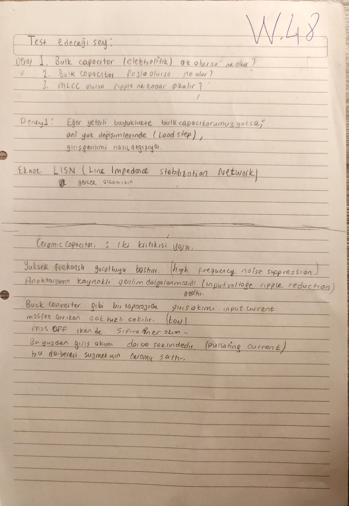
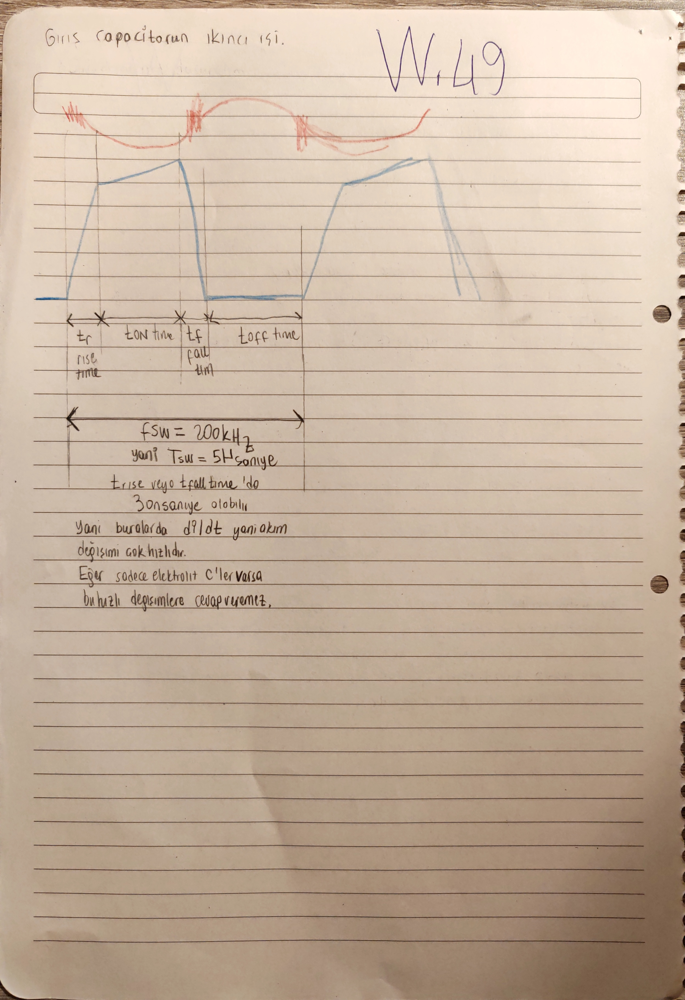
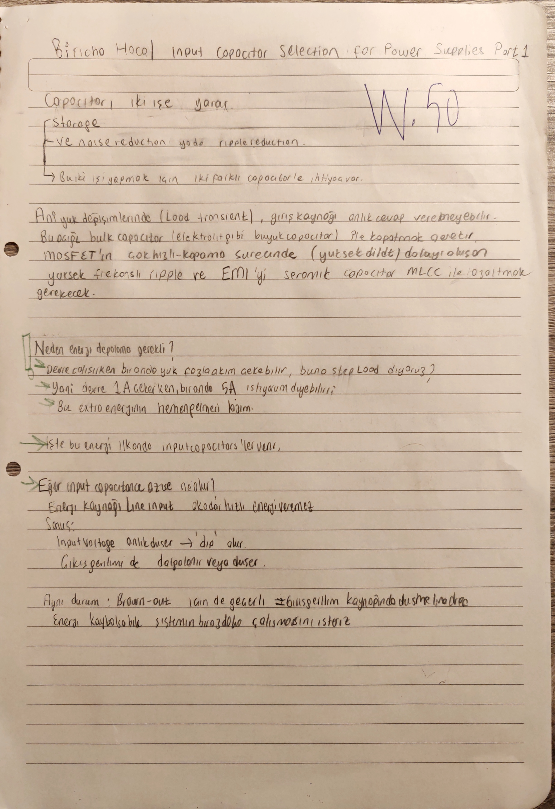
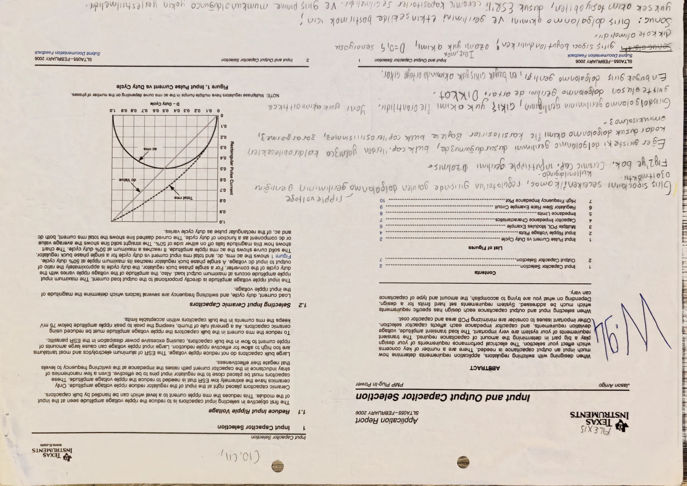
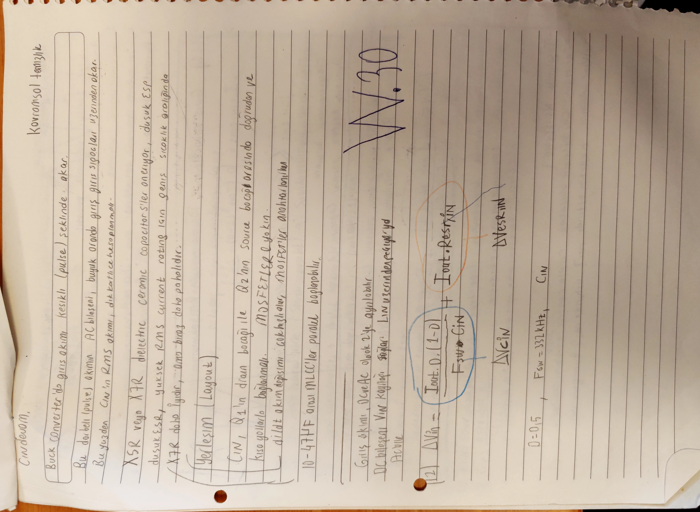
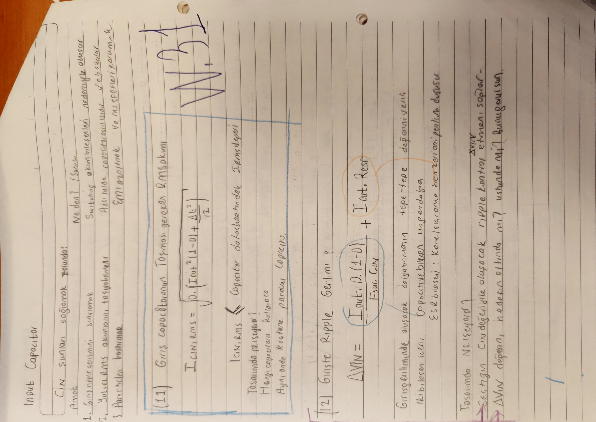
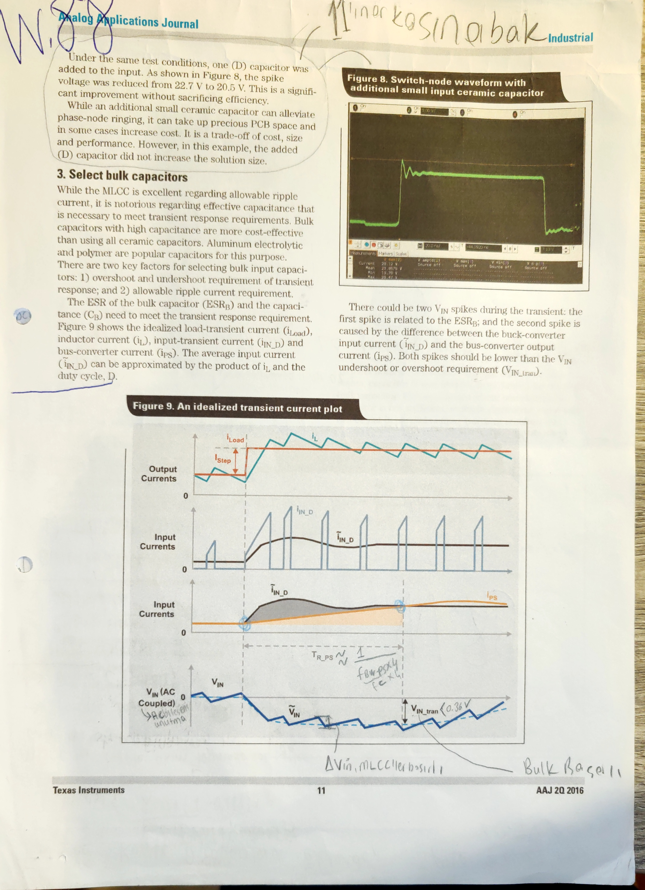
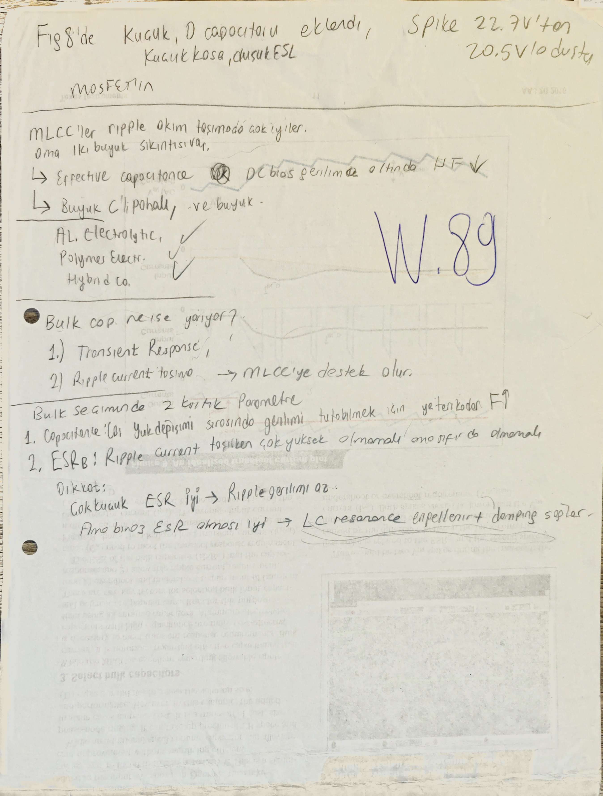
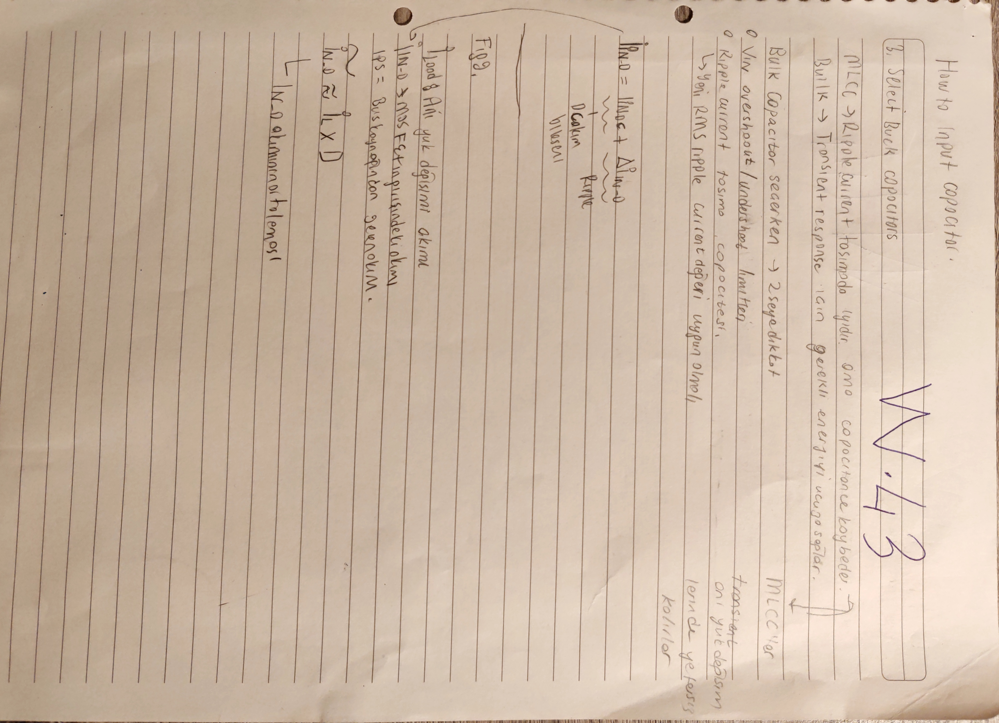

# Giriş Kapasitörleri ve Giriş Ağı

Bu dosya, buck katının girişten çektiği darbeli akımı karşılayan kapasitör ağının primary owner'ıdır. MLCC `Cin`, dc-bias, tolerans, voltage derating, RMS akımı, sıcaklık artışı, ESR, ESL, küçük yardımcı MLCC'ler, giriş bulk'u, transient enerji tamponu ve damping sezgisi burada birlikte okunur.

[README özetine dön](README.md)

## Bu Dosyanın Amacı

Bu dosya şu konuları tek giriş-kapasitörü akışı altında toplar:

- giriş sığaçlarının neden gerekli olduğu,
- eklenen giriş ripple / transient gereksinimleri,
- MLCC + helper MLCC + bulk genel stratejisi,
- minimum etkin `Cin` hesabı,
- katalog değeri ile dc-bias altındaki etkin değer ayrımı,
- RMS akımı ve giriş MLCC sıcaklık bakışı,
- ESL, küçük yardımcı MLCC ve hot-loop bypass mantığı,
- bulk seçimi, transient enerji tamponu ve damping sezgisi,
- EMI / input-filter tarafına kısa handoff.

[Güncel Omurga] Giriş kapasitörleri, çıkış kapasitörleri gibi kontrol plant'inin ana `LC` kutuplarını doğrudan belirlemez; ama hot-loop, `Vin` ripple, input transient, EMI filtresi, Middlebrook kararlılığı ve termal davranış üzerinden tasarımı etkiler. Bu yüzden burada primary owner `Cin` / giriş ağıdır; ana EMI hesabı [08_emi_giris_filtresi_ve_yerlesim.md](08_emi_giris_filtresi_ve_yerlesim.md) dosyasına gider.

## Kapsadığı Eski README Başlıkları

- `### 5.5 Giris kapasiteleri`
- `#### 5.5.1 Giris sigaçlari`
- `#### 5.5.2 Yeni eklenen giris gereksinimleri`
- `#### 5.5.3 Secilen genel strateji`
- `#### 5.5.4 MLCC Cin hesabi`
- `#### 5.5.5 RMS akimi ve termal bakis`
- `#### 5.5.6 ESL ve kucuk degerli yardimci MLCC'ler`
- `#### 5.5.7 Bulk kapasitör secimi mantigi`
- `#### 5.5.8 Acik teknik dogrulamalar`

## Upstream / Downstream Okuma Bağlantıları

- Upstream global girdiler: [01_tasarim_girdileri_ve_kaynaklar.md](01_tasarim_girdileri_ve_kaynaklar.md)
- Upstream startup / duty / timing referansı: [02_startup_pin_programlama_ve_ortak_sabitler.md](02_startup_pin_programlama_ve_ortak_sabitler.md)
- Upstream bobin ve çıkış filtresi: [03_bobin_ve_cikis_kapasitorleri.md](03_bobin_ve_cikis_kapasitorleri.md)
- Downstream kayıp / termal kapanış: [06_kayiplar_bootstrap_koruma_ve_termal_kapanis.md](06_kayiplar_bootstrap_koruma_ve_termal_kapanis.md)
- Downstream EMI / input filter / layout: [08_emi_giris_filtresi_ve_yerlesim.md](08_emi_giris_filtresi_ve_yerlesim.md)
- Downstream simülasyon ve açık sorular: [09_simulasyon_gorseller_ve_acik_sorular.md](09_simulasyon_gorseller_ve_acik_sorular.md)

## Owner Notu

[Güncel Omurga] MLCC `Cin` hesabı, dc-bias, tolerans, voltage derating, RMS akımı, ESR, ESL, helper MLCC'ler, giriş bulk'u, transient enerji tamponu ve damping sezgisi burada yaşar.

[Açık Kontrol] EMI / input-filter bölümü bu değerleri kullanabilir; ancak `Cin` komponent seçimini yeniden primary owner gibi anlatmayacak. EMI attenuation, LISN, filtre rezonansı, Middlebrook ve layout kapanışı [08](08_emi_giris_filtresi_ve_yerlesim.md) tarafında primary owner'dır.

## Kullanılan Global Girdiler

Bu dosya aşağıdaki değerleri [01](01_tasarim_girdileri_ve_kaynaklar.md) ve [02](02_startup_pin_programlama_ve_ortak_sabitler.md) dosyalarından alır; burada yeniden türetmez.

| Girdi | Değer / rol |
|---|---:|
| Normal `Vin` aralığı | `24 V - 36 V` |
| Survive-only input transient | `44 V`, `1 ms` |
| `Vout` | `14 V` |
| `Pout` | `50 W - 125 W` |
| `Iout,max` | pratik hesaplarda `9 A` |
| Load-step | `3.571 A -> 9 A`, fark `≈ 5.429 A` |
| `fsw` | `332 kHz` |
| `Tsw` | `≈ 3.01 us` |
| Minimum verim varsayımı | `eta ≈ 0.9` |
| İdeal duty ailesi | `0.389 / 0.583` |
| Korumacı duty ailesi | `0.432 / 0.648` |
| Pratik giriş-kap kontrol noktası | `D = 0.5` |
| İzin verilen `Vin` ripple | `0.24 Vpp` |
| İzin verilen `Vin` transient sapması | `0.36 V` |
| İdeal kaynak giriş akımı ripple hedefi | `50 mApp` |

[Tasarım İzi] `D = 0.5`, bu dosyada minimum `Cin` ve RMS akım için kullanılan pratik kontrol noktasıdır; global duty owner'ının yerine geçmez.

## Katalog Değeri ve Etkin Değer Dili

[Güncel Omurga] Bu dosyada her kapasitör satırı iki dille okunur:

| Dil | Anlam |
|---|---|
| Katalog / nominal değer | Parçanın datasheet üzerinde yazan `uF`, voltage rating, dielektrik ve paket bilgisi |
| Dc-bias altındaki etkin değer | `24-36 V` çalışma gerilimi, tolerans, sıcaklık ve gerçek frekans davranışı altında kalan kapasite |

Bu ayrım özellikle şu iki yerde kritiktir:

- `5 x 4.7 uF / 50 V / X7R` ana giriş MLCC grubu katalogda `23.5 uF` görünür; `36-37 V` dc-bias altında etkin toplam yaklaşık `8.2 uF` seviyesine iner.
- `2 x 47 uF / 50 V / X7R` bulk adayı katalogda `94 uF` görünür; `36.3 V` civarında etkin toplam yaklaşık `34 uF` olarak okunur.

Bu yüzden bu dosyada "toplam kapasite" dendiğinde hangi dilin kullanıldığı ayrıca belirtilir.

## Giriş Gereksinimleri

Eski ODT notunda eklenen iki teknik şart:

```text
Delta_VIN_PP   <= 0.24 V
Delta_VIN_Tran <= 0.36 V
```

Bu iki sınır aynı hesap değildir:

| Gereksinim | Bu dosyadaki okuma |
|---|---|
| `0.24 Vpp` | steady-state / switching ripple; MLCC etkin `Cin`, `ESR`, hot-loop ve input filter attenuation ile okunur |
| `0.36 V` | input transient; bulk enerji tamponu, `ESR_B`, kaynak empedansı ve load/line geçişiyle okunur |
| `50 mApp` input current ripple | yalnız kapasitörle kapanmaz; EMI / input filter hedefi olarak [08](08_emi_giris_filtresi_ve_yerlesim.md) dosyasına gider |

### `W.53`: Giriş Şartları ve Giriş Akımı İzleri


[Çapraz Teyit] Bu kırpımın tam sayfa bağlamı [01](01_tasarim_girdileri_ve_kaynaklar.md) içinde `Defter Tam Sayfa Pass 1: W.26-W.53` altında korunur: [defter_p002.jpg](images/defter_full_pages/defter_p002.jpg). Bu dosyada yalnız giriş kapasitörlerine etki eden kısmı sahiplenilir.

`W.53`, ek gereksinimleri ve verim varsayımıyla giriş akımı sınırlarını yan yana tutar:

```text
Allowed output voltage ripple p-p, any load = 100 mV
Allowed input ripple current p-p, ideal source = 50 mA
Delta_VIN_PP <= 0.24 V
Delta_VIN_Tran <= 0.36 V
```

Verim yaklaşık `eta = 0.9` alınırsa:

```text
I_IN,max = 125 W / (0.9 * 24 V) ≈ 5.79 A
I_IN,min = 125 W / (0.9 * 36 V) ≈ 3.86 A
```

[Tasarım İzi] `50 mA` ideal-source giriş akım ripple hedefi, defterde EMI / input filter eklenmesiyle karşılanacak kalite hedefi gibi tutulur; yalnız MLCC `Cin` hesabı ile kapanmış sayılmaz.

## Genel Strateji

[Güncel Omurga] Giriş tarafında tek tip kapasitörle her şeyi çözmeye çalışmıyorum.

| Eleman ailesi | Ana rol | Burada nasıl okunacak? |
|---|---|---|
| Ana MLCC bankı | yüksek frekans ripple, düşük `ESR`, hot-loop akımı | katalog `uF` değil, dc-bias altındaki etkin `C` ve RMS akım ile değerlendirilecek |
| Küçük yardımcı MLCC'ler | düşük `ESL`, spike/ringing bastırma, phase-node / input spike desteği | enerji deposu değil; hot-loop'a çok yakın hızlı bypass elemanı |
| Bulk giriş kapasitörü | daha yavaş enerji tamponu, input transient, damping sezgisi | nominal `uF` değil, bias altındaki etkin `C`, `ESR_B`, ripple akımı ve frekans davranışıyla değerlendirilecek |
| EMI input filter | conducted EMI, kaynak akımı, Middlebrook / damping | primary owner [08](08_emi_giris_filtresi_ve_yerlesim.md) |

Çıkış bulk'u ile giriş bulk'u aynı karar değildir. Çıkış bulk'u kontrol plant ve kompanzasyonu doğrudan değiştirir; giriş bulk'u ise kaynak ripple'ı, hot-loop, transient enerji rezervi, EMI filtresi ve damping ile birlikte değerlendirilir.

## Giriş Kapasitörü Neden Gerekli?

[Tasarım İzi] Buck converter girişten darbeli akım çeker. Kaynak bu ani akımı tek başına ve sonsuz hızla sağlayamaz; hızlı fark akımı giriş kapasitör ağı tarafından taşınır.

### `W.47`, `W.48`, `W.52`: Darbeli Giriş Akımı


`W.47` tarafındaki ilk kapasitif ripple ilişkisi:

```text
Delta_Vripple ≈ Iout * D * (1-D) / (fsw * CIN)
```

Bu ilişki yalnız kapasitif ilk alt sınırı verir. `ESR/ESL`, kaynak / LISN empedansı, layout parazitleri ve input filter etkisi bu tek satırla kapanmaz.

[Tasarım İzi] Tam sayfada buck converter'ın girişten herhangi bir anda düzgün/sürekli değil, anahtarlama periyotlarına bağlı darbeli akım çektiği çizilir. `tON/tOFF` bölgeleriyle girişteki `Delta Vin p-p` sapması yan yana gösterilir; "girişe koyacağımız capacitors bu ripple'ı küçülteceği" notu ve güç kaynağının ideal olmadığı vurgusu korunur. Sayfadaki `100 mV` örneği bu dosyadaki güncel `0.24 Vpp` hedefinin yerine geçmez; ripple hedefi sıkılaştırılırsa `Cin` ihtiyacının büyüyeceğini gösteren tasarım izidir.




`W.48`, giriş kapasitörü konusunu test ve EMI bağlamına bağlar:

- bulk kapasitör kullanımı ripple'ı nasıl değiştirir,
- MLCC etkisi ne kadar olur,
- `LISN = Line Impedance Stabilization Network`,
- kaynak ideal değil; belirli hat empedansı ve EMI ölçüm bağlamı vardır.

[Tasarım İzi] Tam sayfada test edilecek sorular açık bırakılır: bulk kapasitör elektrolitik olarak az olursa ne olur, fazla olursa ne olur, MLCC eklenirse ripple ne kadar azalır. Aynı sayfada seramik kapasitörün iki katkısı not edilir: yüksek frekanslı gürültüyü bastırmak ve anahtarlama kaynaklı giriş gerilimi dalgalanmasını azaltmak. Bu sayfa yeni parça değeri üretmez; [08](08_emi_giris_filtresi_ve_yerlesim.md) içindeki LISN/EMI doğrulamasına kısa köprü kurar.


`W.52`, `Q1 ON` / `Q1 OFF` akım yollarını gösterir. `I_CIN`, kaynağın anlık sağlayamadığı hızlı akım bileşenini taşır. Bu aynı zamanda layout kuralıdır: ana giriş MLCC bankı high-side drain / low-side source hot-loop'una yakın durmalıdır.

[Tasarım İzi] Tam sayfada `IIN`, `IDD`, `I_CIN`, `I_CO`, `CIN`, `CO`, `Q1`, diyot ve bobin aynı akım çizimi üzerinde görülür. `I_CIN: Input Capacitor Ripple Current` ve `I_CO: Output Capacitor Ripple Current` ayrımı özellikle korunur: giriş kapasitörü ripple akımı bu dosyanın primary owner'ıdır; `I_CO` ve çıkış sığacı ripple tarafı [03](03_bobin_ve_cikis_kapasitorleri.md) dosyasındaki çıkış kapasitörü owner'ına bağlı kısa karşılaştırmadır.

### `W.49`, `W.50`, `W.94`: Kavramsal ve Kaynak İzleri




[Eski İterasyon / Kaynak İzi] `W.49` ders / video örneği gibi durur. `fsw ≈ 200 kHz`, `Tsw ≈ 5 us`, `t_rise / t_fall ≈ 30 ns` notları bu projenin `332 kHz` final girdisi değildir. Burada tutulan fikir: giriş kapasitörü akımı yalnız ortalama/RMS değil, hızlı anahtarlama kenarlarıyla da şekillenir.

[Tasarım İzi] Tam sayfada kırmızı/üst dalga giriş gerilimi veya kapasitör gerilimi sapması, mavi/alt dalga ise anahtarlama aralıklarıyla ilişkili akım davranışı gibi okunur. `t_r`, `tON time`, `t_f`, `tOFF time` etiketleriyle hızlı `di/dt` bölgesi özellikle işaretlenir. Sayfadaki ana mesaj: yalnız elektrolitik kapasitörler varsa bu hızlı değişimlere cevap vermek zorlaşır; hızlı darbeleri süzmek için seramik kapasitör gerekir.




`W.50`, MLCC ve bulk ayrımını kavramsal kurar:

- MLCC: yüksek frekans ripple / EMI bastırma,
- bulk: daha yavaş enerji tamponu, brown-out / giriş düşüşü riskine destek.

[Tasarım İzi] Tam sayfada kapasitörün iki işe yaradığı açık yazılır: `storage` ve `noise reduction / ripple reduction`. Ani yük değişiminde giriş kaynağının anlık cevap veremeyebileceği, bu yüzden bulk kapasitörle enerji tamponu gerektiği not edilir. Aynı sayfada MOSFET'in yüksek hızlı kapanma/açılma sürecinden doğan yüksek frekanslı ripple ve EMI tarafının seramik / MLCC ile azaltılması gerektiği korunur. Sayfadaki `1 A -> 5 A` load-step örneği kavramsal örnektir; bu projenin [01](01_tasarim_girdileri_ve_kaynaklar.md) dosyasındaki güncel load-step girdisinin yerine geçmez.




`W.94`, giriş kapasitörü seçiminde iki ekseni kaynak notu olarak gösterir:

1. input ripple voltage'u azaltmak,
2. input current / pulse-current kapasitesini doğru seçmek.

[Kaynak İzi / Çapraz Teyit] Tam sayfa TI `SLTA055 - Input and Output Capacitor Selection` uygulama raporunu kaynak olarak gösterir. Okunan ana fikirler: seramik kapasitörler regülatör girişine yakın yerleşirse düşük `ESR` sayesinde input ripple gerilimini azaltır; bulk kapasitörler tek başına yüksek frekanslı ripple gerilimini azaltmak için yeterli değildir; ripple gerilimi azaltıldığında bulk kapasitörlerden akan RMS ripple akımı da düşer. Sayfadaki `75 mV` kural-benzeri kaynak notu bu projenin güncel `0.24 Vpp` hedefiyle sessizce değiştirilmedi; yalnız kaynak izi olarak tutulur.

[Tasarım İzi] `W.94` ayrıca giriş ripple geriliminin yük akımıyla arttığını ve tek faz buck için pulse-current / AC RMS davranışında `D = 0.5` çevresinin pratik worst-case bölge olduğunu destekler. Bu, global duty hesabının sahibi değildir; yalnız `Cin` minimumu ve RMS akımı için bu dosyada kullanılan pratik kontrol noktasını teyit eder.


Bu iki ekran görüntüsü, `D = 0.5` bölgesinin giriş pulse / RMS akımı için pratik worst-case kontrol noktası gibi kullanılmasını destekler. Bu, global duty owner'ı değildir; sadece `Cin` hesabı için tasarım izidir.

## MLCC Minimum `Cin` Hesabı

[Güncel Omurga] İlk hedef, `0.24 Vpp` giriş ripple sınırı için gereken minimum etkin `Cin` mertebesini bulmaktır. Buradaki `28.4 uF` ve `31.1 uF` değerleri katalog kapasitesi değil, etkin kapasite ihtiyacıdır.

### `W.27`: İlk Minimum Etkin `Cin`


Kullanılan ilişki:

```text
Cin >= D*(1-D)*Iout / (Delta_VIN_PP * fsw)
```

Defter yerleştirmesi:

| Büyüklük | Değer |
|---|---:|
| `D` | `0.5` |
| `Iout,max` | `≈ 9 A` |
| `Delta_VIN_PP` | `0.24 V` |
| `fsw` | `332 kHz` |
| Minimum etkin `Cin` | `≈ 28.4 uF` |

[Tasarım İzi] Tam sayfada `Loadstep = 3.571 A -> 9 A -> 5.429 A`, `Dmax ≈ 0.648`, `Dmin ≈ 0.432`, `G39` kaynaklı `D = 0.5` worst-case sezgisi ve `50 VDC` voltage rating düşüncesi aynı hesap bağlamında görünür. `Dmax/Dmin` burada duty owner'ını yeniden açmaz; [02](02_startup_pin_programlama_ve_ortak_sabitler.md) içindeki paylaşılan duty/timing girdilerine referans verir.

[Eski İterasyon] Aynı sayfada `4 adet x 22 uF / 50 V / X7R MLCC 1210`, "her birinden yaklaşık `7.5 uF` efektif" ve küçük yardımcı konumlar (`C29/C30/C31/C9` gibi `0.01 uF` izi) görünür. Bu, güncel ana `5 x 4.7 uF` giriş MLCC bankıyla sessizce birleştirilmedi; minimum `28.4 uF` etkin ihtiyaç için eski/ara aday izi olarak korunur.

### `W.30-W.35`: ESR Dahil Etkin `Cin` Bandı






`W.30-W.31`, kapasitif terime `ESR` etkisini ekler ve minimum `Cin` hesabını gerçek parça kontrollerine bağlar:

```text
Delta_VIN ≈ Iout*D*(1-D)/(fsw*Cin) + Iout*R_ESR
```

[Tasarım İzi] Tam sayfa notlarda buck converter giriş akımının kesikli / pulse şeklinde aktığı, bu pulse akımın `AC` bileşeninin büyük oranda giriş sığaçları üzerinden kapandığı ve bu yüzden `Cin` RMS akımının dikkatle hesaplanması gerektiği yazılıdır. Aynı sayfada `X5R` veya `X7R` dielektrikli seramik kapasitörler düşük `ESR`, düşük `ESL`, yüksek RMS current rating ve geniş sıcaklık aralığı gerekçeleriyle anılır; `X7R` daha iyi ama daha pahalı seçenek olarak not edilir.

[Tasarım İzi / Layout Köprüsü] `W.30` üzerindeki layout notu, `Cin`'in `Q1` drain bacağı ile `Q2` source bacağı arasında doğrudan ve kısa yollarla, MOSFET'lere yakın bağlanması gerektiğini söyler. Bu, EMI/layout owner'ını burada yeniden açmaz; ayrıntılı hot-loop kapanışı [08](08_emi_giris_filtresi_ve_yerlesim.md) dosyasındadır. Bu dosyada kalan mesaj şudur: `10-47 uF` arası MLCC'ler paralel bağlanabilir, fakat paralel sayı ve yerleşim RMS paylaşımı ve `ESR/ESL` davranışıyla birlikte doğrulanmalıdır.

`W.31` üzerindeki RMS kapısı ayrıca şu koşulu görünür kılar:

```text
I_CIN,RMS <= capacitor datasheetindeki I_RMS değeri
```

Bu koşul "hangi kapasitör kullanılacak" ve "kaç adet paralel kapasitör gerekecek" sorularına geçiştir; tam RMS sayısal kapanışı aşağıdaki [RMS Akımı ve Termal Bakış](#rms-akımı-ve-termal-bakış) bölümünde tutulur.


[Eski İterasyon / Hassasiyet İzi] `W.32`, `Delta_VIN = 50 mV` gibi daha sıkı bir hedefle yapılmış egzersizdir. Güncel hedef `0.24 Vpp` olduğundan final gereksinim gibi okunmaz; ripple hedefi sıkılaşırsa kapasitans / filtre ihtiyacının büyüyeceğini gösterir. Tam sayfadaki okuma akışı şudur: önce `Delta_VIN` ripple hedefi belirlenir, sonra minimum `Cin` hesabı yapılır, uygun kapasitör/paralel sayı seçilir, seçilen sığacın RMS değeri kontrol edilir ve gerçek `Delta_VIN` yeniden hesaplanır. Hesaplanan gerçek `Delta_VIN` hedefin üstünde kalırsa denklem yeniden çözülür; `Cin` artırma veya `R_ESR` düşürme seçenekleri düşünülür.


`W.33`, `50 mA` input ripple maddesini kaynak tarafının gördüğü empedans ve input filter bağlamına açar. Bu hesap [08](08_emi_giris_filtresi_ve_yerlesim.md) tarafında EMI / input-filter owner'ına bağlanır.

[Tasarım İzi / Açık Kontrol] Tam sayfada `allowed input current ripple (p-p): 50 mA` satırı MIT/G94 spec bağlantısı gibi okunur. En basit ilişki olarak:

```text
Delta_VIN = I_ripple * Z_IN
Z_IN ≈ 1/(2*pi*fsw*Cin)
```

not edilir. `50 mA`, `fsw = 332 kHz` ve `Delta_VIN = 0.05 V` kullanıldığında defterde yaklaşık `Cin ≈ 0.47 uF` gibi küçük bir değer bulunur. Bu sonuç final MLCC seçimi değildir; sayfanın kendi notunda da `Z_IN` için saf kapasitif bileşen kullanıldığı, `ESR`'nin yok sayıldığı ve bunun yalnız basit bir alt/boşlangıç kontrolü olduğu belirtilir. Bu yüzden `0.47 uF`, mevcut `28.4-31.1 uF` etkin `Cin` bandıyla sessizce birleştirilmedi.


`W.35` yerleştirmesi:

```text
R_ESR = 3 mOhm
Iout = 9 A
D = 0.5
fsw = 332 kHz
Delta_VIN = 0.24 V
Cin >= 0.5*(1-0.5)*9 / (332 kHz*(0.24 - 0.003*9)) ≈ 31.1 uF
```

[Tasarım İzi] Tam sayfada iki form birlikte görünür: önce `Delta_VIN = Iout*D*(1-D)/(fsw*Cin) + Iout*R_ESR`, sonra bu denklem `Cin >= D*(1-D)*Iout / (fsw*(Delta_VIN - R_ESR,in*Iout))` biçimine çevrilir. Sayfadaki `R_ESR = 3 mOhm` ve `31 uF` sonucu, `28.4 uF` kapasitif alt sınırını ESR dahil daha korunmacı banda taşır.

Bu grup tek final rakam değildir. Okuma:

- `28.4 uF`: kapasitif ilk etkin `Cin` ihtiyacı,
- `31.1 uF`: `ESR` terimi dahil daha korumacı etkin `Cin` ihtiyacı,
- `50 mV` egzersizi: güncel hedef değil, hassasiyet izi.

### Calculator ve WEBENCH Teyitleri

[Çapraz Teyit] `LM5146_quickstart_calculator_revB1.xlsm` erken / sade checkpoint olarak:

| Satır | Değer |
|---|---:|
| Minimum ideal `CIN` | `≈ 28.172 uF` |
| Toplam derated `CIN` | `≈ 30 uF` |
| `ESR` | `≈ 1 mOhm` |
| Hesaplanan giriş ripple | `≈ 236.07 mVpp` |
| `I_Cin,RMS` | `≈ 4.495 A` |

Bu checkpoint `28.4-31.1 uF` etkin ihtiyaç bandını destekler; fakat gerçek BOM kararı değildir. Gerçek karar `dc-bias`, tolerans, RMS akımı ve bulk tamamlamasıyla yapılır.

[Açık Kontrol] `WEBENCH` snapshot'ında `Vin p-p = 2.951 V` görünür; bu `0.24 Vpp` hedefiyle uyumlu değildir. Ölçüm noktası `Vin_src / Vin_post_filter / converter input`, kaynak empedansı ve input-filter modeli netleşmeden final pass/fail sonucu gibi okunmayacak.

### `W.51`: Gerçek Parçaya Geçiş Kontrolleri


`W.51`, teorik minimum `Cin` hesabının yeterli olmadığını gösterir. Gerçek parça için üç kapı vardır:

| Kapı | Kontrol |
|---|---|
| Akım | ripple current / RMS current rating yeterli mi? |
| Gerilim | `50 V` ve varsa daha yüksek voltage rating normal `24-36 V`, `44 V / 1 ms` survive ve derating için yeterli mi? |
| Etkin kapasite | dc-bias, tolerans ve sıcaklık sonrası kalan `Cin`, `28-31 uF` ihtiyacını karşılıyor mu? |

Bu üç kapıdan biri açık kalırsa parça seçimi final sayılmaz.

[Tasarım İzi] Tam sayfada kapasitörün taşıyabileceği maksimum ripple akımı, devreden geçen ripple akımından büyük olmalı diye yazılır. Nominal / rated gerilim de girişte karşılaşılabilecek maksimum `Vin` ve ani yükselme / surge darbelerinin üzerinde seçilmelidir; bu not `44 V / 1 ms` survive-only girdisi ve gerçek voltage derating ile birlikte okunur. Sayfanın altındaki seramik kapasitör grafiği, MLCC'lerde gerilim arttıkça etkin kapasitenin düştüğünü gösteren dc-bias sezgisidir; bu yüzden katalog `uF` değeri tek başına yeterli kabul edilmez.

## Ana Giriş MLCC Bankı

[Güncel Omurga] Ana MLCC bankı için defterde öne çıkan hat `5 x 4.7 uF / 50 V / X7R` grubudur. Katalog toplamı `23.5 uF` gibi görünür; dc-bias altında etkin toplam `~8.2 uF` seviyesine iner.

### `W.76`: Gerçek MLCC Adayları ve EVM İzi


`W.76`, `C29` küçük yüksek-frekans seramik adayını ve `C10-C14` gibi `4.7 uF` MLCC grubunu birlikte gösterir. Sayfadaki `4 adet` paralel `ESR` egzersizi ara izdir; EVM üzerinde `C10-C14` beş konum olarak görünür ve sonraki `W.78-W.79` daha net `5 adet` hattına gider.

[Tasarım İzi / Açık Kontrol] Tam sayfada `C29 küçük Cin` için `10 nF`, `100 V`, `X7R`, `0603` sınıfı yardımcı aday okunur. Aynı sayfada ana MLCC ailesi için `C10, C11, C12, C13, C14` benzeri konumlar ve `4.7 uF` notu görünür. Alt taraftaki `fc = 35 kHz` civarında `2.1 ohm`, `ESR = 0.5 ohm` ve `4 adet` ile bölme egzersizi siliktir; bu yüzden yeni final `ESR_eq` veya parça sayısı olarak kullanılmadı. Buradaki güvenli okuma: küçük yardımcı MLCC yüksek frekans bypass içindir; ana giriş bankı ise `W.78-W.79` temiz hattıyla kapanır.

### `W.77-W.78`: RMS Paylaşımı, ESL ve Dc-bias


`W.77`, katalog değeri yerine bias altındaki kapasiteye bakılması gerektiğini tekrar açar. Bazı `8332 pF` / `33.568 nF` ara notları küçük yardımcı adaylar için iz gibi durur; ana `4.7 uF x 5` bankın temiz sayısal hattı `W.78`tedir.

[Eski İterasyon / Tasarım İzi] Tam sayfada `0.01 uF` yardımcı kapasitörden `4 tane` ve `4.7 uF x 5 tane` notu aynı sayfada görünür. `I_RMS = 4.54 Arms / 4 adet ≈ 1.135 Arms` satırı, dört parçalı ara paylaşım egzersizi gibi tutuldu; güncel `5 adet` ana MLCC bankındaki `0.908 A_RMS/parça` sonucuyla sessizce birleştirilmedi. Sayfadaki `ESL max ≈ 0.0008 uH` ve `ESL_0.01uF,toplam ≈ 0.0002 uH` izleri de helper adayın düşük-ESL niyetini gösterir, fakat final helper yerleşim kanıtı değildir.

[Açık Kontrol] `36 V` civarında dc-bias etkisiyle kapasitenin azaldığı, `I_RMS` akımının küçük bir sıcaklık artışı doğurabileceği ve `8392 pF` / `33.568 nF` gibi yardımcı-kapasite ara değerleri okunur. Bu sayılar ana `5 x 4.7 uF` bankın etkin `~8.2 uF` sonucunun yerine geçmez; küçük helper adayın bias / sıcaklık izidir.


`W.78` ana MLCC bankını sayıya döker:

| Büyüklük | Değer / okuma |
|---|---:|
| Katalog bank | `5 x 4.7 uF = 23.5 uF` |
| Toplam `I_RMS` | `≈ 4.54 A_RMS` |
| Kapasitör başına RMS, eşit paylaşım varsayımı | `4.54 / 5 ≈ 0.908 A_RMS` |
| Tek MLCC `ESL_max` izi | `≈ 0.0007 uH` |
| İdeal paralel `ESL` izi | `0.0007 uH / 5 ≈ 0.00014 uH ≈ 0.14 nH` |
| Dc-bias kaynaklı kapasite kaybı | `%63.9` azalma |
| Tek MLCC etkin kapasite | `≈ 1.639 uF` |
| `5 adet` toplam etkin kapasite | `≈ 8.195 uF` |


[Açık Kontrol] `0.14 nH` ideal paralel `ESL` sonucudur. Gerçek PCB'de pad/via endüktansı, loop geometrisi, kapasitörlerin MOSFET'lere uzaklığı ve mutual coupling bu değeri büyütebilir.

[Çapraz Teyit] Tam sayfa `4.7 uF 5 tane`, `I_RMS = 4.54 Arms / 5 adet = 0.908 Arms`, `ESL_max = 0.0007 uH` ve `ESL_4.7uF,toplam ≈ 0.14 nH` satırlarını birlikte gösterir. Aynı sayfada akım kaynaklı sıcaklık artışının ihmal edilebilir düzeyde olabileceği notu, dc-bias etkisiyle kapasitenin `%63.9` azalması ve tek parça etkin kapasitenin `1.639 uF` civarına inmesiyle birlikte okunur. Bu nedenle asıl kapanış `5 adet` toplam etkin kapasitenin `8.195 uF` civarında kalmasıdır; katalog `23.5 uF` değeri tek başına kullanılmaz.

### `W.79`: ESR ve Toplam Derated Kapasite Özeti


`W.79`, ana MLCC bankının frekansa göre `ESR` izini özetler:

| Frekans bölgesi | Tek MLCC `ESR` | `5 adet` paralel `ESR_eq` |
|---|---:|---:|
| `fsw = 332 kHz` civarı | `≈ 4 mOhm` | `≈ 0.8 mOhm` |
| `fc = 35 kHz` civarı | `≈ 10 mOhm` | `≈ 2 mOhm` |

[Çapraz Teyit] Tam sayfa `p080`, bu tabloyu doğrudan destekler: `fsw = 332 kHz` noktasında tek MLCC `ESR ≈ 4 mOhm`, `5 adet` paralel için `ESR_eq ≈ 0.8 mOhm`; `fc = 35 kHz` noktasında tek MLCC `ESR ≈ 0.01 ohm`, `5 adet` paralel için `ESR_eq ≈ 2 mOhm`. Bu iki değer aynı final `ESR` sayısı gibi birleştirilmedi; frekans noktasına bağlı çapraz teyit olarak tutuldu.


`W.79` toplam derated MLCC kapasitesini yaklaşık:

```text
C_MLCC,toplam,etkin ≈ 8.228 uF
```

olarak toplar. `8.195 uF` ile `8.228 uF` farkı yeni tasarım kararı değildir; küçük yardımcı kapasitörlerin kenarda göründüğü özet farkı gibi okunur. Pratik sonuç: nominal `23.5 uF` bank, çalışma bias'ı altında `~8.2 uF` civarına düşer.

[Çapraz Teyit] Tam sayfa `p081`, `W.78` hattını `W.79` özetiyle tekrar bağlar: `4.54 Arms / 5 = 0.908 Arms`, `0.0007 uH / 5 ≈ 0.14 nH`, dc-bias ile `%63.9` azalma, tek parça `1.639 uF` ve `5 adet` için `8.195 uF` toplam. Bu sayfa yeni final `Cin` üretmez; önceki ana MLCC bankı kararını tam sayfa kaynak iziyle teyit eder.

## RMS Akımı ve Termal Bakış

[Güncel Omurga] `Cin` seçimi yalnız `uF` ile kapanmaz. Giriş MLCC bankı yaklaşık `4.5-4.6 A_RMS` ana çizgiyi ve korunmacı `4.94 A_RMS` izini taşıyabilecek mi, kapasitör başına sıcaklık artışı ne olacak, bunlar aynı owner altında görünür kalır.

### Kaba ve Ayrıntılı RMS Hesapları


ODT kaba okuması:

```text
Iin_RMS / Iload ≈ 0.5   (D = 0.5)
Iin_RMS ≈ 9 A * 0.5 = 4.5 A_RMS
```

Daha ayrıntılı ifade defterde şu ailede tutulur:

```text
Iin_RMS,max = ILOAD,max *
sqrt(D*(1-D) + (1/12)*(VOUT/(L*fsw*Imax))^2*(1-D)^2*D)
```

`D = 0.5`, `Vout = 14 V`, `L = 6.8 uH`, `fsw = 332 kHz`, `Imax = 9 A` ile yaklaşık `4.55 A_RMS` çıkar.


[Tasarım İzi] `W.34` aynı RMS ailesini `Vin(min)` üzerinden yazar:

```text
I_CIN,RMS = sqrt((Vout/Vin(min)) *
                 (Iout^2*(1 - Vout/Vin(min)) + Delta_IL^2/12))
```

Sayfadaki ana kapı, kapasitörün taşıyabileceği maksimum ripple akımının devreden geçen ripple akımından büyük olmasıdır. Aynı tam sayfada `ICIN` ripple akımının agresif/darbeli olduğu, çıkış kapasitörü akımının ise daha yumuşak ripple biçiminde ele alındığı çizilir; `ICO` ayrıntısı [03_bobin_ve_cikis_kapasitorleri.md](03_bobin_ve_cikis_kapasitorleri.md) dosyasının owner'ıdır.


[Tasarım İzi / Korunmacı Kontrol] `W.29`:

```text
I_Cin,RMS ≈ sqrt(D*(Iout^2*(1-D) + Delta_IL^2/12)) ≈ 4.94 A
```


`W.36` aynı aileyi daha temiz tekrar eder:

```text
I_Cin,RMS ≈ 4.566 A_RMS
```

[Çapraz Teyit] Tam sayfa izinde `D = 0.5`, `Iout = 9 A` ve bobin ripple terimi aynı denklem içinde tutulur. Bu, ayrı bir final karar değil; `4.55 A_RMS` mertebesinin elle tekrar teyididir.


`W.90`:

```text
Iin_RMS,max ≈ 4.544 A_RMS
Iin_RMS ≈ 0.5 * Iload ≈ 4.5 A
```

[Çapraz Teyit / ESL Köprüsü] Tam sayfa, `D = 0.5` için `Iin,RMS,max ≈ 0.5*Iload` sezgisini tekrar eder ve `Iload = 9 A` için `4.5 A` sonucunu kullanır. Aynı sayfadaki "ESL'yi düşük tutmak için çoklu paralel MLCC" ve "yüksek frekansları bastırmak için küçük MLCC ekle" notları, aşağıdaki [ESL ve Küçük Yardımcı MLCC'ler](#esl-ve-küçük-yardımcı-mlccler) bölümüne bağlanır; ana RMS hesabını başka owner'a taşımaz.

Bu nedenle ana okuma:

| İz | Değer |
|---|---:|
| Kaba `D = 0.5` | `4.5 A_RMS` |
| Temiz tekrarlar | `4.544-4.566 A_RMS` |
| Korunmacı alternatif | `4.94 A_RMS` |
| `5` paralel MLCC için kaba pay | `0.91-0.99 A_RMS / parça` |

Eşit paylaşım yalnız ilk varsayımdır. Gerçek akım paylaşımı layout, `ESR/ESL` farkı ve kapasitörlerin hot-loop'a uzaklığına bağlıdır.

[Çapraz Teyit] `W.31` tam sayfa izi yukarıdaki minimum `Cin` bölümünde tutulur; burada yalnız RMS owner sonucu okunur. Defterdeki `I_CIN,RMS <= capacitor datasheetindeki I_RMS` şartı, aşağıdaki sıcaklık grafikleri ve parça başına `0.91-0.99 A_RMS` paylaşım kontrolüyle birlikte kapanmalıdır.

### MLCC Sıcaklık Artışı

[Güncel Omurga] Giriş MLCC sıcaklık kontrolü bu dosyada tutulur; [06](06_kayiplar_bootstrap_koruma_ve_termal_kapanis.md) toplam termal closure içinde buna referans verebilir.


ODT / EVM sıcaklık izleri:

```text
48 V / 8 A -> Main MOSFET Marker1: 73.9 degC
24 V / 8 A -> Main MOSFET Marker1: 64.8 degC
Bu proje için Vinmax = 36 V tarafında yaklaşık 70 degC board tahmini
```

Bu `~70 degC` yalnız mühendislik referansıdır. Finalde kapasitör başına düşen RMS akım, datasheet `temperature-rise` grafiği, board sıcaklığı, ortam sıcaklığı ve MLCC dielektriği birlikte kontrol edilmelidir.

`X7R`, `X5R`'ye göre sıcaklık davranışı açısından daha güvenli tercih gibi not edilmiştir; fakat bu tek başına yeterlilik kanıtı değildir.

## ESL ve Küçük Yardımcı MLCC'ler

[Güncel Omurga] Ana MLCC bankı enerji/ripple işini taşır; küçük yardımcı MLCC'ler ise düşük `ESL` sayesinde spike, ringing, phase-node davranışı ve EMI riski için kullanılır. Bunlar `0.24 Vpp` minimum `Cin` hesabının veya `0.36 V` bulk transient hesabının yerine geçmez.

### ODT ESL ve Küçük MLCC İzleri


ODT ana fikirleri:

- yüksek frekansta `ESL` belirleyicidir,
- düşük `ESL`, spike ve ringing bastırma için kritiktir,
- MLCC'leri paralel bağlamak etkin `ESR` ve `ESL`'yi düşürür,
- büyük ana MLCC'lerin yanına `1 uF`, `0.1 uF`, `10 nF` gibi daha küçük bypass elemanları eklenebilir.


Küçük paketli `0402/0603` MLCC'ler, enerji deposu değil; hızlı kenarlarda düşük `ESL` destek elemanıdır.

### Yardımcı `10 nF` MLCC Adayı

Bu yardımcı MLCC izi `GCM188R72A103KA37` sınıfında `10 nF`, `0603`, `100 V`, `X7R` küçük seramik adayına dayanır.


Okuma:

- `1 MHz` mertebesinde endüktans yaklaşık `0.0008 uH` civarında okunur,
- `36 V` dc-bias altında `10 nF` sınıfında da azalma vardır, fakat büyük `uF` sınıfı MLCC'lere göre daha sınırlı görünür,
- `40 kHz` civarında direnç / `ESR` daha yüksekken `0.3 MHz` civarında `0.5 ohm` mertebesine iner,
- bu eleman ana enerji deposu değil, hot-loop yakınında yüksek frekans bypass elemanıdır.

### `W.86-W.89`: Büyük / Küçük MLCC ve Ringing Mantığı


`W.86`:

```text
ESR_total ≈ ESR / n
ESL_total ≈ ESL / n            (eş / benzer paralel MLCC ilk yaklaşımı)
ESL_total = ESL1*ESL2/(ESL1 + ESL2)
```

Mesaj:

- büyük MLCC: `ESR` düşük olabilir, `ESL` daha büyük olabilir,
- küçük MLCC: `ESL` düşük olabilir, dc-bias / akım sınırları daha zorlayıcı olabilir,
- büyük + küçük MLCC birlikte daha dengeli frekans davranışı verebilir.

[Tasarım İzi] Tam sayfada `X7R`'ın `X5R`'ye göre sıcaklığa daha dayanıklı olduğu, MLCC'nin `ESR` tarafında iyi ama yüksek frekansta `ESL` nedeniyle sınırlı kaldığı not edilir. Bu yüzden yüksek frekans spike/ripple bastırma niyetiyle paralel MLCC veya daha küçük MLCC kullanma fikri korunur. Aynı sayfadaki özet tablo, tek büyük MLCC, tek küçük MLCC ve paralel büyük+küçük düzenini `ESR` / `ESL` açısından kıyaslar; bu tablo yeni BOM kararı değil, seçim sezgisidir.

`W.87`, MOSFET switching sırasında ringing/spike gözlemini problem olarak açar. `Vin = 36 V` civarında `22.7 V` seviyesine kadar inen spike / sapma gibi bir not vardır; bu final ölçüm değil, problem tipi izidir. Çözüm sırası: hot-loop yakın küçük MLCC, gerekirse `Rboot`, gerekirse snubber RC.


[Tasarım İzi / Açık Kontrol] Tam sayfada kaynak figür / örnek üzerinden "küçük bir capacitor eklenirse" spike/ringing davranışının değişebileceği anlatılır. `22.7 V` spike notu ve `MOS1 ON` sırasında `Vsw` davranışı proje final ölçümü değildir; problem tipini göstermek için korunur. Notta parazitik endüktans ve kapasitansın bir `LC` gibi davranıp ringing ürettiği, bunun EMI kaynağı olduğu yazılıdır. Çözüm notları `Rboot`, snubber `RC` ve küçük MLCC yerleşimi olarak görünür; `Rboot` / bootstrap elektriksel kapanışı [06](06_kayiplar_bootstrap_koruma_ve_termal_kapanis.md), EMI/layout kapanışı ise [08](08_emi_giris_filtresi_ve_yerlesim.md) owner'ına bağlıdır.


`W.88`, küçük seramik eklemenin switch-node davranışını iyileştirebildiğini ve aynı sayfanın alt tarafında bulk transient rolünü gösterir. Bu sayfa helper MLCC'den bulk'a geçiş köprüsüdür.



[Çapraz Teyit / Tasarım İzi] Tam kaynak sayfası, ek küçük input ceramic capacitor ile switch-node spike örneğinin `22.7 V -> 20.5 V` olarak düştüğünü gösterir; bu proje final ölçümü değil, kaynak makaledeki problem ailesidir. Aynı sayfa bulk seçimini de açar: MLCC ripple-current açısından güçlüdür ama transient response için gereken etkin kapasite tarafında zorlanabilir; bulk input capacitor seçiminde overshoot/undershoot transient gereksinimi ve allowable ripple current birlikte okunmalıdır. Grafikte `i_Load`, `i_L`, `i_IN_D`, `i_PS`, `T_R_PS` ve `V_IN,tran < 0.36 V` ilişkisi görünür; bu çizim sonraki bulk hesaplarının kaynak izi olarak korunur.


`W.89` kaynak figürü üzerinden `22.9 V -> 20.5 V` gibi spike azalma örneği not eder. Tam kaynak sayfadaki `22.7 V -> 20.5 V` okumasıyla bu satır sessizce tekleştirilmedi; ikisi de aynı kaynak / ekran ailesinin okunma izi olarak kalır. Bu proje final ölçümü değildir; küçük, düşük-`ESL` seramik eklemenin aynı problem ailesinde ringing'i azaltabildiğini gösterir.

### `W.95-W.96-W.99`: Empedans, Q ve Damping Sezgisi


`W.95` gerçek kapasitörü şu modelle hatırlatır:

```text
Z ≈ Z_C + Z_ESL + ESR
Z ≈ R_ESR + j*w*L_ESL - j/(w*C)
|Z| = sqrt(R_ESR^2 + (X_L + X_C)^2)
```

[Tasarım İzi] Tam sayfa, kapasitör empedansının yalnız `C` ile sabit kalmadığını açıkça gösterir: düşük frekansta kapasitif reaktans, rezonans civarında `ESR`, yüksek frekansta ise `ESL` baskın hale gelir. `Z_C || Z_Rleak + Z_ESL + ESR` iskeleti ve `R + jX` gösterimi, helper MLCC / ana MLCC / bulk ayrımının neden frekans bölgesine göre okunması gerektiğini destekler. Bu sayfa yeni kapasitör değeri üretmez; giriş kapasitör ağının frekans davranışı için model izidir.


`W.96` MLCC / polymer frekans davranışını karşılaştırır:

| Aday / örnek | Not edilen değerler | Okuma |
|---|---|---|
| MLCC | `C ≈ 1.4 uF`, `ESR ≈ 1.3 mOhm`, `ESL ≈ 1.6 nH`, `f0 ≈ 3362 kHz`, `R0 ≈ 33.8 mOhm`, `Q ≈ 26` | düşük empedans, keskin rezonans / underdamped risk |
| Polymer | `C ≈ 100 uF`, `R_ESR ≈ 0.36 ohm`, `ESL ≈ 20 nH`, `f0 ≈ 112.5 kHz`, `Q ≈ 0.04` | daha sönümlü / overdamped davranış |

[Tasarım İzi / EMI Köprüsü] Tam sayfada "EMI Suppression Filters" başlığı ve yüksek frekansta farklı `C` değerlerinin aynı `ESL` ailesine yaklaşabileceği notu görünür. Buradaki mesaj 04 owner'ı için komponent davranışıdır: çok düşük `ESR` rezonansı keskinleştirebilir, polymer / elektrolitik tarafındaki daha yüksek `ESR` ise damping etkisi verebilir. EMI filtresi, Middlebrook ve `R_D-C_D` kapanışı [08](08_emi_giris_filtresi_ve_yerlesim.md) owner'ına bağlıdır; bu sayfa burada yalnız giriş kapasitör ağının damping sezgisini taşır.


`W.99` tam sayfa teyidiyle aynı `C = 47 uF`, `ESL = 2.5 nH` için iki `ESR` örneği verir:

```text
R0 = sqrt(2.5 nH / 47 uF) ≈ 7.29 mOhm
ESR1 = 250 mOhm -> Q1 ≈ 0.029
ESR2 = 1 mOhm   -> Q2 ≈ 7.29
```

[Çapraz Teyit] Önceki kısa kırpım tek başına `4 uF` gibi okunmaya açıktı; tam sayfadaki başlık ve `R0 ≈ 7.29 mOhm` hesabı `47 uF` ile tutarlıdır. Bu düzeltme yeni parça seçimi değildir, W.99 damping egzersizinin kendi iç tutarlılığıdır.

Bu üç sayfa yeni BOM kararı değildir. Mesaj: sadece düşük `ESR` iyi demek değildir; damping kaybolursa ringing keskinleşebilir.

## Bulk Seçimi Mantığı

[Güncel Omurga] Ana MLCC bankı dc-bias altında `~8.2 uF` kaldığı için, `28.4-31.1 uF` etkin ihtiyaçla arasında açık vardır. Giriş bulk'u bu açığı, transient enerji tamponunu ve damping sezgisini kapatmak için düşünülür.



[Tasarım İzi] `W.89` tam sayfası, MLCC'lerin ripple akımı taşıma tarafında iyi olduğunu ama iki büyük sınırı bulunduğunu not eder: dc-bias altında etkin kapasite düşer ve büyük kapasite için parça/paket büyür. Bu yüzden bulk capacitor için alüminyum elektrolitik, polymer elektrolitik ve hybrid capacitor aileleri düşünülür. Sayfadaki "bulk cap ne işe yarar?" notu iki ana görevi ayırır: transient response desteği ve ripple-current yükünü MLCC bankıyla paylaşma. Aynı satırda çok düşük `ESR`nin ripple gerilimini azaltabileceği, fakat bir miktar `ESR`nin `LC` rezonansını sönümleyip damping sağlayabileceği korunur; bu not final teknoloji seçimi değil, bulk karar sezgisidir.

### ODT Bulk İzleri ve Eski Aday


ODT notu:

- MLCC'ler düşük `ESR` ile yüksek frekans ripple'da güçlüdür,
- fakat dc-bias ve sıcaklık altında etkin kapasiteleri düşer,
- bu nedenle transient enerji için bulk desteği gerekir.

[Eski İterasyon] `W.29` içinde görülen `68 uF / 50 V / ESR ~20 mOhm` notu eski / ara bulk adayıdır. Güncel ana aday gibi değil, bulk ihtiyacının erken izi olarak korunur.

### `W.38-W.45`: Bulk Kriterleri


`W.38`, bulk'un yalnız `uF` değil ripple-current / `ESR` / ısınma kriteriyle seçilmesi gerektiğini söyler:

```text
I_CB,RMS,allowed > I_CB,RMS
I_CB,RMS ≈ Delta_VIN_PP / (2*sqrt(3)*ESR_B)
```

[Tasarım İzi] Tam sayfada `I_CB,RMS,allowed` değeri bulk capacitor datasheet'inden gelen izin verilen RMS akım, `I_CB,RMS` ise gerçek devrede `C_B` üzerinden geçecek ripple akım RMS'i olarak ayrılır. Aynı sayfa `Delta_VIN-pp` ripple geriliminin önce MLCC / toplam etkin giriş kapasitesiyle kontrol edildiğini, bulk hesabında ise `ESR_B` üzerinden bulk'un taşıyacağı RMS ripple akımının ayrıca kontrol edildiğini söyler. `ESR_B` küçüldükçe bulk üzerinden geçen ripple-current artabilir; bu yüzden "çok küçük ESR her zaman tek başına iyi" değildir, damping ve akım paylaşımıyla birlikte okunur.


Bu formül gerçek akım paylaşımını tam çözmez; hızlı seçim sanity check'idir.


`W.39`, bulk kapasite alt sınırını transient enerji penceresiyle düşünür. Okunan izler:

```text
ilk ara sonuç: C_B >= 5.27 uF
marjlı hedef izi: C_bulk >= 18.32 uF
```

[Tasarım İzi / Açık Kontrol] Tam sayfada `T_R_PS ≈ 1/(f_BW-PS * 4)` kabulü ve `f_BW-PS ≈ 6 kHz` civarı okumasıyla `T_R_PS ≈ 41 us` ara değeri görünür. Sayfa ayrıca `MLCC ceramic ≈ 4.43 uF`, `12 V DC-bias` sonrasında etkin kapasite kontrolü, `4.43 uF x 1.1 ≈ 4.92 uF` gibi eski/ara izleri ve `C_B > 15.27 uF` sonucunun toleransla `18.32 uF` bandına taşındığını gösterir. Bu, güncel ana `2 x 47 uF / 50 V / X7R` bulk adayını değiştirmez; bulk ihtiyacının erken C-min hesabıdır.


`W.40`, erken bulk `ESR_B` kontrolünü yazar:

```text
ESR_B <= Delta_VIN,tran / (I_step * Dmax)
Delta_VIN,tran = 0.36 V
I_step ≈ 3 A
Dmax ≈ 0.121
ESR_B <= 0.991 ohm
```

[Eski İterasyon] Buradaki `Dmax ≈ 0.121`, güncel duty ailesi değildir. `0.991 ohm` sonucu final sınır değil, erken "ESR aşırı büyük olmasın" sanity check'idir.

[Tasarım İzi] Tam sayfa bu hesabı `V_IN,tran <= ESR_B * I_step * Dmax` şeklinde de tersinden okur. Notta hesabın `Dmax` ve `Vin,min` koşullarında yapıldığı, design requirement olarak `V_IN,tran <= 0.36 V` tutulduğu yazılır. Bu sayfa yeni `ESR_B` kararı üretmez; sonraki `0.1023 ohm` korunmacı kontrolüyle karıştırılmaması gereken erken transient-ESR kapısıdır.


`W.44`, aynı ilişkiyi tekrar eder ve `Dmax` duyarlılığını vurgular. [Tasarım İzi] Tam sayfa, ilk spike'ın `ESR_B` kaynaklı okunması gerektiğini ve `Dmax` çarpanının denklemin daha belirgin / korunmacı hali olarak tutulduğunu gösterir. Bu sayfa `W.40` içindeki `0.991 ohm` erken kontrolünü yeniden bağlar; güncel duty owner'ını burada açmaz.


`W.41`, transientte iki mekanizmayı ayırır:

```text
V_spike ≈ I_step * ESR_B
```

İlk hızlı düşüş `ESR_B` kaynaklıdır; daha yavaş düşüş bulk enerjisinin boşalmasıyla ilgilidir. [Tasarım İzi] Tam sayfa notu, MLCC'lerin ripple akımını iyi süzebileceğini ama ani yük değişimlerinde yeterli enerjiyi tek başına sağlayamayabileceğini söyler. Bu nedenle ilk spike `V_spike1 = I_step * ESR_B`, ikinci spike ise `C_B` ve kaynak akımı ile converter talebi arasındaki geçici fark üzerinden okunur. Bu yeni final `C_B` veya `ESR_B` değeri değildir.




`W.43`, bulk seçimini yeni bir final parça değeri üretmeden iki role ayırır:

- MLCC, yüksek frekans ripple akımını taşımada iyidir; fakat dc-bias ve çalışma koşulları altında etkin kapasitans kaybeder.
- Bulk, transient response için gereken enerjiyi daha yavaş zaman ölçeğinde sağlar.

[Tasarım İzi] Sayfa bulk seçerken iki kontrol kapısını not eder: `Vin` overshoot/undershoot limitleri ve yeni RMS ripple-current değerinin uygun olması. Aynı sayfada `I_IN-D` akımı için dc bileşen + ripple bileşeni ayrımı çizilir; `I_IN-D ≈ I_L x D` gibi okunan sezgi, buck giriş terminalindeki darbeli akımın ortalama / ripple ayrımını anlatır. Bu satır duty owner'ını yeniden açmaz; yalnız giriş bulk hesabında hangi akımın tamponlandığını görünür yapar.


`W.45`, aynı bulk ihtiyacını devre çizimiyle açıklar. Buck giriş terminalinden geçen akım yük tarafındaki ani değişimle bir anda artabilir; kaynak / bus akımı ve bobin akımı ise kontrol döngüsü, güç kaynağı bant genişliği ve enerji yolu nedeniyle hemen aynı hızda değişemez.

[Tasarım İzi] Sayfadaki örnekte `Iload 3 A -> 6 A oldu` notu, yeni proje load-step değeri değildir; "ani ek akım ilk anda nereden gelir?" sorusunu anlatan kavramsal örnektir. Defter cevabı: ilk anda bulk capacitor devreye girer. `IL` kontrol devresine bağlı olduğu için değişmesi zaman alır; `IPS` / bus kaynağı da sınırlı bant genişliği nedeniyle hemen artamaz. Bu yüzden giriş bulk'u, MLCC bankının yüksek frekans rolünden ayrı olarak transient enerji tamponu gibi tutulur.

### `W.67`, `W.74`, `W.75`: İki Spike, RMS ve Frekans Rolleri


`W.67`, iki input transient mekanizmasını daha net ayırır:

1. `ESR_B` kaynaklı hızlı spike,
2. kaynak akımı `I_PS` ile converter talebi `I_IN-D` arasındaki farktan gelen daha yavaş sapma.

`0.36 V` transient hedefi bu ikisinin toplam davranışında kontrol edilir; yalnız `ESR_B` düşüşüne ayrılmış tek bütçe değildir.

[Tasarım İzi] Tam sayfa bu ayrımı sözlü olarak açar: yük step olduğunda ilk tane gerilim sıçraması / düşüşü bulk cap'in `ESR_B`'sinden gelir. Bu ilk ve çok hızlı spike, `ESR`'si yüksek ve düşük iki farklı bulk adayıyla denenmesi gereken bir duyarlılık noktasıdır. İkinci, daha yavaş sapma ise high-side MOSFET drain tarafındaki converter giriş akımı `I_IN-D` ile güç kaynağı / bus akımı `I_PS` arasındaki farktan doğar; defterde `I_IN-D = I_PS + I_CINBulk` gibi bir akım paylaşımı sezgisi not edilir. Bu çizgi yeni duty veya yeni load-step değeri üretmez, sadece bulk'un neden transient enerji tamponu olarak ayrı tutulduğunu açıklar.


`W.74`:

```text
I_CB,RMS ≈ (1/(2*sqrt(3))) * Delta_VIN_PP / ESR_B
I_CB,RMS ≈ (1/(2*sqrt(3))) * 0.24 V / 0.103 ohm ≈ 0.677 A_RMS
```

Bu `0.103 ohm -> 0.677 A_RMS` satırı, sonraki `W.81` gerçek aday `ESR ≈ 4 mOhm` değeriyle aynı aşama değildir. Burada amaç bulk ripple-current / ESR ilişkisini kontrol etmektir.

[Tasarım İzi] Tam sayfa bulk capacitor'ın ideal bypass elemanı olmadığını not eder: düşük frekanslı ripple ve transient durumlarda bir miktar akım taşır. Formül, tüm giriş ripple akımı yalnız bulk üzerinden geçseydi bulk üzerinde oluşacak RMS akımın `I_CB,RMS` kadar olacağını anlatan korunmacı kontrol gibi okunur. Aynı sayfada `Delta_VIN-PP` hesabına `CCE_total` yani seramik + elektrolit / bulk etkili kapasite toplamının dahil edilmesi gerektiği yazılır; bu yüzden denklem yalnız MLCC hesabı gibi okunmamalıdır. `0.24 V` hedefi burada tasarım sınırı olarak korunur, yeni ölçüm sonucu değildir.


`W.75`, bulk ve MLCC'nin frekans rollerini ayırır:

- yüksek frekans bypass: MLCC,
- daha düşük frekans / yavaş enerji: bulk,
- bulk tek başına yüksek frekanslı ripple bastırma elemanı değildir.

[Tasarım İzi] Tam sayfa `I_CB,RMS = (1/(2*sqrt(3))) * Delta_VIN-PP / ESR_B` ilişkisini tekrar eder ve bulk üzerinden geçen ripple akımının yaklaşık olarak giriş gerilimi ripple'ı `Delta_VIN-PP` ile doğru orantılı olduğunu not eder. Sayfa ayrıca bulk capacitor empedansının seramik MLCC'lere kıyasla yüksek frekans bölgesinde daha yüksek kaldığını söyler; özellikle yüksek frekans ripple akımını bypass etmek için MLCC'nin daha iyi olduğu, çünkü `ESL` ve `ESR` değerlerinin düşük tutulabildiği not edilir.

[Tasarım İzi / Damping] Sayfanın altındaki empedans çizimi, bulk ve MLCC'nin frekans bölgelerini kavramsal ayırır: bulk daha düşük frekans / transient enerji tarafında; MLCC daha hızlı ripple / yüksek frekans bypass tarafında güçlüdür. Bulk'un `ESR`'si de tamamen kötü bir şey gibi değil, ripple gerilimi oluşumuna katkı yaparken bir yandan damping / sönümleme sezgisi sağlayabilecek gerçek direnç olarak okunur. Bu yeni bulk seçimi değildir; `W.81` aday hattı ayrı kalır.

### `W.80`: MLCC Açığı ve Bulk Kararı


`W.80`, bulk kararını sayıya bağlar:

```text
CIN,ideal ≈ 28.4 uF
C_MLCC,etkin ≈ 8.195 uF
Delta_C ≈ 28.4 - 8.195 ≈ 20 uF
```

Bu açığı kapatmak için `~30 uF` sınıfında, `ESR_B < 0.10233 ohm` koşulunu sağlayan ek bulk düşünülür. Buradaki "alüminyum elektrolit / polimer" notu teknoloji arama izidir; bir sonraki sayfada ana aday büyük X7R seramik bulk'a kayar.

### `W.81`: `2 x 47 uF / 50 V / X7R` Bulk Adayı

[Güncel Omurga] Ana bulk adayı olarak en net defter hattı `2 x 47 uF / 50 V / X7R` seramik bulk'tur. Bu nominal `94 uF` diye değil, bias altındaki etkin `~34 uF` diye okunur.


Okunan ana değerler:

| Büyüklük | Katalog / etkin ayrımı |
|---|---:|
| Tek parça nominal | `47 uF`, `50 V`, `X7R` |
| Tek parça dc-bias altı etkin | `≈ 17 uF`, p76'da `17.013 uF` |
| `2 adet` nominal | `94 uF` |
| `2 adet` dc-bias altı etkin | `≈ 34 uF` |
| Tek parça `ESR` | `≈ 4 mOhm` |
| `2 adet` paralel `ESR_eq` | `≈ 2 mOhm` |
| Transient kapasite alt sınırı | `C_B > 27.93 uF` |
| Sonuç | `34 uF > 27.93 uF` |

`2 mOhm` paralel aday, `0.1023 ohm` transient `ESR_B` sınırının çok altındadır; ancak bu yalnız ani ESR düşüşü tarafını rahatlatır. Frekansa bağlı empedans, damping, akım paylaşımı ve layout yine açık kontrol olarak kalır.

### `W.82`: Toplam Giriş Ağı Kontrolü


`W.82`, MLCC + bulk toplam etkin ağıyla `0.24 Vpp` hedefini tekrar kontrol eder:

```text
Delta_VIN_PP,hesap ≈ D*(1-D)*Iout,max /
                    (C_CE,total * fsw * (1 - TOL))

D = 0.5
Iout,max = 9 A
fsw = 332 kHz
C_CE,total ≈ 8.228 uF + 34 uF
TOL = 0.20
Delta_VIN_PP,hesap ≈ 0.2006 V
0.2006 V < 0.24 V
```

[Güncel Omurga] Bu sonuç yalnız steady-state / switching ripple hedefi için kapanış gibi okunur. `0.36 V` transient, bulk-MLCC akım paylaşımı, EMI filtresiyle etkileşim ve layout kaynaklı `ESL` / ringing problemini otomatik kapatmaz.

`W.82` sağ tarafındaki `100 uF polymer` notu alternatif / karşılaştırma izidir. Ana aday hattı hala `2 x 47 uF / 50 V / X7R`; polymer satırı daha sönümlü bulk alternatifi / damping sezgisi olarak kalır.

### `W.83`, `W.91`, `W.97`, `W.92`: Transient Enerji Penceresi


`W.83`, bulk transient hesabını ikiye ayırır:

1. hızlı ilk düşüş: `ESR_B`,
2. daha yavaş enerji tamponu: `C_B`.

İlk zaman ölçeği:

```text
T_rip ≈ 1 / (f_BW * 4)
f_c ≈ f_sw / 10 ≈ 33.2 kHz
T_rip ≈ 1 / (33.2 kHz * 4) ≈ 7.53 us
```


`W.91` aynı hesabı daha güncel değerlerle temizler:

```text
ESR_B < V_IN-tran / (I_step * Dmax,verimli)
V_IN-tran = 0.36 V
I_step = 5.429 A
Dmax ≈ 0.6481
ESR_B < 0.36 / (5.429 * 0.6481) ≈ 0.1023 ohm

T_rips ≈ 1 / (35 kHz * 4) ≈ 7.14 us
```

`7.53 us` ve `7.14 us` aynı ailede tutulur; biri `f_sw/10 = 33.2 kHz` ilk kuralından, diğeri `35 kHz` crossover hedefinden gelir.

`W.97` silik ama şu alternatif zaman ölçeğini verir:

```text
f_c = 33.2 kHz
tau ≈ 1 / (2*pi*f_c) ≈ 4.8 us
```

[Tasarım İzi] `4.8 us`, `~7 us` penceresini iptal eden yeni ana süre değildir; bulk hesabının `4.8-7.5 us` aralığında duyarlılık kontrolü gerektirdiğini gösterir.


`W.92` sembol olarak `VOUT/COUT` kullansa da burada tutulmasının nedeni, giriş bulk/transient hesabı için de geçerli olan ayrımı hatırlatmasıdır:

```text
Delta_V(pp) ≈ kapasitif terim + ESR terimi
```

Yani sapma yalnız kapasite eksikliği değildir; hızlı `ESR` düşüşü ve daha yavaş kapasite/enerji penceresi ayrılmalıdır.

## EMI / Input Filter Handoff

[Referans Notu] Bu dosya giriş kapasitör bankının komponent owner'ıdır. EMI / input-filter hesabı burada uzun anlatılmayacak.

Bu dosyadan [08](08_emi_giris_filtresi_ve_yerlesim.md) tarafına giden açık sorular:

- EMI attenuation hesabında hangi `Cin` etkin sayılacak?
- Yalnız ana MLCC etkin kapasitesi `~8.2 uF` ile MLCC + bulk toplamı `8.228 uF + 34 uF` aynı frekansta aynı işi yapar mı?
- Bulk düşük frekans / transientte güçlüdür; yüksek frekans EMI ve hot-loop tarafında helper MLCC ve yerleşim daha belirleyici olabilir.
- `100 uF polymer` gibi daha sönümlü bulk alternatifi EMI filtre damping'i açısından anlamlı mı?
- Input filter eklendiğinde `Z_filter,out`, converter `Z_in`, `35 kHz` crossover ve `~19-22 kHz` filtre rezonans izleri aynı port tanımıyla kapanacak mı?

Bu soruların ana owner'ı [08](08_emi_giris_filtresi_ve_yerlesim.md) dosyasıdır. Bu dosya yalnız kapasitör bankının değerlerini ve seçilme mantığını sabitler.

## Güncel Giriş Ağı Özeti

| Aile | Katalog / nominal | Dc-bias altı etkin / rol |
|---|---:|---|
| Ana giriş MLCC bankı | `5 x 4.7 uF / 50 V / X7R`, toplam `23.5 uF` | `≈ 8.195-8.228 uF`; yüksek frekans ripple ve hot-loop |
| Ana MLCC `ESR_eq` | tek parça `4 mOhm @ 0.3 MHz`, `10 mOhm @ 0.03 MHz` | `5 adet` paralelde `0.8 mOhm @ fsw`, `2 mOhm @ fc` |
| Ana MLCC RMS | toplam `4.5-4.6 A_RMS`, korunmacı `4.94 A_RMS` | `5 adet` eşit paylaşımda `0.91-0.99 A_RMS / parça` |
| Helper MLCC | `10 nF / 0603 / 100 V / X7R` ve `1 uF / 0.1 uF` ailesi | enerji deposu değil; düşük `ESL`, spike/ringing bypass |
| Bulk adayı | `2 x 47 uF / 50 V / X7R`, nominal `94 uF` | `≈ 34 uF` etkin; `ESR_eq ≈ 2 mOhm`; transient / enerji tamponu |
| Eski / alternatif bulk izleri | `68 uF / 50 V / 20 mOhm`, `100 uF polymer` | eski aday / daha sönümlü karşılaştırma izi |
| Toplam etkin kontrol | `C_CE,total ≈ 8.228 uF + 34 uF` | `Delta_VIN_PP ≈ 0.2006 V < 0.24 V`, yalnız steady-state ripple kapısı |

## Açık Teknik Doğrulamalar

[Açık Kontrol] Bu dosya komponent owner'ını toparlar; final donanım doğrulaması değildir. Kapanması gereken maddeler:

- minimum etkin `Cin` ihtiyacı `28.4-31.1 uF` bandı ile gerçek BOM aynı tabloda eşleşti mi?
- `5 x 4.7 uF` ana MLCC bankı için katalog `23.5 uF` ve dc-bias altı `~8.2 uF` ayrımı BOM'da net mi?
- `2 x 47 uF` bulk adayında katalog `94 uF` ve dc-bias altı `~34 uF` ayrımı BOM'da net mi?
- `0.2006 V < 0.24 V` kontrolü aynı kaynak empedansı ve aynı ölçüm noktasıyla LTspice/PSpice'ta görülüyor mu?
- `WEBENCH Vin p-p = 2.951 V` açık uyumsuzluğu hangi ölçüm noktası / input-filter koşulundan geliyor?
- `4.5-4.6 A_RMS` ana çizgi ve `4.94 A_RMS` korunmacı iz, gerçek parça ripple-current rating ve sıcaklık grafiğiyle kapandı mı?
- kapasitör başına `0.91-0.99 A_RMS` paylaşımı layout nedeniyle bozuluyor mu?
- MLCC sıcaklık artışı `~70 degC` board tahminiyle birlikte güvenli mi?
- helper MLCC'ler gerçekten hot-loop'a yakın yerleşebiliyor mu?
- `ESL`, via/pad endüktansı ve switching ringing dalga şekli simülasyon/ölçümle görüldü mü?
- bulk `ESR_B < 0.1023 ohm` ve `C_B > 27.93 uF` izleri gerçek aday ve toleranslarla kapanıyor mu?
- `4.8-7.5 us` transient enerji penceresi load-step simülasyonuyla yeterli mi?
- EMI input filter tarafında hangi `Cin` değerinin kullanıldığı açıkça etiketlendi mi?
- input filter / damping / Middlebrook hesabı [08](08_emi_giris_filtresi_ve_yerlesim.md) tarafında aynı kapasitör bankıyla yapıldı mı?

## Owner Dışı Kısa Referanslar

- Global `Vin`, `Vout`, `fsw`, duty ve input requirement snapshot: [01_tasarim_girdileri_ve_kaynaklar.md](01_tasarim_girdileri_ve_kaynaklar.md).
- `RT`, timing ve controller startup bağlamı: [02_startup_pin_programlama_ve_ortak_sabitler.md](02_startup_pin_programlama_ve_ortak_sabitler.md).
- Çıkış kapasitörü ve output bulk karar ayrımı: [03_bobin_ve_cikis_kapasitorleri.md](03_bobin_ve_cikis_kapasitorleri.md).
- Giriş MLCC/bulk termal toplam kapanışı: [06_kayiplar_bootstrap_koruma_ve_termal_kapanis.md](06_kayiplar_bootstrap_koruma_ve_termal_kapanis.md).
- EMI, LISN, input filter, damping, Middlebrook ve layout: [08_emi_giris_filtresi_ve_yerlesim.md](08_emi_giris_filtresi_ve_yerlesim.md).
- LTspice/PSpice giriş ripple, filtreli/filtresiz ve transient testleri: [09_simulasyon_gorseller_ve_acik_sorular.md](09_simulasyon_gorseller_ve_acik_sorular.md).
