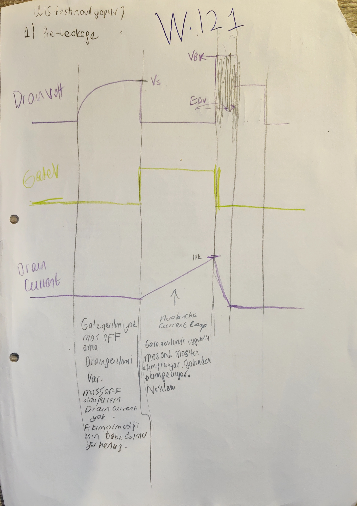

# MOSFET Seçimi ve Dayanım Mantığı

Bu dosya, MOSFET aday parça ve seçim/dayanım gerekçesinin primary owner'ıdır. `RDS(on)`, `Qg/Qgd`, `VDS` marjı, avalanche / UIS, SOA, gate sürme bağlamı ve datasheet'in hangi koşullarda okunduğu burada yaşar. Ayrıntılı kayıp ve termal kapanış hesabı [06_kayiplar_bootstrap_koruma_ve_termal_kapanis.md](06_kayiplar_bootstrap_koruma_ve_termal_kapanis.md) dosyasına gider.

[README özetine dön](README.md)

## Bu Dosyanın Amacı

Bu dosya MOSFET'i yalnız bir BOM satırı gibi değil, şu seçim kapılarıyla birlikte okur:

- mevcut aday parça ve ilk parametre kartı,
- düşük `RDS(on)` ile düşük `Qg/Qgd/Qoss` arasındaki trade-off,
- `VDS / BVDSS` marjı,
- avalanche / UIS farkındalığı,
- SOA ve pulse-duration okuması,
- gate-drive / Miller / `dV/dt` yanlış turn-on riski,
- datasheet değerlerinin hangi `VGS`, `Tj`, `VDS`, pulse süresi ve test koşulunda okunduğu,
- kayıp ve termal kapanışa giden kısa handoff.

## Kapsadığı Eski README Başlıkları

- `### 5.6 MOSFET secimi ve kayiplar` içindeki seçim ve dayanım kapsamı
- `#### 5.6.1 Mevcut aday parca`
- `#### 5.6.2 Secim mantigi`
- `#### 5.6.5 Bu bolumde acik tuttugum maddeler` içindeki seçim / dayanım açıkları

Not: `#### 5.6.3 Ilk kayip notlari`, gate-drive güç kaybı, `Coss` kaybı, body-diode / dead-time ve termal kapanış ağırlıklı içerik [06](06_kayiplar_bootstrap_koruma_ve_termal_kapanis.md) dosyasının primary kapsamıdır.

## Upstream / Downstream Okuma Bağlantıları

- Upstream startup / gate-drive besleme: [02_startup_pin_programlama_ve_ortak_sabitler.md](02_startup_pin_programlama_ve_ortak_sabitler.md)
- Upstream bobin / ripple / load current: [03_bobin_ve_cikis_kapasitorleri.md](03_bobin_ve_cikis_kapasitorleri.md)
- Upstream giriş hot-loop ve helper MLCC: [04_giris_kapasitorleri_ve_giris_agi.md](04_giris_kapasitorleri_ve_giris_agi.md)
- Downstream kayıp / bootstrap / protection / termal kapanış: [06_kayiplar_bootstrap_koruma_ve_termal_kapanis.md](06_kayiplar_bootstrap_koruma_ve_termal_kapanis.md)
- Downstream EMI / layout: [08_emi_giris_filtresi_ve_yerlesim.md](08_emi_giris_filtresi_ve_yerlesim.md)
- Downstream simülasyon ve MOSFET stresleri: [09_simulasyon_gorseller_ve_acik_sorular.md](09_simulasyon_gorseller_ve_acik_sorular.md)

## Owner Notu

[Güncel Omurga] Bu dosya MOSFET seçim mantığının sahibidir. Burada soru "hangi MOSFET ve neden?" sorusudur. "Bu MOSFET ile kaç watt kayıp oluşur, hangi junction sıcaklığında kapanır?" sorusu [06](06_kayiplar_bootstrap_koruma_ve_termal_kapanis.md) dosyasına gider.

[Açık Kontrol] `RDS(on)`, `Qg`, `Qgd`, `Ciss/Coss/Crss`, `VDS` ve SOA gibi değerler aynı koşul setine çekilmeden final seçim kanıtı sayılmayacak. Farklı defter sayfalarındaki çelişen veya koşulu farklı sayılar burada etiketlenir, sessizce tek sayıya indirilmez.

## Kullanılan Global Girdiler

Bu owner aşağıdaki ortak girdileri diğer dosyalardan alır:

| Girdi | Değer / rol |
|---|---:|
| Normal `Vin` aralığı | `24 V - 36 V` |
| Survive-only input transient | `44 V`, `1 ms` |
| `Vout` | `14 V` |
| `Iout,max` | pratik hesaplarda `9 A` |
| Bobin ripple | `Delta_IL ≈ 3.8 A_p-p` @ `Vin = 36 V`, `≈ 2.6 A_p-p` @ `Vin = 24 V` |
| Bobin tepe akımı | `I_L,peak ≈ 10.9 A` |
| `fsw` | `332 kHz` |
| Gate-drive / VCC hattı | dahili `VCC/LDO ≈ 7.5 V` varsayımı |
| Başlangıç gate direnci izi | `Rgate = 2.2 ohm` notu |

Bu dosya `fsw` veya duty hesabını yeniden kurmaz. MOSFET seçimi bu değerlerin üzerinde değerlendirilir.

## Mevcut Aday Parça

[Güncel Omurga] Seçilmiş MOSFET adayı:

- [BOM/M2_Texas_Instruments_CSD18543Q3A_csd18543q3a.pdf](BOM/M2_Texas_Instruments_CSD18543Q3A_csd18543q3a.pdf)
- Parça: `CSD18543Q3A`

Eski README'deki ilk parametre kartı:

| Parametre | İlk okuma |
|---|---:|
| `RDS(on)` | `≈ 8.2 mOhm` |
| `Qg,total` | `≈ 16 nC` |
| `Cgd` | `≈ 54 pF` |
| `Qgd` | `≈ 1.2 nC` yaklaşımı |
| `Vdrive` | `≈ 7.5 V` |
| `Rgate` | `2.2 ohm` notu |

[Açık Kontrol] Bu tablo "final kayıp hesabına doğrudan giren tek değer seti" değildir. `8.2 mOhm`, `15 mOhm @ VGS = 7.5 V` ve `20.25 mOhm @ 75 C` aynı koşulun üç sonucu gibi birleştirilmeyecek; koşullarıyla birlikte okunacak.

## Seçim Mantığı

[Güncel Omurga] MOSFET seçimi yalnız düşük `RDS(on)` aramak değildir. Bu tasarımda seçim şu dengeye dayanır:

| Seçim ekseni | İstenen yön | Risk / karşılık |
|---|---|---|
| `RDS(on)` | düşük olsun, iletim kaybı azalsın | daha büyük die, daha yüksek `Qg/Qoss` ve kapasitans riski |
| `Qg/Qgd` | düşük olsun, driver yükü ve switching süresi azalsın | çok yüksek `RDS(on)` seçilirse conduction loss büyür |
| `BVDSS / VDS` | `36 V` ve spike üstüne marj olsun | yalnız statik `Vin` bakmak yetmez |
| SOA | gerilim-akım-zaman birlikte güvenli olsun | tek başına "max current" veya "max VDS" yeterli değil |
| Avalanche / UIS | anormal endüktif enerji stresine tolerans görülsün | normal çalışmada avalanche hedeflenmez |
| Gate-drive / `dV/dt` | hızlı ama kontrollü anahtarlama | Miller yanlış turn-on, EMI ve ringing riski |


İlk görsel, `VGS ≈ 7.5 V` civarında `RDS(on)` okuması gerektiğini gösterir. İkinci görsel, `RHI`, `RLO`, harici gate direnci ve `CGD / CGS / CDS` üzerinden `dV/dt`, Miller etkisi ve gate sürme hızını aynı seçim mantığına bağlar.


[Tasarım İzi] Tam sayfa `p104`, `RDS(on)` değerini MOSFET iletimdeyken drain-source arasındaki direnç olarak tanımlar; düşük `RDS(on)` ile conduction loss ve ısı üretiminin azalacağını not eder. Aynı sayfa `Cgs`, `Cgd`, `Cds` parazitik kapasitanslarının açma/kapama hızını yavaşlattığını ve switching loss'a bağlandığını; üreticinin `RDS(on)` düşürmek için daha büyük MOSFET / daha fazla silikon kullanmasının `Qg` ve `Qoss` değerlerini büyütebildiğini yazar. Bu, ayrıntılı kayıp hesabı değil, seçim trade-off izidir.

## `RDS(on)` Okuması

[Güncel Omurga] `RDS(on)` datasheet'teki tek nominal satır değildir; gerçek gate sürme gerilimi ve sıcaklıkla birlikte okunur.

### `W.145`: Datasheet Hangi Koşulda Okunacak?


`W.145` kontrol listesi:

- `RDS(on)` için `TC = 125 C` / sıcaklık etkisi dikkate alınmalı,
- LM5146 gate sürücüsü yaklaşık `7.5 V` hattında olduğu için `RDS(on)` bu `VGS` koşuluna yakın okunmalı,
- `BVDSS` için marjlı seçim yapılmalı,
- `Qg` / gate-charge değerleri gerçek sürme gerilimiyle ilişkilendirilmeli.

`BVDSS` için defterdeki pratik kural:

```text
BVDSS > 1.25 * Vin,max
```

`Vin,max = 36 V` için bu alt sınır `45 V` mertebesidir; seçilen parçada `100 V` hattı ayrıca `W.151`de görünür.

[Tasarım İzi] Tam sayfa `p105`, bu listenin ham defter bağlamını gösterir: `RDS(on)` için sıcaklık koşulu ve LM5146'nın yaklaşık `7.5 V` gate sürüşü birlikte okunur; `BVDSS` drain-source breakdown gerilimi olarak tanımlanır ve tipik `60 V`, `80 V`, `100 V` sınıflarından söz edilir; `Qg` de yine `VGS = 7.5 V` koşuluyla ilişkilendirilir. Bu sayfa yeni final MOSFET değeri üretmez, datasheet okuma koşullarını görünür yapar.

### `W.146`: `7.5 V` ve Sıcaklık Düzeltmesi


`W.146` uygulaması:

```text
RDS(on) @ VGS = 7.5 V, Tj = 25 C ≈ 15 mOhm
sıcaklık katsayısı @ yaklaşık 75 C ≈ 1.35
RDS(on)(75 C) ≈ 15 mOhm * 1.35 = 20.25 mOhm
```

[Çapraz Teyit] Tam sayfa `p107`, LM5146 gate sürüşünün `7.5 V` olduğu için `RDS(on)` değerinin bu `VGS` noktasından okunması gerektiğini tekrar eder. Defterde `15 mOhm` değerinin `Tj = 25 C` için geçerli olduğu, çalışmada MOSFET'in yaklaşık `75 C` tarafına çıkacağı ve normalize sıcaklık grafiğinden `1.35` katsayısı ile `15 mOhm * 1.35 = 20.25 mOhm` hattına gidildiği görünür. Bu, final termal kapanış değil; kayıp hesabına gidecek sıcak `RDS(on)` izidir.

[Tasarım İzi] `75 C` son termal kapanış değildir; bu iterasyondaki çalışma varsayımıdır. MOSFET kayıp tablosu ve termal yol değişirse `RDS(on)` yeniden okunacak. Bu bağlantı [06](06_kayiplar_bootstrap_koruma_ve_termal_kapanis.md) dosyasına gider.

## `BVDSS`, `VDS` Marjı ve `44 V` Bağlamı

### `W.151`: `100 V BVDSS`


`W.151` seçilen MOSFET'in:

```text
BVDSS = 100 V
```

olduğunu not eder.

[Tasarım İzi] Tam sayfa `p106`, `BVDSS`i MOSFET'in drain-source arasında dayanabileceği en yüksek gerilim olarak açıklar. Sayfada giriş gerilimi bu sınırı aşarsa MOSFET'in bozulacağı; `Vinmax = 36 V` için en az `60 V` sınıfında BVDSS'e sahip MOSFET kullanılması gerektiği ve bu tasarımda seçilen MOSFET'in `BVDSS = 100 V` olduğu yazılıdır. Bu `60 V` pratik sınıf notu, önceki `1.25 * 36 V = 45 V` alt sınırını silmez; sınıf seçimi / güvenlik izi olarak kalır.

Bu, `1.25 * 36 V = 45 V` marj kuralına göre rahat görünür. Fakat tek başına `VDS` stresinin kapandığı anlamına gelmez:

- normal off-state `VDS` üstüne switch-node spike / ringing binebilir,
- `44 V / 1 ms` survive-only şartı normal `36 V` hesabından ayrı durur,
- hot-loop endüktansı, snubber / `Rboot` kararı ve layout sonucu `VDS` marjını belirler.

[Açık Kontrol] Final `VDS` kontrolü switching simülasyonunda high-side / low-side MOSFET için ayrı ayrı yapılacak; `100 V` statik marjı yalnız ilk seçim dayanağıdır.

## Avalanche ve UIS

### `W.120-W.121`: Avalanche / UIS Farkındalığı


`W.120` TI'nin UIS / avalanche datasheet yorumunu kaynak-not olarak kullanır. Korunan fikir:

- `UIS` yani unclamped inductive switching testi, endüktif enerji boşalımı sırasında MOSFET dayanımını sınar,
- MOSFET kapandığında endüktif akım devam etmek ister,
- yeterli boşalma yolu yoksa `VDS` yükselir ve cihaz avalanche bölgesine girebilir.

[Kaynak İzi / Çapraz Teyit] Tam sayfa `p088`, TI kaynak makalesinin başlangıç sayfasını ve `UIS Test Circuit` çizimini korur. Üst notlarda "UIS testi nasıl yapılır?" ve "akım arta arta MOSFET bozulma noktasına gider" okuması vardır. Bu sayfa proje için yeni `EAS`, `L`, test akımı veya kabul limiti üretmez; datasheet'teki avalanche / UIS satırlarının neden seçim kontrolüne alındığını belgelendirir.


Bu ekran, seçilen parçanın datasheet'inde `EAS` / single-pulse avalanche energy kaleminin de arandığını gösterir.




`W.121`, UIS testini dalga şekliyle sezgisel kurar:

- MOSFET açıkken endüktif akım yükselir,
- MOSFET kapanınca endüktör akımı devam etmek ister,
- uygun yol yoksa `VDS` hızlı yükselir,
- avalanche bölgesinde enerji sönümlenir,
- test sonrası leakage / hasar kontrol edilir.

[Tasarım İzi] Tam sayfa `p089`, gate kapatıldığında MOSFET'in normal olarak `OFF` olduğunu, drain geriliminin yükseldiğini ve endüktif akım için yol arandığını çizimle anlatır. Sayfadaki `VBK`, `Eav` ve `Avalanche current loop` notları, avalanche'ın bir hedef çalışma modu değil, arıza / spike dayanımını anlamak için kullanılan stres bölgesi olduğunu destekler.

[Açık Kontrol] Bu notlar normal çalışmada avalanche'a girmek kabul edilebilir anlamına gelmez. Öncelik `VDS` spike'ını layout, input MLCC, gate direnci, `Rboot` ve gerekirse snubber ile düşürmektir; kalan marj datasheet `EAS` / UIS bilgisiyle kontrol edilir.

## SOA Okuması


`W.122`, Safe Operating Area grafiğinin seçim mantığına dahil edilmesi gerektiğini gösterir.

SOA okuması:

- `VDS` ve `ID` birlikte değerlendirilir,
- `DC`, `10 ms`, `1 ms`, `100 us` gibi pulse süreleri farklı sınırlar verir,
- sınırı tek mekanizma belirlemez; akım limiti, güç limiti, termal kararlılık ve `BVdss` sınırı farklı bölgeler oluşturur.

[Kaynak İzi / Çapraz Teyit] Tam sayfa `p090`, TI SOA makalesinin başlangıç sayfasını ve örnek `SOA Graph` üzerindeki `RDS(on) Limitation`, `Current Limitation`, `Max Power Limitation`, `Thermal Instability Limitation` ve `BVdss Limitation` bölgelerini korur. Üst nottaki "buck'taki MOSFET'ler tam bu bölgede çalışır" okuması, SOA'nın yalnız arıza değil, yüksek gerilim-akım-zaman kombinasyonlarında seçim dayanımı açısından okunması gerektiğini gösterir. Bu sayfa proje için yeni akım limiti veya SOA kabul noktası üretmez.


[Tasarım İzi] `W.123`, SOA grafiğinin arkasındaki MOSFET çalışma bölgesi sezgisini çizer. Lineer bölgede akımın `VDS` ile ilişkili olduğu ve yaklaşık `ID ≈ VDS/RDS(on)` gibi düşünülebileceği not edilir. Saturasyon bölgesinde ise `VDS` artsa da `ID` artık `VGS` tarafından sınırlanır. Bu not, SOA eğrisini okurken "MOSFET zarar görmeden hangi gerilim-akım-süre bölgesinde kalır?" sorusunun fiziksel bağlamını verir; final çalışma noktası yerleştirmesi değildir.

[Açık Kontrol] Bu dosyada proje-özel sayısal SOA yerleştirmesi yok. Finalde normal iletim, switching geçişi, startup, current-limit ve arıza pulse süreleri ayrı SOA pencereleriyle kontrol edilmeli.

## Gate-drive, `Qg/Qgd` ve Miller Bağlamı

[Güncel Omurga] Gate-charge değerleri sabit tablo sayısı değildir; `VGS`, `VDS`, akım, sıcaklık ve gate yolu koşuluyla okunur. Bu değerler seçim gerekçesini etkiler, ayrıntılı gate-drive kaybı ve bootstrap hesabı [06](06_kayiplar_bootstrap_koruma_ve_termal_kapanis.md) dosyasına gider.

### `W.129`: Gate-charge Okuma İzleri


`W.129`, gate-charge değerlerinin gerçek sürme koşuluna uyarlanması gerektiğini gösterir. Bu hatta görünen değerler:

| İz | Değer / okuma |
|---|---:|
| Datasheet / ilk uyarlama | `Qg,total ≈ 10 nC` gibi ara iz |
| Başka Fig.6 okuması | `Qg ≈ 12.2 nC` |
| Fiilen kullanılan gate-drive / bootstrap hattı | `Qg ≈ 16 nC` |
| Kaba Miller charge | `Qgd ≈ Cgd * VDS ≈ 54 pF * 22 V ≈ 1.2 nC` |


[Açık Kontrol] `10 nC`, `12.2 nC` ve `16 nC` aynı koşulun üç final cevabı gibi birleştirilmeyecek. Son kayıp / bootstrap / `CVCC` hesabında hangi `Qg` kullanılıyorsa aynı koşul setiyle etiketlenecek.

### `W.130-W.133`, `W.163`: Parazitik Kapasitanslar ve FOM İzleri


`W.130`, datasheet kapasitanslarını `VDS ≈ 22 V` bağlamına taşımaya çalışan ilk hattır:

```text
Cgd ≈ 54 pF
Coss,ave ≈ 783 pF
Cds ≈ 729 pF
```


`W.131`, rolleri kavramsal ayırır:

```text
Ciss = Cgs + Cgd
Cgd = Miller kapasitansı
Cgs büyükse gate daha yavaş tepki verir ama yanlış turn-on'a karşı daha güçlü bölücü oluşabilir
```

[Tasarım İzi] Tam sayfa `p102`, `Cgs` için "sabit kabul edilir, `VDS` veya `VGS`ye çok az bağlıdır" notunu, gate'in kontrol edilen taraf olduğunu ve `Ciss = Cgs + Cgd` ilişkisinin girişte görülen toplam kapasitansın büyük kısmını oluşturduğunu korur. Aynı sayfada `Cgs` büyüdükçe gate tepki süresinin yavaşladığı ve daha fazla gate charge `Qg` gerektiği; `Cgs` küçüldükçe açma/kapama hızının arttığı ama kontrolün daha hassas hale geldiği yazılıdır. Bu, sayısal kayıp hesabı değil, seçim mantığıdır.


[Tasarım İzi] Tam sayfa `p103`, `Cgs`, `Cgd` ve `Cds` parazitik kapasitanslarının MOSFET açılma süresini etkilediğini; bu sığalar küçüldükçe daha hızlı anahtarlama yapılabildiğini ve switching loss'un azaldığını not eder. Sayfa ayrıca yüksek frekansta bu etkinin kritik olduğunu, fakat `Qg` arttıkça MOSFET'i açıp kapatmak için daha fazla enerji ve zaman gerektiğini yazar. Alttaki `Figure of Merit` notunda `RDS(on) * Qg` seçim göstergesi olarak tutulur: düşük `RDS(on)` ile düşük `Qg` arasında denge aranır.


`W.163`, daha sonra daha küçük bir kapasitans setiyle tekrar kontrol yapar:

```text
Ciss ≈ 835 pF
Coss ≈ 16.8 pF
Crss ≈ 4.8 pF
Crss,ave ≈ 11.21 pF
Coss,ave ≈ 39.2 pF
Cgs ≈ 830.2 pF
```

[Açık Kontrol] `54 pF / 783 pF / 729 pF` hattı ile `11.21 pF / 39.2 pF / 830.2 pF` hattı sessizce birleştirilmeyecek. Bunlar farklı okuma / uyarlama izleridir. Final modelde kapasitanslar aynı `VDS`, `Tj`, gate-drive ve datasheet koşuluna çekilmeli.

## `dV/dt`, Miller ve Yanlış Turn-on

[Güncel Omurga] MOSFET seçiminde `Cgd`, gate yolu direnci ve sürücü pull-down davranışı yalnız kayıp hesabı için değil, yanlış turn-on ve EMI riski için de okunur.

### `W.178-W.184`: Proje İçindeki Miller Kontrolleri


`W.178`, problemi tarif eder: hızlı `VDS` değişimi `Cgd` üzerinden gate'e akım enjekte edebilir ve istenmeyen `VGS` oluşturabilir.

[Tasarım İzi] Tam sayfa `p092`, drain-source gerilimi çok hızlı arttığında MOSFET'in bizim gate komutumuz olmadan kendiliğinden açılabileceği riskini çizer. `CGD`, `CGS`, `CDS`, gate direnci ve `dV/dt` oku aynı çizimde görünür. Bu sayfa yeni `dV/dt` sınırı üretmez; Miller yanlış turn-on probleminin fiziksel yolunu görünür yapar.


İlk sezgisel ilişki:

```text
VGS ≈ VDS * Cgd / (Cgs + Cgd)
VDS,max * Cgd / (Cgs + Cgd) < VTH
```

[Tasarım İzi] Tam sayfa `p093`, ilk senaryoda sadece kapasitif bölücüyü kullanan kaba modeli anlatır: MOSFET gate'i açık sürülmese bile `Cgd` ve `Cgs` üzerinden oluşan gerilim `VGS` gibi görülebilir; `VGS` değerinin `VTH` altında kalması istenir. Sayfadaki "3 senaryo halinde incelenecek" notu, sonraki `W.180-W.184` hesaplarının neden farklı kapasitans / gate-yolu varsayımlarına ayrıldığını açıklar.


`W.180`, `Cgd ≈ 6 pF`, `Coss ≈ 200 pF`, `Ciss ≈ 1100 pF` gibi iyimser / küçük kapasitans senaryosuyla ilk yoklamadır. Sonuç rahatlık yönündedir, fakat bu yalnız o kapasite modeli için geçerlidir.

[Çapraz Teyit] Tam sayfa `p094`, `Cgd/Crss = 6 pF`, `Coss = 200 pF`, `Ciss = 1100 pF` okumasıyla `Cgs = Ciss - Cgd = 1094 pF` hattını gösterir. Bu ilk senaryoda `VDS,max ≈ VTH*(Cgs+Cgd)/Cgd` ilişkisiyle `398 V` mertebesinde çok rahat bir sonuç görülür. Bu değer final switch-node marjı değildir; küçük/iyimser `Cgd` kabulünün sonucu olarak etiketli kalır.


`W.181`:

```text
(dV/dt)_limit ≈ VTH / (RGi * CGD)
RGi ≈ 0.7 ohm
CGD ≈ 6 pF
sonuç ≈ 5.7e11 V/s mertebesi
```

[Çapraz Teyit] Tam sayfa `p095`, aynı ikinci senaryoyu `VTH/(RGi*CGD)` biçiminde açar ve `2.171 V / (0.7 ohm * 6e-12 F)` hesabından `517 x 10^9 V/s`, yani yaklaşık `517 V/ns` mertebesini verir. Bu sayı gerçek ölçülmüş switch-node eğimi değildir; gate yolu ve küçük `CGD` varsayımına bağlı teorik limit izidir.


`W.182` daha gerçek gate yolunu yazar:

```text
I_CGD = C_GD * dVDS/dt
VGS = I_CGD * (RGi + RGext + RLO)
(dV/dt)_limit ≈ VTH / ((RGi + RGext + RLO) * CGD)
```

[Tasarım İzi] Tam sayfa `p096`, yalnız MOSFET iç kapasitif bölücüsünün değil, harici gate direnci ve driver'ın `RLO` yolunun da hesaba katıldığı üçüncü senaryoyu açar. `Cgd` üzerinden akan akım, gate yolundaki dirençlerde gerilim oluşturur; bu gerilim `VTH` üstüne çıkarsa MOSFET yanlışlıkla açılabilir. Bu sayfa yeni sayısal limit üretmez, `W.183`teki pratik direnç hesabına zemin hazırlar.


`W.183`, pratik gate yolu ile:

```text
RGext ≈ 0.5-1 ohm
RLO-driver ≈ 0.9 ohm
CGD = 6 pF
VTH = 2.172 V
(dV/dt)_limit ≈ 190.6 V/ns
```

sonucunu verir. Bu gerçek switch-node ölçümü değil, yanlış turn-on için üst sınır yoklamasıdır.

[Çapraz Teyit] Tam sayfa `p097`, `VTH = 2.171 V`, `Rgate = 0.5-1 ohm` aralığında en kötü senaryo için `1 ohm`, `RLO-down ≈ 0.9 ohm` ve `CGD = 6 pF` kabulünü birlikte gösterir. Hesap `2.171 V / ((1 ohm + 1 ohm + 0.9 ohm)*6 pF) ≈ 190.6 x 10^9 V/s ≈ 190.6 V/ns` mertebesine iner. Bu değer `517 V/ns` ikinci senaryo sonucunu iptal etmez; gate yolu daha gerçekçi eklendiği için farklı varsayım setidir.


`W.184`, daha korumacı kapasitans setiyle aynı problemi tekrar açar:

```text
Ciss ≈ 2600 pF
Cgd ≈ 340 pF
VDS,max ≈ 26.12 V [önceki küçük kırpım okuması]
VDS,max ≈ 26.82 V [p098 tam sayfa aritmetiği: (3.157 V + 0.35 V)*2600 pF/340 pF]
```

[Tasarım İzi] Tam sayfa `p098`, kapasitansların nominal değerlerinin kullanıldığını ve sıcaklık / eşik gerilimi tarafında `+0.35 V` ek notu olduğunu görünür yapar. Bu yüzden `26.12 V` izi ile p098 üzerindeki `26.82 V` aritmetiği sessizce tek değere indirilmedi.

[Açık Kontrol] `26.12 V`, `26.82 V`, `52.35 V`, `190.6 V/ns` gibi sonuçlar tek final cevap değildir. Bunlar hangi `Cgd` okumasının seçildiğine çok duyarlıdır. Finalde gerçek `Cgd(VDS)`, gate pull-down yolu, common-source inductance, switch-node dalga şekli ve layout ile tekrar kapanacak.

### `W.125-W.127`: G88 Kaynak / Ara Notları


`W.125` kaynak yönteminde:

```text
(dV/dt)_limit ≈ VTH / (CGD * (RGext + RGint + Rpull-down))
örnek iz ≈ 10.64 V/ns
```

[Tasarım İzi] `p098` alt kısmı aynı kaynak hattında IRFP120 için iki ek senaryo notu taşır: `VTH + ΔV ≈ 3.157 V + 0.35 V`, `RGI ≈ 1.6 ohm`, `CGD ≈ 340 pF` ile doğal limit için `≈ 6.4 kV/us`; `RGI + Rgate + RLO ≈ 1.6 + 5 + 5 ohm` alındığında ise `≈ 889 V/us` mertebesi yazılır. Bunlar seçilen MOSFET için final dalga şekli değildir; G88/IRFP120 kaynak örneğinin nasıl ölçeklendiğini gösterir.

[Açık Kontrol] `p099` üzerindeki `10.64` sonucu defterde birim ve anlam açısından şüpheli / yeniden yorumlanacak iz gibi duruyor. Bu nedenle `10.64 V/ns`, `889 V/us`, `6.4 kV/us`, `190.6 V/ns` ve `517 V/ns` aynı fiziksel büyüklüğün doğrudan karşılaştırılabilir final cevapları gibi birleştirilmedi.


`W.126` daha kaba bir üst sınır verir:

```text
(dV/dt)_N-limit ≈ VTH / (RGI * CGD) [p100 tam sayfa hesabı]
örnek iz ≈ 43.6 V/ns
```

[Çapraz Teyit] Tam sayfa `p100`, hesabı `3.49 V / (1 ohm * 80 pF) = 4.36e10 V/s ≈ 43.6 V/ns` olarak açar. Sayfadaki not bu değeri "epey yüksek bir doğal sınır" diye yorumlar ve bu senaryoda MOSFET'in istemsiz açılma riskinin düşük olduğunu söyler. Önceki kısa özet satırındaki `Ciss` yazımı p100 ile aynı final değer gibi birleştirilmedi; bu tam sayfa izi `CGD/Crss = 80 pF` varsayımını netleştirir.


`W.127` kapasitif bölücüyle:

```text
Cgd ≈ 80 pF
Coss ≈ 700 pF
Ciss ≈ 1200 pF
Cds ≈ 620 pF
Cgs ≈ 1120 pF
VDS,max ≈ 52.35 V
```

sonucunu verir.

[Çapraz Teyit] Tam sayfa `p101`, `VGS = VDS * CGD/(CGS + CGD)` ve tersinden `VDS,max ≈ VTH*(CGS+CGD)/CGD` kontrolünü tekrar kurar. Aynı sayfada `VDS = 36 V - 14 V = 22 V` bağlamı, `Crss/CGD = 80 pF`, `Coss = 700 pF`, `Ciss = 1200 pF`, `CDS = Coss - CGD = 620 pF` ve `CGS = Ciss - CGD = 1120 pF` izleri birlikte durur; `52.35 V` sonucu bu kapasitans seti için MOSFET'in kendi kendine açılmadığı yorumuna bağlanır.

Bu dört sayfa final dalga şekli değildir; `dV/dt` / Miller probleminin parametre duyarlılığını gösterir.

## Gate Sürme ve Switching Interval Bağlamı

[Referans Notu] Bu bölüm gate sürme davranışını seçim gerekçesi olarak tutar. Ayrıntılı switching-loss hesapları [06](06_kayiplar_bootstrap_koruma_ve_termal_kapanis.md) dosyasına gider.

### `W.147-W.149`: Turn-on Interval Haritası


`W.147`, MOSFET turn-on sürecini aralıklara ayırır:

- gate `0 V`tan `VGS(th)` seviyesine çıkar,
- `Cgs` ve kısmen `Cgd` şarj olur,
- turn-on delay oluşur,
- sonrasında `VGS(th)` ile Miller plateau arası başlar.


`W.148`, gate, drain gerilimi ve drain akımı dalga şekillerini birlikte gösterir:

- `Qgs` bölgesi,
- `Qgd` / Miller bölgesi,
- `VDS` düşüşü,
- gate'in son sürme seviyesine yükselmesi.


`W.149`, kendi çizimlerini TI kaynak şekliyle hizalar:

- `t1-t2`: MOSFET threshold'u geçer ve akım taşımaya başlar,
- `t2-t3`: Miller `Cgd` şarj olur, `VGS` plateau'da kalır, `VDS` düşer,
- `VPL` / `VGS(th)` hesabı switching interval yorumunun parçasıdır.

### `W.150`, `W.155`, `W.156`: Kayıp Sınıflarına Handoff


`W.150`, selection ile kayıp hesabı arasındaki köprüdür:

- conduction-loss tarafı `RDS(on)` ve sıcaklık koşuluna bağlı,
- switching-loss tarafı `VPL`, `VGS(th)`, `Qgs`, `Qgd`, `Qg(total)` ve geçiş sürelerine bağlı.


`W.155-W.156`, kayıp hesabının kaynak / metod haritasıdır:

```text
P_total_loss = P_switches + P_inductor + P_capacitors + P_other
eta = Vo*Io / (Vo*Io + P_total_loss)
```

Bu dosyada bu denklemler yalnız handoff'tur. Ayrıntılı MOSFET conduction, switching, gate-drive, `Coss`, body-diode / dead-time ve termal tablo [06](06_kayiplar_bootstrap_koruma_ve_termal_kapanis.md) dosyasına aittir.

## Datasheet Okuma Kuralları

Bu dosyada korunacak tek cümlelik okuma kuralları:

| Parametre | Okuma kuralı |
|---|---|
| `RDS(on)` | `VGS ≈ 7.5 V` ve sıcaklıkla birlikte okunur; `25 C` değeri final termal değer değildir |
| `BVDSS` | `Vin,max` üstüne spike / ringing ve `44 V / 1 ms` survive bağlamı eklenmeden kapanmaz |
| `Qg` | tablo değeri değil, gerçek `VGS` ve gate-charge eğrisinden okunur |
| `Qgd` | Miller plateau ve `VDS` değişimiyle ilişkilidir; `Cgd * VDS` yalnız kaba izdir |
| `Ciss/Coss/Crss` | `VDS` ile değişir; farklı sayfa setleri aynı koşula çekilmeden karşılaştırılmaz |
| SOA | `VDS`, `ID` ve pulse süresi birlikte okunur |
| Avalanche / UIS | normal çalışma hedefi değil, arıza / spike dayanım kontrolüdür |
| Gate direnci | sadece hız değil, `dV/dt`, Miller yanlış turn-on, EMI ve switching loss dengesidir |

## Seçim Durumu

[Güncel Omurga] Bu aşamada `CSD18543Q3A` ana adaydır ve seçim mantığı şu yüzden korunur:

- `100 V BVDSS` ile `36 V` normal giriş zarfına göre statik marj taşır,
- `VGS ≈ 7.5 V` koşulunda `RDS(on)` okunmuş ve sıcaklıkla `20.25 mOhm` hattına taşınmıştır,
- `Qg/Qgd` değerleri gerçek gate-drive ve switching interval bağlamında sorgulanmıştır,
- SOA, avalanche / UIS ve `dV/dt` yanlış turn-on başlıkları seçim riskleri olarak görünür hale getirilmiştir,
- `RDS(on)` düşük olsun diye gate charge / capacitance riskleri unutulmamıştır.

[Açık Kontrol] Bu henüz final "MOSFET doğrulandı" cümlesi değildir. Final kabul için kayıp, termal, switch-node dalga şekli ve SOA aynı koşul setinde kapanmalıdır.

## Kayıp / Termal Kapanışa Kısa Handoff

Bu dosyadan [06](06_kayiplar_bootstrap_koruma_ve_termal_kapanis.md) tarafına giden değer ve konular:

| Handoff | 06'da kapanacak konu |
|---|---|
| `RDS(on) @ 7.5 V`, sıcaklık düzeltmesi | high-side / low-side conduction loss |
| `Qg ≈ 16 nC` hattı | gate-drive loss, `CVCC`, bootstrap charge |
| `Qgd`, `VPL`, `VGS(th)`, turn-on intervals | switching overlap loss |
| `Coss`, `Qoss`, kapasitans setleri | output capacitance loss / double-count riski |
| body diode / dead-time | low-side kayıp ve stress |
| `BVDSS`, `EAS`, SOA | stress / fault / spike kapanışı |
| `Tj` ve termal parametreler | junction, board, case ve datasheet current yorumu |

## Açık Teknik Doğrulamalar

[Açık Kontrol] MOSFET seçimi şu kontroller olmadan final sayılmayacak:

- `CSD18543Q3A` high-side ve low-side için aynı aday mı kullanılacak, yoksa rollere göre ayrılacak mı?
- `RDS(on)` için final değer `8.2 mOhm`, `15 mOhm`, `20.25 mOhm` izlerinden hangisi ve hangi koşulda kullanılacak?
- `Qg` için final değer `10 nC`, `12.2 nC`, `16 nC` izlerinden hangisi olacak?
- `Cgd/Ciss/Coss/Crss` için hangi datasheet eğrisi ve hangi `VDS` noktası kullanılacak?
- `VDS` spike / ringing switching simülasyonda `100 V` marj içinde kalıyor mu?
- `44 V / 1 ms` survive durumunda MOSFET `VDS`, avalanche ve SOA yorumu ayrıca yapıldı mı?
- `dV/dt` yanlış turn-on kontrolünde gerçek gate pull-down yolu, harici gate direnci ve common-source inductance modele girdi mi?
- Gate direnci / `Rboot` / snubber ihtiyacı switching loss, EMI ve `VDS` spike ile birlikte değerlendirildi mi?
- SOA kontrolü normal çalışma, startup, current-limit ve fault pulse süreleri için ayrı ayrı yapıldı mı?
- Kayıp ve termal kapanış [06](06_kayiplar_bootstrap_koruma_ve_termal_kapanis.md) dosyasında aynı BOM ve aynı çalışma koşullarıyla yapıldı mı?

## Owner Dışı Kısa Referanslar

- Startup, dahili `VCC/LDO`, `RT`, timing ve gate-drive besleme bağlamı: [02_startup_pin_programlama_ve_ortak_sabitler.md](02_startup_pin_programlama_ve_ortak_sabitler.md).
- Bobin ripple, `I_L,peak` ve `DCR`: [03_bobin_ve_cikis_kapasitorleri.md](03_bobin_ve_cikis_kapasitorleri.md).
- Giriş hot-loop, helper MLCC ve input spike bağlamı: [04_giris_kapasitorleri_ve_giris_agi.md](04_giris_kapasitorleri_ve_giris_agi.md).
- Ayrıntılı kayıp, bootstrap, protection/current-limit ve termal kapanış: [06_kayiplar_bootstrap_koruma_ve_termal_kapanis.md](06_kayiplar_bootstrap_koruma_ve_termal_kapanis.md).
- EMI, switch-node alanı, gate-drive dönüşleri ve layout: [08_emi_giris_filtresi_ve_yerlesim.md](08_emi_giris_filtresi_ve_yerlesim.md).
