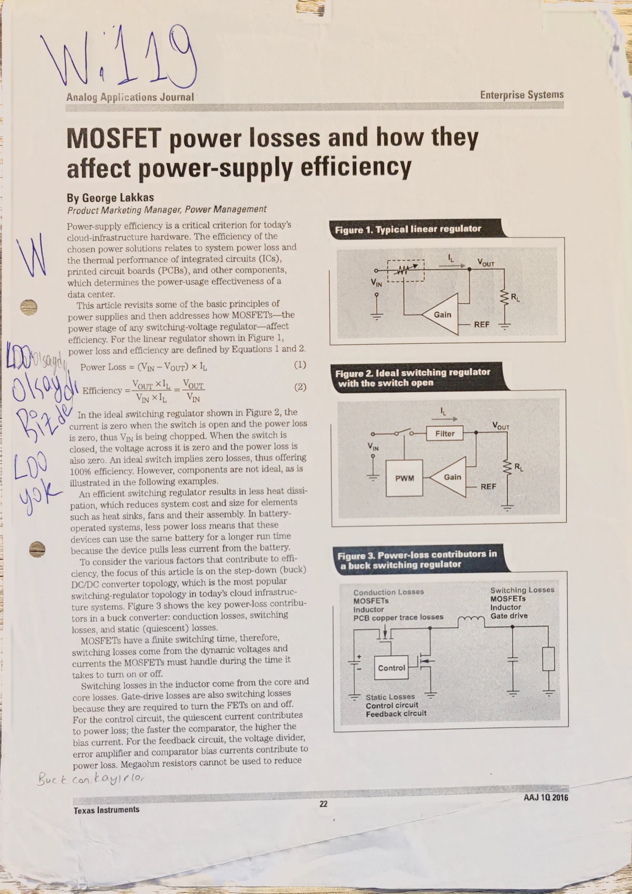
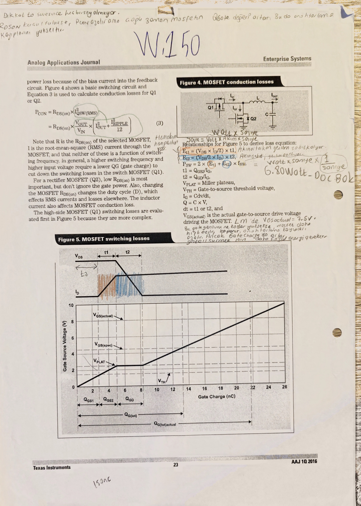
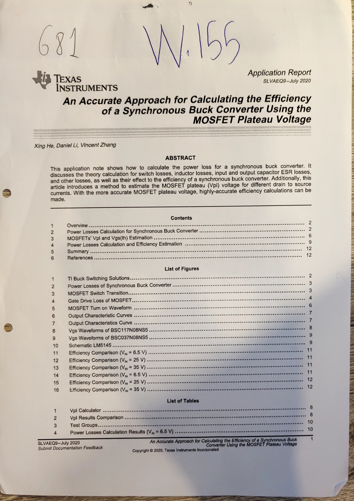
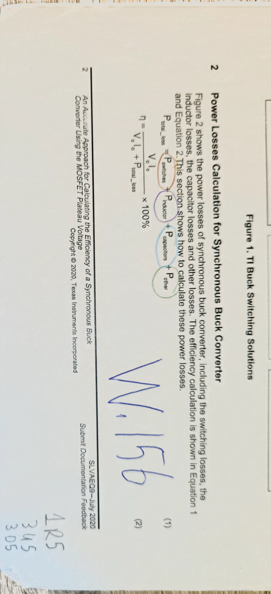
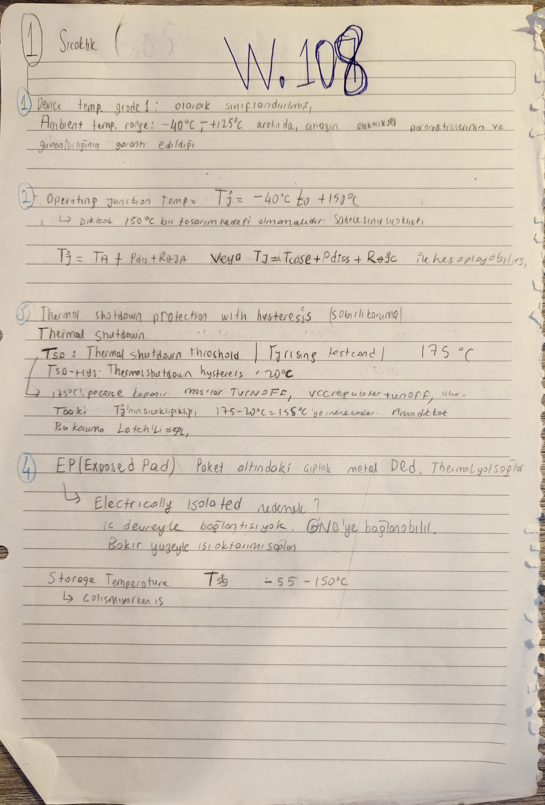
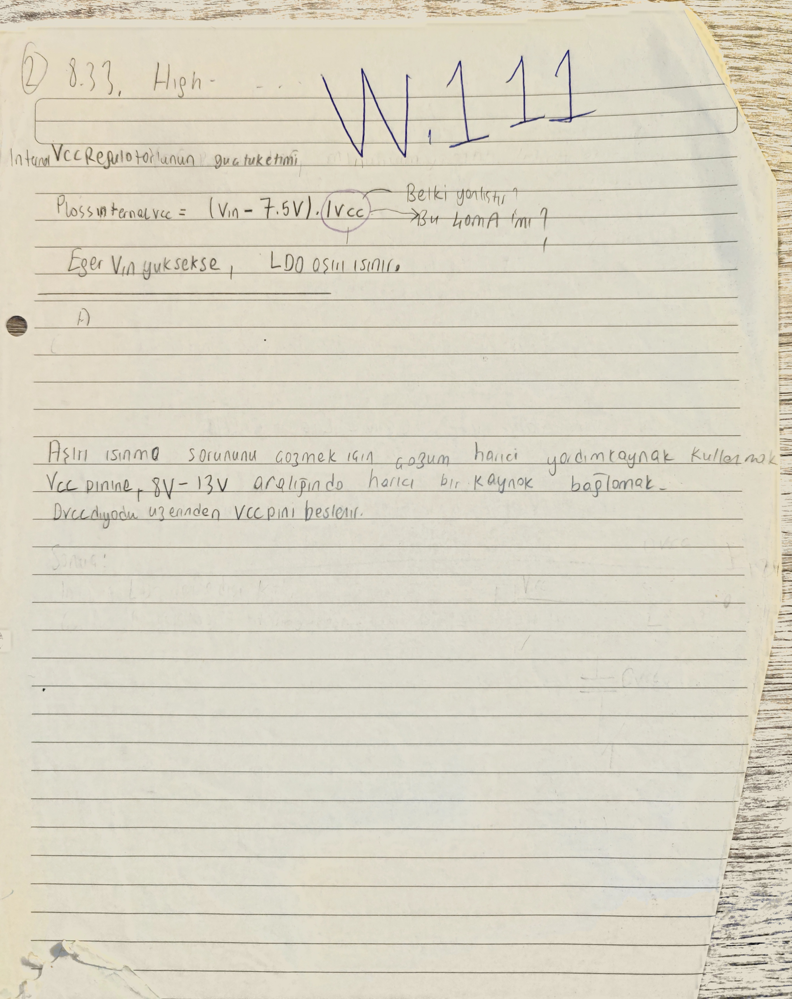

# Kayıplar, Bootstrap, Koruma ve Termal Kapanış

[README özetine dön](README.md)

## Bu Dosyanın Amacı

Bu dosya MOSFET kayıp mekanizmaları, bootstrap ağı, protection/current-limit/sensing ve termal kapanışın primary owner'ıdır.

Burada amaç tek bir steril "final verim tablosu" üretmek değil; defterdeki kayıp, charge, bootstrap, protection ve sıcaklık izlerini aynı elektriksel kapanış zinciri içinde okunur hale getirmektir. MOSFET seçimi [05](05_mosfet_secimi_ve_dayanim_mantigi.md) dosyasının konusudur; bu dosya o seçimin kayıp, bootstrap ve termal sonuçlarını kapatır.

## Kapsadığı Eski README Başlıkları

- `#### 5.6.3 Ilk kayip notlari`
- `#### 5.6.4 Thermal ve datasheet yorumu referans notu`
- `#### 5.6.5 Bu bolumde acik tuttugum maddeler` içindeki loss/thermal açıkları
- `### 5.7 Bootstrap agi`
- `#### 5.7.1 Bootstrap direncini (Rboot) hesaplama ve secim mantigi`
- `### 5.8 Protection, current-limit ve sensing owner`
- `### 5.9 Termal ve Kayıp Kapanışı`
- `#### 5.9.1 Controller VCC/LDO, thermal shutdown ve exposed pad`
- `#### 5.9.2 Giriş MLCC RMS kaynaklı sıcaklık artışı`
- `#### 5.9.3 MOSFET termal yolu, datasheet current ve T_J`
- `#### 5.9.4 Board worst-case ve kayıp kapanış sırası`

## Upstream / Downstream Okuma Bağlantıları

- Upstream global girdiler: [01](01_tasarim_girdileri_ve_kaynaklar.md)
- Upstream startup / `VCC` / duty / timing: [02](02_startup_pin_programlama_ve_ortak_sabitler.md)
- Upstream bobin ripple ve çıkış filtresi: [03](03_bobin_ve_cikis_kapasitorleri.md)
- Upstream giriş MLCC RMS ve sıcaklık: [04](04_giris_kapasitorleri_ve_giris_agi.md)
- Upstream MOSFET seçim/dayanım mantığı: [05](05_mosfet_secimi_ve_dayanim_mantigi.md)
- Downstream kontrol: [07](07_kontrolcu_ve_kompanzasyon.md)
- Downstream EMI/layout: [08](08_emi_giris_filtresi_ve_yerlesim.md)
- Downstream simülasyon ve açık sorular: [09](09_simulasyon_gorseller_ve_acik_sorular.md)

## Owner Notu

Bu dosyada tam anlatımı yapılacak kümeler:

- MOSFET conduction / switching / gate-drive / `Coss` / reverse-recovery / dead-time kayıpları
- bootstrap `Rboot`, `Cboot`, `CVCC`, charge ve `BST-SW` UVLO yeterliliği
- `ILIM`, `Rilim`, `Cilim`, current-limit ve sensing zinciri
- controller `VCC/LDO` kaybı, thermal shutdown ve exposed pad bağlamı
- MOSFET junction, case, board ve datasheet thermal metric yorumu
- board-level sıcaklık ve kayıp kapanış sırası

Owner dışı kalanlar:

- MOSFET seçim gerekçesi [05](05_mosfet_secimi_ve_dayanim_mantigi.md) dosyasındadır.
- Giriş MLCC RMS ve parça başına sıcaklık artışı [04](04_giris_kapasitorleri_ve_giris_agi.md) dosyasının primary kapsamıdır; burada yalnız toplam termal kapanışa referans verilir.
- Duty / `fsw` / `tON` / `tOFF` tam anlatımı [02](02_startup_pin_programlama_ve_ortak_sabitler.md) dosyasındadır.

## Okuma Haritası

| Sıra | Owner içi blok | Neyi kapatır? |
|---:|---|---|
| 1 | Kayıp bütçesinin kapsamı | `G81/G90`, `W.118-W.119`, `W.150`, `W.155-W.156` kaynak/defter omurgası |
| 2 | MOSFET kayıp mekanizmaları | conduction, switching overlap, gate-drive, `Coss`, body-diode/recovery |
| 3 | Controller ve `VCC/LDO` kayıpları | dahili regulator, `PIC`, gate-drive enerjisinin hangi parçada ısıya dönüştüğü |
| 4 | Bootstrap ağı | `Cboot`, `Rboot`, `CVCC`, charge, UVLO, tepe akım |
| 5 | Protection/current-limit/sensing | `ILIM`, `Rilim`, `Cilim`, sıcak `RDS(on)` bağlantısı |
| 6 | Termal kapanış | controller, MOSFET, board, ölçüm-vs-hesap metrikleri |
| 7 | Açık maddeler | final kapanıştan önce çözülecek kontroller |

## Kayıp Bütçesinin Kapsamı

### İlk Ölçek Notları

[Tasarım İzi] `Verimlilik.txt` içinde aday MOSFET ve seçilen frekans civarı için iki ilk ölçek değeri duruyor:

```text
toplam MOSFET switching kaybı ≈ 540 mW
toplam MOSFET conduction kaybı ≈ 1.65 W
```

Bu iki satır son doğrulanmış sonuç değildir. Şu yorumu taşır:

- iletim kaybı bu tasarımda switching kaybından baskın görünür,
- buna rağmen `332 kHz` civarında switching kaybı ihmal edilecek kadar küçük değildir,
- seçilen MOSFET ve seçilen frekans birlikte okunmalıdır.

[Açık Kontrol] `~540 mW` switching kaybı, `W.153-W.154`te açılan `208.2 mW / 310.3 mW` high-side switching parçasıyla birebir aynı kapsamda olmayabilir. Hangi MOSFETlerin, hangi `Vin` koşulunun ve hangi geçiş sürelerinin toplandığı tekrar eşleştirilmeden bu iki sayı birleştirilmeyecek.

[Çapraz Teyit] `~1.65 W` conduction kaybı ise `W.191-W.192`de ayrışıyor:

```text
36 V: 0.646 W + 1.017 W ≈ 1.66 W
24 V: 0.964 W + 0.688 W ≈ 1.65 W
```

Bu toplam yalnız iki MOSFET kanal iletim ara toplamıdır; switching, gate-drive, `Coss`, dead-time/body-diode ve termal geri besleme dahil değildir.

### Enerji, Güç ve Kayıp Sınıfları


[Tasarım İzi] `W.118` anahtarlama kaybı düşüncesini enerji üzerinden kurar:

```text
Joule = Watt x saniye
```

Korunan sezgi:

$$
E_{sw} \sim \left(\frac{V_{DS} I_D}{2}\right)t_{sw}
$$

Önce tek anahtarlama olayındaki enerji düşünülür; sonra `f_sw` ile ortalama güce geçilir.

Tam sayfa `p121`, `Et1 = (VDS * ID / 2) * t1` hattının birim kontrolünü açık tutar: `Volt * Coulomb/saniye * saniye` enerjiye gider; defter notunda bunun `Joule = Watt * saniye` olarak okunduğu yazılıdır. Bu sayfa yeni kayıp gücü üretmez; `W.150` ve `W.153-W.154` switching-loss hesaplarına giden enerji-to-power dönüşümünü görünür kılar.




[Kaynak İzi / Çapraz Teyit] `W.119`, TI'nin MOSFET kayıp makalesi üstüne alınmış genel kayıp bütçesi notudur. Korunan sınıflar:

- conduction loss,
- switching loss,
- gate-drive ile ilişkili kayıp,
- bobin / PCB izi / kontrol devresi gibi diğer kayıplar.

Tam sayfa `p122`, George Lakkas imzalı `MOSFET power losses and how they affect power-supply efficiency` makalesinin defterdeki kaynak izidir. Sayfadaki şekiller lineer regülatör kaybı, ideal switching regülatör sezgisi ve buck içindeki kayıp katkılarını aynı çatıya koyar. Bu görsel yeni proje sayısı üretmez; aşağıdaki MOSFET conduction/switching/gate-drive kayıplarını neden ayrı mekanizmalar olarak tuttuğumu belgeler.

Bu sayfadaki `100 W / 10 W -> %90` notu proje verim sonucu değildir; kayıp bütçesinin verim üzerindeki etkisini ölçeklemek için tutulur.

[Çapraz Teyit] `WEBENCH` operating-values snapshot'ı `Efficiency = 97.877%` gösterir. Bu `%90` minimum verim varsayımı açısından olumlu bir hızlı kontroldür, fakat `Ta = 30 degC` koşulundaki snapshot `76 degC board worst-case` termal kapanışı tek başına doğrulamaz.


[Tasarım İzi] `W.124` metod notu:

```text
denklem G81'den, şekil G90'dan
```

Yani kayıp denklem zinciri için `G81`, dalga şekli ve zaman ekseni sezgisi için `G90` kullanılmıştır. Bu not final sayı vermez; kaynak izini korur.

[Açık Kontrol] Tam sayfa `p120`, `2.2 Inductor Losses Calculation` ve `2.3 capacitor losses` bölümlerinin eksik kaldığını özellikle not eder. Defterde "ESR falan belirlenmediği için denklemleri yazdık, anlattık ancak hesap yapmadık" izi korunur. Bu nedenle bobin ve kapasitör kayıp kalemleri burada final kapanmış sayılmaz; bobin tarafı [03](03_bobin_ve_cikis_kapasitorleri.md), giriş/çıkış kapasitör ESR/ripple tarafı [03](03_bobin_ve_cikis_kapasitorleri.md) ve [04](04_giris_kapasitorleri_ve_giris_agi.md) owner sonuçlarıyla tekrar bağlanacak.




[Kaynak İzi] `W.150`, conduction ve switching loss'un aynı MOSFET kayıp çatısı altında ayrı mekanizmalar olduğunu gösterir. `RDS(on)` gerçek `VGS` ve sıcaklık koşuluyla, switching tarafı ise `VPLAT`, `VGS(th)`, `Qgs`, `Qgd` ve gate-charge dalga şekliyle okunur.

Tam sayfa `p119`, bu kaynak hattındaki iki denklem ailesini yan yana korur:

```text
P_CON = RDS(on) * I_QSW(RMS)^2
P_CON = RDS(on) * (VOUT/VIN) * (I_OUT^2 + I_RIPPLE^2/12)
```

```text
Et1 = (VDS * ID / 2) * t1
Et2 = (VDS / 2 * ID) * t2
P_SW = 2 * (Et1 + Et2) * f_SW
t1 = QGS2 / IG
t2 = QGD / IG
IG = C * dv/dt
Q = C * V
```

[Açık Kontrol] `p119` yeni final conduction veya switching-loss sayısı üretmez. `VGS(actual)`, `RDS(on)`, `QGS2`, `QGD`, `IG`, `t1/t2`, `VIN/VOUT`, ripple akımı ve sıcaklık aynı koşul setine çekilmeden bu denklemler final verim tablosuna doğrudan taşınmayacak. Defter notundaki LM5146 gate sürüşü için `VGS(actual) ≈ 7.5 V` izi, 05 dosyasındaki MOSFET datasheet okuma koşuluyla birlikte kullanılacak.




[Kaynak İzi] Tam sayfa `p112`, `SLVAEQ9 - July 2020` TI application report'unun deftere alınmış kaynak kapağıdır: `An Accurate Approach for Calculating the Efficiency of a Synchronous Buck Converter Using the MOSFET Plateau Voltage`. Sayfa, bu kaynağın switching loss, inductor loss, input/output capacitor ESR loss ve diğer kayıp kalemlerini verim hesabına bağladığını; ayrıca farklı drain-source akımlarında MOSFET plateau voltage (`Vpl`) tahmini için kullanıldığını gösterir. Bu sayfa proje için yeni final verim sayısı üretmez; aşağıdaki kayıp bütçesi denklemlerinin kaynak/rol izidir.




`W.155-W.156`, toplam kayıp bütçesinin kaynak çatısını verir:

$$
P_{total\_loss} = P_{switches} + P_{inductor} + P_{capacitors} + P_{other}
$$

$$
\eta = \frac{V_o I_o}{V_o I_o + P_{total\_loss}} \times 100\%
$$

`W.156` üstündeki renklendirme, toplam kaybı dört ayrı owner girdisine ayırır: MOSFET/switch kayıpları bu dosyada, indüktör kaybı [03](03_bobin_ve_cikis_kapasitorleri.md) dosyasında, kapasitör ESR/ripple kayıpları [03](03_bobin_ve_cikis_kapasitorleri.md) ve [04](04_giris_kapasitorleri_ve_giris_agi.md) dosyalarında, controller/yardımcı/diğer kayıplar ise yine bu dosyanın kapanış zincirinde tutulur.

[Açık Kontrol] Bu formül "toplam kayıp kapandı" anlamına gelmez. MOSFET, bobin, kapasitör ESR/ripple, controller ve yardımcı kayıplar aynı koşul setine çekilmeden verim sayısı final kabul edilmeyecek.

## MOSFET Kayıp Mekanizmaları

### Ortak Girdiler ve 05 Handoff'u

MOSFET seçimi ve datasheet okuma kuralları [05](05_mosfet_secimi_ve_dayanim_mantigi.md) dosyasında tutulur. Bu dosyada kullanılan ana handoff değerleri:

| Girdi | Bu dosyadaki rol |
|---|---|
| `RDS(on) @ VGS ≈ 7.5 V` | conduction loss hesabı |
| `RDS(on)(75 C) ≈ 20.25 mOhm = 15 mOhm x 1.35` | sıcaklık düzeltilmiş kanal direnci izi |
| `Qg ≈ 16 nC` | gate-drive kaybı, `CVCC`, bootstrap charge |
| `Qgd`, `VPL`, `VGS(th)` | switching interval ve overlap loss |
| `Coss`, `Qoss` | output-capacitance loss |
| `R_driver`, `Rg`, `Rgate,total` | switching süreleri, EMI, `dV/dt`, gate-drive akımı |

[Referans Notu] `Qg ≈ 16 nC` handoff'u [05](05_mosfet_secimi_ve_dayanim_mantigi.md) dosyasındaki `W.129/W.164` gate-charge okuma izinden gelir. Orada `20 nC @ VGS = 10 V`, `12.2 nC` ara okuması ve `16 nC @ yaklaşık 7.5 V` hattı koşullarıyla ayrı tutulur; bu dosyada gate-drive kaybı ve bootstrap hesabına giren değer olarak yalnız seçilen koşul seti kullanılacak.

### Switching Loss Girdilerinin Toplanması


[Kaynak İzi / Tasarım İzi] Tam sayfa `p114`, `SLVAEQ9` kaynağında synchronous buck kayıplarının nerede oluştuğunu görsel olarak ayırır: switch/MOSFET bloğu, indüktör, giriş/çıkış kapasitörü ESR kayıpları ve sense/diğer kayıplar. Sayfadaki altı çizili liste MOSFET kayıplarını beş ana parçaya böler: switching loss, conduction loss, gate-drive loss, output-capacitance loss ve LS MOSFET body-diode loss. Bu sınıflar bu dosyada ayrı ayrı kapanır; indüktör ve kapasitör tarafları kendi owner dosyalarından gelen sonuçlarla bağlanır.

`W.210` aynı zamanda gate-charge dalga şeklini `t0-t4`, `VTH`, `VPL`, `QTH`, `QGS2` ve `QGD` bölgeleriyle gösterir. Sayfanın altındaki `P_switching` denklemi, aşağıdaki `W.153-W.154` pratik switching-loss hesaplarının kaynak denklemidir; burada yeni final sayı üretmez.


[Tasarım İzi] `W.162`, `G81 Fig.3` dalga şeklini elle okur:

- `t0`: MOSFET off durumdadır, `VGS = 0 V`.
- `t1`: `VGS`, `VTH` eşiğine kadar artar; MOSFET hâlâ gerilim bloklar, `IDS` t1 sonunda akmaya başlar.
- `t2`: `VGS`, `VTH` seviyesinden `VPL` / Miller plateau seviyesine çıkar; `IDS` sıfırdan artmaya başlar ve bu bölgede `QTH + QGS2` yükü not edilir.
- `t3`: `VGS`, plateau civarında kalır, `QGD` şarj olur; `VDS` azalmaya geçer ve switching-loss açısından kritik bölgedir.
- `t4`: `VGS`, plateau'dan sonra yükselmeye devam eder ve MOSFET fully-on durumuna gider.

[Açık Kontrol] `W.162`teki gate-charge okuması, `W.190` erken `tr/toff` kestirimi ve `W.153-W.154` pratik switching-loss sayılarıyla aynı koşul setinde tekrar eşleştirilecek. `QTH`, `QGS2`, `QGD`, `VPL`, `VTH`, gate direnci ve sürücü akımı aynı modelden seçilmeden zaman/kayıp sayıları birleştirilmeyecek.


[Tasarım İzi] `W.152`, switching-loss hesabına giren parametreleri toplar:

```text
Vin = 36 V  -> Delta iL,max ≈ 3.8 A
Vin = 24 V  -> Delta iL,min ≈ 2.6 A
C_rss,ave ≈ 54 pF ≈ C_GD
C_oss,ave ≈ 783 pF
C_GS ≈ 1282 pF
C_DS ≈ 729 pF
Q_g(total) ≈ 16 nC
V_driver ≈ 7.5 V
Q_GD ≈ C_GD * V_DS ≈ 54 pF * 22 V ≈ 1.2 nC
V_GS(th) ≈ 3.49 V
V_GS,miller ≈ 4.535 V
Q_gs2 ≈ C_GS * (V_miller - V_GS(th)) ≈ 1.34 nC

R_gate,internal ≈ 1 ohm
R_pull-down ≈ 0.9 ohm
R_gate ≈ 2.2 ohm  [p136 shorthand; p135'te toplam gate-yolu olarak açılmıştır]
```

Bobin ripple formu burada switching-loss girdisi olarak tekrar görünür:

$$
\Delta i_L = \frac{V_{in}-V_o}{L}\cdot\frac{V_o}{V_{in}}\cdot\frac{1}{f_{sw}}
$$

Bu formülün primary bobin owner'ı [03](03_bobin_ve_cikis_kapasitorleri.md) dosyasıdır; burada yalnız switching kaybına taşınan ripple değeri kullanılır.

[Referans Notu] `Crss,ave ≈ 54 pF`, `Coss,ave ≈ 783 pF`, `Cgs ≈ 1282 pF` ve `Cds ≈ 729 pF` hattının tam kapasitans dönüşüm izi [05](05_mosfet_secimi_ve_dayanim_mantigi.md) dosyasındaki `W.130` / tam sayfa `p132` altında tutulur. `p133`teki `380 V` örnek hattı bu kayıp setiyle sessizce birleştirilmeyecek.

[Açık Kontrol] `p136` üzerindeki `R_gate ≈ 2.2 ohm` yazımı, `p135`teki `Rtotal ≈ 1.5 + 0 + 0.7 ≈ 2.2 ohm` toplam gate-yolu iziyle birlikte okunacak. Bootstrap bölümündeki `Rboot/RBST = 2.2 ohm` ile aynı fiziksel eleman gibi kullanılmayacak.


[Çapraz Teyit / Açık Kontrol] `W.161`, `Qgd` için daha küçük bir alternatif iz bırakır:

```text
VGS = 7.5 V iken Qg ≈ 8 nC  [ara okuma]
Qgd ≈ 11.21 pF * 22 V ≈ 246.62 pC ≈ 0.24662 nC
```

Bu sonuç `W.152`deki `Qgd ≈ 1.2 nC` ile sessizce birleştirilmez. Notun kendisi de bu değerin `G81 Fig.3` plateau sezgisine göre fazla küçük göründüğünü söyler. Sayfadaki yorum, Miller charge küçükse `VDS` ve `IDS` örtüşme süresinin / switching-loss penceresinin farklı okunacağını, bu yüzden değerlerin yalnız formül sonucuyla değil gate-charge eğrisi ve ölçüm/simülasyonla da teyit edilmesi gerektiğini işaret eder.


[Eski / Alternatif Parametre Seti] `W.163`, farklı kapasitans setiyle tekrar bakar:

[Önceki Kısa Kırpım Okuması]

```text
ID,max ≈ 9 A + 3.8 A / 2 ≈ 11 A
Vdrive = VCC = 7.5 V
RLO ≈ 0.9 ohm
RHI ≈ 1.5 ohm
VDS ≈ 36 V - 14 V = 22 V
Tcase ≈ 73.9 C
Ploss ≈ 1.29 W
RthetaJC ≈ 1.9 C/W
TJ ≈ 76.35 C
Ciss ≈ 835 pF
Coss ≈ 16.8 pF
Crss ≈ 4.8 pF
Crss,ave ≈ 11.21 pF
Coss,ave ≈ 39.2 pF
Cgs ≈ 830.2 pF
```


[Tam Sayfa p138 Okuması / Çelişki Görünür] `p138`, aynı `W.163` hattını daha geniş bağlamla verir:

```text
ID,max ≈ 9 A + 3.8 A / 2 ≈ 11 A
Vdrive = VCC ≈ 7.5 V
RLO-down ≈ 0.9 ohm
RHI / pull-up ≈ 1.5 ohm
VDS ≈ 36 V - 14 V ≈ 22 V

MOSFET Tj hesabı:
Tj = Tcase + Ploss * RthetaJC
EVM ölçüm bağlamı: Iout ≈ 8 A, Vin ≈ 48 V
Bizim bağlam: Iout,max ≈ 9 A, Vin,max ≈ 36 V
Tcase ≈ 73.9 C
Ploss,mos,total ≈ 1.29 W
RthetaJC ≈ 1.9 C/W
Tj ≈ 73.9 C + 1.29 W * 1.9 C/W ≈ 76.35 C

Revize kapasitans okuması:
Ciss ≈ 885 pF
Coss ≈ 168 pF
Crss ≈ 4.8 pF
Crss,ave ≈ 2 * 4.8 pF * sqrt(30 V / 22 V) ≈ 11.21 pF
Coss,ave ≈ 2 * 168 pF * sqrt(30 V / 22 V) ≈ 392 pF
Cgs ≈ Ciss - Crss ≈ 885 pF - 4.8 pF ≈ 880.2 pF
```

[Açık Kontrol] Bu tam sayfa okuması, önceki kısa kırpımda görünen `Ciss ≈ 835 pF`, `Coss ≈ 16.8 pF`, `Coss,ave ≈ 39.2 pF`, `Cgs ≈ 830.2 pF` hattıyla çelişir. Bu fark sessizce düzeltilmedi; final switching / `Coss` / Miller hesabı için datasheet grafiği ve kullanılan `VDS` koşulu yeniden okunacak.


[Tasarım İzi / Açık Kontrol] Tam sayfa `p134`, aynı parametre setinin termal ve gate-yolu girdilerini açar:

```text
Tj = Tcase + Ploss * RthetaJC
Tcase ≈ 73.9 C
Ploss ≈ 1.29 W
RthetaJC ≈ 1.6 C/W  [bu sayfadaki iz]
Tj ≈ 75.964 C ≈ 76 C

ID ≈ 9 A + 3.8 A / 2 ≈ 11 A
VDS ≈ 36 V - 14 V ≈ 22 V
Vdrive = VCC ≈ 7.5 V
```

Sayfadaki `Rgate = R3 = 2.2 ohm = RBST` notu "yanlış olabilir" uyarısıyla birlikte korunur. Bu iz, gate yolu direnci ile bootstrap seri direncinin aynı fiziksel eleman gibi karışabileceği noktayı görünür yapar; final devre/BOM kontrolünde `Rgate`, `Rboot/RBST` ve reference designator'lar ayrı doğrulanacak.

`p134` ayrıca G88 ve G32 isimlendirmesini eşler:

```text
G88'deki RHI ≈ G32'deki RHO-up / RLO-up ≈ 1.5 ohm
  -> gate'i Vdrive/VCC'ye çeken pull-up / sürme yolu direnci

G88'deki RLO ≈ G32'deki RHO-down / RLO-down ≈ 0.9 ohm
  -> gate'i GND'ye çeken pull-down / söndürme yolu direnci
```


[Tasarım İzi] Tam sayfa `p135`, gate-yolu toplam direncini daha temiz açar:

```text
Rtotal = Rdriver + RG,external + RG,internal
RG,external ≈ 0 ohm
RG,internal ≈ 0.5-1 ohm aralığı; bu hesapta ≈ 0.7 ohm alındı

Pull-up / pull-down driver direnci için tutucu kabul:
Rdriver ≈ 1.5 ohm

Rtotal ≈ 1.5 ohm + 0 ohm + 0.7 ohm ≈ 2.2 ohm
```

Defter notu bu direncin switching süresi, `tfall` ve eşdeğer hesaplarda kullanılabileceğini söyler; aynı sayfada bu ayrıntılı zaman hesabının o anda atlandığı da belirtilir. Bu yüzden `2.2 ohm`, burada gate-yolu toplam direnci izidir; bootstrap bölümündeki `Rboot = 2.2 ohm` ile aynı eleman gibi okunmayacak.

[Açık Kontrol] `54 pF / 783 pF / 729 pF` hattı, önceki kısa `11.21 pF / 39.2 pF / 830.2 pF` hattı ve tam sayfa `11.21 pF / 392 pF / 880.2 pF` hattı aynı koşulun final cevabı gibi karıştırılmayacak. Hangi kapasitans seti kullanılıyorsa `Qgd`, `Coss` kaybı, Miller kontrolü ve switching süreleri aynı setten yürütülecek.


[Eski İterasyon / Açık Kontrol] `W.190`, charge-parçalı erken zaman hesabıdır:

```text
Qgs2 ≈ 1.34 nC
Qgd ≈ 1.2 nC
Vdrive = 7.5 V
Vmiller ≈ 4.535 V
VGS(th) ≈ 3.49 V
Rdriver ≈ 1 + 0.9 = 1.9 ohm
Rg ≈ 2.2 ohm
tr ≈ 3.23 ns
toff ≈ 2.66 ns
```

Sayfadaki açık form:

```text
tr = t1 + t2
Rdrive = Rgate,internal + Rpull-down ≈ 1 + 0.9 ≈ 1.9 ohm
Rg = harici gate direnci ≈ 2.2 ohm

tr ≈ (
  Qgs2 / (Vdrive - 0.5*(Vmiller + VGS(th)))
  + Qgd / (Vdrive - Vmiller)
) * (Rg + Rdrive)
≈ 3.23 ns

toff = t3 + t4
≈ 2.66 ns
```

Bu değerler `W.153-W.154`te kullanılan `tr ≈ 32.5 ns` ve `tf ≈ 20.63 ns` setiyle çelişir. Burada korunacak bilgi şu: `W.190` parçalı charge hesabı denemesidir; `W.153-W.154` ise pratik kayıp gücüne geçen hesap setidir. Finalde gate yolu, driver akımı, `Qgd/Qgs2` ve seçilen `tr/tf` aynı koşula çekilmelidir.

### High-side ve Low-side Conduction Loss


[Güncel Omurga / Tasarım İzi] `W.191`, high-side iletim kaybını sayıya döker. Sıcaklık düzeltmesi:

$$
R_{DS(on)}(T_J \approx 75^\circ C) =
R_{DS(on)}(25^\circ C)\times 1.35
$$

$$
20.25\,m\Omega = 15\,m\Omega \times 1.35
$$

High-side form:

$$
P_{HS,cond} \approx R_{DS(on)}(25^\circ C)(1+\delta)I_0^2D
\left(1+\frac{1}{12}\left(\frac{\Delta I_{L,pp}}{I_0}\right)^2\right)
$$

`Vin = 36 V`:

$$
P_{HS,cond} \approx
15\,m\Omega \times (1+0.35)\times 9^2\times\frac{14}{36}
\left(1+\frac{1}{12}\left(\frac{3.8}{9}\right)^2\right)
$$

```text
P_HS,cond ≈ 646.4 mW
```

`Vin = 24 V`:

$$
P_{HS,cond} \approx
15\,m\Omega \times (1+0.35)\times 9^2\times\frac{14}{24}
\left(1+\frac{1}{12}\left(\frac{2.6}{9}\right)^2\right)
$$

```text
P_HS,cond ≈ 963.5 mW
```

[Tasarım İzi] Tam sayfa `p142`, MOSFET iletim kaybının `RDS(on)` ve MOSFET üzerinden geçen akımın RMS değeriyle belirlendiğini açıkça yazar. Sıcaklık bağı `delta = 0.35` ile temsil edilir; bu yüzden `15 mOhm` oda-sıcaklığı izi, yaklaşık `75 C` hattında `20.25 mOhm` olarak kullanılır. Sayfa ayrıca aynı high-side formülünü `Vin = 36 V` ve `Vin = 24 V` koşullarında ayrı tutar; bu iki sonuç sessizce tek koşul gibi birleştirilmez.


`W.192`, low-side tarafını tamamlar:

$$
P_{LS,cond} \approx R_{LS,DS(on)}(1+\delta)I_0^2(1-D)
\left(1+\frac{1}{12}\left(\frac{\Delta I_{L,pp}}{I_0}\right)^2\right)
$$

`Vin = 36 V`:

```text
P_LS,cond ≈ 1.017 W
```

`Vin = 24 V`:

```text
P_LS,cond ≈ 0.688 W
```

[Tasarım İzi] Tam sayfa `p143`, low-side MOSFET iletim kaybını high-side hesabının tamamlayıcısı olarak kurar: duty payı `D` yerine `(1-D)` kullanılır. Bu yüzden `36 V` koşulunda low-side kayıp `1.017 W` ile daha yüksek, `24 V` koşulunda ise `0.688 W` ile daha düşük görünür. Bu fark duty ailesiyle ilgilidir; duty açıklamasının primary owner'ı [02](02_startup_pin_programlama_ve_ortak_sabitler.md) olarak kalır.

Ara okuma:

| Koşul | High-side conduction | Low-side conduction | Yalnız conduction ara toplamı |
|---|---:|---:|---:|
| `Vin = 36 V` | `646.4 mW` | `1.017 W` | `≈ 1.66 W` |
| `Vin = 24 V` | `963.5 mW` | `0.688 W` | `≈ 1.65 W` |

Bu tablo final MOSFET toplam kaybı değildir; yalnız kanal iletimi kapanmıştır.

### Switching Overlap Loss


`W.153`, `Vin = 24 V` için high-side switching overlap kaybını hesaplar:

$$
P_{switching} =
\frac{V_{in}}{2}\left(I_0-\frac{\Delta i_L}{2}\right)f_{sw}t_r
+ \frac{V_{in}}{2}\left(I_0+\frac{\Delta i_L}{2}\right)f_{sw}t_f
$$

Kullanılan değerler:

```text
Vin = 24 V
I0 = 9 A
Delta iL = 2.6 A
fsw = 332 kHz
tr ≈ 32.5 ns
tf ≈ 20.63 ns
```

Sonuç:

```text
P_switching ≈ 208.2 mW
```

[Açık Kontrol] Tam sayfa `p140`, sayısal yerine koyma satırında `tr ≈ 3.23 ns` ve `toff ≈ 2.66 ns` izini de gösterir; fakat aynı sayfanın sonucu `P_switching = 208.2 mW` olarak yazılmıştır. Bu iz, yukarıdaki pratik `tr ≈ 32.5 ns / tf ≈ 20.63 ns` setiyle ve `p139 / W.190` erken zaman hesabıyla sessizce birleştirilmeyecek. Final verim hesabından önce geçiş sürelerinin birim/ondalık yeri ve rise/fall kapsamı yeniden doğrulanacak.


`W.154`, aynı hesabı `Vin = 36 V` ve `Delta iL = 3.8 A` için taşır:

```text
P_switching ≈ 310.3 mW
```

[Tasarım İzi / Açık Kontrol] Tam sayfa `p141`, `Vin = 36 V` ve `Delta iLpp = 3.8 A` koşulunu `P_switching = 310.3 mW` sonucuyla korur. Aynı sayfa off-on / on-off geçişlerini switching-loss penceresi olarak açıklar; bazı kaynakların iki geçiş kaybını eşit kabul ettiğini, bu defter hesabında ise akımın açılma tarafında `I0 - Delta_ILpp/2`, kapanma tarafında `I0 + Delta_ILpp/2` olarak ayrıldığını not eder. `tr/toff` sürelerinin doğru belirlenmesi `Qgs2`, `Qgd`, `VGS(th)`, `VPL` ve gate-yolu parametrelerine bağlı bırakıldığı için bu blok halen açık kontrol taşır.

Bu iki sonuç toplam MOSFET kaybı değildir. Bunlar high-side anahtarın gerilim-akım örtüşme anlarından gelen switching-loss parçasıdır. `36 V` koşulu bu parça için daha ağır görünür; final kapanışta yanına conduction, gate-drive, `Coss`, body-diode/dead-time ve termal geri besleme eklenecek.

### Gate-drive Loss


`W.193`, gate-drive kaybını yazar:

$$
P_{gate-drive} = Q_g V_{drive} f_{sw}
$$

```text
P_gate-drive ≈ 16 nC * 7.5 V * 332 kHz ≈ 39.84 mW / MOSFET
P_gate-drive,total ≈ 2 * 39.84 mW ≈ 79.68 mW
```

Bu kayıp MOSFET kanal iletim kaybı değildir. Enerji `VCC/driver` tarafından gate kapasitansını doldurup boşaltmak için harcanır; ısının bir kısmı driver içinde, bir kısmı gate yolu dirençlerinde dağılabilir.

[Tasarım İzi] Tam sayfa `p144`, `Joule * 1/saniye = Watt` birim dönüşümünü ayrıca yazar. Defter notu bu kaybı MOSFET gate'ini charge/decharge etmek için harcanan enerji olarak açıklar; yüksek frekans ve büyük MOSFETlerde belirgin hale gelebileceğini, düşük `RDS(on)` uğruna daha büyük `Qg` seçmenin gate-drive kaybını artırabileceğini not eder.


`W.194`, bu enerjinin fiziksel dağılımını ve gate yolu direncini tartışır:

```text
Rdriver,eff ≈ (1.5 + 0.9) / 2 = 1.2 ohm
Rg,ext = 2.2 ohm  [eski/kaba isimlendirme]
```

[Tasarım İzi] Tam sayfa `p145`, gate sürücüsünün harcadığı enerjinin MOSFET gate kapasitansını şarj etmek için akan akımdan doğduğunu ve bu akımın geçtiği dirençlerde ısı kaybı ürettiğini yazar. Defter notu, kaybın üç direnç üzerinde paylaşıldığını; `Rgate,external = 2.2 ohm` değerinin bizim koyduğumuz ve kontrol edilebilir direnç olduğunu; direnci büyük olan yolun daha fazla ısıl pay taşıyacağını not eder. Bu yüzden PCB üzerindeki harici `Rgate` termal olarak ayrıca okunmalıdır.

[Açık Kontrol] Daha sonra `W.177`, `2.2 ohm` değerini toplam gate-yolu direnci olarak daha temiz açar. Bu yüzden `1.2 ohm` driver notu, `2.2 ohm` harici/yerel gate direnci notu ve toplam yol direnci aynı hesapta üst üste eklenmeyecek. Gate-drive kaybının ne kadarının driver IC içinde, ne kadarının MOSFET iç gate direncinde ve ne kadarının PCB üzerindeki harici dirençte ısıya dönüştüğü final termal kapanışta ayrılacak.

### `Coss` / `Qoss` Loss


`W.195`, `Coss` kaybı için ortalama kapasite değerlerini kurar:

$$
C_{oss,ave} \approx 2C_{oss,spec}\sqrt{\frac{V_{DS,spec}}{V_{DS,app}}}
$$

```text
Coss,HS,ave ≈ 783 pF
VDS,LS,OFF = 14 V  [22 V değil]
Coss,LS,ave ≈ 2 * 260 pF * sqrt(50 V / 14 V) ≈ 982.8 pF  [p146 tam sayfa]
```

[Tasarım İzi] Tam sayfa `p146`, buradaki "output capacitance losses" ifadesinin güç katı `Cout` bankı değil, MOSFET drain-source output capacitance (`Coss`) kaybı olduğunu gösterir. Defter notu `Coss` değerinin `VDS` ile doğrusal olmayan biçimde değiştiğini; gerilim arttıkça `Coss`un azaldığını ve bu yüzden ortalama `Coss,ave` yaklaşımının kullanıldığını yazar. Aynı sayfada `VDS,LS,OFF = 14 V` değerinin `22 V` sanılmaması gerektiği ayrıca işaretlenir.

[Çapraz Teyit / Açık Kontrol] `p146` altındaki notlar, datasheet/Fig.7 benzeri pratik okumalarla bulunan yaklaşık `Coss,HS ≈ 700 pF` ve `Coss,LS ≈ 800 pF` mertebelerinin ortalama yöntemle aynı büyüklükte çıktığını ima eder. Bu satır sayısal finali değiştirmez; `783 pF / 982.8 pF` hesap hattı ile pratik grafik okumasının aynı koşul ve hassasiyetle tekrar eşleştirileceğini gösterir.

[Açık Kontrol] Önceki küçük kırpım/metin hattında low-side `Coss,spec` için `265 pF` izi görülürken tam sayfa `p146`, `260 pF` ile `982.8 pF` sonucunu verir. Bu fark sessizce tek değere indirilmeyecek; datasheet grafiğinden seçilen nokta tekrar okunacak.


`W.196`, `Qoss` ve güç hesabına geçer:

$$
Q_{oss}=C_{oss,ave}V_{DS,off}
$$

```text
Qoss,HS = 783 pF * 22 V ≈ 17.23 nC
Qoss,LS = 983 pF * 14 V ≈ 13.76 nC
```

High-side:

$$
P_{HS,Coss}=\frac{1}{2}Q_{oss,HS}V_{in}f_{sw}
$$

```text
P_HS,Coss ≈ 0.5 * 17.23 nC * 36 V * 332 kHz ≈ 102.86 mW
```

Low-side:

```text
P_LS,Coss ≈ 0.5 * 13.76 nC * 36 V * 332 kHz ≈ 82.15 mW
```

[Tasarım İzi] Tam sayfa `p147`, `Qoss = Coss,ave * VDS,off` adımını görünür bırakır: high-side için `783 pF * 22 V = 17.23 nC`, low-side için `983 pF * 14 V = 13.76 nC`. Güç hesabında iki tarafta da `Vin = 36 V` ve `fsw = 332 kHz` kullanılır. Bu blok `Coss` enerjisiyle ilgilidir; switching overlap kaybıyla çift sayım riski aşağıdaki açık kontrolde ayrıca korunur.


`W.197`, toplamı teyit eder:

```text
P_HS,Coss ≈ 102.9 mW
P_LS,Coss ≈ 82.1 mW
P_Coss,total ≈ 185 mW
```

Alternatif toplam ifade:

$$
P_{Coss}=f_{sw}(V_{in}Q_{oss2}+E_{oss1}-E_{oss2})
$$

Enerji izleri:

```text
Eoss1 ≈ 0.310 uJ
Eoss2 ≈ 0.248 uJ
```

[Çapraz Teyit] Tam sayfa `p148`, önceki iki ayrı sonuç hattını üretici/LM denklem formuna bağlar: `P_HS,Coss ≈ 102.9 mW`, `P_LS,Coss ≈ 82.2 mW` ve alternatif `P_Coss = f_sw(V_in Q_oss2 + E_oss1 - E_oss2)` hesabı aynı mertebede `P_Coss ≈ 185 mW` sonucuna çıkar. Sayfa ayrıca `Eoss ≈ 1/2 * Qoss * Vin`, `Eoss1 ≈ 0.310 uJ` ve `Eoss2 ≈ 0.248 uJ` izini görünür bırakır.


`W.198`, `185 mW` sonucunu fiziksel enerji akışıyla açıklar: high-side kapanırken bobin akımı `Coss1`i şarj eder; bu şarj akımı defter notuna göre kayıpsız kabul edilir ve bobinden çıkış sığasına enerji geçişi ideal durumda direnç kaybı üretmez. High-side tekrar açılırken `Coss1` içinde depolanan `Eoss1` turn-on anında ısıya dönüşür; low-side tarafında önceden depolanmış `Eoss2` ise bu sistemde geri kazanılan enerji gibi düşünülür ve high-side kaybından kısmen düşülür.

[Çapraz Teyit] Tam sayfa `p149`, `LM'deki denklemle P_Coss = 185 mW` notunu ve `6.81 denklem (10)+(11) toplamı = 102.9 mW + 82.2 mW = 185.1 mW` satırını yan yana tutar. Bu, iki hesap yolunun aynı sonucu verdiğini gösterir; yeni bir final değer yaratmaz.

[Açık Kontrol] `P_Coss,total ≈ 185 mW`, `W.153-W.154`teki switching overlap kaybıyla aynı mekanizma gibi çift sayılmayacak. Üretici `Eoss/Qoss` modeli veya switching simülasyonu aynı enerjiyi zaten içeriyorsa final tabloda tekrar toplamaya dikkat edilecek.

### Body-diode Reverse Recovery ve Dead-time Loss


`W.199`, body-diode tarafındaki iki ek kaybı ayırır.

Reverse recovery:

$$
P_{RR} \approx V_{in}f_{sw}Q_{rr}
$$

```text
Qrr ≈ 5 nC      [küçük kırpım / önceki okuma]
Qrr ≈ 50 nC     [p150 tam sayfa okuması]
ek marj / çarpan notu ≈ 1.3
P_RR ≈ 77.688 mW   [küçük kırpım / önceki okuma]
P_RR ≈ 776.88 mW   [p150 tam sayfa: 36 V * 332 kHz * 50 nC * 1.3]
```

[Açık Kontrol] `Qrr / P_RR` hattında tam sayfa `p150` ile önceki küçük kırpım okuması arasında 10x fark var. Bu fark sessizce düzeltilmedi: `5 nC -> 77.688 mW` ve `50 nC -> 776.88 mW` izleri aynı owner altında ayrı etiketle tutulur. Final reverse-recovery hesabında MOSFET datasheet `Qrr` koşulu, `T_J`, akım ve `di/dt` şartları tekrar okunacak.

Dead-time boyunca body-diode iletim kaybı:

$$
P_{dead} \approx
V_F\left(I_0-\frac{\Delta I_{L,pp}}{2}\right)t_{dr}f_{sw}
+V_F\left(I_0+\frac{\Delta I_{L,pp}}{2}\right)t_{df}f_{sw}
$$

Kullanılan değerler:

```text
VF ≈ 0.87 V  [küçük kırpım / önceki okuma]
VF ≈ 0.83 V  [p150 tam sayfa okuması]
I0 = 9 A
Delta IL,pp = 3.8 A
tdr ≈ 6.8 ns
tdf ≈ 39 ns
fsw ≈ 332 kHz
P_dead ≈ 130 mW
```

[Tasarım İzi] Tam sayfa `p150`, dead-time denklemine `VF = VSD forward diode voltage`, `tdr = rising-edge dead-time` ve `tdf = falling-edge dead-time` açıklamalarını ekler. Sayfadaki yerine koyma `0.83 V`, `9 A`, `3.8 A`, `6.8 ns`, `39 ns` ve `332 kHz` ile `Pdead ≈ 130 mW` sonucunu verir. Üst notta "buradaki hesaplar tam doğru olmayabilir" uyarısı bulunduğu için bu kalem final kapanış değil, korunmuş tasarım izidir.

Bu kalemler low-side normal kanal iletiminin yerine geçmez. `W.192` kanal iletimi içindir; `W.199` anahtar değişimleri sırasındaki kısa diyot / recovery pencerelerini tutar.

### MOSFET Kayıp Mekanizmaları İçin Ara Kapanış

| Kayıp kalemi | Korunan sonuç / iz | Not |
|---|---:|---|
| İlk switching ölçeği | `~540 mW` | kapsamı `W.153-W.154` ile eşleştirilecek |
| İlk conduction ölçeği | `~1.65 W` | `W.191-W.192` ile uyumlu conduction ara toplamı |
| HS conduction @ `36 V` | `646.4 mW` | `20.25 mOhm` sıcak hat |
| LS conduction @ `36 V` | `1.017 W` | duty tamamlayıcısı |
| HS conduction @ `24 V` | `963.5 mW` | yüksek duty nedeniyle artar |
| LS conduction @ `24 V` | `0.688 W` | duty tamamlayıcısı azalır |
| Switching overlap @ `24 V` | `208.2 mW` | `tr/tf = 32.5/20.63 ns` pratik seti; `p140` içindeki `3.23/2.66 ns` izi açık kontrol |
| Switching overlap @ `36 V` | `310.3 mW` | high-side overlap parçası |
| Gate-drive total | `79.68 mW` | iki MOSFET için; driver/gate yolu termaline ayrılmalı |
| `Coss` total | `≈185 mW` | double-count riski açık |
| Reverse recovery | `≈77.688 mW` / `≈776.88 mW` | `Qrr` okumasında çelişki açık |
| Dead-time body diode | `≈130 mW` | `VF = 0.87 V` / `0.83 V` izi açık |

[Açık Kontrol] Bu tablo final toplama tablosu değildir. Farklı koşullardaki kalemleri tek satırda zorla toplamak bilgi kaybettirir. Final kapanış için her satırın `Vin`, `Iout`, `f_sw`, `Vdrive`, `T_J`, `RDS(on)`, `Qg`, `Coss/Qoss`, `tr/tf` ve gate yolu seti aynı olacak.

## Controller `VCC/LDO`, Driver ve Yardımcı Kayıplar

### Defter Tam Sayfa Pass 4: `W.108-W.111`

[Tasarım İzi] Defterin 6. ve 7. tam sayfaları, daha önce kırpım olarak kullanılan `W.108` ve `W.111` notlarının tam sayfa bağlamını korur. Bu blok yeni final termal sayı üretmez; controller junction sınırları, thermal shutdown davranışı, exposed pad yorumu ve dahili `VCC/LDO` kaybının neden ayrı kapanması gerektiğini birlikte gösterir.



`W.108` üzerinde görünen ana izler:

- device temperature grade 1 sınıflandırması ve ambient aralığı: `-40 C` ile `+125 C`,
- operating junction temperature aralığı: `T_J = -40 C` ile `+150 C`,
- `150 C` değerinin tasarım hedefi değil, sınır sıcaklığı olarak okunması gerektiği uyarısı,
- `T_J = T_A + P_diss*R_thetaJA` ve `T_J = T_case + P_diss*R_thetaJC` ilişkileri,
- thermal shutdown threshold `175 C` ve hysteresis `20 C`,
- exposed pad'in termal yol ve elektriksel bağlantı açısından ayrı okunması,
- storage temperature: `-55 C` ile `150 C`.



`W.111` üzerinde görünen ana izler:

- dahili `VCC` regulator güç kaybı: `P_loss,internal VCC = (Vin - 7.5 V) * I_VCC`,
- `I_VCC` akımının hangi datasheet koşulundan alınacağına dair soru işareti,
- `Vin` yükseldikçe dahili LDO'nun daha çok ısınacağı uyarısı,
- ısınma sorununu azaltmak için `VCC` pinine `8 V - 13 V` aralığında harici yardımcı kaynak bağlama seçeneği.

[Çapraz Teyit] Startup/pin-programming tarafında dahili `VCC/LDO` çalışma bağlamı ve harici `VCC/DVCC` alternatifi [02](02_startup_pin_programlama_ve_ortak_sabitler.md) içinde kalır. Harici VCC kaynağı için ikinci LM5146-Q1 EVM satın alınmış olsa da bu dosyada korunan ana nokta değişmez: seçilecek VCC yolunun kayıp ve sıcaklık kapanışı ayrıca yapılmalıdır.

### Thermal Shutdown, Exposed Pad ve Kontrolcü Limitleri


`W.108`, LM5146 tarafında genel termal sınırları erken aşamada görünür yapar:

- operating junction temperature yaklaşık `-40 C` ile `+150 C` aralığında okunur,
- thermal shutdown eşiği `175 C`,
- hysteresis yaklaşık `20 C`,
- exposed pad termal ve elektriksel rol taşır,
- storage temperature yaklaşık `-55 C` ile `150 C` aralığıdır.

Korunan temel termal ilişkiler:

$$
T_J = T_A + P_{diss}R_{\theta JA}
$$

ve:

$$
T_J \approx T_{case}+P_{diss}R_{\theta JC}
$$

### Dahili `VCC/LDO` Kaybı


`W.111`, dahili regulator kaybını şu ilişkiyle tutar:

$$
P_{diss,VCC}=(V_{in}-7.5\,V)I_{VCC}
$$

Okuma:

- `Vin` yükseldikçe dahili LDO üzerindeki gerilim düşümü artar,
- aynı `IVCC` akımında ısı kaybı artar,
- harici VCC kaynağı için ikinci LM5146-Q1 EVM satın alınmıştır; bu yol kullanılırsa `8 V - 13 V` aralığı, bağlantı yöntemi, izolasyon/ortak referans ve controller termali birlikte doğrulanmalıdır.

Bu konu startup ve pin-programming açısından [02](02_startup_pin_programlama_ve_ortak_sabitler.md) dosyasında tanımlıdır; termal sonucu burada kapanır.

### `PIC` ve Diğer Yardımcı Kayıp Açıkları


`W.200`, kontrolcü / yardımcı devre tüketimini ve kalan kayıp kalemlerini not eder:

$$
P_{IC}=V_{in}I_{Q-RUN}
$$

```text
P_IC = 36 V * 1.8 mA = 64.8 mW
```

Bu `64.8 mW`, MOSFET junction kaybı değildir; kontrolcünün `36 V` girişteki kendi çalışma akımı için ayrı bir yardımcı kayıp kalemidir.

[Tasarım İzi] Tam sayfa `p151`, `IQ-RUN` değerini "operating input current, no switching" satırından `1.8 mA` olarak okur ve `P_IC = 36 V * 1.8 mA = 64.8 mW` hesabını kurar. Bu satır LM5146'nın kendi tüketimine gider; harici VCC/DVCC yolu seçilirse aynı kayıp kapanışı [02](02_startup_pin_programlama_ve_ortak_sabitler.md) ve bu dosyadaki termal owner ile birlikte yeniden okunacak.

[Açık Kontrol] `Operating input current, no switching` satırı kullanıldığı için `P_IC`, `P_gate-drive` ve `VCC/driver` kaybı birlikte toplanırken çift sayım riski kontrol edilecek.

`W.200` içindeki açık kayıp notları:

```text
P_sense = R_sense * Iout^2 * D * (1 + (1/12) * Delta IL,pp^2)
inductor losses calculation
input and output capacitor losses / ESR
```

Bu `P_sense` satırı final denklem değildir; ripple terimi boyutsal olarak hızlı yazılmış olabilir. Son hesapta sense direncinden geçen gerçek RMS akımla tekrar kurulacak.

[Açık Kontrol] `p151` üzerinde `Psense` satırının üstüne büyük "SONRA" notu düşülmüş ve `Rilim`, `Rsense` gibi LM5146 iç hesapları tamamlandıktan sonra yapılacağı yazılmıştır. Bu yüzden `P_sense` burada yardımcı kayıp notu olarak görünür; current-limit / sensing zincirinin primary kapanışı aşağıdaki protection/current-limit/sensing owner'ında kalır.

## Bootstrap Ağı

### Rol ve Duty Handoff'u

[Güncel Omurga] Bootstrap ağı MOSFET gate-drive beslemesinin komşusudur; duty hesabının owner'ı değildir. `D_high,max = 0.648`, `D_low,min = 0.352`, `T_sw ≈ 3.01 us` gibi sayılar [02](02_startup_pin_programlama_ve_ortak_sabitler.md) dosyasından gelir. Burada yalnız `C_BST`, `Rboot`, `CVCC`, `Qg/Qtotal`, diyot düşümü ve `BST-SW` UVLO yeterliliği kontrol edilir.

### Fiziksel Bootstrap Bağlantısı


`p13` içinde `Rilim` aynı fiziksel yakın planda görünür; fakat owner ayrımı korunur. Bootstrap bu görseli `C_BST`, `Rboot`, `CVCC`, `BST-HO-SW` ve gate-drive enerji yolu için kullanır. Current-limit / sensing hesabı bu dosyada ayrı protection başlığı altındadır.


Bu görseller `BST`, `HO`, `SW`, `C_BST`, `CVCC` ve dahili diyotun gerçek devrede nereye oturduğunu gösterir. `Cboot`, üst MOSFET'in gate-source'una doğrudan paralel bir kapasitör değil; high-side gate sürücü katının yerel enerji deposudur.

### `Rboot` / `Cboot` İlk RC Kontrolü

Kullanılan seçim:

```text
Rboot = 2.2 ohm
Cboot = 0.1 uF
fsw = 332 kHz
Tsw ≈ 3.01 us
Dlow,min = 0.352
```

Zaman sabiti:

$$
\tau=R_{boot}C_{boot}=2.2\,\Omega\times0.1\,\mu F=0.22\,\mu s
$$

Worst-case bootstrap şarj penceresi:

$$
t_{charge,min}=D_{low,min}T_{sw}=0.352\times3.01\,\mu s\approx1.06\,\mu s
$$

$$
\frac{t_{charge,min}}{\tau}=\frac{1.06}{0.22}\approx4.82
$$

[Eski İterasyon] ODT notunda geçen `0.625 us` değeri standart `tau = RC` tanımı gibi durmuyor; eski/zayıf ara iz olarak korunur. Standart tanımla `t_charge,min ≈ 4.8 tau` olur.

Bootstrap gerilimi için kullanılan hızlı iz:

$$
V_{Cboot}\approx V_{DD}-V_{BootDiode}=8.4\,V-0.5\,V=7.9\,V
$$

İdeal RC ile:

$$
V_{Cboot}(t_{charge,min})\approx
7.9(1-e^{-4.82})\approx7.84\,V
$$

Bu sonuç ideal ilk kontrolde bootstrap geriliminin yeterince hızlı oluştuğunu destekler.

### Bootstrap Enerjisi, Direnç Stresi ve Tepe Akımı

Bootstrap kondansatöründe depolanan enerji:

$$
E_{cap}=\frac{1}{2}C_{boot}V_{Cboot}^2
=\frac{1}{2}\cdot0.1\,\mu F\cdot(7.9\,V)^2
\approx3.12\,\mu J
$$

Tam `0 V -> 7.9 V` RC şarj adımında seri dirençte harcanan enerji de aynı büyüklük mertebesindedir:

$$
E_{R,full-step}\approx\frac{1}{2}C_{boot}V_{Cboot}^2\approx3.12\,\mu J
$$

[Açık Kontrol] Gerçek devrede bootstrap kondansatörü her çevrimde sıfırdan şarj olmaz; high-side sürücü ne kadar charge çektiyse o kadar yerine konur. Bu `3.12 uJ`, `Rboot` watt seçimi için tek başına final değildir.

İlk tepe akımı:

$$
I_{pk}=\frac{V_{DD}-V_{BootDiode}}{R_{boot}}
=\frac{8.4\,V-0.5\,V}{2.2\,\Omega}\approx3.59\,A
$$

Bu ideal ilk an tahminidir. Bootstrap diyotu, iz empedansı ve ringing açısından yine kontrol edilmelidir.

### Bootstrap Envanteri ve Bağlantı İzleri


`W.160`, gerçek elemanları toplar:

```text
Cboot = C16 = 0.1 uF, BST ile SW arasında
Dboot = LM içinde, VCC ile BST arasında
Rboot = R3 = 2.2 ohm, CBST ile seri
CVCC = C25 = 2.2 uF
```

[Tasarım İzi] Tam sayfa `p152`, bootstrap ağını bir eleman envanteri olarak okur: `CBOOT` / `CBST` high-side sürücünün yerel besleme kondansatörüdür; `DBOOT` ayrı harici diyot gibi değil, LM5146 içinde `VCC` ile `BST/HB` arasında düşünülür; `RBOOT = R3 = 2.2 ohm` bootstrap şarj yoluna seri elemandır; `CVCC = C25 = 2.2 uF` ise `VCC` bypass rezervuarıdır. Sayfadaki "HB ile HS arasında" ve "BST ile SW arasında" yazımları aynı floating high-side besleme düğüm çiftini anlatır.

[Açık Kontrol] Buradaki `R3 = 2.2 ohm` bootstrap yolundaki `Rboot` elemanıdır. MOSFET gate-yolu tarafında geçen `2.2 ohm` toplam direnç notuyla aynı fiziksel eleman gibi okunmayacak.


`W.205` bağlantı mantığını netleştirir:

- `Cboot`, `HB/BST` ile `HS/SW` arasındadır,
- `HO`, üst MOSFET gate'ini sürer,
- `HS/SW` düğümü anahtarlama ile hareket eder,
- `Cboot` doğrudan Q1 gate-source arasına konmuş bir kapasitör değildir; high-side driver'ı besler.

[Tasarım İzi] Tam sayfa `p153`, LM5146 pinlerini kavramsal olarak `HB = 8`, `HO = 7`, `HS = 6` diye işaretler. Notta `HB` düğümü switch node seviyesinin üstüne bootstrap gerilimi kadar binen bir düğüm gibi çizilir (`36 V + 7.5 V` izi), `HS/SW` tarafı ise anahtarlama düğümüdür. Alt not özellikle korunur: `CBOOT` doğrudan Q1'in gate-source arasına bağlı değildir; dolaylı biçimde Q1'in high-side driver beslemesini sağlar.


[Meta-yönlendirme] `W.166`, `W.160` çevresinin Word'e aktarıldığını gösteren süreç izidir; yeni teknik sonuç vermez.

[Tasarım İzi] Tam sayfa `p154`, `Rboot = R3 = 2.2 ohm` satırını tekrar eder ve "Word'e ekledim" notuyla bu bootstrap alt kümesinin dokümana taşınma sürecini gösterir. Bu sayfa `Rboot` için yeni değer üretmez; `W.160` envanteri ve `W.205` bağlantı mantığının yanında iz olarak kalır.

### `CVCC` ve `CBST` İlişkisi


`W.167` hızlı rezervuar kontrolü:

$$
C_{VCC} \gg 10\times C_{BST}
$$

```text
CVCC = 2.2 uF
CBST = 0.1 uF
2.2 uF > 10 * 0.1 uF
```

Bu kontrol `CVCC` kaynağının `CBST`yi rahat besleyip besleyemeyeceğine bakar. Minimum `Cboot` hesabının yerine geçmez.

[Tasarım İzi] Tam sayfa `p155`, `CVCC` bypass kondansatörünün `CBST`nin ihtiyaç duyduğu charge'ı kısa sürede verecek kadar büyük olması gerektiğini açık yazar. Defterde kullanılan hızlı kural `CVCC >> 10 * CBST`; seçilen `CVCC = 2.2 uF` ve `CBST = 0.1 uF` için `2.2 uF > 10 * 0.1 uF` koşulunun sağlandığı not edilir.


`W.169`, `CVCC` seçim kurallarını toplar:

- `VCC` ile `AGND` arasına seramik bypass konulmalı,
- pinlere fiziksel olarak yakın yerleşmeli,
- `X7R` benzeri dielektrik tercih edilmeli,
- `1-6 uF` mertebesi not edilmiş,
- `2.2 uF` seçimi bu aralığa oturur,
- gereksiz büyük `CVCC`, startup sırasında `VCC` yükselişini yavaşlatabilir.


`W.185`, bypass kondansatörünün fiziksel gerekçesini verir: MOSFET switching sırasında sürücü tarafı anlık akım çeker; bu akım için düşük empedanslı yerel kaynak gerekir.


`W.186`, driver bypass alt sınırını kaba hesaplar:

$$
C_{bypass}\approx
\frac{Q_{B,HI}\frac{D_{max}}{f_{drive}}+Q_g}{\Delta V}
$$

Sayfadaki yerleştirme:

```text
Cbypass ≈ (2.5 mA * 0.95 / 400 kHz + 15 nC) / 0.1 V ≈ 27.1 nF
```

Bu `C25`i `27 nF` seviyesine indirme önerisi değildir. `C25 = 2.2 uF`, `1-6 uF` uygulama aralığı, `CVCC/CBST` enerji zinciri ve startup davranışıyla birlikte okunur.

[Tasarım İzi] `W.187`, aynı bypass ifadesini tekrar eder:

$$
C_{bypass}=C_{VCC}\approx
\frac{I_{xxHI}\frac{D_{max}}{f_{drive}}+Q_g}{\Delta V}
$$

Yeni sayı üretmez; `W.186`daki iki yük bileşeninin kaybolmaması için korunur.

### `Qtotal`, Minimum `Cboot` ve UVLO


`W.171`, minimum `Cboot` hesabına giren toplam charge değerini açıklar:

$$
Q_{total}=Q_g+I_{HBS}\frac{D_{max}}{f_{sw}}+I_{HB}\frac{1}{f_{sw}}
$$

```text
Qg ≈ 16 nC
I_HBS ≈ 5 uA
I_HB ≈ 80 uA
Dmax ≈ 0.95
fsw ≈ 332 kHz
Qtotal ≈ 16.255 nC
```

[Açık Kontrol] Buradaki `Dmax ≈ 0.95`, normal proje duty zarfındaki `0.648` ile aynı rol değildir. `0.95` donanımsal / korumacı high-side bias süresi gibi durur; final hesapta hangi duty'nin hangi rol için kullanıldığı yazılmalı.


`W.188`, kaynak parametre taramasıdır:

```text
VIN,max = 65 V
VDRV = 12 V
Delta VBST ≈ 0.5 V
Delta Vboost,max ≈ 3 V
tBST,rr ≈ 400 ns
tON,TL ≈ 20 us
V_F,BST ≈ 0.6 V @ I ≈ 100 mA, TJ ≈ 80 C
I_HB ≈ 0.13 mA
I_Q,HS ≈ 1 mA
```

[Açık Kontrol] `W.171`deki `IHB = 80 uA` ile burada görünen `IHB ≈ 0.13 mA` aynı koşul satırı olmayabilir. Bu sayfa son sayı kararı değil, parametre kaynağıdır.


`W.189`, `CBST` seçiminin üç senaryoya göre düşünülmesi gerektiğini söyler:

```text
transient-off
transient-on
steady-state
en büyüğü seçilecek
```

Bu sayfa yeni `uF` sonucu vermez; `Cboot` seçiminin tek denklemle kapanmadığını gösterir.


`W.172`, hızlı `10 x Cg` kontrolüdür:

$$
V_{BST}\approx V_{CC}-V_{D,fwd}
$$

```text
7.5 V ≈ 8.4 V - 0.9 V
```

$$
C_g=\frac{Q_g}{V_{GS}}=\frac{16\,nC}{7.5\,V}\approx2.133\,nF
$$

$$
C_{boot}>10C_g
$$

```text
Cboot > 21.33 nF
C16 = 0.1 uF
```


`W.168`, minimum `Cboot` alt sınırıdır:

$$
\Delta V_{HB}\approx8.4\,V-0.9\,V-3.4\,V\approx4.1\,V
$$

```text
VBST ≈ 7.5 V
```


$$
C_{boot}>\frac{Q_{total}}{\Delta V_{HB}}
$$

```text
Cboot > 16.255 nC / 4.1 V ≈ 3.96 nF
```

`21.33 nF` ve `3.96 nF` farklı kontrollerdir. İlki `10 x Cg` sanity check'i, ikincisi `Qtotal / DeltaVHB` alt sınırıdır. Seçilen `0.1 uF` nominal olarak ikisini de rahat geçer; finalde etkin kapasite, diyot/iz tepe akımı ve `BST-SW` UVLO margin birlikte kontrol edilir.

## Protection, Current-limit ve Sensing Owner

[Güncel Omurga] `ILIM`, `Rilim` ve `Cilim` ailesinin primary owner'ı burasıdır. Bu küme `COMP` / Type-III kompanzasyon bileşen seti değildir; LM5146'nın current-limit ve current-sensing zinciridir.

[Güncel Omurga - startup / protection / sensing zinciri] Bu başlık [02](02_startup_pin_programlama_ve_ortak_sabitler.md) startup varsayımları ve bu dosyadaki bootstrap/gate-drive ağıyla komşudur; duty, kompanzasyon veya termal owner'ı değildir. Sıcaklık etkisi termal kapanışta tekrar okunur.


[Tasarım İzi] `W.17-W.19`, current-limit / `Rilim` hesabının defterdeki ana izidir:

```text
EVM referans değeri ≈ 619 ohm
yerel finale yakın satır: R4 / Rilim = 576 ohm
Cilim ile tau = Cilim * Rilim ≈ 6 ns
```

[Açık Kontrol] `619 ohm` ve `576 ohm` sessizce birleştirilmeyecek. Hangi referans designator ve hangi standart değer kullanıldığı son şema/BOM kontrolünde aynı owner altında kapanacak.


Bu görsel current-limit hesabının `RDS(on)` tabanlı veya shunt tabanlı sensing mantığına dayandığını hatırlatır.


Bu görsel `RDS(on)` modunda `ILIM` akımının `T_J` ile değiştiğini gösterir. Bu nedenle `Rilim` hesabı tek oda sıcaklığı değeriyle kapanmaz.

[Açık Kontrol] Final protection tablosunda şu değerler birlikte kapanacak:

- `R4 / Rilim = 576 ohm`,
- EVM `619 ohm`,
- sıcak `RDS(on)`,
- `ILIM` current-source koşulu,
- `Cilim` zaman sabiti,
- MOSFET sıcaklığı,
- `RDS(on)` toleransı,
- current-limit pulse / fault davranışı.

## Termal ve Kayıp Kapanışı

### Termal Owner Zinciri

[Güncel Omurga] Ayrıntılı termal hesapların primary owner'ı burasıdır. Elektriksel kararlar kendi dosyalarında durur; sıcaklık, kayıp kapanışı, `T_J`, board sıcaklığı, ölçüm parametreleri ve exposed-pad yorumu burada tek yerde toplanır.

| Termal / kayıp konusu | Bu owner'daki rol |
|---|---|
| Controller `VCC/LDO` | dahili regulator güç kaybı, thermal shutdown, exposed pad, harici `DVCC` alternatifi |
| Giriş MLCC RMS | primary hesap [04](04_giris_kapasitorleri_ve_giris_agi.md) dosyasında; burada toplam termal closure referansı |
| MOSFET kayıpları | bu dosyadaki conduction/switching/gate/`Coss`/dead-time kalemlerini `T_J`, `Rtheta`, board sıcaklığı ile kapatma |
| Board worst-case | `76 degC board worst-case` hedefini component junction sıcaklıklarından ayırma |
| Ölçüm vs hesap | `Rtheta` ve `Psi` parametrelerini termokupl/case/board ölçümleriyle karıştırmadan kullanma |

### Giriş MLCC RMS Sıcaklık Referansı

[Yönlendirme - `Cin` owner] Giriş MLCC RMS akımı, kapasitör başına akım paylaşımı, temperature-rise grafikleri, `X7R/X5R` notu ve EVM `~70 degC` board tahmini [04](04_giris_kapasitorleri_ve_giris_agi.md) dosyasında tutulur.

Bu dosyada sadece toplam termal kapanış için şu referans kullanılır:

```text
Cin RMS ana hat: 4.5-4.6 A_RMS
korumacı iz: 4.94 A_RMS
5 paralel MLCC için kaba pay: 0.91-0.99 A_RMS / parça
```

Bu değerler bu dosyada yeniden hesaplanmayacak; board-level termal bütçeye girdi olarak alınacak.

### MOSFET Termal Yolu


Exposed pad termal performansın ana parçasıdır. Termal kapanış yalnız paket datasheet satırıyla değil; alt pad, PCB bakırı, via yapısı ve ölçüm noktasıyla yapılır.

[Güncel Omurga] MOSFET sıcaklık izleri:

```text
RDS(on) sıcaklık düzeltmesi: TJ ≈ 75 C, 1.35 katsayısı, 15 mOhm -> 20.25 mOhm
W.132: TJ ≈ 75.964 C ≈ 76 C
W.163: TJ ≈ 76.35 C
W.175: TJ ≈ 76.39 C ve Delta V ≈ -0.154 V düzeltmesi
W.128: TJ ≈ 73.9 C  [farklı/erken iz]
W.174: 150 C eğrisinden yaklaşık 100 C tarafına düzeltme denemesi
```

[Referans Notu] `W.128`, `W.173-W.175` ve `W.157` tam sayfa görselleri [05](05_mosfet_secimi_ve_dayanim_mantigi.md) dosyasındaki gate threshold / Miller plateau ara hesapları altında korunur. Termal owner açısından bu sayfalardan yalnız sıcaklık izleri alınır: `TJ ≈ 73.9 C`, `VGS(th)/TJ = -8.5 mV/C`, `-0.41565 V` erken threshold kayması; `150 C` transfer eğrisinden `100 C` civarına taşımak için kullanılan `-7 mV/C`, `+0.35 V`, `VTH,düzeltilmiş ≈ 3.51 V`, `VMiller,düzeltilmiş ≈ 4.76 V`; ayrıca bizim MOSFET eğrisi için `Tc ≈ 76.35 C`, `-0.003 V/C`, `Delta Vadj ≈ -0.154 V`, `VTH,adj ≈ 2.471 V` ve `VGS,miller,adj ≈ 3.1585 V`. Bu değerler final termal kapanışla veya `~76 C` izleriyle sessizce birleştirilmeyecek.

Bu sıcaklık izleri tek `T_J` değerine sessizce indirilmeyecek. Aynı koşul setine çekilecekler: `Vin`, `Iout`, `f_sw`, `Vdrive`, gate yolu, MOSFET kayıp toplamı ve kart termal modeli.


`W.107` temel uyarısı:

- `RthetaJA` mutlak ve her yerde geçerli tek sabit değildir,
- junction-to-ambient termal yol, paket üstünden havaya ve PCB üzerinden yayılan yolların birleşimidir,
- datasheet thermal metricleri gerçek kart ve soğutma koşulundan bağımsız okunmaz.

$$
T_J=T_A+P_D R_{\theta JA}
$$

[Kaynak İzi / Çapraz Teyit] Tam sayfa `p108`, TI / Brett Barr `Understanding MOSFET Data Sheets, Part 6 - Thermal Impedance` makalesinin deftere alınmış kaynak sayfasıdır. Defter notu, `RthetaJA` değerinin yalnız MOSFET silikonu tarafından belirlenmediğini; ısının junction'dan hem PCB/alt pad yoluna hem paket üstü/ortam yoluna yayılan bir direnç ağıyla dağıldığını vurgular. Bu sayfa yeni final `RthetaJA` üretmez; MOSFET termal metriklerinin hangi fiziksel yol için okunduğunu netleştirir.


`W.109`, ısının tek bir yoldan değil, paket ve PCB üzerinden çoklu termal yollardan dağıldığını gösterir:

```text
RthetaJA ≈ (RthetaJB + RthetaBA) || (RthetaJTop + RthetaTA)
```

[Tasarım İzi] Tam sayfa `p109`, alt/PCB yolunu `RthetaJB + RthetaBA`, paket üstü/ortam yolunu `RthetaJTop + RthetaTA` olarak ayırır. Defter notlarında PCB yolu daha etkin olduğunda toplam `RthetaJA` değerini belirleyen baskın terimin board/pad/bakır koşulu olduğu; bir heatsink bağlanırsa üst yolun paralel termal direnç olarak modele eklenebileceği yazılıdır. Bu nedenle datasheet `RthetaJA` değeri, kart bakırı, pad alanı, airflow ve ölçüm düzeninden kopuk final junction sıcaklığı gibi kullanılmayacak.


`W.110`, `RthetaJA` değerinin ölçüm düzenine ve PCB bakır alanına bağlı olduğunu gösterir. Defter notu, burada MOSFET'in ve altındaki exposed metal pad'in aynı kaldığını; değişenin MOSFET'in temas ettiği bakır/pad alanı olduğunu vurgular. Bu yüzden aynı package/MOSFET için `RthetaJA`, geniş bakır alan ile minimum pad alanı arasında farklı okunur; sayfada görünen karşılaştırma `1 inch^2` 2-oz Cu koşulunda `50 C/W`, minimum pad alanında `115 C/W` olarak korunur.


`W.117`, MOSFET thermal metric listesini korur:

```text
RthetaJA = 36.8 C/W
RthetaJC(top) = 28 C/W
RthetaJC(bot) = 2.1 C/W
RthetaJB = 11.8 C/W
PsiJT = 0.4 C/W
PsiJB = 11.7 C/W
```

Okuma kuralı:

- `RthetaJA`: belirli test kartı için junction-to-ambient yorumudur,
- `RthetaJC(bot)`: exposed pad / alt termal yolun gücünü gösterir,
- `PsiJT` ve `PsiJB`: klasik thermal resistance değil, ölçüm noktalarından junction tahmini için karakterizasyon parametreleridir,
- `T_J ≈ T_case + P_loss RthetaJC` kullanılacaksa `T_case` noktasının paket üstü mü, alt pad/board tarafı mı olduğu açık yazılmalıdır.
- Defter notunda `PsiJT` ve `PsiJB`, thermocouple ile ölçüm yapılırken kullanılacak karakterizasyon parametreleri olarak ayrıca işaretlenmiştir.

### Board Worst-case ve Kayıp Kapanış Sırası

[Güncel Omurga] Taslak hedef tablosunda sıcaklık hedefi `76 degC board worst-case` olarak durur. Bu değer MOSFET `T_J` ile aynı düğüm değildir. Board sıcaklığı, junction sıcaklığı, case sıcaklığı ve ambient sıcaklığı ayrı ayrı yazılacak.

[Çapraz Teyit] `WEBENCH` `Efficiency = 97.877%` gösterir; fakat `Ta = 30 degC` koşulundaki bu snapshot `76 degC board worst-case` veya gerçek MOSFET/bobin/kontrolcü termalini tek başına doğrulamaz.

Kapanış sırası:

1. MOSFET kayıp kalemleri aynı koşul setine çekilecek: conduction, switching, gate-drive, `Coss`, reverse-recovery, body-diode/dead-time.
2. Controller `VCC/LDO` kaybı ayrıca hesaplanacak; MOSFET junction'a otomatik yüklenmeyecek.
3. `P_IC`, `P_gate-drive` ve `VCC/driver` tarafı çift sayım olmadan ayrılacak.
4. Giriş MLCC RMS ve sıcaklık artışı [04](04_giris_kapasitorleri_ve_giris_agi.md) dosyasındaki owner sonucuyla board termaline eklenecek.
5. Bobin `DCR` / rated RMS akım ve bakır kaybı [03](03_bobin_ve_cikis_kapasitorleri.md) dosyasından aynı board sıcaklık varsayımına bağlanacak.
6. Protection/current-limit sıcak `RDS(on)` ve `ILIM` sıcaklık bağıyla tekrar kontrol edilecek.
7. Ölçüm yapılacaksa `Rtheta` ve `Psi` parametreleri ölçüm noktasına göre seçilecek.

Bu owner kapanmadan "verim iyi görünüyor" veya "datasheet current yetiyor" demek yeterli değildir.

## Açık Teknik Doğrulamalar

[Açık Kontrol] Final kayıp/termal kapanış için açık kalanlar:

- `~540 mW` ilk switching ölçeği ile `208.2 mW / 310.3 mW` overlap sonuçlarının kapsamı eşleştirilecek.
- `tr/toff ≈ 3.23 ns / 2.66 ns` erken charge hesabı ile `tr/tf ≈ 32.5 ns / 20.63 ns` pratik switching seti ayrıştırılacak.
- `Qgd ≈ 1.2 nC` ve `Qgd ≈ 0.24662 nC` aynı final tabloya sessizce karıştırılmayacak.
- `Coss` için `783 pF / 982.8 pF` hattı ile `39.2 pF / 392 pF` alternatif hatları koşul bazında açıklanacak.
- `P_Coss ≈ 185 mW` ile switching overlap kaybı arasında double-count riski kontrol edilecek.
- `P_gate-drive,total ≈ 79.68 mW`, `P_IC = 64.8 mW` ve `VCC/LDO` kaybı aynı datasheet akım tanımlarıyla tekrar ayrıştırılacak.
- `Rboot = 2.2 ohm` ile gate-yolu `2.2 ohm` notu fiziksel eleman/reference designator bazında karışmayacak.
- `Dmax ≈ 0.95` bootstrap charge hesabında hangi worst-case rolü taşıyor, proje duty `0.648/0.352` ile ayrımı yazılacak.
- `IHB = 80 uA` ve `IHB ≈ 0.13 mA` bootstrap parametreleri hangi datasheet koşulundan geliyor, teyit edilecek.
- `Rilim = 576 ohm` ve EVM `619 ohm` current-limit değerleri aynı final protection tablosunda kapanacak.
- `Cilim * Rilim ≈ 6 ns` hesabı actual BOM değeriyle tekrar okunacak.
- `76 degC board worst-case`, MOSFET `T_J`, controller junction ve MLCC sıcaklığı ayrı düğümler olarak raporlanacak.
- MOSFET thermal metrics (`RthetaJA`, `RthetaJC`, `PsiJT`, `PsiJB`) ölçüm noktasına göre seçilecek.

## Owner Dışı Kısa Referanslar

- MOSFET aday parça, `RDS(on)`, `BVDSS`, SOA, avalanche, UIS ve seçim gerekçesi: [05](05_mosfet_secimi_ve_dayanim_mantigi.md)
- Startup, `VCC`, EN/UVLO, SS/TRK, RT ve duty/timing tanımları: [02](02_startup_pin_programlama_ve_ortak_sabitler.md)
- Bobin ripple, `ILpeak`, DCR ve output filtre handoff'u: [03](03_bobin_ve_cikis_kapasitorleri.md)
- Giriş MLCC RMS, kapasitör başına sıcaklık artışı, `dc-bias`, ESR/ESL ve input bulk: [04](04_giris_kapasitorleri_ve_giris_agi.md)
- EMI, hot-loop, input filter stability ve layout kapanışı: [08](08_emi_giris_filtresi_ve_yerlesim.md)
- Simülasyon ve genel açık takip: [09](09_simulasyon_gorseller_ve_acik_sorular.md)
