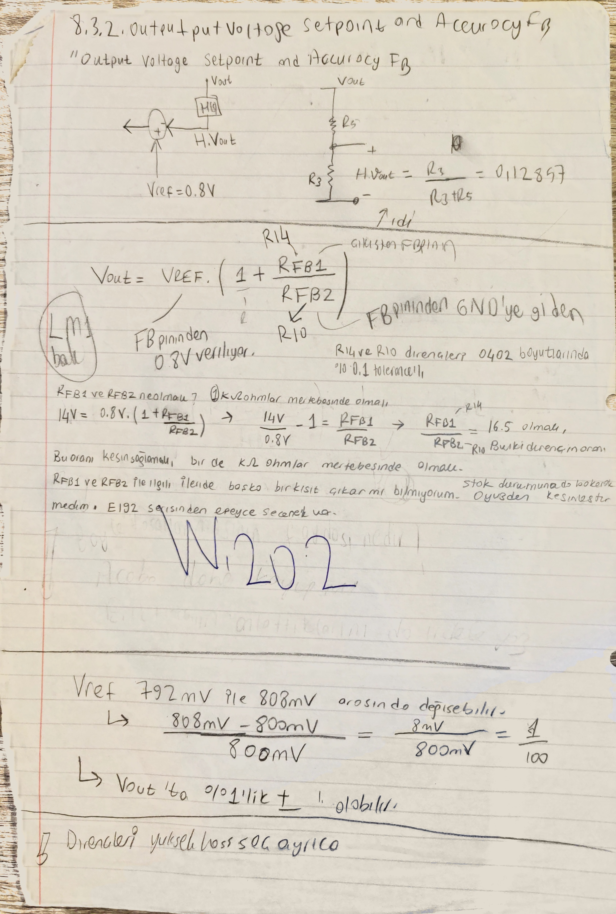

# Kontrolcü ve Kompanzasyon

[README özetine dön](README.md)

## Bu Dosyanın Amacı

Bu dosya feedback divider, plant modelinin kontrol tarafındaki kullanımı, modülatör referansı, crossover hedefi, faz marjı, K-factor, Type-III komponent seti ve loop cross-checklerinin primary owner'ıdır.

Burada güç katı yeniden tasarlanmıyor. `L`, `Cout`, `ESR`, `DCR`, `Rdamp`, `f0`, ripple ve transient sayıları [03](03_bobin_ve_cikis_kapasitorleri.md) dosyasından gelir. Giriş kapasiteleri, input-filter ve EMI bağlantıları [04](04_giris_kapasitorleri_ve_giris_agi.md) ve [08](08_emi_giris_filtresi_ve_yerlesim.md) tarafına aittir. Bu dosyanın işi, o fiziksel plant'i kontrol döngüsü içinde nasıl kullandığımı ve Type-III kompanzatörü hangi izlerle seçtiğimi göstermektir.

## Kapsadığı Eski README Başlıkları

- `## 6. Kontrolcu ve Kompanzasyon Owner`
- `### 6.1 Feedback divider`
- `### 6.2 Plant modeli ve modulator referansi`
- `#### 6.2.1 Genel kontrol yapisi`
- `#### 6.2.2 Modulator blogunun rolu`
- `#### 6.2.3 Cikis filtresi ve yuk`
- `#### 6.2.4 Bu bolumde korunacak ayrim`
- `### 6.3 Hedef fc ve faz marji`
- `### 6.4 K-factor mantigi ve Type-III komponent seti`
- `#### 6.4.1 Neden bu yontem?`
- `#### 6.4.2 Taslaktaki akisin ozeti`
- `#### 6.4.3 Scriptlerde gorulen ilk ipuclari`
- `#### 6.4.4 Bu projede K-factor'un gorevi`
- `##### Defter taramasi: W.1-W.24`
- `#### 6.4.5 Compensator topolojisi ve temel model`
- `### 6.5 Calculator / defter frekans yerlestirme cross-checkleri`
- `#### 6.5.1 Ilk ilke`
- `#### 6.5.2 Defterden gelen ilk sayisal adaylar`
- `#### 6.5.3 Sonraki sikilastirma hedefleri`
- `### 6.6 Faz, kazanc marji ve WEBENCH cross-checkleri`
- `#### 6.6.1 Taslak hedef bandi`
- `#### 6.6.2 Neden bu kadar onemli?`
- `#### 6.6.3 Kararlilik kriterinin bu projedeki anlami`

## Upstream / Downstream Okuma Bağlantıları

- Upstream global girdiler: [01](01_tasarim_girdileri_ve_kaynaklar.md)
- Upstream startup / `fsw` / duty / timing: [02](02_startup_pin_programlama_ve_ortak_sabitler.md)
- Upstream plant ve output filter: [03](03_bobin_ve_cikis_kapasitorleri.md)
- Upstream giriş ağı / input-filter handoff: [04](04_giris_kapasitorleri_ve_giris_agi.md)
- Upstream kayıp / bootstrap / protection etkileri: [06](06_kayiplar_bootstrap_koruma_ve_termal_kapanis.md)
- Downstream EMI ve giriş filtresi kararlılığı: [08](08_emi_giris_filtresi_ve_yerlesim.md)
- Downstream simülasyon ve açık sorular: [09](09_simulasyon_gorseller_ve_acik_sorular.md)

## Owner Notu

Bu dosyada tam anlatımı yapılacak kümeler:

- `RFB1/RFB2`, `VFB = 0.8 V`, eski/güncel feedback divider ayrımı
- modülatör kazancı ve `kFF = 15 V/V` kontrol referansı
- plant modelinin kontrol transfer fonksiyonuna nasıl girdiği
- `fc`, faz marjı, kazanç marjı ve hedef bandı
- K-factor mantığı
- Type-III `RC/CC` komponent ailesi, kutup/sıfır yerleşimi ve aday/final ayrımı
- calculator / defter / WEBENCH loop-response çapraz teyitleri

Owner dışı kalanlar:

- `ILIM/Rilim/Cilim`: [06](06_kayiplar_bootstrap_koruma_ve_termal_kapanis.md)
- output capacitor / plant fiziksel değerleri: [03](03_bobin_ve_cikis_kapasitorleri.md)
- input filter ve Middlebrook/EMI: [08](08_emi_giris_filtresi_ve_yerlesim.md)

## Okuma Haritası

| Sıra | Bu owner'daki blok | Primary içerik |
|---:|---|---|
| 1 | Feedback divider | `RFB1/RFB2`, `VFB`, eski/güncel set ve calculator teyidi |
| 2 | Modülatör ve plant referansı | `Hmod`, `Hfilter`, hangi sayının plant'ten geldiği |
| 3 | Crossover / faz marjı | `fc ≈ 35 kHz`, `PM ≈ 55 deg`, `GM` okuma kuralı |
| 4 | K-factor | hedef frekansta gereken faz/kazanç katkısı ve `K` mantığı |
| 5 | Type-III komponent seti | `RC1/RC2/CC1/CC2/CC3`, kutup/sıfır yerleşimi |
| 6 | Cross-check | calculator, defter, WEBENCH ve eski iterasyon ekranları |
| 7 | Açık kontroller | LTspice/PSpice AC sweep ve köşe koşul kapanışları |

## Kontrol Döngüsü Scope'u

Burada güç katından kontrol tarafına geçiyorum. Averaged kontrol modelinde ana bloklar:

- modülatör,
- power-stage / output filter / yük,
- hata yükselteci ve Type-III kompanzatör,
- feedback divider.

Bootstrap, gate-drive, dead-time, gerçek switching kenarları ve protection ayrıntıları ilk averaged kontrol modelinde idealize edilir; final doğrulamada [06](06_kayiplar_bootstrap_koruma_ve_termal_kapanis.md), [08](08_emi_giris_filtresi_ve_yerlesim.md) ve [09](09_simulasyon_gorseller_ve_acik_sorular.md) tarafında geri gelir.

## Feedback Divider

[Güncel Omurga] `RFB1/RFB2` ailesinin primary owner'ı burasıdır. Geri besleme bölücüsünün denklemi, eski/güncel aday ayrımı, calculator teyidi ve kompanzasyonla bağlantısı burada tutulur.

ODT'den aktarılan ilk not:

```text
Vout = 14 V yapmak istiyoruz.
RFB1 = 16.5 kOhm
RFB2 = 1.00 kOhm
Dirençleri %0.1 tolerance'lı seçmek...
```

Temel setpoint ilişkisi:

$$
V_{out}=V_{FB}\left(1+\frac{R_{FB1}}{R_{FB2}}\right)
$$

### Eski ve Güncel Bölücü Ayrımı

[Eski İterasyon] İlk taslak:

$$
V_{out}=0.8\left(1+\frac{16.5}{1.0}\right)=14.0\,V
$$

```text
RFB1 = 16.5 kOhm
RFB2 = 1.00 kOhm
```

[Güncel Omurga] Defter taraması `W.14-W.16` ve satın alınmış BOM çizgisi:

```text
R11 / R1 / RFB1 = 26.4 kOhm
R10 / RFB2      = 1.6 kOhm
```

$$
V_{out}=0.8\left(1+\frac{26.4}{1.6}\right)=14.0\,V
$$

[Çapraz Teyit - quickstart calculator] `LM5146_quickstart_calculator_revB1.xlsm` aynı aileye yakın durur:

```text
RFB1 = 26.4 kOhm
RFB2 = 1.58 kOhm
Actual Vout = 14.167 V
```

Bu ayrım kontrol hesabı için önemlidir. Feedback divider değiştiğinde:

$$
H_{FB}=\frac{R_{FB2}}{R_{FB1}+R_{FB2}}
$$

ve kompanzatörün referans aldığı sense oranı da değişir. Eski `16.5 kOhm / 1.00 kOhm` setiyle bulunan kompanzatör değeri, güncel `26.4 kOhm / 1.6 kOhm` setine sessizce taşınmayacak.


Bu foto, geri besleme bölücüsünün `RFB1/RFB2` kimliğini ve kompanzatör kolundaki elemanları tek bakışta bağlar.

### `W.202`: Setpoint Denklemi ve `VREF` Toleransı



[Tasarım İzi] `W.202` tam sayfası, `FB` bölücünün ilk kurulum mantığını ve referans toleransının çıkışa nasıl taşınacağını aynı yerde tutar. Sayfada görünen ana izler:

- datasheet başlığı: `Output Voltage Setpoint and Accuracy FB`,
- `FB` pininin `0.8 V` referansla karşılaştırıldığı kontrol sezgisi,
- çıkıştan `FB` pinine giden direnç bölücü,
- `Vout = VREF * (1 + RFB1/RFB2)` ilişkisi,
- 14 V için ilk oran hedefi: `RFB1/RFB2 = 16.5`,
- `R14/R10` veya `RFB1/RFB2` dirençlerinin `0402` ve `%0.1` tolerans bağlamında düşünülmesi,
- `VREF = 792 mV ... 808 mV` aralığının yaklaşık `%1` çıkış toleransı etkisi.


`W.202`, LM5146 datasheet'indeki `Output Voltage Setpoint and Accuracy FB` başlığı üzerinden kurulan ilk feedback notudur:

```text
VREF = 0.8 V
HVout = R2 / (R3 + R5) ≈ 0.12857
```

Temel oran:

$$
\frac{14\,V}{0.8\,V}-1=\frac{R_{FB1}}{R_{FB2}}=16.5
$$

Bu sayfa eski `16.5 kOhm / 1.00 kOhm` iterasyonunu destekler. Güncel `26.4 kOhm / 1.6 kOhm` çizgisini iptal etmez; bölücünün ilk nasıl kurulduğunu gösterir.

`W.202` ayrıca `VREF` toleransının çıkışa taşınacağını not eder:

```text
VREF = 792 mV ... 808 mV
(808 mV - 800 mV) / 800 mV = 1/100
```

Yani `VREF` toleransı `Vout` üzerinde yaklaşık `±1%` seviyesinde görülebilir.

## Modülatör ve Plant Referansı

### Genel Kontrol Yapısı

Kontrol döngüsü şu bloklar üzerinden okunur:

- `Vref`,
- feedback divider / sense,
- error amplifier / Type-III compensator,
- voltage-mode modulator,
- power stage / output filter / load,
- `Vout`.


`p85`, `Vref -> compensator -> modulator -> filter -> Vout` döngüsünü sade haliyle gösterir. `p86`, aynı yapıyı `L_f`, `Cout`, `R_ESR`, `R_DAMP`, gate-driver ve feedback bölücüyle birlikte gösterir. Bu görseller, soyut loop dili ile Type-III/plant denklemleri arasındaki geçiştir.

### Modülatör Bloğu

ODT notu:

```text
Modulator frekansa bağımlı değildir.
Duty cycle'ı belirler.
Compensator bloğundan gelen işaret artarsa duty cycle artar,
Q1 ana MOSFET daha uzun süre iletimde kalır.
```


Modülatör transfer fonksiyonu:

$$
H_{mod}(s)=\frac{V_{in}}{V_{ramp}}=k_{FF}=15\,V/V
$$

LM5146-Q1 input-voltage feedforward kullandığı için `Vin` artınca rampa da ölçeklenir; ilk modelde modülatör kazancı yaklaşık sabit alınır:

$$
V_{ramp}\approx\frac{V_{in}}{15}
$$

$$
H_{mod}(s)\approx15
$$

Bu `15 V/V`, K-factor ve loop hesabına giren modülatör kazancıdır. Güç katı kararı değildir.

### Plant Girdilerinin Owner Haritası

[Referans Notu] Aşağıdaki değerler bu dosyanın fiziksel komponent kararı değildir. Kontrol modeline giren plant değerleri [03](03_bobin_ve_cikis_kapasitorleri.md) dosyasından gelir.

| Plant girdisi | Değer / iz | Primary owner |
|---|---:|---|
| `L_F` | `6.8 uH` | [03](03_bobin_ve_cikis_kapasitorleri.md) |
| bobin `DCR` | `≈ 0.88 mOhm` | [03](03_bobin_ve_cikis_kapasitorleri.md) |
| etkin ana `Cout` | `≈ 70 uF` | [03](03_bobin_ve_cikis_kapasitorleri.md) |
| `C28` | `0.1 uF`, ana enerji hesabı değil; HF yardımcı | [03](03_bobin_ve_cikis_kapasitorleri.md) |
| `ESR_Ceq` | açık kontrol: `0.28 mOhm`, `0.26 mOhm`, `1.3 mOhm` izleri | [03](03_bobin_ve_cikis_kapasitorleri.md) |
| `R_damp` | `≈ 21.13 mOhm` | [03](03_bobin_ve_cikis_kapasitorleri.md) |
| `f0` | `≈ 7.309 kHz` | [03](03_bobin_ve_cikis_kapasitorleri.md) |
| input filter / giriş ağı | kontrol-loop etkisi ayrı kontrol edilecek | [04](04_giris_kapasitorleri_ve_giris_agi.md), [08](08_emi_giris_filtresi_ve_yerlesim.md) |

Bu tablo plant sayılarının 07'ye taşındığı anlamına gelmez. 07 yalnız bu sayıların `Hfilter(s)` ve loop hesabında nasıl kullanıldığını gösterir.

### Çıkış Filtresi ve Yük Modeli


Sade eşdeğer devrede seri kolda `L_f` ve `R_damp`, çıkış düğümünde ise `Cout + R_ESR` kolu ve `R_load` birlikte düşünülür.

Kontrol tarafında kullanılan filtre transfer fonksiyonu:

$$
H_{filter}(s)=\frac{V_{out}}{V_{in}}=
\frac{1+C_{out}R_{esr}s}{a_0+a_1s+a_2s^2}
$$

Buradaki `Vin` yazımı dikkat ister. Modülatör tarafındaki gerçek giriş gerilimiyle karıştırılmayacak; burada output filter'ın averaged switch-node / power-stage girdisine göre normalize edilmiş aktarımı gibi okunur. Loop hesabında bu blok `Hmod` ile birlikte kullanılır.

Katsayılar:

$$
a_0=1+\frac{R_{Damp}}{R_{load}}
$$

$$
a_1=\frac{L_F}{R_{load}}+R_{esr}C_{out}+R_{Damp}C_{out}
+\frac{R_{Damp}R_{esr}C_{out}}{R_{load}}
$$

$$
a_2=\left(\frac{R_{load}+R_{esr}}{R_{load}}\right)L_FC_{out}
$$

Sayısal yerleştirme:

$$
a_0=1+\frac{21.13\,m\Omega}{1.59\,\Omega}=1.01329
$$

$$
a_1=\frac{6.8\,\mu H}{1.59\,\Omega}
+(0.26\,m\Omega)(70\,\mu F)
+(21.13\,m\Omega)(70\,\mu F)
+\frac{(21.13\,m\Omega)(0.26\,m\Omega)(70\,\mu F)}{1.59\,\Omega}
=5.774\times10^{-6}
$$

$$
a_2=\left(\frac{1.59\,\Omega+0.26\,m\Omega}{1.59\,\Omega}\right)(6.8\,\mu H)(70\,\mu F)
=4.761\times10^{-10}
$$

$$
C_{out}R_{esr}=(70\,\mu F)(0.26\,m\Omega)=1.82\times10^{-8}
$$

Yaklaşık biçim:

$$
H_{filter}(s)\approx
\frac{1+1.82\times10^{-8}s}
{1.01329+5.774\times10^{-6}s+4.761\times10^{-10}s^2}
$$

[Açık Kontrol] Buradaki `0.26 mOhm`, [03](03_bobin_ve_cikis_kapasitorleri.md) dosyasında açık tutulan `0.28 mOhm / 0.26 mOhm / 1.3 mOhm` ESR ailesinden biridir. Final plant modeli tek `ESR_Ceq` değeri seçilmeden kapanmış sayılmayacak.


Bu görseller kontrol plant'inin yalnız bobinden ibaret olmadığını gösterir: `L_F`, `Cout`, `R_ESR`, `R_load` ve damping yolları birlikte ikinci dereceden bir yapı kurar.


Bu harita yöntem haritasıdır; sayısal modelin son hali yerine geçmez.

## Crossover Hedefi, Faz Marjı ve Kazanç Marjı

[Güncel Omurga] Bu iterasyondaki kontrol hedefi:

```text
fsw = 332 kHz
ilk kural: fc ≈ fsw / 10 ≈ 33.2 kHz
çalışma hedefi: fc ≈ 35 kHz
hedef PM bandı: 50 deg - 60 deg
aktif defter hedefi: PM = 55 deg
calculator ekranları: 35 kHz civarında 52-54 deg
WEBENCH / amCharts izi: fc ≈ 34.83 kHz, PM ≈ 55.75 deg
```

Bu sayılar tasarım niyeti ve merkez-nokta teyididir. Final kabul, aynı `RFB1/RFB2`, aynı Type-III komponent seti ve aynı plant modeli üzerinde LTspice/PSpice AC sweep ve köşe koşullarla kapanacak.

## K-factor Mantığı

### Neden K-factor?

ODT notu:

```text
Bitirme Projesi 1 dersinde kontrolcü tasarımını
gerilim kontrollü Type 3 PID Compensator yöntemiyle yapmıştım.
Bu dönemde K-factor yöntemini izleyeceğim.
```

K-factor burada yeni bir etiket değil; aynı Type-III problemini daha izlenebilir kurma yolu:

- hedef crossover frekansında gereken faz katkısını hesaplatır,
- kompanzatör kazancını plant ve modülatörle birlikte ele alır,
- Type-III eleman değerlerini takip edilebilir bir sıraya bağlar.

### Yöntem Akışı

Yerel notlar ve K-factor örnek akışı:

1. hedef crossover frekansı seçilir,
2. hedef faz marjı seçilir,
3. plant ve modülatörün crossover frekansındaki fazı bulunur,
4. kompanzatörün sağlaması gereken ek faz bulunur,
5. kompanzatörün crossover frekansındaki gereken kazancı bulunur,
6. `K` faktörü hesaplanır,
7. Type-III ağın `R` ve `C` değerleri türetilir.

Scriptlerde görülen genel ilişki:

$$
K=\tan^2\left(\frac{\phi_{comp}+90^\circ}{4}\right)
$$

`f_t = 0.1 f_s` satırı `35 kHz` hedefiyle kavga eden ikinci hedef değildir. `332 kHz` için `33.2 kHz` verir; calculator / WEBENCH / defter çizgisi `~35 kHz` civarında oturur.

### `W.1`: Gerekli Kompanzatör Kazancı


`W.1`, crossover noktasında kompanzatörün gereken kazancını çıkarır:

```text
ft = 35 kHz
M = Vs / Vramp = 15
|F(jwt)| ≈ 0.045356
```

Crossover'da unity-gain şartı:

$$
|L(j\omega_t)|=|M(j\omega_t)|\,|F(j\omega_t)|\,|G_3(j\omega_t)|=1
$$

Gerekli kompanzatör kazancı:

$$
|G_3(j\omega_t)|=
\frac{1}{15\cdot0.045356}\approx1.46985
$$

$$
20\log_{10}(|G_3|)\approx3.3454\,dB
$$

Bu `1.46985 / 3.3454 dB`, sabit nihai kompanzatör kazancı değildir. `|F(jwt)|`, `70 uF`, `6.8 uH`, `Rdamp`, `ESR`, yük ve seçilen `fc` noktasına bağlıdır.

[Tasarım İzi] Tam sayfa `p166`, aynı hesabın daha geniş defter bağlamıdır. Sayfada `ft = 35 kHz` noktasında loop büyüklüğünün `1` olması gerektiği yazılır; `M = Vs/Vramp = 15` modülatör kazancı olarak kullanılır. `|F(jwt)|` için plant transfer fonksiyonunun uzun ifadeli büyüklük hesabı görünür ve bu ara sonuç `0.045356` olarak taşınır. Bu sayfa yeni final `fc` veya yeni komponent değeri üretmez; `W.1`deki küçük kırpımın kaynak izini tamamlar.

### `W.2-W.12`: Faz Bütçesi, Modülatör ve İlk Kırılımlar


[Tasarım İzi] Tam sayfa `p167`, `W.2` faz bütçesi devamıdır. Plant tarafı `F(jwt) = (A + jB)/(C + jD)` biçiminde açılır; sayfada `1 + j0.0004002` ve `-22.0102 + j1.2824` gibi ara kompleks terimler görülür. Defterde `∠F(jwt) = 0.2293 - 176.665 = -176.43°` olarak okunur.

[Tasarım İzi] Aynı sayfa, hedef `PM = 55°` için `PM = 180° + ∠L(jfc)` ilişkisini kullanır; buradan `∠L(jfc) = -125°` çizgisi çıkar. Loop fazı `∠L(jfc) = ∠M(jw) + ∠F(jw) + ∠G3(jw)` olarak ayrılır; `∠M(jw)` yaklaşık `0°`, `∠F(jw)` yaklaşık `-176.43°` alındığında kompanzatörün sağlayacağı faz katkısı `∠G3(jw) = 176.43 - 125 = 51.43°` gibi okunur.

[Açık Kontrol] Sayfada ayrıca büyük yazıyla `231.43°` gibi toplam/alternatif faz yazımı da görünür. `51.43°` kompanzatör katkısı ile `231.43°` yazımı sessizce tek anlama indirgenmedi; faz sarımı / `+180°` gösterim tercihi final notasyon kontrolünde netleştirilecek.


[Tasarım İzi] Tam sayfa `p168-p169`, `W.3` plant cebirinin defter izidir. p168 üzerinde seri `L`, çıkış düğümünde paralel `C` ve yük `R` çizilir; notta `(R || Zc) + ZL` benzeri eşdeğer empedans okuması görünür. p169 bu paralel kolu `R || 1/sC` olarak açar ve `R/(sCR+1)` biçimine indirir; ardından `sL` terimiyle aynı paydaya getirme karalaması yapılır.

[Çapraz Teyit] Bu iki sayfa fiziksel `L`, `Cout`, `ESR`, `Rdamp` veya yük değerlerinin primary owner'ı değildir. O değerler [03](03_bobin_ve_cikis_kapasitorleri.md) dosyasında kalır; burada yalnız `F(s)` / output-filter plant transfer fonksiyonuna giden cebirsel ara yol korunur.


[Eski İterasyon / Tasarım İzi] Tam sayfa `p170-p171`, hedef `PM = 55°` için gereken kompanzatör faz katkısını başka bir ara çizgide kurar. p170 üzerinde `fc = 10 kHz` gibi okunan eski/alternatif crossover notu vardır; bu, bu dosyadaki güncel `~35 kHz` hedefiyle sessizce birleştirilmeyecek. Aynı sayfa `PM = 180° + ∠L(jfc) = 55°` ilişkisinden `∠L(jfc) = -125°` koşulunu çıkarır ve `∠L(jw) = ∠M(jw) + ∠F(jw) + ∠G3(jw)` ayrımını kullanır.

[Tasarım İzi] p171, `F(jw)` fazını pay/payda açı farkı olarak okur. Sayfada `∠F(jw) ≈ -146°` notu, ardından `-125° = 0 + -146° + ?` çizgisi ve buradan `∠G3(jw) ≈ 21°` sonucu görünür. Bu `21°`, kompanzasyon ağının katkısı olarak not edilir; error amp faz gösterimi için `phi_comp = 21° + 180° = 201°` yazılır.

[Açık Kontrol] `p167` üzerinde `∠F(jwt) ≈ -176.43°` ve `∠G3 ≈ 51.43°` hattı, `p170-p171` üzerinde ise `∠F ≈ -146°` ve `∠G3 ≈ 21°` hattı vardır. Bu iki sonuç farklı `fc` / plant varsayımı veya faz sarımı bağlamı gibi durur; tek final faz bütçesi gibi birleştirilmedi.


Bu grup tek nihai komponent listesi değildir. Rolleri:

- `W.2`, `W.5`, `W.11`, `W.12`: `PM = 55 deg` hedefi için plant fazı ve gerekli kompanzatör faz katkısı.
- `W.6`: unity-gain büyüklük kontrolü.
- `W.7`: hata yükselteci açık-çevrim kutbu.
- `W.8`, `W.10`: modülatör kazancı ve duty ilişkisi.
- `W.9`: ilk kırılım frekansı tablosu.

### `W.13-W.16` ve `W.20-W.24`: Type-III Komponent Ailesine Yaklaşım


[Tasarım İzi] `W.13` daha çok alternatif/ara iterasyon gibi durur. `W.14-W.16`, satın alınmış BOM ve calculator çizgisiyle daha uyumlu finale yakın aileyi gösterir.

Finale yakın defter ailesi:

```text
R11 / R1 / RFB1 = 26.4 kOhm
R10 / RFB2      = 1.6 kOhm
R6 / R2 / RC1   = 6.65 kOhm
R9 / R3 / RC2   = 768 ohm
C1              = 120 pF
C2              = 4.7 nF
C3              = 1.0 nF
```

Calculator isimlendirmesiyle aynı aile:

```text
RFB1 = 26.4 kOhm
RFB2 = 1.58 kOhm
RC1  = 6.65 kOhm
RC2  = 768 ohm
CC1  = 4.7 nF
CC2  = 120 pF
CC3  = 1.0 nF
fc   = 35 kHz
fp2  = 166 kHz
```

[Açık Kontrol] Defterdeki `C1/C2/C3` isimleri ile calculator `CC1/CC2/CC3` isimleri birebir aynı sırada yazılmayabilir. Fiziksel komponent eşlemesi `p58` ve calculator satırıyla final tabloda tek kez kapatılacak.

## Type-III Kompanzatör Topolojisi

### Topoloji ve Sembol Haritası


Bu görseller Type-III ağın `Rc1`, `Rc2`, `RFB1`, `RFB2`, `Cc1`, `Cc2`, `Cc3` isimleriyle nasıl okunacağını gösterir. `p24` genel analog kompanzatör sezgisi verir; `p57`, `p58` ve `p89` LM5146 tarafındaki gerçek sembollere bağlar.


[Tasarım İzi] `p042-p043`, Type-III topolojisinin yalnız komponent listesi olmadığını, hata yükselteci çevresindeki iki empedans ağı üzerinden kurulduğunu gösterir. Defterde `ZF` yeşil geri besleme ağı, `Z1` mavi giriş/sense ağı olarak ayrılır ve kompanzatör kazancı yaklaşık `A(s) = Vc/V0 = -ZF/Z1` biçiminde okunur. `p042` üzerinde `Z1 = R1 || (R3 + 1/(sC2))` ve `ZF = 1/(sC3) || (R2 + 1/(sC1))` yazımı görünür; `p043` bu paralel empedansların cebirsel açılımını sürdürür. Bu iki sayfa final komponent seti üretmez, mevcut Type-III sembol haritasının defterdeki ham türetim izidir.

[Açık Kontrol] `p042` üzerinde üst kol kondansatörü `C3 = 390 pF` gibi, mavi ağdaki `C2` de `560 pF` / `5600 pF` ayrımını kesinleştirmeye muhtaç şekilde okunur. Aşağıdaki `W.142-W.143` eski aday satırlarında yer alan `C3 ≈ 290 pF` ve `C2 ≈ 5600 pF` değerleriyle sessizce birleştirilmedi; fiziksel `CC1/CC2/CC3` eşlemesi calculator ve şema üzerinden ayrıca kapatılacak.

### Kompanzatör ve Hata Yükselteci Modeli

Kompanzatör transfer fonksiyonu:

$$
H_{compensator}(s)=\frac{V_{control}}{V_{sense}}=
\frac{H_{error-amp,ol}(s)}
{1+H_{error-amp,ol}(s)\beta(s)}
$$

Error amplifier açık-çevrim modeli:

$$
H_{error-amp,ol}(s)=\frac{A_{VOL}}{1+\dfrac{s}{\omega_{opamp}}}
$$

$$
\omega_{opamp}=2\pi\frac{GBW}{A_{VOL}}
$$


`W.201`:

```text
A_VOL = 94 dB
GBW = 6.5 MHz
A_VOL ≈ 10^(94/20) ≈ 50118
f_opamp ≈ 6.5 MHz / 50118 ≈ 129.7 Hz
```

Bu `129.7 Hz`, loop crossover frekansı veya Type-III kutup/sıfır hedefi değildir. Hata yükseltecinin açık-çevrim baskın kutbunu temsil eder. Calculator veya LTspice modeli bu kutbu zaten içeriyorsa ikinci kez elle eklenmemelidir.

Open-loop kavramsal ifade:

$$
H_{open-loop}(s)=H_{mod}(s)\,H_{filter}(s)\,H_{compensator}(s)
$$

Referans düğümü dikkat ister. `Hcompensator = Vcontrol/Vsense` olarak yazılıyorsa feedback bölücü bu tanımın girişinde durur. Open-loop doğrudan `Vout` üzerinden yazılırsa ayrıca `HFB` çarpanı gerekir. `HFB` unutulmayacak ama iki kere de çarpılmayacak.


Bu poles/zeros haritası, plant modeli ve Type-III kompanzatörün aynı frekans resminde birlikte okunması içindir.

### Type-III Kutup / Sıfır Tasarım İzleri


`W.84`, kutup/sıfır yerleşiminin ilk ciddi taslağıdır. Güvenle okunan adaylar:

```text
fz1 ≈ 1 kHz
fz2 ≈ 3.44 kHz
fp2 ≈ 29 kHz
```

İlişki tipleri:

$$
C_2R_2\approx\frac{1}{2\pi f_{z1}}
$$

$$
C_4R_1\approx\frac{1}{2\pi f_{z2}}
$$

Sayfada ayrıca:

```text
H = 1/14 ≈ 0.12857
```

notu görünür. [Açık Kontrol] `1/14` matematiksel olarak `0.0714` eder; bu satır ya el yazısı/okuma karışmasıdır ya da kastedilen oran tam `1/14` değildir. Feedback / sense oranının sorgulandığını gösterdiği için korunur, ama final oran gibi kullanılmaz.


`W.85`, aday değerlerle kutup denklemlerini dener:

```text
Rc2 ≈ 100 ohm
RFB1 ≈ 21 kOhm
Cc3 ≈ 1 nF
Rc1 ≈ 8.06 kOhm
Cc1 ≈ 4.7 nF
Cc2 ≈ 100 pF
```

Yaklaşım:

$$
\omega_{p1}\approx\frac{1}{R_{c1}(C_{c1}\parallel C_{c2})}
\approx\frac{1}{R_{c1}C_{c2}}
$$

Sayfadaki sonuçlar:

```text
omega_p1 ≈ 1 / (8.06k * 100p) ≈ 1.24e6 rad/s
omega_p2 ≈ 1 / (100 * 1n) ≈ 1e7 rad/s
```

Hz karşılığı kabaca:

```text
fp1 ≈ 197 kHz
fp2 ≈ 1.59 MHz
```

Bu nedenle `W.84`teki `fp2 ≈ 29 kHz`, `W.85`teki `1.59 MHz` ve calculator / `W.112` tarafındaki `166 kHz` tek bir final `fp2` sonucu gibi birleştirilmeyecek.

`W.85` ayrıca:

```text
fz1 ≈ 4.334 kHz
```

izini bırakır. Bu değer `W.84`teki `3.44 kHz` ile aynı büyüklük mertebesindedir; final değildir, ara tasarım izidir.


`W.142`, final sayfa değil; Type-III ağın Bode eğimine katkılarını görsel olarak kurma egzersizidir. Okunan aday set:

```text
R1 ≈ 18 kOhm
R2 ≈ 2.74 kOhm
R3 ≈ 31.6 ohm
C1 ≈ 56 nF
C2 ≈ 5600 pF
C3 ≈ 290 pF
```


`W.143`, aynı adayın kırılım frekanslarını yazar:

$$
f_1=\frac{1}{2\pi R_2C_1}\approx10.526\,kHz
$$

$$
f_2=\frac{1}{2\pi R_2C_3}\approx152.4\,kHz
$$

$$
f_3=\frac{1}{2\pi R_3C_2}\approx89.934\,kHz
$$

$$
f_4=\frac{1}{2\pi R_1C_2}\approx1.57\,kHz
$$

[Açık Kontrol] `W.142`te okunan değerler aynen kullanıldığında bazı hızlı kontroller `f1/f2/f3` için farklı sonuçlar verebilir. Bu büyük olasılıkla `C1/C2/C3` değerlerinin `5.6/56/5600` veya `pF/nF` okunmasından ya da farklı aday setinden gelir. Frekanslar final kabul edilmeyecek; Bode-inşa izini korumak için tutulur.


`W.113`, `Cc1 || Cc2 ≈ Cc2` yaklaşımını açıklar:

$$
\omega_{p1}=\frac{1}{R_{c1}(C_{c1}\parallel C_{c2})}
\approx\frac{1}{R_{c1}C_{c2}}
$$

$$
C_{c1}\parallel C_{c2}=\frac{C_{c1}C_{c2}}{C_{c1}+C_{c2}}
$$

Varsayım:

```text
Cc2 << Cc1
```

Finale yakın `Cc1 = 4.7 nF`, `Cc2 = 120 pF` için oran yaklaşık `39:1`; paralel eşdeğer `~117 pF` civarına iner. Yaklaşım bu aday için makuldür, ama final `p1` değeri yine tek komponent setiyle tekrar yazılacak.


`W.114`, kompanzatör değil plant tarafındaki sıfırları hatırlatır:

$$
\omega_{ESR}=\frac{1}{R_{ESR}C_{out}}
$$

ve damping notu:

$$
\omega_L\approx\frac{R_{damp}}{L_F}
$$

`W.116` plant sayılarıyla hızlı kontrol:

$$
\omega_L\approx\frac{21.13\,m\Omega}{6.8\,\mu H}\approx3.1\times10^3\,rad/s
$$

$$
f_L\approx495\,Hz
$$

Bu değer Type-III hedefi değildir; plant modelinde damping/kayıp yolunun frekans cevabına etkisini hatırlatan izdir.

## Calculator / Defter Frekans Yerleştirme Cross-checkleri

### İlk İlke

İlk yaklaşım:

$$
f_{c,ilk}\approx\frac{f_{sw}}{10}
$$

Bu tasarımda:

$$
f_{c,ilk}\approx\frac{332\,kHz}{10}\approx33.2\,kHz
$$

Çalışma hedefi `35 kHz` çizgisidir.

### Defter Frekans Adayları ve Eski İterasyon

`W.23-W.24` içinde:

```text
0.1 fsw < fc < 0.2 fsw
332 kHz için yaklaşık 33.2 kHz < fc < 66.4 kHz
fo ≈ 7.309 kHz
fesr ≈ 8.74 kHz civarı not
```

Bu çizgi `fc ≈ 35 kHz` hedefiyle uyumludur; ama `W.23-W.24` bazı eski feedback bölücü notlarıyla karışmış olabilir.


[Eski İterasyon] `W.115`:

```text
fc = 60 kHz
Kmid = 0.547
Rc1 = RFB1 * Kmid
RFB1 = 16.5 kOhm
Rc1 ≈ 9.029 kOhm
fESR = 87.406 kHz
f0 = 7.309 kHz
fsw/2 = fp2 = 166 kHz
fp1 = 87.406 kHz
fz1 = f0/2 = 3.654 kHz
fz2 = f0 = 7.309 kHz
```

[Açık Kontrol] `fESR = 87.406 kHz` ile `W.23-W.24` içindeki `~8.74 kHz` notu doğrudan birleştirilmeyecek. Arada yaklaşık `10x` fark var; bu farklı ESR varsayımı, ondalık okuma veya eski iterasyon farkı olabilir.

### Calculator Görüntüleri


Okuma:

- [Eski İterasyon] `p56`, eski `RFB1 = 16.5 kOhm / RFB2 = 1 kOhm` çizgisinde `fc ≈ 23 kHz` ve `PM ≈ 4 deg` gibi zayıf sonucu gösterir.
- [Tasarım İzi] `p59`, eski feedback oranıyla bile `35 kHz / 53 deg` bandına yaklaşan ara checkpoint'tir.
- [Eski İterasyon] `p81-p83`, eski feedback ailesiyle `35 kHz` civarında faz marjı arama denemeleridir.
- [Çapraz Teyit] `p84`, güncel feedback çizgisiyle `35 kHz / 52 deg` checkpoint'idir.
- [Çapraz Teyit] `p91`, standart değerlerle `PM ≈ 54 deg` bandını ve `Vout ≈ 14.167 V` notunu gösterir.
- [Çapraz Teyit] `p102`, standart değer yuvarlamasının `PM ≈ 52 deg` civarına da kayabildiğini gösterir.
- [Çapraz Teyit] `p97`, K-factor'den gelen değerlerin `35 kHz / 53 deg` civarında makul sonuç verdiğini ima eder.

Bu ekranlar ayrı ayrı final tasarım değildir; aynı aday ailesinin hassasiyet aralığıdır.

### `W.112`: Frekans Yerleşimi Özeti


Plant tarafı:

$$
\omega_0\approx\frac{1}{\sqrt{L_FC_{out}}}
$$

$$
\omega_{ESR}\approx\frac{1}{R_{ESR}C_{out}}
$$

Kompanzatör tarafı:

$$
\omega_{p1}\approx\frac{1}{R_{c1}(C_{c1}\parallel C_{c2})}
\approx\frac{1}{R_{c1}C_{c2}}
$$

$$
\omega_{p2}\approx\frac{1}{R_{c2}C_{c3}}
$$

$$
\omega_{z1}\approx\frac{1}{R_{c1}C_{c1}}
$$

$$
\omega_{z2}\approx\frac{1}{(R_{FB1}+R_{c2})C_{c3}}
$$

Hedef / niyet notları:

```text
omega_p2 = omega_sw / 2
omega_z2 = omega_0
omega_ESR ≈ omega_p1
0.1 fsw < fc < 0.2 fsw
Erik Hoca: fc ≈ fsw / 10
```

`omega_p2 = omega_sw/2`, `332 kHz` için `166 kHz` çizgisine denk gelir ve calculator satırıyla uyumludur.

[Açık Kontrol] `omega_ESR ≈ omega_p1` ilişkisi son `Cout/ESR` değeriyle yeniden bağlanacak. `W.84-W.85-W.143` arasındaki `29 kHz`, `166 kHz`, `1.59 MHz` ve `f1-f3` farkları tek komponent seti seçilmeden kapatılamaz.

## Faz, Kazanç Marjı ve WEBENCH Cross-checkleri

### Hedef Bandı

Bu aşamada kendi MATLAB/LTspice AC sweep ile alınmış nihai Bode sonucu yok. Defter, calculator ve WEBENCH aynı hedef aralığına bakıyor:

```text
hedef PM bandı: 50 deg - 60 deg
aktif hedef: PM ≈ 55 deg
calculator: 52-54 deg
WEBENCH loop-response: fc ≈ 34.83 kHz, PM ≈ 55.75 deg
```

[Çapraz Teyit - WEBENCH loop] `amCharts.json` / WEBENCH loop-response sonucu burada merkez-nokta teyididir. Bu sonuç `35 kHz` hedefiyle uyumludur; fakat final kabul için aynı kompanzatör setiyle LTspice/PSpice AC sweep ve köşe koşullar gerekir.

Bu hedef bandı nominal tek nokta için değildir. Son kapanışta şu koşullara da bakılmalı:

- `Vin_min / Vin_max`,
- hafif yük / tam yük,
- derated `Cout/ESR`,
- giriş filtresi ekli / eksiz durum,
- gerçek kompanzatör toleransları.

### `W.25`: PM / GM Tanım Notu


`W.25`, sayısal proje sonucu değildir; Bode okumada hangi noktaya bakılacağını sabitler:

- birim kazanç frekansındaki faz açısından `PM`,
- faz `-180 deg` olduğundaki büyüklükten `GM`.

[Tasarım İzi] Tam sayfa `p165`, phase margin için okuma sırasını açık yazar:

```text
1) Transfer fonksiyonunun kazancının 1 veya 0 dB olduğu frekansı bul.
   Bu frekans wpm.

|T(jwpm)| = 1 veya 0 dB

2) Transfer fonksiyonunun bu wpm frekansındaki phase'ini oku.
   Genelde negatif derecedir.

3) PM = 180° + phi
```

Sağ kenardaki kararlılık notu, faz `-180°`e gelmeden önce kazancın çoktan `0 dB` altına inmiş olması gerektiğini hatırlatır. Bu cümle yeni final `PM` değeri üretmez; calculator / WEBENCH / LTspice Bode okumalarında hangi noktaya bakılacağını sabitler.

[Tasarım İzi] Aynı sayfa gain margin için de okuma sırasını verir:

```text
1) Bode'de transfer fonksiyonunun phase'inin -180° olduğu frekansı bul.
   Bu frekans wgm.

T(jwgm) = -180°

2) Bu wgm frekansındaki kazancı bul.
   Gpc = 20log10 |T(jwgm)|

3) GM hesabı dB'li ya da normal okunur.
   GM = 1 / |T(jwgm)|
```

Sayısal kapanış, seçilen Type-III komponentleriyle kurulacak open-loop Bode sonucunda yapılacak.

### Kararlılık Kriteri ve Kapalı Çevrim


ODT notunun ana fikri: load-step sırasında `Vout` cevabı yalnız zaman alanında değil, kapalı-çevrim transfer fonksiyonu üzerinden de okunur.

GitHub uyumlu matematik biçimi:

$$
H_{system}(s)=\frac{V_{out}}{V_{ref}}=
\frac{\text{Ileri Yol}}{1+\text{Acik Cevrim}}
$$

$$
H_{system}(s)=
\frac{H_{mod}(s)H_{filter}(s)}
{1+H_{mod}(s)H_{filter}(s)H_{compensator}(s)}
$$

$$
H_{open-loop}(s)=
H_{mod}(s)H_{filter}(s)H_{compensator}(s)
$$

Dolayısıyla:

$$
H_{system}(s)=
\frac{H_{mod}(s)H_{filter}(s)}
{1+H_{open-loop}(s)}
$$

[Açık Kontrol] `Vout/Vref`, `Vout/Vcontrol`, `Vcontrol/Vsense`, `Vout/duty` ve load-disturbance transfer fonksiyonları birbirine karıştırılmayacak. Faz marjı doğru görünse bile yanlış transfer fonksiyonu okunursa sonuç yanıltıcı olur.

## Güncel Kontrol Adayı Özeti

[Güncel Omurga] Bu dosyadaki ana aday çizgi:

| Küme | Değer / hedef | Nereden geliyor? |
|---|---:|---|
| `RFB1` | `26.4 kOhm` | defter `W.14-W.16`, BOM / calculator teyidi |
| `RFB2` | `1.6 kOhm` defter/BOM, `1.58 kOhm` calculator | feedback divider |
| `Vout` | `14 V`, calculator `14.167 V` | feedback divider |
| `Hmod` | `15 V/V` | LM5146 feedforward / modülatör |
| plant `L/C/ESR/Rdamp` | `6.8 uH`, `70 uF`, ESR açık aile, `21.13 mOhm` | [03](03_bobin_ve_cikis_kapasitorleri.md) |
| `fc` | `≈35 kHz` | `fsw/10`, calculator, WEBENCH |
| `PM` | hedef `55 deg`, teyit `52-55.75 deg` | defter / calculator / WEBENCH |
| `RC1` | `6.65 kOhm` | W.14-W.16 / calculator |
| `RC2` | `768 ohm` | W.14-W.16 / calculator |
| `CC1` | `4.7 nF` | calculator isimlendirmesi |
| `CC2` | `120 pF` | calculator isimlendirmesi |
| `CC3` | `1.0 nF` | calculator isimlendirmesi |
| `fp2` | `166 kHz` | calculator / `fsw/2` yerleşimi |

Bu tablo final doğrulama raporu değildir. Kontrol adayının şu anki okunabilir omurgasıdır.

## Açık Teknik Doğrulamalar

[Açık Kontrol] Kontrol/kompanzasyon kapanmadan önce çözülecekler:

- `RFB1/RFB2` için defter `26.4 kOhm / 1.6 kOhm` ile calculator `26.4 kOhm / 1.58 kOhm` farkı final BOM satırıyla kapanacak.
- Eski `16.5 kOhm / 1.00 kOhm` bölücü ile üretilmiş kompanzatör denemeleri güncel sete sessizce taşınmayacak.
- `HFB` / sense oranı open-loop modelde tek kez sayılacak.
- `Hfilter(s)` için kullanılan `ESR_Ceq` tek değer seçilecek; `0.28 mOhm / 0.26 mOhm / 1.3 mOhm` ailesi [03](03_bobin_ve_cikis_kapasitorleri.md) ile kapanacak.
- `W.84`, `W.85`, `W.112`, `W.143` içindeki `fp2 = 29 kHz / 166 kHz / 1.59 MHz` farkları tek komponent setiyle tekrar hesaplanacak.
- `W.143` içindeki `f1-f4` adayları birim ve komponent eşlemesiyle yeniden kontrol edilecek.
- `fc = 35 kHz` hedefi, `WEBENCH 34.83 kHz`, calculator `52-54 deg` ve LTspice/PSpice AC sweep aynı yöne işaret edecek mi kontrol edilecek.
- Giriş filtresi eklendiğinde loop marjı [08](08_emi_giris_filtresi_ve_yerlesim.md) ile birlikte tekrar okunacak.
- Load-step transient cevabı, `Zout(fc)` ve faz marjı aynı senaryo içinde karşılaştırılacak.
- `Avol/GBW` hata yükselteci modeli calculator/LTspice içinde zaten varsa ikinci kez elle eklenmeyecek.

## Owner Dışı Kısa Referanslar

- Startup, `fsw`, duty/timing ve `RT`: [02](02_startup_pin_programlama_ve_ortak_sabitler.md)
- Bobin, `Cout`, `ESR`, `Rdamp`, `f0`, `Zout`: [03](03_bobin_ve_cikis_kapasitorleri.md)
- Giriş kapasiteleri ve input ağı: [04](04_giris_kapasitorleri_ve_giris_agi.md)
- MOSFET seçim ve dayanım mantığı: [05](05_mosfet_secimi_ve_dayanim_mantigi.md)
- Bootstrap, protection/current-limit ve termal kapanış: [06](06_kayiplar_bootstrap_koruma_ve_termal_kapanis.md)
- EMI, input-filter stability ve layout: [08](08_emi_giris_filtresi_ve_yerlesim.md)
- Simülasyon planı ve açık sorular: [09](09_simulasyon_gorseller_ve_acik_sorular.md)
