# LM5146-Q1 Tabanli Buck Converter Tasarimi


Bu belge, ikinci buck converter tasariminin ana calisma dokumanidir.

Bu dosya iki seyi ayni anda tasir:

- nihai tasarima giden teknik omurgayi
- o omurgaya nasil ulasildigini gosteren secilmis tasarim izlerini

Hesaplarin omurgasi dogrudan defterden geliyor. O yuzden bu belgede yan yana sunlar bulunabiliyor:

- nihaiye yakin hesap
- alternatif yontem
- capraz teyit
- eski iterasyon
- hata zinciri nedeniyle sonradan zayiflayan hesap

Bu, belgeyi zayiflatan bir sey degil; tam tersine tasarim surecinin gercek izini koruyan kisim.

Bu belge:

- yalnizca "temiz final sonuc" metni gibi okunmamalidir
- ama ham defter yigini gibi de okunmamalidir

En rahat su sirayla okunur:

- `2. Durum Ozeti` ve `3. Tasarim Hedefleri` bolumleri repo'nun mevcut seviyesini ve hedefini verir
- `4. Kullanilan Ana Kaynaklar` tasarim kararlarinin dayandigi ana belge ailesini gosterir
- `5` ve `6` numarali bolumler guc katini ve kontrol tasarimini tasir
- `7` numarali bolum EMI, giris filtresi ve yerlesim tarafini toplar

Ana yol haritasi: `tracking/master_plan.md`

Temel belge kurallari:

- yalnizca gercekten kullanilan kaynaklari govdeye tasiyin
- ham notlari oldugu gibi yigmak yerine izlerini koruyarak okunur hale getirin
- belgede gorunecek gorselleri mumkunse `images/` altinda temiz isimlerle kullanin


## 0. Calisma Plani


Bu belge icin ana sira su:

1. `yeni.odt` icerigini bolum bolum `yeni.md` dosyasina aktarmak

2. Defter notlarini ve hesaplamalari foto ile dijitale almak

3. Defter icerigini secerek ve temizleyerek ana belgeye tasimak

4. Tum belgeyi butuncul sekilde gozden gecirip sadeleştirmek, duzeltmek ve kaynaklari toparlamak

5. En son asamada MATLAB, LTspice ve gerekiyorsa OrCAD/PSpice ile teknik dogrulama yapmak

6. Sorun bulunursa hesaplari ve tasarimi revize edip belgeyi guncellemek


Ayrintili surum: `tracking/master_plan.md`

Su anki durum:

- `yeni.odt -> yeni.md` aktarimi tamamlandi
- aktif faz: defter notlarinin `foto/defter_raw/` uzerinden batch batch dijitale alinmasi
- takip dosyalari: `tracking/notebook_ingestion.md`, `tracking/notebook_batches.md`


## 1. Arka Plan


Ilk donemdeki tasarim, onceki tez calismasinda tamamlanan ve simulasyonla hedef spesifikasyonlari sagladigi gosterilen buck converter tasarimiydi. Buradaki yeni calisma ise onun uzerine kurulan ikinci iterasyon: daha ayrintili hesaplar, ek teknik gereksinimler ve daha bilincli komponent secimleri var.

Bu iterasyonda amac devreyi oldugu gibi tekrar etmek degil. Tasarim kararlarini daha guclu kaynaklarla ve daha sistematik hesaplarla desteklemek. Ozellikle kontrolcu tasarimi, kapasitör secimi, giris filtresi, EMI, MOSFET kayiplari ve bootstrap davranisi daha derin ele aliniyor.


## 2. Durum Ozeti


### 2.1 Ilk tasarim


Ilk tasarim tamamlanmis bir referans noktasi:

- simulasyonlari alinmistir

- temel spesifikasyonlari sagladigi gosterilmistir

- ilk donem raporunda anlatilmistir


Bu yuzden ilk tasarim, yeni calisma icin hem karsilastirma tabani hem de dogrulanmis baslangic noktasi.


### 2.2 Yeni tasarim


Yeni tasarim daha ileri bir noktayi hedefliyor:

- ek spesifikasyonlar tanimlanmistir

- ayrintili hesaplamalar yapilmistir

- notlarin bir kismi dijital dosyalarda, bir kismi fiziksel defterde kalmistir

- simulasyon dogrulamasi henuz tamamlanmamistir


Kisa ozet su: tasarim dusuncesi olgun, belge ve dogrulama ise hala toparlaniyor.


### 2.3 Tasarim yaklasimindaki degisim


`yeni.odt` taslagina gore ilk donemde kontrolcu tasarimi daha once ogrenilen yaklasimla kurulmustu. Bu iterasyonda ise Can Hoca'dan ogrenilen K-factor yontemi merkeze alinmis durumda. Bu degisim sadece kompanzasyon devresini degil, tum tasarim mantigini daha sistematik kurma istegini gosteriyor.


Bu turda agirlik verilen basliklar:

- LM5146-Q1 ve EVM referanslarinin ayrintili incelenmesi

- dusuk EMI tasarim yaklasimi

- giris ve cikis kapasitelerinin daha bilincli secimi

- pratik komponent ve yerlesim kararlarinin gerekcelendirilmesi


## 3. Tasarim Hedefleri


Bu bolum tek bir dogruluk kaynagi gibi kullanilmali.


| Parametre | Hedef / Sinir | Not |

| --- | --- | --- |

| Giris gerilimi | `24 V - 36 V` | ana calisma araligi |

| Giris gerilimi transient dayanim | `44 V`, `1 ms` | hayatta kalma siniri, bu aralikta regule calisma zorunlu degil |

| Cikis gerilimi, statik | `14 V +- 3%` | ana setpoint |

| Cikis gerilimi, transient | `14 V +- 20%` | minimum ve maksimum yuk adimlari sirasinda |

| Cikis gucu | `50 W - 125 W` | rezistif yuk |

| Cikis akimi, turetilmis | `3.571 A - 8.929 A` | $I_{out} = \dfrac{P_{out}}{V_{out}}$ |

| Yuk adimi | `3.571 A -> 9 A` | taslakta `5.429 A` load-step olarak not edilmis |


Bu notlu gorsel, cikis gerilimi spesifikasyonunun iki farkli zarfta dusunuldugunu netlestiriyor: dar mavi zarf statik regülasyon (`14 V +- 3%`), daha genis kirmizi zarf ise transient sirasindaki kabul alanini (`14 V +- 20%`) temsil ediyor. Defterde bu iki kriterin ayri ayri kullanilmis olmasi, daha sonra `W.58-W.59` tarafinda neden farkli `C_{out}` alt-sinirlarina bakildigini de daha okunur hale getiriyor.

| Anahtarlama frekansi | `332 kHz` | mevcut tasarim secimi, orijinal zorunlu spec degil |

| Izin verilen `Vout` ripple | `100 mVpp` | herhangi bir `Rload` icin |

| Izin verilen `Vin` ripple | `0.24 Vpp` | giris gerilimi peak-to-peak |

| Izin verilen `Vin` transient | `0.36 V` | undershoot veya overshoot limiti |

| Izin verilen giris akimi ripple | `50 mApp` | ideal kaynak varsayimi |

| Minimum verim | `90%` | gerilim ve yuk boyunca |

| Sicaklik hedefi | `76 degC` board worst-case | taslak spec notu |

| EMI hedefi | `CISPR 25 Class 5` | `pi-stage` giris EMI filtresi ve elektrolitik parallel damping hedefi |

| Harici bias/VCC | kullanilmayacak | harici bias secenegi bulunuyor ama bu iterasyonda kullanilmiyor |


## 4. Kullanilan Ana Kaynaklar


Gercek kaynak listesi icin `references/used_sources.md` dosyasini guncelle.

PDF kaynaklari bu belge icinde tiklanabilir olacaksa, dosyalari `references/pdfs/` altinda tut.


Su an icin cekirdek adaylar:

- `G94_SPEC.txt`

- `G31_Robert_Erikson_fundamentals-of-power-electronics-3n_2020.txt`

- [G32_lm5146-q1.pdf](./references/pdfs/G32_lm5146-q1.pdf)

- [G35_Basic Calculation of a Buck Converter's Power Stage (Rev. B).pdf](./references/pdfs/G35_Basic%20Calculation%20of%20a%20Buck%20Converter%27s%20Power%20Stage%20%28Rev.%20B%29.pdf)

- [G46_LM5146-Q1EVM User's Guide.pdf](./references/pdfs/G46_LM5146-Q1EVM%20User's%20Guide.pdf)

- [G101_The K Factor.pdf](./references/pdfs/G101_The%20K%20Factor.pdf)

- `G103_comp.txt`

- `G95_04_K_FACTOR_CAN_HOCA.txt`

- [G114_Simple Solution for Input Filter Stability Issue in DC_DC_slua929a.pdf](./references/pdfs/G114_Simple%20Solution%20for%20Input%20Filter%20Stability%20Issue%20in%20DC_DC_slua929a.pdf)

- [G112_Simple Success with Conducted EMI and Radiated EMI_snva755.pdf](./references/pdfs/G112_Simple%20Success%20with%20Conducted%20EMI%20and%20Radiated%20EMI_snva755.pdf)

- [G113_An Engineer’s Guide to Low EMI in DC_DC Regulators_slyy208.pdf](./references/pdfs/G113_An%20Engineer%E2%80%99s%20Guide%20to%20Low%20EMI%20in%20DC_DC%20Regulators_slyy208.pdf)

- [LM5146_quickstart_calculator_revB1.xlsm](./references/pdfs/LM5146_quickstart_calculator_revB1.xlsm)


### 4.1 `LM5146` quickstart calculator ile capraz teyit


Ek not (calculator teyidi):

Bu Excel dosyasi, defterde yapilan hesaplarin yerine gecen tek kaynak gibi degil; daha cok nihai tasarim omurgasini capraz teyit etmek icin kullanilan bir arac gibi okunmali.

Workbook'ta guclu bicimde tekrar eden ana tasarim omurgasi sunlardir:

- `V_{IN} = 24 / 30 / 36 V`
- `V_{OUT} = 14 V`
- `I_{OUT,max} = 9 A`
- `f_{sw} = 332 kHz`
- `R_{RT} = 30.1 kOhm`
- secilen bobin: `6.8 uH`
- bobin `DCR`: `0.88 mOhm`
- `C_{SS} = 47 nF`
- `t_{SS} = 4 ms`

Kompanzator tarafinda da workbook ile defterin nihaiye yakin gorunen cizgisi ayni aileye oturuyor:

- `RFB1 = 26.4 kOhm`
- `RFB2 = 1.58 kOhm`
- `RC1 = 6.65 kOhm`
- `RC2 = 768 Ohm`
- `CC1 = 4.7 nF`
- `CC2 = 120 pF`
- `CC3 = 1.0 nF`
- `f_c = 35 kHz`
- `f_{p2} = 166 kHz`

Bu nedenle, workbook ile bu Markdown belge arasindaki iliski su sekilde okunmali:

- workbook, tasarimin cekirdek nihai omurgasini guclu bicimde teyit ediyor
- defter ve `yeni.md` ise bunun uzerine eski iterasyonlari, alternatif yontemleri, komponent secim mantigini ve sonraki rafineleri de tasiyor
- ozellikle giris kapasitörü, UVLO ve bazi kayip parametrelerinde workbook daha erken / daha sade bir checkpoint olabilir; defterin sonraki sayfalarinda ise gercek komponent, `dc-bias`, `ESR` ve alternatif senaryolarla daha ileri rafine edilmis notlar bulunur

Bu yuzden workbook ile `yeni.md` iliskisi "birebir ayni tek iterasyon" gibi degil, "ayni tasarimin nihai omurgasi + defterde korunmus tasarim izi" seklinde dusunulmelidir


### 4.2 `WEBENCH` ile hizli simulasyon teyidi


Ek not (`WEBENCH` teyidi):

`WBDesign21.pdf`, nihai tasarimin yerine gecen tek ve mutlak dogrulama belgesi gibi okunmamalidir. Daha dogru okuma bicimi sunlardir:

Kaynak dosya:

- [WBDesign21.pdf](./WBDesign21.pdf)
- [amCharts.json](./BOM/amCharts.json)

- kullanicinin kendi hesaplariyla kurulan tasarim omurgasinin hizli davranis teyidi
- secilen komponent ailesinin ilk simulasyon tabanli sagduyu kontrolu
- statik calisma, ripple, verim ve loop davranisi icin hizli referans goruntu paketi

Bu nedenle `WEBENCH` ciktilari, "tek basina final kanit" degil; defter, hesap, calculator ve BOM secimi ile birlikte okunan hizli bir capraz teyit katmani olarak kullanilmalidir.

Bu raporun belge icinde en kullanisli kisimlari sunlardir:

- kapak / BOM ozeti (`24-36 V -> 14 V @ 9 A`, secilen ana komponent ailesi)
- operating values tablosu
- loop-response / bode verisi
- steady-state ve input-transient simulasyon ciktilari


Bu iki sayfa, `WEBENCH` raporunun yeni.md icinde en faydali kisimlaridir. Ilk sayfa filtre oncesi / sonrasi ripple spektrumu, filtre-empedans karsilastirmasi ve kisa operating-values ozetini birlikte veriyor. Ikinci sayfa ise ayni tasarim icin ayrintili sayisal sonuclari tek tabloda topluyor: `I_{L,pp}`, ripple yuzdesi, MOSFET kayiplari, toplam guc kaybi, verim, `V_{out}`, `V_{out,pp}` ve `V_{in,pp}` gibi maddeler burada dogrudan okunabiliyor.

Bu hizli teyitte guclu bicimde tekrar eden ana noktalar sunlardir:

- `V_{IN} = 24 - 36 V`
- `V_{OUT} = 14 V`
- `I_{OUT,max} = 9 A`
- `f_{sw} = 332.226 kHz`
- `Mode = FCCM`
- `SoftStart = 3.8 ms`
- `I_{L,pp} = 3.805 A`
- bobin ripple orani `42.277%`
- `Efficiency = 97.877%`

Kontrol kararliligi acisindan `WEBENCH` loop-response verisi de tasarim hedefiyle uyumludur. `amCharts.json` icindeki sayisal Bode verisine gore ana loop icin:

```math
f_c \approx 34.83 \,\text{kHz}
```

```math
PM \approx 55.75^\circ
```

Bu sonuc, defterde ve kompanzator hesabinda hedeflenen `f_c \approx 35 \,\text{kHz}` cizgisiyle iyi ortusur ve kapali cevrimin kararlilik acisindan makul oldugunu gosterir.

`WBDesign21.pdf` icinde statik calisma tarafinda olumlu gorunen basliklar da vardir:

- `Vout Actual = 13.8 V`, yani `14 V +- 3%` bandi icinde
- verim `%90` hedefinin belirgin ustundedir
- filtre sonrasi giris gurultusu `61.79 dBuV` olup, ayni raporda verilen `67.75 dBuV` sinirinin altindadir

Buna karsilik, ayni `WEBENCH` snapshot'inda henuz hedefe tam oturmayan veya dikkatli yorumlanmasi gereken noktalar da vardir:

- `Vout p-p = 122.002 mV`, yani `100 mVpp` hedefinin biraz ustunde
- `Vin p-p = 2.951 V`, yani defterdeki `0.24 Vpp` hedefi ile uyumlu degildir
- rapordaki ortam sicakligi `Ta = 30 degC` oldugu icin, `76 degC board worst-case` hedefini tek basina dogrulamaz

Bu nedenle `WEBENCH` sonucu icin en dogru ozet sudur:

- tasarimin temel calisma noktasi saglikli gorunmektedir
- loop response kararlidir ve `35 kHz` civari crossover hedefiyle uyumludur
- ancak ripple ve sicaklik gibi bazi hedefler icin bu snapshot tek basina nihai kanit olarak kullanilmamalidir


## 5. Guc Katinin Tasarimi


### 5.1 Topoloji ve temel varsayimlar


#### 5.1.1 LM5146-Q1 dahili LDO siniri


ODT'den aktarilan metin (`4.2. Giriş Gerilimi Vin`):

> Lm’nin içinde bir LDO (Low Dropout Regulator) barındırır. Bu LDO, 7.5V Vcc beslemesi sağlar, Mosfet kapı sürücülerini ve kontrol devrelerini besler.

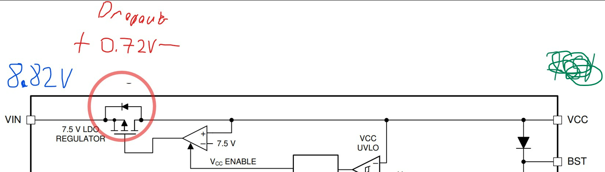

> VVCC-LDO VIN to VCC dropout voltage = 0.25V(typ) - 0.72V(max)
>
> Harici Vcc kullanılmayacaksa, LDO’nun düzgün çalışabilmesi için Giriş gerilimi Vin’in en az 7.5 V + 0.72V(max) = 8.22V olmalıdır.
>
> Yani Vin > 7.5V + dropout voltage olursa, Vcc gerilimi 7.5V sabitlenir. Vin = 9V iken de Vin = 50 V iken de Vcc = 7.5V olur. :*
>
> Eğer Vin < 7.5V + dropout voltage olursa
> LDO regulatorü, 7.5V’u çıkaramaz. Denklem geçerlidir.
> Örneğin giriş gerilimi Vin = 6V olsun.
> Vcc gerilimi en iyi ihtimalle 6V-0.25V= 5.75 V olur.
> Vcc gerilimi, Vin’i takip eder.
> Bu düşük Vcc gerilimi gate sürücüleri için yeterli olmayabilir, mosfetler tam açılmaz, Rdson artar (İleride göreceğiz), verim düşer.
>
> Özetle, Vin < 7,5 V çalıştığınızda:
>
> Regülatör Dropout’u
>
> LDO’nun giriş–çıkış arasındaki “dropout” gerilimi devreye girer. Örneğin, Vin = 6 V iken LDO çıkışı 5,8 V’a düşer.
>
> Artan İletim Kayıpları
>
> Düşük VGS → MOSFET kanalı tam açılmaz → RDS(on) ↑ → iletim kayıpları (I²·R) artar.
>
> Aynı zamanda aşırı akım koruması (OCP) voltaj ölçümü yanıltabilir.
>
> Artan Anahtarlama Kayıpları
>
> Düşük gate gerilimi → gate şarj/deşarjı yavaşlar → geçiş süreleri uzar → switching kayıpları ↑.
>
> MOSFET Seçim Kısıtı
>
> Standart tipler yerine “logic-level” (RDS(on) @ VGS = 4,5 V garantili) MOSFET kullanmak gerekir.
>
> Çözüm Önerisi
>
> Vin ≥ 7,5 V sağlamak veya 8 – 13 V’luk harici VCC rail’ı Şekil 8-2’deki gibi DVCC ile bağlayarak LDO’yu bay-pas etmek, hem verimi hem termal performansı iyileştirir.

Ilgili kaynak-foto notu:

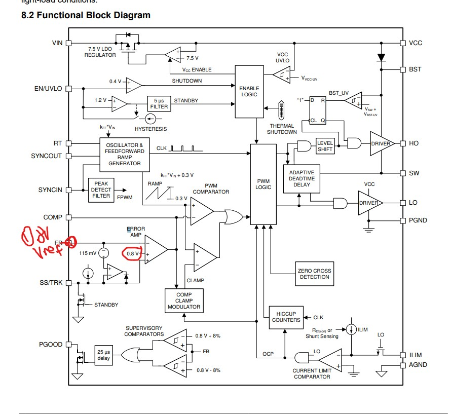


Bu foto, `LM5146` fonksiyonel blok diyagrami uzerinde ozellikle:

- `7.5 V` dahili `LDO`
- `FB` / `0.8 V` referans dugumu
- `COMP` ve `SS/TRK`

arasindaki iliskiyi not etmek icin alinmis. `5.1.1` altinda durmasi da bu yuzden yerinde; kontrolcunun ic yapisinin tasarim notlarina nasil tasindigini gosteren iyi bir destek gorseli.


#### 5.1.2 Ek notlar: dusuk `Vin` bolgesinin etkisi


Bu ODT parcasi, dahili LDO'nun tam regulasyon ve dropout bolgeleri arasindaki tasarim farkini netlestiriyor. GitHub uyumlu matematik bicimiyle bu sinirlar su sekilde yazilabilir:

```math
V_{in,\min} = 7.5\,\text{V} + 0.72\,\text{V} = 8.22\,\text{V}
```

```math
V_{CC} \approx V_{in} - V_{dropout}
```

Ornegin tipik dropout ile $V_{in} = 6\,\text{V}$ icin:

```math
V_{CC} \approx 6.00\,\text{V} - 0.25\,\text{V} = 5.75\,\text{V}
```

Bu bolgede teknik olarak su riskler one cikar:

- $R_{DS(on)} \approx 8.2\,\text{m}\Omega$
- gate sarj / desarj surelerinin uzamasi nedeniyle switching kayiplari
- koruma ve akim algilama marjlarinin degismesi
- gerekirse logic-level MOSFET veya harici `VCC` kullanim ihtiyaci

Burada tasarimda iki yol acik:

- sistemi yalnizca $V_{in} \ge 8.22\,\text{V}$ bolgesinde optimize etmek
- veya `DVCC` uzerinden harici $8\,\text{V} - 13\,\text{V}$ $V_{CC}$ rayi ile LDO'yu baypas etmek

Harici `VCC` seceneginin not edildigi kaynak-fotolar:

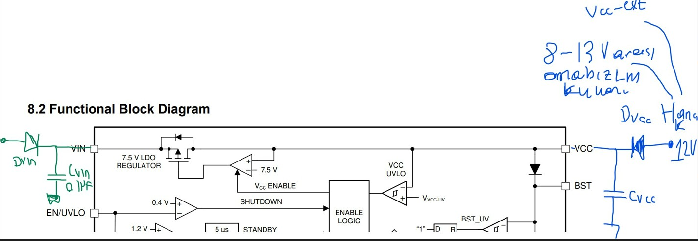

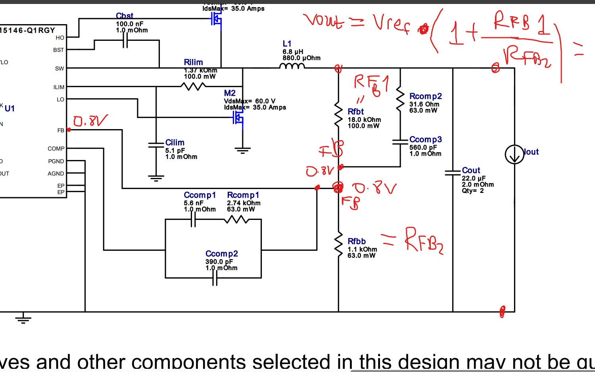


Bu iki foto birlikte bakildiginda, dahili `LDO` yolu ile harici `VCC` / `DVCC` seceneginin ayni blok diyagram uzerinde ayirilmaya calisildigi net goruluyor. Nihai tasarimda dahili yolun kullanildigi not edilmis olsa da, alternatifin bilincli olarak dusunulmus olmasi burada degerli.

Ucuncu ekran goruntusu ise ayni ayrimi daha genis bir blok diyagram uzerinde tekrarliyor. `DVCC`, `-VCC`, `BST` ve harici `8-13 V` ray notu ayni cizim uzerinde goruldugu icin, `5.1.1-5.1.2` altinda gecen "harici VCC ile dahili LDO'yu baypas etme" seceneginin gercekten kontrolcunun kendi blok yapisi uzerinden dusunuldugunu destekliyor.

Defterden aktarilan not (`W.108`):

Burada daha cok kontrolcu datasheet'indeki sicaklik ve termal koruma notlari toplanmis. Proje-ozel bir kayip hesabi degil; cihazin mutlak calisma ve koruma sinirlarini hatirlatan bir defter ozeti gibi okunuyor.


Sayfada korunacak ana basliklar sunlar:

1. `Device temp grade`
   - otomotiv / genis sicaklik araligina isaret eden not
   - ortamin ve cihazin izin verilen sicaklik araliklarinin birlikte dusunulmesi gerektigi vurgulaniyor

2. `Operating junction temp`
   - notlarda yaklasik `-40 C` ile `+150 C` araligina isaret ediliyor
   - hemen altina temel termal iliski yazilmis:

```math
T_J = T_A + P_{diss} \cdot R_{\theta JA}
```

veya benzer niyetle:

```math
T_J \approx T_{case} + P_{diss} \cdot R_{\theta JC}
```

3. `Thermal shutdown protection with hysteresis`
   - thermal shutdown esigi olarak `175 C` not edilmis
   - hysteresis icin yaklasik `20 C` notu var
   - bu da koruma devresinin kapanma / yeniden acilma davranisini belirleyen sinirlari hatirlatiyor

4. `EP (Exposed Pad)`
   - alt taraftaki metal pad'in termal ve elektriksel rolu not edilmis
   - PCB bakiri / GND / isi dagitma acisindan exposed pad'in onemi vurgulaniyor

5. `Storage temperature`
   - yaklasik `-55 C` ile `150 C` araligi not edilmis

Buradaki asil deger, secilen kontrolcu IC'nin yalnizca elektriksel degil termal sinirlarinin da erken asamada not edilmis olmasi. Burada henuz proje-ozel guc kaybi hesabi yok; ama `T_J`, thermal shutdown ve exposed pad dusuncesinin erkenden gorunur hale gelmesi bence yeterince degerli.

Defterden aktarilan not (`W.111`):

Burada `5.1.1-5.1.2`de tartisilan dahili `VCC` / LDO konusu bu kez termal guc kaybi tarafindan ele aliniyor. Ust satirda acikca su ifade yazilmis:


- `VCC regulatorunun guc tuketimi`

Sayfanin ortasinda, dahili regulator uzerinde harcanan guc su sekilde not edilmis:

```math
P_{diss,\;VCC}
=
(V_{in} - 7.5\,V)\, I_{VCC}
```

Yan notlardan korunacak ana fikirler:

- eger `V_{in}` yuksekse, dahili LDO uzerindeki dusum de buyur
- ayni `I_{VCC}` akiminda bu, daha fazla isi kaybi anlamina gelir
- dolayisiyla yuksek `Vin` tarafinda dahili `VCC` regulatoru daha fazla isinabilir

Sayfanin alt kismina dusulen tasarim karari notu su:

- asiri isinma sonucunda problem yasanirsa
- dahili `VCC` rayi yerine `8 V - 13 V` araliginda harici bir kaynak kullanilabilir
- ve `DVCC` uzerinden `VCC` pinleri beslenebilir

Burada daha once `W.108`de genel termal sinir olarak yazilan seyler, bu kez LM5146'nin dahili regulatorune ozel bir guc kaybi iliskisiyle somutlasiyor. Ayni zamanda `5.1.1`de gecen "harici VCC ile LDO'yu baypas etme" secenegine de dogrudan muhendislik gerekcesi veriyor.

Defterden aktarilan not (`W.170`):

Burada `5.1.1`deki dahili `VCC` / LDO siniri kendi cumlelerinle yeniden kuruluyor. Yeni bir nihai hesap degil; minimum `V_{in}` sinirinin defterde elle tekrar edildigi ve tasarim niyetinin netlestigi bir not.


Sayfanin basliginda okunabildigi kadariyla:

- `8.3.1 Input Range Vin`

yaziyor.

Ust kisimda kullanici, LM5146'nin icinde bir `LDO` bulundugunu ve bunun:

- `7.5 V` civarinda bir `VCC` beslemesi sagladigini
- kontrol devrelerini ve MOSFET gate suruculerini besledigini

not ediyor.

Ardindan en kritik tasarim siniri tekrar vurgulaniyor:

- eger harici `VCC` kullanilmiyorsa
- giris gerilimi `V_{in}`, dahili `LDO`'nun dropout sinirinin ustunde kalmalidir

Sayfadaki sayisal yerleştirme, `5.1.1` ile uyumlu olacak sekilde su sonuca gidiyor:

```math
V_{in,\min} \approx 7.5\,V + 0.72\,V \approx 8.22\,V
```

Yani sayfanin ana mesaji:

- `V_{in} < 8.22 V` olursa
- dahili `LDO` tam regulasyonda calisamaz
- `VCC` dusmeye baslar

Sayfanin orta-alt kisminda kullanici kendi tasarim niyetini de acikca not ediyor:

- `Harici VCC kullanmayi kastetmiyorum`
- `Dahiliyi kullaniyorum`

Bu not degerli; cunku bu projede en azindan bu iterasyonda:

- `DVCC` ile harici bypass secenegi bilinmesine ragmen
- mevcut tasarim mantiginin dahili `VCC/LDO` uzerinden ilerledigi anlasiliyor

Sayfanin en altinda ayrica:

- `Word'de biraz seyler de var`

notu var. Bu, bu konunun ayri bir yazili belgede de toparlanmaya baslandigini gosteren kisa bir aktarim izi olarak korunabilir.

Bu not `5.1.1`deki ODT cizgisini degistirmiyor; ayni `8.22 V` sinirini defterde yeniden teyit ediyor. En degerli yani da, bu projede harici `VCC` secenegini degil dahili `LDO` yolunu esas aldigini acikca not etmesi.


#### 5.1.3 Cikis gerilimi setpoint direncleri FB


ODT'den aktarilan metin (`4.1. Çıkış gerilimi setpoint dirençleri FB`):

> = 14V yapmak istiyoruz.  
> 0402 boyutlarında.  
> R14 Ohm R14 = 16.5 kΩ (RFB1)  
> R10 = 1.00 kΩ (RFB2)  
> Dirençleri % 0.1 tolerance’lı seçmek….


Ek not:

Bu parca, geri besleme bolucusunun `14 V` cikis hedefi icin secildigini ve fiziksel paket hedefinin `0402` oldugunu kaydediyor. Ancak ilk ODT taslagindaki `16.5 kOhm / 1.00 kOhm` secimi, sonraki defter iterasyonlari ve satin alinmis BOM ile karsilastirildiginda artik nihai secim gibi gorunmuyor.

Temel setpoint iliskisi su sekilde yazilabilir:

```math
V_{out} = V_{FB}\left(1 + \frac{R_{FB1}}{R_{FB2}}\right)
```

Ilk taslaktaki eski aday secim:

```math
V_{out} = 0.8\left(1 + \frac{16.5}{1.0}\right) = 14.0\,\text{V}
```

Defter taramasi `W.14-W.16` ve BOM'daki satin alinmis parcalar ise su guncel adayi gosteriyor:

- `R11 / R1 / RFB1 = 26.4 kOhm`
- `R10 / RFB2 = 1.6 kOhm`

Bu durumda:

```math
V_{out} = 0.8\left(1 + \frac{26.4}{1.6}\right) = 14.0\,\text{V}
```

Burada iki farkli iterasyon ust uste duruyor. Eski `16.5 kOhm / 1.00 kOhm` secimi matematiksel olarak yanlis degil; ama sonraki defter sayfalari ve satin alinmis BOM artik `26.4 kOhm / 1.6 kOhm` cizgisini isaret ediyor. O yuzden eski secimi silmek yerine ilk aday olarak birakmak, bundan sonraki setpoint hesabinda ise guncel varsayim olarak `26.4 kOhm / 1.6 kOhm` kullanmak daha dogru.

Ek not (calculator teyidi):

`LM5146_quickstart_calculator_revB1.xlsm` dosyasinda da geri besleme bolucusu ayni nihai aileye oturuyor:

- `RFB1 = 26.4 kOhm`
- `RFB2 = 1.58 kOhm`
- `Actual Vout = 14.167 V`

Calculator da ayni yone bakiyor. Yani `16.5 kOhm / 1.00 kOhm` eski adayi tamamen gecersiz kilmiyor; ama `W.14-W.16` ve satin alinmis BOM ile uyumlu gorunen `26.4 kOhm / 1.6 kOhm` secimini daha guclu bicimde destekliyor.

Bu bolume ait kaynak-foto:

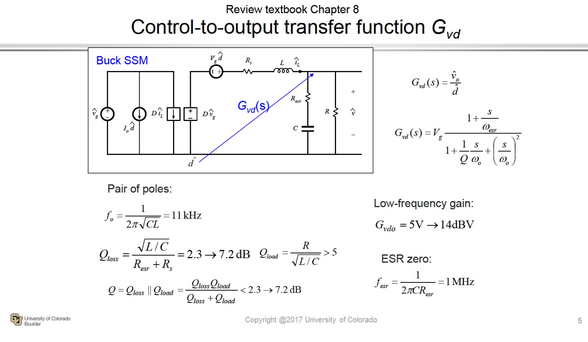

Bu foto, geri besleme bolucusunun `RFB1 / RFB2` kimligini ve kompanzator kolunun hangi elemanlardan olustugunu hizli gormek icin iyi bir gorsel eslik veriyor. `5.1.3` altinda durmasinin nedeni bu.

Defterden aktarilan not (`W.202`):

`W.202`, bu konunun ilk kuruldugu sayfalardan biri. LM5146 datasheet'indeki `Output Voltage Setpoint and Accuracy FB` basligina bakip `FB` dugumunun referansla iliskisini kisa yoldan not etmissin.


Guvenle okunan ana notlar sunlar:

- `VREF = 0.8 V`
- geri besleme orani:

```math
H_{Vout} = \frac{R_2}{R_3 + R_5} \approx 0.12857
```

- temel setpoint iliskisi:

```math
V_{out} = V_{REF}\left(1 + \frac{R_{FB1}}{R_{FB2}}\right)
```

Sayfada `14 V` hedefi icin su oran kurulmus:

```math
\frac{14\,V}{0.8\,V} - 1 = \frac{R_{FB1}}{R_{FB2}} = 16.5
```

Bu da eski aday bolucuyu destekliyor:

- `RFB1 = 16.5 k\Omega`
- `RFB2 = 1.00 k\Omega`

Sayfanin alt kismina, referans geriliminin toleransi ile ilgili su not da dusulmus:

- `Vref 792 mV ile 808 mV arasinda degisebilir`

Buradan da:

```math
\frac{808\,mV - 800\,mV}{800\,mV} = \frac{8\,mV}{800\,mV} = \frac{1}{100}
```

yani yaklasik:

- `Vout'ta ±1%`lik bir sapma olabilecegi

not edilmis.

Buradaki sayfa, `5.1.3`teki eski `16.5 k\Omega / 1.00 k\Omega` setpoint iterasyonunu dogrudan destekliyor. Nihai BOM ile uyumlu gorunen `26.4 k\Omega / 1.6 k\Omega` secimini degistirmiyor; ama bu bolucuyu ilk kez nasil kurdugunu gosterdigi icin degerli. `VREF` toleransinin cikis gerilimine tasinacagini erken asamada not etmen de bu sayfanin guclu yani.


#### 5.1.4 `EN/UVLO`, `SS/TRK` ve startup notlari


Bu bolume ait kaynak-fotolar:


Bu uc gorsel birlikte, `EN/UVLO`, `VCC UVLO`, `thermal shutdown`, `PWM logic` ve `driver` arasindaki ic akis mantigini tek yerde gormeyi sagliyor. `W.204-W.209` notlarinda parca parca yazilan startup / enable dusuncesi burada kontrolcunun kendi blok diyagrami uzerinden toparlaniyor.

Defterden aktarilan not (`W.204`):

`W.204`, datasheet'in `8.3.7` civarindaki `EN/UVLO`, `SS/TRK` ve startup/soft-start davranisini anlamaya calistigin sayfalardan biri. Sayfanin ust kismina aldigin net notlar sunlar:


- `EN(UVLO) 1.2 V` oldugunda `IC active olur`
- bundan sonra:
  - `I_{SS}` akimi `C_{SS}`'i doldurmaya baslar
- `I_{SS} = 10 \mu A` degerinde bir `current source`

Sayfadaki en degerli teknik ayrim su:

- `SS/TRK < 0.8 V` iken, hata kuvvetlendiricisinin gordugu referans sabit `0.8 V` gibi dusunulmemeli
- startup sirasinda referans, `SS/TRK` dugumundeki rampa ile birlikte degisiyor gibi ele alinmali

Sayfada bunun icin kullanicinin kendi test/benzetim notu da var:

- `PWL` ile bir rampa kullanilarak
- referansin `0 V -> 0.8 V` benzeri gecisi emule edilmeye calisilmis
- zaman ekseninde yaklasik `45 us` notu dusulmus


Sayfanin orta kismina ayrica kisa bir op-amp hatirlatmasi da cizilmis:

```math
V_{out} = A_{OL}(V_+ - V_-)
```

Bu, startup sirasinda sabit bir referans yerine degisen bir referans gormenin hata kuvvetlendiricisi davranisini nasil etkileyebilecegini kendi dilinle dusundugunu gosteriyor.

Sayfanin altindaki diger maddeler tam net okunmuyor; ama ana yon gayet belirgin:

- soft-start sirasinda `SS/TRK` pimi aktif bir rampa / takip dugumu gibi dusunuluyor
- sabit `0.8 V` referans dogrudan en basindan uygulanmiyor gibi okunuyor
- takip (`tracking`) modunda bu pine disaridan bir referans / rampa verilebilmesi fikri not edilmis gorunuyor

Yani `W.204` yeni bir parca secimi ya da nihai sayisal sonuc vermiyor. Daha cok startup davranisini "bir anda 0.8 V referans uygulanmasi" gibi degil, `SS/TRK` rampasi uzerinden dusunmeye basladigini gosteriyor. `PWL` ile startup referansi olusturma notu da bunu LTspice tarafinda taklit etmeye calistigini gosteriyor. Bu sayfa o yuzden burada yerinde duruyor.

Defterden aktarilan not (`W.206`):

`W.206`, `SS/TRK` pinine baglanan soft-start kapasitörunun degerini ve buna karsilik gelen soft-start suresini hesaplayan kisa bir uygulama sayfasi.


Sayfanin ustunde, soft-start'in amaci kisaca su sekilde not edilmis:

- cikis geriliminin yavasca yukselmesini saglamak
- asiri akim / `inrush current` olusumunu onlemek

Ardindan kullanici, LM5146'nin `SS/TRK` pinine bagli kapasitörü dahili sabit bir akimla sarj ettigini not ediyor:

- `I_{SS} = 10 \mu A`

Sayfada secilen soft-start kapasitörü:

- `C_{SS} = C26 = 0.047 uF = 47 nF`

ve buna karsilik klasik soft-start iliskisi yazilmis:

```math
t_{SS} = \frac{C_{SS}\,V_{REF}}{I_{SS}}
```

Sayfadaki yerlestirme:

```math
t_{SS}
=
\frac{47\,nF \times 0.8\,V}{10\,\mu A}
```

Buradan:

```math
t_{SS} \approx 3.76\,ms
```

sonucu elde edilir.

Sayfanin altindaki kucuk cizimde:

- `SS/TRK` pini
- `RT` pini
- ve `C_{SS} = 47 nF`


Bu yakin plan, `C_{SS}` seciminin tek basina degil; `SS/TRK`, `FB` ve `RT` pinlerinin kart uzerindeki fiziksel komsulugu baglaminda dusunuldugunu da gosteriyor.

Burada artik `W.204`teki kavramsal `SS/TRK` notu, dogrudan sayisal bir `t_{SS}` hesabina donusuyor. Yeni bir kontrol yasasi kurmuyor; sadece `C26 = 47 nF` seciminin nedenini acik ediyor. O nedenle `5.1.4` icinde dogal bir devam.

Ek not (calculator teyidi):

`LM5146_quickstart_calculator_revB1.xlsm` dosyasinda da startup tarafi su sekilde gorunuyor:

- `C_{SS} = 47 nF`
- `t_{SS} = 4 ms`

Bu, defterdeki `47 nF -> 3.76 ms` hesabinin ayni tasarim cizgisinde oldugunu gosteriyor. Burada ciddi bir celiski yok; daha cok yuvarlama / hedef sure farki var.

Defterden aktarilan not (`W.207`):

`W.207`, datasheet'in `8.3.2 Precision Enable` tarafina ait bir `EN/UVLO` notu. Sayfanin ustunde, `VIN` ile `EN/UVLO` pini arasinda bir direnç bolucusu cizilmis:


- ust direnç: `R_{UV1}`
- alt direnç: `R_{UV2}`
- orta dugum: `EN/UVLO`

Sayfada guvenle okunan iki temel denklem su:

```math
R_{UV1} = \frac{V_{IN(ON)} - V_{IN(OFF)}}{I_{HYS}}
```

ve ikinci denklem, `R_{UV1}`, `R_{UV2}`, `V_{EN}` ve `V_{IN(ON)}` arasindaki precision-enable bolucu iliskisini kuruyor. El yazisi tam net olmamakla birlikte ana fikir su:

- `VIN(ON)` ve `VIN(OFF)` esikleri
- `EN/UVLO` pinindeki etkinlesme gerilimi
- ve histerezis akimi

beraber kullanilarak `R_{UV1}` ve `R_{UV2}` boyutlandiriliyor.

Sayfanin orta kisminda `EN/UVLO` pininin bolgelere ayrildigi bir tablo var. Guvenle okunan esikler sunlar:

- `< 0.4 V`:
  - `shutdown`
- `0.4 V - 1.2 V`:
  - `standby`
- `> 1.2 V`:
  - `active`


Sayfanin alt kisminda ayrica `VCC` UVLO notu yer aliyor:

- `VCC-UV` (`VCC undervoltage threshold`) `≈ 4.93 V (typ)`
- `VCC-UVHYS` (`VCC undervoltage hysteresis`) `≈ 0.26 V`


Bu yakin plan gorseller, `W.207`de yazdigin iki sayiyi dogrudan datasheet tarafinda da gormeyi sagliyor:

- `VCC-UV \approx 4.93 V`
- `VCC-UVHYS \approx 0.26 V`

Burada not ettigin startup sezgisi de acik:

- guc verildiginde `C_{VCC}` kapasitörü doldurulur
- yalnizca `EN/UVLO > 1.2 V` olmasi tek basina yetmez
- `VCC` tarafinin da kendi UVLO esigini gecmesi gerekir

Burada yeni bir nihai direnç secimi yok. Daha cok etkinlesme mantigini ve esik bolgelerini kaynak uzerinden anlamaya calistigin bir not var. En degerli yani da su: `EN/UVLO > 1.2 V` tek basina yetmez, `VCC` UVLO da asilmalidir.

Defterden aktarilan not (`W.209`):

`W.209`, `Precision Enable` denklemlerini kullanarak `EN/UVLO` pinine giden direnç bolucuyu sayisal olarak boyutlandiran bir uygulama sayfasi.


Sayfanin ustunde, `Vin(on)` ve `Vin(off)` hedefleri not edilmis ve yaklasik `1 V` histerezis dusunulmus.

Sayfada kullanilan temel datasheet buyuklukleri:

- `I_{EN-HYS} = 10 \mu A`
- `V_{EN} = 1.2 V`

Ilk denklemle ust direnç hesaplanmis:

```math
R_{UV1} = \frac{V_{IN(ON)} - V_{IN(OFF)}}{I_{HYS}}
```

Sayfadaki sayisal yerlestirme:

```math
R_{UV1} = \frac{24V - 23V}{10\mu A} = 100 k\Omega
```

Ikinci denklemle alt direnç icin:

```math
R_{UV2} = R_{UV1}\,\frac{V_{EN}}{V_{IN(ON)} - V_{EN}}
```

Sayfadaki yerlestirme:

```math
R_{UV2}
=
100k\Omega \cdot \frac{1.2V}{24V - 1.2V}
\approx
5.263k\Omega
```

ve alt tarafta bu degere yakin standart bir deger kullanma notu dusulmus.

Burada `W.207`de kavramsal olarak kurulan `Precision Enable` bolucusu bu kez sayisal bir ornege donusuyor. Yalniz sayfanin ustundeki `Vin(on) / Vin(off)` el yazisi ile alttaki sayisal yerlestirme arasinda kucuk bir tutarsizlik olabilir; ustteki hedefler tam net okunmasa da alttaki denklem acikca `24V` ve `23V` ile kurulmus. Bu yuzden bu sayfayi "nihai dogrulanmis direnç secimi" diye degil, boyutlandirma mantigini gosteren bir ara uygulama gibi okumak daha dogru.

Ek not (calculator teyidi):

`LM5146_quickstart_calculator_revB1.xlsm` dosyasinda `EN/UVLO` tarafi icin su secim gorunuyor:

- `V_{IN,on} = 30 V`
- `V_{IN,off} = 28 V`
- `R_{UV1} = 200 kOhm`
- `R_{UV2} = 8.25 kOhm`

Bu da `W.209` icindeki `24 V / 23 V` yerlestirmesinin su asamada nihai UVLO secimi gibi degil, ayni denklemi anlamaya yonelik bir ornek / ara uygulama gibi okunmasi gerektigini destekliyor.


#### 5.1.5 `RT` pini ve anahtarlama frekansi


Defterden aktarilan not (`W.208`):

Burada datasheet'in `8.3.6.1 Frequency Adjust` kuralini kullanarak `RT` direncinden anahtarlama frekansi belirleniyor.


Sayfada guvenle okunan temel iliski su:

```math
R_{RT}[k\Omega] = \frac{10^4}{f_{SW}[kHz]}
```

Ardindan secilen anahtarlama frekansi:

```math
f_{SW} = 332\,kHz
```

icin yerine koyma yapiliyor:

```math
R_{RT}[k\Omega] = \frac{10^4}{332}
```

ve buradan:

```math
R_{RT} \approx 30.12\,k\Omega
```

sonucu bulunuyor.

Sayfanin sag tarafina da kisaca:

- `Rrt = 30.1 k`

notu dusulmus.

`W.208`, projede kullandigin `332 kHz` anahtarlama frekansinin `RT` pinindeki direnç secimiyle nasil baglandigini netlestiriyor. Burada yeni bir karma denetim sonucu yok; daha cok sade bir `frequency adjust` uygulama notu var. `W.203`teki "`FPWM`'de sabit switching frequency var, `R13` burada kullaniyoruz" notuyla da dogrudan uyusuyor.


### 5.2 Duty cycle, `tON(min)`, `tOFF(min)` ve sinir durumlari


#### 5.2.1 Birinci yaklasim ideal duty hesabi


Nominal ilk yaklasimda senkron buck donusturucu icin duty orani su sekilde alinabilir:


```math
D \approx \frac{V_{out}}{V_{in}}
```


Buna gore mevcut spesifikasyonlarla:

- $D_{\max,\text{ideal}} = \dfrac{14}{24} = 0.583$

- $D_{\min,\text{ideal}} = \dfrac{14}{36} = 0.389$


Bu degerler, nominal `24 V - 36 V` giris araliginda high-side anahtarin iletim orani icin ilk taslak sinirlari verir.


#### 5.2.2 `332 kHz` icin zaman alanina ceviri


Mevcut tasarim seciminde:


```math
f_{sw} = 332\,\text{kHz}
```


Buna gore periyot:


```math
T_{sw} = \frac{1}{f_{sw}} \approx 3.01\,\mu\text{s}
```


Ideal duty degerleri zaman alanina cevrilirse:

- $t_{ON,\max,\text{ideal}} = 0.583 \times 3.01\,\mu\text{s} \approx 1.76\,\mu\text{s}$

- $t_{ON,\min,\text{ideal}} = 0.389 \times 3.01\,\mu\text{s} \approx 1.17\,\mu\text{s}$

- $t_{OFF,\min,\text{ideal}} = (1 - 0.583) \times 3.01\,\mu\text{s} \approx 1.25\,\mu\text{s}$

- $t_{OFF,\max,\text{ideal}} = (1 - 0.389) \times 3.01\,\mu\text{s} \approx 1.84\,\mu\text{s}$


#### 5.2.3 `D_{max}` donanimsal sinirlari ve minimum on/off sureleri


ODT'den aktarilan metin (`6.1.4. Dmax,donanımsal..?`):

> LM5146-Q1’nun
> - 40-ns tON(min) for high VIN / VOUT ratio
> - 140-ns tOFF(min) for low dropout
> Main mosfet’ın iletimde olma süresi 40ns’den daha kısa olmaz.
> … Dikkat burası tam doğru olmayabilir. *** Bakarsın bir video vardı. Eklersin.
> Arada başka zamanlar da var. Ölü zaman gibi…
>
> ODT'deki denklem notasyonu bozuk aktarilmis; temiz matematik yazimi asagida verilmistir.


Ek not:

Bu parca, denetleyicinin ideal duty hesabindan ayri olarak donanimsal zaman sinirlarini hatirlatiyor. ODT notunda da isaret edildigi gibi bu hesap, olu zaman ve diger ayrintilar ihmal edilirse yalnizca ilk yaklasim olarak kullanilmalidir.

GitHub uyumlu matematik bicimiyle donanimsal ust duty siniri su sekilde yazilabilir:

```math
D_{\max,\text{donanimsal}} \approx \frac{T_{sw} - t_{OFF(\min)}}{T_{sw}}
```

```math
D_{\max,\text{donanimsal}} \approx \frac{\frac{1}{f_{sw}} - t_{OFF(\min)}}{\frac{1}{f_{sw}}}
```

$f_{sw} = 332\,\text{kHz}$ ve $t_{OFF(\min)} = 140\,\text{ns}$ icin:

```math
D_{\max,\text{donanimsal}} \approx
\frac{\frac{1}{332\,\text{kHz}} - 140\,\text{ns}}{\frac{1}{332\,\text{kHz}}}
\approx 0.953
```

Ayni yaklasimla en kucuk on-time sinirindan bir alt duty tahmini de elde edilebilir:

```math
D_{\min,\text{donanimsal}} \approx \frac{t_{ON(\min)}}{T_{sw}}
= t_{ON(\min)} f_{sw}
\approx 40\,\text{ns} \times 332\,\text{kHz}
\approx 0.013
```

Bu nedenle nominal $V_{in} = 24\,\text{V} - 36\,\text{V}$ giris gerilimi araliginda gereken duty degerleri, ilk yaklasimda bu donanimsal sinirlarin icinde gorunmektedir. Ancak olu zaman, propagation delay ve kontrolcuye ozgu diger zamanlar nihai yorumdan once ayrica dogrulanmalidir.


Defterden aktarilan not (`W.203`):

Burada datasheet'in `Description` kismindan alinmis kisa bir ozet not var. Icerik dogrudan `duty cycle`, `t_{ON(min)}`, `t_{OFF(min)}` ve `FPWM` davranisina baglaniyor.


Sayfada guvenle okunan ana notlar sunlar:

1. dusuk giris geriliminde yuksek duty:

- `Vin = 5.5 V'e kadar inebilir`
- bu durumda:
  - `Duty cycle %100'e kadar cikabilir neredeyse`

2. minimum on/off sureleri:

- `40-ns tON(min) for high Vin / Vout ratio`
- `140-ns tOFF(min) for low Vin / Vout ratio`

3. `FPWM` modu:

- `FPWM'de sabit switching frequency var`
- yan not:
  - `R13 burada kullaniyoruz`

Sayfanin sagina da:

- `Burasiyla ilgili defterde yazdiklarim vardi, bulunca eklerim`

notu dusulmus.

`W.203`, yukaridaki `40 ns / 140 ns` donanimsal zaman sinirlarini defterde tekrar eden kisa bir kaynak-ozet sayfasi. `Vin = 5.5 V` notu, kontrolcunun genis duty bolgesine cikabilecegini hatirlatiyor; ama bu ikinci projenin nominal `24-36 V` spesifikasyonunu degistiren bir tasarim karari degil, cihazin genel davranis notu. `FPWM` ile sabit anahtarlama frekansi notu da daha sonra `R13` uzerinden yapilan `f_{sw}` secimiyle baglaniyor.


#### 5.2.4 Taslaktaki duty notlari ile fark


Bootstrap hesabinin icinde ayrica su duty notlari bulunuyor:

- $D_{\text{high,max}} = 0.648$

- $D_{\text{high,min}} = 0.432$

- buradan $D_{\text{low,min}} = 1 - 0.648 = 0.352$


Bu degerler ideal `Vout / Vin` yaklasimindan daha yuksek gorunuyor. Farkin kaynagi su ihtimallerden biri olabilir:

- kayiplar ve gercek duty ihtiyaci dahil edilmistir
- farkli bir worst-case senaryo alinmistir
- ara notlarda muhafazakar bir bootstrap varsayimi kullanilmistir
- notlarda tekrar kontrol gerektiren bir tutarsizlik vardir


Su an icin en dogru tavir, bu iki duty kumesini yan yana tutmak ve daha sonra datasheet, secilen komponentler ve gerekirse simulasyonla tek bir nihai duty zarfina indirmek. Bu bolumde acik kalan temel soru da su:

- Bootstrap hesabinda kullanilan `0.648 / 0.432` duty degerleri hangi varsayimdan turetildi?


### 5.3 Bobin secimi


#### 5.3.1 Cikis bobini


ODT'den aktarilan metin (`5. çıkış bobini`):

Bu alt baslikta ODT'den gelen eski metni govdeye oldugu gibi tasimadim. Bobin secimi burada agirlikli olarak defter sayfalari, secilen gercek parca ve sonraki notlar uzerinden yeniden kuruluyor. O yuzden bobin bolumu bos gecilmek yerine, asagidaki `W.54-W.56` hattindan itibaren yeniden insa ediliyor.

Defterden aktarilan not (`W.54`):

Burada secilen `L = 6.8 uH` degeri, bobin akimi dalgalanmasi ve alternatif ust sinir dusuncesi uzerinden tekrar kontrol ediliyor.


Sayfada not edilen ana bilgiler sunlar:

- mevcut secim olarak `L = 6.8 uH`
- bu secimde bobin akimi dalgalanmasi yaklasik `\Delta I_L \approx 3.8 A_{p-p}` gibi okunuyor
- daha dusuk dalgalanma icin `%30` civari bir hedef dusunulurse, ust sinir tarafinda `\Delta I_L \approx 2.7 A_{p-p}` mertebesi yaziliyor

Sayfada kullanilan iliski su sekilde okunuyor:

```math
L
=
\frac{V_{out}}{V_{in}}
\cdot
\frac{V_{in}-V_{out}}{\Delta I_L \, f_{sw}}
```

Defterdeki yerlestirmede:

- $V_{out} = 14\,\text{V}$
- $V_{in} = 36\,\text{V}$
- $\Delta I_L \approx 2.7\,\text{A}_{p-p}$
- $f_{sw} \approx 330\,\text{kHz}$

alininca yaklasik:

```math
L_{\text{ust}}
\approx
9.6\,\mu\text{H}
```

Sayfa sonunda su aralik ozellikle kutu icine alinmis:

```math
6.8\,\mu\text{H} < L < 9.6\,\mu\text{H}
```

ve bunun yanina ayrica bobin `DCR` degeri icin de bir aralik not edilmis:

```math
0.38\,m\Omega < DCR < 13.3\,m\Omega
```

Buradaki ana fikir su: `6.8 uH` secimi tamamen keyfi degil; daha dusuk ripple hedefiyle kiyaslandiginda mantikli bir alt tarafta kaliyor. `9.6 uH` civari "daha dusuk ripple ama daha buyuk L" alternatifi gibi duruyor. `DCR` araligi notu da bunu guclendiriyor; cunku secimde yalnizca `uH` degeri degil kayip ve isinma tarafi da dusunulmus. Kullanicinin son notuna gore bu hesap zincirinin gercek / nihai tasarimda kullanilmis olma olasiligi yuksek; bu yuzden burada yalnizca alternatif bir deneme degil, guclu bir `nihai aday` izi var.

Defterden aktarilan not (`W.55`):

Burada `W.54`teki bobin secimi dusuncesi daha derli toplu kriterlerle devam ediyor. Baslikta dogrudan `Bobin secimi L1` yaziyor.


Sayfada not edilen secim kriterleri sunlar:

- bobin akimi dalgalanmasi, maksimum cikis akiminin yaklasik `%30-%40`i civarinda tutulmak isteniyor
- `I_{sat}` / doyma akimi, bobinden gececek tepe akim ve transient sirasinda olusabilecek ek yuklenmenin ustunde olmali
- `DCR` dusuk olmali; boylece bakir kayiplari ve isinma azalir

Sayfada tekrar yazilan temel iliskiler:

```math
L_1
=
\frac{V_{out}}{V_{in}}
\cdot
\frac{V_{in}-V_{out}}{\Delta I_L \, f_{sw}}
```

```math
I_{L,\text{peak}}
=
I_{out}
+
\frac{\Delta I_L}{2}
```

Defterdeki notlara gore en kotu ripple durumu, giris gerilimi buyukken yani `V_{in} = 36 V` iken kontrol ediliyor:

- $V_{out} = 14\,\text{V}$
- $V_{in,\max} = 36\,\text{V}$
- $f_{sw} \approx 330\,\text{kHz}$
- $L = 6.8\,\mu\text{H}$

Bu yerlestirmede:

```math
\Delta I_{L,36V}
\approx
\frac{14}{36}
\cdot
\frac{36-14}{6.8\,\mu\text{H}\cdot 330\,\text{kHz}}
\approx
3.8\,\text{A}_{p-p}
```

Tam yukte `I_{out,\max} = 9 A` icin tepe bobin akimi:

```math
I_{L,\text{peak}}
\approx
9
+
\frac{3.8}{2}
\approx
10.9\,\text{A}
```

ve ripple orani yaklasik:

```math
\frac{\Delta I_L}{I_{out,\max}}
\approx
\frac{3.8}{9}
\approx
0.42
```

Sayfada ayrica `V_{in} = 24 V` icin ripple'in daha kucuk oldugu not edilmis:

```math
\Delta I_{L,24V}
\approx
\frac{14}{24}
\cdot
\frac{24-14}{6.8\,\mu\text{H}\cdot 330\,\text{kHz}}
\approx
2.6\,\text{A}_{p-p}
```

Bu da yaklasik `%28.9` ripple oranina karsilik geliyor.

Burada `W.54`teki `6.8 uH` secimi bu kez daha net bir `ripple yuzdesi + I_{L,peak} + I_{sat} + DCR` diliyle somutlasiyor. `36 V`'un en kotu durum olarak alinmasi da yerinde; buck'ta giris arttikca ripple buyuyor. Cikan `I_{L,\text{peak}} \approx 10.9 A` sonucu, secilecek bobinin doyma akimi icin dogrudan kullanilabilecek bir sayi. Kullanicinin son notuyla birlikte dusunulunce `W.54-W.55` hattinin gercek bobin secimine yakin durdugu anlasiliyor.

Defterden aktarilan not (`W.56`):

Bu sayfa, `W.55`te hesaplanan tepe bobin akimini, secilen gercek bobin parcasi ile dogrudan eslestiriyor.


Sayfada okunan ana bilgiler sunlar:

- tepe bobin akimi:
  ```math
  I_{L,\text{peak}} \approx 9\,\text{A} + 1.9\,\text{A} \approx 10.9\,\text{A}
  ```
- secilen Würth `L1` bobininin `saturation current` degeri:
  ```math
  I_{sat} \approx 36.3\,\text{A}
  ```
- sayfada ayrica `rated current` / `RMS` akim notu da var; okunan deger tam net degil ama `10.9 A` tepe akiminin ustunde oldugu acikca vurgulaniyor

Sayfada bobin `DCR` degeri de daha somut bir secilen parca parametresi olarak yazilmis:

```math
DCR \approx 0.88\,m\Omega
```

ve buna bagli bakir kaybi yaklasik su sekilde not edilmis:

```math
P_{\text{bakir}}
= I^2 \cdot R_{DCR}
\approx 9^2 \cdot 0.88\,m\Omega
\approx 0.071\,\text{W}
```

`W.56` ile is artik soyut kriterlerden gercek parcaya geliyor. `I_{sat} \approx 36.3 A` notu, `I_{L,\text{peak}} \approx 10.9 A` sonucuna gore cok rahat bir doyma marji oldugunu gosteriyor. `DCR \approx 0.88 m\Omega` bilgisi de onceki sayfalardaki "DCR dusuk olmali" fikrini secilen parca uzerinde somutlastiriyor. Bu yuzden `W.54-W.56` zinciri, bobin seciminde elde kurulmus en guclu kisimlardan biri gibi duruyor.

Ek not (calculator teyidi):

`LM5146_quickstart_calculator_revB1.xlsm` dosyasinda da bobin tarafi su sekilde gorunuyor:

- onerilen `L_O \approx 7.504 uH`
- secilen `L_O = 6.8 uH`
- `DCR = 0.88 mOhm`
- nominal girdide ripple akimi `\approx 3.373 A_{p-p}`

Bu nedenle calculator da, defterde nihaiye yakin gorunen `6.8 uH / 0.88 mOhm` secimini guclu bicimde destekliyor. Workbook'taki `7.504 uH` degeri ise secilen standard deger olan `6.8 uH` oncesindeki teorik oneriyi temsil ediyor


#### 5.3.2 Slew-rate mantigi


Taslakta `Slew Rate Hesabi` basligi altinda vurgulanan ana fikir dogrudur:

- regulator, yuk aniden arttiginda bobin akimini sonsuz hizla artiramaz

- ilk anda gereken ek akim cikis kapasitelerinden gelir

- bobin akiminin yukselme hizi birinci yaklasimda $\dfrac{dI_L}{dt} \approx \dfrac{V_L}{L}$ ile sinirlanir


Bu nedenle bobin secimi dogrudan su iki buyuklugu etkiler:

- cikis ripple akimi

- yuk adiminda gereken toparlanma suresi


Taslak notlarda ayrica gercek devrede MOSFET `RDS(on)`, bobin `DCR` ve yerlesim kaynakli kayiplarin ideal slew-rate hesabini azaltacagi da fark edilmis. Bu gozlem yerinde; nihai hesapta da akilda tutulmasi gereken noktalardan biri bu.


#### 5.3.3 Mevcut durum


`yeni.odt` taslaginda bobin seciminin sayisal son hali temiz bicimde yer almiyor. Buna ragmen proje klasorundeki BOM, somut bir cikis bobini adayinin daha once secildigini gosteriyor:

- `BOM/L1_Wurth_Elektronik_7443640680B_7443640680B.pdf`


Bu, bobin seciminin tamamen sifirdan acikta olmadigini; ancak sayisal gerekcesinin henuz `yeni.md` icine duzgun tasinmadigini gosteriyor.


#### 5.3.4 Bu bolume daha sonra eklenecekler


Bu bolum tamamlanirken su maddeler netlestirilecek:

- secilen `L` degeri

- secilen bobinin `DCR` degeri

- saturation akimi ve RMS akim uygunlugu

- ripple akimi hesabi

- yuk adimi altinda gereken minimum akim slew-rate ile uyumu

- secilen BOM parcasi ile hesaplarin birebir eslestirilmesi


### 5.4 Cikis kapasiteleri


#### 5.4.1 Cikis sigaçlari


ODT'den aktarilan metin (`6. çıkış sığaçları`):

> Çıkış sığaçlarının iki temel işlevi vardır.
> • Enerji depolamak: Yük geçişlerinde (load transients), ani akım taleplerine anında cevap verebilmek için, Yeteri kadar hızlı cevap veremezse artar.
> • Çıkış Impedance’sını düşürmek: Böylece hem hem de gerilimlerini düşürür.
>
> 6.1. Yük altındaki Çıkış Gerilimi Değişimleri ve Çözüm Yolları


Ek not:

Bu parca, cikis kapasitelerinin iki ana rolunu ayiriyor: transient sirasinda kisa sureli enerji tamponu olmak ve frekansa bagli cikis empedansini dusurmek. ODT kopyasinda bazi semboller eksik gorunse de teknik olarak korunmak istenen ana fikir nettir: kapasitör bankasi hem `load transient` sirasindaki gerilim sapmasini hem de ripple davranisini birlikte etkiler.


Bu yakin plan, cikis tarafinda gercekten `C18-C22 = 22 uF` MLCC grubunun ve buna paralel `C28 = 0.1 uF` yardimci kapasitörun yer aldigini acikca gosteriyor. Bu nedenle defterde ve `W.116` tarafinda gecen "cikis banki + C28 = 0.1 uF" cizgisi yalnizca teorik bir model degil; gercek EVM topolojisine de dayanan fiziksel bir yerlesim notu olarak okunabilir.


#### 5.4.2 Bu iterasyondaki tasarim karari


Taslakta mevcut yaklasim su sekilde olgunlasmis gorunuyor:

- cikista ana agirlik MLCC'ler uzerinden kurulacak

- mevcut iterasyonda cikisa bulk kapasitör eklemekten kacinilacak

- bunun temel gerekcesi, bulk kapasitörlerin cikis empedansini ve dolayisiyla kompanzasyon davranisini etkilemesidir


Bu karar, `bulk kesinlikle kullanilmaz` anlamina gelmiyor. Su anki anlami daha dar ve daha muhendislik odakli:

- eger MLCC tabanli cikis agi ripple ve transient kriterlerini sagliyorsa, cikisa ek bulk koymayip kontrol tasarimini daha sade tutmak tercih edilir

- eger daha sonra transient hedefleri sikilasirsa, cikis bulk kapasitörü yeniden degerlendirilir


#### 5.4.3 Overshoot / Undershoot gerilimi ve acik-cevrim cikis impedance


ODT'den aktarilan metin (`6.1.1. Overshoot/Undershoot Gerilimi`):

> Çıkış yük akımında büyüklüğünde bir değişim olduğunda*? Çıkış geriliminin değişim miktarı kadar.
> : Açık Çevrim Çıkış Impedance’nin crossover frequency’ındaki büyüklüğü.
>
> ( Hata: Başvuru kaynağı bulunamadı.4 )
>
> miktarını düşürmek için, crossover frequency’ındaki açık-çevrim çıkış impedance’sını düşürmemiz şarttır.
> Bunu iki yolla yapabiliriz:
> a. Zou Şekil Hata: Başvuru kaynağı bulunamadı.1’e bakarsak, C’nin artmasıyla,vssss Zout’un düşürerek.***
> b. Fc frekansını arttırarak, (tasarım felsefemiz gereği süreç ilerlerken değiştirmeyeceğiz**)


Ek not:

ODT kopyasinda formül sembollerinin bir kismi eksik gelmis gorunuyor; bu nedenle kaynak metni oldugu gibi korudum. Teknik anlam olarak burada anlatilan iliski buyuk olasilikla asagidaki sezgiye karsilik geliyor:

```math
\Delta V_{out} \approx \Delta I_{load}\,\bigl|Z_{out}(f_c)\bigr|
```

Burada:

- $\Delta I_{load}$, yuk akimindaki ani degisim
- $\Delta V_{out}$, cikis gerilimindeki overshoot veya undershoot buyuklugu
- $\lvert Z_{out}(f_c)\rvert$, crossover frekansi civarinda gorulen cikis empedansi buyuklugu

Bu nedenle bu alt bolumde korunacak iki temel tasarim fikri sunlardir:

- etkin cikis kapasitansini artirarak `Zout`'u dusurmek
- `f_c` degerini arttirarak dongunun yuk degisimine daha hizli cevap vermesini saglamak

Ancak mevcut tasarim felsefesinde `f_c` sonradan rastgele oynanacak bir parametre gibi ele alinmadigi icin, pratik agirlik daha cok kapasitör aginin sekillendirilmesine kaymaktadir.


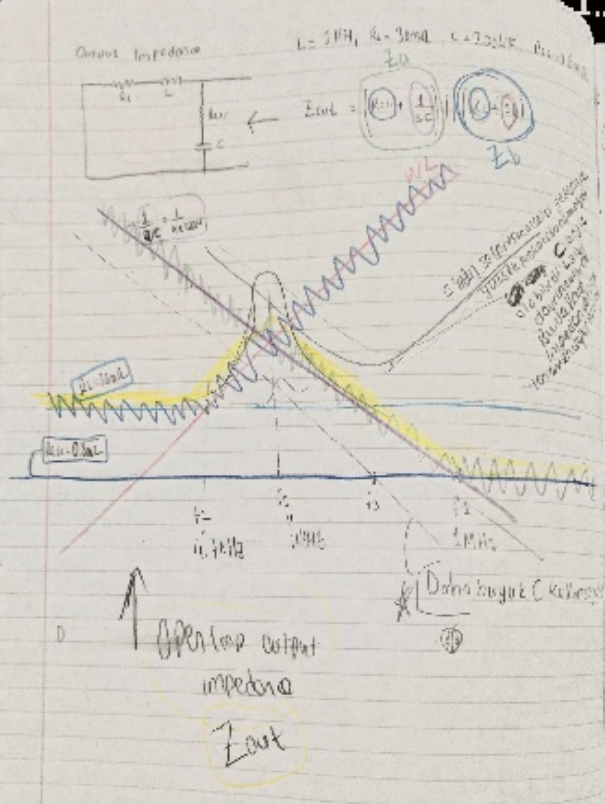


#### 5.4.4 Vripple ve `fsw` civarindaki `Zout`


ODT'den aktarilan metin (`6.1.2. Vripple Gerilimi`):

> Çıkış gerilimini düşürmek için, bobin akımının tepeden tepeye değerini düşürmek gerekir. Bunu da L’yi arttırarak yapabiliriz. Çıkış bobinin inductance’ı artarsa tepeden tepeye bobin akımının dalgalanması azalır. Eğer inductance çok artarsa, dalgalanmayı düşürürüz fakat, maliyet artar, fiziksel boyut artar, transient response bozulabilir.
>
> gerilimini düşürmenin daha etkili bir yolu, fsw frekansındaki çıkış impedance’sını düşürmektir. Şekil Hata: Başvuru kaynağı bulunamadı.1’a bakarsak; Zout, Daha yüksek capacitance ve daha düşük bir esr direncinden oluşursa; Capacitance eğrisi sola kayar, yatayda düz bir eğri olan esr direnci de azaldığı için daha aşağıda olur. fsw frekansında Zout‘u etkin oldüşürdüğünü görebiliriz.****?
>
```math
V_{ripple} = I_{L(P-P)} \cdot Z_{OUT}(f_{sw})
```
>
> ( Hata: Başvuru kaynağı bulunamadı.5 )


Ek not:

Bu parca, `Vripple` dusuncesini iki ayri tasarim koluna ayiriyor:

- bobin akimi dalgalanmasini azaltmak icin `L` degerini buyutmek
- anahtarlama frekansi civarinda `Zout`'u dusurmek

GitHub uyumlu matematik bicimiyle ilk sezgi su sekilde yazilabilir:

```math
\Delta I_L \propto \frac{1}{L}
```

Yani `L` arttikca bobin akiminin tepeden tepeye dalgalanmasi azalir. Ancak ODT'de dogru sezildigi gibi, bunun karsiliginda hacim, maliyet ve transient cevap hizi etkilenebilir.

Ikinci yol ise $f_{sw}$ civarindaki cikis empedansini dusurmektir. Bunun pratik anlami sunlardir:

- daha yuksek etkin kapasitans
- daha dusuk `ESR`
- uygun yerlesim ile daha dusuk parasitikler

Bu nedenle bu alt bolumde korunacak ana fikir sunudur: $V_{ripple}$ yalnizca bobin akim dalgalanmasi problemi degil, ayni zamanda $f_{sw}$ civarindaki $Z_{out}$'un sekillendirilmesi problemidir.

Defterden aktarilan not (`W.68`):

Bu sayfa, cikis sığaçlariyla ilgili dusunceyi iki ayri performans metriğine ayiriyor ve bunlari `Zout` ile bagliyor:


1. load-step / transient sirasindaki `undershoot-overshoot`
2. surekli anahtarlama sirasindaki `Vripple`

Sayfada ilk olarak su iliski not edilmis:

```math
V_{out,\text{undershoot}}
\approx
\Delta I_{out}\,\lvert Z_{out}(f_c)\rvert
```

ve bunun "dusurmek gerekir" notu eklenmis. Yani yuk akimi bir anda degistiginde gorulen gerilim sapmasi, crossover civarindaki cikis empedansiyla iliskilendiriliyor.

Sayfada daha sonra ripple icin su iliski tekrar yaziliyor:

```math
V_{ripple}
\approx
I_{L(p-p)} \, \lvert Z_{out}(f_{sw})\rvert
```

Bu bolumdeki ana dusunce izi sunlar:

- `V_{ripple}`'i azaltmak icin ya bobin akimi dalgalanmasi `\Delta I_L` dusurulur
- ya da `f_{sw}` civarindaki `Zout` daha dusuk hale getirilir
- bunu saglamak icin:
  - daha dusuk `ESR`
  - daha yuksek etkin `C`
  - uygun frekans davranisina sahip bir kapasitör agi
  kullanilabilir

Sayfanin ust tarafinda ayrica su notlar korunmaya deger:

- cikis sığaci ani yuk degisimlerinde enerji tamponu gibi davranir
- dusuk cikis empedansi, yuk degisimlerine hizli ve kararlı gerilim cevabi icin gereklidir
- spike'lar icin ise ek kucuk MLCC / dusuk `ESL` dusuncesi not edilmis

`W.68`, `5.4.3` ve `5.4.4` alt bolumlerinde yazili olan iki farkli `Zout` bakisini ayni sayfada birlestiriyor. Yeni ve nihai bir sayisal sonuc vermiyor; daha cok transient ile ripple tarafini `Zout(fc)` ve `Zout(fsw)` uzerinden zihinde ayiran bir tasarim notu. Bu acidan degeri gayet yuksek.

Defterden aktarilan not (`W.69`):

Burada, Bode grafiklerine bakilmadiginda kapasitans degisiminin etkisinin tam anlasilmadigi not edilmis ve konu tek basina kapasitör empedansi uzerinden aciklanmaya calisiliyor.


Sayfada yazilan temel iliski:

```math
Z_C(f) = \frac{1}{2\pi f C}
```

Bu iliskiye bagli olarak sayfada su sezgiler yazilmis:

- dusuk frekansta buyuk `Z_C`
- yuksek frekansta dusuk `Z_C`

ve buna bagli yorumlar:

- dusuk frekansta enerji depolama rolu daha on plandadir
- yuksek frekansta ise kapasitör, gerilim baskilama / destekleme rolunde daha etkindir

Sayfanin ana amaci, kapasitans degeri degistiginde bunun frekans cevabina neden dogrudan yansidigini sezgisel olarak gostermek gibi gorunuyor.

`W.69`, `W.68`in dogal kavramsal devami. `Zout(fc)` ve `Zout(fsw)` dusuncesinin arkasindaki en temel `Z_C(f)` sezgisini yeniden yaziyor. Yeni bir sayisal sonuc cikarmiyor; ama "neden Bode / frekans bakisi olmadan ayni kapasitans degisiminin tum etkisini goremiyoruz?" sorusuna iyi bir defter cevabi veriyor.

Defterden aktarilan not (`W.70`):

Burada kapasitörun frekansa bagli empedansi ile klasik ripple-tabanli `C` hesabinin nereden geldigi ayni yerde birlesiyor.


Sayfada once temel kapasitör empedansi tekrar yaziliyor:

```math
Z_C(f) = \frac{1}{2\pi f C}
```

Ardindan su kavramsal not eklenmis:

- dusuk frekansta kapasitörun `ESR/ESL` etkileri genellikle daha az baskindir
- frekans arttikca ideal kapasitif davranisin yanina `ESR` ve sonra `ESL` etkileri daha gorunur hale gelir
- dolayisiyla tek bir `C` degeriyle tum frekans davranisini anlatmak yeterli degildir

Sayfadaki cizim de bunu destekliyor:

- bir bolgede ideal kapasitif egim
- sonra `ESR` nedeniyle daha yatay davranis
- daha da yuksek frekansta parasitiklerin devreye girmesi

Sayfanin altinda klasik ripple baglantisi da not edilmis:

```math
\Delta Q = C\,\Delta V
```

ve buradan, bobin akim dalgalanmasi ile iliskili klasik yaklasima gecis yapiliyor:

```math
\Delta V
\approx
\frac{\Delta I_L \, T_{switch}}{8\,C}
\qquad \Longrightarrow \qquad
C \approx \frac{\Delta I_L \, T_{switch}}{8\,\Delta V}
```

Yani bu sayfa, cikis ripple denklemindeki `8 f C` yapisinin nereden geldigini hatirlatan bir not gibi okunabilir.

`W.70`, `W.68-W.69` hattinin dogal devami. Yeni bir nihai sayisal sonuc vermiyor; ama `Zout` ve frekans bakisina klasik `\Delta Q = C\Delta V` ripple sezgisini ekledigi icin degerli. Cikis sığaci seciminde hem frekans-temelli empedans dusuncesinin hem de zaman-duzlemindeki ripple yaklasiminin birlikte nasil tutuldugu burada gorunuyor.

Defterden aktarilan not (`W.71`):

Burada `W.68-W.70` hattindaki dusunce cok kisa bir ozet halinde tekrar ediliyor.


Sayfada korunacak ana fikir su:

- `f_c` civarinda cikis empedansi, `undershoot/overshoot` davranisi icin belirleyicidir
- `f_{sw}` civarinda ise cikis empedansi, `V_{ripple}` davranisi icin belirleyicidir

Sayfadaki iliskiler su sekilde yeniden not edilmis:

```math
V_{out,\text{undershoot}}
\approx
\Delta I_{out} \times Z_{out}(f_c)
```

```math
V_{ripple}
\approx
I_{L(p-p)} \times Z_{out}(f_{sw})
```

Sayfanin altindaki not, bu iliskilerin Bode / empedans egileri uzerinden dusunulmesi gerektigini yeniden vurguluyor.

`W.71` yeni bir sayisal sonuc vermiyor; daha cok `W.68-W.70`teki ana ayrimi kisaltilmis bir ozet halinde tekrar ediyor. Kisa olmasina ragmen transient ve ripple problemlerini frekans ekseninde ayri takip ettigini gosterdigi icin degerli.

Defterden aktarilan not (`W.72`):

Burada tek bir kapasitörun ideal bir `C` elemani gibi degil, gercek esdeger modeli ile dusunulmeye baslandigi goruluyor.


Sayfada cizilen model su sekilde okunuyor:

- ideal kapasitans `C`
- buna paralel buyuk bir sizinti direnci (`R_{leak}` benzeri)
- bunlarin uzerine seri bagli `ESL`
- ve seri bagli `ESR`

Sayfadaki toplam empedans notu su sekilde yazilmis:

```math
Z = \left(Z_C \parallel Z_{Rleak}\right) + Z_{ESL} + Z_{ESR}
```

hemen altinda da ilk yaklasim olarak:

```math
Z \approx Z_C + Z_{ESL} + Z_{ESR}
```

notu dusulmus. Sayfa kenarindaki aciklamadan, `R_{leak}`'in genelde cok buyuk oldugu ve bu nedenle ilk yaklasimda ihmal edilebildigi dusuncesi anlasiliyor.

Buradaki ana deger su:

- kapasitörun empedansi frekansa gore yalnizca `1/(sC)` gibi davranmaz
- `ESR` ve `ESL` de modele girince, cikis sığaci secimi frekans cevabini ve spike davranisini dogrudan etkiler
- dolayisiyla `Zout` dusuncesi kurulurken gercek komponent modeli gereklidir

`W.72`, `W.57`, `W.69` ve `W.70` ile ayni hatta duruyor; bu kez frekansa bagli davranisi daha dogrudan esdeger devre modeli uzerinden yaziyor. Yeni bir nihai sayisal sonuc vermiyor ama cikis sığaci / MLCC davranisinin neden sadece ideal `C` ile aciklanamayacagini iyi gosteriyor.

Defterden aktarilan not (`W.73`):

Burada artik output filter / control-to-output ve Type-III kompanzator topolojisi ayni cizim uzerinde dusunulmeye basliyor.


Sayfanin ust tarafinda `control-to-output` notu ve buna ait kavramsal bir Bode sekli var:

- `\omega_0` civarinda LC cift kutbu
- `\omega_z` civarinda `ESR` sifiri
- bunlara gore kompanzator kutup ve sifirlarinin yerlestirilmesi gerektigi seziliyor

Sayfanin orta kismina cizilen op-amp topolojisi ise Type-III kompanzatorun fiziksel `R-C` agini gosteren bir ara devre cizimi gibi okunuyor.

Bu cizimde iki empedans blogu etiketlenmis:

```math
H(s) = \frac{V_c}{V_o} = -\frac{Z_F}{Z_1}
```

ve altta bunlarin acilimi not edilmis:

```math
Z_1 = R_1 \parallel \left(R_3 + \frac{1}{sC_2}\right)
```

```math
Z_F = \frac{1}{sC_3} \parallel \left(R_2 + \frac{1}{sC_1}\right)
```

Sayfanin alttaki ifadesi de, kompanzator transfer fonksiyonunu bu iki empedansin orani olarak kurma denemesidir.

`W.73`, cikis sığaci / plant modelinden kompanzator topolojisine gecis yapan onemli bir kopru sayfa. Nihai komponent degerlerini tek basina vermiyor; daha cok "planti gordukten sonra Type-III agi nasil kurulur?" sorusunun ilk defter cevabi gibi.

Defterden aktarilan not (`W.141`):

Burasi, `W.73`te tanimlanan Type-III kompanzator agindaki `Z_F` ve `Z_1` empedanslarinin cebirsel olarak nasil acildigini gosteren bir ara islem sayfasi. Yeni kutup/sifir hedefi ya da yeni nihai komponent sonucu vermiyor; ama kompanzator transfer fonksiyonunun ara matematik adimlarini gosterdigi icin teknik izi guclendiriyor.


Sayfanin ust tarafinda, `H(s) = -Z_F/Z_1` ifadesindeki iki paralel empedansin orani tekrar yazilmis gorunuyor:

```math
H(s)
=
-
\frac{
\left(\dfrac{1}{sC_3}\right)\parallel\left(\dfrac{sR_2C_1+1}{sC_1}\right)
}{
R_1\parallel\left(\dfrac{sR_3C_2+1}{sC_2}\right)
}
```

Sayfanin orta kismina dogru ise, ozellikle paydaki `Z_F` blogunun paralel empedans formulu ile acilmaya baslandigi goruluyor. Yani:

```math
Z_F
=
\left(\frac{1}{sC_3}\right)\parallel\left(\frac{sR_2C_1+1}{sC_1}\right)
```

ifadesi, klasik

```math
Z_a \parallel Z_b = \frac{Z_a Z_b}{Z_a + Z_b}
```

mantigiyla duzenleniyor.

Sayfadaki cebir tam sonuca kadar gitmiyor; ancak ana niyet net:

- `Z_F` ve `Z_1` tek tek sadeletilecek
- sonra `H(s) = -Z_F/Z_1` ifadesi pay/payda polinom formuna cekilecek
- boylece kutup ve sifirlar daha acik okunabilir hale gelecek

Bu sayfa yeni frekans yerlesimi vermiyor; ama `W.73`te topolojik olarak kurulan Type-III agin bu kez cebirsel olarak da acilmaya baslandigini gosteriyor. `W.84-W.85`te gordugumuz kutup-sifir hedeflerinin arkasinda yalnizca ezber iliski degil, bu tur ara cebir adimlari oldugunu gostermesi acisindan guclu.

Defterden aktarilan not (`W.42`):

Bu sayfa, bobin ve kapasitörun gorevini daha temel bir dille ozetliyor:


- bobin, akimi bir anda degistirmek istemez
- kapasitör, gerilimi bir anda degistirmek istemez

Sayfadaki ana fikirler su sekilde okunabilir:

- bobin icin:
  ```math
  V_L = L\frac{di_L}{dt}
  ```
  Bu nedenle akimi hizla degistirmek icin buyuk gerilim gerekir.
- kapasitör icin:
  ```math
  E = \frac{1}{2} C V^2
  ```
  Daha buyuk `C`, ayni gerilim seviyesinde daha fazla enerji tutabilir; bu da ani yuk degisimlerinde gerilimin daha zor dusmesi anlamina gelir.

Sayfa sonunda ayrica su pratik ayrim not edilmis:

- `ripple`: surekli tekrar eden kucuk dalgalanma
- `transient`: ani ve buyuk degisim

Bu sayfa yeni bir sayisal hesap vermiyor. Ama `W.34-W.41` araligindaki cikis / giris kapasitörü secim mantiginin temel fiziksel sezgisini acikca yaziyor. Degeri de burada; sadece sonucu degil, dusunce bicimini de gosteriyor.

Defterden aktarilan not (`W.46`):

Bu sayfa, kapasitör seciminin yalnizca `uF` degerine bakilarak yapilamayacagini; frekansa bagli davranisin da dusunulmesi gerektigini not ediyor.


Sayfada gorulen ana fikirler sunlar:

- kapasitör empedansi frekansa gore degisir
- belirli bir noktadan sonra parasitik enduktans etkisi on plana cikabilir
- dolayisiyla kapasitör, her frekansta ayni eleman gibi davranmaz

Sayfadaki cizim, empedansin frekansla once azaldigi, sonra parasitik / enduktif davranis nedeniyle yeniden artabildigi dusuncesini gosteren kavramsal bir not gibi okunabilir.

Alt tarafta ayrica secim kriterleri kisa maddeler halinde yazilmis:

- power loss
- boyut
- device lifetime
- cikis regulation kalitesi
- hiz
- kararlilik
- bant genisligi (`BW`)
- load transient response

`W.46` yeni bir son denklem vermiyor; ama kapasitör seciminin neden tek boyutlu bir `C` secimi olmadigini acikca yaziyor. O yuzden hem cikis kapasitörü hem de genel olarak power-stage dusunce akisini gosteren iyi bir kavramsal sayfa gibi duruyor.

Defterden aktarilan not (`W.57`):

Bu sayfa, cikis sığaçlari seciminde yalnizca toplam kapasitans degil, `ESR`, `dc-bias` altindaki etkin kapasitans ve frekansa bagli davranisin da dusunulmesi gerektigini toparliyor.


Sayfada gorulen ana fikirler sunlar:

- sığaçlari paralel baglamak:
  - toplam kapasitansi arttirir
  - etkin `ESR`'yi dusurur
- farkli `C` degerlerindeki sığaçlar, farkli frekanslarda daha iyi performans verebilir
- bu nedenle paralel ag, frekansa gore daha iyi bir toplam davranis verebilir

Sayfada ayrica MLCC'ler icin cok kritik bir not var:

- yuksek gerilim altinda MLCC'lerin etkin kapasitansi ciddi oranda dusebilir
- bu nedenle `2 x 22 uF` katalog degerli iki parcadan olusan bir bank, pratikte `44 uF` gibi degil, daha dusuk etkin bir deger gibi davranabilir

Bir diger not da cikis ripple akimiyle iliskili:

- bobinden gelen `\Delta I_L \approx 3.8 A` dalgalanmanin buyuk kismi cikis sığaçlari tarafindan karsilanir
- bu nedenle cikis sığaç secimi yalnizca `Cout` degeri degil, ayni zamanda ripple akimi tasima ve `ESR` dusuklugu problemidir


Bu ekran goruntusu, `W.57`te yazilan "frekansa bagli davranis" fikrini daha somut hale getiriyor. Ornek MLCC icin `326.554 kHz` civarinda `ESR \approx 1.321 m\Omega` okunmasi, daha sonra `W.116` tarafinda kullanilan `ESR_{Ceq} \approx 1.3 m\Omega` mertebesinin rastgele secilmedigini gosteren iyi bir ara referans olarak korunabilir.

Sayfa sonunda ayrica yuksek frekans davranisi icin su fikir not edilmis:

- MLCC'ler ile yuksek frekansli sorunlar bastirilabilir
- `400 kHz - 1 MHz` civarinda parasitik enduktans (`ESL`) etkisi on plana cikmaya baslayabilir
- bu noktada cok farkli degerli veya kucuk degerli MLCC'ler spike bastirma amacli fayda saglayabilir

`W.57`, `W.46` ile ayni kavramsal hatta duruyor; ikisi birlikte kapasitör seciminin neden tek boyutlu olmadigini guclu bicimde gosteriyor. Yeni bir sayisal sonuc vermiyor; daha cok secilen cikis MLCC bankinin nasil dusunulmesi gerektigine dair tasarim mantigi veriyor. `dc-bias` altinda etkin kapasitans dususu notu da sayfanin en guclu yani; katalog `uF` toplami ile gercek etkin `Cout` arasindaki farki acikca hatirlatiyor.


Defterden aktarilan not (`W.28`):

- bu sayfa, cikis ripple / cikis kapasitörü tarafinda alternatif bir ilk boyutlandirma denemesi gibi gorunuyor
- `2 x 22 uF` ve `~2 mOhm ESR` benzeri bir cikis bankasi varsayimi kullaniliyor
- yazilan iliski, klasik buck ripple yaklasimi ile minimum `Cout` tarafina bakiyor


`W.28`, mevcut belgede kullanilan `70 uF` cikis bankasi ile birebir uyusmuyor. O yuzden bunu "yanlis hesap" gibi degil, daha cok eski / alternatif bir cikis kapasitörü iterasyonu gibi okumak daha dogru. Ripple icin kullanilan bu tip hesaplari silmek yerine, nihai cikis capacitor bank'ini ilan ederken BOM ve sonraki sayfalarla yeniden eslestirmek gerekiyor.

Defterden aktarilan not (`W.34`, `W.37`):

Bu iki sayfa, cikis kapasitörü tarafinda iki farkli alt kriteri ayri ayri kontrol ediyor:


- `W.34`: ripple siniri tarafindan minimum `Cout`
- `W.37`: load-step / overshoot siniri tarafindan minimum `Cout`

`W.34` tarafinda klasik ripple tabanli yaklasimla, `f_{sw} = 332 kHz`, `\Delta I_L \approx 3.8 A`, `\Delta V_{out} = 0.1 V` ve `R_{ESR} = 5 mOhm` varsayimi altinda yaklasik:

```math
C_{out} \gtrsim 14.57\,\mu\text{F}
```

`W.37` tarafinda ise `I_{step} \approx 5.429 A`, `L_F = 6.8 \mu H` ve izin verilen overshoot/undershoot zarfi ile:

```math
C_{out} \gtrsim 2.32\,\mu\text{F}
```

Bu iki sayfa ayni capacitor bank'i iki farkli acidan siniyor. `W.37` sonucuna gore transient siniri burada daha gevsek gorunuyor; `W.34` sonucu ise daha zorlayici. Yani bu iterasyonda cikis kapasitörü boyutunu asil belirleyen sey ripple kriteri gibi duruyor. Bu da onceki `70 uF` mertebesindeki secimin neden rahat marjli gorundugunu acikliyor.

Defterden aktarilan not (`W.58`):

Bu sayfa, cikis ripple denklemini daha acik yazarak `Cout` alt sinirini bobin ripple akimina bagli sekilde tekrar kontrol ediyor.


Sayfada kullanilan iliski su sekilde okunuyor:

```math
C_{out}
\gg
\frac{\Delta I_L}
{8\,f_{sw}\,\sqrt{\Delta V_{out}^2 - \left(R_{ESR}\Delta I_L\right)^2}}
```

Defterde bu denklem iki farkli bobin ripple senaryosu icin yerlestirilmis:

1. `L = 6.8 uH` secimine karsilik gelen yaklasik `\Delta I_L = 3.8 A_{p-p}` durumu

```math
C_{out} \gg 14\,\mu\text{F}
```

2. `L = 9.6 uH` gibi daha buyuk bir bobine karsilik gelen yaklasik `\Delta I_L = 2.7 A_{p-p}` durumu

```math
C_{out} \gg 10\,\mu\text{F}
```

Sayfadaki notlardan, bu iki durumda da `R_{ESR} \approx 2\,m\Omega` ve `\Delta V_{out} \approx 0.1 V` civari bir kontrol yapildigi anlasiliyor.

`W.58`, `W.34`teki ripple-tabanli minimum `Cout` hesabinin daha acik formullu ve karsilastirmali bir devam sayfasi. Burada, daha buyuk `L` secildiginde `\Delta I_L` azaldigi icin gereken minimum `Cout` alt sinirinin de dustugu acikca goruluyor. Bu baglantiyi gostermesi sayfayi degerli yapiyor. Mevcut `70 uF` mertebesindeki secim de iki alt sinirin oldukca uzerinde kaliyor.

Defterden aktarilan not (`W.93`):

Bu sayfa, cikis ripple'inin kapasitif bilesenini daha sade bir ifadeyle tekrar yaziyor. Ust kisimda su iliski not edilmis:


```math
\Delta V_{out(C)}
\approx
\frac{I_{pp}}{8\,f_{sw}\,C_{out}}
```

ve `I_{pp}`'nin, bobin akiminin tepeden-tepeye ripple'i yani `\Delta I_{L(p-p)}` oldugu not edilmis.

Sayfanin yan notlarinda, onceki bobin sayfalarina baglanan iki ripple senaryosu tekrar yaziliyor:

- `\Delta I_L / I_{out,\max} \approx 0.42`
- buna karsilik `\Delta I_L \approx 3.8 A`
- alternatif / daha buyuk `L` durumunda ise `\Delta I_L \approx 2.7 A`

Sayfanin ortasindaki yerlestirme, `3.8 A` ile kapasitif ripple teriminin hesaplanmaya calisildigini gosteriyor:

```math
\Delta V_{out(C)}
\approx
\frac{3.8}{8 \times 332\times 10^3 \times C_{out}}
```

`W.93`, `W.58`in cok kisa ama temiz bir teyit / kaynak-ustu-not devami. Burada `ESR` teriminden ayri olarak yalnizca kapasitif ripple bileseni yaziliyor; bu da toplam ripple'i fiziksel bilesenlerine ayirma acisindan degerli. Yeni bir nihai `Cout` sonucu vermiyor, ama `\Delta I_L = 3.8 A` ve `2.7 A` senaryolarinin cikis ripple hesabina nasil girdigini gosterdigi icin bobin secimi ile cikis ripple'i arasindaki bagi bir kez daha pekistiriyor.

Ek not (calculator teyidi):

`LM5146_quickstart_calculator_revB1.xlsm` dosyasinda cikis sığaçlari icin su checkpoint gorunuyor:

- minimum ideal `C_{OUT} \approx 12.699 uF`
- toplam derated `C_{OUT} \approx 70 uF`
- toplam `ESR \approx 0.28 mOhm`
- hesaplanan ripple `\approx 18.17 mV_{p-p}`

Bu, defterde sik tekrar eden `70 uF` cikis banki cizgisiyle uyumludur. Defterdeki `14 uF` civari alt sinir hesaplari ise, secilen `70 uF` bankin neden rahat marjli gorundugunu aciklayan asama notlari olarak okunmalidir

Defterden aktarilan not (`W.59`):

Bu sayfa, yuk akiminin azalmasi sirasinda olusabilecek cikis gerilimi `overshoot` sinirina gore gerekli minimum `Cout` degerini hesapliyor.


Sayfada kullanilan iliski su sekilde okunuyor:

```math
C_{out}
\gg
\frac{L_F \, \Delta I_{out}^{\,2}}
{\left(V_{out} + \Delta V_{overshoot}\right)^2 - V_{out}^{\,2}}
```

Defterde yuk adimi su sekilde not edilmis:

- $9\,\text{A} \rightarrow 3.571\,\text{A}$
- dolayisiyla
  ```math
  I_{step} \approx 9 - 3.571 = 5.429\,\text{A}
  ```

Ilk yerlestirmede cikis transient siniri, `14 V ± 20%` olarak alinmis:

- $\Delta V_{overshoot} = 2.8\,\text{V}$

ve `L_F = 6.8\,\mu\text{H}` ile:

```math
C_{out} \gg 2.3\,\mu\text{F}
```

Sayfada hemen sonra, bu transient limitin "cok gevsek" oldugu not edilerek daha siki bir deneme daha yapiliyor:

- `14 V ± 10%`
- dolayisiyla $\Delta V_{overshoot} = 1.4\,\text{V}$

Bu durumda:

```math
C_{out} \gg 4.86\,\mu\text{F}
```

`W.59`, `W.37`teki transient-tabanli minimum `Cout` hesabinin daha acik ve karsilastirmali bir devami. Burada da transient kriteri ripple kriterine gore daha gevsek kaliyor. `%20` yerine `%10` zarf kullanildiginda gereken minimum `Cout` artsa da, yine de `W.58`teki ripple-tabanli `10-14 uF` seviyelerinin altinda kaliyor. Yani `W.58-W.59` birlikte okununca, bu iterasyonda cikis sığaç secimini belirleyen baskin kriterin hala ripple tarafi oldugu daha net goruluyor.

Defterden aktarilan not (`W.60`):

Bu sayfa, cikis sığacinin yalnizca enerji tamponu olarak degil, ayni zamanda cikis LC filtresinin `Q` faktörunu ve dolayisiyla kontrol davranisini etkileyen eleman olarak dusunuldugunu gosteriyor.


Sayfanin ust tarafinda korunan ana fikirler sunlar:

- cikis sığaci, ani yuk degisimlerinde devreye destek olur
- gerilimi sabit tutmaya yardim eder
- control loop, gerilim sapmasini algilar ve MOSFET'lerin acilma suresini ayarlar
- fakat bulk / cikis sığaci arttikca cevap yavaslayabilir; bu nedenle kontrol yavaslayabilir notu dusulmustur

Sayfada daha sonra cikis LC yapisinin `Q` faktorunu yuk ve kayiplar uzerinden okumaya calisan iliskiler var.

Yuk bagimli `Q` notu su sekilde okunuyor:

```math
Q_{load}
=
\frac{R}{\sqrt{L/C}}
```

Sayfadaki dusunceye gore, yalnizca yuk direncine bakmak yeterli degildir; `L` ve `C` tarafindaki kayiplar da bu `Q` degerini dusurur. Bu nedenle ikinci bir kayip-kaynakli `Q` notu yazilmis:

```math
Q_{loss}
\approx
\frac{\sqrt{L/C}}{R_{\text{kayip,toplam}}}
```

Sayfadaki ornek yerlestirmede:

- $L = 1\,\mu\text{H}$
- $C = 200\,\mu\text{F}$
- kayip direncleri toplami yaklasik `0.8 mOhm + 30 mOhm`

alininca:

```math
Q_{loss} \approx 2.3
```

Yuk tarafinda ise `Vout = 1.8 V`, `Iout = 5 A` orneginden:

```math
R = \frac{1.8}{5} = 0.36\,\Omega
```

ve buna bagli:

```math
Q_{load}
=
\frac{0.36}{\sqrt{1\,\mu\text{H}/200\,\mu\text{F}}}
\approx
5.09
```

Sayfanin sonunda bu iki etkinin birlikte dusunulmesi icin su iliski not edilmis:

```math
Q
=
Q_{loss} \parallel Q_{load}
=
\frac{Q_{loss}\,Q_{load}}{Q_{loss}+Q_{load}}
\approx
1.55
```

`W.60`, cikis sığaci secimini artik yalnizca `uF` ve `ESR` seviyesinde degil, cikis LC filtresinin `Q` faktorune etkisi uzerinden de dusunmeye basladigini gosteriyor. Sayisal olarak ikinci projenin tum nihai degerleriyle birebir kurulmus bir sonuc sayfasi olmayabilir; ama control-loop tarafina gecis icin degerli bir ara dusunce sayfasi.

Defterden aktarilan not (`W.61`):

Burada `W.60`ta baslanan `Q_{load}`, `Q_{loss}` ve toplam `Q` dusuncesi yukun farkli uc durumlarinda sinaniyor.


Sayfada korunacak ana fikir sunlar:

- `Q_{load}` yuk direncine baglidir
- `Q_{loss}` ise daha cok filtre ve kayip direnclerine bagli sabit bir etki gibi ele alinmistir
- toplam `Q`, bu iki etkinin paralel bileskesi gibi dusunulmustur

Sayfada ilk olarak, cok hafif yuk / buyuk `R` durumunda `Q_{load}`'in cok buyuk olabildigi not edilmis:

```math
Q_{load}
=
\frac{R}{\sqrt{L/C}}
\approx
25465
```

Bu durumda `Q_{loss} \approx 2.3` ile paralel alindiginda:

```math
Q
=
Q_{loss} \parallel Q_{load}
\approx
\frac{2.3 \times 25465}{2.3 + 25465}
\approx
2.299
```

Yani cok hafif yukte toplam `Q`, neredeyse tamamen `Q_{loss}` tarafindan belirleniyor gibi okunuyor.

Sayfanin alt tarafinda ise agir yuk / kucuk `R` durumu denenmis:

- ornek olarak `Vout = 1.8 V`, `Iout = 200 A` notu uzerinden
  ```math
  R = \frac{1.8}{200} = 9 \times 10^{-3}\,\Omega
  ```

Buradan:

```math
Q_{load}
=
\frac{9\,m\Omega}{\sqrt{1\,\mu\text{H}/200\,\mu\text{F}}}
\approx
0.127
```

ve `Q_{loss} \approx 2.3` ile paralel alindiginda yaklasik:

```math
Q \approx 0.1206
```

gibi cok daha dusuk bir toplam `Q` ortaya cikiyor.

`W.61`, `W.60`in dogal devami. Cikis LC filtresinin sönumlenmesinde bazen kayiplarin, bazen de yukun baskin hale geldigini gosteriyor. Bu sayfa ikinci projenin nihai sayilariyla birebir kurulmus olmak zorunda olmayabilir; ama "hangi yukte hangi `Q` baskin?" sorusuna verdigi cevap control-loop dusuncesi acisindan gayet degerli.

Defterden aktarilan not (`W.62`):

Bu sayfa, `W.60-W.61` tarafindaki `Q` dusuncesini daha formel bir cikis filtresi / plant modeli ile baglamaya basliyor.


Sayfada ilk olarak, LC birlikte calisirken cikis gerilim dalgalanmasini azaltma fikri not edilmis ve efektif sönum direnci benzeri bir ifade yazilmis:

```math
R_{damp}
=
D \, R_{DS(on),HS}
+
(1-D)\,R_{DS(on),LS}
+
R_{DCR}
```

Ardindan control-to-output benzeri ikinci dereceden bir ifade not edilmis:

```math
G_{vd}(s)
=
V_g \cdot
\frac{1 + s/\omega_{ESR}}
{1 + \frac{1}{Q}\frac{s}{\omega_0} + \left(\frac{s}{\omega_0}\right)^2}
```

Sayfada dogal frekans icin de daha ayrintili bir ifade yaziliyor:

```math
\omega_0
=
\frac{1}
\sqrt{
L_F C_{out}
\cdot
\frac{1 + R_{ESR}/R_{load}}
{1 + R_{ESR}/R_{damp}}
}}
```

hemen altinda ise ilk yaklasim olarak:

```math
\omega_0 \approx \frac{1}{\sqrt{L_F C_{out}}}
```

notu dusulmus.

Sayfanin alt yarisi, `W.61`teki tablonun daha ozet bir yeniden kurulumu:

- cok hafif yukte (`R \to \infty`) toplam `Q`, `Q_{loss}` tarafina yaklasiyor
- ornek not olarak `Q \approx 2.2999`
- orta bir yuk durumunda `Q \approx 1.584`
- agir yukte ise `Q \approx 0.1206`

`W.62`, `W.60-W.61`deki sezgisel `Q` dusuncesini bu kez dogrudan output filter / plant modeline baglamaya calisiyor. Ikinci projenin tam nihai plant modeli olmayabilir; ama `R_{damp}`, `\omega_0`, `Q` ve `G_{vd}(s)` arasindaki iliskiyi kurma denemesi acisindan onemli.

Defterden aktarilan not (`W.63`):

Burada `P1` diye adlandirilan onceki output-filter / `Q` calismasinin kisa bir ozeti var.


Sayfanin ilk satirinda su sonuc acikca yazilmis:

- buck converter akimi `0 A` ile `5 A` arasinda degisirken
- `Q` factor yaklasik `2.2999` ile `1.584` arasinda olur

Bu not, `W.61-W.62`de yapilan yuk-bagimli `Q` yorumunun kisaltilmis ozeti gibi okunabilir.

Sayfanin alt tarafinda ise ayrica baska bir ornek / harici devre notu goruluyor:

- `Cout = 180 uF`
- `L = 9 uH`
- bunlarin "deratedli alinmis" oldugu notu

ve buna bagli dogal frekans hesabı:

```math
f_0
=
\frac{1}{2\pi\sqrt{LC}}
\approx
4\,\text{kHz}
```

Sayfanin ilk satiri, ikinci projedeki `P1` / `Q` calismasinin ozeti gibi degerli. Buna karsilik alttaki `180 uF` ve `9 uH` ile yapilan `f_0 \approx 4 kHz` hesabi buyuk ihtimalle harici bir ornek devreye veya excel/web uzerindeki baska bir calismaya ait. O yuzden burada iki parcayi ayri okumak daha dogru:

- ustteki `Q` araligi notu: proje icin faydali ozet
- alttaki `f_0` hesabi: harici ornek / karsilastirma notu

Defterden aktarilan not (`W.64`):

Basligindan anlasildigi kadariyla bu not harici bir ornekten alinmis: `Another Example: Plant-of-Load Regulator`.


Sayfada ornek devre icin su buyuklukler yazilmis:

```math
f_0
=
\frac{1}{2\pi\sqrt{LC}}
=
\frac{1}{2\pi\sqrt{1\,\mu\text{H}\cdot 200\,\mu\text{F}}}
\approx
11\,\text{kHz}
```

ve ESR sifiri icin:

```math
f_{ESR}
=
\frac{1}{2\pi C R_{ESR}}
=
\frac{1}{2\pi \cdot 200\,\mu\text{F}\cdot 0.8\,m\Omega}
\approx
1\,\text{MHz}
```

Sayfada ayrica:

- `f_s = 1 MHz`
- `Q = 2.3`

notlari da yer aliyor.

Alt kisimda da bu ornegin, `Vref` girisini cikisin `V(s)` / `Vout` takibine baglayan bir kontrol yorumu oldugu not edilmis.

`W.64`, ikinci projenin kendi nihai sayilarindan cok harici bir plant-ornegi / egitsel karsilastirma notu gibi okunmali. Buna ragmen `f_0`, `f_{ESR}`, `f_s` ve `Q` buyukluklerinin ayni ornekte nasil bir arada dusunuldugunu gostermesi acisindan degerli. Burada "harici ornek" etiketini akilda tutmak yeterli.

Defterden aktarilan not (`W.65`):

Burada `W.64`teki ayni harici ornek uzerinden acik-cevrim cikis empedansi `Zout` egrisi kavramsal olarak cizilmeye calisiliyor.


Sayfada not edilen ornek parametreler sunlar:

- `L = 1 uH`
- `R_L \approx 30 mOhm`
- `C = 200 uF`
- `R_{ESR} \approx 0.8 mOhm`

Sayfada `Zout` icin su sekilde bir parca-bilesen ayrimi dusunulmus:

- bobin tarafinin frekansla artan empedansi
- kapasitör tarafinin frekansla azalan empedansi
- `R_L` ve `R_{ESR}` gibi yatay kayip sinirlari
- bu bilesenlerin bilesimiyle olusan toplam `open-loop output impedance`

Eskizde isaretlenen karakteristik frekanslar da `W.64` ile uyumlu gorunuyor:

- `f_0 \approx 11 kHz`
- `f_{ESR} \approx 1 MHz`
- bir de daha solda `\sim 4.7 kHz` civarinda ikinci bir not bulunuyor; bu nokta tam net olmasa da egrinin sekillenmesinde ek bir referans noktasi gibi kullanilmis

Sayfadaki en onemli tasarim notu su sekilde okunuyor:

- kapasitör degeri buyudukce cikis empedansi egrisinin belli bolgeleri asagi kayabilir
- ancak bunun bedeli hacim, maliyet veya cevap hizi olabilir
- yani `C` buyutmek yalnizca "daha iyi" degil; egrinin tum seklini degistiren bir tasarim karari olarak gorulmelidir

`W.65`, `W.64`un dogal devami; ayni harici ornek uzerinden bu kez sayisal denklemden cok `Zout` egrisinin sezgisel seklini ciziyor. Ikinci projenin kendi nihai `Zout` egrisi degil; daha cok egitsel / harici ornek. Buna ragmen, cikis sığaci, `ESR`, bobin ve kayiplarin `Zout` egrisini nasil birlikte sekillendirdigini gostermesi acisindan degerli.

Defterden aktarilan not (`W.66`):

Bu sayfa, `W.64-W.65`teki ayni harici ornegi biraz daha formel hale getirerek `Zout`'un parca empedanslarindan nasil kuruldugunu not ediyor.


Sayfada once ESR sifiri bir kez daha yaziliyor:

```math
f_{ESR}
=
\frac{1}{2\pi R_{ESR} C}
\approx
1\,\text{MHz}
```

Ardindan bobin koluna ait karakteristik bir frekans noktasi su sekilde not edilmis:

```math
R_L = \omega L
\;\Rightarrow\;
f_2 = \frac{R_L}{2\pi L}
\approx 4.7\,\text{kHz}
```

Sayfadaki en onemli not ise toplam cikis empedansinin iki kolun paraleli olarak dusunulmesi:

```math
Z_{out} = Z_0 \parallel Z_b
```

Burada:

- bir kol, bobin / kayip tarafini
- diger kol ise kapasitör / `ESR` tarafini

temsil eden bilesen empedanslari gibi dusunulmustur.

Sayfanin alt tarafinda `f_0` icin iki yazim notu var:

```math
f_0
\approx
\frac{1}{2\pi\sqrt{L_F C_{out}}}
\approx
11.25\,\text{kHz}
```

ve `R_{yuk}` sonlu oldugunda daha ayrintili ifadeyle:

```math
f_0 \approx 11.278\,\text{kHz}
```

notu dusulmus. Sayfada ayri olarak `R_{yuk} = 0.36 \Omega` ve cok buyuk `R_{yuk}` durumu karsilastiriliyor.

`W.66`, `W.64-W.65`teki harici ornek zincirinin dogal devami gibi okunuyor. Buyuk ihtimalle ikinci projenin kendi nihai sayilari degil; ama `Z_{out} = Z_0 \parallel Z_b` dusuncesini ve `f_0`, `f_{ESR}` ile bobin kolu frekanslarini daha formel yazdigi icin yararli. Kendi tasarimindaki `Zout` sezgisine giden yolda iyi bir ara referans.


#### 5.4.5 Bulk kapasitör eklemenin getirdigi sifirlar


ODT'den aktarilan metin (`6.1.3. Kapasitörlerin Getirdiği Sıfırlar`):

> İki farklı kapasitör kullanırsak, MLCC’lere ek olarak bulk capacitor de kullanırsak, bulk capacitorlerin getirdiği düşük frekansta sıfırlar olacak. Yüksek frekanstaki MLCC’lere ek olarak. bulk capacitor kullanmasak mı, ŞUANDA BELLİDEĞİL
>
> G71 kaynağı, yüksek akım ve ani yük değişimi olan uygulamalarda çıkış capacitorlerinin tasarlanmasına yöntemler gösteriyor. Geleneksel yöntemlerin yetersiz olduğunu vurguluyor.
> Bizim tasarımımızda, G71’deki yöntemleri uygulamanın gerekli olup olmadığından emin değildim.


Ek not:

Bu parca, farkli kapasitör teknolojilerinin ayni cikis aginda kullanilmasinin yalnizca toplam kapasitansi degil, frekans cevabini da degistirdigini vurguluyor. Yani MLCC + bulk kombinasyonu, dusuk frekansta ek sifirlar ve yeni `ESR/ESL` etkileri getirerek `Zout` egrisinin seklini degistirebilir.

Bu nedenle burada korunacak karar mantigi sunudur:

- sadece daha fazla enerji depolamak icin bulk eklemek dogrudan dogruya dogru karar olmayabilir
- bulk ekleme karari ayni zamanda kontrol ve kompanzasyon kararidir
- G71 yonteminin gerekliligi, bu tasarimin yuk profili ve transient hedefleri ile birlikte yeniden degerlendirilmelidir


#### 5.4.6 Slew-rate ve cikis kapasitörlerinin enerji tamponu rolu


ODT'den aktarilan metin (`G71 transient yorumu`):

> G71’deki t1 anına kadar, inductor akımı yükü karşılayamadı, ancak t1 anından sonra karşılayabildi. delta_Vout un türevinin 0 (dVOUT/dt) olduğu yer aslında. Gerilim azalmasının durduğu ana karşılık geliyor bu t1 anı, aynı zamanda bu t1 anı, t_undershoot süresinin sonu anlamına da gelir.

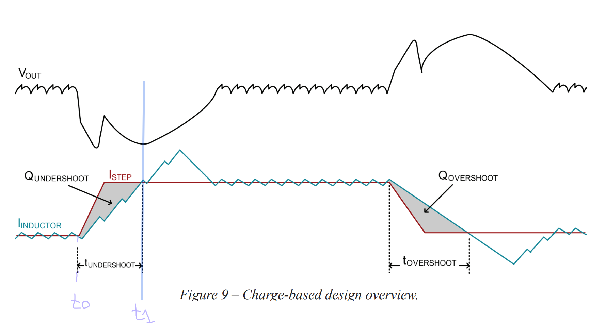

Ani bir yuk akimi degisimi sirasinda `Vout`'un minimum noktasi ve `t1` ani.


ODT'den aktarilan metin (`Slew Rate Hesabı`):

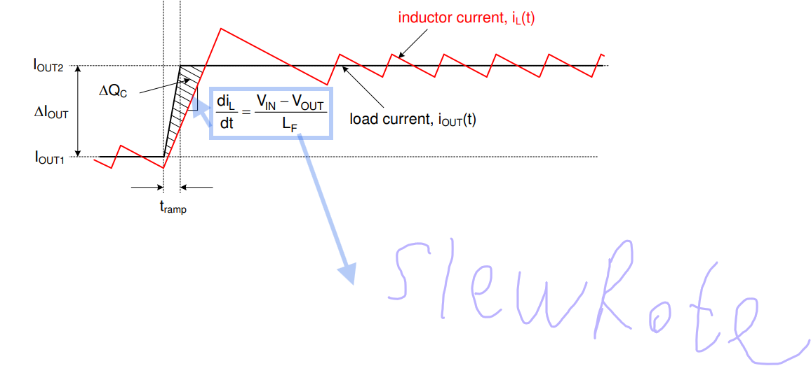

> Bir voltage regulator’ü, ani yük değişimlerinde (Load transient) hemen cevap veremez. Çünkü çıkıi bobini, akımın oranını (Current Slew Rate) sınırlayan bir parametredir. Bobinlerin akımı ani olarak çok hızlı değişemez. **?
> Bir yükte ani değişiklik olduğunda, ilk anda gereken ekstra akımı, regulator sağlayamaz. Bu nedenle ihtiyaç duyulan fazladan akım, Çıkış sığaçlarından sağlanmak zorundadır.

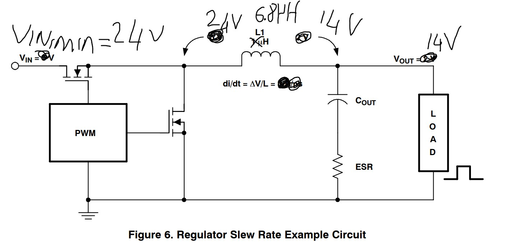

Ani bir yük akımı değişimi sırasında `Vout`…

> Feedback Control loop çıkış gerilimindeki değişimi algılar, ve mosfet duty cylcle’ını ayarlamaya başlar. Ancak duty cycle %100’e çıksa bile (Kullandığımız IC’nin donanımsal sınırından ötürü mümkün değil, Denklem Hata: Başvuru kaynağı bulunamadı.7’ten ) akımın artış hızı, Istep akımının artış hızından daha yavaştır.
>
> Istep akımı tramp süresinde artarken,
> Bobinin akımı t_undershoot süresinde artar. Düzelt a.q***
> Bobinin Tanım denkleminden yararlanarak:
>
> yerine gerilimini kullanma sebebim, Slew Rate’ı daha düşük yapar-eğimi azaltır, süresini uzatır. [1] ( Hata: Başvuru kaynağı bulunamadı.8 )
>
> Bobin akımının, akımı kadar artması bulduk.
>
> Ancak power-stage? kayıplarını (Mosfetlerin Rds(on) direnci, bobinin dcr direnci, layout direncini) göz önünde bulundurmadık. Bu kayıpları da dikkate alırsak:
>
> ( Hata: Başvuru kaynağı bulunamadı.9 )
>
> Gerçek devrede Çıkış akımının akımı kadar artış süresine diye isimlendirdik.
> süresini de gerçekçi bir değer olarak belirlemek için Evm’deki başarım eğrilerinden aldım. ??Fig.14’ten olarak belirlenmiş.
>
> olması, Bobinin akımının, yük artışını yeterince hızlı karşılayamadığını gösterir. Kalan yükleri Capacitorler karşılayacak,
>
> Evm’de sadece MLCC capacitor kullanıp, hiç bulk capacitor kullanmamalarını bu hesaptan sonra anladım.
> İlerleyen süreçte, çıkışta bulk capacitor kullanmayı gerektirecek şekilde design requirement’ı sıkılaştırabilirim.

Bu bolume ait ek kaynak-fotolar:


Ek not:

ODT kopyasinda bu bolumde de bazi semboller ve denklemler eksik gorunuyor; bu nedenle kaynak metni aynen korudum. Teknik olarak burada korunmak istenen ana iliskiler su sekilde yazilabilir:

```math
- bobin akiminin yukselme hizi birinci yaklasimda $\dfrac{dI_L}{dt} \approx \dfrac{V_L}{L}$ ile sinirlanir
```

Yani bobin akiminin artis hizi, bobin uzerindeki anlik gerilim ve enduktans tarafindan sinirlanir. Bu nedenle feedback dongusu duty oranini arttirsa bile akim sonsuz hizla yukselemez.

Yukteki ani artis ile bobin akimi arasindaki fark ilk anda cikis kapasitörleri tarafindan karsilanir:

```math
I_C = I_{load} - I_L
```

Bu da cikis geriliminin gecici davranisini belirler:

```math
C_{out}\frac{dV_{out}}{dt} = -I_C
```

$t_1$ ani ve kullanicinin not ettigi $t_{undershoot}$ sonu, matematiksel olarak su kosulla iliskilendirilebilir:

```math
\frac{dV_{out}}{dt} = 0
```

Bu anda bobin akimi, en azindan o anlik durumda, yuk talebini karsilayabilecek seviyeye yaklasmistir. ODT'deki EVM yorumu da bu bakimdan anlamlidir: eger MLCC bankasi bu gecis suresinde yeterli enerjiyi saglayabiliyorsa, bulk kapasitör ihtiyaci her durumda zorunlu olmayabilir.

Ilk foto, bobin uzerindeki `di/dt = \Delta V / L` sezgisini ve yuk adimi aninda hangi gerilimlerin bobin egimini belirledigini not etmek icin kullanilmistir. Ikinci foto ise bu projeye ait nihai bir veri tablosu degil; ama modern yuklerin neden sert `load step` ve `load slew-rate` gereksinimleri dogurabildigini gosteren arka-plan referansi olarak yararlidir.


Defterden aktarilan not (`W.98`):

Burada yukaridaki `Slew Rate Hesabı` bolumunun defterdeki daha duz, egitsel bir ornegi var. Ust kisimda su ana fikirler yazili:


- bir regulator, ani yuk degisimlerinde hemen cevap veremez
- bunun nedeni, cikis bobininin akim artis hizini (`current slew rate`) sinirlamasidir
- ilk anda gereken ekstra akim regulator tarafindan degil, cikis kapasitörlerinden saglanir
- feedback dongusu cikis gerilimindeki dususu algilar ve duty cycle'i arttirmaya baslar; ancak bobin akimi yine de sonlu hizla artis gosterebilir

Sayfanin saginda bobinin temel iliskisi tekrar yazilmis:

```math
\frac{d i_L}{dt} = \frac{V_L}{L}
```

Alt kisimda kavramsal bir ornek var:

- $V_{in} = 5\,\text{V}$
- $V_{out} = 2\,\text{V}$
- $L = 1\,\mu\text{H}$
- $R_{ESR} = 10\,m\Omega$
- $\Delta I = 6\,\text{A}$ ani yuk adimi
- $t_{loop} = 2\,\mu\text{s}$

Sayfadaki metne gore:

- regulator bu olayi ancak yaklasik `2 us` sonra fark edip tepki vermeye basliyor
- o andan sonra bile bobin akiminin artis hizi, bobin uzerindeki gerilim ve `L` ile sinirli

Sayfada yazilan ornek slew-rate hesabi:

```math
\frac{d i_L}{dt}
=
\frac{\Delta I_L}{dt}
=
\frac{V_L}{L}
=
\frac{5-2}{1\,\mu\text{H}}
=
3\,\text{A}/\mu\text{s}
```

`W.98` burada proje-ozel `24-36 V / 14 V` sayilarini veren bir nihai hesap sayfasi degil; daha cok elde kurulmus egitsel bir ornek. Ama anlattigi fizik cok net: load transient sirasinda dongu tepki verse bile bobin akimi ancak sonlu bir `A/us` egimiyle yukselebilir, ilk anda gereken fark akim da cikis kapasitörlerinden gelir. O yuzden `5.4.6` altinda yerinde duruyor.


#### 5.4.7 Acik teknik dogrulamalar


Bu bolumde daha sonra eklenecekler:

- cikis kapasitörleri icin etkin kapasitans hesabi

- ESR ve ESL etkisi

- cikis sapmasi ile kapali-cevrim cikis empedansi arasindaki bag

- MLCC sayisi ve de-rating hesabi

- G71 benzeri hizli-yuk yaklasimlarinin bu tasarima ne kadar gerekli oldugu

- cikista bulk kapasitör gerekip gerekmedigine dair nihai karar


### 5.5 Giris kapasiteleri


#### 5.5.1 Giris sigaçlari


ODT'den aktarilan metin (`7. giriş sıgaçları`):

> Çıkış kapasitörlerinde, mevcut MLCC'lere ek olarak bulk kapasitör kullanmaktan kaçındım; çünkü bulk kapasitörler çıkış empedansını değiştirerek kontrolcü tasarımını doğrudan etkiler ve kompanzasyonun yeniden ele alınmasını gerektirebilir. Ancak yaptığım hesaplamalarda mevcut MLCC’lerin, tanımlı gerilim ripple ve transient kriterlerini karşılaması yeterli olduğundan, ilave bulk kapasiteye ihtiyaç duyulmadı. Öte yandan, giriş kapasitörleri kontrolcü tasarımını doğrudan etkilemediği için (giriş empedansı, kontrol döngüsünden bağımsızdır), EMI ve termal sınırlar gözetilerek bulk kapasitör kullanımına yer verdim. Bu sayede orijinal spesifikasyonlarda yer almayan zorlu koşullara (örneğin ani giriş transiyentleri) karşı sistem dayanımı artırıldı.***


Ek not:

Bu parca, cikis ve giris kapasiteleri arasindaki tasarim felsefesi farkini netlestiriyor. Cikista bulk kapasitör karari kontrol ve kompanzasyon tarafini etkilerken, giriste bulk kapasitör kullanimi daha cok `EMI`, termal dayanım ve transient dayanimi acisindan degerlendiriliyor.


#### 5.5.2 Yeni eklenen giris gereksinimleri


ODT'den aktarilan metin (`Eklenen yeni teknik şartlar`):

> Allowed input peak-to-peak ripple voltage: ΔVIN_PP ≤ 0.24V
> Allowed input transient undershoot or overshoot: ΔVIN_Tran ≤ 0.36V


Ek not:

Bu iki teknik sart, giris kapasiteleri icin artik yalnizca ortalama enerji depolama degil, ayni zamanda anlik gerilim kalite sinirlari da tanimlandigini gosteriyor. GitHub'da daha duzgun gorunmesi icin bu sinirlar su sekilde de okunabilir:

- $\Delta V_{IN,PP} \le 0.24\,\text{V}$
- $\Delta V_{IN,Tran} \le 0.36\,\text{V}$


Defterden aktarilan not (`W.26`):

Burada ikinci projenin giris kapasitörü hesabinda kullanilan o anki tasarim ozet parametreleri toplanmis:


- $V_{in,\min} = 24\,\text{V}$
- $V_{in,\max} = 36\,\text{V}$
- $V_{out} = 14\,\text{V}$
- $P_{out,\max} = 125\,\text{W} \Rightarrow I_{out,\max} \approx 8.93\,\text{A} \approx 9\,\text{A}$
- $P_{out,\min} = 50\,\text{W} \Rightarrow I_{out,\min} \approx 3.57\,\text{A}$
- `load-step` yaklasik $9 - 3.57 = 5.43\,\text{A}$
- giris tarafi icin yeni eklenen hedefler:
  - `Allowed input current ripple (p-p, ideal source): 50 mA`
  - $\Delta V_{IN,PP} \le 0.24\,\text{V}$
  - $\Delta V_{IN,Tran} \le 0.36\,\text{V}$

Burada ayrica giris kapasitörü hesabinda kullanilan goreli duty notlari da goruluyor:

- $D_{\max} \approx 0.648$
- $D_{\min} \approx 0.432$

Bu duty degerleri yalnizca ideal $V_{out}/V_{in}$ oranindan gelmiyor gibi duruyor; verim ve gercek tasarim kabulune dayali bir iterasyon izi var. O yuzden input capacitor hesabinda kullanilan duty araligi olarak burada durmasi mantikli.

Defterden aktarilan not (`W.140`):

Burada ikinci proje icin kullanilan temel tasarim girdileri ve duty araligi daha duz ve toplu bicimde tekrar ediliyor. `W.26`daki parametre ozetinin guclu bir devami ve ozellikle `D = 0.5` seciminin nereden geldigini gostermesi acisindan degerli.


Sayfada bastan sona not edilen temel proje girdileri sunlar:

- `V_{in,\min} = 24\,\text{V}`
- `V_{in,\max} = 36\,\text{V}`
- nominal cikis gerilimi: `14 V`
- `I_{out,\max} = 125\,\text{W} / 14\,\text{V} \approx 8.92\,\text{A} \approx 9\,\text{A}`
- `I_{out,\min} = 50\,\text{W} / 14\,\text{V} \approx 3.571\,\text{A}`
- `step load = 9 - 3.571 \approx 5.429\,\text{A}`

Sayfanin ortasinda once ideal buck duty araligi yaziliyor:

```math
\frac{V_{out}}{V_{in,\max}}
\le
D
\le
\frac{V_{out}}{V_{in,\min}}
```

ve buna gore:

```math
\frac{14}{36}
\le
D
\le
\frac{14}{24}
```

sonucu olarak kullanici su degerleri not etmis:

- `D_{\min} \approx 0.3888`
- `D_{\max} \approx 0.5833`

Sayfanin altinda ise verim etkisi de dahil edilerek daha muhafazakar bir duty araligi kuruluyor:

```math
\frac{V_{out}}{V_{in,\max}\,\eta}
\le
D_\eta
\le
\frac{V_{out}}{V_{in,\min}\,\eta}
```

`V_{out} = 14 V` ve `\eta \approx 0.9` ile:

```math
\frac{14}{36\times 0.9}
\le
D_\eta
\le
\frac{14}{24\times 0.9}
```

ve sayfadaki sonuc:

- `D_{\min,\eta} \approx 0.4321`
- `D_{\max,\eta} \approx 0.6481`

Sayfanin en altindaki cok onemli not da su:

- hesaplamalarda kullanilan duty degeri olarak:
  - `D_{\max,\eta} = 0.6481`
  - `D_{\min} = 0.3888`
  - bu araligin ortasina yakin bir nokta olarak
  - `D = 0.5`
  secilmis

Bu sayfa, `W.26`daki `0.648 / 0.432` duty degerlerinin rastgele gelmedigini daha net gosteriyor. Ayni zamanda neden bircok giris kapasitörü ve EMI hesabinda `D = 0.5` kullanildigini da acikliyor: secilen araligin makul orta noktasi ve worst-case'e yakin hizli tasarim noktasi gibi dusunulmus.

Defterden aktarilan not (`W.53`):

Burada ikinci proje icin eklenen specification'lar bir kez daha toplanip, bunlardan hareketle en kotu / en iyi durumda giris akimi hizli bir sekilde hesaplanmis.


Sayfada not edilen sartlar sunlar:

- `Allowed output voltage ripple p-p, any load = 100 mV`
- `Allowed input ripple current p-p, ideal source = 50 mA`
- $\Delta V_{IN,PP} \le 0.24\,\text{V}$
- $\Delta V_{IN,Tran} \le 0.36\,\text{V}$

Sayfada ayrica su tasarim notu dusulmus:

- `50 mA` seviyesindeki ideal-kaynak giris akim ripple hedefinin, EMI / input filter eklenmesiyle karsilanmasi dusunuluyor

Defterde daha sonra, verimi yaklasik $\eta = 0.9$ kabul ederek giris akimi sinirlari hizlica hesaplanmis:

En kotu durum:

```math
I_{IN,\max}
= \frac{125\,\text{W}}{0.9 \cdot 24\,\text{V}}
\approx 5.79\,\text{A}
```

En iyi durum:

```math
I_{IN,\min}
= \frac{125\,\text{W}}{0.9 \cdot 36\,\text{V}}
\approx 3.86\,\text{A}
```

`W.53`, `W.26` ile ayni ozet-parametre hattina ait. Burada verilen `I_{IN}` degerleri, giris kapasitörü ve input filter hesabinda kullanilabilecek yararli sinirlar veriyor. `50 mA` giris ripple hedefi icin dusulen "EMI / input filter eklenmesiyle karsilanir" notu da, bu requirement'in yalnizca kapasitör secimiyle degil daha genis bir giris filter tasarimiyla bagli oldugunu gosteriyor.


#### 5.5.3 Secilen genel strateji


ODT'den aktarilan metin:

> Yüksek frekans ripple’ını bastırmak için MLCC kullanacağım, ancak yüksek dc bias gerilimi altında capacitance’ları düşüyor.
> Elektrolitik kapasitörler, düşük maliyetli ve büyük enerji depolama kapasitesine sahiptir ama yüksek ESR nedeniyle ripple bastırmakta zayıftır.
> Bu yüzden, MLCC+Elektrolitik capacitor’u beraber kullanacağım…****


Ek not:

Bu strateji, farkli kapasitör teknolojilerinin guclu oldugu frekans araliklarini birlikte kullanma mantigina dayanir:

- MLCC tarafı: yuksek frekans ripple ve dusuk `ESR/ESL`
- elektrolitik tarafı: daha buyuk enerji tamponu ve daha dusuk maliyetli bulk kapasite

Ancak MLCC seciminde `dc-bias` altindaki etkin kapasitans dususu mutlaka hesaba katilmalidir; katalog degeri tek basina yeterli degildir.


#### 5.5.4 MLCC `Cin` hesabi


ODT'den aktarilan metin (`7.1. MLCC Sığaç Hesabı / 7.1.1. MLCC Cin Hesabı?`):

> PKfsfsfsd
> Girişteki ripple gerilimini ΔVIN_PP ≤ 0.24V ‘un altında tutabilecek, capacitor capacitance’nin en düşük değerini buluyoruz. [2] [3]
> En yüksek a [3] ve [2] kaynaklarındaki örneklerde … D’nin … en kötü durum D = 0.5 iken ..
> Bu değer etkin capacitance değeridir.
> Dc Bias’a bak.
> Voltage rating’e bak.
> Tolerance’ı dikkate al yüzde kaçsa düş. Acaba kemet nasıl hesaplıyor?
>
> Voltage rating’e de dikkat. Emv’de 100V’luk voltage rating’i olan capacitor’ler kullanılmış. Geniş bir giriş gerilim aralığında çalışacak(5.5-100V?) şekilde tasarlandığı için olmalı…?


Ek not:

Buradaki esas mantik basit: once gerekli minimum etkin `Cin` bulunuyor, sonra `dc-bias`, tolerans ve gerilim sinifi etkileri eklenerek gercek secilecek parca degerine gidiliyor. ODT notunda gecen $D = 0.5$ varsayimi ilk muhendislik yaklasimi olarak makul bir worst-case noktasi olabilir; ama asil hedef katalog `uF` degerini degil, etkin $C_{in}$ gereksinimini bulmak.

Defterden aktarilan not (`W.47`):

Burada giris kapasitörü hesabinda kullanilan temel fiziksel mantik cizim ve kisa notlarla anlatiliyor.


Sayfada gorulen ana fikirler sunlar:

- buck converter giristen darbeli akim ceker
- kaynak bu darbeli akimi tek basina ve anlik olarak saglayamaz
- bu nedenle giris kapasitörleri, kaynak ile buck kati arasindaki ani akim farkini ustlenir
- bunun sonucu olarak da giriste belirli bir `\Delta V_{IN,p-p}` ripple'i olusur

Sayfada bu dusunceye bagli olarak kullanilan temel iliski su sekilde yaziliyor:

```math
\Delta V_{ripple}
\approx
\frac{I_{out}\,D(1-D)}{f_{sw}\,C_{IN}}
```

Alt notlarda ayrica su fikirler de goruluyor:

- guc kaynagi "mukemmel" olsa bile cikis empedansi sifir degildir
- buck katinin ani akim ihtiyaci ile kaynagin verebildigi akim arasindaki fark ilk anda giris kapasitörlerince kapanir
- secilecek `C_{IN}` degeri yalnizca formulle degil, MLCC'lerdeki `dc-bias` dususu ile birlikte dusunulmelidir

`W.47`, `W.27` ve `W.35` tarafindaki giris ripple denklemlerinin fiziksel gerekcesini veren bir ara dusunce sayfasi. Yeni bir sayisal sonuc vermiyor; ama "neden giris kapasitörü hesabi yapiyoruz?" sorusunu senin defter dilinle aciklamasi bence yeterince degerli.

Defterden aktarilan not (`W.48`):

Burada giris kapasitörü / bulk / MLCC tarafinda nasil test dusunuldugu ve hangi sorularin akilda tutuldugu goruluyor.


Sayfanin ust tarafinda not edilen test / kontrol sorulari sunlar:

- bulk kapasitör kullaniminda ripple nasil degisiyor
- bulk kapasitör fazlaysa ne oluyor
- MLCC olursa etkisi ne kadar oluyor

Sayfada ayrica `LISN` notu da geciyor:

- `LISN = Line Impedance Stabilization Network`
- yani guc kaynagi tarafi yalnizca ideal kaynak gibi degil, belirli bir hat empedansi ve EMI olcum baglami ile de dusunuluyor

Alt taraftaki notlarda seramik kapasitörlerin iki temel gorevi ozellikle vurgulaniyor:

- yuksek frekansli gurultuyu bastirmak
- anahtarlama kaynakli gerilim dalgalanmasini / input voltage ripple'i azaltmak

Son kisimdaki ana fikir ise su sekilde okunuyor:

- buck converter giris tarafinda akim surekli degil, darbeli cekilir
- MOSFET `ON` iken giristen yuksek akim cekilebilir
- MOSFET `OFF` iken bu akim sifira yaklasabilir
- bu nedenle kaynak tarafindan bakildiginda giris akimi `pulsating current` karakterindedir

`W.48`, `W.47` ile ayni kavramsal hatta duruyor. Yeni bir son formül vermiyor; ama neden giris kapasitörü hesabinin, testinin ve hatta EMI baglaminin birlikte dusunuldugunu gostermesi acisindan guclu.

Defterden aktarilan not (`W.52`):

Burada buck donusturucudeki akim donguleri sematik uzerinde isaretlenmis; giris ve cikis kapasitörlerinin hangi anda hangi akimi tasidigi gosteriliyor.


Sayfada etiketlenen akimlar sunlar:

- `I_DD`: kaynaktan / beslemeden cekilen akim
- `I_{CIN}`: giris kapasitörü ripple akimi
- `I_L`: bobin akimi
- `I_{CO}`: cikis kapasitörü ripple akimi
- `I_O`: yuk akimi

Cizimde iki ayri akim yolu ozellikle ayrilmis:

- `Q1 ON` iken akim yolu
- `Q1 OFF` iken akim yolu

Bu sayfanin verdigi ana fikir su sekilde okunabilir:

- bobin akimi sureklilige egilimlidir
- giris tarafindaki akim ise anahtarlama durumuna gore darbeli karakter gosterir
- bu fark yuzunden `CIN`, kaynagin anlik saglayamadigi akim bilesenini tasir
- benzer sekilde `COUT` da yuk tarafinda ripple akimini ustlenir

`W.52`, `W.47-W.48` tarafindaki "giris akimi darbeli" dusuncesini daha somut bir sematik cizimle destekliyor. Yeni bir son sayisal sonuc vermiyor; ama hem `CIN` hem `COUT` akim rollerini ayni cizimde senin notlarinla gorunur kilmasi bence yeterince guclu.

Defterden aktarilan not (`W.49`):

Buradaki not, ders videosunda hocanin anlattigi ornekten alinmis; bu projenin kendi buck converter tasarimina ait nihai hesap sayfasi degil.


Sayfanin proje baglamindaki degeri, dogrudan sayisal veri vermesinden cok, giris kapasitörü akim dalga biciminin ideal kare / ucgen karmasi bir gorunumde olmadigini ve anahtarlama kenarlari ile gecis surelerinin de bu akimi etkiledigini hatirlatmasidir.

Sayfada gorulen ana fikirler sunlar:

- giris kapasitörü akimi, anahtarlama dongusunde darbeli karakterdedir
- `t_rise`, `t_on`, `t_fall`, `t_off` gibi alt zaman bolgeleri ayrica dusunulmustur
- anahtarlama kenarlari cok hizli oldugu icin, bu bolgelerdeki akim degisimi de cok hizli olabilir
- bu nedenle giris kapasitörü seciminde yalnizca dusuk frekansli ripple degil, hizli kenar davranisi da onemlidir

Sayfada ornek olarak su notlar okunuyor:

- $f_{sw} \approx 200\,\text{kHz}$
- $T_{sw} \approx 5\,\mu\text{s}$
- `t_rise` ve `t_fall` mertebesi `30 ns` civari

Buradaki not kullanicinin kendi tasarimindan degil; ders videosundaki hocanin orneginden alinmis kavramsal bir not. `200 kHz` notu, ikinci projede kullandigin `332 kHz` nihai degerle uyusmuyor; dolayisiyla proje verisiyle karistirilmamali. Buna ragmen ana fikir degerli: giris kapasitörü akimini sadece ortalama / RMS bakisiyla degil, hizli anahtarlama kenarlariyla birlikte dusunmek gerekiyor.

Defterden aktarilan not (`W.50`):

Bu kisim da, ust basligindan anlasildigi kadariyla bir ders / video anlatimindan alinmis not; bu projenin kendi nihai hesap sayfasi degil.


Sayfada giris kapasitörü secimine dair su genel tasarim fikirleri ozetleniyor:

- kapasitörler iki ana rolde dusunulur:
  - enerji depolama
  - yuksek frekans bastirma / bypass
- ani yuk degisimlerinde (`load transient`) giris kaynagi tek basina yeterince hizli cevap veremeyebilir
- bu durumda bulk kapasitör, daha yavas ama daha buyuk enerji tamponu gibi davranir
- MLCC ise yuksek frekansli ripple ve EMI bastirma tarafinda daha etkilidir

Sayfada ayrica su dusunce izi korunmaya deger gorunuyor:

- eger input kapasitörü cok az olursa
- giris empedansi artar
- `input voltage` daha fazla dalgalanabilir / dusus gosterebilir
- agir durumda `brown-out` benzeri davranislar gorulebilir

`W.50`, `W.49` ile ayni baglamda, ders anlatimindan ogrenilen kavramsal bir not. Buradaki fikirler proje icin faydali tasarim sezgileri sagliyor; ama dogrudan ikinci projenin nihai hesap sonucu gibi alinmamali.

Defterden aktarilan not (`W.94`):

Burada Texas Instruments'in `Input and Output Capacitor Selection` uygulama notunun giris kapasitörü secimi bolumune ait dogrudan kaynak-not var. Sayfanin ust kismina dusulen notlar, giris kapasitörü seciminde iki ana eksenin izlendigini gosteriyor:


1. `input ripple voltage`'u azaltmak
2. `input current / pulse current` kapasitesini dogru secmek

Sayfanin metninden ve senin yan notlarindan korunan ana fikirler sunlar:

- giris dalgalanma gerilimi (`ripple voltage`), esas olarak seramik kapasitörlerle dusurulur
- bulk kapasitörler tek basina yuksek frekansli ripple gerilimini etkin sekilde bastiramaz
- buna karsilik bulk kapasitörler, ripple current tasima ve transient destek tarafinda deger kazanir
- `Figure 1`'de `input pulse current vs duty cycle` iliskisi verilir; yani giris kapasitörü akim boyutlandirmasi duty'ye baglidir

Senin sayfa uzerine aldigin notlardan, ozellikle su mesaj onemli:

- cikis ripple akimi ve giris pulse akimi buyuklukleri yuk / duty ile birlikte degisir
- duty `0.5` civari, giris pulse akimi acisindan kritik / worst-case bolgelerden biri olabilir
- bu nedenle `Cin` hesabi sadece `uF` secimi degil, ayni zamanda `RMS current` ve `pulse current` secimidir


Bu iki ekran goruntusu, `W.94`te kaynak-ustu-not olarak yazilan iki ana ekseni gorsel olarak da destekliyor:

- `Figure 1` uzerinden `input pulse current / RMS current` davranisinin duty'e bagli oldugu
- `\Delta V_{IN,PP}` hesabi tarafinda ise toplam etkin `C_{in}` ile `D(1-D)` teriminin ana rol oynadigi

`W.94`, `W.27-W.35` hesap ailesinin arkasindaki kaynak mantigi gosteren cok degerli bir uygulama-notu sayfasi. Yeni bir proje-ozel sonuclu hesap vermiyor; ama neden bir yandan `\Delta V_{IN,PP}` hesabi, diger yandan `I_{Cin,RMS}` hesabi yaptigini cok net acikliyor.


Defterden aktarilan not (`W.27`, `W.30`, `W.31`, `W.32`, `W.33`):

Bu batch, giris kapasitörü boyutlandirmasinda birden fazla yontemin birlikte denendigini gosteriyor. Muhtemel kaynak baglamlari `G39`, `G44`, `G40` ve `G32` etrafinda toplanmis gorunuyor.


`W.27` tarafinda, ripple gerilimi hedefinden minimum etkin `Cin` icin su iliski kullaniliyor:

```math
C_{in}
\ge
\frac{D(1-D)\,I_{out}}{\Delta V_{IN,PP}\,f_{sw}}
```

Defterdeki ilk yerlestirmede:

- $D = 0.5$
- $I_{out,\max} \approx 9\,\text{A}$
- $\Delta V_{IN,PP} = 0.24\,\text{V}$
- $f_{sw} = 332\,\text{kHz}$

alininca yaklasik:

```math
C_{in,\text{eff}}
\gtrsim
\frac{0.5(1-0.5)\cdot 9}{0.24 \cdot 332\,\text{kHz}}
\approx 28.4\,\mu\text{F}
```

`W.30-W.31` sayfalarinda ayni problem daha ayrintili okunuyor:

- bir yandan `I_{Cin,RMS}` hesabi yapiliyor
- diger yandan giris ripple gerilimi yalnizca kapasitif terim degil, `ESR` terimiyle birlikte dusunuluyor


Bu yaklasimin temiz yazimi su sekilde ozetlenebilir:

```math
\Delta V_{IN}
\approx
\frac{I_{out}\,D(1-D)}{f_{sw}\,C_{in}}
\, + \,
I_{out}\,R_{ESR}
```

`W.32` sayfasi, daha sikı bir ornek olarak `\Delta V_{IN} = 50\,\text{mV}` gibi bir hedefle tekrar deneme yapiyor. Bu, mevcut ikinci proje spesifikasyonundaki `0.24 V` ile ayni sey degil; dolayisiyla final hedef gibi degil, daha sert bir tasarim egzersizi / ara deneme gibi okunmali.


`W.33` ise `Allowed input current ripple = 50 mA` maddesini, kaynagin gordugu `Z_{in}` ile iliskilendirerek yorumlamaya calisiyor. Bu sayfa ozellikle su acidan degerli:

- giris kapasitörü hesabinin sadece `uF` secimi olmadigini
- kaynak tarafinin gordugu akim dalgalanmasi ile de bag kuruldugunu
- dolayisiyla daha sonra eklenecek input filter veya damping agi ile ayni konuya baglanacagini


`W.35` sayfasi, bu minimum `Cin` hesabini bir adim daha ileri goturup `ESR` terimini acikca denkleme katiyor. Defterdeki yazima gore:


```math
\Delta V_{IN}
=
\frac{I_{out}\,D(1-D)}{f_{sw}\,C_{in}}
 + I_{out}R_{ESR}
```

ve `R_{ESR} = 3 mOhm`, `I_{out} = 9 A`, `D = 0.5`, `f_{sw} = 332 kHz`, `\Delta V_{IN} = 0.24 V` kabul edilince:

```math
C_{in}
\gtrsim
\frac{0.5(1-0.5)\cdot 9}
{332\,\text{kHz}\cdot(0.24 - 0.003\cdot 9)}
\approx 31.1\,\mu\text{F}
```

Bu batch tek bir sonuca vurmuyor; ayni input-capacitor problemini farkli acilardan kuruyor. `W.27`deki `28.4 uF` ilk minimum etkin `Cin` adayi gibi dururken, `W.30-W.31` ayni problemi `ESR` terimini de icerecek sekilde daha gercekci okumaya calisiyor. `W.35` bunu sayisal olarak `31.1 uF` civarina tasiyor. `W.32` mevcut `0.24 V` hedefine gore daha sert bir egzersiz, `W.33`teki `50 mA` yorumu ise daha cok kaynagin gordugu kalite metriği gibi okunmali.

Ek not (calculator teyidi):

`LM5146_quickstart_calculator_revB1.xlsm` dosyasinda giris kapasitörü tarafi icin daha erken / daha sade bir checkpoint gorunuyor:

- minimum ideal `C_{IN} \approx 28.172 uF`
- toplam derated `C_{IN} \approx 30 uF`
- `ESR \approx 1 mOhm`
- hesaplanan giris ripple'i `\approx 236.07 mV_{p-p}`
- `I_{Cin,RMS} \approx 4.495 A`

Bu, defterdeki ilk `28.4 uF` cizgisiyle cok uyumludur. Ancak sonraki defter sayfalarinda MLCC `dc-bias` dususu ve ek bulk secimi daha ayrintili dusunuldugu icin, `8.228 uF + 34 uF` ve `0.2006 V` gibi daha rafine sonuc cizgileri workbook'un bu erken checkpoint'inin uzerine cikmaktadir. Bu durum celiski gibi degil, gercek komponentlerle yapilan sonraki iyilestirme gibi okunmalidir

Defterden aktarilan not (`W.51`):

Burada minimum `Cin` hesabindan sonra gercek kapasitör seciminde kontrol edilmesi gereken ikinci adimlar toplaniyor.


Sayfada acikca not edilen kontrol basliklari sunlar:

- kapasitörun tasiyabilecegi maksimum `ripple current` / `RMS` akim degeri
- minimum `rated voltage` secimi
- MLCC / ceramic kapasitörlerde `dc-bias` altindaki kapasitans dususu

Sayfadaki ana fikirler su sekilde okunuyor:

- secilen kapasitörun `ripple current rating` degeri, devrede tasimasini bekledigimiz ripple akimdan buyuk olmali
- minimum gerilim dayanimı secilirken yalnizca nominal `Vin` degil, olasi giris asiri gerilim / surge notlari da dusunulmeli
- ceramic capacitor seciminde katalog `uF` degeri yeterli degildir; `dc-bias` altindaki gercek etkin kapasitans egirisinden kontrol gerekir

Sayfa sonundaki grafik notlari da bunu destekliyor:

- bir grafik, izin verilen ripple / akim tasima davranisinin aranmasi gerektigini
- diger grafik ise `dc-bias` arttikca etkin kapasitansin dusmesini

hatirlatiyor.

`W.51`, `W.27-W.35` tarafindaki minimum `Cin` hesabini tek basina yeterli gormuyor; gercek parca secimi icin `current rating + voltage rating + dc-bias` kontrollerini ekliyor. Yeni bir nihai sayisal sonuc vermiyor, ama teorik kapasitans hesabindan BOM secimine gecerken iyi bir kopru kuruyor.


#### 5.5.5 RMS akimi ve termal bakis


ODT tarafinda dogru olarak vurgulanan ikinci konu, MLCC'lerin yalnizca kapasitans acisindan degil, RMS akim ve sicaklik artisi acisindan da boyutlandirilmasidir.

ODT'den aktarilan metin (`7.1.2. MLCC Sığaçlarının RMS Akımı?`):

> Girişteki ripple gerilimini karşılamanın yanı sıra?** seramik sığaçlar, ısıl dayanımı da olmalıdır.?** Azami giriş akımının rms’sini hesaplayacağız.
> Tam yükte..
> Full load: Sistemin maksimum çıkış gücüyle (örneğin 125 W) çalıştığı durumu ifade eder. Bu durumda: Çıkış akımı (Iₒ) en yüksek seviyededir (senin örneğinde 9A Dolayısıyla girişten çekilen toplam akım da en yüksek olur. Ripple akımı DC akım üzerine binen AC bileşen olduğundan, DC arttıkça RMS ripple bileşeni de artar.***

Kaba Hesap:

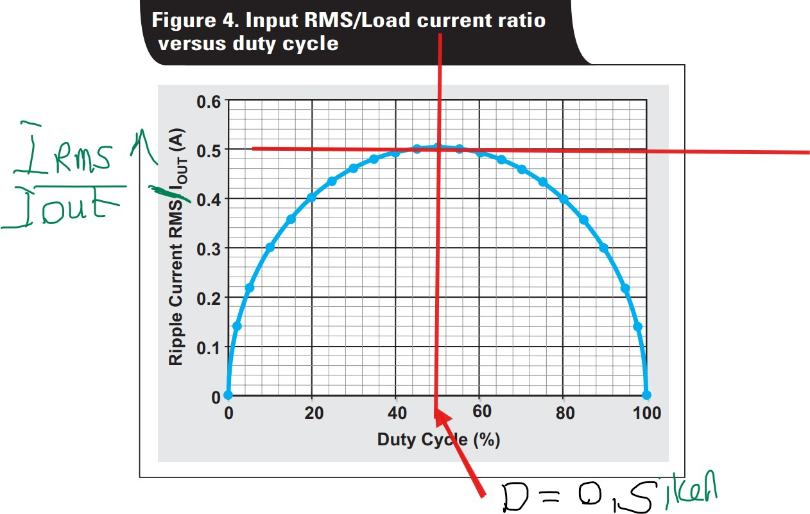

> Mavi eğri IIn_rms /Iload oranını verir.
> D =0.5 iken: IIn_rms /Iload =yaklaşık 0.5’tır mavi eğri, dikey eksen seviyesi.
> IIn_rms = Iload*0.5
> IIn_rms = 9A*0.5
> IIn_rms = 4.5A rms
>
> ODT'deki denklem notasyonu bozuk aktarilmis; temiz matematik yazimi asagida verilmistir.


Ek not:

Bu alt bolumde ana teknik fikir, MLCC seciminin yalnizca kapasitansla degil RMS akim ve termal dayanım ile birlikte yapilmasi gerektigidir. ODT notundaki kaba $D = 0.5$ yaklasimi ilk kontrol icin uygundur ve mavi egri uzerinden $I_{in,RMS} \approx 0.5 I_{load}$ sonucu okunarak $4.5\,\text{A}_{RMS}$ mertebesi bulunabilir.

Kaba yaklasimin temiz yazimi:

```math
\frac{I_{in,RMS}}{I_{load}} \approx 0.5
\qquad (D = 0.5)
```

```math
I_{in,RMS}
= I_{load}\cdot 0.5
= 9\,\text{A}\cdot 0.5
= 4.5\,\text{A}_{RMS}
```

GitHub uyumlu matematik bicimiyle verilen daha ayrintili ifade su sekilde yazilabilir:

```math
I_{in,RMS,\max}
= I_{LOAD,\max}
\sqrt{
D(1-D)
+ \frac{1}{12}\cdot
\left(\frac{V_{OUT}}{L\,f_{sw}\,I_{\max}}\right)^2
\cdot (1-D)^2 \cdot D
}
```

ODT notasyonundaki sayisal yerlestirme korunursa:

```math
I_{in,RMS,\max}
= 9\,\text{A}\,
\sqrt{
0.5(1-0.5)
+ \frac{1}{12}\cdot
\left(\frac{14\,\text{V}}{6.8\,\mu\text{H}\cdot 332\,\text{kHz}\cdot 9\,\text{A}}\right)^2
\cdot (1-0.5)^2 \cdot 0.5
}
\approx 4.55\,\text{A}_{RMS}
```

Bu sonuc, giris MLCC bankasinin yalnizca ripple gerilimini degil, RMS akim tasima ve sicaklik artisi tarafini da karsilamasi gerektigini gosterir.


Defterden aktarilan not (`W.29`):

Bu sayfada, giris kapasitörü RMS akimi icin daha ayrintili bir sayisal deneme var. Defterde:


- $D = 0.5$
- $I_{out,\max} = 9\,\text{A}$
- $\Delta I_L \approx 3.8\,\text{A}$

kabul edilerek:

```math
I_{Cin,RMS}
\approx
\sqrt{
D \left(
I_{out}^2 (1-D)
 + \frac{\Delta I_L^2}{12}
\right)
}
\approx 4.94\,\text{A}
```

Bu sonuc, yukaridaki `4.55 A_RMS` hesabiyla birebir ayni degil. Farkin nedeni kullanilan form, $\Delta I_L$ teriminin dahil edilmesi ve sayfadaki varsayimlar olabilir. Su asamada birini silmek yerine, `4.55 A_RMS` degerini kaba ilk tahmin, `4.94 A_RMS` degerini ise daha ayrintili / daha korunmaci tahmin olarak birlikte tutmak daha dogru gorunuyor.

Defterden aktarilan not (`W.36`):

Burada ayni `I_{Cin,RMS}` hesabi daha temiz ve daha duz bir yerlestirmeyle tekrar ediliyor:


```math
I_{Cin,RMS}
\approx
\sqrt{
D\left(
I_{out}^2(1-D) + \frac{\Delta I_L^2}{12}
\right)
}
```

`D = 0.5`, `I_{out} = 9 A`, `\Delta I_L = 3.8 A` ile defterde:

```math
I_{Cin,RMS} \approx 4.566\,\text{A}_{RMS}
```

`W.36` sonucu, mevcut `4.55 A_RMS` notuna cok yakin. O yuzden `W.36`, ilk kaba RMS tahmini destekleyen temiz bir teyit sayfasi gibi okunabilir. Buna karsilik `W.29` daha yuksek bir `4.94 A` sonucu veriyor; demek ki iki sayfa arasindaki fark ara adimlarda kullanilan form ya da yerlestirme farkindan geliyor olabilir.

Defterden aktarilan not (`W.90`):

Burada giris kapasitörü `RMS` akimi hesabi bir kez daha toparlaniyor ve hem ayrintili ifade hem de `D = 0.5` icin kullanilan hizli yaklasim ayni yerde korunuyor.


Sayfanin ust kismina yazilan ayrintili ifade, onceki sayfalardaki denklemin ayni ailesine ait gorunuyor:

```math
I_{in,RMS,\max}
=
I_0
\sqrt{
D(1-D)
 \frac{1}{12}
\left(
\frac{V_0}{L\,f_{sw}\,I_0}
\right)^2
(1-D)^2 D
}
```

Sayfadaki yerlestirmede:

- `I_0 = 9 A`
- `D = 0.5`
- `V_0 = 14 V`
- `L = 6.8 uH`
- `f_{sw} = 332 kHz`

kullanilarak yaklasik:

```math
I_{in,RMS,\max} \approx 4.544\,A_{RMS}
```

sonucu yazilmis.

Sayfanin orta kismina ise, ayni sonucun daha hizli/ezber bir yaklasimla tekrar not edildigi goruluyor:

```math
\frac{I_{in,RMS}}{I_{load}} \approx 0.5
\qquad (D = 0.5)
```

buradan:

```math
I_{in,RMS,\max}
\approx
0.5 \times 9\,A
=
4.5\,A
```

Sayfanin en altindaki kisa not da, bu `RMS` sonucu ile fiziksel karar arasindaki baglantiya dikkat cekiyor:

- `ESL`'yi dusuk tutmak icin coklu paralel MLCC
- yuksek frekans bastirma icin kucuk paket / kucuk `ESL`

`W.90`, `W.36` ile neredeyse ayni sonucu (`4.544 A` vs `4.566 A`) veriyor; bu da iki sayfanin birbirini iyi destekledigini gosteriyor. `W.29`daki `4.94 A` sonucuna gore daha dusuk bir deger verdigi icin `W.29` korunmaci alternatif olarak yerinde kaliyor. Bu sayfanin asil degeri, `RMS` hesabinin defterde birden fazla kez tekrarlandigini ve `4.5-4.6 A` bandinin guclu ana aday oldugunu gostermesi. Sondaki not da sayisal `RMS` hesabinin neden coklu paralel MLCC ve dusuk `ESL` kararina baglandigini guzel bagliyor.

ODT'den aktarilan metin (`7.1.3. MLCC Sığaçlarının Sıcaklıkla RMS Akımıı?`):

> ELEMAN SEÇMEYE ÇALIŞMA
> 4.55 Arms akımı
> X7R, X5R’den daha iyi sıcaklığa daha dayanıklı.

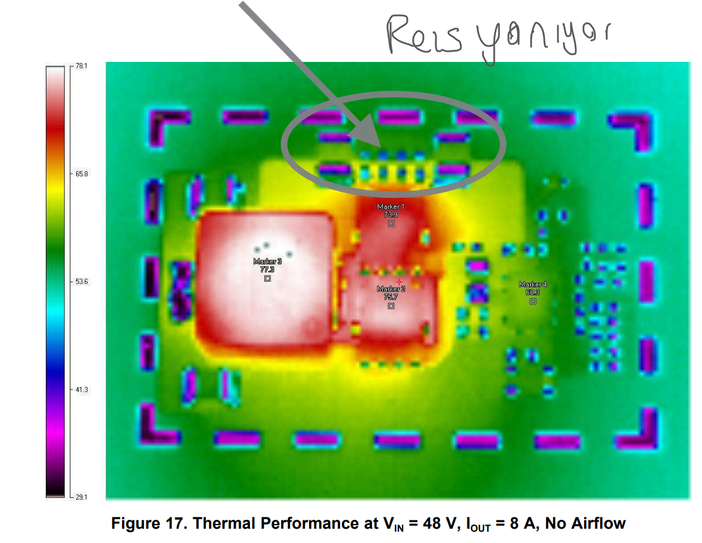

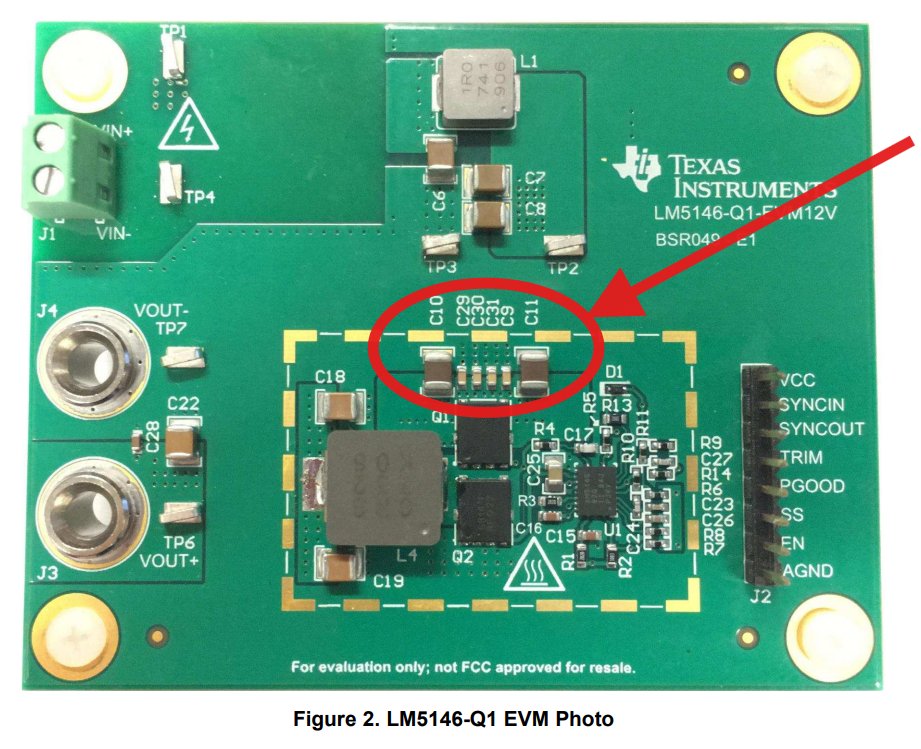

> Giriş kapasitorlerinin pozitif ucu, High-side mosfet’ın Drain ucuna, mmümkün (Kondansatörün negatif ucu, low-side MOSFET’in source ucuna, pozitif ucu ise high-side MOSFET’in drain ucuna mümkün olduğunca yakın yerleştirilmelidir.
> di/dt’yi düşürmek için. ****

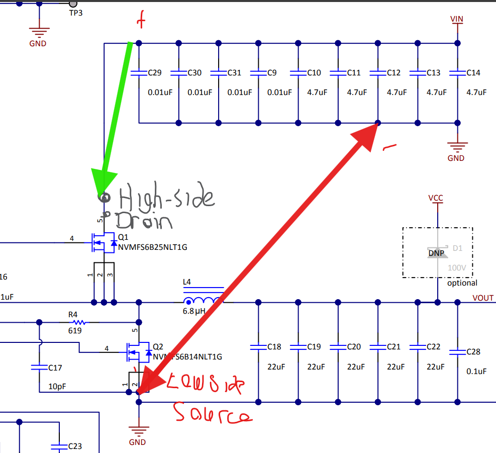

> 48V, 8A’de Main Mosfet’teki Marker1: 73.9 derece ölçülmüş. 24V, 8A’de Main Mosfet’teki Marker1: 64.8 derece ölçülmüş.
> Bizim sistemde Vinmax = 36V, Marker1 bölgesinden biraz dahasoğukbölgeolduüğundan en fazla 70derecedir çıkarımını yaptım.

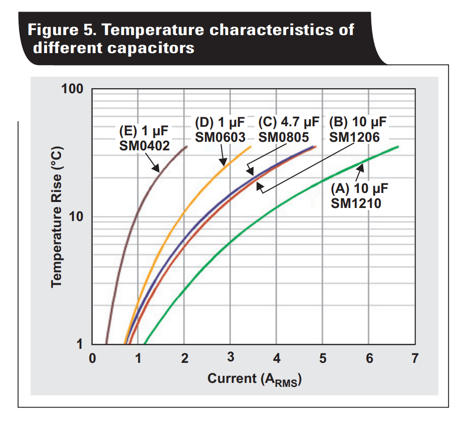

> Çıkış sıcağının bulunduğu yerdeki Kart sıcaklığı 70derece olarak tahmin ettik** Iin_rms_max = 4.55Arms bulmuştuk.
>
> Üzerinden geçen bu akımla ne kadar sıcaklık artışı oluyor. Bu dikeydeki temp.rise derecesi kartın derecesine eklenir. Diyelim ki Hiç akım yokken kartın sıcaklığı ne ise ona değen kapaciyorun de sıcaklığı o olur. Termodinamik birbirine değen…
> Kapasitor, Sıcaklık artışının ne kadara kabul ediyor. Buna bak.
>
> Paralel capacitor kullanarak Iin_rms_max = 4.55Arms’yi böleriz. TEMP.rise da az olur.


Ek not:

Bu parca, MLCC seciminde yalnizca elektriksel degerlerin degil sicaklik dayanimının da hesaba katilmasi gerektigini vurguluyor. ODT notundaki ana fikirler sunlardir:

- $X7R$, $X5R$'ye gore sicaklik davranisi acisindan daha guvenli bir tercihtir
- giris MLCC'leri high-side drain ile low-side source arasindaki sicak donguye olabildigince yakin yerlestirilmelidir
- $I_{in,RMS,\max} = 4.55\,\text{A}_{RMS}$ akimini birden fazla paralel kapasitore paylastirmak, her bir kapasitordeki `temp rise` degerini azaltir

`48 V / 8 A` ve `24 V / 8 A` EVM gozlemlerinden yapilan $\sim 70\,^{\circ}\text{C}$ kart sicakligi tahmini, ilk muhendislik referansi olarak anlamli. Ama nihai secimde secilen MLCC datasheet'indeki izin verilen sicaklik artisi ile ortam / kart sicakligini birlikte kontrol etmek yine de gerekiyor.


#### 5.5.6 ESL ve kucuk degerli yardimci MLCC'ler


ODT'den aktarilan metin (`7.1.4. MLCC Sığaçlarının ESL değeri ve Küçük Capacitance’lı Mlcc eklemek`):

> Mlccler yüksek frekansta çalışırken ESL değerleri çok önemli olur.ç***
> Düşük esl düşük ripple’için gereklidir.
> Paralel bağlarsak esl’yi düşürürüz.

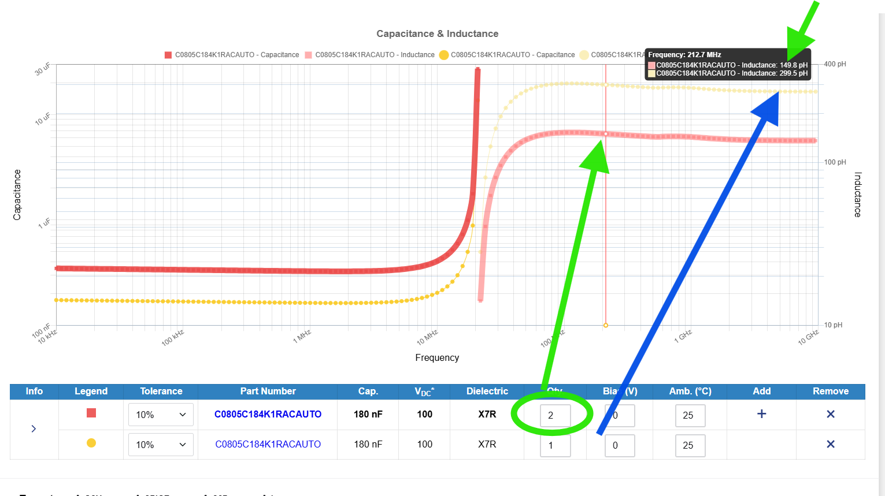

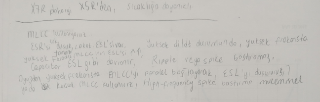

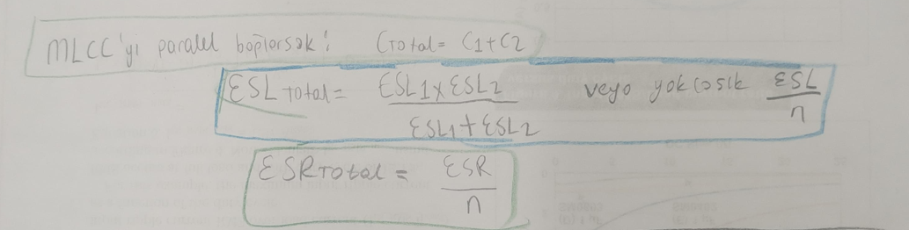

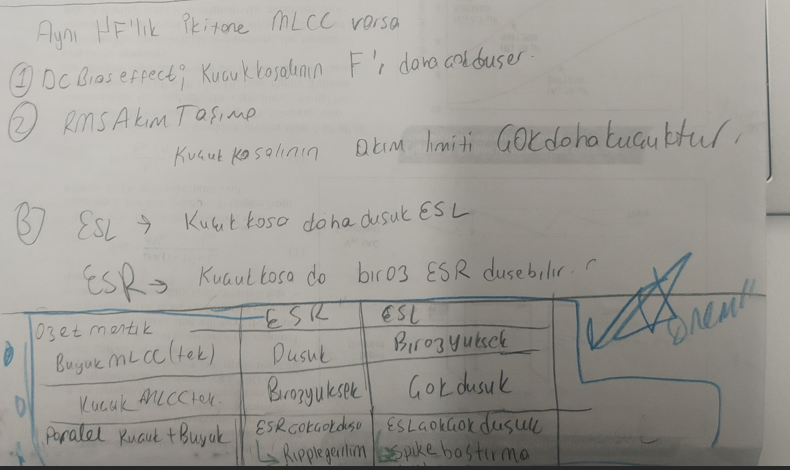

> genel ilke
> ESL ne kadar düşükse, yüksek frekanslı spike’lar o kadar iyi bastırılır


Ek not:

Bu parca, yuksek frekansta MLCC seciminde `ESL`'nin belirleyici oldugunu net sekilde vurguluyor. Burada korunacak ana fikirler sunlardir:

- dusuk `ESL`, yuksek frekansli spike ve ringing bastirma acisindan kritiktir
- birden fazla MLCC'yi paralel baglamak etkin `ESL`'yi dusurmeye yardim eder
- buyuk degerli ana MLCC'lere ek olarak daha kucuk kapasitansli, fiziksel olarak kucuk ve dusuk `ESL`'li yardimci kapasitörler de kullanilabilir

Buradan cikan pratik sonuc su: giris kapasitör agi tek tip ve tek degerli dusunulmemeli. Son karar, yerlesim, akim dongusu ve parasitiklerle birlikte verilmeli.

ODT'den aktarilan metin (`7.1.4.1 Çok Küçük Farad’lı, Küçük Boyutlu MLCC’ler eklemek`):

> Mosfetler çok hızlı açlıp kapandığında, giriş akımında ani sıçramalar oluşur. Giriş geriliminde ani kısa süreli dalgalanlanma Input spikes: Phase-node ringing:
> Ali Shirsavar’den de örnek ver.
> Küçük boyutlu (örneğin 0402, 0603) MLCC’ler genellikle daha düşük ESL değerine sahiptir.
> Bu nedenle, sisteme 1 µF, 0.1 µF gibi küçük seramik kondansatörler eklenerek, bu yüksek frekanslı istenmeyen etkiler azaltılabilir.

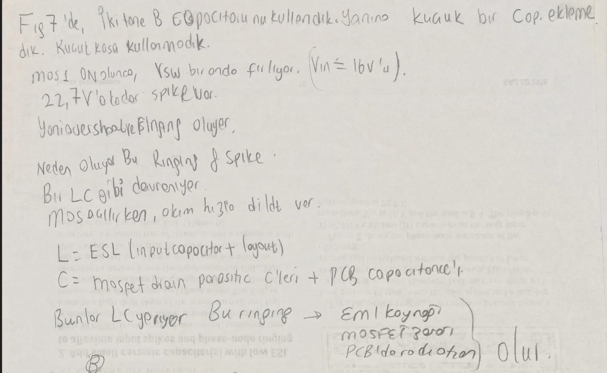

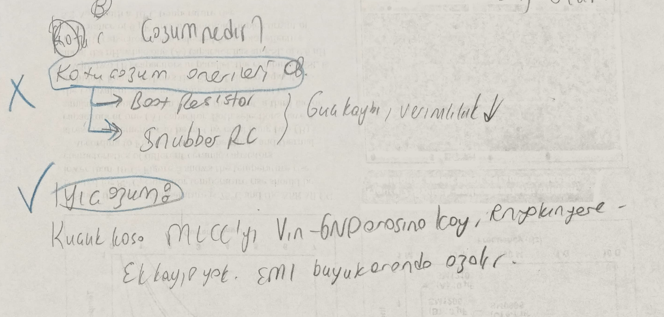


Ek not:

Bu parca, ana MLCC bankasina ek olarak cok kucuk degerli yardimci MLCC ekleme mantigini veriyor. Buradaki fikir, enerji depolamaktan cok, `input spikes` ve `phase-node ringing` gibi cok yuksek frekansli istenmeyen etkileri bastirmaktir.

Kucuk paketli `0402` veya `0603` MLCC'ler genellikle daha dusuk `ESL` sundugu icin, `1 µF` ve `0.1 µF` gibi degerler sicak akim dongusune yakin yerlestirilerek anahtarlama kenarlarindaki ani akim ihtiyacina daha hizli cevap verebilir.

Bu mantigi destekleyen somut bir yardimci MLCC ornegi olarak, `GCM188R72A103KA37` sinifinda `10 nF` civari kucuk bir seramik kapasitör icin su ekran goruntuleri korunabilir:


Bu grafikler birlikte su noktayi guclendiriyor:

- cok kucuk yardimci MLCC'nin enduktansi `1 MHz` mertebesinde `0.0008 \mu H` civarinda okunabiliyor
- sicaklik etkisi goreli olarak sinirli; `20^\circ C` civarinda kapasitans degisimi neredeyse yok
- `36 V` civarinda bile `10 nF` sinifindaki bu yardimci cap'te bias kaynakli azalma var ama buyuk `uF` sinifindaki MLCC'lere gore daha sinirli
- `40 kHz` civarinda direnç / `ESR` daha yuksekken, `0.3 MHz` civarinda `0.5 \Omega` mertebesine inmesi bu tip kucuk MLCC'lerin neden anahtarlama kenarlarina yakin, yuksek frekans bastirma gorevinde dusunuldugunu acikliyor

Yani bu yardimci kapasitörler ana enerji deposu degil. Ama dusuk `ESL` ve uygun yuksek frekans empedansi sayesinde, hot-loop etrafindaki ani akim ihtiyacina buyuk MLCC'lerden daha hizli cevap verebilen yararli destek elemanlari gibi dusunulmeli.

Buradaki `p71` ve `p74` ciftinin ayri degeri de su: kullanicinin yalnizca "kucuk cap eklemek iyi olur" gibi soyut bir not tutmadigi, gercekten daha kucuk paket / daha dusuk `ESL` sinifinda bir parcayi secmek icin datasheet arayuzu uzerinden bilincli arama yaptigi goruluyor.

Defterden aktarilan not (`W.86`):

Burada `ESR`, `ESL`, dielektrik tipi ve paket boyutu arasindaki pratik denge kendi defter dilinle ozetleniyor. Sayfanin ust kismina:


- `X7R`, `X5R`'ye gore sicakliga daha dayanikli

notu dusulmus. Bunun altinda da MLCC seciminde tek bir "en iyi" paket olmadigi, buyuk ve kucuk paketlerin farkli avantajlar tasidigi anlatiliyor.

Sayfadaki ana fikirler sunlar:

- buyuk MLCC'lerde `ESR` genellikle daha dusuktur
- kucuk paketli MLCC'lerde `ESL` genellikle daha dusuktur
- yuksek frekansta `ESL` baskin hale geldiginde, ripple / spike bastirma acisindan kucuk paketler daha etkili olabilir
- bu nedenle yuksek frekansli spike bastirma icin sadece buyuk paketli ana MLCC'lere guvenmek yeterli olmayabilir

Sayfada MLCC'leri paralel baglamanin etkisi de not edilmis:

```math
ESR_{\text{total}} \approx \frac{ESR}{n}
```

ve `ESL` icin de paralel baglamada esdegerin azaldigi, yani birden fazla kapasitörü paralellemenin yuksek frekans davranisini iyilestirdigi yazili.

Sayfanin altinda ise buyuk ve kucuk MLCC'lerin karsilastirildigi kisa bir tablo var. El yazisindaki mesaj net olarak su:

- buyuk MLCC:
  - `ESR` daha dusuk olabilir
  - ama `ESL` daha buyuk olabilir
- kucuk MLCC:
  - `ESL` daha dusuk olabilir
  - fakat `dc-bias` ve akim sinirlari daha zorlayici olabilir
- buyuk + kucuk MLCC'leri birlikte kullanmak:
  - `ESR` ve `ESL` acisindan dengeli bir cozum verebilir
  - yuksek frekansli spike bastirma iyilesebilir

`W.86`, `5.5.6` altindaki ODT notlarini senin defter sezginle iyi tamamliyor. Yeni bir nihai sayisal sonuc vermiyor; ama neden hem buyuk hem kucuk MLCC dusunuldugunu, neden `0402/0603` yardimci kapasitörlerin mantikli oldugunu ve neden paralel baglamanin yararli oldugunu acikca gosteriyor.

Defterden aktarilan not (`W.87`):

Burada `W.86`daki `ESR/ESL/kucuk-buyuk MLCC` dusuncesi daha pratik bir sorun uzerinden aciklaniyor: MOSFET acilip kapanirken gorulen yuksek frekansli `ringing` ve `spike` davranisi.

Sayfanin ust kismina, buyuk kapasitörlerin yanina kucuk bir kapasitör eklenmesi gerektigi not edilmis. Hemen altinda da gozlemsel bir problem tarifi var:

- MOSFET `ON/OFF` olurken
- `Vin = 36 V` civarinda
- yaklasik `22.7 V` seviyesine kadar inen bir spike / sapma goruluyor
- bunun uzerine `undershoot` veya `ringing` benzeri davranis olusuyor

Sayfada ardindan bunun nedeni sorgulaniyor ve asagidaki fiziksel model not ediliyor:

- bu durum `LC` gibi davranan bir parasitik agdan kaynaklanabilir
- `L` tarafi:
  - input capacitor `ESL`
  - yerlesim / layout enduktansi
- `C` tarafi:
  - MOSFET drain parasitik kapasiteleri
  - PCB / component kapasitanslari

Bu parasitik `L-C` aginin sonucunda:

- `ringing`
- `EMI`
- MOSFET ve PCB uzerinde istenmeyen stres

olusabilecegi yazilmis.

Sayfanin "cozum nedir?" kisminda iki tip cozum not edilmis:

- `boot resistor`
- `snubber RC`

ve altina da daha dogrudan, yerlesim-odakli bir cozum eklenmis:

- kucuk paketli MLCC'leri `VIN-GND` arasina, hot-loop'a yakin koy
- `ESL`'yi azalt
- boylece EMI ve buyuk orandaki spike davranisi azalabilir

`W.87`, `W.86`daki teorik `ESL dusuk olmali` notunu bu kez gozlenen problem ve cozum baglamina tasiyor. Yeni bir nihai sayisal sonuc vermiyor; ama neden `0.1 uF / 1 uF` gibi kucuk yardimci MLCC'lerin sadece "ekstra olsun" diye degil, gercek bir `ringing / spike / EMI` problemi yuzunden istendigini cok iyi anlatiyor.

Defterden aktarilan not (`W.95`):

Burada MLCC'nin frekansa bagli esdeger empedansi kendi cizimlerinle toparlaniyor. Sayfanin sol ustunde `G73 / Kemet` benzeri bir kaynak notu var ve `4.7 uF` ile `0.47 uF` kapasitörlerin empedans egimleri birlikte cizilmis.


Sayfada kapasitörun pratik modeli su sekilde yaziliyor:

```math
Z \approx Z_C \parallel Z_{Rleak} + Z_{ESL} + ESR
```

ve alttaki notta, `R_{leak}` degerinin genelde cok buyuk oldugu, bu nedenle ilk yaklasimda:

```math
Z \approx Z_C + Z_{ESL} + ESR
```

olarak dusunulebilecegi yazilmis.

Sayfanin orta kismina, empedansin karmasik bicimi de not edilmis:

```math
Z \approx R_{ESR} + j\omega L_{ESL} - j\frac{1}{\omega C}
```

ve buradan buyukluk icin:

```math
|Z|
=
\sqrt{R_{ESR}^{\,2} + (X_L + X_C)^2}
```

ifadesine geciliyor.

Buradaki en degerli sey, farkli kapasitans degerlerinin frekansa gore nasil davrandigini ayni cizimde gosteriyor olmasi:

- `4.7 uF` gibi daha buyuk bir kapasitör dusuk frekansta daha dusuk `|Z|` saglayabilir
- `0.47 uF` gibi daha kucuk bir kapasitör, farkli frekans bolgesinde avantajli olabilir
- `ESR` ve `ESL` eklenince, ideal `1/j\omega C` davranisi tek basina yeterli aciklama olmaz

Sayfadaki yan notlardan, bu sonuca ulasilmis:

- frekans degistiginde kapasitörun bileske empedansi da degisir
- bunu belirleyen yalnizca `C` degil; `ESL` ve `ESR` de frekansa bagli olarak etkili hale gelir

`W.95`, `W.72`deki esdeger devre modelini bu kez daha analitik bir `Z = R + jX` diliyle tekrar kuruyor. `W.86-W.87`deki "buyuk ve kucuk MLCC'ler farkli frekanslarda farkli avantajlar saglar" sezgisini de matematiksel olarak destekliyor. Yeni bir nihai komponent secimi vermiyor; ama neden tek tip kapasitör yerine farkli degerlerin ve dusuk `ESL/ESR` ozelliklerinin birlikte dusunuldugunu gostermesi acisindan cok degerli.

Defterden aktarilan not (`W.96`):

Burada `W.95`teki kapasitör empedansi dusuncesi bir adim daha ileri gidip farkli kapasitör tiplerini `Q`, `f_0` ve damping acisindan karsilastiriyor. Ust kisimdaki not, bunun bir ders/video veya kaynak anlatimindan alinmis bir "EMI suppression filters" karsilastirmasi oldugunu gosteriyor.


Sayfada iki farkli aday yan yana dusunulmus:

- `MLCC`
  - `C \approx 1.4 uF`
  - `ESR \approx 1.3 mΩ`
  - `ESL \approx 1.6 nH`
- `Polymer`
  - `C \approx 100 uF`
  - `R_{ESR} \approx 0.36 Ω`
  - `ESL \approx 20 nH` gibi okunan bir not

Sayfada bunlar icin klasik ikinci dereceden esitger buyuklukler hesaplanmis:

```math
f_0 = \frac{1}{2\pi\sqrt{LC}}
\qquad
R_0 = \sqrt{\frac{L}{C}}
```

MLCC tarafi icin defterde yaklasik su sonuc yazilmis:

```math
f_0 \approx 3362\,kHz
```

```math
R_0 \approx 33.8\,m\Omega
```

ve buna bagli kalite faktorunun:

```math
Q \approx \frac{R_0}{R_{ESR}} \approx 26 \gg 1
```

oldugu, yani `underdamped` davransa bile derin bir empedans "dip"i olusturabilecegi not edilmis.

Polymer tarafi icin ise sayfada:

```math
f_0 \approx 112.5\,kHz
```

ve

```math
Q \approx 0.04 \ll 1
```

gibi bir sonuc goruluyor; bu da daha `overdamped` bir davranisa isaret ediyor.

Sayfanin sagindaki renkli eskizlerde ana mesaj su:

- MLCC, dusuk `ESR` ve dusuk `ESL` ile belli bir frekans bolgesinde cok derin bir empedans minimumu yaratabilir
- polymer ise genelde daha yumusak / daha sönümlü bir davranis verir
- bu nedenle ayni ag icinde farkli kapasitör tiplerini birlikte kullanmak, hem dusuk empedans hem de makul damping elde etmek icin yararli olabilir

`W.96`, `W.95`teki frekansa bagli `Z` dusuncesini bu kez `MLCC` ve `polymer` karsilastirmasina tasiyor. Proje-ozel nihai sayisal secim vermiyor; ama "hangi tip kapasitör nasil bir empedans profili olusturur?" sorusuna cevap veriyor. `Q > 1` / `Q << 1` ayrimi da neden bazen yalnizca dusuk `ESR` istemenin yetmedigini, damping'in de onemli oldugunu guzel gosteriyor.

Defterden aktarilan not (`W.99`):

Burada ayni `C` ve `ESL` degerleri icin farkli `ESR` secildiginde empedans egrisinin ve `Q` davranisinin nasil degistigi cok sade bir ornekle anlatiliyor.


Sayfanin ustunde yazilan ornek:

- `C = 4 uF`
- `ESL = 2.5 nH`
- iki farkli `ESR` denemesi:
  - `ESR_1 = 0.25 ohm = 250 mΩ`
  - `ESR_2 = 0.001 ohm = 1 mΩ`

Sayfada karakteristik empedans benzeri buyukluk su sekilde yazilmis:

```math
R_0
=
\sqrt{\frac{L_{ESL}}{C}}
\approx
\sqrt{\frac{2.5\,nH}{4\,uF}}
\approx
7.29\,m\Omega
```

Ardindan iki farkli durum icin `Q` benzeri oran hesaplanmis:

```math
Q_1
=
\frac{R_0}{ESR_1}
\approx
\frac{7.29\,m\Omega}{250\,m\Omega}
\approx
0.029
```

```math
Q_2
=
\frac{R_0}{ESR_2}
\approx
\frac{7.29\,m\Omega}{1\,m\Omega}
\approx
7.29
```

Sayfadaki el cizimi de bu ayrimi gorsellestiriyor:

- `Q_1 < 1` iken daha fazla sönümlü, daha yumusak bir empedans davranisi
- `Q_2 > 1` iken daha keskin, daha belirgin rezonansli bir davranis

Bu not ikinci projenin kendi nihai parca degerleriyle yazilmis bir secim sayfasi degil; daha cok `ESR` ile `Q` iliskisini sezgisel olarak anlatan egitsel bir kontrol sayfasi. Buna ragmen teknik fikir cok degerli: ayni `C` ve `ESL` icin yalnizca `ESR` degisimi bile empedans egrisinin sekli ve rezonans keskinligi uzerinde buyuk etki yaratabiliyor. Bu da `W.95-W.96`daki "yalnizca dusuk ESR yetmez; damping de onemli" fikrini daha sade destekliyor.

Defterden aktarilan not (`W.88`):

Burada dogrudan bir kaynak makale sayfasinin uzerine alinmis not var ve `5.5.6` ile `5.5.7` arasinda cok guclu bir kopru kuruyor.


Sayfanin ust kismindaki `Figure 8`, girise eklenen kucuk bir seramik kapasitörun `switch-node` dalga seklini nasil iyilestirebildigini gosteriyor. Bu, `W.87`deki su dusunceyle dogrudan uyumludur:

- kucuk yardimci MLCC eklemek
- hot-loop'u kisaltmak
- yuksek frekansli `ringing / spike` davranisini azaltmak

Yani bu sayfa, kucuk yardimci MLCC fikrinin yalnizca sezgisel degil, kaynak figuru ile de desteklendigini gosteriyor.

Sayfanin alt kismindaki `Figure 9a` ise bulk kapasitör secimi tarafi icin cok degerli. Bu sekilde:

- yuk degisimi sirasinda cikis akimi
- giris akimi
- input transient sirasinda olusan `V_{in}` dususu

ayri ayri cizilmis.

Senin sayfa uzerine aldigin notlardan, su ana fikirler one cikiyor:

- ilk `\Delta V_{in}` dususu daha cok MLCC / `ESR` etkisiyle iliskili
- daha sonra gelen daha yavas dusus ise bulk kapasitörun enerji tamponu roluyle iliskili
- `T_{rip}` ya da benzeri bir gecis suresi, bulk `C_B` hesabinda kullaniliyor

Sayfanin altina dusulen kisa notlar da bunu destekliyor:

- `\Delta V_{in,MLCC}` benzeri ilk dusus
- `Bulk` ile ilgili ikinci daha yavas davranis

`W.88`, `W.87`deki "kucuk seramik spike bastirir" fikrini kaynak figuruyle destekliyor. Ayni anda `W.83`teki bulk transient hesabinin fiziksel arka planini da acikliyor. Belgede en dogru okuma su: ustteki figür kucuk yardimci MLCC ve ring/spike bastirma tarafini, alttaki figür ise bulk kapasitörun transient enerji tamponu rolunu gosteriyor. Bu yuzden iki konu arasinda iyi bir kopru sayfasi.

Defterden aktarilan not (`W.89`):

Burada `W.88`deki kaynak figurlere bakilarak alinmis kisa bir ozet not var. Ust kisimda `Figure 8`e referansla, kucuk ek bir kapasitör eklendiginde spike buyuklugunun azaldigi not edilmis:


- kucuk ek `D` capacitoru eklendiginde
- spike seviyesi yaklasik `22.9 V`'tan `20.5 V` civarina dusuyor

Sayfadaki yorum, bunun nedenini de yine `ESL` uzerinden bagliyor:

- kucuk paket
- dusuk `ESL`
- bu nedenle yuksek frekansli spike bastirmada daha etkili

Sayfanin orta kismina dogru, bulk kapasitörun ne ise yaradigi kisa maddeler halinde toparlanmis:

1. `transient response`
2. `ripple current tasima`, yani MLCC'ye destek olma

Ardindan bulk seciminde iki kritik parametre tekrar yaziliyor:

1. `capacitance`
   - yuk degisimi sirasinda gerekli enerjiyi saglayabilecek kadar buyuk olmali
2. `ESR_B`
   - ripple current tasirken cok yuksek olmamali
   - ama sifira cok yaklasan kadar da dusuk olmasi her zaman en iyi sonuc olmayabilir

Sayfanin alt notunda cok degerli bir muhendislik sezgisi daha var:

- buyuk `ESR` -> ripple gerilimi artar
- ama bir miktar `ESR` varligi, `LC` rezonansini bastirmaya ve damping saglamaya yardim edebilir

`W.89`, `W.88`deki iki ana temayi kisa ama net bicimde birlestiriyor: kucuk yardimci kapasitör -> spike bastirma, bulk kapasitör -> transient enerji tamponu + ripple akimi destegi. Yeni ayrintili sayisal sonuc vermiyor; ama bulk seciminde "kapasitans buyuk olsun, ESR da makul bir aralikta olsun" dusuncesini senin not dilinle iyi ozetliyor. Ozellikle "ESR sifir olsun" yerine "fazla buyuk olmasin ama damping de dusunulsun" sezgisi burada degerli.


#### 5.5.7 Bulk kapasitör secimi mantigi


ODT'den aktarilan metin (`7.2. Giriş Bulk Capacitor Seçimi`):

> MLCC’ler düşük esr’leri sayesinde çok iyi ripple akımı yaşıyabilir. Ancak Mlcclerin etkin capacitance’sı Dc Bias ve sıcaklık altında önemli ölçüde azalır.
> Bu da transient’lerde yeterli enerji depolayamamasına neden olur. Bu neden Bulk capacitorlerde kullanılır.

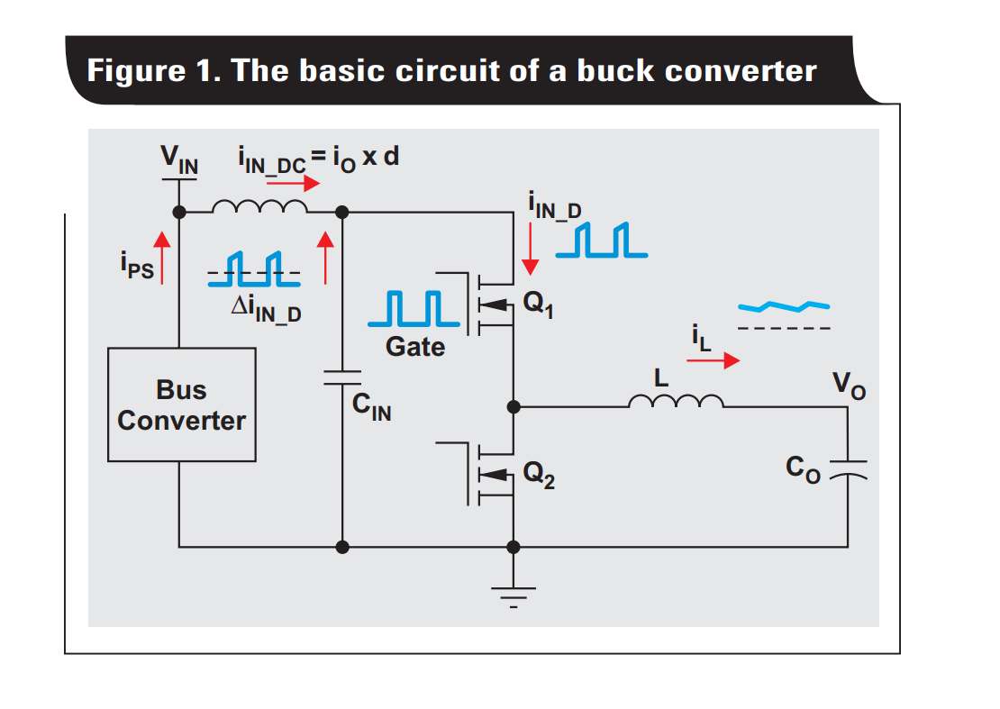

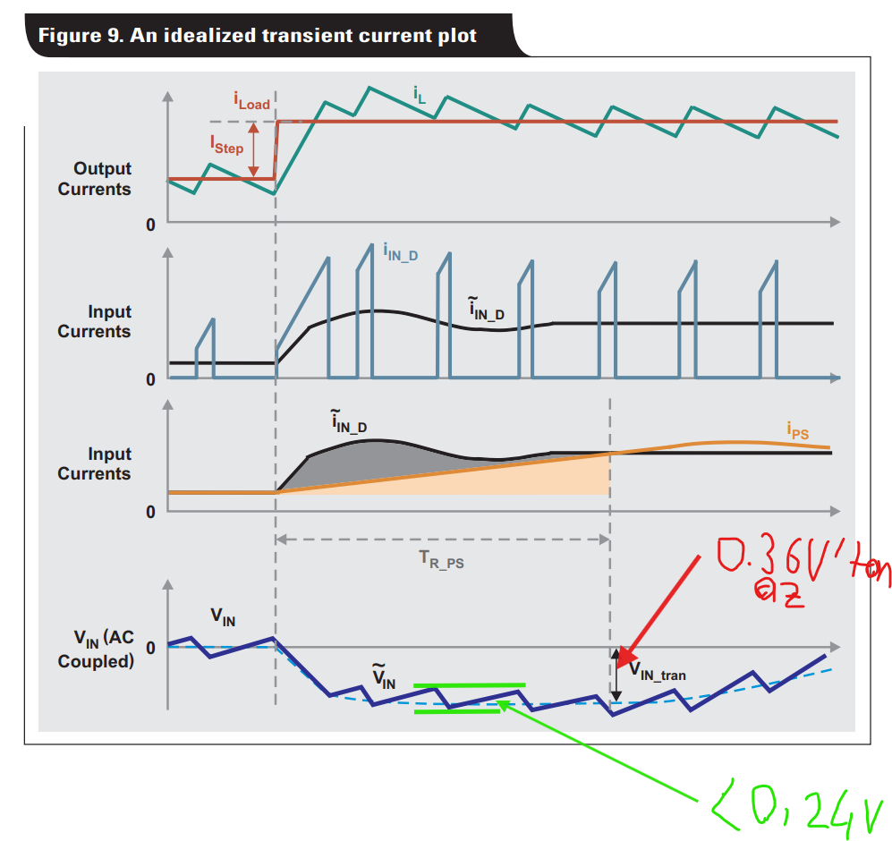

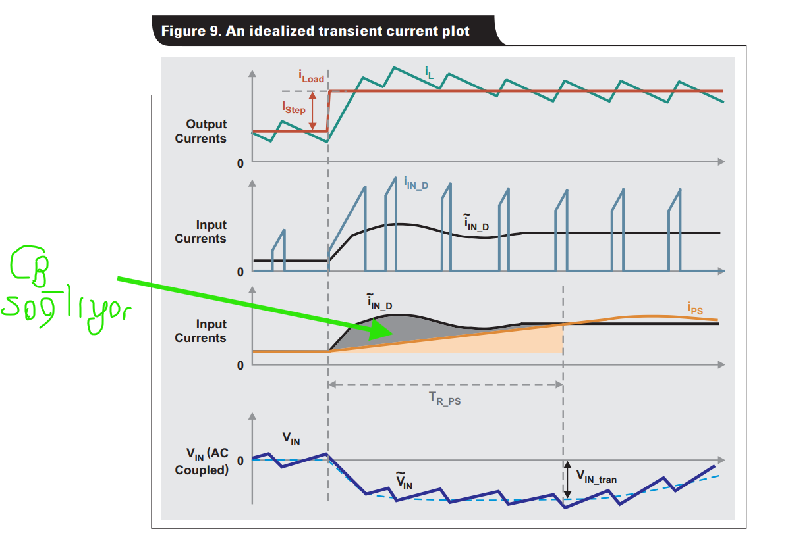

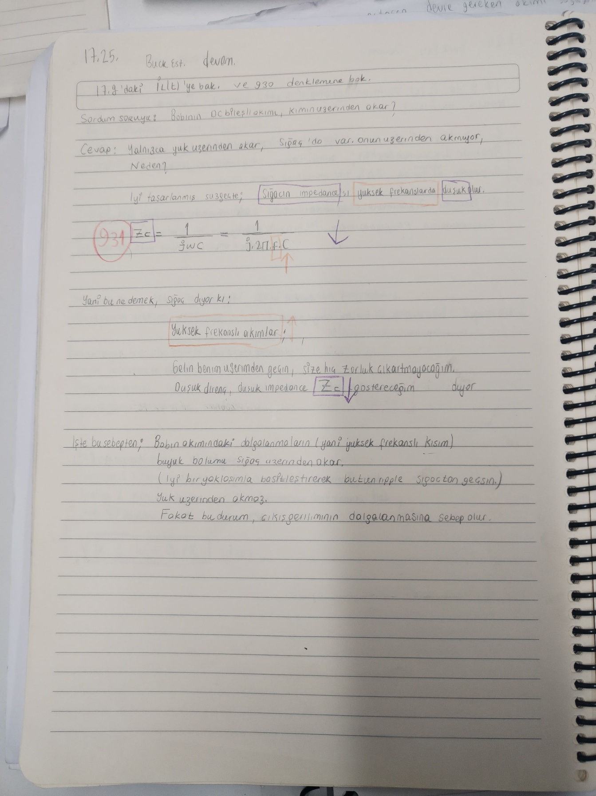


Ek not:

Bu parca, bulk kapasitörlerin neden hala gerekli olabildigini netlestiriyor. MLCC'ler yuksek frekans ripple bastirmada cok guclu olsalar da, `dc-bias` ve sicaklik altinda etkin kapasitans kaybi yasadiklari icin daha yavas transient enerji ihtiyacinda tek baslarina yetersiz kalabilirler.

Bu nedenle bulk kapasitörler burada yuksek frekansli sicak akim dongusunun ana parcasi gibi degil, enerji tamponu ve daha yavas dinamiklerin destekleyicisi olarak dusunulmelidir.


Defterden aktarilan not (`W.29`):

Bu sayfada bir ara aday olarak su giris bulk kapasitörü notu da goruluyor:

- `68 uF`
- `50 V`
- `ESR ~ 20 mOhm`

Bu deger, dogrudan nihai secim ilan edilmis gibi gorunmuyor; ancak MLCC bankasina paralel bulk enerji tamponu dusuncesinin defterde acikca denendigini gosteriyor.

Bu not, mevcut `MLCC + bulk` stratejisiyle uyumlu. Ama bu asamada kesin nihai bulk parca gibi yazilmamali; BOM ve sonraki sayfalarla eslestiginde "nihai secilen bulk capacitor" ayri netlesecek.


Defterden aktarilan not (`W.38`):

Burada bulk giris kapasitörü seciminde ikinci bir kriter vurgulaniyor: secilen bulk kapasitör yalnizca yeterli `uF` saglamamali, ayni zamanda uzerinden gececek ripple akimini ve buna bagli isinmayi da tasiyabilmelidir.


Sayfadaki ana fikirler sunlardir:

- bulk kapasitör seciminde bir kosul, `I_{CB,RMS,\text{allowed}} > I_{CB,RMS}` olmali
- MLCC bankasi yuksek frekansli ripple'in buyuk bolumunu tasirken, bulk kapasitör kalan ripple akimi ve enerji tamponu tarafinda rol alir
- bulk kapasitör `ESR`'i buyudukce, ayni ripple kosulunda kayip ve isinma artar

Defterde, bulk kapasitör uzerindeki ripple akimi icin yaklasik olarak su tip bir iliski yazilmaya calisiliyor:

```math
I_{CB,RMS}
\approx
\frac{\Delta V_{IN,PP}}{2\sqrt{3}\,ESR_B}
```


ve buna bagli olarak, izin verilen ripple gerilimi, bulk kapasitör `ESR`'i ve datasheet'teki izin verilen ripple akimi arasinda ikinci bir secim kosulu kuruluyor.

Burada bulk capacitor secim mantigi "kapasitans yeterli mi?" sorusundan "eleman ripple akimini ve kaybini tasiyabilir mi?" sorusuna tasiniyor. Bu dogru muhendislik bakisi. Son cebir ve son sayisal yerlestirme tam net degil; o yuzden asil korunacak sey kesin son formulden cok secim mantiginin kendisi.

Defterden aktarilan not (`W.39`):

Burada bulk giris kapasitörü icin bu kez minimum kapasite tarafindan bir alt sinir hesaplanmaya calisiliyor. Yazimdan goruldugu kadariyla bir `T_{rip}` veya benzeri rezerv / gecis suresi tanimlanip, load-step veya giris tarafindaki gecici durum boyunca bulk kapasitörun ne kadar enerji tamponu saglamasi gerektigi sorgulaniyor.


Sayfada okunan ana izler sunlar:

- `f_c` ile iliskili bir zaman olcegi kullaniliyor
- `I_{step}` ve `D_{max}` benzeri buyuklukler denkleme giriyor
- mevcut `C_E,total` benzeri MLCC katkisi denklemden dusulmeye calisiliyor
- ilk ara sonuc olarak yaklasik `C_B \gtrsim 5.27 uF`
- daha sonra marj eklenerek `C_{bulk} \gtrsim 18.32 uF` gibi daha buyuk bir hedef yaziliyor

Burada bulk kapasitörun sadece ripple akimi tasima degil, gecici durumda enerji rezervi saglama rolunun de dikkate alindigi goruluyor. `W.38` ile birlikte okununca bulk seciminde iki farkli kriterin ayni anda dusunuldugu anlasiliyor: ripple akimi / ESR / isinma ve minimum enerji tamponu / kapasite. Son cebirin bir kismi silik; o yuzden asil korunacak sey "bulk capacitor secimi tek boyutlu degil" fikri ve gorulen ara sonuc araligi.

Defterden aktarilan not (`W.40`):

Burada bulk kapasitör secimine bir ucuncu kosul daha ekleniyor: bulk kapasitörun `ESR_B` degeri de belirli bir ust sinirin altinda olmali. Sayfadaki yazima gore, giris tarafindaki transient limiti ile bulk kapasitör `ESR`'i arasinda dogrudan bir iliski kuruluyor.


Defterde okunan iliski su sekilde:

```math
ESR_B
\lesssim
\frac{\Delta V_{IN,tran}}{I_{step}\,D_{\max}}
```

Sayfadaki yerlestirmede:

- $\Delta V_{IN,tran} = 0.36\,\text{V}$
- $I_{step} \approx 3\,\text{A}$
- $D_{\max} \approx 0.121$

kullanilarak yaklasik:

```math
ESR_B \lesssim 0.991\,\Omega
```

gibi bir ust sinir yaziliyor.

Burada bulk secim mantigi bir adim daha genisliyor: minimum kapasite yeterli mi, ripple akimi ve isinma kabul edilebilir mi, `ESR_B` transient limiti bozmayacak kadar dusuk mu? Buradaki son sayisal sonuc cok siki bir sinir gibi degil; daha cok "asiri buyuk ESR kullanma" turu bir ust sinir kontrolu. `Istep` ve `Dmax` degerleri onceki sayfalara bagli oldugu icin iliski final kabul edilmeden once tekrar eslestirilmeli; ama bulk seciminin tek parametreyle degil kapasite + ESR + ripple dayanimi ile birlikte dusunuldugu gayet net.

Defterden aktarilan not (`W.44`):

Burada `W.40` tarafindaki `ESR_B` notu daha kisa bir bicimde tekrar ediliyor. Sayfada yazilan iliski su sekilde okunuyor:


```math
ESR_B < \frac{\Delta V_{IN,tran}}{I_{step}\,D_{\max}}
```

Sayfanin alt notunda, bu iliskide ozellikle `D_{\max}` degerinin onemli oldugu ayrica vurgulaniyor.

`W.44`, `W.40` ile ayni bulk-ESR dusunce hattina ait. Yeni bir sayisal sonuc vermiyor; daha cok mevcut iliskiyi kisa bir tekrar ve vurgu notu halinde destekliyor. `D_{\max}` parametresinin onemini vurgulayan kisa bir iz.

Defterden aktarilan not (`W.41`):

Burada bulk kapasitör seciminin gerekcesi daha kavramsal bir dille toparlaniyor. Yazilan notlara gore, ani yuk degisimlerinde `Vin` uzerinde iki ayri spike / dusus mekanizmasi dusunuluyor:


1. `ESR_B` kaynakli ani dusus
2. bulk kapasitörun enerji tamponu olarak bosalmasindan gelen daha yavas gerilim dususu

Sayfada ilk mekanizma icin su iliski tekrar yaziliyor:

```math
V_{\text{spike}} \approx I_{step}\,ESR_B
```

ve bunun `W.40` tarafindaki transient limiti ile baglantili oldugu not ediliyor.

Ikinci mekanizma icin ise, ani yuk degisiminde buck katinin giristen cekmesi gereken ek enerjiyi ilk anda tam saglayamadigi; bu acigi bulk kapasitörun kapattigi vurgulaniyor. Sayfadaki ana fikir su:

- bulk kapasitör `ESR`'i yuksekse ani gerilim dususu buyur
- bulk kapasitörü kucukse veya enerji rezervi azsa daha yavas ama daha buyuk bir `Vin` dususu olusabilir

Burada yeni bir sayisal sonuc yok; asil is `W.38-W.40` arasindaki bulk secim mantigini sozlu olarak baglamak. Belge acisindan degerli; cunku salt formul degil, tasarim dusunce akisini da gosteriyor. "Neden bulk gerekli?" sorusuna defter dilinle verilen en acik cevaplardan biri burada.

Defterden aktarilan not (`W.43`):

Burada bulk kapasitör secimi bir adim daha toparlaniyor ve MLCC ile bulk arasindaki gorev ayrimi sozlu olarak kuruluyor:


- MLCC'ler yuksek frekansli ripple akimini cok iyi filtreleyebilir
- ancak ani yuk degisimlerinde gereken enerji rezervini tek baslarina her zaman saglayamayabilir
- bu nedenle bulk kapasitör, özellikle transient response icin ek enerji rezervi saglayan eleman olarak dusunuluyor

Sayfadaki ana fikirler sunlar:

- bulk seciminde dusunulen iki temel ozellik:
  - `ESR`'in dusuk olmasi
  - kapasitenin / enerji rezervinin yeterli olmasi
- ani yuk degisiminde ilk anda gerekli akimin bir kismini bulk kapasitör saglar
- bu sirada MLCC ve bulk farkli zaman olceklerinde gorev paylasir

Burada yeni ve temiz bir son formul yok; ama `W.41` ile birlikte okundugunda "MLCC ripple icin, bulk transient enerji rezervi icin" ayrimi senin defter dilinle acikca kuruluyor. Bu yuzden teknik icerikten cok tasarim dusunce izi acisindan degerli.

Defterden aktarilan not (`W.45`):

Burada buck yapisinin giris tarafi basit bir sema ve dalga bicimleriyle cizilerek bulk / giris kapasitör seciminin neden gerekli oldugu tekrar anlatiliyor.


Sayfada gorulen ana fikirler:

- giriste kaynak ile buck kati arasinda `Cin` / bulk kapasitör bulunur
- buck anahtari akimi darbeli ceker; bu nedenle kaynak akimi ile donusturucunun anlik akim ihtiyaci ayni degildir
- bobin akimi hemen degisemez
- ani yuk degisiminde veya anahtarlama anlarinda gerekli ekstra akimin bir kismi ilk anda giris kapasitörlerinden saglanir

Sayfanin altindaki notlarda, ozellikle su dusunce izi goruluyor:

- `Iload` bir anda degisebilir
- buck katinin giristen cektigi akim ise ayni anda ve ayni sekilde degismeyebilir
- bu farkin ilk anda bulk kapasitör tarafindan karsilanmasi gerekir

`W.45`, `W.41` ve `W.43` ile ayni kavramsal hatta duruyor. Yeni bir son denklem vermiyor; ama neden bulk / giris kapasitörunun gerekli oldugunu cizim ve kisa notlarla temellendiriyor. Bu yuzden tasarim dusunce akisini gosteren iyi bir ara sayfa.

Defterden aktarilan not (`W.67`):

Burada ani yuk degisiminde giris tarafinda gorulebilecek iki farkli gerilim spike mekanizmasi daha acik bir dille ayriliyor.


Sayfada acikca su ayrim yapilmis:

1. `ESR_B` ile iliskili spike
2. `I_{IN-D}` ile `I_{PS}` arasindaki farktan kaynaklanan spike

Ilk spike icin sayfadaki ana fikir su:

- bulk kapasitörun `ESR`'i varsa
- yuk aniden akim cektiginde bu akim cap'in `ESR`'inden gecerken anlik bir gerilim dususu olusur
- bu ilk ve cok hizli olan spike'tir

Bu, onceki sayfalardaki su iliskiyle uyumludur:

```math
V_{\text{spike,1}} \approx I_{step}\,ESR_B
```

Ikinci spike icin ise sayfada su dusunce izi var:

- `I_{IN-D}` ile `I_{PS}` arasinda bir fark olusabilir
- bu fark, high-side MOSFET'in drain ucuna gelen akim olarak dusunulmustur
- buck icin anlik olarak
  ```math
  I_{IN-D} \approx I_{PS} + I_{Cin,bulk}
  ```
  gibi bir akim bolusumu not edilmistir
- `I_{PS}` akimi daha yavas yukselebilir; bu nedenle ani durumda ikinci bir gerilim sapmasi olusabilir

`W.67`, `W.41`te sozlu olarak anlatilan "iki farkli spike mekanizmasi" fikrini daha net bir dille tekrar ediyor. Ilk spike acikca `ESR_B` kaynakli ani dusus, ikinci spike ise kaynak akimi ile donusturucunun anlik talebi arasindaki fark uzerinden aciklaniyor. Bu acidan bulk secimi ve input transient davranisi arasindaki fiziksel ayrimi guclendiriyor.

Defterden aktarilan not (`W.74`):

Burada bulk giris kapasitörü icin iki farkli kontrol ayni yerde toplaniyor:


1. bulk kapasitör uzerinden gececek `RMS` akim icin kaba bir worst-case kontrol
2. toplam etkili giris kapasitansi ile `\Delta V_{IN,PP}` hedefinin tekrar kontrolu

Sayfanin ust kisminda, bulk kapasitörun ideal bir bypass elemani olmadigi; ancak dusuk frekansli ripple ve transient sirasinda aktif rol oynadigi not edilmis. Hemen altinda da su worst-case dusunce izi kuruluyor:

- eger tum pulsating akim yalnizca bulk kapasitörden gecseydi
- bulk kapasitör uzerindeki `RMS` akim yaklasik olarak `ESR_B` ve izin verilen `\Delta V_{IN,PP}` ile sinirlanirdi

Sayfada yazilan yaklasik iliski su sekilde okunuyor:

```math
I_{CB,RMS}
\approx
\frac{1}{2\sqrt{3}}
\cdot
\frac{\Delta V_{IN,PP}}{ESR_B}
```

ve sayfadaki yerlestirmede:

```math
I_{CB,RMS}
\approx
\frac{1}{2\sqrt{3}}
\cdot
\frac{0.24\,\text{V}}{0.103\,\Omega}
\approx
0.677\,\text{A}_{RMS}
```

Sayfanin alt kisminda ise `\Delta V_{IN,PP}` hedefi bu kez toplam etkili giris kapasitansi uzerinden tekrar kontrol edilmeye calisiliyor. Buradaki ana dusunce su:

- sadece seramik ya da sadece elektrolitik degil
- toplam etkili `C_{CE,total}` dusunulmeli
- bu toplam degerde derating, tolerans ve gercek etkin kapasitans dikkate alinmali
- hesaplanan `\Delta V_{IN,PP}` degeri `0.24 V` hedefiyle karsilastirilmali

Sayfadaki alt notta da, bu hesabin sonunda hedef karsilanmiyorsa toplam etkili giris kapasitansinin arttirilmasi gerekecegi yazili.

`W.74`, `W.38` tarafindaki bulk-uzerinden-RMS akim dusuncesini bu kez daha okunur bir formulle tekrar ediyor. Ayni sayfada `\Delta V_{IN,PP}` hedefini toplam etkili giris kapasitansi ile yeniden kontrol etmen de yalnizca tek bir capacitor degerine degil, toplam etkin ag davranisina baktigini gosteriyor. Yeni nihai parca secimini tek basina vermiyor; ama bulk secimi ile toplam `Cin` yeterliligi arasindaki bag net kuruluyor.

Defterden aktarilan not (`W.75`):

Burada `W.74`teki bulk-uzerinden `RMS` akim dusuncesi tekrar ediliyor; fakat bu kez asil vurgu, bulk kapasitör ile MLCC'nin frekansa gore farkli roller ustlenmesi uzerine kurulmus.


Sayfanin ust kismina yine su yaklasik iliski yazilmis:

```math
I_{CB,RMS}
\approx
\frac{1}{2\sqrt{3}}
\cdot
\frac{\Delta V_{IN,PP}}{ESR_B}
```

Ancak sayfanin ana fikri sayisal sonuc vermekten cok su ayrimi kuruyor:

- bulk kapasitörun AC'ye karsi gosterdigi empedans, seramik kapasitörlere gore daha yuksektir
- ozellikle yuksek frekansli ripple akimini bypass etmek icin kullanilan eleman MLCC'dir
- bulk kapasitör ise daha dusuk frekansli / daha yavas degisen enerji ihtiyacinda daha anlamlidir

Sayfada bu mantik, `Z_C = 1/(j\omega C)` iliskisi ve kabaca bir empedans-frekans eskizi ile desteklenmis. Cizimde:

- frekans arttikca MLCC'nin daha dusuk empedansla yuksek frekansli akimi daha iyi karsiladigi
- bulk kapasitörun ise yuksek frekansta tek basina yeterli bir bypass elemani gibi davranmadigi

anlatiliyor.

Alt notta da su yorum one cikiyor:

- bulk kapasitör, yuksek frekansli ripple akimini tek basina etkin bastiramaz
- bu yuzden bulk tek basina dusunulmemeli
- MLCC ile birlikte kullanildiginda anlamli bir katkida bulunur

`W.75`, `W.74`teki bulk `RMS` akim fikrini kavramsal bir frekans-sezgisi ile tamamliyor. Yeni bir nihai hesap sonucu yok; ama "neden bulk + MLCC birlikte dusunuluyor?" sorusuna cok net bir defter cevabi veriyor. Giris kapasitörü bankasinin gorev paylasimi burada gayet temiz gorunuyor.

Defterden aktarilan not (`W.76`):

Burada artik kavramsal aciklamadan bir adim daha ileri gidilip gercek giris kapasitörü adaylari not edilmeye baslaniyor. Ust kisimda yazimdan gorulebildigi kadariyla:


- `C29` icin kucuk degerli bir yuksek frekans seramik kapasitör adayi not edilmis
- `C10, C11, C12, C13, C14` gibi bir grup icin de `4.7 uF` sinifinda MLCC adaylari dusunulmus


El yazisi tam net olmasa da, sayfanin ana fikri su:

- kucuk degerli bir kapasitör, daha yuksek frekansli spike / ringing bastirma tarafinda kullanilabilir
- birden fazla `4.7 uF` MLCC paralel baglanarak hem etkin kapasitans artirilir hem de esit dagilim varsayimiyla etkin `ESR` dusurulur

Sayfanin orta ve alt kisimlarinda, paralel MLCC grubu icin kaba bir `ESR` kontrolu yapildigi goruluyor. Defterde iki frekans bolgesi ayrilmis:

- `f_c = 35 kHz` civari
- `f_sw = 332 kHz`

ve tek bir kapasitör icin dusunulen `ESR` degerinin, `4 adet` paralel kullanildiginda yaklasik dorde bolunecegi yazilmis. Sayfadaki okunan ara notlar su sekilde:

```math
ESR_{\text{eq}}
\approx
\frac{2.1\,\Omega}{4}
\approx
0.525\,\Omega
```

ve daha yuksek frekansli kisim icin:

```math
ESR_{\text{eq}}
\approx
\frac{0.5\,\Omega}{4}
\approx
0.125\,\Omega
```

`W.76`, `W.75`te kurulan "MLCC yuksek frekansta daha etkilidir" fikrini bu kez gercek aday komponentlere indiriyor. Buradaki `ESR` sayilari buyuk ihtimalle datasheet/grafik ustunden okunmus kaba ara degerler; o yuzden tek basina nihai sonuc gibi alinmamali. Buna ragmen paralel MLCC ile etkin `ESR`'i dusurme mantigi dogru kurulmus ve `C10-C14` ile `C29` tarafina giden dusunce izi degerli.

`p79` burada ozellikle degerli; cunku bu dusunceyi soyut bir BOM listesi gibi degil, gercek EVM semasinda `C29 = 0.01 uF` yardimci cap ile `C10-C14 = 4.7 uF` ana MLCC grubunun fiziksel dagilimi olarak gosteriyor.

Defterden aktarilan not (`W.77`):

Burada `W.76`da not edilen giris MLCC adaylari bu kez `dc-bias` ve `RMS` akim dagilimi tarafindan kontrol edilmeye baslaniyor. Sayfanin ust notunda:


- `0.1 uF` sinifinda kucuk bir seramik
- `4.7 uF x 5` gibi gorunen bir MLCC grubu

birlikte dusunulmus.

Sayfada okunan ana dusunce izleri sunlar:

- toplam `I_{RMS}` akimi birden fazla MLCC arasinda bolunmeye calisiliyor
- `4 adet` / `5 adet` gibi paralel kullanim senaryolari not edilmis
- buna bagli olarak "tek capacitor basina dusen RMS akim" kontrol edilmeye calisiliyor

Sayfada ayrica cok onemli bir nihai parca-secim mantigi daha var:

- `36 V` altinda degil
- `36 V` civarinda ve sicaklikta (`+41 C` gibi not edilmis) `dc-bias` etkisiyle kapasite dusuyor
- bu nedenle katalog degerine degil, bias altindaki etkin kapasitansa bakmak gerekiyor

Alt kisimda, birkac adet MLCC'nin bias altindaki etkin kapasitansinin toplami icin su tip ara notlar var:

- `kapasitans 8332 pF`
- `4 adet icin kapasitans = 33,568 nF`

Bu sayilar tam olarak hangi kucuk kapasitör ailesine ait oldugu acik degil; fakat ana mesaj net:

- yuksek gerilim altinda kucuk / orta degerli MLCC'ler ciddi kapasite kaybi yasayabilir
- bu nedenle "alinan sebep katalogdaki `uF`" degil, gercek calisma kosulundaki etkin degerdir

`W.77`, bu adaylari `dc-bias + RMS dagilimi` tarafina tasiyor. Tek bir nihai sonuc vermiyor; daha cok parca secerken nelere bakildigini gosteriyor. Bazi ara degerlerin tam olarak hangi datasheet egrisinden okundugu net olmasa da ana mesaj acik: katalogdaki `uF` degeriyle yetinme, bias altindaki etkin kapasiteye bak. Bu da `W.51`deki mantikla uyusuyor; gercek capacitor seciminde `current rating`, `voltage rating` ve `dc-bias` birlikte dusunulmeli.

Defterden aktarilan not (`W.78`):

Burada `4.7 uF` sinifindaki giris MLCC grubu daha somut bir secim kontrolune tasiniyor. Sayfada `5 adet` paralel `4.7 uF` MLCC dusunuluyor ve hem `RMS` akim dagilimi hem de bias altindaki etkin toplam kapasitans hesaplanmaya calisiliyor.


Sayfadaki okunan ana notlar sunlar:

- toplam giris `RMS` akimi:
  ```math
  I_{RMS} \approx 4.54\,A_{RMS}
  ```
- `5 adet` kapasitör arasinda esit dagilim varsayimiyla:
  ```math
  I_{RMS,\text{cap}}
  \approx
  \frac{4.54}{5}
  \approx
  0.908\,A_{RMS}
  ```

Sayfada ayrica tek bir `4.7 uF` MLCC icin azami `ESL` benzeri bir deger not edilmis:

```math
ESL_{\max} \approx 0.0007\,\mu H
```

ve `5 adet` paralel kullanim icin toplam etkin `ESL`'in kabaca:

```math
ESL_{\text{toplam}}
\approx
\frac{0.0007\,\mu H}{5}
\approx
1.4 \times 10^{-4}\,\mu H
\approx
0.14\,nH
```

olacagi yazilmis.

Sayfanin en degerli kismi ise `dc-bias` duzeltmesi:

- `DC Bias etkisi ile kapasitans %63.9 azaldi`
- tek kapasitör icin etkin deger:
  ```math
  C_{\text{etkin,tek}} \approx 1.639\,\mu F
  ```
- `5 adet` icin toplam etkin kapasitans:
  ```math
  C_{\text{toplam,etkin}}
  \approx
  5 \times 1.639\,\mu F
  \approx
  8.195\,\mu F
  ```

Bu secim hattini destekleyen somut datasheet / arac ekran goruntuleri de korunabilir:


Bu gorseller, `W.78`te yazili buyukluklerin rasgele secilmedigini iyi destekliyor:

- `ESL_{\max} \approx 0.0007 \mu H` notu, `p67`deki yuksek frekans enduktans ekran goruntusu ile uyumlu
- `I_{RMS,\text{cap}} \approx 0.908 A` buyuklugu, `p68`de gorulen ripple-akim / sicaklik-artisi grafigiyle birlikte "kapasitör basina akim dayanimini dusunme" gerekliligini guclendiriyor
- `p69` ve `p70`, `36.8-37 V` civarinda kapasitans degisiminin `-65%` mertebesine indigini ve gercek etkin degerin `1.639 \mu F` seviyesinde kaldigini acikca gosteriyor

Bu nedenle burada kullanilan `1.639 \mu F` ve `8.195 \mu F` sayilari, yalnizca defterde yazilmis ara rakamlar degil; secilen `4.7 uF` giris MLCC adayinin bias altindaki gercek davranisina dayanan bilincli bir derating uygulamasi olarak okunmalidir.

`W.78`, `W.77`deki "bias altindaki gercek kapasitansa bak" fikrini sayisal olarak daha net hale getiriyor. `4.7 uF x 5` katalogda `23.5 uF` gibi gorunse de, bias altinda bunun yalnizca `~8.2 uF` seviyesinde kalabilecegi dusunuluyor. Bu tek basina cok guclu bir sonuc; giris MLCC bankasinin neden sadece katalog toplamina bakilarak degerlendirilmemesi gerektigini gosteriyor. `RMS` akim dagilimi de isin akim-dayanimi tarafinin da kontrol edildigini gosteriyor.

Defterden aktarilan not (`W.79`):

Burada `W.78`deki `4.7 uF x 5` MLCC grubunun frekansa bagli etkin `ESR` degerleri ve bias sonrasi toplam etkin kapasitans kisa bir ozet halinde tekrar toplaniyor.


Sayfanin ust yarisinda iki farkli frekans icin tek kapasitör `ESR` degerinin, `5 adet` paralel kullanimda nasil azaldigi not edilmis:

- `f_{sw} = 332 kHz` civarinda:
  ```math
  ESR_{\text{tek}} \approx 0.004\,\Omega = 4\,m\Omega
  ```
  ```math
  ESR_{\text{eq}}
  \approx
  \frac{4\,m\Omega}{5}
  \approx
  0.8\,m\Omega
  ```

  

- `f_c = 35 kHz` civarinda:
  ```math
  ESR_{\text{tek}} \approx 0.01\,\Omega = 10\,m\Omega
  ```
  ```math
  ESR_{\text{eq}}
  \approx
  \frac{10\,m\Omega}{5}
  \approx
  2\,m\Omega
  ```

  

Bu ekran goruntulerinin kullandigi parcanin temel kimligi de ayrica korunabilir:


Sayfanin alt kismina ise, kucuk yardimci kapasitörler ile ana `4.7 uF x 5` grubunun birlikte dusunuldugu ve toplam `derated` MLCC kapasitesinin kabaca:

```math
C_{\text{MLCC,toplam,etkin}}
\approx
8.228\,\mu F
```

seviyesinde not edildigi goruluyor.

Alt nottaki kucuk kapasitörlerin tam degerleri el yazisindan tam net degil; ancak ana dusunce su:

- yuksek frekans icin ek kucuk MLCC'ler de dusunuluyor
- buna ragmen toplam etkin kapasite hesabinda asil agirlik `4.7 uF x 5` grubundan geliyor

`W.79`, `W.78`in cok dogal ozet/devam sayfasi gibi. `332 kHz` ve `35 kHz` icin ayri `ESR_{eq}` yazilmasi, giris capacitor bankinin tek bir frekansta degil birden fazla kritik bolgede dusunuldugunu gosteriyor. `8.228 uF` sonucu da `W.78`deki `~8.195 uF` ile uyumlu bir ozet gibi okunabilir.

`p72`, `p73` ve `p75` birlikte okundugunda, bu satirlardaki `4 m\Omega` / `10 m\Omega` mertebelerinin hayali degil; secilen `4.7 uF`, `50 V`, `1206`, `X7R` MLCC adayinin belirli frekans ve bias kosullarinda okunmus gercek arac / datasheet ekranlarina dayandigi anlasiliyor.

Defterden aktarilan not (`W.80`):

Burada artik giris kapasitörü seciminde kritik tasarim karari daha acik yaziyor: ideal/ilk hesapta gereken `Cin` ile, bias altinda gercekte elde kalan MLCC kapasitesi arasinda belirgin bir fark var; bu fark nedeniyle bulk / elektrolitik takviye dusunuluyor.


Sayfada yazilan ana izler sunlar:

- ilk / ideal minimum giris kapasitansi hesabi:
  ```math
  C_{IN,\text{ideal}}
  \approx
  28.4\,\mu F
  ```
- bias sonrasi etkin MLCC kapasitesi:
  ```math
  C_{\text{MLCC,etkin}}
  \approx
  8.195\,\mu F
  ```
- bunlar arasindaki acik:
  ```math
  \Delta C
  \approx
  28.4 - 8.195
  \approx
  20\,\mu F
  ```

Sayfada bunun hemen altinda, bu acigi kapatmak icin:

- `alüminyum elektrolit veya polimer` tipte
- kabaca `30 uF` sinifinda
- ve `ESR_B < 0.10233 \Omega` kosulunu saglayan

bir ek bulk capacitor dusunuldugu not edilmis.

Sayfanin alt notu da cok onemli bir karar cümlesi gibi okunuyor:

- `Al elekt ile radial kullanmis`
- `since EMI fitindaki al cap siz yinelemeler icin total dzk ESL, ESR degerini basliyor`

El yazisi tam net degil; fakat ana fikir su sekilde okunabiliyor:

- salt seramik bank yetmeyince ek bulk gerekli goruluyor
- bunun icin alüminyum elektrolitik / polimer hat dusunuluyor
- bu ek bulk, hem eksik kapasiteyi tamamlamak hem de toplam ag davranisini daha gercekci hale getirmek icin seciliyor

`W.80`, `W.78-W.79` hattinin en onemli karar sayfalarindan biri. Burada ilk kez "ideal gerekli `Cin` ile gercekte kalan MLCC kapasitesi arasindaki farki hangi bulk ile kapatacagim?" sorusu acik bicimde yaziliyor. `~20 uF` acik ve `30 uF` sinifinda ek bulk dusuncesi, secimin yalnizca MLCC ile bitmedigini netlestiriyor.

Defterden aktarilan not (`W.81`):

Burada `W.80`te ortaya cikan "eksik kalan kapasiteyi hangi bulk ile tamamlayacagim?" sorusuna artik gercek bir komponent adayi ile cevap veriliyor. Sayfada `KEMET` markali, `50 V`, `47 uF`, `X7R` bir seramik bulk adayinin not edildigi goruluyor.

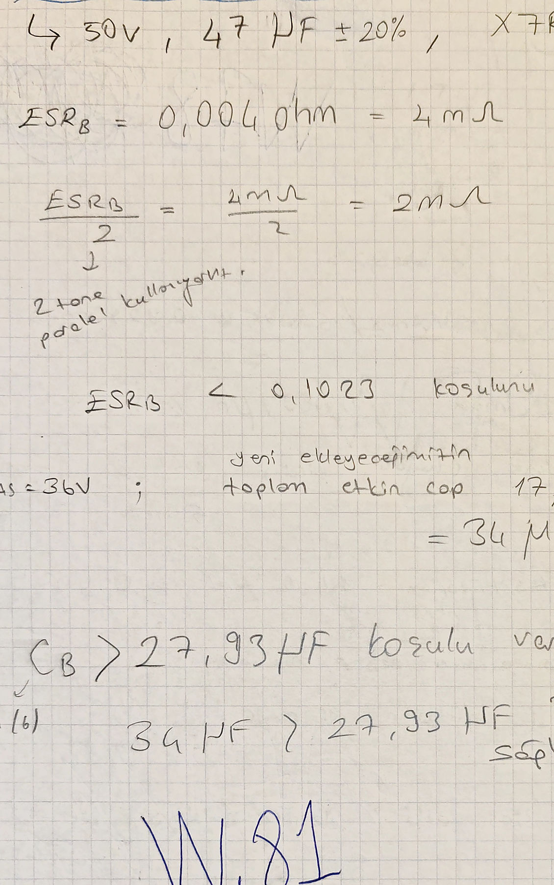

Bu bulk adayini destekleyen arac / datasheet ekran goruntuleri de korunabilir:


Sayfada okunan ana notlar sunlar:

- tek kapasitör icin:
  ```math
  V_{rating} = 50\,V,\qquad C_{nom} = 47\,\mu F
  ```
- tek kapasitör `ESR` notu:
  ```math
  ESR_B \approx 0.004\,\Omega = 4\,m\Omega
  ```
- `2 tane paralel` kullanim icin esit dagilim varsayimiyla:
  ```math
  ESR_{B,\text{eq}}
  \approx
  \frac{4\,m\Omega}{2}
  \approx
  2\,m\Omega
  ```

Sayfada, onceki bulk kosuluyla karsilastirma da acikca yazilmis:

```math
ESR_B < 0.1023
```

ve bu kosulun saglandigi not edilmis.

Ardindan `DC Bias = 36 V` altinda bu kapasitörlerin etkin kapasitesi kontrol edilmis. Sayfada:

- tek kapasitör icin etkin kapasite:
  ```math
  C_{\text{etkin,tek}} \approx 17\,\mu F
  ```
- `2 adet` icin toplam etkin kapasite:
  ```math
  C_{B,\text{toplam}}
  \approx
  17\,\mu F \times 2
  \approx
  34\,\mu F
  ```

Bu gorsellerin birlikte verdigi ek guvence su:

- `p76`, `36.3 V` civarinda tek bulk parcasi icin `17.013 uF` okundugunu acikca gosteriyor; bu, defterdeki `17 uF` ara degeriyle neredeyse birebir uyumlu
- `p77`, tek parca icin `0.3 MHz` civarinda `ESR \approx 4 m\Omega` buyuklugunu dogrudan destekliyor
- `p78`, bunun rastgele bir cap degil; `47 uF`, `50 V`, `X7R` sinifinda bilincli secilmis bir bulk aday oldugunu gosteriyor
- `p80` ise bu bulk MLCC'nin empedansinin frekansa gore nasil degistigini gostererek, neden yine de yuksek frekansta yardimci MLCC'lerle birlikte dusunulmesi gerektigine dair frekans-sezgisini guclendiriyor

ve onceki sayfadan gelen gereksinim ile karsilastirma:

```math
C_B > 27.93\,\mu F
```

olup,

```math
34\,\mu F > 27.93\,\mu F
```

sonucuyla bu kosulun da saglandigi yazilmis.

`W.81`, `W.80`deki soyut bulk kararini gercek bir komponente tasiyor. Burada hem `ESR` kosulu hem de `dc-bias` altindaki etkin kapasite ayni aday parca uzerinden kontrol edilmis. `2 x 47 uF / 50 V / X7R` secimi de bu yuzden giris tarafindaki eksik kapasiteyi kapatmak icin en guclu adaylardan biri gibi gorunuyor.

Defterden aktarilan not (`W.82`):

Burada giris kapasitörü bankasi icin bir ozet / kontrol sayfasi var. Sol tarafta toplam secilen etkin kapasitans ile `\Delta V_{IN,PP}` kosulu yeniden kontrol edilmis; sag tarafta ise kullanilabilecek kapasitör bankasi tablo halinde not edilmis.

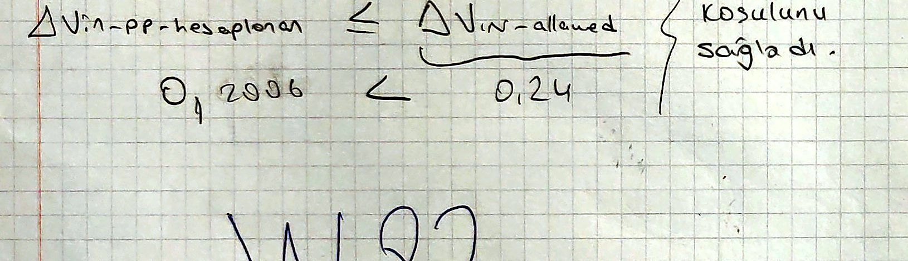

Sol sayfadaki ana hesap su sekilde okunuyor:

```math
\Delta V_{IN,PP,\text{hesap}}
\approx
\frac{D(1-D) I_{out,\max}}
{C_{CE,\text{total}} \, f_{sw}\, (1-TOL)}
```

Sayfadaki yerlestirmede:

- `D = 0.5`
- `I_{out,\max} = 9 A`
- `f_{sw} = 332 kHz`
- `C_{CE,total} \approx 8.228 uF + 34 uF`
- tolerans / derating carpani olarak `1 - 0.20`

kullanilarak yaklasik:

```math
\Delta V_{IN,PP,\text{hesap}}
\approx
0.2006\,V
```

sonucu yazilmis ve bunun:

```math
0.2006 < 0.24
```

oldugu, yani `\Delta V_{IN,PP}` kosulunun saglandigi not edilmis.

Sag sayfadaki tabloda ise, giris capacitor bankasi icin birden fazla eleman sinifi birlikte dusunuluyor gibi gorunuyor:

- `MLCC 22 uF / 50 V` sinifinda bir grup
- `MLCC 1 uF + 0.1 uF` gibi daha kucuk yardimci kapasitörler
- `Polymer 100 uF` sinifinda bir eleman

Yan notlarda bunlarin rolleri kabaca su sekilde ayriliyor:

- dusuk `ESR`, ripple tasima
- yuksek frekans bypass
- bulk enerji depolama / damping

`W.82`nin sol tarafi, `W.78-W.81` zincirinden gelen secimlerin toplam ag davranisini kontrol eden guclu bir ozet gibi. `0.2006 V < 0.24 V` sonucu, secilen toplam giris kapasitansi ile `\Delta V_{IN,PP}` kosulunun kapandigini gosteriyor. Sag taraftaki tablo ise biraz daha karisik; `2 x 47 uF` seramik bulk ile `100 uF polymer` notu ayni yerde oldugu icin, o kisim muhtemelen alternatif banka veya karsilastirma notu da iceriyor.

Defterden aktarilan not (`W.83`):

Burada bulk giris kapasitörü icin transient-response tarafi iki ayri kosula ayrilmaya calisiliyor:

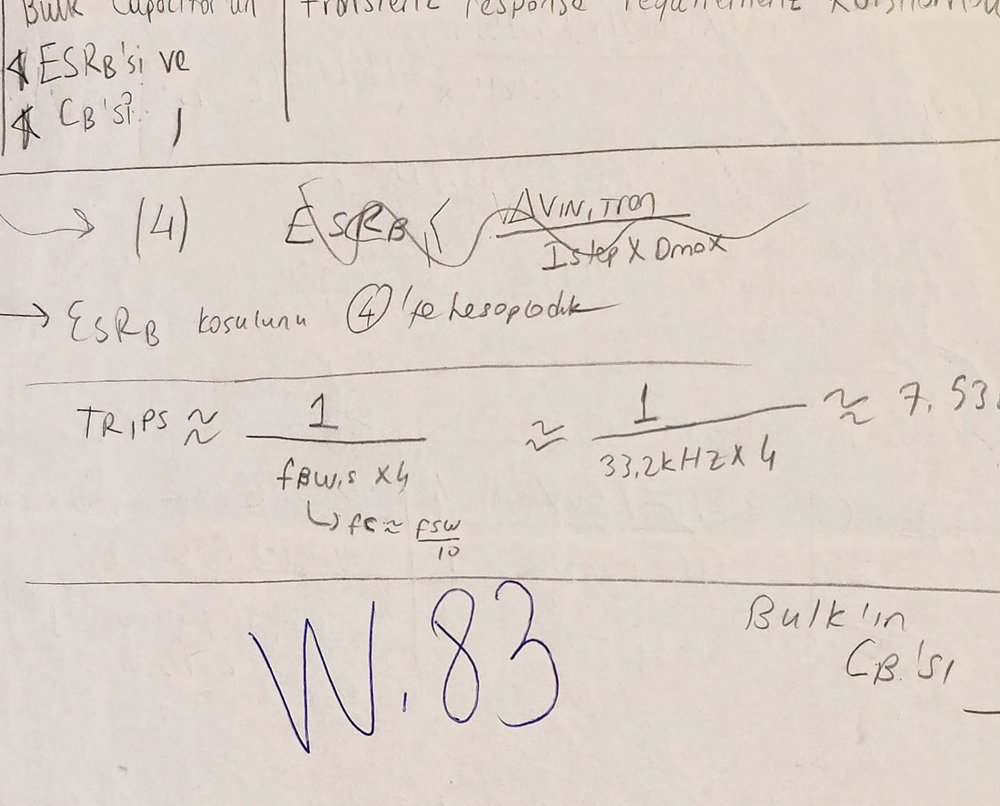

1. `ESR_B` ile ilgili kosul
2. `C_B` ile ilgili kosul

Sayfanin orta kismina, onceki sayfalardan tanidik olan `ESR_B` transient kosulu yeniden yazilmis:

```math
ESR_B
<
\frac{\Delta V_{IN,tran}}{I_{step}\,D_{\max}}
```

ve yanina da bu kosulun daha once hesaplandigi not edilmis.

Sayfanin asil yeni katki yapan kismi ise, `C_B` hesabinda kullanilacak zaman olcegini secmeye calismasi. Sayfada:

```math
T_{rip}
\approx
\frac{1}{f_{BW}\cdot 4}
```

iliskisi yaziliyor ve `f_c \approx f_{sw}/10` varsayimiyla:

```math
T_{rip}
\approx
\frac{1}{33.2\,kHz \cdot 4}
\approx
7.53\,\mu s
```

gibi bir ara sonuc not ediliyor.

Sayfanin ust kisminda `undershoot` ve `overshoot` icin kisa sozlu notlar da var; bunlar, ani yuk degisimlerinde gerilimin kisa sureli dusmesi veya yukselmesi durumunu hatirlatan kavramsal notlar gibi okunuyor.

`W.83` son `C_B` sonucunu vermiyor ama bulk transient hesabini iki parcaya ayirdigi icin onemli: ani ilk dusus/yukselis icin `ESR_B`, daha yavas enerji tamponu icin `C_B`. `T_{rip} \approx 7.53 us` secimi de sonraki kapasite hesabinin zaman olcegi gibi duruyor. Bu haliyle iyi bir kopru sayfa.

Defterden aktarilan not (`W.91`):

Burada `W.83`te kurulan bulk transient hesabi daha net ve daha sayisal bir bicimde tekrar ediliyor. Ust kisimda once `ESR_B` kosulu dogrudan yazilmis:

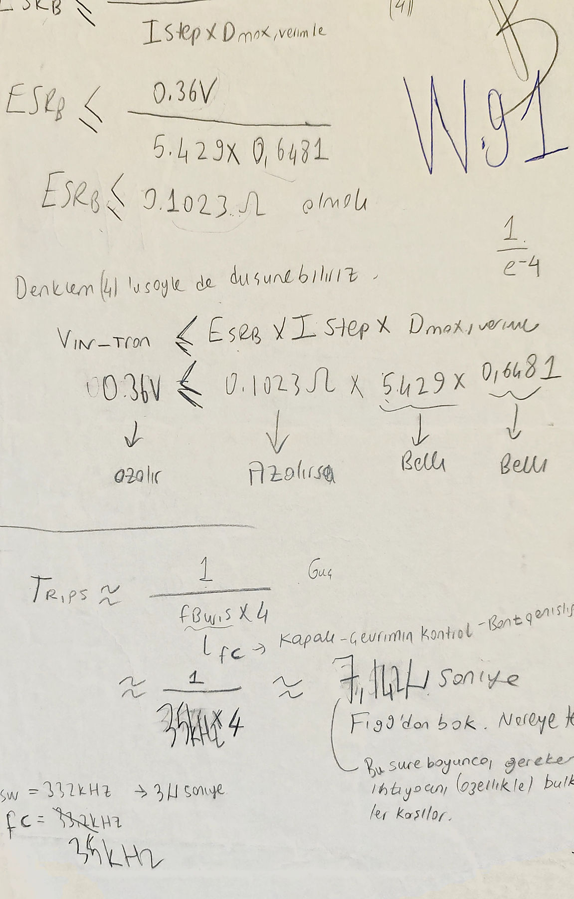

```math
ESR_B
<
\frac{V_{IN-tran}}{I_{step}\,D_{\max,\text{verimli}}}
```

Sayfadaki yerlestirmede:

- `V_{IN-tran} = 0.36 V`
- `I_{step} = 5.429 A`
- `D_{\max} \approx 0.6481`

kullanilarak:

```math
ESR_B
<
\frac{0.36}{5.429 \times 0.6481}
\approx
0.1023\,\Omega
```

sonucu tekrar yazilmis.

Sayfanin orta kisminda bu kosul bir de ters yonden okunmus:

```math
V_{IN-tran}
<
ESR_B \times I_{step} \times D_{\max}
```

ve mevcut secimin bu acidan makul oldugu not edilmis.

Sayfanin alt kisminda ise, `T_{rips}` / gecis suresi hesabina geri donuluyor. Bu kez:

- `f_c = 35 kHz`

secimi kullanilarak:

```math
T_{rips}
\approx
\frac{1}{f_{BW}\times 4}
\approx
\frac{1}{35\,kHz \times 4}
\approx
7.14\,\mu s
```

sonucu yazilmis.

Sayfadaki kisa notlardan, bu surenin nasil yorumlandigi da onemli:

- bu sure boyunca gereken akimin bir kismini ozellikle bulk kapasitör karsilar
- bu nedenle `C_B` hesabi icin kullanilan zaman olcegi olarak anlamlidir

`W.91`, `W.83`teki ayni iki fikri daha temiz bicimde tekrar ediyor: `ESR_B` ust siniri ve `C_B` hesabinda kullanilacak `T_{rips}` suresi. `f_c = 35 kHz` ile bulunan `7.14 us`, onceki `7.53 us` notunun daha guncel hali gibi okunabilir. Yeni bir nihai `C_B` sonucu vermiyor ama bulk transient hesabinin dayanak parametrelerini toparliyor.

Defterden aktarilan not (`W.97`):

Bu sayfa oldukca silik; ancak ust kisimdaki kisa notlar okunabiliyor ve `W.91`deki `T_{rips}` dusuncesine alternatif / ek bir zaman olcegi notu gibi gorunuyor.

Guvenle okunabilen ana not su:

- `f_c = 33.2 kHz`

icin, bir zaman olcegi olarak:

```math
\tau \approx \frac{1}{2\pi f_c}
\approx
\frac{1}{2\pi \cdot 33.2\,kHz}
\approx
4.8\,\mu s
```

gibi bir sonuc not edilmis.

Sayfanin hemen yanindaki kisa notlarda ayrica:

- `L = 6.8 uH`
- `\Delta I_L \approx 3.8 A`
- `I_{step} \approx 5.429 A`

benzeri onceki sayfalardan tanidik buyukluklerin tekrar yazildigi goruluyor.

`W.97`, `W.91`deki `T_{rips} \approx 1/(4f_c)` yaklasimina alternatif olarak bu kez `1/(2\pi f_c)` tipi bir zaman sabiti dusunuyor olabilir. Sayfa silik oldugu icin elde net kalan kisim `f_c = 33.2 kHz -> 4.8 us` iliskisi. Yine de tek bir yol degil, birden fazla approximation denendigini gostermesi bakimindan degerli.

Defterden aktarilan not (`W.92`):

Bu sayfa, yine bir kaynak / uygulama-notu figuru uzerine alinmis kisa not gibi gorunuyor. Uzerindeki yazilar, `\Delta V_{OUT}` ve ripple bileşenlerinin hangi parcalardan geldigini ayirma amacini tasiyor.

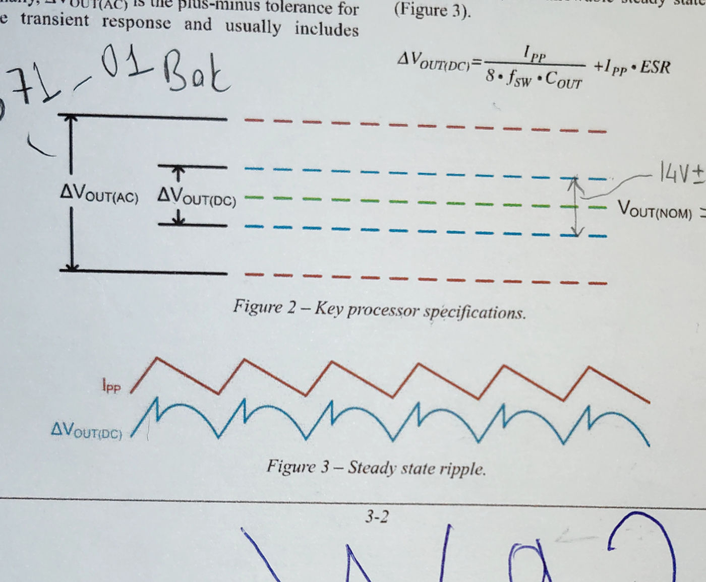

Sayfadaki basili ifade su tip bir iliskiyi gosteriyor:

```math
\Delta V_{OUT(pp)}
=
\frac{I_{pp}}{8\,f_{sw}\,C_{OUT}}

I_{pp}\,ESR
```

Senin sayfa uzerine dustugun notta ise:

- `Vout(non) = 14 V`
- `1V + opamp static reg`

gibi bir hatirlatma var. El yazisi tam net olmasa da, sayfanin ana mesaji su sekilde okunuyor:

- toplam gerilim sapmasi tek bir mekanizmadan gelmiyor
- kapasitif terim ile `ESR` terimi ayrilarak dusunulmeli
- steady-state ripple ile regülasyon / statik hata ayni sey degil

Bu, bulk transient sayfalarindaki su ayrimla da uyumludur:

- ilk hizli sapmalar `ESR` etkisiyle buyuyebilir
- daha yavas ve genis zaman olcekli sapmalar ise kapasite / enerji tamponu etkisiyle ilgilidir

`W.92` yeni bir sayisal komponent secimi vermiyor; burada asil deger, `ESR` ve kapasitif terimi ayirma aliskanligini kullandigin kaynak figuru uzerinden gostermesi. Ozellikle `W.88-W.91` hattinda "gerilim sapmasinin farkli fiziksel bilesenleri var" dusuncesini kisa ama yerinde bir notla pekistiriyor.


#### 5.5.8 Acik teknik dogrulamalar


Bu bolume daha sonra su hesaplar eklenecek:

- minimum etkin `Cin` hesabi

- duty'ye bagli gercek `Iin_rms` hesabi

- dc-bias ve toleransla duzeltilmis gercek kapasitans

- MLCC basina RMS akim dagilimi

- sicaklik artisi ve component derating kontrolu

- yuksek frekans spike bastirma icin ek kucuk MLCC stratejisi

- bulk kapasitör secimi ve damping gerekcesi

- EMI filtresi ile birlikte giris aginin son hali


### 5.6 MOSFET secimi ve kayiplar


#### 5.6.1 Mevcut aday parca


Proje klasorunde secilmis MOSFET adayi olarak su parca gorunuyor:

- `BOM/M2_Texas_Instruments_CSD18543Q3A_csd18543q3a.pdf`


Ek not dosyalarinda bu parcaya ait ilk parametre ozeti de bulunuyor:

- $R_{DS(on)} \approx 8.2\,\text{m}\Omega$

- $Q_{g,\text{total}} \approx 16\,\text{nC}$

- $C_{gd} \approx 54\,\text{pF}$

- $Q_{gd} \approx 1.2\,\text{nC}$ yaklasimi

- $V_{\text{drive}} \approx 7.5\,\text{V}$

- $R_{gate} = 2.2\,\Omega$ notu


Bu, MOSFET seciminin tamamen acikta olmadigini; fakat son gerekceli anlatimin henuz Markdown belgeye tasinmadigini gosteriyor.


#### 5.6.2 Secim mantigi


Bu tasarimda MOSFET secimi yalnizca dusuk `RDS(on)` aramak degildir. Mevcut notlarin isaret ettigi temel denge su sekildedir:

- dusuk `RDS(on)` ile iletim kayiplari azaltilmak istenir

- dusuk gate charge ile switching kayiplari ve surucu yuku sinirli tutulmak istenir

- `332 kHz` gibi orta-yuksek bir frekansta, yalnizca iletim kaybina bakmak yetersizdir

- termal limitler, paket yetenegi ve gercek PCB kosullari birlikte degerlendirilmelidir


Bu nedenle MOSFET secimi en az su basliklarla savunulmalidir:

- `VDS` gerilim marji

- `RDS(on)`

- `Qg`, ozellikle `Qgd`

- termal metrikler ve paket

- guvenli calisma alani ve akim/avalanche sinirlari

Bu secim mantigini destekleyen iki kaynak-foto:

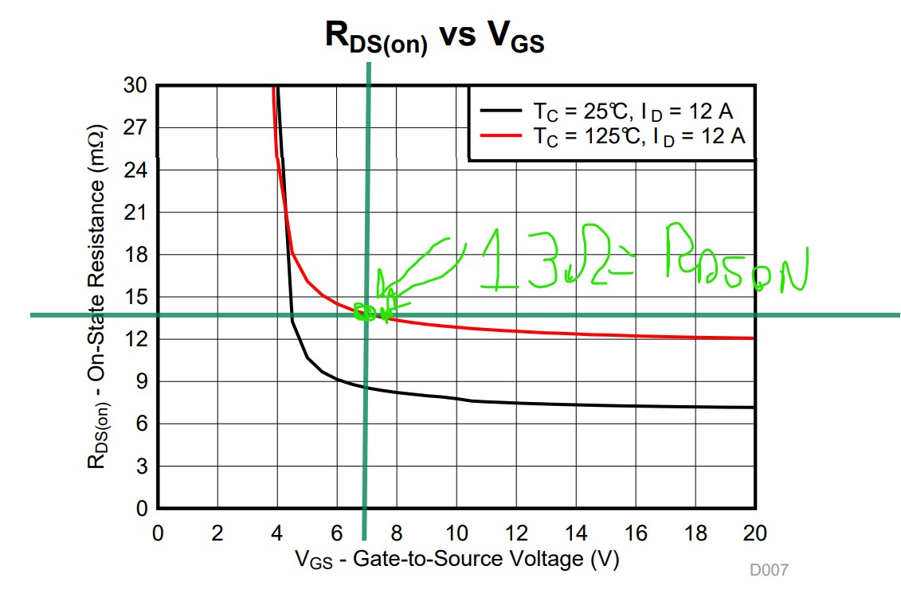

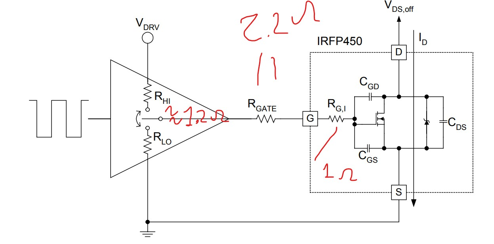

Ilk foto, `V_{GS} \approx 7.5 V` civarinda `R_{DS(on)}`'in hangi mertebede okunmasi gerektigini not eden bir datasheet-grafik calismasi. Ikinci foto ise `R_{HI}`, `R_{LO}`, harici gate direnci ve `C_{GD} / C_{GS} / C_{DS}` kapasitanslari uzerinden `dv/dt`, Miller etkisi ve gate-surme hizi dusuncesinin nasil kuruldugunu gosteriyor. Ikisi birlikte `5.6.2` altinda secim mantigini guzel destekliyor.

Defterden aktarilan not (`W.120`):

Burada TI'nin `Understanding MOSFET Data Sheets, Part 1 - UIS / avalanche Ratings` makalesinin ilk sayfasi uzerine alinmis not var. Proje-ozel tekil hesap sayfasi olmaktan cok, MOSFET seciminde avalanche / UIS dayaniminin neden goz ardi edilmemesi gerektigini gosteren bir kaynak-not gibi okunuyor.

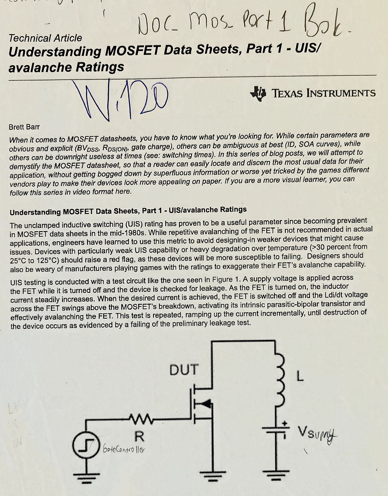

Sayfadaki basili sekil ve notlardan korunacak ana fikirler sunlar:

- `UIS` (unclamped inductive switching) testi, MOSFET'in enduktif enerji bosalimi sirasindaki dayanimini sinar
- cihaz kapatildiginda, enduktif akim devam etmek istedigi icin `VDS` uzerinde yuksek stres olusabilir
- eger bu enerji baska bir yoldan bosaltılamazsa cihaz avalanche bolgesine girebilir

Sayfanin ustundeki kullanici notu da bu yone cikiyor:

- kayiplar / stres buyurse MOSFET'in daha "rugged" olmasi gerekir
- `UIS test nasil yapilir?` sorusu not edilmis

Burada `5.6.2` altinda gecen `VDS` marji ve `avalanche` sinirlarinin yalnizca teorik basliklar olmadigi, datasheet yorumunda gercek bir dayanim parametresi oldugu goruluyor. Henuz secilen MOSFET icin proje-ozel `EAS` veya UIS marj hesabi yok; ama yuksek `VDS` spike veya layout / snubber yetersizligi durumunda avalanche konusunun secimde goz ardi edilmemesi gerektigi gayet net.


Bu ekran goruntusu, `W.120-W.121` tarafinda kavramsal olarak not edilen UIS / avalanche farkindaliginin secilen MOSFET datasheet'inde de somut bir dayanim kalemi olarak arandigini gosteriyor. Yani burada yalnizca genel teori degil, secilen parcanin gercek datasheet'i de okunuyor.

Defterden aktarilan not (`W.121`):

Burada `W.120`deki UIS / avalanche makalesinin dalga sekli mantigi kendi ciziminle tekrar kuruluyor. Artik yalnizca metin degil, testin nasil isledigine dair zamana bagli sezgi de var.

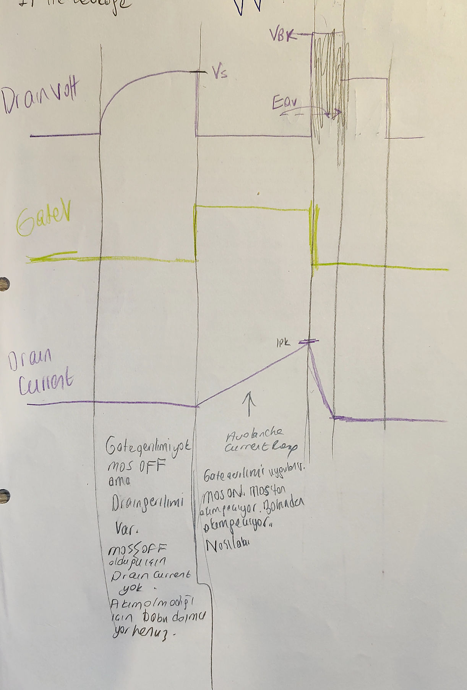

Sayfada uc dalga seklinin birlikte dusunuldugu goruluyor:

- drain gerilimi
- gate gerilimi
- drain akimi

Sayfanin ust kismina dusulen not:

- `UIS test nasil yapilir?`
- `1) pre-leakage`

Sayfadaki cizimden korunacak ana fikirler:

- MOSFET acikken enduktif akim yukselir ve enerji depolanir
- MOSFET kapatildiginda enduktor akimi devam etmek ister
- uygun bosalma yolu yoksa `VDS` hizla yukselir
- bu esnada cihaz avalanche bolgesine girebilir
- test sonunda `pre-leakage` / sonrasindaki leakage davranisina bakilarak cihazin zarar gorup gormedigi anlasilmaya calisilir

Sayfadaki sembolik notlardan:

- `V_{BK}` benzeri breakdown / clamping bolgesine isaret eden not
- `E_{av}` benzeri avalanche enerjisine isaret eden not

Bu sayfa, `W.120`deki UIS kavramini daha sezgisel hale getiriyor; ozellikle drain voltage, gate voltage ve drain current iliskisinin zamanla nasil degistigi goruluyor. Burada yine proje-ozel sayisal `EAS` hesabi yok, ama "avalanche dayanim" basliginin neden ciddiye alinmasi gerektigini gosteren cok iyi bir defter cizimi var.

Defterden aktarilan not (`W.122`):

Burada TI'nin `Understanding MOSFET Data Sheets, Part 2 - Safe Operating Area (SOA) Graph` makalesinin ilk sayfasi uzerine alinmis not var. Proje-ozel tekil hesap sayfasi olmaktan cok, MOSFET seciminde `SOA` grafiginin neden goz onunde tutulmasi gerektigini gosteren bir kaynak-not.

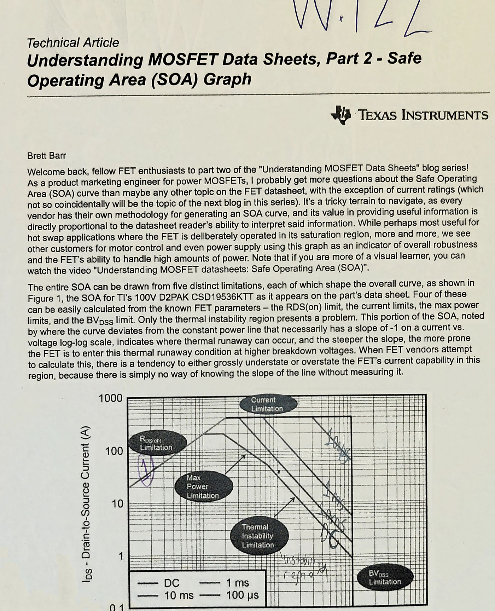

Sayfadaki basili `SOA` grafiginden korunacak ana fikirler sunlar:

- `SOA` grafigi, drain-source gerilimi ile drain akiminin birlikte hangi bolgelerde guvenli kaldigini gosterir
- farkli sureler (`DC`, `10 ms`, `1 ms`, `100 us` gibi) icin farkli sinirlar vardir
- siniri tek bir mekanizma belirlemez; akim limiti, max guc limiti, termal istikrarsizlik ve `BVdss` siniri gibi farkli bolgeler vardir

Kullanicinin ust notundan korunacak ana sezgi:

- belirli bolgelerde MOSFET'in gorebilecegi gerilim ve akim birlikte sinirlanir
- yalnizca tek eksende "max current" veya "max VDS" bakmak yeterli olmaz

Bu sayfa, `W.120-W.121`deki avalanche / UIS farkindaligina bu kez `SOA` perspektifini ekliyor. Yani secilen MOSFET icin sadece `RDS(on)` ve `Qg` degil, gerilim-akim-zaman ucgenindeki guvenli bolgenin de onemli oldugu hatirlatiyor. Proje-ozel sayisal `SOA` yerlestirmesi yok; ama `SOA` grafiginin secim mantigina dahil edilmesi gerektigini gayet iyi hatirlatiyor.

Defterden aktarilan not (`W.123`):

Bu sayfa, MOSFET'in `I_D - V_{DS}` karakteristiklerini cok sade bir eskizle hatirlatiyor. Proje-ozel nihai hesap sayfasi degil; daha cok `VGS`, lineer bolge ve `RDS(on)` sezgisini canli tutan temel bir defter notu gibi.

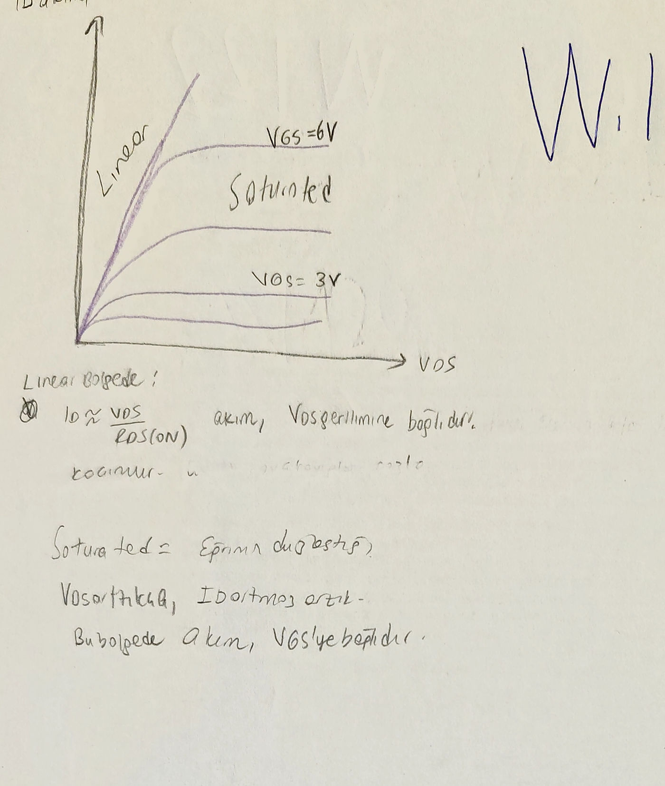

Sayfadaki cizimde:

- yatay eksen `VDS`
- dikey eksen `I_D`
- farkli `VGS` degerleri icin karakteristik egri aileleri gosteriliyor

Ust kisimda özellikle iki gate gerilimi not edilmis:

- `VGS = 6 V`
- `VGS = 3 V`

Sayfadaki notlardan korunacak ana fikirler:

- dusuk `VDS` bolgesinde cihaz lineer / omik bolgeye yakin davranir
- bu bolgede akim, `VDS` ile ve etkin `RDS(on)` ile iliskilidir
- `VGS` arttikca egri yukariya tasinir; yani cihaz ayni `VDS` icin daha fazla akim tasiyabilir
- `saturation` benzeri bolgede ise akim daha cok `VGS` tarafindan belirlenir

Bu sayfa, `5.1.2`de gecen "dusuk VCC / dusuk VGS -> RDS(on) artar" fikrini transistor karakteristigi tarafindan destekliyor. Ayni zamanda `5.6.2`de MOSFET seciminde neden surme geriliminin ve `RDS(on)` verisinin birlikte okunmasi gerektigini sezgisel olarak acikliyor. Yeni sayisal secim veya kayip hesabi yok; ama MOSFET davranisini ezber parametre yerine karakteristik egri gozuyla dusunmeye yardim ettigi icin degerli.


Bu ekran goruntusu, `W.123`te cizgisel olarak anlatilan `I_D - V_{DS}` ailelerini secilen MOSFET datasheet'i uzerinden tekrar gormeyi sagliyor. Ozellikle farkli `V_{GS}` seviyelerinde ayni `V_{DS}` icin tasinabilen akimin nasil degistigi ve "gercek surme gerilimine gore okumak" gerektigi daha somut hale geliyor.

Defterden aktarilan not (`W.178`):

Burasi `G88 A5 dv/dt Limit` konusuna giris yapan kavramsal bir defter sayfasi. Yeni bir nihai kayip hesabi degil; yuksek `dV/dt` nedeniyle MOSFET'in kendiliginden / istenmeden acilabilmesi problemini tanimlayan giris sayfasi.

Sayfanin ust kisminda kullanici sorunu kendi cümleleriyle ozetliyor:

- drain-source gerilimi cok hizli arttiginda
- yani yuksek `dV/dt` oldugunda
- MOSFET kendiliginden acilabilir
- yani kullanici gate'e bilerek `V_{GS}` uygulamadan da iletime gecme riski vardir

Ortadaki cizimde bu problem icin kullanilan temel parasitik model cizilmis:

- `C_{GD}` (Miller kapasitansi)
- `C_{GS}`
- `C_{DS}`
- gate yolunda bir `R_{G,int}` benzeri direnc

Bu cizim, hizli degisen `V_{DS}` geriliminin `C_{GD}` uzerinden gate dugumune tasinabilecegini ve orada istenmeyen bir `V_{GS}` olusturabilecegini sezgisel olarak gosteriyor.

Sayfanin altindaki kisa not da sunu soyluyor:

- bu konu toplamda `3` senaryo halinde incelenecek

Yani bu sayfa, sonraki `W.125-W.127` notlarinda gelecek olan:

- `dV/dt` limit hesabi
- kaba `dV/dt` ust siniri
- Miller kaynakli yanlis tetiklenme kontrolu

gibi alt basliklarin kavramsal girisi olarak okunmalidir.

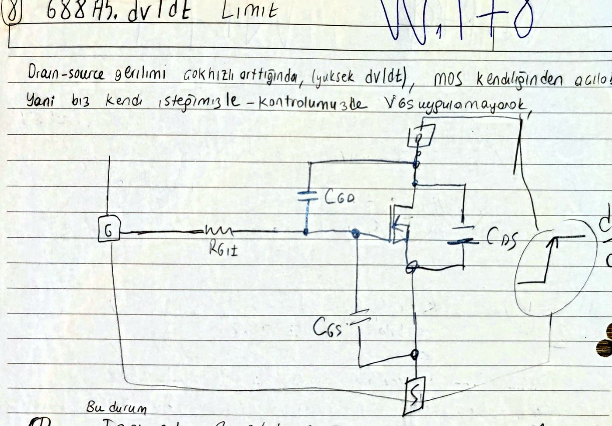

Bu sayfa yeni sayisal sonuc vermiyor; ama `W.125-W.127` zincirinin asil fiziksel problemini cok net tarif ediyor: hizli `V_{DS}` degisimi, `C_{GD}` uzerinden gate'e enjekte olup MOSFET'i istemeden acabilir. Bu netligi yuzunden burada olmasi cok yerinde.

Defterden aktarilan not (`W.179`):

Burada `W.178`te kavramsal olarak tanimlanan problemin gate dugumunde nasil bir `V_{GS}` olusturdugu daha acik bicimde formullestiriliyor. Yeni bir nihai kayip hesabi degil; `C_{GD}` ve `C_{GS}` uzerinden olusan kapasitif bolucunun istenmeyen turn-on riskine nasil donustugunu gosteren ara bir sayfa.

Sayfanin ust kisminda kullanici sozel olarak su problemi yaziyor:

- bazen bir MOSFET digerini etkileyebilir
- MOS'un gate'ine bilerek gerilim uygulanmasa bile
- `C_{GD}` / `C_{GS}` kapasitif yolu yuzunden bir `dV/dt` piki gate'de gerilim olusturabilir

Sayfanin ortasinda bu fiziksel mekanizma, kapasitif bolucu sezgisiyle yaziliyor. Okunabildigi kadariyla kullanilan temel iliski su:

```math
V_{GS}
\approx
V_{DS}\,\frac{C_{GD}}{C_{GS}+C_{GD}}
```

Sayfada bunun hemen altina da kritik kontrol notu yaziliyor:

- bu denklemden gelen `V_{GS}` degeri
- MOSFET'in threshold gerilimini asarsa
- istenmeyen / parasitik turn-on olusabilir

Kullanicinin yazdigi kisa kontrol ifadesi bu mantigi ozetliyor:

```math
V_{DS,max}\,\frac{C_{GD}}{C_{GS}+C_{GD}} < V_{TH}
```

ya da ayni anlamda:

- `V_{DS}` ne kadar hizli ve buyuk degisirse
- `C_{GD}` ne kadar buyukse
- gate tarafinda olusan istenmeyen gerilim o kadar buyur

Sayfanin alt kisminda ayrica gate surucusu ve direncli ne olursa olsun, yuksek `dV/dt` etkisinin:

- gate surucusunu
- MOSFET'in kendisini
- ve dinamik davranisi

etkileyebilecegi; yani sadece "statik bir threshold karsilastirmasi" olmadigi not edilmis.

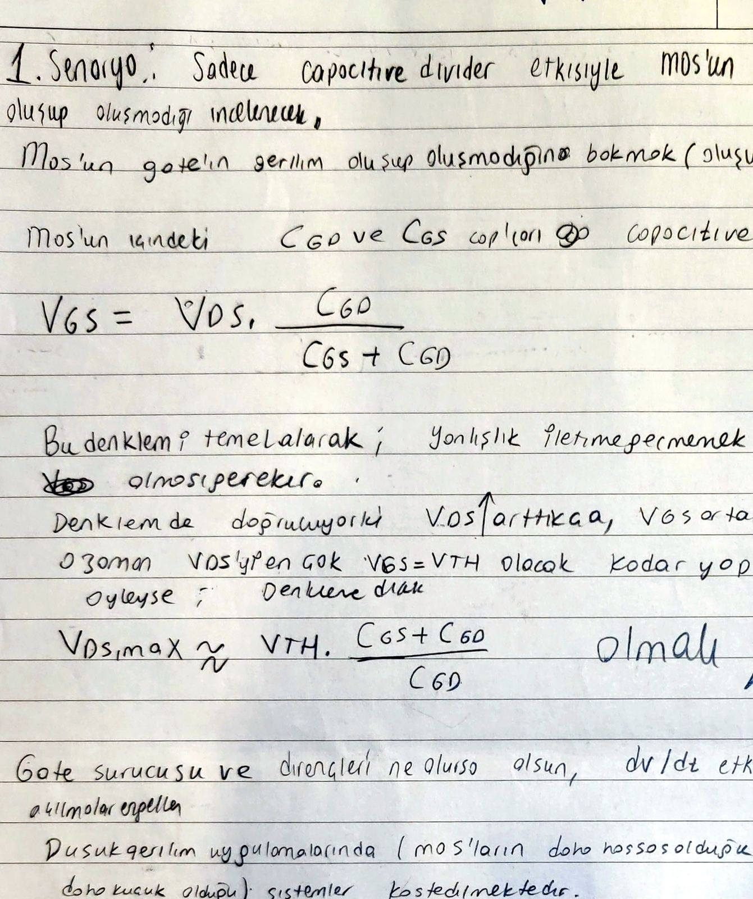

Bu sayfa, `W.178`de baslatilan kavramsal problemi tek bir denklemle daha gorunur hale getiriyor. Ayni zamanda `W.127`deki Miller kaynakli istenmeyen tetiklenme notunun daha erken ve daha sade anlatilmis bir versiyonu gibi de okunabilir.

Defterden aktarilan not (`W.180`):

Burada `W.179`da yazilan kapasitif bolucu iliskisi, gercek proje sayilarindan bazilari yerine konarak hizli bir senaryo kontrolune tasinmis. Yeni nihai kayip hesabi degil; daha cok istenmeyen turn-on riskinin buyukluk mertebesini sayisal olarak yoklayan bir ara sayfa.

Sayfanin ust kisminda okunabildigi kadariyla:

- `1. senaryo`
- `V_{DS} = 22 V`
- `C_{rss} = 6 pF`
- `C_{oss} = 200 pF`

notlari yer aliyor.

Ardindan kullanici, parasitikleri birbirinden ayirmaya calisiyor. Guvenle okunabilen iliskiler sunlar:

```math
C_{gd} \approx C_{rss} \approx 6 pF
```

```math
C_{ds} \approx C_{oss} - C_{gd} \approx 200 pF - 6 pF = 194 pF
```

Sayfada ayrica `C_{iss}` tarafindan `C_{gs}`'yi ayirmaya calisan bir satir da var. Okunabildigi kadariyla kullanici:

- `C_{iss} \approx 1100 pF`

gibi bir deger alip

```math
C_{gs} \approx C_{iss} - C_{gd} \approx 1094 pF
```

sonucuna gidiyor.

Ardindan `W.179`daki esitligin tersine cevrilmis hali gibi duran bir kontrol yaziliyor:

```math
V_{DS,max}
\lesssim
V_{TH}\,\frac{C_{gs}+C_{gd}}{C_{gd}}
```

Bu, su anlama geliyor:

- `C_{gd}` kucuk
- `C_{gs}` buyukse
- ayni `V_{DS}` degisiminden gate dugumune tasinan gerilim kucuk kalir

Sayfanin altindaki sonuc satiri tam net okunmasa da, genel mesaj acik gorunuyor:

- bu senaryoda bulunan limit, devrede gorulen `22 V` seviyesinin oldukca uzerinde
- yani kullanici bu kontrolu "Miller kaynakli kendiliginden turn-on acisindan rahatlik var" seklinde yorumluyor gibi duruyor

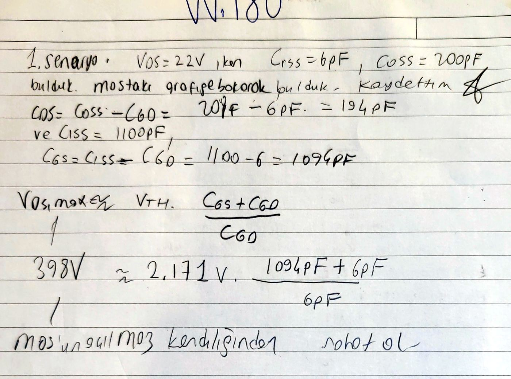

Bu sayfa, `W.179`daki iliskinin soyut kalmadigini; secilen MOSFET'in parasitikleriyle en azindan bir ilk kaba sayisal kontrol yapildigini gosteriyor. `C_{iss}` satirindaki rakam ve en alttaki nihai limit tam net okunmadigi icin burada kesin son sayi yerine iliski ve buyukluk sezgisini korumak daha dogru. Buna ragmen `C_{gd}`'nin kucuk, `C_{gs}`'nin buyuk olmasinin yanlis turn-on riskini azalttigi mesaji net.

Defterden aktarilan not (`W.181`):

Burada `W.178`te not edilen "3 senaryo" fikrinin `2. senaryo` sayfasi var. Odak yine `dv/dt` kaynakli yanlis turn-on riski; ama bu kez onceki kapasitif bolucu esitligi yerine, gate yolunun daha sert / hizli bir limiti uzerinden kaba bir ust-sinir kontrolu yapiliyor.

Sayfanin ustunde okunabildigi kadariyla su iliski yaziliyor:

```math
\left(\frac{dV}{dt}\right)_{N\text{-}limit}
\approx
\frac{V_{TH}}{R_{Gi}\,C_{GD}}
```

Burada sayfada guvenle okunabilen ara notlar sunlar:

- `2. senaryo`
- `R_{Gi} \approx 0.7\,\Omega` (`typical` notu dusulmus)
- `C_{GD} \approx 6 \times 10^{-12}\,F`

Sayfadaki sayisal yerlestirme, okunabildigi kadariyla, su yone cikiyor:

```math
\left(\frac{dV}{dt}\right)_{N\text{-}limit}
\approx
\frac{2.41\,\text{V}}
{0.7\,\Omega \cdot 6 \times 10^{-12}\,\text{F}}
\approx
5.7 \times 10^{11}\,\text{V/s}
```

Sayfanin sag tarafindaki kullanici notu da, bu sonucun:

- "cok yuksek" bir sinira isaret ettigini
- dolayisiyla kendi buck tasarimindaki `dv/dt`'nin bunun oldukca altinda oldugunu
- bu yuzden bu senaryoda kendiliginden acilmanin beklenmedigini

ima ediyor gibi gorunuyor.

En alttaki kisa yorum da, eger bu tur bir sinir sorun olacak kadar dusuk ciksaydi:

- `clamp`
- `snubber`

gibi ek onlemlerin dusunulebilecegi yone isaret ediyor gibi duruyor.

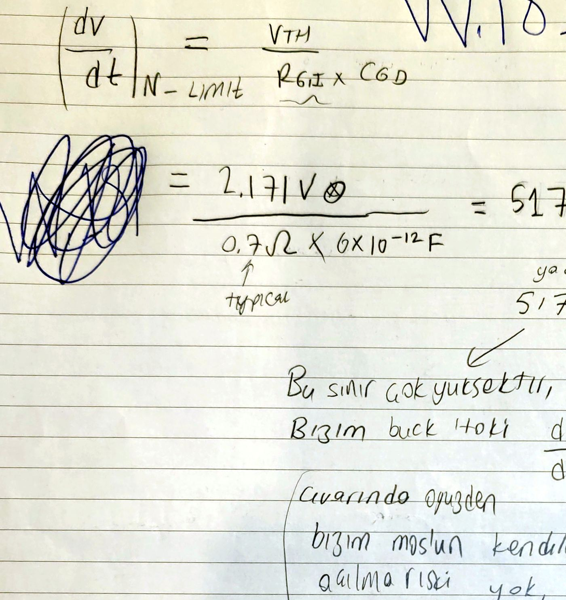

Bu sayfa, `W.125-W.126`daki kaynak-not `dv/dt` fikirlerinin proje baglaminda daha agresif bir ikinci senaryo ile yoklandigini gosteriyor. Sonucun birimi ve nanosaneye cevrilmis hali tam net degil; o yuzden burada kesin nihai deger yerine buyukluk mertebesini korumak daha dogru. Ama ana mesaj net: bu senaryoda bulunan `dv/dt` limiti oldukca yuksek ve yorum da "yanlis turn-on acisindan rahatlik var" yonunde.

Defterden aktarilan not (`W.182`):

Burada `W.181`deki daha sade `dv/dt` limitinin fiziksel olarak nasil olustugu aciklaniyor ve gercek devre yolu biraz daha ayrintili gosteriliyor. Yeni bir nihai sayisal sonuc sayfasi degil; `C_{GD}` uzerinden enjekte olan akimin gate yolundaki direncler uzerinde nasil `V_{GS}` olusturdugunu anlatan bir turetim / fiziksel aciklama sayfasi.

Sayfanin ustunde, onceki `dv/dt` limitine benzeyen ama bu kez daha gercekci gate yolu ile yazilmis su iliski okunuyor:

```math
\left(\frac{dV}{dt}\right)_{limit}
\approx
\frac{V_{TH}}
{\left(R_{Gi}+R_{Gext}+R_{LO}\right)\,C_{GD}}
```

Sayfanin orta kismina dogru yazilan fiziksel aciklama zinciri de, okunabildigi kadariyla, su yone cikiyor:

```math
I_{CGD} = C_{GD}\,\frac{dV_{DS}}{dt}
```

ve bu akimin gate yolundaki direncler uzerinde bir gerilim olusturdugu not ediliyor:

```math
V_{GS} = I_{CGD}\,\left(R_{Gi}+R_{Gext}+R_{LO}\right)
```

Sayfanin sag ve alt tarafindaki kullanici notlari, ana fiziksel mesaji acik bicimde veriyor:

- `V_{DS}` cok hizli artarsa
- `C_{GD}` uzerinden gate tarafina bir akim gonderilir
- bu akim, gate yolundaki direncler uzerinde bir gerilim olusturur
- eger olusan `V_{GS}`, `V_{TH}`'yi asarsa MOSFET yanlislikla acilabilir

Sayfada ayrica bu ifadenin:

- "gercek devre kosullariyla"
- MOSFET'in `dv/dt` ile istenmeyen acilmamasi icin gerekli siniri verdigi

yone bir not da bulunuyor gibi gorunuyor.

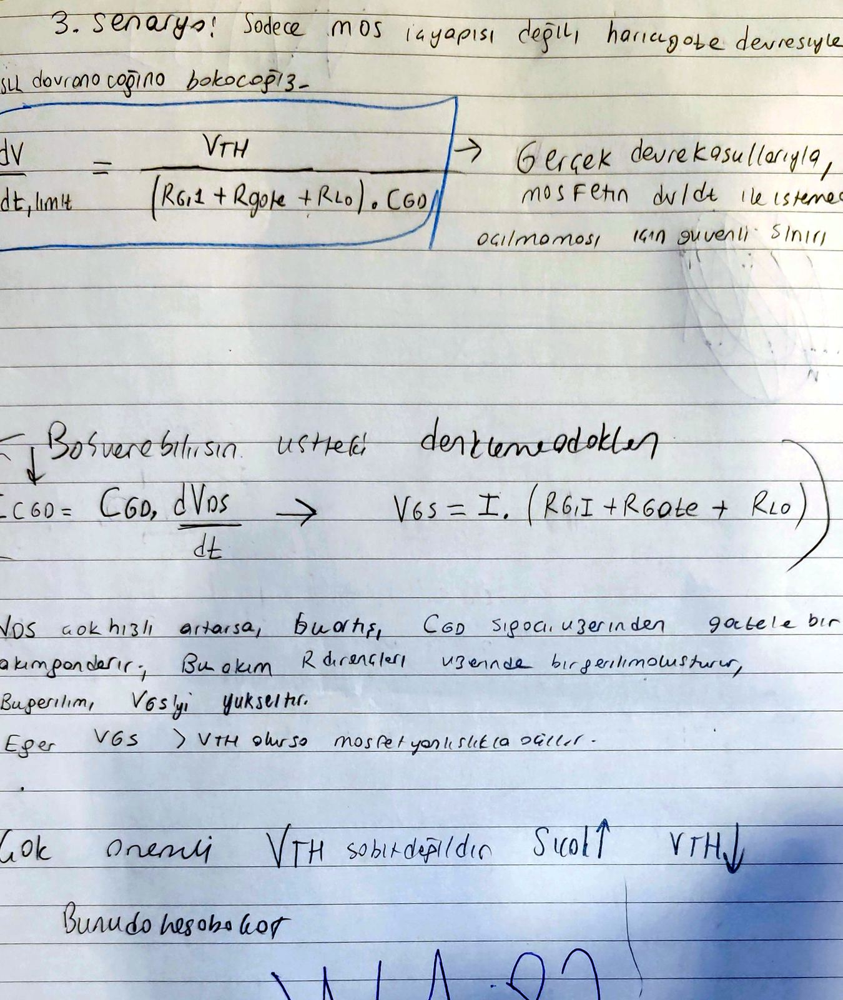

Burada `W.179`daki kapasitif bolucu sezgisi ile `W.181`deki hizli `dv/dt` limitinin arasina fiziksel bir kopru konuyor. `R_{LO}` ifadesi sayesinde surucunun pull-down yolunun da bu problemde rol oynadigi daha net hale geliyor. Ustteki baslik satirinin tamami tam net okunmasa da, ana mesaj acik: `C_{GD}` akimi gate yolunda gerilim olusturur ve bu gerilim `V_{TH}`'yi gecerse yanlis turn-on olur.

Defterden aktarilan not (`W.183`):

Burada `W.182`de yazilan fiziksel `dv/dt` limiti bu kez daha pratik bir gate direnci secimiyle sayisal olarak yoklaniyor. Yeni bir LTspice ya da kayip sonucu degil; gercekci gate yolu degerleriyle Miller kaynakli yanlis turn-on riskini sayisal olarak kontrol eden ara not.

Sayfanin ustunde ayni iliski tekrar yaziliyor:

```math
\left(\frac{dV}{dt}\right)_{limit}
\approx
\frac{V_{TH}}
{\left(R_{Gi}+R_{Gext}+R_{LO}\right)\,C_{GD}}
```

Bu kez sayfada guvenle okunabilen daha pratik secim notlari da var:

- `R_{Gext} \approx 0.5 - 1\,\Omega` araliginda dusunulmus gibi gorunuyor
- `R_{LO-driver}` icin `low-side resistance = 0.9\,\Omega` not edilmis
- `C_{GD} = 6\,pF`
- `V_{TH} = 2.172\,V`

Sayfadaki sayisal yerlestirme, okunabildigi kadariyla, su yone cikiyor:

```math
\left(\frac{dV}{dt}\right)_{limit}
\approx
\frac{2.172\,\text{V}}
{\left(1\,\Omega + 0.9\,\Omega\right)\cdot 6\,\text{pF}}
\approx
190.6 \times 10^{9}\,\text{V/s}
```

Bu da:

```math
\approx 190.6\,\text{V/ns}
```

mertebesine karsilik geliyor.

Sayfanin altindaki kullanici notu, bu sonucun pratik yorumunu da veriyor gibi gorunuyor:

- bu sinir "nanosecond" mertebesinde cok yuksek
- dolayisiyla kendi buck tasarimindaki gercek `dv/dt` bunun oldukca altinda kalir
- bu senaryoda MOSFET'in kendiliginden acilmasi beklenmez

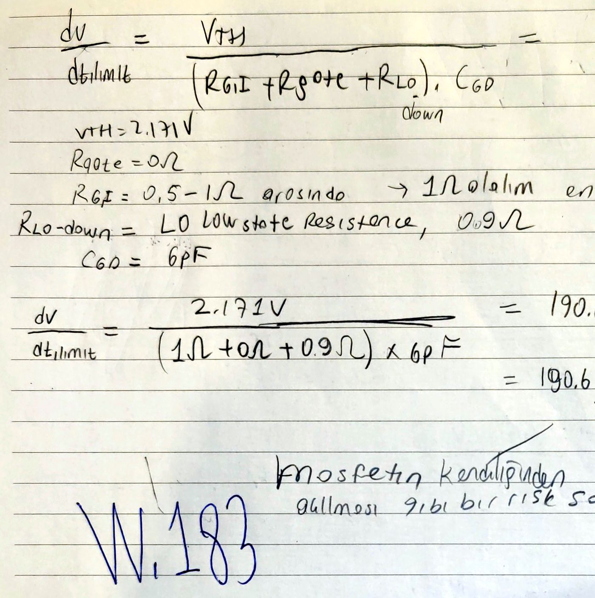

Burada `W.181`deki daha soyut ikinci senaryo hesabi gercekci gate yolu degerleriyle daha okunur hale geliyor. `R_{Gext}` icin bir aralik dusunulup sonra `1\,\Omega` ile ornek kontrol yapildigi gorunuyor; bu da tasarim kararinin tek bir ezber sayi yerine muhendislik bandi olarak dusunuldugunu gosteriyor. Ana mesaj da net: pratik gate yolu direnci eklendiginde bile bulunan `dv/dt` limiti oldukca yuksek kaliyor.

Defterden aktarilan not (`W.184`):

Burada `W.178-W.183` hattindaki yanlis turn-on / Miller problemi bu kez daha korumaci bir kapasite setiyle tekrar yoklaniyor. Ozellikle `C_{iss}` ve `C_{rss}` tarafinda datasheet'in nominal degerleriyle kontrol yapilmaya calisildigi izlenimi var. Asil mesaj, secilen kapasite modeline gore sonucun ne kadar degisebildigi.

Sayfanin ortasinda, kapasitif bolucu mantiginin bu kez daha buyuk bir datasheet kapasite setiyle yazildigi okunuyor. Okunabildigi kadariyla kullanilan ara sayilar sunlar:

- `C_{iss} \approx 2600\,pF`
- `C_{gd} \approx C_{rss} \approx 340\,pF`

Sayfadaki ara sonuc, okunabildigi kadariyla, su yone cikiyor:

```math
V_{DS,\max}
\approx
\left(3.157\,\text{V} + 1.34\,\text{V}\right)\,
\frac{2600\,pF}{340\,pF}
\approx
26.12\,\text{V}
```

Bu, onceki sayfalardaki daha yuksek `V_{DS,\max}` / `dv/dt` limitlerine gore daha korumaci bir sonuca isaret ediyor.

Sayfanin alt kisminda, ayni konu bu kez `dv/dt` cinsinden de yeniden yazilmaya calisiliyor. Burada tam net okunamayan kisimlar olsa da, ana fikir su gibi gorunuyor:

```math
\left(\frac{dV}{dt}\right)_{limit}
\propto
\frac{V_{TH} + \Delta V_{GS}}
{R_{G,total}\,C_{GD}}
```

Burada:

- `R_{G,total}` icin daha buyuk / daha gercekci bir toplam gate yolu dusunuluyor
- `C_{GD}` ise onceki sayfalardaki `6\,pF` yerine, daha buyuk bir nominal `340\,pF` degerine yakin aliniyor

Dolayisiyla bulunan sinirin de belirgin bicimde dusmesi bekleniyor.

Sayfanin sag tarafindaki not da, okunabildigi kadariyla, bu tarz kontrolde:

- `dikkat`
- `nominal capacitance` / datasheet nominal kapasite degerleri

gibi bir uyarinin tutuldugunu gosteriyor.

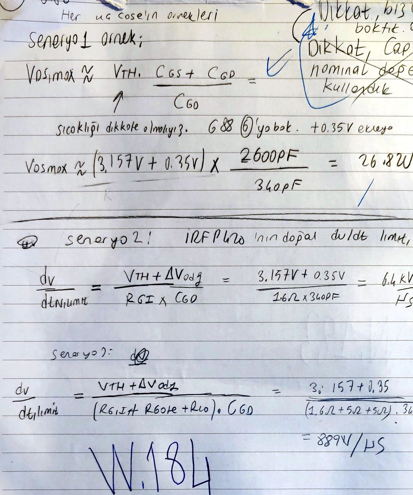

Bu not degerli; cunku ayni yanlis turn-on problemi icin farkli kapasite modellerinin sonucu ciddi bicimde degistirebildigini gosteriyor. `6\,pF` civari ortalama / uyarlanmis `C_{GD}` ile bulunan yuksek limitler ile, `340\,pF` civari daha korumaci nominal yaklasim arasindaki fark burada gorunur hale geliyor. Alt taraftaki `dv/dt` esitliginin tam son sayisi net okunmadigi icin asil korunmasi gereken mesaj, "daha buyuk nominal kapasite alinirsa sinir daha korumaci cikar" fikri.

Defterden aktarilan not (`W.125`):

Burada `G88` (`Estimating MOSFET Parameters from the Data Sheet`) kaynagindan alinmis kisa bir `dv/dt` dayanim / gate davranisi notu var. Proje-ozel nihai kayip hesabi degil; daha cok MOSFET seciminde ve gate dugumu yorumunda kullanilan bir kaynak notu.

Sayfada goruldugu kadariyla yazilan temel iliski su yone cikiyor:

```math
\left(\frac{dV}{dt}\right)_{limit}
\approx
\frac{V_{TH}}
{C_{GD}\,\left(R_{Gext}+R_{Gint}+R_{pull-down}\right)}
```

Sayfadaki sayisal yerlestirme de, okunabildigi kadariyla, su tip bir ornege isaret ediyor:

```math
\left(\frac{dV}{dt}\right)_{limit}
\approx
\frac{3.49\,\text{V}}
{\left(17 + 0.90 + 12\right)\Omega \cdot 11\,\text{pF}}
\approx
10.64\,\text{V/ns}
```

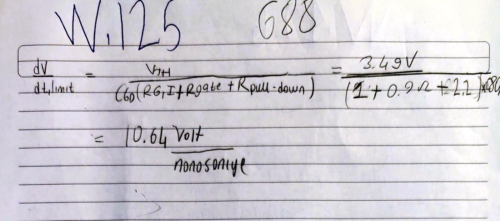

Buradaki not nihai proje dalga sekli veya LTspice sonucu degil; daha cok datasheet parametrelerinden turetilen bir gate `dv/dt` dayanim tahmini. Sayilardan bir kismi kisa yazildigi icin burada ana fikri korumak daha dogru: `C_{GD}` buyudukce ve toplam gate yolu direnci arttikca `dv/dt` davranisi degisiyor. Bu da `5.6.2` altindaki MOSFET secim mantigina dogrudan yariyor.

Defterden aktarilan not (`W.126`):

Burada `W.125`teki `dv/dt` notu daha kaba / hizli bir yaklasimla tekrar yazilmis. Proje-ozel nihai dalga sekli veya kayip hesabi degil; MOSFET gate dugumunde `dv/dt` buyuklugunu sezmek icin yapilmis bir kaynak-not.

Sayfada bu kez daha sade bir iliski yaziliyor:

```math
\left(\frac{dV}{dt}\right)_{N\text{-}limit}
\approx
\frac{V_{TH}}{R_{Gext}\,C_{iss}}
```

Sayfadaki sayisal yerlestirme, okunabildigi kadariyla, su yone cikiyor:

```math
\left(\frac{dV}{dt}\right)_{N\text{-}limit}
\approx
\frac{3.49\,\text{V}}{1\,\Omega \cdot 80\,\text{pF}}
\approx
4.36\times 10^{10}\,\text{V/s}
\approx
43.6\,\text{V/ns}
```

Sayfanin sag tarafindaki kullanici notu da, bunun:

- "epey yuksek bir deger" oldugunu
- ve daha dikkatli / bastirilmis anahtarlama istenirse gate yolu uzerinden yonetilebilecegini

ima ediyor gibi gorunuyor.

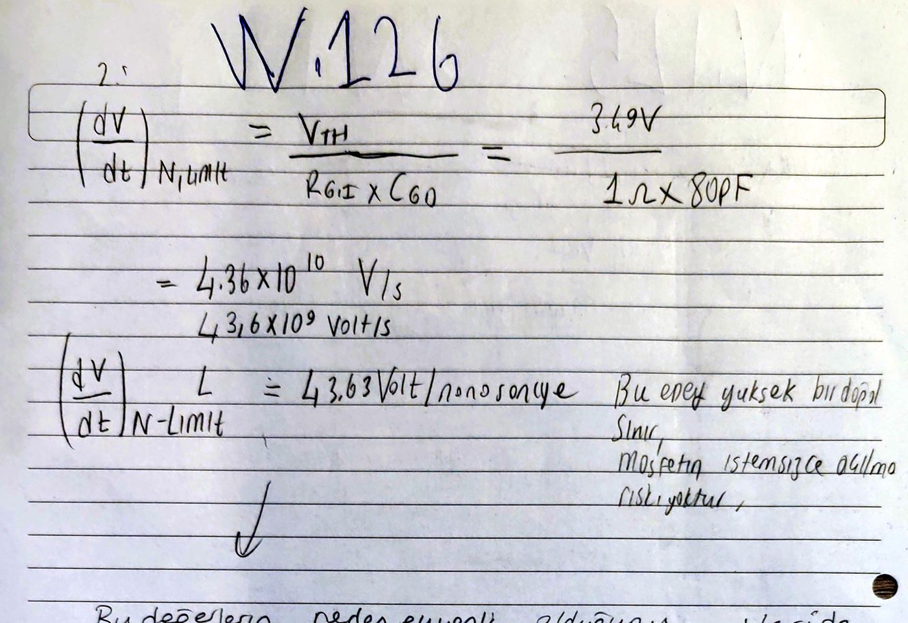

`W.126`, `W.125`teki `C_{GD}` tabanli yaklasima gore daha kaba bir ust-limit notu. Burada kullanilan kapasitenin tam olarak `C_{iss}` mi yoksa benzeri bir giris kapasitansi mi oldugu baglamdan okunuyor; o yuzden sonucu nihai proje sayisi gibi degil, buyukluk mertebesi notu gibi ele almak daha dogru. Buna ragmen gate direnci ile MOSFET kapasitanslarini `dv/dt` uzerinden hizli bir hesapta birlestirmesi guclu.

Defterden aktarilan not (`W.127`):

Burasi, `W.125-W.126` ile ayni `G88` / MOSFET parasitik kapasitans hattinin devami. Ama bu kez odak yalnizca `dv/dt` buyuklugu degil; `C_{GD}` uzerinden gate'e enjekte olan gerilim nedeniyle MOSFET'in istenmeden iletime gecip gecmeyecegini kontrol etmek. O yuzden proje-ozel nihai kayip hesabi degil, Miller etkisi / yanlis tetiklenme sezgisini gosteren bir kaynak-not.

Sayfada once temel kapasitif bolucu iliskisi yaziliyor:

```math
V_{GS} = V_{DS}\,\frac{C_{GD}}{C_{GS}+C_{GD}}
```

Buradan, gate geriliminin esik degeri asilmadan once izin verilebilecek yaklasik `V_{DS}` ust siniri icin su tip bir iliski not edilmis:

```math
V_{DS,\max}
\approx
V_{TH}\,\frac{C_{GS}+C_{GD}}{C_{GD}}
```

Sayfadaki okumaya gore kullanilan ara kapasite notlari sunlar:

- `C_{GD} \approx 80\,\text{pF}`
- `C_{OSS} \approx 700\,\text{pF}`
- `C_{ISS} \approx 1200\,\text{pF}`

ve buradan kullanici su ara ayrimlari not etmis:

```math
C_{DS} = C_{OSS} - C_{GD} \approx 620\,\text{pF}
```

```math
C_{GS} = C_{ISS} - C_{GD} \approx 1120\,\text{pF}
```

Sayfadaki sayisal sonuc da, okunabildigi kadariyla, su yone cikiyor:

```math
V_{DS,\max}
\approx
3.49\,\text{V}\,\frac{1120\,\text{pF}+80\,\text{pF}}{80\,\text{pF}}
\approx
52.35\,\text{V}
```

Sayfanin altindaki kullanici notu, bunun pratikte su soruyu cevaplamak icin kullanildigini gosteriyor:

- MOSFET kapaliyken (`V_{GS} = 0` varsayimina yakin durumda)
- drain dugumundeki hizli hareketler nedeniyle
- cihaz kendi kendine acilip acilmiyor mu?

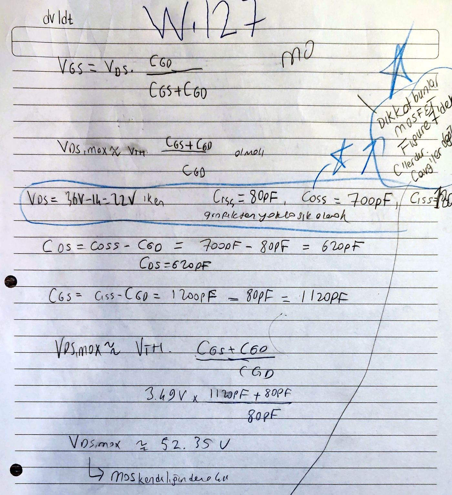

`W.127`, `W.125-W.126` gibi kaynak-not niteliginde; nihai proje dalga sekli ya da LTspice sonucu degil. Yine de cok degerli, cunku parasitik kapasitanslarin yalnizca kayip degil, yanlis tetiklenme riski acisindan da dusunuldugunu gosteriyor. `C_{GD}`, `C_{GS}` ve `V_{TH}` ile kurulan kaba `V_{DS,\max}` siniri, yarim kopru davranisinin gate tarafina nasil baglandigini sezgisel olarak guzel acikliyor.

Defterden aktarilan not (`W.131`):

Burada yine `G88` hattindayiz; ama bu kez sayisal hesap yapmaktan cok `C_{GS}`, `C_{ISS}` ve `C_{GD}` (`Miller`) kavramlari kendi dilinle ozetleniyor. Proje-ozel nihai sonuc sayfasi degil; MOSFET'in gate tarafindaki temel kapasitif davranisi anlamak icin yazilmis kavramsal bir kaynak-not olarak okumak daha dogru.

Sayfada kullanicinin ayirdigi ana fikirler sunlar:

- `C_{GS}`:
  - "sabit kabul edilir"
  - `V_{DS}` veya `V_{GS}`'ye gore buyuk degisim gostermeyen taraf gibi not edilmis
- `C_{GS}` icin ayrica:
  - MOSFET'in kanalini kontrol eden kapasitans oldugu
  - yani gate geriliminin once bu bolumu sarj ettigi
- girise gorulen toplam kapasitansin buyuk kismini olusturdugu da not edilmis:

```math
C_{ISS} = C_{GS} + C_{GD}
```

Sayfanin ortasinda `sonuclari:` diye kisa bir ozet kutusu var. Orada kullanici, `C_{GS}` buyuk veya kucuk oldugunda ne olacagini kendi cümleleriyle soylemis:

- `C_{GS}` buyukse:
  - gate daha yavas tepki verir
  - daha fazla gate charge gerekir
- `C_{GS}` kucukse:
  - anahtarlama daha hizli olabilir
  - ama acma/kapama davranisi daha hassas kontrol ister

Sayfanin alt kisminda ise `C_{GD}` acikca:

- `Miller`

olarak adlandirilmis ve su sezgi yazilmis:

- gate'e uygulanan gerilim degisince, drain uzerindeki gerilim de etkilenir
- ozellikle anahtarlama sirasinda `V_{DS}` sabit kalir gibi gorunen aralik, bu kapasitif etkilerle iliskilidir


`W.131` yeni sayisal proje sonucu vermiyor ama `W.125-W.127`deki `dv/dt`, Miller enjeksiyonu ve yanlis tetiklenme notlarini anlamak icin iyi bir kavramsal zemin sagliyor. Ayni zamanda `W.129-W.130`da kullanilan `C_{GD}`, `C_{GS}` ve `C_{ISS}` degerlerinin neden onemsendigini de geriye donuk olarak daha anlasilir hale getiriyor.

Defterden aktarilan not (`W.133`):

Burada sayisal hesap sayfasindan cok MOSFET secim mantigi kendi dilinle toparlaniyor. Proje-ozel nihai sonuc sayfasi degil; `Qg`, parazitik kapasiteler ve `RDS(on)` arasindaki dengeyi anlatan bir secim notu olarak okumak daha dogru.

Sayfanin ust yarisinda kullanici, MOSFET'in parazitik kapasitelerini kisa bir liste halinde not ediyor:

- `C_{GS}`
- `C_{GD}`
- `C_{DS}`

ve bunlarin anahtarlama davranisini etkiledigini belirtiyor. Ardindan su temel sezgiler yazilmis:

- bu kapasiteler MOSFET'in acilma / kapanma suresini etkiler
- ne kadar buyuklerse MOSFET o kadar yavas anahtarlanir
- hizli anahtarlama istenirse daha dusuk `Q_g` / daha dusuk parazitik yuk tercih edilir
- bu ozellikle yuksek frekansta calisan uygulamalarda daha onemli hale gelir

Sayfanin alt yarisinda kullanici, bu kez `RDS(on)` ile `Q_g` arasindaki dengeyi kisa cumlelerle bagliyor:

- `Q_g` ne kadar buyukse, MOSFET'i acip kapatmak icin o kadar fazla enerji ve zaman gerekir
- ote yandan daha dusuk `RDS(on)` iletim kaybini azaltir
- bu nedenle yalnizca tek bir parametreye bakmak dogru degildir

Sayfada acikca not edilen pratik kural su yone cikiyor:

- `RDS(on)} \times Q_g` turu bir "Figure of Merit" kullanimli olabilir
- bu carpim ne kadar kucukse, genel olarak o kadar iyi bir aday olabilir


`W.133`, `5.6.2` altinda zaten kurulan temel dengeyi kendi dilinle daha acik soyluyor: dusuk `RDS(on)` tek basina yetmez, `Q_g` ve anahtarlama hizi da onemlidir. Bir bakima `W.131`deki kapasitif sezgiyi `W.129-W.130`daki gate-charge notlariyla tek cizgide birlestiriyor.

Defterden aktarilan not (`W.144`):

Burada `W.133`te kisa maddeler halinde toparlanan MOSFET secim mantigi bu kez daha duzgun ve acik bir dille yazilmis. Yeni nihai proje hesabi degil; `RDS(on)`, parazitik kapasiteler, `Q_g` ve `Q_{oss}` arasindaki dengeyi kendi dilinle topladigin bir secim notu olarak okumak daha dogru.

Sayfanin ilk maddesinde temel iletim sezgisi yazilmis:

- `RDS(on)`, MOSFET iletimdeyken drain ile source arasindaki direnc gibi dusunuluyor
- bu deger ne kadar dusukse conduction loss o kadar azalir
- dolayisiyla daha az isinma ve daha iyi verim beklenir

Ikinci maddede ise istenmeyen parazitik kapasiteler hatirlatiliyor:

- `C_{gs}`
- `C_{gd}`
- `C_{ds}`

ve kullanici bunlarin:

- MOSFET'in acilma/kapanma davranisini yavaslatabilecegini
- gecisleri uzatabilecegini
- dolayisiyla switching loss'u etkiledigini

not ediyor.

Ucuncu maddede cok onemli bir trade-off sezgisi var. Kullanici, `RDS(on)`'u dusurmek icin:

- daha buyuk MOSFET yapisina
- dolayisiyla daha buyuk die / daha fazla sigalanmaya

gidildigini not ediyor. Hemen ardindan da bunun yan etkilerini yaziyor:

- daha fazla `Q_g` (`Gate Charge`)
- daha fazla `Q_{oss}` (`Output Charge`)

ve bunun da MOSFET'in hizli `on/off` olmasini zorlastirdigini belirtiyor.

Sayfanin sonundaki kisa ozet, kullanicinin secim mantigini cok net toparliyor:

- dusuk `RDS(on)`:
  - az iletim kaybi
  - ama daha fazla switching kaybi riski
- dusuk `Q_g`, dusuk `Q_{oss}`:
  - daha hizli switching
  - ama daha yuksek iletim kaybi riski

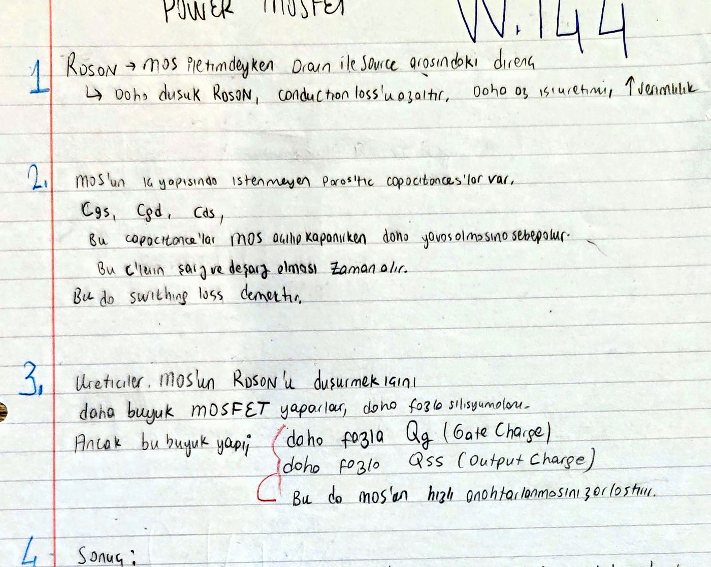

`W.144`, `W.133`teki ayni secim mantigini bu kez daha duz ve savunulabilir cumlelerle topluyor. `RDS(on)` ile `Q_g/Q_{oss}` arasindaki dengeyi sadece formulle degil, dogrudan secim cikarimi seviyesinde yazmis olman guclu. `W.129-W.130`daki gate-charge notlari ile `W.133`teki FoM dusuncesi arasinda da iyi bir kopru kuruyor.

Defterden aktarilan not (`W.145`):

Burada secilen MOSFET icin "hangi datasheet kalemlerine hangi kosulda bakmaliyim?" sorusuna kisa bir kontrol listesi var. Yeni nihai kayip hesabi degil; `5.6.2 Secim mantigi` altinda gercek parca seciminde nelere dikkat edilecegini toparlayan kisa bir defter notu olarak okumak daha dogru.

Sayfanin ilk satirlarinda `RDS(on)` icin iki onemli uyari var:

- `T_C = 125^\circ C` dikkate alinmali
- yani `RDS(on)` mutlaka sicaklikla birlikte okunmali

Hemen altindaki notta da kullandigin surucu baglamina gore:

- `LM5146` gate surucusu gerilimi `7.5 V` civarinda oldugundan
- `RDS(on)` degerine bu `V_{GS}` kosuluna yakin bakilmasi gerektigi

yaziliyor.

Sayfanin orta kisminda `BVDSS` icin kisa bir dayanim kurali not edilmis:

- `BVDSS`: drain-source breakdown voltage
- MOSFET'in drain-source arasinda dayanabildigi gerilim seviyesi
- pratik secim kurali:

```math
BVDSS > 1.25 \times V_{in,\max}
```

Sayfanin alt satirinda ise bir sonraki kontrol kalemi olarak su not dusulmus:

- `Q_g`: gate charge parameters
- ve bunun da

```text
at VGS = 7.5 V
```

kosuluna gore degerlendirilmesi gerektigi belirtilmis.

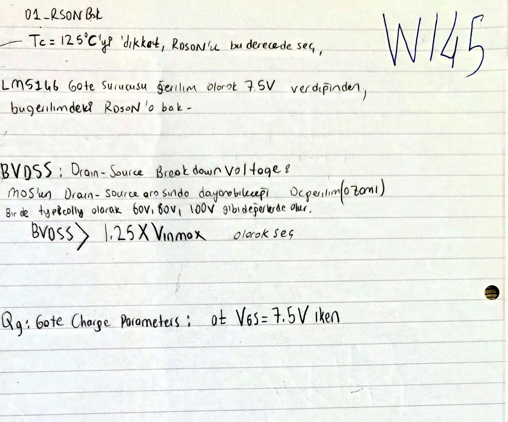

`W.145`, MOSFET seciminde sadece nominal datasheet degerine bakilmadigini acikca gosteriyor. `W.144`teki genel trade-off burada daha uygulanabilir kurallara iniyor: `RDS(on)` icin sicaklik ve `V_{GS} \approx 7.5 V`, `Q_g` icin gercek surme gerilimi, `BVDSS` icin de marjli secim. Kisa ama cok yerinde bir kontrol listesi.

Defterden aktarilan not (`W.151`):

Burada `W.145`te kisa bir secim kurali olarak gecen `BVDSS` maddesi tek basina aciliyor. Yeni bir kayip hesabi degil; `5.6.2 Secim mantigi` altinda secilen MOSFET'in drain-source dayaniminin neden onemli oldugunu toparlayan bir uygulama notu olarak okumak daha dogru.

Sayfanin ustunde konu acikca:

- `BVDSS drain-source voltage`

olarak yazilmis.

Hemen altindaki tanimda kullanici, `BVDSS`'i su sekilde ozetliyor:

- MOSFET'in drain ile source arasinda dayanabilecegi en yuksek gerilim

ve bunun asilmasi durumunda cihazin bozulabilecegini not ediyor.

Sayfanin ortasinda, `V_{in,\max} = 36 V` baglaminda marjli secim gerektigine dair kisa bir not var. El yazisinin bu kismindaki tam ifade cok net degil; ancak korunmasi gereken guvenli fikir sunlar:

- `V_{in,\max} = 36 V` icin yalnizca sinira yakin bir `BVDSS` secmek yeterli gorulmuyor
- marjli / guvenli secim hedefleniyor

Sayfanin en net son cümlesi ise secilen parcaya dair:

```text
Bizim MOS'un BVDSS'i = 100 V
```

notudur.

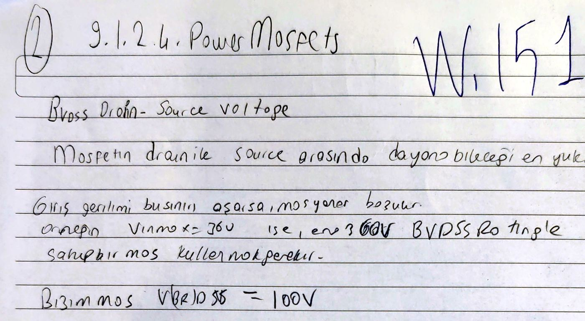

`W.151`, `W.145`teki genel `BVDSS` kuralini bu kez secilen parcaya bagliyor. En degerli tarafi da burada: `36 V` ust sinira bakip "sinirda degil, marjli sec" diye dusundugun acikca goruluyor. Aradaki bazi el yazilari tam net degil ama `100 V` sonucunun niyeti yeterince acik.

Defterden aktarilan not (`W.146`):

Burada `W.145`te "datasheet'i hangi kosulda okuyacagim?" diye yazilan kural secilen MOSFET uzerinde uygulanmis. Yeni bir secim mantigi notundan cok, secilen parca icin gercek `RDS(on)` degerinin proje kosullarina nasil tasindigini gosteren bir uygulama sayfasi olarak okumak daha dogru.

Sayfanin ust satirinda yine su vurgu korunmus:

- `RDS(on) @ VGS = 7.5 V`

ve kullanici, `LM5146` ile uyumlu, verimli bir MOSFET secmek icin bu kosulda deger okunmasi gerektigini tekrar hatirlatiyor.

Devaminda "neden onemli?" diye kisa bir aciklama var:

- bu direnc ne kadar buyukse MOSFET acikken iletim kaybi da o kadar buyuk olur
- sonuc olarak:
  - daha fazla isinma
  - daha yuksek kayip

Sayfanin orta kisminda, secilen MOSFET icin datasheet grafikten alinan ilk deger not edilmis:

```text
VGS = 7.5 V icin
RDS(on) \approx 15 m\Omega
```


Ancak kullanici hemen altta bunun:

- `Tj = 25^\circ C` icin gecerli oldugunu
- gercek MOSFET jonksiyon sicakliginin daha yuksek olabilecegini

not ediyor.

Ardindan, sicakliga gore normalize edilmis grafik kullanilarak yaklasik bir carpim uygulanmis:

- `Tj = 75^\circ C` civari icin katsayi `\approx 1.35`


ve buradan su duzeltilmis deger cikarilmis:

```math
R_{DS(on)}(75^\circ C)

\approx
15\,m\Omega \times 1.35

=
20.25\,m\Omega
```

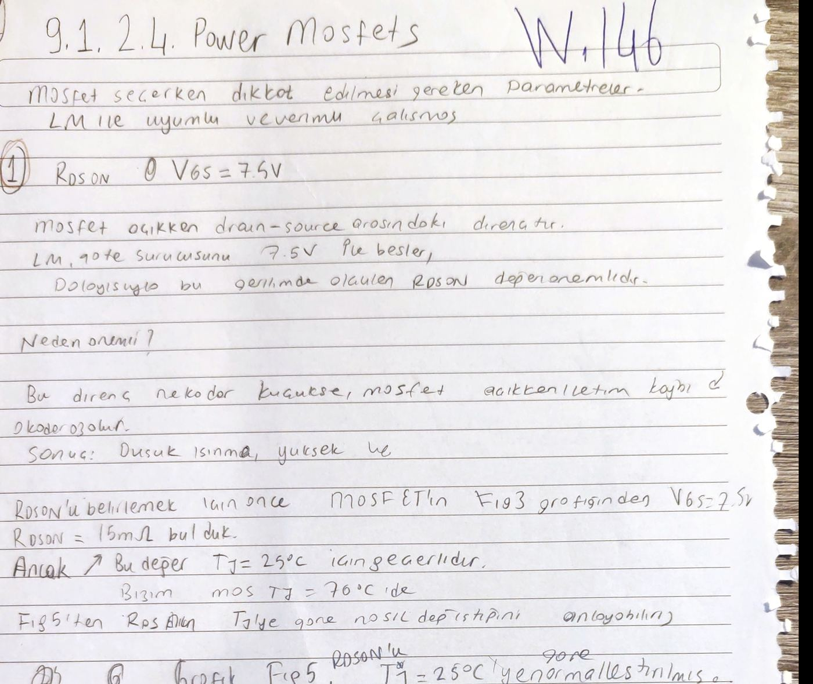

`W.146`, `W.145`te yazilan "sicaklik ve gercek gate-drive kosulunda bak" kuralinin dogrudan uygulanmis hali. Artik `RDS(on)` icin datasheet'in tek nominal sayisi degil, proje jonksiyon sicakligina uyarlanmis deger kullaniliyor. `15 m\Omega -> 20.25 m\Omega` gecisi de tam olarak bunu gosteriyor; secim mantigi ile iletim kaybi hesabi burada birbirine baglaniyor.

Bu iki ekran goruntusu, `W.146` tarafindaki `15 m\Omega @ 7.5 V` ve `1.35` katsayisi notlarinin tam olarak hangi datasheet egirilerinden okundugunu gosteriyor. Boylece `20.25 m\Omega` iletim-kaybi girdisinin ezbere degil, iki farkli grafikten okunup birlestirilerek elde edildigi daha acik hale geliyor.

Defterden aktarilan not (`W.147`):

Burada MOSFET'in acilma sureci zaman araliklarina ayriliyor. Yeni bir nihai proje hesabi degil; `turn-on delay`, `V_{GS(th)}` ve Miller bolgesi sezgisini kuran iyi bir defter sayfasi.

Sayfanin ustunde acikca su not var:

- `MOSFET Gate Driver Turn-on Procedure 4 intervalden olusur`

ve bu sayfada bu araliklarin ilk ikisine giris yapiliyor.

Birinci aralik icin kullanici su notlari dusmus:

- `0 V`'tan `Vthreshold`'a yukseltilir
- bu sirada:
  - gate akimi once `C_{GS}`'yi doldurur
  - dolum islemi tamamen bitmis degildir
  - gate gerilimi artar
- az bir kism da `C_{GD}` kapasitörüne akar
- bunun drain gerilimini bir miktar azaltabilecegi not edilmis

Sayfanin altina da bu periyot icin:

- `turn-on delay` denir

notu dusulmus. Kullanici ayrica, bu aralikta:

- hem drain akimi
- hem drain gerilimi

degismeden kalir

fikrini not ediyor.

Ikinci araliga giriste ise su baslik yazilmis:

- `Vthreshold - VGS,miller arasi`

ve hemen yanina, MOSFET'in artik:

- threshold seviyesine geldigi
- akim tasimaya hazir oldugu

not edilmis.

Sayfadaki kullanilan basili sekiller:

- `PWM Generator`
- `Compensation Network`
- `Error Amplifier`
- `Switch`
- `Filter / Load`

gibi bloklarla, bu turn-on yorumunun yarim kopru / PWM / kompanzasyon baglaminda dusunuldugunu gosteriyor.

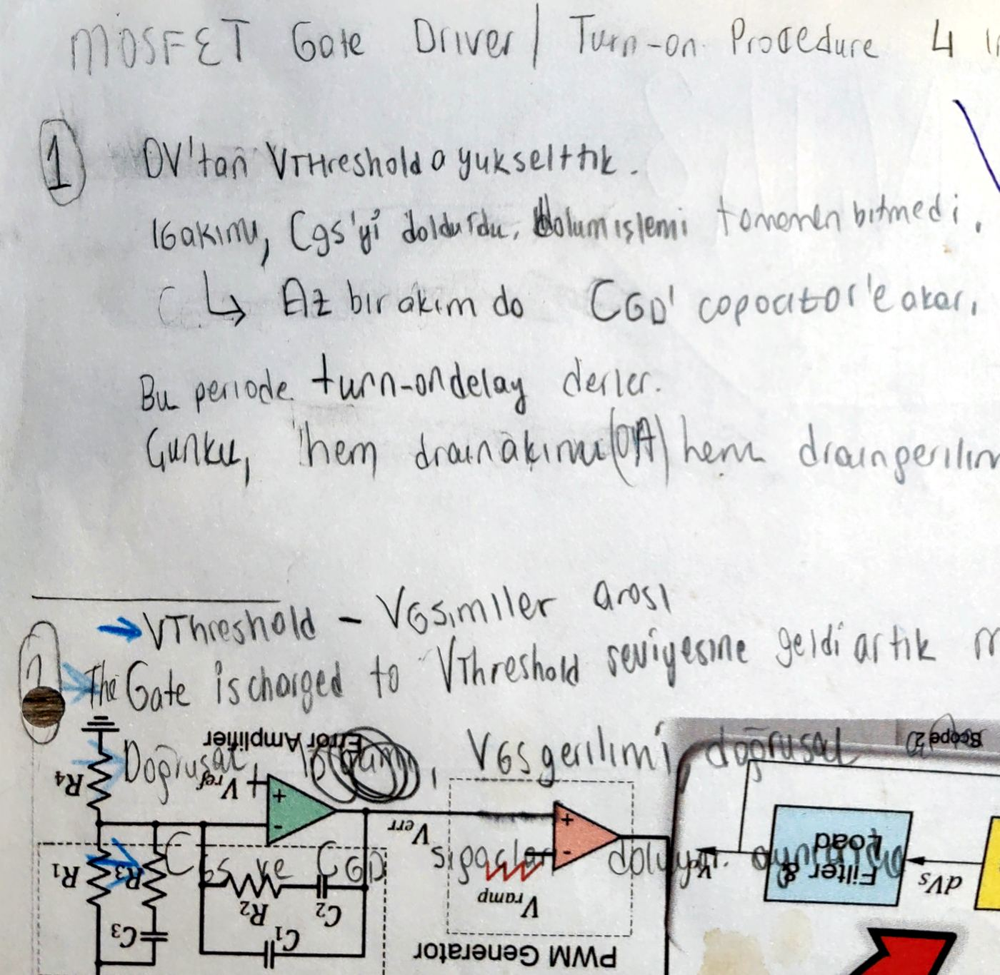

Burada yeni sayisal kayip sonucu yok; asil degeri `W.128-W.132`deki `V_{GS(th)}`, `Miller plateau`, `Q_g` ve `C_{GD}` notlarini fiziksel zaman-akisi icine oturtmasi. Ozellikle switching-loss hesabinda gerekli olan "hangi aralikta akim degisiyor, hangi aralikta gerilim dusuyor?" sorularina kavramsal zemin hazirliyor.

Defterden aktarilan not (`W.148`):

Burada `W.147`te yaziyla anlatilan MOSFET `turn-on` araliklari bu kez zaman ekseninde dalga sekilleriyle gosteriliyor. Yeni bir nihai proje hesabi degil; `V_G`, drain gerilimi ve drain akiminin turn-on sirasindaki goreli degisimini gosteren gorsel bir defter sayfasi.

Sayfanin ust tarafinda gate gerilimi `V_G` cizilmis ve zaman ekseni `t_0`, `t_1`, `t_2`, `t_3`, `t_4` gibi bolunmus. Buradaki ana sekil su:

- `t_0 -> t_1`:
  - gate gerilimi sifirdan esik gerilimine dogru yukseliyor
- `t_1 -> t_2`:
  - `Q_{gs}` bolgesi not edilmis
- `t_2 -> t_3`:
  - `Q_{gd}` / Miller bolgesi not edilmis
- `t_3 -> t_4`:
  - gate gerilimi tekrar yukselerek son surme seviyesine cikiyor

Sayfanin alt kisminda ise ayni zaman ekseninde uc farkli buyukluk birlikte cizilmis:

- `drain voltage`
- `drain current`
- gate geriliminin kesisim/notlari

Sayfadaki cizime gore korunmasi gereken ana sezgiler sunlar:

- `V_G`, `V_{TH}`'yi astiginda MOSFET akim almaya baslar
- `t_2` civarindan sonra drain-source gerilimi dusmeye baslar
- bu aralikta gate yukunun onemli bir kismi `C_{gd}` / Miller bolgesine gider
- `C_{gd}` dolunca, drain gerilimi neredeyse `0 V` olur
- devaminda gate gerilimi son surme degerine kadar yukselir

Sayfanin alt satirindaki kullanici notu da bunu kisa cumleyle toparliyor:

- `Vg` gerilimi `VTH`'yi asinca `Id` akmaya basliyor
- `t_2`'den sonra `V_D` dusuyor
- bu sira gate yukunun bir kismi `Cgd` dolumuna gidiyor
- `Cgd` dolunca `V_D = 0 V` oluyor

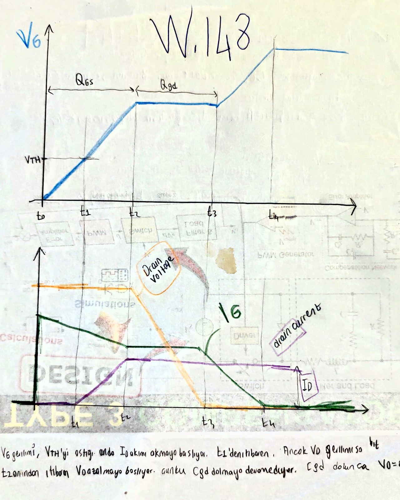

Burada yeni sayisal kayip sonucu yok; ama `W.147`te yazili kalan turn-on araliklari artik somut dalga sekilleriyle destekleniyor. Ozellikle switching-loss hesabinda kritik olan "akim ne zaman yukseliyor, gerilim ne zaman dusuyor, Miller bolgesi hangi aralik?" sorularini gorsel olarak cok iyi cevapliyor. `Q_{gs}` ve `Q_{gd}` etiketlerinin ayni sekilde gate dalga seklinin uzerine yazilmis olmasi da `W.129-W.130`daki gate-charge sayilariyla guzel bag kuruyor.

Defterden aktarilan not (`W.149`):

Burada TI kaynagindaki `MOSFET's Vpl and Vgs(th) Estimation` sayfasinin uzerine alinmis notlar var. Yeni bir proje sonucu degil; `W.124`, `W.128`, `W.147` ve `W.148` ile ayni zincirde, `V_{PL}`, `V_{GS(th)}` ve turn-on interval yorumuna kaynaklik eden referans sayfa gibi.

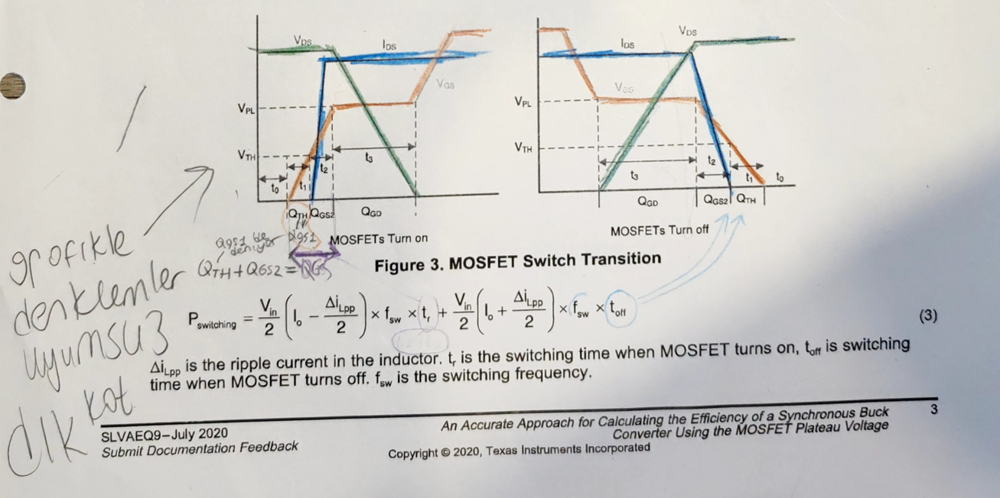

G81 Figure 3. MOSFET Switch Transition

Ek waveform notu:


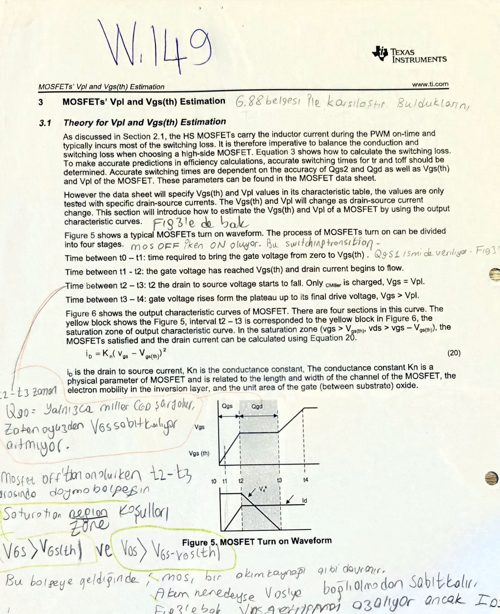

Sayfadaki basili bolumde:

- `MOSFET's Vpl and Vgs(th) Estimation`
- `Theory for Vpl and Vgs(th) Estimation`
- ve tipik `MOSFET turn on waveform`

ayni yerde gorunuyor. Kullanici da bunun uzerine kisa teknik notlar dusmus.

Korunmasi gereken ana fikirler sunlar:

- `t_1 - t_2` araliginda:
  - MOSFET artik threshold seviyesini gecmistir
  - akim tasimaya baslar
  - bu bolge doygunluk / saturation kosullari ile birlikte dusunulmustur

Sayfada isaretlenen saturation kosullari:

```math
V_{GS} > V_{GS(th)}
\quad \text{ve} \quad
V_{DS} > V_{GS} - V_{GS(th)}
```

- kullanici notuna gore `t_2 - t_3` araliginda:
  - yalniz Miller `C_{gd}` sarjlanir
  - bu nedenle `V_{GS}` neredeyse sabit kalir
  - buna karsilik `V_{DS}` hizla duser

Sayfaya dusulen kisa notlardan biri de bu yorumu acikca destekliyor:

- "yalniz Miller `Cgd` sarjlanir"
- "zaman cizgisinde `Vgs` sabit kaliyor"

Sayfanin altindaki notta ayrica su yonlendirme var:

- `Fig. 5'te bak`

Bu da, kullanicinin `W.147-W.148`te kendi cizimiyle anlattigi turn-on surecini dogrudan kaynak sekille eslestirdigini gosteriyor.

Burada yeni sayisal proje sonucu yok; ama `W.147-W.148`te kendi dilinle anlattigin turn-on dalga sekillerinin kaynak dayanak sayfasi var. Ayni zamanda `W.128`te cikarilmaya calisilan `V_{GS(th)}` ve `V_{PL}` parametrelerinin fiziksel anlamini da turn-on araliklari uzerinden bagliyor.

Defterden aktarilan not (`W.210`):

Burada ayni `G81` kaynak zincirinde `Figure 2` ve `Figure 3` birlikte gorunuyor. Yeni bir proje sonucu degil; toplam MOSFET kayip butcesinin ana kalemlerini ve `MOSFET Switch Transition` sekline giden baglami ayni yerde gosteriyor.

Sayfanin ust kisminda acikca:

- `Figure 2. Power Losses of Synchronous Buck Converter`

sekli gorunuyor. Bu sekil uzerinde kullanici mavi ile bazi kayip bolgelerini isaretlemis. Basili metinde de iki MOSFET'in kayiplari su ana siniflara ayriliyor:

- `switching/conduction loss`
- `gate drive loss`
- `output capacitance loss`
- `LS MOSFET body-diode loss`

Bu, daha sonra `W.191-W.200` arasinda tek tek hesapladigin kayip kalemlerinin kaynaktaki ust siniflandirmasini gosteriyor.

Sayfanin alt kisminda ise:

- `Figure 3. MOSFET Switch Transition`

sekli tekrar yer aliyor. Bu da `W.149` ve `W.162`de ayrintili yorumlanan `turn-on / turn-off` zaman araliklarinin, kayip hesabindaki dogrudan kaynagini tekrar gorunur yapiyor.

Kullanicinin sayfa ustune dusulen en degerli notlardan biri:

- `grafikte denklemler uyumsuz kalmasin`

yonunde. Bu da sekli, denklem ve fiziksel yorumun birbiriyle tutarli okunmasi gerektigini kendi notlarinla vurguladigini gosteriyor.

Sayfada Equation `(3)` de gorunuyor; bu, `switching loss` hesabinda:

- `V_{in}`
- `I_0 \pm \Delta i_{Lpp}/2`
- `t_r`, `t_{off}`
- `f_{sw}`

gibi buyukluklerin birlikte kullanildigi genel formun kaynak tarafini gosteriyor.

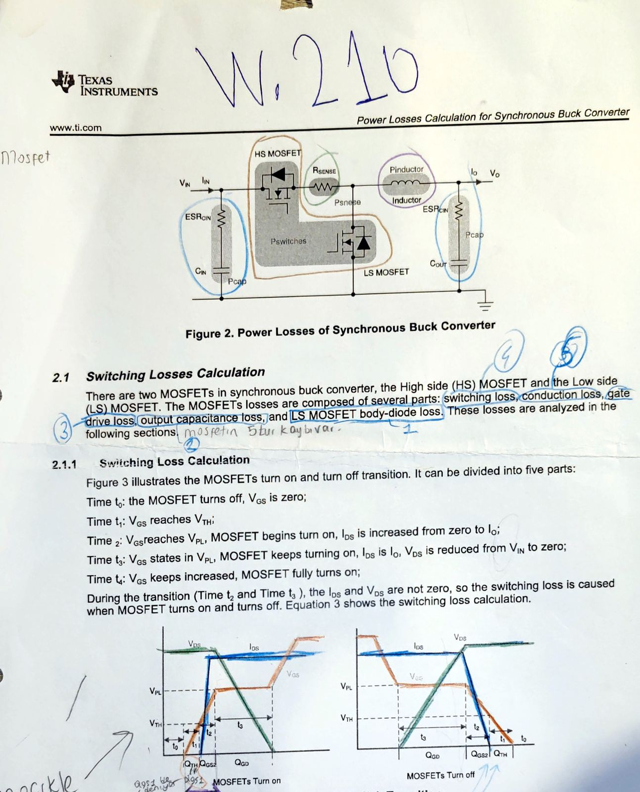

`W.210`, `W.149`teki `Figure 3` kaynagini daha genis bir baglama oturtuyor; yani yalniz dalga sekli degil, onun hangi toplam kayip butcesinin parcasi oldugunu da gosteriyor. Ayni zamanda `W.150`de daha sonra gorecegimiz conduction/switching ayirimina dogru dogal bir kopru olusturuyor. Yeni sayisal sonuc yok; ama `switching`, `conduction`, `gate-drive`, `Coss` ve `body-diode` kayiplari diye ayirdigin zincirin kaynaktaki ust haritasini gosterdigi icin degerli.

Defterden aktarilan not (`W.162`):

Burada `W.149`daki kaynak sekil bu kez kendi cumlelerinle adim adim yorumlaniyor. Yeni bir nihai hesap sayfasi degil; `G81 Fig.3` uzerinden `t_0-t_4` interval yorumunu kendi diliyle anlatan bir defter sayfasi.

Sayfanin basliginda acikca:

- `G81 Fig 3, oku`

gibi bir not var. Bu da sayfanin dogrudan kaynak sekli okuyup anlamlandirma amaciyla yazildigini gosteriyor.

Sayfada zaman araliklari tek tek yorumlanmis:

1. `t_0`

- MOSFET `OFF` durumdadir
- `V_{GS}` de `0 V` tarafindadir

2. `t_1`

- `V_{GS}` `0 V`'tan artmaya baslar
- `V_{GS} = V_{TH}` seviyesine ulasana kadar gider
- bu sirada `V_{DS}` yuksektir
- yani MOSFET halen bloklama / `OFF` durumundadir
- kullanici ayrica, `I_D` akisinin bu surecin sonuna dogru baslayacagini not etmis

3. `t_2`

- `V_{GS}` artik `V_{TH}` seviyesini asmaktadir
- `V_{PL}` seviyesine ulasma sureci vardir
- burada `I_D`'nin `0 A`'den artmaya basladigi yazilmis
- yuk toplami icin:
  - `Q_{TH} + Q_{GS2}`

notu da dusulmus

4. `t_2 - t_3`

- `V_{GS}` birsüre sabit kalir
- `V_{PLAT}`'da sabit kalir
- `Q_{GD}` sarj olur
- kullanici acikca:
  - switching loss'un bu bolgede oldugunu
  - bu surede akim sabitken gerilimin duştugunu
  - `t_3` sonunda `V_D`'nin `0 V`'a indigini

not ediyor

5. `t_4`

- `V_{GS}` gerilimi `V_{PLAT}`'dan oteliso / ileri gider
- biraz daha arttirilir
- MOSFET fully turns on yapar

Sayfanin sol kenarindaki kisa not da onemli:

- `Qgd` ve `246.62 pC` benzeri onceki sayfadan gelen deger

Bu da, `W.161`de sorgulanan Miller charge buyuklugunun burada zaman araligina baglandigini gosteriyor.


Burada yeni sayisal proje sonucu yok; ama `W.147-W.148`te daha cizgisel anlatilan turn-on sureci bu kez kaynak sekle bakilarak kelime kelime aciklaniyor. Ozellikle "switching loss bu bolgede olur" notu degerli; cunku `Q_{GD}` ile `V_{DS}` dususu arasindaki fiziksel bag acikca kuruluyor.

Defterden aktarilan not (`W.157`):

Burada `W.149`daki `Vpl` konusunun daha uygulamali devami var. Yeni proje hesabi degil; `Vpl`'in tablolu hesaplayici ve olculen `Vgs` dalga sekliyle nasil dogrulanabilecegini gosteren kaynak sayfa gibi.

Sayfanin ust tarafinda TI tarafindan verilen `Vpl Calculator` tablosu gorunuyor. Tabloda, MOSFET datasheet'inden alinan bazi buyukluklerle `Vplateau` hesaplaniyor. Guvenle okunabilen tablo kalemleri sunlar:

- `Vgs1`
- `Id1`
- `Vgs2`
- `Id2`
- `Ids`

ve tablonun sonuc satirinda:

- `Kn`
- `Vgsth`
- `Vplateau`

degerleri veriliyor.

Sayfadaki basili ornek tabloda, okunabildigi kadariyla, su ornek sonuc goruluyor:

- `Vgsth \approx 3.72 V`
- `Vplateau \approx 4.58 V`

Sayfanin orta ve alt kisimlarinda ise `Vgs waveform` olcumleri ve hesapla karsilastirma tablosu bulunuyor. Buradaki ana fikir:

- `Ids = 10 A` ve `Ids = 20 A` gibi iki farkli akim seviyesinde
- `Vplateau` olculuyor
- sonra hesaplanan `Vpl` ile karsilastiriliyor

Alt tablodaki karsilastirma da, okunabildigi kadariyla, su yone cikiyor:

- `Ids = 10 A` icin:
  - olculen `Vplateau \approx 5.22 V`
  - hesaplanan `Vpl \approx 4.58 V`
- `Ids = 20 A` icin:
  - olculen `Vplateau \approx 5.30 V`
  - hesaplanan `Vpl \approx 4.94 V`

Kullanicinin sayfa ustune dustugu en degerli notlardan biri su:

- `Deneyde dogrulama yap`
- `Sen de yapacaksin`
- `Neyi hesapladigini VPL'nin ne derecede oldugunu ...`

Bu not, `Vpl` hesabinin salt kagit uzerinde bir ara parametre olarak kalmamasi, olculen dalga seklinden de kontrol edilmesi gerektigi dusuncesini acikca gosteriyor.

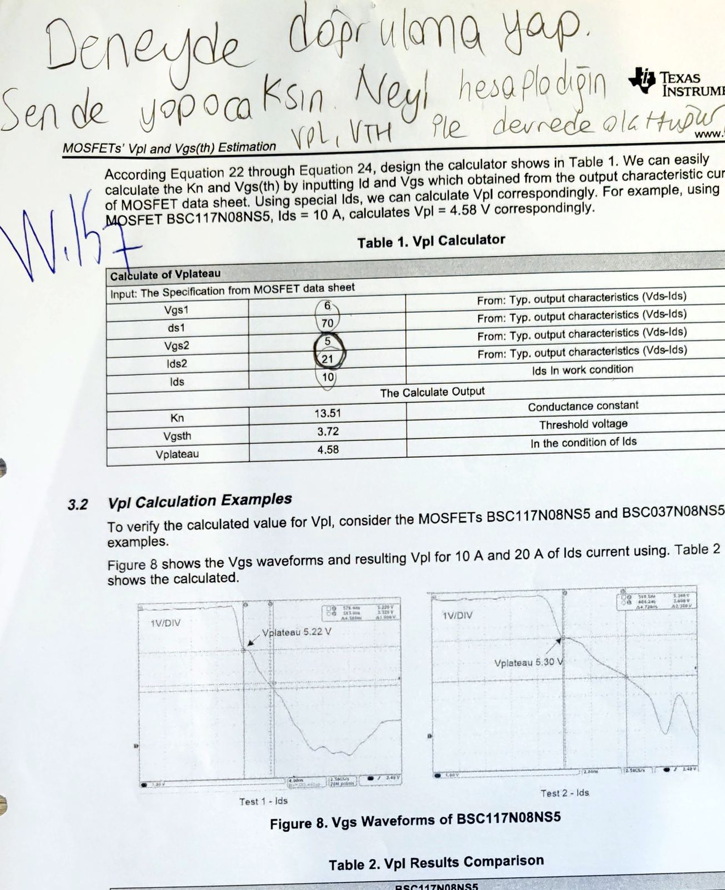

Burada yeni sayisal proje sonucu yok; ama `W.128` ve `W.149`daki `V_{GS(th)}` / `V_{PL}` hesabinin deneysel dogrulama fikriyle baglandigi cok degerli bir kaynak sayfasi var. Ayrica notun, ileride kendi tasariminda da `Vpl`'i olcumle karsilastirma niyetini gosterdigi icin tasarim sureci acisindan ayri bir anlam tasiyor.

Defterden aktarilan not (`W.158`):

Burada `W.157`teki `Vpl Calculator` ve olcum karsilastirmasinin hemen altindaki cebirsel/metodik arka plan var. Yeni proje sonucu degil; `5.6.3 Ilk kayip notlari` altinda output-characteristic egrisinden `V_{GS(th)}`, `K_n` ve `V_{PL}` cikarma yontemini gosteren bir kaynak-defter sayfasi olarak okumak daha dogru.

Sayfanin basili kisminda su iki sekil var:

- `Figure 6. Output Characteristic Curves`
- `Figure 7. Output Characteristic Curve`

Bu sekillerin altinda, MOSFET'in output-characteristic egrisinden iki farkli nokta secilerek once `V_{GS(th)}` ve `K_n`, sonra da belirli bir `I_D` icin `V_{PL}` tahmini yapiliyor.

Sayfadaki basili denklem zincirinden guvenle korunmasi gereken ana fikirler sunlar:

```math
I_{D1} = K_n \left(V_{gs1} - V_{gs(th)}\right)^2
```

```math
I_{D2} = K_n \left(V_{gs2} - V_{gs(th)}\right)^2
```

Buradan:

```math
V_{gs(th)}
\approx
V_{gs1}
\times
\frac{\sqrt{I_{D2}/I_{D1}} - V_{gs2}/V_{gs1}}
\sqrt{I_{D2}/I_{D1}} - 1
```

benzeri bir ara ifade ile `V_{GS(th)}` elde ediliyor; ardindan:

```math
K_n
\approx
\left(
\frac{\sqrt{I_{D1}} - \sqrt{I_{D2}}}
{V_{gs1} - V_{gs2}}
\right)^2
```

ve son olarak:

```math
V_{PL}
=
\sqrt{\frac{I_D}{K_n}} + V_{gs(th)}
```

Sayfa uzerindeki kullanici yerlestirmesinde, okunabildigi kadariyla, su ara sonuclar not edilmis:

- `V_{GS(th)} \approx 1.12 V`
- `K_n \approx 5.1649`
- `V_{PL} \approx 2.44 V`

Sayfanin ustundeki kullanici notunda ayrica su fikirler yazili:

- `I_D = 123 A`, `V_{GS1} = 6 V`, `V_{DS} = 3 V`
- diger nokta icin `I_D = 59 A`, `V_{DS} = 3 V`, `V_{GS2} = 4.5 V`

ve bunlarin `Figure 6/7` uzerinden secildigi anlasiliyor.


Bu notlu ekran goruntusu, `W.158` ve daha sonra `W.174-W.175` tarafinda yapilan iki-nokta seciminin nasil dusunuldugunu cok daha somut hale getiriyor. Uzerine dusulen `I_{D1} \approx 123 A` / `V_{GS1} = 6 V` ve `I_{D2} \approx 59 A` / `V_{GS2} = 4.5 V` notlari, `K_n`, `V_{GS(th)}` ve ardindan `V_{PL}` tahmini icin ayni output-characteristic mantiginin tekrar tekrar kullanildigini gosteren guclu bir ara gorseldir.

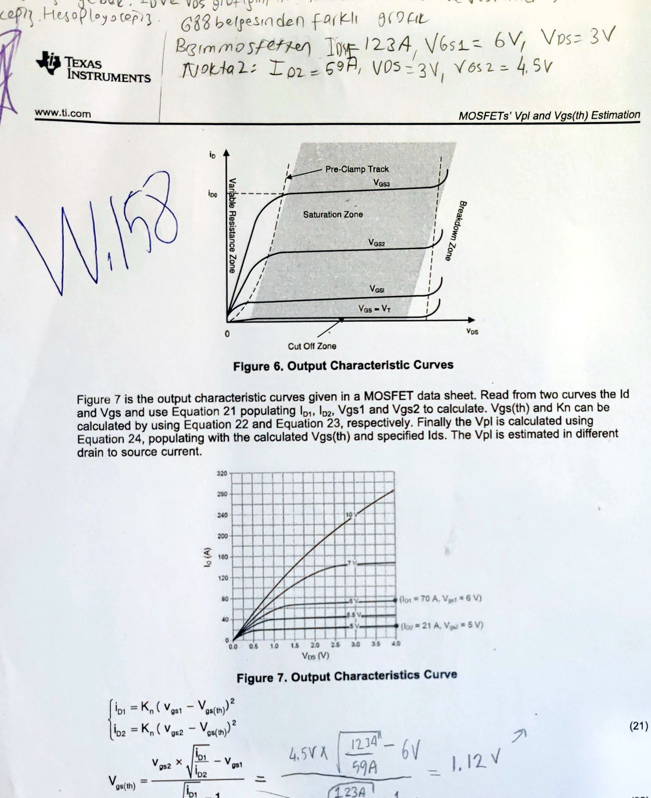

`W.158` yeni proje sonucu vermiyor; asil yaptigi is, `W.157`te tablolu gosterilen `V_{PL}` hesaplayicisinin `I_D-V_{GS}` / output-characteristic egrileri uzerinden nasil kuruldugunu gostermek. Buradaki sayilar secilen MOSFET'ten cok kaynak ornek MOSFET'e ait olabilir; o yuzden nihai proje degeri diye degil, yontemin gosterimi diye bakmak daha dogru. Buna ragmen `V_{GS(th)}`, `K_n` ve `V_{PL}` zincirinin matematik iskeletini deftere tasidigi icin degerli.

Defterden aktarilan not (`W.150`):

Burada ayni kaynak ailesi icinde conduction-loss ve switching-loss tarafi ayni sayfada gorunuyor. Yeni bir nihai proje hesabi degil; `5.6.3 Ilk kayip notlari` altinda MOSFET kayip butcesinin iki ana kolunu ayni yerde gosteren bir kaynak-defter sayfasi olarak okumak daha dogru.

Sayfadaki basili sekillerden guvenle okunabilen ana kisimlar sunlar:

- `Figure 4. MOSFET conduction losses`
- `Figure 5. MOSFET switching losses`

Yani bu sayfa, bir tarafta iletim kaybini, diger tarafta ise gate-charge / turn-on dalga sekliyle iliskili switching kaybini ayni baglamda veriyor.

Kullanicinin sayfa uzerine dustugu notlardan korunmasi gereken guvenli fikirler sunlar:

- conduction-loss tarafi icin:
  - secilen MOSFET'in `RDS(on)` degeri kritik
  - bu deger onceki sayfalarda oldugu gibi gercek `VGS` ve sicaklik kosuluna gore okunmali
- switching-loss tarafi icin:
  - `V_{PLAT}`
  - `V_{GS(th)}`
  - `Q_{gs}`, `Q_{gd}`, `Q_g(total)`

gibi buyuklukler tekrar isaretlenmis.

Sayfadaki el notlarindan biri, gercek surme baglamini tekrar hatirlatiyor:

- "LM ile `VGSactual \approx 7.5 V`"

Bu da, burada gorulen gate-charge ve dalga sekli bilgilerinin dogrudan datasheet'in varsayilan `10 V` surme kosuluna degil, projedeki gercek surme kosuluna gore yorumlanmak istendigini gosteriyor.

Sayfanin en degerli tarafi su:

- `W.146` ile `RDS(on)` tarafi gercek kosula tasinmisti
- `W.147-W.149` ile `turn-on`, `Miller`, `V_{PL}` ve `V_{GS(th)}` tarafi kurulmustu
- bu sayfa ise bu iki hattin aslinda ayni "MOSFET kayip butcesi" icinde birlikte dusunuldugunu gosteriyor

Burada yeni sayisal proje sonucu yok; ama conduction loss ile switching loss'un ayni kaynakta nasil ayrildigini ve baglandigini gosteriyor. Ayrica `W.145-W.146`deki `RDS(on)` okuma mantigi ile `W.147-W.149`daki gate-charge / turn-on waveform mantigini tek sayfada bulusturdugu icin degerli. Ince el notlarin bir kismi tam okunmasa da, guvenle okunan kavramsal bag gayet yeterli.

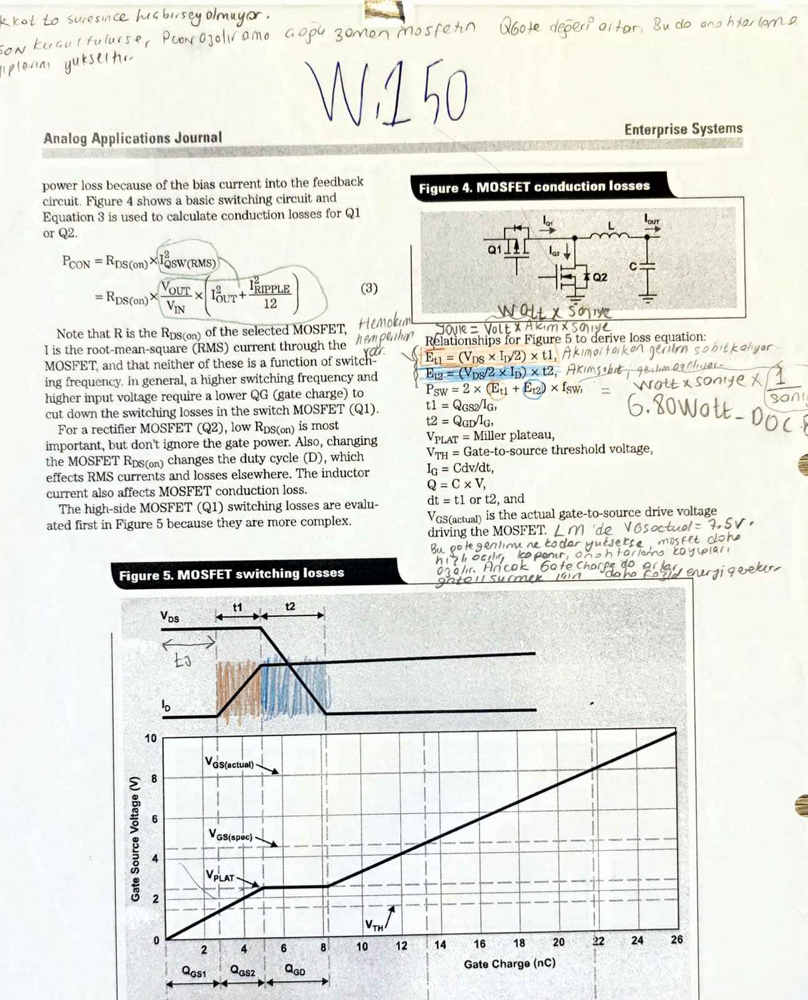

Defterden aktarilan not (`W.152`):

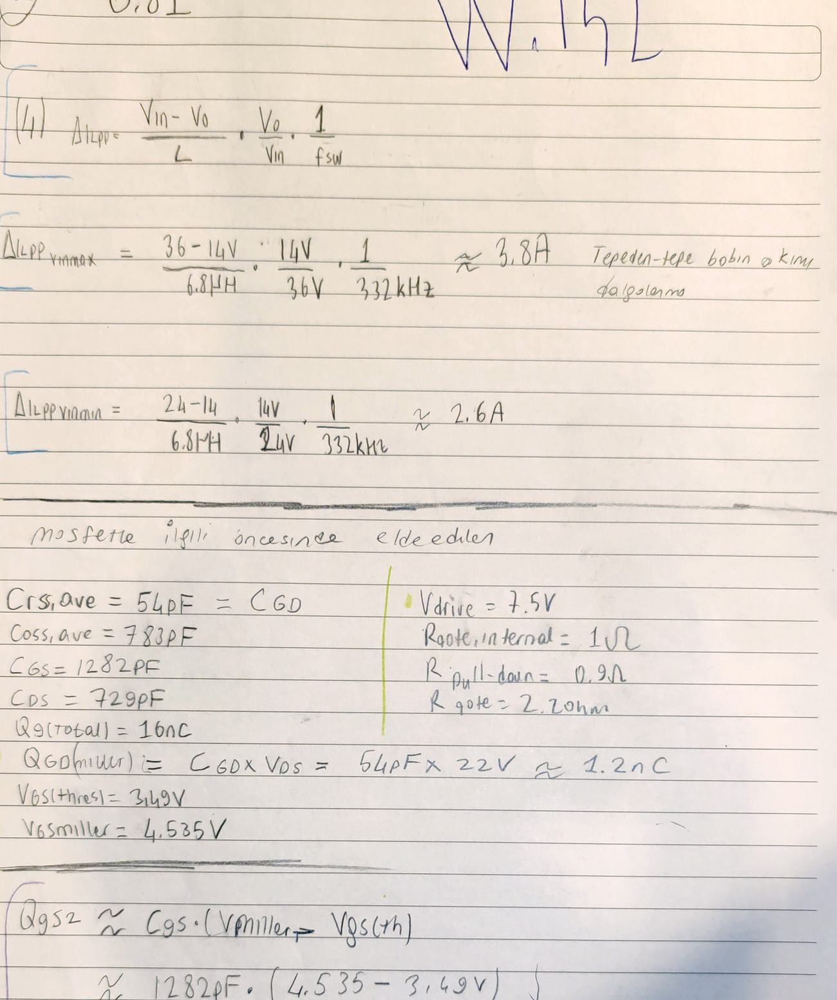

Burada `G81` hattinda switching-loss hesabina girecek bircok ara parametre tek yerde toplanmis. Yeni nihai kayip sonucu degil; onceki sayfalardan elde edilen buyuklukleri bir araya getirip sonraki hesap adimina hazirliyor.

Sayfanin ust kisminda once bobin akim dalgalanmasi tekrar yaziliyor:

```math
\Delta i_L

=

\frac{V_{in}-V_o}{L}
\cdot
\frac{V_o}{V_{in}}
\cdot
\frac{1}{f_{sw}}
```

ve iki kosul icin yaklasik sayisal sonuclar not edilmis:

- `V_{in} = 36 V` tarafinda:
  - `\Delta i_{L,\max} \approx 3.8 A`
- `V_{in} = 24 V` tarafinda:
  - `\Delta i_{L,\min} \approx 2.6 A`

Bu, daha onceki bobin/ripple sayfalariyla uyumlu bir tekrar-toparlama gibi duruyor.

Sayfanin orta kisminda ise, onceki MOSFET sayfalarindan gelen parasitik ve charge buyuklukleri yeniden listelenmis:

- `C_{rss,ave} \approx 54 pF \approx C_{GD}`
- `C_{oss,ave} \approx 783 pF`
- `C_{GS} \approx 1282 pF`
- `C_{DS} \approx 729 pF`
- `Q_{gs(total)} \approx 16 nC`

Sag tarafta gercek surme baglamini hatirlatan notlar var:

- `V_{driver} = 7.5 V`
- gate yolu direncine iliskin bazi ara degerler not edilmis

Bu kisimdaki tum rakamlar tam net olmasa da, ana fikir acik:

- `G81/G88` hesaplarinda kullanilacak surme ve parasitik buyuklukler tek bir sayfada toparlaniyor

Sayfanin alt kisminda `Q_{gd}` icin tekrar kaba charge iliskisi yaziliyor:

```math
Q_{gd}
\approx
C_{GD}\,V_{DS}
\approx
54\,\text{pF} \times 22\,\text{V}
\approx
1.2\,\text{nC}
```

Ardindan esik ve plateau gerilimleri tekrar not edilmis:

- `V_{GS(th)} \approx 3.49 V`
- `V_{GS,miller} \approx 4.535 V`

ve bunlardan hareketle altta `Q_{gs2}` benzeri bir ara buyukluk hesaplanmis:

```math
Q_{gs2}
\approx
C_{GS}\,\left(V_{miller} - V_{GS(th)}\right)
```

Sayfadaki sayisal sonuc, okunabildigi kadariyla, yaklasik:

```math
Q_{gs2} \approx 1.34\,\text{nC}
```

Bu sayfa yeni nihai kayip sonucu vermiyor; ama `W.129-W.130`daki `C_{GD}`, `C_{GS}`, `C_{DS}` ve `Q_{gd}` notlarini, `W.147-W.149`daki `V_{GS(th)}` / Miller waveform sezgisiyle birlestiriyor. Ustteki `\Delta i_L` tekrarinin da switching-loss hesabinda kullanilacak akim seviyesini netlestirmek icin burada tutuldugu anlasiliyor. Sag taraftaki gate-direnci ara notlarinin bir kismi tam secilemedigi icin guvenle okunan surme bagini korumak daha dogru.

Defterden aktarilan not (`W.161`):


Burada `Q_{gd}` / Miller charge icin iki farkli bakis acisinin birbirine gore ne kadar farkli sonuc verebildigi not ediliyor. Yeni nihai sonuc sayfasi degil; `Q_{gd}` kestirimi icin yapilan ara teyit / sorgulama notu gibi.

Sayfanin ust satirinda kullanici, MOSFET'in kendi gate-charge grafiginden yaklasik bir not dusmus:

- `VGS = 7.5 V` iken `Qg \approx 8 nC`

Hemen altinda ise Miller charge icin cok kaba bir iliski yaziliyor:

```math
Q_{gd} \approx C_{rss,ave}\,V_{DS}
```

Sayfadaki sayisal yerlestirmede okunabildigi kadariyla:

```math
Q_{gd}
\approx
11.21\,\text{pF} \times 22\,\text{V}
\approx
246.62\,\text{pC}
\approx
0.24662\,\text{nC}
```

Sayfanin altindaki kullanici notlari ise, bu sonucun sezgisel olarak cok kucuk bulundugunu gosteriyor. Guvenle korunabilecek ana fikirler sunlar:

- `G81 Fig 3` tarafindaki `Qgd` / plateau sezgisine gore bu deger cok kucuk gorunuyor
- eger Miller charge gercekten kucukse:
  - `VDS` ile `IDS`'nin ayni anda ortusup kayip olusturdugu aralik da kisa olur
  - dolayisiyla switching loss daha dusuk olabilir
- sayfanin en altinda EMI ile ilgili kisa bir not da var; ancak bu yorumun yonu burada kesinlestirilmeden yalnizca "EMI tarafina da etkisi olur" seviyesinde birakmak daha dogru

Bu sayfa yeni nihai kayip sonucu vermiyor; ama `Q_{gd}` icin `C_{rss}\times V_{DS}` yaklasiminin, grafik/sekil sezgisiyle her zaman tam uyusmayabilecegini fark ettigini gosterdigi icin degerli. Bu acidan, `W.129-W.130` ve `W.152`de kullanilan `Q_{gd}` kestirimlerinin daha sonra tekrar teyit edilmesi gerektigine dair dogal bir isaret gibi okunabilir.

Defterden aktarilan not (`W.163`):


Burada MOSFET kayip hesabina giren birden fazla ara buyukluk tek yerde tekrar toplanmis ve bir kismi guncellenmis. Yeni nihai sonuc sayfasi degil; gercek surme kosulu, `T_J` kestirimi ve `C_{rss}/C_{oss}/C_{gs}` uyarlamalarini ayni yerde topluyor.

Sayfanin ust kisminda tekrar hatirlatilan temel proje sayilari sunlar:

- `I_{D,max} \approx 9 A + 3.8/2 \approx 11 A`
- `R_{gate}` olarak harici direnç notu tekrar yazilmis
- `V_{drive} = V_{CC} = 7.5 V`
- ic gate yolu tarafinda:
  - `R_{LO}` / pull-down yonunde `0.9 \Omega`
  - `R_{HI}` / yukari yonlu direncte `1.5 \Omega`
- `V_{DS} \approx 36 V - 14 V = 22 V`

Sayfanin orta kisminda MOSFET jonksiyon sicakligi icin onceki yaklasim tekrar edilmis:

```math
T_J = T_{case} + P_{loss}\,R_{\theta JC}
```

ve okunabildigi kadariyla:

- `T_{case} \approx 73.9^\circ C`
- `P_{loss} \approx 1.29 W`
- `R_{\theta JC} \approx 1.9^\circ C/W`

kullanilarak:

```math
T_J \approx 76.35^\circ C
```

sonucu not edilmis.

Sayfanin alt kisminda, onceki kapasitans uyarlama notlari bu kez daha dusuk buyukluklerle yeniden yazilmis:

- `C_{iss} \approx 835 pF`
- `C_{oss} \approx 16.8 pF`
- `C_{rss} \approx 4.8 pF`

ve bunlardan:

```math
C_{rss,ave}
\approx
2\,C_{rss,spec}\sqrt{\frac{V_{DS,spec}}{V_{DS,app}}}
\approx
11.21\,\text{pF}
```

```math
C_{oss,ave}
\approx
2\,C_{oss,spec}\sqrt{\frac{30\,V}{22\,V}}
\approx
39.2\,\text{pF}
```

Sayfanin en altinda ise:

```math
C_{gs} = C_{iss} - C_{rss} \approx 835\,\text{pF} - 4.8\,\text{pF} \approx 830.2\,\text{pF}
```

notu yer aliyor.

Bu sayfa, `W.132`deki `T_J`, `V_{DS}`, `V_{drive}` ve gate-direnci baglamini, `W.130/W.152`deki kapasitans uyarlama notlariyla yeniden bir araya getiriyor. Ayni zamanda `W.161`de tartisilan "neden `Q_{gd}` cok kucuk cikiyor?" sorusunun arka planinda kullanilan daha kucuk `C_{rss}` / `C_{oss}` degerlerinin de nereden geldigini gosteriyor. Buradaki kapasitanslar onceki `54 pF / 783 pF / 729 pF` hattiyla birebir uyusmadigi icin bunu yeni nihai dogru set gibi degil, "kayip hesabina giren parametreler tekrar gozden geciriliyor" diye okumak daha dogru.

Defterden aktarilan not (`W.190`):


Burada `W.152`de toplanan `Q_{gs2}`, `Q_{gd}`, `V_{drive}`, `V_{miller}` ve gate-yolu direnci kullanilarak bu kez dogrudan `t_r` ve `t_{off}` icin zaman tahmini yapilmaya calisiliyor. Yeni nihai kayip sonucu degil; switching-loss hesabina girecek gecis surelerinin erken / alternatif bir kestirimi gibi.

Sayfanin ust kisminda kullanici once turn-on tarafini ayiriyor:

```math
t_r = t_1 + t_2
```

ve burada ana bilesenlerin:

- `Q_{gs2} \approx 1.34\,nC`
- `Q_{gd} \approx 1.2\,nC`
- `V_{drive} = 7.5\,V`
- `V_{miller} \approx 4.535\,V`
- `V_{GS(th)} \approx 3.49\,V`

oldugunu not ediyor.

Sayfanin orta kismina yakin kullanici, surucu tarafinda gate'e etki eden toplam direncler icin de not dusuyor:

- `R_{driver}` tarafinda yaklasik `1 + 0.9 = 1.9\,\Omega`
- harici gate direnci birakildiginda `R_g \approx 2.2\,\Omega`

Ardindan `t_r` icin, okunabildigi kadariyla, `Q_{gs2}` ve `Q_{gd}` parcali bir toplam yaziliyor ve sayfanin kutu icindeki sonucu su yone cikiyor:

```math
t_r \approx 3.23\,ns
```

Sayfanin alt yarisinda ayni mantik bu kez kapanma tarafi icin tekrar ediliyor:

```math
t_{off} = t_3 + t_4
```

ve benzer sekilde `Q_{gs2}`, `Q_{gd}`, `V_{miller}` ve toplam gate yolu direnci kullanilarak bir zaman tahmini yapiliyor. Kutulanmis sonuc, okunabildigi kadariyla:

```math
t_{off} \approx 2.66\,ns
```

Bu sayfa onemli bir ara iz tasiyor; cunku `switching loss` hesabina girecek gecis zamanlarini ilk kez dogrudan hesaplamaya calisiyor. Ama burada bulunan `t_r \approx 3.23 ns` ve `t_{off} \approx 2.66 ns` sonuclari, daha sonra `W.153-W.154`te kullanilan `32.5 ns` ve `20.63 ns` degerleriyle belirgin bicimde celisiyor. O yuzden bunu nihai kullanilan gecis zamani seti gibi degil, erken / alternatif / eksik-direncli bir ilk kestirim gibi okumak daha dogru. Buna ragmen `Q_{gs2}` ve `Q_{gd}`'yi ayri ayri zaman parcasi gibi dusunme fikri burada acikca goruluyor.

Defterden aktarilan not (`W.153`):


Burada `G81` hattinda artik dogrudan sayisal switching-loss hesabina gecildigi goruluyor. `5.6.3 Ilk kayip notlari` altinda, belirli bir `V_{in}` ve `\Delta i_L` kosulunda anahtarlama kaybini hesaplayan uygulama sayfasi olarak okumak daha dogru.

Sayfanin ustunde hesap kosulu net olarak yazilmis:

- `V_{in} = 24 V`
- `\Delta i_{L} = 2.6 A`

Ardindan `P_{switching}` icin iki ucgen / iki gecis parcasi toplanarak yazilan ifade goruluyor. Sayfadaki notasyondan okunabildigi kadariyla ana fikir su:

```math
P_{switching}

=

\frac{V_{in}}{2}
\left(I_0 - \frac{\Delta i_L}{2}\right)
f_{sw}\,t_r

+

\frac{V_{in}}{2}
\left(I_0 + \frac{\Delta i_L}{2}\right)
f_{sw}\,t_f
```

Sayfadaki sayisal yerlestirmede:

- `V_{in} = 24 V`
- `I_0 = 9 A`
- `\Delta i_L = 2.6 A`
- `f_{sw} = 332 kHz`
- `t_r \approx 32.5 ns`
- `t_f \approx 20.63 ns`

gibi degerler kullanilmis gorunuyor.

Sayfanin en altindaki ana sonuc da net olarak yazilmis:

```math
P_{switching} \approx 208.2\,mW
```

Burada `W.152`de toplanan ripple ve gecis-zamani parametreleri artik dogrudan guce donusuyor. `I_0 \pm \Delta i_L/2` kullanman da iki gecisi ayri ayri dusundugunu gosteriyor. Yani bu sayfa toplam MOSFET kaybi degil, belirli bir kosuldaki switching-loss parcasi olarak okunmali.

Defterden aktarilan not (`W.154`):


Burada `W.153`teki switching-loss hesabinin diger kosul icin yapilmis devami var. Ayni is bu kez `V_{in}=36 V` ve `\Delta i_L=3.8 A` icin yapiliyor.

Sayfanin ustunde ana kosul not edilmis:

- `V_{in} = 36 V`
- `\Delta i_L = 3.8 A`

ve sayfadaki ilk sonuc olarak da su yazilmis:

```math
P_{switching} \approx 310.3\,mW
```

Sayfanin ortasinda yine ayni switching-loss formulu tekrar ediliyor. Sayfadaki notasyona gore ana fikir:

```math
P_{switching}

=

\frac{V_{in}}{2}
\left(I_0 - \frac{\Delta i_L}{2}\right)
t_r\,f_{sw}

+

\frac{V_{in}}{2}
\left(I_0 + \frac{\Delta i_L}{2}\right)
t_f\,f_{sw}
```

Burada da `I_0 \pm \Delta i_L/2` kullanilarak iki anahtarlama gecisi ayri ayri dusunuluyor.

Sayfanin ortasindaki sari ve turuncu kutularda, bu enerji/guc mantigi kullanicinin kendi diliyle de aciklanmis:

- high-side MOSFET `off -> on` olurken:
  - bir switching transition vardir
  - drain-source gerilimi ve akim ayni anda belirli bir sure ortusur
  - bu bir enerji / `Joule` kaybina yol acar
- high-side `on -> off` olurken de benzer sekilde:
  - tekrarlanan bir kayip olayi vardir
  - MOSFET kapanir

Sayfanin altindaki ek notlarin korunmasi gereken ana fikirleri sunlar:

- `Joule × 1/saniye = Watt`
- yani once tek geciste harcanan enerji dusunulur, sonra anahtarlama frekansiyla ortalama guce gecilir
- `off-on` ve `on-off` transition sureleri esit kabul edilmeyebilir
- bu nedenle birisimde:
  - `I_0 - \Delta i_L/2`
- digerisimde ise:
  - `I_0 + \Delta i_L/2`

kullanmak daha dogru gorulmustur

Sayfanin alt notlarinda ayrica su fikir var:

- verim hesabinda `t_r` ve `t_f`'in toplanabilmesi icin
- bu iki gecisin benzer enerji katkisi yaptigi varsayimi dikkatle degerlendirilmelidir

`W.153` ile birlikte okununca switching-loss'un hem dusuk hem yuksek `V_{in}` ucunda ayri ayri kontrol edildigi goruluyor. Kutulu notlar da formulu sadece kopyalamadigini; enerji, gecis ve guc iliskisini kafanda oturtmaya calistigini gosterdigi icin degerli.

Defterden aktarilan not (`W.155`):

Burada `G81` olarak kullandigin uygulama notunun kapak/ozet sayfasi var. Yeni bir teknik hesap sayfasi degil; ama bu kayip zincirinde dayandigin temel kaynagi netlestiriyor.

Sayfada guvenle okunabilen ana baslik sunlar:

- `An Accurate Approach for Calculating the Efficiency of a Synchronous Buck Converter Using the MOSFET Plateau Voltage`

Bu baslik, senin defterde tekrar tekrar kullandigin:

- `V_{PL}`
- `V_{GS(th)}`
- switching loss
- conduction loss

zincirinin tek bir application report icinde ele alindigini gosteriyor.

Sayfanin `Abstract` ve `Contents` kisimlarindan korunmasi gereken guvenli fikirler sunlar:

- kaynak, senkron buck donusturucudeki toplam guc kayiplarini tartisiyor
- ozellikle:
  - switching losses
  - conduction losses
  - input/output capacitor ESR losses
  - inductor losses
- ve MOSFET plateau voltage kullanilarak daha dogru verim hesabi yapilabilecegini one suruyor

Icindekiler listesinde de, kullanicinin defterde zaten izini surdugu basliklar acikca goruluyor:

- `Power Losses Calculation for Synchronous Buck Converter`
- `MOSFET's Vpl and Vgs(th) Estimation`
- `Power Losses Calculation and Efficiency Estimation`

Bu sayfa yeni sayisal sonuc vermiyor; ama `W.124`, `W.128`, `W.149`, `W.153` ve `W.154`te kullandigin yontemin hangi TI application report'a dayandigini gayet net bagliyor. Sonraki formullerin havadan gelmedigini gostermesi acisindan da guclu.

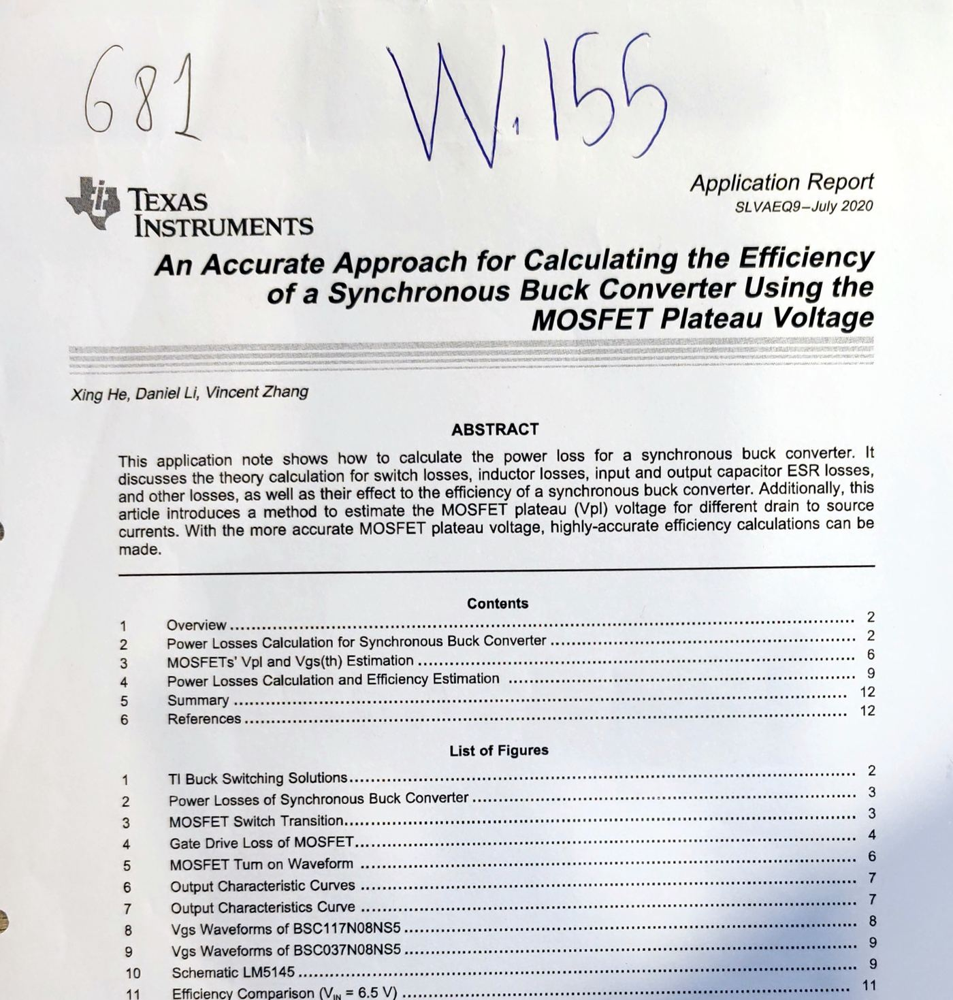

Defterden aktarilan not (`W.156`):

Burada `G81` application report'unun bu kez "losses calculation" bolumune girisi goruluyor. Yeni proje hesabi degil; toplam kayip butcesinin nasil parcandigini ve verim formunun hangi genel yapidan kuruldugunu gosteriyor.

Sayfanin basili basligi su sekilde okunuyor:

- `Power Losses Calculation for Synchronous Buck Converter`

Sayfada guvenle okunabilen en onemli fikir, toplam kaybin parcalara ayrilmis olmasidir. Basili sekilde su toplama yapisi goruluyor:

```math
P_{total\_loss}
=
P_{switches}
+
P_{inductor}
+
P_{capacitors}
+
P_{other}
```

Yani kaynak, buck donusturucunun toplam kaybini:

- anahtarlar / MOSFET'ler
- bobin
- kapasitörler
- diger kayiplar

seklinde parcalayarak ele aliyor.

Sayfada ayrica genel verim ifadesi de basili olarak veriliyor:

```math
\eta
=
\frac{V_o I_o}
{V_o I_o + P_{total\_loss}}
\times 100\%
```

Bu, senin defterde daha once not ettigin:

- iletim kaybi
- switching kaybi
- ESR ve diger kayiplar

fikrinin tek bir ust verim denklemine baglandigini gosteriyor.

`W.155`te kaynagin genel kapsam basliklari vardi; burada ise onun tam merkezindeki iki sey, yani toplam kayip butcesi ve verim iliskisi acikca goruluyor. `W.153-W.154`teki switching-loss sayfalari ile `W.145-W.146`daki conduction-loss / `RDS(on)` dusuncesi de burada ayni cati altinda anlam kazaniyor.

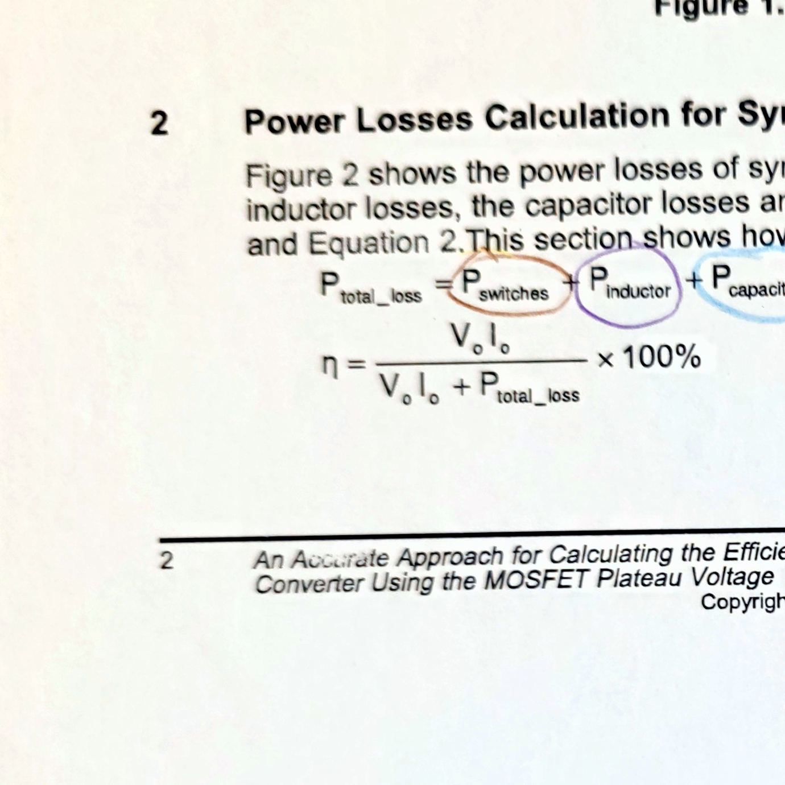

Defterden aktarilan not (`W.134`):

Burasi, sayisal kayip hesabi yapmaktan cok "MOSFET'i nasil dusunmeye basladim?" sorusuna cevap veren erken bir kavramsal not. Proje-ozel nihai sonuc sayfasi degil; MOSFET'in gerilim kontrollu bir eleman gibi sezgisel olarak nasil modellendigini gosteren temel bir defter sayfasi.


Sayfanin ust kisminda, kullanici en basit haliyle bir besleme, seri bir direnç ve `5 V`'luk bir cikis ciziyor. Buradaki ana sezgi su:

- eger devrede ayarlanabilir bir direnç olsaydi
- `V_{in}` `9 V` ile `16 V` arasinda degisse bile
- bu direnç uzerinden dusen gerilimi ayarlayarak cikisi sabit tutmak mumkun olurdu

Sayfanin hemen altinda da bu "degisken direnç" yerine MOSFET veya BJT dusunuldugu yazilmis:

- "variable resistor yerine bir MOS ya da BJT kullanabilirim"
- "boylece variable resistor gibi davranir"

Devaminda kullanici, bir geri besleme (`Vref`) ile gate'in surulebilecegini not ediyor:

- bir referans gerilim ile devre beslenecek
- cikis gerilimi olculecek
- ve buna gore MOSFET'in gate'i kontrol edilecek

Sayfanin son cümlesi de bu sezgiyi cok net toparliyor:

- `Vin` `9 V` ile `16 V` arasinda degisse bile
- "benim `5 V` cikisim sabit"

Bu sayfa, buck konvertörün nihai topolojisini anlatmiyor; daha cok regülasyonu ilk bakista "ayarlanabilir direnç" sezgisiyle kurdugun yeri gosteriyor. Yeni sayisal sonuc vermese de tasarim surecini gostermesi acisindan degerli; cunku switch-mode dusunceye gecmeden once kafadaki ilk model bu.

Defterden aktarilan not (`W.135`):

Bu not da `W.134` ile ayni erken kavramsal hatta duruyor; ancak bu kez odak, lineer regülatör benzeri bir yapinin neden verimsiz oldugunu sezgisel olarak gostermek. Proje-ozel nihai tasarim hesabi degil; switch-mode yaklasima neden ihtiyac duyuldugunu aciklayan temel bir verim notu.


Sayfanin ustunde kullanici, su dogrudan soruyu soruyor:

- "Peki ya neden soldaki devreler kullanilmiyor?"
- cevap olarak da tek kelime yaziyor:
  - `efficiency`

Ardindan cok basit bir lineer-regülatör benzeri guc bakisi kuruluyor. Kullanici once ideal bir varsayim not ediyor:

- `I_{in} = I_{out}` kabul edelim
- hic toprak / kablo / anahtar kaybi yok diyelim
- buna ragmen verim sinirli kalir

Bu sezgiyi gostermek icin sayfada su temel iliski yazilmis:

```math
\eta
=
\frac{P_{out}}{P_{in}}
=
\frac{V_o I_{out}}{V_{in} I_{in}}
\approx
\frac{V_o}{V_{in}}
```

Sayfadaki somut ornek de su yone cikiyor:

```math
\eta \approx \frac{5\,\text{V}}{15\,\text{V}} \approx 0.33
```

ve kullanici bunu kisa bir notla yorumluyor:

- "olsa verimlilik `%33` gibi surunur"

Sayfanin alt kisminda da bu fikir daha genel bir cümleyle toparlaniyor:

- bu tur devrelere "linear regulator" denebilir
- kucuk bir aleti yansitmak/duzenlemek icin giristeki enerjinin neredeyse tamamini cikisa ulastirmak istiyoruz
- peki bunu nasil yapabiliriz?

Bu sayfa yeni buck komponent hesabi vermiyor; ama `W.134`ten sonra neden yalnizca lineer dusunmenin yetmedigini, neden verim tarafina gecmek zorunda kaldigini guzel bagliyor. Yani "regülasyon" dusuncesinden "verimli regülasyon" dusuncesine gecis burada netlesiyor.


#### 5.6.3 Ilk kayip notlari


`Verimlilik.txt` icinde bu aday MOSFET ve secilen frekans civari icin su ilk tahminler yer aliyor:

- toplam MOSFET switching kaybi `~540 mW`

- toplam MOSFET conduction kaybi `~1.65 W`


Bu sayilar henuz son dogrulanmis sonuc olarak alinmamalidir; ancak taslak dusunceyi gosterir:

- bu tasarimda iletim kaybi, switching kaybindan daha baskin gorunmektedir

- buna ragmen `332 kHz` frekansinda switching kaybi ihmal edilecek kadar kucuk degildir


Bu da secilen frekansin ve secilen MOSFET'in birlikte degerlendirilmesi gerektigini gosterir.

Defterden aktarilan not (`W.118`):

Bu not kisa ve bir miktar silik; ama ana fikir enerji ile gucun iliskisini hatirlatan bir kayip notu. Sayfanin alt satirinda acikca su hatirlatma yazilmis:

```text
Joule = Watt x saniye
```

Ust taraftaki ifade tam net olmamakla birlikte, `V_{DS}` ve akimdan hareketle bir anahtarlama olayi sirasinda harcanan enerjiyi yazmaya calisiyor gibi gorunuyor. Notasyon, su tip bir ucgen / ortalama guc sezgisine isaret ediyor olabilir:

```math
E_{sw} \sim \left(\frac{V_{DS}\,I_D}{2}\right) t_{sw}
```

Sayfada ayrica `Vout`, `Cout` ve `saniye` ifadeleri birlikte geciyor; bu da enerji veya gucun zamanla iliskisini kurmaya calistigini gosteriyor.

Bu sayfa tam okunur bir nihai hesap sayfasi degil; daha cok enerji birimi ile ortalama guc arasindaki iliskiyi hatirlatan kisa bir not gibi. Burada asil korunacak fikir de bu: anahtarlama olaylarinda once enerji dusunuluyor, sonra frekansla ortalama guce geciliyor.

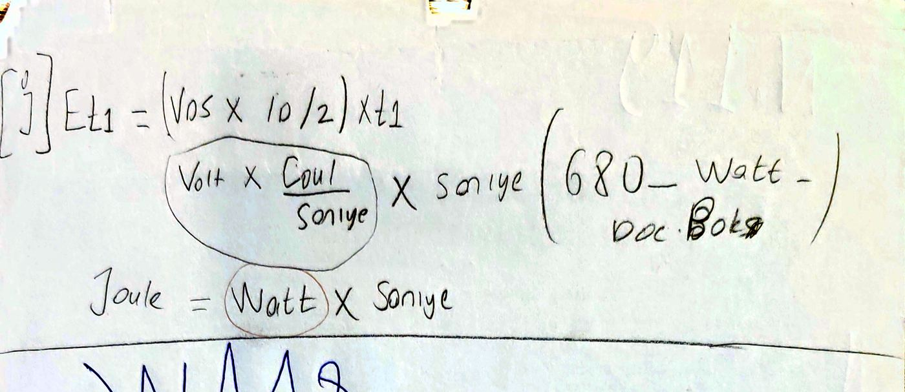

Defterden aktarilan not (`W.119`):

Burada TI'nin `MOSFET power losses and how they affect power-supply efficiency` baslikli kaynak makalesinin uzerine alinmis not var. Projeye ozel tekil hesap sayfasi olmaktan cok, kayip butcesinin hangi ana kalemlerden olustugunu hatirlatan bir kaynak notu.

Sayfadaki basili figürler ve el yazisi notlardan korunacak ana fikirler sunlar:

- lineer regulator ile switching regulator arasindaki temel fark, kayiplarin dagiliminda da kendini gosterir
- buck donusturucude kayiplar tek bir elemanda toplanmaz; birden fazla kayip kalemi vardir
- MOSFET kayiplari, toplam verim hesaplamasinin yalnizca bir parcasi olsa da kritik parcadir

Sayfada isaretlenen genel kayip kategorileri:

- iletim kayiplari (`conduction losses`)
- anahtarlama kayiplari (`switching losses`)
- gate-drive ile iliskili kayiplar
- bobin / PCB izi / kontrol devresi gibi diger kayiplar

Kullanici notu da bu sayfada su yone cikiyor:

- eger `100 W` civari cikis gucunde toplam kayip `10 W` seviyesinde ise
- verim yaklasik `%90` mertebesine gelir

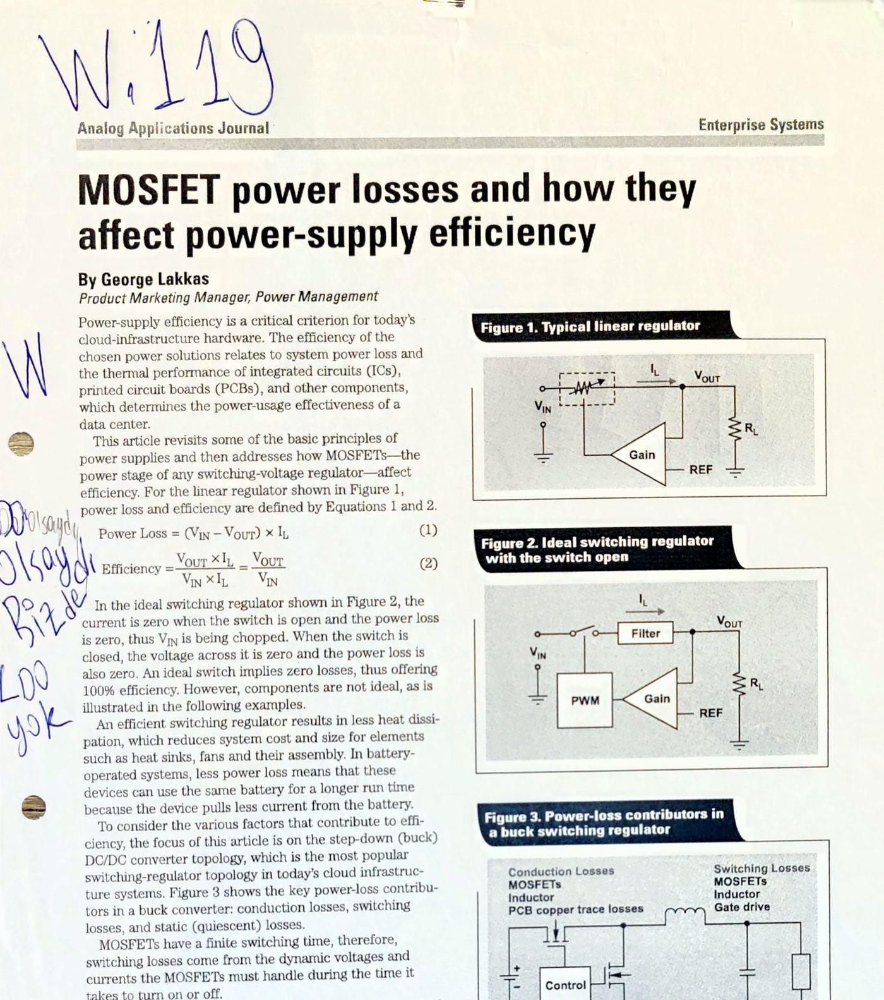

Bu sayfa, `5.6.3` altindaki ilk kayip tahminlerinin yalnizca "iki MOSFET formulu"nden ibaret olmadigini; daha genis bir kayip butcesine oturtulmasi gerektigini hatirlatiyor. Yeni sayisal nihai sonuc yok, ama kayiplarin verimle dogrudan baglantisini ve kayip siniflarinin ayri ayri dusunulmesi gerektigini gostermesi acisindan guclu.

Defterden aktarilan not (`W.191`):

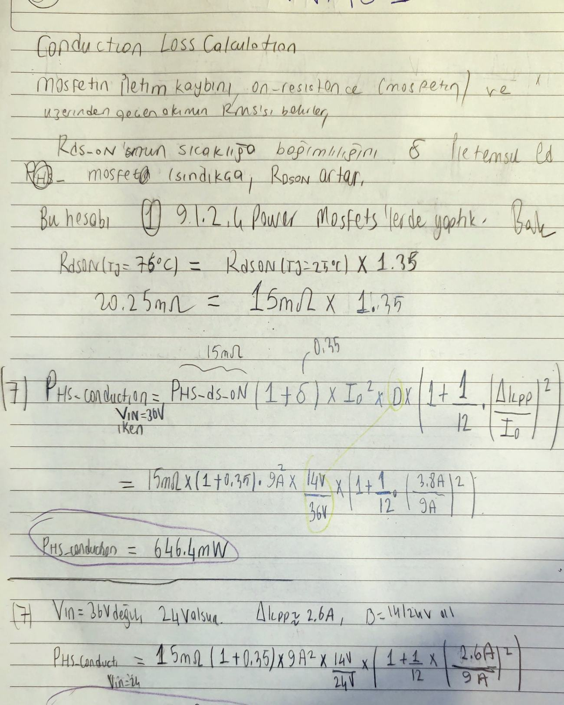

Burasi, secilen MOSFET icin ilk dogrudan `conduction loss` uygulama sayfasi. `W.145-W.146`da secim mantigi ve sicakliga gore duzeltilmis `R_{DS(on)}` tarafi kurulmustu; burada ise bu bilgi artik yuk akimi, duty ve bobin akim dalgalanmasi ile birlestirilerek high-side iletim kaybi hesaplanmaya baslaniyor.

Sayfanin ust kisminda, iletim kaybinin fiziksel tanimi kendi cümlelerinle tekrar kuruluyor:

- MOSFET'in iletim kaybi, acik durumdaki kanal direnci uzerinden gecen akimin RMS degeriyle iliskilidir
- `R_{DS(on)}` sicakliga bagimlidir
- sicaklik arttikca `R_{DS(on)}` artar

Sayfada, daha once `W.146`da cikan sicaklik duzeltmesi yeniden kullaniliyor:

```math
R_{DS(on)}(T_J \approx 75^\circ C)
=
R_{DS(on)}(T_J=25^\circ C)\times 1.35
```

ve sayfadaki sayisal yerlestirme:

```math
20.25\,m\Omega
=
15\,m\Omega \times 1.35
```

Ardindan high-side MOSFET icin iletim kaybi ifadesi yaziliyor. Okunabildigi kadariyla kullanilan form su yone cikiyor:

```math
P_{HS,\;conduction}
\approx
R_{DS(on)}(25^\circ C)\,(1+\delta)\,I_0^2\,D
\left(
1+\frac{1}{12}\left(\frac{\Delta I_{L,pp}}{I_0}\right)^2
\right)
```

Burada:

- `\delta \approx 0.35`
- `I_0 = 9\,A`
- duty `D \approx V_o/V_{in}`

olarak kullaniliyor.

Sayfanin ilk uygulamasi `V_{in}=36\,V` kosulu icin yapiliyor:

```math
P_{HS,\;cond}
\approx
15\,m\Omega \times (1+0.35)\times 9^2
\times \frac{14}{36}
\times
\left(
1+\frac{1}{12}\left(\frac{3.8}{9}\right)^2
\right)
```

ve sayfadaki sonuc:

```math
P_{HS,\;cond} \approx 646.4\,mW
```

Ikinci uygulama ise `V_{in}=24\,V` kosulu icin yapiliyor:

```math
P_{HS,\;cond}
\approx
15\,m\Omega \times (1+0.35)\times 9^2
\times \frac{14}{24}
\times
\left(
1+\frac{1}{12}\left(\frac{2.6}{9}\right)^2
\right)
```

ve sayfadaki sonuc:

```math
P_{HS,\;cond} \approx 963.5\,mW
```

Bu sayfa, `R_{DS(on)}` secim mantigini artik dogrudan guce donusturdugu icin cok degerli. `V_{in}=24\,V` kosulunda duty buyudugu icin high-side iletim kaybinin arttigi burada acikca goruluyor. Formuldaki `1+\frac{1}{12}(\Delta I/I_0)^2` carpani da bobin akim dalgalanmasinin RMS akimi biraz yukselttigini hesaba kattigini gosteriyor.

Defterden aktarilan not (`W.192`):

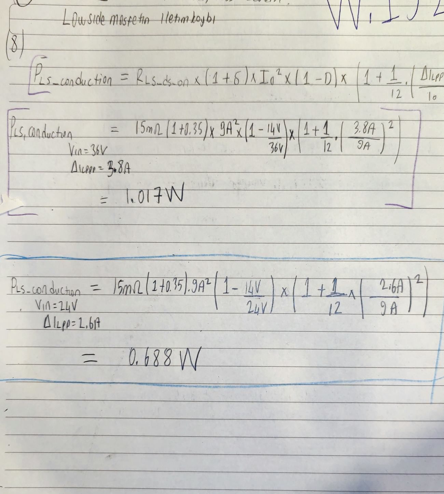

Burada `W.191`de baslayan iletim kaybi hesabinin bu kez low-side MOSFET icin yazilmis devami var.

Sayfanin basliginda acikca:

- `Conduction Loss devami`
- `Low-side mosfet iletim kaybi`

notlari yer aliyor.

Kullanilan form, `W.191`deki high-side ifadesinin tamamlayicisi gibi gorunuyor:

```math
P_{LS,\;conduction}
\approx
R_{LS,DS(on)}\,(1+\delta)\,I_0^2\,(1-D)
\left(
1+\frac{1}{12}\left(\frac{\Delta I_{L,pp}}{I_0}\right)^2
\right)
```

Yani bu kez duty'nin kendisi yerine:

```math
1-D
```

terimi kullaniliyor; bu da low-side MOSFET'in iletim suresini temsil ediyor.

Sayfanin ilk uygulamasi `V_{in}=36\,V` kosulu icin yapiliyor:

```math
P_{LS,\;cond}
\approx
15\,m\Omega \times (1+0.35)\times 9^2
\times \left(1-\frac{14}{36}\right)
\times
\left(
1+\frac{1}{12}\left(\frac{3.8}{9}\right)^2
\right)
```

ve sayfadaki sonuc:

```math
P_{LS,\;cond} \approx 1.017\,W
```

Ikinci uygulama ise `V_{in}=24\,V` kosulu icin yapiliyor:

```math
P_{LS,\;cond}
\approx
15\,m\Omega \times (1+0.35)\times 9^2
\times \left(1-\frac{14}{24}\right)
\times
\left(
1+\frac{1}{12}\left(\frac{2.6}{9}\right)^2
\right)
```

ve sayfadaki sonuc:

```math
P_{LS,\;cond} \approx 0.688\,W
```

Bu sayfa, `W.191` ile birlikte okununca high-side ve low-side iletim kayiplarinin duty'ye gore nasil bolustugunu netlestiriyor. `V_{in}=36\,V` kosulunda `D` kucuk oldugu icin `1-D` buyuyor ve low-side iletim kaybi artiyor; buna karsilik `V_{in}=24\,V` kosulunda high-side kaybi artarken low-side kaybi azaliyor.

Defterden aktarilan not (`W.193`):

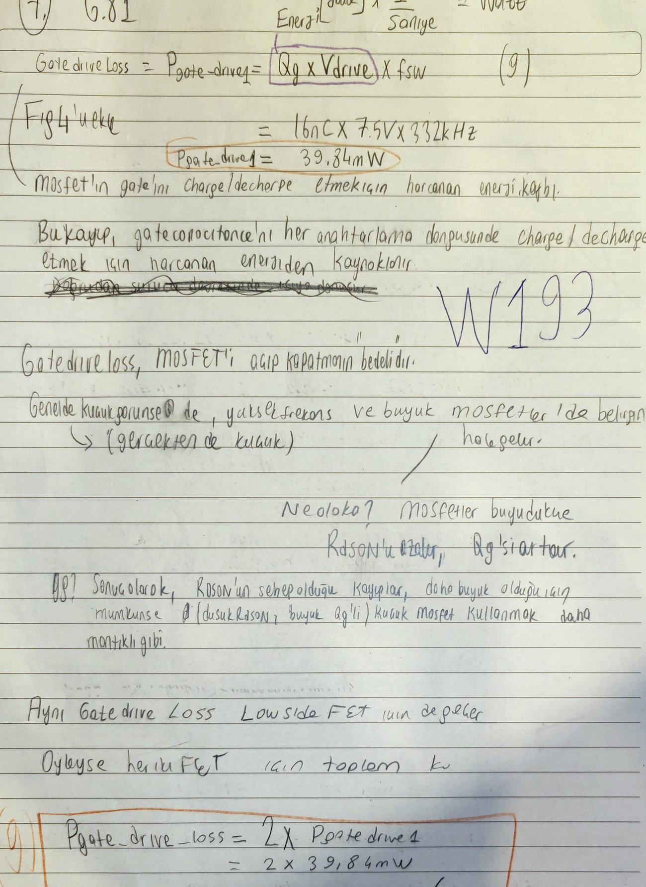

Bu sayfa, iletim kayiplarindan sonra bu kez `gate-drive loss` koluna gectigini cok net gosteriyor.

Sayfanin ustunde enerji-guc iliskisi tekrar not edilmis:

```math
\text{Energy}\times \frac{1}{\text{saniye}} = \text{Watt}
```

Ardindan gate-drive kaybi icin temel iliski yaziliyor:

```math
P_{gate-drive}
=
Q_g \, V_{drive}\, f_{sw}
```

Sayfadaki sayisal yerlestirme, okunabildigi kadariyla, su yone cikiyor:

```math
P_{gate-drive}
\approx
16\,nC \times 7.5\,V \times 332\,kHz
\approx
39.84\,mW
```

Sayfanin orta kismindaki kullanici notu, bu kaybin fiziksel anlamini da acikliyor:

- bu kayip, MOSFET'in gate'ini her anahtarlama cevriminde sarj / desarj etmek icin gereken enerjiden gelir
- frekans arttikca bu kayip artar
- buyuk MOSFET'lerde `Q_g` buyudugu icin gate-drive kaybi da buyuyebilir

Sayfanin altinda ayni mantigin low-side MOSFET icin de gecerli oldugu not edilmis ve toplam iki MOSFET icin:

```math
P_{gate-drive,\;total}
=
2 \times P_{gate-drive}
\approx
2 \times 39.84\,mW
\approx
79.68\,mW
```

sonucuna gidildigi goruluyor.

Bu sayfa, `R_{DS(on)}` tabanli iletim kayiplarindan ve `t_r/t_f` tabanli switching kayiplarindan ayri olarak, gate'i surmek icin de bir guc harcandigini netlestiriyor. `Q_g`, `V_{drive}` ve `f_{sw}` ucgeni bu projede neden birlikte dusunulmesi gerektigini cok iyi gosteriyor. Low-side icin de ayni kaybin yazilmasi, toplam MOSFET gate-drive kaybinin iki cihaz uzerinden toplanacagini gosterdigi icin yerinde.

Defterden aktarilan not (`W.194`):

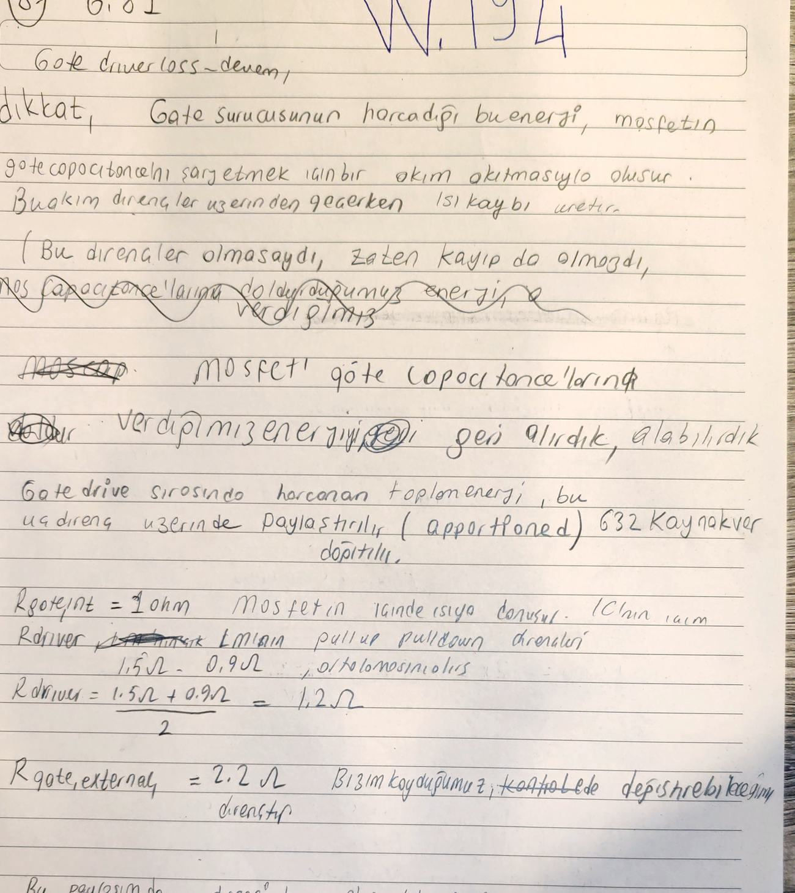

Burada `W.193`te hesaplanan `gate-drive loss` ifadesinin fiziksel yorumu ve bu kaybin gate yolu direncinden neden ayri dusunulmesi gerektigi toparlaniyor. Yeni bir sayisal kayip sonucu yok; daha cok fiziksel yorumu bir araya getiriyor.

Sayfanin ustundeki ana dikkat notu su yone cikiyor:

- gate surucusunun harcadigi enerji, MOSFET gate kapasitörlerini sarj etmek icin akan akimla ilgilidir
- bu enerji akisi nedeniyle gate yolundaki direncler uzerinde de isi olusur

Kullanici burada onemli bir fiziksel ayrim yapiyor:

- gate-drive loss'un ana kaynagi, gate kapasitanslarina her periyotta enerji yuklenip bosaltilmasidir
- direncler uzerindeki enerji, bu ayni surecin dagilim kanallarindan biridir
- dolayisiyla gate-drive kaybi sadece "direncteki isi" olarak degil, gate-charge enerjisinin tumu olarak dusunulmelidir

Sayfanin orta kismina dogru toplam gate yolu direnci de tekrar not ediliyor. Okunabildigi kadariyla:

- pull-up / surucu yolu icin etkili direncler:
  - `1.5\,\Omega`
  - `0.9\,\Omega`
- bunlarin ortalama / etkili kombinasyonundan:

```math
R_{driver,eff} \approx \frac{1.5 + 0.9}{2} = 1.2\,\Omega
```

notu dusulmus.

Ardindan kullanici, kendi ekipmaninda / tasariminda secilen harici gate direncini de tekrar sabitliyor:

```math
R_{g,ext} = 2.2\,\Omega
```

ve bunun:

- bizim ekipmanimiz / tezgahimizda degistirilebilen bir direnç oldugu
- daha buyuk secilirse `dv/dt`'nin dusecegi
- ama termal ve kayip tarafinin da yeniden dusunulmesi gerekecegi

yone notlarla baglandigi goruluyor.

Sayfanin altindaki kullanici notu, konuya pratik bir tasarim karari olarak yaklasiyor:

- termal olarak daha guvenli olmak istenebilir
- ancak bu durumda PCB, layout, sogutma ve diger kayiplar birlikte dusunulmelidir

Burada yeni bir `mW` sonucu yok. Ama `W.193`teki gate-drive loss hesabinin "yalnizca formül" olmadigini; gate kapasitansi, gate yolu direnci ve `dv/dt` karari ile birlikte okunmasi gerektigini gosteriyor. `R_{g,ext}=2.2\,\Omega` notunun tekrar gecmesi de bu degerin proje kararlarinda merkezi oldugunu gosteriyor.

Defterden aktarilan not (`W.195`):


Burada `other losses` basligi altinda bu kez MOSFET'lerin `output capacitance loss` / `C_{oss}` kaybina gecildigi goruluyor.

Sayfanin ustunde acikca:

- `Other losses`
- `Output capacitance losses`

notlari yer aliyor.

Sayfada `C_{oss}` kaybi icin standart enerji yaklasimina dayanan iki denklem yazildigi goruluyor. El yazisi tam net olmasa da, kullanicinin not ettigi ana fikir su yone cikiyor:

```math
P_{Coss}
\propto
\frac{1}{2}\,C_{oss,\;ave}\,V^2\,f_{sw}
```

Sayfanin asil yeni katkisi, `C_{oss,ave}` degerlerinin proje kosuluna gore yeniden bulunmasi:

Kullanici once genel ortalama kapasite iliskisini not ediyor:

```math
C_{oss,\;ave}
\approx
2\,C_{oss,\;spec}\sqrt{\frac{V_{DS,spec}}{V_{DS,app}}}
```

Buradan high-side MOSFET icin daha onceki sayfalarda kullanilan deger tekrar hatirlatiliyor:

```math
C_{oss,HS,\;ave} \approx 783\,pF
```

Ardindan kullanici, small low-side MOSFET icin ayri bir kontrol yapiyor ve onemli bir uyarı dusuyor:

- `V_{DS,LS,OFF} = 14 V`, `22 V` degil

Yani low-side MOSFET icin `C_{oss}` ortalamasi ayrica, kendi `off-state` gerilimine gore bulunmalidir.

Sayfadaki sayisal yerlestirme, okunabildigi kadariyla, su yone cikiyor:

```math
C_{oss,LS,\;ave}
\approx
2 \times 265\,pF \times \sqrt{\frac{50\,V}{14\,V}}
\approx
982.8\,pF
```

Sayfanin altindaki notlarin en degerli yani, kullanicinin bu kayip kolunda nominal / ezber kapasite degerlerini dogrudan almamasi gerektigini fark etmis olmasidir. Sayfa, kabaca su uyarilari tasiyor gibi gorunuyor:

- `C_{oss}` gerilime bagli degisir
- uygulama notundaki kaba degerleri dogrudan almak yerine
- proje kosuluna gore kendi `C_{oss,ave}` degerlerini kullanmak daha dogrudur

Bu sayfa yeni bir nihai `mW` sonucu vermiyor; ama `C_{oss}` kaybi icin kullanilacak ortalama kapasite degerlerini proje kosuluna tasiyor. `C_{oss,HS,\;ave} \approx 783\,pF` ve `C_{oss,LS,\;ave} \approx 982.8\,pF` notlari sonraki `C_{oss}` kayip hesabinin temel girdileri gibi duruyor. Low-side MOSFET icin `V_{DS,OFF}`'u ayri dusunmesi de iki cihazin ayni kapasite gibi ele alinmamasi gerektigini fark ettigini gosteriyor.

Defterden aktarilan not (`W.196`):


Burada `W.195`te bulunan `C_{oss,ave}` degerleri bu kez once esdeger yuk / sarj gibi yorumlanip sonra da guce donusturuluyor.

Sayfanin ustunde once `Q_{oss}` icin temel iliski yaziliyor:

```math
Q_{oss} = C_{oss,\;ave}\,V_{DS,off}
```

Ardindan `W.195`ten gelen ortalama kapasite degerleri kullanilarak iki MOSFET icin ayri yuk degerleri hesaplanmis:

High-side icin:

```math
Q_{oss,HS}
=
783\,pF \times 22\,V
\approx
17.23\,nC
```

Low-side icin:

```math
Q_{oss,LS}
=
983\,pF \times 14\,V
\approx
13.76\,nC
```

Sayfanin devaminda, bu kez `W.195`te not edilen `(10)` ve `(11)` tipindeki denklemler kullanilarak guce geciliyor. High-side MOSFET icin:

```math
P_{HS,Coss}
=
\frac{1}{2}\,Q_{oss,HS}\,V_{in}\,f_{sw}
```

Sayfadaki sayisal yerlestirme:

```math
P_{HS,Coss}
=
\frac{1}{2}\times 17.23\,nC \times 36\,V \times 332\,kHz
\approx
102.86\,mW
```

Low-side MOSFET icin de benzer sekilde:

```math
P_{LS,Coss}
=
\frac{1}{2}\,Q_{oss,LS}\,V_{in}\,f_{sw}
```

ve sayfadaki sonuc:

```math
P_{LS,Coss}
\approx
\frac{1}{2}\times 13.76\,nC \times 36\,V \times 332\,kHz
\approx
82.15\,mW
```

Bu sayfa, `W.195`teki ortalama `C_{oss}` degerlerini artik dogrudan kayip gucune cevirdigi icin degerli bir devam sayfasi. Iki MOSFET icin farkli `Q_{oss}` bulunmasi, low-side ve high-side'in ayni kapasite / ayni gerilimle ele alinmadigini gosteriyor. Sonuclar da buyukluk mertebesi olarak makul gorunuyor; yani `other losses` kolunu ihmal etmemek gerektigini destekliyor.

Defterden aktarilan not (`W.197`):


Burada `W.196`da high-side ve low-side icin ayri ayri bulunan `C_{oss}` kayiplari bu kez tek bir toplam ifade altinda yeniden yazilip teyit ediliyor. Yeni bagimsiz bir kayip kolu degil; daha cok toplama ve teyit sayfasi.

Sayfanin ustunde once bir onceki sayfadan gelen ara sonuclar hatirlatiliyor:

- `P_{HS,Coss} \approx 102.9\,mW`
- `P_{LS,Coss} \approx 82.1\,mW`

Ardindan kullanici, uygulama notundaki daha toplu bir ifadeyi not ediyor:

```math
P_{Coss}
=
f_{sw}\,\left(V_{in}\,Q_{oss2} + E_{oss1} - E_{oss2}\right)
```

Sayfanin ortasinda `E_{oss}` terimleri de tek tek yaziliyor. Okunabildigi kadariyla:

High-side icin:

```math
Q_{oss1} = 17.23\,nC
```

ve:

```math
E_{oss1}
\approx
\frac{1}{2}\,Q_{oss1}\,V_{in}
\approx
\frac{1}{2}\times 17.23\,nC \times 36\,V
\approx
0.310\,\mu J
```

Low-side icin:

```math
Q_{oss2} = 13.76\,nC
```

ve sayfadaki enerji terimi, okunabildigi kadariyla, su yone cikiyor:

```math
E_{oss2}
\approx
\frac{1}{2}\,Q_{oss2}\,V_{in}
\approx
0.248\,\mu J
```

Ardindan toplam ifade icine yerlestirme yapiliyor:

```math
P_{Coss}
\approx
332\,kHz
\times
\left[
(36\,V)(13.76\,nC)
0.310\,\mu J
-0.248\,\mu J
\right]
```

ve sayfadaki toplam sonuc:

```math
P_{Coss,\;total} \approx 185\,mW
```

olarak kutulanmis.

Bu sayfa, `W.196`daki iki ayri sonucu toplam bir `P_{Coss}` ifadesiyle yeniden yazdigi icin iyi bir teyit sayfasi. Bulunan `185\,mW` sonucu, `102.9\,mW + 82.1\,mW \approx 185\,mW` toplamina da yakin; yani iki farkli yazim biciminin ayni buyukluk mertebesine gittigi goruluyor. Enerji terimlerindeki notasyon yer yer silik olsa da, `Q_{oss}` ile `E_{oss}` arasindaki iliskiyi de acikca kurmaya calistigin belli.

Defterden aktarilan not (`W.198`):


Burada `W.197`de bulunan toplam `C_{oss}` kaybi bu kez hem `LM` tarafindaki denklemle hem de fiziksel enerji akisi yorumuyla tekrar teyit ediliyor. Yeni bagimsiz bir hesap sayfasi degil; daha cok yorum ve teyit sayfasi.

Sayfanin ustunde acik bir teyit notu yer aliyor:

- `LM'deki denklemle Pcoss = 185 mW`

Hemen altinda da kullanici kendi onceki iki sonucu tekrar topluyor:

```math
P_{HS,Coss} + P_{LS,Coss}
=
102.9\,mW + 82.2\,mW
\approx
185.1\,mW
```

ve bunun:

- `ayni cikti`

verdigi not ediliyor. Bu, `W.196-W.197` hattinin uygulama notundaki toplam formulle de tutarli oldugunu gosteren guclu bir teyit izidir.

Sayfanin orta ve alt kismindaki kullanici notlari, `C_{oss}` kaybinin fiziksel yorumunu da acikliyor:

- high-side MOSFET kapanirken bobin akimi `C_{oss1}`'i sarj eder
- bu sirada kapasitorde enerji depolanir
- high-side tekrar acilirken ve low-side tarafinda `C_{oss2}` bosalirken / sarj olurken
- bu enerji akislarinin bir kismi geri kazanilsa da bir kismi kayip olarak ortaya cikabilir

Sayfada ozellikle:

- `Eoss1 ve Eoss2 dengesi`

ifadesiyle, iki enerji teriminin neden denklemde fark seklinde gorundugune dair sezgisel bir yorum kuruluyor.

Kullanicinin son notu da onemli:

- `LM'deki denklem bunu dikkate aliyor`

Yani burada sadece sayisal toplama degil, uygulama notundaki daha derin fiziksel ifadenin de neden kullanildigi anlasilmaya calisiliyor.

Burada yeni bir `mW` sonucu cikmiyor; ama `185 mW` sonucunun hem parcali toplamla hem de `LM` denklem yorumu ile uyumlu oldugu goruluyor. `C_{oss}` kaybini ezber formulle degil, enerji depolama / bosaltma dengesi olarak dusunmeye calisman da burada net.

Defterden aktarilan not (`W.199`):


Burada `other losses` basligi altinda `C_{oss}` kaybindan sonra bu kez iki yeni kayip kalemine geciliyor:

1. `body diode reverse recovery`
2. `body diode dead-time loss`

Yani bu noktada govde diyoduna bagli ek kayiplara geciyorsun.

Sayfanin ust kutusunda once `reverse recovery` tarafi yaziliyor. Okunabildigi kadariyla temel iliski su yone cikiyor:

```math
P_{RR}
\approx
V_{in}\,f_{sw}\,Q_{rr}
```

ve sayfadaki sayisal yerlestirme, okunabildigi kadariyla, su yone isaret ediyor:

- `Q_{rr} \approx 5\,nC`
- bu deger icin ekstra bir marj / carpana benzer `1.3` notu da dusulmus gibi gorunuyor

Sonuc satiri, okunabildigi kadariyla:

```math
P_{RR} \approx 77.688\,mW
```

Kullanicinin yan notu da bunun:

- biraz kaba
- sicaklik ve benzeri parametrelerden etkilenecek

bir ilk tahmin oldugunu gostermektedir.

Sayfanin alt yarisinda ikinci kayip kalemi olarak `body diode dead-time loss` yaziliyor. Burada ana fikir, dead-time boyunca akimin MOSFET kanali yerine govde diyodu uzerinden akmasi nedeniyle olusan iletim kaybidir.

Okunabildigi kadariyla kullanilan ifade su yone cikiyor:

```math
P_{dead}
\approx
V_F\left(I_0-\frac{\Delta I_{L,pp}}{2}\right)t_{dr}f_{sw}
+
V_F\left(I_0+\frac{\Delta I_{L,pp}}{2}\right)t_{df}f_{sw}
```

Sayfadaki net gorunen parametreler:

- `V_F \approx 0.87\,V`
- `I_0 = 9\,A`
- `\Delta I_{L,pp} = 3.8\,A`
- `t_{dr} \approx 6.8\,ns`
- `t_{df} \approx 39\,ns`
- `f_{sw} \approx 332\,kHz`

Sayfadaki kutulu sonuc, okunabildigi kadariyla:

```math
P_{dead} \approx 130\,mW
```

Burada `C_{oss}` kaybindan farkli olarak body-diode ile iliskili iki ek kaybi ayri ayri dusundugun goruluyor. `P_{RR}` sonucu tam sayisal olarak biraz bulanik; o yuzden en guvenli sey buyukluk mertebesi ve formu korumak. `P_{dead}` tarafinda ise `V_F`, `t_{dr}`, `t_{df}` ve kutulu `130 mW` sonucu daha net.

Defterden aktarilan not (`W.200`):


Burada `other losses` zincirinde MOSFET'e bagli kalemlerden sonra kontrolcu / yardimci devre tuketimi ve kalan kayip kalemlerine not dusuluyor. Yeni nihai verim sonucu degil; daha cok durum notu.

Sayfanin ustunde once LM5146'nin kendi calisma akimindan dogan kayip hesaplanmis. Okunabildigi kadariyla iliski su:

```math
P_{IC} = V_{in}\,I_{Q\text{-}RUN}
```

ve sayfadaki uygulama:

```math
P_{IC}
=
36\,V \times 1.8\,mA
=
64.8\,mW
```

Buradaki `I_{Q\text{-}RUN}` notu, kullanicinin bunu:

- `Operating input current, no switching`

gibi bir datasheet satirindan aldigini gosteriyor.

Sayfanin orta kismina dogru, buyuk bir not kutusu icinde, `R_{sense}` kaybina da ayrica donulecegi yaziliyor. Okunabildigi kadariyla kullanici su tip bir iliskiyi daha sonra hesaplamak uzere not etmis:

```math
P_{sense}
=
R_{sense}\,I_{out}^2\,D
\left(
1+\frac{1}{12}\,\Delta I_{L,pp}^{2}
\right)
```

Ancak sayfanin en kritik mesaji, bunun:

- `SONRA`

yapilacak bir hesap oldugu ve henüz bu sayfada tamamlanmadigidir.

Sayfanin alt kisminda ayrica, sonra ele alinacak baska kayip kalemleri de kisa liste halinde not edilmis:

- `inductor losses calculation`
- `input and output capacitor losses / ESR`

Yani burada kayip butcesinin artik neredeyse tamamlandigi ama hala tamamlanacak alt kalemler oldugu goruluyor.

Burada yeni bir toplam verim sonucu yok. Ama `P_{IC} \approx 64.8\,mW` ile kontrolcunun kendi tuketimini de kayip butcesine kattigin goruluyor. Daha onemlisi, `R_{sense}`, bobin ve kapasitör/ESR kayiplarinin o asamada hala "sonra yapilacaklar" listesinde oldugunu acikca gostermesi.

Defterden aktarilan not (`W.124`):

Burada dogrudan yeni bir kayip hesabi yok; daha cok `G81` ve `G90` kaynaklarinin nasil birlikte kullanildigina dair bir metodoloji notu var. Yani "hangi denklem hangi kaynaktan alinacak?" sorusuna verilmis kisa bir defter cevabi gibi.

Sayfada guvenle okunabilen ana notlar sunlar:

- `G81`: `An Accurate Approach for Calculating the Efficiency of a Synchronous Buck Converter Using the MOSFET Plateau Voltage`
- kullanici notuna gore bu kaynakta:
  - bobin (`inductor`) kayiplari dahil edilmistir
  - kapasitör kayiplari eksik / sinirli ele alinmistir
  - `ESR` tarafi ayrica dikkat istemektedir
- en kritik not:
  - `G81` icindeki denklemler kullanilabilir
  - fakat zaman ekseni / dalga sekli sezgisi icin `G81`'deki ilgili sekle degil, `G90` icindeki uygun sekillere bakilmalidir
- sayfada bu fikir cok kisa su sekilde ozetlenmis:
  - `Yani denklem G81'den, sekil G90'dan`

Bu sayfa nihai kayip sonuclari veren bir hesap sayfasi degil. Degeri, kayip analizi yaparken tek kaynaga koru korune baglanmadigini; denklem ve fiziksel yorum icin farkli kaynaklari eslestirdigini gostermesi. Ozellikle `G81` ve `G90` arasindaki bu ayrim, ileride kayip hesap zinciri gozden gecirilirken hangi adimin hangi kaynaga dayandigini anlamak icin faydali.

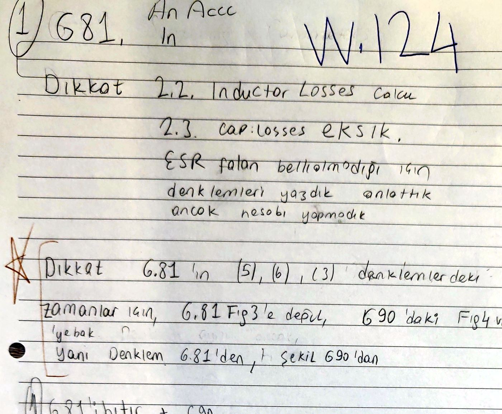

Defterden aktarilan not (`W.128`):

Burada `W.124`te not edilen `G81` yonteminin gercekten uygulanmaya baslandigi ilk ciddi parametre-cikarma sayfasi var. Konu dogrudan nihai kayip sonucu degil; `transfer characteristic` egrisinden hareketle MOSFET icin yaklasik `V_{GS(th)}` ve `Miller plateau` gerilimini bulmaya calismak.

Sayfada once klasik kare-kanun yaklasimi yaziliyor:

```math
I_{D1} = K_n \left(V_{GS1} - V_{GS(th)}\right)^2
```

```math
I_{D2} = K_n \left(V_{GS2} - V_{GS(th)}\right)^2
```

Buradan, iki farkli `I_D - V_{GS}` noktasindan esik gerilimi cikarmak icin su tip bir ifade elde edilmis:

```math
V_{GS(th)}
\approx
\frac{V_{GS2}\sqrt{I_{D1}/I_{D2}} - V_{GS1}}
{\sqrt{I_{D1}/I_{D2}} - 1}
```

Sayfadaki sayisal yerlestirme okunabildigi kadariyla yaklasik su yone cikiyor:

```math
V_{GS(th)} \approx 3.906\,\text{V}
```

Ardindan kullanici, doygunluk kosullarini kisa bir kontrol notu olarak ayri kutuya almis:

- `V_{GS} > V_{GS(th)}`
- `V_{DS} > V_{GS} - V_{GS(th)}`

Sonra ayni sayfada, yukaridaki `V_{GS(th)}` kullanilarak `K_n` katsayisi icin su tip bir ifade yaziliyor:

```math
K_n
\approx
\frac{I_D}{\left(V_{GS} - V_{GS(th)}\right)^2}
```

ve sayfadaki sonuc, okunabildigi kadariyla:

```math
K_n \approx 10.034
```

Devaminda da `Miller plateau` gerilimi icin su tip bir iliski yaziliyor:

```math
V_{PL}
\approx
\sqrt{\frac{I_D}{K_n}} + V_{GS(th)}
```

Sayfadaki sayisal sonuc burada tam net olmasa da, yazim `4.95 V` ile `6 V` bandinda bir ara degeri hedefliyor gibi gorunuyor; burada asil alinacak sey kesin rakamdan cok yontemin kendisi.

Sayfanin alt kisminda ayrica sicaklik duzeltmesi notu var:

- `T_J \approx 73.9\,^\circ\text{C}` gibi bir tahmin yazilmis
- `V_{GS(th)}` icin tipik sicaklik katsayisi:
  - `-8.5 mV / ^\circ C`
- buna gore `25 ^\circ C` datasheet degerinden sicaklik kaynakli kayma ayrica not edilmis

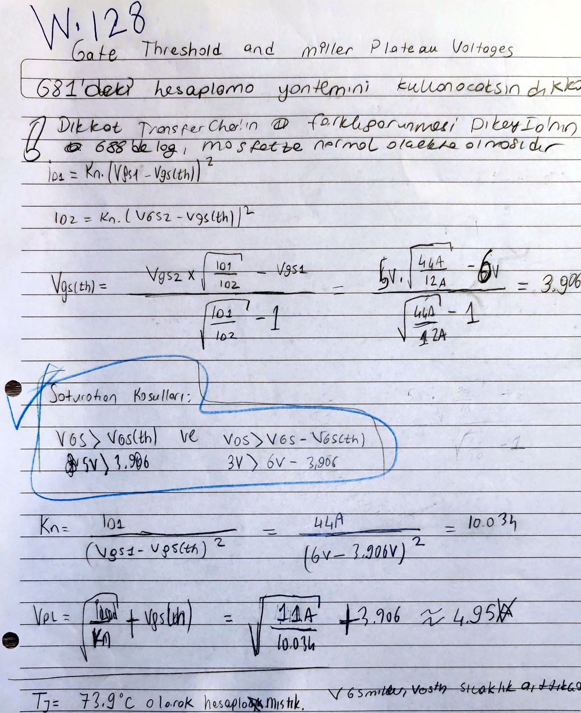

Bu sayfa, `G81` yonteminin "denklem G81'den" kismini gercekten uygulamaya gecirdigini gosterdigi icin degerli. Burada uretilen `V_{GS(th)}`, `K_n` ve `V_{PL}` degerleri daha sonra switching-loss veya plateau-voltage tabanli hesaplarda kullanilmis olabilir; ama `V_{PL}` sayisal sonucu tam net okunmadigi icin burada kesin rakamdan cok yontem ve buyukluk mertebesini korumak daha dogru.

Defterden aktarilan not (`W.173`):

Bu sayfa, `V_{GS(th)}` ve `Miller plateau` gerilimini hesaplarken hangi datasheet bilgisinin kullanilmasi gerektigi konusunda bir yontem uyarisina donusuyor. Yeni nihai proje sonucu degil; `W.128`te baslayan `V_{GS(th)}` / `V_{PL}` hesabina dair sorgulama notu gibi.

Sayfanin basliginda acikca:

- `Gate Threshold ve Miller platosu gerilimi`

yaziyor.

Sayfanin ust satirlarinda kullanici, bu buyukluklerin:

- MOSFET'in ne zaman iletime gectigini
- anahtarlama kaybinin hangi aralikta olustugunu

anlamak icin hesaplandigini not ediyor.

Orta kisimda cok onemli bir metodoloji notu var:

- `datasheet'te dogrudan verilmez`
- `ya da gormezsen`
- `hesaplama yontemi`

Ardindan kullanici, datasheet'teki `g_fs` / `\Delta I_D / \Delta V_{GS}` benzeri kucuk-isaret bilgisini kullanma fikrine deginiyor; fakat hemen yanina da su tur bir uyari dusuyor:

- gate gerilimindeki kucuk bir degisiklikten
- drain akiminin ne kadar arttigi bulunabilir
- ancak bu bilgi tek basina `V_{GS(th)}` ve `V_{PL}` icin guvenli buyuk-isaret hesabi olmayabilir

Sayfadaki en kritik mesajlardan biri bu:

- `Dikkat: bu yontemle de hesaplanmiyor`
- `cunku gfs bir small-signal parametresidir`

Yani kullanici burada, kucuk-isaret transconductance bilgisini alip dogrudan buyuk-isaret / plateau hesabina tasimanin dogru olmayabilecegini kendi kendine sorguluyor.

Sayfada ayrica:

- `G81 Fig.3'e bak`
- `mutlaka`

notu yer aliyor.

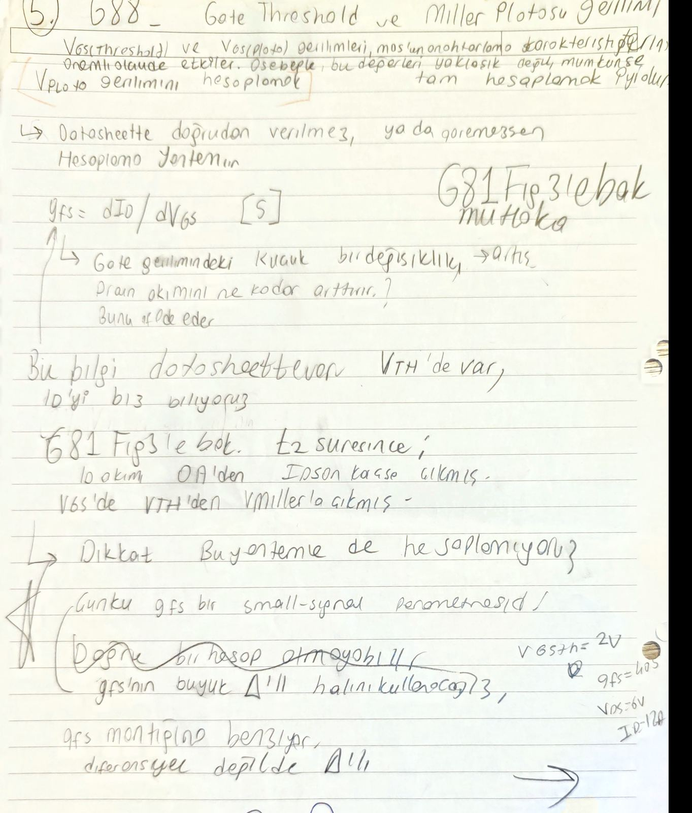

Bu da, `V_{GS(th)}` ve `Miller plateau` yorumunun yalnizca basit cebirle degil; turn-on dalga sekli ve interval mantigiyla birlikte dusunulmesi gerektigi mesajini guclendiriyor.

Burada yeni bir sayisal sonuc yok; ama daha onemli bir sey var: `W.128`teki parametre-cikarma akisini koru korune kabul etmemissin. Hangi datasheet buyuklugunun bu is icin uygun oldugunu ayri bir kez sorgulaman, `W.128`deki `V_{GS(th)}` / `K_n` / `V_{PL}` hattina metodolojik bir fren koyuyor.

Defterden aktarilan not (`W.174`):

Bu sayfa, `W.173`teki metodoloji uyarisindan sonra ayni `G88` hattinda daha somut bir `V_{GS(th)}` / `V_{GS,miller}` uygulamasi gibi duruyor. Yeni nihai proje sonucu degil; datasheet'teki yuksek sicaklik egrisinden `V_{TH}`, `K` ve `V_{GS,miller}` turetmeye calisan bir ara uygulama gibi.

Sayfanin ust kisminda kullanici, `150^\circ C` egrisi uzerinden iki nokta okuyarak ilerliyor. Okunabildigi kadariyla secilen iki nokta sunlar:

- `I_{D1} = 3 A`
- `I_{D2} = 20 A`
- `V_{GS1} \approx 4.13 V`
- `V_{GS2} \approx 5.61 V`

Ardindan klasik kare-kanun iliskisi tekrar yaziliyor:

```math
I_{D1} = K \left(V_{GS1} - V_{TH}\right)^2
```

```math
I_{D2} = K \left(V_{GS2} - V_{TH}\right)^2
```

Buradan `V_{TH}` icin sayfada su tip bir ifade turetilmis:

```math
V_{TH}
=
\frac{V_{GS1}\sqrt{I_{D2}} - V_{GS2}\sqrt{I_{D1}}}
{\sqrt{I_{D2}} - \sqrt{I_{D1}}}
```

ve sayfadaki sonuc okunabildigi kadariyla:

```math
V_{TH} \approx 3.157 V
```

Sonra ayni sayfada `K` katsayisi hesaplanmis:

```math
K
\approx
\frac{I_{D1}}{\left(V_{GS1} - V_{TH}\right)^2}
```

ve sayfadaki sayisal sonuc:

```math
K \approx 3.169
```

Ardindan Miller / plateau gerilimi icin su iliski kullaniliyor:

```math
V_{GS,miller} = V_{TH} + \sqrt{\frac{I_{load}}{K}}
```

Sayfada bu adimdan elde edilen bir ilk `V_{GS,miller}` degeri not edilmis; okunabildigi kadariyla bu ilk deger `4.4 V` civarindadir.

Sayfanin alt kisminda kullanici sicaklik duzeltmesine ozellikle dikkat cekiyor:

- `VTH` sicaklik arttikca azalir
- kullanilan egrinin `150^\circ C`'ye ait oldugu
- gercek calisma noktasinin ise yaklasik `T_J = 100^\circ C` civarinda dusunuldugu

Bu nedenle bir sicaklik katsayisi ile duzeltme uygulanmis. Okunabildigi kadariyla mantik su:

```math
\Delta V_{th}
=
\left(T_J - 150^\circ C\right)\cdot T.C.
```

ve sayfada bu fark yaklasik:

```math
\Delta V_{th} \approx +0.35 V
```

olarak kullanilmis.

Son satirlarda da buna gore duzeltilmis buyuklukler not edilmis:

- `V_{TH} \approx 3.51 V`
- `V_{GS,miller} \approx 4.76 V`

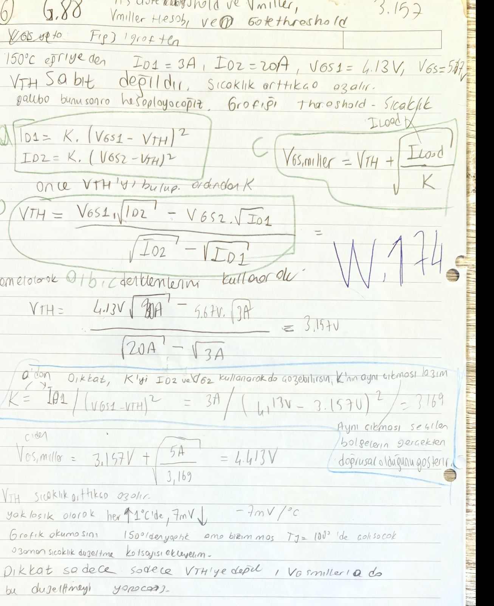

Bu sayfa, `W.128`teki genel `V_{TH}` / `K` / `V_{PL}` akisini secilen iki nokta ve sicaklik duzeltmesiyle daha somut hale getiriyor. Kullanilan egrinin `150^\circ C` olmasi ile gercek calisma sicakliginin farkli olmasi arasinda bilincli bir kopru kurulmus. Yine de katsayilar ve son degerler, hangi datasheet egri ailesinin kullanildigi teyit edilerek tekrar gozden gecirilmeli.

Defterden aktarilan not (`W.175`):

Bu sayfa, `W.174`teki ayni `G88` metodunu bu kez farkli bir datasheet egri secimi ve farkli iki nokta ile tekrar uygulayan alternatif bir ara hesap gibi duruyor. Yeni nihai proje sonucu degil; `V_{TH}`, `K` ve `V_{GS,miller}` icin ikinci bir nokta-secimi / sicaklik-duzeltme denemesi gibi.

Sayfanin ust kismina yazilan not, kullanicinin secilen MOSFET'in ilgili `I_D - V_{GS}` egrisinden iki nokta belirledigini gosteriyor. Okunabildigi kadariyla secilen noktalar sunlar:

- `Nokta 1: I_{D1} = 10 A`, `V_{GS1} \approx 3.35 V`
- `Nokta 2: I_{D2} = 20 A`, `V_{GS2} \approx 3.65 V`

Ardindan `V_{TH}` icin yine ayni tip ifade kullaniliyor:

```math
V_{TH}
=
\frac{V_{GS1}\sqrt{I_{D2}} - V_{GS2}\sqrt{I_{D1}}}
{\sqrt{I_{D2}} - \sqrt{I_{D1}}}
```

ve sayfadaki sayisal sonuc:

```math
V_{TH} \approx 2.625 V
```

Sonra `K` katsayisi ayni mantikla hesaplanmis:

```math
K
\approx
\frac{I_{D1}}{\left(V_{GS1} - V_{TH}\right)^2}
```

ve sayfadaki sayisal sonuc okunabildigi kadariyla:

```math
K \approx 19.036
```

Ardindan Miller / plateau benzeri gerilim icin:

```math
V_{GS,miller} = V_{TH} + \sqrt{\frac{I_{load}}{K}}
```

ifadesi kullaniliyor ve `I_{load} = 9 A` ile sayfada:

```math
V_{GS,miller} \approx 3.3125 V
```

bulunuyor.

Sayfanin altinda bu kez sicaklik duzeltmesi, `25^\circ C` civarinda okunan egri ile gercek `T_J \approx 76.39^\circ C` calisma noktasi arasinda kuruluyor. Kullanici:

- sicaklik katsayisi olarak yaklasik `-0.003 V / ^\circ C`

notunu yazmis.

Ve buna gore duzeltme gerilimi:

```math
\Delta V
=
\left(76.39^\circ C - 25^\circ C\right)\cdot (-0.003 V/^\circ C)
\approx
-0.154 V
```

olarak hesaplanmis.

Son satirlarda buna gore duzeltilmis degerler not edilmis:

- `V_{TH,adj} \approx 2.471 V`
- `V_{GS,miller,adj} \approx 3.1585 V`

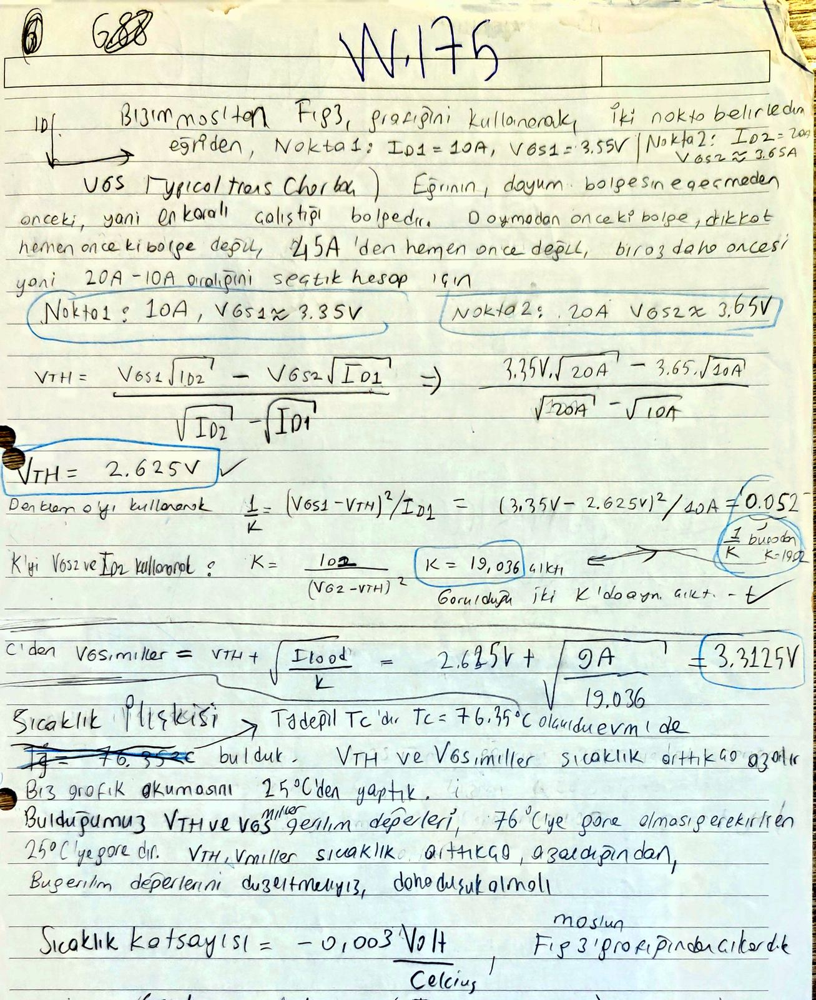

Bu sayfa, `W.174` ile ayni buyuklukleri hedefliyor ama farkli egri / farkli nokta secimi yuzunden belirgin bicimde farkli `V_{TH}` ve `V_{GS,miller}` degerleri uretiyor. Bu fark da degerli; cunku bu parametrelerin nokta secimine ve hangi sicaklik egrisinden okunduguna hassas oldugunu acikca gosteriyor.

Defterden aktarilan not (`W.129`):

Bu sayfa, `G88` hattinda gate-charge parametrelerini projedeki gercek surme kosuluna uyarlamaya calisan bir ara sayfa gibi duruyor. Dogrudan nihai kayip sonucu degil; switching-loss hesabinda kullanilacak `Q_g`, `Q_{GS}` ve `Q_{GD}` buyukluklerinin nasil secildigini gosteriyor.

Sayfanin ust kisminda datasheet'ten okunan tipik gate-charge notlari var:

- `Q_g(total) \approx 20\,\text{nC}`
- `Q_{GS} \approx 6.4\,\text{nC}`
- `Q_{GD} \approx 6.5\,\text{nC}`

Bu notlarin yanina ayrica su kosullar yazilmis:

- `VGS = 10 V`
- `VDS = 50 V`
- `IDS = 20 A`

Ardindan kullanici, bu datasheet degerinin projedeki kosula dogrudan uymadigini not ediyor:

- "Bizim `VGS`'in `10 V` degil, `7.5 V`'tur"
- "O yüzden `Qg` degerini update ettik"
- `Fig. 8` benzeri bir datasheet egirisinden hareketle:
  - `Q_g(total) \approx 10\,\text{nC}` olarak alinmis

Sayfanin alt yarisinda ise `Miller charge` icin ayri bir not var. Orada onceki bolumden gelen bir `C_{GD}` / `C_{rss}` degeri tekrar kullanilarak:

```math
Q_{GD} \approx C_{GD}\,V_{DS}
```

yaklasimi yazilmis ve sayfadaki sayisal yerlestirme, okunabildigi kadariyla, su yone cikiyor:

```math
Q_{GD}
\approx
54\,\text{pF}\times 22\,\text{V}
\approx
1.2\,\text{nC}
```

Sayfanin en altinda kisa bir not daha var:

- `Qgs2` benzeri bir bileşen icin hesap devam edecek
- yanina da "G81'de bak" benzeri bir kaynak yonlendirmesi dusulmus

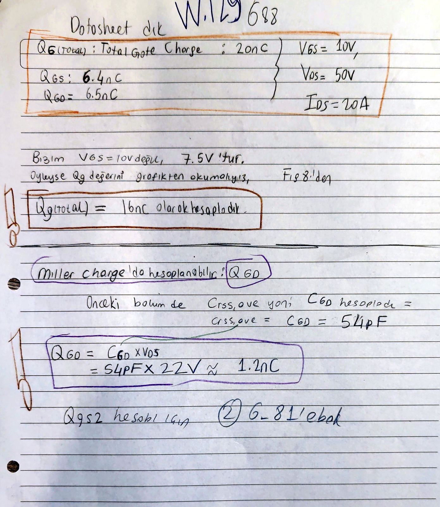

Bu sayfa cok degerli; cunku datasheet'teki `Qg(total)` degerinin her zaman dogrudan kullanilmadigini, projedeki gercek `VGS` ve `VDS` kosuluna gore yeniden yorumlandigini gosteriyor. `Q_{GD}` icin kaba `C_{GD} \times V_{DS}` yaklasimini not etmen de switching kaybinin hangi yuk bolgesinde / plateau araliginda sekillendigine dair iyi bir iz birakiyor. Buradaki `Q_g(total) = 10 nC` ve `Q_{GD} \approx 1.2 nC` gibi degerler de diger kayip sayfalariyla birlikte tekrar teyit edilmeli.

Defterden aktarilan not (`W.164`):

Bu sayfa, `G88 Gate Charge` hattinda daha kavramsal bir toparlama notu gibi duruyor. Dogrudan nihai kayip sonucu degil; `Q_g`'nin neden onemli oldugunu ve neden basit `Q = C\cdot V` sezgisiyle sinirli kalmamasi gerektigini anlatiyor.

Sayfanin ust kisminda kullanici su ana fikri not ediyor:

- MOSFET'in gate kapasitelerine ne kadar yuk / charge aktarilmasi gerektigi
- gate-drive davranisi ve anahtarlama hizi acisindan onemlidir

Ardindan daha genel elektrik sezgisi hatirlatiliyor:

```math
Q = C \cdot V
```

Ancak kullanici hemen bunun yanina onemli bir sinir da koyuyor:

- bu iliski sabit `C` icin gecerlidir
- MOSFET'te ise birden fazla kapasitans vardir
- bunlar sabit olmayan / gerilime bagli davranabilir

Sayfada bu nedenle `Fig.6` benzeri `V_{GS}` - `Q_g` grafiğine bakilmasi gerektigi not edilmis. Kullanicinin yazdigi ana fikirler sunlar:

- belirli bir gate-drive gerilimi icin toplam `Q_g` dogrudan grafikten okunmali
- bizim devrede gate surucusu yaklasik `7.5 V` verdigi icin
- `10 V` datasheet kosuluna gore degil, bu gercege yakin grafikten karar verilmesi gerekir

Sayfanin alt kisminda okunabildigi kadariyla bir sonuc not edilmis:

- `Q_g \approx 12.2 nC` bulundu

Ardindan da cok pratik iki soru yazilmis:

- MOS'u surucu devresi saglayabilecek mi?
- ne kadar hizli turn-on / turn-off yapabilecek?

ve son satirdaki kisa not:

- `Kesinlikle Fig6 grafiğini kullan`

Sayfanin ana mesajini iyi ozetliyor.

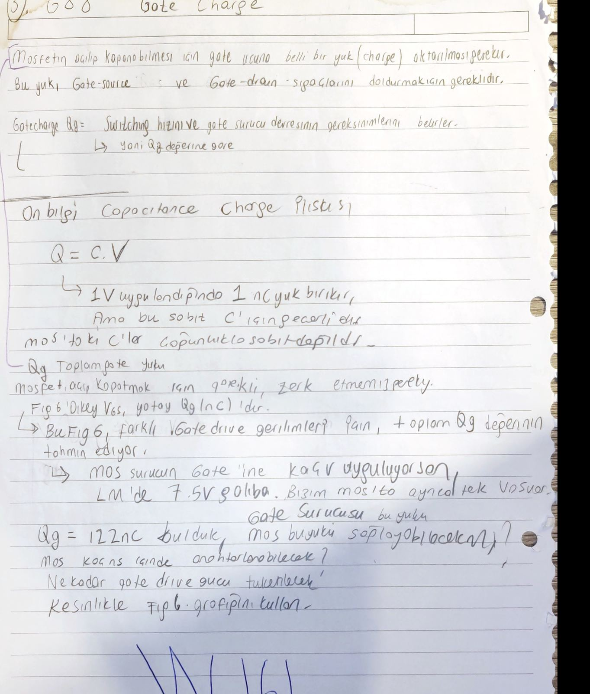

Burada yeni bir sayisal proje sonucu yok; ama `W.129`daki `Qg(total)` uyarlamasinin arkasindaki muhendislik mantigini acikliyor: gate charge sabit bir tek sayi degil, gercek surme gerilimine gore grafikten okunmali. `Q_g \approx 12.2 nC` notu da `W.129`daki `10 nC` ve `W.161`deki `8 nC` civari notlarla birlikte daha sonra tekrar karsilastirilmasi gereken bir ara aday gibi duruyor.


Bu ekran goruntusu, `W.164`te yazdigin "Kesinlikle Fig.6 grafigini kullan" notunu dogrudan gorsellestiriyor. Yani `Q_g` degerinin sabit tablo sayisindan degil, secilen `V_{GS}` kosulunda gate-charge egirisinden okunmasi gerektigi burada daha acik hale geliyor.

Ikinci ekran goruntusu ise bu okumanin projedeki gercek surucu kosuluna tasindigini daha net gosteriyor. Uzerindeki notta `VGS = 7.5 V` ve `Qg \approx 16 nC` okundugu goruluyor. Bu da `W.129`, `W.168` ve bootstrap hesabindaki `Q_g \approx 16 nC` cizgisinin rastgele secilmedigini; gate-charge egrisinden surme gerilimine uygun bir okuma yapilarak alindigini destekliyor.

Defterden aktarilan not (`W.130`):

Bu sayfa, `G88` kaynagindan gelen MOSFET kapasitans verilerini projedeki ortalama `V_{DS}` kosuluna donusturmeye calisan bir ara sayfa gibi duruyor. Dogrudan nihai kayip sonucu degil; `C_{GD}`, `C_{GS}` ve `C_{DS}` gibi parasitiklerin projede hangi buyukluk mertebesinde alinacagini gosteriyor.

Sayfanin ust kisminda datasheet kosullarinda okunan tipik kapasitanslar not edilmis:

- `C_{iss} \approx 1300\,\text{pF}`
- `C_{oss} \approx 260\,\text{pF}`
- `C_{rss} \approx 18\,\text{pF}`

Yanina da su kosullar yazilmis:

- `V_{DS} = 50 V`
- `V_{GS} = 0 V`
- `f = 1 MHz`

Sayfada kullanilan temel fikir, bu kapasitanslari projedeki farkli `V_{DS}` seviyesine kabaca uyarlamaktir. Kullanici burada, okunabildigi kadariyla, asagidaki deneysel/uygulamali yaklasimi kullanmis:

```math
C_{rss,ave}
\approx
2\,C_{rss,spec}\sqrt{\frac{V_{DS,spec}}{V_{DS,ave}}}
```

Sayfadaki sayisal yerlestirme:

```math
C_{rss,ave}
\approx
2 \times 18\,\text{pF}\times \sqrt{\frac{50\,\text{V}}{22\,\text{V}}}
\approx
54\,\text{pF}
```

Benzer sekilde `C_{oss}` icin de:

```math
C_{oss,ave}
\approx
2\,C_{oss,spec}\sqrt{\frac{V_{DS,spec}}{V_{DS,ave}}}
```

ve sayfadaki sayisal sonuc:

```math
C_{oss,ave}
\approx
2 \times 260\,\text{pF}\times \sqrt{\frac{50\,\text{V}}{22\,\text{V}}}
\approx
783\,\text{pF}
```

Sayfanin altinda kullanici, MOSFET'in temel parasitiklerini su sekilde ayiriyor:

```math
C_{GD} \approx C_{rss,ave} \approx 54\,\text{pF}
```

```math
C_{GS} \approx C_{iss} - C_{rss} \approx 1300\,\text{pF} - 18\,\text{pF} \approx 1282\,\text{pF}
```

```math
C_{DS} \approx C_{oss,ave} - C_{rss,ave} \approx 783\,\text{pF} - 54\,\text{pF} \approx 729\,\text{pF}
```

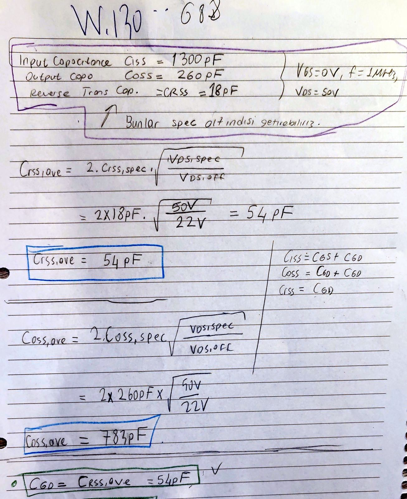

Bu sayfa, `W.129`da kullanilan `C_{GD} \approx 54 pF` notunun kokenini aciklar gibi duruyor; bu acidan guclu. Burada kullanilan `2*C*sqrt(Vspec/Vave)` tipi donusum saf temel denklemden cok uygulama-notu / yaklasik datasheet yorumlama kurali gibi; o yuzden sonucu fizik kanunu gibi degil, tasarim yaklasimi olarak okumak daha dogru. Buna ragmen kayip hesabinda kullanilan kapasitanslarin rastgele degil, belirli bir `VDS` seviyesine uyarlandigi net goruluyor.


Defterden aktarilan not (`W.165`):


Bu sayfa, yine `G88` hattinda ama bu kez farkli bir datasheet kapasitans setiyle ayni soruyu tekrar sormaya calisan bir ara sayfa gibi duruyor: "MOSFET datasheet'inde verilen `C_{iss}`, `C_{oss}` ve `C_{rss}` degerlerini, devredeki gercek `off-state` `V_{DS}` kosuluna nasil tasirim?" Yani burada kapasitans seti bir kez daha gozden geciriliyor.

Sayfanin ust kisminda kullanici once uygulama kosullarini toparliyor. Okunabildigi kadariyla ana fikirler sunlar:

- `V_{DS,off}` devrede `38 V` civarinda alinmis
- kullanici, `G88` hesabina girerken gercek `I_D`, `T_J`, surucu ve toplam gate-direnci baglamini da ayni sayfada hatirlatmak istiyor
- sag kenarda yine `I_{L,peak}` / tam yuk baglami not edilmis; yani bu sayfa yalniz datasheet okuma degil, proje kosuluyla eslestirme sayfasi

Ardindan "A) capacitances" basligi altinda, datasheet'ten okunan tipik kapasitanslar yaziliyor:

- `C_{iss} \approx 2600 pF`
- `C_{oss} \approx 720 pF`
- `C_{rss} \approx 340 pF`

Yanina da kaynak okuma kosullari dusulmus:

- `V_{GS} = 0 V`
- `V_{DS} = 25 V`
- `f = 1 MHz`
- `Fig.5'te bak`

Bu uc ekran birlikte okundugunda onemli bir sey daha netlesiyor: parasitik kapasitanslar tek bir sabit tablo satiri gibi ele alinmiyor; `V_{DS}` seviyesine gore ayrica okunuyor. `p92` uzerinde `V_{DS}=14 V` ve `22 V` civarinda `C_{oss}` icin `700-800 pF` sinifi okunurken, `p98` uzerinde ayni `22 V` noktasinda `C_{iss} \approx 1220 pF`, `C_{rss} \approx 80 pF` ve `C_{oss} \approx 700 pF` civari notlar dusulmus. Bu da `W.130`, `W.152`, `W.161` ve `W.163` tarafinda neden birden fazla aday kapasitans seti olustugunu, kullanicinin bu degerleri farkli `V_{DS}` okumalarindan tekrar tekrar sorguladigini gosteriyor.

Sayfanin orta kisminda kullanici, klasik kapasitans ayrimini tekrar hatirlatiyor:

```math
C_{oss} = C_{ds} + C_{gd}
```

```math
C_{iss} = C_{gs} + C_{gd}
```

Ardindan su muhendislik sezgisi yazilmis:

- `C_{rss}` ve `C_{ds}` / `C_{oss}` daha cok `V_{DS}`'ye bagli degisebilir
- bu nedenle, datasheet'teki `25 V` kosulunda verilen sayilarin dogrudan degil, devredeki `38 V off-state` kosuluna gore yeniden yorumlanmasi gerekir

Sayfanin altinda okunabildigi kadariyla iki ara sonuc not edilmis:

- `C_{gd} = C_{rss,ave} \approx 134 pF`
- `C_{gs} = C_{iss} - C_{rss} \approx 2600 pF - 340 pF \approx 2260 pF`

Ayri bir satirda da `C_{oss,ave}` icin yaklasik:

- `C_{oss,ave} \approx 368 pF`

gibi bir sonuc not edilmis gorunuyor. Bu degerler, datasheet'teki sabit tablo degerinden cok, grafik / calisma noktasi uyarlamasi mantigiyla alinmis ara buyuklukler gibi duruyor.

Bu sayfa, `W.130` ile ayni tur problemi tekrar cozuyor; dolayisiyla ikisi birlikte okunmali ama birbirinin otomatik "dogrusu" gibi alinmamali. `W.130`daki `54 pF / 783 pF / 729 pF` hattiyla bu sayfadaki `134 pF / 368 pF / 2260 pF` hattinin ayni anda birebir dogru olmasi zor; buyuk olasilikla farkli datasheet noktasi ya da farkli yorum yontemi devreye girmis. Buna ragmen parasitikleri rastgele secmedigini, once datasheet kosulunu sonra gercek `V_{DS(off)}` kosulunu dusunerek yeniden yorumladigin net.

Defterden aktarilan not (`W.132`):


Bu sayfa, `G88` tabanli MOSFET kayip hesabinda kullanilacak calisma noktasi ve surucu-direnci parametrelerini bir araya toplayan kisa bir ara sayfa gibi duruyor. Dogrudan nihai kayip sonucu degil; `G88` hesabina giris olacak sayilarin ve isim eslestirmelerinin not edildigi bir ara toplama sayfasi gibi.

Sayfanin ust yarisinda, hesapta kullanilacak temel proje sayilari tekrar listelenmis:

```math
T_J \approx T_{case} + P_{loss}\,R_{\theta JC}
```

ve okunabildigi kadariyla kullanici su ara degerleri not etmis:

- `T_J \approx 75.964^\circ C \approx 76^\circ C`
- `I_D \approx 9 A + 3.8 A / 2 \approx 11 A`
- `V_{DS} \approx 36 V - 14 V = 22 V`
- `V_{drive} \approx V_{CC} \approx 7.5 V`

Sayfanin ortasinda dis gate direnci de netlestiriliyor:

- `R_{gate,ext} = R_3 = 2.2 \Omega`

Ardindan kullanici, `G88` icindeki isimlerle `G32` / LM5146 tarafindaki surucu direnclerini eslestirmeye calisiyor. Okunabildigi kadariyla ana fikir su:

- `G88`'deki `R_HI`
  - `G32`'deki high-side / pull-up yonundeki ic surme direncine karsilik geliyor
  - sayfada bu deger `1.5 \Omega` gibi not edilmis
- `G88`'deki `R_LO`
  - `G32`'deki gate'i GND'ye ceken pull-down / sink yonundeki ic surme direncine karsilik geliyor
  - sayfada bu deger `0.9 \Omega` gibi not edilmis

Sayfanin en altinda da kisa bir hatirlatma var:

- `Dikkat`
- `R_HI = R_{HO-up} = 1.5 \Omega` unutulmamali

Bu sayfa yeni formulle yeni kayip sonucu uretmiyor; ama `G88` hesabinda kullanilacak `T_J`, `I_D`, `V_{DS}`, `V_{drive}` ve gate-direnci aginin nereden geldigini gosterdigi icin degerli. Ozellikle `R_HI / R_LO` ile kontrolcu datasheet'indeki `pull-up / pull-down` surucu direnclerinin eslestirilmesi, daha sonra switching-loss hesabinda karisiklik olusmamasi icin onemli.

Defterden aktarilan not (`W.177`):


Bu sayfa, `G88` hattinda switching-loss hesabina girecek toplam gate-yolu direncini daha acik bicimde toplayan bir ara sayfa gibi duruyor. Yeni nihai kayip sonucu degil; `R_{total}` gate direncinin hangi bilesenlerden olustugunu gosteriyor.

Sayfanin ust kisminda toplam gate yolu direnci su sekilde yazilmis:

```math
R_{total}
=
R_{driver}
+
R_{g,external}
+
R_{g,internal}
```

Kullanicinin sayfa uzerine not ettigi sayilar okunabildigi kadariyla sunlar:

- `R_{driver} \approx 1.5 \Omega`
- `R_{g,external} \approx 0 \Omega`
- `R_{g,internal} \approx 0.7 \Omega`

Burada `R_{driver}` icin ayrica su sezgi not edilmis:

- LM5146 tarafinda `pull-up / pull-down` ic direncler vardir
- bunlardan daha korunmaci olan taraf secilerek
- `R_{driver} = 1.5 \Omega` alinabilir

ve `R_{g,internal}` icin de:

- MOSFET'in kendi ic gate direnci tipik olarak `0.5 - 1 \Omega` bandindadir
- bu projede yaklasik `0.7 \Omega` alinmis

Bu varsayimlarla sayfada su toplam sonuc yaziliyor:

```math
R_{total}
=
1.5\,\Omega + 0\,\Omega + 0.7\,\Omega
=
2.2\,\Omega
```

Sayfanin altinda kullanici bu toplam direncin hangi konularda kullanildigini da not ediyor:

- switching suresi
- `t_{fall}` / gecis zamanlari
- `switching loss`
- EMI davranisi

Yani bu sayfa, gate yolundaki etkili direncin yalnizca bir parca secim detayi degil; dogrudan gecis hizi ve kayip hesabi girdisi oldugunu hatirlatiyor.

Bu sayfa onemli bir ayirim getiriyor: burada `2.2 \Omega`, fiziksel olarak tek bir "harici gate direnci" gibi degil; `R_{driver} + R_{g,external} + R_{g,internal}` toplami olarak kuruluyor. Bu da `W.132`de daha kaba okunmus olabilecek "`R_{gate,ext} = 2.2 \Omega`" yorumunun daha sonra yeniden gozden gecirilmesi gerektigini dusunduruyor.


#### 5.6.4 Thermal ve datasheet yorumu acisindan dikkatler


Yerel kaynaklar icinde MOSFET current rating yorumuna dair onemli bir not da bulunuyor: datasheet'teki akim sinirlari genellikle olculen degil, belirli termal varsayimlarla hesaplanan degerlerdir.


Bu nedenle son raporda su ilke acik kalmali:

- MOSFET'in datasheet continuous current degeri dogrudan yeterlilik kaniti olarak kullanilmayacak

- bunun yerine gercek kayip hesabi ve termal varsayim zinciri kurulacak

- `RthetaJA`, `RthetaJC`, kart sicakligi ve tahmini junction sicakligi birlikte yorumlanacak


Bu gorsel, `W.108-W.110` hattinda tekrar tekrar vurgulanan exposed pad gercegini cok hizli anlatan iyi bir destek sayfasi. Termal performansin yalnizca paketin kendisine degil, alt pad'in PCB'ye nasil baglandigina da dayandigini gorsel olarak destekliyor.

Defterden aktarilan not (`W.107`):

Bu sayfa, TI'nin `Understanding MOSFET Data Sheets, Part 6 - Thermal Impedance` makalesinin ilk sayfasi uzerine alinmis not gibi duruyor. Proje-ozel hesap sayfasindan cok, MOSFET datasheet yorumunu dogru zemine oturtan bir kaynak notu gibi okunmali.

Sayfada alti cizilmis ana teknik fikir su:

- `R_{theta JA}` tek parca, mutlak ve her yerde gecerli bir sabit gibi dusunulmemelidir
- junction-to-ambient termal yol, paket ustunden havaya giden yol ile PCB uzerinden dagilan yolun bileskesidir
- bu nedenle datasheet'teki termal metrikler, gercek kart ve sogutma kosullarindan bagimsiz okunmamalidir

Sayfada altta kullanicinin not ettigi temel termal iliski sunlar:

```math
T_J = T_A + P_D \cdot R_{\theta JA}
```

ve yan notta su dusunce one cikiyor:

- `R_{theta JA}` ve kart yapisi, MOSFET'in gercekte ne kadar akim tasiyabilecegini belirleyen temel unsurlardandir
- bu nedenle datasheet'teki "continuous current" degeri, paket / PCB / sogutma varsayimlari disinda tek basina yorumlanmamalidir

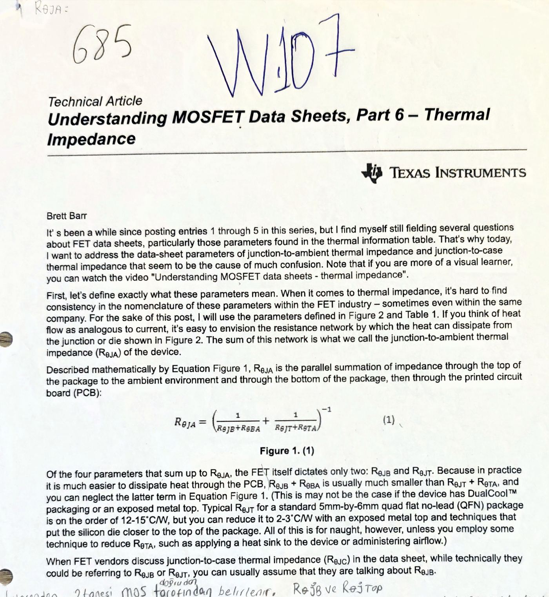

Bu sayfa, `5.6.4` altindaki "datasheet current rating dogrudan yeterlilik kaniti degildir" ilkesini guclu bir kaynakla destekliyor. Burada henuz proje-ozel `T_J` hesabi yok; ama sonraki kayip hesabinin nasil termal limite baglanmasi gerektigini dogru yerde hatirlatiyor.

Defterden aktarilan not (`W.109`):

Bu sayfa, `W.107`deki termal impedance makalesinin bir devam sayfasi gibi gorunuyor ve `R_{\theta JA}`'nin hangi fiziksel yollarin bileskesi oldugunu daha acik anlatıyor.

Sayfanin ust tarafinda junction'dan ortama giden termal yolun esdeger agi cizilmis. Ana fikir su:

- isi, tek bir yoldan degil birden fazla paralel / seri termal yoldan dagilir
- paket ustunden ortama giden yol ayri
- PCB ve exposed pad uzerinden dagilan yol ayri
- bu nedenle tek bir `R_{\theta JA}` sayisini, karttan bagimsiz mutlak bir sabit gibi okumak yanlistir

Sayfadaki notlardan korunacak ana teknik fikirler:

- `R_{\theta JA}` aslinda bir bileske / esdeger buyukluktur
- PCB bakiri, via sayisi, exposed pad baglantisi ve hava akis kosullari bu buyuklugu ciddi bicimde degistirebilir
- bu yuzden datasheet'teki `R_{\theta JA}` degeri, "gercek devrede aynen olacak" bir sayi gibi degil, belirli bir test kurulumuna ait referans gibi okunmalidir

Sayfadaki sekil, kabaca su ayrimi destekliyor:

- junction -> package top -> ambient yolu
- junction -> package bottom / exposed pad -> PCB -> ambient yolu

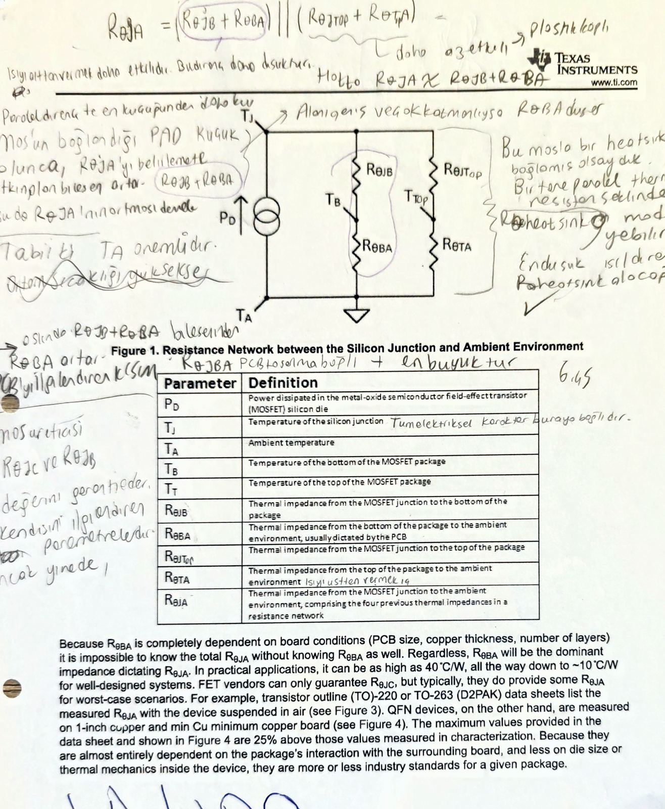

Bu sayfa, `W.107`deki `T_J = T_A + P_D \cdot R_{\theta JA}` iliskisinin neden dikkatle yorumlanmasi gerektigini cok iyi acikliyor. Yani ayni guc kaybinda bile `T_J`, yalnizca cihazin kendisine degil PCB yerlestirisine ve isi dagitma yapisina da bagli.

Defterden aktarilan not (`W.110`):

Bu sayfa, `W.107-W.109` hattindaki termal yorumun pratik sonucunu gosteriyor: datasheet'te verilen `R_{\theta JA}` degeri, olcum duzenine ve PCB bakir alanina ciddi bicimde baglidir.

Sayfadaki basili sekillerde iki farkli olcum baglami gosteriliyor:

- `TO-220` paketin havada asili oldugu / hava icinde olculen bir durum
- `SON 5 mm x 6 mm` benzeri bir pakette, farkli PCB bakir alanlariyla elde edilen `R_{\theta JA}` degerleri

Sayfadaki basili notlardan korunacak ana fikirler:

- ayni paket icin bile `R_{\theta JA}` sabit bir tek sayi degildir
- altindaki bakir alan arttikca isi dagitma iyilesir ve `R_{\theta JA}` degisir
- exposed pad ve PCB alani, termal performansin temel belirleyicilerindendir

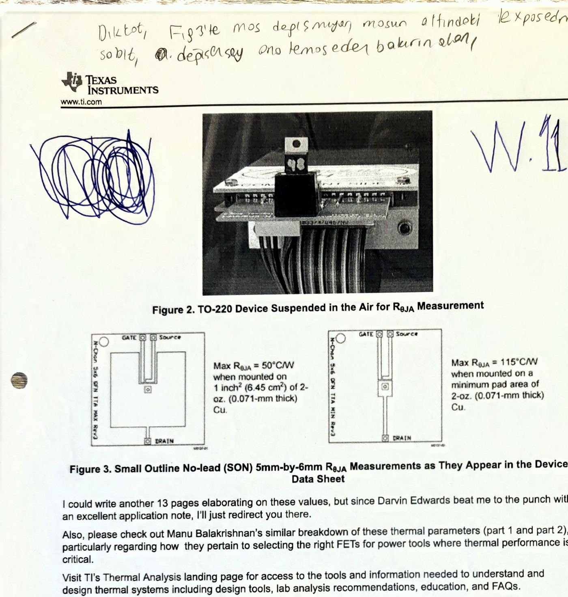

Bu sayfa, `W.109`daki "termal yol PCB'ye baglidir" fikrini gorsel ve deneysel bir baglamla guclendiriyor. Yani termal hesapta datasheet'teki `R_{\theta JA}` degerini koru korune almak yerine, kullanilan paket ve kart yerlesimiyle birlikte yorumlamak gerekiyor.

Defterden aktarilan not (`W.117`):

Bu sayfa, termal datasheet parametrelerini tek tek isimlendiren ve hangisinin neyi temsil ettigini ayirmaya calisan ozet bir defter sayfasi gibi duruyor.

Sayfada not edilen ana termal buyuklukler sunlar:

- `R_{\theta JA} = 36.8 ^\circ C/W`
- `R_{\theta JC(top)} = 28 ^\circ C/W`
- `R_{\theta JC(bot)} = 2.1 ^\circ C/W`
- `R_{\theta JB} = 11.8 ^\circ C/W`
- `\Psi_{JT} = 0.4 ^\circ C/W`
- `\Psi_{JB} = 11.7 ^\circ C/W`

Sayfadaki kisa aciklamalardan korunacak ana fikirler:

- `R_{\theta JC(top)}` : junction-to-case(top) thermal resistance
- `R_{\theta JC(bot)}` : junction-to-case(bottom)
- `R_{\theta JB}` : junction-to-board thermal resistance
- `\Psi_{JT}` ve `\Psi_{JB}` ise klasik thermal resistance degil, karakterizasyon parametreleri olarak not edilmis

Sayfanin altindaki cok degerli pratik not:

- `Thermocouple kullanacagin zaman kullanacaksin bu iki parametreyi`

Yani kullanici burada acikca su ayrimi not ediyor:

- her termal buyukluk ayni anlamda degildir
- ozellikle olcum / termokupl ile pratik sicaklik yorumu yaparken `\Psi` parametreleri farkli bir rolde kullanilir

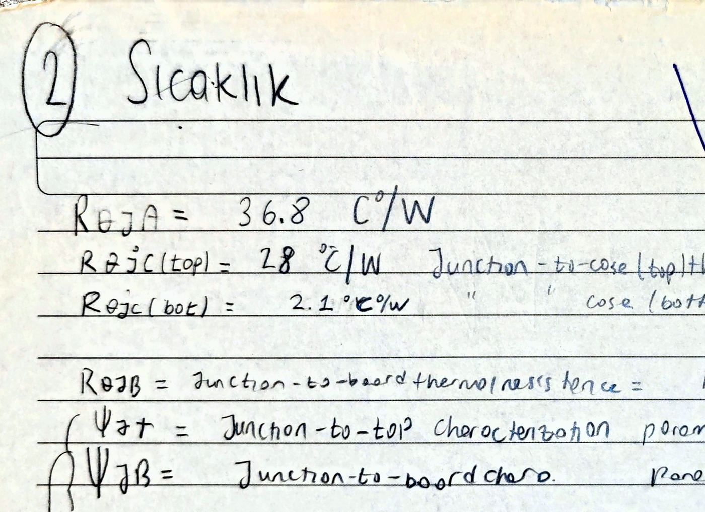

Bu sayfa, `W.107-W.110` zincirindeki genel termal fikri bu kez belirli datasheet parametre isimlerine indiriyor. Yeni proje-ozel guc kaybi hesabi yok; ama termal hesapta hangi parametrenin ne zaman kullanilacagini ayirmak acisindan cok degerli. Bu kisim bir nevi termal parametre sozlugu gibi duruyor.


#### 5.6.5 Bu bolume daha sonra eklenecekler


Bu bolum tamamlanirken su maddeler netlestirilecek:

- secilen MOSFET'in tam datasheet ozeti

- `VDS` marji ve maksimum gerilim gercekleri

- `RDS(on)`'un surme gerilimi ve sicaklikla degisimi

- iletim kaybi hesabi

- switching kaybi hesabi

- gate surucu kaybi ve dead-time etkileri

- gerekiyorsa common-source inductance ve parasitik etkiler

- tahmini junction sicakligi ve termal marj


### 5.7 Bootstrap agi


#### 5.7.1 ODT'den aktarilan metin (`8. mosfetler`)

Bu alt baslikta ODT'deki eski metni govdeye oldugu gibi tasimadim. Bootstrap ve gate-drive tarafinda, defterden gelen sayfalar ve kaynak belgelerle daha guclu ve daha izlenebilir bir akis olustugu icin ana anlatim `5.7.2` altindan devam ediyor.


#### 5.7.2 Bootstrap direncini (`R_{boot}`) hesaplama ve secim mantigi


ODT'den aktarilan metin (`8.1. Bootstrap Direncini (Rboot) Hesaplama ve Seçim Mantığı`, denklemler okunur formatta yeniden yazildi):

Bu bolume ait kaynak-fotolar:


Bu gorsel grubu, bootstrap hesabinin yalnizca denklemden degil fiziksel sarj yolundan da okundugunu gosteriyor. Ozellikle `p31`, low-side MOSFET acikken (`Q2 on`) `BST` dugumunun nasil yeniden sarj oldugunu ve bootstrap kondansatorunun neden her periyotta uygun pencere bulmasi gerektigini gorsel olarak destekliyor. `p42` ve `p54` dahili bootstrap diyodunu daha netlestirirken, `p43` ve `p55` de `BST-HO-SW-LO-PGND` pin grubunun bir arada nasil durdugunu gosterdigi icin bootstrap hesabini gercek pin topolojisine daha kuvvetli bagliyor. `p100` ise ayni mantigin daha genel bir yarim-kopru surucu semasi uzerinden de nasil okunabildigini gosteriyor: high-side MOSFET, low-side MOSFET, gate-driver ve bootstrap kolu ayni cizimde birlikte gorundugu icin `5.7` altindaki bootstrap sezgisini destekleyen yararli bir tamamlayici gorseldir.

1. "Hangi duty?"

PWM'de high-side MOSFET'in en uzun sure acik kaldigi durum, bootstrap kondansatorunun en kisa sarj penceresini verir. ODT notunda verilen degerlerle:

```math
D_{\text{high,max}} = 0.648
```

```math
D_{\text{low,min}} = 1 - D_{\text{high,max}} = 1 - 0.648 = 0.352
```

Yani bootstrap sarji icin kullanilan worst-case pencere, periyodun `%35.2`'lik low-side iletim araligi oluyor.

2. Sarj penceresi ve zaman sabiti

ODT notunda bu adim, $R_{boot} = 2.2\,\Omega$ ve $C_{boot} = 0.1\,\mu\text{F}$ secimiyle tartisiliyor. Standart RC zaman sabiti tanimi ile:

```math
\tau = R_{boot} C_{boot}
= 2.2\,\Omega \times 0.1\,\mu\text{F}
= 0.22\,\mu\text{s}
```

PWM frekansi $332\,\text{kHz}$ icin:

```math
T_{sw} = \frac{1}{f_{sw}}
= \frac{1}{332\,\text{kHz}}
\approx 3.01\,\mu\text{s}
```

Worst-case bootstrap sarj penceresi:

```math
t_{\text{charge,min}} = D_{\text{low,min}} T_{sw}
= 0.352 \times 3.01\,\mu\text{s}
\approx 1.06\,\mu\text{s}
```

Dolayisiyla:

```math
\frac{t_{\text{charge,min}}}{\tau}
= \frac{1.06}{0.22}
\approx 4.82
```

ODT notunda gecen `0.625\,\mu\text{s}` degeri, standart RC zaman sabiti tanimi degildir. Standart tanimla bakildiginda, sarj penceresi yaklasik `4.8\tau` surmektedir. Bu, ideal bir RC sarj modelinde bootstrap kondansatorunun cok buyuk oranda dolabilecegini gosterir.

3. Bootstrap gerilimi

ODT notunda `V_{DD} = 8.4\,\text{V}` ve bootstrap diyot dusumu yaklasik `0.5\,\text{V}` alinmis. Buna gore hedef bootstrap gerilimi:

```math
V_{C_{boot}} \approx V_{DD} - V_{\text{BootDiode}}
= 8.4\,\text{V} - 0.5\,\text{V}
= 7.9\,\text{V}
```

Eger bootstrap kondansatoru worst-case pencerenin basinda tamamen bos kabul edilirse, ideal RC modeliyle bu pencere sonunda ulasilan gerilim:

```math
V_{C_{boot}}(t_{\text{charge,min}})
\approx 7.9\left(1 - e^{-t_{\text{charge,min}}/\tau}\right)
\approx 7.9\left(1 - e^{-4.82}\right)
\approx 7.84\,\text{V}
```

Bu, ODT notundaki "bootstrap voltaji yeterince hizli olusuyor" sonucunu destekler.

4. Kondansatörde depolanan enerji

Bootstrap kondansatorunde depolanan enerji:

```math
E_{\text{cap}}
= \frac{1}{2} C_{boot} V_{C_{boot}}^2
= \frac{1}{2}\cdot 0.1\,\mu\text{F}\cdot (7.9\,\text{V})^2
\approx 3.12\,\mu\text{J}
```

Bu, kondansatorun yaklasik `7.9 V` seviyesine sarj oldugunda depoladigi enerjiyi verir.

5. Direncte yakilan enerji hakkinda dikkat

ODT notunda dirençte yakilan enerji icin ayrica bir hesap niyeti bulunuyor. Ancak bu kisimda kullanilan ifade, mevcut haliyle nihai denklem olarak alinmamalidir. Tam `0 V -> 7.9 V` RC sarj adiminda ideal seri dirençte harcanan enerji, ayni buyukluk mertebesinde:

```math
E_{R,\text{full-step}}
\approx \frac{1}{2} C_{boot} V_{C_{boot}}^2
\approx 3.12\,\mu\text{J}
```

olur. Fakat bootstrap kondansatoru her cevrimde sifirdan sarj olmadigi icin, gercek cevrimsel kayip bundan daha dusuk olur. O yuzden direnç watt secimini yalnizca bu tek enerji hesabina baglamak dogru olmaz.

6. Ilk tepe akimi

Bootstrap sarjinin ilk anindaki yaklasik tepe akimi:

```math
I_{\text{pk}}
= \frac{V_{DD} - V_{\text{BootDiode}}}{R_{boot}}
= \frac{8.4\,\text{V} - 0.5\,\text{V}}{2.2\,\Omega}
\approx 3.59\,\text{A}
```

Bu da bootstrap diyotu ve PCB izlerini, en azindan bu buyukluk mertebesindeki pik sarj akimini tasiyabilecek sekilde dusunmek gerektigini gosteriyor.


Ek not:

Bu bolumde asil muhendislik mantigi su:

- worst-case bootstrap sarj penceresi, $D_{\text{low,min}}$ ile belirlenir
- $R_{boot}$ buyurse sarj yavaslar; cok kuculurse pik akim ve ringing artar
- $R_{boot} = 2.2\,\Omega$ ve $C_{boot} = 0.1\,\mu\text{F}$ secimi, ilk bakista sarj hizi acisindan makul gorunur
- ama direnç guc derecelendirmesi, diyot peak akimi ve bootstrap dugumu ringing davranisi nihai olarak simulasyon veya deneyle yine dogrulanmalidir

Bu bolumde ozellikle su maddeleri sonra tekrar kontrol etmek gerekir:

- $D_{\text{high,max}} = 0.648$
- `VDD` ve diyot dusumunun datasheet ile teyidi
- bootstrap diyotunun peak akim ve ters gerilim marji
- `R_{boot}` seciminin ringing ve sarj hizi acisindan uygunlugu
- gerekiyorsa LTspice / PSpice ile bootstrap dugumu dalga sekli

Bu bes kaynak-foto birlikte okundugunda su ayirim daha gorunur olur:

- `BST / HO / SW` dugumlerinin fiziksel baglantisi
- `C_{BST}`'nin high-side gate surucusunu nasil besledigi
- bootstrap diyotunun LM5146 icinde yer aldigi bilgisi
- gercek semadaki `C_{BST}`, `C_{VCC}` ve `R_{ILIM}` cevresinin birbirinden nasil ayrildigi

O yuzden bu gorseller burada "sadece sema resmi" gibi durmuyor; bootstrap hesabinin hangi fiziksel yapidan turedigini gosteren destek katmani gibi calisiyor.

Defterden aktarilan not (`W.160`):

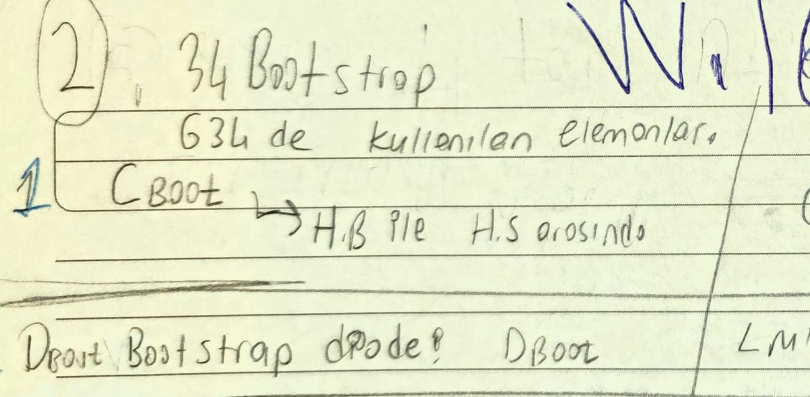

Burada bootstrap aginda kullanilan gercek elemanlar ve bunlarin karttaki / semadaki karsiliklari toplu halde not edilmis. Yeni bir denklem ya da nihai sayisal sonuc sayfasi degil; daha cok hesaplanan buyukluklerin hangi gercek elemanlara baglandigini gosteriyor.

Sayfanin basliginda:

- `G32 ve EVM`

notu dusulmus. Bu da kullanicinin bootstrap agini hem datasheet (`G32`) hem de EVM referansi uzerinden takip ettigini gosteriyor.

Sayfada listelenen ana elemanlar ve baglantilar sunlar:

1. `Cboot`

- `C16 = 0.1 uF`
- `CBST`
- `BST` ile `SW` arasinda

Yani bootstrap kondansatorunun hem fonksiyonel adi (`Cboot` / `CBST`) hem de kart referansi (`C16`) ayni yerde not edilmis.

2. `Dboot`

- bootstrap diyotu
- `LM`'nin icindedir
- `VCC` ile `BST` arasindadir

Bu not, onceki bootstrap hesabinda kullanilan diyot dusumunun harici degil, buyuk olasilikla kontrolcunun ic yapisina ait oldugunu hatirlatiyor.

3. `Rboot`

- `Rboot = R3 = 2.2 \Omega`
- `BST` ile `SW` arasinda
- `CBST` ile seri

Bu, `5.7.2` altinda hesaplanan `R_{boot}=2.2\Omega` degerinin semadaki gercek eleman karsiligini netlestiriyor.

4. `CVCC`

- `CVCC = C25 = 2.2 uF`

ve sayfanin solunda:

- `CVDD Bypass Capacitor`

notu da yer aliyor. Bu da `VCC` / `VDD` bypass elemaninin bootstrap agiyla yakin baglantili dusunuldugunu gosteriyor.

Burada yeni bir bootstrap sonucu yok; ama `Cboot`, `Dboot`, `Rboot` ve `CVCC` elemanlarinin sema/kart karsiliklari tek yerde toplandigi icin cok yararli. `C16 = 0.1 uF`, `R3 = 2.2 \Omega` ve `C25 = 2.2 uF` notlari sonraki BOM ve sema kontrolunde de is gorur.

Defterden aktarilan not (`W.205`):


Burada bootstrap aginin fiziksel baglanti mantigi kendi ciziminle aciklaniyor. Ust kisimda LM5146'nin high-side surucu pinleri ve ust MOSFET birlikte cizilmis:

- `HB / BST` pini
- `HO` pini
- `HS` pini
- ust MOSFET `Q1`
- ve arada `Cboot`

Sayfadaki cizimden guvenle okunan ana fikir su:

- `Cboot`, `HB/BST` ile `HS` arasina baglidir
- `HO` cikisi ise ust MOSFET `Q1`in gate'ini surer
- `HS` dugumu de `SW` ile birlikte hareket eder

Sayfanin altina dusulen en degerli not ise su:

- `Dikkat Cboot dogrudan Q1'in G-S arasina bagli degil`
- `Dolayli bagli gibi`
- `Q1'in driverini besleyen`

Yani bu sayfada kullanici, bootstrap kapasitörunun ust MOSFET'in gate-source'u uzerine dogrudan paralel bir eleman gibi dusunulmemesi gerektigini; asil gorevinin high-side gate surucu katina enerji saglamak oldugunu kendi cizimiyle not ediyor.

`W.205`, `W.160`ta listelenen `HB/HO/HS`, `Cboot` ve `Q1` iliskisini daha sezgisel bir baglanti semasi ile aciyor. Yeni bir `C_{boot}` ya da `R_{boot}` sonucu vermiyor; ama bootstrap kapasitörunun "Q1'in gate-source kapasitörü gibi" okunmamasini acikca not ettigi icin cok degerli.

Defterden aktarilan meta not (`W.166`):

Bu sayfa teknik hesap sayfasi degil; defter aktarim surecinde kullanicinin kendisine bir isaret / durak notu gibi gorunuyor. Ust satirda okunabildigi kadariyla:

- `6.3.4 Bootstrap direnci`
- `Rboot = R3 = 2.2 \Omega kadar`

benzeri bir hatirlatma var.

Sayfanin ortasinda ise buyuk harflerle:

- `Word'e ekledim`
- `W.160`

notu yazilmis.

`W.166` yeni teknik sonuc vermiyor; daha cok defter aktariminin bir noktasinda bootstrap bolumundeki `W.160` civarinin ayri bir belgeye / Word metnine gecirildigini gosteren iz notu gibi. Teknik hesap sayfasi degil ama aktarim surecinin izini tasiyor.

Defterden aktarilan not (`W.167`):


Bu sayfa, bootstrap aginda `C_{VCC}` bypass kondansatorunun `C_{BST}`'ye gore yeterli buyuklukte olup olmadigini kontrol eden kisa bir kural-kontrol sayfasi gibi duruyor. Yeni bir bootstrap denklemi degil; `W.160`ta listelenen gercek elemanlarin basit bir yeterlilik kontrolu gibi okunmali.

Sayfanin basliginda okunabildigi kadariyla:

- `C_{VCC}` cikis / bypass konusu

yer aliyor.

Ardindan kullanici su ana fikri yaziyor:

- `C_{VCC}` kapasitörü, `C_{BST}`'nin ihtiyac duydugu sarji rahatlikla karsilayabilecek dusuk empedansli kaynak gibi davranmalidir

Sayfanin ortasinda not edilen tasarim kurali:

```math
C_{VCC} \gg 10 \times C_{BST}
```

veya ayni anlamda:

- `C_{VCC}` degeri, `C_{BST}`'nin en az `10` kati buyukluk mertebesinde olmalidir

Sayfanin altinda mevcut secilen degerler yerine konuyor:

- `C_{VCC} = 2.2 uF`
- `C_{BST} = 0.1 uF`

ve su karsilastirma yapiliyor:

```math
2.2\,uF > 10 \times 0.1\,uF
```

Yani bu sayfada kullanici, secilen `2.2 uF` `CVCC` degerinin bootstrap agi icin yeterli oldugunu kisa bir tasarim kurali uzerinden kontrol ediyor.

Bu sayfa yeni bir sembolik bootstrap hesabi vermiyor; ama `C25 = 2.2 uF` ile `C16 = 0.1 uF` degerlerini birbirine baglayip cok pratik bir yeterlilik kontrolu yapiyor. `CVCC` seciminin yalniz BOM listesi degil, bilincli bir kural-kontrol sonucu oldugunu gostermesi de burada guclu.

Defterden aktarilan not (`W.171`):


Burada `W.168`de kullanilan `Q_{total}` buyuklugunun nereden geldigi aciliyor. Minimum `C_{boot}` hesabina girecek toplam yuk bilesenleri burada toplaniyor.

Sayfanin ust kisminda once gate ile ilgili temel iliski not edilmis:

```math
C_g = \frac{Q_g}{V_{GS}}
```

Ardindan kullanici, bootstrap kapasitorunun her anahtarlama cevriminde saglamak zorunda oldugu toplam yuk miktarini sozel olarak tarif ediyor:

- MOSFET gate'ini surmek icin gereken yuk
- high-side bolumdeki quiescent / leakage akimlarinin bir periyot boyunca olusturdugu ek yukler

Sayfadaki toplama mantigi okunabildigi kadariyla su sekilde yazilmis:

```math
Q_{total}
=
Q_g
+
I_{HBS}\,\frac{D_{max}}{f_{sw}}
+
I_{HB}\,\frac{1}{f_{sw}}
```

Burada kullanicinin not ettigi bilesenler:

- `Q_g \approx 16 nC`
- `I_{HBS} \approx 5 uA`
- `I_{HB} \approx 80 uA`

ve bunlarin tasarim kosulunda:

- `D_{max} \approx 0.95`
- `f_{sw} \approx 332 kHz`

ile yerine kondugu goruluyor.

Sayfadaki ara sayisal yerlestirmeler okunabildigi kadariyla:

```math
Q_{total}
\approx
16\,nC
+
5\,uA\cdot \frac{0.95}{332\,kHz}
+
80\,uA\cdot \frac{1}{332\,kHz}
```

ve sonucta:

```math
Q_{total} \approx 16.255\,nC
```

bulunuyor. Bu da `W.168`de kullanilan:

```math
C_{boot} > \frac{16.255\,nC}{4.1\,V}
```

adiminin kaynagini netlestiriyor.

Bu sayfa, `W.168`in en kritik girdilerinden biri olan `Q_{total}` degerini acikca turettigi icin cok degerli. `Q_g = 16 nC`, `I_{HBS} = 5 uA` ve `I_{HB} = 80 uA` degerlerinin kaynagi daha sonra datasheet satirlariyla tekrar teyit edilebilir; ama burada kurulan mantik acik ve yeterince temiz.

Defterden aktarilan not (`W.188`):


Burada bootstrap kapasitoru hesabina girecek parametreler uygulama notu / datasheet tarafindan toplanmis. Yeni bir nihai `C_{boot}` sonucu degil; `W.171-W.172-W.168` zincirine girdi veren parametreler burada bir araya geliyor.

Sayfanin ustunde ana rol acikca yazilmis gibi gorunuyor:

- bootstrap capacitor, high-side gate surucu devresine enerji depolayan elemandir

Sayfada uygulama notundan / datasheet'ten toplandigi gorulen ana parametreler sunlar:

- `V_{IN,max} = 65\,V` (`max steady-state input voltage` notuyla)
- `V_{DRV} = 12\,V`
- `\Delta V_{BST} \approx 0.5\,V` (`steady-state dropped bootstrap voltage`)
- `\Delta V_{boost,max} \approx 3\,V`
- `t_{BST,rr} \approx 400\,ns`
- `t_{ON,TL} \approx 20\,\mu s`

Sayfanin alt tarafinda ayrica bootstrap hesabina girecek ek bilesenler de not edilmis gorunuyor:

- `Q_g` tarafina ait gate-charge dusuncesi
- `R_{GS}`: gate-to-source pull-down direnci
- bootstrap diyotunun ileri yon dusumu:
  - `V_{F,BST} \approx 0.6\,V` (`I ≈ 100 mA`, `T_J ≈ 80°C` civari not dusulmus)
- high-side seviye kaydiricinin / leak akimlarinin buyuklukleri:
  - `I_{HB} \approx 0.13\,mA`
  - `I_{Q,HS} \approx 1\,mA`

Bu sayfanin en degerli yani, sonraki bootstrap hesabinda kullanilan bazi parametrelerin ezbere degil, uygulama notu / datasheet satirlarindan toplanmis oldugunu gostermesidir.

Burada kendi basina son `C_{boot}` degeri yok; ama `W.171`deki `Q_{total}` mantigi ve `W.168`deki minimum `C_{boot}` hesabi icin gerekli kaynak parametrelerin nereden geldigi net goruluyor. `65 V` ve `12 V` gibi daha genel uygulama-notu parametreleri ile proje-ozel `7.5 V` / `16 nC` hesaplarinin ayri oldugu da burada goruluyor.

Defterden aktarilan not (`W.189`):


Burada bootstrap kapasitoru hesabinda tek bir durum degil, birden fazla calisma kosulunun ayri ayri kontrol edildigi hatirlatiliyor. Yeni bir nihai `C_{boot}` sonucu degil; `C_{BST}` hesabinda hangi senaryolara tek tek bakildigi goruluyor.

Sayfanin ustunde, okunabildigi kadariyla, su ana fikir yazilmis:

- `CBST'i hesaplayan denklem`
- `3 tane farkli acidan hesaplaniyor`

Hemen altinda da bu uc senaryo not edilmis gibi gorunuyor:

- `transient-off`
- `transient-on`
- `steady-state`

Ve kullanici acikca su yorumu dusuyor:

- bunlardan hangisi en buyukse onu secmek gerekir

Yani burada ana mesaj, `C_{BST}` degerinin tek bir formulle degil, birden fazla worst-case kosul arasindan secildigidir.

Sayfanin orta kismina dogru, `CVCC` ile `CBST` arasindaki buyukluk iliskisi de yeniden hatirlatiliyor:

- `CVCC = 2.2 uF`
- `CBST = 0.1 uF`

ve uygulama notundaki:

```math
C_{VCC} \gg C_{BST}
```

fikrinin yeniden not edildigi goruluyor.

Sayfanin alt notlari, bootstrap kapasitorunun fiziksel rolunu da tekrar vurguluyor gibi duruyor:

- high-side gate surucusunun ihtiyac duydugu enerji once `C_{BST}` uzerinde depolanir
- `C_{BST}` her sarj oldugunda bu enerji `VCC` hattindan gelir
- dolayisiyla `CVCC` ile `CBST` dusuncesi birbirinden kopuk degil, ayni enerji zincirinin parcalaridir

Burada yeni bir sayisal bootstrap sonucu yok; ama `C_{BST}` seciminde birden fazla durumun kontrol edilip en buyuk gereksinimin alinmasi gerektigi acikca not edilmis. `CVCC` ile `CBST` iliskisini tekrar hatirlatmasi da `W.167`, `W.169`, `W.185-W.187` hattiyla guzel uyusuyor.

Defterden aktarilan not (`W.172`):


Burada `C_{boot}` boyutlandirmasina daha basit bir tasarim kurali uzerinden bakiliyor. Ayrintili `Q_{total}` hesabindan once yapilan hizli bir yeterlilik kontrolu gibi okunuyor.

Sayfanin ust kisminda once bootstrap diyotunun ileri yon dusumu not edilmis. Okunabildigi kadariyla ana fikir su:

- `VCC` ile `BST` arasinda bootstrap diyotu vardir
- bunun ileri yon dusumu yaklasik `0.7 V - 0.9 V` mertebesindedir

Sayfadaki temel iliski su sekilde yazilmis gorunuyor:

```math
V_{BST} \approx V_{CC} - V_{D,fwd}
```

ve sayfadaki sayisal yerlestirme:

```math
7.5\,V \approx 8.4\,V - 0.9\,V
```

Yani kullanici burada, `V_{GS}` / `V_{BST}` tarafinda yaklasik `7.5 V` elde etmek icin `VCC` tarafinin `8.4 V` civarina ulasmasi gerektigini not ediyor.

Ardindan gate yukunu, esdeger bir gate kapasitansi gibi dusunen hizli iliski yaziliyor:

```math
C_g = \frac{Q_g}{V_{GS}}
```

Sayfadaki sayisal yerlestirme:

```math
C_g = \frac{16\,nC}{7.5\,V} \approx 2.133\,nF
```

Sonra kullanici, bootstrap kapasitoru icin yaygin pratik kuralı uyguluyor:

```math
C_{boot} > 10 \times C_g
```

Buradan da:

```math
C_{boot} > 21.33\,nF
```

sonucuna gidiliyor.

Sayfanin sag altinda secilen gercek parca ile karsilastirma da yazilmis:

- `C16 = 0.1 uF`
- yani secilen bootstrap kapasitörü bu hizli kurali zaten rahatlikla sagliyor

Bu sayfa, `W.171` ve `W.168`deki daha ayrintili bootstrap hesabindan farkli olarak hizli bir "gate charge tabanli" yaklasim kullaniyor. `C_{boot} > 10 C_g` kurali ile bulunan `21.33 nF`, secilen `0.1 uF` degerin yeterli oldugunu kaba ama faydali bicimde dogruluyor.

Defterden aktarilan not (`W.168`):


Bu sayfa, bootstrap kapasitorunun minimum gerekli buyuklugunu ve ayni zamanda neden keyfi bicimde "cok buyuk" secilmemesi gerektigini toparlayan bir uygulama sayfasi gibi duruyor.

Sayfanin ust kisminda kullanici once bootstrap dugumunde izin verilen gerilim dusumunu not ediyor. Okunabildigi kadariyla ana sayisal fikir su:

```math
\Delta V_{HB} \approx 8.4\,V - 0.9\,V - 3.4\,V \approx 4.1\,V
```

Burada kullanici, `V_{BST}` tarafinda belirli bir dusume izin verilebilecegini; ancak bu dususun UVLO / `BST-SW undervoltage detection` sinirina ulasmamasi gerektigini hatirlatiyor. Sayfada ayrica:

- `V_{BST} \approx 7.5 V`

notu da yer aliyor.


Ardindan minimum `C_{boot}` icin klasik sarj-denklemine gidiliyor:

```math
C_{boot} > \frac{Q_{total}}{\Delta V_{HB}}
```

Sayfadaki sayisal yerlestirme okunabildigi kadariyla:

```math
C_{boot} > \frac{16.255\,nC}{4.1\,V} \approx 3.96\,nF
```

Yani bu sayfa, secilen `0.1 uF` bootstrap kapasitorunun yalnizca yeterli degil, bu alt sinirin oldukca uzerinde oldugunu gosteriyor.

Sayfanin orta kisminin ana mesaji da su:

- bootstrap kapasitoru bosaldikca uzerindeki gerilim duser
- bu gerilim belirli bir sinirin altina inerse UVLO tetiklenir ve high-side surme kesilebilir
- bu nedenle `C_{boot}` cok kucuk secilmemelidir

Ancak sayfanin altinda kullanici bu kez ters yone dair de onemli bir pratik not dusuyor:

```math
i_{peak} = C_{BST}\,\frac{dV_{SW}}{dt}
```

ve su fiziksel yorumu yaziyor:

- her anahtarlamada bootstrap diyodundan / yolundan tepe akim gecer
- `C_{boot}` buyudukce bu tepe akim artar
- diyot ve PCB uzerinde ek gerilim bozulmalari / stres olusabilir

Bu nedenle sayfanin son mesaji:

- `C_{boot}` cok kucuk olmamali
- ama gereksiz buyuk de secilmemelidir

Burada `C16 = 0.1 uF` degerinin yalniz BOM ezberi olmadigi; once minimum gereksinime gore sonra da peak akim sezgisine gore dusunuldugu goruluyor. `C_{boot} > 3.96 nF` sonucu ile secilen `0.1 uF` arasinda buyuk marj oldugu acik. Bir yandan da cok yerinde bir pratik sinir koyuyor: `C_{boot}` buyudukce bootstrap yolu uzerindeki tepe akim yukselir.

Defterden aktarilan not (`W.169`):


Bu sayfa, bootstrap aginin yaninda yer alan `VCC` bypass kondansatoru icin ayri bir secim / yerlestirme notu gibi duruyor. Yeni bir bootstrap denklemi degil; `CVCC` seciminde dikkat edilen pratik kurallari toparliyor.

Sayfanin basliginda okunabildigi kadariyla:

- `High-Voltage Bias Supply Reg, VCC`
- `CVCC`

notlari yer aliyor.

Sayfanin ust yarisinda kullanici, `VCC` ile `AGND` arasinda kullanilacak bypass kondansatoru icin temel yerlesim ve komponent secimi kurallarini topluyor. Guvenle okunabilen ana fikirler sunlar:

- `VCC` ile `AGND` arasina seramik bir bypass kapasitörü konulmalidir
- bu kondansator `VCC` ve `AGND` pinlerine fiziksel olarak yakin yerlestirilmelidir
- `X7R` benzeri seramik dielektrik tercih edilmelidir

Sayfadaki aralik notu okunabildigi kadariyla:

- `1 - 6 uF` mertebesinde seramik `CVCC` dusuncesi

Bu da `W.160`ta not edilen `C25 = 2.2 uF` seciminin mantik cercevesiyle uyumludur.

Sayfanin orta kisminin ana mesaji, `CVCC`'nin `VCC` hattindaki ani akim ihtiyacini karsilayan yerel bir rezervuar gibi davrandigidir. Kullanici bunu su cizgide dusunuyor:

- `VCC` hattindaki ani akim cekisleri once bu bypass kondansatorunden karsilanir
- boylece `VCC` dugumu daha sakin / kararlı kalir

Ardindan daha pratik bir sinir not ediliyor:

- `CVCC` cok kucuk secilirse `VCC` bypass etkisi zayiflar
- ama gereksiz buyuk secilirse ilk acilista sarj edilmesi daha uzun surer

Sayfanin alt kisminda kullanici, dahili `VCC regulator` / `LDO` akim siniri ile startup davranisini bagliyor. Guvenle okunan ana fikirler:

- dahili `VCC` regulatorunun akim siniri vardir
- cihaz ilk acildiginda bu akim, once `CVCC` kondansatorunu sarj etmeye gider
- `CVCC` gereksiz buyuk secilirse `VCC` geriliminin yukselmesi ve dolayisiyla startup / soft-start davranisi gecikebilir

Bu sayfa yeni bir sayisal `CVCC` hesabi vermiyor; ama `W.160` ve `W.167` ile birlikte okununca `C25 = 2.2 uF` seciminin sadece sema referansi degil, bypass yerlesimi ve startup davranisi acisindan da dusunulmus bir karar oldugu anlasiliyor. Buradaki `1 - 6 uF` mertebesi de secilen `2.2 uF` ile gayet uyumlu.

Defterden aktarilan not (`W.185`):


Burada `W.169`daki `VCC / C_{VCC}` bypass notunun neden gerekli oldugu daha temel bir fiziksel sezgiyle anlatiliyor. Yeni bir nihai bootstrap denklemi degil; surucu / kontrolcu yakininaki yerel bypass kapasitörunun neden zorunlu oldugunu anlatiyor.

Sayfanin ustunde, okunabildigi kadariyla, su baslik ve niyet notlari yer aliyor:

- `Calculating device bypass capacitor value`
- `bu sayfadan itibaren once LM'yi yap`

Sayfanin ust yarisindaki madde notlarindan guvenle cikabilen ana fikirler sunlar:

- MOSFET switching sirasinda surucu tarafinin anlik akim cekisi olur
- bu akim icin dusuk empedansli yerel bir kaynak gerekir
- uzaktaki ana besleme yolu bu ani akimi her zaman yeterince hizli saglayamayabilir
- bu nedenle `bypass cap`, surucu / kontrolcu pinlerine yakin bir "yerel rezervuar" gibi davranir

Sayfanin orta kismina cizilen sema eskizi de, bu dusunceyi gostermek icin kullanilmis gibi duruyor:

- `Vbias / VCC` hatti
- PWM / driver blogu
- gate direnci
- MOSFET gate yolu
- ve bu hatta yakin yerlestirilen bir `bypass capacitor`

Kullanici notlari, bypass kondansatorunun iki ana rolunu vurguluyor gibi gorunuyor:

1. switching aninda gereken kisa sureli akimi yerel olarak vermek
2. `VCC` dugumunu daha sakin tutmak / dalgalanmayi azaltmak

Sayfanin altindaki kisa notlarda da:

- `LM'deki CVCC`
- `bypass`

ifadeleri tekrar edilerek, bu sayfanin dogrudan `LM5146` uzerindeki `CVCC` bypass kararina baglandigi goruluyor.

Burada yeni bir `uF` sonucu uretilmiyor; ama `W.169`daki `CVCC` secim mantigina iyi bir fiziksel gerekce ekleniyor: surucu yolu anlik akimi uzak kaynaktan degil, once yerel bypass kondansatorunden cekmek istiyor. Sayisal secimden cok "neden bypass var?" sorusunun cevabi burada.

Defterden aktarilan not (`W.186`):


Burada `W.185`te anlatilan `driver bypass capacitor` ihtiyaci bu kez sayisal bir alt-sinir hesabina donusuyor. Yeni genel kavramsal not degil; surucu / `CVCC` bypass kapasitörunun minimum buyuklugu kaba bir denklemle kontrol ediliyor.

Sayfanin ustundeki ana fikir, okunabildigi kadariyla, su yone cikiyor:

- gate'leri suren akim darbeleri once yerel bir depodan gelmelidir
- bu yerel depo da `driver bypass capacitor` / `C_{VCC}` olarak dusunulur

Sayfanin ortasinda yazilan temel iliski, okunabildigi kadariyla, su sekildedir:

```math
C_{bypass}
\approx
\frac{Q_{B,HI}\,\dfrac{D_{max}}{f_{drive}} + Q_g}
{\Delta V}
```

Sayfadaki notlardan guvenle okunabilen degisken anlamlari sunlardir:

- `Q_g`: MOSFET'in toplam gate charge'i
- `\Delta V`: bypass kapasitörü uzerinde izin verilen gerilim dusumu

Sayfada yapilan sayisal yerlestirme, okunabildigi kadariyla, su yone cikiyor:

```math
C_{bypass}
\approx
\frac{2.5\,mA \cdot \dfrac{0.95}{400\,kHz} + 15\,nC}
{0.1\,V}
\approx
27.1\,nF
```

Bu sonuc, secilen gercek `C_{VCC}` degeri ile birlikte okununca su yoruma goturuyor gibi duruyor:

- gereken minimum bypass kapasitesi onlarca `nF` mertebesindedir
- mevcut `uF` seviyesindeki `CVCC` secimi bunun oldukca ustundedir

Sayfanin alt kismindaki kullanici notlari da, bu bypass kondansatorunun:

- surucuya "frekansa bagli yerel bir depo" gibi davrandigini
- ve `LM` tarafindaki `CVCC` kararina bagli oldugunu

ima ediyor gibi gorunuyor.

Burada `W.169` ve `W.185`teki kavramsal bypass ihtiyaci ilk kez sayisal minimum deger hesabina baglaniyor. Bazi kelimeler tam net okunmasa da, denklem omurgasi ve `27.1 nF` sonucu yeterince net. Bu sonuc da `C25 = 2.2 uF` gibi secilmis bir `CVCC` degerinin buyuk marjla yeterli oldugunu dusunduruyor.

Defterden aktarilan not (`W.187`):

Burada `W.186`da kullanilan `driver / CVCC bypass capacitor` denklemi tek satirda ozetleniyor. Yeni sayisal sonuc vermiyor; daha cok ayni formulu temizce yeniden yazip sabitledigin bir ozet.

Sayfada okunabildigi kadariyla su iliski yeniden yaziliyor:

```math
C_{bypass} = C_{VCC}
\approx
\frac{I_{xxHI}\,\dfrac{D_{max}}{f_{drive}} + Q_g}
{\Delta V}
```

Burada sembollerin yazimi sayfada biraz kisaltilmis olsa da, formun `W.186`daki bypass kapasitoru alt-sinir mantigiyla ayni oldugu acik gorunuyor:

- surucunun kendi akim bileseni
- gate charge bileseni
- izin verilen gerilim dusumu `\Delta V`

Bu sayfa yeni bir sayi uretmiyor; ama `W.186`daki denklemin tek satir ozet seklinde yeniden yazildigini gosteriyor. Bu da bypass kapasitörü hesabinin gecici bir karalama degil, tutulmak istenen temel bir iliski oldugunu dusunduruyor.


## 6. Kontrolcu ve Kompanzasyon


### 6.1 Modulator ve power stage modeli


#### 6.1.1 Genel kontrol yapisi


Taslakta kontrol dongusu su bloklar uzerinden dusunuluyor:

- modulator

- power stage, yani cikis filtresi ve yuk

- hata yukselteci / kompanzator

- geri besleme bolucusu


Bu cerceve, voltage-mode control dusunce yapisi ile uyumludur. Kompanzatorun gorevi, power stage'in kutup ve sifirlarini hesaba katarak istenen crossover frekansi ve faz marjini saglamaktir.


Buck Converter Schematic

Bu iki ekran goruntusu, `6.1` bolumundeki soyut kontrol dili ile daha sonra kullanilan Type-III ve plant denklemleri arasinda iyi bir kopru kuruyor. `p85`, en sade haliyle `Vref -> compensator -> modulator -> filter -> Vout` dongusunu gosteriyor. `p86` ise ayni mantigin buck guc katina uyarlanmis daha zengin bir versiyonunu veriyor: modulator, adaptive gate driver, `L_f`, `C_out`, `R_{ESR}`, `R_{DAMP}` ve geri besleme bolucusu ayni cizim uzerinde birlikte okunabiliyor. Bu nedenle bu iki gorsel, `6.1.1 Genel kontrol yapisi` altinda korunmaya degerdir.


#### 6.1.2 Modulator blogunun rolu


ODT'den aktarilan metin (`9.2. Modulator Bloğu`):

> Frekansa bağımlı değildir.
>
> Duty Cycle'ı belirler. Compensator bloğunda gelen işareti artarsa işaretinin genişliği artar, duty cycle artar, Q1 ana mosfet daha uzun süre açık (`on`) iletimde kalır.

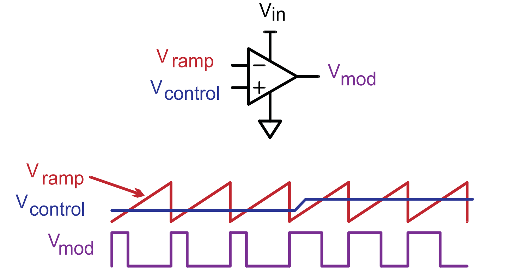

Voltage Mode Modulator

> Modulator bloğunun transfer function'ı:

```math
H_{\text{mod}}(s)
= \frac{V_{in}}{V_{\text{ramp}}}
= k_{FF}
= 15\,\text{V/V}
```

> Kullandığımız LM5146-Q1'ın input voltage feedforward özelliği var. Bu özellik sayesinde modülatör kazancı sabit kalıyor. Örneğin giriş gerilimi $V_{in}$ artarsa, $V_{\text{ramp}}$ da artarak $k_{FF} = 15\,\text{V/V}$ değerinin sabit kalmasını sağlıyor.


Ek not:

Bu bolumde korunacak ana fikir, voltage-mode kontrol yapisinda modulator blogunun frekansa bagimli bir filtre gibi davranmamasidir; asil gorevi, kompanzator cikisini PWM gorev oranina cevirmektir. Bu nedenle:

- kompanzator cikisi artarsa high-side iletim suresi artar
- duty cycle artar
- guc katina aktarilan ortalama enerji artar

LM5146-Q1 icindeki input-voltage feedforward yapisi nedeniyle, rampa genligi giris gerilimiyle birlikte olceklenir. Bu da modulator kazancinin yaklasik sabit tutulmasini saglar ve kontrol tasarimini sadeleştirir. Bu projede ilk yaklasim olarak:

```math
V_{\text{ramp}} \approx \frac{V_{in}}{15}
```

ve dolayisiyla

```math
H_{\text{mod}}(s)
= \frac{V_{in}}{V_{\text{ramp}}}
\approx 15
```

alinabilir.


#### 6.1.3 Cikis filtresi ve yuk


ODT'den aktarilan metin (`Çıkış Filtresi ve Yük`):

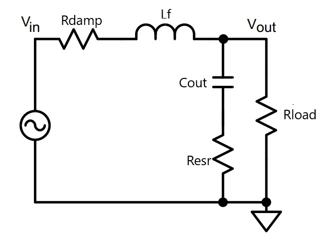


Çıkış Filtresi ve Yük

Bu sade esdeger devre, `H_{filter}(s)` ifadesinin arkasindaki fiziksel resmi daha net gorunur hale getiriyor: seri kolda `L_f` ve `R_{damp}`, cikis dugumunde ise `C_{out} + R_{esr}` kolu ile `R_{load}` birlikte dusunuluyor. Bu nedenle `6.1.3` altinda kullanilan kutup, sifir ve sönüm notlarinin yalnizca formule degil; belirli bir esdeger devre varsayimina dayandigi da acik kalmis oluyor.

> Cikis filtresi ve yuk icin kullanilan transfer fonksiyonu:

```math
H_{\text{filter}}(s)
= \frac{V_{out}}{V_{in}}
= \frac{1 + C_{out} R_{esr} s}{a_0 + a_1 s + a_2 s^2}
```

Burada katsayilar:

```math
a_0 = 1 + \frac{R_{Damp}}{R_{load}}
```

```math
a_1 = \frac{L_F}{R_{load}} + R_{esr} C_{out} + R_{Damp} C_{out}
+ \frac{R_{Damp} R_{esr} C_{out}}{R_{load}}
```

```math
a_2 = \left(\frac{R_{load} + R_{esr}}{R_{load}}\right)L_F C_{out}
```

> Sayisal yerlestirme:

```math
a_0 = 1 + \frac{21.13\,\text{m}\Omega}{1.59\,\Omega} = 1.01329
```

```math
a_1 =
\frac{6.8\,\mu\text{H}}{1.59\,\Omega}
+ (0.26\,\text{m}\Omega)(70\,\mu\text{F})
+ (21.13\,\text{m}\Omega)(70\,\mu\text{F})
+ \frac{(21.13\,\text{m}\Omega)(0.26\,\text{m}\Omega)(70\,\mu\text{F})}{1.59\,\Omega}
= 5.774 \times 10^{-6}
```

```math
a_2 =
\left(\frac{1.59\,\Omega + 0.26\,\text{m}\Omega}{1.59\,\Omega}\right)
(6.8\,\mu\text{H})(70\,\mu\text{F})
= 4.761 \times 10^{-10}
```

```math
C_{out} R_{esr} = (70\,\mu\text{F})(0.26\,\text{m}\Omega) = 1.82 \times 10^{-8}
```

> Yaklasik katsayi bicimi:

```math
H_{\text{filter}}(s)
\approx
\frac{1 + 1.82 \times 10^{-8} s}
{1.01329 + 5.774 \times 10^{-6} s + 4.761 \times 10^{-10} s^2}
```

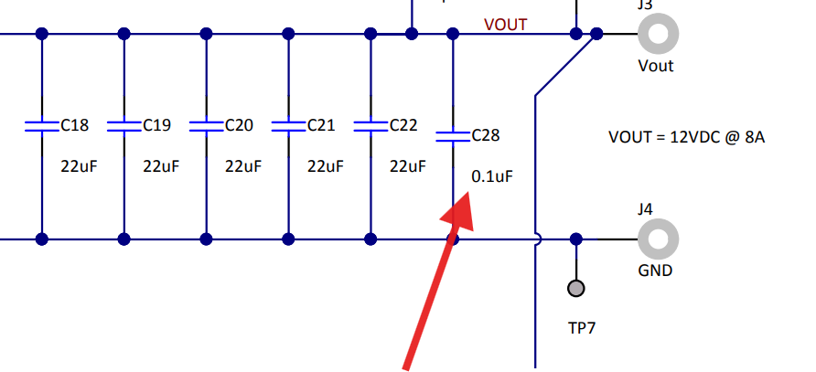

Tasarımımızda kullandığımız çıkış capacitorleri

> Iki farkli turde cikis capacitor'u mevcut. $H_{\text{filter}}(s)$ transfer fonksiyonu hesabinda $0.1\,\mu\text{F}$ degerindeki `C28` capacitor'unu ihmal ettik.
>
> Sebebi: ihmal edilmis bicimi yeterince dogru; bu capacitor esas olarak daha yuksek frekans bolgesinde etkili.

Bu bolume ait kaynak-fotolar:

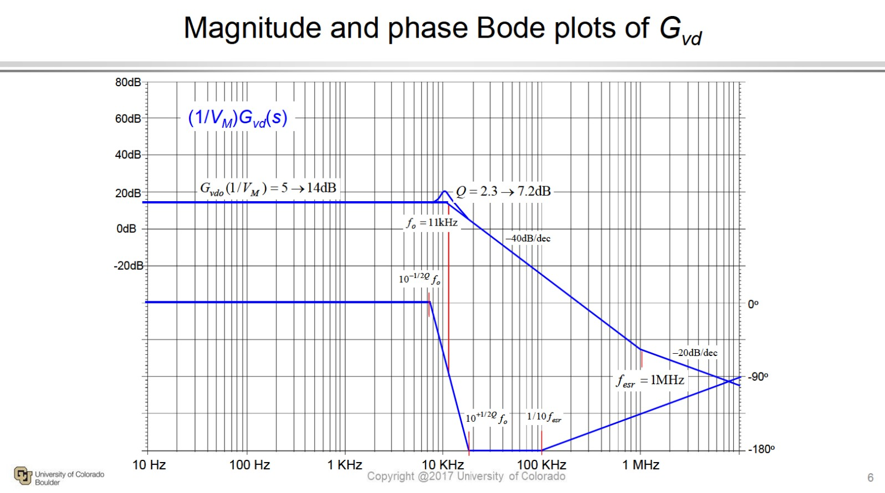

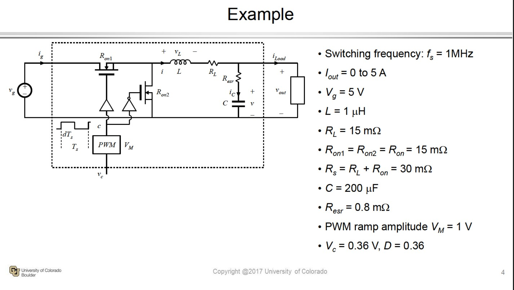

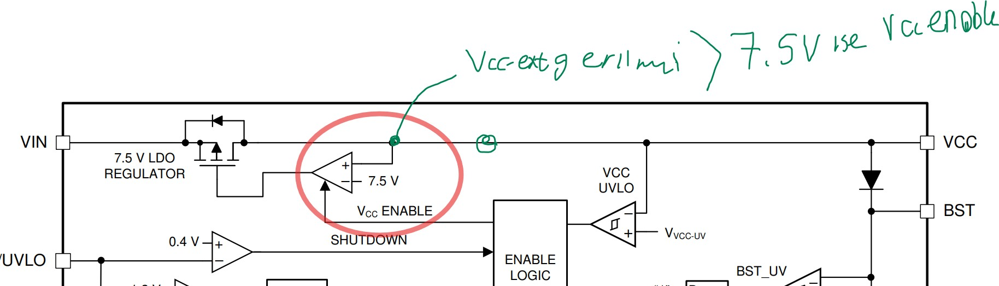


Ek not:

Bu bolumde ana fikir, kontrol dongusunun plant kisminin yalnizca bobinden degil, cikis capacitor bank'i ve yuk ile birlikte olusan ikinci dereceden bir yapidan gelmesidir. Burada:

- $L_F$ enerji depolayan ana kutbu etkiler
- $C_{out}$ cikis dugumunun dinamiklerini belirler
- $R_{esr}$ ESR sifirini olusturur
- $R_{load}$ ve varsa sönumle ilgili direncler kutup yerlerini degistirir

$C_{28} = 0.1\,\mu\text{F}$ gibi cok kucuk bir MLCC'nin ilk transfer fonksiyonu hesabinda ihmal edilmesi, ancak bu elemanin etkisi crossover civarinda gercekten kucukse kabul edilebilir. Genelde bu tip cok kucuk kapasiteler ana enerji depolama elemani olmaktan cok, daha yuksek frekansli spike ve ringing bastirma tarafinda etkili olur. Bu nedenle kompanzator hesabinda ilk yaklasimda ihmal edilmesi makul olabilir; yine de son kararin bode veya AC sweep ile dogrulanmasi gerekir.

Bu uc foto birlikte, plant dusuncesini yalnizca denklemler uzerinden degil; ornek buck guc kati, `G_{vd}` ifadesi ve buna ait Bode sezgisi uzerinden de kurdugunu gosteriyor. `6.1.3` altinda cikis filtresi ve yuk modelinin gorsel arka plani olarak yerinde duruyorlar.

Defterden aktarilan not (`W.116`):

Bu sayfa, kontrol tasariminda kullanilan power-stage sayilarini tek sayfada topluyor gibi gorunuyor. Yeni denklem uretmekten cok, plant tarafinda hangi sayisal ozetin kullanildigini gosteren bir `snapshot` gibi okunmali.


Sayfada okunabilen ana notlar sunlar:

- cikis capacitor bankasi:
  - `C10-C22` grubundan toplam `22 uF`
  - `C28 = 0.1 uF`
  - toplam etkin ana kapasite olarak `70 uF` notu dusulmus
- `ESR_{Ceq}` icin yaklasik:

```math
ESR_{Ceq} \approx 1.3\,m\Omega
```


Iki ayri ekran goruntusunde de ayni mertebede `ESR \approx 1.3 m\Omega` okunmasi, burada kullanilan `ESR_{Ceq}` buyuklugunun tek bir rastgele cursor okumasina degil, tekrar eden bir datasheet / arac teyidine dayandigini gosteren iyi bir destek katmani olusturuyor.

- bobin:
  - `L_F = 6.8 uH`
  - `DCR \approx 0.88 m\Omega`

Sayfada ayrica damping / kayip tarafi icin su not yer aliyor:

- `R_{damp}` ifadesi, high-side / low-side MOSFET iletim direnci ve bobin `DCR`'sinin duty ile agirliklandirilmis bileskesi gibi yaziliyor

ve sayfa sonunda:

```math
R_{damp} \approx 21.13\,m\Omega
```

sonucu not edilmis.

Alt kisimda rezonans frekansi da tekrar yazilmis:

```math
\omega_0 \approx \frac{1}{\sqrt{L_F C_{out}}}
```

ve buna bagli:

```math
f_0 \approx 7.309\,kHz
```

`W.116`, `6.1.3 Cikis filtresi ve yuk` bolumunde kullanilan `70 uF`, `6.8 uH`, `R_{damp} \approx 21.13 m\Omega`, `f_0 \approx 7.309 kHz` gibi sayilari tek yerde topluyor. Yeni bir alternatif yontem degil; mevcut plant modelinin sayisal girislerini veren guclu bir defter ozeti gibi okunmali.


#### 6.1.4 Bu bolumde korunacak ayrim


Su an icin iki ayri katman oldugu acik yazilmalidir:

- genel yontem ve blok diyagram mantigi

- gercek tasarima ait sayisal transfer fonksiyonu


`G103_comp.txt` icindeki sayilar faydali bir ornek / calisma dosyasidir; ancak bunlarin tamami dogrudan bu proje icin son deger olarak alinmamalidir. Nihai transfer fonksiyonu, bu projede secilen gercek `L`, `C`, `ESR`, `DCR`, yuk ve modulator parametrelerinden yeniden kurulacaktir.

Bu ayrimi destekleyen bir diger kaynak-foto:

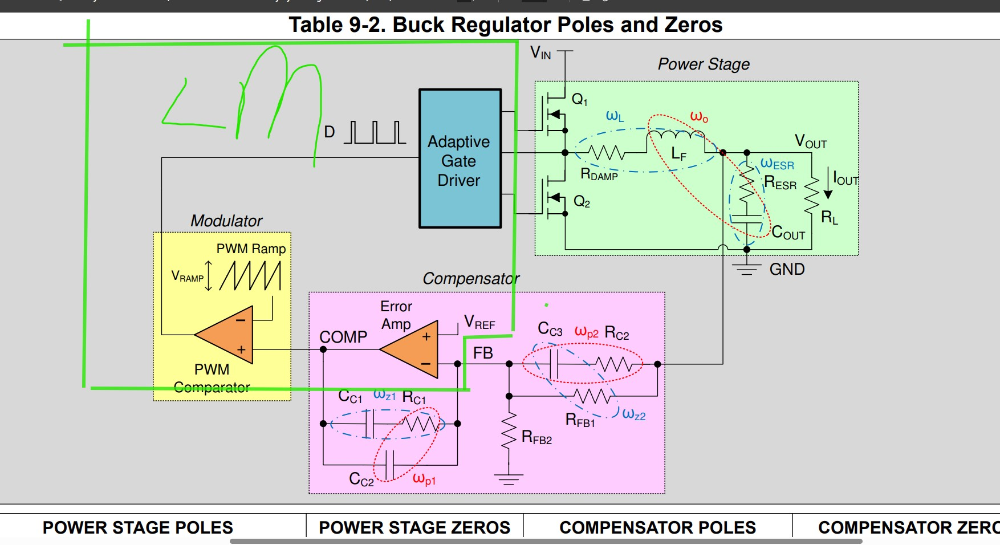

Bu foto, modulator, power stage ve compensator kutup / sifirlarinin ayni cizim uzerinde birlikte goruldugu bir ozet tablo gibi okunuyor. `6.1.4` altinda, genel yontem ile proje-ozel sayisal model arasindaki ayrimin gorsel karsiligi olarak iyi calisiyor.


### 6.2 K-factor yaklasimi


#### 6.2.1 Neden bu yontem?


ODT'den aktarilan metin (`9. kontrolcü tasarımı`):

> Bitirme Projesi 1 dersinde kontrolcü tasarımını [1] kaynağındaki gerilim kontrollü Type 3 PID Compensator yöntemini izleyerek yapmıştım. Bu dönemde, [4] kaynağındaki K factor yöntemi izleyerek yapacağım.


Ek not:

Bu parca, yalnizca baska bir kompanzator topolojisine gecisi degil, ayni kontrol tasarim problemini daha sistematik bir yontemle yeniden kurma niyetini gosteriyor. K-factor yaklasimi burada ozellikle su nedenle degerli:

- hedef crossover frekansinda gereken faz katkisini dogrudan hesaplamaya zorlar
- kompanzator kazancini plant ve modulator ile birlikte ele alir
- Type-III eleman degerlerini daha izlenebilir bir akista turetmeyi kolaylastirir


#### 6.2.2 Taslaktaki akisin ozeti


Yerel notlar ve `G95_04_K_FACTOR_CAN_HOCA.txt` icindeki ornek akis su mantigi izliyor:

1. hedef crossover frekansi secilir

2. hedef faz marji secilir

3. plant ve modulatorun crossover frekansindaki fazi bulunur

4. kompanzatorun saglamasi gereken ek faz bulunur

5. kompanzatorun crossover frekansindaki gereken kazanci bulunur

6. buradan `K` faktoru hesaplanir

7. Type-III agin `R` ve `C` degerleri turetilir


Bu akis, tasarimi deneme-yanilma yerine daha kontrollu hale getirir.


#### 6.2.3 Scriptlerde gorulen ilk ipuclari


Yerel scriptte su genel iliskiler kullaniliyor:

- crossover frekansi kabaca $f_t = 0.1\,f_s$

- gerekli kompanzator kazanci, modulator ve plant buyukluklerinden turetiliyor

- $K = \tan^2\!\left(\dfrac{\phi_{comp} + 90^\circ}{4}\right)$ tipinde standart K-factor iliskisi kullaniliyor


Bu iliskiler, taslaktaki yontemin teorik omurgasini veriyor. Ancak burada yine ayni dikkat gerekli:

- scriptteki ornek `60 V -> 15 V`, `100 kHz` ve belirli `L/C/R` degerleri dogrudan bu projenin son degerleri degil

- bu nedenle sadece yontem aynen alinacak; sayisal sonuc bu proje icin yeniden hesaplanacak


#### 6.2.4 Bu projede K-factor'un gorevi


Bu tasarim ozelinde K-factor yontemi ile sonunda su ciktilar uretilmek isteniyor:

- secilen `332 kHz` anahtarlama frekansi icin uygun bir crossover frekansi

- hedef faz marji

- Type-III kompanzator komponentleri

- acik ve kapali cevrim bode yorumu


Bu bolum, ileride MATLAB ve LTspice ile yapilacak loop dogrulamasinin teorik baslangic noktasi olacak.


##### Defter taramasi: `W.1-W.24`

Defterden aktarilan not:

- `W.1-W.6`: [EX7.1 Buck Converter Closed-Loop Design (Type 3 Compensator).pdf](./references/pdfs/EX7.1%20Buck%20Converter%20Closed-Loop%20Design%20%28Type%203%20Compensator%29.pdf), [G2_Buck Converter Design Part 2 - Closed-Loop LM5146 - Video Version.pdf](./references/pdfs/G2_Buck%20Converter%20Design%20Part%202%20-%20Closed-Loop%20LM5146%20-%20Video%20Version.pdf) ve [G32_lm5146-q1.pdf](./references/pdfs/G32_lm5146-q1.pdf) uzerinden, crossover frekansinda gereken kazanc ve faz katkisi turetiliyor. Bu sayfalar daha cok yontemin ogrenilmesi ve isaret-konvansiyonu oturtulmasi icin kullanilmis gorunuyor.
- `W.7-W.10`: op-amp acik-cevrim modeli, `GBW / A_{dc}` iliskisi, `KFF = 15 V/V` notu ve `G98` Figure 2 / Figure 3 kullanim izleri var. Bu grup, modulator ve hata yukselteci modelini destekliyor.
- `W.11-W.12`: faz marji ve plant fazinin sayisal olarak tekrar hesaplandigi ara sayfalar. `PM = 55 deg` hedefinin bu iterasyonda da korundugu goruluyor.
- `W.13-W.16`: Type-III kompanzator eleman degerleri icin sayisal hesaplar yapiliyor. Bu aralikta en az iki farkli iterasyon var.
- `W.17-W.19`: current-limit / `R_{ilim}` hesabi. EVM'deki `619 Ohm` referans degeri ile yerel hesap karsilastiriliyor.
- `W.20-W.24`: Type-III kutup-sifir mantigi, `Kmid`, `f_c`, `f_o`, `f_{esr}` ve geri besleme bolucusunun kompanzatorla iliskisi uzerine kavramsal notlar var.

Bu grubun devaminda secilen bazi kucuk el yazisi parcalar, `W.1-W.9` ile kurulan teorik cercevenin `W.10-W.19` sayfalarinda nasil sayisal degerlere yaklastigini gosteriyor:


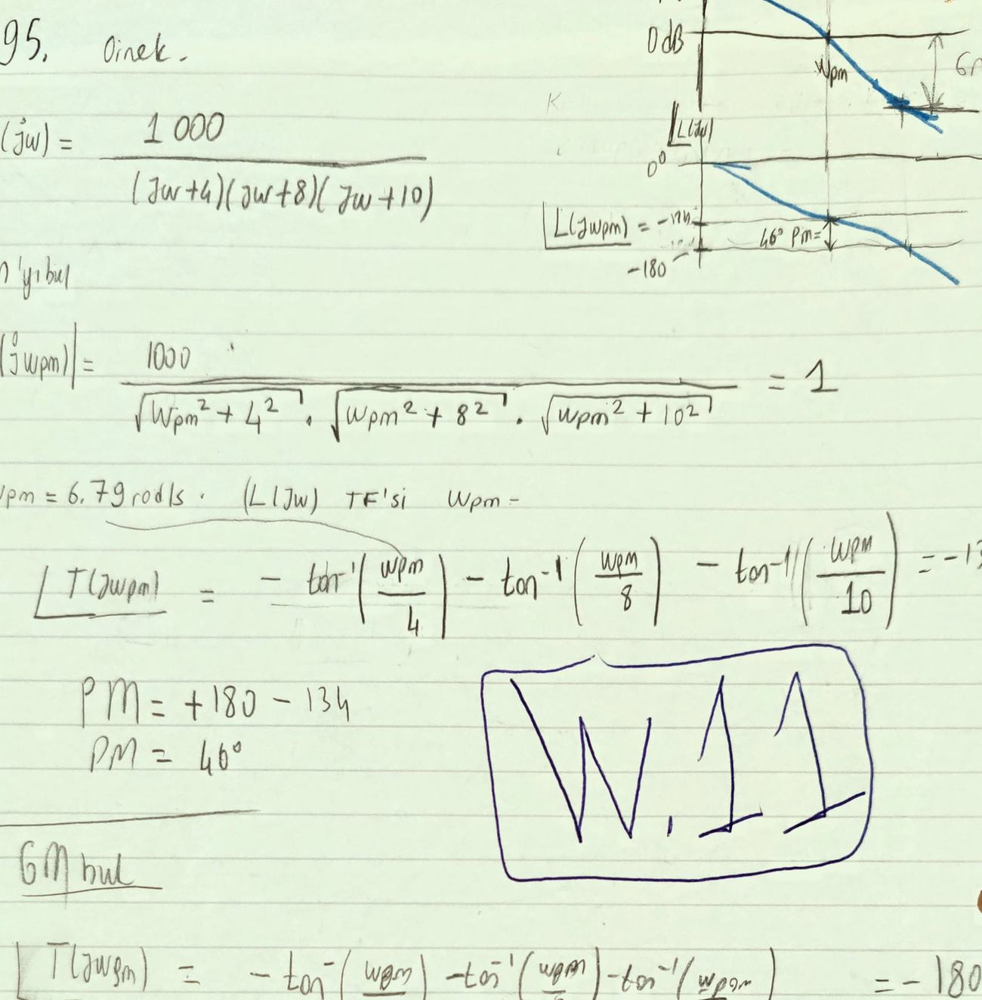


Bu ilk uc sayfa, `W.1-W.9` grubunun yalnizca soyut bir kaynak ozetinden ibaret olmadigini; faz marji ve plant fazi tarafinin sayisal olarak tekrar tekrar kontrol edildigini gosteren iyi ara izlerdir.


Bu dort sayfa birlikte okununca, kompanzatorun tek hamlede secilmedigi; alternatif iterasyonlar icinden gecilerek `26.4k / 1.6k / 6.65k / 768 / 4.7n / 120p / 1n` ailesine yaklasildigi daha iyi goruluyor.


Bu uc sayfa da `W.17-W.19` grubunun yalnizca "bir direnç sectim" notu olmadigini; `RDS(on)` tabanli current-sensing baglaminda `Rilim` ve `Cilim` tarafinin bilincli olarak kurgulandigini gosteriyor.

Bu grubun son halkasinda ise `W.20-W.24`, current-limit tarafindan yeniden kompanzator ve frekans yerlestirme mantigina donuyor:


Bu bes sayfa birlikte okununca, `W.1-W.19` grubunun yalnizca tek tek formuller degil; ayni zamanda `Kmid`, `f_c`, `f_o`, `f_{ESR}` ve feedback bolucu oraninin kompanzatorla nasil iliskilendirildigini arayan bir yerlesim calismasi oldugu daha net goruluyor.

`R_{ilim}` / current sensing baglamini destekleyen kaynak-foto:


Bu gorsel, `ILIM` pininin ideal bir "soyut akim limiti" degil; ya `RDS(on)` tabanli ya da shunt tabanli bir current-sensing mantiginin parcasi olarak dusunuldugunu gosteren iyi bir arka-plan referansi. `W.17-W.19` grubunun yaninda current-limit hesabinin fiziksel baglamini guclendiriyor.


Bu ikinci gorsel, onceki current-sensing referansina daha kritik bir ayrinti ekliyor: `RDS(on)` modunda `ILIM` akisinin `T_J` ile degistigi acikca goruluyor. Bu da `R_{ilim}` hesabinin yalnizca tek bir oda sicakligi katsayisi degil, sicakliga bagli bir current-source davranisiyla iliskili oldugunu hatirlatarak `W.17-W.19` hattini teknik olarak daha saglam bagliyor.

Ek not (ikinci tur netlestirme - `W.1`):


`W.1`, artik daha net bicimde su kaynak zincirine oturuyor:

- `EX7.1` tarafinda `L(j\omega) = M(j\omega)\,F(j\omega)\,G_3(j\omega)` ve crossover'da unity-gain sarti
- `G2` tarafinda ayni `modulator + filter/load + compensator` ayrimi
- `G32` tarafinda ise LM5146 icin `V_{IN} / V_{RAMP} = 15` modulator kazanci

Bu nedenle bu sayfa, "crossover frekansinda kompanzatorun gerekli kazancini bulma" adimi olarak okunmali.

Sayfada guvenle okunan ana akis sunlardir:

Crossover frekansi:

```math
f_t = 35\,\text{kHz}
```

Modulator kazanci:

```math
M = \frac{V_s}{V_{ramp}} = 15
```

Crossover noktasinda toplam loop gain'in `1` olmasi gerekiyor. Sayfadaki ana iliski:

```math
\lvert L(j\omega_t)\rvert
=
\lvert M(j\omega_t)\rvert
\cdot
\lvert F(j\omega_t)\rvert
\cdot
\lvert G_3(j\omega_t)\rvert
=
1
```

Sayfada bulunan plant / filter buyuklugu:

```math
\lvert F(j\omega_t)\rvert \approx 0.045356
```

Unity-gain kosulu kullanilarak gerekli kompanzator kazanci:

```math
\lvert G_3(j\omega_t)\rvert
=
\frac{1}{\lvert M(j\omega_t)\rvert \cdot \lvert F(j\omega_t)\rvert}
=
\frac{1}{15 \cdot 0.045356}
\approx
1.46985
```

Bu buyuklugun `dB` cinsinden karsiligi:

```math
20\log_{10}\!\big(\lvert G_3(j\omega_t)\rvert\big)
\approx
3.3454\,\text{dB}
```

Kisa yorum:

Bu sayfanin anlattigi sey su: `35 kHz` crossover noktasinda, modulator kazanci ve plant kazanci birlikte dusunuldugunde, kompanzatorun o frekansta yaklasik `1.46985 V/V` ya da `3.3454 dB` kazanc vermesi gerekiyor.

Buradaki ara sayisal adimlarin bazilarinin son basamaklari foto uzerinden cok net okunmasa da, sayfanin yaptigi islem ve vardigi sonuc kaynak yontemle tutarlidir. `W.1` bu yuzden serbest bir karalama degil; `EX7.1 / G2` yonteminin kullanicinin kendi `35 kHz` tasarim hedefiyle uygulanmis ilk temiz kazanc sayfasi gibi duruyor.

Bu ilk kontrol / kompanzasyon batch'inden secilen bazi ek el yazisi parcalar da ayni problemi farkli acilardan kurdugunu gosteriyor:


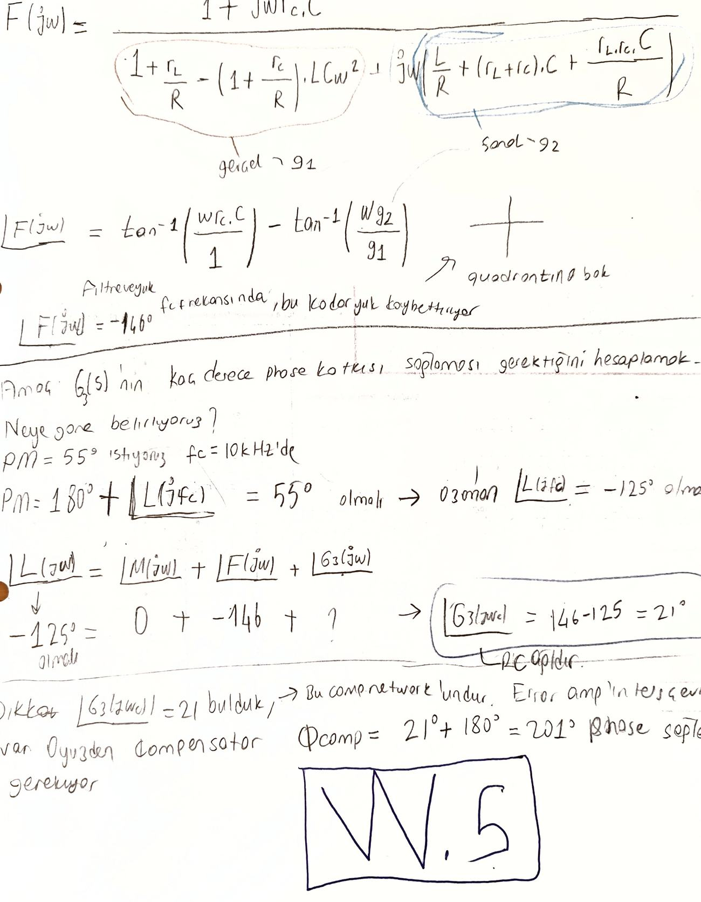


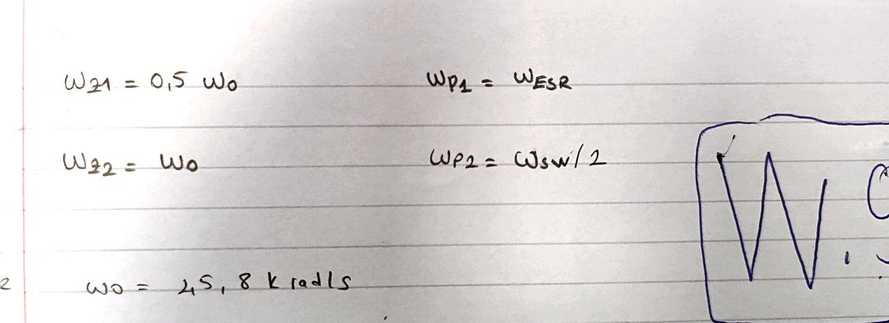

Bu batch'in tamami tek bir kronolojik iterasyon degil; ayni konu uzerinde birkac farkli deneme ve yaklasim var. `W.13` ile `W.15-W.16` ayni nihai komponent setini vermiyor; `W.13` daha cok alternatif/ara iterasyon gibi. `W.23-W.24` icindeki bazi `Kmid` ve `RFB1` iliskileri de eski `16.5 kOhm` bolucu uzerinden gidiyor olabilir. Buna karsilik `W.14-W.16` BOM'la daha guclu bicimde uyusuyor ve nihai adaya en yakin kisim gibi duruyor.

Bu batch'ten su ilk aday komponent seti cikiyor:

- `R11 / R1 / RFB1 = 26.4 kOhm`
- `R10 / RFB2 = 1.6 kOhm`
- `R6 / R2 / RC1 = 6.65 kOhm`
- `R9 / R3 / RC2 = 768 Ohm`
- `C1 = 120 pF`
- `C2 = 4.7 nF`
- `C3 = 1.0 nF`
- `R4 / R_{ilim} = 576 Ohm`

Ek not:

Bu grup, projedeki kontrolcu bolumunun artik yalnizca "Type-III kullanilacak" seviyesinde olmadigini gosteriyor. Gercek resistor ve capacitor secimlerine yaklasilmis durumda. Ama burada yine ayni ayrim akilda tutulmali:

- dogru ama nihai olmayan hesap
- nihai tasarima yaklasan hesap
- teyit / capraz kontrol amacli hesap

Bu nedenle `W.1-W.24`, topluca tek bir "nihai sonuc" olarak degil, ayni kontrol problemi uzerinde olusan tasarim izi olarak okunmalidir.

Ek not (calculator teyidi):

`LM5146_quickstart_calculator_revB1.xlsm` dosyasinin `Design Regulator` sayfasi da ayni nihaiye yakin kompanzator ailesini veriyor:

- `RFB1 = 26.4 kOhm`
- `RFB2 = 1.58 kOhm`
- `RC1 = 6.65 kOhm`
- `RC2 = 768 Ohm`
- `CC1 = 4.7 nF`
- `CC2 = 120 pF`
- `CC3 = 1.0 nF`
- `f_c = 35 kHz`
- `f_{p2} = 166 kHz`

Bu nedenle workbook, `W.13` veya `W.115` gibi eski `16.5 kOhm / 60 kHz` cizgilerini degil; `W.14-W.16` ile belirginlesen ve satin alinmis BOM'a daha yakin duran nihai kompanzator cizgisini guclu bicimde destekliyor


#### 6.2.5 Compensator topolojisi ve temel model


ODT'den aktarilan metin (`Compensator`):

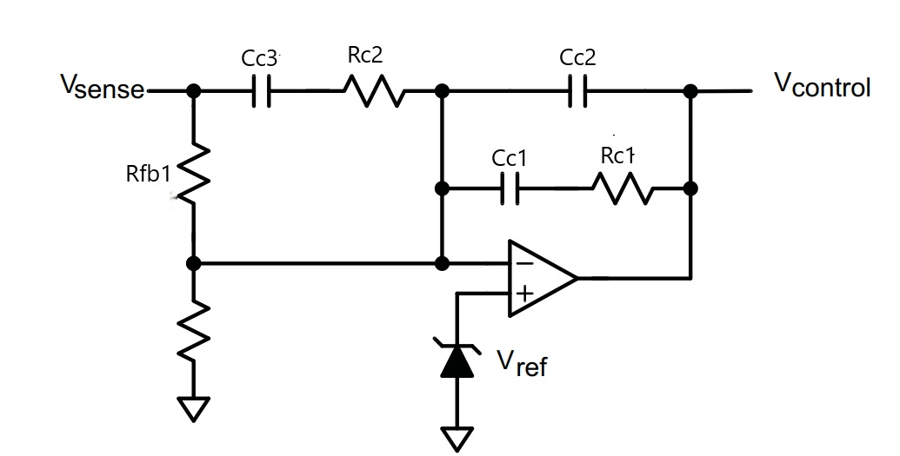


Type 3 Compensator Devresi

Bu ekran goruntusu dogrudan LM5146 devresine ait degil; ama Type-III kompanzatorun kutup / sifir / egim mantigini daha genel bir analog kompanzator ornegi uzerinden dusundugunu gosterdigi icin burada destekleyici bir gorsel olarak iyi calisiyor. Yani "ayni controller" degil, ama "ayni kompanzasyon sezgisi" var. Sonraki iki ekran goruntusu ise bu sezginin artik LM5146 tarafi icin daha sistematik okunmaya baslandigini gosteriyor: biri kutup/sifir konumlarini topoloji uzerinde acikca isaretliyor, digeri de `Rc1`, `Rc2`, `RFB1`, `RFB2`, `Cc1`, `Cc2`, `Cc3` gibi sembollerle gercek komponent adlarinin nasil eslestirildigini daha okunur hale getiriyor.

Bu yeni ekran goruntusu ise ayni Type-III agin daha sade bir op-amp realizasyonunu veriyor. Ozellikle `V_{sense}`, `V_{control}`, `V_{ref}`, `Rfb1`, `Rc1`, `Rc2`, `Cc1`, `Cc2`, `Cc3` etiketlerinin ayni cizim uzerinde birlikte gorulmesi, `W.73`, `W.84`, `W.85` ve `W.113` tarafinda gecen notasyonun hangi fiziksel dala karsilik geldigini daha okunur hale getiriyor.

> Compensator transfer function:

```math
H_{\text{compensator}}(s)
= \frac{V_{\text{control}}}{V_{\text{sense}}}
= \frac{H_{\text{error-amp,ol}}(s)}
{1 + H_{\text{error-amp,ol}}(s)\,\beta(s)}
```

> Error amplifier open-loop modeli:

```math
H_{\text{error-amp,ol}}(s)
= \frac{A_{VOL}}
{1 + \dfrac{s}{\omega_{\text{opamp}}}}
```

```math
\omega_{\text{opamp}}
= 2\pi\,\frac{GBW}{A_{VOL}}
```

Defterden aktarilan not (`W.201`):

Burada hata yukseltecinin acik-cevrim modeli ve `GBW / A_{VOL}` iliskisi ayri bir defter sayfasinda tekrar kuruluyor.


Sayfanin ustunde su notlar yer aliyor:

- `A_{VOL} = 94 dB = DC gain`
- `GBW = minimum gain bandwidth = 6.5 MHz`

Sayfada acik-cevrim hata yukselteci davranisi su bicimde not edilmis:

```math
A_{\text{op-amp}}(f)
\approx
\frac{A_{low}}{1 + \dfrac{f}{f_{unity}}}
```

ve yanina da:

```math
A_{DC}(dB) = 20 \log_{10}(A_{VOL})
```

iliskisi yazilmis.

Defterdeki sayisal adimlar su sekilde ilerliyor:

```math
20 \log_{10}(Kazanc) = 94
```

```math
\frac{94}{20} = \log_{10}(Kazanc)
```

```math
10^{4.7} \approx 50118
```

Yani:

```math
A_{VOL} \approx 50118
```

Ardindan sayfada:

```math
GBW = Kazanc \times f
```

iliskisi kullanilarak:

```math
6.5\,\text{MHz} = 50118 \times f
```

ve buradan:

```math
f \approx 129.7\,Hz
```

sonucu yazilmis.

Sayfanin altina da:

- `Error Amplifier open-loop compensation pole`

notu dusulmus.

`W.201`, yukaridaki `H_{\text{error-amp,ol}}(s)` ve `\omega_{\text{opamp}} = 2\pi\,GBW/A_{VOL}` iliskisinin defterde ayri bir sayfada tekrar kuruldugunu gosteriyor. Yeni bir `R-C` secimi vermiyor; ama hata yukseltecinin sonlu acik-cevrim kazancinin ve baskin kutbunun nasil dusunuldugunu gostermesi burada onemli.

> Bu kompanzator hesabinda kullanilan cikis filtresi ve yuk transfer fonksiyonu:

```math
H_{\text{filter}}(s)
= \frac{V_{out}}{V_{in}}
= \frac{1 + C_{out} R_{esr} s}{a_0 + a_1 s + a_2 s^2}
```

Burada:

```math
a_0 = 1 + \frac{R_{Damp}}{R_{load}}
```

```math
a_1 = \frac{L_F}{R_{load}} + R_{esr} C_{out} + R_{Damp} C_{out}
+ \frac{R_{Damp} R_{esr} C_{out}}{R_{load}}
```

```math
a_2 = \left(\frac{R_{load} + R_{esr}}{R_{load}}\right)L_F C_{out}
```

> Sayisal yerlestirme:

```math
a_0 = 1 + \frac{21.13\,\text{m}\Omega}{1.59\,\Omega} = 1.01329
```

```math
a_1 =
\frac{6.8\,\mu\text{H}}{1.59\,\Omega}
+ (0.26\,\text{m}\Omega)(70\,\mu\text{F})
+ (21.13\,\text{m}\Omega)(70\,\mu\text{F})
+ \frac{(21.13\,\text{m}\Omega)(0.26\,\text{m}\Omega)(70\,\mu\text{F})}{1.59\,\Omega}
= 5.774 \times 10^{-6}
```

```math
a_2 =
\left(\frac{1.59\,\Omega + 0.26\,\text{m}\Omega}{1.59\,\Omega}\right)
(6.8\,\mu\text{H})(70\,\mu\text{F})
= 4.761 \times 10^{-10}
```

```math
C_{out} R_{esr} = (70\,\mu\text{F})(0.26\,\text{m}\Omega) = 1.82 \times 10^{-8}
```

```math
H_{\text{filter}}(s)
\approx
\frac{1 + 1.82 \times 10^{-8} s}
{1.01329 + 5.774 \times 10^{-6} s + 4.761 \times 10^{-10} s^2}
```

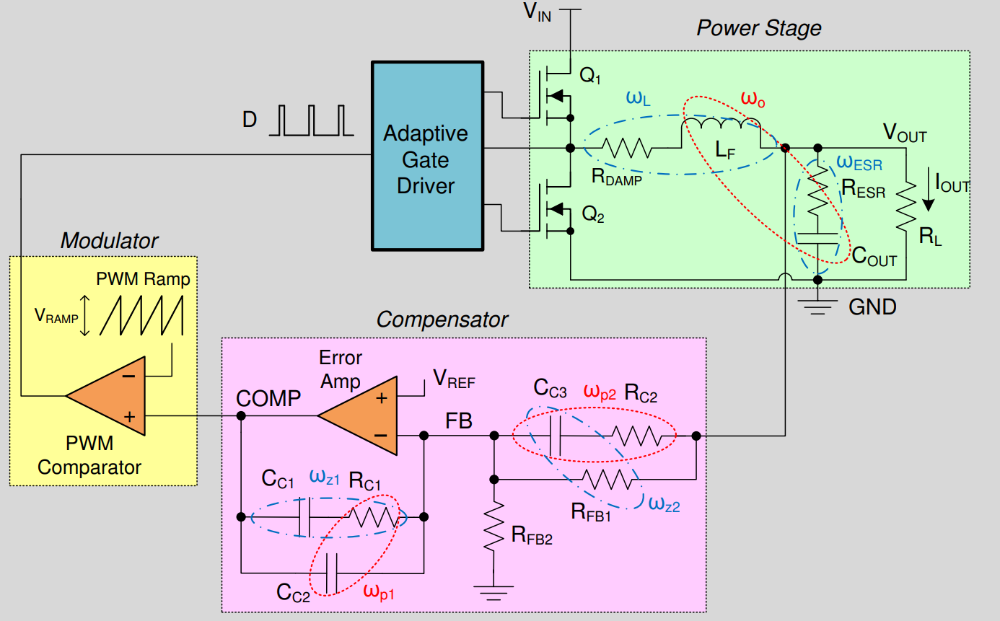

LM5146-Q1'nin Buck Regulator Poles and Zeros


Ek not:

Bu bolumde artik sadece "Type-III kompanzator kullanilacak" demekle yetinmiyoruz; kompanzatorun analitik olarak hangi bloktan geldigi de acik hale geliyor. Burada temel mantik su:

- sonlu acik-cevrim kazanca sahip hata yukselteci, `beta(s)` geri besleme agi ile birlikte kapali-cevrim kompanzatoru olusturur
- `H_{\text{compensator}}(s)` kontrol dugumundeki gerilimi sekillendirir
- bu blok, modulator ve power-stage ile carpilarak acik-cevrim donguyu belirler

Bu nedenle kompanzator tasarimi yalnizca `R` ve `C` secimi degil; ayni zamanda su uc ifadenin birlikte dusunulmesidir:

```math
H_{\text{open-loop}}(s)
= H_{\text{mod}}(s)\,H_{\text{filter}}(s)\,H_{\text{compensator}}(s)
```

Buradaki Type-III topoloji mantiklidir; ancak bu, komponent degerlerinin otomatik olarak dogru oldugu anlamina gelmez. Nihai `R/C` secimi, gercek plant, hedef crossover frekansi ve faz marji ile birlikte sonraki adimda yapilacaktir.

Defterden aktarilan not (`W.84`):

Burada artik Type-III kompanzatorun yalnizca topolojik olarak cizilmesinden cikilip kutup-sifir yerlestirmesi ve komponent iliskileri tarafina gecildigi goruluyor. Sayfanin ust kismina genel kompanzator formu yazilmis; el yazisindaki isaretler tam net olmamakla birlikte ana fikir su:

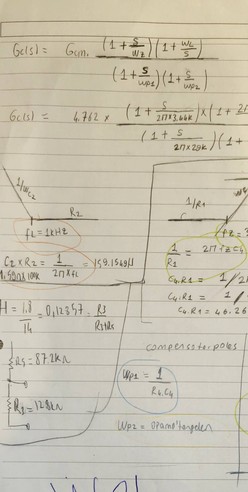

```math
G_c(s)
\sim
G_{cm}
\cdot
\frac{\text{sifir terimleri}}{\text{kutup terimleri}}
```

ve altinda da bu ifadenin belirli frekans yerlestirmeleriyle sayisal hale getirilmeye calisildigi goruluyor.

Sayfada guvenle okunabilen ana frekans yerlesimleri sunlar:

- bir dusuk frekans sifiri:
  ```math
  f_{z1} \approx 1\,kHz
  ```
- ikinci sifir:
  ```math
  f_{z2} \approx 3.44\,kHz
  ```
- bir yuksek frekans kutbu:
  ```math
  f_{p2} \approx 29\,kHz
  ```

Sayfada ayrica, Type-III agdaki bazi `R-C` ciftlerinin bu frekanslara nasil baglandigi not edilmis. El yazisindan acikca secilen iliski tipleri su sekilde okunuyor:

```math
C_2 R_2 \approx \frac{1}{2\pi f_{z1}}
```

ve

```math
C_4 R_1 \approx \frac{1}{2\pi f_{z2}}
```

Benzer sekilde, alt kisimda `compensator poles` ve `zeros` diye ayrilmis bir bolgede, kompanzatorun kutup-sifir mantigi bir kez daha not edilmis. Sayfada:

```math
H = \frac{1}{14} \approx 0.12857
```

notu da yer aliyor; bu, geri besleme bolucusu / sense orani ile kompanzator kazanci arasindaki baglantiya isaret ediyor olabilir.

`W.84`, `W.73`teki "Type-III agin yapisi nedir?" sorusundan sonra gelen ilk ciddi kutup-sifir yerlestirme sayfasi. Yeni nihai komponent setini tek basina kesinlestirmiyor; ama `f_{z1}`, `f_{z2}` ve `f_{p2}` gibi hedef frekanslarin artik komponent iliskilerine baglandigini gosteriyor. Sayfadaki bazi sayisal ayrintilar silik oldugu icin, burada en guvenli olan frekans etiketlerini ve iliski tiplerini korumak.

Defterden aktarilan not (`W.85`):

Burada `W.84`teki kutup-sifir yerlestirmesi bu kez belirli bir aday kompanzator komponent seti ile sayisal olarak kontrol edilmeye calisiliyor. Sayfanin sol tarafinda okunan aday degerler sunlar:


- `R_{c2} \approx 100 \Omega`
- `R_{FB1} \approx 21 k\Omega`
- `C_{c3} \approx 1 nF`
- `R_{c1} \approx 8.06 k\Omega`
- `C_{c1} \approx 4.7 nF`
- `C_{c2} \approx 100 pF`

Sayfanin ust notunda, `\omega_{p1}` icin su tip bir yaklasim yazilmis:

```math
\omega_{p1}
\approx
\frac{1}{R_{c1}\,(C_{c1}\parallel C_{c2})}
\approx
\frac{1}{R_{c1}\,C_{c2}}
```

Bu yaklasim, `C_{c1} \gg C_{c2}` oldugu icin paralel esitgerin yaklasik `C_{c2}` tarafindan belirlendigini soyluyor.

Sayfada bundan hareketle yuksek frekans kutuplari icin su ara sonuclar not edilmis:

```math
\omega_{p1}
\approx
\frac{1}{8.06k \cdot 100p}
\approx
1.24 \times 10^6 \, \text{rad/s}
```

```math
\omega_{p2}
\approx
\frac{1}{100 \cdot 1n}
\approx
10^7 \, \text{rad/s}
```

Alt kisimda ise sifir tarafina geciliyor ve `C_{c1}` ile `C_{c2}` toplam/etkin etkisi uzerinden dusuk frekansli sifirin hesaplanmaya calisildigi goruluyor. Sayfada son satira dogru yaklasik:

```math
f_{z1} \approx 4.334\,kHz
```

gibi bir sonuc not edilmis.

`W.85`, `W.84`te teorik olarak yerlestirilen kutup-sifirlari bu kez belirli bir aday `R-C` setiyle kontrol ediyor. "Hangi formula hangi komponent ciftiyle bagli?" sorusunu daha somut hale getiriyor. Sayfadaki komponent degerlerini dogrudan nihai kabul etmemek gerek; ama kompanzator tasariminin artik kavramsal seviyeden cikarak gercek eleman degerleriyle sinanmaya basladigi cok net. `f_{z1} \approx 4.334 kHz` sonucu da `W.84`teki `3.44 kHz` notuyla ayni buyukluk mertebesinde.

Defterden aktarilan not (`W.142`):

Burada `W.85`te sayisal olarak yoklanan aday Type-III kompanzator komponent setinin bu kez frekans ekseninde renkli bir Bode-insasi gibi cizildigi goruluyor. Yeni nihai sonuc sayfasi degil; secilen `R-C` aginin kutup ve sifir katkilarinin nasil ust uste bindigini gorsellestiren teknik bir iz.

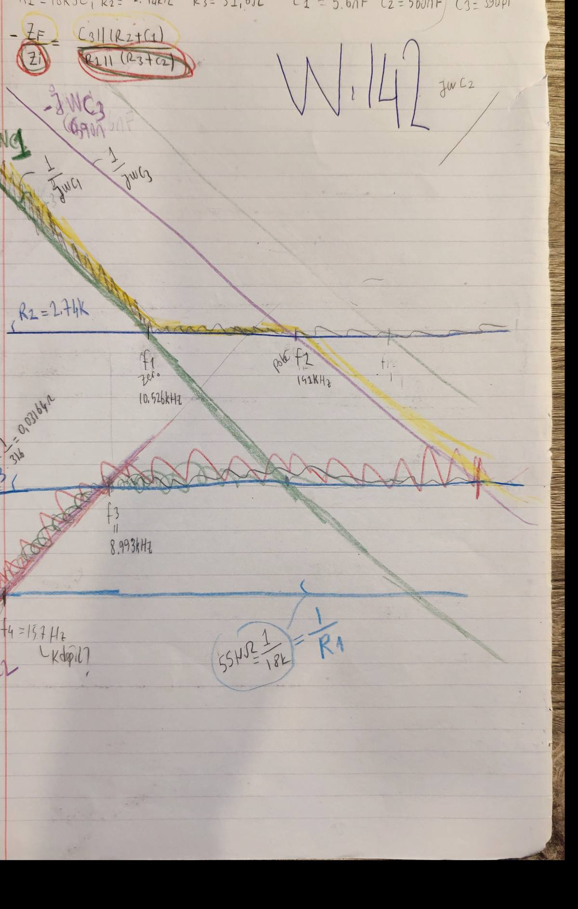

Sayfanin ust kismina yazilan aday komponent seti, okunabildigi kadariyla, su sekilde:

- `R_1 \approx 18 k\Omega`
- `R_2 \approx 2.74 k\Omega`
- `R_3 \approx 31.6 \Omega`
- `C_1 \approx 56 nF`
- `C_2 \approx 5600 pF`
- `C_3 \approx 290 pF`

Sayfanin sol ustunde yine `Z_F / Z_1` orani yazilmis ve `Z_F` ile `Z_1` terimleri renkli olarak ayristirilmis. Buradaki ana fikir, kompanzatorun farkli `R-C` kollarinin Bode egimlerine ayri ayri katkisini gormektir.

Sayfadaki renkli dogrularin ve notlarin anlattigi ana seyler sunlar:

- bir kolda integrator benzeri `-20 dB/dec` katkisi
- bazi kollarda sifir geldikce egimin duzelmesi
- yuksek frekans kutuplari geldikce egimin tekrar asagi donmesi
- boylece toplam Type-III ag cevabinin, tek tek `R-C` parcalarinin cebirsel toplami degil frekans-alaninda ust uste binmis hali oldugu

Sayfada ayrica bazi frekans isaretleri de goruluyor; ancak rakamlarin bir kismi tam net olmadigi icin burada yalnizca su guvenli fikir alinmali:

- birden fazla kirilim frekansi ayni sayfada isaretlenmis
- bunlar `W.84-W.85`te hesaplanan kutup/sifir noktalarinin grafik karsiliklari gibi dusunulmus

Sayfanin alt kismina dusulen:

```math
\frac{1}{R_1} \approx 55\,\mu S \approx \frac{1}{18k}
```

notu da, kullanicinin bu agi yalnizca frekans olarak degil iletkenlik/empedans seviyeleri acisindan da gozunden gecirdigini gosteriyor.

Burada yeni bir `f_z` veya `f_p` sonucu yok; daha cok `W.84-W.85`teki sayisal yerlestirmenin grafik/egim tarafi kuruluyor. Bu acidan guclu; cunku kompanzatorun yalnizca formullerle degil, Bode egimleri ustunden de dusunuldugunu gosteriyor. Sayfadaki komponent degerleri ve frekans etiketleri okunabildigi kadariyla aday bir iterasyona ait; nihai BOM gibi ele alinmamali.

Defterden aktarilan not (`W.143`):

Burada `W.142`nin hemen devami var. Artik aday kompanzator komponentlerinden dogrudan kirilim frekanslari cekiliyor ve altta bunlar renkli Bode parcalari uzerinde tekrar yerlestiriliyor. Yeni bir nihai tasarim sayfasi degil; `W.142`te renkli cizilen egimlerin hangi `R-C` ciftlerinden geldiginin daha somut yazildigi bir takip sayfasi.


Sayfanin ust tarafinda, okunabildigi kadariyla, su esitlikler yazilmis:

```math
\frac{1}{j\omega C_1} = R_2
\;\Rightarrow\;
f_1 = \frac{1}{2\pi R_2 C_1}
\approx 10.526\,kHz
```

```math
\frac{1}{j\omega C_3} = R_2
\;\Rightarrow\;
f_2 = \frac{1}{2\pi R_2 C_3}
\approx 152.4\,kHz
```

```math
\frac{1}{j\omega C_2} = R_3
\;\Rightarrow\;
f_3 = \frac{1}{2\pi R_3 C_2}
\approx 89.934\,kHz
```

```math
\frac{1}{j\omega C_2} = R_1
\;\Rightarrow\;
f_4 = \frac{1}{2\pi R_1 C_2}
\approx 1.57\,kHz
```

Sayfanin alt kisminda ise bu frekanslar renkli egimlerle tekrar yerlestiriliyor. Buradaki ana fikir:

- dusuk frekansta integrator benzeri kisim
- `f_4` civarinda ilk kirilma
- `f_1` ile orta frekansta egimin sekillenmesi
- `f_3` ve `f_2` ile yuksek frekans tarafinda kutup/sifir etkilerinin gorulmesi

Bu sayfada yazilan frekanslar, `W.142`teki renkli Bode insasinin "hangi komponent cifti hangi frekansi veriyor?" sorusuna cevap arayan teknik iz notu gibi okunmali. `f_1`, `f_2`, `f_3`, `f_4` etiketleri aday kompanzator iterasyonuna ait; nihai secim gibi okunmamali. Buna ragmen `R_2-C_1`, `R_2-C_3`, `R_3-C_2`, `R_1-C_2` eslestirmeleri, Type-III kompanzatorun farkli dallarinin hangi kirilimlari urettigini anlamak icin guclu bir defter izi.

Defterden aktarilan not (`W.113`):

Burada kompanzator kutuplari tarafinda ozellikle `\omega_{p1}` ve `\omega_{p2}` ifadelerinin neden bu sekilde yaklasiklandigi daha ayrintili not edilmis. Yani `W.85`te sonuc olarak yazilan kutup denklemlerinin cebirsel arka plani goruluyor.


Sayfanin ustunde `Compensator Poles` basligi altinda su ifade yazilmis:

```math
\omega_{p1}
=
\frac{1}{R_{c1}\,(C_{c1}\parallel C_{c2})}
\approx
\frac{1}{R_{c1}\,C_{c2}}
```

Hemen altindaki notlarda paralel kapasite iliskisi tekrar kurulmus:

```math
C_{c1}\parallel C_{c2}
=
\frac{C_{c1}C_{c2}}{C_{c1}+C_{c2}}
```

ve bu noktada su tasarim varsayimi yazili:

- `C_{c2} << C_{c1}`

Bu varsayimla:

```math
C_{c1}\parallel C_{c2} \approx C_{c2}
```

Sayfanin altinda ikinci kutup icin de kisa not yer aliyor:

```math
\omega_{p2} = \frac{1}{R_{c2}\,C_{c3}}
```

Burada yeni bir nihai sayisal deger yok; ama `W.85`te kullanilan yaklasik kutup denklemlerinin neden makul oldugu aciklaniyor. Buradaki kritik sey, Type-III aginda bazi basitlestirmelerin bilincli olarak yapildiginin gorunmesi. Ozellikle `C_{c2} << C_{c1}` varsayimi, `\omega_{p1}` hesabinin neden `1/(R_{c1}C_{c2})` bicimine indigini netlestiriyor.

Defterden aktarilan not (`W.114`):

Burada kompanzator tarafindan once plant tarafinda gorulen iki onemli sifir cok kisa bir ozet halinde yaziliyor. Baslikta dogrudan:

- `Power Stage Zeros`

yaziyor.


Sayfada ilk olarak ESR sifiri tekrar not edilmis:

```math
\omega_{ESR} = \frac{1}{R_{ESR}\,C_{out}}
```

Yan tarafta ise `inverted zero` notuyla birlikte ikinci bir ifade yazilmis:

```math
\omega_{L} = \frac{R_{damp}}{L_F}
```

Not:
- sayfadaki el yazisi nedeniyle ifade ilk bakista farkli okunabilir; ancak fiziksel boyut ve onceki sayfalardaki mantik acisindan burada kastedilen iliski buyuk olasilikla `R_{damp}/L_F` tipindeki sifirdir

Burada yeni bir sayisal yerlesim yok; ama power-stage tarafinda kompanzatorun gormesi gereken sifirlar kisa ve sade bicimde toparlaniyor. `\omega_{ESR}` zaten onceki sayfalarda da geciyordu; burada tekrar ozetlenmesi, frekans yerlesiminde merkezi rolunu guclendiriyor. `R_{damp}` ile gelen sifir notu da damping / kayip elemanlarinin plant'i yalnizca sönumlemedigini, frekans cevabini da degistirdigini hatirlatiyor.


### 6.3 Hedef frekans yerlestirmesi


#### 6.3.1 Ilk ilke


Yerel scriptlerde ve notlarda ilk yaklasim olarak crossover frekansinin anahtarlama frekansinin yaklasik onda biri civarinda secilmesi fikri kullaniliyor.


Bu tasarimda secilen:

- $f_{sw} = 332\,\text{kHz}$


olduguna gore ilk muhendislik tahmini su olur:


```math
f_{c,\text{ilk}} \approx \frac{f_{sw}}{10} \approx 33.2\,\text{kHz}
```


Bu sadece ilk yerlestirme tahminidir; son deger plant kutuplari, ESR sifiri, transient hedefleri ve faz marji ile birlikte belirlenecektir.


#### 6.3.2 Defterden gelen ilk sayisal adaylar

Defterden aktarilan not:

- `W.23-W.24` icinde, `f_c` icin `f_{sw}/10` ile `f_{sw}/5` araligina bakan bir yerel yerlesim notu var
- `f_{sw} = 332 kHz` alininca bu, kabaca `33.2 kHz < f_c < 66.4 kHz` bandina denk geliyor
- ayni sayfalarda `f_o ~= 7.309 kHz` ve `f_{esr} ~= 8.74 kHz` civari notlar da yer aliyor
- bu notlar, `f_c = 35 kHz` seciminin defterde kullanilan yerel hedefle uyumlu oldugunu gosteriyor

Bu frekans yerlestirmesi mantikli bir ilk aday. Ama `W.23-W.24` sayfalari eski geri besleme bolucusu notlariyla da karismis durumda; o yuzden frekanslarin kendisi faydali olsa da oradaki tum ara cebir dogrudan nihai kabul edilmemeli.

Defterden aktarilan not (`W.115`):

Burada Type-III kompanzator frekans yerlesimi icin yapilmis daha eski bir iterasyon var. Sayfada acikca:

- `f_c = 60 kHz`

notu var. Bu nedenle, mevcut projede sik tekrar eden `f_c \approx 35 kHz` cizgisiyle birebir uyumlu gorunmuyor; yani dogrudan nihai kabul edilmemeli.


Sayfada korunan ana notlar sunlar:

- `Kmid = 0.547`
- `R_{c1} = R_{FB1} \times Kmid`
- burada `R_{FB1} = 16.5 k\Omega` gibi eski geri besleme bolucusu degeri kullaniliyor
- buna bagli olarak:

```math
R_{c1} \approx 9.029\,k\Omega
```

Sayfada ayrica eski iterasyona ait frekans yerlesimleri not edilmis:

- `f_{ESR} = 87.406 kHz`
- `f_0 = 7.309 kHz`
- `f_{sw}/2 = f_{p2} = 166 kHz`
- `f_{p1} = 87.406 kHz`
- `f_{z1} = f_0/2 = 3.654 kHz`
- `f_{z2} = f_0 = 7.309 kHz`


Bu sayfa, kompanzator icin bir onceki yerlesim denemesi gibi gorunuyor. `R_{FB1} = 16.5 k\Omega` kullanmasi ve `f_c = 60 kHz` secmesi nedeniyle satin alinmis BOM ve sonraki `35 kHz` cizgisiyle tam uyusmuyor. Yine de teknik olarak degerli; cunku eski iterasyonda `Kmid`, `f_0`, `f_{ESR}`, `f_{z1}`, `f_{z2}`, `f_{p1}`, `f_{p2}` arasindaki frekans kurgusunun nasil yapildigini acikca gosteriyor.

Bu iki calculator ekran goruntusu, `W.115`te yazili eski iterasyon mantigini sayisal sonuc tarafinda da destekliyor. `p56`, eski `R_{FB1}=16.5 k\Omega` / `R_{FB2}=1 k\Omega` cizgisinde `f_c \approx 23 kHz` ve yalnizca `4 deg` faz marji gibi zayif bir sonucu gosterdigi icin "erken ve sorunlu deneme" olarak degerli. `p59` ise ayni eski geri besleme oranina ragmen bu kez `35 kHz` ve `53 deg` bandina yaklasan daha olgun bir calculator checkpoint'i gibi duruyor. Yani kompanzator tasariminin bir anda degil, gozle gorulur iterasyonlar uzerinden sikilastigini acikca gosteriyorlar.

`p81`, `p82` ve `p83` bu ara hikayeyi daha da netlestiriyor: eski `RFB1/RFB2` ailesi korunurken `Cc1`, `Cc2`, `Rc2`, `Cc3` tarafinda tekrar tekrar oynandigi ve `35 kHz` civarinda kabul edilebilir faz marji aranildigi goruluyor. `p84` ise artik `RFB1 = 26.4 k\Omega`, `RFB2 = 1.58 k\Omega`, `Rc1 = 6.65 k\Omega`, `Cc2 = 120 pF`, `Rc2 = 759 \Omega`, `Cc3 = 1 nF` gibi finale daha yakin degerlerle ayni `35 kHz` bandini tutturan cok daha olgun bir calculator snapshot'i veriyor. `p91` bunu bir adim daha ileri tasiyor: standart degerlerle `PM \approx 54^\circ` bandina geldigini ve `V_{OUT} \approx 14.167 V` gibi cikis notunun da ayni ekranda goruldugunu gosteriyor. `p102` ise bu standard-value yuvarlamasinin bazen `PM \approx 52^\circ` civarina da kayabildigini, yani hedef bandin etrafinda kucuk oynamalar oldugunu gosteriyor. `p97` ise K-factor'den gelen degerlerin buyuk oynamalara gerek kalmadan dogrudan kullanildiginda da `35 kHz / 53^\circ` civarinda makul bir sonuc verdigini ima ediyor. Bu nedenle bu yeni calculator ekranlari, "nihai kompanzasyona bir anda degil, gorunur ve sayisal iterasyonlarla ulasildi" mesajini ciddi sekilde guclendiriyor.

Defterden aktarilan not (`W.112`):

Burada LM5146 ve Type-III kompanzator baglaminda frekans yerlesimini tek bir yerde toparlamaya calisan ozet bir defter sayfasi var. Ust kisimdaki notlardan anlasildigi kadariyla amac, "hangi frekans / hangi kutup / hangi sifir nereye denk gelir?" sorusunu tek cercevede toplamak.


Sayfada guvenle okunabilen ana iliskiler sunlar:

Plant tarafinda:

```math
\omega_0 \approx \frac{1}{\sqrt{L_F C_{out}}}
```

ve ESR sifiri icin:

```math
\omega_{ESR} \approx \frac{1}{R_{ESR} C_{out}}
```

Compensator tarafinda:

```math
\omega_{p1}
\approx
\frac{1}{R_{c1}\,(C_{c1}\parallel C_{c2})}
\approx
\frac{1}{R_{c1} C_{c2}}
```

```math
\omega_{p2}
\approx
\frac{1}{R_{c2} C_{c3}}
```

```math
\omega_{z1}
\approx
\frac{1}{R_{c1} C_{c1}}
```

```math
\omega_{z2}
\approx
\frac{1}{(R_{FB1}+R_{c2})\,C_{c3}}
```

Sayfadaki renkli kutulara dusulen hedef/niyet notlari da onemli:

- `\omega_{p2} = \omega_{sw} / 2`
- `\omega_{z2} = \omega_0`
- `\omega_{ESR} \approx \omega_{p1}`

Sayfanin alt tarafinda `f_c` icin de yerel bir kural bandi not edilmis:

```math
0.1\,f_{sw} < f_c < 0.2\,f_{sw}
```

Yan notta ayrica klasik ilk yaklasim tekrar edilmis:

```text
Erik Hoca: f_c \approx f_{sw}/10
```

Bu sayfa, `W.84-W.85`te parcali duran kutup-sifir yerlestirme mantigini bu kez tek ozet sayfada topluyor. Burada yazilan esitliklerin bir kismi nihai sayisal secim degil; daha cok tasarim kurali / hedef yerlestirme niyeti gibi okunmali. Ama plant (`\omega_0`, `\omega_{ESR}`) ile kompanzator kutup/sifirlarini ayni cizgide dusundugunu gostermesi acisindan cok guclu.


#### 6.3.3 Sonraki sikilastirma hedefleri


Bu alt baslik, acik bir bosluk degil; frekans yerlestirmesi tarafinda daha sonra daha siki baglanmasi gereken maddeleri toplamak icin tutulur.

Bu tarafta sonraki netlestirme hedefleri sunlardir:

- gercek hedef `fc` secimi

- `fo`, ESR sifiri ve kompanzator sifir/kutup konumlari

- secilen frekans yerlestirmesinin transient ve EMI ile iliskisi


### 6.4 Beklenen faz ve kazanc marjlari


#### 6.4.1 Taslak hedef bandi


Bu bolumde henuz nihai sayisal bode sonucu yoktur. Ancak yerel K-factor notlari ve voltage-mode buck kompanzasyon mantigina dayanarak ilk taslak hedef su sekilde yazilabilir:

- faz marji pozitif ve rahat bir bolgede olmali

- ilk hedef olarak `50 deg - 60 deg` bandi makul gorunuyor

- yerel ornek akislarda `55 deg` civari hedef kullaniliyor

- kazanc marji da pozitif kalmali; nihai deger bode sonucu ile raporlanmali


Buradaki sayilar su an "tasarim niyeti" seviyesindedir. Gercek `L`, `C`, `ESR`, `DCR`, modulator kazanci ve yuk araligiyla olusan plant uzerinden tekrar kontrol edilmeden final kabul edilmeyecektir.

Defter taramasi `W.1-W.2`, `W.5`, `W.11` ve `W.12` icinde de `PM = 55 deg` hedefinin tekrarlandigi goruluyor. Yani bu hedef sadece eski ODT taslaginda gecen bir niyet degil; ilk 24 sayfalik defter batch'inde de aktif olarak kullanilmis bir tasarim hedefi.

Defterden aktarilan not (`W.25`):

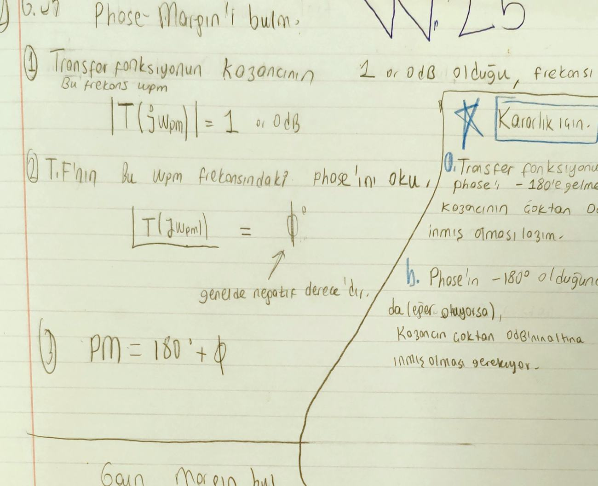

Bu sayfa, faz marji ve kazanc marji tanimlarini genel kontrol diliyle tekrar ozetliyor:

- birim kazanc frekansindaki faz acisindan `PM`
- faz `-180 deg` oldugundaki buyuklukten `GM`

Bu sayfa yeni sayisal sonuc vermekten cok, sonraki Bode yorumlarinda kullanilan dilin ve isaret mantiginin oturmus oldugunu gosteriyor.


#### 6.4.2 Neden bu kadar onemli?


Faz marji ve kazanc marji yalnizca akademik bir bode ciktisi degil, bu tasarimin davranisini dogrudan etkileyen karar olcutleridir:

- faz marji dusuk kalirsa load transient sonrasi ringing ve asiri tasma artabilir

- faz marji gereksiz fazla secilirse sistem gereksiz yavaslayabilir

- giris filtresi, parasitikler ve gercek ESR/DCR degerleri bu marjlari kagittaki ilk tahminden uzaklastirabilir


Bu nedenle nihai tasarimda hedef, yalnizca teorik olarak stabil bir dongu degil; transient, EMI ve uygulama toleranslari altinda da guvenli kalan bir dongu olmaktir.


#### 6.4.3 Kararlilik kriterinin bu projedeki anlami


ODT'den aktarilan metin (`Kararlılık Kriteri`):

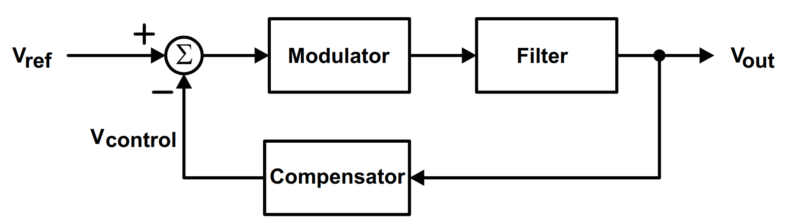

Buck DC/DC Regulator Control Block Diagram

> Ani bir yük akımı değişimi sırasında Vout…. Şekil 9’daki block diagramının kapalı çevrim transfer fonksiyonu şöyledir:

GitHub uyumlu matematik bicimiyle:

```math
H_{\text{system}}(s)
= \frac{V_{out}}{V_{ref}}
= \frac{\text{Ileri Yol}}{1 + \text{Açık Çevrim}}
```

```math
H_{\text{system}}(s)
= \frac{H_{\text{mod}}(s)\,H_{\text{filter}}(s)}
{1 + H_{\text{mod}}(s)\,H_{\text{filter}}(s)\,H_{\text{compensator}}(s)}
```

```math
H_{\text{open-loop}}(s)
= H_{\text{mod}}(s)\,H_{\text{filter}}(s)\,H_{\text{compensator}}(s)
```

Dolayisiyla kapali cevrim ifade su sekilde de yazilabilir:

```math
H_{\text{system}}(s)
= \frac{H_{\text{mod}}(s)\,H_{\text{filter}}(s)}
{1 + H_{\text{open-loop}}(s)}
```


Ek not:

Bu bolumde korunacak ana fikir, kararliligin yalnizca "cikis bir sekilde regule oldu" seviyesinde degil, acik-cevrim ve kapali-cevrim iliskisinin acikca kurulmasi ile degerlendirilmesidir. Bu nedenle:

- uygun crossover bolgesinde `0 dB` gecisi
- pozitif faz marji
- pozitif kazanc marji
- transient davranisi ile uyumlu kapali cevrim cevap

birlikte yorumlanmalidir. Giris filtresi, parazitikler ve coklu kutup/sifir yapilari varsa stabilite yorumu sadece kabaca `f_{sw}/10` kuralina birakilmamalidir.


## 7. EMI, Giris Filtresi ve Yerlesim


### 7.1 Hot-loop ve kritik akim yollari


Senkron buck yapisinda en kritik yuksek `di/dt` dongusu, giris kapasitörleri ile yarim kopru arasindaki sicak dongudur. Pratik olarak bu dongu su elemanlar uzerinden kapanir:

- giris MLCC / bulk kapasitörleri

- high-side MOSFET

- low-side MOSFET

- tekrar giris kapasitörlerinin donus yolu


Bu alan buyudukce parasitik enduktans artar, anahtarlama anindaki gerilim sivrilmeleri ve yayilan EMI agirlasir. Bu nedenle:

- giris seramik kapasitörleri yarim kopruye fiziksel olarak cok yakin konulmalidir

- high-side drain ile low-side source arasindaki akim yolu kisa ve kompakt tutulmalidir

- switch-node bakir alani gereksiz buyutulmamali, sadece zorunlu akim tasima ve termal ihtiyac kadar birakilmalidir


Bu dort gorsel birlikte, `#1` numarali yuksek frekansli guc dongusunun neden en kritik yerlesim bolgesi oldugunu cok iyi gosteriyor. Ayni zamanda high-side / low-side gate-drive donus yollarinin da fiziksel olarak ne kadar kisa tutulmasi gerektigini, yani yalnizca guc dongusunun degil surucu dongulerinin de yerlesim acisindan kritik oldugunu gorsellestiriyor. `p51` bu gruba ozellikle yararli bir ek cunku bootstrap surucu tarafi ile yarim kopru / `C_{IN}` dongusunu ayni cizimde daha temiz bir dille birlestiriyor.


Ikinci onemli akim yolu, bobin ve cikis kapasitörleri etrafindaki cikis akis yoludur. Bu yol hot-loop kadar sert `dv/dt` uretmese de ripple, transient ve olcum kalitesi uzerinde belirgindir.


### 7.2 Differential-mode EMI


Differential-mode EMI'nin ana kaynagi, buck donusturucunun kaynaktan cektigi darbeli giris akimidir. Bu tasarimda ilgili spesifikasyon dogrudan zorlayicidir:

- `CISPR 25 Class 5` hedefi var

- `pi-stage` giris EMI filtresi ve elektrolitik parallel damping hedefi zaten specification notlarina girmis durumda


Bu nedenle differential-mode EMI yalnizca "sonradan filtre eklenir" mantigiyla ele alinmamalidir. Asagidaki basliklar guc kati tasariminin bir parcasi kabul edilmelidir:


- giris akiminin darbeli yapisi, zaman alaninda da acikca gorulmelidir

- giris kapasitörlerinin ESL/ESR ve dc-bias altindaki gercek davranisi

- filtre once/sonra kapasitör dagilimi

- EMI bobini ve kapasitörlerle olusan rezonanslar

- damping ihtiyaci

- layout kaynakli ek parasitikler


Bu notlu ekran goruntusu, differential-mode EMI'nin soyut degil; dogrudan giristen cekilen darbeli akim dalga sekliyle iliskili oldugunu gosteren iyi bir destek gorseldir. Uzerine dusulen notlarda `I_{L,peak} \approx 11 A` ve `T_{sw} \approx 3 us` yazilmis; bu da `1/T_{sw} \approx 333.3 kHz` sonucu ile proje `f_{sw}` cizgisi arasindaki iliskiyi zaman alaninda da gorunur hale getirir.


Bu bolumde ileride sayisal olarak eklenecek ana maddeler:

- filtre topolojisi

- diferansiyel-mod zayiflatma hedefi

- filtre kesim / rezonans frekanslari

- damping elemanlarinin gerekcesi

Defterden aktarilan not (`W.103`):

Burada diferansiyel-mod EMI filtresinin ne kadar `attenuation` saglamasi gerektigi ilk harmonik yaklasimi ile kestirilmeye calisiliyor. Baslikta dogrudan su soru yazili:

- `EMI suzgecinin ne kadar attenuation saglamasi gerektigi`

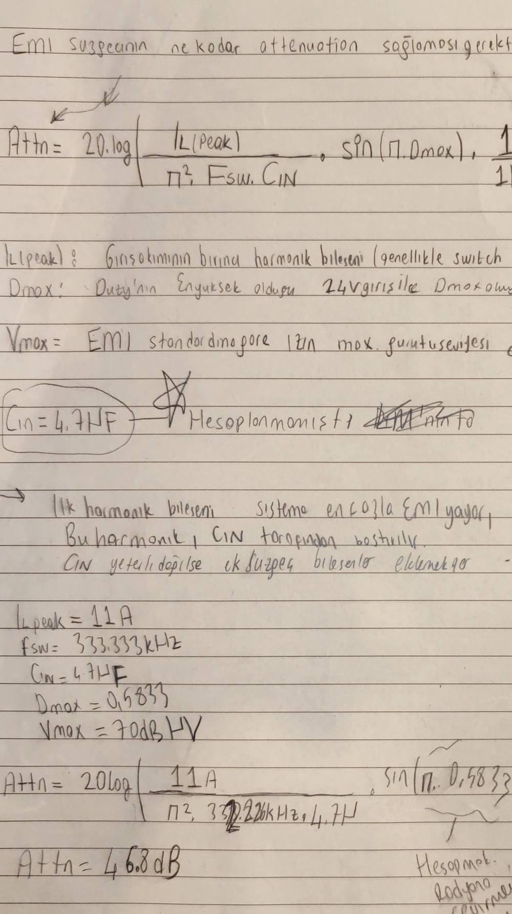

Sayfadaki ifade, giris akiminin ilk harmonik bileseninden hareketle olusan gerilim seviyesini `dBµV` cinsinden okuyup, izin verilen ust sinir ile karsilastiriyor. Formul satiri tam temiz degil; ama sayfada korunacak ana iliski su mantikta:

```math
Attn
\approx
20\log_{10}\!\left(
\frac{I_{L,\text{peak}}}{\pi^2 f_{sw} C_{in}}
\sin(\pi D_{max})
\frac{1}{1\,\mu V}
\right)
-
V_{max}
```

Sayfanin altinda kullanilan sayisal girdiler su sekilde not edilmis:

- `I_{L,peak} = 11 A`
- `f_{sw} = 332.333 kHz`
- `C_{in} = 4.7 uF`
- `D_{max} = 0.5833`
- `V_{max} = 30 dBµV`

ve defterde yazilan sonuc:

```math
Attn \approx 46.80\,dB
```

Sayfadaki yan notlarin ana fikri su:

- ilk harmonik bilesen, giris kapasitörü ve duty oranindan etkilenir
- bu harmonik yeterince kucultulmezse EMI limitini asabilir
- dolayisiyla filtre, yalnizca "var olsun" diye degil; belirli bir `dB` bastirma hedefiyle boyutlandirilmalidir

Bu sayfa, `7.2 Differential-mode EMI` bolumunde eksik duran "nicel attenuation hedefi" fikrini ilk kez sayisal olarak yaziyor. Formuldaki bazi semboller hafif silik; o yuzden orayi temkinli okumak gerekiyor. Ama ana sonuc net: bu iterasyonda filtre tarafindan kabaca `46.8 dB` mertebesinde bastirma bekleniyor.

Defterden aktarilan not (`W.137`):

Burada `W.103`teki diferansiyel-mod EMI attenuation hesabinin daha dikkatli bir tekrar denemesi var. Bu kez hesapta hangi `C_{in}` degerinin kullanildigina ozellikle dikkat cekiliyor ve "bulk capacitor ihmal edilirse attenuation hesabinin kayabilecegi" fikri not ediliyor.


Sayfanin ustunde yine ayni mantikla su tip bir ifade yazilmis:

```math
Attn
\approx
20\log_{10}\!\left(
\frac{I_{L,\text{peak}}}{\pi^2 f_{sw} C_{in,\text{etkin}}}
\sin(\pi D_{max})
\frac{1}{1\,\mu V}
\right)
-
V_{max}
```

Bu kez sayfadaki ara notlardan korunacak ana girdiler sunlar:

- `I_{L,peak} \approx 10.9 A \approx 11 A`
- `f_{sw} \approx 332 kHz`
- `D_{max} \approx 0.6481`
- `V_{max} \approx 63\,dB\mu V`
- en kritik not:
  - `C_{in,\text{etkin}}` olarak `8.22 uF` alinmis
  - yanina da "dikkat dikkat bulk cap haric tutulursa" notu dusulmus

Sayfanin ortasindaki kullanici uyarisi bu bolum icin ozellikle degerlidir:

- EMI attenuation hesabi yapilirken hangi giris kapasitör grubunun gercekten etkili oldugu secilmeli
- bulk kapasitör, dusuk frekansta ve transientte cok etkili olsa da EMI hesabinda ayni agirlikta davranmayabilir
- bu nedenle filtre attenuation hesabinda "hangi `C_{in}`?" sorusu ayrica kontrol edilmelidir

Sayfadaki sayisal sonuc, okunabildigi kadariyla, su yone cikiyor:

```math
Attn \gtrsim 43.14\,\text{dB}
```

ve kullanici en altta da kisa bir ters yon sezgiyi not ediyor:

- `C_{in}` azalirsa
- gereken `Attn` artar

Bu sayfa, `W.103`e gore daha rafine; cunku attenuation hesabinda kullanilan `C_{in}` degerinin ne oldugu ve bulk capacitorun bu hesaba nasil dahil / haric tutulacagi sorununu acikca gundeme getiriyor. `46.8 dB` ile `43.14 dB` arasindaki fark da buyuk olasilikla secilen `C_{in}` taniminin farkli olmasindan geliyor. Buradaki asil deger, sayisal sonuctan cok "EMI attenuation hesabinda etkili giris kapasitesi hangi gruptur?" sorusunu acikca sormasi.


### 7.3 Common-mode EMI


Common-mode EMI, yalnizca giris akim dalgalanmasindan degil, hizli `dv/dt` ureten switch-node'un parasitik kapasiteler uzerinden cevreye enerji baglamasindan da kaynaklanir. Bu nedenle ortak-mod acisindan en hassas bolgeler:

- switch-node bakiri

- yarim kopruye yakin sicak alanlar

- kabloya, saseye veya olcum duzenine kapasitif bag yapabilecek yuzeyler


Bu tasarimda common-mode davranisini iyilestirmek icin ilk yerlesim refleksleri sunlar olmalidir:

- switch-node bakirini gereksiz buyutmeme

- feedback, COMP ve benzeri kucuk isaret hatlarini switch-node altindan veya yakinindan gecirmeme

- kirli guc alani ile sakin analog alani fiziksel olarak ayirma

- gerekiyorsa shield / ekranlama seceneklerini en sonda degerlendirme


Common-mode EMI bu asamada henuz hesaplanmis degildir; ama layout kararlarini bastan yonlendiren bir sinir olarak yazilmalidir.


### 7.4 Giris filtresi kararliligi


Giris EMI filtresi eklendiginde mesele yalnizca bastirma elde etmek degil, donusturucunun bu filtre ile birlikte kararliligini korumaktir. Yerel notlarda ve acik sorular listesinde dogru olarak isaretlendigi gibi burada Middlebrook tarzi bir uyum kontrolu gerekecektir.


Bu bolumde asil fikir su:

- EMI filtresinin cikis empedansi ile donusturucunun giris tarafi dinamik davranisi tehlikeli bir etkilesime girmemelidir
- filtre rezonansi kontrol dongusu ve guc kati ile problemli bir cift kutup / negatif empedans etkisi olusturmamalidir
- gerekli ise elektrolitik parallel damping veya ayri damping agi kullanilmalidir


Bu kisimda henuz final esitlik ve sayisal kontrol yok. Sonraki turda su adimlar eklenecek:

1. secilen `L_f` ve `C_in,filter` ile rezonans frekansi hesaplanacak

2. damping yaklasimi secilecek

3. LTspice veya PSpice ile filtreli ve filtresiz giris davranisi karsilastirilacak

4. Middlebrook uyumu rapora acik bir kontrol maddesi olarak yazilacak

Defterden aktarilan not (`W.100`):

Burada dogrudan giris EMI filtresi ile donusturucunun etkilesimine odaklaniliyor. Baslikta acikca su soru yazilmis:

- `Filterin EMI resonance frekansini nasil belirleriz?`


Sayfada filtre rezonans frekansi icin temel iliski not edilmis:

```math
f_{res}
=
\frac{1}{2\pi\sqrt{L_{IN}\,C_F}}
```

Sayfadaki sayisal yerlestirmede su tip bir ornek yazili:

```math
f_{res}
\approx
\frac{1}{2\pi\sqrt{10.68\,\mu H \times 4.7\,\mu F}}
\approx
22.46\,kHz
```

Sayfanin orta kisminin ana fikri su:

- `L_{IN}` ve `C_F` tarafindan olusan filtre devresi bu frekansta kendi rezonansina sahip olur
- bu rezonans, buck'in `control-to-output` davranisini dolayli olarak etkileyebilir
- dolayisiyla open-loop / closed-loop cevap bozulabilir ya da kontrol marjlari zayiflayabilir

Sayfanin altinda Middlebrook uyumuna giden not bulunuyor:

```math
\left|Z_{filter,out}(j\omega)\right|
<
\left|Z_{in}(j\omega)\right|
```

yanina da su aciklama dusulmus:

- giris kaynagi / filtre tarafinin gordugu cikis empedansi, donusturucunun giris empedansindan kucuk olmalidir

Sayfadaki son mesaj su yone cikiyor:

- aksi halde giris tarafinda rezonans olusabilir
- bu rezonans uncompensated / open-loop davranişi bozabilir
- phase margin azalabilir
- sistem osilasyona gidebilir

Bu not, `7.4 Giris filtresi kararliligi` basliginin defterdeki en net omurgalarindan biri. Filtre rezonans frekansinin yalnizca EMI bastirma acisindan degil, kararlilik acisindan da kontrol edilmesi gerektigini acikca gosteriyor. `f_{res} \approx 22.46 kHz` notu da secilecek EMI filter tarafinda `f_c` ve plant davranisiyla etkilesim riski oldugunu gosteren yararli bir ilk iz.

Defterden aktarilan not (`W.101`):

Burada `W.100`deki filtre rezonansi problemine karsi kullanilan damping agina geciliyor. Baslikta acikca su ifade var:

- `EMI line resonance-type impedance bastirmak icin kullanilan ... damping`


Sayfanin orta kismina kutu icinde su tasarim kurali yazilmis:

```math
C_D \gg 4\,C_{IN}
```

Sayfadaki metne gore bu `C_D` elemani:

- rezonans frekansinda dusuk empedansli davranmali
- boylece damping kolu rezonans civarinda etkili olabilmeli
- `R_D` ile birlikte rezonansin genligini bastirmaya yardim etmeli

Alt satirlarda `C_D` secimi icin su sezgiler not edilmis:

- `C_D`'nin buyuk olmasi iyi; cunku
  - `DC` bileseni bloke etmeli
  - yani `R_D` uzerinden surekli isi kaybi olusturmamali
  - ama rezonans frekansinda da devreye girebilmeli
- bu nedenle `C_D`, `C_{IN}`'den "cok daha buyuk" secilmek istenmis

Bu not, filtre rezonansina karsi klasik seri `R_D - C_D` damping kolu dusuncesinin defterde not edildigini gosteriyor. Burada yazilan `C_D \gg 4C_{IN}` kurali, tam nihai esitlik gibi degil; daha cok kaynak anlatimdan alinmis bir tasarim yonlendirmesi. Ama teknik niyet net: `C_D`, `DC`'de acik devreye yakin kalirken rezonans civarinda damping etkisi uretebilmeli.

Defterden aktarilan not (`W.102`):

Burada `W.100-W.101` zinciri bir adim ileri gidip EMI filtresi icin ilk `L_{IN}` ve `C_F` boyutlandirma notlari yaziliyor.


Sayfanin ustunde su iliski not edilmis:

```math
C_F
=
\frac{1}{L_{IN}}
\left(\frac{10}{2\pi f_{sw}}\right)^2
```

Bu iliski, EMI suppress tasariminda giris akiminin ozellikle ilk harmonik bileseni etrafinda dusunuldugunu ima eden bir notla birlikte yazilmis.

Sayfanin orta kismina dusulen notlardan korunacak ana fikirler:

- buck donusturucude MOSFET anahtarlanirken kaynaktan darbeli / pulsating giris akimi cekilir
- bu nedenle giris EMI filtresi, yalnizca `DC` akimi degil bu darbeli icerigi de dusunerek secilmelidir
- `L_{IN}` secimi icin yaklasik `1 uH - 10 uH` bandi not edilmis
- yuksek akim uygulamalarinda daha dusuk `L_{IN}` secmenin yararli olabilecegi dusunulmus

Sayfanin altindaki sayisal yerlestirmede su secim yaziyor:

- `L_{IN} = 4.7 uH`
- `f_{sw} = 332 kHz`

ve buna bagli olarak:

```math
C_F
\approx
\frac{1}{4.7\,\mu H}
\left(\frac{10}{2\pi\cdot 332\,kHz}\right)^2
\approx
10.68\,\mu F
```

Burada `W.100`de not edilen `f_{res}` iliskisiyle birlikte dusunulmus ilk EMI filtre boyutlandirma adimi var. `L_{IN} = 4.7 uH` ve `C_F \approx 10.68 uF` cifti, `W.100`deki rezonans ornegine de zemin hazirliyor. Sayfanin bazi cumleleri silik olsa da ana fikir net: giris EMI filtresi, buck'in darbeli giris akimi ve ilk harmonik icerigi dusunulerek secilmeli.

Defterden aktarilan not (`W.138`):

Burada `W.100` ve `W.102`de kurulan EMI filtre rezonansi dusuncesi baska bir `L_{IN} - C_F` adayi uzerinden yeniden kontrol ediliyor.


Sayfanin ustunde yine filtre rezonans frekansi iliskisi yazilmis:

```math
f_{EMI}
=
\frac{1}{2\pi\sqrt{L_{IN}\,C_F}}
```

Sayfadaki sayisal yerlestirme, okunabildigi kadariyla, onceki adaydan farkli bir filtre kombinasyonuna isaret ediyor:

- `L_{IN} \approx 2.2\,\mu H`
- `C_F` onlarca `\mu F` mertebesinde bir deger

ve defterde yazilan sonuc:

```math
f_{EMI} \approx 19.21\,kHz
```

Sayfanin yan notlarinda korunacak ana fikirler sunlar:

- `f_{EMI}` bu adayda `f_c` ile kiyaslaniyor
- ayni zamanda `f_{EMI} << f_s` olmasi gerektigi not ediliyor
- yani filtre rezonansinin kontrol dongusu ve switching frekansiyla iliskisi birlikte dusunuluyor

Sayfanin altinda ayrica kisa bir kural notu var:

- `f_{EMI}` icin `0.7 f_s` benzeri bir taslak / hizli kontrol notu dusulmus

Bu satir tam baglamiyla net okunmadigi icin, onu nihai tasarim kurali diye degil kullanicinin hizli bir kontrol notu olarak ele almak daha dogru.

Bu sayfa, `W.100`deki `22.46 kHz` ornegine alternatif bir filtre adayi daha denendigini gosteriyor. En degerli tarafi, filtre rezonans frekansinin yalnizca tek kez hesaplanmadigini; secilen `L_{IN}` ve `C_F` ciftine gore tekrar tekrar kontrol edildigini gostermesi. `f_{EMI} \approx 19.21 kHz` notu da filtre rezonansinin `f_c` civarina yaklasabilecegini ve bu nedenle Middlebrook / damping tarafinin dikkatle ele alinmasi gerektigini destekliyor.

Defterden aktarilan not (`W.139`):

Burada `W.138`deki ayni EMI filtre adayi icin bu kez karakteristik empedans benzeri `R_0` buyuklugu hesaplanmis tek satirlik bir kontrol notu var.


Sayfada yazilan temel iliski su:

```math
R_0
=
\sqrt{\frac{L_{IN}}{C_{IN}}}
```

Sayfadaki sayisal yerlestirme, okunabildigi kadariyla, su aday filtre ciftine isaret ediyor:

- `L_{IN} = 2.2\,\mu H`
- `C_{IN} = 25\,\mu F`

ve buradan kullanici su sonucu not etmis:

```math
R_0
\approx
\sqrt{\frac{2.2\,\mu H}{25\,\mu F}}
\approx
0.296\,\Omega
```

Burada yeni topoloji veya yeni filtre adayi yok; `W.138`deki aday icin bir ek parametre cikariliyor. `R_0` benzeri bu buyukluk, damping kolu secimi ve filtre empedansinin buyukluk mertebesini sezmek icin yararli. Tek satir olsa da, filtreyi yalnizca `f_{res}` ile degil karakteristik empedans olcegi ile de dusundugunu gostermesi iyi.

Defterden aktarilan not (`W.104`):

Burada `W.101`de anlatilan damping kolu EMI filtresi semasina acikca yerlestiriliyor ve filtre tarafinin toplam empedansi yaziliyor.


Sayfadaki cizimde:

- seri kolda `L_{IN}` bulunuyor
- bir yanda ana filtre kapasitörü `C_F`
- diger yanda ise seri `C_D - R_D` damping kolu var

Yani giris filtresi artik yalnizca ideal `L_{IN} - C_F` cifti olarak degil, damping agi ile birlikte dusunulmeye baslaniyor.

Sayfanin altinda filtre empedansi su sekilde yazilmis:

```math
Z_{Filter}
=
\left(
R_D + \frac{1}{j\omega C_D}
\right)
\parallel
\left(
j\omega L_{IN} + \frac{1}{j\omega C_F}
\right)
```

Bu ifadenin anlattigi ana fikir su:

- rezonans civarinda `C_D - R_D` kolu devreye girerek sönum saglayabilir
- `C_F` ve `L_{IN}` tarafinin tek basina uretecegi keskin rezonans, bu ek kolla daha yumusak hale getirilebilir
- dolayisiyla Middlebrook uyumu ve filtre kararliligi yalnizca `L` ve `C` ile degil, damping kolunun empedansi ile birlikte degerlendirilmelidir

Bu sayfa, `W.101`deki tasarim kurali seviyesindeki damping notunu artık dogrudan devre ve empedans ifadesi seviyesine tasiyor. Burada yazilan `Z_{Filter}` ifadesi, daha sonra `|Z_{filter,out}| < |Z_{in}|` kontrolunde hangi agin karsilastirildigini netlestirdigi icin cok degerli.

Defterden aktarilan not (`W.105`):

Burada giris filtresi kararliligi konusunun neden dikkat gerektirdigi kavramsal olarak aciklaniyor: donusturucunun giris tarafi bazi kosullarda `negative input impedance` gibi davranabilir.


Sayfanin ust kisiminda su temel iliski yazili:

```math
Z_{IN} = \frac{V_{IN}}{I_{IN}}
```

Hemen altindaki notlardan korunacak ana fikirler:

- sabit guce yakin calisan bir donusturucude giris akimi ile gerilim arasindaki kucuk isaret iliskisi, siradan pasif bir yukten farkli olabilir
- bu nedenle giris tarafi bazi frekans araliklarinda negatif artimsal empedans gibi davranabilir
- filtre ile bu dinamik davranis kotu etkilesirse rezonans buyuyebilir

Sayfanin orta bolgesinde su kavram acikca vurgulanmis:

- `Negative input impedance`

ve bu durumun filtre ile etkisi su mantikta anlatilmis:

- LC filtresinin giris / cikis empedansi ile converter'in `Z_{in}` davranisi tehlikeli bicimde ust uste gelirse
- salinim veya osilasyon riski artabilir

Sayfada alti cizili kiyas notu da onemli:

```text
Z0 > Zin ise
LC filtresinin giris empedansi, converter'in negatif empedansi ile etkilesir
```

Bu sayfa, `W.100`de not edilen `|Z_{filter,out}| < |Z_{in}|` iliskisinin arkasindaki fiziksel nedeni acikliyor. Ana fikir su: EMI filtresi yalnizca pasif bir bastirma agi degil; converter'in giris tarafindaki dinamik davranisla da etkilesime giriyor.

Defterden aktarilan not (`W.106`):

Burada `W.105`te kavramsal olarak anlatilan negatif / dinamik giris empedansi dusuncesi bu kez worst-case bir buyukluk ifadesiyle yaziliyor.


Sayfanin ustunde denklem `(17)` olarak su ifade not edilmis:

```math
\left| Z_{IN} \right|_{min}
=
\left|\,
-\frac{V_{IN(min)}^2}{P_{IN}}
\right|
```

Sayfanin altindaki aciklamalarda:

- `Z_{IN}` : giris empedansi
- `V_{IN(min)}` : converter'in minimum giris gerilimi
- `P_{IN}` : giris gucu

olarak tanimlanmis.

Sayfanin notuna gore bu denklem:

- en kotu durum / `worst-case` giris empedansini tahmin etmek icin kullaniliyor
- giris filtresi tasariminda kritik bir parametre olarak dusunuluyor

En alttaki yorumdan korunacak ana fikir su:

- denklemde daha dusuk empedans, daha buyuk enerji emme egilimi anlamina gelir
- bu da giris filtresi ile etkilesimde daha kritik / daha zorlayici bir durum olabilir

Bu sayfa, `W.105`te anlatilan negatif giris empedansi fikrini ilk kez dogrudan hesaplanabilir bir buyukluge indiriyor. `V_{IN(min)}` ile yazilmis olmasi da Middlebrook turu karsilastirmada neden genellikle minimum giris gerilimi / worst-case kosulun kullanildigini acikliyor.


Bu ekran goruntusu, `7.4` altinda anlatilan Middlebrook mantigini kendi cümlelerinle toparladigini gosteriyor. Uzerinde acikca "daha dusuk empedans = daha buyuk enerji emme egilimi" notu var ve alt kisimda `|Z_{Filter}(f_{res})| < |Z_{IN(min)}|` karsilastirmasi kirmizi/mavi isaretlerle vurgulanmis. `W.105-W.106-W.136` zincirindeki negatif giris empedansi dusuncesini gorsel ve kavramsal olarak iyi destekliyor.

Defterden aktarilan not (`W.136`):

Burada `W.106`daki negatif / dinamik giris empedansi denklemi bu kez dogrudan proje sayilariyla uygulanmis.


Sayfanin ustunde denklem tekrar yazilmis:

```math
\left| Z_{IN} \right|
=
\left| -\frac{V_{IN(min)}^2}{P_{IN}} \right|
```

Sayfadaki aciklamalarda bu ifadenin neden kullanildigi da not edilmis:

- bu denklem, en kotu durum / `worst-case` giris empedansini tahmin etmek icin kullaniliyor
- denklemde daha dusuk `|Z_{in}|`, daha buyuk enerji emme egilimi anlamina geliyor
- bu da EMI filtresiyle etkilesimin daha kritik hale gelmesine neden olabilir

Sayfada kullanici, proje kosullarini su sekilde yerlestiriyor:

- `V_{IN(min)} = 24\,\text{V}`
- `P_{out,max} = 125\,\text{W}`
- `\eta \approx 0.90`

Buradan once giris gucunu hesapliyor:

```math
P_{IN}
=
\frac{P_{out}}{\eta}
=
\frac{125\,\text{W}}{0.9}
\approx
138.88\,\text{W}
```

Ardindan da worst-case giris empedansi:

```math
\left| Z_{IN} \right|
=
\left| -\frac{24^2}{138.88} \right|
\approx
4.15\,\Omega
```

Sayfanin yan notunda bu sonuc acikca isaretlenmis:

- "Bu `Z_N = 4.15 \Omega` degerimiz"

Bu sayfa, `W.106`ya gore daha ileri; cunku artik yalnizca denklem degil, ikinci projenin gercek `24 V / 125 W / %90` varsayimlariyla net sayisal sonuc da veriyor. `|Z_{in}| \approx 4.15 \Omega` degeri de daha sonra `Z_{filter,out}` ile karsilastirilacak ana referanslardan biri haline geliyor.


### 7.5 Yerlesim kurallari


Bu bolum, ileride eklenecek PCB layout incelemesinin kontrol listesi gibi kullanilmalidir. Bu turda korunacak ilk kurallar:

- giris MLCC'lerini high-side / low-side guc yoluna olabildigince yakin koy

- bootstrap yolu, gate-drive dongusu ve yarim kopru alanini kisa tut

- switch-node alanini minimumda tut; analog hatlari bu bolgeden uzaklastir

- feedback gerilimini gurultulu switch-node'dan degil, sakin cikis dugumunden Kelvin benzeri mantikla al

- analog toprak ile guc topragi iliskisini kontrolcu datasheet'indeki mantiga gore kur; kirli geri donus akislarini analog referans uzerinden gecirme

- giris EMI filtresinin "kirli taraf" ve "temiz taraf" yerlestirmesini fiziksel olarak ayir

- olcum ve dogrulama icin kritik dugumlere test noktasi birak


Sonraki turda bu genel kurallar, gercek PCB veya EVM layout gorselleri uzerinden maddelendirilerek daha somut hale getirilecektir.


## 8. LTspice Dogrulama Plani


Bu bolumde amac, simulasyonu yalnizca "dalga sekli cizdirme" araci gibi degil, hesap ve tasarim kararlarini sistematik olarak sinayan bir dogrulama hatti haline getirmektir.


### 8.1 Baslangic model seti


YENI klasorunde simdiden kullanilabilecek bazi aday dosyalar bulunuyor:

- `LTspice_InputFilterDesign/SyncBuck_average_CL.asc`

- `LTspice_InputFilterDesign/SyncBuck_average_CL_IF.asc`

- `LTspice_InputFilterDesign/SyncBuck_switching_CL.asc`

- `LTspice_InputFilterDesign/SyncBuck_switching_CL_IF.asc`

- `LTspice_InputFilterDesign/SyncBuck_switching_OL_IF.asc`

- `LM5146-Q1_PSPICE_TRANS/LM5146-Q1_TRANS.DSN`


Bu dosyalari nihai tasarimin birebir modeli gibi gormemek daha dogru olur. Yine de giris filtresi etkisini, averaged / switching model farkini ve uretici makromodelinin nasil davrandigini anlamak icin iyi bir baslangic sagliyorlar.


### 8.2 Simulasyon asamalari


Bu proje icin en temiz sira su gibi duruyor:

1. averaged model ile ilk kontrol ve giris filtresi etkisini anlamak

2. switching model ile ripple, duty sinirlari ve transient davranisini gormek

3. gerekiyorsa TI PSpice makromodeli ile denetleyiciye daha yakin bir dogrulama yapmak

4. en sonda parasitikler ve damping detaylarini eklemek


Boyle gidince bir sorun ciktiginda bunun hangi katmanda basladigini ayirmak daha kolay oluyor.


### 8.3 Steady-state kontrol listesi


Ilk tur steady-state kontrolunde en az su koselere bakmak gerekir:

- $V_{in} = 24\,\text{V}$, minimum yuk

- $V_{in} = 24\,\text{V}$, maksimum yuk

- $V_{in} = 36\,\text{V}$, minimum yuk

- $V_{in} = 36\,\text{V}$, maksimum yuk


Bu koselerde kaydedilecek temel buyuklukler:

- `Vout` statik dogruluk

- cikis ripple

- giris ripple / giris akim darbeleri

- bobin akim ripple'i

- MOSFET gerilim ve akim stresleri

- tahmini verim veya kayip dagilimi


### 8.4 Dinamik testler


Bu tasarimin asil karakteri yalnizca steady-state'te degil transientlerde ortaya cikiyor. O yuzden asagidaki testleri atlamamak gerekiyor:

- load step: `3.571 A -> 9 A`

- ters load step: `9 A -> 3.571 A`

- line step: `24 V <-> 36 V`

- startup / soft-start

- duty cycle ve `tON(min) / tOFF(min)` sinirlarina yakin koseler


Burada ozellikle izlenecek ciktilar:

- `14 V +- 20%` transient sinirinin asilip asilmayacagi

- settling suresi

- ringing ve olasi snubber ihtiyaci

- cikis bulk kapasitörsuz yaklasimin yeterli olup olmadigi


### 8.5 Giris filtresi ve EMI ile baglantili testler


Giris EMI filtresi eklenecegi icin filtreli ve filtresiz durumlari birlikte gormek gerekiyor:

- filtre yokken temel davranis

- filtre varken line / load transient

- damping elemani varken ve yokken giris ringing'i

- averaged model ile filtre rezonansi yorumu

- gerekiyorsa LISN benzeri yapiyla ilk iletilen EMI fikir taramasi


Buradaki hedef tam standart EMI olcumu yapmak degil. Asil amac, tasarim karari vermeye yetecek ilk elektronik resmi gormek.


Bu ekran goruntusu, LISN benzeri bir olcum dugumu uzerinden differential-mode EMI'yi simulasyonda izlemeye basladigini gosteren iyi bir ara iz. Cursor penceresinde `200.0001 kHz` civarinda `|V(lisn)| \approx 31.87 dB` okunuyor. Tek basina standart uyum kaniti degil; ama `8.5` altindaki "ilk iletilen EMI fikir taramasi" maddesinin gercekte de denendigini gostermesi acisindan faydali.


### 8.6 44 V transient notu


Specification notuna gore `44 V for up to 1 ms` olayi bir "survive" kosulu. Donusturucunun bu anda regule calismasi zorunlu degil. O yuzden bu testi ayri bir kategori gibi dusunmek daha dogru:

- asiri gerilim stresini gormek

- kritik dugumlerde abs max veya guvenlik payi asimi olup olmadigina bakmak

- gerekiyorsa clamp, TVS veya input filter revizyonunu dusunmek


### 8.7 Hesapla simulasyonun birlestirilmesi


Her simulasyon turunu bir hesap maddesine baglamak en saglikli yol gibi gorunuyor:

- her grafik icin hangi hesap veya spesifikasyon kontrol ediliyor acik yaz

- uyusmayan sonuc varsa once model varsayimini, sonra hesap varsayimini sorgula

- simulasyonu hesap yerine gecen bir "hakem" gibi degil, hesapla birlikte calisan ikinci goz gibi kullan


Kontrol listesi:

- [ ] steady-state

- [ ] load transient

- [ ] line transient

- [ ] startup

- [ ] min/max `Vin`

- [ ] min/max yuk

- [ ] kompanzasyon dogrulama

- [ ] ringing / snubber ihtiyaci

- [ ] giris filtresi etkisi


Simulasyon dosyalari notlari:

- Kullanilacak ana semalari burada ozetle.

- Gerekirse ilgili `asc` veya `DSN` dosyalarini bu bolumde bagla.


## 9. Secilmis Gorseller

Bu belgede birden fazla gorsel kaynagi birlikte kullanildi:

- `yeni.odt` icinden cikartilan gomulu gorseller
- `foto_selected` altina alinan secilmis ekran goruntuleri ve kaynak gorseller
- `defter_snippets_web` altina alinan kucuk defter kirpimlari

Bu secimin mantigi su oldu:

- tam sayfa yerine, mumkun oldugunca konuya tam oturan kucuk parcalari kullanmak
- hesaplarin ve kararlarin elde ciktigi izleri korumak
- ama belgeyi gereksiz gorsel kalabalikla doldurmamak

Gorsel envanteri ve takip notlari `tracking/` altindaki ilgili dosyalarda tutuluyor.

## 10. Acik Sorular

Ayrintili takip icin `tracking/open_questions.md` dosyasini kullanmak daha iyi olur.


Kisa liste:

- [ ] Spesifikasyon tablosu donduruldu mu?

- [ ] Tum hesaplar kaynak ve birim kontrolu ile tekrar yazildi mi?

- [ ] Bootstrap hesaplari tekrar dogrulandi mi?

- [ ] Cikis kapasiteleri transient hedefini sagliyor mu?

- [ ] Giris kapasiteleri ripple ve RMS akisina gore dogrulandi mi?

- [ ] EMI icin ilk yerlesim kurallari yazildi mi?


## 11. Degisiklik Gunlugu


### 2026-03-20


- GitHub uyumlu ilk Markdown iskeleti olusturuldu.

- Bu belge, tez formati yerine yasayan bir muhendislik dokumani mantigina cekildi.

- Ana calisma plani belgeye eklendi.

- `yeni.odt` icindeki giris ve genel yaklasim bolumu temizlenerek Markdown yapisina aktarilmaya baslandi.

- Specification tablosu G94 notlarina gore dolduruldu.

- `FB` divider ve duty / min on-off bolumu ilk turda yazildi.

- Bobin ve bootstrap bolumleri ilk teknik cerceveyle dolduruldu.

- MOSFET secimi ve kayiplar bolumu ilk teknik cerceveyle dolduruldu.

- Kontrolcu bolumunun modulator, K-factor ve ilk frekans yerlestirmesi iskeleti yazildi.

- Faz/kazanc marji icin ilk taslak hedef bandi eklendi.

- EMI, giris filtresi kararliligi ve layout bolumune ilk teknik omurga eklendi.

- LTspice/PSpice baslangic dosyalari taranarak simulasyon plani daha gorunur hale getirildi.

- Cikis kapasiteleri bolumu, transient / output impedance / slew-rate mantigiyla genisletildi.

- Giris kapasiteleri bolumu, minimum Cin, RMS/thermal, ESL ve bulk mantigiyla genisletildi.

- Kontrolcu bolumune ilk donemden K-factor gecisi ve plant modelindeki ihmal notlari eklendi.

- `yeni.odt -> yeni.md` teknik aktarimi tamamlandi; acik kalan maddeler tasarim dogrulama fazina tasindi.

- Defter notlari fazi icin `foto/defter_raw/` ve `tracking/notebook_*` takip yapisi kuruldu.

- Mevcut `foto/` arsivi icin ilk triage envanteri ve `B001` batch kaydi olusturuldu.

- Gorsel kullanim kurali ilk asamada netlestirildi: once `yeni.odt` icindeki gomulu gorseller duzenlendi, sonra secilmis arsiv gorselleri ve defter kirpimlari eklendi.

- `yeni.odt` icindeki 26 gomulu gorsel `images/odt_embedded/` altina cikarildi.
- Bu 26 gorsel ilgili teknik bolumlere dagitildi; `/foto` arsivi ilk asamada disarida tutuldu.

- ODT'de kalan stability criterion ve compensator basliklari yeni.md icinde karsiliklandi.


