# LM5146-Q1 Tabanli Buck Converter Tasarimi

Bu repo klasik bir README gibi okunmasin. Burasi benim ikinci buck converter tasarimim icin ana calisma dokumani.

Bu dosyada iki sey ayni anda duruyor:

- nihai tasarima yaklasan teknik omurga
- o omurgaya nasil geldigimi gosteren secilmis tasarim izleri

Hesaplarin ana omurgasi dogrudan defterimden geliyor. O yuzden ayni bolum icinde bazen su tip notlar yan yana durabiliyor:

- su an gecerliligini koruyan hesap
- ayni noktayi kontrol etmek icin kullandigim alternatif yontem
- datasheet, EVM, calculator veya simulasyonla yaptigim capraz teyit
- eski iterasyon
- hata zinciri yuzunden sonradan zayiflayan veya sadece iz olarak kalan hesap

Bunu belgenin kusuru gibi gormuyorum. Tam tersine, tasarimi nasil dusundugumu gosteren kisim burasi. Her seyi son haline gelmis gibi temizlemek istemiyorum.

Okurken ayrimi su etiketlerle yapmak daha dogru:

- `[Güncel Omurga]`: simdilik uzerinde durdugum ana tasarim yolu
- `[Tasarım İzi]`: o sonuca nasil geldigimi veya nerede yanildigimi gosteren hesap / kaynak izi
- `[Eski İterasyon]`: bugunku karari tek basina temsil etmeyen, ama sureci anlamak icin kalan eski aday
- `[Çapraz Teyit]`: datasheet, EVM, calculator, WEBENCH veya simulasyonla yapilan karsilastirma
- `[Açık Kontrol]`: hesap fikrinin kuruldugu ama final BOM, simulasyon, termal veya yerlesimle kapanmasi gereken nokta

Uzun teknik anlatimlarda tek bir primary owner basligi olacak. Ayni hesap baska yerde tekrar gerekiyorsa orada tam anlatim degil, en fazla kisa bir yonlendirme / referans notu kalacak.

Defter sayfalari bu nedenle belgede kalacak. Bir sayfadaki hesabi metne ceksem bile, o sayfayi tamamen silmek istemiyorum. Cunku bazen sadece bulunan sayi degil, o sayiya nasil gittigim de onemli.

Bu belge ne yalnizca temiz final sonuc metni, ne de ham defter yigini. Ikisinin arasinda, calisirken kullandigim ana dosya.

En rahat su sirayla okunur:

- `2. Durum Ozeti` ve `3. Güncel Tasarım Omurgası ve Paylaşılan Tasarım Girdileri` belgenin mevcut seviyesini ve hedefini verir
- `4. Kullanilan Ana Kaynaklar` tasarim kararlarini hangi belge ailesine dayandirdigimi gosterir
- `5` ve `6` numarali bolumler guc katini ve kontrol tasarimini tasir
- `7` numarali bolum EMI, giris filtresi ve yerlesim tarafini toplar
- `8` numarali bolum hesaplarin LTspice / PSpice tarafinda nasil yoklanacagini listeler
- `9` numarali bolum gorsel kaynaklarini ve hangi izlerin neden kaldigini toparlar
- `10. Acik Sorular` finalde kapanmasi gereken teknik kontrol listesidir

Bu sira bir zorunluluk degil; uzun okumada kaybolmamak icin kullandigim rota.

Ana yol haritasi: `tracking/master_plan.md`

Temel belge kurallari:

- yalnizca gercekten kullandigim kaynaklari govdeye tasimak
- defter sayfalarini ve hesap izlerini kaybetmeden metni okunur hale getirmek
- gecerli hesap, eski hesap ve capraz teyit ayrimini okuyucuya daha net gostermek
- belgede gorunecek gorselleri mumkunse `images/` altinda temiz isimlerle kullanmak
- temizlemek derken hesaplari, gorselleri veya rough defter izlerini silmek degil; yerini, etiketini ve baglamini netlestirmek


## 0. Calisma Plani


Bu plan bitmis bir proje takvimi degil. README'yi toparlarken takip ettigim calisma sirasi.

1. `yeni.odt` icerigini bolum bolum `yeni.md` dosyasina aktarmak

2. Defter notlarini ve hesaplamalari foto ile dijitale almak

3. Defterden gelen hesaplari secerek ana belgeye tasimak; ilgili defter sayfasini da mumkun oldugunca orada tutmak

   Bir hesap veya not baska bolume tasinirse, ona bagli defter kirpimi / kaynak gorseli / sonuc ekrani da ayni teknik baglamla birlikte tasinmali. Gorsel metinden koparsa okuyucu hangi karar icin durdugunu kaybediyor.

4. Metin icinde `gecerli hesap`, `tasarim izi`, `eski iterasyon` ve `capraz teyit` ayrimini netlestirmek

5. Tum belgeyi butuncul sekilde gozden gecirip sadelestirmek, duzeltmek ve kaynaklari toparlamak

6. En son asamada MATLAB, LTspice ve gerekiyorsa OrCAD/PSpice ile teknik dogrulama yapmak

7. Sorun bulunursa hesaplari ve tasarimi revize edip belgeyi guncellemek


Ayrintili surum: `tracking/master_plan.md`

Su anki durum:

- `yeni.odt -> yeni.md` aktarimi tamamlandi
- defter notlari `foto/defter_raw/` ve secilmis kirpimlar uzerinden belgeye baglaniyor
- README tarafinda aktif is: siralama, gecerli/eski hesap ayrimi, gorsel izi ve acik dogrulama maddelerini okunur tutmak
- teknik dogrulama tarafi henuz kapanmis final rapor degil; LTspice / PSpice / termal kontrollerle birlikte yasayan ana belge olarak duruyor
- takip dosyalari: `tracking/notebook_ingestion.md`, `tracking/notebook_batches.md`


## 1. Arka Plan


Ilk tasarim, onceki tez calismasinda tamamladigim buck converter tasarimiydi. Simulasyonlari alinmisti ve hedef spesifikasyonlari sagladigi gosterilmisti.

Bu yeni calisma onun kopyasi degil. Daha cok ayni fikrin ikinci turu gibi dusunuyorum. Bu turda hesaplari daha ayrintili kuruyorum, ek teknik gereksinimleri ayri ayri ele aliyorum ve komponent secimlerini daha bilincli gerekcelendirmeye calisiyorum.

Amac devreyi sadece yeniden cizmek degil. Hangi karara nasil gittigimi, hangi hesabi nerede kullandigimi ve hangi noktada eski dusunceden ayrildigimi da belgelemek istiyorum.

Ozellikle kontrolcu tasarimi, kapasitor secimi, giris filtresi, EMI, MOSFET kayiplari ve bootstrap davranisi bu iterasyonda daha fazla acildi.


## 2. Durum Ozeti


Bu bolum okuyucuya kisaca sunu soylesin diye var: elimde ne var, neye simdilik guveniyorum, ne hala acik.

### 2.1 Ilk tasarim


Ilk tasarim benim icin bitmis bir referans noktasi:

- simulasyonlari alinmistir

- temel spesifikasyonlari sagladigi gosterilmistir

- ilk donem raporunda anlatilmistir


Bu yuzden ilk tasarimi tamamen unutulmus eski is gibi gormuyorum. Yeni calisma icin hem karsilastirma tabani hem de dogrulanmis baslangic noktasi.


### 2.2 Yeni tasarim


Yeni tasarim daha ileri bir noktayi hedefliyor:

- ek spesifikasyonlar tanimlanmistir

- ayrintili hesaplamalar yapilmistir

- notlarin bir kismi dijital dosyalara girmistir

- notlarin bir kismi hala defter sayfalarinda duruyor

- simulasyon dogrulamasi henuz tamamlanmamistir


Kisa ozet su: tasarim dusuncesinin ana omurgasi olustu; belge, defter aktarimi ve dogrulama taraflari hala toparlaniyor. Bunu su sekilde okuyorum:

- `[Güncel Omurga]`: `24-36 V` giris, `14 V` cikis, `50-125 W` yuk araligi, `332 kHz` anahtarlama, secilmis bobin / kapasitör / MOSFET / bootstrap ve `35 kHz` civari kontrol hedefi
- `[Çapraz Teyit]`: LM5146 calculator, WEBENCH, EVM/datasheet gorselleri ve defter sayfalari ayni tasarim yolunu farkli acilardan kontrol ediyor
- `[Açık Kontrol]`: final BOM derating, LTspice/PSpice loop ve transient dogrulamasi, giris filtresi / Middlebrook kontrolu, termal ve layout etkileri

Bu uc satiri bitmis pass/fail tablosu gibi degil, okuma haritasi gibi tutuyorum. Guncel omurga calisma noktasini, destek izleri neden o noktaya guvendigimi, acik kapanis ise hangi kanitlar gelmeden "final" diyemeyecegimi gosteriyor.


### 2.3 Tasarim yaklasimindaki degisim


`yeni.odt` taslagina gore ilk donemde kontrolcu tasarimini daha once ogrendigim yaklasimla kurmustum.

Bu iterasyonda ise Can Hoca'dan ogrendigim K-factor yontemini merkeze aldim. Bu degisim sadece kompanzasyon devresini degistirmiyor. Power stage hesabina, kapasitor secimine, transient dusuncesine, EMI tarafina ve yerlesim kararlarina da daha duzenli bakmami sagliyor.

Bu, ilk donemdeki Type-III / PID izlerini silmek anlamina gelmiyor. Onlar hala nereden geldigimi ve hangi varsayimlari degistirdigimi gosteriyor. Sadece bu ikinci tasarimda ana kontrol omurgasini K-factor, calculator capraz teyidi ve sonradan LTspice/PSpice dogrulamasi uzerinden kapatmaya calisiyorum.


Bu turda agirlik verilen basliklar:

- LM5146-Q1 ve EVM referanslarinin ayrintili incelenmesi

- dusuk EMI tasarim yaklasimi

- giris ve cikis kapasitelerinin daha bilincli secimi

- pratik komponent ve yerlesim kararlarinin gerekcelendirilmesi


## 3. Güncel Tasarım Omurgası ve Paylaşılan Tasarım Girdileri


Bu bolum su an icin tasarimin ana girislerini topluyor. Defterde ve eski taslakta bazi sayilar farkli yerlerde tekrar geciyor; burada ise hangi sayiyi hangi amacla kullandigimi tek yerde gormek istiyorum.

Tablodaki her satir ayni turden degil:

- bazi satirlar dogrudan tasarim hedefi
- bazi satirlar bu hedeflerden turetilmis ara buyukluk
- bazi satirlar defterde load-step, ripple veya EMI hesabina girdi olarak kullandigim sinir deger

Bu yuzden tabloyu kullanirken satirin rolunu da koruyacagim. Ornegin `44 V / 1 ms` regule calisma hedefi degil survive kosulu; `3.571 A - 8.929 A` ise dogrudan spec degil `50-125 W / 14 V` hesabindan gelen akim araligi. Bir hesapta bu satirlardan biri kullaniliyorsa, yanina hangi rol icin kullanildigi yazilmali.


| Parametre | Hedef / Sinir | Not |
| --- | --- | --- |
| Giris gerilimi | `24 V - 36 V` | ana calisma araligi |
| Giris gerilimi transient dayanim | `44 V`, `1 ms` | hayatta kalma siniri, bu aralikta regule calisma zorunlu degil |
| Cikis gerilimi, statik | `14 V +- 3%` | ana setpoint |
| Cikis gerilimi, transient | `14 V +- 20%` | minimum ve maksimum yuk adimlari sirasinda |
| Cikis gucu | `50 W - 125 W` | rezistif yuk |
| Cikis akimi, turetilmis | `3.571 A - 8.929 A` | asagidaki `Pout / Vout` hesabindan geliyor |
| Yuk adimi | `3.571 A -> 9 A` | taslakta `5.429 A` load-step olarak not edilmis |
| Anahtarlama frekansi | `332 kHz` | mevcut tasarim secimi, orijinal zorunlu spec degil |
| Izin verilen `Vout` ripple | `100 mVpp` | herhangi bir `Rload` icin |
| Izin verilen `Vin` ripple | `0.24 Vpp` | giris gerilimi peak-to-peak |
| Izin verilen `Vin` transient | `0.36 V` | undershoot veya overshoot limiti |
| Izin verilen giris akimi ripple | `50 mApp` | ideal kaynak varsayimi |
| Minimum verim | `90%` | gerilim ve yuk boyunca |
| Sicaklik hedefi | `76 degC` board worst-case | taslak spec notu |
| EMI hedefi | `CISPR 25 Class 5` | `pi-stage` giris EMI filtresi ve elektrolitik parallel damping hedefi |
| Harici bias/VCC | kullanilmayacak | harici bias secenegi bulunuyor ama bu iterasyonda kullanilmiyor |

Cikis akimi satirindaki aralik su hesaptan geliyor:

$$
I_{out} = \frac{P_{out}}{V_{out}}
$$

$$
I_{out,\min} = \frac{50\,\text{W}}{14\,\text{V}} \approx 3.571\,\text{A}
$$

$$
I_{out,\max} = \frac{125\,\text{W}}{14\,\text{V}} \approx 8.929\,\text{A}
$$

Bu tablo bittikten sonra, cikis gerilimi zarflarini ayri gorselle tekrar sabitliyorum:


Buradaki notlu gorsel, cikis gerilimi spesifikasyonunu iki farkli zarf icinde dusundugumu netlestiriyor. Dar mavi zarf statik regulasyonu (`14 V +- 3%`), daha genis kirmizi zarf ise transient sirasindaki kabul alanini (`14 V +- 20%`) temsil ediyor.

Defterde bu iki kriteri ayri ayri kullanmis olmam, daha sonra `W.58-W.59` tarafinda neden farkli `C_{out}` alt-sinirlarina baktigimi da daha okunur hale getiriyor.


### 3.1 Paylaşılan `fsw`, duty ve zaman alanı owner'ı

[Güncel Omurga] Bu alt başlık, aynı duty hesabının `5.2`, `5.5` ve `5.7` altında tekrar tekrar kurulmasını engelleyen tek owner'dır. Aşağıdaki sayılar bobin, `Cin`, `Cout`, MOSFET, bootstrap ve kontrol hesabına buradan referans olarak dağılır.

Ortak anahtarlama frekansı ve periyot:

$$
f_{sw} = 332\,\text{kHz}
$$

$$
T_{sw} = \frac{1}{f_{sw}} \approx 3.01\,\mu\text{s}
$$

[Güncel Omurga] İdeal senkron buck ilk yaklaşımı:

$$
D_{\text{ideal}} \approx \frac{V_{out}}{V_{in}}
$$

Mevcut `24 V - 36 V -> 14 V` zarfı için:

- $D_{\min,\text{ideal}} = \dfrac{14}{36} \approx 0.389$
- $D_{\max,\text{ideal}} = \dfrac{14}{24} \approx 0.583$

[Tasarım İzi] Defterde verim etkisiyle daha korumacı duty ailesi de kullanılmış:

$$
D_{\eta} \approx \frac{V_{out}}{V_{in}\eta}
$$

`Vout = 14 V` ve minimum verim varsayımı `\eta \approx 0.9` ile:

- $D_{\min,\eta} \approx \dfrac{14}{36 \times 0.9} \approx 0.432$
- $D_{\max,\eta} \approx \dfrac{14}{24 \times 0.9} \approx 0.648$

Bu `0.432 / 0.648` ailesi ideal duty'nin yerine sessizce geçirilmez. `Cin` RMS, bazı EMI/hızlı kontrol hesapları ve bootstrap sarj penceresi gibi korunmacı alt kontrollerde kullanılan tasarım izi olarak etiketlenir.

[Tasarım İzi] `D = 0.5`, final duty sınırı değil; duty aralığının ortasına yakın pratik bir kontrol noktasıdır. Defterde özellikle giriş kapasitörü, RMS ve hızlı EMI tarafında kullanılmıştır. Bu değer, owner dışında yeniden türetilmeyecek; ilgili bölüm yalnızca "`D = 0.5` pratik kontrol noktası için bkz. `3.1`" diye referans verecek.

Duty'nin zaman alanına çevrimi:

$$
t_{ON} = D T_{sw}
$$

$$
t_{OFF} = (1-D)T_{sw}
$$

İdeal duty zarfı `332 kHz` için zaman alanında şu aralığa karşılık gelir:

- $t_{ON,\max,\text{ideal}} = 0.583 \times 3.01\,\mu\text{s} \approx 1.76\,\mu\text{s}$
- $t_{ON,\min,\text{ideal}} = 0.389 \times 3.01\,\mu\text{s} \approx 1.17\,\mu\text{s}$
- $t_{OFF,\min,\text{ideal}} = (1 - 0.583) \times 3.01\,\mu\text{s} \approx 1.25\,\mu\text{s}$
- $t_{OFF,\max,\text{ideal}} = (1 - 0.389) \times 3.01\,\mu\text{s} \approx 1.84\,\mu\text{s}$

[Çapraz Teyit] LM5146 zaman sınırları, normal duty zarfının kontrolcü minimum zamanlarıyla çakışıp çakışmadığını görmek için ayrı okunur:

- `tON(min) = 40 ns`
- `tOFF(min) = 140 ns`
- $D_{\max,\text{donanımsal}} \approx \dfrac{T_{sw} - t_{OFF,\min}}{T_{sw}} \approx 0.953$
- $D_{\min,\text{donanımsal}} \approx t_{ON,\min} f_{sw} \approx 0.013$

Bu donanımsal sınırlar proje duty ailesi değildir; yalnızca `332 kHz` ve LM5146 zaman limitleriyle büyüklük kontrolüdür. Ölüm zamanı, propagation delay ve gerçek kontrolcü davranışı ayrıca doğrulanacak.

[Eski İterasyon] / [Tasarım İzi] Bootstrap tarafında görülen:

- $D_{\text{high,max}} = 0.648$
- $D_{\text{high,min}} = 0.432$
- $D_{\text{low,min}} = 1 - 0.648 = 0.352$

değerleri bu owner altında `\eta \approx 0.9` ile uyumlu korumacı duty ailesi olarak tutulur. Bootstrap hesabında ayrıca görülen `Dmax \approx 0.95` notu ise proje duty'si değil, kontrolcü/zaman sınırı ve bootstrap bias-leakage bağlamındaki ayrı bir üst sınır kontrolüdür.

Defter kaynak izleri:


Bu üç görsel, shared owner'ın kaynak izidir: `W.26` ana girdileri ve load-step'i, `W.140` ideal/verim-dahil duty ailesini ve `D = 0.5` kontrol noktasını, `W.203` ise `tON(min)`, `tOFF(min)` ve `FPWM` notunu gösterir.


### 3.2 Startup / pin-programming handoff özeti

[Güncel Omurga] `internal VCC/LDO`, `EN/UVLO`, `SS/TRK` ve `RT` kararları tek startup akışı gibi okunacak. Bu akışın ayrıntılı owner'ı `5.1`dir; burada ortak tasarım omurgasına bağlanan kısa karar özeti durur.

- `VCC/LDO`: LM5146 dahili `7.5 V` LDO kullanılıyor; harici `8 V - 13 V` `VCC/DVCC` yolu biliniyor ama bu iterasyonda ana seçim değil.
- `VCC` dropout: `0.25 V typ - 0.72 V max`; harici `VCC` yoksa normal LDO regülasyonu için erken sınır `7.5 V + 0.72 V = 8.22 V`.
- `8.22 V`: normal çalışma hedefi değil; proje çalışma zarfı hâlâ `24 V - 36 V`. Bu değer startup / UVLO / dahili LDO sanity sınırı olarak okunacak.
- `EN/UVLO`: `<0.4 V` shutdown, `0.4 V - 1.2 V` standby, `>1.2 V` active.
- `VCC UVLO`: `VCC-UV ≈ 4.93 V typ`, hysteresis `≈0.26 V`; `EN/UVLO > 1.2 V` tek başına yeterli kabul edilmeyecek.
- `SS/TRK`: `I_{SS} = 10 uA`, `C_{SS} = C26 = 0.047 uF = 47 nF`, defter hesabı `tSS ≈ 3.76 ms`; calculator `4 ms`, WEBENCH `3.8 ms` çapraz teyit.
- `RT`: `332 kHz` için `RRT ≈ 30.12 kOhm`, pratik not `Rrt = 30.1 k`; calculator `30.1 kOhm`, WEBENCH `f_sw = 332.226 kHz`, `Mode = FCCM`.

[Açık Kontrol] `VCC/LDO` kaybı `Vin`, `7.5 V` dahili regülasyon seviyesi ve `I_{VCC}` bağıyla `5.9 Termal ve Kayıp Kapanışı` owner'ına taşınır; final sıcaklık kararı orada kapanır.


## 4. Kullanilan Ana Kaynaklar


Kaynak tarafini iki seviyede tutuyorum.

- Bu README icinde gercekten kullandigim kaynaklar ve hesap izleri var.
- `references/used_sources.md` ise kaynak listesinin daha duzenli takip edildigi yer.
- PDF'leri belge icinden tiklanabilir kullanacaksam, dosyalari `references/pdfs/` altinda tutuyorum.

Yani buradaki liste "her ihtimale karsi kaynak deposu" degil. Defterde, hesapta veya capraz kontrolde fiilen geri dondugum kaynaklar.


Bu README icinde sik dondugum ana kaynaklar:

- `G94_SPEC.txt`

- `G31_Robert_Erikson_fundamentals-of-power-electronics-3n_2020.txt`

- [G32_lm5146-q1.pdf](./references/pdfs/G32_lm5146-q1.pdf)

- [G35_Basic Calculation of a Buck Converter's Power Stage (Rev. B).pdf](./references/pdfs/G35_Basic%20Calculation%20of%20a%20Buck%20Converter%27s%20Power%20Stage%20%28Rev.%20B%29.pdf)

- [G46_LM5146-Q1EVM User's Guide.pdf](./references/pdfs/G46_LM5146-Q1EVM%20User's%20Guide.pdf)

- [G101_The K Factor.pdf](./references/pdfs/G101_The%20K%20Factor.pdf)

- `G103_comp.txt`

- `G95_04_K_FACTOR_CAN_HOCA.txt`

- [G114_Simple Solution for Input Filter Stability Issue in DC_DC_slua929a.pdf](./references/pdfs/G114_Simple%20Solution%20for%20Input%20Filter%20Stability%20Issue%20in%20DC_DC_slua929a.pdf)

- [G112_Simple Success with Conducted EMI and Radiated EMI_snva755.pdf](./references/pdfs/G112_Simple%20Success%20with%20Conducted%20EMI%20and%20Radiated%20EMI_snva755.pdf)

- [G113_An Engineer’s Guide to Low EMI in DC_DC Regulators_slyy208.pdf](./references/pdfs/G113_An%20Engineer%E2%80%99s%20Guide%20to%20Low%20EMI%20in%20DC_DC%20Regulators_slyy208.pdf)

- [LM5146_quickstart_calculator_revB1.xlsm](./references/pdfs/LM5146_quickstart_calculator_revB1.xlsm)

Bu kaynaklari tek seviye gibi okumuyorum:

- `G94_SPEC.txt`: hedefleri ve sinir degerleri sabitleyen ana giris
- `G32` ve `G46`: LM5146-Q1 kontrolcu, EVM ve fiziksel referanslar
- `G31` ve `G35`: buck guc kati ve temel denklem tarafinin dayanaklari
- `G101`, `G103` ve `G95`: K-factor / kompanzasyon hattinda kullandigim kaynaklar
- `G112`, `G113` ve `G114`: EMI, input filter ve Middlebrook tarafinda geri dondugum kaynaklar
- `LM5146` calculator ve `WEBENCH`: defterdeki sayilari hizli capraz teyit etmek icin kullandigim araclar

Kaynaklarin guven / rol seviyesini boyle ayiriyorum:

| Kaynak sinifi | Rol | Guven seviyesi | Tek basina neyi kapatmaz? |
| --- | --- | --- | --- |
| `G94_SPEC.txt` | hedefleri ve sinir degerleri koyar | yuksek, tasarim girdisi | komponent secimi ve dogrulama |
| datasheet / EVM (`G32`, `G46`) | parca sinirlari, pin/topoloji ve fiziksel referans verir | yuksek, teknik dayanak | proje kosulundaki final performans |
| temel guc kati / kontrol kaynaklari (`G31`, `G35`, `G101`, `G103`, `G95`) | denklem ve yontem dayanaklarini verir | orta-yuksek, yontem dayanakli | secilen BOM ile final sayisal sonuc |
| EMI / input-filter kaynaklari (`G112`, `G113`, `G114`) | filtre, layout ve Middlebrook mantigini kurar | orta-yuksek, tasarim rehberi | gercek LISN/PCB/olcum sonucu |
| `LM5146` calculator | hizli komponent ailesi ve loop checkpoint'i verir | capraz teyit, guncel omurga adayi | MLCC `dc-bias`, ESR/ESL, termal, layout ve EMI etkileri |
| `WEBENCH` | operating-values, ripple, verim, EMI ve loop snapshot'i verir | capraz teyit / erken simulasyon | final LTspice/PSpice, termal ve kose kosul dogrulamasi |

Bir kaynakla defter notu farkli gorunurse once rolune bakacagim. `G94_SPEC.txt` ve datasheet sinir koyar; calculator / `WEBENCH` hizli checkpoint verir; defter sayfalari ise secim izini ve neden o noktaya geldigimi tasir. Ayni sayi farkli yerde baska degerle geciyorsa sessizce birlestirmek yerine `[Eski İterasyon]`, `[Güncel Omurga]`, `[Çapraz Teyit]` veya `[Açık Kontrol]` diye isaretlemek daha dogru.


### 4.1 Cross-check ciktılarinin owner haritasi


`LM5146` quickstart calculator ve `WEBENCH` ciktılarini burada final komponent sahibi gibi tutmuyorum. Bu bolumun owner'i yalnizca kaynak izi ve okuma kurali. Sayisal sonuc veya komponent karari ilgili teknik baslikta duracak.

[Çapraz Teyit] Kaynak dosyalar:

- [LM5146_quickstart_calculator_revB1.xlsm](./references/pdfs/LM5146_quickstart_calculator_revB1.xlsm)
- [WBDesign21.pdf](./WBDesign21.pdf)
- [amCharts.json](./BOM/amCharts.json)

[Açık Kontrol - dosya yolu] `WBDesign21.pdf` ve `BOM/amCharts.json` kaynak izleri korunuyor; ancak mevcut çalışma alanında bu iki yol birebir bulunamadı. Bu not kaynak sonucunu geçersiz saymaz, yalnız yayın öncesi dosya yolu / arşiv konumu kontrolünün açık kaldığını gösterir.

Bu uc kaynak icin owner dagilimi:

| Cikti / konu | Primary owner |
| --- | --- |
| `fsw`, duty ailesi ve `tON/tOFF` zaman penceresi | `3.1 Paylaşılan fsw, duty ve zaman alanı owner'ı` |
| `RT`, FCCM calisma noktasi ve startup/pin programlama | `5.1 Controller pin programming ve startup owner` |
| `SS/TRK`, `C_{SS}`, soft-start suresi | `5.1.4 EN/UVLO, SS/TRK ve startup notlari` |
| `FB` bolucusu | `6.1 Feedback divider` |
| bobin, `DCR`, ripple akimi | `5.3 Bobin secimi` |
| cikis kapasiteleri, `Vout` ripple | `5.4 Cikis kapasiteleri` |
| giris kapasiteleri, `Vin` ripple | `5.5 Giris kapasiteleri` |
| MOSFET secimi ve elektriksel kayip kalemleri | `5.6 MOSFET secimi ve kayiplar` |
| controller `VCC/LDO`, MLCC RMS sicaklik, MOSFET `T_J/Rth`, board worst-case termal kapanis | `5.9 Termal ve Kayıp Kapanışı` |
| kompanzator komponent ailesi, `f_c`, `f_{p2}` | `6.3 Hedef fc ve faz marji`, `6.4 K-factor mantigi ve Type-III komponent seti`, `6.5 Calculator / defter frekans yerlestirme cross-checkleri` |
| faz marji / loop response | `6.3 Hedef fc ve faz marji` ve `6.6 Faz, kazanc marji ve WEBENCH cross-checkleri` |
| EMI spektrumu ve filtre notlari | `7.2 Differential-mode EMI`, `7.4 Giris filtresi kararliligi`; `8.5 Giris filtresi ve EMI ile baglantili testler` ise dogrulama/test listesidir |

Bu yuzden calculator veya `WEBENCH` icinde gecen bir sayi, burada tek basina final kabul edilmeyecek. Ilgili owner bolumde `[Çapraz Teyit]` notu olarak duracak; defter veya BOM ile fark varsa ayni owner altinda `[Eski İterasyon]`, `[Tasarım İzi]` veya `[Açık Kontrol]` etiketiyle ayrilacak.


### 4.2 Arac ciktisi okuma kurali


[Çapraz Teyit] Calculator guclu oldugu yerde cekirdek omurgayi hizli yokluyor: `Vin/Vout/Iout`, `fsw`, bobin, soft-start ve kompanzator ailesi. Tek basina kapatmadigi yerler ise MLCC `dc-bias`, gercek ESR/ESL, UVLO ayrintilari, MOSFET kayip/termal hesabi, EMI filtresi ve layout etkileri.

[Çapraz Teyit] `WEBENCH` de ayni sekilde hizli simulasyon snapshot'i. `WBDesign21.pdf` ve `amCharts.json`; statik calisma, ripple, verim, EMI ve loop-response icin ilk kontrol goruntusu verir. Bunlar nihai LTspice/PSpice, termal veya layout kaniti yerine gecmez.

[Açık Kontrol] Bu kaynaklardan gelen ripple, sicaklik veya EMI uyumsuzluklari sessizce birlestirilmeyecek. `Vout`, `Vin`, loop marji ve EMI / input-filter tarafindaki sayilar sirasiyla `5.4`, `5.5`, `6.6`, `7.2`, `7.4` ve `8.3-8.5` altinda ayni kosul setiyle tekrar kontrol edilecek.


## 5. Guc Katinin Tasarimi

Bu bolumde guc katini adim adim kuruyorum. Topoloji varsayimlari ve `3.1`de sabitlenen duty / timing girdileri referans alinarak bobin, cikis ve giris kapasiteleri, MOSFET secimi ve bootstrap agi burada ayni zincirin parcasi gibi ilerliyor.

4. bolumde kaynaklari ve hizli teyitleri ayirdiktan sonra burada artik asil tasarim zincirine geciyorum: once sinirlar, sonra pasifler, sonra anahtarlama elemanlari. Amac eski notlari temizlemek degil; hangi notun bugunku tasarima nasil baglandigini gostermek.

[Güncel Omurga - güç katı dependency sırası] Bu bölümde teknik okuma sırası şu olacak: önce ortak sabitler / duty / timing (`3.1` primary owner, `5.2` kısa geçit), sonra indüktör (`5.3`), sonra çıkış kapasiteleri (`5.4`), sonra giriş kapasiteleri (`5.5`). `5.1` controller pin programming / startup owner'ı bu zincirin destekleyici kontrolcü varsayımıdır; `L/C/Cin/Cout` owner'ı gibi okunmayacak.

Bu sırayı özellikle koruyorum: bobin ripple'ı `Cout` alt sınırına girer; `Cout` plant ve transient davranışını belirler; `Cin` ise aynı duty/timing girdilerini kullanır ama giriş hot-loop, RMS, EMI ve transient enerji tamponu tarafında ayrı owner'dır. Çıkış bulk kararı ile giriş bulk kararı aynı karar değildir.

Sirasi tam olarak "once final sonuc, sonra ekler" seklinde degil. Bazi yerlerde once ODT'den gelen eski metin, sonra defterden gelen düzeltme veya teyit var. Bu bolumu okurken benim icin onemli ayrim su:

- `[Güncel Omurga]`: bugunku tasarimda kullandigim ana yol
- `[Eski İterasyon]`: silmedigim, cunku nasil basladigimi gosteren ilk secim
- `[Çapraz Teyit]`: datasheet, EVM, calculator veya defter uzerinden ayni fikrin kontrolu
- `[Açık Kontrol]`: hesap var ama LTspice / PSpice / termal dogrulama ile tekrar bakilacak nokta


### 5.1 Controller pin programming ve startup owner

[Güncel Omurga] Bu bölümün primary owner'ı LM5146 pin programlama ve startup varsayımlarıdır: dahili `VCC/LDO`, `EN/UVLO`, `SS/TRK` ve `RT` burada tek akış olarak okunur. `fsw`, duty ailesi ve zaman alanı hesabı `3.1` altında ortak tasarım girdisi olarak sabitlendi; burada ise bu frekansın `RT` pini ve startup zinciriyle nasıl programlandığı korunur.

[Çapraz Teyit] Aşağıdaki alt başlıklar defter, kaynak görseli ve calculator izlerini saklar. Başka bölümlerde bu pin/startup denklemleri yeniden baştan kurulmayacak; yalnızca bu owner'a kısa referans verilecek.


#### 5.1.1 LM5146-Q1 dahili LDO siniri


Bu alt baslikta once ODT'deki ham `Vin/VCC` notunu birakiyorum. Bugunku okuma su: bu kisim parca secimi degil, LM5146'nin dahili `7.5 V VCC` regulatoru hangi `Vin` bolgesinde rahat calisir, hangi bolgede `VCC` dusmeye baslar sorusunun ilk cevabi.

ODT'den aktarilan metin (`4.2. Giriş Gerilimi Vin`):

> Lm’nin içinde bir LDO (Low Dropout Regulator) barındırır. Bu LDO, 7.5V Vcc beslemesi sağlar, Mosfet kapı sürücülerini ve kontrol devrelerini besler.

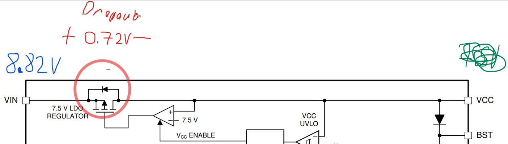

> VVCC-LDO VIN to VCC dropout voltage = 0.25V(typ) - 0.72V(max)
>
> Harici Vcc kullanılmayacaksa, LDO’nun düzgün çalışabilmesi için Giriş gerilimi Vin’in en az 7.5 V + 0.72V(max) = 8.22V olmalıdır.
>
> Yani Vin > 7.5V + dropout voltage olursa, Vcc gerilimi 7.5V sabitlenir. Vin = 9V iken de Vin = 50 V iken de Vcc = 7.5V olur. :*
>
> Eğer Vin < 7.5V + dropout voltage olursa
> LDO regulatorü, 7.5V’u çıkaramaz. Denklem geçerlidir.
> Örneğin giriş gerilimi Vin = 6V olsun.
> Vcc gerilimi en iyi ihtimalle 6V-0.25V= 5.75 V olur.
> Vcc gerilimi, Vin’i takip eder.
> Bu düşük Vcc gerilimi gate sürücüleri için yeterli olmayabilir, mosfetler tam açılmaz, Rdson artar (İleride göreceğiz), verim düşer.
>
> Özetle, Vin < 7,5 V çalıştığınızda:
>
> Regülatör Dropout’u
>
> LDO’nun giriş–çıkış arasındaki “dropout” gerilimi devreye girer. Örneğin, Vin = 6 V iken LDO çıkışı 5,8 V’a düşer.
>
> Artan İletim Kayıpları
>
> Düşük VGS → MOSFET kanalı tam açılmaz → RDS(on) ↑ → iletim kayıpları (I²·R) artar.
>
> Aynı zamanda aşırı akım koruması (OCP) voltaj ölçümü yanıltabilir.
>
> Artan Anahtarlama Kayıpları
>
> Düşük gate gerilimi → gate şarj/deşarjı yavaşlar → geçiş süreleri uzar → switching kayıpları ↑.
>
> MOSFET Seçim Kısıtı
>
> Standart tipler yerine “logic-level” (RDS(on) @ VGS = 4,5 V garantili) MOSFET kullanmak gerekir.
>
> Çözüm Önerisi
>
> Vin ≥ 7,5 V sağlamak veya 8 – 13 V’luk harici VCC rail’ı Şekil 8-2’deki gibi DVCC ile bağlayarak LDO’yu bay-pas etmek, hem verimi hem termal performansı iyileştirir.

Bu hesabi yazarken baktigim kaynak / foto notlari:

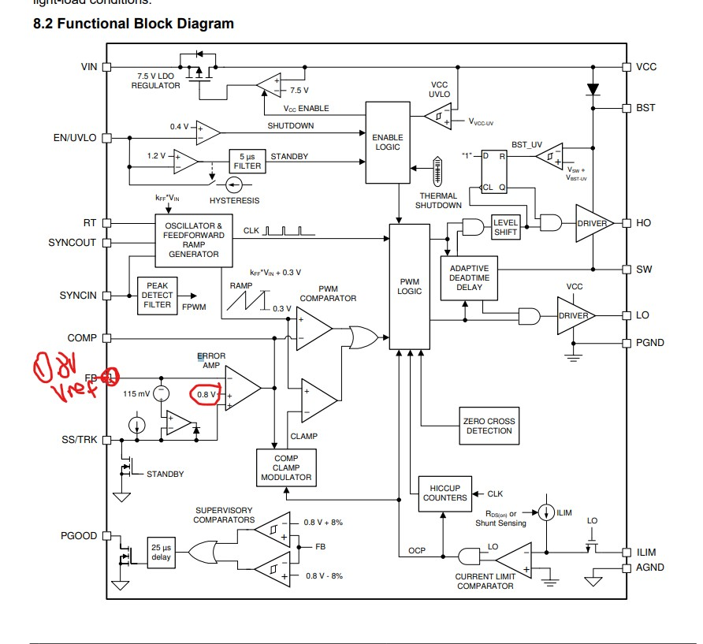


Bu iki fotoyu burada tutuyorum, cunku `LM5146` fonksiyonel blok diyagrami uzerinde ozellikle:

- `7.5 V` dahili `LDO`
- `FB` / `0.8 V` referans dugumu
- `COMP` ve `SS/TRK`

arasindaki iliskiyi not etmek icin kullanmisim. Yani sadece sus olsun diye degil; kontrolcunun ic yapisini guc kati kararlarina baglamak icin burada duruyor.

Bu yuzden bu alt basligi sadece "dusuk `Vin` notu" gibi okumuyorum. Dahili `VCC/LDO` kabulu; MOSFET'in gorecegi `VGS`, `EN/UVLO` ve `SS/TRK` acilis zinciri, `CVCC/CBST` bootstrap tarafi ve kontrolcu kayip hesabiyla ayni varsayim ailesine bagli. Eger ileride harici `VCC` yoluna donulurse, bu satirlarin hepsi birlikte tekrar acilacak.


#### 5.1.2 Ek notlar: dusuk `Vin` bolgesinin etkisi


Bu ODT parcasi, dahili LDO'nun tam regulasyon ve dropout bolgeleri arasindaki tasarim farkini anlatiyor. Buradaki hesap benim icin su basit sinira iniyor:

$$
V_{in,\min} = 7.5\,\text{V} + 0.72\,\text{V} = 8.22\,\text{V}
$$
$$
V_{CC} \approx V_{in} - V_{dropout}
$$
Ornegin tipik dropout ile $V_{in} = 6\,\text{V}$ icin:

$$
V_{CC} \approx 6.00\,\text{V} - 0.25\,\text{V} = 5.75\,\text{V}
$$
Bu bolgede teknik olarak su riskler one cikar:

- $R_{DS(on)} \approx 8.2\,\text{m}\Omega$
- gate sarj / desarj surelerinin uzamasi nedeniyle switching kayiplari
- koruma ve akim algilama marjlarinin degismesi
- gerekirse logic-level MOSFET veya harici `VCC` kullanim ihtiyaci

Burada teorik olarak iki yol acik:

- sistemi yalnizca $V_{in} \ge 8.22\,\text{V}$ bolgesinde optimize etmek
- veya `DVCC` uzerinden harici $8\,\text{V} - 13\,\text{V}$ $V_{CC}$ rayi ile LDO'yu baypas etmek

Bu projede simdilik ana yolum dahili `VCC/LDO` kullanmak. Harici `VCC` secenegini siliyor degilim; sadece bu iterasyonun ana secimi degil.

Burada onemli ayrim su: projenin normal giris hedefi yine `24-36 V`. `8.22 V` hesabi bu hedefi asagi cekmek icin degil; startup / UVLO sinirlarini, dusuk `Vin` senaryosunu ve harici `VCC` gerekip gerekmedigini anlamak icin burada duruyor. Yuksek `Vin` tarafinda ise ayri soru `W.111`de geliyor: dahili LDO uzerindeki dusum buyudukce `VCC` regulator kaybi artiyor mu?

Harici `VCC` seceneginin not edildigi kaynak-fotolar:

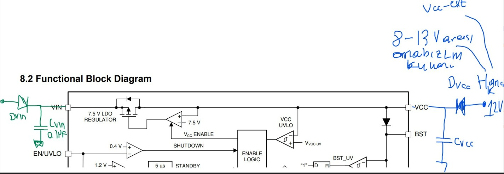

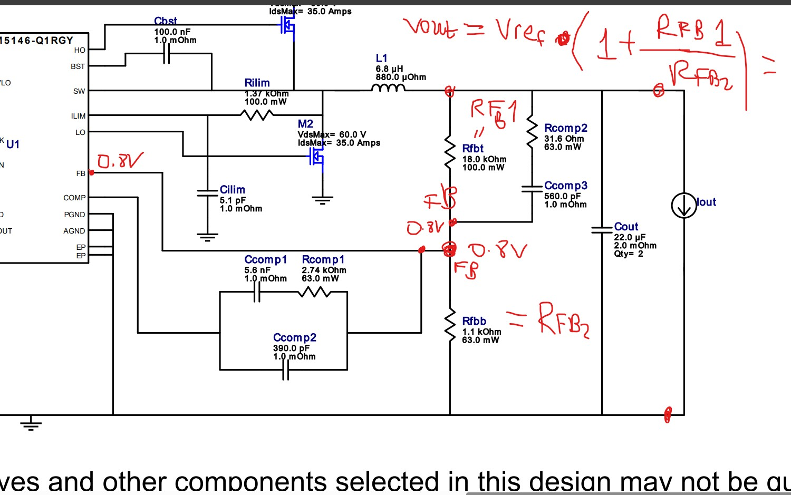


Bu gorseller birlikte bakildiginda, dahili `LDO` yolu ile harici `VCC` / `DVCC` secenegini ayni blok diyagram uzerinde ayirmaya calistigim goruluyor. Nihaiye yakin omurgada dahili yolu kullaniyorum; yine de alternatifi bilincli olarak dusunmusum.

Ozellikle `p105` goruntusu bu ayrimi daha genis bir blok diyagram uzerinde tekrarliyor. `DVCC`, `-VCC`, `BST` ve harici `8-13 V` ray notu ayni cizimde goruldugu icin, "harici VCC ile dahili LDO'yu baypas etme" fikrini kontrolcunun kendi blok yapisi uzerinden dusundugumu da gosteriyor.

[Yönlendirme - termal owner] `W.108` kontrolcü junction temperature / thermal shutdown / exposed pad notlari ve `W.111` dahili `VCC/LDO` guc kaybi hesabı artik `5.9 Termal ve Kayıp Kapanışı` altinda tutulur. Bu bolumde yalniz startup/pin-programming baglami kalir: dahili `VCC/LDO` ana secimdir, harici `8 V - 13 V` `DVCC` yolu ise termal veya kayip kapanisinda gerekirse yeniden acilacak alternatiftir.

Defterden aktarilan not (`W.170`):

Burada `5.1.1`deki dahili `VCC` / LDO sinirini defterde yeniden kurmusum. Yeni bir nihai hesap degil; minimum `V_{in}` sinirini elle tekrar edip tasarim niyetimi yazdigim sayfa.


Sayfanin basliginda okunabildigi kadariyla:

- `8.3.1 Input Range Vin`

yaziyor.

Ust kisimda, LM5146'nin icinde bir `LDO` bulundugunu ve bunun:

- `7.5 V` civarinda bir `VCC` beslemesi sagladigini
- kontrol devrelerini ve MOSFET gate suruculerini besledigini

not ettim.

Ardindan en kritik tasarim siniri tekrar vurgulaniyor:

- eger harici `VCC` kullanilmiyorsa
- giris gerilimi `V_{in}`, dahili `LDO`'nun dropout sinirinin ustunde kalmalidir

Sayfadaki sayisal yerleştirme, `5.1.1` ile uyumlu olacak sekilde su sonuca gidiyor:

$$
V_{in,\min} \approx 7.5\,V + 0.72\,V \approx 8.22\,V
$$
Yani sayfanin ana mesaji:

- `V_{in} < 8.22 V` olursa
- dahili `LDO` tam regulasyonda calisamaz
- `VCC` dusmeye baslar

Sayfanin orta-alt kisminda kendi tasarim niyetimi de acikca not ediyorum:

- `Harici VCC kullanmayi kastetmiyorum`
- `Dahiliyi kullaniyorum`

Buradaki not degerli; cunku bu projede en azindan bu iterasyonda:

- `DVCC` ile harici bypass secenegi bilinmesine ragmen
- mevcut tasarim mantiginin dahili `VCC/LDO` uzerinden ilerledigini kendim yazmisim

Sayfanin en altinda ayrica:

- `Word'de biraz seyler de var`

notu var. Bu teknik hesap degil, daha cok aktarim izi. Yine de silmiyorum; cunku bu konuyu o sirada baska bir yazili metne de tasimaya basladigimi gosteriyor.

Buradaki not `5.1.1`deki ODT cizgisini degistirmiyor; ayni `8.22 V` sinirini defterde yeniden teyit ediyor. En degerli yani da, bu projede harici `VCC` secenegini degil dahili `LDO` yolunu esas aldigimi acikca not etmesi.

Bu bolumun kapanisinda kendime bir kontrol notu birakiyorum: `8.22 V` siniri dusuk-giris / startup tarafi, `W.111` ise yuksek-giris `VCC` kaybi tarafi. Normal calisma zarfim `24-36 V` oldugu icin bugunku karar hala dahili `VCC/LDO`; ama final tabloda `I_{VCC}`, gate-drive yukleri ve kontrolcu sicakligi ayni kosul setinde toplanmadan bu karar tamamen kapanmis sayilmayacak.


#### 5.1.3 FB divider referans notu

[Yönlendirme] `FB` bolucusunun primary owner'i artik `6.1 Feedback divider` altindadir. Bu startup / pin-programming akisi icinde yalniz `FB` pininin `0.8 V` referansa bagli oldugunu ve cikis setpoint'inin kontrol dongusuna buradan girdigini hatirlatiyorum.

[Eski İterasyon] `16.5 kOhm / 1.00 kOhm`; [Güncel Omurga] `26.4 kOhm / 1.6 kOhm`; [Çapraz Teyit] calculator `RFB1 = 26.4 kOhm`, `RFB2 = 1.58 kOhm`, `Actual Vout = 14.167 V` icin ayrintili denklem, gorsel ve defter izi `6.1` altinda tutulur.


#### 5.1.4 `EN/UVLO`, `SS/TRK` ve startup notlari


Bu alt baslikta startup'i iki parcaya ayiriyorum:

- `SS/TRK`: cikisin nasil yavas rampalanacagi, `C_{SS}` ve `t_{SS}` hesabi
- `EN/UVLO` + `VCC UVLO`: kontrolcunun ne zaman aktif olacagi ve `VCC` rayinin kendi esigini gecip gecmedigi

Yani buradaki notlari sadece "enable direncleri" gibi okumuyorum. Soft-start, precision enable, `VCC` dolumu ve blok diyagramdaki PWM/driver yolu ayni acilma zincirinin parcalari.

Bu zinciri sonradan simule ederken tek bir `Vout` rampasina bakmak yetmeyecek. Ayni kosulda `Vin` rampasi / kaynak modeli, `EN/UVLO`, `VCC`, `SS/TRK`, `COMP` ve `Vout` birlikte izlenmeli. `PWL` notu `SS/TRK` davranisini anlamak icin ara emulasyon; nihai soft-start yorumu `C_{SS} = 47 nF`, calculator `~4 ms`, `VCC` UVLO ve `EN/UVLO` esikleriyle beraber kapanacak.


Bu bolume ait kaynak-fotolar:


Bu uc gorsel birlikte, `EN/UVLO`, `VCC UVLO`, `thermal shutdown`, `PWM logic` ve `driver` arasindaki ic akis mantigini tek yerde gormemi sagliyor. `W.204-W.209` notlarinda parca parca yazdigim startup / enable dusuncesi burada kontrolcunun kendi blok diyagramina baglaniyor.

Defterden aktarilan not (`W.204`):

`W.204`, datasheet'in `8.3.7` civarindaki `EN/UVLO`, `SS/TRK` ve startup/soft-start davranisini anlamaya calistigim sayfalardan biri. Sayfanin ust kismina aldigim net notlar sunlar:


- `EN(UVLO) 1.2 V` oldugunda `IC active olur`
- bundan sonra:
  - `I_{SS}` akimi `C_{SS}`'i doldurmaya baslar
- `I_{SS} = 10 \mu A` degerinde bir `current source`

Sayfadaki en degerli teknik ayrim su:

- `SS/TRK < 0.8 V` iken, hata kuvvetlendiricisinin gordugu referansi sabit `0.8 V` gibi almiyorum
- startup sirasinda referansi, `SS/TRK` dugumundeki rampa ile birlikte degisiyormus gibi ele aliyorum

Sayfada bunun icin kendi test/benzetim notum da var:

- `PWL` ile bir rampa kullanilarak
- referansin `0 V -> 0.8 V` benzeri gecisi emule edilmeye calisilmis
- zaman ekseninde yaklasik `45 us` notu dusulmus


Sayfanin orta kismina ayrica kisa bir op-amp hatirlatmasi da cizilmis:

$$
V_{out} = A_{OL}(V_+ - V_-)
$$
Bu, startup sirasinda sabit bir referans yerine degisen bir referans gormenin hata kuvvetlendiricisi davranisini nasil etkileyebilecegini o anda nasil dusundugumu gosteriyor.

Sayfanin altindaki diger maddeler tam net okunmuyor; ama ana yon gayet belirgin:

- soft-start sirasinda `SS/TRK` pinini aktif bir rampa / takip dugumu gibi dusunuyorum
- sabit `0.8 V` referansin en basindan dogrudan uygulanmadigini varsayiyorum
- takip (`tracking`) modunda bu pine disaridan bir referans / rampa verilebilmesi fikrini de not ettim

`W.204` yeni bir parca secimi ya da nihai sayisal sonuc vermiyor. Burada startup davranisini "bir anda 0.8 V referans uygulanmasi" diye degil, `SS/TRK` rampasi uzerinden dusunmeye baslamisim.

`PWL` ile startup referansi olusturma notu da bunu LTspice tarafinda taklit etmeye calistigimi gosteriyor. O yuzden buradaki not yerinde duruyor.

Defterden aktarilan not (`W.206`):

`W.206`, `SS/TRK` pinine bagladigim soft-start kapasitörunun degerini ve buna karsilik gelen soft-start suresini hesapladigim kisa bir uygulama sayfasi.


Sayfanin ustunde, soft-start'in amaci kisaca su sekilde not edilmis:

- cikis geriliminin yavasca yukselmesini saglamak
- asiri akim / `inrush current` olusumunu onlemek

Ardindan, LM5146'nin `SS/TRK` pinine bagli kapasitörü dahili sabit bir akimla sarj ettigini not ediyorum:

- `I_{SS} = 10 \mu A`

Sayfada secilen soft-start kapasitörü:

- `C_{SS} = C26 = 0.047 uF = 47 nF`

ve buna karsilik klasik soft-start iliskisi yazilmis:

$$
t_{SS} = \frac{C_{SS}\,V_{REF}}{I_{SS}}
$$
Sayfadaki yerlestirme:

$$
t_{SS} = \frac{47\,\text{nF} \times 0.8\,\text{V}}{10\,\mu\text{A}}
$$

Buradan:

$$
t_{SS} \approx 3.76\,\text{ms}
$$

sonucu elde edilir.

Sayfanin altindaki kucuk cizimde:

- `SS/TRK` pini
- `RT` pini
- ve `C_{SS} = 47 nF`


Bu yakin plan, `C_{SS}` secimini tek basina degil; `SS/TRK`, `FB` ve `RT` pinlerinin kart uzerindeki fiziksel komsulugu ile birlikte dusundugumu da gosteriyor.

Burada artik `W.204`teki kavramsal `SS/TRK` notu, dogrudan sayisal bir `t_{SS}` hesabina donusuyor. Yeni bir kontrol yasasi kurmuyorum; sadece `C26 = 47 nF` seciminin nedenini acik ediyorum. O nedenle `5.1.4` icinde dogal bir devam.

Calculator teyidi:

`LM5146_quickstart_calculator_revB1.xlsm` dosyasinda da startup tarafi su sekilde gorunuyor:

- `C_{SS} = 47 nF`
- `t_{SS} = 4 ms`

Bu, defterdeki `47 nF -> 3.76 ms` hesabiyla ayni cizgide. Burada ciddi bir celiski yok; daha cok yuvarlama / hedef sure farki var.

[Çapraz Teyit] `WEBENCH` snapshot'inda da soft-start sonucu ayni ailede gorunuyor: `SoftStart = 3.8 ms`. Bu sayiyi yeni bir soft-start karari gibi degil, `47 nF -> 3.76-4 ms` hattinin hizli simulasyon teyidi gibi okuyorum.

Defterden aktarilan not (`W.207`):

`W.207`, datasheet'in `8.3.2 Precision Enable` tarafina ait bir `EN/UVLO` notu. Sayfanin ustunde, `VIN` ile `EN/UVLO` pini arasinda bir direnç bolucusu var:


- ust direnç: `R_{UV1}`
- alt direnç: `R_{UV2}`
- orta dugum: `EN/UVLO`

Sayfada guvenle okunan iki temel denklem su:

$$
R_{UV1} = \frac{V_{IN(ON)} - V_{IN(OFF)}}{I_{HYS}}
$$
ve ikinci denklem, `R_{UV1}`, `R_{UV2}`, `V_{EN}` ve `V_{IN(ON)}` arasindaki precision-enable bolucu iliskisini kuruyor. El yazisi tam net degil ama ana fikir su:

- `VIN(ON)` ve `VIN(OFF)` esikleri
- `EN/UVLO` pinindeki etkinlesme gerilimi
- ve histerezis akimi

beraber kullanilarak `R_{UV1}` ve `R_{UV2}` boyutlandiriliyor.

Sayfanin orta kisminda `EN/UVLO` pininin bolgelere ayrildigi bir tablo var. Guvenle okunan esikler sunlar:

- `< 0.4 V`:
  - `shutdown`
- `0.4 V - 1.2 V`:
  - `standby`
- `> 1.2 V`:
  - `active`


Sayfanin alt kisminda ayrica `VCC` UVLO notu yer aliyor:

- `VCC-UV` (`VCC undervoltage threshold`) `≈ 4.93 V (typ)`
- `VCC-UVHYS` (`VCC undervoltage hysteresis`) `≈ 0.26 V`


Bu yakin plan gorseller, `W.207`de yazdigim iki sayiyi dogrudan datasheet tarafinda da gormeyi sagliyor:

- `VCC-UV \approx 4.93 V`
- `VCC-UVHYS \approx 0.26 V`

Burada not ettigim startup sezgisi de acik:

- guc verildiginde `C_{VCC}` kapasitörü doldurulur
- yalnizca `EN/UVLO > 1.2 V` olmasi tek basina yetmez
- `VCC` tarafinin da kendi UVLO esigini gecmesi gerekir

Burada yeni bir nihai direnç secimi yok. Daha cok etkinlesme mantigini ve esik bolgelerini kaynak uzerinden anlamaya calistigim bir not var. En degerli yani da su: `EN/UVLO > 1.2 V` tek basina yetmez, `VCC` UVLO da asilmalidir.

Defterden aktarilan not (`W.209`):

`W.209`, `Precision Enable` denklemlerini kullanarak `EN/UVLO` pinine giden direnç bolucuyu sayisal olarak boyutlandiran bir uygulama sayfasi.


Sayfanin ustunde, `Vin(on)` ve `Vin(off)` hedefleri not edilmis ve yaklasik `1 V` histerezis dusunulmus.

Sayfada kullanilan temel datasheet buyuklukleri:

- `I_{EN-HYS} = 10 \mu A`
- `V_{EN} = 1.2 V`

Ilk denklemle ust direnç hesaplanmis:

$$
R_{UV1} = \frac{V_{IN(ON)} - V_{IN(OFF)}}{I_{HYS}}
$$
Sayfadaki sayisal yerlestirme:

$$
R_{UV1} = \frac{24V - 23V}{10\mu A} = 100 k\Omega
$$
Ikinci denklemle alt direnç icin:

$$
R_{UV2} = R_{UV1}\,\frac{V_{EN}}{V_{IN(ON)} - V_{EN}}
$$
Sayfadaki yerlestirme:

$$
R_{UV2} = 100\,\text{k}\Omega \cdot \frac{1.2\,\text{V}}{24\,\text{V} - 1.2\,\text{V}} \approx 5.263\,\text{k}\Omega
$$

ve alt tarafta bu degere yakin standart bir deger kullanma notu dusulmus.

Burada `W.207`de kavramsal olarak kurdugum `Precision Enable` bolucusu bu kez sayisal bir ornege donusuyor.

Yalniz sayfanin ustundeki `Vin(on) / Vin(off)` el yazisi ile alttaki sayisal yerlestirme arasinda kucuk bir tutarsizlik olabilir; ustteki hedefler tam net okunmasa da alttaki denklem acikca `24V` ve `23V` ile kurulmus.

O yuzden bunu "nihai dogrulanmis direnç secimi" diye degil, boyutlandirma mantigini gosteren bir ara uygulama gibi okuyorum.

Calculator teyidi:

`LM5146_quickstart_calculator_revB1.xlsm` dosyasinda `EN/UVLO` tarafi icin su secim gorunuyor:

- `V_{IN,on} = 30 V`
- `V_{IN,off} = 28 V`
- `R_{UV1} = 200 kOhm`
- `R_{UV2} = 8.25 kOhm`

Bu da `W.209` icindeki `24 V / 23 V` yerlestirmesinin su asamada nihai UVLO secimi gibi degil, ayni denklemi anlamaya yonelik bir ornek / ara uygulama gibi okunmasi gerektigini destekliyor.


#### 5.1.5 `RT` pini ve anahtarlama frekansi


Buradaki `332 kHz` secimi sadece `RT` direnci hesabi degil. Sonraki bolumlerde duty'nin zaman alanina cevrilmesi, bobin ripple'i, giris/cikis kapasitör hesaplari, MOSFET switching kayiplari ve `35 kHz` civari kontrol hedefi hep bu frekansin uzerine kuruluyor.


Defterden aktarilan not (`W.208`):

Burada datasheet'in `8.3.6.1 Frequency Adjust` kuralini kullanarak `RT` direncinden anahtarlama frekansi belirleniyor.


Sayfada guvenle okunan temel iliski su:

$$
R_{RT}[k\Omega] = \frac{10^4}{f_{SW}[kHz]}
$$
Ardindan secilen anahtarlama frekansi:

$$
f_{SW} = 332\,kHz
$$
icin yerine koyma yapiliyor:

$$
R_{RT}[k\Omega] = \frac{10^4}{332}
$$
ve buradan:

$$
R_{RT} \approx 30.12\,k\Omega
$$
sonucu bulunuyor.

Sayfanin sag tarafina da kisaca:

- `Rrt = 30.1 k`

notu dusulmus.

[Çapraz Teyit] `LM5146` quickstart calculator tarafinda ayni frekans ayari `R_{RT} = 30.1 kOhm` olarak gorunuyor. `WEBENCH` operating-values snapshot'i da ayni calisma noktasini `f_{sw} = 332.226 kHz` ve `Mode = FCCM` olarak isaretliyor. Burada owner `RT/fsw` basligi; bu sayilar bobin, kapasitör, MOSFET ve kontrol hedeflerine buradan dagiliyor.

`W.208`, projede kullandigim `332 kHz` anahtarlama frekansinin `RT` pinindeki direnç secimiyle nasil baglandigini netlestiriyor. Burada yeni bir karma denetim sonucu yok; daha cok sade bir `frequency adjust` uygulama notu var.

`W.203`teki "`FPWM`'de sabit switching frequency var, `R13` burada kullaniyoruz" notuyla da dogrudan uyusuyor.

Bu satiri da sabit proje verisi gibi degil, guncel tasarim ankraji gibi tutuyorum. `332 kHz` degisirse sadece `R_{RT}` degismez; `T_{sw}`, duty zamanlari, bobin ripple'i, `Cin/Cout` ripple hesaplari, MOSFET switching/gate-drive kayiplari, bootstrap sarj penceresi ve `35 kHz` civari loop hedefi de beraber yeniden acilir. O yuzden frekans degisikligi tek satirlik BOM duzeltmesi degil.


### 5.2 Ortak sabitler, duty ve timing referans geçidi

Duty, `fsw`, `Tsw`, `tON/tOFF`, ideal duty ailesi, verim-dahil korumacı duty ailesi, `D = 0.5` kontrol noktası ve LM5146 `tON(min) / tOFF(min)` büyüklük kontrolünün primary owner'ı artık `3.1 Paylaşılan fsw, duty ve zaman alanı owner'ı`.

[Güncel Omurga] Bu bölüm duty hesabını yeniden kurmaz; güç katı alt hesaplarının hangi shared duty ailesine baktığını hatırlatan bağlantı olarak kalır. Bobin ripple ve akım penceresi ideal `0.389 / 0.583` zarfına; `Cin` RMS/ripple ve hızlı EMI kontrolleri defterdeki `D = 0.5` pratik kontrol noktasına; bootstrap ise `D_high,max = 0.648` ve `D_low,min = 0.352` değerlerine `3.1` üzerinden referans verir.


#### 5.2.1 Donanımsal zaman sınırı kaynak notu


ODT'den aktarilan metin (`6.1.4. Dmax,donanımsal..?`):

> LM5146-Q1’nun
> - 40-ns tON(min) for high VIN / VOUT ratio
> - 140-ns tOFF(min) for low dropout
> Main mosfet’ın iletimde olma süresi 40ns’den daha kısa olmaz.
> … Dikkat burası tam doğru olmayabilir. *** Bakarsın bir video vardı. Eklersin.
> Arada başka zamanlar da var. Ölü zaman gibi…


Denklem aktarimi artık `3.1` altında tek kez duruyor. Burada yalnız ODT uyarısının bağlamı korunuyor: `40 ns / 140 ns` zaman sınırları, `0.953 / 0.013` donanımsal duty büyüklük kontrolü ve ölü zaman / propagation delay ihtiyacı final kanıt değil, açık kontrol notudur.


Defterden aktarilan not (`W.203`):

[Çapraz Teyit] W.203 görseli ve tam duty/zaman yorumu `3.1`e taşındı. Burada yalnız kaynak izi kalır: `Vin = 5.5 V'e kadar inebilir`, neredeyse `%100 duty`, `40 ns / 140 ns`, `FPWM'de sabit switching frequency var`, `R13 burada kullaniyoruz` ve "Burasiyla ilgili defterde yazdiklarim vardi, bulunca eklerim" notları LM5146 genel davranışını anlatır; projenin nominal `24-36 V` çalışma zarfını değiştirmez.


#### 5.2.2 Bootstrap duty referans notu

[Tasarım İzi] Bootstrap içinde kullanılan `D_high,max = 0.648`, `D_high,min = 0.432` ve `D_low,min = 0.352` değerleri `3.1`deki verim-dahil korumacı duty ailesinin uygulama izidir. Bu bölüm artık bu sayıları türetmez; bootstrap hesabı `5.7`de yalnız gereken sarj penceresi için kullanır.


### 5.3 Bobin secimi

Bobin tarafinda artik ana cizgi oldukca net:

- guncel secim: `L = 6.8 uH`
- secilen parca hattinda gorunen `DCR`: yaklasik `0.88 mOhm`
- defterde bulunan tepe akim: yaklasik `I_L,peak = 10.9 A`
- secilen bobinin doyma akimi notu: yaklasik `36.3 A`

Yine de burada yalnizca sonucu yazmak istemedim. `W.54-W.56` sayfalari, `6.8 uH` seciminin nasil geldigini gosteriyor: ripple yuzdesi, tepe akim, `I_sat`, `DCR` ve calculator teyidi ayni zincirde duruyor.

Bu bolumu okurken `6.8 uH` guncel aday, `9.6 uH` ise daha dusuk ripple icin korunmus alternatif iz gibi durmali. Son karar yalniz ripple yuzdesiyle degil; tepe/doyma akimi, `DCR` kaynakli kayip, sicaklik ve load-step sirasinda bobin akiminin yetisme hizi birlikte kapaninca verilecek.

[Güncel Omurga - indüktör owner özeti] Bu bölüm `L` ve bobin kaynaklı plant girdilerinin primary owner'ıdır. Kontrol ve kompanzasyon bölümleri bu sayıları yeniden sahiplenmeyecek; yalnızca buradan alıp kendi modelinde kullanacak.

| Konu | Bu owner'daki okuma |
| --- | --- |
| Ana indüktans | `L_F = 6.8 uH` güncel aday |
| Alternatif iz | `9.6 uH` daha düşük ripple / daha yavaş transient alternatifi |
| Ripple izi | `36 V` tarafında yaklaşık `3.8 A_p-p`, `24 V` tarafında yaklaşık `2.6 A_p-p`; calculator tarafında `I_L,pp = 3.805 A` / `%42.277` çapraz teyit |
| Tepe / doyma | `I_L,peak ≈ 10.9 A`, seçilen bobin `I_sat ≈ 36.3 A` |
| Kayıp / plant girdisi | `DCR ≈ 0.88 mOhm`; termal/rated RMS akım hâlâ final BOM datasheet kontrolü ister |
| Sonraki owner'a giden veri | `Cout` alt sınırı ve `Zout(f_sw)` hesabı bu `L = 6.8 uH` ve `ΔI_L ≈ 3.8 A_p-p` hattından beslenir |


#### 5.3.1 Cikis bobini


ODT'den aktarilan metin (`5. çıkış bobini`):

Bu alt baslikta ODT'den gelen eski metni govdeye oldugu gibi tasimadim. Bobin secimini burada agirlikli olarak defter sayfalari, sectigim gercek parca ve sonraki notlar uzerinden kuruyorum.

O yuzden bobin bolumu, asagidaki `W.54-W.56` hattindan itibaren okunmali.

Bu hattin bende sirasi su:

- `W.54`: `6.8 uH` secimini, `9.6 uH` gibi daha dusuk ripple alternatifiyle karsilastirma
- `W.55`: ripple yuzdesi, `I_{L,peak}` ve `I_{sat}` mantigini kurma
- `W.56`: gercek Wurth parcasi, `DCR`, saturation current ve bakir kaybina baglama
- calculator: eldeki secimin quickstart tarafinda da ayni buyukluklerde gorunup gorunmedigini kontrol etme

Defterden aktarilan not (`W.54`):

Burada secilen `L = 6.8 uH` degeri, bobin akimi dalgalanmasi ve alternatif ust sinir dusuncesi uzerinden tekrar kontrol ediliyor.


Sayfada not edilen ana bilgiler sunlar:

- mevcut secim olarak `L = 6.8 uH`
- bu secimde bobin akimi dalgalanmasi yaklasik `\Delta I_L \approx 3.8 A_{p-p}` gibi okunuyor
- daha dusuk dalgalanma icin `%30` civari bir hedef dusunulurse, ust sinir tarafinda `\Delta I_L \approx 2.7 A_{p-p}` mertebesi yaziliyor

Sayfada kullanilan iliski su sekilde okunuyor:

$$
L = \frac{V_{out}}{V_{in}} \cdot \frac{V_{in}-V_{out}}{\Delta I_L \, f_{sw}}
$$
Defterdeki yerlestirmede:

- $V_{out} = 14\,\text{V}$
- $V_{in} = 36\,\text{V}$
- $\Delta I_L \approx 2.7\,\text{A}_{p-p}$
- $f_{sw} \approx 330\,\text{kHz}$

alininca yaklasik:

$$
L_{\text{ust}} \approx 9.6\,\mu\text{H}
$$
Sayfa sonunda su aralik ozellikle kutu icine alinmis:

$$
6.8\,\mu\text{H} < L < 9.6\,\mu\text{H}
$$
ve bunun yanina ayrica bobin `DCR` degeri icin de bir aralik not edilmis:

$$
0.38\,m\Omega < DCR < 13.3\,m\Omega
$$
Buradaki ana fikir su: `6.8 uH` secimi tamamen keyfi degil; daha dusuk ripple hedefiyle kiyaslandiginda mantikli bir alt tarafta kaliyor. `9.6 uH` civari, "daha dusuk ripple ama daha buyuk L" alternatifi olarak okunabilir.

`DCR` araligi notu da bunu guclendiriyor; cunku secimde yalnizca `uH` degeri degil kayip ve isinma tarafi da dusunulmus.

Bu sayfa tek basina final parca secimi degil; ama gercek secime giden ana defter izi burada basliyor.

Defterden aktarilan not (`W.55`):

Burada `W.54`teki bobin secimi dusuncesi daha derli toplu kriterlerle devam ediyor. Baslikta dogrudan `Bobin secimi L1` yaziyor.


Sayfada not edilen secim kriterleri sunlar:

- bobin akimi dalgalanmasi, maksimum cikis akiminin yaklasik `%30-%40`i civarinda tutulmak isteniyor
- `I_{sat}` / doyma akimi, bobinden gececek tepe akim ve transient sirasinda olusabilecek ek yuklenmenin ustunde olmali
- `DCR` dusuk olmali; boylece bakir kayiplari ve isinma azalir

Sayfada tekrar yazilan temel iliskiler:

$$
L_1 = \frac{V_{out}}{V_{in}} \cdot \frac{V_{in}-V_{out}}{\Delta I_L \, f_{sw}}
$$
$$
I_{L,\text{peak}} = I_{out} + \frac{\Delta I_L}{2}
$$
Defterdeki notlara gore en kotu ripple durumu, giris gerilimi buyukken yani `V_{in} = 36 V` iken kontrol ediliyor:

- $V_{out} = 14\,\text{V}$
- $V_{in,\max} = 36\,\text{V}$
- $f_{sw} \approx 330\,\text{kHz}$
- $L = 6.8\,\mu\text{H}$

Bu yerlestirmede:

$$
\Delta I_{L,36V} \approx \frac{14}{36} \cdot \frac{36-14}{6.8\,\mu\text{H}\cdot 330\,\text{kHz}} \approx 3.8\,\text{A}_{p-p}
$$
Tam yukte `I_{out,\max} = 9 A` icin tepe bobin akimi:

$$
I_{L,\text{peak}} \approx 9 + \frac{3.8}{2} \approx 10.9\,\text{A}
$$
ve ripple orani yaklasik:

$$
\frac{\Delta I_L}{I_{out,\max}} \approx \frac{3.8}{9} \approx 0.42
$$
Sayfada ayrica `V_{in} = 24 V` icin ripple'in daha kucuk oldugu not edilmis:

$$
\Delta I_{L,24V} \approx \frac{14}{24} \cdot \frac{24-14}{6.8\,\mu\text{H}\cdot 330\,\text{kHz}} \approx 2.6\,\text{A}_{p-p}
$$
Bu da yaklasik `%28.9` ripple oranina karsilik geliyor.

Burada `W.54`teki `6.8 uH` secimi bu kez daha net bir `ripple yuzdesi + I_{L,peak} + I_{sat} + DCR` diliyle somutlasiyor. `36 V`'u en kotu durum olarak almam da mantikli; buck'ta giris arttikca ripple buyuyor.

Cikan `I_{L,\text{peak}} \approx 10.9 A` sonucu, sececegim bobinin doyma akimi icin dogrudan kullanilabilecek bir sayi. `W.54-W.55` hattinin degeri burada: bobini sadece `uH` olarak degil, akim marji ve kayip tarafiyla birlikte dusunuyorum.

Defterden aktarilan not (`W.56`):

Burada `W.55`te hesapladigim tepe bobin akimini, sectigim gercek bobin parcasi ile dogrudan eslestiriyorum.


Sayfada okunan ana bilgiler sunlar:

- tepe bobin akimi:
$$
I_{L,\text{peak}} \approx 9\,\text{A} + 1.9\,\text{A} \approx 10.9\,\text{A}
$$
- secilen Würth `L1` bobininin `saturation current` degeri:
$$
I_{sat} \approx 36.3\,\text{A}
$$
- sayfada ayrica `rated current` / `RMS` akim notu da var; okunan deger tam net degil ama `10.9 A` tepe akiminin ustunde oldugu acikca vurgulaniyor

Sayfada bobin `DCR` degeri de daha somut bir secilen parca parametresi olarak yazilmis:

$$
DCR \approx 0.88\,m\Omega
$$
ve buna bagli bakir kaybi yaklasik su sekilde not edilmis:

$$
P_{\text{bakir}} = I^2 \cdot R_{DCR} \approx 9^2 \cdot 0.88\,m\Omega \approx 0.071\,\text{W}
$$
`W.56` ile is artik soyut kriterlerden gercek parcaya geliyor. `I_{sat} \approx 36.3 A` notu, `I_{L,\text{peak}} \approx 10.9 A` sonucuna gore cok rahat bir doyma marji oldugunu gosteriyor.

`DCR \approx 0.88 m\Omega` bilgisi de onceki sayfalardaki "DCR dusuk olmali" fikrini secilen parca uzerinde somutlastiriyor. Bu yuzden `W.54-W.56` zinciri, bobin seciminde elde kurdugum en guclu kisimlardan biri.

Burada `I_sat` ile `rated/RMS current` ayni sey gibi okunmamali. `I_sat` doyma marjini, rated/RMS akim ise isinma ve kayip tarafini kapatir. `36.3 A` doyma tarafinda rahat gorunuyor; ama bobinin sicaklik artis grafigi / DCR kaybi ve kart uzerindeki termal yol final BOM kontrolunde yine ayrica bakilacak.

Calculator teyidi:

`LM5146_quickstart_calculator_revB1.xlsm` dosyasinda da bobin tarafi su sekilde gorunuyor:

- onerilen `L_O \approx 7.504 uH`
- secilen `L_O = 6.8 uH`
- `DCR = 0.88 mOhm`
- nominal girdide ripple akimi `\approx 3.373 A_{p-p}`

Bu nedenle calculator da, defterde nihaiye yakin gorunen `6.8 uH / 0.88 mOhm` secimini destekliyor. Workbook'taki `7.504 uH` degeri ise secilen standart deger olan `6.8 uH` oncesindeki teorik oneriyi temsil ediyor.

[Çapraz Teyit] `WEBENCH` operating-values tarafinda bobin akimi icin `I_{L,pp} = 3.805 A` ve ripple orani `42.277%` okunuyor. Bu, `W.55`teki `3.8 A_{p-p}` ve `3.8/9 \approx 0.42` hesabiyla ayni owner altinda duracak hizli teyit.


#### 5.3.2 Slew-rate mantigi


Bu alt baslik kisa tutuluyor; asil uzun transient / cikis kapasitörü tartismasi `5.4.6`da devam ediyor. Burada sadece bobin seciminin ikinci etkisini isaretliyorum: `L` buyudugunde ripple azalir, ama bobin akiminin yuk adimina yetisme hizi da degisir.


Taslakta `Slew Rate Hesabi` basligi altinda vurgulanan ana fikir su:

- regulator, yuk aniden arttiginda bobin akimini sonsuz hizla artiramaz

- ilk anda gereken ek akim cikis kapasitelerinden gelir

- bobin akiminin yukselme hizi birinci yaklasimda $\dfrac{dI_L}{dt} \approx \dfrac{V_L}{L}$ ile sinirlanir


Bu nedenle bobin secimi dogrudan su iki buyuklugu etkiler:

- cikis ripple akimi

- yuk adiminda gereken toparlanma suresi


Taslak notlarda ayrica gercek devrede MOSFET `RDS(on)`, bobin `DCR` ve yerlesim kaynakli kayiplarin ideal slew-rate hesabini azaltacagi da yazilmis. Bu not kalsin; cunku bobin secimini sadece ripple hesabina indirgememem gerektigini hatirlatiyor.


#### 5.3.3 Mevcut durum


`yeni.odt` taslaginda bobin seciminin sayisal son hali daginikti. Bu README'de ise defter sayfalari ve BOM birlikte okununca ana secim daha net gorunuyor:

- `BOM/L1_Wurth_Elektronik_7443640680B_7443640680B.pdf`
- `L = 6.8 uH`
- `DCR \approx 0.88 mOhm`
- `I_{sat} \approx 36.3 A`
- `I_{L,peak} \approx 10.9 A`


Bu listeyi su an `secilmis aday + hesap izi` olarak okuyorum. `L`, `DCR` ve `I_sat` satirlari secilen parca ile uyumlu gorunuyor; `rated/RMS current` tarafi ise defterde tam net okunmadigi icin final BOM / datasheet kontrolunde acik kaliyor. Yani bobin adayi net, ama termal akim rating'i henuz kapanis imzasi degil.


Bu nedenle bobin secimi artik tamamen acikta degil. Yine de son dogrulama icin ripple, sicaklik ve transient davranisini simulasyon tarafinda tekrar gormek istiyorum.


#### 5.3.4 Bu bolumde acik tuttugum maddeler


Bu bolumde acik tuttugum maddeler daha cok son dogrulama tarafinda:

Buradaki load-step maddelerini hedef tablosundaki `3.571 A -> 9 A` adimiyla ayni eksende okuyorum. Defterde gecen `5.429 A` fark akimi, bu transient / slew-rate kontrolunun girdisi; yeni bir yuk seviyesi ya da ayri senaryo degil.

- `6.8 uH` seciminin LTspice / PSpice ripple sonucu

- bobin RMS akimi ve sicaklik artisi

- `DCR = 0.88 mOhm` ile bakir kaybinin gercek termal etkisi

- `3.571 A -> 9 A` load-step sirasinda bobin akimi slew-rate davranisi

- `5.429 A` fark akimi altinda gereken minimum akim slew-rate ile uyumu

- secilen BOM parcasi ile hesaplarin birebir eslestirilmesi


### 5.4 Cikis kapasiteleri

Cikis kapasiteleri bu projede sadece "kac uF koydum?" sorusu degil. Bu bolumde ayni anda uc seyi takip ediyorum:

- `Vout` ripple icin `f_sw` civarindaki `Zout`
- load-step sirasinda `Zout(f_c)` ve enerji tamponu davranisi
- MLCC / bulk / ESR / ESL seciminin kontrol dongusuna etkisi

5.3'ten buraya tasinan ana girdiler `L = 6.8 uH`, yaklasik `\Delta I_L = 3.8 A_{p-p}` ve alternatif `9.6 uH -> 2.7 A_{p-p}` ripple izleri. Yani cikis kapasitörü hesabinda bobin secimi artik arka planda kalmiyor; `Cout` alt siniri, `Zout(f_sw)` ve load-step yorumu bu sayilardan besleniyor.

Su anki ana omurga, cikista agirligi MLCC bankina vermek ve cikis bulk kapasitörunu hemen eklememek. Ama bunu "bulk asla yok" diye okumuyorum. Buradaki fikir daha dar: eger MLCC banki ripple ve transient tarafini tasiyorsa, kontrol tasarimini gereksiz yere karistirmamak.


[Güncel Omurga - `Cout` owner özeti] Bu bölüm çıkış kapasitelerinin primary owner'ıdır. `6.2.3` kontrol plant modeli bu sayıları kullanır; `Cout`, `ESR` veya plant `L/C` sayıları orada yeniden final komponent owner'ı olmayacak.

| Konu | Bu owner'daki karar / iz |
| --- | --- |
| Statik `Vout` window | Statik hedef `14 V +- 3%`; WEBENCH cross-check `Vout Actual = 13.8 V` bu zarf icinde |
| Transient `Vout` window | Load-step kabul zarfı `14 V +- 20%`; defterde daha siki kontrol icin `+-10%` denemesi de korunur |
| Steady-state ripple window | `Vout` ripple hedefi `100 mVpp`; WEBENCH `Vout p-p = 122.002 mV` ayni owner altinda `[Açık Kontrol]` |
| Fiziksel / etkin kapasite dili | EVM izi `5 x 22 uF` MLCC + `C28 = 0.1 uF`; kontrol / plant hesabında derated-etkin ana `Cout ≈ 70 uF` |
| `Cout` alt sınırı | `W.34` ripple hesabı `Cout ≳ 14.57 uF`; `W.58` ile `6.8 uH / 3.8 A_p-p` için `≈14 uF`, `9.6 uH / 2.7 A_p-p` için `≈10 uF`; quickstart minimum ideal `COUT ≈ 12.699 uF` |
| Overshoot / undershoot | `3.571 A -> 9 A` load-step, `I_step ≈ 5.429 A`; `W.37/W.59` transient alt sınırı `≈2.3 uF`, daha sıkı `+-10%` denemede `≈4.86 uF` |
| `Zout(fc)` | Load-step sapması `Zout(f_c)` ve `35 kHz` civarı crossover ile okunur; overshoot/undershoot burada takip edilir |
| `Zout(fsw)` | Steady-state ripple `Zout(f_sw)`, `332 kHz`, bobin `ΔI_L` ve MLCC `ESR/ESL` davranışıyla okunur |
| Energy buffer rolü | Çıkış kapasiteleri yük geçişinde enerji tamponudur; bu rol ripple hesabıyla aynı denklemde eritilmeyecek |
| ESR / ESL / bulk etkisi | `ESR` ripple ve ESR-zero tarafını, `ESL` spike/ringing tarafını etkiler; çıkış bulk'u bu iterasyonda varsayılan ana karar değil, eklenirse plant ve kompanzasyon yeniden açılır |
| Eski denemeler / çapraz teyit | `2 x 22 uF`, `10-14 uF` alt-sınır hesapları, `W.28-W.59`, quickstart `70 uF / 18.17 mVpp`, WEBENCH `Vout p-p = 122.002 mV` açık kontrol olarak korunur |

[Açık Kontrol - plant ESR farkı] Aynı owner altında üç ESR izi yan yana tutuluyor: quickstart toplam `ESR ≈ 0.28 mOhm`, kontrol transfer fonksiyonu yerleştirmesinde `0.26 mOhm`, W.116 / MLCC ESR ekranlarında `ESR_Ceq ≈ 1.3 mOhm`. Bunlar sessizce tek sayıya birleştirilmeyecek; final BOM/derating ve AC/switching simülasyonda hangi `ESR_Ceq` kullanılıyorsa plant tablosu onunla kapanacak.

[Güncel Omurga - plant handoff] Kontrol bölümüne gidecek sayılar bu owner zincirinden okunur: `L_F = 6.8 uH` ve `DCR ≈ 0.88 mOhm` için `5.3`; `Cout ≈ 70 uF`, `ESR_Ceq` açık kontrolü ve `C28 = 0.1 uF` ihmal/yardımcı rolü için `5.4`; `R_damp ≈ 21.13 mOhm` ve `f0 ≈ 7.309 kHz` ise bu L/C/ESR setinin kontrol modeline aktarılmış plant izidir.


#### 5.4.1 Cikis sigaçlari


ODT'den aktarilan metin (`6. çıkış sığaçları`):

> Çıkış sığaçlarının iki temel işlevi vardır.
> • Enerji depolamak: Yük geçişlerinde (load transients), ani akım taleplerine anında cevap verebilmek için, Yeteri kadar hızlı cevap veremezse artar.
> • Çıkış Impedance’sını düşürmek: Böylece hem hem de gerilimlerini düşürür.
>
> 6.1. Yük altındaki Çıkış Gerilimi Değişimleri ve Çözüm Yolları


Benim buradaki okuma:

Burada cikis kapasitelerinin iki ana rolunu ayiriyorum: transient sirasinda kisa sureli enerji tamponu olmak ve frekansa bagli cikis empedansini dusurmek.

ODT kopyasinda bazi semboller eksik gelmis. Buna ragmen korunacak ana fikir net: kapasitör bankasi hem `load transient` sirasindaki gerilim sapmasini hem de ripple davranisini birlikte etkiliyor.


Bu yakin plan, cikis tarafinda gercekten `C18-C22 = 22 uF` MLCC grubunun ve buna paralel `C28 = 0.1 uF` yardimci kapasitörun yer aldigini gosteriyor.

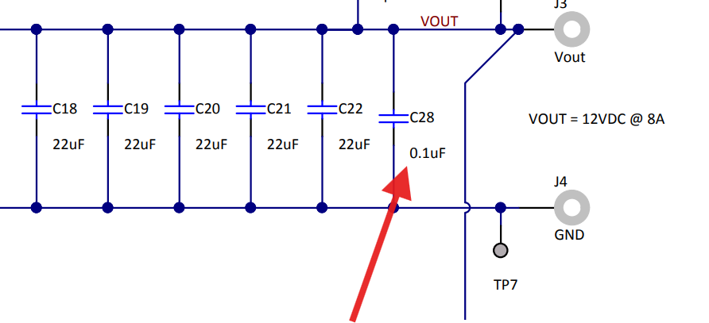

Bu ODT gorseli ayni kararın sema tarafindaki izidir: ana cikis MLCC banki ile `C28 = 0.1 uF` yardimci kapasitör birlikte gorunur. `C28`, ilk `H_{filter}(s)` transfer fonksiyonu hesabinda ana enerji depolama elemani gibi sayilmadi; yuksek frekansli spike / ringing tarafinda yardimci rol olarak tutulacak.

Bu nedenle defterde ve `W.116` tarafinda gecen "cikis banki + C28 = 0.1 uF" cizgisi yalnizca teorik bir model degil; gercek EVM topolojisine de dayanan fiziksel bir yerlesim notu.

Bu gorseli birebir nihai BOM kaniti gibi degil, MLCC banki + kucuk yuksek-frekans yardimci kapasitör fikrinin fiziksel referansi gibi okuyorum. Kendi kartimda son degerler yine derating, yerlesim ve simulasyonla kapanacak.

Burada iki kapasite dili var: EVM fotografi nominal `5 x 22 uF` fiziksel banki gosteriyor; kontrol / hesap tarafinda ise `70 uF` gibi derated-etkin bir ana `Cout` degeri kullaniliyor. Bu ikisini dogrudan ayni satir gibi okumayacagim. Final BOM kontrolunde parca adedi, DC-bias derating, tolerans ve `C28 = 0.1 uF` yardimci rolu yeniden eslestirilecek.


#### 5.4.2 Bu iterasyondaki tasarim karari


Taslakta mevcut yaklasim su sekilde olgunlasmis:

- cikista ana agirlik MLCC'ler uzerinden kurulacak

- mevcut iterasyonda cikisa bulk kapasitör eklemekten kacinilacak

- bunun temel gerekcesi, bulk kapasitörlerin cikis empedansini ve dolayisiyla kompanzasyon davranisini etkilemesidir


Bu karar, `bulk kesinlikle kullanilmaz` anlamina gelmiyor. Su anki anlami daha dar:

- eger MLCC tabanli cikis agi ripple ve transient kriterlerini sagliyorsa, cikisa ek bulk koymayip kontrol tasarimini daha sade tutmak tercih edilir

- eger daha sonra transient hedefleri sikilasirsa, cikis bulk kapasitörü yeniden degerlendirilir

Bu karar su an "kapanmis nihai hukum" degil. `Cout` derating, ripple, load-step ve loop cevabi birlikte temiz kalirsa bu sade cikis agi korunacak; bu kontrollerden biri zayif kalirsa cikis bulk konusu tekrar acilacak.

Buradaki `bulk` karari sadece cikis tarafina ait. Sonraki `5.5` giris kapasiteleri bolumunde bulk kullanimi baska bir gerekceyle, yani kaynak ripple'i, EMI, sicak dongu ve transient enerji rezervi tarafindan ele aliniyor. Cikis bulk'u ile giris bulk'unu ayni karar gibi okumamak gerekiyor.


#### 5.4.3 Overshoot / Undershoot gerilimi ve acik-cevrim cikis impedance


ODT'den aktarilan metin (`6.1.1. Overshoot/Undershoot Gerilimi`):

> Çıkış yük akımında büyüklüğünde bir değişim olduğunda*? Çıkış geriliminin değişim miktarı kadar.
> : Açık Çevrim Çıkış Impedance’nin crossover frequency’ındaki büyüklüğü.
>
> ( Hata: Başvuru kaynağı bulunamadı.4 )
>
> miktarını düşürmek için, crossover frequency’ındaki açık-çevrim çıkış impedance’sını düşürmemiz şarttır.
> Bunu iki yolla yapabiliriz:
> a. Zou Şekil Hata: Başvuru kaynağı bulunamadı.1’e bakarsak, C’nin artmasıyla,vssss Zout’un düşürerek.***
> b. Fc frekansını arttırarak, (tasarım felsefemiz gereği süreç ilerlerken değiştirmeyeceğiz**)


Benim buradaki okuma:

ODT kopyasinda formül sembollerinin bir kismi eksik gelmis. Bu nedenle kaynak metni oldugu gibi korudum. Teknik anlam olarak burada anlatilan iliski buyuk olasilikla asagidaki sezgiye karsilik geliyor:

Buradaki `Zout` okumasi, bir sonraki `V_{ripple}` bolumundeki `Zout(f_sw)` ile ayni nokta degil. Bu alt baslikta ilgilendigim yer load-step sirasinda dongunun tepki verdigi `f_c` civari; sonraki alt baslikta ise surekli anahtarlama ripple'i icin `f_sw` civari.

$$
\Delta V_{out} \approx \Delta I_{load}\,\bigl|Z_{out}(f_c)\bigr|
$$
Burada:

- $\Delta I_{load}$, yuk akimindaki ani degisim
- $\Delta V_{out}$, cikis gerilimindeki overshoot veya undershoot buyuklugu
- $\lvert Z_{out}(f_c)\rvert$, crossover frekansi civarinda gorulen cikis empedansi buyuklugu

Bu alt bolumde korunacak iki temel tasarim fikri sunlar:

- etkin cikis kapasitansini artirarak `Zout`'u dusurmek
- `f_c` degerini arttirarak dongunun yuk degisimine daha hizli cevap vermesini saglamak

Ama mevcut tasarim felsefesinde `f_c` sonradan rastgele oynanacak bir parametre gibi durmuyor. O yuzden pratik agirlik daha cok kapasitör aginin sekillendirilmesine kayiyor.

Burada aklimdaki `f_c`, sonraki kompanzasyon bolumunde surekli geri gelen `35 kHz` cizgisi. Bu nedenle load-step kontrolunde `\Delta I_{load}` icin hedef tablodaki `5.429 A` fark akimi, `Zout(f_c)` icin de `35 kHz` civari ayni anda dusunulacak. `f_c` degisirse sadece bu satir degil; kompanzasyon, faz marji ve giris filtresiyle etkilesim de tekrar acilir.


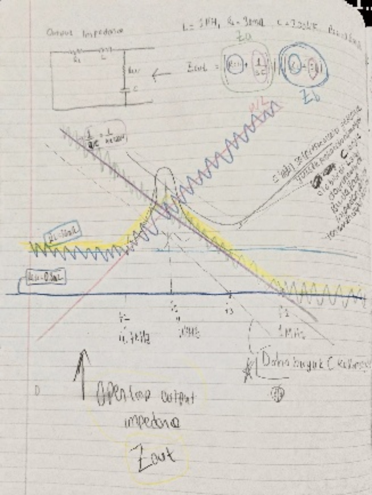


#### 5.4.4 Vripple ve `fsw` civarindaki `Zout`


ODT'den aktarilan metin (`6.1.2. Vripple Gerilimi`):

> Çıkış gerilimini düşürmek için, bobin akımının tepeden tepeye değerini düşürmek gerekir. Bunu da L’yi arttırarak yapabiliriz. Çıkış bobinin inductance’ı artarsa tepeden tepeye bobin akımının dalgalanması azalır. Eğer inductance çok artarsa, dalgalanmayı düşürürüz fakat, maliyet artar, fiziksel boyut artar, transient response bozulabilir.
>
> gerilimini düşürmenin daha etkili bir yolu, fsw frekansındaki çıkış impedance’sını düşürmektir. Şekil Hata: Başvuru kaynağı bulunamadı.1’a bakarsak; Zout, Daha yüksek capacitance ve daha düşük bir esr direncinden oluşursa; Capacitance eğrisi sola kayar, yatayda düz bir eğri olan esr direnci de azaldığı için daha aşağıda olur. fsw frekansında Zout‘u etkin oldüşürdüğünü görebiliriz.****?
>
$$
V_{ripple} = I_{L(P-P)} \cdot Z_{OUT}(f_{sw})
$$
>
> ( Hata: Başvuru kaynağı bulunamadı.5 )


Benim buradaki okuma:

Burada `Vripple` dusuncesini iki ayri tasarim koluna ayiriyorum:

- bobin akimi dalgalanmasini azaltmak icin `L` degerini buyutmek
- anahtarlama frekansi civarinda `Zout`'u dusurmek

Ilk sezgi su sekilde yazilabilir:

$$
\Delta I_L \propto \frac{1}{L}
$$
Yani `L` arttikca bobin akiminin tepeden tepeye dalgalanmasi azalir. Ancak ODT'de dogru sezildigi gibi, bunun karsiliginda hacim, maliyet ve transient cevap hizi etkilenebilir.

Ikinci yol ise $f_{sw}$ civarindaki cikis empedansini dusurmektir. Bunun pratik anlami sunlardir:

- daha yuksek etkin kapasitans
- daha dusuk `ESR`
- uygun yerlesim ile daha dusuk parasitikler

Bu alt bolumde korunacak ana fikir su: $V_{ripple}$ yalnizca bobin akim dalgalanmasi problemi degil, ayni zamanda $f_{sw}$ civarindaki $Z_{out}$'un sekillendirilmesi problemidir.

Buradaki `V_{ripple} = I_{L(P-P)} \cdot Z_{OUT}(f_{sw})` satirini steady-state anahtarlama ripple'i olarak okuyorum. `100 mVpp` hedefi kontrol edilirken olcum penceresi oturmus rejimde, prob noktasi `Vout`ta ve anahtarlama periyodu uzerinden alinmali. Load-step undershoot/overshoot veya cok hizli spike/ringing bu tek ripple sayisinin icine saklanmayacak; onlar `5.4.3`, `5.4.6` ve `8.4` ile ayrica kapanacak.

Bu yuzden bu alt baslikta ilerleme siram su:

- once `Delta I_L` tarafini, yani bobin seciminden gelen ripple akimini takip ediyorum
- sonra `Zout(f_sw)` tarafini, yani cikis MLCC banki / ESR / ESL / yerlesim etkisini izliyorum
- son olarak `W.68-W.71` ile bu iki bakisi `Zout(f_c)` transient notundan ayiriyorum

Defterden aktarilan not (`W.68`):

Burada cikis sığaçlariyla ilgili dusunceyi iki ayri performans metriğine ayiriyorum ve bunlari `Zout` ile bagliyorum:


1. load-step / transient sirasindaki `undershoot-overshoot`
2. surekli anahtarlama sirasindaki `Vripple`

Sayfada ilk olarak su iliski not edilmis:

$$
V_{out,\text{undershoot}} \approx \Delta I_{out}\,\lvert Z_{out}(f_c)\rvert
$$
ve bunun "dusurmek gerekir" notu eklenmis. Yani yuk akimi bir anda degistiginde gorulen gerilim sapmasi, crossover civarindaki cikis empedansiyla iliskilendiriliyor.

Sayfada daha sonra ripple icin su iliski tekrar yaziliyor:

$$
V_{ripple} \approx I_{L(p-p)} \, \lvert Z_{out}(f_{sw})\rvert
$$
Bu bolumdeki ana dusunce izi sunlar:

- `V_{ripple}`'i azaltmak icin ya bobin akimi dalgalanmasi `\Delta I_L` dusurulur
- ya da `f_{sw}` civarindaki `Zout` daha dusuk hale getirilir
- bunu saglamak icin:
  - daha dusuk `ESR`
  - daha yuksek etkin `C`
  - uygun frekans davranisina sahip bir kapasitör agi
  kullanilabilir

Sayfanin ust tarafinda ayrica su notlar korunmaya deger:

- cikis sığaci ani yuk degisimlerinde enerji tamponu gibi davranir
- dusuk cikis empedansi, yuk degisimlerine hizli ve kararlı gerilim cevabi icin gereklidir
- spike'lar icin ise ek kucuk MLCC / dusuk `ESL` dusuncesi not edilmis

`W.68`, `5.4.3` ve `5.4.4` alt bolumlerinde yazdigim iki farkli `Zout` bakisini ayni sayfada birlestiriyor. Yeni bir nihai sayisal sonuc vermiyor; daha cok transient ile ripple tarafini `Zout(fc)` ve `Zout(fsw)` uzerinden zihnimde ayiran bir tasarim notu.

Defterden aktarilan not (`W.69`):

Burada, Bode grafiklerine bakilmadiginda kapasitans degisiminin etkisinin tam anlasilmadigi not edilmis ve konu tek basina kapasitör empedansi uzerinden aciklanmaya calisiliyor.


Sayfada yazilan temel iliski:

$$
Z_C(f) = \frac{1}{2\pi f C}
$$
Bu iliskiye bagli olarak sayfada su sezgiler yazilmis:

- dusuk frekansta buyuk `Z_C`
- yuksek frekansta dusuk `Z_C`

ve buna bagli yorumlar:

- dusuk frekansta enerji depolama rolu daha on plandadir
- yuksek frekansta ise kapasitör, gerilim baskilama / destekleme rolunde daha etkindir

Sayfanin ana amaci, kapasitans degeri degistiginde bunun frekans cevabina neden dogrudan yansidigini sezgisel olarak gostermek.

`W.69`, `W.68`in dogal kavramsal devami. `Zout(fc)` ve `Zout(fsw)` dusuncesinin arkasindaki en temel `Z_C(f)` sezgisini yeniden yaziyor.

Yeni bir sayisal sonuc cikarmiyor; ama "neden Bode / frekans bakisi olmadan ayni kapasitans degisiminin tum etkisini goremiyorum?" sorusuna iyi bir defter cevabi veriyor.

Buradaki `Z_C` satiri sadece ideal kapasitör sezgisi. `332 kHz` civarinda bunu tek basina `Zout(f_sw)` sonucu gibi kullanmayacagim; MLCC'nin `ESR/ESL`, DC-bias altindaki etkin kapasitesi, paralel dizilim ve layout etkisi `W.70-W.72` ile birlikte okunacak.

Defterden aktarilan not (`W.70`):

Burada kapasitörun frekansa bagli empedansi ile klasik ripple-tabanli `C` hesabinin nereden geldigi ayni yerde birlesiyor.


Sayfada once temel kapasitör empedansi tekrar yaziliyor:

$$
Z_C(f) = \frac{1}{2\pi f C}
$$
Ardindan su kavramsal not eklenmis:

- dusuk frekansta kapasitörun `ESR/ESL` etkileri genellikle daha az baskindir
- frekans arttikca ideal kapasitif davranisin yanina `ESR` ve sonra `ESL` etkileri daha gorunur hale gelir
- dolayisiyla tek bir `C` degeriyle tum frekans davranisini anlatmak yeterli degildir

Sayfadaki cizim de bunu destekliyor:

- bir bolgede ideal kapasitif egim
- sonra `ESR` nedeniyle daha yatay davranis
- daha da yuksek frekansta parasitiklerin devreye girmesi

Sayfanin altinda klasik ripple baglantisi da not edilmis:

$$
\Delta Q = C\,\Delta V
$$
ve buradan, bobin akim dalgalanmasi ile iliskili klasik yaklasima gecis yapiliyor:

$$
\Delta V \approx \frac{\Delta I_L \, T_{switch}}{8\,C} \qquad \Longrightarrow \qquad C \approx \frac{\Delta I_L \, T_{switch}}{8\,\Delta V}
$$
Yani burada, cikis ripple denklemindeki `8 f C` yapisinin nereden geldigini hatirlatan bir not var.

Bu satiri `W.34-W.58` tarafindaki `Cout` alt-sinir hesaplarina baglayan kisim `T_{switch} = 1/f_{sw}` kabuludur. Bu projede `f_{sw} = 332 kHz` ve ana ripple adayi `\Delta I_L \approx 3.8 A_{p-p}`; dolayisiyla bu denklem benim icin "minimum kapasitif ihtiyac" kontrolu. Secilen `70 uF` etkin banka bu alt sinirla kiyaslanacak, ama final `Vout` ripple dalga sekli `ESR/ESL` ve layout ile birlikte LTspice'ta gorulecek.

Buradaki notu nihai toplam ripple hesabi gibi okumuyorum. `8 f C` parcasi kapasitif bileseni ayiriyor; `ESR` kaynakli ripple ve `ESL` / yerlesim kaynakli spike tarafi ise ayni denklemle kapanmis sayilmiyor. Onlar `W.72`deki gercek kapasitör modeli ve daha sonraki MLCC / ESR / ESL kontrolleriyle birlikte okunacak.

`W.70`, `W.68-W.69` hattinin dogal devami. Yeni bir nihai sayisal sonuc vermiyor; ama `Zout` ve frekans bakisina klasik `\Delta Q = C\Delta V` ripple sezgisini ekliyor.

Cikis sığaci seciminde hem frekans-temelli empedans dusuncesini hem de zaman-duzlemindeki ripple yaklasimini birlikte nasil tuttugum burada gorunuyor.

Buradan sonra gelen sayfalar ayni meseleyi parca parca tekrar kuruyor: `W.71` kisa ozet, `W.72` gercek kapasitör modeli, `W.73-W.141` kontrol tarafina acilan kopru, `W.42-W.57` kavramsal gerekce, `W.28-W.93` ise eski/guncel `Cout` alt-sinir kontrolleri.

Defterden aktarilan not (`W.71`):

Burada `W.68-W.70` hattindaki dusunce, kisa bir kenar notu gibi tekrar toplaniyor.


Sayfada korunacak ana fikir su:

- `f_c` civarinda cikis empedansi, `undershoot/overshoot` davranisi icin belirleyicidir
- `f_{sw}` civarinda ise cikis empedansi, `V_{ripple}` davranisi icin belirleyicidir

Sayfadaki iliskiler su sekilde yeniden not edilmis:

$$
V_{out,\text{undershoot}} \approx \Delta I_{out} \times Z_{out}(f_c)
$$
$$
V_{ripple} \approx I_{L(p-p)} \times Z_{out}(f_{sw})
$$
Sayfanin altindaki not, bu iliskilerin Bode / empedans egileri uzerinden dusunulmesi gerektigini yeniden vurguluyor.

`W.71` yeni bir sayisal sonuc vermiyor. Kisa ama islevi net: transient ve ripple problemini ayni `Zout` kelimesiyle degil, farkli frekans noktalarinda dusunmem gerektigini hatirlatiyor.

Bu sayfayi ileride ozet tabloya tasirken iki satiri ayri tutacagim: `Zout(f_c)` satiri load-step / `5.429 A` fark akimi / undershoot-overshoot tarafina, `Zout(f_sw)` satiri ise steady-state ripple / `\Delta I_L` / `100 mVpp` tarafina ait. Boylece `35 kHz` ile `332 kHz` ayni hesap satirina karismayacak.

Defterden aktarilan not (`W.72`):

Burada kapasitörü artik ideal bir `C` elemani gibi degil, gercek esdeger modeli ile dusunmeye basliyorum.


Sayfada cizilen model su sekilde okunuyor:

- ideal kapasitans `C`
- buna paralel buyuk bir sizinti direnci (`R_{leak}` benzeri)
- bunlarin uzerine seri bagli `ESL`
- ve seri bagli `ESR`

Sayfadaki toplam empedans notu su sekilde yazilmis:

$$
Z = \left(Z_C \parallel Z_{Rleak}\right) + Z_{ESL} + Z_{ESR}
$$
hemen altinda da ilk yaklasim olarak:

$$
Z \approx Z_C + Z_{ESL} + Z_{ESR}
$$
notu dusulmus. Sayfa kenarindaki aciklamadan, `R_{leak}`'in genelde cok buyuk oldugu ve bu nedenle ilk yaklasimda ihmal edilebildigi dusuncesi anlasiliyor.

Buradaki ana deger su:

- kapasitörun empedansi frekansa gore yalnizca `1/(sC)` gibi davranmaz
- `ESR` ve `ESL` de modele girince, cikis sığaci secimi frekans cevabini ve spike davranisini dogrudan etkiler
- dolayisiyla `Zout` dusuncesi kurulurken gercek komponent modeli gereklidir

Bu sayfayi guncel parca secimiyle bagladigim yer su: MLCC bankini sadece katalogdaki `22 uF` degeriyle okumak yetmez. `DC-bias` altindaki etkin `C`, `f_sw` civarindaki `ESR`, paket / yerlesimden gelen `ESL` ve paralel dizilimin toplam empedansi birlikte kontrol edilecek. O yuzden `W.72`, sonraki ESR grafigi, derated `Cout` notlari ve simulasyon kontrol listesiyle ayni hatta duruyor.

Bu modelde her elemanin kapattigi soru farkli: `C` ve `DC-bias` etkin enerji/ripple kapasitesini, `ESR` anahtarlama ripple'i ve kayip/ESR sifirini, `ESL` ise spike-ringing ve layout tarafini etkiliyor. `R_{leak}` bu hizli dinamiklerde geri planda kalabilir; ama "gercek komponent ideal degil" uyarisini tamamliyor. Bu yuzden tek bir `22 uF` katalog satiri final garanti degil.

`W.72`, `W.57`, `W.69` ve `W.70` ile ayni hatta duruyor. Bu sayfa `Zout` dusuncesini sadece ideal kapasitansa degil, gercek MLCC davranisina bagliyor.

Defterden aktarilan not (`W.73`):

Burada artik output filter / control-to-output ve Type-III kompanzator topolojisi ayni cizim uzerinde dusunulmeye basliyor.


Sayfanin ust tarafinda `control-to-output` notu ve buna ait kavramsal bir Bode sekli var:

- `\omega_0` civarinda LC cift kutbu
- `\omega_z` civarinda `ESR` sifiri
- bunlara gore kompanzator kutup ve sifirlarinin yerlestirilmesi gerektigi seziliyor

Sayfanin orta kismina cizilen op-amp topolojisi ise Type-III kompanzatorun fiziksel `R-C` agini gosteren bir ara devre cizimi gibi okunuyor.

Bu cizimde iki empedans blogu etiketlenmis:

$$
H(s) = \frac{V_c}{V_o} = -\frac{Z_F}{Z_1}
$$
ve altta bunlarin acilimi not edilmis:

$$
Z_1 = R_1 \parallel \left(R_3 + \frac{1}{sC_2}\right)
$$
$$
Z_F = \frac{1}{sC_3} \parallel \left(R_2 + \frac{1}{sC_1}\right)
$$
Sayfanin alttaki ifadesi de, kompanzator transfer fonksiyonunu bu iki empedansin orani olarak kurma denemesidir.

`W.73`, cikis sığaci / plant modelinden kompanzator topolojisine gecen ilk kopru sayfa. Nihai komponent degerlerini tek basina vermiyor; daha cok "planti gordukten sonra Type-III agi nasil kurulur?" sorusunun ilk defter cevabi gibi.

Bu sayfayi `6.4`teki nihai kompanzator setinin yerine koymuyorum. Buradaki asil deger, plantten Type-III agina gecisi kaybetmemek: once `70 uF / 6.8 uH / ESR / R_damp` planti netlesecek, sonra `RFB1/RFB2 = 26.4 kOhm / 1.6 kOhm` ailesiyle tek kompanzator seti hesaplanacak. `Z_F/Z_1` cebiri bu kopruyu gosteriyor; final BOM satiri degil.

Defterden aktarilan not (`W.141`):

Burasi, `W.73`te tanimladigim Type-III kompanzator agindaki `Z_F` ve `Z_1` empedanslarinin cebirsel olarak nasil acildigini gosteren bir ara islem sayfasi.

Yeni kutup/sifir hedefi ya da yeni nihai komponent sonucu vermiyor. Burada onemli olan sey, Type-III agi sadece sema olarak degil, cebir olarak da takip etmeye calismam.


Sayfanin ust tarafinda, `H(s) = -Z_F/Z_1` ifadesindeki iki paralel empedansin orani tekrar yazilmis gorunuyor:

$$
H(s) = - \frac{ \left(\dfrac{1}{sC_3}\right)\parallel\left(\dfrac{sR_2C_1+1}{sC_1}\right) }{ R_1\parallel\left(\dfrac{sR_3C_2+1}{sC_2}\right) }
$$
Sayfanin orta kismina dogru ise, ozellikle paydaki `Z_F` blogunun paralel empedans formulu ile acilmaya baslandigi goruluyor. Yani:

$$
Z_F = \left(\frac{1}{sC_3}\right)\parallel\left(\frac{sR_2C_1+1}{sC_1}\right)
$$
ifadesi, klasik

$$
Z_a \parallel Z_b = \frac{Z_a Z_b}{Z_a + Z_b}
$$
mantigiyla duzenleniyor.

Sayfadaki cebir tam sonuca kadar gitmiyor; ancak ana niyet net:

- `Z_F` ve `Z_1` tek tek sadeletilecek
- sonra `H(s) = -Z_F/Z_1` ifadesi pay/payda polinom formuna cekilecek
- boylece kutup ve sifirlar daha acik okunabilir hale gelecek

Burada yeni frekans yerlesimi yok. Ama `W.73`te sema olarak kurdugum Type-III ag bu kez cebirsel olarak acilmaya basliyor.

`W.84-W.85`te gordugum kutup-sifir hedeflerinin arkasinda yalnizca ezber iliski degil, bu tur ara cebir adimlari oldugu da netlesiyor.

Bu cebir notunda eksi isaret ve `H(s)` tanimi da acik tutulacak. Burada `H(s)` daha cok tersleyen op-amp aginin `V_c/V_o` veya `V_control/V_sense` oranini izliyor; final open-loop'ta bu blok modulator, plant ve feedback bolucusu ile ayni isaret/kazanc taniminda birlestirilecek. `RFB` orani zaten kompanzator tanimina girdiyse ayrica `H_FB` carpani olarak ikinci kez sayilmamali.

Defterden aktarilan not (`W.42`):

Burada bobin ve kapasitörun gorevini daha temel bir dille ozetliyorum:


- bobin, akimi bir anda degistirmek istemez
- kapasitör, gerilimi bir anda degistirmek istemez

Sayfadaki ana fikirler su sekilde okunabilir:

- bobin icin:
$$
V_L = L\frac{di_L}{dt}
$$
  Bu nedenle akimi hizla degistirmek icin buyuk gerilim gerekir.
- kapasitör icin:
$$
E = \frac{1}{2} C V^2
$$
  Daha buyuk `C`, ayni gerilim seviyesinde daha fazla enerji tutabilir; bu da ani yuk degisimlerinde gerilimin daha zor dusmesi anlamina gelir.

Sayfa sonunda ayrica su pratik ayrim not edilmis:

- `ripple`: surekli tekrar eden kucuk dalgalanma
- `transient`: ani ve buyuk degisim

Bu ayrimi cikis tarafinda iki ayri kontrol kapisi gibi tutuyorum: `ripple` icin bobin dalgalanmasi ve `Zout(f_sw)`; `transient` icin load-step fark akimi, bobin `di/dt` siniri ve `Cout` enerji tamponu. Yani ayni kapasitor banki iki problemi de etkiliyor, ama ikisini ayni denklemle kapatmiyorum.

Burada yeni bir sayisal hesap yok. Ama sayfanin yeri bende net: bobin akimi bir anda degistirmek istemez, kapasitör de gerilimi bir anda degistirmek istemez. `W.34-W.41` araligindaki cikis / giris kapasitörü secim mantiginin fiziksel sezgisi buradan geliyor.

Defterden aktarilan not (`W.46`):

Burada kapasitör secimini yalnizca `uF` degerine bakarak yapamayacagimi, frekansa bagli davranisi da dusunmem gerektigini not ediyorum.


Sayfada gorulen ana fikirler sunlar:

- kapasitör empedansi frekansa gore degisir
- belirli bir noktadan sonra parasitik enduktans etkisi on plana cikabilir
- dolayisiyla kapasitör, her frekansta ayni eleman gibi davranmaz

Sayfadaki cizim, empedansin frekansla once azaldigi, sonra parasitik / enduktif davranis nedeniyle yeniden artabildigi dusuncesini gosteren kavramsal bir not gibi okunabilir.

Alt tarafta ayrica secim kriterleri kisa maddeler halinde yazilmis:

- power loss
- boyut
- device lifetime
- cikis regulation kalitesi
- hiz
- kararlilik
- bant genisligi (`BW`)
- load transient response

`W.46` benim icin secim listesi gibi: power loss, boyut, lifetime, regulation, hiz, kararlilik, BW, load transient... Yeni bir son denklem vermiyor; ama kapasitör seciminin neden tek boyutlu bir `C` secimi olmadigini acikca tutuyor.

Bu listeyi final BOM satiri gibi degil, `W.57` ve `W.72`ye acilan kontrol listesi gibi okuyorum. Once katalog `uF` degeri goruluyor; sonra `dc-bias` altindaki etkin `C`, `f_sw` civarindaki `ESR`, yuksek frekanstaki `ESL` / spike davranisi, ripple akimi ve lifetime ayni parca adayina tekrar baglanacak.

Defterden aktarilan not (`W.57`):

Burada cikis sığaçlari seciminde yalnizca toplam kapasitansi degil, `ESR`, `dc-bias` altindaki etkin kapasitansi ve frekansa bagli davranisi da birlikte dusunmem gerektigini toparliyorum.


Sayfada gorulen ana fikirler sunlar:

- sığaçlari paralel baglamak:
  - toplam kapasitansi arttirir
  - etkin `ESR`'yi dusurur
- farkli `C` degerlerindeki sığaçlar, farkli frekanslarda daha iyi performans verebilir
- bu nedenle paralel ag, frekansa gore daha iyi bir toplam davranis verebilir

Sayfada ayrica MLCC'ler icin cok kritik bir not var:

- yuksek gerilim altinda MLCC'lerin etkin kapasitansi ciddi oranda dusebilir
- bu nedenle `2 x 22 uF` katalog degerli iki parcadan olusan bir bank, pratikte `44 uF` gibi degil, daha dusuk etkin bir deger gibi davranabilir

Bir diger not da cikis ripple akimiyle iliskili:

- bobinden gelen `\Delta I_L \approx 3.8 A` dalgalanmanin buyuk kismi cikis sığaçlari tarafindan karsilanir
- bu nedenle cikis sığaç secimi yalnizca `Cout` degeri degil, ayni zamanda ripple akimi tasima ve `ESR` dusuklugu problemidir


Bu ekran goruntusu, `W.57`te yazdigim "frekansa bagli davranis" fikrini daha somut hale getiriyor. Ornek MLCC icin `326.554 kHz` civarinda `ESR \approx 1.321 m\Omega` okunmasi, daha sonra `W.116` tarafinda kullandigim `ESR_{Ceq} \approx 1.3 m\Omega` mertebesinin rastgele secilmedigini gosteriyor.

Sayfa sonunda ayrica yuksek frekans davranisi icin su fikir not edilmis:

- MLCC'ler ile yuksek frekansli sorunlar bastirilabilir
- `400 kHz - 1 MHz` civarinda parasitik enduktans (`ESL`) etkisi on plana cikmaya baslayabilir
- bu noktada cok farkli degerli veya kucuk degerli MLCC'ler spike bastirma amacli fayda saglayabilir

`W.57`, `W.46` ile ayni kavramsal hatta duruyor. Bu yuzden ana cikis MLCC bankini anlamak icin kalmali.

Yeni bir sayisal sonuc vermiyor; daha cok sectigim cikis MLCC bankini nasil dusunmem gerektigine dair tasarim mantigi veriyor. `dc-bias` altinda etkin kapasitans dususu notu da sayfanin en guclu yani; katalog `uF` toplami ile gercek etkin `Cout` arasindaki farki acikca hatirlatiyor.

Buradaki `2 x 22 uF` notu, guncel `5 x 22 uF` fiziksel bankin tam sayisi gibi degil; MLCC derating sezgisini anlatan kucuk ornek gibi duruyor. Son kontrolde `5.4.1`deki fiziksel bank, `70 uF` etkin `Cout` kabulu ve `W.116` plant satiri ayni BOM/derating kontrolunde birlestirilecek.


Defterden aktarilan not (`W.116`):

Burada kontrol hesabina giden output-filter sayilarini tek sayfada toplamisim. Bu sayfa `Cout` owner'i icin kritik cunku fiziksel MLCC bankini, etkin `70 uF` kabulunu, `C28 = 0.1 uF` yardimci rolunu ve `ESR_Ceq` farkini ayni yerde gorunur yapiyor.


Sayfada okunabilen ana `Cout` notlari sunlar:

- `C10-C22` grubu ve `22 uF` notu, capacitor bank'in parca deger izini verir
- `C28 = 0.1 uF`, daha kucuk yuksek-frekans yardimci kapasitör olarak ayrilir
- plant hesabina giren toplam etkin ana kapasite `70 uF` olarak tutulmustur

Buradaki `22 uF` ve `70 uF` satirlari birbirinin yerine gecmiyor. `22 uF` parca / banka izini, `70 uF` ise derating ve paralel bank sonrasi transfer fonksiyonunda kullanilan etkin degeri temsil ediyor. Son BOM kontrolunde bu iki satir tekrar eslestirilmeli.

`ESR_Ceq` icin yaklasik:

$$
ESR_{Ceq} \approx 1.3\,m\Omega
$$


Iki ayri ekran goruntusunde de ayni mertebede `ESR \approx 1.3 m\Omega` okunmasi, `ESR_Ceq` buyuklugunun tek bir rastgele cursor okumasina degil, tekrar eden bir datasheet / arac teyidine dayandigini gosteren destek katmani olusturuyor.

Sayfada bobin ve damping tarafina giden plant handoff da var: `L_F = 6.8 uH`, `DCR \approx 0.88 m\Omega`, `R_{damp} \approx 21.13 m\Omega` ve `f_0 \approx 7.309 kHz`. Bu sayilarin komponent owner'i bobin icin `5.3`, cikis kapasitörü icin bu bolumdur; `6.2.3` bunlari yalniz `H_{filter}(s)` icine yerlestirir.


Defterden aktarilan not (`W.28`):

- burada, cikis ripple / cikis kapasitörü tarafinda alternatif bir ilk boyutlandirma denemesi var
- `2 x 22 uF` ve `~2 mOhm ESR` benzeri bir cikis bankasi varsayimi kullaniliyor
- yazilan iliski, klasik buck ripple yaklasimi ile minimum `Cout` tarafina bakiyor


`W.28`, mevcut belgede kullanilan `70 uF` cikis bankasi ile birebir uyusmuyor. O yuzden bunu "yanlis hesap" diye silmiyorum; eski / alternatif bir cikis kapasitörü iterasyonu olarak kaliyor. Ripple icin kullanilan bu tip hesaplari, nihai cikis capacitor bank'ini anlatirken BOM ve sonraki sayfalarla yeniden eslestirmek gerekiyor.

Defterden aktarilan not (`W.34`, `W.37`):

Bu iki sayfa, cikis kapasitörü tarafinda iki farkli alt kriteri ayri ayri kontrol ediyor:


- `W.34`: ripple siniri tarafindan minimum `Cout`
- `W.37`: load-step / overshoot siniri tarafindan minimum `Cout`

`W.34` tarafinda klasik ripple tabanli yaklasimla, `f_{sw} = 332 kHz`, `\Delta I_L \approx 3.8 A`, `\Delta V_{out} = 0.1 V` ve `R_{ESR} = 5 mOhm` varsayimi altinda yaklasik:

$$
C_{out} \gtrsim 14.57\,\mu\text{F}
$$
`W.37` tarafinda ise `I_{step} \approx 5.429 A`, `L_F = 6.8 \mu H` ve izin verilen overshoot/undershoot zarfi ile:

$$
C_{out} \gtrsim 2.32\,\mu\text{F}
$$
Bu iki sayfa ayni capacitor bank'i iki farkli acidan kontrol ediyor. `W.37` sonucuna gore transient siniri burada daha gevsek, `W.34` sonucu ise daha zorlayici. Yani bu iterasyonda cikis kapasitörü boyutunu asil belirleyen sey ripple kriteri. Bu da onceki `70 uF` mertebesindeki secimin neden rahat marjli gorundugunu acikliyor.

Bu cikarimi final load-step kabulu gibi okumuyorum. `W.37` daha cok kapasite alt siniri ve `5.429 A` fark akimi icin ilk enerji kontrolu; gercek transient cevabi dongu bant genisligi, `Zout(f_c)`, MLCC `ESR/ESL`, bobin `di/dt` siniri ve LTspice load-step dalga sekliyle tekrar kapanacak.

Defterden aktarilan not (`W.58`):

Burada cikis ripple denklemini daha acik yazarak `Cout` alt sinirini bobin ripple akimina bagli sekilde tekrar kontrol ediyorum.


Sayfada kullanilan iliski su sekilde okunuyor:

$$
C_{out} \gg \frac{\Delta I_L} {8\,f_{sw}\,\sqrt{\Delta V_{out}^2 - \left(R_{ESR}\Delta I_L\right)^2}}
$$
Defterde bu denklem iki farkli bobin ripple senaryosu icin yerlestirilmis:

1. `L = 6.8 uH` secimine karsilik gelen yaklasik `\Delta I_L = 3.8 A_{p-p}` durumu

$$
C_{out} \gg 14\,\mu\text{F}
$$
2. `L = 9.6 uH` gibi daha buyuk bir bobine karsilik gelen yaklasik `\Delta I_L = 2.7 A_{p-p}` durumu

$$
C_{out} \gg 10\,\mu\text{F}
$$
Sayfadaki notlardan, bu iki durumda da `R_{ESR} \approx 2\,m\Omega` ve `\Delta V_{out} \approx 0.1 V` civari bir kontrol yapildigi anlasiliyor.

`W.58`, `W.34`teki ripple-tabanli minimum `Cout` hesabinin daha acik formullu ve karsilastirmali bir devam sayfasi. Daha buyuk `L` secildiginde `\Delta I_L` azaliyor; gereken minimum `Cout` alt siniri de dusuyor. Mevcut `70 uF` mertebesindeki secim de iki alt sinirin oldukca uzerinde kaliyor.

Defterden aktarilan not (`W.93`):

Burada cikis ripple'inin kapasitif bilesenini daha sade bir ifadeyle tekrar yaziyorum. Ust kisimda su iliski not edilmis:


$$
\Delta V_{out(C)} \approx \frac{I_{pp}}{8\,f_{sw}\,C_{out}}
$$
ve `I_{pp}`'nin, bobin akiminin tepeden-tepeye ripple'i yani `\Delta I_{L(p-p)}` oldugu not edilmis.

Sayfanin yan notlarinda, onceki bobin sayfalarina baglanan iki ripple senaryosu tekrar yaziliyor:

- `\Delta I_L / I_{out,\max} \approx 0.42`
- buna karsilik `\Delta I_L \approx 3.8 A`
- alternatif / daha buyuk `L` durumunda ise `\Delta I_L \approx 2.7 A`

Sayfanin ortasindaki yerlestirme, `3.8 A` ile kapasitif ripple teriminin hesaplanmaya calisildigini gosteriyor:

$$
\Delta V_{out(C)} \approx \frac{3.8}{8 \times 332\times 10^3 \times C_{out}}
$$
`W.93`, `W.58`in cok kisa bir teyit / kaynak-ustu-not devami. Burada `ESR` teriminden ayri olarak yalnizca kapasitif ripple bileseni yaziliyor. Yeni bir nihai `Cout` sonucu vermiyor; ama `\Delta I_L = 3.8 A` ve `2.7 A` senaryolarinin cikis ripple hesabina nasil girdigini gostererek bobin secimi ile cikis ripple'i arasindaki bagi tekrar kuruyor.

Ek not (calculator teyidi):

`LM5146_quickstart_calculator_revB1.xlsm` dosyasinda cikis sığaçlari icin su checkpoint gorunuyor:

- minimum ideal `C_{OUT} \approx 12.699 uF`
- toplam derated `C_{OUT} \approx 70 uF`
- toplam `ESR \approx 0.28 mOhm`
- hesaplanan ripple `\approx 18.17 mV_{p-p}`

Bu kisim guncel omurgaya daha yakin duruyor: calculator tarafinda `70 uF` derated cikis banki gorunuyor. Defterdeki `10-14 uF` civari alt sinir hesaplari ise, secilen `70 uF` bankin neden rahat marjli gorundugunu aciklayan asama notlari olarak okunmali.

[Çapraz Teyit] `WEBENCH` snapshot'inda `Vout Actual = 13.8 V` ile statik hedef (`14 V +- 3%`) icinde kaliniyor; fakat `Vout p-p = 122.002 mV` olarak okunuyor ve bu `100 mVpp` hedefinin biraz ustunde. Bu sayi cikis kapasitörü owner'i altinda `[Açık Kontrol]` olarak kaliyor; ayni kosul setiyle LTspice'ta `Vout` olcum penceresi tekrar kurulmadan final kabul sayilmiyor.

Defterden aktarilan not (`W.59`):

Burada, yuk akiminin azalmasi sirasinda olusabilecek cikis gerilimi `overshoot` sinirina gore gerekli minimum `Cout` degerini hesapliyorum.


Sayfada kullanilan iliski su sekilde okunuyor:

$$
C_{out} \gg \frac{L_F \, \Delta I_{out}^{\,2}} {\left(V_{out} + \Delta V_{overshoot}\right)^2 - V_{out}^{\,2}}
$$
Defterde yuk adimi su sekilde not edilmis:

- $9\,\text{A} \rightarrow 3.571\,\text{A}$
- dolayisiyla
$$
I_{step} \approx 9 - 3.571 = 5.429\,\text{A}
$$

Ilk yerlestirmede cikis transient siniri, `14 V ± 20%` olarak alinmis:

- $\Delta V_{overshoot} = 2.8\,\text{V}$

ve `L_F = 6.8\,\mu\text{H}` ile:

$$
C_{out} \gg 2.3\,\mu\text{F}
$$
Sayfada hemen sonra, bu transient limitin "cok gevsek" oldugu not edilerek daha siki bir deneme daha yapiliyor:

- `14 V ± 10%`
- dolayisiyla $\Delta V_{overshoot} = 1.4\,\text{V}$

Bu durumda:

$$
C_{out} \gg 4.86\,\mu\text{F}
$$
`W.59`, `W.37`teki transient-tabanli minimum `Cout` hesabinin daha acik ve karsilastirmali devami. Burada da transient kriteri ripple kriterine gore daha gevsek kaliyor. `%20` yerine `%10` zarf kullanildiginda gereken minimum `Cout` artsa da, yine de `W.58`teki ripple-tabanli `10-14 uF` seviyelerinin altinda kaliyor. Yani `W.58-W.59` birlikte okununca, bu iterasyonda cikis sığaç secimini belirleyen baskin kriterin hala ripple tarafi oldugu goruluyor.

Buradan sonra konu sadece "minimum `Cout` kac uF olmali?" sorusu degil. `W.60-W.66` araliginda ayni cikis filtresini `Q`, plant modeli ve `Zout` egrisi tarafindan dusunmeye basliyorum. Bu sayfalardaki bazi sayilar ikinci projenin nihai sayilari degil; bu kisim daha cok kontrol tarafina gecmeden onceki akil yurutme izi.

Defterden aktarilan not (`W.60`):

Burada cikis sığacinin yalnizca enerji tamponu olarak degil, ayni zamanda cikis LC filtresinin `Q` faktörunu ve dolayisiyla kontrol davranisini etkileyen eleman olarak dusunuldugu goruluyor.


Sayfanin ust tarafinda korunan ana fikirler sunlar:

- cikis sığaci, ani yuk degisimlerinde devreye destek olur
- gerilimi sabit tutmaya yardim eder
- control loop, gerilim sapmasini algilar ve MOSFET'lerin acilma suresini ayarlar
- fakat bulk / cikis sığaci arttikca cevap yavaslayabilir; bu nedenle kontrol yavaslayabilir notu dusulmustur

Sayfada daha sonra cikis LC yapisinin `Q` faktorunu yuk ve kayiplar uzerinden okumaya calisan iliskiler var.

Yuk bagimli `Q` notu su sekilde okunuyor:

$$
Q_{load} = \frac{R}{\sqrt{L/C}}
$$
Sayfadaki dusunceye gore, yalnizca yuk direncine bakmak yeterli degildir; `L` ve `C` tarafindaki kayiplar da bu `Q` degerini dusurur. Bu nedenle ikinci bir kayip-kaynakli `Q` notu yazilmis:

$$
Q_{loss} \approx \frac{\sqrt{L/C}}{R_{\text{kayip,toplam}}}
$$
Sayfadaki ornek yerlestirmede:

- $L = 1\,\mu\text{H}$
- $C = 200\,\mu\text{F}$
- kayip direncleri toplami yaklasik `0.8 mOhm + 30 mOhm`

alininca:

$$
Q_{loss} \approx 2.3
$$
Yuk tarafinda ise `Vout = 1.8 V`, `Iout = 5 A` orneginden:

$$
R = \frac{1.8}{5} = 0.36\,\Omega
$$
ve buna bagli:

$$
Q_{load} = \frac{0.36}{\sqrt{1\,\mu\text{H}/200\,\mu\text{F}}} \approx 5.09
$$
Sayfanin sonunda bu iki etkinin birlikte dusunulmesi icin su iliski not edilmis:

$$
Q = Q_{loss} \parallel Q_{load} = \frac{Q_{loss}\,Q_{load}}{Q_{loss}+Q_{load}} \approx 1.55
$$
`W.60` benim icin "Cout sadece `uF` ve `ESR` degil, LC filtresinin `Q` davranisi da var" dedigim sayfa. Sayisal olarak ikinci projenin tum nihai degerleriyle birebir kurulmus bir sonuc sayfasi olmayabilir; bu yuzden nihai secim gibi degil, control-loop tarafina gecis notu gibi okunmali.

Defterden aktarilan not (`W.61`):

Burada `W.60`ta baslanan `Q_{load}`, `Q_{loss}` ve toplam `Q` dusuncesi yukun farkli uc durumlarinda sinaniyor.


Sayfada korunacak ana fikir sunlar:

- `Q_{load}` yuk direncine baglidir
- `Q_{loss}` ise daha cok filtre ve kayip direnclerine bagli sabit bir etki gibi ele alinmistir
- toplam `Q`, bu iki etkinin paralel bileskesi gibi dusunulmustur

Sayfada ilk olarak, cok hafif yuk / buyuk `R` durumunda `Q_{load}`'in cok buyuk olabildigi not edilmis:

$$
Q_{load} = \frac{R}{\sqrt{L/C}} \approx 25465
$$
Bu durumda `Q_{loss} \approx 2.3` ile paralel alindiginda:

$$
Q = Q_{loss} \parallel Q_{load} \approx \frac{2.3 \times 25465}{2.3 + 25465} \approx 2.299
$$
Yani cok hafif yukte toplam `Q`, neredeyse tamamen `Q_{loss}` tarafindan belirleniyor gibi okunuyor.

Sayfanin alt tarafinda ise agir yuk / kucuk `R` durumu denenmis:

- ornek olarak `Vout = 1.8 V`, `Iout = 200 A` notu uzerinden
$$
R = \frac{1.8}{200} = 9 \times 10^{-3}\,\Omega
$$

Buradan:

$$
Q_{load} = \frac{9\,m\Omega}{\sqrt{1\,\mu\text{H}/200\,\mu\text{F}}} \approx 0.127
$$
ve `Q_{loss} \approx 2.3` ile paralel alindiginda yaklasik:

$$
Q \approx 0.1206
$$
gibi cok daha dusuk bir toplam `Q` ortaya cikiyor.

`W.61`, `W.60`taki `Q` fikrini yukun iki ucunda siniyor. Cikis LC filtresinin sönumlenmesinde bazen kayiplarin, bazen de yukun baskin hale geldigini gosteriyor. Ikinci projenin nihai sayilariyla birebir kurulmus olmak zorunda degil; asil tuttugum fikir "hangi yukte hangi `Q` baskin?" sorusu.

Defterden aktarilan not (`W.62`):

Burada `W.60-W.61` tarafindaki `Q` dusuncesini daha formel bir cikis filtresi / plant modeli ile baglamaya basliyorum.


Sayfada ilk olarak, LC birlikte calisirken cikis gerilim dalgalanmasini azaltma fikri not edilmis ve efektif sönum direnci benzeri bir ifade yazilmis:

$$
R_{damp} = D \, R_{DS(on),HS} + (1-D)\,R_{DS(on),LS} + R_{DCR}
$$
Ardindan control-to-output benzeri ikinci dereceden bir ifade not edilmis:

$$
G_{vd}(s) = V_g \cdot \frac{1 + s/\omega_{ESR}} {1 + \frac{1}{Q}\frac{s}{\omega_0} + \left(\frac{s}{\omega_0}\right)^2}
$$
Sayfada dogal frekans icin de daha ayrintili bir ifade yaziliyor:

$$
\omega_0 = \frac{1} \sqrt{ L_F C_{out} \cdot \frac{1 + R_{ESR}/R_{load}} {1 + R_{ESR}/R_{damp}} }}
$$
hemen altinda ise ilk yaklasim olarak:

$$
\omega_0 \approx \frac{1}{\sqrt{L_F C_{out}}}
$$
notu dusulmus.

Sayfanin alt yarisi, `W.61`teki tablonun daha ozet bir yeniden kurulumu:

- cok hafif yukte (`R \to \infty`) toplam `Q`, `Q_{loss}` tarafina yaklasiyor
- ornek not olarak `Q \approx 2.2999`
- orta bir yuk durumunda `Q \approx 1.584`
- agir yukte ise `Q \approx 0.1206`

`W.62`, `W.60-W.61`deki sezgisel `Q` dusuncesini bu kez dogrudan output filter / plant modeline baglamaya calisiyor. Ikinci projenin tam nihai plant modeli diye okunmamali; ama `R_{damp}`, `\omega_0`, `Q` ve `G_{vd}(s)` arasindaki bag burada kuruluyor.

Defterden aktarilan not (`W.63`):

Burada `P1` diye adlandirilan onceki output-filter / `Q` calismasinin kisa bir ozeti var.


Sayfanin ilk satirinda su sonuc acikca yazilmis:

- buck converter akimi `0 A` ile `5 A` arasinda degisirken
- `Q` factor yaklasik `2.2999` ile `1.584` arasinda olur

Buradaki not, `W.61-W.62`de yaptigim yuk-bagimli `Q` yorumunun kisaltilmis ozeti gibi okunabilir.

Sayfanin alt tarafinda ise ayrica baska bir ornek / harici devre notu goruluyor:

- `Cout = 180 uF`
- `L = 9 uH`
- bunlarin "deratedli alinmis" oldugu notu

ve buna bagli dogal frekans hesabı:

$$
f_0 = \frac{1}{2\pi\sqrt{LC}} \approx 4\,\text{kHz}
$$
`W.63` iki parcali okunmali. Ustteki satir ikinci projedeki `P1` / `Q` calismasinin kisa ozeti gibi duruyor. Alttaki `180 uF` ve `9 uH` ile yapilan `f_0 \approx 4 kHz` hesabi ise buyuk ihtimalle harici bir ornek devreye veya excel/web uzerindeki baska bir calismaya ait. O yuzden burada iki parcayi ayri tutuyorum:

- ustteki `Q` araligi notu: proje icin faydali ozet
- alttaki `f_0` hesabi: harici ornek / karsilastirma notu

Defterden aktarilan not (`W.64`):

Basligindan anlasildigi kadariyla burada harici bir ornekten yararlanmisim: `Another Example: Plant-of-Load Regulator`.


Sayfada ornek devre icin su buyuklukler yazilmis:

$$
f_0 = \frac{1}{2\pi\sqrt{LC}} = \frac{1}{2\pi\sqrt{1\,\mu\text{H}\cdot 200\,\mu\text{F}}} \approx 11\,\text{kHz}
$$
ve ESR sifiri icin:

$$
f_{ESR} = \frac{1}{2\pi C R_{ESR}} = \frac{1}{2\pi \cdot 200\,\mu\text{F}\cdot 0.8\,m\Omega} \approx 1\,\text{MHz}
$$
Sayfada ayrica:

- `f_s = 1 MHz`
- `Q = 2.3`

notlari da yer aliyor.

Alt kisimda da bu ornegin, `Vref` girisini cikisin `V(s)` / `Vout` takibine baglayan bir kontrol yorumu oldugu not edilmis.

`W.64`, ikinci projenin kendi nihai sayilarindan cok harici bir plant ornegi / egitsel karsilastirma notu. Benim icin burada kullanisli olan taraf, `f_0`, `f_{ESR}`, `f_s` ve `Q` buyukluklerini ayni ornekte birlikte gormek. "Harici ornek" etiketini akilda tutmak yeterli.

Defterden aktarilan not (`W.65`):

Burada `W.64`teki ayni harici ornek uzerinden acik-cevrim cikis empedansi `Zout` egrisi kavramsal olarak cizilmeye calisiliyor.


Sayfada not edilen ornek parametreler sunlar:

- `L = 1 uH`
- `R_L \approx 30 mOhm`
- `C = 200 uF`
- `R_{ESR} \approx 0.8 mOhm`

Sayfada `Zout` icin su sekilde bir parca-bilesen ayrimi dusunulmus:

- bobin tarafinin frekansla artan empedansi
- kapasitör tarafinin frekansla azalan empedansi
- `R_L` ve `R_{ESR}` gibi yatay kayip sinirlari
- bu bilesenlerin bilesimiyle olusan toplam `open-loop output impedance`

Eskizde isaretlenen karakteristik frekanslar da `W.64` ile uyumlu gorunuyor:

- `f_0 \approx 11 kHz`
- `f_{ESR} \approx 1 MHz`
- bir de daha solda `\sim 4.7 kHz` civarinda ikinci bir not bulunuyor; bu nokta tam net olmasa da egrinin sekillenmesinde ek bir referans noktasi gibi kullanilmis

Sayfadaki en onemli tasarim notu su sekilde okunuyor:

- kapasitör degeri buyudukce cikis empedansi egrisinin belli bolgeleri asagi kayabilir
- ancak bunun bedeli hacim, maliyet veya cevap hizi olabilir
- yani `C` buyutmek yalnizca "daha iyi" degil; egrinin tum seklini degistiren bir tasarim karari olarak gorulmelidir

`W.65`, ayni harici ornegin `Zout` eskizi. Ikinci projenin kendi nihai `Zout` egrisi degil; daha cok egitsel / harici ornek. Burada sakladigim sey, cikis sığaci, `ESR`, bobin ve kayiplarin `Zout` egrisini birlikte nasil sekillendirdigi.

Defterden aktarilan not (`W.66`):

Burada, `W.64-W.65`teki ayni harici ornegi biraz daha formel hale getirip `Zout`'un parca empedanslarindan nasil kuruldugunu not ediyorum.


Sayfada once ESR sifiri bir kez daha yaziliyor:

$$
f_{ESR} = \frac{1}{2\pi R_{ESR} C} \approx 1\,\text{MHz}
$$
Ardindan bobin koluna ait karakteristik bir frekans noktasi su sekilde not edilmis:

$$
R_L = \omega L \;\Rightarrow\; f_2 = \frac{R_L}{2\pi L} \approx 4.7\,\text{kHz}
$$
Sayfadaki en onemli not ise toplam cikis empedansinin iki kolun paraleli olarak dusunulmesi:

$$
Z_{out} = Z_0 \parallel Z_b
$$
Burada:

- bir kol, bobin / kayip tarafini
- diger kol ise kapasitör / `ESR` tarafini

temsil eden bilesen empedanslari gibi dusunulmustur.

Sayfanin alt tarafinda `f_0` icin iki yazim notu var:

$$
f_0 \approx \frac{1}{2\pi\sqrt{L_F C_{out}}} \approx 11.25\,\text{kHz}
$$
ve `R_{yuk}` sonlu oldugunda daha ayrintili ifadeyle:

$$
f_0 \approx 11.278\,\text{kHz}
$$
notu dusulmus. Sayfada ayri olarak `R_{yuk} = 0.36 \Omega` ve cok buyuk `R_{yuk}` durumu karsilastiriliyor.

`W.66`, `W.64-W.65`teki harici ornek zincirini daha formel yaziyor. Buyuk ihtimalle ikinci projenin kendi nihai sayilari degil; ama `Z_{out} = Z_0 \parallel Z_b` dusuncesini ve `f_0`, `f_{ESR}` ile bobin kolu frekanslarini acik ettigi icin kendi tasarimimdaki `Zout` sezgisine giden ara referans olarak kaliyor.


#### 5.4.5 Bulk kapasitör eklemenin getirdigi sifirlar

Bu baslikta karar "bulk kesinlikle yok" degil. Asil soru su: cikisa bulk eklersem `Zout` egrisi, power-stage sifirlari ve kompanzasyon yeniden ne kadar degisir?

ODT'den aktarilan metin (`6.1.3. Kapasitörlerin Getirdiği Sıfırlar`):

> İki farklı kapasitör kullanırsak, MLCC’lere ek olarak bulk capacitor de kullanırsak, bulk capacitorlerin getirdiği düşük frekansta sıfırlar olacak. Yüksek frekanstaki MLCC’lere ek olarak. bulk capacitor kullanmasak mı, ŞUANDA BELLİDEĞİL
>
> G71 kaynağı, yüksek akım ve ani yük değişimi olan uygulamalarda çıkış capacitorlerinin tasarlanmasına yöntemler gösteriyor. Geleneksel yöntemlerin yetersiz olduğunu vurguluyor.
> Bizim tasarımımızda, G71’deki yöntemleri uygulamanın gerekli olup olmadığından emin değildim.


Benim buradaki okuma:

Burada farkli kapasitör teknolojilerini ayni cikis aginda kullanmanin yalnizca toplam kapasitansi degil, frekans cevabini da degistirdigini not ediyorum. MLCC + bulk kombinasyonu, dusuk frekansta ek sifirlar ve yeni `ESR/ESL` etkileri getirerek `Zout` egrisinin seklini degistirebilir.

Bu nedenle bu sayfanin bende tuttugu karar mantigi su:

- sadece daha fazla enerji depolamak icin cikisa bulk eklemek otomatik dogru karar olmayabilir
- cikis bulk karari ayni zamanda kontrol ve kompanzasyon karari
- G71 yonteminin gerekliligi, bu tasarimin yuk profili ve transient hedefleri ile birlikte yeniden degerlendirilmeli

Su anki calisma kabulumu de burada ayri tutuyorum: cikis tarafinda once MLCC agirlikli ag ile devam ediyorum. Eger derated `Cout`, ripple veya load-step simulasyonu yetersiz kalirsa bulk kapasitör konusu yeniden acilacak. O zaman sadece `uF` degeri degil, bulk `ESR` sifiri, damping etkisi, `Zout` egrisi ve kompanzasyon / faz marji da tekrar kontrol edilecek.


#### 5.4.6 Slew-rate ve cikis kapasitörlerinin enerji tamponu rolu

Bu bolum, cikista bulk konusunun pratik tarafina geciyor: ani yuk adiminda kontrol dongusu hemen yetisemiyor, bobin akimi da sonsuz hizla artamiyor. Ilk anda aradaki farki cikis kapasitörleri tasiyor.

Bu alt baslikta uc izi birbirinden ayri okuyorum:

- `G71`/`t1` notu: `Vout` minimum noktasini ve `t_{undershoot}` sonunu anlamak icin kavramsal transient resmi
- ODT slew-rate metni: bobin akiminin neden sinirli egimle arttigini anlatan ham kaynak izi
- `W.98`: ayni fizigi temiz bir egitsel ornekle tekrar kuran defter sayfasi

Bu uc iz, cikis bulk kararina dogrudan "ekle / ekleme" cevabi vermiyor. Bana soyledigi sey daha dar: load-step aninda ilk fark akim `Cout` tarafindan tasinir; bu yuzden MLCC bankinin etkin kapasitesi, `ESR/ESL` davranisi ve LTspice load-step sonucu birlikte bakilacak.

ODT'den aktarilan metin (`G71 transient yorumu`):

> G71’deki t1 anına kadar, inductor akımı yükü karşılayamadı, ancak t1 anından sonra karşılayabildi. delta_Vout un türevinin 0 (dVOUT/dt) olduğu yer aslında. Gerilim azalmasının durduğu ana karşılık geliyor bu t1 anı, aynı zamanda bu t1 anı, t_undershoot süresinin sonu anlamına da gelir.

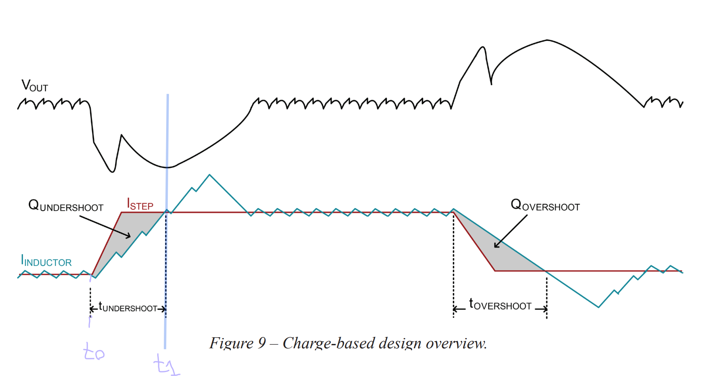

Ani bir yuk akimi degisimi sirasinda `Vout`'un minimum noktasi ve `t1` ani.


ODT'den aktarilan metin (`Slew Rate Hesabı`):

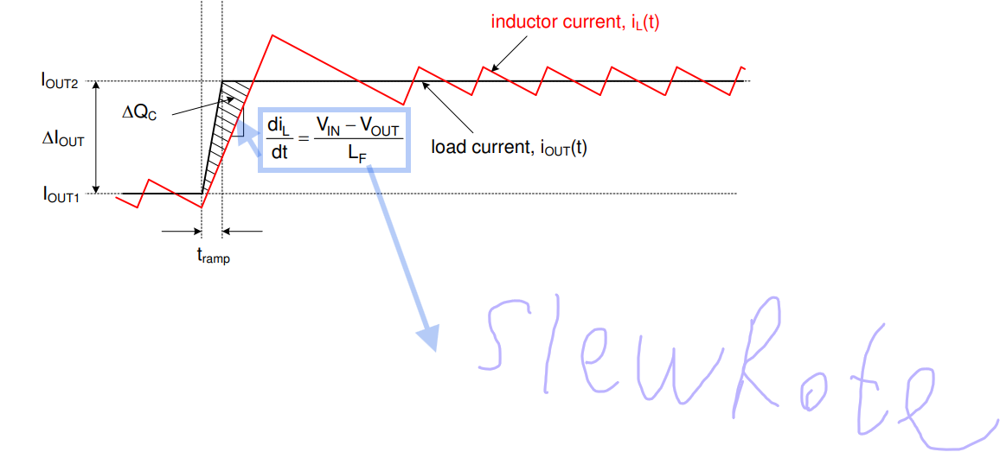

> Bir voltage regulator’ü, ani yük değişimlerinde (Load transient) hemen cevap veremez. Çünkü çıkıi bobini, akımın oranını (Current Slew Rate) sınırlayan bir parametredir. Bobinlerin akımı ani olarak çok hızlı değişemez. **?
> Bir yükte ani değişiklik olduğunda, ilk anda gereken ekstra akımı, regulator sağlayamaz. Bu nedenle ihtiyaç duyulan fazladan akım, Çıkış sığaçlarından sağlanmak zorundadır.

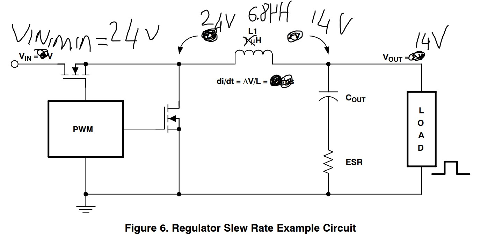

Ani bir yük akımı değişimi sırasında `Vout`…

> Feedback Control loop çıkış gerilimindeki değişimi algılar, ve mosfet duty cylcle’ını ayarlamaya başlar. Ancak duty cycle %100’e çıksa bile (Kullandığımız IC’nin donanımsal sınırından ötürü mümkün değil, Denklem Hata: Başvuru kaynağı bulunamadı.7’ten ) akımın artış hızı, Istep akımının artış hızından daha yavaştır.
>
> Istep akımı tramp süresinde artarken,
> Bobinin akımı t_undershoot süresinde artar. Düzelt a.q***
> Bobinin Tanım denkleminden yararlanarak:
>
> yerine gerilimini kullanma sebebim, Slew Rate’ı daha düşük yapar-eğimi azaltır, süresini uzatır. [1] ( Hata: Başvuru kaynağı bulunamadı.8 )
>
> Bobin akımının, akımı kadar artması bulduk.
>
> Ancak power-stage? kayıplarını (Mosfetlerin Rds(on) direnci, bobinin dcr direnci, layout direncini) göz önünde bulundurmadık. Bu kayıpları da dikkate alırsak:
>
> ( Hata: Başvuru kaynağı bulunamadı.9 )
>
> Gerçek devrede Çıkış akımının akımı kadar artış süresine diye isimlendirdik.
> süresini de gerçekçi bir değer olarak belirlemek için Evm’deki başarım eğrilerinden aldım. ??Fig.14’ten olarak belirlenmiş.
>
> olması, Bobinin akımının, yük artışını yeterince hızlı karşılayamadığını gösterir. Kalan yükleri Capacitorler karşılayacak,
>
> Evm’de sadece MLCC capacitor kullanıp, hiç bulk capacitor kullanmamalarını bu hesaptan sonra anladım.
> İlerleyen süreçte, çıkışta bulk capacitor kullanmayı gerektirecek şekilde design requirement’ı sıkılaştırabilirim.

Bu bolume ait ek kaynak-fotolar:


Benim buradaki okuma:

ODT kopyasinda bu bolumde bazi semboller ve denklemler eksik gorunuyor; kaynak metni bu yuzden aynen duruyor. Benim buradan cikardigim ana iliskiler sunlar:

- bobin akiminin yukselme hizi birinci yaklasimda
  $$
  \frac{dI_L}{dt} \approx \frac{V_L}{L}
  $$
  ile sinirlanir

Yani bobin akiminin artis hizi, bobin uzerindeki anlik gerilim ve enduktans tarafindan sinirlanir. Bu nedenle feedback dongusu duty oranini arttirsa bile akim sonsuz hizla yukselemez.

Yukteki ani artis ile bobin akimi arasindaki fark ilk anda cikis kapasitörleri tarafindan karsilanir:

$$
I_C = I_{load} - I_L
$$
Bu da cikis geriliminin gecici davranisini belirler:

$$
C_{out}\frac{dV_{out}}{dt} = -I_C
$$
$t_1$ ani ve not ettigim $t_{undershoot}$ sonu, matematiksel olarak su kosulla iliskilendirilebilir:

$$
\frac{dV_{out}}{dt} = 0
$$
Bu anda bobin akimi, en azindan o anlik durumda, yuk talebini karsilayabilecek seviyeye yaklasmistir. ODT'deki EVM yorumu da bu yuzden onemli: eger MLCC bankasi bu gecis suresinde yeterli enerjiyi saglayabiliyorsa, cikis bulk kapasitörü her durumda zorunlu olmayabilir.

Ilk foto, bobin uzerindeki `di/dt = \Delta V / L` sezgisini ve yuk adimi aninda hangi gerilimlerin bobin egimini belirledigini not etmek icin burada duruyor. Ikinci foto ise bu projeye ait nihai veri tablosu degil; modern yuklerin neden sert `load step` ve `load slew-rate` gereksinimleri dogurabildigini gosteren arka-plan referansi.


Defterden aktarilan not (`W.98`):

Burada yukaridaki `Slew Rate Hesabı` bolumunun defterdeki daha duz, egitsel bir ornegi var. Ust kisimda su ana fikirler yazili:


- bir regulator, ani yuk degisimlerinde hemen cevap veremez
- bunun nedeni, cikis bobininin akim artis hizini (`current slew rate`) sinirlamasidir
- ilk anda gereken ekstra akim regulator tarafindan degil, cikis kapasitörlerinden saglanir
- feedback dongusu cikis gerilimindeki dususu algilar ve duty cycle'i arttirmaya baslar; ancak bobin akimi yine de sonlu hizla artis gosterebilir

Sayfanin saginda bobinin temel iliskisi tekrar yazilmis:

$$
\frac{d i_L}{dt} = \frac{V_L}{L}
$$
Alt kisimda kavramsal bir ornek var:

- $V_{in} = 5\,\text{V}$
- $V_{out} = 2\,\text{V}$
- $L = 1\,\mu\text{H}$
- $R_{ESR} = 10\,m\Omega$
- $\Delta I = 6\,\text{A}$ ani yuk adimi
- $t_{loop} = 2\,\mu\text{s}$

Sayfadaki metne gore:

- regulator bu olayi ancak yaklasik `2 us` sonra fark edip tepki vermeye basliyor
- o andan sonra bile bobin akiminin artis hizi, bobin uzerindeki gerilim ve `L` ile sinirli

Sayfada yazilan ornek slew-rate hesabi:

$$
\frac{d i_L}{dt} = \frac{\Delta I_L}{dt} = \frac{V_L}{L} = \frac{5-2}{1\,\mu\text{H}} = 3\,\text{A}/\mu\text{s}
$$
`W.98` burada proje-ozel `24-36 V / 14 V` sayilarini veren bir nihai hesap sayfasi degil; elde kurulmus egitsel bir ornek. Ama anlattigi fizik cok net: load transient sirasinda dongu tepki verse bile bobin akimi ancak sonlu bir `A/us` egimiyle yukselebilir, ilk anda gereken fark akim da cikis kapasitörlerinden gelir. O yuzden `5.4.6` altinda yerinde duruyor.


#### 5.4.7 Acik teknik dogrulamalar

Bu bolum burada tamamen kapanmis gibi davranmiyorum. Cikis kapasitörü tarafinda ana omurga var; ama son dogrulamada tekrar bakilacak noktalar da var:

Bu kapanis listesini final BOM onayi gibi degil, sonraki `LTspice` / BOM / derating kontrolune tasinan is listesi gibi okuyorum. Yani guncel omurga simdilik calisma noktasi; eski/ara izler bu noktaya nasil geldigimi gosteriyor; acik maddeler ise simulasyon ve parca teyidiyle kapanacak.

- `[Güncel Omurga]`: cikista agirlik MLCC bankinda, derated toplam `Cout` yaklasik `70 uF`
- `[Eski İterasyon]` / `[Tasarım İzi]`: `2 x 22 uF`, `10-14 uF` alt-sinir hesaplari, `W.28-W.59` arasindaki farkli denemeler
- `[Açık Kontrol]`: etkin kapasitans, `dc-bias`, `ESR`, `ESL`, MLCC sayisi ve de-rating hesabi
- `[Tasarım İzi]`: cikis sapmasi ile kapali-cevrim `Zout` arasindaki bag, bulk eklenirse power-stage sifirlarinin ve kompanzasyonun nasil degisecegi
- kapanis sirasi: once BOM/derating ile `70 uF` ve `ESR_{Ceq}` ayni satira oturacak; sonra LTspice'ta steady-state ripple, `3.571 A -> 9 A` load-step ve gerekirse bulk eklenirse kompanzasyon tekrar bakilacak
- acik karar: G71 benzeri hizli-yuk yaklasimlari bu tasarima ne kadar gerekli, cikista bulk kapasitör gercekten gerekecek mi?

Bu notla cikis kapasitörü bolumunu kapatip giris kapasitörlerine geciyorum. Giristeki mantik biraz farkli: cikis bulk karari dogrudan kontrol dongusunu etkilerken, giris kapasitörleri daha cok kaynak ripple'i, EMI, sicak dongu ve transient dayanimi tarafindan belirleniyor.


### 5.5 Giris kapasiteleri

Buradan itibaren konu, buck katinin giristen cektigi darbeli akimi nasil karsilayacagim. Cikis tarafinda bulk eklemek kontrol tasarimini karistirabildigi icin daha temkinliydim; giriste ise MLCC + bulk kombinasyonu daha dogal bir tasarim karari gibi duruyor.


[Güncel Omurga - `Cin` owner özeti] Bu bölüm giriş kapasitelerinin primary owner'ıdır. `Cin` hesabı, giriş MLCC bankı, bulk, RMS, ESR/ESL, damping sezgisi ve helper MLCC'ler burada tek yerde tutulur; EMI / input-filter bölümleri bu sayıları yeniden komponent owner'ı gibi sahiplenmeyecek.

| Konu | Bu owner'daki karar / iz |
| --- | --- |
| Neden `Cin` gerekli | Buck giriş akımı darbeli çekilir; kaynak bu ani akımı tek başına sağlayamaz, hot-loop akımı ve `Vin` ripple'ı giriş kapasiteleriyle kapanır |
| MLCC `Cin` hesabı | `0.24 Vpp` hedefi için ilk minimum etkin `Cin` izleri `28.4 uF / 31.1 uF`; `W.82` toplam ağ kontrolünde `0.2006 V < 0.24 V` |
| DC-bias / derating / tolerance | `5 x 4.7 uF / 50 V / X7R` ana MLCC grubu katalogda `23.5 uF`, bias altında yaklaşık `8.2 uF`; `1 - 0.20` tolerans/derating faktörü W.82 kontrolünde kullanılmış |
| RMS akımı | Ana çizgi `4.5-4.6 A_RMS`; korunmacı alternatif `4.94 A_RMS`; `5` paralel MLCC varsayımında kabaca `0.91-0.99 A_RMS` / parça |
| Sıcaklık artışı | MLCC başına düşen RMS akım datasheet `temperature-rise` grafiğiyle okunur; EVM `48 V / 8 A -> 73.9 degC`, `24 V / 8 A -> 64.8 degC` izlerinden `~70 degC` board tahmini açık kontrol olarak korunur |
| ESR / ESL | Büyük MLCC'ler düşük `ESR`, küçük paketler düşük `ESL` tarafında güçlü; paralelleme hem `ESR` hem `ESL`'yi düşürür ama akım paylaşımı layout'a bağlı kalır |
| Helper MLCC'ler | `10 nF`, `0.1 uF`, `1 uF` gibi küçük / düşük `ESL` destekler enerji deposu değil; spike, ringing, phase-node davranışı ve EMI için hot-loop'a yakın bypass elemanlarıdır |
| Bulk mantığı | Ana aday izi `2 x 47 uF / 50 V / X7R`; `36 V` bias altında yaklaşık `34 uF` etkin kapasite, tek parça `ESR ≈ 4 mOhm`, paralelde `≈2 mOhm`; `68 uF / 50 V / 20 mOhm` ve `100 uF polymer` eski/alternatif izlerdir |
| Transient enerji tamponu | MLCC bankının bias sonrası `~8.2 uF` kalması `~20 uF` açık doğuruyor; bulk tarafında `C_B > 27.93 uF`, `ESR_B < 0.1023 ohm`, `T_rips ≈ 7.14 us` izleri transient enerji penceresini kuruyor |
| Damping sezgisi | Giriş bulk'u çıkış bulk'u gibi kontrol plant'ini doğrudan değiştiren karar değildir; burada kaynak ripple'ı, hot-loop, input transient, EMI filtresi ve rezonans damping'iyle birlikte okunur |

[Açık Kontrol] EMI hesabında hangi `C_in` etkin sayılacak sorusu bu owner'dan gider: yalnız ana MLCC etkin kapasitesi (`~8.2 uF`) ile W.82'de `8.228 uF + 34 uF` olarak not edilen MLCC+bulk ağı aynı frekansta aynı işi yapmaz. Bulk düşük frekans / transientte güçlüdür; yüksek frekans EMI ve hot-loop tarafında helper MLCC ve yerleşim daha belirleyici olabilir.


#### 5.5.1 Giris sigaçlari


ODT'den aktarilan metin (`7. giriş sıgaçları`):

> Çıkış kapasitörlerinde, mevcut MLCC'lere ek olarak bulk kapasitör kullanmaktan kaçındım; çünkü bulk kapasitörler çıkış empedansını değiştirerek kontrolcü tasarımını doğrudan etkiler ve kompanzasyonun yeniden ele alınmasını gerektirebilir. Ancak yaptığım hesaplamalarda mevcut MLCC’lerin, tanımlı gerilim ripple ve transient kriterlerini karşılaması yeterli olduğundan, ilave bulk kapasiteye ihtiyaç duyulmadı. Öte yandan, giriş kapasitörleri kontrolcü tasarımını doğrudan etkilemediği için (giriş empedansı, kontrol döngüsünden bağımsızdır), EMI ve termal sınırlar gözetilerek bulk kapasitör kullanımına yer verdim. Bu sayede orijinal spesifikasyonlarda yer almayan zorlu koşullara (örneğin ani giriş transiyentleri) karşı sistem dayanımı artırıldı.***


Benim buradaki okuma:

Burada cikis ve giris kapasiteleri arasindaki tasarim felsefesi farkini ayiriyorum. Cikista bulk kapasitör karari kontrol ve kompanzasyon tarafini etkiliyor. Giriste bulk kullanimi ise daha cok `EMI`, termal dayanim, kaynak ripple'i ve transient dayanimi acisindan degerlendiriliyor.

Buradaki ayrimi mutlak bir "giris tarafinin kontrolle hic ilgisi yok" seklinde okumuyorum. Giris agi da kaynak empedansi, EMI filtresi, Middlebrook kosulu ve layout parazitleri uzerinden sisteme dokunabilir. Fark su: cikis kapasitörleri dogrudan LC kutuplari, ESR sifiri ve `Vout` kontrol dongusu icinde duruyor; giris kapasitörleri ise once hot-loop akimi, RMS/termal, EMI ve input transient ihtiyacina cevap veriyor. Bu etkilesim daha sonra `7.4 Giris filtresi kararliligi` ve LTspice input-filter kontrollerinde kapanacak.


#### 5.5.2 Yeni eklenen giris gereksinimleri


ODT'den aktarilan metin (`Eklenen yeni teknik şartlar`):

> Allowed input peak-to-peak ripple voltage: ΔVIN_PP ≤ 0.24V
> Allowed input transient undershoot or overshoot: ΔVIN_Tran ≤ 0.36V


Benim buradaki okuma:

Bu iki teknik sart, giris kapasiteleri icin yalnizca ortalama enerji depolama degil, anlik gerilim kalitesi siniri da koyuyor. Bu README'de bu iki siniri su sekilde okuyorum:

- $\Delta V_{IN,PP} \le 0.24\,\text{V}$
- $\Delta V_{IN,Tran} \le 0.36\,\text{V}$

Bu iki siniri ayni hesap kalemi gibi kullanmiyorum:

- `0.24 Vpp` hedefi daha cok steady-state / switching ripple tarafina bakiyor; MLCC banki, `ESR`, hot-loop yerlesimi ve input filter attenuation burada one cikiyor
- `0.36 V` transient hedefi ise daha yavas enerji rezervi, bulk kapasitör, kaynak empedansi ve ani yuk/giris kosullariyla birlikte okunuyor
- `50 mA` ideal-source giris akim ripple hedefi de yalnizca kapasitör secimiyle kapanacak bir madde degil; EMI / input filter hattina bagli bir kalite hedefi gibi duruyor


Defterden aktarilan not (`W.26`, `W.140`):

[Kaynak İzi] `W.26` ve `W.140` görselleri ile tam `Vin/Vout/Pout/Iout`, load-step, ideal duty, verim-dahil duty ve `D = 0.5` anlatımı `3.1`e taşındı. Bu bölümde bu iki sayfa yalnız `Cin` hesabının hangi shared girdilere dayandığını gösteren kaynak izi olarak okunacak.

[Güncel Omurga] Giriş kapasitörü hesabı burada `3.1`den gelen `24-36 V`, `14 V`, `50-125 W`, `3.571-8.929 A`, `5.429 A` load-step, `332 kHz`, `\eta \approx 0.9`, `0.24 Vpp`, `0.36 V`, `50 mApp`, ideal `0.389 / 0.583`, korumacı `0.432 / 0.648` ve `D = 0.5` kontrol noktalarını referans alır; bu değerleri yeniden türetmez.

Defterden aktarilan not (`W.53`):

Burada ikinci proje icin eklenen specification'lar bir kez daha toplanip, bunlardan hareketle en kotu / en iyi durumda giris akimi hizli sekilde hesaplanmis.


Sayfada not edilen sartlar sunlar:

- `Allowed output voltage ripple p-p, any load = 100 mV`
- `Allowed input ripple current p-p, ideal source = 50 mA`
- $\Delta V_{IN,PP} \le 0.24\,\text{V}$
- $\Delta V_{IN,Tran} \le 0.36\,\text{V}$

Sayfada ayrica su tasarim notu dusulmus:

- `50 mA` seviyesindeki ideal-kaynak giris akim ripple hedefinin, EMI / input filter eklenmesiyle karsilanmasi dusunuluyor

Defterde daha sonra, verimi yaklasik $\eta = 0.9$ kabul ederek giris akimi sinirlari hizlica hesaplanmis:

En kotu durum:

$$
I_{IN,\max} = \frac{125\,\text{W}}{0.9 \cdot 24\,\text{V}} \approx 5.79\,\text{A}
$$
En iyi durum:

$$
I_{IN,\min} = \frac{125\,\text{W}}{0.9 \cdot 36\,\text{V}} \approx 3.86\,\text{A}
$$
`W.53`, `W.26` ile ayni ozet-parametre hattina ait. Buradaki `I_{IN}` degerleri, giris kapasitörü ve input filter hesabinda kullanilacak sinirlari veriyor. `50 mA` giris ripple hedefi icin dusulen "EMI / input filter eklenmesiyle karsilanir" notu da onemli: bu requirement'i yalnizca kapasitör secimiyle kapatmaya calismiyorum, daha genis bir giris filter tasarimina bagliyorum.


#### 5.5.3 Secilen genel strateji

Giris tarafinda strateji daha basit gorunuyor ama yine de tek parca degil: MLCC yuksek frekans / sicak dongu tarafinda, bulk ise daha yavas enerji ve transient tarafinda anlamli.


ODT'den aktarilan metin:

> Yüksek frekans ripple’ını bastırmak için MLCC kullanacağım, ancak yüksek dc bias gerilimi altında capacitance’ları düşüyor.
> Elektrolitik kapasitörler, düşük maliyetli ve büyük enerji depolama kapasitesine sahiptir ama yüksek ESR nedeniyle ripple bastırmakta zayıftır.
> Bu yüzden, MLCC+Elektrolitik capacitor’u beraber kullanacağım…****


Benim buradaki okuma:

Burada ana karar su: giriste tek tip kapasitörle her seyi cozmeye calismiyorum. Farkli kapasitör teknolojilerinin guclu oldugu frekans araliklarini birlikte kullanmaya calisiyorum.

- MLCC tarafı: yuksek frekans ripple ve dusuk `ESR/ESL`
- elektrolitik tarafı: daha buyuk enerji tamponu ve daha dusuk maliyetli bulk kapasite

Ama MLCC seciminde katalog `uF` degeri tek basina yetmiyor. `dc-bias` altindaki etkin kapasitans dususu giris tarafinda da hesabı dogrudan degistiriyor.

Burada `elektrolitik` kelimesini tek ve kesin parca teknolojisi gibi degil, daha cok "bulk gorevi" gibi okuyorum. Sonraki defter izlerinde bu bulk rolu bazen `2 x 47 uF / 50 V / X7R` buyuk MLCC adayi, bazen de `100 uF` polymer / elektrolitik alternatifi olarak karsima cikiyor. Yani bu basligin ana karari su: giriste yuksek frekans isini MLCC banki tasiyacak, eksik etkin kapasite / transient enerji tarafi ise ayrica bulk adayi ile kapatilacak.


#### 5.5.4 MLCC `Cin` hesabi

Bu alt bolumde once "giris kapasitörü neden var?" sorusunun fiziksel cevabi geliyor, sonra minimum etkin `Cin` ve `ESR/RMS` tarafindaki hesaplara geciliyor. Yani W.47-W.94 daha cok mantik ve kaynak izi; W.27-W.35 ise sayisal `Cin` denemeleri.

Bu alt bolumde okuma sirasini su sekilde tutuyorum:

- once `W.47-W.52` ile giris akiminin neden darbeli oldugunu ve `CIN`'in hangi akimi tasidigini hatirliyorum
- sonra `W.94` ve `W.27-W.35` ile `0.24 Vpp` hedefinden minimum etkin `Cin` alt sinirini cikariyorum
- sonra `W.51` ve devaminda katalog `uF` yerine `dc-bias`, gerilim sinifi, tolerans, `ESR` ve `RMS` akimla gercek parca secimine geciyorum
- eksik kalan etkin kapasite / transient enerji kismi ise bu basligin sonunda degil, `5.5.7` bulk mantiginda tamamlanacak


ODT'den aktarilan metin (`7.1. MLCC Sığaç Hesabı / 7.1.1. MLCC Cin Hesabı?`):

> PKfsfsfsd
> Girişteki ripple gerilimini ΔVIN_PP ≤ 0.24V ‘un altında tutabilecek, capacitor capacitance’nin en düşük değerini buluyoruz. [2] [3]
> En yüksek a [3] ve [2] kaynaklarındaki örneklerde … D’nin … en kötü durum D = 0.5 iken ..
> Bu değer etkin capacitance değeridir.
> Dc Bias’a bak.
> Voltage rating’e bak.
> Tolerance’ı dikkate al yüzde kaçsa düş. Acaba kemet nasıl hesaplıyor?
>
> Voltage rating’e de dikkat. Emv’de 100V’luk voltage rating’i olan capacitor’ler kullanılmış. Geniş bir giriş gerilim aralığında çalışacak(5.5-100V?) şekilde tasarlandığı için olmalı…?


Benim buradaki okuma:

Buradaki esas mantik basit: once gerekli minimum etkin `Cin` bulunacak, sonra `dc-bias`, tolerans ve gerilim sinifi etkileri eklenerek gercek secilecek parca degerine gidilecek. ODT notunda gecen $D = 0.5$ varsayimi ilk yaklasim olarak kullaniliyor; asil hedef katalog `uF` degerini degil, etkin $C_{in}$ gereksinimini bulmak.

Defterden aktarilan not (`W.47`):

Burada giris kapasitörü hesabinda kullanilan temel fiziksel mantik cizim ve kisa notlarla anlatiliyor.


Sayfada gorulen ana fikirler sunlar:

- buck converter giristen darbeli akim ceker
- kaynak bu darbeli akimi tek basina ve anlik olarak saglayamaz
- bu nedenle giris kapasitörleri, kaynak ile buck kati arasindaki ani akim farkini ustlenir
- bunun sonucu olarak da giriste belirli bir `\Delta V_{IN,p-p}` ripple'i olusur

Sayfada bu dusunceye bagli olarak kullanilan temel iliski su sekilde yaziliyor:

$$
\Delta V_{ripple} \approx \frac{I_{out}\,D(1-D)}{f_{sw}\,C_{IN}}
$$
Bu denklemi ilk etkin `CIN` alt siniri gibi kullaniyorum. Yani burada asil bakis kapasitif ripple tarafinda; `ESR/ESL`, kaynak / `LISN` empedansi, hot-loop yerlesim parazitleri ve input filter etkisi bu tek satirla kapanmis sayilmiyor. Bu yuzden `W.35`te `ESR` ekleniyor, `W.51`te gercek parca / `dc-bias` kontrolu geliyor, `W.48` ve `7.4` tarafinda da EMI / kaynak empedansi baglami geri donuyor.

Alt notlarda ayrica su fikirler de goruluyor:

- guc kaynagi "mukemmel" olsa bile cikis empedansi sifir degildir
- buck katinin ani akim ihtiyaci ile kaynagin verebildigi akim arasindaki fark ilk anda giris kapasitörlerince kapanir
- secilecek `C_{IN}` degeri yalnizca formulle degil, MLCC'lerdeki `dc-bias` dususu ile birlikte dusunulmelidir

`W.47`, `W.27` ve `W.35` tarafindaki giris ripple denklemlerinin fiziksel gerekcesi gibi duruyor. Yeni bir sayisal sonuc vermiyor; ama "neden giris kapasitörü hesabi yapiyorum?" sorusunu benim defter dilimle acikliyor.

Defterden aktarilan not (`W.48`):

Burada giris kapasitörü / bulk / MLCC tarafinda nasil test dusunuldugu ve hangi sorularin akilda tutuldugu goruluyor.


Sayfanin ust tarafinda not edilen test / kontrol sorulari sunlar:

- bulk kapasitör kullaniminda ripple nasil degisiyor
- bulk kapasitör fazlaysa ne oluyor
- MLCC olursa etkisi ne kadar oluyor

Sayfada ayrica `LISN` notu da geciyor:

- `LISN = Line Impedance Stabilization Network`
- yani guc kaynagi tarafi yalnizca ideal kaynak gibi degil, belirli bir hat empedansi ve EMI olcum baglami ile de dusunuluyor

Alt taraftaki notlarda seramik kapasitörlerin iki temel gorevi ozellikle vurgulaniyor:

- yuksek frekansli gurultuyu bastirmak
- anahtarlama kaynakli gerilim dalgalanmasini / input voltage ripple'i azaltmak

Son kisimdaki ana fikir ise su sekilde okunuyor:

- buck converter giris tarafinda akim surekli degil, darbeli cekilir
- MOSFET `ON` iken giristen yuksek akim cekilebilir
- MOSFET `OFF` iken bu akim sifira yaklasabilir
- bu nedenle kaynak tarafindan bakildiginda giris akimi `pulsating current` karakterindedir

`W.48`, `W.47` ile ayni kavramsal hatta duruyor. Yeni bir son formül vermiyor; ama giris kapasitörü hesabini test ve EMI baglamindan ayirmadigimi gosteriyor.

Defterden aktarilan not (`W.52`):

Burada buck donusturucudeki akim donguleri sematik uzerinde isaretlenmis; giris ve cikis kapasitörlerinin hangi anda hangi akimi tasidigi gosteriliyor.


Sayfada etiketlenen akimlar sunlar:

- `I_DD`: kaynaktan / beslemeden cekilen akim
- `I_{CIN}`: giris kapasitörü ripple akimi
- `I_L`: bobin akimi
- `I_{CO}`: cikis kapasitörü ripple akimi
- `I_O`: yuk akimi

Cizimde iki ayri akim yolu ozellikle ayrilmis:

- `Q1 ON` iken akim yolu
- `Q1 OFF` iken akim yolu

Buradaki ana fikir su sekilde okunabilir:

- bobin akimi sureklilige egilimlidir
- giris tarafindaki akim ise anahtarlama durumuna gore darbeli karakter gosterir
- bu fark yuzunden `CIN`, kaynagin anlik saglayamadigi akim bilesenini tasir
- benzer sekilde `COUT` da yuk tarafinda ripple akimini ustlenir

`W.52`, `W.47-W.48` tarafindaki "giris akimi darbeli" dusuncesini sematik uzerinde daha somut hale getiriyor. Yeni bir son sayisal sonuc vermiyor; ama `CIN` ve `COUT` akim rollerini ayni cizimde ayirmam bu bolum icin gerekli bir iz.

Bu sayfa ayni zamanda layout tarafina da baglaniyor. `Q1 ON` / `Q1 OFF` akim yollarini ayirmak, giris MLCC bankinin yarim kopruye neden cok yakin konmasi gerektigini acikliyor: hizli `I_{CIN}` dongusu buyurse `ESL`, ringing, EMI ve `VIN` ripple hesabi birlikte bozulur. Bu fiziksel yorum daha sonra `5.5.6` kucuk yardimci MLCC'ler ve `7.1` hot-loop bolumunde tekrar karsima cikacak.

Defterden aktarilan not (`W.49`):

Buradaki not, ders videosunda hocanin anlattigi ornekten alinmis; bu projenin kendi buck converter tasarimina ait nihai hesap sayfasi degil.


Sayfanin proje baglamindaki degeri, dogrudan sayisal veri vermesinden cok, giris kapasitörü akim dalga biciminin ideal kare / ucgen karmasi bir gorunumde olmadigini ve anahtarlama kenarlari ile gecis surelerinin de bu akimi etkiledigini hatirlatmasidir.

Sayfada gorulen ana fikirler sunlar:

- giris kapasitörü akimi, anahtarlama dongusunde darbeli karakterdedir
- `t_rise`, `t_on`, `t_fall`, `t_off` gibi alt zaman bolgeleri ayrica dusunulmustur
- anahtarlama kenarlari cok hizli oldugu icin, bu bolgelerdeki akim degisimi de cok hizli olabilir
- bu nedenle giris kapasitörü seciminde yalnizca dusuk frekansli ripple degil, hizli kenar davranisi da onemlidir

Sayfada ornek olarak su notlar okunuyor:

- $f_{sw} \approx 200\,\text{kHz}$
- $T_{sw} \approx 5\,\mu\text{s}$
- `t_rise` ve `t_fall` mertebesi `30 ns` civari

Buradaki not benim kendi tasarimimdan degil; ders videosundaki hocanin orneginden alinmis kavramsal bir not. `200 kHz` notu, ikinci projede kullandigim `332 kHz` nihai degerle uyusmuyor; dolayisiyla proje verisiyle karistirilmamali. Burada sakladigim fikir su: giris kapasitörü akimini sadece ortalama / RMS bakisiyla degil, hizli anahtarlama kenarlariyla birlikte dusunmek gerekiyor.

Bu yuzden `W.49`u sayisal `Cin` hesabinin girdisi gibi degil, `ESL`, spike, ringing ve yardimci MLCC ihtiyacina acilan uyari gibi okuyorum. RMS / termal sonuc yine `5.5.5`teki daha uygun formullerle, hizli kenar ve layout tarafi ise `5.5.6` ve `7.1` ile kapanacak.

Defterden aktarilan not (`W.50`):

Bu kisim da, ust basligindan anlasildigi kadariyla bir ders / video anlatimindan alinmis not; bu projenin kendi nihai hesap sayfasi degil.


Sayfada giris kapasitörü secimine dair su genel tasarim fikirleri ozetleniyor:

- kapasitörler iki ana rolde dusunulur:
  - enerji depolama
  - yuksek frekans bastirma / bypass
- ani yuk degisimlerinde (`load transient`) giris kaynagi tek basina yeterince hizli cevap veremeyebilir
- bu durumda bulk kapasitör, daha yavas ama daha buyuk enerji tamponu gibi davranir
- MLCC ise yuksek frekansli ripple ve EMI bastirma tarafinda daha etkilidir

Sayfada ayrica su dusunce izi korunmaya deger gorunuyor:

- eger input kapasitörü cok az olursa
- giris empedansi artar
- `input voltage` daha fazla dalgalanabilir / dusus gosterebilir
- agir durumda `brown-out` benzeri davranislar gorulebilir

`W.50`, `W.49` ile ayni baglamda, ders anlatimindan gelen kavramsal bir not. Dogrudan ikinci projenin nihai hesap sonucu degil; ama bulk ve MLCC rollerini ayirmama yardim ediyor.

Bu notun burada kalma nedeni su: `5.5.4` icinde asil hesap MLCC / etkin `Cin` tarafinda ilerliyor; fakat daha bu noktada "tek tip kapasitör yetmeyebilir" fikrini kaybetmek istemiyorum. MLCC banki yuksek frekans ripple ve hot-loop tarafini tasirken, `brown-out`, yavas `Vin` dususu ve transient enerji rezervi gibi basliklar `5.5.7` bulk secimi tarafina tasinacak.

Defterden aktarilan not (`W.94`):

Burada Texas Instruments'in `Input and Output Capacitor Selection` uygulama notunun giris kapasitörü secimi bolumune ait dogrudan kaynak-not var. Sayfanin ust kismina dusulen notlar, giris kapasitörü seciminde iki ana eksenin izlendigini gosteriyor:


1. `input ripple voltage`'u azaltmak
2. `input current / pulse current` kapasitesini dogru secmek

Sayfanin metninden ve senin yan notlarindan korunan ana fikirler sunlar:

- giris dalgalanma gerilimi (`ripple voltage`), esas olarak seramik kapasitörlerle dusurulur
- bulk kapasitörler tek basina yuksek frekansli ripple gerilimini etkin sekilde bastiramaz
- buna karsilik bulk kapasitörler, ripple current tasima ve transient destek tarafinda deger kazanir
- `Figure 1`'de `input pulse current vs duty cycle` iliskisi verilir; yani giris kapasitörü akim boyutlandirmasi duty'ye baglidir

Senin sayfa uzerine aldigin notlardan, ozellikle su mesaj onemli:

- cikis ripple akimi ve giris pulse akimi buyuklukleri yuk / duty ile birlikte degisir
- duty `0.5` civari, giris pulse akimi acisindan kritik / worst-case bolgelerden biri olabilir
- bu nedenle `Cin` hesabi sadece `uF` secimi degil, ayni zamanda `RMS current` ve `pulse current` secimidir


Bu iki ekran goruntusu, `W.94`te kaynak-ustu-not olarak yazilan iki ana ekseni gorsel olarak da destekliyor:

- `Figure 1` uzerinden `input pulse current / RMS current` davranisinin duty'e bagli oldugu
- `\Delta V_{IN,PP}` hesabi tarafinda ise toplam etkin `C_{in}` ile `D(1-D)` teriminin ana rol oynadigi

`W.94`, `W.27-W.35` hesap ailesinin arkasindaki kaynak mantigini gosteriyor. Yeni bir proje-ozel sonuc vermiyor; ama neden bir yandan `\Delta V_{IN,PP}` hesabi, diger yandan `I_{Cin,RMS}` hesabi yaptigimi netlestiriyor.

Buradan sonra gelen `W.27-W.35` grubunu iki kulvarda okuyorum:

- gerilim ripple kulvari: `0.24 Vpp` sinirindan minimum etkin `Cin` alt siniri cikiyor
- akim / stres kulvari: `I_{Cin,RMS}`, pulse current, `ESR` ve daha sonra termal dayanim kontrol ediliyor

Bu yuzden `28.4 uF` ve `31.1 uF` degerlerini dogrudan katalog kapasitansi veya final BOM gibi okumuyorum. Bunlar once etkin kapasite ihtiyacini gosteriyor; gercek MLCC banki, `dc-bias`, tolerans ve bulk tamamlamasi sonraki sayfalarda devreye giriyor.

Defterden aktarilan not (`W.27`, `W.30`, `W.31`, `W.32`, `W.33`):

Bu grup tek bir temiz final satiri degil. Giris kapasitörü boyutlandirmasinda birden fazla yol denedigim kisim. Muhtemel kaynak baglamlari `G39`, `G44`, `G40` ve `G32` etrafinda toplanmis gorunuyor.


`W.27` tarafinda, ripple gerilimi hedefinden minimum etkin `Cin` icin su iliski kullaniliyor:

$$
C_{in} \ge \frac{D(1-D)\,I_{out}}{\Delta V_{IN,PP}\,f_{sw}}
$$
Defterdeki ilk yerlestirmede:

- $D = 0.5$
- $I_{out,\max} \approx 9\,\text{A}$
- $\Delta V_{IN,PP} = 0.24\,\text{V}$
- $f_{sw} = 332\,\text{kHz}$

alininca yaklasik:

$$
C_{in,\text{eff}} \gtrsim \frac{0.5(1-0.5)\cdot 9}{0.24 \cdot 332\,\text{kHz}} \approx 28.4\,\mu\text{F}
$$
`W.30-W.31` sayfalarinda ayni problem biraz daha gercekci okunuyor:

- bir yandan `I_{Cin,RMS}` hesabi yapiliyor
- diger yandan giris ripple gerilimi yalnizca kapasitif terim degil, `ESR` terimiyle birlikte dusunuluyor


Bu yaklasimin temiz yazimi su sekilde ozetlenebilir:

$$
\Delta V_{IN} \approx \frac{I_{out}\,D(1-D)}{f_{sw}\,C_{in}} \, + \, I_{out}\,R_{ESR}
$$
`W.32` sayfasi, daha sikı bir ornek olarak `\Delta V_{IN} = 50\,\text{mV}` gibi bir hedefle tekrar deneme yapiyor. Bu, mevcut ikinci proje spesifikasyonundaki `0.24 V` ile ayni sey degil; dolayisiyla final hedef degil, daha sert bir tasarim egzersizi / ara deneme.

Bu sayfayi yine de silmiyorum; cunku `Cin` hesabinin hedef ripple'a ne kadar hassas oldugunu gosteriyor. `50 mV` satiri bana "bu kadar az ripple istersem kapasitans ve/veya input filter tarafinda ciddi buyume olur" uyarisini veriyor. Gecerli tasarim hedefi hala `0.24 Vpp`; `W.32` ise margin/sensitivity izi olarak kaliyor.


`W.33` ise `Allowed input current ripple = 50 mA` maddesini, kaynagin gordugu `Z_{in}` ile iliskilendirerek yorumlamaya calisiyor. Burada benim icin onemli olan sey:

- giris kapasitörü hesabinin sadece `uF` secimi olmadigini
- kaynak tarafinin gordugu akim dalgalanmasi ile de bag kuruldugunu
- dolayisiyla daha sonra kurulacak input filter veya damping agi ile ayni konuya baglanacagini


`W.35` sayfasi, bu minimum `Cin` hesabini bir adim daha ileri goturup `ESR` terimini acikca denkleme katiyor. Defterdeki yazima gore:


$$
\Delta V_{IN} = \frac{I_{out}\,D(1-D)}{f_{sw}\,C_{in}} + I_{out}R_{ESR}
$$
ve `R_{ESR} = 3 mOhm`, `I_{out} = 9 A`, `D = 0.5`, `f_{sw} = 332 kHz`, `\Delta V_{IN} = 0.24 V` kabul edilince:

$$
C_{in} \gtrsim \frac{0.5(1-0.5)\cdot 9} {332\,\text{kHz}\cdot(0.24 - 0.003\cdot 9)} \approx 31.1\,\mu\text{F}
$$
Bu grup tek bir sonuca vurmuyor; ayni input-capacitor problemini farkli acilardan kuruyor. `W.27`deki `28.4 uF` ilk minimum etkin `Cin` adayi gibi duruyor. `W.30-W.31` ayni probleme `ESR` ve `RMS` tarafini ekliyor. `W.35` bunu sayisal olarak `31.1 uF` civarina tasiyor. `W.32` mevcut `0.24 V` hedefine gore daha sert bir egzersiz, `W.33`teki `50 mA` yorumu ise daha cok kaynagin gordugu kalite metriği. Yani bu sayfalari birbirini bozan hesaplar gibi degil, ayni soruya bakilan farkli pencereler gibi okuyorum.

Calculator teyidi:

`LM5146_quickstart_calculator_revB1.xlsm` dosyasinda giris kapasitörü tarafi icin daha erken / daha sade bir checkpoint gorunuyor:

- minimum ideal `C_{IN} \approx 28.172 uF`
- toplam derated `C_{IN} \approx 30 uF`
- `ESR \approx 1 mOhm`
- hesaplanan giris ripple'i `\approx 236.07 mV_{p-p}`
- `I_{Cin,RMS} \approx 4.495 A`

Bu checkpoint'i burada "ilk alt sinir dogru mertebede mi?" sorusunun cevabi gibi tutuyorum; gercek BOM karari gibi degil. Okuma sirasi benim icin soyle:

- `W.27/W.35`: gerekli etkin `Cin` mertebesi `28.4-31.1 uF` bandinda cikiyor
- calculator: ayni bandi hizli ve daha sade bir hesapla teyit ediyor
- `W.51` ve `W.78-W.82`: bu ihtiyacin gercek MLCC/bulk bankiyle, `dc-bias` ve tolerans altinda nasil karsilanacagini gosteriyor

Calculator burada defterdeki ilk `28.4 uF` cizgisine yakin duruyor. Ama bu erken bir checkpoint. Sonraki defter sayfalarinda MLCC `dc-bias` dususu ve ek bulk secimi daha ayrintili dusunuldugu icin, `8.228 uF + 34 uF` ve `0.2006 V` gibi daha rafine sonuc cizgileri bu checkpoint'in uzerine geliyor. Bu celiski degil; ideal/erken hesaptan gercek komponentli hesaba gecis.

[Çapraz Teyit] `WEBENCH` snapshot'inda giris ripple sonucu `Vin p-p = 2.951 V` olarak gorunuyor; bu, defterdeki `0.24 Vpp` hedefiyle uyumlu degil. Bunu giris kapasitörü owner'i altinda `[Açık Kontrol]` diye tutuyorum: input-filter modeli, kaynak empedansi ve olcum noktasi `Vin_src / Vin_post_filter / converter input` ayrimiyla tekrar kurulmadan bu sayi final fail/pass sonucu degil.

Defterden aktarilan not (`W.51`):

Burada minimum `Cin` hesabindan sonra gercek kapasitör seciminde kontrol edilmesi gereken ikinci adimlar toplaniyor.


Sayfada acikca not edilen kontrol basliklari sunlar:

- kapasitörun tasiyabilecegi maksimum `ripple current` / `RMS` akim degeri
- minimum `rated voltage` secimi
- MLCC / ceramic kapasitörlerde `dc-bias` altindaki kapasitans dususu

Sayfadaki ana fikirler su sekilde okunuyor:

- secilen kapasitörun `ripple current rating` degeri, devrede tasimasini bekledigimiz ripple akimdan buyuk olmali
- minimum gerilim dayanimı secilirken yalnizca nominal `Vin` degil, olasi giris asiri gerilim / surge notlari da dusunulmeli
- ceramic capacitor seciminde katalog `uF` degeri yeterli degildir; `dc-bias` altindaki gercek etkin kapasitans egirisinden kontrol gerekir

Bu notu uc kapili bir kontrol gibi okuyorum:

- akim kapisi: kapasitör banki toplam ve kapasitör-basina `RMS` akimi tasiyabiliyor mu?
- gerilim kapisi: `50 V` / daha yuksek gerilim sinifi normal `Vin`, surge ve derating icin yeterli mi?
- etkin kapasite kapisi: bias, tolerans ve sicakliktan sonra kalan `Cin` hala `28-31 uF` ihtiyacini karsiliyor mu?

Bu uc kapidan biri acik kalirsa parca secimi final sayilmaz. `W.77-W.82` tarafinda bu basliklar gercek adaylar uzerinden tekrar aciliyor; son okumada datasheet / vendor tool ekranlari ve LTspice sonucu ile birlikte kapatilmali.

Sayfa sonundaki grafik notlari da bunu destekliyor:

- bir grafik, izin verilen ripple / akim tasima davranisinin aranmasi gerektigini
- diger grafik ise `dc-bias` arttikca etkin kapasitansin dusmesini

hatirlatiyor.

`W.51`, `W.27-W.35` tarafindaki minimum `Cin` hesabini tek basina yeterli gormedigimi gosteriyor. Gercek parca secimi icin `current rating + voltage rating + dc-bias` kontrolleri de gerekiyor. Yeni bir nihai sayisal sonuc vermiyor; ama teorik kapasitans hesabindan BOM secimine gecen yolu aciyor.


#### 5.5.5 RMS akimi ve termal bakis

Burada `Cin` icin ikinci kontrol geliyor: yeterli `uF` tek basina bitirmiyor. Giris MLCC'leri bu ripple akimini tasiyabilecek mi, isinma ne olacak, bunu da ayri kontrol etmek gerekiyor.

Bu basliktaki sayilari tek bir final deger gibi degil, once bir aralik gibi okuyorum:

- `4.5 A_RMS`: `D = 0.5` icin hizli / kaba ilk okuma
- `4.544-4.566 A_RMS`: ayni hattin daha temiz tekrar teyitleri
- `4.94 A_RMS`: daha korunmaci kalan eski/ara hesap izi

Son karar bu toplam banka akiminin tek tek MLCC'lere nasil dagildigi, sicaklik artisi ve gercek layout empedanslariyla birlikte verilecek.

ODT'den aktarilan metin (`7.1.2. MLCC Sığaçlarının RMS Akımı?`):

> Girişteki ripple gerilimini karşılamanın yanı sıra?** seramik sığaçlar, ısıl dayanımı da olmalıdır.?** Azami giriş akımının rms’sini hesaplayacağız.
> Tam yükte..
> Full load: Sistemin maksimum çıkış gücüyle (örneğin 125 W) çalıştığı durumu ifade eder. Bu durumda: Çıkış akımı (Iₒ) en yüksek seviyededir (senin örneğinde 9A Dolayısıyla girişten çekilen toplam akım da en yüksek olur. Ripple akımı DC akım üzerine binen AC bileşen olduğundan, DC arttıkça RMS ripple bileşeni de artar.***

Kaba Hesap:

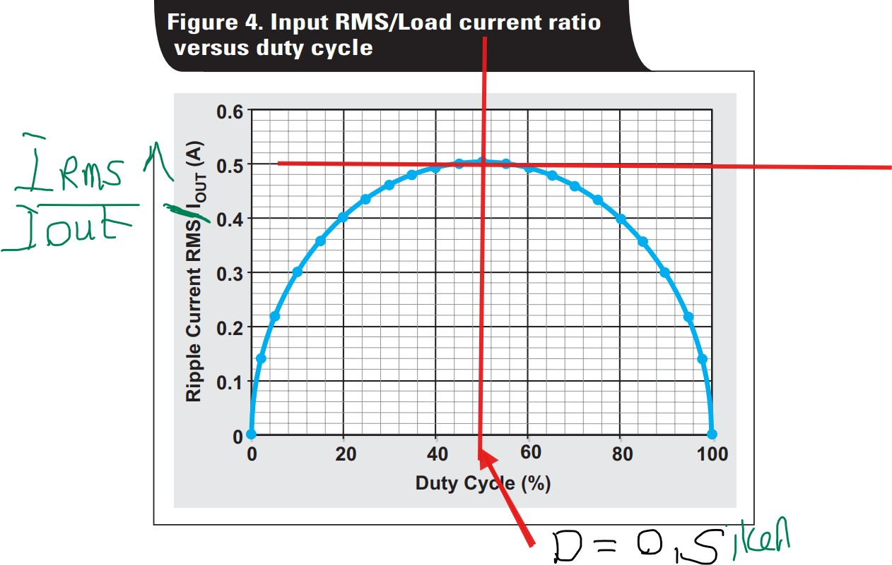

> Mavi eğri IIn_rms /Iload oranını verir.
> D =0.5 iken: IIn_rms /Iload =yaklaşık 0.5’tır mavi eğri, dikey eksen seviyesi.
> IIn_rms = Iload*0.5
> IIn_rms = 9A*0.5
> IIn_rms = 4.5A rms
>
> ODT'deki denklem notasyonu bozuk aktarilmis; temiz matematik yazimi asagida verilmistir.


Benim buradaki okuma:

Bu alt bolumde ana teknik fikir su: MLCC secimini yalnizca kapasitansla degil, RMS akim ve termal dayanim ile birlikte yapmak gerekiyor.

ODT notundaki kaba $D = 0.5$ yaklasimi ilk kontrol icin kullanilabilir. Mavi egri uzerinden $I_{in,RMS} \approx 0.5 I_{load}$ okununca `4.5 A_RMS` mertebesi cikiyor.

Kaba yaklasimin temiz yazimi:

$$
\frac{I_{in,RMS}}{I_{load}} \approx 0.5 \qquad (D = 0.5)
$$
$$
I_{in,RMS} = I_{load}\cdot 0.5 = 9\,\text{A}\cdot 0.5 = 4.5\,\text{A}_{RMS}
$$
Daha ayrintili ifade ise su sekilde tutulabilir:

$$
I_{in,RMS,\max} = I_{LOAD,\max} \sqrt{ D(1-D) + \frac{1}{12}\cdot \left(\frac{V_{OUT}}{L\,f_{sw}\,I_{\max}}\right)^2 \cdot (1-D)^2 \cdot D }
$$
ODT notasyonundaki sayisal yerlestirme korunursa:

$$
I_{in,RMS,\max} = 9\,\text{A}\, \sqrt{ 0.5(1-0.5) + \frac{1}{12}\cdot \left(\frac{14\,\text{V}}{6.8\,\mu\text{H}\cdot 332\,\text{kHz}\cdot 9\,\text{A}}\right)^2 \cdot (1-0.5)^2 \cdot 0.5 } \approx 4.55\,\text{A}_{RMS}
$$
Bu sonuc, giris MLCC bankasinin yalnizca ripple gerilimini degil, RMS akim tasima ve sicaklik artisi tarafini da karsilamasi gerektigini gosteriyor.


Defterden aktarilan not (`W.29`):

Burada, giris kapasitörü RMS akimi icin daha ayrintili bir sayisal deneme var:


- $D = 0.5$
- $I_{out,\max} = 9\,\text{A}$
- $\Delta I_L \approx 3.8\,\text{A}$

kabul edilerek:

$$
I_{Cin,RMS} \approx \sqrt{ D \left( I_{out}^2 (1-D) + \frac{\Delta I_L^2}{12} \right) } \approx 4.94\,\text{A}
$$
Bu sonuc, yukaridaki `4.55 A_RMS` hesabiyla birebir ayni degil. Farkin nedeni kullanilan form, `\Delta I_L` teriminin dahil edilmesi ve sayfadaki varsayimlar olabilir. Su asamada birini silmiyorum: `4.55 A_RMS` kaba ilk tahmin, `4.94 A_RMS` ise daha ayrintili / daha korunmaci tahmin gibi duruyor.

Defterden aktarilan not (`W.36`):

Burada ayni `I_{Cin,RMS}` hesabi daha temiz ve daha duz bir yerlestirmeyle tekrar ediliyor:


$$
I_{Cin,RMS} \approx \sqrt{ D\left( I_{out}^2(1-D) + \frac{\Delta I_L^2}{12} \right) }
$$
`D = 0.5`, `I_{out} = 9 A`, `\Delta I_L = 3.8 A` ile defterde:

$$
I_{Cin,RMS} \approx 4.566\,\text{A}_{RMS}
$$
`W.36` sonucu, mevcut `4.55 A_RMS` notuna cok yakin. O yuzden `W.36`, ilk kaba RMS tahmini destekleyen temiz bir teyit sayfasi gibi okunabilir. Buna karsilik `W.29` daha yuksek bir `4.94 A` sonucu veriyor; iki sayfa arasindaki fark ara adimlarda kullanilan form ya da yerlestirme farkindan geliyor olabilir.

Defterden aktarilan not (`W.90`):

Burada giris kapasitörü `RMS` akimi hesabi bir kez daha toparlaniyor ve hem ayrintili ifade hem de `D = 0.5` icin kullanilan hizli yaklasim ayni yerde korunuyor.


Sayfanin ust kismina yazilan ayrintili ifade, onceki sayfalardaki denklemin ayni ailesine ait gorunuyor:

$$
I_{in,RMS,\max} = I_0 \sqrt{ D(1-D) + \frac{1}{12} \left( \frac{V_0}{L\,f_{sw}\,I_0} \right)^2 (1-D)^2 D }
$$
Sayfadaki yerlestirmede:

- `I_0 = 9 A`
- `D = 0.5`
- `V_0 = 14 V`
- `L = 6.8 uH`
- `f_{sw} = 332 kHz`

kullanilarak yaklasik:

$$
I_{in,RMS,\max} \approx 4.544\,A_{RMS}
$$
sonucu yazilmis.

Sayfanin orta kismina ise, ayni sonucun daha hizli/ezber bir yaklasimla tekrar not edildigi goruluyor:

$$
\frac{I_{in,RMS}}{I_{load}} \approx 0.5 \qquad (D = 0.5)
$$
buradan:

$$
I_{in,RMS,\max} \approx 0.5 \times 9\,A = 4.5\,A
$$
Sayfanin en altindaki kisa not da, bu `RMS` sonucu ile fiziksel karar arasindaki baglantiya dikkat cekiyor:

- `ESL`'yi dusuk tutmak icin coklu paralel MLCC
- yuksek frekans bastirma icin kucuk paket / kucuk `ESL`

`W.90`, `W.36` ile neredeyse ayni sonucu (`4.544 A` vs `4.566 A`) veriyor. Bu yuzden `4.5-4.6 A_RMS` bandi ana cizgi gibi duruyor. `W.29`daki `4.94 A` ise korunmaci alternatif olarak kaliyor. Sondaki not da sayisal `RMS` hesabini fiziksel karara bagliyor: tek buyuk kapasitör yerine coklu paralel MLCC ve dusuk `ESL`.

[Güncel Omurga - sıcaklık artışı] `Cin` MLCC bankasının sıcaklık artışı da bu owner altında kapanır. Termal kapanış bölümü toplam kayıp / board sıcaklığı çerçevesine referans verebilir; fakat giriş MLCC başına RMS akım, datasheet `temperature-rise` grafiği, `X7R/X5R` notu ve EVM sıcaklık izi burada tutulur.

Termal okuma icin iki RMS sayisi ayri tutuluyor:

- [Güncel Omurga] ana banka akimi `~4.55 A_RMS`
- [Tasarım İzi / korunmaci kontrol] stres / margin kontrolu `~4.94 A_RMS`
- `5` paralel MLCC varsayiminda kabaca `0.91 A_RMS` ve `0.99 A_RMS` kapasitör-basina akim

Bu paylasim esit empedans varsayimidir; gercek kartta iz uzunlugu, `ESR/ESL` farki ve hot-loop yerlesimi akimi esit bolmeyebilir.

ODT'den aktarilan metin (`7.1.3. MLCC Sığaçlarının Sıcaklıkla RMS Akımıı?`):

> ELEMAN SEÇMEYE ÇALIŞMA
> 4.55 Arms akımı
> X7R, X5R’den daha iyi sıcaklığa daha dayanıklı.

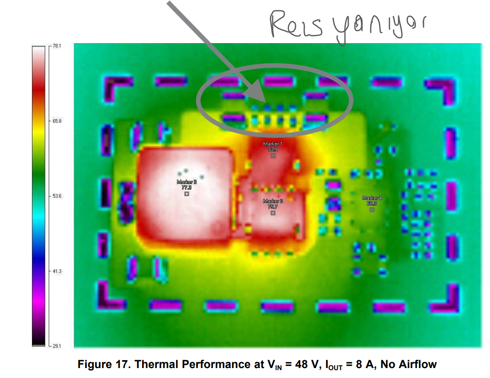

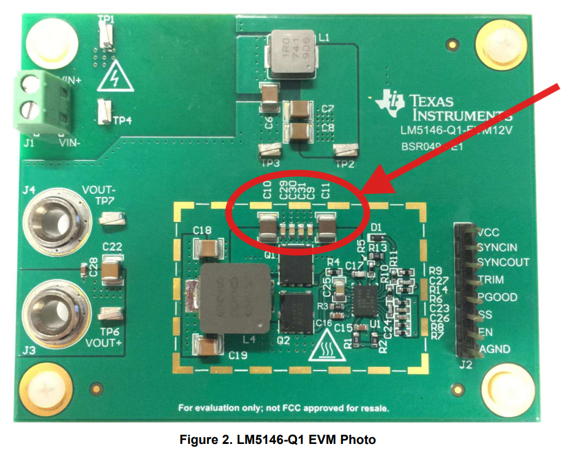

> Giriş kapasitorlerinin pozitif ucu, High-side mosfet’ın Drain ucuna, mmümkün (Kondansatörün negatif ucu, low-side MOSFET’in source ucuna, pozitif ucu ise high-side MOSFET’in drain ucuna mümkün olduğunca yakın yerleştirilmelidir.
> di/dt’yi düşürmek için. ****

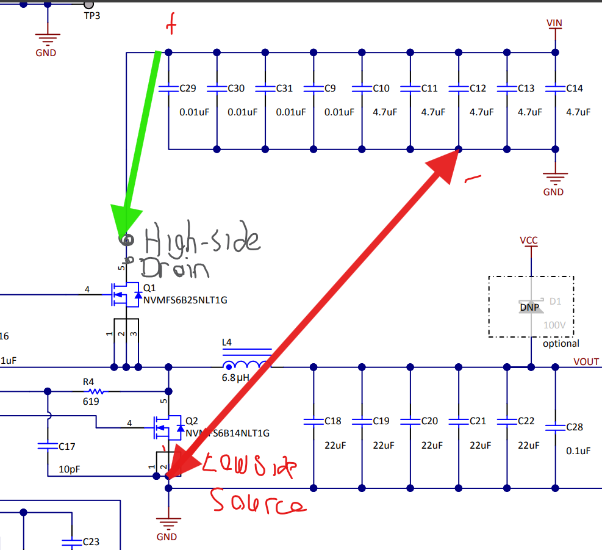

> 48V, 8A’de Main Mosfet’teki Marker1: 73.9 derece ölçülmüş. 24V, 8A’de Main Mosfet’teki Marker1: 64.8 derece ölçülmüş.
> Bizim sistemde Vinmax = 36V, Marker1 bölgesinden biraz dahasoğukbölgeolduüğundan en fazla 70derecedir çıkarımını yaptım.

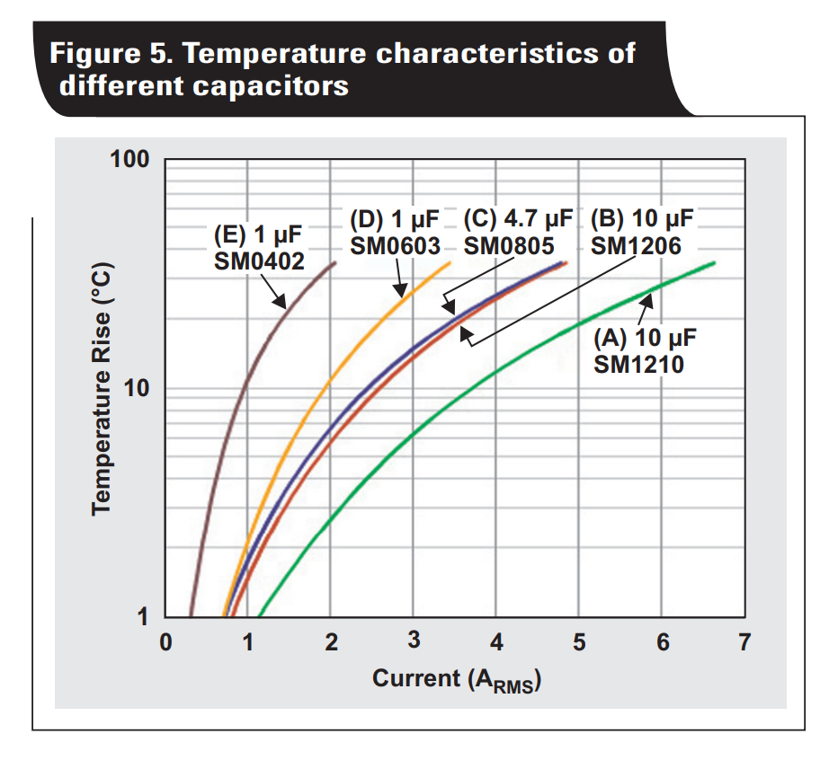

> Çıkış sıcağının bulunduğu yerdeki Kart sıcaklığı 70derece olarak tahmin ettik** Iin_rms_max = 4.55Arms bulmuştuk.
>
> Üzerinden geçen bu akımla ne kadar sıcaklık artışı oluyor. Bu dikeydeki temp.rise derecesi kartın derecesine eklenir. Diyelim ki Hiç akım yokken kartın sıcaklığı ne ise ona değen kapaciyorun de sıcaklığı o olur. Termodinamik birbirine değen…
> Kapasitor, Sıcaklık artışının ne kadara kabul ediyor. Buna bak.
>
> Paralel capacitor kullanarak Iin_rms_max = 4.55Arms’yi böleriz. TEMP.rise da az olur.

Benim buradaki okuma:

- `X7R`, `X5R`'ye gore sicaklik davranisi acisindan daha guvenli bir tercihtir.
- giris MLCC'leri high-side drain ile low-side source arasindaki sicak donguye olabildigince yakin yerlestirilmelidir.
- `I_{in,RMS,max} = 4.55 A_RMS` akimini birden fazla paralel kapasitore paylastirmak, her bir kapasitordeki `temp rise` degerini azaltir.

`48 V / 8 A` ve `24 V / 8 A` EVM gozlemlerinden yaptigim `~70 degC` kart sicakligi tahmini burada sadece ilk muhendislik referansi. Nihai kanit degil. Son secimde secilen MLCC datasheet'indeki ripple-current / temperature-rise grafigi ile gercek kart sicakligi ve ortam sicakligi varsayimi birlikte kontrol edilmeli.

Bu termal zinciri soyle okuyorum: once kart / ortam sicakligi icin bir taban tahmin var (`~70 degC` gibi), sonra kapasitör-basina dusen RMS akim datasheet'teki `temperature-rise` grafigine goturuluyor, sonra bu iki sicaklik ust uste konuyor. `X7R / X5R` notu tek basina yeterlilik kaniti degil; sadece sicaklik davranisi icin malzeme secim tarafini isaret ediyor.


#### 5.5.6 ESL ve kucuk degerli yardimci MLCC'ler

Bu kisim `RMS` hesabindan sonra gelen hizli kenar / yuksek frekans tarafidir. Ana `Cin` banki enerjiyi ve ripple'i tasiyor; kucuk yardimci MLCC'ler ise daha cok spike, ringing ve sicak dongu davranisi icin dusunuluyor.

Bu alt basligi iki hedefe ayiriyorum:

- ana MLCC bankinda paralelleme ile `ESR/ESL` dusurmek
- `10 nF`, `0.1 uF`, `1 uF` gibi kucuk yardimci MLCC'lerle hot-loop'a cok yakin, hizli bir bypass yolu vermek

Bunlari `0.24 Vpp` icin minimum `Cin` veya `0.36 V` transient/bulk hesabi yerine koymuyorum. Bu kisim daha cok anahtarlama kenari, `VDS` spike, phase-node ringing ve EMI riskini azaltan yerlesim-parazitikleri bolumu. Son degerler ancak switching dalga sekli, layout ve gerekiyorsa EMI/LISN taramasi ile kapanacak.

ODT'den aktarilan metin (`7.1.4. MLCC Sığaçlarının ESL değeri ve Küçük Capacitance’lı Mlcc eklemek`):

> Mlccler yüksek frekansta çalışırken ESL değerleri çok önemli olur.ç***
> Düşük esl düşük ripple’için gereklidir.
> Paralel bağlarsak esl’yi düşürürüz.

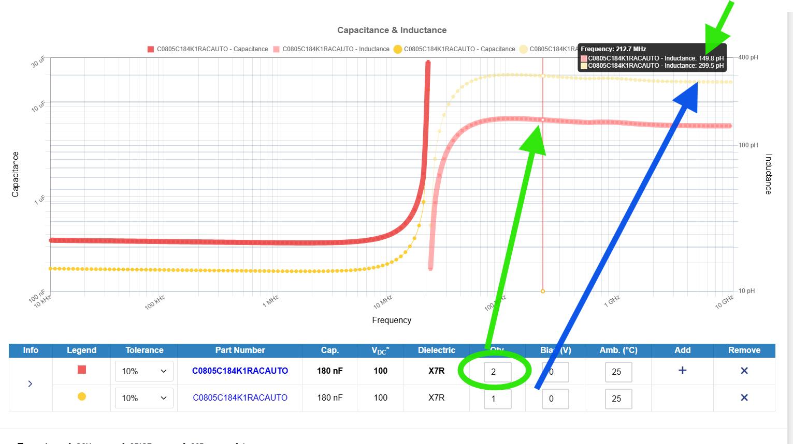

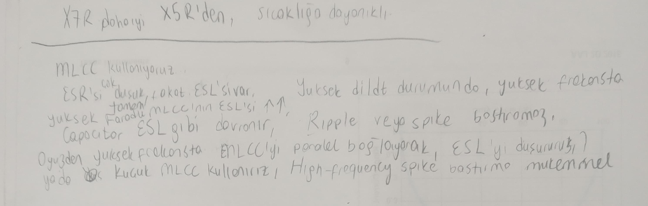

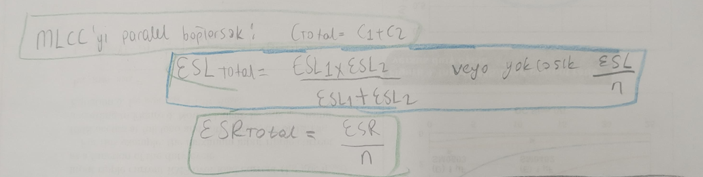

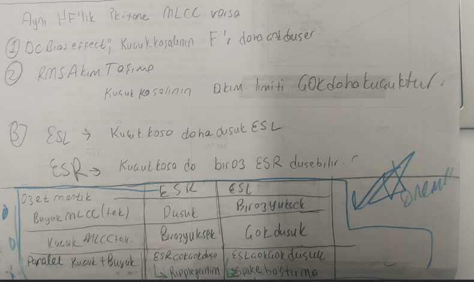

> genel ilke
> ESL ne kadar düşükse, yüksek frekanslı spike’lar o kadar iyi bastırılır


Benim buradaki okuma:

Burada yuksek frekansta MLCC seciminde `ESL`'nin belirleyici oldugunu not ediyorum. Bu sayfalarin bende tuttugu ana fikirler:

- dusuk `ESL`, yuksek frekansli spike ve ringing bastirma acisindan kritiktir
- birden fazla MLCC'yi paralel baglamak etkin `ESL`'yi dusurmeye yardim eder
- buyuk degerli ana MLCC'lere ek olarak daha kucuk kapasitansli, fiziksel olarak kucuk ve dusuk `ESL`'li yardimci kapasitörler de kullanilabilir

Buradan cikan pratik sonuc su: giris kapasitör agi tek tip ve tek degerli dusunulmemeli. Son karar yalniz BOM satiri degil; yerlesim, sicak akim dongusu ve parasitiklerle birlikte verilecek.

ODT'den aktarilan metin (`7.1.4.1 Çok Küçük Farad’lı, Küçük Boyutlu MLCC’ler eklemek`):

> Mosfetler çok hızlı açlıp kapandığında, giriş akımında ani sıçramalar oluşur. Giriş geriliminde ani kısa süreli dalgalanlanma Input spikes: Phase-node ringing:
> Ali Shirsavar’den de örnek ver.
> Küçük boyutlu (örneğin 0402, 0603) MLCC’ler genellikle daha düşük ESL değerine sahiptir.
> Bu nedenle, sisteme 1 µF, 0.1 µF gibi küçük seramik kondansatörler eklenerek, bu yüksek frekanslı istenmeyen etkiler azaltılabilir.

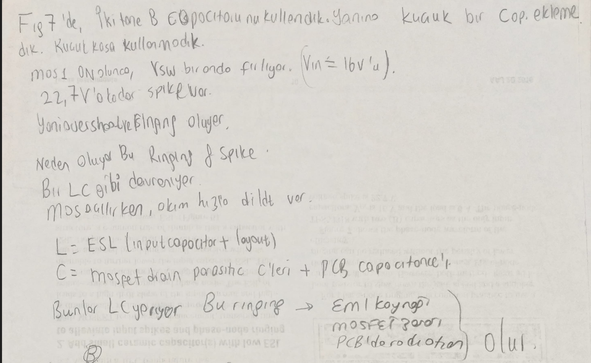

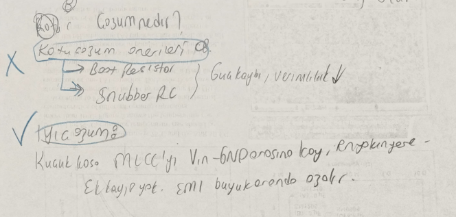


Benim buradaki okuma:

Burada ana MLCC bankasina ek olarak cok kucuk degerli yardimci MLCC ekleme mantigini kuruyorum. Buradaki fikir, enerji depolamaktan cok, `input spikes` ve `phase-node ringing` gibi cok yuksek frekansli istenmeyen etkileri bastirmak.

Kucuk paketli `0402` veya `0603` MLCC'ler genellikle daha dusuk `ESL` sundugu icin, `1 µF` ve `0.1 µF` gibi degerler sicak akim dongusune yakin yerlestirilerek anahtarlama kenarlarindaki ani akim ihtiyacina daha hizli cevap verebilir.

Bu mantigi destekleyen somut bir yardimci MLCC ornegi olarak, `GCM188R72A103KA37` sinifinda `10 nF` civari kucuk bir seramik kapasitör icin su ekran goruntuleri burada kaliyor:


Bu grafiklerden okudugum seyler:

- cok kucuk yardimci MLCC'nin enduktansi `1 MHz` mertebesinde `0.0008 \mu H` civarinda okunabiliyor
- sicaklik etkisi goreli olarak sinirli; `20^\circ C` civarinda kapasitans degisimi neredeyse yok
- `36 V` civarinda bile `10 nF` sinifindaki bu yardimci cap'te bias kaynakli azalma var ama buyuk `uF` sinifindaki MLCC'lere gore daha sinirli
- `40 kHz` civarinda direnç / `ESR` daha yuksekken, `0.3 MHz` civarinda `0.5 \Omega` mertebesine inmesi bu tip kucuk MLCC'lerin neden anahtarlama kenarlarina yakin, yuksek frekans bastirma gorevinde dusunuldugunu acikliyor

Yani bu yardimci kapasitörler ana enerji deposu degil. Dusuk `ESL` ve uygun yuksek frekans empedansi sayesinde, hot-loop etrafindaki ani akim ihtiyacina buyuk MLCC'lerden daha hizli cevap verebilen destek elemanlari gibi dusunulmeli.

Buradaki `p71` ve `p74` ciftinin ayri yeri var: yalnizca "kucuk cap eklemek iyi olur" diye soyut bir not tutmuyorum; daha kucuk paket / daha dusuk `ESL` sinifinda bir parcayi secmek icin datasheet arayuzu uzerinden gercek arama yapmisim.

Defterden aktarilan not (`W.86`):

Burada `ESR`, `ESL`, dielektrik tipi ve paket boyutu arasindaki pratik denge kendi defter dilimle ozetleniyor. Sayfanin ust kismina:


- `X7R`, `X5R`'ye gore sicakliga daha dayanikli

notu dusulmus. Bunun altinda da MLCC seciminde tek bir "en iyi" paket olmadigi, buyuk ve kucuk paketlerin farkli avantajlar tasidigi anlatiliyor.

Sayfadaki ana fikirler sunlar:

- buyuk MLCC'lerde `ESR` genellikle daha dusuktur
- kucuk paketli MLCC'lerde `ESL` genellikle daha dusuktur
- yuksek frekansta `ESL` baskin hale geldiginde, ripple / spike bastirma acisindan kucuk paketler daha etkili olabilir
- bu nedenle yuksek frekansli spike bastirma icin sadece buyuk paketli ana MLCC'lere guvenmek yeterli olmayabilir

Sayfada MLCC'leri paralel baglamanin etkisi de not edilmis:

$$
ESR_{\text{total}} \approx \frac{ESR}{n}
$$
ve `ESL` icin de paralel baglamada esdegerin azaldigi, yani birden fazla kapasitörü paralellemenin yuksek frekans davranisini iyilestirdigi yazili.

Sayfanin altinda ise buyuk ve kucuk MLCC'lerin karsilastirildigi kisa bir tablo var. El yazisindaki mesaj net olarak su:

- buyuk MLCC:
  - `ESR` daha dusuk olabilir
  - ama `ESL` daha buyuk olabilir
- kucuk MLCC:
  - `ESL` daha dusuk olabilir
  - fakat `dc-bias` ve akim sinirlari daha zorlayici olabilir
- buyuk + kucuk MLCC'leri birlikte kullanmak:
  - `ESR` ve `ESL` acisindan dengeli bir cozum verebilir
  - yuksek frekansli spike bastirma iyilesebilir

`W.86`, `5.5.6` altindaki ODT notlarini defterde daha pratik hale getiriyor. Yeni bir nihai sayisal sonuc vermiyor; ama neden hem buyuk hem kucuk MLCC dusundugumu, neden `0402/0603` yardimci kapasitörlerin mantikli oldugunu ve neden paralel baglamanin ise yaradigini acikca gosteriyor.

Defterden aktarilan not (`W.87`):

Burada `W.86`daki `ESR/ESL/kucuk-buyuk MLCC` dusuncesi daha pratik bir sorun uzerinden aciklaniyor: MOSFET acilip kapanirken gorulen yuksek frekansli `ringing` ve `spike` davranisi.

Sayfanin ust kismina, buyuk kapasitörlerin yanina kucuk bir kapasitör eklenmesi gerektigi not edilmis. Hemen altinda da gozlemsel bir problem tarifi var:

- MOSFET `ON/OFF` olurken
- `Vin = 36 V` civarinda
- yaklasik `22.7 V` seviyesine kadar inen bir spike / sapma goruluyor
- bunun uzerine `undershoot` veya `ringing` benzeri davranis olusuyor

Sayfada ardindan bunun nedeni sorgulaniyor ve asagidaki fiziksel model not ediliyor:

- bu durum `LC` gibi davranan bir parasitik agdan kaynaklanabilir
- `L` tarafi:
  - input capacitor `ESL`
  - yerlesim / layout enduktansi
- `C` tarafi:
  - MOSFET drain parasitik kapasiteleri
  - PCB / component kapasitanslari

Bu parasitik `L-C` aginin sonucunda:

- `ringing`
- `EMI`
- MOSFET ve PCB uzerinde istenmeyen stres

olusabilecegi yazilmis.

Sayfanin "cozum nedir?" kisminda iki tip cozum not edilmis:

- `boot resistor`
- `snubber RC`

ve altina da daha dogrudan, yerlesim-odakli bir cozum eklenmis:

- kucuk paketli MLCC'leri `VIN-GND` arasina, hot-loop'a yakin koy
- `ESL`'yi azalt
- boylece EMI ve buyuk orandaki spike davranisi azalabilir

Buradaki `22.7 V` benzeri sayiyi final olcum sonucu gibi degil, problem tipini gosteren bir defter izi gibi tutuyorum. Asil karar sirasinda bu basligi uc kademede okuyacagim: once hot-loop ve kucuk yardimci MLCC ile parasitik `L`'yi azaltmak, yetmezse `R_{boot}` ile anahtarlama kenarini yumusatmak, yine gerekirse `snubber RC` ile kalan ringing'i sondurmek.

`W.87`, `W.86`daki teorik `ESL dusuk olmali` notunu gozlenen problem ve cozum tarafina tasiyor. Yeni bir nihai sayisal sonuc ya da olcum sonucu degil; ama kucuk yardimci MLCC fikrinin "ekstra olsun" diye degil, `ringing / spike / EMI` riskinden geldigini acik ediyor.

Defterden aktarilan not (`W.95`):

Burada MLCC'nin frekansa bagli esdeger empedansi kendi cizimlerimle toparlaniyor. Sayfanin sol ustunde `G73 / Kemet` benzeri bir kaynak notu var ve `4.7 uF` ile `0.47 uF` kapasitörlerin empedans egimleri birlikte cizilmis.


Sayfada kapasitörun pratik modeli su sekilde yaziliyor:

$$
Z \approx Z_C \parallel Z_{Rleak} + Z_{ESL} + ESR
$$
ve alttaki notta, `R_{leak}` degerinin genelde cok buyuk oldugu, bu nedenle ilk yaklasimda:

$$
Z \approx Z_C + Z_{ESL} + ESR
$$
olarak dusunulebilecegi yazilmis.

Sayfanin orta kismina, empedansin karmasik bicimi de not edilmis:

$$
Z \approx R_{ESR} + j\omega L_{ESL} - j\frac{1}{\omega C}
$$
ve buradan buyukluk icin:

$$
|Z| = \sqrt{R_{ESR}^{\,2} + (X_L + X_C)^2}
$$
ifadesine geciliyor.

Bu sayfanin bende tuttugu asil sey, farkli kapasitans degerlerinin frekansa gore ayni davranmadigini tek cizimde gostermesi:

- `4.7 uF` gibi daha buyuk bir kapasitör dusuk frekansta daha dusuk `|Z|` saglayabilir
- `0.47 uF` gibi daha kucuk bir kapasitör, farkli frekans bolgesinde avantajli olabilir
- `ESR` ve `ESL` eklenince, ideal `1/j\omega C` davranisi tek basina yeterli aciklama olmaz

Sayfadaki yan notlardan, bu sonuca ulasilmis:

- frekans degistiginde kapasitörun bileske empedansi da degisir
- bunu belirleyen yalnizca `C` degil; `ESL` ve `ESR` de frekansa bagli olarak etkili hale gelir

`W.95`, `W.72`deki esdeger devre modelini bu kez daha analitik bir `Z = R + jX` diliyle tekrar kuruyor. Yeni bir nihai komponent secimi vermiyor; daha cok `W.86-W.87`deki buyuk/kucuk MLCC sezgisinin matematik arka tarafi gibi duruyor.

Defterden aktarilan not (`W.96`):

Burada `W.95`teki kapasitör empedansi dusuncesi bir adim daha ileri gidip farkli kapasitör tiplerini `Q`, `f_0` ve damping acisindan karsilastiriyor. Ust kisimdaki not, bunun bir ders/video veya kaynak anlatimindan alinmis bir "EMI suppression filters" karsilastirmasi oldugunu gosteriyor.


Sayfada iki farkli aday yan yana dusunulmus:

- `MLCC`
  - `C \approx 1.4 uF`
  - `ESR \approx 1.3 mΩ`
  - `ESL \approx 1.6 nH`
- `Polymer`
  - `C \approx 100 uF`
  - `R_{ESR} \approx 0.36 Ω`
  - `ESL \approx 20 nH` gibi okunan bir not

Sayfada bunlar icin klasik ikinci dereceden esitger buyuklukler hesaplanmis:

$$
f_0 = \frac{1}{2\pi\sqrt{LC}} \qquad R_0 = \sqrt{\frac{L}{C}}
$$
MLCC tarafi icin defterde yaklasik su sonuc yazilmis:

$$
f_0 \approx 3362\,kHz
$$
$$
R_0 \approx 33.8\,m\Omega
$$
ve buna bagli kalite faktorunun:

$$
Q \approx \frac{R_0}{R_{ESR}} \approx 26 \gg 1
$$
oldugu, yani `underdamped` davransa bile derin bir empedans "dip"i olusturabilecegi not edilmis.

Polymer tarafi icin ise sayfada:

$$
f_0 \approx 112.5\,kHz
$$
ve

$$
Q \approx 0.04 \ll 1
$$
gibi bir sonuc goruluyor; bu da daha `overdamped` bir davranisa isaret ediyor.

Sayfanin sagindaki renkli eskizlerde ana mesaj su:

- MLCC, dusuk `ESR` ve dusuk `ESL` ile belli bir frekans bolgesinde cok derin bir empedans minimumu yaratabilir
- polymer ise genelde daha yumusak / daha sönümlü bir davranis verir
- bu nedenle ayni ag icinde farkli kapasitör tiplerini birlikte kullanmak, hem dusuk empedans hem de makul damping elde etmek icin yararli olabilir

`W.96`, `W.95`teki frekansa bagli `Z` dusuncesini `MLCC` ve `polymer` karsilastirmasina tasiyor. Bu proje icin nihai parca secimi degil; ama yalnizca dusuk `ESR` istemenin her zaman yeterli olmadigini, damping tarafinin da ayrica dusunulmesi gerektigini gosteriyor.

Defterden aktarilan not (`W.99`):

Burada ayni `C` ve `ESL` degerleri icin farkli `ESR` secildiginde empedans egrisinin ve `Q` davranisinin nasil degistigi cok sade bir ornekle anlatiliyor.


Sayfanin ustunde yazilan ornek:

- `C = 4 uF`
- `ESL = 2.5 nH`
- iki farkli `ESR` denemesi:
  - `ESR_1 = 0.25 ohm = 250 mΩ`
  - `ESR_2 = 0.001 ohm = 1 mΩ`

Sayfada karakteristik empedans benzeri buyukluk su sekilde yazilmis:

$$
R_0 = \sqrt{\frac{L_{ESL}}{C}} \approx \sqrt{\frac{2.5\,nH}{4\,uF}} \approx 7.29\,m\Omega
$$
Ardindan iki farkli durum icin `Q` benzeri oran hesaplanmis:

$$
Q_1 = \frac{R_0}{ESR_1} \approx \frac{7.29\,m\Omega}{250\,m\Omega} \approx 0.029
$$
$$
Q_2 = \frac{R_0}{ESR_2} \approx \frac{7.29\,m\Omega}{1\,m\Omega} \approx 7.29
$$
Sayfadaki el cizimi de bu ayrimi gorsellestiriyor:

- `Q_1 < 1` iken daha fazla sönümlü, daha yumusak bir empedans davranisi
- `Q_2 > 1` iken daha keskin, daha belirgin rezonansli bir davranis

`W.99` ikinci projenin kendi nihai parca degerleriyle yazilmis bir secim sayfasi degil. Daha cok `ESR` ile `Q` iliskisini sezgisel anlatan egitsel bir kontrol sayfasi gibi duruyor.

Ayni `C` ve `ESL` icin yalnizca `ESR` degisimi bile empedans egrisinin sekli ve rezonans keskinligi uzerinde buyuk etki yaratabiliyor. Bu da `W.95-W.96`daki "yalnizca dusuk ESR yetmez; damping de onemli" fikrini daha sade destekliyor.

Bu uc sayfayi (`W.95-W.96-W.99`) bir parca secimi listesi gibi degil, frekans ve damping ara notlari gibi okuyorum. Sirasi bende soyle:

- `W.95`: gercek kapasitör `C + ESR + ESL` ile frekansa bagli bir empedans elemani
- `W.96`: MLCC / polymer farki yalniz `uF` degil, `Q`, `f_0` ve damping farki
- `W.99`: `ESR` cok dusunce empedans dibi keskinlesebilir; damping kaybolursa ringing riski artar

Bu notlar kucuk yardimci MLCC ve bulk kapasitör kararlarini birbirine bagliyor: bir tarafta spike icin dusuk `ESL`, diger tarafta rezonansi sakinlestirmek icin makul damping gerekiyor.

Defterden aktarilan not (`W.88`):

Burada dogrudan bir kaynak makale sayfasinin uzerine alinmis not var. Benim icin `5.5.6` ile `5.5.7` arasina koydugum kopru sayfasi gibi duruyor.


Sayfanin ust kismindaki `Figure 8`, girise eklenen kucuk bir seramik kapasitörun `switch-node` dalga seklini nasil iyilestirebildigini gosteriyor. Bu, `W.87`deki su dusunceyle dogrudan uyumlu:

- kucuk yardimci MLCC eklemek
- hot-loop'u kisaltmak
- yuksek frekansli `ringing / spike` davranisini azaltmak

Yani burada, kucuk yardimci MLCC fikrinin yalnizca sezgisel degil, kaynak figuru ile de desteklendigini goruyorum.

Sayfanin alt kismindaki `Figure 9a` ise bulk kapasitör secimi tarafi icin onemli. Bu sekilde:

- yuk degisimi sirasinda cikis akimi
- giris akimi
- input transient sirasinda olusan `V_{in}` dususu

ayri ayri cizilmis.

Sayfa uzerine aldigim notlardan, su ana fikirler one cikiyor:

- ilk `\Delta V_{in}` dususu daha cok MLCC / `ESR` etkisiyle iliskili
- daha sonra gelen daha yavas dusus ise bulk kapasitörun enerji tamponu roluyle iliskili
- `T_{rip}` ya da benzeri bir gecis suresi, bulk `C_B` hesabinda kullaniliyor

Sayfanin altina dusulen kisa notlar da bunu destekliyor:

- `\Delta V_{in,MLCC}` benzeri ilk dusus
- `Bulk` ile ilgili ikinci daha yavas davranis

`W.88`, `W.87`deki "kucuk seramik spike bastirir" fikrini kaynak figuruyle destekliyor. Ayni anda `W.83`teki bulk transient hesabinin fiziksel arka planini da acikliyor. Ben burada sayfayi soyle okuyorum: ustteki figür kucuk yardimci MLCC ve ring/spike bastirma tarafini, alttaki figür ise bulk kapasitörun transient enerji tamponu rolunu gosteriyor. Bu yuzden `5.5.6`dan `5.5.7`ye gecisi burada tutmak mantikli.

Defterden aktarilan not (`W.89`):

Burada `W.88`deki kaynak figurlere bakilarak alinmis kisa bir ozet not var. Ust kisimda `Figure 8`e referansla, kucuk ek bir kapasitör eklendiginde spike buyuklugunun azaldigi not edilmis:


- kucuk ek `D` capacitoru eklendiginde
- spike seviyesi yaklasik `22.9 V`'tan `20.5 V` civarina dusuyor

Bu `22.9 V -> 20.5 V` sayilarini kendi kartimin final spike olcumu gibi okumuyorum. Buradaki deger benim icin goreli etkiyi gosteriyor: kucuk, dusuk `ESL`'li bir seramik eklendiginde ayni problem ailesinde spike/ringing azalabiliyor. Kendi tasarimimda asil kabul, switch-node ve MOSFET `VDS` dalga sekillerinin LTspice / olcumle tekrar bakilmasi olacak.

Sayfadaki yorum, bunun nedenini de yine `ESL` uzerinden bagliyor:

- kucuk paket
- dusuk `ESL`
- bu nedenle yuksek frekansli spike bastirmada daha etkili

Sayfanin orta kismina dogru, bulk kapasitörun ne ise yaradigi kisa maddeler halinde toparlanmis:

1. `transient response`
2. `ripple current tasima`, yani MLCC'ye destek olma

Ardindan bulk seciminde iki kritik parametre tekrar yaziliyor:

1. `capacitance`
   - yuk degisimi sirasinda gerekli enerjiyi saglayabilecek kadar buyuk olmali
2. `ESR_B`
   - ripple current tasirken cok yuksek olmamali
   - ama sifira cok yaklasan kadar da dusuk olmasi her zaman en iyi sonuc olmayabilir

Sayfanin alt notunda asil muhendislik sezgisi su:

- buyuk `ESR` -> ripple gerilimi artar
- ama bir miktar `ESR` varligi, `LC` rezonansini bastirmaya ve damping saglamaya yardim edebilir

`W.89`, `W.88`deki iki ana temayi kisa bicimde birlestiriyor: kucuk yardimci kapasitör -> spike bastirma, bulk kapasitör -> transient enerji tamponu + ripple akimi destegi. Yeni ayrintili sayisal sonuc vermiyor; ama bulk seciminde "kapasitans buyuk olsun, ESR da makul bir aralikta olsun" dusuncesini defterdeki not dilimle toparliyor. Ozellikle "ESR sifir olsun" yerine "fazla buyuk olmasin ama damping de dusunulsun" sezgisi burada kaliyor.


#### 5.5.7 Bulk kapasitör secimi mantigi

Bu baslikta artik MLCC bankasindan bulk tarafina geciyorum. Burasi dogrudan "nihai bulk parcasi budur" diye okunmamali; once bulk neden gerekli, sonra kapasite / `ESR` / ripple akimi hangi sira ile kontrol ediliyor, onu toparlayan defter akisi.

Okuma sirasi su sekilde daha az dagiliyor: ODT notu bulk'un neden gerekli oldugunu aciyor; `W.29` eski/ara bir parca adayini gosteriyor; `W.38-W.44` ise ayni adayi secim kriterlerine ayiriyor. Yani bu kisimda asil karar listesi su: enerji tamponu yeterli mi, ripple akimi / isinma tasinabiliyor mu, `ESR_B` transient dususunu bozmayacak aralikta mi, sonra da bu secim EMI ve giris filtresiyle kavga ediyor mu?

ODT'den aktarilan metin (`7.2. Giriş Bulk Capacitor Seçimi`):

> MLCC’ler düşük esr’leri sayesinde çok iyi ripple akımı yaşıyabilir. Ancak Mlcclerin etkin capacitance’sı Dc Bias ve sıcaklık altında önemli ölçüde azalır.
> Bu da transient’lerde yeterli enerji depolayamamasına neden olur. Bu neden Bulk capacitorlerde kullanılır.

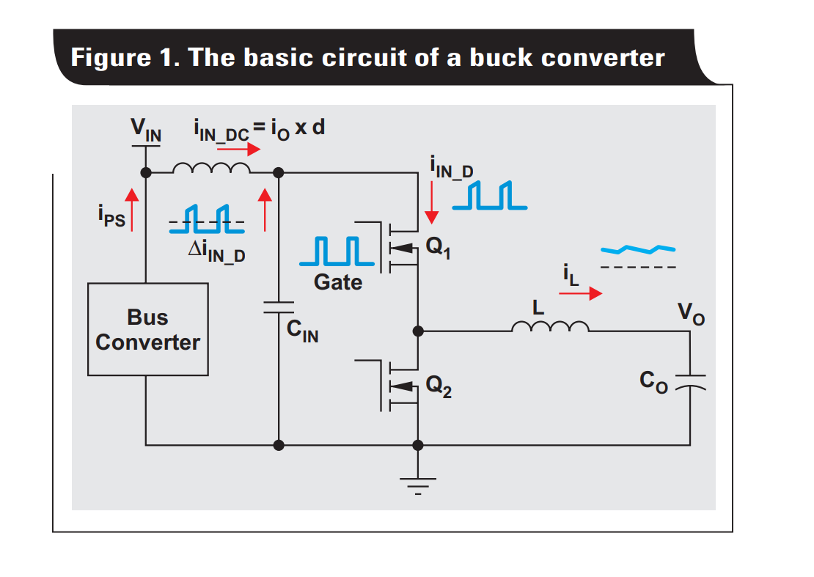

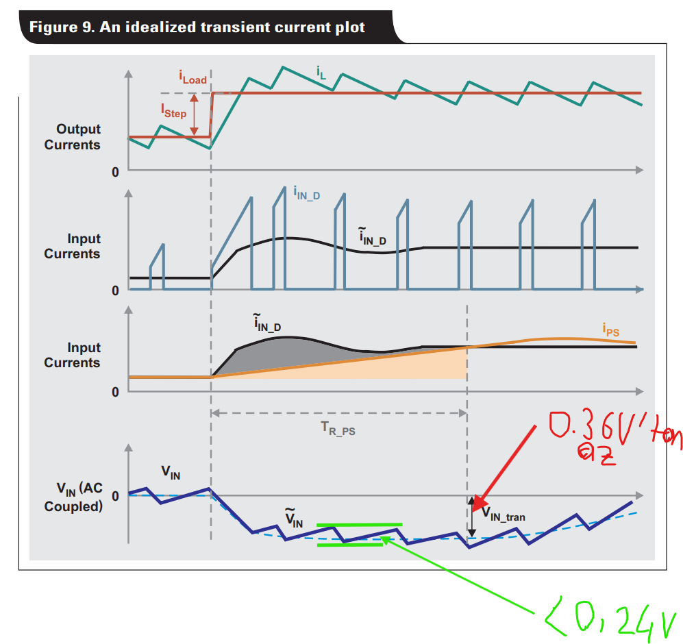

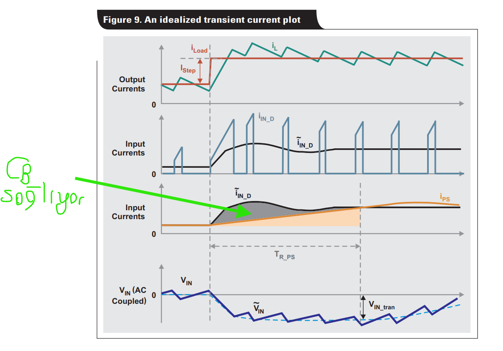

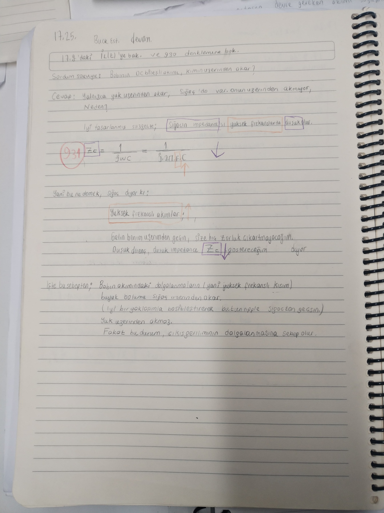


Bu bolumde bende kalan not:

Buradaki parca, bulk kapasitörlerin neden hala gerekli olabildigini netlestiriyor. MLCC'ler yuksek frekans ripple bastirmada cok guclu olsalar da, `dc-bias` ve sicaklik altinda etkin kapasitans kaybi yasadiklari icin daha yavas transient enerji ihtiyacinda tek baslarina yetersiz kalabilirler.

Bu nedenle bulk kapasitörleri burada yuksek frekansli sicak akim dongusunun ana parcasi gibi degil, enerji tamponu ve daha yavas dinamiklerin destekleyicisi gibi dusunuyorum.


Defterden aktarilan not (`W.29`):

Burada eski/ara aday gibi duran su giris bulk kapasitörü notu da goruluyor:

- `68 uF`
- `50 V`
- `ESR ~ 20 mOhm`

Bu deger, dogrudan nihai secim ilan edilmis gibi gorunmuyor; ancak MLCC bankasina paralel bulk enerji tamponu dusuncesinin defterde acikca denendigini gosteriyor.

Buradaki not, mevcut `MLCC + bulk` stratejisiyle uyumlu. Ama bu asamada kesin nihai bulk parca gibi okunmamali; BOM ve sonraki sayfalarla eslestirmeden sadece bir secim izi olarak kalmali.

Sonraki sayfalarda bu iz daha gercek parca tarafina kayiyor: `W.80-W.82` zincirinde eksik etkin kapasite gorulup `2 x 47 uF / 50 V / X7R` seramik bulk ana aday gibi yaziliyor; ayni tabloda `100 uF polymer` sinifi da alternatif/karsilastirma izi olarak duruyor. Bu nedenle `68 uF / 50 V / 20 mOhm` notunu eski bir ara aday ve bulk ihtiyacinin erken isareti olarak tutuyorum.


Defterden aktarilan not (`W.38`):

Burada bulk giris kapasitörü seciminde ikinci bir kriter vurgulaniyor: secilen bulk kapasitör yalnizca yeterli `uF` saglamamali, ayni zamanda uzerinden gececek ripple akimini ve buna bagli isinmayi da tasiyabilmelidir.


Sayfadaki ana fikirler:

- bulk kapasitör seciminde bir kosul, `I_{CB,RMS,\text{allowed}} > I_{CB,RMS}` olmali
- MLCC bankasi yuksek frekansli ripple'in buyuk bolumunu tasirken, bulk kapasitör kalan ripple akimi ve enerji tamponu tarafinda rol alir
- bulk kapasitör `ESR`'i buyudukce, ayni ripple kosulunda kayip ve isinma artar

Defterde, bulk kapasitör uzerindeki ripple akimi icin yaklasik olarak su tip bir iliski yazilmaya calisiliyor:

$$
I_{CB,RMS} \approx \frac{\Delta V_{IN,PP}}{2\sqrt{3}\,ESR_B}
$$


ve buna bagli olarak, izin verilen ripple gerilimi, bulk kapasitör `ESR`'i ve datasheet'teki izin verilen ripple akimi arasinda ikinci bir secim kosulu kuruluyor.

Bu formulu gercek akim paylasimini birebir cozen bir model gibi okumuyorum. Defterdeki gorevi daha cok "bu bulk, kendisine kalacak ripple akimi / isinmayi tasiyabilecek mi?" diye bakilan hizli bir secim saglama kontrolu. Gercek paylasim, MLCC bankasinin ve bulk kapasitörun frekansa bagli empedansi, `ESR/ESL`, paket/yerlesim ve hot-loop geometrisiyle degisecek; o yuzden LTspice ve layout sonrasi olcumle tekrar kapanmali.

Burada bulk capacitor secim mantigi "kapasitans yeterli mi?" sorusundan "eleman ripple akimini ve kaybini tasiyabilir mi?" sorusuna kayiyor. Son cebir ve son sayisal yerlestirme tam net degil; o yuzden bu sayfada benim icin asil kalan sey kesin son formulden cok secim mantiginin kendisi.

Defterden aktarilan not (`W.39`):

Burada bulk giris kapasitörü icin bu kez minimum kapasite tarafinda bir alt sinir hesaplanmaya calisiliyor. Yazimdan goruldugu kadariyla bir `T_{rip}` veya benzeri rezerv / gecis suresi tanimlanip, load-step veya giris tarafindaki gecici durum boyunca bulk kapasitörun ne kadar enerji tamponu saglamasi gerektigi sorgulaniyor.


Sayfada okunan ana izler sunlar:

- `f_c` ile iliskili bir zaman olcegi kullaniliyor
- `I_{step}` ve `D_{max}` benzeri buyuklukler denkleme giriyor
- mevcut `C_E,total` benzeri MLCC katkisi denklemden dusulmeye calisiliyor
- ilk ara sonuc olarak yaklasik `C_B \gtrsim 5.27 uF`
- daha sonra marj eklenerek `C_{bulk} \gtrsim 18.32 uF` gibi daha buyuk bir hedef yaziliyor

Burada bulk kapasitörun sadece ripple akimi tasima degil, gecici durumda enerji rezervi saglama rolunun de hesaba katildigi goruluyor. `W.38` ile birlikte okununca iki kriter yan yana duruyor: ripple akimi / ESR / isinma ve minimum enerji tamponu / kapasite. Son cebirin bir kismi silik; o yuzden bu sayfayi kesin bir sonuc sayfasi degil, "bulk capacitor secimi tek boyutlu degil" izini tutan ara hesap olarak okuyorum.

Defterden aktarilan not (`W.40`):

Burada bulk kapasitör secimine bir ucuncu kosul daha ekleniyor: bulk kapasitörun `ESR_B` degeri de belirli bir ust sinirin altinda olmali. Sayfadaki yazima gore, giris tarafindaki transient limiti ile bulk kapasitör `ESR`'i arasinda dogrudan bir iliski kuruluyor.


Defterde okunan iliski su sekilde:

$$
ESR_B \lesssim \frac{\Delta V_{IN,tran}}{I_{step}\,D_{\max}}
$$
Sayfadaki yerlestirmede:

- $\Delta V_{IN,tran} = 0.36\,\text{V}$
- $I_{step} \approx 3\,\text{A}$
- $D_{\max} \approx 0.121$

kullanilarak yaklasik:

$$
ESR_B \lesssim 0.991\,\Omega
$$
gibi bir ust sinir yaziliyor.

Burada bulk secim mantigi bir adim daha genisliyor: minimum kapasite yeterli mi, ripple akimi ve isinma kabul edilebilir mi, `ESR_B` transient limiti bozmayacak kadar dusuk mu? Buradaki son sayisal sonuc cok siki bir sinir gibi degil; daha cok "asiri buyuk ESR kullanma" turu bir ust sinir kontrolu. `Istep` ve `Dmax` degerleri onceki sayfalara bagli oldugu icin iliski final kabul edilmeden once tekrar eslestirilmeli; ama bulk seciminin kapasite + ESR + ripple dayanimi birlikte dusunulerek ilerledigi acik kaliyor.

Buradaki `D_{\max} \approx 0.121` degerini ozellikle ara iz olarak tutuyorum. README'nin onceki duty notlarinda `24-36 V -> 14 V` icin ideal zarf `0.3888-0.5833`, verim dahil daha korumaci zarf `0.432-0.648` ve pratik giris-cap hesabinda `D = 0.5` geciyor. Bu nedenle `0.121` bu projedeki final duty zarfi gibi degil, `W.40` hesabinin kendi eski/ara varsayimi gibi okunmali. `ESR_B \lesssim 0.991 ohm` sonucu da final limit degil; bulk `ESR`'inin asiri buyuk secilmemesi gerektigini gosteren erken sanity check.

Defterden aktarilan not (`W.44`):

Burada `W.40` tarafindaki `ESR_B` notu daha kisa bir bicimde tekrar ediliyor. Sayfada yazilan iliski su sekilde okunuyor:


$$
ESR_B < \frac{\Delta V_{IN,tran}}{I_{step}\,D_{\max}}
$$
Sayfanin alt notunda, bu iliskide ozellikle `D_{\max}` degerinin onemli oldugu ayrica vurgulaniyor.

`W.44`, `W.40` ile ayni bulk-ESR dusunce hattina ait. Yeni bir sayisal sonuc vermiyor; mevcut iliskiyi kisa bir tekrar ve vurgu notu gibi destekliyor. `D_{\max}` parametresinin onemini vurgulayan kisa bir iz.

Defterden aktarilan not (`W.41`):

Burada bulk kapasitör seciminin gerekcesi daha kavramsal bir dille toparlaniyor. Yazilan notlara gore, ani yuk degisimlerinde `Vin` uzerinde iki ayri spike / dusus mekanizmasi dusunuluyor:


1. `ESR_B` kaynakli ani dusus
2. bulk kapasitörun enerji tamponu olarak bosalmasindan gelen daha yavas gerilim dususu

Sayfada ilk mekanizma icin su iliski tekrar yaziliyor:

$$
V_{\text{spike}} \approx I_{step}\,ESR_B
$$
ve bunun `W.40` tarafindaki transient limiti ile baglantili oldugu not ediliyor.

Ikinci mekanizma icin ise, ani yuk degisiminde buck katinin giristen cekmesi gereken ek enerjiyi ilk anda tam saglayamadigi; bu acigi bulk kapasitörun kapattigi vurgulaniyor. Sayfadaki ana fikir su:

- bulk kapasitör `ESR`'i yuksekse ani gerilim dususu buyur
- bulk kapasitörü kucukse veya enerji rezervi azsa daha yavas ama daha buyuk bir `Vin` dususu olusabilir

Burada yeni bir sayisal sonuc yok; asil is `W.38-W.40` arasindaki bulk secim mantigini sozlu olarak baglamak. Salt formul degil, tasarim dusunce akisini da gosteriyor. "Neden bulk gerekli?" sorusuna defterde verdigim en acik cevaplardan biri burada.

Defterden aktarilan not (`W.43`):

Burada bulk kapasitör secimi bir adim daha toparlaniyor ve MLCC ile bulk arasindaki gorev ayrimi sozlu olarak kuruluyor:


- MLCC'ler yuksek frekansli ripple akimini cok iyi filtreleyebilir
- ancak ani yuk degisimlerinde gereken enerji rezervini tek baslarina her zaman saglayamayabilir
- bu nedenle bulk kapasitör, özellikle transient response icin ek enerji rezervi saglayan eleman olarak dusunuluyor

Sayfadaki ana fikirler sunlar:

- bulk seciminde dusunulen iki temel ozellik:
  - `ESR`'in dusuk olmasi
  - kapasitenin / enerji rezervinin yeterli olmasi
- ani yuk degisiminde ilk anda gerekli akimin bir kismini bulk kapasitör saglar
- bu sirada MLCC ve bulk farkli zaman olceklerinde gorev paylasir

Burada yeni ve temiz bir son formul yok; ama `W.41` ile birlikte okundugunda "MLCC ripple icin, bulk transient enerji rezervi icin" ayrimi defter dilimle acikca kuruluyor. Bu sayfanin islevi daha cok tasarim dusunce izini korumak.

Defterden aktarilan not (`W.45`):

Burada buck yapisinin giris tarafi basit bir sema ve dalga bicimleriyle cizilerek bulk / giris kapasitör seciminin neden gerekli oldugu tekrar anlatiliyor.


Sayfada gorulen ana fikirler:

- giriste kaynak ile buck kati arasinda `Cin` / bulk kapasitör bulunur
- buck anahtari akimi darbeli ceker; bu nedenle kaynak akimi ile donusturucunun anlik akim ihtiyaci ayni degildir
- bobin akimi hemen degisemez
- ani yuk degisiminde veya anahtarlama anlarinda gerekli ekstra akimin bir kismi ilk anda giris kapasitörlerinden saglanir

Sayfanin altindaki notlarda, ozellikle su dusunce izi goruluyor:

- `Iload` bir anda degisebilir
- buck katinin giristen cektigi akim ise ayni anda ve ayni sekilde degismeyebilir
- bu farkin ilk anda bulk kapasitör tarafindan karsilanmasi gerekir

`W.45`, `W.41` ve `W.43` ile ayni kavramsal hatta duruyor. Yeni bir son denklem vermiyor; ama neden bulk / giris kapasitörunun gerekli oldugunu cizim ve kisa notlarla temellendiriyor. Bu sayfayi bu yuzden hesap sonucu gibi degil, fiziksel sezgi sayfasi gibi tutuyorum.

Defterden aktarilan not (`W.67`):

Burada ani yuk degisiminde giris tarafinda gorulebilecek iki farkli gerilim spike mekanizmasi daha acik bir dille ayriliyor.


Sayfada acikca su ayrim yapilmis:

1. `ESR_B` ile iliskili spike
2. `I_{IN-D}` ile `I_{PS}` arasindaki farktan kaynaklanan spike

Ilk spike icin sayfadaki ana fikir su:

- bulk kapasitörun `ESR`'i varsa
- yuk aniden akim cektiginde bu akim cap'in `ESR`'inden gecerken anlik bir gerilim dususu olusur
- bu ilk ve cok hizli olan spike'tir

Bu, onceki sayfalardaki su iliskiyle uyumludur:

$$
V_{\text{spike,1}} \approx I_{step}\,ESR_B
$$
Ikinci spike icin ise sayfada su dusunce izi var:

- `I_{IN-D}` ile `I_{PS}` arasinda bir fark olusabilir
- bu fark, high-side MOSFET'in drain ucuna gelen akim olarak dusunulmustur
- buck icin anlik olarak
$$
I_{IN-D} \approx I_{PS} + I_{Cin,bulk}
$$
  gibi bir akim bolusumu not edilmistir
- `I_{PS}` akimi daha yavas yukselebilir; bu nedenle ani durumda ikinci bir gerilim sapmasi olusabilir

`W.67`, `W.41`te sozlu olarak anlatilan "iki farkli spike mekanizmasi" fikrini daha net bir dille tekrar ediyor. Ilk spike `ESR_B` kaynakli ani dusus, ikinci spike ise kaynak akimi ile donusturucunun anlik talebi arasindaki fark uzerinden aciklaniyor. Bu sayfa bulk secimi ile input transient davranisi arasindaki fiziksel ayrimi daha okunur hale getiriyor.

Bu iki-spike ayrimini `0.36 V` input transient hedefiyle birlikte okuyorum. `0.36 V` tek basina sadece `ESR_B` dususune ayrilmis bir butce degil; ilk ani `ESR` dususu ve sonra gelen daha yavas bulk enerji bosalmasi ayni transient penceresinin parcalari. Bu yuzden `W.40` tarafindaki `ESR_B` kontrolu sadece ilk mekanizmayi hizli yokluyor, `C_B` / toplam etkin `Cin` kontrolu ise ikinci mekanizmayi kapatmaya calisiyor. Finalde ikisi ayni LTspice load-step ve giris dalga sekli uzerinde beraber gorulmeli.

Defterden aktarilan not (`W.74`):

Burada bulk giris kapasitörü icin iki farkli kontrol ayni yerde toplaniyor:


1. bulk kapasitör uzerinden gececek `RMS` akim icin kaba bir worst-case kontrol
2. toplam etkili giris kapasitansi ile `\Delta V_{IN,PP}` hedefinin tekrar kontrolu

Sayfanin ust kisminda, bulk kapasitörun ideal bir bypass elemani olmadigi; ancak dusuk frekansli ripple ve transient sirasinda aktif rol oynadigi not edilmis. Hemen altinda da su worst-case dusunce izi kuruluyor:

- eger tum pulsating akim yalnizca bulk kapasitörden gecseydi
- bulk kapasitör uzerindeki `RMS` akim yaklasik olarak `ESR_B` ve izin verilen `\Delta V_{IN,PP}` ile sinirlanirdi

Sayfada yazilan yaklasik iliski su sekilde okunuyor:

$$
I_{CB,RMS} \approx \frac{1}{2\sqrt{3}} \cdot \frac{\Delta V_{IN,PP}}{ESR_B}
$$
ve sayfadaki yerlestirmede:

$$
I_{CB,RMS} \approx \frac{1}{2\sqrt{3}} \cdot \frac{0.24\,\text{V}}{0.103\,\Omega} \approx 0.677\,\text{A}_{RMS}
$$
Sayfanin alt kisminda ise `\Delta V_{IN,PP}` hedefi bu kez toplam etkili giris kapasitansi uzerinden tekrar kontrol edilmeye calisiliyor. Buradaki ana dusunce su:

- sadece seramik ya da sadece elektrolitik degil
- toplam etkili `C_{CE,total}` dusunulmeli
- bu toplam degerde derating, tolerans ve gercek etkin kapasitans dikkate alinmali
- hesaplanan `\Delta V_{IN,PP}` degeri `0.24 V` hedefiyle karsilastirilmali

Sayfadaki alt notta da, bu hesabin sonunda hedef karsilanmiyorsa toplam etkili giris kapasitansinin arttirilmasi gerekecegi yazili.

`W.74`, `W.38` tarafindaki bulk-uzerinden-RMS akim dusuncesini bu kez daha okunur bir formulle tekrar ediyor. Ayni sayfada `\Delta V_{IN,PP}` hedefini toplam etkili giris kapasitansi ile yeniden kontrol etmem de yalnizca tek bir capacitor degerine degil, toplam etkin ag davranisina baktigimi gosteriyor. Yeni nihai parca secimini tek basina vermiyor; ama bulk secimi ile toplam `Cin` yeterliligi arasindaki bag burada kuruluyor.

Buradaki `0.103 ohm -> 0.677 A_RMS` satirini sonraki gercek aday ESR'i gibi okumuyorum. Bu daha cok worst-case iliskide kullanilan bir kontrol noktasi. `W.81` tarafinda okunan `4 mOhm` tek-parca ESR ve `2 mOhm` paralel esitlik varsayimi baska bir asama: ani ESR dususu icin iyi gorunuyor, ama akimin hangi kapasitöre ne kadar dagilacagini ve damping davranisini tek basina garanti etmiyor. O yuzden `W.74` sayisal kontrol, `W.75` frekans-sezgisi ve `W.81` gercek parca kontrolu birlikte okunmali.

Defterden aktarilan not (`W.75`):

Burada `W.74`teki bulk-uzerinden `RMS` akim dusuncesi tekrar ediliyor; fakat bu kez asil vurgu, bulk kapasitör ile MLCC'nin frekansa gore farkli roller ustlenmesi uzerine kurulmus.


Sayfanin ust kismina yine su yaklasik iliski yazilmis:

$$
I_{CB,RMS} \approx \frac{1}{2\sqrt{3}} \cdot \frac{\Delta V_{IN,PP}}{ESR_B}
$$
Ancak sayfanin ana fikri sayisal sonuc vermekten cok su ayrimi kuruyor:

- bulk kapasitörun AC'ye karsi gosterdigi empedans, seramik kapasitörlere gore daha yuksektir
- ozellikle yuksek frekansli ripple akimini bypass etmek icin kullanilan eleman MLCC'dir
- bulk kapasitör ise daha dusuk frekansli / daha yavas degisen enerji ihtiyacinda daha anlamlidir

Sayfada bu mantik, `Z_C = 1/(j\omega C)` iliskisi ve kabaca bir empedans-frekans eskizi ile desteklenmis. Cizimde:

- frekans arttikca MLCC'nin daha dusuk empedansla yuksek frekansli akimi daha iyi karsiladigi
- bulk kapasitörun ise yuksek frekansta tek basina yeterli bir bypass elemani gibi davranmadigi

anlatiliyor.

Alt notta da su yorum one cikiyor:

- bulk kapasitör, yuksek frekansli ripple akimini tek basina etkin bastiramaz
- bu yuzden bulk tek basina dusunulmemeli
- MLCC ile birlikte kullanildiginda anlamli bir katkida bulunur

`W.75`, `W.74`teki bulk `RMS` akim fikrini kavramsal bir frekans-sezgisi ile tamamliyor. Yeni bir nihai hesap sonucu yok; ama "neden bulk + MLCC birlikte dusunuluyor?" sorusuna defter cevabini veriyor. Giris kapasitörü bankasinin gorev paylasimi burada netlesiyor.

Defterden aktarilan not (`W.76`):

Burada artik kavramsal aciklamadan bir adim daha ileri gidilip gercek giris kapasitörü adaylari not edilmeye baslaniyor. Ust kisimda yazimdan gorulebildigi kadariyla:


- `C29` icin kucuk degerli bir yuksek frekans seramik kapasitör adayi not edilmis
- `C10, C11, C12, C13, C14` gibi bir grup icin de `4.7 uF` sinifinda MLCC adaylari dusunulmus


El yazisi tam net olmasa da, sayfanin ana fikri su:

- kucuk degerli bir kapasitör, daha yuksek frekansli spike / ringing bastirma tarafinda kullanilabilir
- birden fazla `4.7 uF` MLCC paralel baglanarak hem etkin kapasitans artirilir hem de esit dagilim varsayimiyla etkin `ESR` dusurulur

Sayfanin orta ve alt kisimlarinda, paralel MLCC grubu icin kaba bir `ESR` kontrolu yapildigi goruluyor. Defterde iki frekans bolgesi ayrilmis:

- `f_c = 35 kHz` civari
- `f_sw = 332 kHz`

ve tek bir kapasitör icin dusunulen `ESR` degerinin, `4 adet` paralel kullanildiginda yaklasik dorde bolunecegi yazilmis. Sayfadaki okunan ara notlar su sekilde:

$$
ESR_{\text{eq}} \approx \frac{2.1\,\Omega}{4} \approx 0.525\,\Omega
$$
ve daha yuksek frekansli kisim icin:

$$
ESR_{\text{eq}} \approx \frac{0.5\,\Omega}{4} \approx 0.125\,\Omega
$$
`W.76`, `W.75`te kurulan "MLCC yuksek frekansta daha etkilidir" fikrini bu kez gercek aday komponentlere indiriyor. Buradaki `ESR` sayilari buyuk ihtimalle datasheet/grafik ustunden okunmus kaba ara degerler; o yuzden tek basina nihai sonuc gibi alinmamali. Bende kalan asil iz, paralel MLCC ile etkin `ESR`'i dusurme mantigi ve `C10-C14` ile `C29` tarafina giden parca secim dusuncesi.

Buradaki `4 adet` paralel hesabini da bu yuzden ara egzersiz gibi tutuyorum. EVM tarafinda `C10-C14` diye bes konum gorunuyor, sonraki `W.77-W.78` sayfalarinda da `4 adet / 5 adet` senaryolari birbirine yakin sekilde denenmis. Son okuma: `W.76` etkin `ESR` dusurme fikrini aciyor; gercek banka sayisi ve bias altindaki toplam kapasite ise `W.78`deki `5 x 4.7 uF` kontroluyle daha iyi temsil ediliyor.

`p79` burada ozellikle kalmali; cunku bu dusunceyi soyut bir BOM listesi gibi degil, gercek EVM semasinda `C29 = 0.01 uF` yardimci cap ile `C10-C14 = 4.7 uF` ana MLCC grubunun fiziksel dagilimi olarak gosteriyor.

Defterden aktarilan not (`W.77`):

Burada `W.76`da not edilen giris MLCC adaylari bu kez `dc-bias` ve `RMS` akim dagilimi tarafindan kontrol edilmeye baslaniyor. Sayfanin ust notunda:


- `0.1 uF` sinifinda kucuk bir seramik
- `4.7 uF x 5` gibi gorunen bir MLCC grubu

birlikte dusunulmus.

Sayfada okunan ana dusunce izleri sunlar:

- toplam `I_{RMS}` akimi birden fazla MLCC arasinda bolunmeye calisiliyor
- `4 adet` / `5 adet` gibi paralel kullanim senaryolari not edilmis
- buna bagli olarak "tek capacitor basina dusen RMS akim" kontrol edilmeye calisiliyor

Sayfada ayrica asil parca-secim mantigi da var:

- `36 V` altinda degil
- `36 V` civarinda ve sicaklikta (`+41 C` gibi not edilmis) `dc-bias` etkisiyle kapasite dusuyor
- bu nedenle katalog degerine degil, bias altindaki etkin kapasitansa bakmak gerekiyor

Alt kisimda, birkac adet MLCC'nin bias altindaki etkin kapasitansinin toplami icin su tip ara notlar var:

- `kapasitans 8332 pF`
- `4 adet icin kapasitans = 33,568 nF`

Bu sayilar tam olarak hangi kucuk kapasitör ailesine ait oldugu acik degil; fakat ana mesaj net:

- yuksek gerilim altinda kucuk / orta degerli MLCC'ler ciddi kapasite kaybi yasayabilir
- bu nedenle bakilacak sey yalnizca katalogdaki `uF` degil, gercek calisma kosulundaki etkin degerdir

`W.77`, bu adaylari `dc-bias + RMS dagilimi` tarafina tasiyor. Tek bir nihai sonuc vermiyor; daha cok parca secerken nelere bakildigini gosteriyor. Bazi ara degerlerin tam olarak hangi datasheet egrisinden okundugu net olmasa da ana mesaj acik: katalogdaki `uF` degeriyle yetinme, bias altindaki etkin kapasiteye bak. Bu da `W.51`deki mantikla uyusuyor; gercek capacitor seciminde `current rating`, `voltage rating` ve `dc-bias` birlikte dusunulmeli.

Buradaki `8332 pF` ve `33,568 nF` notlarini ana `4.7 uF x 5` bankanin son etkin kapasitesi gibi okumuyorum. Bunlar daha cok kucuk degerli aday / yardimci MLCC tarafinda bias altinda ne kadar kapasite kaldigini gormeye calistigim ara izler gibi duruyor. Ana giris MLCC bankasi icin daha temiz sayisal hat bir sonraki `W.78` sayfasinda geliyor: `5 x 4.7 uF`, kapasitör basina `~0.908 A_RMS`, bias altinda toplam `~8.2 uF`.

Defterden aktarilan not (`W.78`):

Burada `4.7 uF` sinifindaki giris MLCC grubu daha somut bir secim kontrolune tasiniyor. Sayfada `5 adet` paralel `4.7 uF` MLCC dusunuluyor ve hem `RMS` akim dagilimi hem de bias altindaki etkin toplam kapasitans hesaplanmaya calisiliyor.


Sayfadaki okunan ana notlar sunlar:

- toplam giris `RMS` akimi:
$$
I_{RMS} \approx 4.54\,A_{RMS}
$$
- `5 adet` kapasitör arasinda esit dagilim varsayimiyla:
$$
I_{RMS,\text{cap}} \approx \frac{4.54}{5} \approx 0.908\,A_{RMS}
$$

Sayfada ayrica tek bir `4.7 uF` MLCC icin azami `ESL` benzeri bir deger not edilmis:

$$
ESL_{\max} \approx 0.0007\,\mu H
$$
ve `5 adet` paralel kullanim icin toplam etkin `ESL`'in kabaca:

$$
ESL_{\text{toplam}} \approx \frac{0.0007\,\mu H}{5} \approx 1.4 \times 10^{-4}\,\mu H \approx 0.14\,nH
$$
olacagi yazilmis.

Bu `0.14 nH` sonucunu ideal paralel `ESL` bolme hesabi gibi okuyorum. Yani bes kapasitör birebir ayni empedansla, ayni akim yoluna ve cok kisa loop ile baglanmis varsayiliyor. Gercek PCB'de pad/via enduktansi, kapasitörlerin yarim kopruye uzakligi, mutual coupling ve hot-loop geometrisi bu sayiyi yukari tasiyabilir. Bu yuzden bu satir "paralel MLCC `ESL`'yi dusurur" fikrini destekliyor; final spike/ringing karari yine yerlesim ve LTspice/olcumle kapanacak.

Sayfada asil kritik kisim `dc-bias` duzeltmesi:

- `DC Bias etkisi ile kapasitans %63.9 azaldi`
- tek kapasitör icin etkin deger:
$$
C_{\text{etkin,tek}} \approx 1.639\,\mu F
$$
- `5 adet` icin toplam etkin kapasitans:
$$
C_{\text{toplam,etkin}} \approx 5 \times 1.639\,\mu F \approx 8.195\,\mu F
$$

Bu secim hattini destekleyen somut datasheet / arac ekran goruntuleri de burada kaliyor:


Bu gorseller, `W.78`te yazili buyukluklerin nereden geldigini gosteriyor:

- `ESL_{\max} \approx 0.0007 \mu H` notu, `p67`deki yuksek frekans enduktans ekran goruntusu ile uyumlu
- `I_{RMS,\text{cap}} \approx 0.908 A` buyuklugu, `p68`de gorulen ripple-akim / sicaklik-artisi grafigiyle birlikte "kapasitör basina akim dayanimini dusunme" gerekliligini guclendiriyor
- `p69` ve `p70`, `36.8-37 V` civarinda kapasitans degisiminin `-65%` mertebesine indigini ve gercek etkin degerin `1.639 \mu F` seviyesinde kaldigini acikca gosteriyor

Bu nedenle burada kullanilan `1.639 \mu F` ve `8.195 \mu F` sayilari, yalnizca defterde yazilmis ara rakamlar degil; secilen `4.7 uF` giris MLCC adayinin bias altindaki gercek davranisina dayanan derating uygulamasi olarak okunmali.

`W.78`, `W.77`deki "bias altindaki gercek kapasitansa bak" fikrini sayisal olarak daha net hale getiriyor. `4.7 uF x 5` katalogda `23.5 uF` gibi gorunse de, bias altinda bunun yalnizca `~8.2 uF` seviyesinde kalabilecegi dusunuluyor. Bu, giris MLCC bankasinin neden sadece katalog toplamina bakilarak degerlendirilmemesi gerektigini gosteriyor. `RMS` akim dagilimi de isin akim-dayanimi tarafinin kontrol edildigini gosteriyor.

Defterden aktarilan not (`W.79`):

Burada `W.78`deki `4.7 uF x 5` MLCC grubunun frekansa bagli etkin `ESR` degerleri ve bias sonrasi toplam etkin kapasitans kisa bir ozet halinde tekrar toplaniyor.


Sayfanin ust yarisinda iki farkli frekans icin tek kapasitör `ESR` degerinin, `5 adet` paralel kullanimda nasil azaldigi not edilmis:

- `f_{sw} = 332 kHz` civarinda:
$$
ESR_{\text{tek}} \approx 0.004\,\Omega = 4\,m\Omega
$$
$$
ESR_{\text{eq}} \approx \frac{4\,m\Omega}{5} \approx 0.8\,m\Omega
$$

  

- `f_c = 35 kHz` civarinda:
$$
ESR_{\text{tek}} \approx 0.01\,\Omega = 10\,m\Omega
$$
$$
ESR_{\text{eq}} \approx \frac{10\,m\Omega}{5} \approx 2\,m\Omega
$$

  

Bu ekran goruntulerinin kullandigi parcanin temel kimligi de ayrica korunabilir:


Sayfanin alt kismina ise, kucuk yardimci kapasitörler ile ana `4.7 uF x 5` grubunun birlikte dusunuldugu ve toplam `derated` MLCC kapasitesinin kabaca:

$$
C_{\text{MLCC,toplam,etkin}} \approx 8.228\,\mu F
$$
seviyesinde not edildigi goruluyor.

Alt nottaki kucuk kapasitörlerin tam degerleri el yazisindan tam net degil; ancak ana dusunce su:

- yuksek frekans icin ek kucuk MLCC'ler de dusunuluyor
- buna ragmen toplam etkin kapasite hesabinda asil agirlik `4.7 uF x 5` grubundan geliyor

`W.79`, `W.78`in ozet/devam sayfasi gibi duruyor. `332 kHz` ve `35 kHz` icin ayri `ESR_{eq}` yazilmasi, giris capacitor bankini tek bir frekansta degil birden fazla kritik bolgede dusundugumu gosteriyor. `8.228 uF` sonucu da `W.78`deki `~8.195 uF` ile uyumlu bir ozet gibi okunabilir.

`p72`, `p73` ve `p75` birlikte okundugunda, bu satirlardaki `4 m\Omega` / `10 m\Omega` mertebelerinin secilen `4.7 uF`, `50 V`, `1206`, `X7R` MLCC adayinin belirli frekans ve bias kosullarinda okunmus arac / datasheet ekranlarina dayandigi anlasiliyor.

Bu noktada `8.195 uF` ve `8.228 uF` arasindaki kucuk farki yeni bir tasarim karari gibi okumuyorum. Biri `5 x 1.639 uF` hesabindan gelen ana MLCC toplamı, digeri `W.79`da kucuk yardimci kapasitörlerin de kenarda gorundugu ozet toplam gibi duruyor. Pratik sonuc degismiyor: katalogda `23.5 uF` görünen MLCC bankasi bias altinda `~8.2 uF` civarina iniyor ve `28.4 uF` erken ihtiyaca gore yaklasik `20 uF` acik birakiyor. `W.80`te bulk kararinin acilma sebebi tam olarak bu acik.

Defterden aktarilan not (`W.80`):

Burada artik giris kapasitörü seciminde kritik tasarim karari daha acik yaziyor: ideal/ilk hesapta gereken `Cin` ile, bias altinda gercekte elde kalan MLCC kapasitesi arasinda belirgin bir fark var. Bu fark yuzunden bulk / elektrolitik takviye dusunmeye geciyorum.


Sayfada yazilan ana izler sunlar:

- ilk / ideal minimum giris kapasitansi hesabi:
$$
C_{IN,\text{ideal}} \approx 28.4\,\mu F
$$
- bias sonrasi etkin MLCC kapasitesi:
$$
C_{\text{MLCC,etkin}} \approx 8.195\,\mu F
$$
- bunlar arasindaki acik:
$$
\Delta C \approx 28.4 - 8.195 \approx 20\,\mu F
$$

Sayfada bunun hemen altinda, bu acigi kapatmak icin:

- `alüminyum elektrolit veya polimer` tipte
- kabaca `30 uF` sinifinda
- ve `ESR_B < 0.10233 \Omega` kosulunu saglayan

bir ek bulk capacitor dusunuldugu not edilmis.

Sayfanin alt notu da karar cümlesi gibi okunuyor:

- `Al elekt ile radial kullanmis`
- `since EMI fitindaki al cap siz yinelemeler icin total dzk ESL, ESR degerini basliyor`

El yazisi tam net degil; fakat ana fikir su sekilde okunabiliyor:

- salt seramik bank yetmeyince ek bulk gerekli goruluyor
- bunun icin alüminyum elektrolitik / polimer hat dusunuluyor
- bu ek bulk, hem eksik kapasiteyi tamamlamak hem de toplam ag davranisini daha gercekci hale getirmek icin seciliyor

`W.80`, `W.78-W.79` hattindaki karar sayfasi gibi duruyor. Burada ilk kez "ideal gerekli `Cin` ile gercekte kalan MLCC kapasitesi arasindaki farki hangi bulk ile kapatacagim?" sorusu acik bicimde yaziliyor. `~20 uF` acik ve `30 uF` sinifinda ek bulk dusuncesi, secimin yalnizca MLCC ile bitmedigini netlestiriyor.

Buradaki `alüminyum elektrolit / polimer` notunu daha cok ilk teknoloji arama izi gibi tutuyorum. Bir sonraki sayfada secim `2 x 47 uF / 50 V / X7R` seramik bulk adayina kayiyor. Yani `bulk` kelimesi burada tek basina "mutlaka elektrolitik olacak" demek degil; görev olarak eksik etkin kapasiteyi ve transient enerji tamponunu kapatacak ek banka anlamina geliyor. `W.80` problem tanimini aciyor, `W.81` ise o probleme daha somut bir seramik bulk adayi deniyor.

Defterden aktarilan not (`W.81`):

Burada `W.80`te ortaya cikan "eksik kalan kapasiteyi hangi bulk ile tamamlayacagim?" sorusuna artik gercek bir komponent adayi ile cevap veriyorum. Sayfada `KEMET` markali, `50 V`, `47 uF`, `X7R` bir seramik bulk adayinin not edildigi goruluyor.

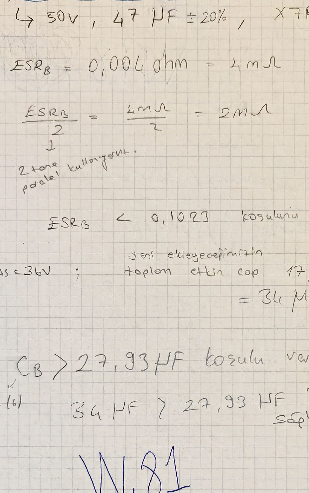

Bu bulk adayini destekleyen arac / datasheet ekran goruntuleri de burada kaliyor:


Sayfada okunan ana notlar sunlar:

- tek kapasitör icin:
$$
V_{rating} = 50\,V,\qquad C_{nom} = 47\,\mu F
$$
- tek kapasitör `ESR` notu:
$$
ESR_B \approx 0.004\,\Omega = 4\,m\Omega
$$
- `2 tane paralel` kullanim icin esit dagilim varsayimiyla:
$$
ESR_{B,\text{eq}} \approx \frac{4\,m\Omega}{2} \approx 2\,m\Omega
$$

Sayfada, onceki bulk kosuluyla karsilastirma da acikca yazilmis:

$$
ESR_B < 0.1023
$$
ve bu kosulun saglandigi not edilmis.

Buradaki `0.1023 ohm` esigini `W.40`ta gecen eski `0.991 ohm` sanity check ile karistirmamak gerekiyor. `0.1023 ohm`, sonraki `W.91` tarafinda `V_{IN-tran}=0.36 V`, `I_{step}=5.429 A` ve `D_{\max}\approx0.6481` ile daha guncel / daha siki yazilan transient `ESR_B` siniri gibi duruyor. `2 mOhm` paralel aday bu iki sinirin de cok altinda; ama bu sadece ani `ESR` dususu tarafini rahatlatir. Frekansa bagli empedans, damping, akim paylasimi ve yerlesim yine ayri kontrol kalir.

Ardindan `DC Bias = 36 V` altinda bu kapasitörlerin etkin kapasitesi kontrol edilmis. Sayfada:

- tek kapasitör icin etkin kapasite:
$$
C_{\text{etkin,tek}} \approx 17\,\mu F
$$
- `2 adet` icin toplam etkin kapasite:
$$
C_{B,\text{toplam}} \approx 17\,\mu F \times 2 \approx 34\,\mu F
$$

Bu gorsellerin birlikte verdigi ek dayanak su:

- `p76`, `36.3 V` civarinda tek bulk parcasi icin `17.013 uF` okundugunu acikca gosteriyor; bu, defterdeki `17 uF` ara degeriyle neredeyse birebir uyumlu
- `p77`, tek parca icin `0.3 MHz` civarinda `ESR \approx 4 m\Omega` buyuklugunu dogrudan destekliyor
- `p78`, bunun `47 uF`, `50 V`, `X7R` sinifinda secilmis bir bulk aday oldugunu gosteriyor
- `p80` ise bu bulk MLCC'nin empedansinin frekansa gore nasil degistigini gostererek, neden yine de yuksek frekansta yardimci MLCC'lerle birlikte dusunulmesi gerektigine dair frekans-sezgisini guclendiriyor

ve onceki sayfadan gelen gereksinim ile karsilastirma:

$$
C_B > 27.93\,\mu F
$$
olup,

$$
34\,\mu F > 27.93\,\mu F
$$
sonucuyla bu kosulun da saglandigi yazilmis.

Burada iki kapasite dili yan yana duruyor: `W.80`teki `~20 uF` acik, ideal `28.4 uF` ihtiyactan bias altindaki `~8.2 uF` MLCC toplamını cikarma hesabi. `W.81`deki `C_B > 27.93 uF` ise bulk tarafina verilen daha korunmaci alt sinir gibi duruyor; bu yuzden `30 uF` sinifinda bir ek banka araniyor. `2 x 47 uF` adayinin bias altinda `~34 uF` vermesi, hem `~20 uF` acigi kapatiyor hem de `27.93 uF` alt sinirinin ustunde kaliyor. Bunu nominal `94 uF` diye degil, bias altindaki etkin `34 uF` olarak okumak gerekiyor.

`W.81`, `W.80`deki soyut bulk kararini gercek bir komponente tasiyor. Burada hem `ESR` kosulu hem de `dc-bias` altindaki etkin kapasite ayni aday parca uzerinden kontrol edilmis. `2 x 47 uF / 50 V / X7R` secimi bu asamada giris tarafindaki eksik kapasiteyi kapatmak icin ana bulk adayi gibi duruyor.

Defterden aktarilan not (`W.82`):

Burada giris kapasitörü bankasi icin bir ozet / kontrol sayfasi var. Sol tarafta toplam secilen etkin kapasitans ile `\Delta V_{IN,PP}` kosulu yeniden kontrol edilmis; sag tarafta ise kullanilabilecek kapasitör bankasi tablo halinde not edilmis.

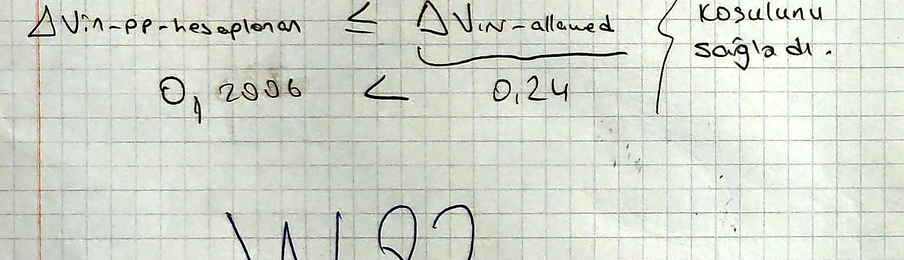

Sol sayfadaki ana hesap su sekilde okunuyor:

$$
\Delta V_{IN,PP,\text{hesap}} \approx \frac{D(1-D) I_{out,\max}} {C_{CE,\text{total}} \, f_{sw}\, (1-TOL)}
$$
Sayfadaki yerlestirmede:

- `D = 0.5`
- `I_{out,\max} = 9 A`
- `f_{sw} = 332 kHz`
- `C_{CE,total} \approx 8.228 uF + 34 uF`
- tolerans / derating carpani olarak `1 - 0.20`

kullanilarak yaklasik:

$$
\Delta V_{IN,PP,\text{hesap}} \approx 0.2006\,V
$$
sonucu yazilmis ve bunun:

$$
0.2006 < 0.24
$$
oldugu, yani `\Delta V_{IN,PP}` kosulunun saglandigi not edilmis.

Sag sayfadaki tabloda ise, giris capacitor bankasi icin birden fazla eleman sinifi birlikte dusunuluyor:

- `MLCC 22 uF / 50 V` sinifinda bir grup
- `MLCC 1 uF + 0.1 uF` gibi daha kucuk yardimci kapasitörler
- `Polymer 100 uF` sinifinda bir eleman

Yan notlarda bunlarin rolleri kabaca su sekilde ayriliyor:

- dusuk `ESR`, ripple tasima
- yuksek frekans bypass
- bulk enerji depolama / damping

`W.82`nin sol tarafi, `W.78-W.81` zincirinden gelen secimlerin toplam ag davranisini kontrol eden ozet sayfa gibi. `0.2006 V < 0.24 V` sonucu, sectigim toplam giris kapasitansi ile `\Delta V_{IN,PP}` kosulunun kapandigini gosteriyor.

Bu sonucu yalnizca steady-state / switching ripple hedefi icin kapanis gibi okuyorum. Formuldeki `C_{CE,total} \approx 8.228 uF + 34 uF` ve `1-0.20` tolerans carpani, bias altindaki toplam etkin kapasiteyi daha korunmaci kullanmaya calisiyor; ama bu tek satir `0.36 V` transient hedefini, bulk-MLCC akim paylasimini, EMI filtresiyle etkilesimi veya layout kaynakli `ESL`/ringing problemini otomatik kapatmiyor. Onlar `W.83-W.91`, `5.5.8` ve `7` numarali bolumle birlikte tekrar bakilacak.

Sag taraftaki tablo biraz daha karisik. `2 x 47 uF` seramik bulk ile `100 uF polymer` notu ayni yerde oldugu icin, o kismi nihai tek BOM satiri gibi degil, alternatif banka / karsilastirma izi gibi okumak daha dogru.

Bu sag tabloyu sol taraftaki sayisal zincirin yerine gecirmiyorum. Sol tarafta aktif kontrol, `8.228 uF + 34 uF` etkin toplamla `0.24 Vpp` hedefinin kapanmasi. Sag taraf ise "hangi tip kapasitör hangi rol icin dusunuluyor?" karalama alani gibi: buyuk MLCC grubu ripple/ana bankaya, `1 uF + 0.1 uF` yardimcilar yuksek frekans bypass'a, `100 uF polymer` ise daha sönümlü bulk alternatifi / karsilastirmasina denk geliyor. Son okuma icin ana aday hala `2 x 47 uF / 50 V / X7R`; polymer satiri alternatif iz olarak kaliyor.

Defterden aktarilan not (`W.83`):

Burada bulk giris kapasitörü icin transient-response tarafi iki ayri kosula ayrilmaya calisiliyor:

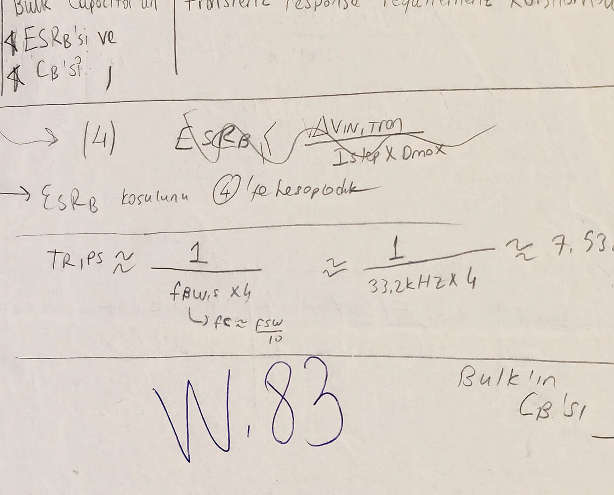

1. `ESR_B` ile ilgili kosul
2. `C_B` ile ilgili kosul

Sayfanin orta kismina, onceki sayfalardan tanidik olan `ESR_B` transient kosulu yeniden yazilmis:

$$
ESR_B < \frac{\Delta V_{IN,tran}}{I_{step}\,D_{\max}}
$$
ve yanina da bu kosulun daha once hesaplandigi not edilmis.

Sayfanin asil yeni katki yapan kismi ise, `C_B` hesabinda kullanilacak zaman olcegini secmeye calismasi. Sayfada:

$$
T_{rip} \approx \frac{1}{f_{BW}\cdot 4}
$$
iliskisi yaziliyor ve `f_c \approx f_{sw}/10` varsayimiyla:

$$
T_{rip} \approx \frac{1}{33.2\,kHz \cdot 4} \approx 7.53\,\mu s
$$
gibi bir ara sonuc not ediliyor.

Sayfanin ust kisminda `undershoot` ve `overshoot` icin kisa sozlu notlar da var; bunlar, ani yuk degisimlerinde gerilimin kisa sureli dusmesi veya yukselmesi durumunu hatirlatan kavramsal notlar gibi okunuyor.

`W.83` son `C_B` sonucunu vermiyor; bulk transient hesabini iki parcaya ayiriyor: ani ilk dusus/yukselis icin `ESR_B`, daha yavas enerji tamponu icin `C_B`. `T_{rip} \approx 7.53 us` secimi de sonraki kapasite hesabinin zaman olcegini veriyor. Bu sayfayi bu yuzden nihai sonuc degil, gecis / kurulum sayfasi gibi tutuyorum.

Defterden aktarilan not (`W.91`):

Burada `W.83`te kurulan bulk transient hesabi daha net ve daha sayisal bir bicimde tekrar ediliyor. Ust kisimda once `ESR_B` kosulu dogrudan yazilmis:

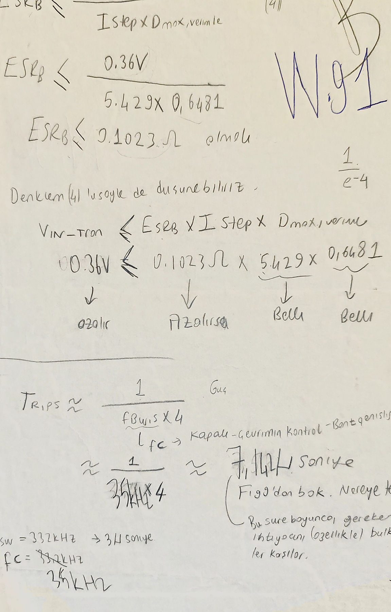

$$
ESR_B < \frac{V_{IN-tran}}{I_{step}\,D_{\max,\text{verimli}}}
$$
Sayfadaki yerlestirmede:

- `V_{IN-tran} = 0.36 V`
- `I_{step} = 5.429 A`
- `D_{\max} \approx 0.6481`

kullanilarak:

$$
ESR_B < \frac{0.36}{5.429 \times 0.6481} \approx 0.1023\,\Omega
$$
sonucu tekrar yazilmis.

Sayfanin orta kisminda bu kosul bir de ters yonden okunmus:

$$
V_{IN-tran} < ESR_B \times I_{step} \times D_{\max}
$$
ve mevcut secimin bu acidan makul oldugu not edilmis.

Sayfanin alt kisminda ise, `T_{rips}` / gecis suresi hesabina geri donuluyor. Bu kez:

- `f_c = 35 kHz`

secimi kullanilarak:

$$
T_{rips} \approx \frac{1}{f_{BW}\times 4} \approx \frac{1}{35\,kHz \times 4} \approx 7.14\,\mu s
$$
sonucu yazilmis.

Sayfadaki kisa notlardan, bu surenin nasil yorumlandigi da onemli:

- bu sure boyunca gereken akimin bir kismini ozellikle bulk kapasitör karsilar
- bu nedenle `C_B` hesabi icin kullanilan zaman olcegi olarak anlamlidir

`W.91`, `W.83`teki ayni iki fikri daha temiz bicimde tekrar ediyor: `ESR_B` ust siniri ve `C_B` hesabinda kullanilacak `T_{rips}` suresi. `f_c = 35 kHz` ile bulunan `7.14 us`, onceki `7.53 us` notunun daha guncel hali gibi okunabilir. Yeni bir nihai `C_B` sonucu vermiyor; bulk transient hesabinin dayanak parametrelerini toparliyor.

Bu yuzden `7.53 us` ve `7.14 us` sayilarini iki farkli tasarim karari gibi ayirmiyorum. Ikisi de `T \approx 1/(4 f_c)` mantiginin ayni ailesi: biri `f_sw/10 = 33.2 kHz` ilk kuralindan, digeri projede daha cok oturan `35 kHz` crossover hedefinden geliyor. Final bulk transient kontrolunde asil onemli olan tek bir mikrosaniye sayisi ezberlemek degil; `~7 us` mertebesindeki enerji tamponu penceresini LTspice load-step ve giris dalga sekliyle birlikte kapatmak.

Defterden aktarilan not (`W.97`):

Burasi oldukca silik; ancak ust kisimdaki kisa notlar okunabiliyor ve `W.91`deki `T_{rips}` dusuncesine alternatif / ek bir zaman olcegi notu veriyor.

Guvenle okunabilen ana not su:

- `f_c = 33.2 kHz`

icin, bir zaman olcegi olarak:

$$
\tau \approx \frac{1}{2\pi f_c} \approx \frac{1}{2\pi \cdot 33.2\,kHz} \approx 4.8\,\mu s
$$
gibi bir sonuc not edilmis.

Sayfanin hemen yanindaki kisa notlarda ayrica:

- `L = 6.8 uH`
- `\Delta I_L \approx 3.8 A`
- `I_{step} \approx 5.429 A`

benzeri onceki sayfalardan tanidik buyukluklerin tekrar yazildigi goruluyor.

`W.97`, `W.91`deki `T_{rips} \approx 1/(4f_c)` yaklasimina alternatif olarak bu kez `1/(2\pi f_c)` tipi bir zaman sabiti dusunuyor olabilir. Sayfa silik oldugu icin elde net kalan kisim `f_c = 33.2 kHz -> 4.8 us` iliskisi. Burada kesinlestirdigim sey bir final sure degil; ayni gecis icin birden fazla yaklasim denendigini gosteren bir iz.

Bu `4.8 us` degeri, `W.91`deki `~7 us` penceresini iptal eden yeni ana sure gibi okunmamali. `1/(2\pi f_c)` daha cok birinci-derece zaman sabiti sezgisi, `1/(4f_c)` ise load-step icin kullandigim daha pratik enerji penceresi gibi duruyor. Benim icin buradaki degerli iz, bulk hesabinin tek bir sureye kilitlenmedigi; `4.8-7.5 us` araliginda duyarlilik kontrolu gerektirdigi. Finalde hangi pencerenin yeterli oldugu LTspice load-step ve giris `Vin` dalga sekliyle kapanacak.

Defterden aktarilan not (`W.92`):

Burada yine bir kaynak / uygulama-notu figuru uzerine alinmis kisa bir not var. Uzerindeki yazilar, `\Delta V_{OUT}` ve ripple bileşenlerinin hangi parcalardan geldigini ayirma amacini tasiyor.

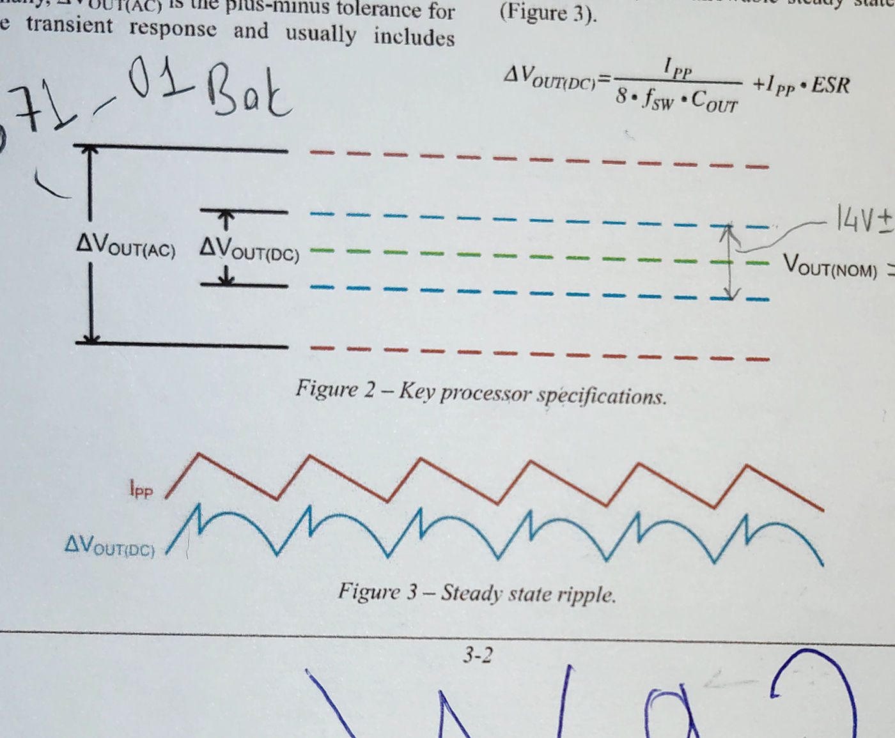

Sayfadaki basili ifade su tip bir iliskiyi gosteriyor:

$$
\Delta V_{OUT(pp)} \approx \frac{I_{pp}}{8\,f_{sw}\,C_{OUT}} + I_{pp}\,ESR
$$
Sayfa uzerine dustugum notta ise:

- `Vout(non) = 14 V`
- `1V + opamp static reg`

gibi bir hatirlatma var. El yazisi tam net olmasa da, sayfanin ana mesaji su sekilde okunuyor:

- toplam gerilim sapmasi tek bir mekanizmadan gelmiyor
- kapasitif terim ile `ESR` terimi ayrilarak dusunulmeli
- steady-state ripple ile regülasyon / statik hata ayni sey degil

Bu, bulk transient sayfalarindaki su ayrimla da uyumludur:

- ilk hizli sapmalar `ESR` etkisiyle buyuyebilir
- daha yavas ve genis zaman olcekli sapmalar ise kapasite / enerji tamponu etkisiyle ilgilidir

`W.92` yeni bir sayisal komponent secimi vermiyor; burada asil kalan sey, `ESR` ve kapasitif terimi ayirma aliskanligini kaynak figuru uzerinden gostermesi. Ozellikle `W.88-W.91` hattinda "gerilim sapmasinin farkli fiziksel bilesenleri var" dusuncesini kisa bir notla pekistiriyor.

Bu sayfa sembol olarak `VOUT` ve `COUT` kullandigi icin, ilk bakista cikis kapasitörü bolumune aitmis gibi duruyor. Burada tutmamın nedeni yeni bir `COUT` karari degil; giris bulk/transient hesabinda da ayni ayrimin gerekli olmasi. Yani `W.92`, "sapma = sadece kapasite eksigi" diye okumamami saglayan bir kaynak notu: once `ESR`/hizli dusus, sonra kapasite/enerji penceresi, en sonda da regülasyonun geri toparlamasi.


#### 5.5.8 Acik teknik dogrulamalar


Bu bolum, giris kapasitörü tarafini kapatmadan once geriye biraktigim kontrol listesi. Bir kismi artik yukarida ana cizgi olarak kurulmus durumda; bir kismi ise BOM, LTspice ve yerlesimle birlikte tekrar bakilacak. Buradaki amac "hepsi eksik" demek degil; hangi konunun hangi seviyede kaldigini kaybetmemek.

Bu listeyi artik uc seviyede okuyorum: sayisal omurgasi kurulmus maddeler, varsayimi sonradan kontrol edilecek maddeler ve EMI/layout ile birlikte kapanacak maddeler. Boylece giris kapasitörü bolumu tekrar basa sarmiyor; sadece hangi son kontrollerin tasarimi etkileyebilecegini acik tutuyor.

- minimum etkin `Cin` hesabi
  Ana iz: `W.27-W.35` ve `W.82` tarafinda `28.4 uF / 31.1 uF` ilk hesaplari ve toplam etkin ag kontrolu var. Nihai okuma icin bias altindaki gercek toplam kapasiteyle birlikte tutulmali.

- duty'ye bagli gercek `Iin_rms` hesabi
  Ana iz: `4.5-4.6 A_RMS` bandi ana cizgi gibi duruyor; `4.94 A_RMS` ise korunmaci alternatif olarak kaliyor. Tek tek kapasitörlere bolunen akim ve sicaklik artisi ayrica kontrol edilmeli.

- dc-bias ve toleransla duzeltilmis gercek kapasitans
  Ana iz: `5 x 4.7 uF` MLCC grubu katalogda `23.5 uF` gibi gorunse de bias altinda `~8.2 uF` seviyesine iniyor. `2 x 47 uF` bulk adayinda da `34 uF` etkin toplam notu var.

- MLCC basina RMS akim dagilimi
  Ana iz: `4.54 A / 5 = 0.908 A_RMS` kapasitör basina kaba paylasim olarak yazildi. Bu hala esit dagilim varsayimi; layout ve gercek empedans farklariyla tekrar bakilmali.

- sicaklik artisi ve component derating kontrolu
  Ana iz: X7R/X5R notlari, ripple current / sicaklik artisi ekranlari ve `dc-bias` dususu birlikte okunmali. Bu kisim sadece elektriksel `uF` hesabi degil.

- yuksek frekans spike bastirma icin ek kucuk MLCC stratejisi
  Ana iz: `W.86-W.89` tarafinda kucuk paket, dusuk `ESL`, hot-loop'a yakin yerlestirme ve `ringing / spike / EMI` riski birbirine baglandi.

- bulk kapasitör secimi ve damping gerekcesi
  Ana iz: `W.80-W.82` ile MLCC kapasite acigi goruluyor, `2 x 47 uF / 50 V / X7R` bulk adayi ana aday gibi duruyor. `100 uF polymer` notu ayni tabloda gectigi icin alternatif/karsilastirma izi olarak tutulmali.

- EMI filtresi ile birlikte giris aginin son hali
  Bu bolum tam kapanmis degil. Giris kapasitör bankasi, damping, hot-loop yerlesimi ve EMI filtresi `7` numarali bolumle birlikte tekrar birlestirilecek.

Bu listeyi burada birakiyorum cunku bir sonraki ana konu MOSFET secimi ve kayiplar. Giris kapasitörü tarafinda ana omurga var; ama son karar hala yerlesim, EMI ve simulasyonla birlikte teyit edilmeli.


### 5.6 MOSFET secimi ve kayiplar

Bu bolumde MOSFET'i tek bir BOM satiri gibi degil, kayiplar ve dayanım sinirlariyla birlikte okuyorum. Ana aday `CSD18543Q3A` gibi duruyor; ama bu kismi sadece "parca secildi" diye kapatmiyorum. `RDS(on)`, `Qg/Qgd`, `VDS` marji, avalanche/SOA, gate-surme davranisi ve termal taraf ayni zincirin parcalari.

Bu bolumun okuma sirasi benim icin su: once mevcut aday parca ve ilk datasheet parametreleri, sonra dayanım basliklari (`UIS`, avalanche, `SOA`), sonra gate charge / switching hizi, en sonda da kayip ve termal yorum. Bu yuzden asagidaki kaynak sayfalari tek basina final kayip hesabi degil; MOSFET secimini hangi risklerle birlikte tuttugumu gosteren defter izi.


#### 5.6.1 Mevcut aday parca


Klasorde secilmis MOSFET adayi olarak su parca gorunuyor:

- `BOM/M2_Texas_Instruments_CSD18543Q3A_csd18543q3a.pdf`


Ek not dosyalarinda bu parcaya ait ilk parametre ozeti de bulunuyor:

- $R_{DS(on)} \approx 8.2\,\text{m}\Omega$

- $Q_{g,\text{total}} \approx 16\,\text{nC}$

- $C_{gd} \approx 54\,\text{pF}$

- $Q_{gd} \approx 1.2\,\text{nC}$ yaklasimi

- $V_{\text{drive}} \approx 7.5\,\text{V}$

- $R_{gate} = 2.2\,\Omega$ notu


Bu listeyi ilk parametre karti gibi okuyorum. `8.2 mOhm` degeri ancak `VGS` ve sicaklik kosulu dogruysa kayip hesabina girer; `Qg/Qgd` tarafi ise gate-driver yukunu ve switching zamanlarini belirler. `Rgate = 2.2 ohm` da final hiz / `dv/dt` karari degil, baslangic surme direnci notu. Asil kapanis, `7.5 V` drive, sicakliga gore `RDS(on)`, dead-time / diyot iletimi ve LTspice dalga sekilleriyle ayni tabloda yapilacak.


Bu parcayi su an ana MOSFET adayi gibi okuyorum. Yine de tek basina "nihai kanit" degil; asagidaki defter izleri bu parcanin neden secildigini ve hangi risklerle birlikte okunmasi gerektigini topluyor.


#### 5.6.2 Secim mantigi


Bu tasarimda MOSFET secimi yalnizca dusuk `RDS(on)` aramak degil. Benim notlarda kurdugum temel denge su:

- dusuk `RDS(on)` ile iletim kayiplari azaltilmak istenir

- dusuk gate charge ile switching kayiplari ve surucu yuku sinirli tutulmak istenir

- `332 kHz` gibi orta-yuksek bir frekansta, yalnizca iletim kaybina bakmak yetersizdir

- termal limitler, paket yetenegi ve gercek PCB kosullari birlikte degerlendirilmelidir


Bu parcayi savunurken en az su basliklari birlikte tutmam gerekir:

- `VDS` gerilim marji

- `RDS(on)`

- `Qg`, ozellikle `Qgd`

- termal metrikler ve paket

- guvenli calisma alani ve akim/avalanche sinirlari

Bu secim mantigini bagladigim iki kaynak-foto:

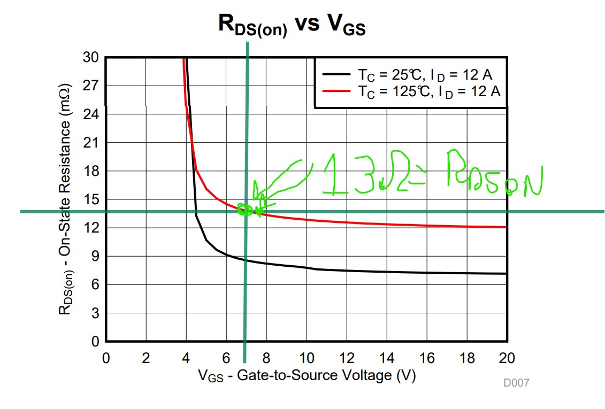

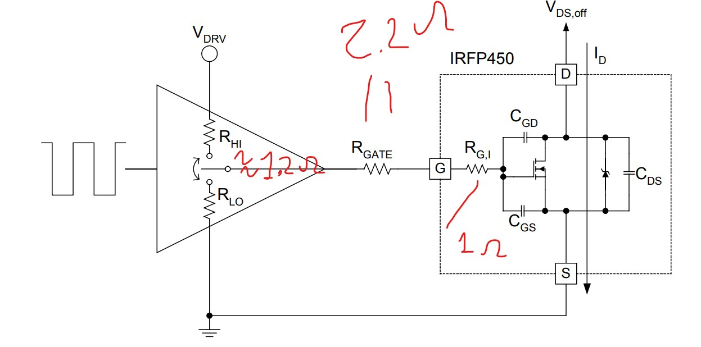

Ilk foto, `V_{GS} \approx 7.5 V` civarinda `R_{DS(on)}`'in hangi mertebede okunmasi gerektigini not ettigim bir datasheet-grafik calismasi. Ikinci foto ise `R_{HI}`, `R_{LO}`, harici gate direnci ve `C_{GD} / C_{GS} / C_{DS}` kapasitanslari uzerinden `dv/dt`, Miller etkisi ve gate-surme hizi dusuncesini nasil kurdugumu gosteriyor.

Ikisi birlikte `5.6.2` altinda secim mantigini gorsel olarak bagliyor.

Defterden aktarilan not (`W.120`):

Burada TI'nin `Understanding MOSFET Data Sheets, Part 1 - UIS / avalanche Ratings` makalesinin ilk sayfasi uzerine alinmis not var. Proje-ozel tekil hesap sayfasi olmaktan cok, MOSFET seciminde avalanche / UIS dayaniminin neden goz ardi edilmemesi gerektigini gosteren bir kaynak-not gibi okunuyor.

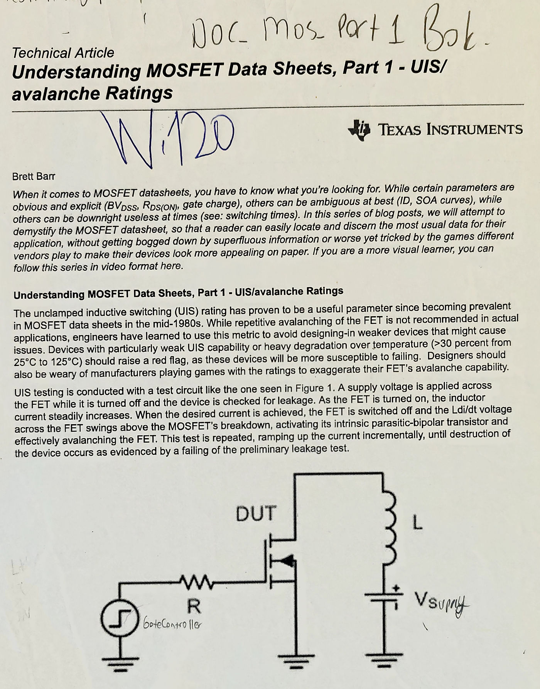

Sayfadaki basili sekil ve notlardan korunacak ana fikirler sunlar:

- `UIS` (unclamped inductive switching) testi, MOSFET'in enduktif enerji bosalimi sirasindaki dayanimini sinar
- cihaz kapatildiginda, enduktif akim devam etmek istedigi icin `VDS` uzerinde yuksek stres olusabilir
- eger bu enerji baska bir yoldan bosaltılamazsa cihaz avalanche bolgesine girebilir

Sayfanin ustundeki not da bu yone gidiyor:

- kayiplar / stres buyurse MOSFET'in daha "rugged" olmasi gerekir
- `UIS test nasil yapilir?` sorusu not edilmis

Burada `5.6.2` altinda gecen `VDS` marji ve `avalanche` sinirlarinin yalnizca teorik basliklar olmadigi, datasheet yorumunda gercek bir dayanim parametresi oldugu goruluyor. Henuz secilen MOSFET icin proje-ozel `EAS` veya UIS marj hesabi yok; ama yuksek `VDS` spike veya layout / snubber yetersizligi durumunda avalanche konusunun secimde goz ardi edilmemesi gerektigi acik kaliyor.


Bu ekran goruntusu, `W.120-W.121` tarafinda kavramsal olarak not edilen UIS / avalanche farkindaliginin secilen MOSFET datasheet'inde de somut bir dayanim kalemi olarak arandigini gosteriyor. Yani burada yalnizca genel teori degil, secilen parcanin gercek datasheet'i de okunuyor.

Defterden aktarilan not (`W.121`):

Burada `W.120`deki UIS / avalanche makalesinin dalga sekli mantigi kendi ciziminle tekrar kuruluyor. Artik yalnizca metin degil, testin nasil isledigine dair zamana bagli sezgi de var.

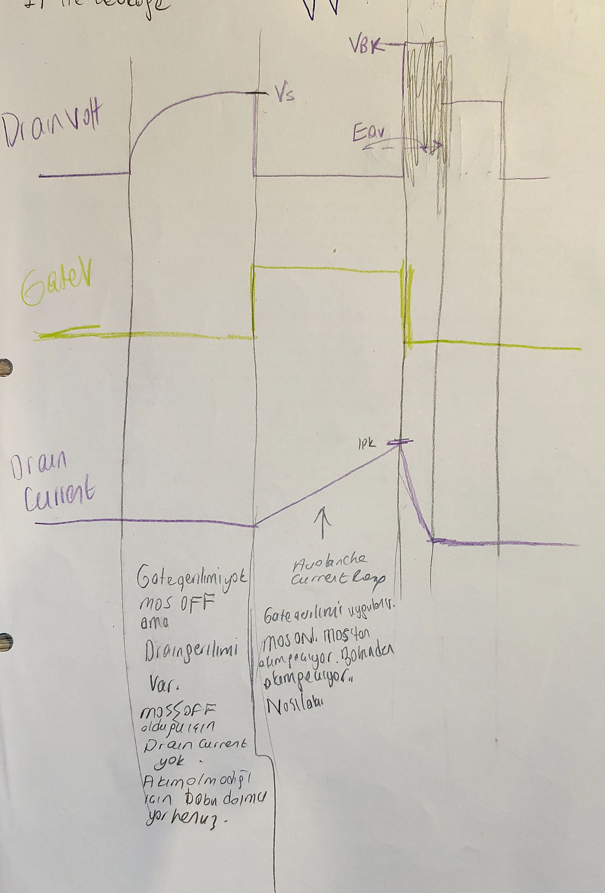

Sayfada uc dalga seklinin birlikte dusunuldugu goruluyor:

- drain gerilimi
- gate gerilimi
- drain akimi

Sayfanin ust kismina dusulen not:

- `UIS test nasil yapilir?`
- `1) pre-leakage`

Sayfadaki cizimden korunacak ana fikirler:

- MOSFET acikken enduktif akim yukselir ve enerji depolanir
- MOSFET kapatildiginda enduktor akimi devam etmek ister
- uygun bosalma yolu yoksa `VDS` hizla yukselir
- bu esnada cihaz avalanche bolgesine girebilir
- test sonunda `pre-leakage` / sonrasindaki leakage davranisina bakilarak cihazin zarar gorup gormedigi anlasilmaya calisilir

Sayfadaki sembolik notlardan:

- `V_{BK}` benzeri breakdown / clamping bolgesine isaret eden not
- `E_{av}` benzeri avalanche enerjisine isaret eden not

Burada `W.120`deki UIS kavrami daha sezgisel hale geliyor; ozellikle drain voltage, gate voltage ve drain current iliskisinin zamanla nasil degistigi goruluyor. Yine proje-ozel sayisal `EAS` hesabi yok, ama "avalanche dayanim" basliginin neden ciddiye alinmasi gerektigini gosteren bir defter cizimi var.

`W.120-W.121` cizgisini normal calismada MOSFET'i avalanche'a sokmak kabul edilebilir gibi okumuyorum. Buradaki niyet daha dar: switch-node spike, hot-loop enduktansi, snubber ihtiyaci veya load dump gibi zorlayici durumda parcanin nasil stres gordugunu unutmamak. Final karar yine once `VDS` spike'i layout ve LTspice ile dusurmek, gerekiyorsa `R_{boot}` / snubber ile kenari yumusatmak, sonra da kalan marji datasheet `EAS` / UIS bilgisiyle kontrol etmek.

Defterden aktarilan not (`W.122`):

Burada TI'nin `Understanding MOSFET Data Sheets, Part 2 - Safe Operating Area (SOA) Graph` makalesinin ilk sayfasi uzerine alinmis not var. Proje-ozel tekil hesap sayfasi olmaktan cok, MOSFET seciminde `SOA` grafiginin neden goz onunde tutulmasi gerektigini gosteren bir kaynak-not.

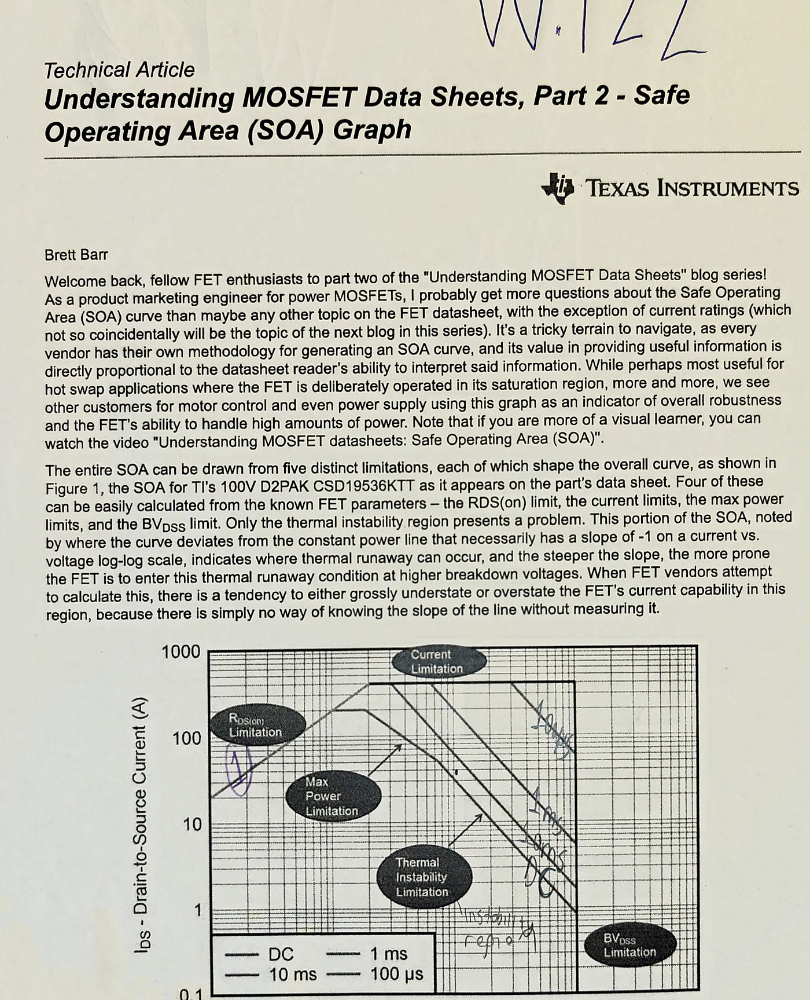

Sayfadaki basili `SOA` grafiginden korunacak ana fikirler sunlar:

- `SOA` grafigi, drain-source gerilimi ile drain akiminin birlikte hangi bolgelerde guvenli kaldigini gosterir
- farkli sureler (`DC`, `10 ms`, `1 ms`, `100 us` gibi) icin farkli sinirlar vardir
- siniri tek bir mekanizma belirlemez; akim limiti, max guc limiti, termal istikrarsizlik ve `BVdss` siniri gibi farkli bolgeler vardir

Ust nottan korunacak ana sezgi:

- belirli bolgelerde MOSFET'in gorebilecegi gerilim ve akim birlikte sinirlanir
- yalnizca tek eksende "max current" veya "max VDS" bakmak yeterli olmaz

Burada `W.120-W.121`deki avalanche / UIS farkindaligina bu kez `SOA` perspektifini ekliyorum. Yani sectigim MOSFET icin sadece `RDS(on)` ve `Qg` degil, gerilim-akim-zaman ucgenindeki guvenli bolge de okunmali.

Proje-ozel sayisal `SOA` yerlestirmesi yok; ama `SOA` grafigini secim mantigina dahil etmem gerektigini hatirlatiyor.

Bu `SOA` notunu da final kayip hesabinin yerine koymuyorum. Daha cok kontrol noktasi listesi gibi duruyor: normal iletimde dusuk `VDS` / yuksek `ID`, anahtarlama gecisinde kisa sureli yuksek `VDS` ve akim cakismasi, startup / akim limit / ariza gibi daha uzun stres durumlari ayni grafikte ayri pulse sureleriyle kontrol edilmeli. Yani `SOA`, `RDS(on)` ve `Qg` kadar "tek sayi" degil; zaman olcegiyle birlikte okunacak bir guvenlik haritasi.

Defterden aktarilan not (`W.123`):

Burada MOSFET'in `I_D - V_{DS}` karakteristiklerini kisa bir eskizle hatirlatiyorum. Proje-ozel nihai hesap sayfasi degil; daha cok `VGS`, lineer bolge ve `RDS(on)` sezgisini canli tutan temel bir defter notu gibi.

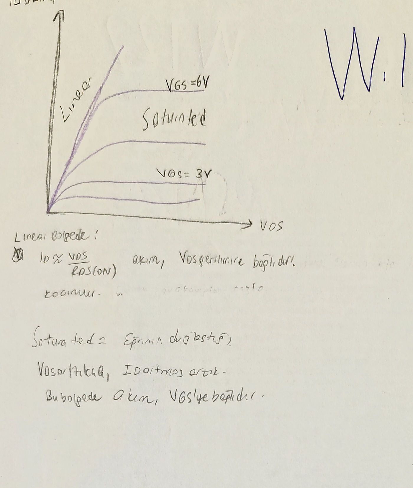

Sayfadaki cizimde:

- yatay eksen `VDS`
- dikey eksen `I_D`
- farkli `VGS` degerleri icin karakteristik egri aileleri gosteriliyor

Ust kisimda özellikle iki gate gerilimi not edilmis:

- `VGS = 6 V`
- `VGS = 3 V`

Sayfadaki notlardan korunacak ana fikirler:

- dusuk `VDS` bolgesinde cihaz lineer / omik bolgeye yakin davranir
- bu bolgede akim, `VDS` ile ve etkin `RDS(on)` ile iliskilidir
- `VGS` arttikca egri yukariya tasinir; yani cihaz ayni `VDS` icin daha fazla akim tasiyabilir
- `saturation` benzeri bolgede ise akim daha cok `VGS` tarafindan belirlenir

Burada `5.1.2`de gecen "dusuk VCC / dusuk VGS -> RDS(on) artar" fikri transistor karakteristigi tarafindan destekleniyor. Ayni zamanda `5.6.2`de MOSFET seciminde neden surme geriliminin ve `RDS(on)` verisinin birlikte okunmasi gerektigini sezgisel olarak acikliyor.

Yeni sayisal secim veya kayip hesabi yok; ama MOSFET davranisini ezber parametre yerine karakteristik egri gozuyla dusunmeye yardim ediyor.

Buradaki `VGS = 3 V` ve `6 V` notlarini proje surme gerilimi gibi okumuyorum. Bunlar karakteristik ailelerin nasil kaydigini gosteren egitim / sezgi izleri. Bu projede asil kapanis `VGS \approx 7.5 V` kosulunda yapiliyor; sonra `W.145-W.146` tarafinda `RDS(on)` bu gercek gate-drive ve sicaklikla yeniden okunuyor. Yani `W.123`, sayisal kayip hesabi degil, `RDS(on)` neden tek katalog satiri degil sorusuna giden kavramsal kopru.


Bu ekran goruntusu, `W.123`te cizgisel olarak anlatilan `I_D - V_{DS}` ailelerini secilen MOSFET datasheet'i uzerinden tekrar gormemi sagliyor. Ozellikle farkli `V_{GS}` seviyelerinde ayni `V_{DS}` icin tasinabilen akimin nasil degistigi ve "gercek surme gerilimine gore okumak" gerektigi daha somut hale geliyor.

Defterden aktarilan not (`W.178`):

Burasi `G88 A5 dv/dt Limit` konusuna giris yapan kavramsal bir defter sayfasi. Yeni bir nihai kayip hesabi degil; yuksek `dV/dt` nedeniyle MOSFET'in kendiliginden / istenmeden acilabilmesi problemini tanimliyor.

Sayfanin ust kisminda sorunu kendi cümlelerimle ozetliyorum:

- drain-source gerilimi cok hizli arttiginda
- yani yuksek `dV/dt` oldugunda
- MOSFET kendiliginden acilabilir
- yani gate'e bilerek `V_{GS}` uygulamadan da iletime gecme riski vardir

Ortadaki cizimde bu problem icin kullanilan temel parasitik model cizilmis:

- `C_{GD}` (Miller kapasitansi)
- `C_{GS}`
- `C_{DS}`
- gate yolunda bir `R_{G,int}` benzeri direnc

Bu cizim, hizli degisen `V_{DS}` geriliminin `C_{GD}` uzerinden gate dugumune tasinabilecegini ve orada istenmeyen bir `V_{GS}` olusturabilecegini sezgisel olarak gosteriyor.

Sayfanin altindaki kisa not da sunu soyluyor:

- bu konu toplamda `3` senaryo halinde incelenecek

Yani burada, sonraki `W.125-W.127` notlarinda gelecek olan:

- `dV/dt` limit hesabi
- kaba `dV/dt` ust siniri
- Miller kaynakli yanlis tetiklenme kontrolu

gibi alt basliklarin kavramsal girisi olarak okunmalidir.

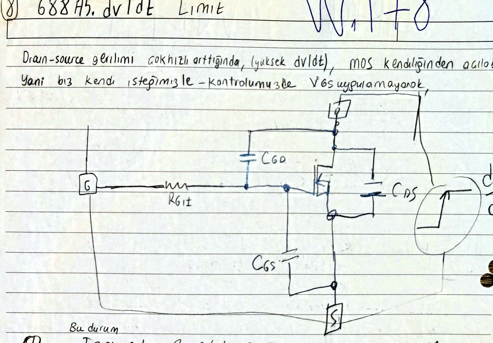

Burada yeni sayisal sonuc yok; ama `W.125-W.127` zincirinin asil fiziksel problemini tarif ediyorum: hizli `V_{DS}` degisimi, `C_{GD}` uzerinden gate'e enjekte olup MOSFET'i istemeden acabilir. Bu sayfa bu yuzden sonraki Miller / `dV/dt` kontrollerinin girisi gibi duruyor.

Buradaki `dV/dt limit` notunu "anahtarlama yavas olmali" gibi tek tarafli okumuyorum. Hedef hala kaybi makul tutacak kadar hizli anahtarlama; ama karsi MOSFET'in gate'ine Miller uzerinden istenmeyen gerilim tasinmayacak kadar da kontrollu kenar. Bu nedenle bu hat, gate direnci, surucunun pull-down yolu, common-source inductance ve layout parasitikleriyle birlikte okunacak bir guvenlik kontrolu.

Defterden aktarilan not (`W.179`):

Burada `W.178`te kavramsal olarak tanimlanan problemin gate dugumunde nasil bir `V_{GS}` olusturdugu daha acik bicimde formullestiriliyor. Yeni bir nihai kayip hesabi degil; `C_{GD}` ve `C_{GS}` uzerinden olusan kapasitif bolucunun istenmeyen turn-on riskine nasil donustugunu gosteren ara bir sayfa.

Sayfanin ust kisminda su problemi sozel olarak yazdim:

- bazen bir MOSFET digerini etkileyebilir
- MOS'un gate'ine bilerek gerilim uygulanmasa bile
- `C_{GD}` / `C_{GS}` kapasitif yolu yuzunden bir `dV/dt` piki gate'de gerilim olusturabilir

Sayfanin ortasinda bu fiziksel mekanizma, kapasitif bolucu sezgisiyle yaziliyor. Okunabildigi kadariyla kullanilan temel iliski su:

$$
V_{GS} \approx V_{DS}\,\frac{C_{GD}}{C_{GS}+C_{GD}}
$$
Sayfada bunun hemen altina da kritik kontrol notu yaziliyor:

- bu denklemden gelen `V_{GS}` degeri
- MOSFET'in threshold gerilimini asarsa
- istenmeyen / parasitik turn-on olusabilir

Yazdigim kisa kontrol ifadesi bu mantigi ozetliyor:

$$
V_{DS,max}\,\frac{C_{GD}}{C_{GS}+C_{GD}} < V_{TH}
$$
ya da ayni anlamda:

- `V_{DS}` ne kadar hizli ve buyuk degisirse
- `C_{GD}` ne kadar buyukse
- gate tarafinda olusan istenmeyen gerilim o kadar buyur

Sayfanin alt kisminda ayrica gate surucusu ve direncli ne olursa olsun, yuksek `dV/dt` etkisinin:

- gate surucusunu
- MOSFET'in kendisini
- ve dinamik davranisi

etkileyebilecegi; yani sadece "statik bir threshold karsilastirmasi" olmadigi not edilmis.

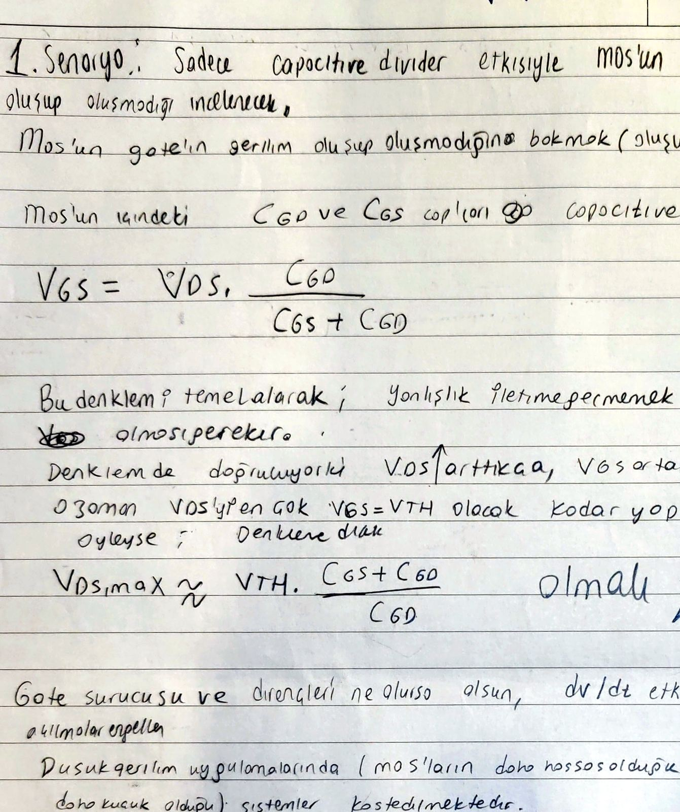

Burada `W.178`de baslatilan problem tek bir denklemle gorunur hale geliyor. Ayni zamanda `W.127`deki Miller kaynakli istenmeyen tetiklenme notunun daha erken ve daha sade anlatilmis bir versiyonu gibi okunabilir.

Bu denklemi tam gate-driver modeli gibi degil, ilk kapasitif bolucu / charge-sharing sezgisi gibi tutuyorum. Gercek devrede `C_{GD}` ve `C_{GS}` gerilime bagli degisir, surucunun pull-down yolu gate'i tutmaya calisir, `V_{TH}` sicaklik ve akima gore kayar, layout'taki common-source inductance da gate-source gerilimine eklenebilir. Bu yüzden `W.180-W.184` arasindaki farkli kapasite setleri birbiriyle kavga eden final sonuclar degil; ayni yanlis turn-on riskine hangi varsayimla baktigimi gosteren duyarlilik izleri.

Defterden aktarilan not (`W.180`):

Burada `W.179`da yazilan kapasitif bolucu iliskisi, proje sayilarindan bazilari yerine konarak hizli bir senaryo kontrolune tasinmis. Yeni nihai kayip hesabi degil; istenmeyen turn-on riskinin buyukluk mertebesini yoklayan bir ara sayfa.

Sayfanin ust kisminda okunabildigi kadariyla:

- `1. senaryo`
- `V_{DS} = 22 V`
- `C_{rss} = 6 pF`
- `C_{oss} = 200 pF`

notlari yer aliyor.

Ardindan, parasitikleri birbirinden ayirmaya calisiyorum. Guvenle okunabilen iliskiler sunlar:

$$
C_{gd} \approx C_{rss} \approx 6 pF
$$
$$
C_{ds} \approx C_{oss} - C_{gd} \approx 200 pF - 6 pF = 194 pF
$$
Sayfada ayrica `C_{iss}` tarafindan `C_{gs}`'yi ayirmaya calisan bir satir da var. Okunabildigi kadariyla ben:

- `C_{iss} \approx 1100 pF`

gibi bir deger alip

$$
C_{gs} \approx C_{iss} - C_{gd} \approx 1094 pF
$$
sonucuna gidiyor.

Ardindan `W.179`daki esitligin tersine cevrilmis hali gibi duran bir kontrol yaziliyor:

$$
V_{DS,max} \lesssim V_{TH}\,\frac{C_{gs}+C_{gd}}{C_{gd}}
$$
Bu, su anlama geliyor:

- `C_{gd}` kucuk
- `C_{gs}` buyukse
- ayni `V_{DS}` degisiminden gate dugumune tasinan gerilim kucuk kalir

Sayfanin altindaki sonuc satiri tam net okunmasa da, genel mesaj su:

- bu senaryoda bulunan limit, devrede gorulen `22 V` seviyesinin oldukca uzerinde
- yani ben bu kontrolu "Miller kaynakli kendiliginden turn-on acisindan rahatlik var" seklinde yorumluyorum

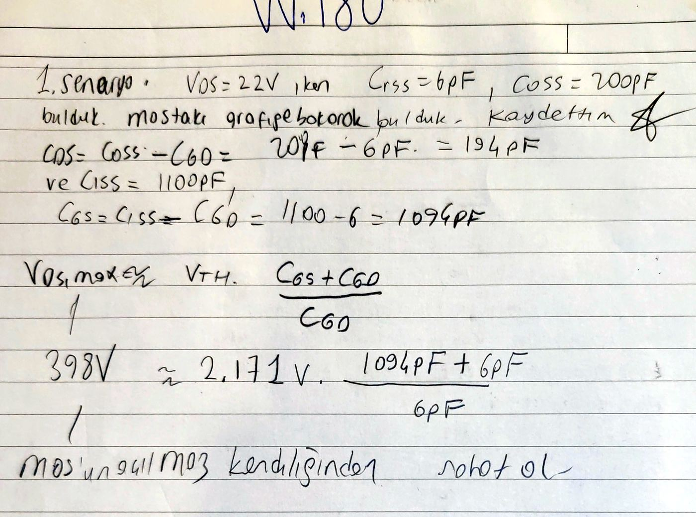

Burada `W.179`daki iliskinin soyut kalmadigi; sectigim MOSFET'in parasitikleriyle ilk kaba sayisal kontrol yaptigim goruluyor. `C_{iss}` satirindaki rakam ve en alttaki nihai limit tam net okunmadigi icin burada kesin son sayi yerine iliski ve buyukluk sezgisini korumak daha dogru.

Burada kalan ana mesaj: `C_{gd}` kucuk, `C_{gs}` buyukse yanlis turn-on riski azalir.

Bu sayfadaki `C_{rss} = 6 pF` okumasini daha iyimser / uyarlanmis kucuk-kapasite senaryosu gibi tutuyorum. Yani buradan cikan "rahatlik var" yorumu, sadece bu kapasite modeli icin gecerli ilk yoklama. Daha sonra `W.184`teki daha buyuk `C_{GD}` kabulunun ayrica durmasi bu yuzden anlamli: ayni Miller problemi, hangi datasheet noktasini veya hangi ortalama kapasiteyi sectigime gore tekrar kontrol edilmeli.

Defterden aktarilan not (`W.181`):

Burada `W.178`te not edilen "3 senaryo" fikrinin `2. senaryo` sayfasi var. Odak yine `dv/dt` kaynakli yanlis turn-on riski; ama bu kez onceki kapasitif bolucu esitligi yerine, gate yolunun daha sert / hizli bir limiti uzerinden kaba bir ust-sinir kontrolu yapiliyor.

Sayfanin ustunde okunabildigi kadariyla su iliski yaziliyor:

$$
\left(\frac{dV}{dt}\right)_{N\text{-}limit} \approx \frac{V_{TH}}{R_{Gi}\,C_{GD}}
$$
Burada sayfada guvenle okunabilen ara notlar sunlar:

- `2. senaryo`
- `R_{Gi} \approx 0.7\,\Omega` (`typical` notu dusulmus)
- `C_{GD} \approx 6 \times 10^{-12}\,F`

Sayfadaki sayisal yerlestirme, okunabildigi kadariyla, su yone cikiyor:

$$
\left(\frac{dV}{dt}\right)_{N\text{-}limit} \approx \frac{2.41\,\text{V}} {0.7\,\Omega \cdot 6 \times 10^{-12}\,\text{F}} \approx 5.7 \times 10^{11}\,\text{V/s}
$$
Sayfanin sag tarafindaki not da, bu sonucun:

- "cok yuksek" bir sinira isaret ettigini
- dolayisiyla kendi buck tasarimindaki `dv/dt`'nin bunun oldukca altinda oldugunu
- bu yuzden bu senaryoda kendiliginden acilmanin beklenmedigini

dogrudan bunu anlatiyor.

En alttaki kisa yorum da, eger bu tur bir sinir sorun olacak kadar dusuk ciksaydi:

- `clamp`
- `snubber`

  gibi ek onlemlerin de dusunulebilecegine isaret ediyor.

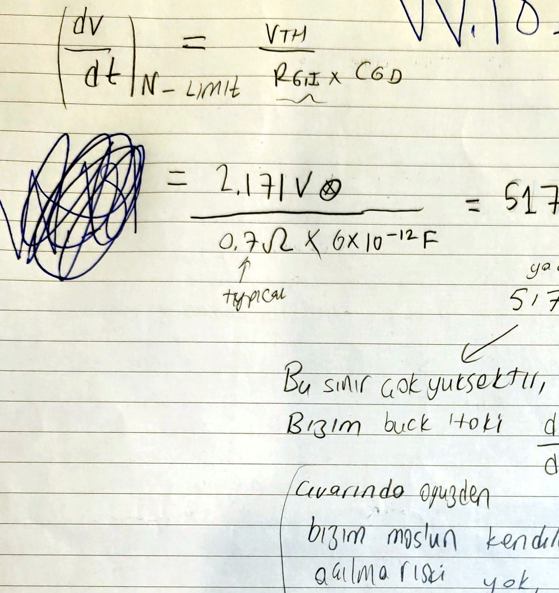

Burada `W.125-W.126`daki kaynak-not `dv/dt` fikirlerinin proje baglaminda ikinci bir senaryo ile yoklandigi goruluyor. Sonucun birimi ve nanosaneye cevrilmis hali tam net degil; o yuzden burada kesin nihai deger yerine buyukluk mertebesini korumak daha dogru.

Ana mesaj su: bu senaryoda bulunan `dv/dt` limiti oldukca yuksek ve yorum "yanlis turn-on acisindan rahatlik var" yonunde.

`W.181`i bu yuzden daha cok ust-sinir / ilk rahatlik kontrolu gibi okuyorum. Sadece `R_{Gi}` ve kucuk `C_{GD}` ile yazildigi icin, gercek gate yolundaki harici gate direnci, driver sink direnci ve layout parazitlerini henuz tam icermiyor. "Cok yuksek limit" sonucu iyi bir isaret; ama asil daha guvenli okuma `W.182-W.183`te gate yolu eklenince, `W.184`te de daha korumaci kapasite setiyle tekrar bakilinca olusuyor.

Defterden aktarilan not (`W.182`):

Burada `W.181`deki daha sade `dv/dt` limitinin fiziksel olarak nasil olustugu aciklaniyor ve gercek devre yolu biraz daha ayrintili gosteriliyor. Yeni bir nihai sayisal sonuc sayfasi degil; `C_{GD}` uzerinden enjekte olan akimin gate yolundaki direncler uzerinde nasil `V_{GS}` olusturdugunu anlatan turetim / fiziksel aciklama sayfasi.

Sayfanin ustunde, onceki `dv/dt` limitine benzeyen ama bu kez daha gercekci gate yolu ile yazilmis su iliski okunuyor:

$$
\left(\frac{dV}{dt}\right)_{limit} \approx \frac{V_{TH}} {\left(R_{Gi}+R_{Gext}+R_{LO}\right)\,C_{GD}}
$$
Sayfanin orta kismina dogru yazilan fiziksel aciklama zinciri de, okunabildigi kadariyla, su yone cikiyor:

$$
I_{CGD} = C_{GD}\,\frac{dV_{DS}}{dt}
$$
ve bu akimin gate yolundaki direncler uzerinde bir gerilim olusturdugu not ediliyor:

$$
V_{GS} = I_{CGD}\,\left(R_{Gi}+R_{Gext}+R_{LO}\right)
$$
Sayfanin sag ve alt tarafindaki notlar, ana fiziksel mesaji acik bicimde veriyor:

- `V_{DS}` cok hizli artarsa
- `C_{GD}` uzerinden gate tarafina bir akim gonderilir
- bu akim, gate yolundaki direncler uzerinde bir gerilim olusturur
- eger olusan `V_{GS}`, `V_{TH}`'yi asarsa MOSFET yanlislikla acilabilir

Sayfada ayrica bu ifadenin:

- "gercek devre kosullariyla"
- MOSFET'in `dv/dt` ile istenmeyen acilmamasi icin gerekli siniri verdigi

yone bir not da bulunuyor.

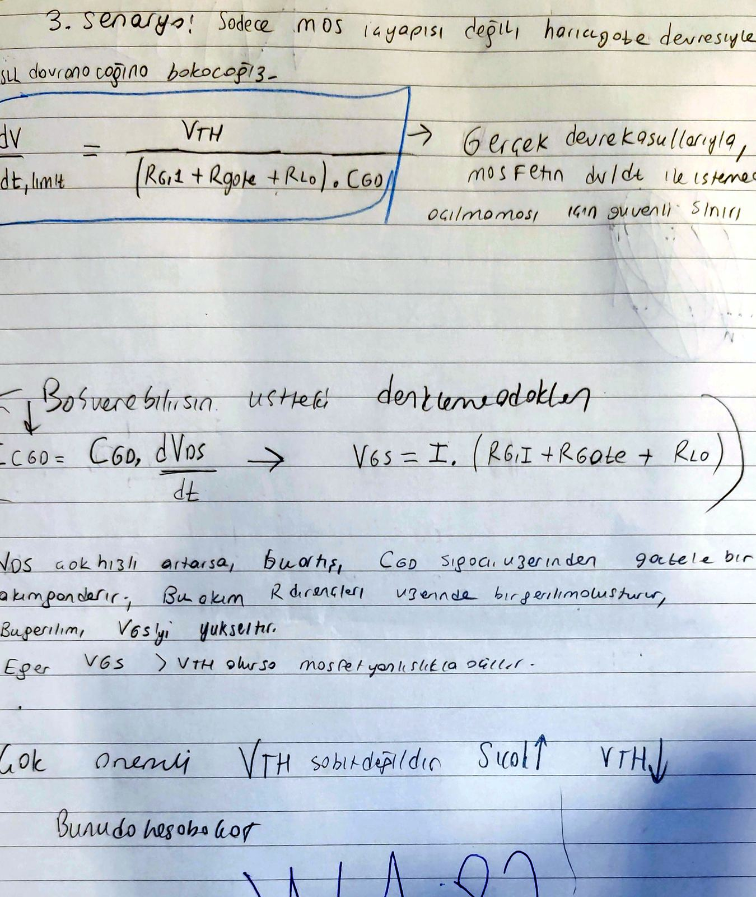

Burada `W.179`daki kapasitif bolucu sezgisi ile `W.181`deki hizli `dv/dt` limitinin arasina fiziksel bir kopru konuyor. `R_{LO}` ifadesi sayesinde surucunun pull-down yolunun da bu problemde rol oynadigi goruluyor. Ustteki baslik satirinin tamami tam net okunmasa da, ana mesaj acik: `C_{GD}` akimi gate yolunda gerilim olusturur ve bu gerilim `V_{TH}`'yi gecerse yanlis turn-on olur.

Defterden aktarilan not (`W.183`):

Burada `W.182`de yazilan fiziksel `dv/dt` limiti bu kez daha pratik bir gate direnci secimiyle sayisal olarak yoklaniyor. Yeni bir LTspice ya da kayip sonucu degil; gercekci gate yolu degerleriyle Miller kaynakli yanlis turn-on riskini kontrol eden ara not.

Sayfanin ustunde ayni iliski tekrar yaziliyor:

$$
\left(\frac{dV}{dt}\right)_{limit} \approx \frac{V_{TH}} {\left(R_{Gi}+R_{Gext}+R_{LO}\right)\,C_{GD}}
$$
Bu kez sayfada guvenle okunabilen daha pratik secim notlari da var:

- `R_{Gext} \approx 0.5 - 1\,\Omega` araliginda dusunulmus
- `R_{LO-driver}` icin `low-side resistance = 0.9\,\Omega` not edilmis
- `C_{GD} = 6\,pF`
- `V_{TH} = 2.172\,V`

Sayfadaki sayisal yerlestirme, okunabildigi kadariyla, su yone cikiyor:

$$
\left(\frac{dV}{dt}\right)_{limit} \approx \frac{2.172\,\text{V}} {\left(1\,\Omega + 0.9\,\Omega\right)\cdot 6\,\text{pF}} \approx 190.6 \times 10^{9}\,\text{V/s}
$$
Bu da:

$$
\approx 190.6\,\text{V/ns}
$$
mertebesine karsilik geliyor.

Sayfanin altindaki not, bu sonucun pratik yorumunu da veriyor:

- bu sinir "nanosecond" mertebesinde cok yuksek
- dolayisiyla kendi buck tasarimindaki gercek `dv/dt` bunun oldukca altinda kalir
- bu senaryoda MOSFET'in kendiliginden acilmasi beklenmez

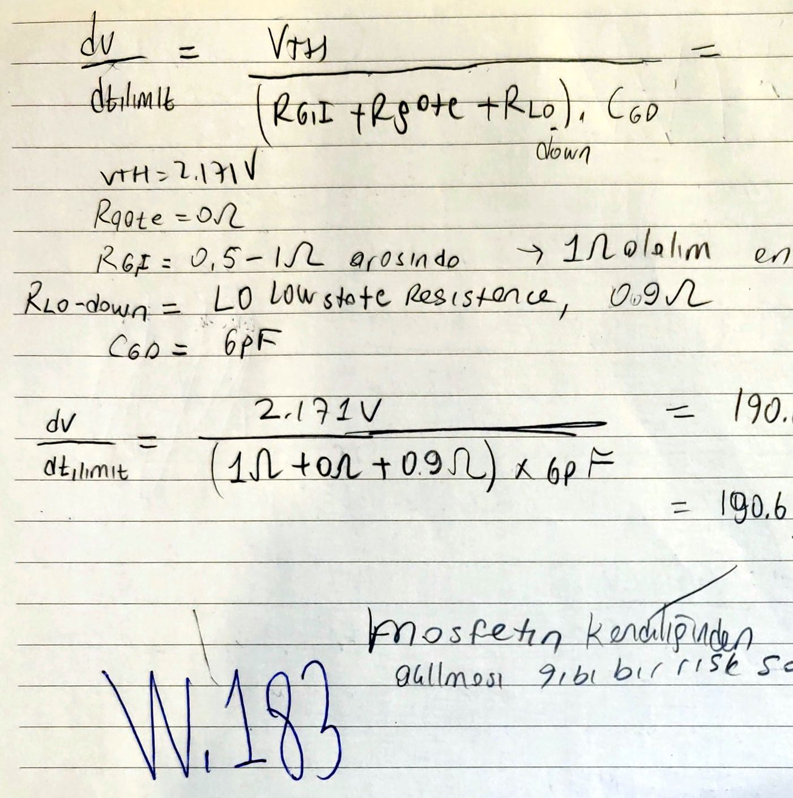

Burada `W.181`deki daha soyut ikinci senaryo hesabi gercekci gate yolu degerleriyle daha okunur hale geliyor. `R_{Gext}` icin bir aralik dusunulup sonra `1\,\Omega` ile ornek kontrol yapildigi gorunuyor; yani tek bir ezber sayi degil, gate yolu icin bir bant dusunuyorum. Bende kalan mesaj su: pratik gate yolu direnci eklendiginde bile bulunan `dv/dt` limiti oldukca yuksek kaliyor.

Bu `190.6 V/ns` degerini gercek switch-node olcumu gibi degil, `C_{GD}=6 pF` ve `R_{Gext}=1 ohm` ornegiyle bulunan rahat bir ust-sinir gibi okuyorum. Final gate yolu secimi sadece yanlis turn-on'a gore yapilmayacak; switching kaybi, `VDS` spike/ringing, EMI, LM5146 surucu akimi ve `R_{boot}` / snubber ihtiyaci ayni masada kalacak. Yani `W.183`, gate yolu eklendiginde de bu senaryoda rahatlik oldugunu gosteriyor; ama tek basina "gate direnci kesin 1 ohm" karari degil.

Defterden aktarilan not (`W.184`):

Burada `W.178-W.183` hattindaki yanlis turn-on / Miller problemi bu kez daha korumaci bir kapasite setiyle tekrar yoklaniyor. Ozellikle `C_{iss}` ve `C_{rss}` tarafinda datasheet'in nominal degerleriyle kontrol yapilmaya calisildigi izlenimi var. Asil mesaj, secilen kapasite modeline gore sonucun ne kadar degisebildigi.

Sayfanin ortasinda, kapasitif bolucu mantiginin bu kez daha buyuk bir datasheet kapasite setiyle yazildigi okunuyor. Okunabildigi kadariyla kullanilan ara sayilar sunlar:

- `C_{iss} \approx 2600\,pF`
- `C_{gd} \approx C_{rss} \approx 340\,pF`

Sayfadaki ara sonuc, okunabildigi kadariyla, su yone cikiyor:

$$
V_{DS,\max} \approx \left(3.157\,\text{V} + 1.34\,\text{V}\right)\, \frac{2600\,pF}{340\,pF} \approx 26.12\,\text{V}
$$
Bu, onceki sayfalardaki daha yuksek `V_{DS,\max}` / `dv/dt` limitlerine gore daha korumaci bir sonuca isaret ediyor.

Sayfanin alt kisminda, ayni konu bu kez `dv/dt` cinsinden de yeniden yazilmaya calisiliyor. Burada tam net okunamayan kisimlar olsa da, ana fikir su:

$$
\left(\frac{dV}{dt}\right)_{limit} \propto \frac{V_{TH} + \Delta V_{GS}} {R_{G,total}\,C_{GD}}
$$
Burada:

- `R_{G,total}` icin daha buyuk / daha gercekci bir toplam gate yolu dusunuluyor
- `C_{GD}` ise onceki sayfalardaki `6\,pF` yerine, daha buyuk bir nominal `340\,pF` degerine yakin aliniyor

Dolayisiyla bulunan sinirin de belirgin bicimde dusmesi bekleniyor.

Sayfanin sag tarafindaki not da, okunabildigi kadariyla, bu tarz kontrolde:

- `dikkat`
- `nominal capacitance` / datasheet nominal kapasite degerleri

gibi bir uyarinin tutuldugunu gosteriyor.

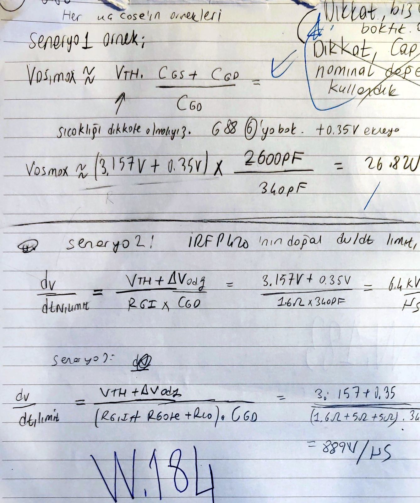

Bu sayfayi bu yuzden tutuyorum: ayni yanlis turn-on problemi, kapasiteyi nasil okuduguma gore baska yere gidiyor. `6\,pF` civari ortalama / uyarlanmis `C_{GD}` ile bulunan yuksek limitler ile, `340\,pF` civari daha korumaci nominal yaklasim arasindaki fark burada acikca gorunuyor.

Alt taraftaki `dv/dt` esitliginin tam son sayisi net okunmadigi icin asil korunmasi gereken mesaj, "daha buyuk nominal kapasite alinirsa sinir daha korumaci cikar" fikri.

Buradaki `26.12 V` sonucunu da kesin bir fail/pass cizgisi gibi kullanmiyorum. `22 V` civari bir `VDS` / switch-node varsayimina yakin oldugu icin bana sunu soyluyor: korumaci kapasite setiyle bakinca margin onceki rahat senaryolar kadar genis degil. Bu nedenle Miller kaynakli yanlis turn-on kontrolu finalde gercek `C_{GD}(VDS)`, gate pull-down yolu, layout ortak-source enduktansi ve LTspice switch-node dalga sekliyle tekrar kapanmali.

Defterden aktarilan not (`W.125`):

Burada `G88` (`Estimating MOSFET Parameters from the Data Sheet`) kaynagindan alinmis kisa bir `dv/dt` dayanim / gate davranisi notu var. Proje-ozel nihai kayip hesabi degil; daha cok MOSFET seciminde ve gate dugumu yorumunda kullanilan bir kaynak notu.

Sayfada goruldugu kadariyla yazilan temel iliski su yone cikiyor:

$$
\left(\frac{dV}{dt}\right)_{limit} \approx \frac{V_{TH}} {C_{GD}\,\left(R_{Gext}+R_{Gint}+R_{pull-down}\right)}
$$
Sayfadaki sayisal yerlestirme de, okunabildigi kadariyla, su tip bir ornege isaret ediyor:

$$
\left(\frac{dV}{dt}\right)_{limit} \approx \frac{3.49\,\text{V}} {\left(17 + 0.90 + 12\right)\Omega \cdot 11\,\text{pF}} \approx 10.64\,\text{V/ns}
$$
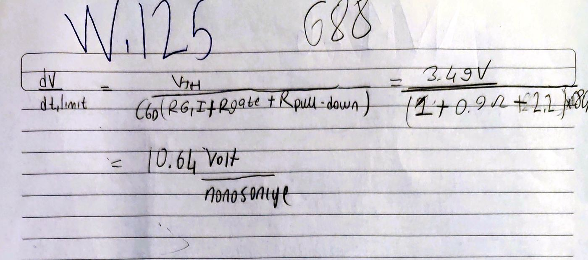

Buradaki not nihai proje dalga sekli veya LTspice sonucu degil; daha cok datasheet parametrelerinden turetilen bir gate `dv/dt` dayanim tahmini. Sayilardan bir kismi kisa yazildigi icin burada ana fikri korumak daha dogru: `C_{GD}` buyudukce ve toplam gate yolu direnci arttikca `dv/dt` davranisi degisiyor. Bu yuzden `5.6.2` altindaki MOSFET secim mantiginda kalmali.

Defterden aktarilan not (`W.126`):

Burada `W.125`teki `dv/dt` notu daha kaba / hizli bir yaklasimla tekrar yazilmis. Proje-ozel nihai dalga sekli veya kayip hesabi degil; MOSFET gate dugumunde `dv/dt` buyuklugunu sezmek icin yapilmis bir kaynak-not.

Sayfada bu kez daha sade bir iliski yaziliyor:

$$
\left(\frac{dV}{dt}\right)_{N\text{-}limit} \approx \frac{V_{TH}}{R_{Gext}\,C_{iss}}
$$
Sayfadaki sayisal yerlestirme, okunabildigi kadariyla, su yone cikiyor:

$$
\left(\frac{dV}{dt}\right)_{N\text{-}limit} \approx \frac{3.49\,\text{V}}{1\,\Omega \cdot 80\,\text{pF}} \approx 4.36\times 10^{10}\,\text{V/s} \approx 43.6\,\text{V/ns}
$$
Sayfanin sag tarafindaki not da, bunun:

- "epey yuksek bir deger" oldugunu
- ve daha dikkatli / bastirilmis anahtarlama istenirse gate yolu uzerinden yonetilebilecegini

ima ediyor.

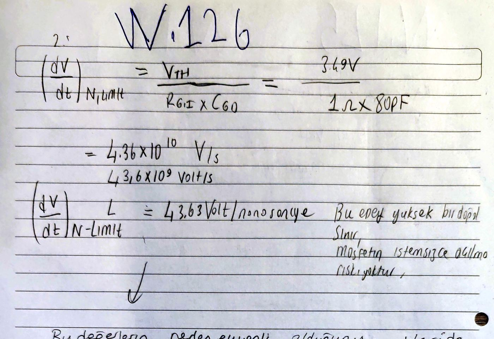

`W.126`, `W.125`teki `C_{GD}` tabanli yaklasima gore daha kaba bir ust-limit notu. Burada kullanilan kapasitenin tam olarak `C_{iss}` mi yoksa benzeri bir giris kapasitansi mi oldugu baglamdan okunuyor; o yuzden sonucu nihai proje sayisi gibi degil, buyukluk mertebesi notu gibi ele almak daha dogru. Bende kalan iz, gate direnci ile MOSFET kapasitanslarini `dv/dt` uzerinden hizlica ayni hesaba sokmam.

`W.125-W.126` sayfalarini `W.181-W.184` hattinin ustune yeni final cevap gibi koymuyorum. Bunlar ayni `G88` yonteminin kaynak/kurcalama izleri: `10.64 V/ns` ve `43.6 V/ns` degerleri, secilen direnç ve kapasite kabulune gore sinirin nasil oynadigini gosteriyor. Finalde bu sayilar tek tek alinmayacak; secilen MOSFET'in `C_{GD}(VDS)` egrisi, LM5146 pull-up/pull-down direncleri, harici gate direnci ve layout parazitleri ayni modelde birlestirilecek.

Defterden aktarilan not (`W.127`):

Burasi, `W.125-W.126` ile ayni `G88` / MOSFET parasitik kapasitans hattinin devami. Ama bu kez odak yalnizca `dv/dt` buyuklugu degil; `C_{GD}` uzerinden gate'e enjekte olan gerilim nedeniyle MOSFET'in istenmeden iletime gecip gecmeyecegini kontrol etmek. O yuzden proje-ozel nihai kayip hesabi degil, Miller etkisi / yanlis tetiklenme sezgisini gosteren bir kaynak-not.

Sayfada once temel kapasitif bolucu iliskisi yaziliyor:

$$
V_{GS} = V_{DS}\,\frac{C_{GD}}{C_{GS}+C_{GD}}
$$
Buradan, gate geriliminin esik degeri asilmadan once izin verilebilecek yaklasik `V_{DS}` ust siniri icin su tip bir iliski not edilmis:

$$
V_{DS,\max} \approx V_{TH}\,\frac{C_{GS}+C_{GD}}{C_{GD}}
$$
Sayfadaki okumaya gore kullanilan ara kapasite notlari sunlar:

- `C_{GD} \approx 80\,\text{pF}`
- `C_{OSS} \approx 700\,\text{pF}`
- `C_{ISS} \approx 1200\,\text{pF}`

ve buradan su ara ayrimlari not ettim:

$$
C_{DS} = C_{OSS} - C_{GD} \approx 620\,\text{pF}
$$
$$
C_{GS} = C_{ISS} - C_{GD} \approx 1120\,\text{pF}
$$
Sayfadaki sayisal sonuc da, okunabildigi kadariyla, su yone cikiyor:

$$
V_{DS,\max} \approx 3.49\,\text{V}\,\frac{1120\,\text{pF}+80\,\text{pF}}{80\,\text{pF}} \approx 52.35\,\text{V}
$$
Sayfanin altindaki not, bunun pratikte su soruyu cevaplamak icin kullanildigini gosteriyor:

- MOSFET kapaliyken (`V_{GS} = 0` varsayimina yakin durumda)
- drain dugumundeki hizli hareketler nedeniyle
- cihaz kendi kendine acilip acilmiyor mu?

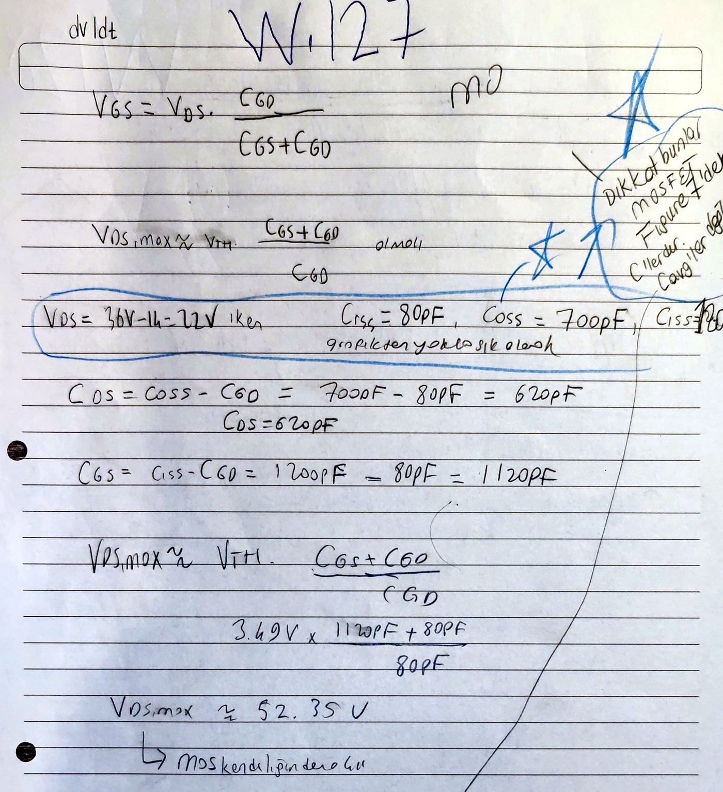

`W.127`, `W.125-W.126` gibi kaynak-not niteliginde; nihai proje dalga sekli ya da LTspice sonucu degil. Burada kalan onemli iz su: parasitik kapasitanslari sadece kayip hesabinda degil, yanlis tetiklenme riski icin de dusunuyorum. `C_{GD}`, `C_{GS}` ve `V_{TH}` ile kurulan kaba `V_{DS,\max}` siniri, yarim kopru davranisinin gate tarafina nasil baglandigini gosteren bir kontrol gibi duruyor.

`52.35 V` sonucunu da tek basina "bu konu kapandi" diye okumuyorum. Buradaki kapasite seti (`C_{GD}\approx80 pF`, `C_{GS}\approx1120 pF`) `W.184`teki `340 pF` kadar korumaci degil, ama `6 pF` senaryosundan daha sert. O yuzden bu sayfa benim icin ara bir nokta: `22 V` civari switch-node/VDS varsayimina gore rahatlik gosteriyor, fakat hangi `C_{GD}` okumasinin kullanildigina cok bagimli. Finalde `W.127`, `W.184` ve `W.129-W.130` kapasitans okumalari ayni `VDS` kosuluna cekilerek birlikte yorumlanmali.

Defterden aktarilan not (`W.131`):

Burada yine `G88` hattindayiz; ama bu kez sayisal hesap yapmaktan cok `C_{GS}`, `C_{ISS}` ve `C_{GD}` (`Miller`) kavramlarini kendi dilimle toparlamisim. Proje-ozel nihai sonuc sayfasi degil; MOSFET'in gate tarafindaki temel kapasitif davranisi anlamak icin yazilmis kavramsal bir kaynak-not olarak okumak daha dogru.

Sayfada ayirdigim ana fikirler sunlar:

- `C_{GS}`:
  - "sabit kabul edilir"
  - `V_{DS}` veya `V_{GS}`'ye gore buyuk degisim gostermeyen taraf gibi not edilmis
- `C_{GS}` icin ayrica:
  - MOSFET'in kanalini kontrol eden kapasitans oldugu
  - yani gate geriliminin once bu bolumu sarj ettigi
- girise gorulen toplam kapasitansin buyuk kismini olusturdugu da not edilmis:

$$
C_{ISS} = C_{GS} + C_{GD}
$$
Sayfanin ortasinda `sonuclari:` diye kisa bir ozet kutusu var. Orada `C_{GS}` buyuk veya kucuk oldugunda ne olacagini kendi cumlelerimle ozetlemisim:

- `C_{GS}` buyukse:
  - gate daha yavas tepki verir
  - daha fazla gate charge gerekir
- `C_{GS}` kucukse:
  - anahtarlama daha hizli olabilir
  - ama acma/kapama davranisi daha hassas kontrol ister

Sayfanin alt kisminda ise `C_{GD}` acikca:

- `Miller`

olarak adlandirilmis ve su sezgi yazilmis:

- gate'e uygulanan gerilim degisince, drain uzerindeki gerilim de etkilenir
- ozellikle anahtarlama sirasinda `V_{DS}` sabit kalir gibi gorunen aralik, bu kapasitif etkilerle iliskilidir


`W.131` yeni sayisal proje sonucu vermiyor. Bende su isi goruyor: `W.125-W.127`deki `dv/dt`, Miller enjeksiyonu ve yanlis tetiklenme notlari daha okunur hale geliyor. Ayni zamanda `W.129-W.130`da kullanilan `C_{GD}`, `C_{GS}` ve `C_{ISS}` degerlerinin neden onemsendigini de geriye donuk olarak aciyor.

Buradaki "`C_{GS}` sabit kabul edilir" notunu da mutlak bir fizik kabulu gibi degil, `C_{GD}`ye gore daha az oynayan taraf sezgisi gibi okuyorum. Datasheet kapasitanslari kucuk-sinyal ve gerilime bagli degerler; bu yuzden `C_{ISS} = C_{GS}+C_{GD}` bagini, final sayi uretmekten cok `W.127`, `W.129-W.130` ve `W.184`te kullandigim kapasitans setlerini ayni dilde okumak icin tutuyorum.

Defterden aktarilan not (`W.133`):

Burada sayisal hesap sayfasindan cok MOSFET secim mantigi kendi dilimde toparlaniyor. Proje-ozel nihai sonuc sayfasi degil; `Qg`, parazitik kapasiteler ve `RDS(on)` arasindaki dengeyi anlatan bir secim notu olarak okumak daha dogru.

Sayfanin ust yarisinda, MOSFET'in parazitik kapasitelerini kisa bir liste halinde not ediyorum:

- `C_{GS}`
- `C_{GD}`
- `C_{DS}`

ve bunlarin anahtarlama davranisini etkiledigini belirtiyor. Ardindan su temel sezgiler yazilmis:

- bu kapasiteler MOSFET'in acilma / kapanma suresini etkiler
- ne kadar buyuklerse MOSFET o kadar yavas anahtarlanir
- hizli anahtarlama istenirse daha dusuk `Q_g` / daha dusuk parazitik yuk tercih edilir
- bu ozellikle yuksek frekansta calisan uygulamalarda daha onemli hale gelir

Sayfanin alt yarisinda, bu kez `RDS(on)` ile `Q_g` arasindaki dengeyi kisa cumlelerle bagliyorum:

- `Q_g` ne kadar buyukse, MOSFET'i acip kapatmak icin o kadar fazla enerji ve zaman gerekir
- ote yandan daha dusuk `RDS(on)` iletim kaybini azaltir
- bu nedenle yalnizca tek bir parametreye bakmak dogru degildir

Sayfada acikca not edilen pratik kural su yone cikiyor:

- `RDS(on) \times Q_g` turu bir "Figure of Merit" kullanimli olabilir
- bu carpim ne kadar kucukse, genel olarak o kadar iyi bir aday olabilir


`W.133`, `5.6.2` altinda zaten kurulan temel dengeyi benim dilimle daha acik soyluyor: dusuk `RDS(on)` tek basina yetmez, `Q_g` ve anahtarlama hizi da onemlidir. Bir bakima `W.131`deki kapasitif sezgiyi `W.129-W.130`daki gate-charge notlariyla ayni hatta topluyor.

Buradaki `RDS(on) x Q_g` FoM notunu da tek basina parca secme kurali yapmiyorum. Bu sadece ilk eleme / karsilastirma kisa yolu. Synchronous buck icinde high-side ve low-side MOSFET ayni rolde calismiyor; duty, dead-time, `Q_{oss}`, `Q_{gd}`, `SOA`, paket/termal yol ve gate-driver sinirlari son kararda yine ayrica masaya gelecek. Bu notun asil isi, "sadece en dusuk `RDS(on)`" refleksini kirmak.

Defterden aktarilan not (`W.144`):

Burada `W.133`te kisa maddeler halinde toparlanan MOSFET secim mantigi bu kez daha toparli yazilmis. Yeni nihai proje hesabi degil; `RDS(on)`, parazitik kapasiteler, `Q_g` ve `Q_{oss}` arasindaki dengeyi kendi dilimde topladigim bir secim notu olarak okumak daha dogru.

Sayfanin ilk maddesinde temel iletim sezgisi yazilmis:

- `RDS(on)`, MOSFET iletimdeyken drain ile source arasindaki direnc gibi dusunuluyor
- bu deger ne kadar dusukse conduction loss o kadar azalir
- dolayisiyla daha az isinma ve daha iyi verim beklenir

Ikinci maddede ise istenmeyen parazitik kapasiteler hatirlatiliyor:

- `C_{gs}`
- `C_{gd}`
- `C_{ds}`

ve bunlarin:

- MOSFET'in acilma/kapanma davranisini yavaslatabilecegini
- gecisleri uzatabilecegini
- dolayisiyla switching loss'u etkiledigini

not ediyor.

Ucuncu maddede asil trade-off sezgisi var. Burada `RDS(on)`'u dusurmek icin:

- daha buyuk MOSFET yapisina
- dolayisiyla daha buyuk die / daha fazla sigalanmaya

gidildigini not ediyor. Hemen ardindan da bunun yan etkilerini yaziyor:

- daha fazla `Q_g` (`Gate Charge`)
- daha fazla `Q_{oss}` (`Output Charge`)

ve bunun da MOSFET'in hizli `on/off` olmasini zorlastirdigini belirtiyor.

Sayfanin sonundaki kisa ozet, secim mantigimi cok net toparliyor:

- dusuk `RDS(on)`:
  - az iletim kaybi
  - ama daha fazla switching kaybi riski
- dusuk `Q_g`, dusuk `Q_{oss}`:
  - daha hizli switching
  - ama daha yuksek iletim kaybi riski

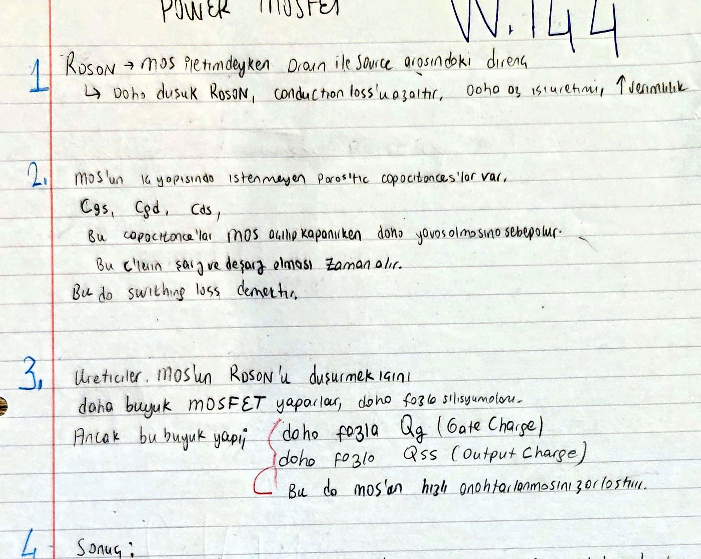

`W.144`, `W.133`teki ayni secim mantigini bu kez daha duz cumlelerle topluyor. `RDS(on)` ile `Q_g/Q_{oss}` arasindaki denge sadece formulle kalmiyor; dogrudan secim cikarimina donuyor. `W.129-W.130`daki gate-charge notlari ile `W.133`teki FoM dusuncesi arasinda da bag kuruyor.

Bu sayfadaki ozet bir egilim notu. Ayni gerilim sinifi ve benzer paket ailesinde genelde dusuk `RDS(on)` daha buyuk die ve daha yuksek `Q_g/Q_{oss}` ile gelir; ama her parca ailesinde birebir ayni oran yok. Bu yuzden `W.144`u final karar tablosu degil, sonraki `W.145-W.146` datasheet kosulu ve `5.6.3` kayip hesaplarini okumak icin secim sezgisi gibi tutuyorum.

Defterden aktarilan not (`W.145`):

Burada secilen MOSFET icin "hangi datasheet kalemlerine hangi kosulda bakmaliyim?" sorusuna kisa bir kontrol listesi var. Yeni nihai kayip hesabi degil; `5.6.2 Secim mantigi` altinda gercek parca seciminde nelere dikkat edilecegini toparlayan kisa bir defter notu olarak okumak daha dogru.

Sayfanin ilk satirlarinda `RDS(on)` icin iki onemli uyari var:

- `T_C = 125^\circ C` dikkate alinmali
- yani `RDS(on)` mutlaka sicaklikla birlikte okunmali

Hemen altindaki notta da kullandigim surucu baglamina gore:

- `LM5146` gate surucusu gerilimi `7.5 V` civarinda oldugundan
- `RDS(on)` degerine bu `V_{GS}` kosuluna yakin bakilmasi gerektigi

yaziliyor.

Sayfanin orta kisminda `BVDSS` icin kisa bir dayanim kurali not edilmis:

- `BVDSS`: drain-source breakdown voltage
- MOSFET'in drain-source arasinda dayanabildigi gerilim seviyesi
- pratik secim kurali:

$$
BVDSS > 1.25 \times V_{in,\max}
$$
Sayfanin alt satirinda ise bir sonraki kontrol kalemi olarak su not dusulmus:

- `Q_g`: gate charge parameters
- ve bunun da

```text
at VGS = 7.5 V
```

kosuluna gore degerlendirilmesi gerektigi belirtilmis.

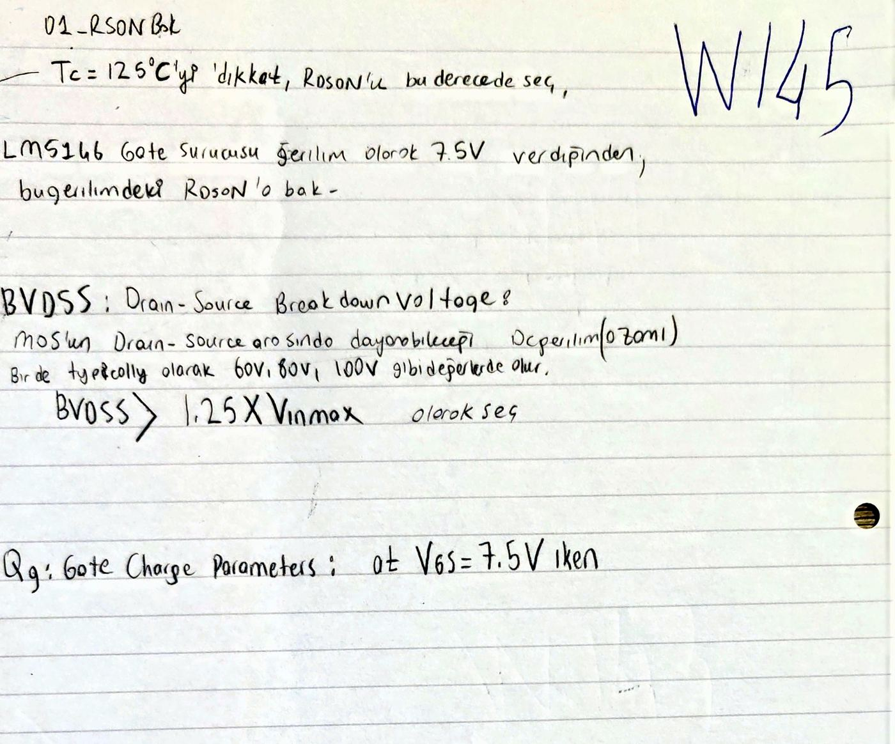

`W.145`, MOSFET seciminde sadece nominal datasheet degerine bakmadigimi acikca gosteriyor. `W.144`teki genel trade-off burada daha uygulanabilir kurallara iniyor: `RDS(on)` icin sicaklik ve `V_{GS} \approx 7.5 V`, `Q_g` icin gercek surme gerilimi, `BVDSS` icin de marjli secim. Bu kisa listeyi bu yuzden burada tutuyorum.

Defterden aktarilan not (`W.151`):

Burada `W.145`te kisa bir secim kurali olarak gecen `BVDSS` maddesi tek basina aciliyor. Yeni bir kayip hesabi degil; `5.6.2 Secim mantigi` altinda secilen MOSFET'in drain-source dayaniminin neden onemli oldugunu toparlayan bir uygulama notu olarak okumak daha dogru.

Sayfanin ustunde konu acikca:

- `BVDSS drain-source voltage`

olarak yazilmis.

Hemen altindaki tanimda, `BVDSS`'i su sekilde ozetliyorum:

- MOSFET'in drain ile source arasinda dayanabilecegi en yuksek gerilim

ve bunun asilmasi durumunda cihazin bozulabilecegini not ediyor.

Sayfanin ortasinda, `V_{in,\max} = 36 V` baglaminda marjli secim gerektigine dair kisa bir not var. El yazisinin bu kismindaki tam ifade cok net degil; ancak korunmasi gereken guvenli fikir sunlar:

- `V_{in,\max} = 36 V` icin yalnizca sinira yakin bir `BVDSS` secmek yeterli gorulmuyor
- marjli / guvenli secim hedefleniyor

Sayfanin en net son cumlesi ise secilen parcaya dair:

```text
Bizim MOS'un BVDSS'i = 100 V
```

notudur.

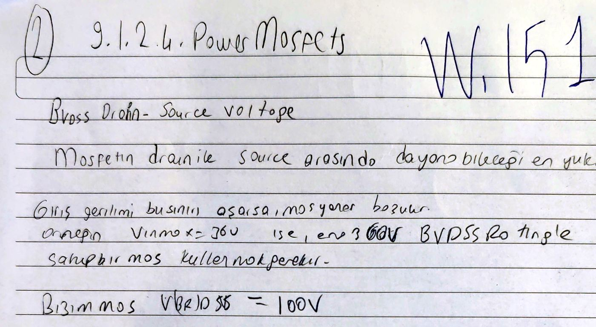

`W.151`, `W.145`teki genel `BVDSS` kuralini bu kez secilen parcaya bagliyor. Bende kalan taraf su: `36 V` ust sinira bakip "sinirda degil, marjli sec" diye dusunmusum. Aradaki bazi el yazilari tam net degil ama `100 V` sonucunun niyeti yeterince acik.

`100 V` degerini burada statik dayanim marji gibi okuyorum; tek basina "`VDS` stresi kapandi" demiyor. `1.25 x 36 V = 45 V` alt sinirina gore rahat gorunuyor, fakat gercek yarim koprude MOSFET'in off-state `VDS` degeri `Vin` uzerine switch-node spike/ringing bindiginde yukselebilir. Ayrica spesifikasyondaki `44 V / 1 ms` survive olayi da normal `36 V` hesabindan ayri duruyor. Bu yuzden BVDSS notu, `W.120-W.121` avalanche/UIS farkindaligi, `SOA` okumasi ve `8.6` altindaki 44 V transient kontroluyle birlikte kapanmali.

Defterden aktarilan not (`W.146`):

Burada `W.145`te "datasheet'i hangi kosulda okuyacagim?" diye yazilan kural secilen MOSFET uzerinde uygulanmis. Yeni bir secim mantigi notundan cok, secilen parca icin gercek `RDS(on)` degerinin proje kosullarina nasil tasindigini gosteren bir uygulama sayfasi olarak okumak daha dogru.

Sayfanin ust satirinda yine su vurgu korunmus:

- `RDS(on) @ VGS = 7.5 V`

ve ben, `LM5146` ile uyumlu, verimli bir MOSFET secmek icin bu kosulda deger okunmasi gerektigini tekrar hatirlatiyorum.

Devaminda "neden onemli?" diye kisa bir aciklama var:

- bu direnc ne kadar buyukse MOSFET acikken iletim kaybi da o kadar buyuk olur
- sonuc olarak:
  - daha fazla isinma
  - daha yuksek kayip

Sayfanin orta kisminda, secilen MOSFET icin datasheet grafikten alinan ilk deger not edilmis:

```text
VGS = 7.5 V icin
RDS(on) \approx 15 m\Omega
```


Ancak hemen altta bunun:

- `Tj = 25^\circ C` icin gecerli oldugunu
- gercek MOSFET jonksiyon sicakliginin daha yuksek olabilecegini

not ediyor.

Ardindan, sicakliga gore normalize edilmis grafik kullanilarak yaklasik bir carpim uygulanmis:

- `Tj = 75^\circ C` civari icin katsayi `\approx 1.35`


ve buradan su duzeltilmis deger cikarilmis:

$$
R_{DS(on)}(75^\circ C) \approx 15\,m\Omega \times 1.35 = 20.25\,m\Omega
$$
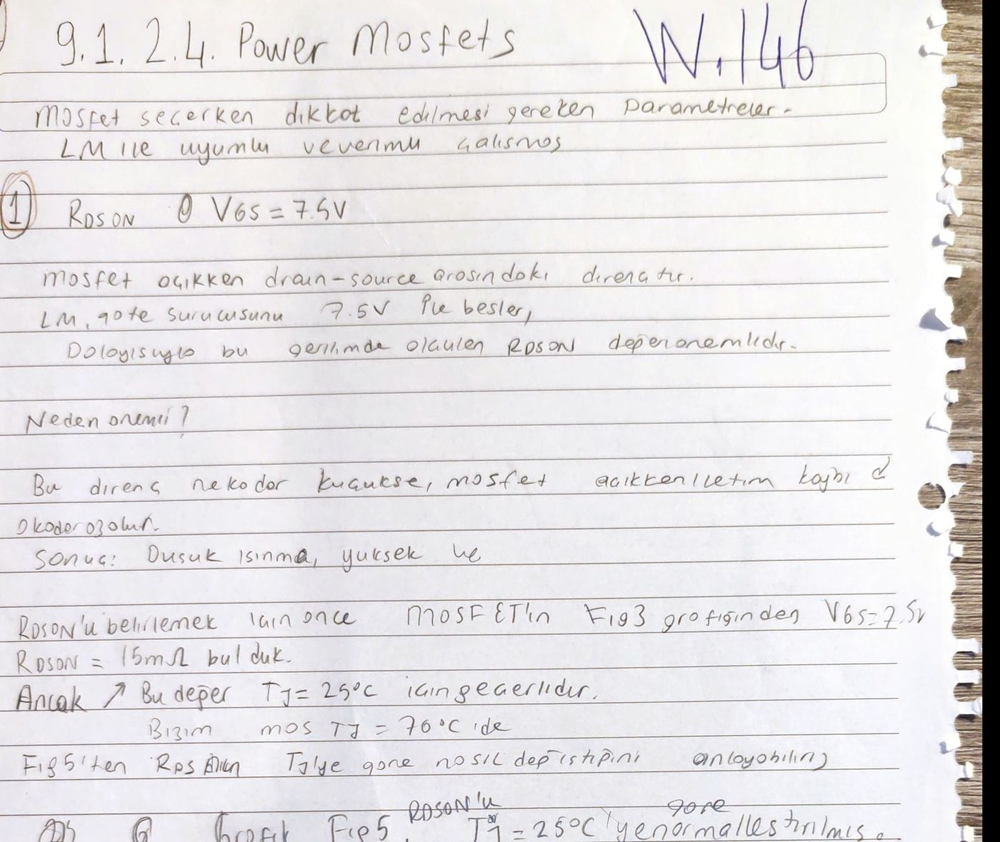

`W.146`, `W.145`te yazilan "sicaklik ve gercek gate-drive kosulunda bak" kuralinin dogrudan uygulanmis hali. Artik `RDS(on)` icin datasheet'in tek nominal sayisi degil, proje jonksiyon sicakligina uyarlanmis deger kullaniliyor. `15 m\Omega -> 20.25 m\Omega` gecisi de tam olarak bunu gosteriyor; secim mantigi ile iletim kaybi hesabi burada birbirine baglaniyor.

`75^\circ C` degerini de son termal kapanis gibi degil, bu iterasyondaki calisma varsayimi gibi tutuyorum. Daha sonra `W.132` tarafinda `T_J \approx 76^\circ C` notu ve `W.191-W.192` iletim kaybi hesaplari ayni sicaklik cizgisine baglaniyor. PCB termal yolu, toplam kayip veya sogutma kosulu degisirse `20.25 m\Omega` degeri de yeniden okunmali; yani `RDS(on)` secimi `5.9` termal kapanisina geri besleme verir.

Bu iki ekran goruntusu bu yuzden kalmali: `W.146` tarafindaki `15 m\Omega @ 7.5 V` ve `1.35` katsayisi notlarinin hangi datasheet egrilerinden okundugunu gosteriyor. Yani `20.25 m\Omega` iletim-kaybi girdisi ezbere degil; iki farkli grafikten okunup birlestirilmis.

Defterden aktarilan not (`W.147`):

Burada MOSFET'in acilma sureci zaman araliklarina ayriliyor. Yeni bir nihai proje hesabi degil; `turn-on delay`, `V_{GS(th)}` ve Miller bolgesini zaman akisi icinde anlamaya calistigim bir defter sayfasi.

Sayfanin ustunde acikca su not var:

- `MOSFET Gate Driver Turn-on Procedure 4 intervalden olusur`

ve burada bu araliklarin ilk ikisine giris yapiliyor.

Birinci aralik icin buraya su notlari dustum:

- `0 V`'tan `Vthreshold`'a yukseltilir
- bu sirada:
  - gate akimi once `C_{GS}`'yi doldurur
  - dolum islemi tamamen bitmis degildir
  - gate gerilimi artar
- az bir kism da `C_{GD}` kapasitörüne akar
- bunun drain gerilimini bir miktar azaltabilecegi not edilmis

Sayfanin altina da bu periyot icin:

- `turn-on delay` denir

notu dusulmus. Ayrica bu aralikta:

- hem drain akimi
- hem drain gerilimi

degismeden kalir

fikrini not ediyor.

Ikinci araliga giriste ise su baslik yazilmis:

- `Vthreshold - VGS,miller arasi`

ve hemen yanina, MOSFET'in artik:

- threshold seviyesine geldigi
- akim tasimaya hazir oldugu

not edilmis.

Sayfadaki kullanilan basili sekiller:

- `PWM Generator`
- `Compensation Network`
- `Error Amplifier`
- `Switch`
- `Filter / Load`

gibi bloklarla, bu turn-on yorumunun yarim kopru / PWM / kompanzasyon baglaminda dusunuldugunu gosteriyor.

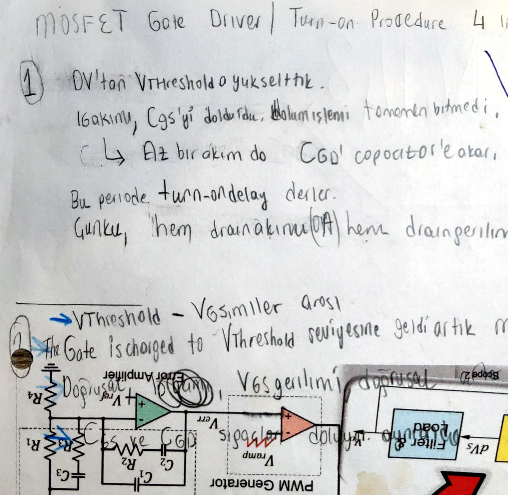

Burada yeni sayisal kayip sonucu yok. Asil ise yarayan tarafi, `W.128-W.132`deki `V_{GS(th)}`, `Miller plateau`, `Q_g` ve `C_{GD}` notlarini fiziksel zaman-akisi icine oturtmasi. Switching-loss hesabinda gerekli olan "hangi aralikta akim degisiyor, hangi aralikta gerilim dusuyor?" sorusu burada daha somut hale geliyor.

Bu sayfayi bu yuzden `t_r` / `t_f` nihai sayisi gibi degil, interval haritasi gibi okuyorum. `turn-on delay`, akim yukselisi ve Miller bolgesi burada isimleniyor; sonraki `W.148-W.149` dalga sekilleri bu haritayi gorsellestiriyor, `W.153-W.154` ise ayni araliklari kayip hesabinda sayiya cevirmeye basliyor.

Defterden aktarilan not (`W.148`):

Burada `W.147`te yaziyla anlatilan MOSFET `turn-on` araliklari bu kez zaman ekseninde dalga sekilleriyle gosteriliyor. Yeni bir nihai proje hesabi degil; `V_G`, drain gerilimi ve drain akiminin turn-on sirasindaki goreli degisimini gosteren gorsel bir defter sayfasi.

Sayfanin ust tarafinda gate gerilimi `V_G` cizilmis ve zaman ekseni `t_0`, `t_1`, `t_2`, `t_3`, `t_4` gibi bolunmus. Buradaki ana sekil su:

- `t_0 -> t_1`:
  - gate gerilimi sifirdan esik gerilimine dogru yukseliyor
- `t_1 -> t_2`:
  - `Q_{gs}` bolgesi not edilmis
- `t_2 -> t_3`:
  - `Q_{gd}` / Miller bolgesi not edilmis
- `t_3 -> t_4`:
  - gate gerilimi tekrar yukselerek son surme seviyesine cikiyor

Sayfanin alt kisminda ise ayni zaman ekseninde uc farkli buyukluk birlikte cizilmis:

- `drain voltage`
- `drain current`
- gate geriliminin kesisim/notlari

Sayfadaki cizime gore korunmasi gereken ana sezgiler sunlar:

- `V_G`, `V_{TH}`'yi astiginda MOSFET akim almaya baslar
- `t_2` civarindan sonra drain-source gerilimi dusmeye baslar
- bu aralikta gate yukunun onemli bir kismi `C_{gd}` / Miller bolgesine gider
- `C_{gd}` dolunca, drain gerilimi neredeyse `0 V` olur
- devaminda gate gerilimi son surme degerine kadar yukselir

Sayfanin alt satirindaki notum da bunu kisa cumleyle toparliyor:

- `Vg` gerilimi `VTH`'yi asinca `Id` akmaya basliyor
- `t_2`'den sonra `V_D` dusuyor
- bu sira gate yukunun bir kismi `Cgd` dolumuna gidiyor
- `Cgd` dolunca `V_D = 0 V` oluyor

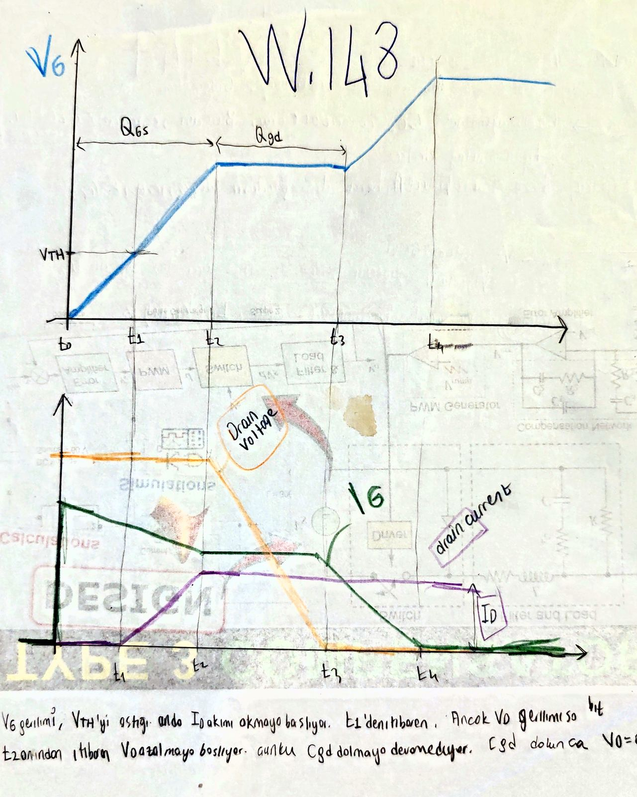

Burada yeni sayisal kayip sonucu yok; ama `W.147`te yazili kalan turn-on araliklari artik somut dalga sekilleriyle destekleniyor. Switching-loss hesabinda kritik olan "akim ne zaman yukseliyor, gerilim ne zaman dusuyor, Miller bolgesi hangi aralik?" sorulari burada sekil uzerinden takip edilebiliyor. `Q_{gs}` ve `Q_{gd}` etiketlerinin gate dalga seklinin uzerine yazilmis olmasi da `W.129-W.130`daki gate-charge sayilarina baglaniyor.

Buradaki `V_D = 0 V` ifadesini ideal dalga sekli kisaltmasi gibi okuyorum. Gercek MOSFET iletimdeyken `V_{DS}` tam sifir degil; `I_D x RDS(on)`, paket/source enduktansi, dead-time/body-diode araligi ve ringing etkileri kalir. Bu sayfanin amaci kapanis degerini olcmek degil, Miller araliginda drain geriliminin dustugunu ve `Q_{gd}`'nin switching-loss hesabinda neden kritik oldugunu gostermek.

Defterden aktarilan not (`W.149`):

Burada TI kaynagindaki `MOSFET's Vpl and Vgs(th) Estimation` sayfasinin uzerine alinmis notlar var. Yeni bir proje sonucu degil; `W.124`, `W.128`, `W.147` ve `W.148` ile ayni zincirde, `V_{PL}`, `V_{GS(th)}` ve turn-on interval yorumuna kaynaklik eden referans sayfa gibi.

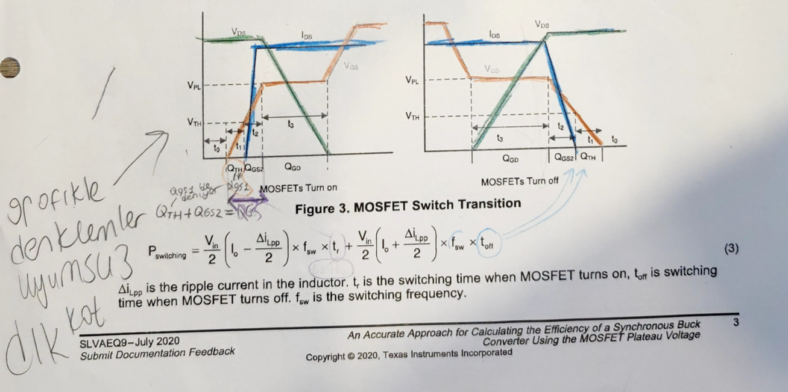

G81 Figure 3. MOSFET Switch Transition

Ek waveform notu:


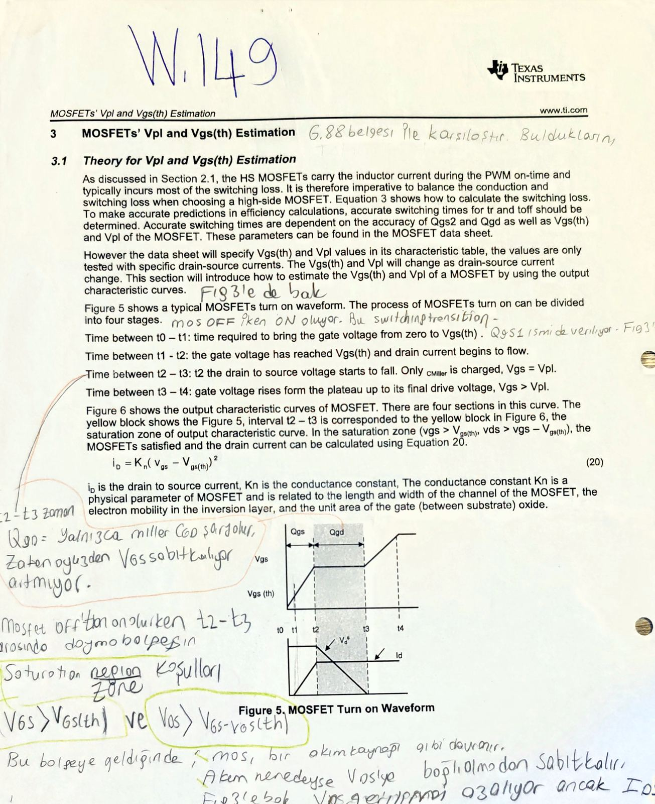

Sayfadaki basili bolumde:

- `MOSFET's Vpl and Vgs(th) Estimation`
- `Theory for Vpl and Vgs(th) Estimation`
- ve tipik `MOSFET turn on waveform`

ayni yerde gorunuyor. Ben de bunun uzerine kisa teknik notlar dustum.

Korunmasi gereken ana fikirler sunlar:

- `t_1 - t_2` araliginda:
  - MOSFET artik threshold seviyesini gecmistir
  - akim tasimaya baslar
  - bu bolge doygunluk / saturation kosullari ile birlikte dusunulmustur

Sayfada isaretlenen saturation kosullari:

$$
V_{GS} > V_{GS(th)} \quad \text{ve} \quad V_{DS} > V_{GS} - V_{GS(th)}
$$
- notuma gore `t_2 - t_3` araliginda:
  - yalniz Miller `C_{gd}` sarjlanir
  - bu nedenle `V_{GS}` neredeyse sabit kalir
  - buna karsilik `V_{DS}` hizla duser

Sayfaya dusulen kisa notlardan biri de bu yorumu acikca destekliyor:

- "yalniz Miller `Cgd` sarjlanir"
- "zaman cizgisinde `Vgs` sabit kaliyor"

Sayfanin altindaki notta ayrica su yonlendirme var:

- `Fig. 5'te bak`

Bu da, `W.147-W.148`te kendi cizimimle anlattigim turn-on surecini dogrudan kaynak sekille eslestirdigimi gosteriyor. Yani burada yeni bir hesap yok; kendi cizimimle kaynak dalga sekli ayni hizaya getiriliyor.

Burada yeni sayisal proje sonucu yok; ama `W.147-W.148`te kendi dilimle anlattigim turn-on dalga sekillerinin kaynak dayanak sayfasi var. Ayni zamanda `W.128`te cikarilmaya calisilan `V_{GS(th)}` ve `V_{PL}` parametrelerinin fiziksel anlamini da turn-on araliklari uzerinden bagliyor.

`W.149`u bu yuzden iki is icin tutuyorum: birincisi kendi cizdigim dalga sekillerini TI'nin kaynak sekliyle hizalamak, ikincisi `V_{GS(th)}` / `V_{PL}` cebrinin hangi araliga ait oldugunu kaybetmemek. Ama bu sayfa henuz secilen MOSFET icin tek bir final `V_{PL}` degeri secmiyor. Sonraki `W.157-W.158` ve `W.174-W.175` denemeleri bu degeri sayisal ariyor; finalde `I_D`, `V_{DS}`, `T_J`, `V_{drive}` ve gate-direnci kosullariyla tekrar eslesmeli.

Defterden aktarilan not (`W.210`):

Burada ayni `G81` kaynak zincirinde `Figure 2` ve `Figure 3` birlikte gorunuyor. Yeni bir proje sonucu degil; toplam MOSFET kayip butcesinin ana kalemlerini ve `MOSFET Switch Transition` sekline giden baglami ayni yerde gosteriyor.

Sayfanin ust kisminda acikca:

- `Figure 2. Power Losses of Synchronous Buck Converter`

sekli gorunuyor. Bu sekil uzerinde mavi ile bazi kayip bolgelerini isaretledim. Basili metinde de iki MOSFET'in kayiplari su ana siniflara ayriliyor:

- `switching/conduction loss`
- `gate drive loss`
- `output capacitance loss`
- `LS MOSFET body-diode loss`

Bu, daha sonra `W.191-W.200` arasinda tek tek hesapladigim kayip kalemlerinin kaynaktaki ust siniflandirmasini gosteriyor.

Sayfanin alt kisminda ise:

- `Figure 3. MOSFET Switch Transition`

sekli tekrar yer aliyor. Bu da `W.149` ve `W.162`de ayrintili yorumlanan `turn-on / turn-off` zaman araliklarinin, kayip hesabindaki dogrudan kaynagini tekrar gorunur yapiyor.

Sayfa ustune dustugum asil notlardan biri:

- `grafikte denklemler uyumsuz kalmasin`

yonunde. Bu da sekli, denklem ve fiziksel yorumun birbiriyle tutarli okunmasi gerektigini kendi notlarimla vurguladigimi gosteriyor.

Sayfada Equation `(3)` de gorunuyor; bu, `switching loss` hesabinda:

- `V_{in}`
- `I_0 \pm \Delta i_{Lpp}/2`
- `t_r`, `t_{off}`
- `f_{sw}`

gibi buyukluklerin birlikte kullanildigi genel formun kaynak tarafini gosteriyor.

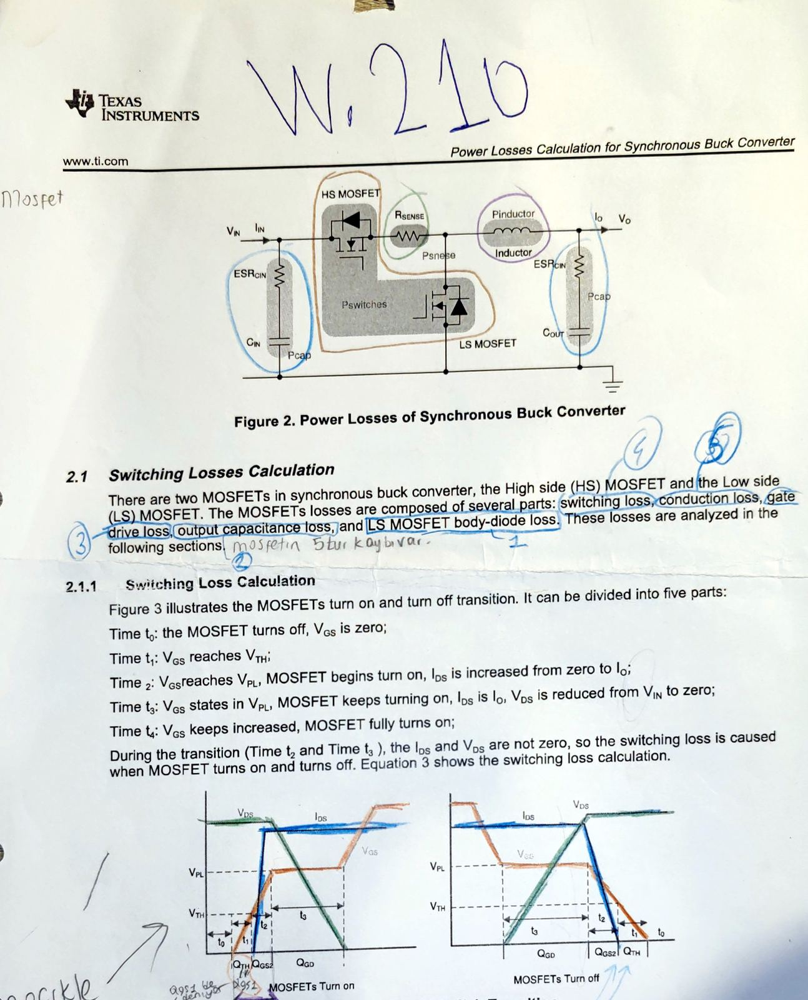

`W.210`, `W.149`daki `Figure 3` kaynagini daha genis bir baglama oturtuyor; yani yalniz dalga sekli degil, onun hangi toplam kayip butcesinin parcasi oldugunu da gosteriyor. Ayni zamanda sonraki `W.150` conduction/switching ayirimina gecmeden once ust haritayi veriyor. Yeni sayisal sonuc yok; ama `switching`, `conduction`, `gate-drive`, `Coss` ve `body-diode` kayiplari diye ayirdigim zincirin kaynaktaki karsiligini burada tutuyorum.

Numara olarak `W.210` ilerideki bir defter sayfasi; burada durmasi kronolojik siralama degil, konu sirasi yuzunden. `W.149` dalga sekli kaynagini gosteriyor, `W.210` ayni kaynagi kayip butcesiyle bagliyor, sonra `W.162 / W.157 / W.158 / W.150` parcali sekilde interval yorumu, `VPL` arayisi ve conduction/switching ayrimini aciyor. Yani bu blok, defter sayfa numarasina gore degil, MOSFET kayip mantigini takip etmek icin okunmali.

Defterden aktarilan not (`W.162`):

Burada `W.149`daki kaynak sekil bu kez kendi cumlelerimle adim adim yorumlaniyor. Yeni bir nihai hesap sayfasi degil; `G81 Fig.3` uzerinden `t_0-t_4` interval yorumunu kendi dilimle anlattigim bir defter sayfasi.

Sayfanin basliginda acikca:

- `G81 Fig 3, oku`

gibi bir not var. Bu da sayfanin dogrudan kaynak sekli okuyup anlamlandirma amaciyla yazildigini gosteriyor.

Sayfada zaman araliklari tek tek yorumlanmis:

1. `t_0`

- MOSFET `OFF` durumdadir
- `V_{GS}` de `0 V` tarafindadir

2. `t_1`

- `V_{GS}` `0 V`'tan artmaya baslar
- `V_{GS} = V_{TH}` seviyesine ulasana kadar gider
- bu sirada `V_{DS}` yuksektir
- yani MOSFET halen bloklama / `OFF` durumundadir
- burada ayrica, `I_D` akisinin bu surecin sonuna dogru baslayacagini not ettim

3. `t_2`

- `V_{GS}` artik `V_{TH}` seviyesini asmaktadir
- `V_{PL}` seviyesine ulasma sureci vardir
- burada `I_D`'nin `0 A`'den artmaya basladigi yazilmis
- yuk toplami icin:
  - `Q_{TH} + Q_{GS2}`

notu da dusulmus

4. `t_2 - t_3`

- `V_{GS}` bir sure sabit kalir
- `V_{PLAT}`'da sabit kalir
- `Q_{GD}` sarj olur
- burada acikca:
  - switching loss'un bu bolgede oldugunu
  - bu surede akim sabitken gerilimin dustugunu
  - `t_3` sonunda `V_D`'nin `0 V`'a indigini

not ediyor

5. `t_4`

- `V_{GS}` gerilimi `V_{PLAT}`'dan otesine / ileri gider
- biraz daha arttirilir
- MOSFET fully turns on yapar

Sayfanin sol kenarindaki kisa not da onemli:

- `Qgd` ve `246.62 pC` benzeri onceki sayfadan gelen deger

Bu da, `W.161`de sorgulanan Miller charge buyuklugunun burada zaman araligina baglandigini gosteriyor.


Burada yeni sayisal proje sonucu yok; ama `W.147-W.148`te daha cizgisel anlatilan turn-on sureci bu kez kaynak sekle bakilarak kelime kelime aciklaniyor. Bende kalan ana iz su: "switching loss bu bolgede olur" notu, `Q_{GD}` ile `V_{DS}` dususu arasindaki fiziksel bagi acikca kuruyor.

Buradaki `Qgd` / `246.62 pC` izi, final Miller charge degeri gibi degil; `W.161`deki "bu kadar kucuk cikmasi mantikli mi?" sorgusunun bu interval haritasina yapistirilmis hali gibi okunmali. Final `Q_{GD}` icin `W.129-W.130`, `W.161`, `W.163` ve gate-charge egrisi ayni kosula cekilmeli; `W.162`nin asil katkisi hangi yuk parcasinin hangi zaman araliginda harcandigini gostermesi.

Defterden aktarilan not (`W.157`):

Burada `W.149`daki `Vpl` konusunun daha uygulamali devami var. Yeni proje hesabi degil; `Vpl`'in tablolu hesaplayici ve olculen `Vgs` dalga sekliyle nasil dogrulanabilecegini gosteren kaynak sayfa gibi.

Sayfanin ust tarafinda TI tarafindan verilen `Vpl Calculator` tablosu gorunuyor. Tabloda, MOSFET datasheet'inden alinan bazi buyukluklerle `Vplateau` hesaplaniyor. Guvenle okunabilen tablo kalemleri sunlar:

- `Vgs1`
- `Id1`
- `Vgs2`
- `Id2`
- `Ids`

ve tablonun sonuc satirinda:

- `Kn`
- `Vgsth`
- `Vplateau`

degerleri veriliyor.

Sayfadaki basili ornek tabloda, okunabildigi kadariyla, su sonuc goruluyor:

- `Vgsth \approx 3.72 V`
- `Vplateau \approx 4.58 V`

Sayfanin orta ve alt kisimlarinda `Vgs waveform` olcumleri ve hesapla karsilastirma tablosu var. Ana fikir su:

- `Ids = 10 A` ve `Ids = 20 A` gibi iki farkli akim seviyesinde
- `Vplateau` olculuyor
- sonra hesaplanan `Vpl` ile karsilastiriliyor

Alt tablodaki karsilastirma da, okunabildigi kadariyla, su yone cikiyor:

- `Ids = 10 A` icin:
  - olculen `Vplateau \approx 5.22 V`
  - hesaplanan `Vpl \approx 4.58 V`
- `Ids = 20 A` icin:
  - olculen `Vplateau \approx 5.30 V`
  - hesaplanan `Vpl \approx 4.94 V`

Sayfanin ustune su notlari yazmisim:

- `Deneyde dogrulama yap`
- `Sen de yapacaksin`
- `Neyi hesapladigini VPL'nin ne derecede oldugunu ...`

Buradaki not benim icin su anlama geliyor: `Vpl` hesabini kagit uzerinde bir ara parametre olarak birakmak istemiyorum. Bunu olculen dalga seklinden de kontrol etmem gerektigini acikca yazmisim.

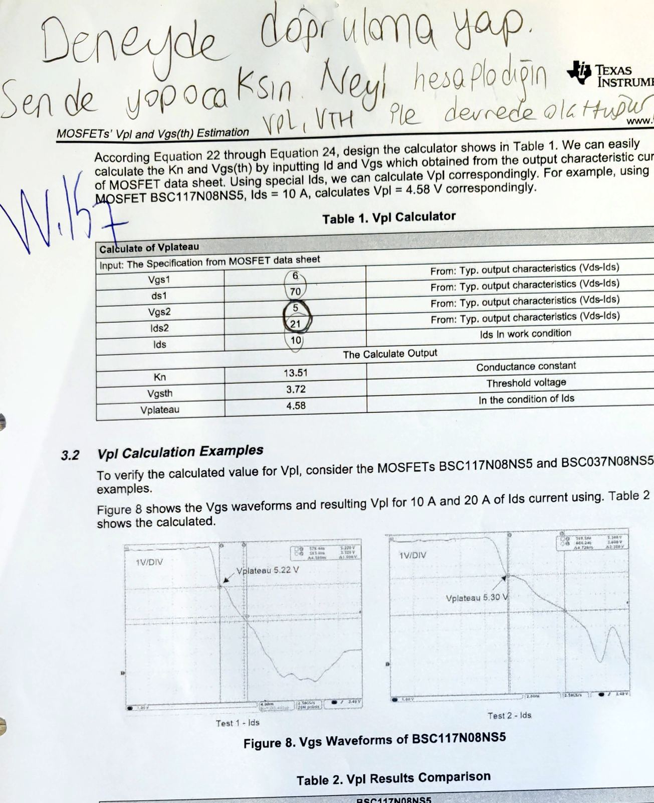

Burada yeni sayisal proje sonucu yok. Asil islevi, `W.128` ve `W.149`daki `V_{GS(th)}` / `V_{PL}` hesabini deneysel dogrulama fikrine baglamasi. Ayrica ileride kendi tasarimimda da `Vpl`'i olcumle karsilastirma niyetimi gosterdigi icin bu sayfayi burada tutuyorum.

Buradaki `3.72 V`, `4.58 V`, `5.22 V` ve `5.30 V` gibi degerleri secilen MOSFET'in final plateau sayilari gibi almiyorum. Bunlar kaynak orneginin calculator/olcum karsilastirmasi. Benim icin asil ders su: `V_{PL}` yalnizca denklemden gelen bir satir degil; secilen akim noktasina ve gercek `V_{GS}` dalga sekline gore kontrol edilmesi gereken bir buyukluk. Kendi tasariminda bu kontrol, `V_{drive} \approx 7.5 V`, secilen `I_D`, `T_J` ve gate yolu kosullariyla tekrar yapilmali.

Defterden aktarilan not (`W.158`):

Burada `W.157`teki `Vpl Calculator` ve olcum karsilastirmasinin hemen altindaki cebirsel/metodik arka plan var. Yeni proje sonucu degil; `5.6.2`nin sonunda, kayip hesabina gecmeden once output-characteristic egrisinden `V_{GS(th)}`, `K_n` ve `V_{PL}` cikarma yontemini gosteren bir kaynak-defter sayfasi olarak okumak daha dogru.

Sayfanin basili kisminda su iki sekil var:

- `Figure 6. Output Characteristic Curves`
- `Figure 7. Output Characteristic Curve`

Bu sekillerin altinda, MOSFET'in output-characteristic egrisinden iki farkli nokta secilerek once `V_{GS(th)}` ve `K_n`, sonra da belirli bir `I_D` icin `V_{PL}` tahmini yapiliyor.

Sayfadaki basili denklem zincirinden guvenle korunmasi gereken ana fikirler sunlar:

$$
I_{D1} = K_n \left(V_{gs1} - V_{gs(th)}\right)^2
$$
$$
I_{D2} = K_n \left(V_{gs2} - V_{gs(th)}\right)^2
$$
Buradan:

$$
V_{gs(th)} \approx V_{gs1} \times \frac{\sqrt{I_{D2}/I_{D1}} - V_{gs2}/V_{gs1}} \sqrt{I_{D2}/I_{D1}} - 1
$$
benzeri bir ara ifade ile `V_{GS(th)}` elde ediliyor; ardindan:

$$
K_n \approx \left( \frac{\sqrt{I_{D1}} - \sqrt{I_{D2}}} {V_{gs1} - V_{gs2}} \right)^2
$$
ve son olarak:

$$
V_{PL} = \sqrt{\frac{I_D}{K_n}} + V_{gs(th)}
$$
Sayfa uzerindeki yerlestirmemde, okunabildigi kadariyla, su ara sonuclar not edilmis:

- `V_{GS(th)} \approx 1.12 V`
- `K_n \approx 5.1649`
- `V_{PL} \approx 2.44 V`

Bu `2.44 V` satirini da tek basina final plateau degeri gibi almiyorum. Secilen iki output-characteristic noktasi, okunan egri ve `V_{DS}=3 V` baglami bu sonucu dogrudan etkiliyor. `W.157`deki calculator/olcum degerleri ve daha sonra `W.174-W.175`teki sicaklik/nokta secimi denemeleri farkli cikiyorsa, bu benim icin hata saklama degil; `V_{PL}` hesabinin hangi egri ve hangi kosulla yapildigina hassas oldugunu gosteren iz.

Sayfanin ustundeki notumda ayrica su fikirler yazili:

- `I_D = 123 A`, `V_{GS1} = 6 V`, `V_{DS} = 3 V`
- diger nokta icin `I_D = 59 A`, `V_{DS} = 3 V`, `V_{GS2} = 4.5 V`

ve bunlarin `Figure 6/7` uzerinden secildigi anlasiliyor.


Bu ekran goruntusu, `W.158` ve daha sonra `W.174-W.175` tarafinda yaptigim iki-nokta seciminin nereden geldigini gosteriyor. Uzerine dusulen `I_{D1} \approx 123 A` / `V_{GS1} = 6 V` ve `I_{D2} \approx 59 A` / `V_{GS2} = 4.5 V` notlari, `K_n`, `V_{GS(th)}` ve ardindan `V_{PL}` tahmini icin ayni output-characteristic mantigini tekrar kullandigimi gosteriyor.

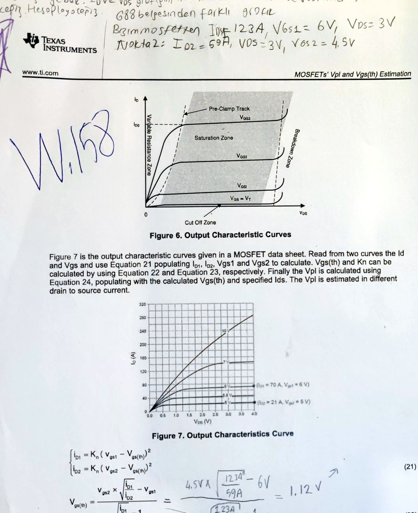

`W.158` yeni proje sonucu vermiyor; asil yaptigi is, `W.157`te tablolu gosterilen `V_{PL}` hesaplayicisinin `I_D-V_{GS}` / output-characteristic egrileri uzerinden nasil kuruldugunu gostermek. Buradaki sayilar secilen MOSFET'ten cok kaynak ornek MOSFET'e ait olabilir; o yuzden nihai proje degeri diye degil, yontemin gosterimi diye bakmak daha dogru. Yine de `V_{GS(th)}`, `K_n` ve `V_{PL}` zincirinin matematik iskeletini deftere tasidigi icin bu iz kalmali.

Defterden aktarilan not (`W.150`):

Burada ayni kaynak ailesi icinde conduction-loss ve switching-loss tarafi ayni sayfada gorunuyor. Yeni bir nihai proje hesabi degil; `5.6.2`nin sonunda, MOSFET kayip butcesinin iki ana kolunu ayni yerde gosteren bir kaynak-defter sayfasi olarak okumak daha dogru.

Sayfadaki basili sekillerden guvenle okunabilen ana kisimlar sunlar:

- `Figure 4. MOSFET conduction losses`
- `Figure 5. MOSFET switching losses`

Yani burada, bir tarafta iletim kaybini, diger tarafta ise gate-charge / turn-on dalga sekliyle iliskili switching kaybini ayni baglamda birlikte dusunuyorum.

Sayfa uzerine dustugum notlardan korunmasi gereken guvenli fikirler sunlar:

- conduction-loss tarafi icin:
  - secilen MOSFET'in `RDS(on)` degeri kritik
  - bu deger onceki sayfalarda oldugu gibi gercek `VGS` ve sicaklik kosuluna gore okunmali
- switching-loss tarafi icin:
  - `V_{PLAT}`
  - `V_{GS(th)}`
  - `Q_{gs}`, `Q_{gd}`, `Q_g(total)`

gibi buyuklukler tekrar isaretlenmis.

Sayfadaki el notlarindan biri, gercek surme baglamini tekrar hatirlatiyor:

- "LM ile `VGSactual \approx 7.5 V`"

Bu da, burada gorulen gate-charge ve dalga sekli bilgilerinin dogrudan datasheet'in varsayilan `10 V` surme kosuluna degil, projedeki gercek surme kosuluna gore yorumlanmak istendigini gosteriyor.

Bu sayfanin bende tuttugu yer su:

- `W.146` ile `RDS(on)` tarafi gercek kosula tasinmisti
- `W.147-W.149` ile `turn-on`, `Miller`, `V_{PL}` ve `V_{GS(th)}` tarafi kurulmustu
- burada ise bu iki hattin aslinda ayni "MOSFET kayip butcesi" icinde birlikte dusunuldugu goruluyor

Burada yeni sayisal proje sonucu yok; ama conduction loss ile switching loss'un ayni kaynakta nasil ayrildigini ve baglandigini gosteriyor. Ayrica `W.145-W.146`daki `RDS(on)` okuma mantigi ile `W.147-W.149`daki gate-charge / turn-on waveform mantigini tek sayfada bulusturuyor. Ince el notlarin bir kismi tam okunmasa da, korunacak kavramsal bag yeterince acik.

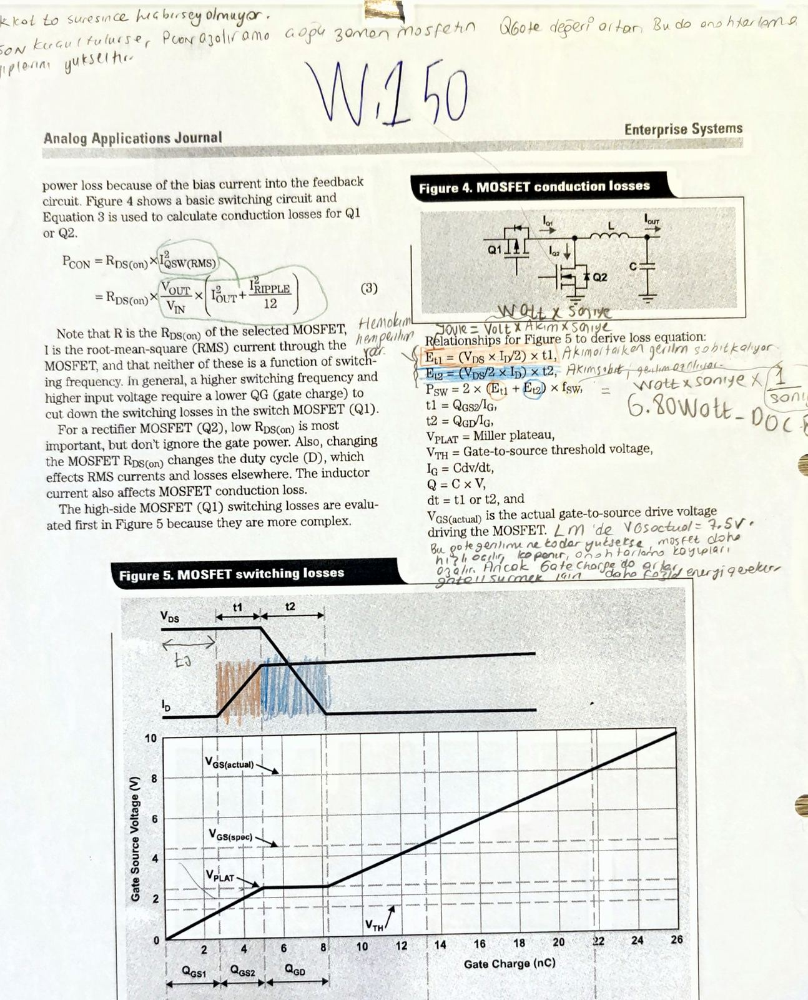

Defterden aktarilan not (`W.152`):

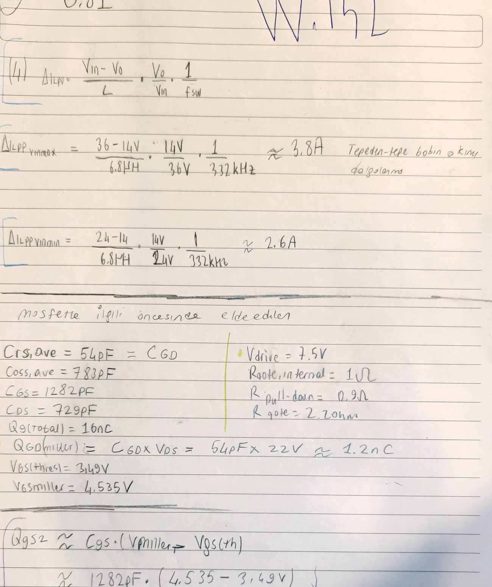

Burada `G81` hattinda switching-loss hesabina girecek bircok ara parametre tek yerde toplanmis. Yeni nihai kayip sonucu degil; onceki sayfalardan elde edilen buyuklukleri bir araya getirip sonraki hesap adimina hazirliyor.

Sayfanin ust kisminda once bobin akim dalgalanmasi tekrar yaziliyor:

$$
\Delta i_L = \frac{V_{in}-V_o}{L} \cdot \frac{V_o}{V_{in}} \cdot \frac{1}{f_{sw}}
$$
ve iki kosul icin yaklasik sayisal sonuclar not edilmis:

- `V_{in} = 36 V` tarafinda:
  - `\Delta i_{L,\max} \approx 3.8 A`
- `V_{in} = 24 V` tarafinda:
  - `\Delta i_{L,\min} \approx 2.6 A`

Bu, daha onceki bobin/ripple sayfalariyla uyumlu bir tekrar-toparlama.

Sayfanin orta kisminda ise, onceki MOSFET sayfalarindan gelen parasitik ve charge buyuklukleri yeniden listelenmis:

- `C_{rss,ave} \approx 54 pF \approx C_{GD}`
- `C_{oss,ave} \approx 783 pF`
- `C_{GS} \approx 1282 pF`
- `C_{DS} \approx 729 pF`
- `Q_{gs(total)} \approx 16 nC`

Sag tarafta gercek surme baglamini hatirlatan notlar var:

- `V_{driver} = 7.5 V`
- gate yolu direncine iliskin bazi ara degerler not edilmis

Bu kisimdaki tum rakamlar tam net olmasa da, ana fikir acik:

- `G81/G88` hesaplarinda kullanilacak surme ve parasitik buyuklukler tek bir sayfada toparlaniyor

Sayfanin alt kisminda `Q_{gd}` icin tekrar kaba charge iliskisi yaziliyor:

$$
Q_{gd} \approx C_{GD}\,V_{DS} \approx 54\,\text{pF} \times 22\,\text{V} \approx 1.2\,\text{nC}
$$
Ardindan esik ve plateau gerilimleri tekrar not edilmis:

- `V_{GS(th)} \approx 3.49 V`
- `V_{GS,miller} \approx 4.535 V`

ve bunlardan hareketle altta `Q_{gs2}` benzeri bir ara buyukluk hesaplanmis:

$$
Q_{gs2} \approx C_{GS}\,\left(V_{miller} - V_{GS(th)}\right)
$$
Sayfadaki sayisal sonuc, okunabildigi kadariyla, yaklasik:

$$
Q_{gs2} \approx 1.34\,\text{nC}
$$
Burada yeni nihai kayip sonucu yok; ama `W.129-W.130`daki `C_{GD}`, `C_{GS}`, `C_{DS}` ve `Q_{gd}` notlari, `W.147-W.149`daki `V_{GS(th)}` / Miller waveform sezgisiyle ayni sayfada birlesiyor. Ustteki `\Delta i_L` tekrari da switching-loss hesabinda kullanilacak akim seviyesini netlestirmek icin burada duruyor. Sag taraftaki gate-direnci ara notlarinin bir kismi tam secilemedigi icin, guvenle okunan surme bagini korumak daha dogru.

Buradaki `54 pF / 783 pF / 729 pF` kapasitans setini, `G81` hesabina giren ilk toparlanmis set gibi okuyorum. Hemen arkasindan gelen `W.161` ve `W.163` notlari ayni `C_{rss}` / `C_{oss}` buyukluklerini daha kucuk veya farkli kosuldan tekrar sorguluyor. Bu yuzden `W.152`nin gorevi final kapasitans setini kilitlemek degil; hangi girdilerin switching-loss hesabina tasindigini ve hangi girdilerin daha sonra tekrar teyit edilecegini gostermek.

Defterden aktarilan not (`W.161`):


Burada `Q_{gd}` / Miller charge icin iki farkli bakis acisinin birbirine gore ne kadar farkli sonuc verebildigi not ediliyor. Yeni nihai sonuc sayfasi degil; `Q_{gd}` kestirimi icin yapilan ara teyit / sorgulama notu gibi.

Sayfanin ust satirina, MOSFET'in kendi gate-charge grafiginden yaklasik bir not dustum:

- `VGS = 7.5 V` iken `Qg \approx 8 nC`

Hemen altinda ise Miller charge icin cok kaba bir iliski yaziliyor:

$$
Q_{gd} \approx C_{rss,ave}\,V_{DS}
$$
Sayfadaki sayisal yerlestirmede okunabildigi kadariyla:

$$
Q_{gd} \approx 11.21\,\text{pF} \times 22\,\text{V} \approx 246.62\,\text{pC} \approx 0.24662\,\text{nC}
$$
Sayfanin altindaki notlar ise, bu sonucun sezgisel olarak cok kucuk bulundugunu gosteriyor. Guvenle korunabilecek ana fikirler sunlar:

- `G81 Fig 3` tarafindaki `Qgd` / plateau sezgisine gore bu deger cok kucuk gorunuyor
- eger Miller charge gercekten kucukse:
  - `VDS` ile `IDS`'nin ayni anda ortusup kayip olusturdugu aralik da kisa olur
  - dolayisiyla switching loss daha dusuk olabilir
- sayfanin en altinda EMI ile ilgili kisa bir not da var; ancak bu yorumun yonu burada kesinlestirilmeden yalnizca "EMI tarafina da etkisi olur" seviyesinde birakmak daha dogru

Burada yeni nihai kayip sonucu yok; ama `Q_{gd}` icin `C_{rss}\times V_{DS}` yaklasiminin, grafik/sekil sezgisiyle her zaman tam uyusmayabilecegini fark ettigim yer burasi. Bu yuzden `W.129-W.130` ve `W.152`de kullandigim `Q_{gd}` kestirimleri daha sonra tekrar teyit edilmeli.

Defterden aktarilan not (`W.163`):


Burada MOSFET kayip hesabina giren birden fazla ara buyukluk tek yerde tekrar toplanmis ve bir kismi revize edilmis. Yeni nihai sonuc sayfasi degil; gercek surme kosulu, `T_J` kestirimi ve `C_{rss}/C_{oss}/C_{gs}` uyarlamalarini ayni yerde topluyor.

Sayfanin ust kisminda tekrar hatirlatilan temel proje sayilari sunlar:

- `I_{D,max} \approx 9 A + 3.8/2 \approx 11 A`
- `R_{gate}` olarak harici direnç notu tekrar yazilmis
- `V_{drive} = V_{CC} = 7.5 V`
- ic gate yolu tarafinda:
  - `R_{LO}` / pull-down yonunde `0.9 \Omega`
  - `R_{HI}` / yukari yonlu direncte `1.5 \Omega`
- `V_{DS} \approx 36 V - 14 V = 22 V`

Sayfanin orta kisminda MOSFET jonksiyon sicakligi icin onceki yaklasim tekrar edilmis:

$$
T_J = T_{case} + P_{loss}\,R_{\theta JC}
$$
ve okunabildigi kadariyla:

- `T_{case} \approx 73.9^\circ C`
- `P_{loss} \approx 1.29 W`
- `R_{\theta JC} \approx 1.9^\circ C/W`

kullanilarak:

$$
T_J \approx 76.35^\circ C
$$
sonucu not edilmis.

Sayfanin alt kisminda, onceki kapasitans uyarlama notlari bu kez daha dusuk buyukluklerle yeniden yazilmis:

- `C_{iss} \approx 835 pF`
- `C_{oss} \approx 16.8 pF`
- `C_{rss} \approx 4.8 pF`

ve bunlardan:

$$
C_{rss,ave} \approx 2\,C_{rss,spec}\sqrt{\frac{V_{DS,spec}}{V_{DS,app}}} \approx 11.21\,\text{pF}
$$
$$
C_{oss,ave} \approx 2\,C_{oss,spec}\sqrt{\frac{30\,V}{22\,V}} \approx 39.2\,\text{pF}
$$
Sayfanin en altinda ise:

$$
C_{gs} = C_{iss} - C_{rss} \approx 835\,\text{pF} - 4.8\,\text{pF} \approx 830.2\,\text{pF}
$$
notu yer aliyor.

Bu sayfa, `W.132`deki `T_J`, `V_{DS}`, `V_{drive}` ve gate-direnci baglamini, `W.130/W.152`deki kapasitans uyarlama notlariyla yeniden bir araya getiriyor. Ayni zamanda `W.161`de tartistigim "neden `Q_{gd}` cok kucuk cikiyor?" sorusunun arka planinda kullandigim daha kucuk `C_{rss}` / `C_{oss}` degerlerinin de nereden geldigini gosteriyor. Buradaki kapasitanslar onceki `54 pF / 783 pF / 729 pF` hattiyla birebir uyusmadigi icin bunu yeni nihai dogru set gibi degil, "kayip hesabina giren parametreler tekrar gozden geciriliyor" diye okumak lazim.

Defterden aktarilan not (`W.190`):


Burada `W.152`de toplanan `Q_{gs2}`, `Q_{gd}`, `V_{drive}`, `V_{miller}` ve gate-yolu direnci kullanilarak bu kez dogrudan `t_r` ve `t_{off}` icin zaman tahmini yapilmaya calisiliyor. Yeni nihai kayip sonucu degil; switching-loss hesabina girecek gecis sureleri icin erken / alternatif bir kestirim.

Sayfanin ust kisminda once turn-on tarafini ayiriyorum:

$$
t_r = t_1 + t_2
$$
ve burada ana bilesenlerin:

- `Q_{gs2} \approx 1.34\,nC`
- `Q_{gd} \approx 1.2\,nC`
- `V_{drive} = 7.5\,V`
- `V_{miller} \approx 4.535\,V`
- `V_{GS(th)} \approx 3.49\,V`

oldugunu not ediyor.

Sayfanin orta kismina yakin, surucu tarafinda gate'e etki eden toplam direncler icin de not dusuyorum:

- `R_{driver}` tarafinda yaklasik `1 + 0.9 = 1.9\,\Omega`
- harici gate direnci birakildiginda `R_g \approx 2.2\,\Omega`

Ardindan `t_r` icin, okunabildigi kadariyla, `Q_{gs2}` ve `Q_{gd}` parcali bir toplam yaziliyor ve sayfanin kutu icindeki sonucu su yone cikiyor:

$$
t_r \approx 3.23\,ns
$$
Sayfanin alt yarisinda ayni mantik bu kez kapanma tarafi icin tekrar ediliyor:

$$
t_{off} = t_3 + t_4
$$
ve benzer sekilde `Q_{gs2}`, `Q_{gd}`, `V_{miller}` ve toplam gate yolu direnci kullanilarak bir zaman tahmini yapiliyor. Kutulanmis sonuc, okunabildigi kadariyla:

$$
t_{off} \approx 2.66\,ns
$$
Burada `switching loss` hesabina girecek gecis zamanlarini ilk kez dogrudan hesaplamaya calisiyorum. Ama bulunan `t_r \approx 3.23 ns` ve `t_{off} \approx 2.66 ns` sonuclari, daha sonra `W.153-W.154`te kullandigim `32.5 ns` ve `20.63 ns` degerleriyle belirgin bicimde celisiyor. O yuzden bunu nihai kullanilan gecis zamani seti gibi degil, erken / alternatif / eksik-direncli bir ilk kestirim gibi okumak gerekiyor. Yine de `Q_{gs2}` ve `Q_{gd}`'yi ayri ayri zaman parcasi gibi dusunme fikri burada acikca goruluyor.

Bu farki okurken iki seti ayni hesapta karistirmamak gerekiyor. `W.190` charge-parcali zaman hesabinin ilk denemesi; `W.153-W.154` ise kayip gucune gecen pratik hesap seti. Final kapanista `Q_{gs2}`, `Q_{gd}`, toplam gate yolu direnci, driver akimi ve secilen `t_r/t_f` degerleri ayni kosuldan gelmeli. Su haliyle `W.190` "nasil parcalara ayiririm?" sorusunu, `W.153-W.154` ise "bu gecis sureleriyle kayip kac olur?" sorusunu cevapliyor.

Defterden aktarilan not (`W.153`):


Burada `G81` hattinda artik dogrudan sayisal switching-loss hesabina geciliyor. Belirli bir `V_{in}` ve `\Delta i_L` kosulunda anahtarlama kaybini hesaplayan uygulama sayfasi olarak okumak daha dogru.

Sayfanin ustunde hesap kosulu net olarak yazilmis:

- `V_{in} = 24 V`
- `\Delta i_{L} = 2.6 A`

Ardindan `P_{switching}` icin iki ucgen / iki gecis parcasi toplanarak yazilan ifade goruluyor. Sayfadaki notasyondan okunabildigi kadariyla ana fikir su:

$$
P_{switching} = \frac{V_{in}}{2} \left(I_0 - \frac{\Delta i_L}{2}\right) f_{sw}\,t_r + \frac{V_{in}}{2} \left(I_0 + \frac{\Delta i_L}{2}\right) f_{sw}\,t_f
$$
Sayfadaki sayisal yerlestirmede:

- `V_{in} = 24 V`
- `I_0 = 9 A`
- `\Delta i_L = 2.6 A`
- `f_{sw} = 332 kHz`
- `t_r \approx 32.5 ns`
- `t_f \approx 20.63 ns`

gibi degerler kullanilmis gorunuyor.

Sayfanin en altindaki ana sonuc:

$$
P_{switching} \approx 208.2\,mW
$$
Burada `W.152`de topladigim ripple ve gecis-zamani parametreleri artik dogrudan guce donusuyor. `I_0 \pm \Delta i_L/2` kullanmam da iki gecisi ayri ayri dusundugumu gosteriyor. Yani burada toplam MOSFET kaybi degil, belirli bir kosuldaki switching-loss parcasi var.

Defterden aktarilan not (`W.154`):


Burada `W.153`teki switching-loss hesabinin diger kosul icin yapilmis devami var. Ayni is bu kez `V_{in}=36 V` ve `\Delta i_L=3.8 A` icin yapiliyor.

Sayfanin ustunde ana kosul not edilmis:

- `V_{in} = 36 V`
- `\Delta i_L = 3.8 A`

ve sayfadaki ilk sonuc olarak da su yazilmis:

$$
P_{switching} \approx 310.3\,mW
$$
Sayfanin ortasinda yine ayni switching-loss formulu tekrar ediliyor. Sayfadaki notasyona gore ana fikir:

$$
P_{switching} = \frac{V_{in}}{2} \left(I_0 - \frac{\Delta i_L}{2}\right) t_r\,f_{sw} + \frac{V_{in}}{2} \left(I_0 + \frac{\Delta i_L}{2}\right) t_f\,f_{sw}
$$
Burada da `I_0 \pm \Delta i_L/2` kullanilarak iki anahtarlama gecisi ayri ayri dusunuluyor.

Sayfanin ortasindaki sari ve turuncu kutularda, bu enerji/guc mantigini kendi dilimle de acikladim:

- high-side MOSFET `off -> on` olurken:
  - bir switching transition vardir
  - drain-source gerilimi ve akim ayni anda belirli bir sure ortusur
  - bu bir enerji / `Joule` kaybina yol acar
- high-side `on -> off` olurken de benzer sekilde:
  - tekrarlanan bir kayip olayi vardir
  - MOSFET kapanir

Sayfanin altindaki ek notlarin korunmasi gereken ana fikirleri sunlar:

- `Joule x 1/saniye = Watt`
- yani once tek geciste harcanan enerji dusunulur, sonra anahtarlama frekansiyla ortalama guce gecilir
- `off-on` ve `on-off` transition sureleri esit kabul edilmeyebilir
- bu nedenle birisimde:
  - `I_0 - \Delta i_L/2`
- digerisimde ise:
  - `I_0 + \Delta i_L/2`

kullanmak daha dogru gorulmustur

Sayfanin alt notlarinda ayrica su fikir var:

- verim hesabinda `t_r` ve `t_f`'in toplanabilmesi icin
- bu iki gecisin benzer enerji katkisi yaptigi varsayimi dikkatle degerlendirilmeli

`W.153` ile birlikte okununca switching-loss'un hem dusuk hem yuksek `V_{in}` ucunda ayri ayri kontrol edildigi goruluyor. Kutulu notlar da formulu sadece kopyalamadigimi; enerji, gecis ve guc iliskisini kafamda oturtmaya calistigimi gosteriyor.

Bu iki sonucu (`208.2 mW` ve `310.3 mW`) toplam MOSFET kaybi gibi okumuyorum. Bunlar, secilen `t_r/t_f` setiyle high-side anahtarin gerilim-akim ortusme anlarindan gelen switching-loss parcasi. `36 V` kosulundaki `310.3 mW` bu parca icin daha agir kosul gibi duruyor; ama toplam kayip kapandiginda bunun yanina high-side/low-side conduction loss, gate-drive loss, `C_{oss}` kaybi, body-diode/dead-time ve termal geri besleme de gelecek.

Defterden aktarilan not (`W.155`):

Burada `G81` olarak kullandigim uygulama notunun kapak/ozet sayfasi var. Yeni bir teknik hesap sayfasi degil; ama bu kayip zincirinde dayandigim temel kaynagi netlestiriyor.

Sayfada guvenle okunabilen ana baslik sunlar:

- `An Accurate Approach for Calculating the Efficiency of a Synchronous Buck Converter Using the MOSFET Plateau Voltage`

Bu baslik, defterde tekrar tekrar kullandigim:

- `V_{PL}`
- `V_{GS(th)}`
- switching loss
- conduction loss

zincirinin tek bir application report icinde ele alindigini gosteriyor.

Sayfanin `Abstract` ve `Contents` kisimlarindan korunmasi gereken guvenli fikirler sunlar:

- kaynak, senkron buck donusturucudeki toplam guc kayiplarini tartisiyor
- ozellikle:
  - switching losses
  - conduction losses
  - input/output capacitor ESR losses
  - inductor losses
- ve MOSFET plateau voltage kullanilarak daha dogru verim hesabi yapilabilecegini one suruyor

Icindekiler listesinde de, defterde zaten izini surdugum basliklar acikca goruluyor:

- `Power Losses Calculation for Synchronous Buck Converter`
- `MOSFET's Vpl and Vgs(th) Estimation`
- `Power Losses Calculation and Efficiency Estimation`

Burada yeni sayisal sonuc yok; ama `W.124`, `W.128`, `W.149`, `W.153` ve `W.154`te kullandigim yontemin hangi TI application report'a dayandigini net bagliyorum. Sonraki formullerin havadan gelmedigini gosteren kaynak izi olarak kalmali.

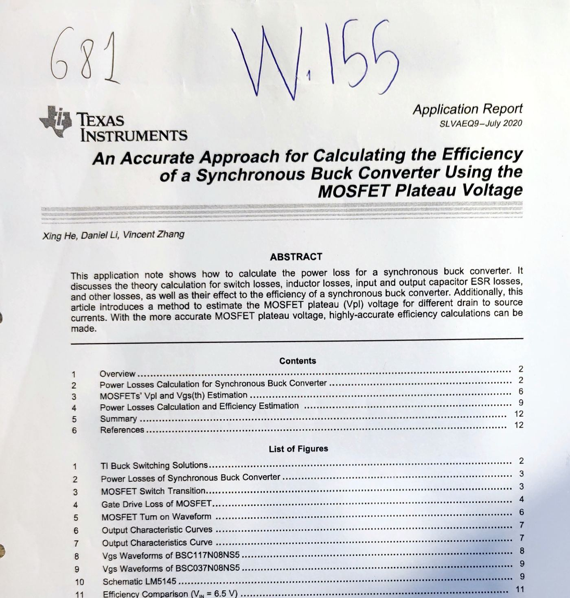

Defterden aktarilan not (`W.156`):

Burada `G81` application report'unun bu kez "losses calculation" bolumune girisi goruluyor. Yeni proje hesabi degil; toplam kayip butcesinin nasil parcalandigini ve verim formunun hangi genel yapidan kuruldugunu gosteriyor.

Sayfanin basili basligi su sekilde okunuyor:

- `Power Losses Calculation for Synchronous Buck Converter`

Sayfada guvenle okunabilen en onemli fikir, toplam kaybin parcalara ayrilmis olmasidir. Basili sekilde su toplama yapisi goruluyor:

$$
P_{total\_loss} = P_{switches} + P_{inductor} + P_{capacitors} + P_{other}
$$
Yani kaynak, buck donusturucunun toplam kaybini:

- anahtarlar / MOSFET'ler
- bobin
- kapasitörler
- diger kayiplar

seklinde parcalayarak ele aliyor.

Sayfada ayrica genel verim ifadesi de basili olarak veriliyor:

$$
\eta = \frac{V_o I_o} {V_o I_o + P_{total\_loss}} \times 100\%
$$
Bu, defterde daha once not ettigim:

- iletim kaybi
- switching kaybi
- ESR ve diger kayiplar

fikrinin tek bir ust verim denklemine baglandigini gosteriyor.

`W.155`te kaynagin genel kapsam basliklari vardi; burada ise onun tam merkezindeki iki sey, yani toplam kayip butcesi ve verim iliskisi acikca goruluyor. `W.153-W.154`teki switching-loss sayfalari ile `W.145-W.146`daki conduction-loss / `RDS(on)` dusuncesi de burada ayni cati altinda anlam kazaniyor.

Bu formulu kendi projem icin su anda "toplam kayip kapandi" diye okumuyorum. `W.156` bana ust sepeti veriyor: MOSFET kayiplari, bobin, kapasitörler ve diger kayiplar ayni verim denklemine girecek. Bu nedenle hemen arkasindan gelen `W.191-W.200` zinciri, bu sepetin MOSFET tarafini sayiya dokmeye basliyor; bobin, kapasitör ESR/ripple ve kontrolcu/yardimci kayiplar son toplam verim tablosunda ayni kosul setiyle tekrar birlestirilmeli.

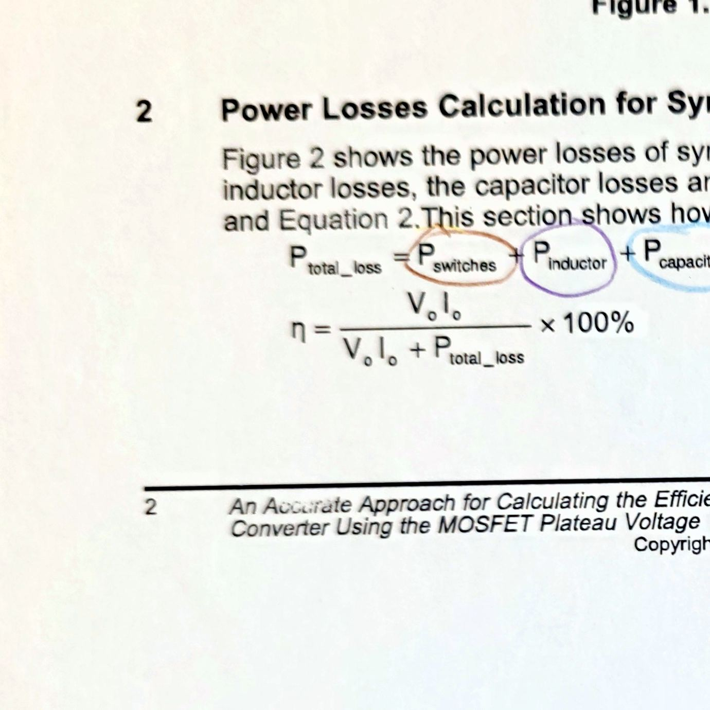

Defterden aktarilan not (`W.134`):

Burasi, sayisal kayip hesabi yapmaktan cok "MOSFET'i nasil dusunmeye basladim?" sorusuna cevap veren erken bir kavramsal not. Proje-ozel nihai sonuc sayfasi degil; MOSFET'i ilk basta gerilim kontrollu bir eleman gibi nasil kafamda kurdugumu gosteren temel bir defter sayfasi.


Sayfanin ust kisminda, en basit haliyle bir besleme, seri bir direnç ve `5 V`'luk bir cikis cizdim. Buradaki ana sezgi su:

- eger devrede ayarlanabilir bir direnç olsaydi
- `V_{in}` `9 V` ile `16 V` arasinda degisse bile
- bu direnç uzerinden dusen gerilimi ayarlayarak cikisi sabit tutmak mumkun olurdu

Sayfanin hemen altinda da bu "degisken direnç" yerine MOSFET veya BJT dusunuldugu yazilmis:

- "variable resistor yerine bir MOS ya da BJT kullanabilirim"
- "boylece variable resistor gibi davranir"

Devaminda, bir geri besleme (`Vref`) ile gate'in surulebilecegini not ediyorum:

- bir referans gerilim ile devre beslenecek
- cikis gerilimi olculecek
- ve buna gore MOSFET'in gate'i kontrol edilecek

Sayfanin son cümlesi de bu sezgiyi cok net toparliyor:

- `Vin` `9 V` ile `16 V` arasinda degisse bile
- "benim `5 V` cikisim sabit"

Burada buck konvertörün nihai topolojisini anlatmiyorum; daha cok regulasyonu ilk bakista "ayarlanabilir direnc" sezgisiyle kurdugum yeri gosteriyorum. Yeni sayisal sonuc vermiyor; ama switch-mode dusunceye gecmeden once kafamdaki ilk model bu oldugu icin kalmali.

Defterden aktarilan not (`W.135`):

Buradaki not da `W.134` ile ayni erken kavramsal hatta duruyor; ama bu kez odak, lineer regulatör benzeri bir yapinin neden verimsiz oldugunu sezgisel olarak gostermek. Proje-ozel nihai tasarim hesabi degil; switch-mode yaklasima neden ihtiyac duydugumu aciklayan temel bir verim notu.


Sayfanin ustunde, su dogrudan soruyu soruyorum:

- "Peki ya neden soldaki devreler kullanilmiyor?"
- cevap olarak da tek kelime yaziyor:
  - `efficiency`

Ardindan cok basit bir lineer-regülatör benzeri guc bakisi kuruyorum. Once ideal bir varsayim not ediyorum:

- `I_{in} = I_{out}` kabul edelim
- hic toprak / kablo / anahtar kaybi yok diyelim
- buna ragmen verim sinirli kalir

Bu sezgiyi gostermek icin sayfada su temel iliski yazilmis:

$$
\eta = \frac{P_{out}}{P_{in}} = \frac{V_o I_{out}}{V_{in} I_{in}} \approx \frac{V_o}{V_{in}}
$$
Sayfadaki somut ornek de su yone cikiyor:

$$
\eta \approx \frac{5\,\text{V}}{15\,\text{V}} \approx 0.33
$$
ve bunu kisa bir notla yorumluyorum:

- "olsa verimlilik `%33` gibi surunur"

Sayfanin alt kisminda da bu fikir daha genel bir cümleyle toparlaniyor:

- bu tur devrelere "linear regulator" denebilir
- kucuk bir aleti yansitmak/duzenlemek icin giristeki enerjinin neredeyse tamamini cikisa ulastirmak istiyoruz
- peki bunu nasil yapabiliriz?

Burada yeni buck komponent hesabi yok; ama `W.134`ten sonra neden yalnizca lineer dusunmenin yetmedigini, neden verim tarafina gecmek zorunda kaldigimi gosteriyor. Yani "regulasyon" dusuncesinden "verimli regulasyon" dusuncesine gecis burada basliyor.

`W.134-W.135`i burada tutmamın nedeni, MOSFET kayip formullerinden once zihindeki ilk modeli gostermesi. Bunlar senkron buck'in final calisma sekli degil; "cikisi sabit tutmak" fikrinden "bunu yakarak degil, anahtarlayarak yapmak lazim" fikrine gecis izi. Sonraki `W.118-W.119` ve `W.191-W.200` zinciri de bu sezgiyi artik enerji, guc ve kayip kalemleri olarak sayiya dokuyor.

#### 5.6.3 Ilk kayip notlari

`Verimlilik.txt` icinde bu aday MOSFET ve secilen frekans civari icin su ilk tahminler yer aliyor:

- toplam MOSFET switching kaybi `~540 mW`
- toplam MOSFET conduction kaybi `~1.65 W`

Bu sayilari son dogrulanmis sonuc gibi okumuyorum; ilk kayip dusuncesini gosteren taslak degerler bunlar:

- bu tasarimda iletim kaybi, switching kaybindan daha baskin gorunuyor
- buna ragmen `332 kHz` frekansinda switching kaybi ihmal edilecek kadar kucuk degildir

Bu da secilen frekansin ve secilen MOSFET'in birlikte okunmasi gerektigini gosteriyor.

Bu giris satirlarini daha sonraki defter zincirinin ozeti gibi degil, ilk olcek koyma noktasi gibi tutuyorum. `~540 mW` switching kaybi, `W.153-W.154`te acilan `208.2 mW / 310.3 mW` high-side switching parcasi ile birebir ayni kapsamda olmayabilir; hangi MOSFET'lerin, hangi `V_{in}` kosulunun ve hangi gecis surelerinin toplandigi tekrar eslestirilmeli. `~1.65 W` conduction kaybi da `W.191-W.192`de high-side / low-side ve `24 V / 36 V` kosullarina ayrilarak daha okunur hale geliyor. Yani bu iki satir yon gosteriyor; son kapanis ayrintili kayip tablosunda yapilacak.

Defterden aktarilan not (`W.118`):

Buradaki not kisa ve biraz silik; ama ana fikir belli: kayip hesabinda once enerji, sonra guc dusunuluyor. Alt satirda acikca su hatirlatma yazilmis:

```text
Joule = Watt x saniye
```

Ust taraftaki ifade tam net degil; yine de `V_{DS}` ve akimdan hareketle bir anahtarlama olayi sirasinda harcanan enerjiyi yazmaya calistigim anlasiliyor. Notasyon, su tip bir ucgen / ortalama guc sezgisine isaret ediyor olabilir:

$$
E_{sw} \sim \left(\frac{V_{DS}\,I_D}{2}\right) t_{sw}
$$
Sayfada ayrica `Vout`, `Cout` ve `saniye` ifadeleri birlikte geciyor; bu da enerji veya gucun zamanla iliskisini kurmaya calistigini gosteriyor.

Burasi tam okunur bir nihai hesap sayfasi degil. Benim icin asil korunacak fikir su: anahtarlama olaylarinda once enerji dusunuluyor, sonra frekansla ortalama guce geciliyor.

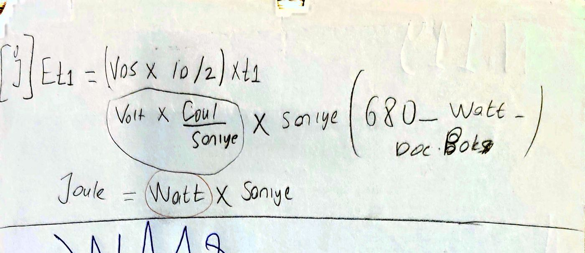

Defterden aktarilan not (`W.119`):

Burada TI'nin `MOSFET power losses and how they affect power-supply efficiency` baslikli kaynak makalesinin uzerine alinmis not var. Bu sayfada proje-ozel tekil sonuc yok; daha cok kayip butcesinin hangi ana kalemlerden olustugunu hatirlatan bir kaynak notu var.

Sayfadaki basili figürler ve el yazisi notlardan korunacak ana fikirler sunlar:

- lineer regulator ile switching regulator arasindaki temel fark, kayiplarin dagiliminda da kendini gosterir
- buck donusturucude kayiplar tek bir elemanda toplanmaz; birden fazla kayip kalemi vardir
- MOSFET kayiplari, toplam verim hesaplamasinin yalnizca bir parcasi olsa da kritik parcadir

Sayfada isaretlenen genel kayip kategorileri:

- iletim kayiplari (`conduction losses`)
- anahtarlama kayiplari (`switching losses`)
- gate-drive ile iliskili kayiplar
- bobin / PCB izi / kontrol devresi gibi diger kayiplar

Benim notum da burada su yone cikiyor:

- eger `100 W` civari cikis gucunde toplam kayip `10 W` seviyesinde ise
- verim yaklasik `%90` mertebesine gelir

Bu `100 W / 10 W -> %90` satirini proje verim sonucu gibi almiyorum. Burada yaptigim sey, kayip butcesinin verim uzerindeki buyuk etkisini hizli bir olcekle gormek. Bu proje icin `90%` hedefi tasarim gereksinimi olarak yukarida duruyor, `WEBENCH` tarafinda da ayri bir hizli teyit var; ama son kabul yine ayni kosul setinde toplanmis gercek kayip kalemleriyle yapilacak.

[Çapraz Teyit] `WEBENCH` operating-values snapshot'i toplam davranis icin `Efficiency = 97.877%` gosteriyor. Bu, `%90` minimum verim hedefi acisindan olumlu bir hizli kontrol; fakat `Ta = 30 degC` kosulundaki snapshot, `76 degC board worst-case` sicaklik hedefini veya MOSFET/bobin/kontrolcu termal kapanisini tek basina dogrulamaz.

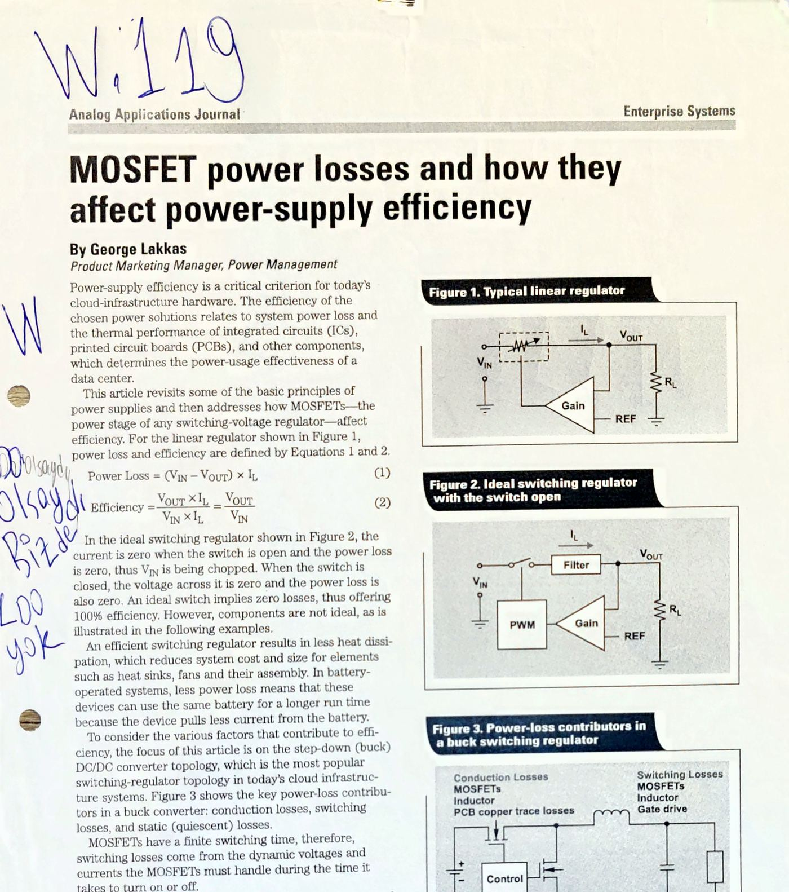

Bu yuzden `W.118-W.119` bu bolumde kalmali: once kaybin enerji/guc tarafini, sonra MOSFET kayiplarinin daha buyuk bir verim butcesinin parcasi oldugunu hatirlatiyor. Buradan sonra gelen `W.191-W.200` zinciri ise bu basliklari artik sayiya dokuyor.

Defterden aktarilan not (`W.191`):

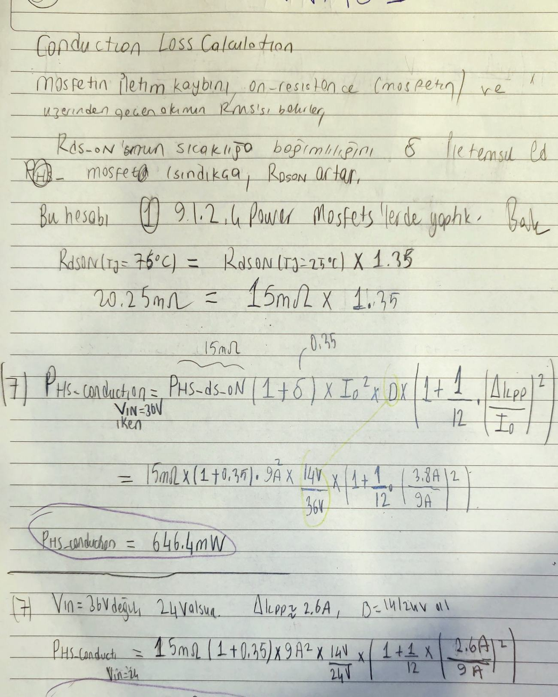

Burasi, secilen MOSFET icin ilk dogrudan `conduction loss` uygulama sayfasi. `W.145-W.146`da secim mantigi ve sicakliga gore duzeltilmis `R_{DS(on)}` tarafi kurulmustu; burada o bilgi artik yuk akimi, duty ve bobin akim dalgalanmasi ile birlesiyor. Yani high-side iletim kaybi ilk kez sayiya dokuluyor.

Sayfanin ust kisminda, iletim kaybinin fiziksel tanimini defterde kendi kurdugum sekliyle tekrar yaziyorum:

- MOSFET'in iletim kaybi, acik durumdaki kanal direnci uzerinden gecen akimin RMS degeriyle iliskilidir
- `R_{DS(on)}` sicakliga bagimlidir
- sicaklik arttikca `R_{DS(on)}` artar

Sayfada, daha once `W.146`da cikan sicaklik duzeltmesi yeniden kullaniliyor:

$$
R_{DS(on)}(T_J \approx 75^\circ C) = R_{DS(on)}(T_J=25^\circ C)\times 1.35
$$
ve sayfadaki sayisal yerlestirme:

$$
20.25\,m\Omega = 15\,m\Omega \times 1.35
$$
Ardindan high-side MOSFET icin iletim kaybi ifadesi yaziliyor. Okunabildigi kadariyla kullanilan form su yone cikiyor:

$$
P_{HS,\;conduction} \approx R_{DS(on)}(25^\circ C)\,(1+\delta)\,I_0^2\,D \left( 1+\frac{1}{12}\left(\frac{\Delta I_{L,pp}}{I_0}\right)^2 \right)
$$
Burada:

- `\delta \approx 0.35`
- `I_0 = 9\,A`
- duty `D \approx V_o/V_{in}`

olarak kullaniliyor.

Sayfanin ilk uygulamasi `V_{in}=36\,V` kosulu icin yapiliyor:

$$
P_{HS,\;cond} \approx 15\,m\Omega \times (1+0.35)\times 9^2 \times \frac{14}{36} \times \left( 1+\frac{1}{12}\left(\frac{3.8}{9}\right)^2 \right)
$$
ve sayfadaki sonuc:

$$
P_{HS,\;cond} \approx 646.4\,mW
$$
Ikinci uygulama ise `V_{in}=24\,V` kosulu icin yapiliyor:

$$
P_{HS,\;cond} \approx 15\,m\Omega \times (1+0.35)\times 9^2 \times \frac{14}{24} \times \left( 1+\frac{1}{12}\left(\frac{2.6}{9}\right)^2 \right)
$$
ve sayfadaki sonuc:

$$
P_{HS,\;cond} \approx 963.5\,mW
$$
Burada `R_{DS(on)}` secim mantigi artik dogrudan guce donusuyor. `V_{in}=24\,V` kosulunda duty buyudugu icin high-side iletim kaybinin arttigi acikca goruluyor. Formuldaki `1+\frac{1}{12}(\Delta I/I_0)^2` carpani da bobin akim dalgalanmasinin RMS akimi biraz yukselttigini hesaba kattigimi gosteriyor.

Bu iki sonucu (`646.4 mW` ve `963.5 mW`) toplam iletim kaybi gibi okumuyorum; sadece high-side MOSFET'in iletim kolu. Low-side tamamlayicisi hemen `W.192`de geliyor ve duty'nin diger tarafi olan `1-D` ile okunmali. Ayrica burada kullanilan `20.25 mOhm` zinciri `15 mOhm x 1.35` ve `T_J \approx 75 C` varsayimina bagli; termal kapanis degisirse bu high-side conduction sayilari da yeniden hesaplanacak.

Defterden aktarilan not (`W.192`):

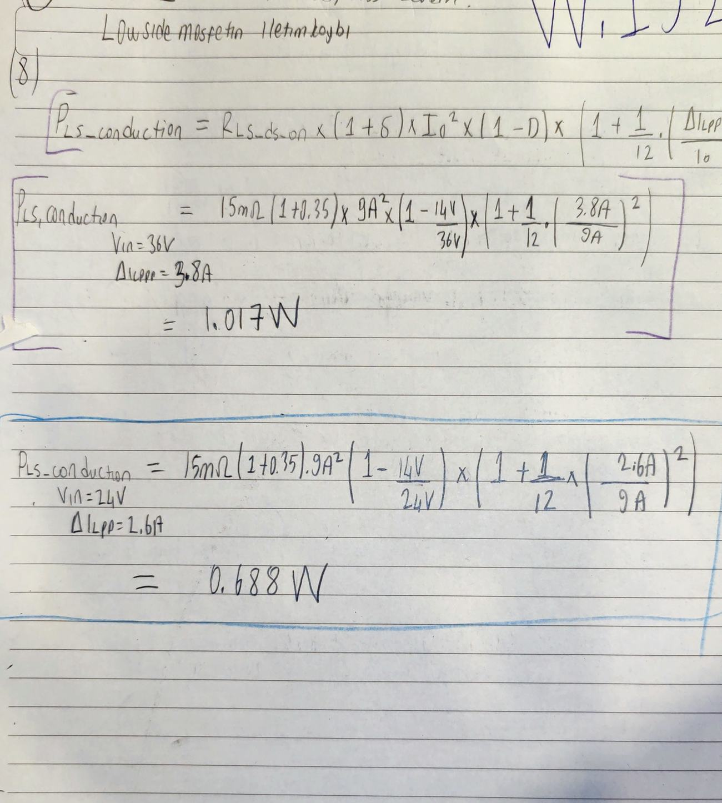

Burada `W.191`de baslayan iletim kaybi hesabinin low-side MOSFET icin yazilmis devami var.

Sayfanin basliginda acikca:

- `Conduction Loss devami`
- `Low-side mosfet iletim kaybi`

notlari yer aliyor.

Kullanilan form, `W.191`deki high-side ifadesinin tamamlayicisi:

$$
P_{LS,\;conduction} \approx R_{LS,DS(on)}\,(1+\delta)\,I_0^2\,(1-D) \left( 1+\frac{1}{12}\left(\frac{\Delta I_{L,pp}}{I_0}\right)^2 \right)
$$
Yani bu kez duty'nin kendisi yerine:

$$
1-D
$$
terimi kullaniliyor; bu da low-side MOSFET'in iletim suresini temsil ediyor.

Sayfanin ilk uygulamasi `V_{in}=36\,V` kosulu icin yapiliyor:

$$
P_{LS,\;cond} \approx 15\,m\Omega \times (1+0.35)\times 9^2 \times \left(1-\frac{14}{36}\right) \times \left( 1+\frac{1}{12}\left(\frac{3.8}{9}\right)^2 \right)
$$
ve sayfadaki sonuc:

$$
P_{LS,\;cond} \approx 1.017\,W
$$
Ikinci uygulama ise `V_{in}=24\,V` kosulu icin yapiliyor:

$$
P_{LS,\;cond} \approx 15\,m\Omega \times (1+0.35)\times 9^2 \times \left(1-\frac{14}{24}\right) \times \left( 1+\frac{1}{12}\left(\frac{2.6}{9}\right)^2 \right)
$$
ve sayfadaki sonuc:

$$
P_{LS,\;cond} \approx 0.688\,W
$$
`W.191` ile birlikte okuyunca, high-side ve low-side iletim kayiplarinin duty'ye gore nasil bolustugunu net goruyorum. `V_{in}=36\,V` kosulunda `D` kucuk oldugu icin `1-D` buyuyor ve low-side iletim kaybi artiyor; buna karsilik `V_{in}=24\,V` kosulunda high-side kaybi artarken low-side kaybi azaliyor.

Bu iki sayfayi nihai termal karar gibi degil, `24 V` ve `36 V` kosullarinda kaybin hangi MOSFET'e kaydigini gosteren temel iz olarak okuyorum. Sonraki toplam kayip ve sicaklik yorumlari bunun uzerine kurulacak.

Burada `W.191 + W.192` ara toplami eski `Verimlilik.txt` notundaki `~1.65 W` conduction tahminiyle de baglaniyor: `36 V` kosulunda `0.646 W + 1.017 W \approx 1.66 W`, `24 V` kosulunda ise `0.964 W + 0.688 W \approx 1.65 W`. Bu benim icin iki MOSFET'in sadece conduction ara toplami; switching, gate-drive, `C_{oss}`, dead-time/body-diode ve termal geri besleme henuz bu toplama dahil degil.

Defterden aktarilan not (`W.193`):

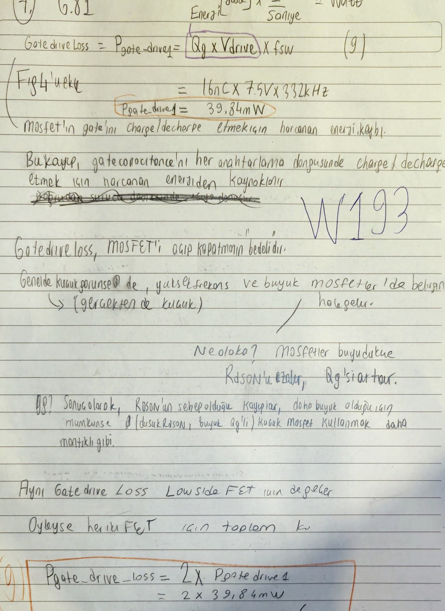

Burada iletim kayiplarindan sonra bu kez `gate-drive loss` koluna geciyorum.

Sayfanin ustunde enerji-guc iliskisi tekrar not edilmis:

$$
\text{Energy}\times \frac{1}{\text{saniye}} = \text{Watt}
$$
Ardindan gate-drive kaybi icin temel iliski yaziliyor:

$$
P_{gate-drive} = Q_g \, V_{drive}\, f_{sw}
$$
Sayfadaki sayisal yerlestirme, okunabildigi kadariyla, su yone cikiyor:

$$
P_{gate-drive} \approx 16\,nC \times 7.5\,V \times 332\,kHz \approx 39.84\,mW
$$
Sayfanin orta kisminda bu kaybin fiziksel anlami da yazilmis:

- bu kayip, MOSFET'in gate'ini her anahtarlama cevriminde sarj / desarj etmek icin gereken enerjiden gelir
- frekans arttikca bu kayip artar
- buyuk MOSFET'lerde `Q_g` buyudugu icin gate-drive kaybi da buyuyebilir

Sayfanin altinda ayni mantigin low-side MOSFET icin de gecerli oldugu not edilmis ve toplam iki MOSFET icin:

$$
P_{gate-drive,\;total} = 2 \times P_{gate-drive} \approx 2 \times 39.84\,mW \approx 79.68\,mW
$$
sonucuna gidiyorum.

Burada `R_{DS(on)}` tabanli iletim kayiplarindan ve `t_r/t_f` tabanli switching kayiplarindan ayri olarak, gate'i surmek icin de bir guc harcandigini netlestiriyorum. `Q_g`, `V_{drive}` ve `f_{sw}` ucgeni bu projede birlikte okunmali. Low-side icin ayni kaybi yazmam da toplam gate-drive kaybinin iki MOSFET uzerinden toplandigini acik ediyor.

Bu `39.84 mW / MOSFET` ve `79.68 mW` toplam sonucunu MOSFET kanal iletim kaybi gibi yazmiyorum. Bu enerji, her cevrimde gate kapasitansini doldurup bosaltmak icin `VCC/driver` tarafindan harcaniyor; isinin bir kismi driver icinde, bir kismi gate yolu direnclerinde dagilabilir. Bu yuzden son kayip tablosunda conduction/switching kalemleriyle birlikte gorunecek ama termal muhasebede `VCC/driver`, harici gate direnci ve MOSFET ic gate yolu ayrimi korunmali. Ayrica bu sonuc `Q_g \approx 16 nC`, `V_{drive} \approx 7.5 V` ve `332 kHz` setine bagli; gate-charge okumasini degistirirsem bu satir da yeniden hesaplanacak.

Defterden aktarilan not (`W.194`):

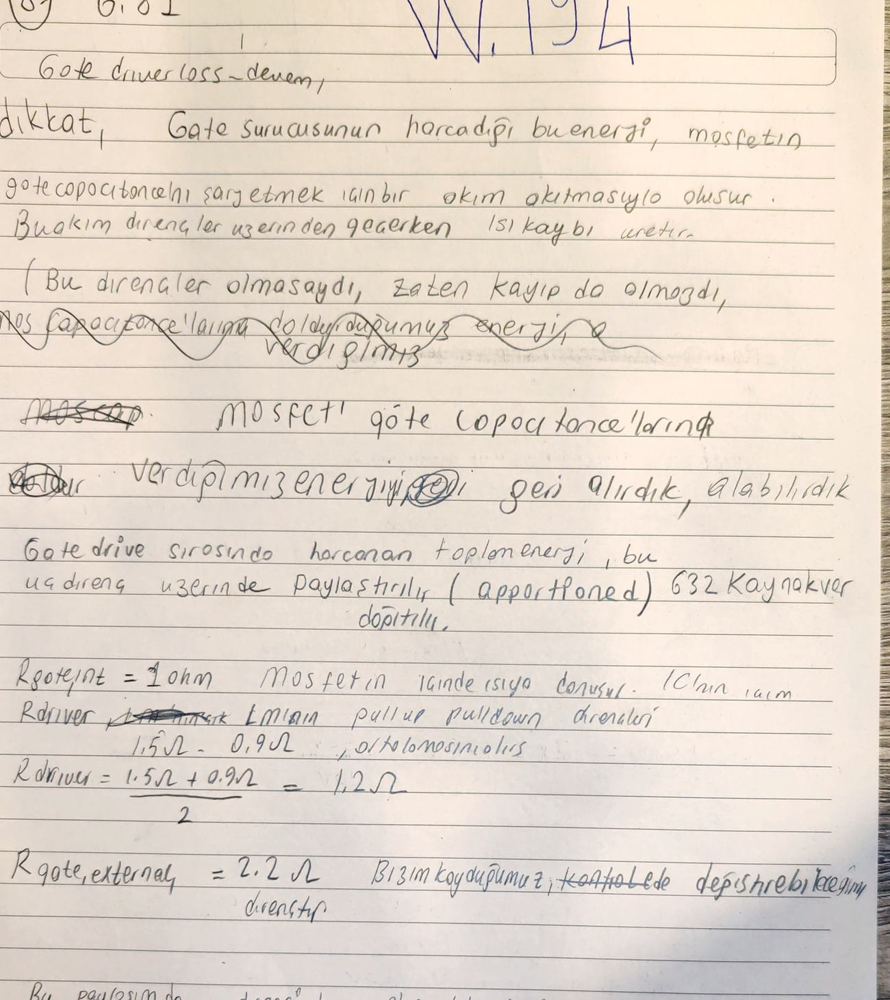

Burada `W.193`te yazdigim `gate-drive loss` ifadesini biraz daha fiziksel taraftan aciyorum. Yeni bir sayisal kayip sonucu yok; gate-charge enerjisi ile gate yolu direnci uzerindeki isi ayni sey mi, degil mi onu ayirmaya calisiyorum.

Sayfanin ustundeki ana dikkat notu su yone cikiyor:

- gate surucusunun harcadigi enerji, MOSFET gate kapasitörlerini sarj etmek icin akan akimla ilgilidir
- bu enerji akisi nedeniyle gate yolundaki direncler uzerinde de isi olusur

Burada onemli bir fiziksel ayrim yapiyorum:

- gate-drive loss'un ana kaynagi, gate kapasitanslarina her periyotta enerji yuklenip bosaltilmasidir
- direncler uzerindeki enerji, bu ayni surecin dagilim kanallarindan biridir
- dolayisiyla gate-drive kaybi sadece "direncteki isi" olarak degil, gate-charge enerjisinin tumu olarak dusunulmelidir

Sayfanin orta kismina dogru toplam gate yolu direnci de tekrar not ediliyor. Okunabildigi kadariyla:

- pull-up / surucu yolu icin etkili direncler:
  - `1.5\,\Omega`
  - `0.9\,\Omega`
- bunlarin ortalama / etkili kombinasyonundan:

$$
R_{driver,eff} \approx \frac{1.5 + 0.9}{2} = 1.2\,\Omega
$$
notu dusulmus.

Ardindan, kendi ekipmanimda / tasarimimda sectigim harici gate direncini de tekrar sabitliyorum:

$$
R_{g,ext} = 2.2\,\Omega
$$
ve bunun:

- bizim ekipmanimiz / tezgahimizda degistirilebilen bir direnç oldugu
- daha buyuk secilirse `dv/dt`'nin dusecegi
- ama termal ve kayip tarafinin da yeniden dusunulmesi gerekecegi

diye notlarla baglamisim.

Sayfanin altindaki not, konuya pratik bir tasarim karari olarak yaklasiyor:

- termal olarak daha guvenli olmak istenebilir
- ancak bu durumda PCB, layout, sogutma ve diger kayiplar birlikte dusunulmelidir

Burada yeni bir `mW` sonucu yok. Ama `W.193`teki gate-drive loss hesabinin "yalnizca formül" olmadigini gosteriyor; gate kapasitansi, gate yolu direnci ve `dv/dt` karari birlikte okunmali. `R_{g,ext}=2.2\,\Omega` notunun tekrar gecmesi de bu degerin proje kararlarinda merkezi kaldigini gosteriyor.

Bu noktada kendime bir karisiklik uyarisi birakiyorum: `W.194`teki `R_{g,ext}=2.2\,\Omega` ifadesi defterdeki eski/kaba isimlendirme gibi duruyor. Daha sonra `W.177` bu `2.2\,\Omega` degerini `R_{driver} + R_{g,external} + R_{g,internal}` toplam gate-yolu direnci olarak daha temiz aciyor. Bu yuzden final switching-time hesabinda `1.2\,\Omega` driver notunu ve `2.2\,\Omega` toplam yol notunu ust uste tekrar eklememek gerekiyor.

Defterden aktarilan not (`W.195`):


Burada `other losses` basligi altinda bu kez MOSFET'lerin `output capacitance loss` / `C_{oss}` kaybina geciyorum.

Sayfanin ustunde acikca:

- `Other losses`
- `Output capacitance losses`

notlari yer aliyor.

Sayfada `C_{oss}` kaybi icin standart enerji yaklasimina dayanan iki denklem var. El yazisi tam net olmasa da, not ettigim ana fikir su yone cikiyor:

$$
P_{Coss} \propto \frac{1}{2}\,C_{oss,\;ave}\,V^2\,f_{sw}
$$
Bu sayfanin asil isi, `C_{oss,ave}` degerlerini proje kosuluna gore yeniden bulmak:

Once genel ortalama kapasite iliskisini not ediyorum:

$$
C_{oss,\;ave} \approx 2\,C_{oss,\;spec}\sqrt{\frac{V_{DS,spec}}{V_{DS,app}}}
$$
Buradan high-side MOSFET icin daha onceki sayfalarda kullanilan deger tekrar hatirlatiliyor:

$$
C_{oss,HS,\;ave} \approx 783\,pF
$$
Ardindan, small low-side MOSFET icin ayri bir kontrol yapiyorum ve onemli bir uyari not ediyorum:

- `V_{DS,LS,OFF} = 14 V`, `22 V` degil

Yani low-side MOSFET icin `C_{oss}` ortalamasini ayrica, kendi `off-state` gerilimine gore bulmam gerekiyor.

Sayfadaki sayisal yerlestirme, okunabildigi kadariyla, su yone cikiyor:

$$
C_{oss,LS,\;ave} \approx 2 \times 265\,pF \times \sqrt{\frac{50\,V}{14\,V}} \approx 982.8\,pF
$$
Bu sayfada benim icin asil not su: bu kayip kolunda nominal / ezber kapasite degerlerini dogrudan almamam gerekiyor. Sayfa kabaca su uyarilari tasiyor:

- `C_{oss}` gerilime bagli degisir
- uygulama notundaki kaba degerleri dogrudan almak yerine
- proje kosuluna gore kendi `C_{oss,ave}` degerlerini kullanmak daha dogrudur

Burada yeni bir nihai `mW` sonucu yok; ama `C_{oss}` kaybi icin kullanacagim ortalama kapasite degerlerini proje kosuluna tasiyorum. `C_{oss,HS,\;ave} \approx 783\,pF` ve `C_{oss,LS,\;ave} \approx 982.8\,pF` notlari sonraki `C_{oss}` kayip hesabinin temel girdileri. Low-side MOSFET icin `V_{DS,OFF}`'u ayri dusunmem de iki cihazi ayni kapasite gibi ele almamam gerektigini gosteriyor.

Defterden aktarilan not (`W.196`):


Burada `W.195`te bulunan `C_{oss,ave}` degerlerini bu kez once `Q_{oss}` gibi okuyup sonra guce donusturuyorum.

Sayfanin ustunde once `Q_{oss}` icin temel iliski yaziliyor:

$$
Q_{oss} = C_{oss,\;ave}\,V_{DS,off}
$$
Ardindan `W.195`ten gelen ortalama kapasite degerleriyle iki MOSFET icin ayri yuk degerleri hesapliyorum:

High-side icin:

$$
Q_{oss,HS} = 783\,pF \times 22\,V \approx 17.23\,nC
$$
Low-side icin:

$$
Q_{oss,LS} = 983\,pF \times 14\,V \approx 13.76\,nC
$$
Sayfanin devaminda, bu kez `W.195`te not edilen `(10)` ve `(11)` tipindeki denklemler kullanilarak guce geciliyor. High-side MOSFET icin:

$$
P_{HS,Coss} = \frac{1}{2}\,Q_{oss,HS}\,V_{in}\,f_{sw}
$$
Sayfadaki sayisal yerlestirme:

$$
P_{HS,Coss} = \frac{1}{2}\times 17.23\,nC \times 36\,V \times 332\,kHz \approx 102.86\,mW
$$
Low-side MOSFET icin de benzer sekilde:

$$
P_{LS,Coss} = \frac{1}{2}\,Q_{oss,LS}\,V_{in}\,f_{sw}
$$
ve sayfadaki sonuc:

$$
P_{LS,Coss} \approx \frac{1}{2}\times 13.76\,nC \times 36\,V \times 332\,kHz \approx 82.15\,mW
$$
Burada `W.195`teki ortalama `C_{oss}` degerlerini artik dogrudan kayip gucune ceviriyorum. Iki MOSFET icin farkli `Q_{oss}` bulunmasi, low-side ve high-side'i ayni kapasite / ayni gerilim gibi ele almadigimi gosteriyor. Bu kol iletim kaybi kadar buyuk degil; ama sifir da degil, yani `other losses` basligi bosuna durmuyor.

Defterden aktarilan not (`W.197`):


Burada `W.196`da high-side ve low-side icin ayri ayri buldugum `C_{oss}` kayiplarini bu kez tek bir toplam ifade altinda yeniden yazip teyit ediyorum. Yeni bagimsiz bir kayip kolu degil; daha cok toplama ve teyit sayfasi.

Sayfanin ustunde once bir onceki sayfadan gelen ara sonuclar hatirlatiliyor:

- `P_{HS,Coss} \approx 102.9\,mW`
- `P_{LS,Coss} \approx 82.1\,mW`

Ardindan, uygulama notundaki daha toplu bir ifadeyi not ediyorum:

$$
P_{Coss} = f_{sw}\,\left(V_{in}\,Q_{oss2} + E_{oss1} - E_{oss2}\right)
$$
Sayfanin ortasinda `E_{oss}` terimleri de tek tek yaziliyor. Okunabildigi kadariyla:

High-side icin:

$$
Q_{oss1} = 17.23\,nC
$$
ve:

$$
E_{oss1} \approx \frac{1}{2}\,Q_{oss1}\,V_{in} \approx \frac{1}{2}\times 17.23\,nC \times 36\,V \approx 0.310\,\mu J
$$
Low-side icin:

$$
Q_{oss2} = 13.76\,nC
$$
ve sayfadaki enerji terimi, okunabildigi kadariyla, su yone cikiyor:

$$
E_{oss2} \approx \frac{1}{2}\,Q_{oss2}\,V_{in} \approx 0.248\,\mu J
$$
Ardindan toplam ifade icine yerlestirme yapiliyor:

$$
P_{Coss} \approx 332\,kHz \times \left[ (36\,V)(13.76\,nC) 0.310\,\mu J -0.248\,\mu J \right]
$$
ve sayfadaki toplam sonuc:

$$
P_{Coss,\;total} \approx 185\,mW
$$
olarak kutulanmis.

Burada `W.196`daki iki ayri sonucu toplam bir `P_{Coss}` ifadesiyle yeniden yaziyorum. Bulunan `185\,mW` sonucu, `102.9\,mW + 82.1\,mW \approx 185\,mW` toplamina da yakin; yani iki farkli yazim ayni buyukluk mertebesine gidiyor. Enerji terimlerindeki notasyon yer yer silik olsa da, `Q_{oss}` ile `E_{oss}` arasindaki iliskiyi kurmaya calistigim belli.

Bu uclu zinciri (`W.195-W.197`) su anda nihai termal karar gibi degil, `C_{oss}` kaybinin hesaba nasil sokuldugunu gosteren ara iz olarak okuyorum. Degerler korunuyor; ama son toplam kayip/verim kararinda datasheet ve simulasyonla tekrar kontrol edilmeli.

Bu `185 mW` sonucunu `W.153-W.154`teki gerilim-akim ortusme switching kaybiyla ayni satir gibi toplamamaya dikkat edecegim. Oradaki `208.2 mW / 310.3 mW` high-side overlap parcasi, buradaki `C_{oss}` enerji bosalip dolma parcasi ise ayri kayip mekanizmasi. Final tabloda ikisi birlikte yer alabilir; ama uretici `E_{oss}` / `Q_{oss}` modeli veya LTspice dalga sekli ayni enerjiyi zaten icine aliyorsa cift sayim yapilmamali. Bu satir ayrica `36 V`, `332 kHz` ve `C_{oss,ave}` okumasina bagli bir ara sonuc olarak kalacak.

Defterden aktarilan not (`W.198`):


Burada `W.197`de bulunan toplam `C_{oss}` kaybini bu kez hem `LM` tarafindaki denklemle hem de fiziksel enerji akisi yorumuyla tekrar teyit ediyorum. Yeni bagimsiz bir hesap sayfasi degil; daha cok yorum ve teyit sayfasi.

Sayfanin ustunde acik bir teyit notu yer aliyor:

- `LM'deki denklemle Pcoss = 185 mW`

Hemen altinda da onceki iki sonucu tekrar topluyorum:

$$
P_{HS,Coss} + P_{LS,Coss} = 102.9\,mW + 82.2\,mW \approx 185.1\,mW
$$
ve bunun:

- `ayni cikti`

verdigi not ediliyor. Bu, `W.196-W.197` hattinin uygulama notundaki toplam formulle ayni yere geldigini gosteren iyi bir teyit izi.

Sayfanin orta ve alt kismindaki notlar, `C_{oss}` kaybinin fiziksel yorumunu da acikliyor:

- high-side MOSFET kapanirken bobin akimi `C_{oss1}`'i sarj eder
- bu sirada kapasitorde enerji depolanir
- high-side tekrar acilirken ve low-side tarafinda `C_{oss2}` bosalirken / sarj olurken
- bu enerji akislarinin bir kismi geri kazanilsa da bir kismi kayip olarak ortaya cikabilir

Sayfada ozellikle:

- `Eoss1 ve Eoss2 dengesi`

ifadesiyle, iki enerji teriminin neden denklemde fark seklinde gorundugunu anlamaya calisiyorum.

Son notum da onemli:

- `LM'deki denklem bunu dikkate aliyor`

Yani burada sadece sayisal toplama yok; uygulama notundaki daha fiziksel ifadenin neden kullanildigini de anlamaya calisiyorum.

Burada yeni bir `mW` sonucu cikmiyor; ama `185 mW` sonucunun hem parcali toplamla hem de `LM` denklem yorumu ile uyumlu oldugu goruluyor. `C_{oss}` kaybini ezber formulle degil, enerji depolama / bosaltma dengesi olarak dusunmeye calistigim kisim burada net.

Defterden aktarilan not (`W.199`):


Burada `other losses` basligi altinda `C_{oss}` kaybindan sonra iki yeni kayip kalemine geciyorum:

1. `body diode reverse recovery`
2. `body diode dead-time loss`

Yani bu noktada govde diyoduna bagli ek kayiplar ayri baslik olmaya basliyor.

Sayfanin ust kutusunda once `reverse recovery` tarafi yaziliyor. Okunabildigi kadariyla temel iliski su yone cikiyor:

$$
P_{RR} \approx V_{in}\,f_{sw}\,Q_{rr}
$$
ve sayfadaki sayisal yerlestirme, okunabildigi kadariyla, su yone isaret ediyor:

- `Q_{rr} \approx 5\,nC`
- bu deger icin ekstra bir marj / carpana benzer `1.3` notu da dusulmus

Sonuc satiri, okunabildigi kadariyla:

$$
P_{RR} \approx 77.688\,mW
$$
Yan notum da bunun:

- biraz kaba
- sicaklik ve benzeri parametrelerden etkilenecek

bir ilk tahmin oldugunu gosteriyor.

Sayfanin alt yarisinda ikinci kayip kalemi olarak `body diode dead-time loss` yaziliyor. Burada ana fikir su: dead-time boyunca akim MOSFET kanali yerine govde diyodu uzerinden akarsa ek iletim kaybi olusur.

Okunabildigi kadariyla kullanilan ifade su yone cikiyor:

$$
P_{dead} \approx V_F\left(I_0-\frac{\Delta I_{L,pp}}{2}\right)t_{dr}f_{sw} + V_F\left(I_0+\frac{\Delta I_{L,pp}}{2}\right)t_{df}f_{sw}
$$
Sayfadaki net gorunen parametreler:

- `V_F \approx 0.87\,V`
- `I_0 = 9\,A`
- `\Delta I_{L,pp} = 3.8\,A`
- `t_{dr} \approx 6.8\,ns`
- `t_{df} \approx 39\,ns`
- `f_{sw} \approx 332\,kHz`

Sayfadaki kutulu sonuc, okunabildigi kadariyla:

$$
P_{dead} \approx 130\,mW
$$
Burada `C_{oss}` kaybindan farkli olarak body-diode ile iliskili iki ek kaybi ayri ayri dusunuyorum. `P_{RR}` sonucu tam sayisal olarak biraz bulanik; o yuzden burada buyukluk mertebesi ve form korunmali. `P_{dead}` tarafinda ise `V_F`, `t_{dr}`, `t_{df}` ve kutulu `130 mW` sonucu daha net. Bu iki deger son toplam kayip tablosuna giderken tekrar kontrol edilecek ara izler.

Bu sayfayi low-side MOSFET'in normal `1-D` iletim kaybinin yerine koymuyorum. `W.192` kanal iletimi icin; buradaki `P_{RR}` ve `P_{dead}` ise anahtar degisimleri sirasindaki kisa diyot / recovery pencereleri icin ek kalem. Ozellikle `130 mW` sonucunu `V_F`, `t_{dr}`, `t_{df}`, `Q_{rr}`, sicaklik ve gercek LM5146 dead-time davranisina bagli ara sonuc gibi okumak lazim. LTspice veya olcumde body diode iletim suresi azalirsa bu kalem de degisecek.

[Yönlendirme - termal/kayip owner] `W.200` icindeki `P_{IC} = 36 V x 1.8 mA = 64.8 mW`, `R_{sense}` kaybi, bobin ve kapasitör/ESR acik kalemleri `5.9 Termal ve Kayıp Kapanışı` altina tasindi. Bu kisim MOSFET kayip zincirinin sonunda sadece su ayrimi hatirlatir: kontrolcu yardimci kaybi MOSFET junction kaybi degildir; son verim/termal tablosunda ayri satirda kapanacak.

Buradan sonra defter sayfa numarasi geri sariyor gibi gorunuyor: `W.124`, `W.128` ve devamindaki sayfalar `W.191-W.200`den sonra yazilmis yeni toplam sonuclar degil. Bunlari burada tutuyorum cunku `W.191-W.200` kayip zincirinde kullandigim kaynak/yontem arka planini ve G81/G90 ayrimini anlatiyorlar. Yani akista bu kisim kronoloji degil, kayip hesabinin metod defteri gibi okunmali.

Defterden aktarilan not (`W.124`):

Burada dogrudan yeni bir kayip hesabi yok; daha cok `G81` ve `G90` kaynaklarini nasil birlikte kullanacagima dair metodoloji notu var. Yani "hangi denklem hangi kaynaktan alinacak?" sorusuna verilmis kisa bir defter cevabi gibi.

Sayfada guvenle okunabilen ana notlar sunlar:

- `G81`: `An Accurate Approach for Calculating the Efficiency of a Synchronous Buck Converter Using the MOSFET Plateau Voltage`
- burada:
  - bobin (`inductor`) kayiplari dahil edilmistir
  - kapasitör kayiplari eksik / sinirli ele alinmistir
  - `ESR` tarafi ayrica dikkat istemektedir
- en kritik not:
  - `G81` icindeki denklemler kullanilabilir
  - fakat zaman ekseni / dalga sekli sezgisi icin `G81`'deki ilgili sekle degil, `G90` icindeki uygun sekillere bakilmalidir
- sayfada bu fikir cok kisa su sekilde ozetlenmis:
  - `Yani denklem G81'den, sekil G90'dan`

Burasi nihai kayip sonuclari veren bir hesap sayfasi degil. Bu sayfayi burada tutmamim nedeni, kayip analizi yaparken tek kaynaga koru korune baglanmadigimi gostermesi: denklem icin bir kaynak, dalga sekli / fiziksel sezgi icin baska bir kaynak kullanmisim. Ozellikle `G81` ve `G90` arasindaki bu ayrim, ileride kayip hesap zinciri gozden gecirilirken hangi adimin hangi kaynaga dayandigini anlamak icin lazim.

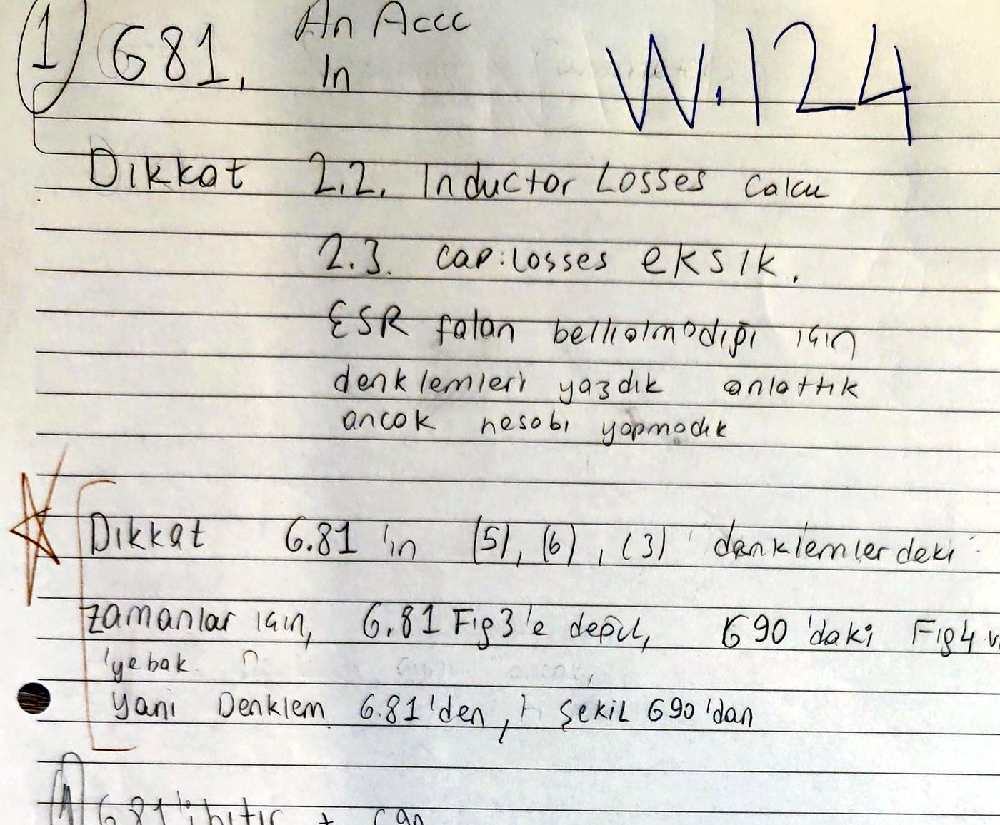

Defterden aktarilan not (`W.128`):

Burada `W.124`te not edilen `G81` yontemini gercekten denemeye basladigim ilk ciddi parametre-cikarma sayfasi var. Bu dogrudan nihai kayip sonucu degil; `transfer characteristic` egrisinden hareketle MOSFET icin yaklasik `V_{GS(th)}` ve `Miller plateau` gerilimini bulmaya calistigim ara sayfa.

Sayfada once klasik kare-kanun yaklasimi yaziliyor:

$$
I_{D1} = K_n \left(V_{GS1} - V_{GS(th)}\right)^2
$$
$$
I_{D2} = K_n \left(V_{GS2} - V_{GS(th)}\right)^2
$$
Buradan, iki farkli `I_D - V_{GS}` noktasindan esik gerilimi cikarmak icin su tip bir ifade yaziyorum:

$$
V_{GS(th)} \approx \frac{V_{GS2}\sqrt{I_{D1}/I_{D2}} - V_{GS1}} {\sqrt{I_{D1}/I_{D2}} - 1}
$$
Sayfadaki sayisal yerlestirme okunabildigi kadariyla yaklasik su yone cikiyor:

$$
V_{GS(th)} \approx 3.906\,\text{V}
$$
Ardindan doygunluk kosullarini kisa bir kontrol notu olarak ayri kutuya aldim:

- `V_{GS} > V_{GS(th)}`
- `V_{DS} > V_{GS} - V_{GS(th)}`

Sonra ayni sayfada, yukaridaki `V_{GS(th)}` kullanilarak `K_n` katsayisi icin su tip bir ifade yaziliyor:

$$
K_n \approx \frac{I_D}{\left(V_{GS} - V_{GS(th)}\right)^2}
$$
ve sayfadaki sonuc, okunabildigi kadariyla:

$$
K_n \approx 10.034
$$
Devaminda da `Miller plateau` gerilimi icin su tip bir iliskiyi kuruyorum:

$$
V_{PL} \approx \sqrt{\frac{I_D}{K_n}} + V_{GS(th)}
$$
Sayfadaki sayisal sonuc burada tam net degil; yazim `4.95 V` ile `6 V` bandinda bir ara degeri hedefliyor gibi. Burada asil alinacak sey kesin rakamdan cok yontemin kendisi.

Sayfanin alt kisminda ayrica sicaklik duzeltmesi notu var:

- `T_J \approx 73.9\,^\circ\text{C}` gibi bir tahmin yazilmis
- `V_{GS(th)}` icin tipik sicaklik katsayisi:
  - `-8.5 mV / ^\circ C`
- buna gore `25 ^\circ C` datasheet degerinden sicaklik kaynakli kayma ayrica not edilmis

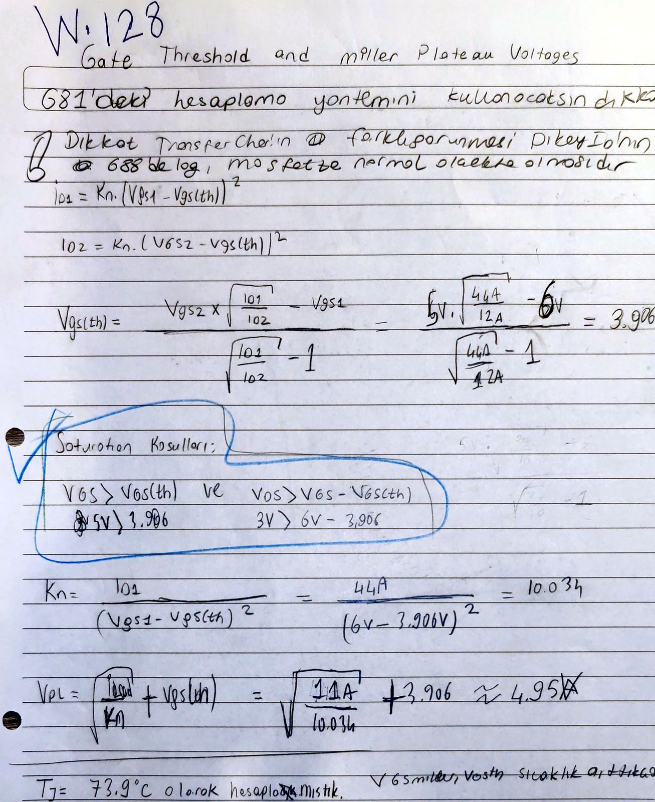

Bu sayfada `G81` yonteminin "denklem G81'den" kismini gercekten deniyorum. Urettigim `V_{GS(th)}`, `K_n` ve `V_{PL}` degerleri daha sonra switching-loss veya plateau-voltage tabanli hesaplarda kullanilmis olabilir; ama `V_{PL}` sayisal sonucu tam net okunmadigi icin burada kesin rakamdan cok yontem ve buyukluk mertebesi korunmali.

Bu yuzden `W.128`deki `V_{GS(th)} \approx 3.906 V`, `K_n \approx 10.034` ve belirsiz `V_{PL}` hattini final MOSFET parametreleri gibi kilitlemiyorum. Hemen arkasindan gelen `W.173` zaten "bu bilgi yeterli mi?" diye frene basiyor; `g_{fs}` gibi small-signal bir veriyi dogrudan plateau hesabina tasimanin riskini not ediyor. Finalde bu parametreler secilen `I_D`, `V_{DS}`, `T_J`, `V_{drive}` ve gate yolu kosullariyla, gerekirse datasheet egri okuma / LTspice / olcumle tekrar ayni noktaya getirilecek.

Defterden aktarilan not (`W.173`):

Burada, `V_{GS(th)}` ve `Miller plateau` gerilimini hesaplarken hangi datasheet bilgisinin kullanilmasi gerektigi konusunda bir yontem uyarisi var. Yeni nihai proje sonucu degil; `W.128`te baslayan `V_{GS(th)}` / `V_{PL}` hesabina "bu bilgi yeterli mi?" diye geri donen bir sorgulama notu.

Sayfanin basliginda acikca:

- `Gate Threshold ve Miller platosu gerilimi`

yaziyor.

Sayfanin ust satirlarinda, bu buyukluklerin:

- MOSFET'in ne zaman iletime gectigini
- anahtarlama kaybinin hangi aralikta olustugunu

anlamak icin hesaplandigini not ediyor.

Orta kisimda cok onemli bir metodoloji notu var:

- `datasheet'te dogrudan verilmez`
- `ya da gormezsen`
- `hesaplama yontemi`

Ardindan, datasheet'teki `g_fs` / `\Delta I_D / \Delta V_{GS}` benzeri kucuk-isaret bilgisini kullanma fikrine deginiyorum; fakat hemen yanina da su tur bir uyari dusuyorum:

- gate gerilimindeki kucuk bir degisiklikten
- drain akiminin ne kadar arttigi bulunabilir
- ancak bu bilgi tek basina `V_{GS(th)}` ve `V_{PL}` icin guvenli buyuk-isaret hesabi olmayabilir

Sayfadaki en kritik mesajlardan biri bu:

- `Dikkat: bu yontemle de hesaplanmiyor`
- `cunku gfs bir small-signal parametresidir`

Yani burada, kucuk-isaret transconductance bilgisini alip dogrudan buyuk-isaret / plateau hesabina tasimanin dogru olmayabilecegini kendi kendime sorguluyorum. Bu iyi bir fren; cunku `g_fs` ile her sey cozuluyor gibi davranmak istemiyorum.

Sayfada ayrica:

- `G81 Fig.3'e bak`
- `mutlaka`

notu yer aliyor.

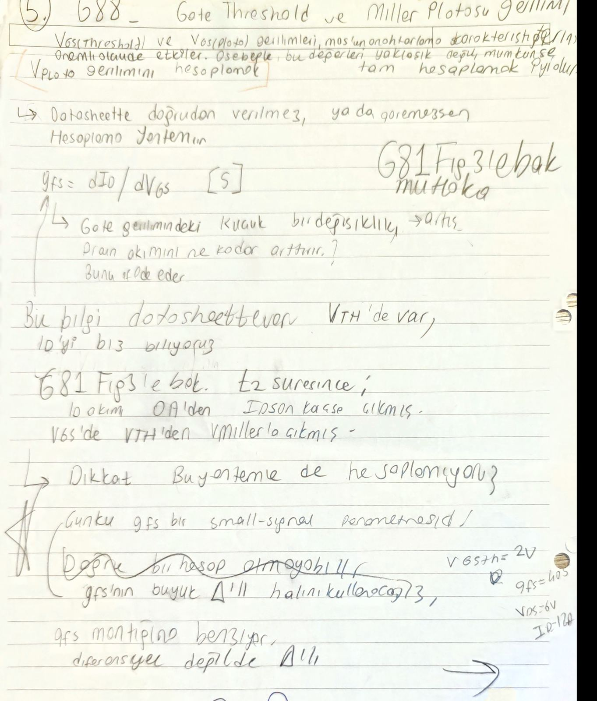

Bu da `V_{GS(th)}` ve `Miller plateau` yorumunun yalnizca basit cebirle degil, turn-on dalga sekli ve interval mantigiyla birlikte dusunulmesi gerektigi mesajini guclendiriyor.

Burada yeni bir sayisal sonuc yok; ama daha onemli bir sey var: `W.128`teki parametre-cikarma akisini koru korune kabul etmemisim. Hangi datasheet buyuklugunun bu is icin uygun oldugunu ayri bir kez sorgulamam, `W.128`deki `V_{GS(th)}` / `K_n` / `V_{PL}` hattina metodolojik bir fren koyuyor.

Defterden aktarilan not (`W.174`):

Burada `W.173`teki metodoloji uyarisindan sonra ayni `G88` hattinda daha somut bir `V_{GS(th)}` / `V_{GS,miller}` uygulamasi deniyorum. Yeni nihai proje sonucu degil; datasheet'teki yuksek sicaklik egrisinden `V_{TH}`, `K` ve `V_{GS,miller}` turetmeye calisan bir ara uygulama.

Sayfanin ust kisminda, `150^\circ C` egrisi uzerinden iki nokta okuyarak ilerliyorum. Okunabildigi kadariyla secilen iki nokta sunlar:

- `I_{D1} = 3 A`
- `I_{D2} = 20 A`
- `V_{GS1} \approx 4.13 V`
- `V_{GS2} \approx 5.61 V`

Sonra klasik kare-kanun iliskisini tekrar yaziyorum:

$$
I_{D1} = K \left(V_{GS1} - V_{TH}\right)^2
$$
$$
I_{D2} = K \left(V_{GS2} - V_{TH}\right)^2
$$
Buradan `V_{TH}` icin sayfada su tip bir ifade turetiyorum:

$$
V_{TH} = \frac{V_{GS1}\sqrt{I_{D2}} - V_{GS2}\sqrt{I_{D1}}} {\sqrt{I_{D2}} - \sqrt{I_{D1}}}
$$
ve sayfadaki sonuc okunabildigi kadariyla:

$$
V_{TH} \approx 3.157 V
$$
Sonra ayni sayfada `K` katsayisini hesapliyorum:

$$
K \approx \frac{I_{D1}}{\left(V_{GS1} - V_{TH}\right)^2}
$$
ve sayfadaki sayisal sonuc:

$$
K \approx 3.169
$$
Ardindan Miller / plateau gerilimi icin su iliskiyi kullaniyorum:

$$
V_{GS,miller} = V_{TH} + \sqrt{\frac{I_{load}}{K}}
$$
Sayfada bu adimdan elde edilen bir ilk `V_{GS,miller}` degeri not edilmis; okunabildigi kadariyla bu ilk deger `4.4 V` civarindadir.

Sayfanin alt kisminda sicaklik duzeltmesine ozellikle dikkat cekiyorum:

- `VTH` sicaklik arttikca azalir
- kullanilan egrinin `150^\circ C`'ye ait oldugu
- gercek calisma noktasinin ise yaklasik `T_J = 100^\circ C` civarinda dusunuldugu

Bu nedenle bir sicaklik katsayisi ile duzeltme uyguluyorum. Okunabildigi kadariyla mantik su:

$$
\Delta V_{th} = \left(T_J - 150^\circ C\right)\cdot T.C.
$$
ve sayfada bu fark yaklasik:

$$
\Delta V_{th} \approx +0.35 V
$$
olarak kullanilmis.

Son satirlarda da buna gore duzeltilmis buyuklukler not edilmis:

- `V_{TH} \approx 3.51 V`
- `V_{GS,miller} \approx 4.76 V`

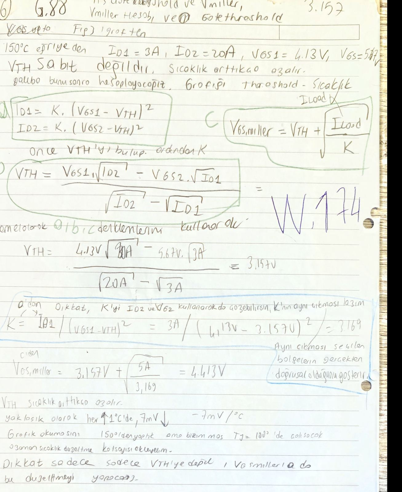

Bu sayfayi net sonuc gibi degil, `W.128`teki genel `V_{TH}` / `K` / `V_{PL}` akisinin daha somut bir denemesi gibi okuyorum. Kullanilan egrinin `150^\circ C` olmasi ile gercek calisma sicakliginin farkli olmasi arasina bilincli bir kopru kurmaya calismisim. Yine de katsayilar ve son degerler, hangi datasheet egri ailesinin kullanildigi teyit edilerek tekrar gozden gecirilmeli.

Defterden aktarilan not (`W.175`):

Burada `W.174`teki ayni `G88` metodunu bu kez farkli bir datasheet egri secimi ve farkli iki nokta ile tekrar deniyorum. Yeni nihai proje sonucu degil; `V_{TH}`, `K` ve `V_{GS,miller}` icin ikinci bir nokta-secimi / sicaklik-duzeltme denemesi.

Sayfanin ust kismina secilen MOSFET'in ilgili `I_D - V_{GS}` egrisinden iki nokta yazmisim. Okunabildigi kadariyla secilen noktalar sunlar:

- `Nokta 1: I_{D1} = 10 A`, `V_{GS1} \approx 3.35 V`
- `Nokta 2: I_{D2} = 20 A`, `V_{GS2} \approx 3.65 V`

Ardindan `V_{TH}` icin yine ayni tip ifadeyi kullaniyorum:

$$
V_{TH} = \frac{V_{GS1}\sqrt{I_{D2}} - V_{GS2}\sqrt{I_{D1}}} {\sqrt{I_{D2}} - \sqrt{I_{D1}}}
$$
ve sayfadaki sayisal sonuc:

$$
V_{TH} \approx 2.625 V
$$
Sonra `K` katsayisini ayni mantikla hesapliyorum:

$$
K \approx \frac{I_{D1}}{\left(V_{GS1} - V_{TH}\right)^2}
$$
ve sayfadaki sayisal sonuc okunabildigi kadariyla:

$$
K \approx 19.036
$$
Ardindan Miller / plateau benzeri gerilim icin:

$$
V_{GS,miller} = V_{TH} + \sqrt{\frac{I_{load}}{K}}
$$
ifadesi kullaniliyor ve `I_{load} = 9 A` ile sayfada:

$$
V_{GS,miller} \approx 3.3125 V
$$
bulunuyor.

Sayfanin altinda bu kez sicaklik duzeltmesi, `25^\circ C` civarinda okunan egri ile gercek `T_J \approx 76.39^\circ C` calisma noktasi arasinda kuruluyor. Burada:

- sicaklik katsayisi olarak yaklasik `-0.003 V / ^\circ C`

notunu yazmis.

Ve buna gore duzeltme gerilimi:

$$
\Delta V = \left(76.39^\circ C - 25^\circ C\right)\cdot (-0.003 V/^\circ C) \approx -0.154 V
$$
olarak hesaplanmis.

Son satirlarda buna gore duzeltilmis degerler not edilmis:

- `V_{TH,adj} \approx 2.471 V`
- `V_{GS,miller,adj} \approx 3.1585 V`

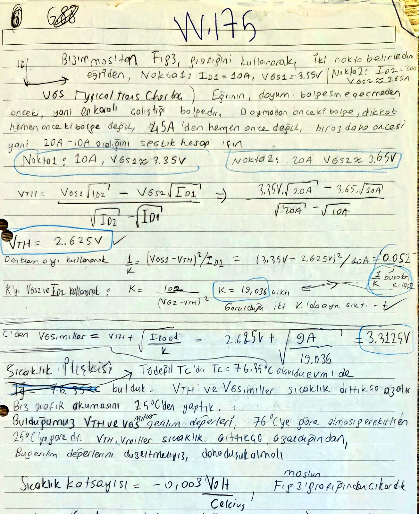

Burada `W.174` ile ayni buyuklukleri hedefliyorum ama farkli egri / farkli nokta secimi yuzunden belirgin bicimde farkli `V_{TH}` ve `V_{GS,miller}` degerleri cikiyor. Bu farki sakliyorum; cunku bu parametrelerin nokta secimine ve hangi sicaklik egrisinden okunduguna hassas oldugunu acikca gosteriyor.

`W.174`teki `V_{GS,miller} \approx 4.76 V` ve `W.175`teki `V_{GS,miller,adj} \approx 3.1585 V` degerlerini bu yuzden ortalamasini alinacak iki aday gibi gormuyorum. Biri `150 C` egrisinden baslayip yaklasik `100 C` tarafina duzeltilen bir deneme, digeri `25 C` civari egriyi `76.39 C` calisma noktasina tasiyan baska bir deneme. Final plateau / Miller gerilimi secilecekse once ayni `I_D`, ayni `V_{DS}` / off-state gerilimi, ayni `T_J` ve ayni gate-drive kosuluna cekilmeli.

Defterden aktarilan not (`W.129`):

Burada, `G88` hattinda gate-charge parametrelerini projedeki gercek surme kosuluna uyarlamaya calisiyorum. Dogrudan nihai kayip sonucu degil; switching-loss ve bootstrap hesabinda kullanilacak `Q_g`, `Q_{GS}` ve `Q_{GD}` buyukluklerinin nasil secildigini gosteren ara sayfa.

Sayfanin ust kisminda datasheet'ten okunan tipik gate-charge notlari var:

- `Q_g(total) \approx 20\,\text{nC}`
- `Q_{GS} \approx 6.4\,\text{nC}`
- `Q_{GD} \approx 6.5\,\text{nC}`

Yanina ayrica su kosullar yazilmis:

- `VGS = 10 V`
- `VDS = 50 V`
- `IDS = 20 A`

Ardindan bu datasheet degerinin projedeki kosula dogrudan uymadigini not ediyorum:

- "Bizim `VGS`'in `10 V` degil, `7.5 V`'tur"
- "O yüzden `Qg` degerini update ettik"
- `Fig. 8` benzeri bir datasheet egirisinden hareketle:
  - `Q_g(total) \approx 10\,\text{nC}` olarak alinmis

Sayfanin alt yarisinda `Miller charge` icin ayri bir not var. Orada onceki bolumden gelen bir `C_{GD}` / `C_{rss}` degeri tekrar kullanilarak:

$$
Q_{GD} \approx C_{GD}\,V_{DS}
$$
yaklasimi yazilmis ve sayfadaki sayisal yerlestirme, okunabildigi kadariyla, su yone cikiyor:

$$
Q_{GD} \approx 54\,\text{pF}\times 22\,\text{V} \approx 1.2\,\text{nC}
$$
Sayfanin en altinda kisa bir not daha var:

- `Qgs2` benzeri bir bileşen icin hesap devam edecek
- yanina da "G81'de bak" benzeri bir kaynak yonlendirmesi dusulmus

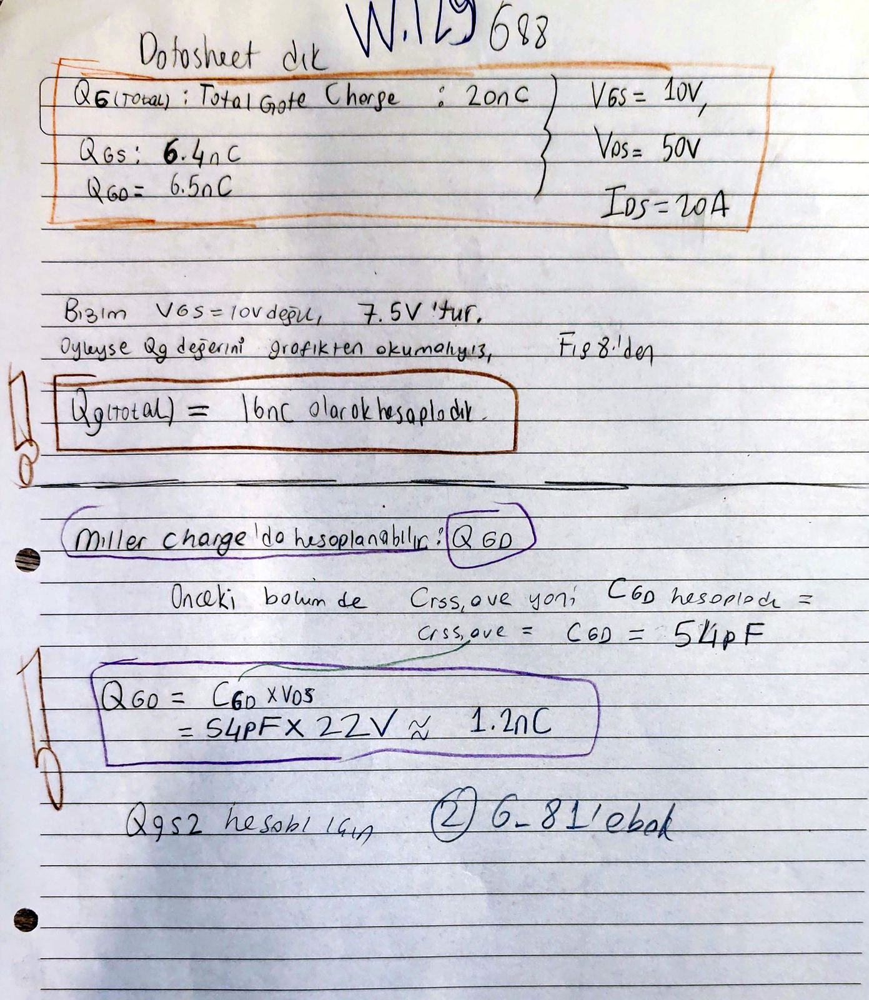

Bu sayfa benim icin onemli; cunku datasheet'teki `Qg(total)` degerini ezbere almadigimi, projedeki gercek `VGS` ve `VDS` kosuluna gore yeniden yorumladigimi gosteriyor. `Q_{GD}` icin kaba `C_{GD} \times V_{DS}` yaklasimini not etmem de switching kaybinin hangi yuk bolgesinde / plateau araliginda sekillendigine dair iz birakiyor. Buradaki `Q_g(total) = 10 nC` ve `Q_{GD} \approx 1.2 nC` degerleri nihai tek rakam gibi degil; `W.164`, ekran okumasi ve bootstrap hesabindaki `16 nC` cizgisiyle birlikte tekrar okunmali.

Defterden aktarilan not (`W.164`):

Burada, `G88 Gate Charge` hattinda daha kavramsal bir toparlama var. Dogrudan nihai kayip sonucu degil; `Q_g`'nin neden onemli oldugunu ve neden sadece `Q = C\cdot V` sezgisiyle kalmamak gerektigini anlatiyorum.

Sayfanin ust kisminda su ana fikri not ediyorum:

- MOSFET'in gate kapasitelerine ne kadar yuk / charge aktarilmasi gerektigi
- gate-drive davranisi ve anahtarlama hizi acisindan onemlidir

Ardindan daha genel elektrik sezgisi hatirlatiliyor:

$$
Q = C \cdot V
$$
Ancak hemen bunun yanina onemli bir sinir da koyuyorum:

- bu iliski sabit `C` icin gecerlidir
- MOSFET'te ise birden fazla kapasitans vardir
- bunlar sabit olmayan / gerilime bagli davranabilir

Sayfada bu nedenle `Fig.6` benzeri `V_{GS}` - `Q_g` grafiğine bakilmasi gerektigi not edilmis. Yazdigim ana fikirler sunlar:

- belirli bir gate-drive gerilimi icin toplam `Q_g` dogrudan grafikten okunmali
- bizim devrede gate surucusu yaklasik `7.5 V` verdigi icin
- `10 V` datasheet kosuluna gore degil, bu gercege yakin grafikten karar verilmesi gerekir

Sayfanin alt kisminda okunabildigi kadariyla bir sonuc not edilmis:

- `Q_g \approx 12.2 nC` bulundu

Ardindan da cok pratik iki soru yazilmis:

- MOS'u surucu devresi saglayabilecek mi?
- ne kadar hizli turn-on / turn-off yapabilecek?

ve son satirdaki kisa not:

- `Kesinlikle Fig6 grafiğini kullan`

Sayfanin ana mesajini iyi ozetliyor.

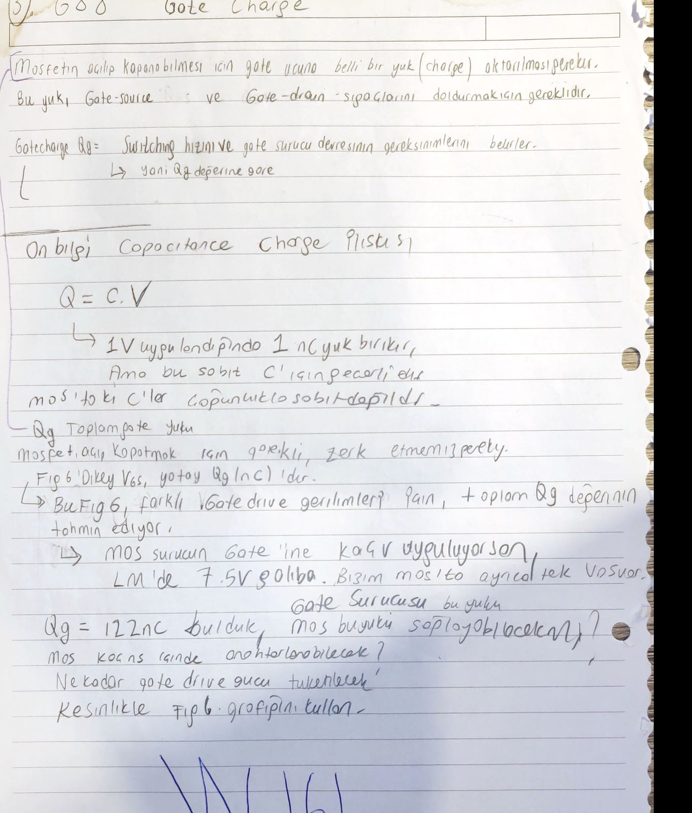

Burada yeni bir sayisal proje sonucu yok; ama `W.129`daki `Qg(total)` uyarlamasinin arkasindaki muhendislik mantigini aciyor: gate charge sabit bir tablo sayisi degil, gercek surme gerilimine gore grafikten okunmali. `Q_g \approx 12.2 nC` notu da `W.129`daki `10 nC`, `W.161`deki `8 nC` civari not ve ekran okumalarindaki `16 nC` ile birlikte tekrar karsilastirilmali.


Bu ekran goruntusu, `W.164`te yazdigim "Kesinlikle Fig.6 grafigini kullan" notunu dogrudan gorsellestiriyor. Yani `Q_g` degerinin sabit tablo sayisindan degil, secilen `V_{GS}` kosulunda gate-charge egirisinden okunmasi gerektigi burada daha acik hale geliyor.

Ikinci ekran goruntusu bu okumanin projedeki gercek surucu kosuluna tasindigini daha net gosteriyor. Uzerindeki notta `VGS = 7.5 V` ve `Qg \approx 16 nC` okunuyor. Bu da `W.129`, `W.168` ve bootstrap hesabindaki `Q_g \approx 16 nC` cizgisinin rastgele secilmedigini; gate-charge egrisinden surme gerilimine uygun bir okuma yapilarak alindigini destekliyor.

Bu noktada `10 nC`, `12.2 nC` ve `16 nC` degerlerini ayni kosulun uc final cevabi gibi toplamiyorum. `10 nC`, datasheet `10 V / 50 V / 20 A` kosulundan proje `7.5 V` drive'a ilk uyarlama izi; `12.2 nC`, Fig.6 okumasinin baska bir ara sonucu; `16 nC` ise ekran uzerindeki `VGS = 7.5 V` okumasiyla bootstrap ve gate-drive hesaplarinda fiilen kullanilan hat gibi duruyor. Son tabloda `Q_g` final degisirse `W.193` gate-drive kaybi ve `W.168-W.171` bootstrap yuk hesabinin da ayni anda guncellenmesi gerekecek.

Defterden aktarilan not (`W.130`):

Burada, `G88` kaynagindan gelen MOSFET kapasitans verilerini projedeki ortalama `V_{DS}` kosuluna donusturmeye calisiyorum. Dogrudan nihai kayip sonucu degil; `C_{GD}`, `C_{GS}` ve `C_{DS}` icin ilk buyukluk mertebesini kurdugum ara sayfa.

Sayfanin ust kisminda datasheet kosullarinda okunan tipik kapasitanslar not edilmis:

- `C_{iss} \approx 1300\,\text{pF}`
- `C_{oss} \approx 260\,\text{pF}`
- `C_{rss} \approx 18\,\text{pF}`

Yanina da su kosullar yazilmis:

- `V_{DS} = 50 V`
- `V_{GS} = 0 V`
- `f = 1 MHz`

Sayfada yaptigim temel is, bu kapasitanslari projedeki farkli `V_{DS}` seviyesine kabaca uyarlamak. Okunabildigi kadariyla, burada tam bir fizik turetimi gibi degil, datasheet / grafik uyarlamasi gibi dusundugum su yaklasimi kullandim:

$$
C_{rss,ave} \approx 2\,C_{rss,spec}\sqrt{\frac{V_{DS,spec}}{V_{DS,ave}}}
$$
Sayfadaki sayisal yerlestirme:

$$
C_{rss,ave} \approx 2 \times 18\,\text{pF}\times \sqrt{\frac{50\,\text{V}}{22\,\text{V}}} \approx 54\,\text{pF}
$$
Benzer sekilde `C_{oss}` icin de:

$$
C_{oss,ave} \approx 2\,C_{oss,spec}\sqrt{\frac{V_{DS,spec}}{V_{DS,ave}}}
$$
ve sayfadaki sayisal sonuc:

$$
C_{oss,ave} \approx 2 \times 260\,\text{pF}\times \sqrt{\frac{50\,\text{V}}{22\,\text{V}}} \approx 783\,\text{pF}
$$
Sayfanin altinda, MOSFET'in temel parasitiklerini su sekilde ayiriyorum:

$$
C_{GD} \approx C_{rss,ave} \approx 54\,\text{pF}
$$
$$
C_{GS} \approx C_{iss} - C_{rss} \approx 1300\,\text{pF} - 18\,\text{pF} \approx 1282\,\text{pF}
$$
$$
C_{DS} \approx C_{oss,ave} - C_{rss,ave} \approx 783\,\text{pF} - 54\,\text{pF} \approx 729\,\text{pF}
$$
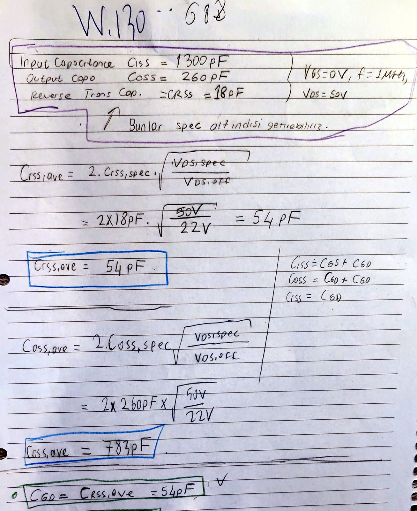

Benim icin `W.130`un asil degeri, `W.129`da kullandigim `C_{GD} \approx 54 pF` notunun nereden geldigini gostermesi. `2*C*sqrt(Vspec/Vave)` satirini dogrudan fizik kanunu gibi okumuyorum; datasheet'teki sabit kosulu benim `V_{DS}` ortalamama tasimak icin kullandigim pratik bir yaklasim. Yani buradaki `54 pF / 783 pF / 729 pF` seti nihai tek kapasitans seti degil; `W.165` ve ekran okumalarindaki farkli setlerle birlikte karsilastirilacak ilk hat. Ama rastgele degil: once datasheet kosulu, sonra `V_{DS} \approx 22 V` civari dusunulmus.


Defterden aktarilan not (`W.165`):


Bu sayfada `G88` hattinda ayni soruyu tekrar aciyorum ama bu kez farkli bir datasheet kapasitans setiyle: "MOSFET datasheet'inde verilen `C_{iss}`, `C_{oss}` ve `C_{rss}` degerlerini, devredeki gercek `off-state` `V_{DS}` kosuluna nasil tasirim?" Yani burada kapasitans seti bir kez daha gozden geciriliyor.

Sayfanin ust kisminda once uygulama kosullarini toparliyorum. Okunabildigi kadariyla ana fikirler sunlar:

- `V_{DS,off}` devrede `38 V` civarinda alinmis
- `G88` hesabina girerken gercek `I_D`, `T_J`, surucu ve toplam gate-direnci baglamini da ayni sayfada hatirlatmak istiyorum
- sag kenarda yine `I_{L,peak}` / tam yuk baglami not edilmis; yani burada yalniz datasheet okuma degil, proje kosuluyla eslestirme de var

Ardindan "A) capacitances" basligi altinda, datasheet'ten okunan tipik kapasitanslar yaziliyor:

- `C_{iss} \approx 2600 pF`
- `C_{oss} \approx 720 pF`
- `C_{rss} \approx 340 pF`

Yanina da kaynak okuma kosullari dusulmus:

- `V_{GS} = 0 V`
- `V_{DS} = 25 V`
- `f = 1 MHz`
- `Fig.5'te bak`

W.130'dan hemen sonra duran bu uc ekran da bu yuzden burada kaliyor. Parasitik kapasitanslari tek bir sabit tablo satiri gibi ele almiyorum; `V_{DS}` seviyesine gore ayrica okuyorum.

`p92` uzerinde `V_{DS}=14 V` ve `22 V` civarinda `C_{oss}` icin `700-800 pF` sinifi okunurken, `p98` uzerinde ayni `22 V` noktasinda `C_{iss} \approx 1220 pF`, `C_{rss} \approx 80 pF` ve `C_{oss} \approx 700 pF` civari notlar dusulmus.

Bu da `W.130`, `W.152`, `W.161` ve `W.163` tarafinda neden birden fazla aday kapasitans seti olustugunu acikliyor. Burada ayni parametreyi tekrar tekrar sorgulamam bir temizlik problemi degil; defterin gercek izi.

Sayfanin orta kisminda, klasik kapasitans ayrimini tekrar hatirlatiyorum:

$$
C_{oss} = C_{ds} + C_{gd}
$$
$$
C_{iss} = C_{gs} + C_{gd}
$$
Ardindan su muhendislik sezgisi yazilmis:

- `C_{rss}` ve `C_{ds}` / `C_{oss}` daha cok `V_{DS}`'ye bagli degisebilir
- bu nedenle, datasheet'teki `25 V` kosulunda verilen sayilarin dogrudan degil, devredeki `38 V off-state` kosuluna gore yeniden yorumlanmasi gerekir

Sayfanin altinda okunabildigi kadariyla iki ara sonuc not edilmis:

- `C_{gd} = C_{rss,ave} \approx 134 pF`
- `C_{gs} = C_{iss} - C_{rss} \approx 2600 pF - 340 pF \approx 2260 pF`

Ayri bir satirda da `C_{oss,ave}` icin yaklasik:

- `C_{oss,ave} \approx 368 pF`

gibi bir sonuc not edilmis. Bu degerler, datasheet'teki sabit tablo degerinden cok, grafik / calisma noktasi uyarlamasi mantigiyla alinmis ara buyuklukler.

Burada `W.130` ile ayni tur problemi tekrar cozuyorum. Bu yuzden ikisini de tutuyorum ama birini digerinin dogrudan duzeltmesi gibi okumuyorum. `W.130`daki `54 pF / 783 pF / 729 pF` hattiyla buradaki `134 pF / 368 pF / 2260 pF` hattinin ayni anda birebir dogru olmasi zor; buyuk olasilikla farkli datasheet noktasi ya da farkli yorum yontemi devreye girmis. Benim icin asil iz su: parasitikleri rastgele secmemisim, once datasheet kosulunu sonra gercek `V_{DS(off)}` kosulunu dusunerek yeniden yorumlamisim.

Final kapanista bu iki kapasitans hattindan hangisi kullaniliyorsa ayni set butun MOSFET hesabina yayilmali. `C_{GD}` / `C_{rss}` secimi `Q_{GD}` ve gecis surelerini, `C_{oss}` secimi `C_{oss}` kaybini, `C_{GS}` secimi de Miller kaynakli yanlis turn-on kontrolunu etkiliyor. Yani `54 pF` ile hesaplanan `Q_{GD}`yi, `340 pF` gibi daha korumaci bir Miller kontroluyla ayni final tabloda sessizce karistirmamak gerekiyor; hangi satir duyarlilik izi, hangi satir final girdi olacaksa acik secilmeli.

Defterden aktarilan not (`W.132`):


Burada, `G88` tabanli MOSFET kayip hesabinda kullanilacak calisma noktasi ve surucu-direnci parametrelerini bir araya topluyorum. Dogrudan nihai kayip sonucu degil; `G88` hesabina giris olacak sayilarin ve isim eslestirmelerinin ilk toparlandigi ara sayfa.

Sayfanin ust yarisinda, hesapta kullanilacak temel proje sayilari tekrar listelenmis:

$$
T_J \approx T_{case} + P_{loss}\,R_{\theta JC}
$$
ve okunabildigi kadariyla su ara degerleri not etmisim:

- `T_J \approx 75.964^\circ C \approx 76^\circ C`
- `I_D \approx 9 A + 3.8 A / 2 \approx 11 A`
- `V_{DS} \approx 36 V - 14 V = 22 V`
- `V_{drive} \approx V_{CC} \approx 7.5 V`

Sayfanin ortasinda gate direnci o anki notta soyle yazilmis. `W.177`de bu `2.2 \Omega` degerinin aslinda toplam gate-yolu direnci olarak acildigini da unutmayarak okumak lazim:

- `R_{gate,ext} = R_3 = 2.2 \Omega`

Ardindan, `G88` icindeki isimlerle `G32` / LM5146 tarafindaki surucu direnclerini eslestirmeye calisiyorum. Okunabildigi kadariyla ana fikir su:

- `G88`'deki `R_HI`
  - `G32`'deki high-side / pull-up yonundeki ic surme direncine karsilik geliyor
  - sayfada bu deger `1.5 \Omega` gibi not edilmis
- `G88`'deki `R_LO`
  - `G32`'deki gate'i GND'ye ceken pull-down / sink yonundeki ic surme direncine karsilik geliyor
  - sayfada bu deger `0.9 \Omega` gibi not edilmis

Sayfanin en altinda da kisa bir hatirlatma var:

- `Dikkat`
- `R_HI = R_{HO-up} = 1.5 \Omega` unutulmamali

Burada yeni formulle yeni kayip sonucu yok; ama `G88` hesabinda kullanilacak `T_J`, `I_D`, `V_{DS}`, `V_{drive}` ve gate-direnci aginin nereden geldigini gosteriyorum. Ozellikle `R_HI / R_LO` ile kontrolcu datasheet'indeki `pull-up / pull-down` surucu direnclerinin eslestirilmesi, daha sonra switching-loss hesabinda karisiklik olusmamasi icin onemli. `R_{gate,ext} = 2.2 \Omega` satiri ise burada kaba bir not gibi duruyor; hemen arkasindaki `W.177` bunu daha temiz ayiriyor.

Defterden aktarilan not (`W.177`):


Burada, `G88` hattinda switching-loss hesabina girecek toplam gate-yolu direncini daha acik bicimde topluyorum. Yeni nihai kayip sonucu degil; `W.132`de kaba duran `2.2 \Omega` notunun hangi bilesenlerden olustugunu gosteren netlestirme sayfasi.

Sayfanin ust kisminda toplam gate yolu direnci su sekilde yazilmis:

$$
R_{total} = R_{driver} + R_{g,external} + R_{g,internal}
$$
Sayfa uzerine not ettigim sayilar okunabildigi kadariyla sunlar:

- `R_{driver} \approx 1.5 \Omega`
- `R_{g,external} \approx 0 \Omega`
- `R_{g,internal} \approx 0.7 \Omega`

Burada `R_{driver}` icin ayrica su sezgi not edilmis:

- LM5146 tarafinda `pull-up / pull-down` ic direncler vardir
- bunlardan daha korunmaci olan taraf secilerek
- `R_{driver} = 1.5 \Omega` alinabilir

ve `R_{g,internal}` icin de:

- MOSFET'in kendi ic gate direnci tipik olarak `0.5 - 1 \Omega` bandindadir
- bu projede yaklasik `0.7 \Omega` alinmis

Bu varsayimlarla sayfada su toplam sonuc yaziliyor:

$$
R_{total} = 1.5\,\Omega + 0\,\Omega + 0.7\,\Omega = 2.2\,\Omega
$$
Sayfanin altinda bu toplam direncin hangi konularda kullanildigini da not ediyorum:

- switching suresi
- `t_{fall}` / gecis zamanlari
- `switching loss`
- EMI davranisi

Yani burada, gate yolundaki etkili direncin yalnizca bir parca secim detayi degil; dogrudan gecis hizi ve kayip hesabi girdisi oldugunu hatirlatiyorum.

Burada onemli ayirim su: `2.2 \Omega`, fiziksel olarak tek bir "harici gate direnci" gibi degil; `R_{driver} + R_{g,external} + R_{g,internal}` toplami olarak kuruluyor. Yani `W.132`deki "`R_{gate,ext} = 2.2 \Omega`" satiri aynen korunuyor ama son okuma bu degil; son okuma toplam gate-yolu direnci.

Son kayip / hiz kapanisinda bu satiri da kenar yonune gore okumam gerekiyor. Turn-on hesabi icin LM5146'nin pull-up / source yolu, turn-off ve Miller clamp davranisi icin pull-down / sink yolu daha belirleyici. Bu yuzden `R_HI = 1.5 \Omega`, `R_LO = 0.9 \Omega`, `R_{g,internal} \approx 0.7 \Omega` ve varsa harici gate direnci ayni sepete atilip tek bir "2.2 ohm her sey" sonucuna donmemeli. Eger hesapta tek sayi kullanirsam, bunun hangi kenar icin korumaci kabul oldugunu yanina yazmam lazim.


#### 5.6.4 Thermal ve datasheet yorumu referans notu

[Yönlendirme - termal owner] MOSFET `R_{\theta JA}`, `R_{\theta JC}`, `T_J`, exposed pad, datasheet continuous-current yorumu ve olcum/h hesap parametre ayrimi artik `5.9 Termal ve Kayıp Kapanışı` altinda primary owner olarak tutulur. Bu bolumde yalniz MOSFET secimi ve kayip hesaplarinin termal kapanisa gidecegi hatirlatilir: `continuous current` satiri tek basina yeterlilik kaniti degildir; `5.6.3`teki kayiplar, kart sicakligi, PCB bakiri/via yapisi ve termal parametre secimiyle birlikte kapanacak.


#### 5.6.5 Bu bolumde acik tuttugum maddeler

Bu kisim artik sadece "yapilacaklar" listesi degil. MOSFET bolumunun sonunda kendime bir son kontrol listesi gibi duruyor. Bir kismi yukarida hesaba dokuldu, bir kismi ise nihai BOM / LTspice / layout kontroluyle tekrar teyit edilmeli.

Yukarida omurgasi kurulanlar:

- secilen MOSFET adayinin ana datasheet kalemleri
- `VDS` / `BVDSS` marji ve avalanche farkindaligi
- `RDS(on)`'un `VGS \approx 7.5 V` ve sicaklikla degisimi
- high-side ve low-side iletim kaybi hesabi
- `24 V` ve `36 V` kosullari icin switching kaybi izi
- gate-drive kaybi, `C_{oss}` kaybi, body-diode / dead-time kaybi
- termal kapanisa gidecek `RDS(on)`, kayip ve `T_J` girdileri

Son teyit isteyenler:

- secilen MOSFET'in nihai datasheet ozeti tek tabloda toparlanacak
- `VDS` spike / layout / snubber ihtiyaci LTspice ve yerlesimle tekrar kontrol edilecek
- toplam MOSFET kaybi ve verim tablosu `5.9` termal/kayip kapanisina beslenecek
- tahmini junction sicakligi gercek PCB termal varsayimlariyla `5.9` altinda tekrar okunacak
- common-source inductance ve gate parasitikleri layout tarafinda ayrica gozden gecirilecek

Bu son tabloyu yaparken her satirin ayni kosul setine ait oldugunu acik tutmam gerekiyor: `Vin`, `Iout`, `f_sw`, `Vdrive`, `T_J`, secilen `RDS(on)`, `Q_g` ve kapasitans seti. `W.191-W.200` zincirindeki sayilar ayni kosula cekilmeden toplanirsa verim sayisi temiz gorunur ama yaniltir. Ayrica gate-drive / `VCC` / kontrolcu kayiplarini MOSFET junction termaline otomatik yuklememek, hangi isin hangi parca uzerinde dagildigini `5.9` kapanis tablosunda ayri gostermek lazim.


### 5.7 Bootstrap agi


#### 5.7.1 Bootstrap direncini (`R_{boot}`) hesaplama ve secim mantigi


ODT'deki `8.1. Bootstrap Direncini (Rboot) Hesaplama ve Seçim Mantığı` notunu burada daha okunur denklem akisiyle yeniden kuruyorum.

[Güncel Omurga - gate-drive komsulugu] Bootstrap agi MOSFET gate-drive beslemesinin komsusudur; duty hesabinin owner'i degildir. `D_high,max = 0.648`, `D_low,min = 0.352`, `T_sw ≈ 3.01 us` gibi sayilar `3.1`den gelir; burada yalniz `C_{BST}`, `R_{boot}`, `CVCC`, `Qg/Qtotal`, diyot dusumu ve `BST-SW` UVLO yeterliligi kontrol edilir.

Bu kisimda kullandigim kaynak / defter gorselleri:


Bu gorselde `Rilim` ayni fiziksel yakin planda gorunse de current-limit / sensing hesabinin owner'i `5.8`dir. Bootstrap bolumu bu gorseli yalniz `C_{BST}`, `R_{boot}`, `CVCC`, `BST-HO-SW` ve gate-drive enerji yolu baglaminda kullanir.


Bu gorseller burada bosuna durmuyor. Bootstrap hesabini sadece `R`, `C` ve duty denkleminden okumuyorum; sarjin hangi yoldan aktigini, hangi pinlerin yan yana geldigini ve high-side surucunun bu enerjiyle nasil beslendigini de gormek istiyorum. `p31`, low-side MOSFET acikken (`Q2 on`) `BST` dugumunun nasil yeniden sarj oldugunu gosteriyor. `p42` ve `p54` dahili bootstrap diyodunu netlestiriyor. `p43` ve `p55`, `BST-HO-SW-LO-PGND` pin grubunu gercek pin topolojisine bagliyor. `p100` ise ayni mantigi genel bir yarim-kopru surucu semasi uzerinden tekrar gosteriyor. Yani bu gorseller, alttaki RC hesabinin fiziksel arka plani.

**Hangi duty?**

Duty ailesinin primary owner'ı `3.1 Paylaşılan fsw, duty ve zaman alanı owner'ı`. Burada duty yeniden türetilmez; bootstrap hesabı yalnız o owner'dan gelen korumacı proje-duty penceresini kullanır: `D_high,max = 0.648` ve `D_low,min = 0.352`.

Yani bootstrap sarji icin kullanılan worst-case pencere, periyodun `%35.2`'lik low-side iletim aralığıdır. `0.648` ideal duty değil; `3.1`de etiketlenen verim-dahil / korumacı duty izinin bootstrap uygulamasıdır. Final duty owner'ı değişirse burada yalnız `D_low,min`, `t_charge,min`, `t_charge/tau` ve ilk bootstrap yeterlilik yorumu güncellenir.

**Sarj penceresi ve zaman sabiti**

ODT notunda bu adim, `R_{boot} = 2.2 \Omega` ve `C_{boot} = 0.1 \mu F` secimiyle tartisiliyor. Ben burada once standart RC zaman sabitiyle temiz okuyorum:

$$
\tau = R_{boot} C_{boot} = 2.2\,\Omega \times 0.1\,\mu\text{F} = 0.22\,\mu\text{s}
$$
PWM frekansi `332 kHz` icin `3.1` owner'inda sabitlenen `T_{sw} \approx 3.01 us` kullanilir.
Bu durumda worst-case bootstrap sarj penceresi:

$$
t_{\text{charge,min}} = D_{\text{low,min}} T_{sw} = 0.352 \times 3.01\,\mu\text{s} \approx 1.06\,\mu\text{s}
$$
Dolayisiyla:

$$
\frac{t_{\text{charge,min}}}{\tau} = \frac{1.06}{0.22} \approx 4.82
$$
ODT notunda gecen `0.625\,\mu\text{s}` degeri burada eski / zayif bir ara iz gibi duruyor; standart `\tau = R C` tanimi degil. Standart tanimla bakildiginda, sarj penceresi yaklasik `4.8\tau` suruyor. Bu da ideal RC modelinde bootstrap kondansatorunun bu pencere icinde buyuk oranda dolabilecegini gosteriyor.

**Bootstrap gerilimi**

ODT notunda `V_{DD} = 8.4\,\text{V}` ve bootstrap diyot dusumu yaklasik `0.5\,\text{V}` alinmis. Bu satiri, high-side surucunun gorecegi yaklasik bootstrap gerilimini bulmak icin kullaniyorum:

$$
V_{C_{boot}} \approx V_{DD} - V_{\text{BootDiode}} = 8.4\,\text{V} - 0.5\,\text{V} = 7.9\,\text{V}
$$
Eger bootstrap kondansatoru worst-case pencerenin basinda tamamen bos kabul edilirse, ideal RC modeliyle bu pencere sonunda ulasilan gerilim:

$$
V_{C_{boot}}(t_{\text{charge,min}}) \approx 7.9\left(1 - e^{-t_{\text{charge,min}}/\tau}\right) \approx 7.9\left(1 - e^{-4.82}\right) \approx 7.84\,\text{V}
$$
Bu, ODT notundaki "bootstrap voltaji yeterince hizli olusuyor" sonucunu destekliyor. Burada sonucu abartmiyorum; ideal RC modeliyle ilk kontrol yeterli gorunuyor demek daha dogru.

**Kondansatorde depolanan enerji**

Bootstrap kondansatorunde, yaklasik `7.9 V` seviyesinde depolanan enerji:

$$
E_{\text{cap}} = \frac{1}{2} C_{boot} V_{C_{boot}}^2 = \frac{1}{2}\cdot 0.1\,\mu\text{F}\cdot (7.9\,\text{V})^2 \approx 3.12\,\mu\text{J}
$$
Bu, kondansator tam bu seviyeye sarj oldugunda uzerinde duran enerjiyi verir. Yani bu satir once `C_{boot}`un enerji mertebesini gormek icin yazilmis.

**Direncte yakilan enerji hakkinda dikkat**

ODT notunda dirençte yakilan enerji icin ayrica bir hesap niyeti bulunuyor. Bu kisim korunuyor ama nihai direnç gucu hesabi gibi okunmamali. Tam `0 V -> 7.9 V` RC sarj adiminda ideal seri dirençte harcanan enerji, ayni buyukluk mertebesinde:

$$
E_{R,\text{full-step}} \approx \frac{1}{2} C_{boot} V_{C_{boot}}^2 \approx 3.12\,\mu\text{J}
$$
olur. Ama gercek devrede bootstrap kondansatoru her cevrimde sifirdan sarj olmuyor; high-side surucu ne kadar charge cektiyse onun yerine konuyor. Bu yuzden bu `3.12 uJ` degeri direnç watt secimi icin tek basina kullanilacak nihai sonuc degil, full-step ust sinir / buyukluk mertebesi izi gibi okunmali.

**Ilk tepe akimi**

Bootstrap sarjinin ilk anindaki yaklasik tepe akimi:

$$
I_{\text{pk}} = \frac{V_{DD} - V_{\text{BootDiode}}}{R_{boot}} = \frac{8.4\,\text{V} - 0.5\,\text{V}}{2.2\,\Omega} \approx 3.59\,\text{A}
$$
Bu da bana sunu hatirlatiyor: `R_{boot}` sadece sarj hizini belirlemiyor, ilk pik akimi da belirliyor. `3.59 A` degeri ideal ilk an tahmini; gercek dalga sekli parazitikler ve diyot/iz empedanslariyla yumusar ama bootstrap diyotu, izler ve ringing acisindan bu mertebe yine de kontrol edilmeli.


Ek not:

Bu bolumde asil muhendislik mantigi su:

- worst-case bootstrap sarj penceresi, $D_{\text{low,min}}$ ile belirlenir
- $R_{boot}$ buyurse sarj yavaslar; cok kuculurse pik akim ve ringing artar
- $R_{boot} = 2.2\,\Omega$ ve $C_{boot} = 0.1\,\mu\text{F}$ secimi, ilk bakista sarj hizi acisindan makul gorunur
- ama direnç guc derecelendirmesi, diyot peak akimi ve bootstrap dugumu ringing davranisi nihai olarak simulasyon veya deneyle yine dogrulanmalidir

Bu bolumde ozellikle su maddeleri sonra tekrar kontrol etmek gerekir:

- $D_{\text{high,max}} = 0.648$
- `VDD` ve diyot dusumunun datasheet ile teyidi
- bootstrap diyotunun peak akim ve ters gerilim marji
- `R_{boot}` seciminin ringing ve sarj hizi acisindan uygunlugu
- gerekiyorsa LTspice / PSpice ile bootstrap dugumu dalga sekli

Yukaridaki gorselleri ve bu hesap zincirini birlikte okuyunca benim icin su ayrim netlesiyor:

- `BST / HO / SW` dugumlerinin fiziksel baglantisi
- `C_{BST}`'nin high-side gate surucusunu nasil besledigi
- bootstrap diyotunun LM5146 icinde yer aldigi bilgisi
- gercek semadaki `C_{BST}`, `C_{VCC}` ve `R_{ILIM}` cevresinin birbirinden nasil ayrildigi

O yuzden bu gorseller burada "sadece sema resmi" gibi durmuyor. Hesapta gecen `BST`, `HO`, `SW`, `C_{BST}`, `C_{VCC}` ve diyot notlarinin gercek devrede nereye oturdugunu gosteren destek katmani gibi calisiyor. Hemen arkasindaki `W.160` da bu baglantiyi parca referanslarina indiriyor.

Defterden aktarilan not (`W.160`):

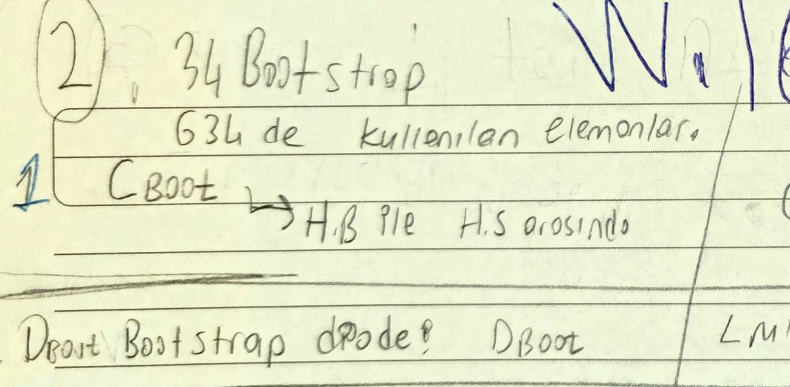

Burada bootstrap aginda kullanilan gercek elemanlar ve bunlarin karttaki / semadaki karsiliklari toplu halde not edilmis. Yeni bir denklem ya da yeni sayisal sonuc yok; daha cok yukarida hesaplanan buyukluklerin hangi gercek elemana baglandigini gosteriyor.

Sayfanin basliginda:

- `G32 ve EVM`

notu dusulmus. Bu da bootstrap agini hem datasheet / kaynak notu (`G32`) hem de EVM referansi uzerinden takip ettigimi gosteriyor.

Sayfada listelenen ana elemanlar ve baglantilar sunlar:

**Cboot**

- `C16 = 0.1 uF`
- `CBST`
- `BST` ile `SW` arasinda

Yani bootstrap kondansatorunun hem fonksiyonel adi (`Cboot` / `CBST`) hem de kart referansi (`C16`) ayni yerde not edilmis.

**Dboot**

- bootstrap diyotu
- `LM`'nin icindedir
- `VCC` ile `BST` arasindadir

Buradaki not, onceki bootstrap hesabinda kullandigim diyot dusumunun harici degil, buyuk olasilikla kontrolcunun ic yapisina ait oldugunu hatirlatiyor.

**Rboot**

- `Rboot = R3 = 2.2 \Omega`
- `BST` ile `SW` arasinda
- `CBST` ile seri

Bu, `5.7.1` altinda hesaplanan `R_{boot}=2.2\Omega` degerinin semadaki gercek eleman karsiligini netlestiriyor.

**CVCC**

- `CVCC = C25 = 2.2 uF`

ve sayfanin solunda:

- `CVDD Bypass Capacitor`

notu da yer aliyor. Bu da `VCC` / `VDD` bypass elemaninin bootstrap agiyla yakin baglantili dusunuldugunu gosteriyor.

Bu sayfanin degeri su: `Cboot`, `Dboot`, `Rboot` ve `CVCC` elemanlarinin sema/kart karsiliklari tek yerde duruyor. `C16 = 0.1 uF`, `R3 = 2.2 \Omega` ve `C25 = 2.2 uF` notlari sonraki BOM ve sema kontrolunde dogrudan is gorur.

Buradaki `R3 = 2.2 \Omega` satirini baglamiyla okumak lazim: bu kisimda `R3`, bootstrap yolundaki `Rboot` elemani. MOSFET gate-yolu tarafinda gecen `2.2 \Omega` toplam direnç notuyla ayni isim gibi gorunse de ayni fiziksel eleman kabul edilmemeli. Final sema/BOM kontrolunde `R3` referans adinin hangi sayfada hangi elemana denk geldigi tekrar acik secilecek; aksi halde bootstrap direnci ile gate-yolu direncini istemeden birbirine karistirmak cok kolay.

Defterden aktarilan not (`W.205`):


Burada bootstrap aginin fiziksel baglanti mantigini kendi cizimimle aciyorum. Ust kisimda LM5146'nin high-side surucu pinleri ve ust MOSFET birlikte cizilmis:

- `HB / BST` pini
- `HO` pini
- `HS` pini
- ust MOSFET `Q1`
- ve arada `Cboot`

Sayfadaki cizimden guvenle okunan ana fikir su:

- `Cboot`, `HB/BST` ile `HS` arasina baglidir
- `HO` cikisi ise ust MOSFET `Q1`in gate'ini surer
- `HS` dugumu de `SW` ile birlikte hareket eder

Sayfanin altina dustugum kritik not su:

- `Dikkat Cboot dogrudan Q1'in G-S arasina bagli degil`
- `Dolayli bagli gibi`
- `Q1'in driverini besleyen`

Burada bootstrap kapasitörunu ust MOSFET'in gate-source'u uzerine dogrudan paralel bir eleman gibi dusunmemem gerektigini not ediyorum. Asil gorevi, high-side gate surucu katina enerji saglamak. Bu ayrim onemli; yoksa `Cboot` sanki Q1'in gate kapasitörü gibi yanlis okunabilir.

`W.205`, `W.160`ta listelenen `HB/HO/HS`, `Cboot` ve `Q1` iliskisini daha sezgisel bir baglanti semasi ile aciyor. Yeni bir `C_{boot}` ya da `R_{boot}` sonucu vermiyor; ama bootstrap kapasitörunun "Q1'in gate-source kapasitörü gibi" okunmamasini netlestirdigi icin burada kalmali.

Defterden aktarilan meta not (`W.166`):

Burasi teknik hesap sayfasi degil; defter aktarim surecinde kendime yazdigim bir isaret / durak notu. Ust satirda okunabildigi kadariyla:

- `6.3.4 Bootstrap direnci`
- `Rboot = R3 = 2.2 \Omega kadar`

benzeri bir hatirlatma var.

Sayfanin ortasinda ise buyuk harflerle:

- `Word'e ekledim`
- `W.160`

notu yazilmis.

`W.166` yeni teknik sonuc vermiyor. Yine de tamamen silmiyorum; bootstrap bolumunde `W.160` civarinin Word'e / ayri metne aktarildigini gosteren surec izi. Hesapta kullanilacak sayi vermiyor, sadece defter akisini takip etmeye yariyor.

Defterden aktarilan not (`W.167`):


Burada, bootstrap aginda `C_{VCC}` bypass kondansatorunun `C_{BST}`'ye gore yeterli buyuklukte olup olmadigini hizli bir kuralla kontrol ediyorum. Yeni bir bootstrap denklemi degil; `W.160`ta listelenen gercek elemanlarin basit yeterlilik kontrolu.

Sayfanin basliginda okunabildigi kadariyla:

- `C_{VCC}` cikis / bypass konusu

yer aliyor.

Ardindan su ana fikri yazmisim:

- `C_{VCC}` kapasitörü, `C_{BST}`'nin ihtiyac duydugu sarji rahatlikla karsilayabilecek dusuk empedansli kaynak gibi davranmalidir

Sayfanin ortasinda not edilen pratik tasarim kurali:

$$
C_{VCC} \gg 10 \times C_{BST}
$$
veya ayni anlamda:

- `C_{VCC}` degeri, `C_{BST}`'nin en az `10` kati buyukluk mertebesinde olmalidir

Sayfanin altinda mevcut secilen degerler yerine konuyor:

- `C_{VCC} = 2.2 uF`
- `C_{BST} = 0.1 uF`

ve su karsilastirma yapiliyor:

$$
2.2\,uF > 10 \times 0.1\,uF
$$
Yani burada, secilen `2.2 uF` `CVCC` degerinin `0.1 uF` `CBST` karsisinda buyukluk olarak rahat kaldigini kontrol ediyorum. Bu tek basina tum bootstrap dogrulamasi degil; ama `CVCC` seciminin bariz zayif olmadigini gosteren hizli bir kontrol.

Burada yeni bir sembolik bootstrap hesabi yok; ama `C25 = 2.2 uF` ile `C16 = 0.1 uF` degerlerini birbirine baglayip pratik bir kontrol yapiyorum. `CVCC` seciminin yalniz BOM satiri degil, bootstrap sarj zinciriyle birlikte dusunulmus bir karar oldugunu gosterdigi icin bu sayfa kalmali.

Bu kontrolu `W.171-W.168` minimum `C_{boot}` hesabiyla ayni sey gibi okumuyorum. `W.167` daha cok `C_{VCC}` kaynaginin `C_{BST}`'yi rahat besleyip besleyemeyecegine bakan rezervuar / bypass kontrolu. `W.171-W.168` ise `C_{BST}` kendi uzerinde bir cevrimde ne kadar yuk kaybeder ve `\Delta V_{HB}` ne kadar dusmeye izin verir sorusu. Finalde iki taraf da nominal kapasiteyle degil, secilen MLCC'lerin gerilim biasi ve sicaklik altindaki etkin kapasitesiyle tekrar kontrol edilmeli.

Defterden aktarilan not (`W.171`):


Burada `W.168`de kullandigim `Q_{total}` buyuklugunun nereden geldigini aciyorum. Minimum `C_{boot}` hesabina girecek toplam yuk, sadece MOSFET gate charge'i degil; high-side tarafin bir periyot boyunca yedigi kucuk akimlar da buna ekleniyor.

Sayfanin ust kisminda once gate ile ilgili temel iliski not edilmis:

$$
C_g = \frac{Q_g}{V_{GS}}
$$
Ardindan bootstrap kapasitorunun her anahtarlama cevriminde yerine koymasi gereken toplam yuku sozel olarak ayiriyorum:

- MOSFET gate'ini surmek icin gereken yuk
- high-side bolumdeki quiescent / leakage akimlarinin bir periyot boyunca olusturdugu ek yukler

Sayfadaki toplama mantigi okunabildigi kadariyla su:

$$
Q_{total} = Q_g + I_{HBS}\,\frac{D_{max}}{f_{sw}} + I_{HB}\,\frac{1}{f_{sw}}
$$
Burada not ettigim bilesenler:

- `Q_g \approx 16 nC`
- `I_{HBS} \approx 5 uA`
- `I_{HB} \approx 80 uA`

ve bunlari bu kontrol icin su kosulla yerine koyuyorum:

- `D_{max} \approx 0.95`
- `f_{sw} \approx 332 kHz`

Sayfadaki ara sayisal yerlestirmeler okunabildigi kadariyla:

$$
Q_{total} \approx 16\,nC + 5\,uA\cdot \frac{0.95}{332\,kHz} + 80\,uA\cdot \frac{1}{332\,kHz}
$$
ve sonucta:

$$
Q_{total} \approx 16.255\,nC
$$
bulunuyor. Bu da `W.168`de kullanilan:

$$
C_{boot} > \frac{16.255\,nC}{4.1\,V}
$$
adiminin kaynagini netlestiriyor.

Bu sayfa `W.168`in en kritik girdilerinden biri olan `Q_{total}` degerini aciyor. `16.255 nC` burada bagimsiz bir nihai sonuc degil; minimum `C_{boot}` hesabinin payina giren toplam yuk. `Q_g = 16 nC`, `I_{HBS} = 5 uA` ve `I_{HB} = 80 uA` degerleri datasheet / uygulama notu satirlariyla son kez teyit edilmeli; ama burada kurulan mantik temiz: once gate charge, sonra high-side tarafin periyot icindeki ek yukleri.

Buradaki `D_{max} \approx 0.95` ile yukaridaki `0.648` bootstrap sarj penceresi ayni sey degil. `0.95`, high-side tarafin kacaga / bias akimina ne kadar sure maruz kalabilecegini korumaci almak icin kullanilmis gibi duruyor; `0.648` ise bu projenin normal worst-case duty zarfina gore low-side sarj penceresini bulmak icin kullanildi. Son hesapta hangisi kullaniliyorsa yanina "proje duty" mi, "kontrolcu/donanimsal worst-case" mi oldugu yazilmali. Bu terim `Q_g = 16 nC` yaninda kucuk kalsa da, varsayim karmasini belgelemek iyi.

Defterden aktarilan not (`W.188`):


Burada bootstrap kapasitoru hesabina girecek parametreleri uygulama notu / datasheet tarafindan tek yerde toplamisim. Bu sayfa tek basina yeni bir `C_{boot}` hesabi degil; `W.171-W.172-W.168` zincirinde kullandigim sayilarin hangi kaynak satirlarindan geldigini gormek icin duruyor.

Sayfanin ustunde ana rol acikca yazilmis:

- bootstrap capacitor, high-side gate surucu devresine enerji depolayan elemandir

Sayfada uygulama notundan / datasheet'ten topladigim ana parametreler sunlar:

- `V_{IN,max} = 65\,V` (`max steady-state input voltage` notuyla)
- `V_{DRV} = 12\,V`
- `\Delta V_{BST} \approx 0.5\,V` (`steady-state dropped bootstrap voltage`)
- `\Delta V_{boost,max} \approx 3\,V`
- `t_{BST,rr} \approx 400\,ns`
- `t_{ON,TL} \approx 20\,\mu s`

Sayfanin alt tarafinda ayrica bootstrap hesabini etkileyebilecek ek bilesenler de not edilmis:

- `Q_g` tarafina ait gate-charge dusuncesi
- `R_{GS}`: gate-to-source pull-down direnci
- bootstrap diyotunun ileri yon dusumu:
  - `V_{F,BST} \approx 0.6\,V` (`I ≈ 100 mA`, `T_J ≈ 80°C` civari not dusulmus)
- high-side seviye kaydiricinin / leak akimlarinin buyuklukleri:
  - `I_{HB} \approx 0.13\,mA`
  - `I_{Q,HS} \approx 1\,mA`

Burada dikkat edilmesi gereken yer su: `W.171`de kullandigim `I_{HB} = 80 uA` ile burada gorunen `I_{HB} \approx 0.13 mA` ayni kosul / ayni datasheet satiri olmayabilir. Bu yuzden `W.188`i son sayi karari gibi degil, kaynak taramasi gibi tutuyorum. Nihai bootstrap kontrolunde hangi akim satirinin hangi calisma kosulu icin alindigi acik kalmali.

Bu sayfa kendi basina son `C_{boot}` degeri vermiyor; ama `W.171`deki `Q_{total}` mantigi ve `W.168`deki minimum `C_{boot}` hesabi icin gerekli kaynak parametrelerin nereden geldigi goruluyor. `65 V` ve `12 V` gibi genel uygulama-notu parametreleri ile proje-ozel `7.5 V` / `16 nC` hesaplari burada birbirine karismasin diye birlikte duruyor.

Final kapanista bu sayfadan alinacak her degerin rolunu tek tek yazmam gerekiyor. `V_{IN,max}=65 V` daha cok kaynak / mutlak veya genel uygulama kosulu gibi duruyor; benim normal giris zarfim `24-36 V`. `V_{DRV}=12 V` de burada kaynak metodunun parametresi olabilir, ama bu projede bootstrap/gate surme hattini okurken `VCC`, diyot dusumu ve `V_{BST}\approx7.5 V` cizgisi esas aliniyor. Yani `12 V` ile hesaplanan bir hizli kontrol varsa, final `C_{boot}` / `Q_g` hesabina sessizce `7.5 V` hattiyla karistirilmamali.

Defterden aktarilan not (`W.189`):


Burada bootstrap kapasitoru hesabinda tek bir duruma bakmadigimi kendime not etmisim. Bu sayfa yeni bir nihai `C_{boot}` sonucu vermiyor; daha cok `C_{BST}` secilirken hangi senaryolarin ayri ayri dusunulmesi gerektigini sabitliyor.

Sayfanin ustunde, okunabildigi kadariyla, su ana fikir yazilmis:

- `CBST'i hesaplayan denklem`
- `3 tane farkli acidan hesaplaniyor`

Hemen altinda da bu uc senaryo not edilmis:

- `transient-off`
- `transient-on`
- `steady-state`

Altina da secim mantigini cok net yazmisim:

- bunlardan hangisi en buyukse onu secmek gerekir

Yani burada ana mesaj su: `C_{BST}` degeri tek bir formulle bulunup gecilecek bir sey degil. `transient-off`, `transient-on` ve `steady-state` icin ayri bakilacak; en buyuk gereksinim hangisiyse secim onu karsilayacak.

Sayfanin orta kismina dogru, `CVCC` ile `CBST` arasindaki buyukluk iliskisini de yeniden yazmisim:

- `CVCC = 2.2 uF`
- `CBST = 0.1 uF`

ve uygulama notundaki:

$$
C_{VCC} \gg C_{BST}
$$
fikri burada tekrar duruyor.

Sayfanin alt notlari, bootstrap kapasitorunun fiziksel rolunu da tekrar bagliyor:

- high-side gate surucusunun ihtiyac duydugu enerji once `C_{BST}` uzerinde depolanir
- `C_{BST}` her sarj oldugunda bu enerji `VCC` hattindan gelir
- dolayisiyla `CVCC` ile `CBST` dusuncesi birbirinden kopuk degil, ayni enerji zincirinin parcalaridir

Burada yeni bir sayisal bootstrap sonucu yok. Yine de bu sayfa kalmali, cunku `W.171` ve `W.168`deki sayisal minimum hesabin tek basina yeterli olmadigini hatirlatiyor. Bir de `CVCC` ile `CBST` iliskisini tekrar masaya koyuyor; bu taraf `W.167`, `W.169`, `W.185-W.187` hattiyla birlikte okunmali.

Defterden aktarilan not (`W.172`):


Burada `C_{boot}` icin daha kisa bir `10 x C_g` kontrolu var. Bu, `W.171` ve `W.168`deki ayrintili `Q_{total} / \Delta V_{HB}` hesabinin yerine gecmiyor; secilen `0.1 uF` degerin bariz kucuk kalmadigini gormek icin tuttugum hizli kontrol gibi okunmali.

Sayfanin ust kisminda once bootstrap diyotunun ileri yon dusumu not edilmis. Okunabildigi kadariyla ana fikir su:

- `VCC` ile `BST` arasinda bootstrap diyotu vardir
- bunun ileri yon dusumu yaklasik `0.7 V - 0.9 V` mertebesindedir

Sayfadaki temel iliski su sekilde yazilmis gorunuyor:

$$
V_{BST} \approx V_{CC} - V_{D,fwd}
$$
ve sayfadaki sayisal yerlestirme:

$$
7.5\,V \approx 8.4\,V - 0.9\,V
$$
Yani burada, `V_{GS}` / `V_{BST}` tarafinda yaklasik `7.5 V` elde etmek icin `VCC` tarafinda `8.4 V` gibi bir hizli varsayim kullanmisim. Bu satir son okumada LM5146'nin gercek `VCC` / bootstrap kosuluyla tekrar ayni yere baglanmali; burada asil iz, diyot dusumunun gate-surme gerilimini azalttigini unutmamam.

Ardindan gate yukunu esdeger bir gate kapasitansi gibi dusunen hizli iliskiyi yaziyorum:

$$
C_g = \frac{Q_g}{V_{GS}}
$$
Sayfadaki sayisal yerlestirme:

$$
C_g = \frac{16\,nC}{7.5\,V} \approx 2.133\,nF
$$
Sonra bootstrap kapasitoru icin yaygin pratik kurali uyguluyorum:

$$
C_{boot} > 10 \times C_g
$$
Buradan da:

$$
C_{boot} > 21.33\,nF
$$
sonucuna gidiliyor.

Sayfanin sag altinda secilen gercek parca ile karsilastirma da yazilmis:

- `C16 = 0.1 uF`
- yani secilen bootstrap kapasitörü bu hizli kurali zaten rahatlikla sagliyor

Burada, `W.171` ve `W.168`deki daha ayrintili bootstrap hesabindan farkli olarak hizli bir "gate charge tabanli" yaklasim kullaniyorum. `C_{boot} > 10 C_g` kurali ile bulunan `21.33 nF`, sectigim `0.1 uF` degerin bu kaba kurala gore rahat kaldigini gosteriyor. Nihai okuma yine `W.168` minimum kapasite hesabi, `W.189` coklu senaryo notu ve `W.167` `CVCC / CBST` kontroluyle birlikte yapilmali.

Buradaki `21.33 nF` ile biraz sonra gelen `3.96 nF` birbirinin hatasi gibi okunmamali. `21.33 nF`, `Q_g/V_{GS}` uzerinden kurulan kaba ve daha korumaci `10 x C_g` sanity check'i. `3.96 nF` ise `Q_{total}` ve izin verilen `\Delta V_{HB}` ile bulunan teorik alt sinir. Secilen `0.1 uF` ikisini de nominalde rahat geciyor; finalde asil soru etkin kapasite, diyot/iz tepe akimi ve `BST-SW` UVLO margininin ayni anda yeterli kalip kalmadigi.

Defterden aktarilan not (`W.168`):


Burada `W.171`den gelen `Q_{total}` degerini minimum `C_{boot}` alt sinirina bagliyorum. Ayni sayfada "buyuk kapasitor her zaman daha iyidir" gibi bir ezberi de sinirliyorum: cok kucuk olursa UVLO riski var, gereksiz buyuk olursa bootstrap yolundaki tepe akim buyuyor.

Sayfanin ust kisminda once bootstrap dugumunde izin verilen gerilim dusumunu not ediyorum. Okunabildigi kadariyla ana sayisal fikir su:

$$
\Delta V_{HB} \approx 8.4\,V - 0.9\,V - 3.4\,V \approx 4.1\,V
$$
Buradaki `8.4 V` ve `0.9 V`, `W.172`deki hizli `VCC - diyot dusumu` izinin devami gibi duruyor; `3.4 V` ise `BST-SW undervoltage detection` esigi tarafina baglaniyor. Son okumada bu sayilarin ayni calisma kosulundan geldigini datasheet satirlariyla tekrar eslestirmek gerekir. Burada asil mantik su: `V_{BST}` tarafinda belirli bir dusume izin verilebilir, ama bu dusus UVLO sinirina inmemeli. Sayfada ayrica:

- `V_{BST} \approx 7.5 V`

notu da yer aliyor.


Ardindan minimum `C_{boot}` icin klasik sarj-denklemine gidiliyor:

$$
C_{boot} > \frac{Q_{total}}{\Delta V_{HB}}
$$
Sayfadaki sayisal yerlestirme okunabildigi kadariyla:

$$
C_{boot} > \frac{16.255\,nC}{4.1\,V} \approx 3.96\,nF
$$
Yani burada bulunan `3.96 nF`, secim icin alt sinir. Secilen `0.1 uF` bu alt sinira gore rahat gorunuyor; ama bu tek basina butun bootstrap dogrulamasi degil. `W.189`daki coklu senaryo bakisi ve `W.167`deki `CVCC / CBST` kontroluyle birlikte okunmali.

Sayfanin orta kisminin ana mesaji da su:

- bootstrap kapasitoru bosaldikca uzerindeki gerilim duser
- bu gerilim belirli bir sinirin altina inerse UVLO tetiklenir ve high-side surme kesilebilir
- bu nedenle `C_{boot}` cok kucuk secilmemelidir

Ancak sayfanin altinda bu kez ters yone dair de onemli bir pratik not dusuyorum:

$$
i_{peak} = C_{BST}\,\frac{dV_{SW}}{dt}
$$
ve su fiziksel yorumu yaziyor:

- her anahtarlamada bootstrap diyodundan / yolundan tepe akim gecer
- `C_{boot}` buyudukce bu tepe akim artar
- diyot ve PCB uzerinde ek gerilim bozulmalari / stres olusabilir

Bu nedenle sayfanin son mesaji:

- `C_{boot}` cok kucuk olmamali
- ama gereksiz buyuk de secilmemelidir

Burada `C16 = 0.1 uF` degerinin yalniz BOM ezberi olmadigi goruluyor. Once minimum gereksinime bakiyorum, sonra da peak akim sezgisini not ediyorum. `C_{boot} > 3.96 nF` sonucu ile secilen `0.1 uF` arasinda buyuk marj var; ama sayfanin iyi tarafi sadece bunu soylemesi degil. Ayni anda su pratik siniri da koyuyor: `C_{boot}` buyudukce bootstrap diyodu / yolu uzerindeki tepe akim yukselir.

Defterden aktarilan not (`W.169`):


Burada bootstrap aginin hemen yaninda duran `VCC` bypass kondansatorunu ayri ele aliyorum. Bu sayfa yeni bir bootstrap denklemi degil; `CVCC` seciminde baktigim pratik kurallari topluyor.

Sayfanin basliginda okunabildigi kadariyla:

- `High-Voltage Bias Supply Reg, VCC`
- `CVCC`

notlari yer aliyor.

Sayfanin ust yarisinda, `VCC` ile `AGND` arasina konacak bypass kondansatoru icin temel yerlesim ve komponent secimi kurallarini topluyorum. Guvenle okunabilen ana fikirler sunlar:

- `VCC` ile `AGND` arasina seramik bir bypass kapasitörü konulmalidir
- bu kondansator `VCC` ve `AGND` pinlerine fiziksel olarak yakin yerlestirilmelidir
- `X7R` benzeri seramik dielektrik tercih edilmelidir

Sayfadaki aralik notu okunabildigi kadariyla:

- `1 - 6 uF` mertebesinde seramik `CVCC` dusuncesi

Bu aralik, `W.160`ta not ettigim `C25 = 2.2 uF` secimini aciklar. Yani `2.2 uF` burada rastgele bir BOM satiri degil; datasheet / uygulama notundaki `CVCC` araligina oturan bir secim.

Sayfanin orta kisminin ana mesaji su: `CVCC`, `VCC` hattindaki ani akim ihtiyacini karsilayan yerel bir rezervuar gibi davranir. Bunu su cizgide dusunuyorum:

- `VCC` hattindaki ani akim cekisleri once bu bypass kondansatorunden karsilanir
- boylece `VCC` dugumu daha sakin / kararlı kalir

Ardindan daha pratik bir sinir not ediliyor:

- `CVCC` cok kucuk secilirse `VCC` bypass etkisi zayiflar
- ama gereksiz buyuk secilirse ilk acilista sarj edilmesi daha uzun surer

Sayfanin alt kisminda, dahili `VCC regulator` / `LDO` akim siniri ile startup davranisini bagliyorum. Guvenle okunan ana fikirler:

- dahili `VCC` regulatorunun akim siniri vardir
- cihaz ilk acildiginda bu akim, once `CVCC` kondansatorunu sarj etmeye gider
- `CVCC` gereksiz buyuk secilirse `VCC` geriliminin yukselmesi ve dolayisiyla startup / soft-start davranisi gecikebilir

Burada yeni bir sayisal `CVCC` hesabi yok. Ama `W.160` ve `W.167` ile birlikte okuyunca `C25 = 2.2 uF` seciminin sadece sema referansi olmadigi goruluyor: pinlere yakin bypass, `C_{BST}` ile enerji zinciri ve startup sirasinda sarj suresi ayni karar icinde duruyor. Son kontrolde `CVCC` parcasinin gerilim sinifi, DC-bias altindaki etkin kapasitesi ve fiziksel yerlesimi ayrica bakilmali.

Defterden aktarilan not (`W.185`):


Burada `W.169`daki `VCC / C_{VCC}` bypass notunun arkasindaki fiziksel sebebi aciyorum. Yeni bir nihai bootstrap denklemi yok; asil mesele surucu / kontrolcu yakininaki bypass kapasitörunun neden orada durmasi gerektigi.

Sayfanin ustunde, okunabildigi kadariyla, su baslik ve niyet notlari yer aliyor:

- `Calculating device bypass capacitor value`
- `bu sayfadan itibaren once LM'yi yap`

Sayfanin ust yarisindaki madde notlarindan guvenle cikan ana fikirler sunlar:

- MOSFET switching sirasinda surucu tarafinin anlik akim cekisi olur
- bu akim icin dusuk empedansli yerel bir kaynak gerekir
- uzaktaki ana besleme yolu bu ani akimi her zaman yeterince hizli saglayamayabilir
- bu nedenle `bypass cap`, surucu / kontrolcu pinlerine yakin yerel bir depo gibi davranir

Sayfanin orta kismina cizdigim sema eskizi de bu dusunceyi gosteriyor:

- `Vbias / VCC` hatti
- PWM / driver blogu
- gate direnci
- MOSFET gate yolu
- ve bu hatta yakin duran `bypass capacitor`

Notlarim, bypass kondansatorunun iki ana rolunu vurguluyor:

1. switching aninda gereken kisa sureli akimi yerel olarak vermek
2. `VCC` dugumunu daha sakin tutmak / dalgalanmayi azaltmak

Sayfanin altindaki kisa notlarda da:

- `LM'deki CVCC`
- `bypass`

ifadeleri tekrar edilmis. Yani bu not genel bir "kapasitor koyulur" bilgisi gibi degil; dogrudan `LM5146` uzerindeki `CVCC` kararina baglaniyor.

Burada yeni bir `uF` sonucu uretilmiyor. Ama `W.169`daki `CVCC` secim mantigina fiziksel gerekce ekleniyor: surucu yolu anlik akimi uzak kaynaktan degil, once yerel bypass kondansatorunden cekmek istiyor. Bu sayfa `C25 = 2.2 uF` sonucunu tek basina kanitlamiyor; daha cok "neden CVCC pinlere yakin olmali?" sorusunun cevabini tutuyor.

Defterden aktarilan not (`W.186`):


Burada `W.185`te anlattigim `driver bypass capacitor` ihtiyaci bu kez sayisal bir alt-sinir hesabina donusuyor. Yani artik sadece "neden bypass var?" demiyorum; `CVCC` icin gerekli minimum buyuklugu kaba bir denklemle yokluyorum.

Sayfanin ustundeki ana fikir okunabildigi kadariyla su:

- gate'leri suren akim darbeleri once yerel bir depodan gelmelidir
- bu yerel depo da `driver bypass capacitor` / `C_{VCC}` olarak dusunulur

Sayfanin ortasinda yazilan temel iliski okunabildigi kadariyla su sekilde:

$$
C_{bypass} \approx \frac{Q_{B,HI}\,\dfrac{D_{max}}{f_{drive}} + Q_g} {\Delta V}
$$
Sayfadaki notlardan guvenle okunabilen degisken anlamlari sunlardir:

- `Q_g`: MOSFET'in toplam gate charge'i
- `\Delta V`: bypass kapasitörü uzerinde izin verilen gerilim dusumu

Sayfada yaptigim sayisal yerlestirme su yone cikiyor:

$$
C_{bypass} \approx \frac{2.5\,mA \cdot \dfrac{0.95}{400\,kHz} + 15\,nC} {0.1\,V} \approx 27.1\,nF
$$
Burada notasyon biraz hizli: ustte `Q_{B,HI}` gibi yazdigim bilesen sayisal yerlestirmede akim-zaman carpimi gibi kullanilmis. Bu yuzden bu satiri hassas nihai denklem degil, "surucu akimi + gate charge / izin verilen dusum" seklinde kurulmus bir alt-sinir kontrolu olarak okuyorum.

Bu sonuc, secilen gercek `C_{VCC}` degeri ile birlikte okununca su yoruma goturuyor:

- gereken minimum bypass kapasitesi onlarca `nF` mertebesindedir
- mevcut `uF` seviyesindeki `CVCC` secimi bunun oldukca ustundedir

Sayfanin alt kismindaki notlar da bu bypass kondansatorunun:

- surucuya "frekansa bagli yerel bir depo" gibi davrandigini
- ve `LM` tarafindaki `CVCC` kararina bagli oldugunu

ima ediyor.

Burada `W.169` ve `W.185`teki kavramsal bypass ihtiyaci ilk kez sayisal minimum deger hesabina baglaniyor. `27.1 nF` sonucunu `C25 = 2.2 uF` ile karsilastirinca buyuk marj gorunuyor. Yine de son karar icin sadece nominal `2.2 uF` degil, secilen MLCC'nin DC-bias altindaki gercek kapasitesi ve pinlere yakin yerlesimi de kontrol edilmeli.

Bu `27.1 nF` satiri bana `C25`i bu mertebeye indirmeyi soylemiyor; sadece driver darbelerinde izin verilen `0.1 V` civari dusum icin kaba alt siniri veriyor. `C25 = 2.2 uF` secimi ise `W.169`daki `1-6 uF` uygulama araligi, `W.167`deki `CVCC/CBST` enerji zinciri ve startup davranisi ile birlikte okunuyor. Final kontrolde `CVCC` icin uc sey ayni anda kapanmali: etkin kapasite yeterli mi, pinlere yakin dusuk empedansli yol var mi, gereksiz buyuk kapasite `VCC` startup/UVLO gecisini yavaslatiyor mu?

Defterden aktarilan not (`W.187`):

Burada `W.186`da kurdugum `driver / CVCC bypass capacitor` hesabini tek satirda tekrar yaziyorum. Yeni sayisal sonuc yok; asil is, `CVCC` hesabina giren iki yuk bilesenini kaybetmemek: surucunun kendi akim bileseni ve MOSFET gate charge'i.

Sayfada okunabildigi kadariyla su iliski yeniden yaziliyor:

$$
C_{bypass} = C_{VCC} \approx \frac{I_{xxHI}\,\dfrac{D_{max}}{f_{drive}} + Q_g} {\Delta V}
$$
Burada sembollerin yazimi sayfada biraz kisaltilmis. `I_{xxHI}` gibi duran ifade, `W.186`daki surucu / high-side akim bileseninin kisa yazimi gibi okunmali. Form yine ayni alt-sinir mantigina gidiyor:

- surucunun kendi akim bileseni
- gate charge bileseni
- izin verilen gerilim dusumu `\Delta V`

Burada yeni bir sayi yok. Bu sayfa `W.186`nin devam notu gibi duruyor: hesap sonucunu buyutmuyor, ama denklemi defterde kaybolmayacak sekilde tekrar sabitliyor. Son okuma yine `W.186`daki `27.1 nF` kaba alt-sinir ve `W.169`daki `C25 = 2.2 uF` secimiyle birlikte yapilmali.


### 5.8 Protection, current-limit ve sensing owner

[Güncel Omurga] `ILIM`, `Rilim` ve `Cilim` ailesinin primary owner'i burasidir. Bu kume, `COMP` / Type-III kompanzator komponent setinin parcasi degil; LM5146'nin current-limit ve current-sensing zincirinde okunacak protection ayaridir. Bootstrap bolumundeki `p13` gorselinde `Cbst` ve `Rilim` ayni fiziksel yakin planda gorunebilir, ama owner olarak biri bootstrap, digeri protection tarafindadir.

[Güncel Omurga - startup / protection / sensing zinciri] Bu baslik `5.1` startup varsayimlari ve `5.7` bootstrap / gate-drive agiyla komsudur; ama duty, kompanzasyon veya termal owner'i degildir. `RDS(on)` tabanli sensing, `ILIM` akimi, `Rilim`, `Cilim` ve protection zaman sabiti burada okunur; sicaklik etkisi ise `5.9` termal kapanisa referans verir.

[Tasarım İzi] `W.17-W.19`, current-limit / `Rilim` hesabinin defterdeki ana izidir. EVM'deki `619 Ohm` referans degeri ile yerel hesap karsilastiriliyor; finale yakin yerel satirda `R4 / R_{ilim} = 576 Ohm` gorunuyor. Bu iki deger sessizce birlestirilmeyecek; son sema/BOM kontrolunde hangi referans designator ve hangi standart deger kullanildigi ayni owner altinda kapanacak.


Bu uc sayfa, `W.17-W.19` grubunun yalnizca "bir direnç sectim" notu olmadigini aciyor. `RDS(on)` tabanli current-sensing icinde `Rilim` ve `Cilim` tarafini birlikte kurmaya calismisim. `Cilim` icin gorunen `tau = Cilim * Rilim ≈ 6 ns` kontrolu burada kalir; kompanzasyon kutup/sifir yerlestirmesine tasinmaz.

`R_{ilim}` / current sensing baglamini destekleyen kaynak-fotolar:


Bu gorsel, `ILIM` pininin ideal bir "soyut akim limiti" degil; ya `RDS(on)` tabanli ya da shunt tabanli bir current-sensing mantiginin parcasi olarak dusunuldugunu gosteren iyi bir arka-plan referansi. `W.17-W.19` grubunun yaninda current-limit hesabinin fiziksel baglamini guclendiriyor.


Bu ikinci gorsel, onceki current-sensing referansina daha kritik bir ayrinti ekliyor: `RDS(on)` modunda `ILIM` akisinin `T_J` ile degistigi acikca goruluyor. Bu da `R_{ilim}` hesabinin yalnizca tek bir oda sicakligi katsayisi degil, sicakliga bagli bir current-source davranisiyla iliskili oldugunu hatirlatarak `W.17-W.19` hattini teknik olarak daha saglam bagliyor.

[Açık Kontrol] `R4 / R_{ilim} = 576 Ohm`, EVM `619 Ohm` referansi, sicak `RDS(on)`, `ILIM` akimi ve `Cilim` zaman sabiti ayni final current-limit tablosunda tekrar kapanacak. Bu kapanis MOSFET sicakligi, `RDS(on)` toleransi ve datasheet current-source kosulu ile yapilmadan protection ayari final sayilmayacak.


### 5.9 Termal ve Kayıp Kapanışı

[Güncel Omurga] Ayrintili termal hesaplarin primary owner'i burasidir. `5.1`, `5.5`, `5.6`, `5.7` ve `5.8` kendi elektriksel / fonksiyonel kararlarini verir; sicaklik, kayip kapanisi, `T_J`, board sicakligi, olcum parametreleri ve exposed-pad yorumu burada tek yerde toplanir.

Bu owner'in topladigi zincir:

| Termal / kayip konusu | Bu owner'daki rol |
| --- | --- |
| Controller `VCC/LDO` | dahili regulator guc kaybi, thermal shutdown, exposed pad ve harici `DVCC` alternatifinin termal gerekcesi |
| Giriş MLCC RMS | primary hesap ve `temperature-rise` zinciri `5.5.5` altindadir; burada yalniz toplam termal/kayip kapanisina referans verir |
| MOSFET kayiplari | `5.6.3`te hesaplanan kayiplari `RDS(on)`, `T_J`, `Rth` ve PCB termal yoluyla kapatma |
| Board worst-case | taslak hedef `76 degC` board worst-case; EVM / WEBENCH / defter sicaklik izleriyle karsilastirma |
| Olcum vs hesap | `R_{\theta}` ve `\Psi` parametrelerini, termokupl / case / board olcumleriyle karistirmadan kullanma |


#### 5.9.1 Controller `VCC/LDO`, thermal shutdown ve exposed pad

Defterden aktarilan not (`W.108`):

Burada daha cok kontrolcu datasheet'indeki sicaklik ve termal koruma notlarini toplamisim. Bu sayfa proje-ozel bir kayip hesabi degil; cihazin mutlak calisma ve koruma sinirlarini hatirlatan bir defter ozeti.


Sayfada korunacak ana basliklar:

- **Device temp grade**: otomotiv / genis sicaklik araligina isaret eden not; ortamin ve cihazin izin verilen sicaklik araliklari birlikte dusunulmeli.
- **Operating junction temp**: yaklasik `-40 C` ile `+150 C` araligina isaret ediliyor.
- **Thermal shutdown protection with hysteresis**: thermal shutdown esigi `175 C`; hysteresis yaklasik `20 C`.
- **EP (Exposed Pad)**: alt metal pad'in termal ve elektriksel rolu, PCB bakiri / GND / isi dagitma acisindan onemi.
- **Storage temperature**: yaklasik `-55 C` ile `150 C` araligi.

Temel termal iliski defterde iki okuma yolu ile korunuyor:

$$
T_J = T_A + P_{diss} \cdot R_{\theta JA}
$$

veya benzer niyetle:

$$
T_J \approx T_{case} + P_{diss} \cdot R_{\theta JC}
$$

Buradaki asil deger, sectigim kontrolcu IC'nin yalnizca elektriksel degil termal sinirlarini da erken asamada not etmis olmam. Burada henuz proje-ozel guc kaybi hesabi yok; ama `T_J`, thermal shutdown ve exposed pad dusuncesi daha bastan masaya gelmis.

Defterden aktarilan not (`W.111`):

Burada `5.1.1-5.1.2`de tartisilan dahili `VCC` / LDO konusu bu kez termal guc kaybi tarafindan ele aliniyor.


Sayfanin ortasinda, dahili regulator uzerinde harcanan guc su sekilde not edilmis:

$$
P_{diss,VCC} = (V_{in} - 7.5\,\text{V})\,I_{VCC}
$$

Yan notlardan korunacak ana fikirler:

- eger `V_{in}` yuksekse, dahili LDO uzerindeki dusum de buyur
- ayni `I_{VCC}` akiminda bu, daha fazla isi kaybi anlamina gelir
- dolayisiyla yuksek `Vin` tarafinda dahili `VCC` regulatoru daha fazla isinabilir
- asiri isinma sonucunda problem yasanirsa dahili `VCC` rayi yerine `8 V - 13 V` araliginda harici bir kaynak kullanilabilir ve `DVCC` uzerinden `VCC` pinleri beslenebilir

Burada `W.108`deki genel termal sinirlar, LM5146'nin dahili regulatorune ozel bir guc kaybi iliskisine baglaniyor. Harici `VCC` seceneginin neden akilda tutuldugu da burada daha anlasilir oluyor.

Defterden aktarilan not (`W.200` - kontrolcu yardimci kaybi ve acik kayip kalemleri):


Burada `other losses` zincirinde MOSFET'e bagli kalemlerden sonra kontrolcu / yardimci devre tuketimini ve kalan kayip kalemlerini not dusuyorum. Yeni nihai verim sonucu degil; daha cok durum notu.

LM5146'nin kendi calisma akimindan dogan kayip icin iliski su:

$$
P_{IC} = V_{in}\,I_{Q\text{-}RUN}
$$

ve sayfadaki uygulama:

$$
P_{IC} = 36\,V \times 1.8\,mA = 64.8\,mW
$$

Buradaki `I_{Q\text{-}RUN}` notu, bunu `Operating input current, no switching` gibi bir datasheet satirindan aldigimi gosteriyor. Bu `64.8 mW` degerini MOSFET kayiplarinin parcasi gibi okumuyorum; kontrolcunun `36 V` giristeki kendi calisma akimi icin ayri bir yardimci kayip kalemi.

[Açık Kontrol] `Operating input current, no switching` satiri kullanildigi icin, `W.193`teki gate-drive enerjisiyle ve `W.111`deki dahili `VCC/LDO` dusuncesiyle ayni kapsami paylasip paylasmadigi son tabloda datasheet tanimlariyla tekrar kontrol edilmeli. Yani `P_{IC}`, `P_{gate-drive}` ve `VCC/driver` tarafini toplarken cift sayim yapmadan ilerlemek gerekiyor.

Sayfanin orta kismina dogru, `R_{sense}` kaybina da ayrica donecegimi yazdim. Okunabildigi kadariyla su tip bir iliskiyi daha sonra hesaplamak uzere not ettim:

$$
P_{sense} = R_{sense}\,I_{out}^2\,D \left( 1+\frac{1}{12}\,\Delta I_{L,pp}^{2} \right)
$$

Bu ifade final denklem gibi degil, "unutma" notu olarak kalir. Yazilan parantezdeki ripple terimi boyutsal olarak hizli yazilmis olabilir; son hesapta `R_{sense}` uzerindeki kayip, sense direncinden gecen gercek RMS akimla yazilmali. Sayfanin altindaki `inductor losses calculation` ve `input and output capacitor losses / ESR` notlari da ayni kapanis listesine girer.


#### 5.9.2 Giriş MLCC RMS kaynaklı sıcaklık artışı

[Yönlendirme - `Cin` owner] Giriş MLCC RMS akımı, kapasitör başına akım paylaşımı, `temperature-rise` grafikleri, `X7R/X5R` notu ve EVM `~70 degC` board tahmini artık `5.5.5 RMS akimi ve termal bakis` altında tutulur. Bu termal kapanış bölümünde yalnız toplam board/kayıp kapanışına giderken o owner'daki sonucun kullanılacağı hatırlatılır.


#### 5.9.3 MOSFET termal yolu, datasheet current ve `T_J`

[Güncel Omurga] MOSFET secimi ve kayip mekanizmalari `5.6` altinda kalir; bu alt baslik o kayiplari datasheet termal parametreleri, board sicakligi ve olcum yontemiyle kapatir. `continuous current` satiri tek basina "bu parca yeter" demiyor; o sayinin arkasinda test karti, bakir alan, ortam sicakligi ve termal yol varsayimlari var.

Termal kapanisa gelen MOSFET sicaklik izleri:

- [Tasarım İzi] `RDS(on)` sicaklik duzeltmesi icin `T_J = 75 degC` civari ve `1.35` katsayisi kullanildi; `15 mOhm -> 20.25 mOhm`.
- [Tasarım İzi] `W.132`: `T_J \approx 75.964 degC \approx 76 degC`.
- [Tasarım İzi] `W.163`: `T_J \approx 76.35 degC`.
- [Tasarım İzi] `W.175`: `T_J \approx 76.39 degC` ile `25 degC` egrisi arasinda `\Delta V \approx -0.154 V` duzeltmesi.
- [Eski / farkli kosul izi] `W.128` tarafinda `T_J \approx 73.9 degC` gibi bir tahmin; `W.174` tarafinda ise `150 C` egrisinden yaklasik `100 C` tarafina duzeltme denemesi var.

Bu sayilar sessizce tek `T_J` degerine indirilmeyecek. Hepsi ayni kosul setine cekilecek: `Vin`, `Iout`, `f_sw`, `Vdrive`, gate yolu, secilen MOSFET, kayip toplami ve kart termal modeli.


Bu gorsel, exposed pad meselesini hizli anlatiyor. Termal performans yalnizca paketin kendisi degil; alt pad'in PCB'ye nasil baglandigi, bakir alan ve via yapisi da isin icinde.

Defterden aktarilan not (`W.107`):

Burada, TI'nin `Understanding MOSFET Data Sheets, Part 6 - Thermal Impedance` makalesinin ilk sayfasi uzerine aldigim bir not var. Proje-ozel hesap sayfasindan cok, MOSFET datasheet yorumunu dogru zemine oturtan bir kaynak notu gibi okunmali.

Sayfada alti cizilmis ana teknik fikir su:

- `R_{\theta JA}` tek parca, mutlak ve her yerde gecerli bir sabit gibi dusunulmemelidir
- junction-to-ambient termal yol, paket ustunden havaya giden yol ile PCB uzerinden dagilan yolun bileskesidir
- datasheet'teki termal metrikler, gercek kart ve sogutma kosullarindan bagimsiz okunmamalidir

Sayfada altta not ettigim temel termal iliski:

$$
T_J = T_A + P_D \cdot R_{\theta JA}
$$

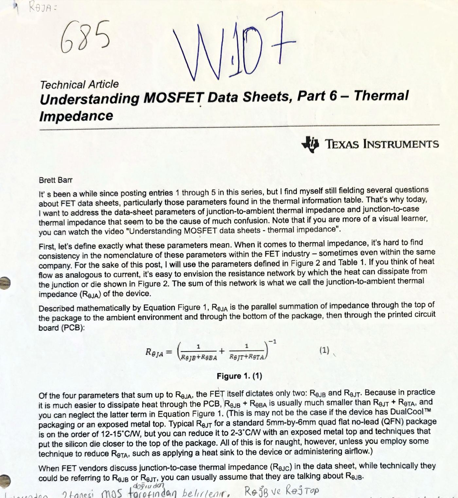

Bu sayfa, "datasheet current rating dogrudan yeterlilik kaniti degildir" ilkesinin kaynak dayanaklarindan biri. MOSFET kaybi sonunda mutlaka termal limite baglanacak.

Defterden aktarilan not (`W.109`):

Burada, `W.107`deki termal impedance makalesinin devaminda `R_{\theta JA}`'nin hangi fiziksel yollarin bileskesi oldugunu daha acik anlatan bir sayfa var.

Ana fikir:

- isi, tek bir yoldan degil birden fazla paralel / seri termal yoldan dagilir
- paket ustunden ortama giden yol ayri
- PCB ve exposed pad uzerinden dagilan yol ayri
- tek bir `R_{\theta JA}` sayisini, karttan bagimsiz mutlak bir sabit gibi okumak yanlistir

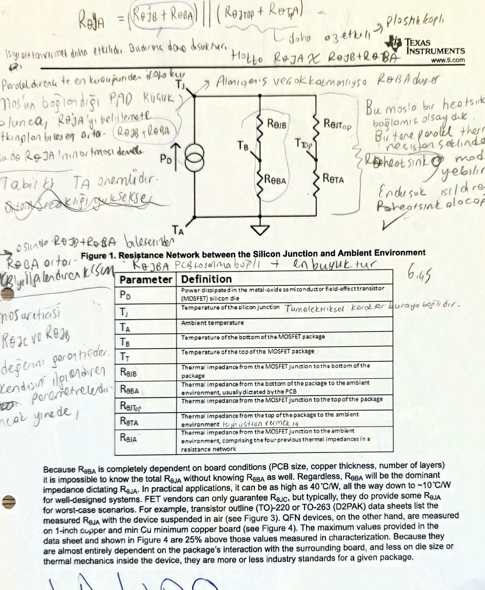

Burada, `T_J = T_A + P_D \cdot R_{\theta JA}` iliskisinin neden dikkatle yorumlanmasi gerektigini daha net goruyorum. Ayni guc kaybinda bile `T_J`, yalnizca MOSFET'e degil PCB yerlesimine, exposed pad baglantisina ve isi dagitma yapisina da bagli.

Defterden aktarilan not (`W.110`):

Burada, datasheet'te verilen `R_{\theta JA}` degerinin olcum duzenine ve PCB bakir alanina ciddi bicimde bagli oldugunu goruyorum.

Sayfadaki basili sekillerde iki farkli olcum baglami gosteriliyor:

- `TO-220` paketin havada asili oldugu / hava icinde olculen bir durum
- `SON 5 mm x 6 mm` benzeri bir pakette, farkli PCB bakir alanlariyla elde edilen `R_{\theta JA}` degerleri

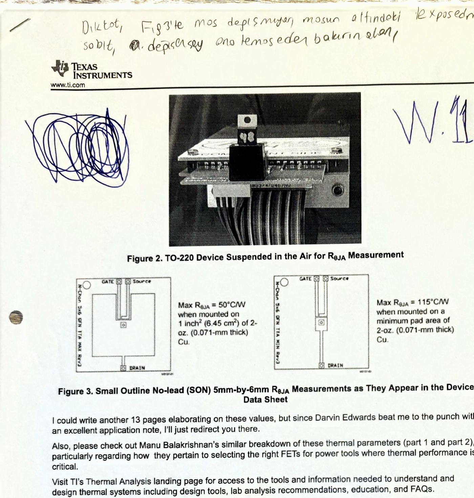

Yani termal hesapta datasheet'teki `R_{\theta JA}` degerini koru korune almak yerine, kullanilan paket ve kart yerlesimiyle birlikte yorumlamak gerekiyor.

Defterden aktarilan not (`W.117`):

Burada, termal datasheet parametrelerini tek tek isimlendirip hangisinin neyi temsil ettigini ayirmaya calistigim ozet bir sayfa var.

Sayfada not edilen ana termal buyuklukler:

- `R_{\theta JA} = 36.8 ^\circ C/W`
- `R_{\theta JC(top)} = 28 ^\circ C/W`
- `R_{\theta JC(bot)} = 2.1 ^\circ C/W`
- `R_{\theta JB} = 11.8 ^\circ C/W`
- `\Psi_{JT} = 0.4 ^\circ C/W`
- `\Psi_{JB} = 11.7 ^\circ C/W`

Sayfadaki kisa aciklamalardan korunacak ana fikirler:

- `R_{\theta JC(top)}`: junction-to-case(top) thermal resistance
- `R_{\theta JC(bot)}`: junction-to-case(bottom)
- `R_{\theta JB}`: junction-to-board thermal resistance
- `\Psi_{JT}` ve `\Psi_{JB}` klasik thermal resistance degil, karakterizasyon parametreleri olarak not edilmis
- `Thermocouple kullanacagin zaman kullanacaksin bu iki parametreyi`

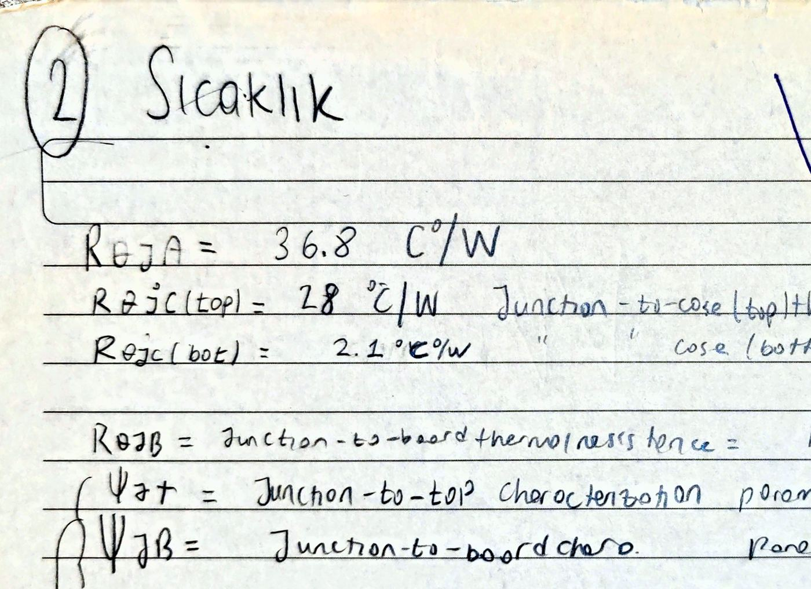

Son kapanista bu liste iki ayri is icin kullanilacak. Birincisi hesap yolu: MOSFET kaybi biliniyorsa, kart varsayimi ile `T_J` tahmini yapmak. Ikincisi olcum yolu: termokupl / case / board sicakligi varsa, buradan junction'a geri gitmek. Bu ikisinde ayni sembolleri rastgele karistirmamak lazim. `R_{\theta JA}` belirli test karti icin kayip -> ortam sicaklik artisina bakar; `R_{\theta JC(bot)}` exposed pad / alt termal yolun ne kadar guclu oldugunu gosterir; `\Psi_{JT}` ve `\Psi_{JB}` ise olcum noktalarindan junction tahmini icin daha pratik karakterizasyon sayilari. `T_J \approx T_{case} + P_{loss}R_{\theta JC}` kullanilacaksa, `T_{case}` noktasinin paket ustu mu, alt pad / board tarafi mi oldugu acik yazilmali.


#### 5.9.4 Board worst-case ve kayıp kapanış sırası

[Güncel Omurga] Taslak hedef tablosunda sicaklik hedefi `76 degC board worst-case` olarak duruyor. Bu hedef, MOSFET `T_J` ile ayni dugum degil; board sicakligi, komponent junction sicakligi, case sicakligi ve ortam sicakligi ayri ayri yazilacak.

[Çapraz Teyit] `WEBENCH` operating-values snapshot'i `Efficiency = 97.877%` gosteriyor; bu `%90` minimum verim hedefi acisindan olumlu bir hizli kontrol. Fakat `Ta = 30 degC` kosulundaki snapshot, `76 degC board worst-case` sicaklik hedefini veya MOSFET/bobin/kontrolcu termal kapanisini tek basina dogrulamaz.

[Açık Kontrol] Kayıp ve termal kapanis sirasi:

- `5.6.3` MOSFET kayip kalemleri ayni kosul setine cekilecek: conduction, switching, gate-drive, `C_{oss}`, body-diode/dead-time.
- `5.1` controller `VCC/LDO` kaybi, `P_{diss,VCC} = (V_{in}-7.5V) I_{VCC}` ile ayrica kontrol edilecek; bu kayip MOSFET junction sicakligina otomatik yuklenmeyecek.
- `5.5` giris MLCC RMS akimi, parca basina akim ve temperature-rise grafigiyle board sicakligina eklenecek.
- bobin `DCR` / rated RMS akim ve bakir kaybi da ayni board sicaklik varsayimina baglanacak.
- olcum yapilacaksa `R_{\theta}` ve `\Psi` parametreleri hangi olcum noktasi icin kullanildigi yazilarak secilecek.

Bu owner kapanmadan "verim iyi gorunuyor" veya "datasheet current yetiyor" demek yeterli degil. Final tablo, hangi isin hangi parca uzerinde dagildigini ayri gosterecek: kontrolcu `VCC/LDO`, high-side MOSFET, low-side MOSFET, bobin, giris MLCC/bulk ve gerekirse damping/snubber elemanlari.


## 6. Kontrolcu ve Kompanzasyon Owner

Burada guc katindan kontrol tarafina geciyorum. Modulator, power-stage modeli, K-factor yaklasimi ve frekans yerlestirmesi ayni kapali cevrim resminin parcalari. Bu bolumdeki izlerin bir kismi nihaiye yakin komponent secimine gidiyor, bir kismi da Type-III mantigini nasil kurdugumu gosteren ara defter notlari.

Bir onceki bootstrap / gate-drive bolumu burada kaybolmuyor; sadece ilk kontrol modelinde daha ideal bir sekilde temsil ediliyor. Averaged kontrol modelinde asil bloklar modulator, cikis filtresi, yuk ve kompanzator. `VCC`, `BST`, gate-drive gucu, dead-time ve gercek anahtarlama kenarlari ise kayip, startup, transient ve switching-model dogrulamasinda geri gelecek. Bu yuzden `6` numarali bolumde bulunan loop sayilari, `5.6-5.7` tarafindaki driver/bootstrap varsayimlariyla sonradan tekrar eslestirilmeli.

[Güncel Omurga - tek kontrol owner akisi] Bu bolumun okuma sirasi tek zincirdir; ayni kontrol hesabinin parcalari baska ana owner'a dagitilmez:

| Sira | Bu owner'daki blok | Primary icerik |
| --- | --- | --- |
| 1 | Feedback divider | `RFB1/RFB2`, `VFB = 0.8 V`, eski/guncel bolucu ayrimi ve calculator teyidi |
| 2 | Plant modeli | modulator kazanci, `H_filter(s)`, cikis filtresi/yuk modeli ve plant girdilerinin nasil kullanildigi |
| 3 | Crossover ve faz marji | hedef `f_c`, hedef `PM`, `GM` okuma kurali ve kose kosul uyarilari |
| 4 | K-factor | hedef frekansta gereken kazanc/faz katkisi ve `K` mantigi |
| 5 | Type-III komponent seti | `RC/CC` ailesi, kutup/sifir yerlestirme ve aday/final ayrimi |
| 6 | Cross-check | calculator, WEBENCH, defter ve eski iterasyon ekranlarinin ayni kontrol zincirinde okunmasi |


### 6.1 Feedback divider

[Güncel Omurga] `RFB1/RFB2` ailesinin primary owner'i burasidir. `5.1.3` artik sadece startup / pin-programming akisi icinde kisa referans birakir; geri besleme bolucusunun denklemi, eski/guncel aday ayrimi, calculator teyidi ve kompanzasyonla baglantisi burada tutulur.

ODT'den aktarilan metin (`4.1. Çıkış gerilimi setpoint dirençleri FB`):

> = 14V yapmak istiyoruz.
> 0402 boyutlarında.
> R14 Ohm R14 = 16.5 kΩ (RFB1)
> R10 = 1.00 kΩ (RFB2)
> Dirençleri % 0.1 tolerance’lı seçmek….

Geri besleme bolucusunu `14 V` cikis hedefi icin sectim. Fiziksel tarafta `0402` paket ve dusuk tolerans hedefi var. Fakat bu belgede iki farkli iterasyon ust uste duruyor: ilk ODT taslagindaki `16.5 kOhm / 1.00 kOhm` secimi matematiksel olarak dogru; sonraki defter sayfalari ve satin alinmis BOM ise `26.4 kOhm / 1.6 kOhm` cizgisine kayiyor.

Temel setpoint iliskisi:

$$
V_{out} = V_{FB}\left(1 + \frac{R_{FB1}}{R_{FB2}}\right)
$$

[Eski İterasyon] Ilk taslaktaki aday:

$$
V_{out} = 0.8\left(1 + \frac{16.5}{1.0}\right) = 14.0\,\text{V}
$$

[Güncel Omurga] Defter taramasi `W.14-W.16` ve BOM'daki satin alinmis parcalar su adayi gosteriyor:

- `R11 / R1 / RFB1 = 26.4 kOhm`
- `R10 / RFB2 = 1.6 kOhm`

Bu durumda:

$$
V_{out} = 0.8\left(1 + \frac{26.4}{1.6}\right) = 14.0\,\text{V}
$$

Bu owner altinda ayrim su:

- [Eski İterasyon] `16.5 kOhm / 1.00 kOhm`: ilk aday / eski setpoint iterasyonu
- [Güncel Omurga] `26.4 kOhm / 1.6 kOhm`: bu README icinde bundan sonra ana varsayim gibi okunacak guncel aday
- [Açık Kontrol] iki deger de `14 V` sonucuna gidiyor; fark direnç ailesi, BOM ve sonraki kompanzator baglantisinda ortaya cikiyor

[Çapraz Teyit - quickstart calculator] `LM5146_quickstart_calculator_revB1.xlsm` dosyasinda geri besleme bolucusu ayni nihai aileye oturuyor:

- `RFB1 = 26.4 kOhm`
- `RFB2 = 1.58 kOhm`
- `Actual Vout = 14.167 V`

Calculator da ayni yone bakiyor. Yani `16.5 kOhm / 1.00 kOhm` eski adayi tamamen yanlis degil; ama `W.14-W.16` ve satin alinmis BOM ile uyumlu gorunen `26.4 kOhm / 1.6 kOhm` secimi daha guclu duruyor.

Bu ayrimi sadece BOM notu gibi degil, kontrol hesabi icin de tutuyorum. Feedback bolucu degistiginde `H_{FB} = RFB2/(RFB1+RFB2)` ve `COMP` aginin referans aldigi oran da degisir. Bu yuzden eski `16.5 kOhm / 1.00 kOhm` iziyle bulunan bir kompanzator degeri, guncel `26.4 kOhm / 1.6 kOhm` setine sessizce tasinmayacak; `6.4` tarafinda tek bolucu seti secilip loop hesabi onunla kapanacak.

Bu bolume ait kaynak-foto:

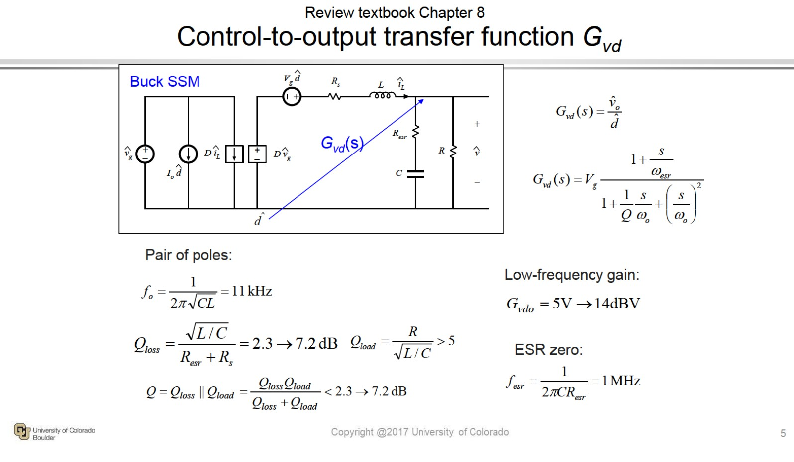

Bu foto burada duruyor, cunku geri besleme bolucusunun `RFB1 / RFB2` kimligini ve kompanzator kolundaki elemanlari tek bakista bagliyor.

Defterden aktarilan not (`W.202`):

`W.202`, bu konunun ilk kuruldugu sayfalardan biri. LM5146 datasheet'indeki `Output Voltage Setpoint and Accuracy FB` basligina bakip `FB` dugumunun referansla iliskisini kisa yoldan not etmisim.


Guvenle okunan ana notlar:

- `VREF = 0.8 V`
- geri besleme orani:

$$
H_{Vout} = \frac{R_2}{R_3 + R_5} \approx 0.12857
$$

- temel setpoint iliskisi:

$$
V_{out} = V_{REF}\left(1 + \frac{R_{FB1}}{R_{FB2}}\right)
$$

Sayfada `14 V` hedefi icin su oran kurulmus:

$$
\frac{14\,V}{0.8\,V} - 1 = \frac{R_{FB1}}{R_{FB2}} = 16.5
$$

Bu da eski aday bolucuyu destekliyor:

- `RFB1 = 16.5 k\Omega`
- `RFB2 = 1.00 k\Omega`

Sayfanin alt kismina, referans geriliminin toleransi ile ilgili su not da dusulmus:

- `Vref 792 mV ile 808 mV arasinda degisebilir`

Buradan da:

$$
\frac{808\,mV - 800\,mV}{800\,mV} = \frac{8\,mV}{800\,mV} = \frac{1}{100}
$$

yani yaklasik:

- `Vout'ta ±1%`lik bir sapma olabilecegi

not edilmis.

Bu sayfa eski `16.5 k\Omega / 1.00 k\Omega` setpoint iterasyonunu dogrudan destekliyor. Nihaiye yakin BOM ile uyumlu gorunen `26.4 k\Omega / 1.6 k\Omega` secimini degistirmiyor; ama bu bolucuyu ilk kez nasil kurdugumu gosterdigi icin degerli.

`VREF` toleransinin cikis gerilimine tasinacagini erken asamada not etmem de buradaki notun guclu yani.


### 6.2 Plant modeli ve modulator referansi

#### 6.2.1 Genel kontrol yapisi

Defterde kontrol dongusunu su bloklar uzerinden dusunuyorum:

- modulator
- power stage, yani cikis filtresi ve yuk
- hata yukselteci / kompanzator
- geri besleme bolucusu

Bu benim icin voltage-mode control cizgisi. Kompanzatorun isi de power stage'in kutup ve sifirlarini hesaba katip hedefledigim crossover frekansi ve faz marjina yolu acmak.


Ilk gorsel temel buck semasini hatirlatmak icin duruyor. `p85`, en sade haliyle `Vref -> compensator -> modulator -> filter -> Vout` dongusunu gosteriyor. `p86` ise ayni mantigi buck guc katina daha yakindan bagliyor: modulator, adaptive gate driver, `L_f`, `C_out`, `R_{ESR}`, `R_{DAMP}` ve geri besleme bolucusu ayni cizim uzerinde birlikte okunabiliyor. Bu uc gorsel bu yuzden burada kaliyor; kontrol bolumundeki soyut blok dili ile altta gelecek Type-III / plant denklemleri arasindaki gecisi aciyor.

#### 6.2.2 Modulator blogunun rolu


ODT'den aktarilan metin (`9.2. Modulator Bloğu`):

> Frekansa bağımlı değildir.
>
> Duty Cycle'ı belirler. Compensator bloğunda gelen işareti artarsa işaretinin genişliği artar, duty cycle artar, Q1 ana mosfet daha uzun süre açık (`on`) iletimde kalır.

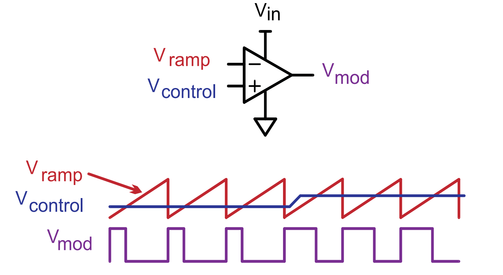

> Modulator bloğunun transfer function'ı:

$$
H_{\text{mod}}(s) = \frac{V_{in}}{V_{\text{ramp}}} = k_{FF} = 15\,\text{V/V}
$$
> Kullandığımız LM5146-Q1'ın input voltage feedforward özelliği var. Bu özellik sayesinde modülatör kazancı sabit kalıyor. Örneğin giriş gerilimi $V_{in}$ artarsa, $V_{\text{ramp}}$ da artarak $k_{FF} = 15\,\text{V/V}$ değerinin sabit kalmasını sağlıyor.

Bu kisimda benim icin ana fikir su: voltage-mode kontrol yapisinda modulator blogu, cikis filtresi gibi frekansa bagimli bir dinamik blok degil. Asil gorevi, kompanzator cikisini PWM duty oranina cevirmek. Bu nedenle:

- kompanzator cikisi artarsa high-side iletim suresi artar
- duty cycle artar
- guc katina aktarilan ortalama enerji artar

LM5146-Q1 icindeki input-voltage feedforward yapisi nedeniyle, rampa genligi giris gerilimiyle birlikte olcekleniyor. Bu yuzden modulator kazancini ilk modelde yaklasik sabit alabiliyorum. Buradaki `15 V/V`, sonraki K-factor ve loop hesabina girecek modulator kazanci olarak duruyor; kendi basina yeni bir guc kati sonucu degil.

Bu projede ilk yaklasim olarak:

$$
V_{\text{ramp}} \approx \frac{V_{in}}{15}
$$
ve dolayisiyla

$$
H_{\text{mod}}(s) = \frac{V_{in}}{V_{\text{ramp}}} \approx 15
$$
alinabilir. Son okuma yine datasheet'teki feedforward / ramp bilgisiyle eslestirilmeli; ama kontrol hesabinin omurgasinda modulatoru bu sabit kazanc gibi kullanmamın nedeni bu.

#### 6.2.3 Cikis filtresi ve yuk

[Referans Notu] Bu alt başlık artık plant `L/C/ESR` sayılarının primary owner'ı değildir. `L_F`, `DCR` ve ripple için `5.3`; `Cout`, `ESR_Ceq`, çıkış bulk kararı ve `Zout` ayrımı için `5.4` primary owner'dır. Burada yalnız bu owner'lardan gelen sayılarla kontrol transfer fonksiyonunun nasıl kurulduğu gösterilir.

[Açık Kontrol] Aşağıdaki transfer fonksiyonunda görülen `0.26 mOhm` ESR yerleştirmesi, `5.4` altında açıkça etiketlenen `0.28 mOhm / 0.26 mOhm / 1.3 mOhm` ESR fark ailesinin bir üyesidir. Final plant modeli tek `ESR_Ceq` değeri seçilmeden kapanmış sayılmayacak.


ODT'den aktarilan metin (`Çıkış Filtresi ve Yük`):

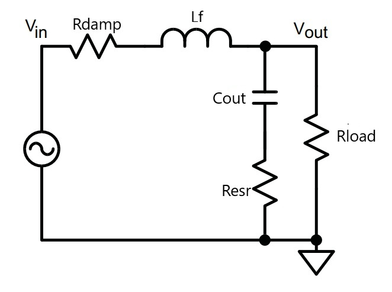


Bu sade esdeger devre, `H_{filter}(s)` ifadesini hangi fiziksel varsayimla yazdigimi gosteriyor. Seri kolda `L_f` ve `R_{damp}` var; cikis dugumunde ise `C_{out} + R_{esr}` kolu ile `R_{load}` birlikte dusunuluyor.

Boyle yazinca `6.2.3` altinda kullandigim kutup, sifir ve sonum notlari havada kalmiyor; belirli bir esdeger devre varsayimina baglaniyor.

> Cikis filtresi ve yuk icin kullanilan transfer fonksiyonu:

$$
H_{\text{filter}}(s) = \frac{V_{out}}{V_{in}} = \frac{1 + C_{out} R_{esr} s}{a_0 + a_1 s + a_2 s^2}
$$
Buradaki `V_{in}` yazimini kontrol dongusundeki iki farkli anlamla karistirmamak gerekiyor. Modulator tarafinda gercek giris gerilimi ve ramp feedforward var; burada ise cikis filtresinin averaged switch-node / guc-kati girdisine gore normalize edilmis aktarimini yaziyorum. Bu yuzden `H_{filter}(s)` tek basina duty-to-output sonucu gibi degil, `H_{mod}` ile carpilinca loop hesabina giren LC + yuk parcasi gibi okunmali.

Burada katsayilar:

$$
a_0 = 1 + \frac{R_{Damp}}{R_{load}}
$$
$$
a_1 = \frac{L_F}{R_{load}} + R_{esr} C_{out} + R_{Damp} C_{out} + \frac{R_{Damp} R_{esr} C_{out}}{R_{load}}
$$
$$
a_2 = \left(\frac{R_{load} + R_{esr}}{R_{load}}\right)L_F C_{out}
$$
> Sayisal yerlestirme:

$$
a_0 = 1 + \frac{21.13\,\text{m}\Omega}{1.59\,\Omega} = 1.01329
$$
$$
a_1 = \frac{6.8\,\mu\text{H}}{1.59\,\Omega} + (0.26\,\text{m}\Omega)(70\,\mu\text{F}) + (21.13\,\text{m}\Omega)(70\,\mu\text{F}) + \frac{(21.13\,\text{m}\Omega)(0.26\,\text{m}\Omega)(70\,\mu\text{F})}{1.59\,\Omega} = 5.774 \times 10^{-6}
$$
$$
a_2 = \left(\frac{1.59\,\Omega + 0.26\,\text{m}\Omega}{1.59\,\Omega}\right) (6.8\,\mu\text{H})(70\,\mu\text{F}) = 4.761 \times 10^{-10}
$$
$$
C_{out} R_{esr} = (70\,\mu\text{F})(0.26\,\text{m}\Omega) = 1.82 \times 10^{-8}
$$
> Yaklasik katsayi bicimi:

$$
H_{\text{filter}}(s) \approx \frac{1 + 1.82 \times 10^{-8} s} {1.01329 + 5.774 \times 10^{-6} s + 4.761 \times 10^{-10} s^2}
$$
Bu bolume ait kaynak-fotolar:

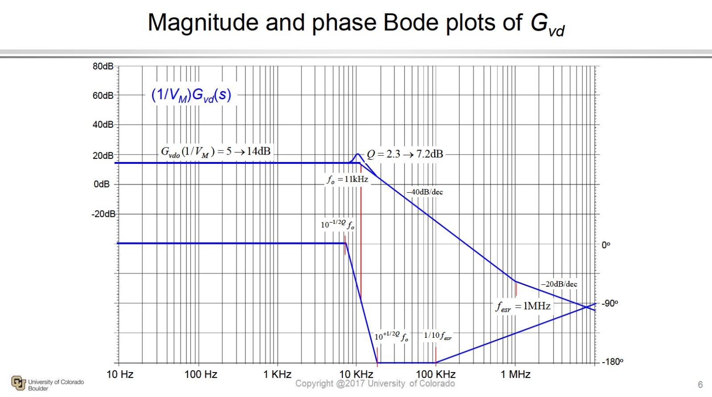

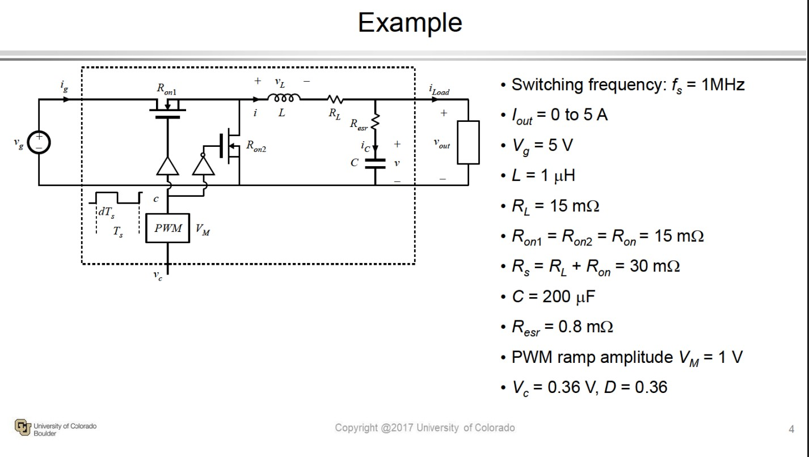

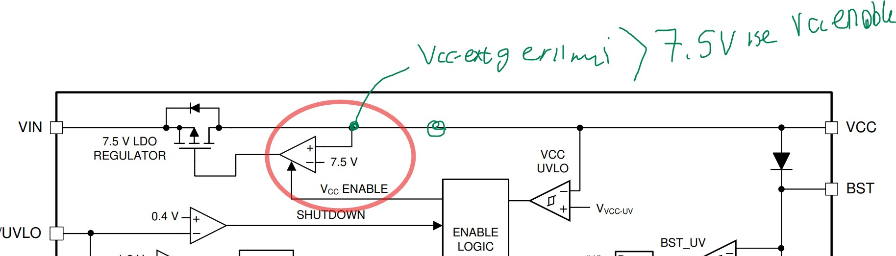

Burada ana fikir su: kontrol dongusunun plant kismi yalnizca bobinden gelmiyor. Cikis capacitor bank'i, ESR, yuk ve damping direnciyle birlikte ikinci dereceden bir yapi olusuyor. Bu modelde:

- $L_F$ enerji depolayan ana kutbu etkiler
- $C_{out}$ cikis dugumunun dinamiklerini belirler
- $R_{esr}$ ESR sifirini olusturur
- $R_{load}$ ve varsa sönumle ilgili direncler kutup yerlerini degistirir

`C28 = 0.1 uF` ihmal / yardimci rol ayrintisi `5.4.1`de tutulur; burada yalniz ilk plant hesabinin ana `Cout = 70 uF` kabulüyle kuruldugu hatirlatilir.

Bu kaynak fotolari plant dusuncesini yalnizca denklemler uzerinden degil; ornek buck guc kati, `G_{vd}` ifadesi ve buna ait Bode sezgisi uzerinden de kurdugumu gosteriyor. O yuzden `6.2.3` altinda cikis filtresi ve yuk modelinin gorsel arka plani olarak duruyorlar.

[Referans Notu - `W.116`] `W.116` defter kırpımı, output MLCC ESR ekranları ve `70 uF / C28 / ESR_Ceq` ayrımı `5.4` Cout owner'ına taşındı. `6.2.3` burada yalnız bu değerlerin `H_{\text{filter}}(s)` içine nasıl girdiğini gösterir; ikinci bir `Cout` karar bloğu değildir.

#### 6.2.4 Bu bolumde korunacak ayrim

Burada iki katmani ayri tutuyorum:

- genel yontem / blok diyagram mantigi
- bu tasarimin kendi sayisal transfer fonksiyonu

`G103_comp.txt` icindeki sayilar faydali bir ornek / calisma dosyasi gibi duruyor; ama bunlarin tamami dogrudan bu proje icin son deger olarak alinmamalidir. Bu projenin plant modeli, secilen gercek `L`, `C`, `ESR`, `DCR`, yuk ve modulator parametrelerinden yeniden kurulmalidir.

Bu ayrimi destekleyen kaynak-foto:

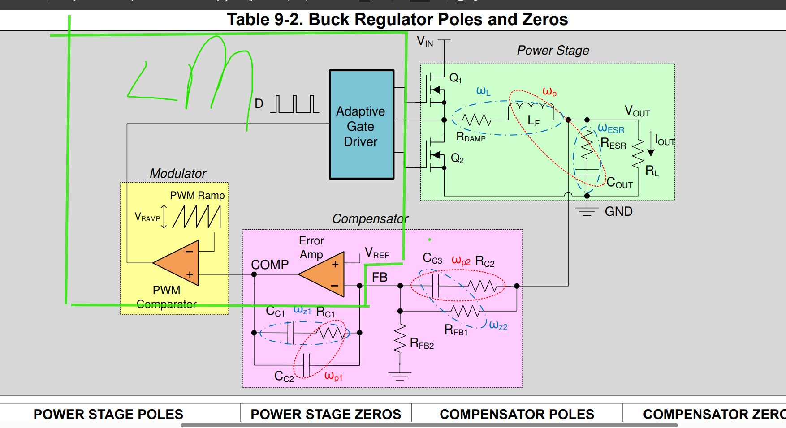

Bu harita, modulator, power stage ve compensator kutup / sifirlarini ayni cizimde topluyor. `6.1.4` icin islevi net: yontem haritasini gosterir; ama sayisal modelin son hali yerine gecmez.


### 6.3 Hedef `fc` ve faz marji

[Güncel Omurga] Hedef crossover ve faz marji icin ana okuma burasidir; ayrintili defter ve calculator ekranlari `6.5-6.6` altinda cross-check olarak kalir. Bu owner, plant sayilarini yeniden sahiplenmez; `L_F = 6.8 uH` ve `DCR ≈ 0.88 mOhm` icin `5.3`, `Cout ≈ 70 uF` ve ESR fark ailesi icin `5.4`, bu sayilarin transfer fonksiyonuna aktarimi icin `6.2.3` kullanilir.

Bu iterasyondaki hedef cizgi:

- ilk yerlestirme kuralı: `f_c ≈ f_sw/10`; `332 kHz` icin `33.2 kHz`
- calisma hedefi: `f_c ≈ 35 kHz`
- hedef faz marji: `50 deg - 60 deg` bandi; defterde aktif hedef olarak `PM = 55 deg`
- [Çapraz Teyit] calculator ekranlari `35 kHz` civarinda `52-54 deg` bandina bakiyor
- [Çapraz Teyit] WEBENCH / `amCharts.json`: `f_c ≈ 34.83 kHz`, `PM ≈ 55.75 deg`

[Açık Kontrol] Bu sayilar tasarim niyeti ve merkez-nokta teyididir. Final kabul, ayni `RFB1/RFB2` ve Type-III komponent setiyle, ayni plant modeli uzerinde LTspice/PSpice AC sweep ve kose kosullarla kapanacak.


### 6.4 K-factor mantigi ve Type-III komponent seti


#### 6.4.1 Neden bu yontem?

ODT'den aktarilan metin (`9. kontrolcü tasarımı`):

> Bitirme Projesi 1 dersinde kontrolcü tasarımını [1] kaynağındaki gerilim kontrollü Type 3 PID Compensator yöntemini izleyerek yapmıştım. Bu dönemde, [4] kaynağındaki K factor yöntemi izleyerek yapacağım.

Bu ODT parcasi, ilk donemde kullandigim Type-III PID yolundan bu tasarimda K-factor hattina neden gectigimi anlatan ana iz. Burada K-factor'u yeni bir etiket gibi degil, ayni kontrol problemini daha takip edilebilir kurmak icin kullaniyorum:

- hedef crossover frekansinda gereken faz katkisini dogrudan hesaplamaya zorlar
- kompanzator kazancini plant ve modulator ile birlikte ele alir
- Type-III eleman degerlerini daha izlenebilir bir akista turetmeyi kolaylastirir


#### 6.4.2 Taslaktaki akisin ozeti

Yerel notlar ve `G95_04_K_FACTOR_CAN_HOCA.txt` icindeki ornek akis su mantigi izliyor:

1. hedef crossover frekansi secilir
2. hedef faz marji secilir
3. plant ve modulatorun crossover frekansindaki fazi bulunur
4. kompanzatorun saglamasi gereken ek faz bulunur
5. kompanzatorun crossover frekansindaki gereken kazanci bulunur
6. buradan `K` faktoru hesaplanir
7. Type-III agin `R` ve `C` degerleri turetilir

Benim icin bu akisin asil faydasi, deneme-yanilma yerine hangi sayiyi neden sectigimi izletmesi. Burada listedeki adimlar genel yontem; bu projedeki sayilar ise `6.2.3` plant modeli ve `6.3` frekans hedefleriyle tekrar doldurulacak.


#### 6.4.3 Scriptlerde gorulen ilk ipuclari

Yerel scriptte su genel iliskiler kullaniliyor:

- crossover frekansi kabaca $f_t = 0.1\,f_s$
- gerekli kompanzator kazanci, modulator ve plant buyukluklerinden turetiliyor
- $K = \tan^2\!\left(\dfrac{\phi_{comp} + 90^\circ}{4}\right)$ tipinde standart K-factor iliskisi kullaniliyor

Buradaki `f_t = 0.1 f_s` satirini `35 kHz` hedefiyle kavga eden ikinci hedef gibi okumuyorum. `332 kHz` anahtarlama icin bu kural `33.2 kHz` verir; calculator / WEBENCH / defter tarafinda oturan calisma noktasi ise `~35 kHz` civari. K-factor hesabinda asil dikkat edecegim sey, tek bir `f_c` secip plant fazini, modulator kazancini, gerekli kompanzator kazancini ve `K` degerini ayni frekansta yeniden hesaplamak.

Bu iliskiler, taslaktaki yontemin iskeletini veriyor. Ancak burada yine ayni dikkat gerekli:

- scriptteki ornek `60 V -> 15 V`, `100 kHz` ve belirli `L/C/R` degerleri dogrudan bu projenin son degerleri degil
- bu nedenle yontem alinacak; sayisal sonuc bu proje icin yeniden hesaplanacak

Yani bu script burada "sonuc ureten dosya" gibi degil, K-factor adimlarinin hangi sira ile uygulandigini gosteren bir iz gibi duruyor.


#### 6.4.4 Bu projede K-factor'un gorevi

Bu tasarim ozelinde K-factor yontemi ile sonunda su ciktilar uretilmek isteniyor:

- secilen `332 kHz` anahtarlama frekansi icin uygun bir crossover frekansi
- hedef faz marji
- Type-III kompanzator komponentleri
- acik ve kapali cevrim bode yorumu

Bu bolum, ileride MATLAB / LTspice loop dogrulamasina giden baslangic noktasi. Ama tek basina nihai dogrulama degil; asil kapanis, hesaplanan kompanzatorun acik-cevrim Bode, faz marji ve transient cevabiyla birlikte kontrol edilmesiyle gelecek.


##### Defter taramasi: `W.1-W.24`

Bu tarama icin sayfalari su sekilde ayirdim:

- `W.1-W.6`: [EX7.1 Buck Converter Closed-Loop Design (Type 3 Compensator).pdf](./references/pdfs/EX7.1%20Buck%20Converter%20Closed-Loop%20Design%20%28Type%203%20Compensator%29.pdf), [G2_Buck Converter Design Part 2 - Closed-Loop LM5146 - Video Version.pdf](./references/pdfs/G2_Buck%20Converter%20Design%20Part%202%20-%20Closed-Loop%20LM5146%20-%20Video%20Version.pdf) ve [G32_lm5146-q1.pdf](./references/pdfs/G32_lm5146-q1.pdf) uzerinden crossover frekansinda gereken kazanc ve faz katkisini cikarmaya calismisim. Bu grup daha cok yontemi ogrenme ve isaret-konvansiyonunu oturtma sayfalari.
- `W.7-W.10`: op-amp acik-cevrim modeli, `GBW / A_{dc}` iliskisi, `KFF = 15 V/V` notu ve `G98` Figure 2 / Figure 3 kullanim izleri var. Bu grup modulator ve hata yukselteci modeline destek veriyor.
- `W.11-W.12`: faz marji ve plant fazinin sayisal olarak tekrar hesaplandigi ara sayfalar. `PM = 55 deg` hedefinin bu iterasyonda da korundugu goruluyor.
- `W.13-W.16`: Type-III kompanzator eleman degerleri icin sayisal hesaplar yapiliyor. Bu aralikta en az iki farkli iterasyon var.
- `W.20-W.24`: Type-III kutup-sifir mantigi, `Kmid`, `f_c`, `f_o`, `f_{esr}` ve geri besleme bolucusunun kompanzatorla iliskisi uzerine kavramsal notlar var.

Asagidaki kucuk el yazisi parcalar, kaynak notundan kendi sayisal kontrolume nasil gectigimi gosteriyor:


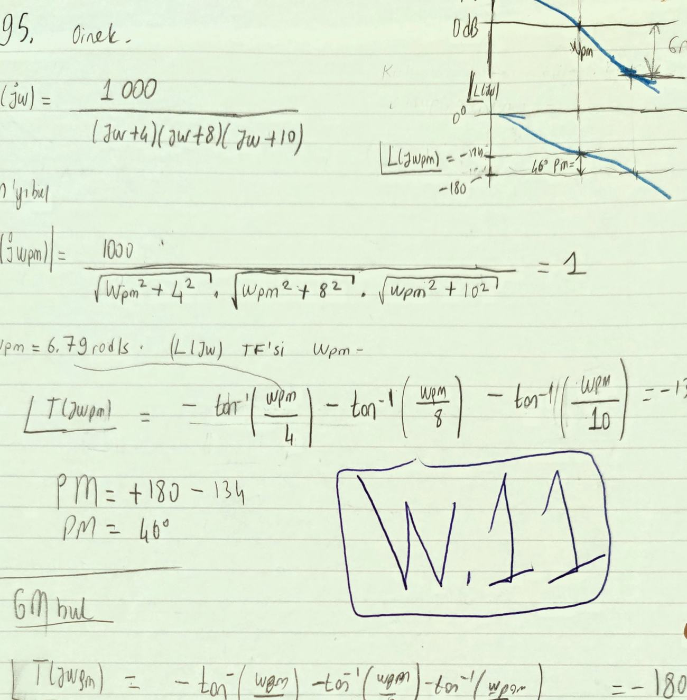


Bu ilk uc sayfada kaynak ozetinden cikilip faz marji ve plant fazi sayisal olarak yoklanmaya basliyor. Yani `W.1-W.9` yalnizca "okudum" notu degil; kendi crossover hedefime tasidim notu.


Bu dort sayfa, kompanzatorun tek hamlede secilmedigini gosteriyor. `26.4k / 1.6k / 6.65k / 768 / 4.7n / 120p / 1n` ailesine alternatif iterasyonlardan gecerek yaklasmisim.

`W.20-W.24`, kompanzator ve frekans yerlestirme mantigini devam ettiriyor:


Bu bes sayfa ile tekrar kompanzator tarafina donuluyor. `Kmid`, `f_c`, `f_o`, `f_{ESR}` ve feedback bolucu orani ayni yerlesim probleminde bir araya geliyor; bu yuzden `W.1-W.24` tek tek formullerden cok bir kontrol yerlesimi izi gibi okunmali.

`W.1` - gerekli kompanzator kazanci:


`W.1` sayfasini su kaynak zincirine bagliyorum:

- `EX7.1` tarafinda `L(j\omega) = M(j\omega)\,F(j\omega)\,G_3(j\omega)` ve crossover'da unity-gain sarti
- `G2` tarafinda ayni `modulator + filter/load + compensator` ayrimi
- `G32` tarafinda ise LM5146 icin `V_{IN} / V_{RAMP} = 15` modulator kazanci

Bu sayfanin isi basit: crossover frekansinda kompanzatorun gerekli kazancini bulmak.

Sayfada okunabilen ana akis:

Crossover frekansi:

$$
f_t = 35\,\text{kHz}
$$
Modulator kazanci:

$$
M = \frac{V_s}{V_{ramp}} = 15
$$
Crossover noktasinda toplam loop gain `1` olmali. Sayfadaki ana iliski:

$$
\lvert L(j\omega_t)\rvert = \lvert M(j\omega_t)\rvert \cdot \lvert F(j\omega_t)\rvert \cdot \lvert G_3(j\omega_t)\rvert = 1
$$
Sayfada bulunan plant / filter buyuklugu:

$$
\lvert F(j\omega_t)\rvert \approx 0.045356
$$
Unity-gain kosulu kullanilarak gerekli kompanzator kazanci:

$$
\lvert G_3(j\omega_t)\rvert = \frac{1}{\lvert M(j\omega_t)\rvert \cdot \lvert F(j\omega_t)\rvert} = \frac{1}{15 \cdot 0.045356} \approx 1.46985
$$
Bu buyuklugun `dB` cinsinden karsiligi:

$$
20\log_{10}\!\big(\lvert G_3(j\omega_t)\rvert\big) \approx 3.3454\,\text{dB}
$$
Bu hesabin anlami:

`35 kHz` crossover noktasinda, modulator kazanci ve plant kazanci birlikte dusunuldugunde, kompanzatorun o frekansta yaklasik `1.46985 V/V` ya da `3.3454 dB` kazanc vermesi gerekiyor.

Bu sayiyi sabit bir kompanzator kazanci gibi kilitlemiyorum. `|F(j\omega_t)|` degeri `70 uF`, `6.8 uH`, `R_{damp}`, `ESR`, yuk ve secilen `f_c` noktasina bagli. Bunlardan biri degisirse `1.46985 / 3.3454 dB` sonucu da, hemen arkasindaki `W.2-W.5` faz katkisi hesabiyla birlikte yeniden hesaplanacak.

Foto uzerinden bazi son basamaklar net degil. Yine de islem belli: `EX7.1 / G2` yontemini kendi `35 kHz` tasarim hedefime uygulayip, gerekli kompanzator kazancini ilk kez sayisal olarak cikardigim sayfa bu.

`W.2-W.9` kirpimleri de ayni kontrol hesabinin farkli taraflarini gosteriyor:


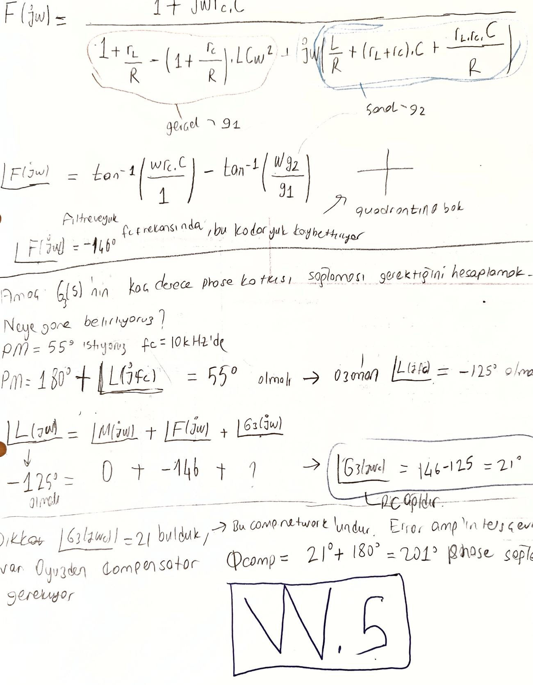


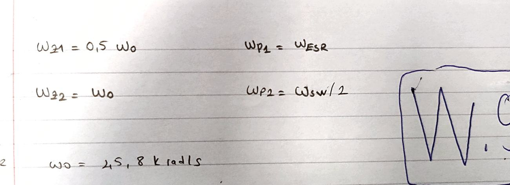

Bu kirpimleri tek bir "son komponent listesi" gibi okumuyorum. `W.2` ve `W.5` daha cok faz butcesini kuruyor: plant fazi ne kadar geride, `PM = 55 deg` hedefi icin kompanzatorun kac derece faz eklemesi gerekiyor? `W.6` ayni noktada buyukluk / unity-gain kontrolu, `W.7` hata yukselteci kutbu, `W.8` modulator kazanci, `W.9` ise ilk kirilim frekansi tablosu gibi duruyor. Son Bode kontrolunde isaret konvansiyonu ve faz acisi ayni tanimla tekrar okunmali.

Bu grup tek kronolojik iterasyon degil; ayni konu uzerinde birkac farkli deneme var. `W.13` ile `W.15-W.16` ayni nihai komponent setini vermiyor; `W.13` daha cok alternatif / ara iterasyon. `W.23-W.24` icindeki bazi `Kmid` ve `RFB1` iliskileri de eski `16.5 kOhm` bolucu uzerinden gidiyor olabilir. Buna karsilik `W.14-W.16`, satin alinmis BOM ve calculator cizgisiyle daha iyi uyusuyor; o yuzden nihai adaya en yakin kisim gibi duruyor.

Bu gruptan nihai adaya yakin su komponent seti cikiyor:

- `R11 / R1 / RFB1 = 26.4 kOhm`
- `R10 / RFB2 = 1.6 kOhm`
- `R6 / R2 / RC1 = 6.65 kOhm`
- `R9 / R3 / RC2 = 768 Ohm`
- `C1 = 120 pF`
- `C2 = 4.7 nF`
- `C3 = 1.0 nF`

Bu grup, kontrolcu bolumunun artik yalnizca "Type-III kullanilacak" seviyesinde kalmadigini gosteriyor. Gercek resistor ve capacitor secimlerine yaklasilmis durumda. Ama burada yine ayni ayrim akilda tutulmali:

- dogru ama nihai olmayan hesap
- nihai tasarima yaklasan hesap
- teyit / capraz kontrol amacli hesap

Bu nedenle `W.1-W.24`, topluca tek bir "nihai sonuc" olarak degil, ayni kontrol problemi uzerinde olusan tasarim izi olarak okunmali.

[Çapraz Teyit - quickstart calculator]:

`LM5146_quickstart_calculator_revB1.xlsm` dosyasinin `Design Regulator` sayfasi da ayni nihaiye yakin kompanzator ailesini veriyor:

- `RFB1 = 26.4 kOhm`
- `RFB2 = 1.58 kOhm`
- `RC1 = 6.65 kOhm`
- `RC2 = 768 Ohm`
- `CC1 = 4.7 nF`
- `CC2 = 120 pF`
- `CC3 = 1.0 nF`
- `f_c = 35 kHz`
- `f_{p2} = 166 kHz`

Bu nedenle workbook, `W.13` veya `W.115` gibi eski `16.5 kOhm / 60 kHz` cizgilerini degil; `W.14-W.16` ile belirginlesen ve satin alinmis BOM'a daha yakin duran kompanzator cizgisini destekliyor.


#### 6.4.5 Compensator topolojisi ve temel model


ODT'den aktarilan metin (`Compensator`):

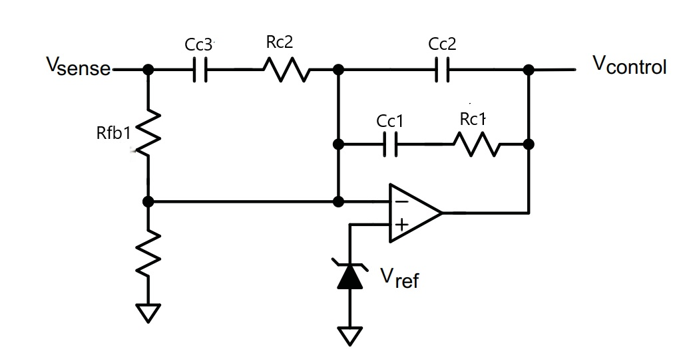


Bu gorselleri burada toplama sebebim su: once ODT'deki Type-III agi gosteriyorum, sonra ayni agin kutup / sifir ve komponent isimleriyle nasil okundugunu takip ediyorum. `p24` dogrudan LM5146 devresi degil; daha genel bir analog kompanzator uzerinden egim ve kutup-sifir sezgisini hatirlatiyor. `p57` ve `p58` ise bu sezgiyi LM5146 tarafindaki `Rc1`, `Rc2`, `RFB1`, `RFB2`, `Cc1`, `Cc2`, `Cc3` isimlerine bagliyor.

`p89` da ayni Type-III agin daha sade bir op-amp realizasyonu gibi duruyor. `V_{sense}`, `V_{control}`, `V_{ref}`, `Rfb1`, `Rc1`, `Rc2`, `Cc1`, `Cc2`, `Cc3` etiketlerini ayni cizimde gormek, `W.73`, `W.84`, `W.85` ve `W.113` tarafinda gecen notasyonun hangi fiziksel dala karsilik geldigini kaybetmemek icin faydali.

> Compensator transfer function:

$$
H_{\text{compensator}}(s) = \frac{V_{\text{control}}}{V_{\text{sense}}} = \frac{H_{\text{error-amp,ol}}(s)} {1 + H_{\text{error-amp,ol}}(s)\,\beta(s)}
$$
> Error amplifier open-loop modeli:

$$
H_{\text{error-amp,ol}}(s) = \frac{A_{VOL}} {1 + \dfrac{s}{\omega_{\text{opamp}}}}
$$
$$
\omega_{\text{opamp}} = 2\pi\,\frac{GBW}{A_{VOL}}
$$
Defterden aktarilan not (`W.201`):

Burada hata yukseltecinin acik-cevrim modeli ve `GBW / A_{VOL}` iliskisini ayri bir defter sayfasinda tekrar kurmusum. Amac yeni bir `R-C` secimi yapmak degil; kompanzator hesabina giren hata yukselteci kutbunu kaybetmemek.


Sayfanin ustunde su notlar yer aliyor:

- `A_{VOL} = 94 dB = DC gain`
- `GBW = minimum gain bandwidth = 6.5 MHz`

Sayfada acik-cevrim hata yukselteci davranisi su bicimde not edilmis:

$$
A_{\text{op-amp}}(f) \approx \frac{A_{low}}{1 + \dfrac{f}{f_{unity}}}
$$
ve yanina da:

$$
A_{DC}(dB) = 20 \log_{10}(A_{VOL})
$$
iliskisi yazilmis.

Buradaki `f_{unity}` yazimi biraz riskli okunuyor. Sonraki `GBW = Kazanc \times f` adimindan anladigim, hesaplanan `f` aslinda unity frekansi degil; acik-cevrim kazancin baskin kutup / compensation pole frekansi.

Defterdeki sayisal adimlar soyle ilerliyor:

$$
20 \log_{10}(Kazanc) = 94
$$
$$
\frac{94}{20} = \log_{10}(Kazanc)
$$
$$
10^{4.7} \approx 50118
$$
Yani:

$$
A_{VOL} \approx 50118
$$
Ardindan sayfada:

$$
GBW = Kazanc \times f
$$
iliskisi kullanilarak:

$$
6.5\,\text{MHz} = 50118 \times f
$$
ve buradan:

$$
f \approx 129.7\,Hz
$$
sonucu yazilmis.

Sayfanin altina da:

- `Error Amplifier open-loop compensation pole`

notu dusulmus.

Yani `W.201` sonucunu boyle okuyorum:

- `A_{VOL} = 94 dB` yaklasik `50118 V/V`
- `GBW = 6.5 MHz`
- baskin hata-yukselteci kutbu yaklasik `129.7 Hz`

Bu `129.7 Hz` degerini loop crossover frekansi veya Type-III kutup/sifir hedefi gibi okumuyorum. Bu, hata yukseltecinin kendi acik-cevrim baskin kutbu. `35 kHz` loop hedefini belirlemiyor; sadece `H_{\text{error-amp,ol}}(s)` icinde sonlu kazanc / sonlu GBW etkisinin nasil temsil edilecegini gosteriyor. Calculator veya LTspice modelinde hata yukselteci zaten ic modele sahipse bu kutbu ikinci kez elle eklememek gerekir.

Bu sayfa, yukaridaki `H_{\text{error-amp,ol}}(s)` ve `\omega_{\text{opamp}} = 2\pi\,GBW/A_{VOL}` iliskisinin defterdeki karsiligi. Kompanzator `R/C` degerlerini secmiyor; ama hata yukseltecinin sonsuz kazanc gibi davranmadigini ve modele kendi kutbuyla girdigini hatirlatiyor.

[Referans Notu - plant handoff] Kompanzator hesabinda kullanilan plant modeli `6.2.3`te tam denklem ve sayisal yerlestirmeyle verildi. Burada ayni `H_{filter}(s)` ifadesini yeniden owner gibi yazmiyorum; K-factor ve Type-III hesabi o plantten gelen `70 uF`, `6.8 uH`, `R_{damp}`, `ESR`, yuk ve modulator kazanci setini girdi olarak kullanir.

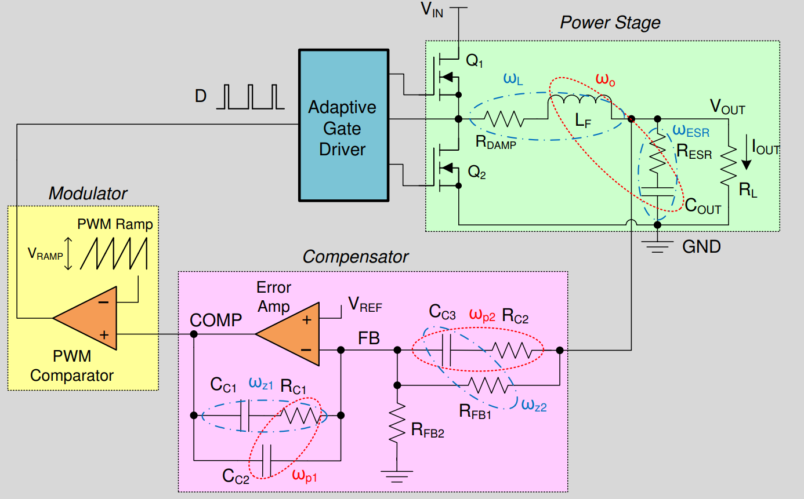

Bu poles / zeros haritasi, yukaridaki plant modeli ile Type-III kompanzatorun ayni frekans resminde birlikte okunmasi icin duruyor.

Bu bolumde artik sadece "Type-III kompanzator kullanilacak" demekle yetinmiyorum; kompanzatorun hangi bloklardan olustugunu da acik tutuyorum. Burada temel mantik su:

- sonlu acik-cevrim kazanca sahip hata yukselteci, `beta(s)` geri besleme agi ile birlikte kapali-cevrim kompanzatoru olusturur
- `H_{\text{compensator}}(s)` kontrol dugumundeki gerilimi sekillendirir
- bu blok, modulator ve power-stage ile carpilarak acik-cevrim donguyu belirler

Bu nedenle kompanzator tasarimi yalnizca `R` ve `C` secimi degil; ayni zamanda su uc ifadenin birlikte dusunulmesidir:

$$
H_{\text{open-loop}}(s) = H_{\text{mod}}(s)\,H_{\text{filter}}(s)\,H_{\text{compensator}}(s)
$$
Burada referans dugumunu kaybetmemek gerekiyor. `H_{\text{compensator}}(s)` ifadesini `V_control / V_sense` olarak yaziyorsam, feedback bolucu / sense orani bu tanimin girisinde duruyor. Open-loop'u dogrudan `Vout` uzerinden yazarsam ayrica `H_{FB}(s)` veya `RFB2/(RFB1+RFB2)` carpani gerekir. Calculator tarafinda bu oran cogunlukla kompanzator / feedback aginin icinde ele aliniyor. Bu yuzden `W.84`teki `H = 1/14` notu ve `RFB1/RFB2` satirlari final loop modelinde tek kez sayilmali; unutulmamali ama iki kere de carpilmamali.

Buradaki Type-III topoloji mantiklidir; ancak bu, komponent degerlerinin otomatik olarak dogru oldugu anlamina gelmez. Nihai `R/C` secimi, gercek plant, hedef crossover frekansi ve faz marji ile birlikte tekrar kontrol edilmelidir.

Defterden aktarilan not (`W.84`):

Burada Type-III kompanzator artik yalnizca topoloji olarak durmuyor; kutup-sifir yerlestirmesi ve komponent iliskileri tarafina geciyor. Bunu son komponent sayfasi gibi degil, "hangi kirilim hangi `R-C` iliskisinden geliyor?" sorusunun ilk ciddi taslagi gibi okuyorum. Sayfanin ust kismina genel kompanzator formu yazilmis; el yazisindaki isaretler tam net olmamakla birlikte ana fikir su:

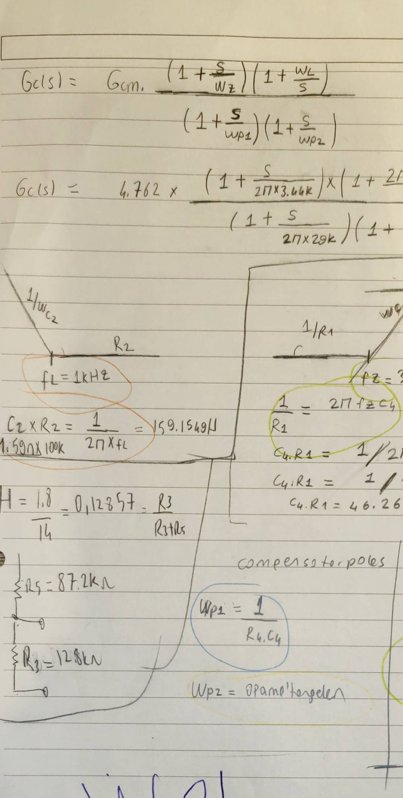

$$
G_c(s) \sim G_{cm} \cdot \frac{\text{sifir terimleri}}{\text{kutup terimleri}}
$$
ve altinda da bu ifadenin belirli frekans yerlestirmeleriyle sayisal hale getirilmeye calisildigi goruluyor.

Sayfada guvenle okunabilen ana frekans yerlestirme adaylari sunlar:

- bir dusuk frekans sifiri:
$$
f_{z1} \approx 1\,kHz
$$
- ikinci sifir:
$$
f_{z2} \approx 3.44\,kHz
$$
- bir yuksek frekans kutbu:
$$
f_{p2} \approx 29\,kHz
$$

Sayfada ayrica, Type-III agdaki bazi `R-C` ciftlerinin bu frekanslara nasil baglandigi not edilmis. El yazisindan acikca secilen iliski tipleri su sekilde okunuyor:

$$
C_2 R_2 \approx \frac{1}{2\pi f_{z1}}
$$
ve

$$
C_4 R_1 \approx \frac{1}{2\pi f_{z2}}
$$
Benzer sekilde, alt kisimda `compensator poles` ve `zeros` diye ayrilmis bir bolgede, kompanzatorun kutup-sifir mantigi bir kez daha not edilmis. Sayfada:

$$
H = \frac{1}{14} \approx 0.12857
$$
notu da yer aliyor; bu, geri besleme bolucusu / sense orani ile kompanzator kazanci arasindaki baglantiya isaret ediyor olabilir.

Bu `H = 1/14 \approx 0.12857` satirini temkinli tutuyorum: `1/14` matematiksel olarak `0.0714` eder, o yuzden ya el yazisi / okuma tarafinda bir karisma var ya da burada kastedilen oran tam `1/14` degil. Silmiyorum; cunku feedback / sense orani ile kompanzator kazanci arasindaki bagin defterde sorgulandigini gosteriyor.

`W.84`, `W.73`teki "Type-III agin yapisi nedir?" sorusundan sonra gelen ilk ciddi kutup-sifir yerlestirme sayfasi. Yeni nihai komponent setini tek basina kesinlestirmiyor; `f_{p2} \approx 29 kHz` gibi bazi adaylar daha sonra calculator tarafindaki `166 kHz` cizgisiyle de tekrar karsilastirilmali. Burada korudugum asil sey, `f_{z1}`, `f_{z2}` ve `f_{p2}` hedeflerinin artik komponent iliskilerine baglanmaya baslamasi.

Defterden aktarilan not (`W.85`):

Burada `W.84`teki kutup-sifir yerlestirmesi bu kez belirli bir aday kompanzator komponent seti ile sayisal olarak kontrol edilmeye calisiliyor. Bu set guncel BOM gibi okunmamali; daha cok "formul hangi `R-C` ciftine baglaniyor?" denemesi. Sayfanin sol tarafinda okunan aday degerler sunlar:


- `R_{c2} \approx 100 \Omega`
- `R_{FB1} \approx 21 k\Omega`
- `C_{c3} \approx 1 nF`
- `R_{c1} \approx 8.06 k\Omega`
- `C_{c1} \approx 4.7 nF`
- `C_{c2} \approx 100 pF`

Bu degerler `W.14-W.16` / calculator tarafinda finale daha yakin duran `RFB1 = 26.4 k\Omega`, `RC2 = 768 \Omega`, `CC2 = 120 pF` cizgisiyle birebir ayni degil. O yuzden `W.85`i komponent seciminden cok, Type-III kutup denklemlerinin aday degerlerle nasil calistigini gosteren ara sayfa olarak tutuyorum.

Sayfanin ust notunda, `\omega_{p1}` icin su tip bir yaklasim yazilmis:

$$
\omega_{p1} \approx \frac{1}{R_{c1}\,(C_{c1}\parallel C_{c2})} \approx \frac{1}{R_{c1}\,C_{c2}}
$$
Bu yaklasim, `C_{c1} \gg C_{c2}` oldugu icin paralel esitgerin yaklasik `C_{c2}` tarafindan belirlendigini soyluyor.

Sayfada bundan hareketle yuksek frekans kutuplari icin su ara sonuclar not edilmis:

$$
\omega_{p1} \approx \frac{1}{8.06k \cdot 100p} \approx 1.24 \times 10^6 \, \text{rad/s}
$$
$$
\omega_{p2} \approx \frac{1}{100 \cdot 1n} \approx 10^7 \, \text{rad/s}
$$
Bu iki sonuc rad/s cinsinden yazilmis. Hz'e cevirince kabaca `f_{p1} \approx 197 kHz` ve `f_{p2} \approx 1.59 MHz` mertebesine gelir. Bu nedenle `W.84`te gecen `f_{p2} \approx 29 kHz` notuyla dogrudan ayni aday gibi okunmamali; burada farkli bir komponent denemesi veya farkli etiketleme olma ihtimali var.

Alt kisimda ise sifir tarafina geciliyor ve `C_{c1}` ile `C_{c2}` toplam/etkin etkisi uzerinden dusuk frekansli sifirin hesaplanmaya calisildigi goruluyor. Sayfada son satira dogru yaklasik:

$$
f_{z1} \approx 4.334\,kHz
$$
gibi bir sonuc not edilmis.

`W.85`, `W.84`te teorik olarak yerlestirilen kutup-sifirlari belirli bir aday `R-C` setiyle yokluyor. Sayfadaki komponent degerleri dogrudan nihai kabul edilmemeli; ama kompanzator tasariminin artik kavramsal seviyeden cikarak gercek eleman degerleriyle sinanmaya basladigi net. `f_{z1} \approx 4.334 kHz` sonucu da `W.84`teki `3.44 kHz` notuyla ayni buyukluk mertebesinde kaldigi icin iz olarak degerli.

Burada kendime kisa bir ayirac koyuyorum: `W.84`teki `29 kHz`, `W.85`te rad/s'ten gelen `1.59 MHz` ve calculator / `W.112` tarafindaki `166 kHz` ayni satira alinacak tek bir `f_{p2}` sonucu degil. Bunlar farkli aday setleri, farkli etiketler veya farkli okuma anlari olabilir. Final Type-III tablosunda once tek komponent seti secilecek, sonra butun `f_z/f_p` degerleri ayni formuller ve ayni birimle yeniden yazilacak.

Defterden aktarilan not (`W.142`):

Burada yine aday bir Type-III ag var; bu kez amac sayilari final ilan etmek degil, `R-C` kollarinin Bode egimine nasil katki verdigini renkli cizimde gormek. `W.85`teki setle birebir ayni kabul etmiyorum; bu sayfa daha cok grafik/egim denemesi.

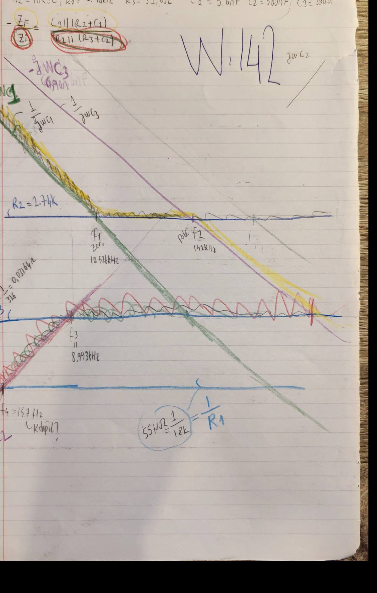

Sayfanin ust kismina yazilan aday komponent seti, okunabildigi kadariyla soyle:

- `R_1 \approx 18 k\Omega`
- `R_2 \approx 2.74 k\Omega`
- `R_3 \approx 31.6 \Omega`
- `C_1 \approx 56 nF`
- `C_2 \approx 5600 pF`
- `C_3 \approx 290 pF`

Bu set `W.14-W.16` / calculator tarafinda finale daha yakin duran komponent cizgisiyle de birebir ayni degil. O yuzden burada komponent listesinden cok Bode egimlerinin nasil kurulduguna bakiyorum.

Sayfanin sol ustunde yine `Z_F / Z_1` orani yazilmis ve `Z_F` ile `Z_1` terimleri renkli olarak ayristirilmis. Buradaki ana fikir, kompanzatorun farkli `R-C` kollarinin Bode egimlerine ayri ayri katkisini gormektir.

Sayfadaki renkli dogrularin ve notlarin anlattigi ana seyler sunlar:

- bir kolda integrator benzeri `-20 dB/dec` katkisi
- bazi kollarda sifir geldikce egimin duzelmesi
- yuksek frekans kutuplari geldikce egimin tekrar asagi donmesi
- boylece toplam Type-III ag cevabinin, tek tek `R-C` parcalarinin cebirsel toplami degil frekans-alaninda ust uste binmis hali oldugu

Sayfada ayrica bazi frekans isaretleri de goruluyor; ancak rakamlarin bir kismi tam net olmadigi icin burada yalnizca su guvenli fikir alinmali:

- birden fazla kirilim frekansi ayni sayfada isaretlenmis
- bunlar `W.84-W.85`te hesaplanan kutup/sifir noktalarinin grafik karsiliklari gibi dusunulmus

Sayfanin alt kismina dusulen:

$$
\frac{1}{R_1} \approx 55\,\mu S \approx \frac{1}{18k}
$$
notu da, bu agi yalnizca frekans olarak degil iletkenlik/empedans seviyeleri acisindan da gozden gecirdigimi gosteriyor.

Burada yeni bir `f_z` veya `f_p` sonucu aramiyorum. Benim icin asil iz, Type-III agin yalnizca formulle degil Bode egimiyle de kontrol edilmesi. Komponent degerleri ve frekans etiketleri aday iterasyon; nihai BOM gibi ele alinmamali.

Defterden aktarilan not (`W.143`):

Burada `W.142`nin hemen devami var. Aday kompanzator aginda kirilim frekanslarini hangi `R-C` ciftinden cektigimi yazmisim; altta da bunlari renkli Bode parcalari uzerine geri yerlestirmeye calismisim. Yine final tasarim sayfasi gibi degil, `W.142`deki egim ciziminin hesap izi gibi okunmali.


Sayfanin ust tarafinda, okunabildigi kadariyla, su esitlikler yazilmis:

$$
\frac{1}{j\omega C_1} = R_2 \;\Rightarrow\; f_1 = \frac{1}{2\pi R_2 C_1} \approx 10.526\,kHz
$$
$$
\frac{1}{j\omega C_3} = R_2 \;\Rightarrow\; f_2 = \frac{1}{2\pi R_2 C_3} \approx 152.4\,kHz
$$
$$
\frac{1}{j\omega C_2} = R_3 \;\Rightarrow\; f_3 = \frac{1}{2\pi R_3 C_2} \approx 89.934\,kHz
$$
$$
\frac{1}{j\omega C_2} = R_1 \;\Rightarrow\; f_4 = \frac{1}{2\pi R_1 C_2} \approx 1.57\,kHz
$$
Burada kucuk bir tutarsizlik notu birakiyorum: `W.142`de okunan `18 k\Omega / 2.74 k\Omega / 31.6 \Omega / 56 nF / 5600 pF / 290 pF` seti aynen kullanilinca `f_4 \approx 1.58 kHz` iyi oturuyor; ama `f_1`, `f_2`, `f_3` ayni netlikte oturmuyor. Hizli kontrolle sirasiyla yaklasik `1.04 kHz`, `200 kHz`, `899 kHz` gibi degerler cikiyor. Bu buyuk olasilikla el yazisinda `C_1-C_2-C_3` degerlerinin `5.6/56/5600` veya `pF/nF` olarak okunmasindan, ya da sayfalar arasinda farkli aday setinden geliyor.

Sayfanin alt kisminda ise bu frekanslar renkli egimlerle tekrar yerlestiriliyor. Buradaki ana fikir:

- dusuk frekansta integrator benzeri kisim
- `f_4` civarinda ilk kirilma
- `f_1` ile orta frekansta egimin sekillenmesi
- `f_3` ve `f_2` ile yuksek frekans tarafinda kutup/sifir etkilerinin gorulmesi

Burada yazilan frekanslar, `W.142`teki renkli Bode insasinin "hangi komponent cifti hangi frekansi veriyor?" sorusuna cevap arayan teknik bir iz notu. `f_1`, `f_2`, `f_3`, `f_4` etiketleri aday kompanzator iterasyonuna ait; nihai secim olarak alinmamali ve ozellikle `f_1-f_3` tekrar hesaplanmali. Buna ragmen `R_2-C_1`, `R_2-C_3`, `R_3-C_2`, `R_1-C_2` eslestirmeleri, Type-III kompanzatorun farkli dallarinin hangi kirilimlari urettigini anlamak icin guclu bir defter izi.

Bu iki sayfa (`W.142-W.143`) final faz marji sonucu degil; daha cok elle Bode kurma egzersizi. O yuzden renkli egimlerin verdigi sezgi korunacak, ama final kabul icin ayni komponent setiyle analitik transfer fonksiyonu veya AC sweep uzerinden tekrar bakilacak. Ozellikle `f_1-f_4` sirasi degisirse, egimlerin hangi frekansta yukari/asagi dondugu da degisir.

Defterden aktarilan not (`W.113`):

Bu sayfa `W.85`te kullandigim kutup yaklasimlarini geriye donup aciyor. Yeni komponent vermiyor; asil amac `C_{c1}\parallel C_{c2}` ifadesinin neden `C_{c2}` tarafina indigini kaybetmemek.


Sayfanin ustunde `Compensator Poles` basligi altinda su ifade yazilmis:

$$
\omega_{p1} = \frac{1}{R_{c1}\,(C_{c1}\parallel C_{c2})} \approx \frac{1}{R_{c1}\,C_{c2}}
$$
Hemen altindaki notlarda paralel kapasite iliskisi tekrar kurulmus:

$$
C_{c1}\parallel C_{c2} = \frac{C_{c1}C_{c2}}{C_{c1}+C_{c2}}
$$
ve bu noktada su tasarim varsayimi yazili:

- `C_{c2} << C_{c1}`

Bu varsayimla:

$$
C_{c1}\parallel C_{c2} \approx C_{c2}
$$
Sayfanin altinda ikinci kutup icin de kisa not yer aliyor:

$$
\omega_{p2} = \frac{1}{R_{c2}\,C_{c3}}
$$
Buradan yeni bir nihai sayi cikarmiyorum. Degeri, `W.85`teki `\omega_{p1}` yaklasiminin hangi varsayima dayandigini acik yazmasi. Final komponent setinde de `C_{c2} << C_{c1}` kosulu tekrar kontrol edilmeli; bu oran bozulursa `p1` yeri de kayar.

Finale yakin calculator / BOM cizgisinde `C_{c1} = 4.7 nF` ve `C_{c2} = 120 pF` kullanildiginda bu varsayim fena durmuyor: oran yaklasik `39:1`, paralel esdeger de `~117 pF` civarina iner. Yani `C_{c1} || C_{c2} ~= C_{c2}` yaklasimi bu aday icin makul. Ama `p1` sayisi yine de etiketleri net olan nihai `Rc1/Cc1/Cc2` setiyle yeniden yazilmali.

Defterden aktarilan not (`W.114`):

Bu sayfa kompanzator degil, power-stage tarafinda kompanzatorun karsisina cikan sifirlari not ediyor. Baslikta dogrudan:

- `Power Stage Zeros`

yaziyor.


Sayfada ilk olarak ESR sifiri tekrar not edilmis:

$$
\omega_{ESR} = \frac{1}{R_{ESR}\,C_{out}}
$$
Yan tarafta ise `inverted zero` notuyla birlikte ikinci bir ifade yazilmis:

$$
\omega_{L} = \frac{R_{damp}}{L_F}
$$
Okuma notu:
- sayfadaki el yazisi nedeniyle ifade ilk bakista farkli okunabilir; ancak fiziksel boyut ve onceki sayfalardaki mantik acisindan burada kastedilen iliski buyuk olasilikla `R_{damp}/L_F` tipindeki sifirdir

`W.116` sayilariyla hizli buyukluk kontrolu yapinca:

$$
\omega_L \approx \frac{21.13\,m\Omega}{6.8\,\mu H} \approx 3.1 \times 10^3\,rad/s
$$

$$
f_L \approx 495\,Hz
$$

Bu deger `f_0 \approx 7.309 kHz` ve defterde gecen `f_{ESR} \approx 8.74 kHz` civarindan cok daha asagida kaliyor. O yuzden bunu Type-III kutup/sifir yerlestirmesinde dogrudan eslenecek bir `p1/p2` hedefi gibi degil, plant modelinde damping / kayip yolunun frekans cevabina etkisini hatirlatan bir iz gibi tutuyorum. Finalde bu terimin isareti ve etkisi AC sweep uzerinde gorulmeden kapatilmayacak.

Buradan yeni bir sayisal yerlesim almiyorum. `W.114`u `6.2.3` plant modeli ile `6.3` hedef frekans owner'i arasinda kucuk kopru gibi tutuyorum: `\omega_{ESR}` zaten ana plant sifiri, `R_{damp}/L_F` notu ise damping / kayip elemanlarinin frekans cevabina da girdigini hatirlatiyor. Bu ikinci sifir, `W.116` plant sayilari ve LTspice AC sweep ile tekrar baglanmali.


### 6.5 Calculator / defter frekans yerlestirme cross-checkleri

Bu bolumde frekans hedefini tek bir satirdan degil, uc farkli izden okuyorum: `f_{sw}/10` ilk kural, defterdeki `W.23-W.24 / W.112` hedef yerlestirme notlari ve calculator ekranlarindaki `35 kHz` civari faz marji sonucu. `W.115` gibi `60 kHz` eski denemeler de burada kaliyor; ama ana hedef cizgisi su an `35 kHz` civari.

[Referans Notu] Bu bolum `f_c`, faz marji ve calculator ekranlarini teyit eder; plant `L/C/ESR/R_damp/f_0` sayilarinin primary owner'i degildir. Bu sayilar icin `5.3`, `5.4` ve `6.2.3` referans alinacak; burada yalniz frekans yerlestirme / cross-check baglami korunur.


#### 6.5.1 Ilk ilke


Yerel scriptlerde ve notlarda ilk yaklasim olarak crossover frekansinin anahtarlama frekansinin yaklasik onda biri civarinda secilmesi fikri kullaniliyor.


Bu tasarimda secilen:

- $f_{sw} = 332\,\text{kHz}$


olduguna gore ilk muhendislik tahmini su olur:


$$
f_{c,\text{ilk}} \approx \frac{f_{sw}}{10} \approx 33.2\,\text{kHz}
$$
Bu sadece ilk yerlestirme tahminidir; son deger plant kutuplari, ESR sifiri, transient hedefleri ve faz marji ile birlikte belirlenecektir.


#### 6.5.2 Defterden gelen ilk sayisal adaylar

Defterden gelen ilk frekans bandi:

- `W.23-W.24` icinde, `f_c` icin `f_{sw}/10` ile `f_{sw}/5` araligina bakan bir yerel yerlesim notu var
- `f_{sw} = 332 kHz` alininca bu, kabaca `33.2 kHz < f_c < 66.4 kHz` bandina denk geliyor
- ayni sayfalarda `f_o ~= 7.309 kHz` ve `f_{esr} ~= 8.74 kHz` civari notlar da yer aliyor
- bu notlar, `f_c = 35 kHz` seciminin defterde kullanilan yerel hedefle uyumlu oldugunu gosteriyor

Bu frekans yerlestirmesi `35 kHz` ana hedefi icin mantikli ilk dayanak. Ama `W.23-W.24` sayfalari eski geri besleme bolucusu notlariyla da karismis durumda; o yuzden frekanslarin kendisi faydali olsa da oradaki tum ara cebir dogrudan nihai kabul edilmemeli.

[Eski İterasyon] Defterden aktarilan not (`W.115`):

Burada Type-III kompanzator frekans yerlesimi icin yapilmis daha eski bir iterasyon var. Sayfada acikca:

- `f_c = 60 kHz`

notu var. Bu nedenle, mevcut projede sik tekrar eden `f_c \approx 35 kHz` cizgisiyle birebir uyumlu gorunmuyor; yani dogrudan nihai kabul edilmemeli.


Sayfada korunan ana notlar sunlar:

- `Kmid = 0.547`
- `R_{c1} = R_{FB1} \times Kmid`
- burada `R_{FB1} = 16.5 k\Omega` gibi eski geri besleme bolucusu degeri kullaniliyor
- buna bagli olarak:

$$
R_{c1} \approx 9.029\,k\Omega
$$
Sayfada ayrica eski iterasyona ait frekans yerlesimleri not edilmis:

- `f_{ESR} = 87.406 kHz`
- `f_0 = 7.309 kHz`
- `f_{sw}/2 = f_{p2} = 166 kHz`
- `f_{p1} = 87.406 kHz`
- `f_{z1} = f_0/2 = 3.654 kHz`
- `f_{z2} = f_0 = 7.309 kHz`

Buradaki `f_{ESR} = 87.406 kHz` degerini, yukarida W.23-W.24 icin gecen `f_{esr} ~= 8.74 kHz` notuyla dogrudan birlestirmiyorum. Arada yaklasik 10x fark var; bu buyuk ihtimalle farkli ESR varsayimi, ondalik okuma veya eski iterasyon farkindan geliyor. Final frekans tablosunda `Cout` ve etkin `ESR` hangi degerse, `f_{ESR}` ve buna eslenen `f_{p1}` ayni satirda yeniden hesaplanmali.


Burada, kompanzator icin onceki yerlesim denemelerimden biri var. `R_{FB1} = 16.5 k\Omega` kullanmasi ve `f_c = 60 kHz` secmesi nedeniyle satin aldigim BOM ve sonraki `35 kHz` cizgisiyle tam uyusmuyor.

Yine de teknik olarak degerli. Eski iterasyonda `Kmid`, `f_0`, `f_{ESR}`, `f_{z1}`, `f_{z2}`, `f_{p1}`, `f_{p2}` arasindaki frekans kurgusunu nasil yaptigimi acikca gosteriyor.

[Eski İterasyon] `p56-p83` eski geri besleme ailesi ve ara ayarlardir. [Çapraz Teyit] `p84-p102` ile `p97` ise `35 kHz` civarinda finale daha yakin kompanzator ailesini kontrol eden calculator snapshot'lari olarak okunur.

[Eski İterasyon] `p56`, eski `R_{FB1}=16.5 k\Omega` / `R_{FB2}=1 k\Omega` cizgisinde `f_c \approx 23 kHz` ve yalnizca `4 deg` faz marji gibi zayif bir sonucu gosteriyor. O yuzden bunu erken ve sorunlu denemelerden biri olarak sakladim.

`p59` ise ayni eski geri besleme oranina ragmen bu kez `35 kHz` ve `53 deg` bandina yaklasan daha olgun bir calculator checkpoint'i veriyor. Yani kompanzator tasarimina bir anda degil, gozle gorulur iterasyonlar uzerinden yaklastigim acikca goruluyor.

`p81`, `p82` ve `p83` bu ara hikayeyi daha da netlestiriyor. Eski `RFB1/RFB2` ailesini korurken `Cc1`, `Cc2`, `Rc2`, `Cc3` tarafinda tekrar tekrar oynadigim ve `35 kHz` civarinda kabul edilebilir faz marji aradigim goruluyor.

[Çapraz Teyit] `p84` ise artik `RFB1 = 26.4 k\Omega`, `RFB2 = 1.58 k\Omega`, `Rc1 = 6.65 k\Omega`, `Cc2 = 120 pF`, `Rc2 = 759 \Omega`, `Cc3 = 1 nF` gibi finale daha yakin degerlerle ayni `35 kHz` bandini tutturan cok daha olgun bir calculator snapshot'i veriyor.

`p91` bunu bir adim daha ileri tasiyor. Standart degerlerle `PM \approx 54^\circ` bandina geldigini ve `V_{OUT} \approx 14.167 V` gibi cikis notunun da ayni ekranda goruldugunu gosteriyor. `p102` ise bu standard-value yuvarlamasinin bazen `PM \approx 52^\circ` civarina da kayabildigini, yani hedef bandin etrafinda kucuk oynamalar oldugunu gosteriyor.

`p97` de K-factor'den gelen degerleri buyuk oynamalara gerek kalmadan dogrudan kullandigimda `35 kHz / 53^\circ` civarinda makul bir sonuc geldigini ima ediyor. Bu nedenle bu calculator ekranlari, nihai kompanzasyona bir anda degil, gorunur ve sayisal iterasyonlarla geldigimi iyi gosteriyor.

Bu ekranlari uc-dort ayri final tasarim gibi degil, ayni aday ailesinin hassasiyet araligi gibi okuyorum. `p84`, `p91`, `p102` ve `p97` hep `35 kHz` civarinda `52-54 deg` faz marji bandina bakiyor; farklar daha cok standart deger yuvarlama, eski/yeni feedback bolucusu ve K-factor'den gelen ham degerlerin calculator'a nasil tasindigiyla ilgili. Final tablo yazilirken tek bir komponent seti secilip, bu ekranlar o setin [Çapraz Teyit] izi olarak kalacak.

Defterden aktarilan not (`W.112`):

Burada LM5146 ve Type-III kompanzator baglaminda frekans yerlesimini tek bir yerde toparlamaya calisan ozet bir defter sayfasi var. Ust kisimdaki notlardan anlasildigi kadariyla amac, "hangi frekans / hangi kutup / hangi sifir nereye denk gelir?" sorusunu tek cercevede toplamak.


Sayfada guvenle okunabilen ana iliskiler sunlar:

Plant tarafinda:

$$
\omega_0 \approx \frac{1}{\sqrt{L_F C_{out}}}
$$
ve ESR sifiri icin:

$$
\omega_{ESR} \approx \frac{1}{R_{ESR} C_{out}}
$$
Compensator tarafinda:

$$
\omega_{p1} \approx \frac{1}{R_{c1}\,(C_{c1}\parallel C_{c2})} \approx \frac{1}{R_{c1} C_{c2}}
$$
$$
\omega_{p2} \approx \frac{1}{R_{c2} C_{c3}}
$$
$$
\omega_{z1} \approx \frac{1}{R_{c1} C_{c1}}
$$
$$
\omega_{z2} \approx \frac{1}{(R_{FB1}+R_{c2})\,C_{c3}}
$$
Sayfadaki renkli kutulara dusulen hedef/niyet notlari da onemli:

- `\omega_{p2} = \omega_{sw} / 2`
- `\omega_{z2} = \omega_0`
- `\omega_{ESR} \approx \omega_{p1}`

Sayfanin alt tarafinda `f_c` icin de yerel bir kural bandi not edilmis:

$$
0.1\,f_{sw} < f_c < 0.2\,f_{sw}
$$
Yan notta ayrica klasik ilk yaklasim tekrar edilmis:

```text
Erik Hoca: f_c \approx f_{sw}/10
```

Burada, `W.84-W.85`te parcali duran kutup-sifir yerlestirme mantigini bu kez tek ozet sayfada topluyorum. Yazilan esitliklerin bir kismi nihai sayisal secim degil; daha cok tasarim kurali / hedef yerlestirme niyeti. `\omega_{p2} = \omega_{sw}/2` notu `332 kHz` icin `166 kHz` cizgisine denk geliyor ve calculator satiriyla uyumlu. `0.1 f_{sw} < f_c < 0.2 f_{sw}` bandi da `33.2-66.4 kHz` araligini veriyor; bu yuzden `35 kHz` alt banda yakin ama mantikli bir hedef gibi duruyor.

Yine de burada kapatilmayan iki kontrol var: `\omega_{ESR} \approx \omega_{p1}` iliskisi son `Cout/ESR` degerleriyle yeniden baglanmali; ayrica `W.84-W.85-W.143` arasinda gorunen `29 kHz`, `166 kHz`, `1.59 MHz` ve `f_1-f_3` tutarsizliklari final loop modelinde tek tek ayiklanmali.


#### 6.5.3 Sonraki sikilastirma hedefleri


Bu alt baslik, acik bir bosluk degil; frekans yerlestirmesi tarafinda daha sonra daha siki baglanmasi gereken maddeleri toplamak icin tutulur. Su an ana cizgi `f_c \approx 35 kHz`; ama finalde bunun yalnizca calculator ekraninda degil, gercek plant ve AC loop modeliyle de kapanmasi gerekiyor.

Bu tarafta sonraki netlestirme hedefleri sunlardir:

- `f_c` icin calisma hedefi: `35 kHz` cizgisi, `f_{sw}/10`, WEBENCH `34.83 kHz`, calculator `52-54 deg` faz marji ve K-factor sonucuyla birlikte tek yerde teyit edilmeli

- plant tarafi: `W.116`daki `70 uF`, `6.8 uH`, `R_{damp}`, `ESR` degerleriyle `f_o`, `\omega_{ESR}` ve varsa `R_{damp}/L_F` sifiri tekrar hesaplanmali

- kompanzator tarafi: `W.84-W.85-W.112-W.143` notlarindaki `f_{p2} = 166 kHz`, `29 kHz`, `1.59 MHz` ve `f_1-f_3` farklari nihai Type-III komponent setine gore ayiklanmali

- transient / EMI baglantisi: `f_c` seciminin load-step `Zout(f_c)` hesabi ve giris filtresi rezonansi (`~19-22 kHz` notlari) ile cakisip cakismadigi LTspice tarafinda kontrol edilmeli


### 6.6 Faz, kazanc marji ve WEBENCH cross-checkleri


#### 6.6.1 Taslak hedef bandi


Bu bolumde kendi MATLAB/LTspice AC sweep ile alinmis nihai Bode sonucu henuz yok. Ama defter, calculator ve WEBENCH tarafinda ayni hedef araligina bakan bir iz var. Bu yuzden simdilik hedef bandi soyle okuyorum:

- faz marji sadece pozitif kalmasin, rahat bir bolgede olsun

- ilk hedef olarak `50 deg - 60 deg` bandi makul gorunuyor

- defterde yerel ornek akislarda `55 deg` civari hedef kullaniliyor

- calculator ekranlari `52-54 deg`, WEBENCH loop-response ise `f_c \approx 34.83 kHz` ve yaklasik `PM = 55.75 deg` gosteriyor

- kazanc marji da pozitif kalmali; nihai deger kendi Bode sonucumla raporlanmali

[Çapraz Teyit - WEBENCH loop] `amCharts.json` / WEBENCH loop-response sonucu bu bolumun owner'i altinda yalnizca merkez-nokta teyidi olarak duruyor: `f_c \approx 34.83 kHz` ve `PM \approx 55.75 deg`. Bu sonuc, `35 kHz` hedefiyle uyumlu; ama final kabul icin ayni kompanzator setiyle LTspice/PSpice AC sweep ve kose kosullar gerekir.


Bu hedef bandi nominal tek nokta icin degil. Son kapanista ayni kompanzator setiyle en az `Vin_min / Vin_max`, hafif-yuk / tam-yuk, derated `Cout/ESR` ve giris filtresi ekli/eksiz durumlarina da bakmak gerekiyor. Calculator ve WEBENCH bana iyi bir merkez nokta veriyor; ama margin yorumu kose kosullarda da ayni yone gitmedikce final kabul sayilmamali.

Buradaki sayilar su an "tasarim niyeti + capraz teyit" seviyesindedir. Gercek `L`, `C`, `ESR`, `DCR`, modulator kazanci ve yuk araligiyla olusan plant uzerinden tekrar kontrol edilmeden final kabul edilmeyecektir.

Defter taramasi `W.1-W.2`, `W.5`, `W.11` ve `W.12` icinde de `PM = 55 deg` hedefinin tekrarlandigi goruluyor. Yani bu hedef sadece eski ODT taslaginda gecen bir niyet degil; ilk 24 sayfalik defter batch'inde de aktif olarak kullanilmis bir tasarim hedefi.

Defterden aktarilan not (`W.25`):

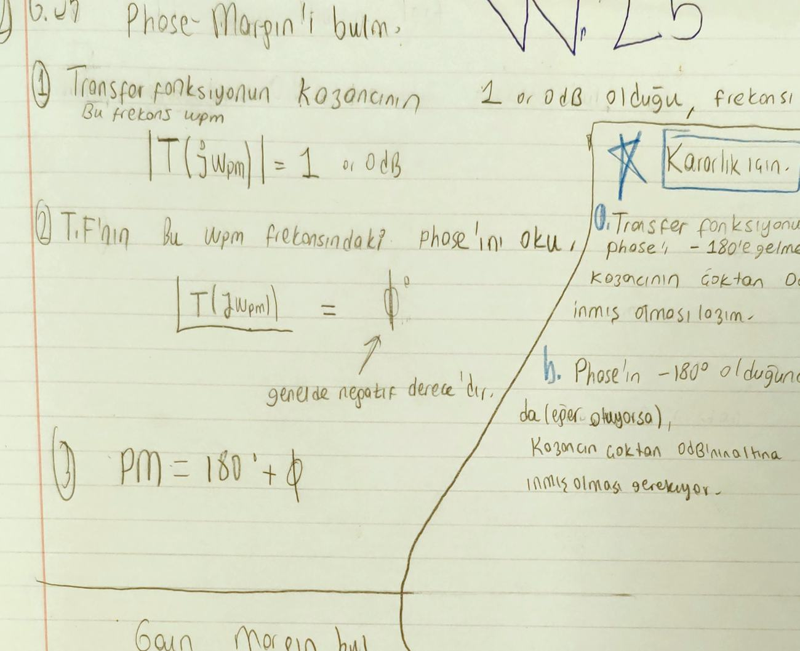

Burada, faz marji ve kazanc marji tanimlarini genel kontrol diliyle tekrar ozetliyorum. Bu sayfa proje sonucu degil; sonraki Bode okumalarinda hangi noktaya bakacagimi sabitleyen kisa tanim sayfasi:

- birim kazanc frekansindaki faz acisindan `PM`
- faz `-180 deg` oldugundaki buyuklukten `GM`

Burada yeni sayisal sonuc vermiyorum. Sadece `PM` ve `GM` okumasinin isaret mantigini sabitliyorum; asil sayisal kapatma, secilen Type-III komponentleriyle kurulacak acik-cevrim Bode sonucunda olacak.


#### 6.6.2 Neden bu kadar onemli?


Faz marji ve kazanc marji yalnizca akademik bir bode ciktisi degil, bu tasarimin davranisini dogrudan etkileyen karar olcutleridir:

- faz marji dusuk kalirsa load transient sonrasi ringing ve asiri tasma artabilir

- faz marji gereksiz fazla secilirse sistem gereksiz yavaslayabilir

- giris filtresi, parasitikler ve gercek ESR/DCR degerleri bu marjlari kagittaki ilk tahminden uzaklastirabilir


Bu nedenle nihai tasarimda hedef, yalnizca teorik olarak stabil bir dongu degil; transient, EMI ve uygulama toleranslari altinda da guvenli kalan bir dongu olmaktir.


#### 6.6.3 Kararlilik kriterinin bu projedeki anlami


ODT'den aktarilan not (`Kararlilik Kriteri`):

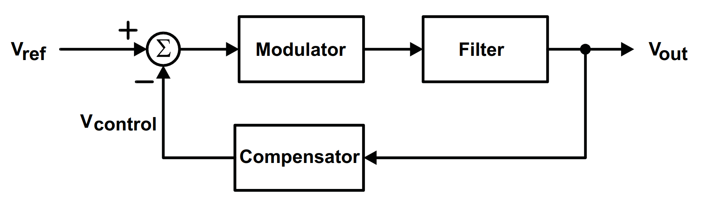

Buck DC/DC Regulator Control Block Diagram

Bu eski ODT parcasinda asil saklamak istedigim sey, load-step sirasinda `Vout` cevabini yalnizca zaman alaninda degil kapali-cevrim transfer fonksiyonu uzerinden de okumak. Metindeki ana cumle su sekilde okunuyor:

> Ani bir yuk akimi degisimi sirasinda `Vout` cevabi, Sekil 9'daki block diagraminin kapali-cevrim transfer fonksiyonu ile incelenir.

GitHub uyumlu matematik bicimiyle:

$$
H_{\text{system}}(s) = \frac{V_{out}}{V_{ref}} = \frac{\text{Ileri Yol}}{1 + \text{Acik Cevrim}}
$$
$$
H_{\text{system}}(s) = \frac{H_{\text{mod}}(s)\,H_{\text{filter}}(s)} {1 + H_{\text{mod}}(s)\,H_{\text{filter}}(s)\,H_{\text{compensator}}(s)}
$$
$$
H_{\text{open-loop}}(s) = H_{\text{mod}}(s)\,H_{\text{filter}}(s)\,H_{\text{compensator}}(s)
$$
Dolayisiyla kapali cevrim ifade su sekilde de yazilabilir:

$$
H_{\text{system}}(s) = \frac{H_{\text{mod}}(s)\,H_{\text{filter}}(s)} {1 + H_{\text{open-loop}}(s)}
$$
Bu denklemleri eski ODT blok diyagraminin diliyle koruyorum; final hesapta ise ayni yerde loop kirilmasi, ayni `H_FB` tanimi ve ayni kompanzator isaret/kazanc konvansiyonu kullanilmali. `Vout/Vref`, `Vout/Vcontrol` ve load-disturbance cevabini birbirine karistirirsam faz marji sayisi dogru gorunse bile aslinda baska bir transfer fonksiyonunu okumus olurum.

Bende kalan not:

Bu bolumde korudugum ana fikir, kararliligin yalnizca "cikis bir sekilde regule oldu" seviyesinde kalmamasi. Acik-cevrim carpimi ve kapali-cevrim ifade birlikte kurulunca neye bakacagim daha net oluyor:

- uygun crossover bolgesinde `0 dB` gecisi
- pozitif faz marji
- pozitif kazanc marji
- transient davranisi ile uyumlu kapali cevrim cevap

birlikte yorumlanmalidir. Giris filtresi, parazitikler ve coklu kutup/sifir yapilari varsa stabilite yorumu sadece kabaca `f_{sw}/10` kuralina birakilmamalidir.


## 7. EMI, Giris Filtresi ve Yerlesim

Burada kontrol hesabindan fiziksel devre tarafina geciyorum. Artik soru yalnizca "regule ediyor mu?" degil; giris akimi nasil akar, sicak dongu nerede kapanir, EMI filtresi donguyu bozar mi, layout hangi parasitigi buyutur gibi daha pratik sorular var. Bu bolumdeki notlar nihai PCB kaniti degil; hot-loop, giris filtresi ve yerlesim icin kontrol listesi gibi okunmali.

Okuma sirasi su: once hizli akim yollarini ve hot-loop'u kucultuyorum; sonra differential-mode ve common-mode EMI kaynaklarini ayiriyorum; ardindan giris filtresinin converter ile kavga edip etmedigine, yani Middlebrook / damping tarafina bakiyorum. En sonda bunlari PCB yerlesim kontrol listesine ceviriyorum. Bu siralama onemli, cunku EMI filtresi kagit uzerinde bastirma saglasa bile hot-loop veya kontrol marji bozulursa tasarim kapanmis sayilmaz.


### 7.1 Hot-loop ve kritik akim yollari

Bu alt bolumde hot-loop'u EMI'nin baslangic noktasi gibi okuyorum. Buradaki gorseller final layout degil; hangi akim yolunun kucuk tutulmasi gerektigini kaybetmemek icin duran yerlesim izleri.


Senkron buck yapisinda en kritik yuksek `di/dt` dongusu, giris kapasitörleri ile yarim kopru arasindaki sicak dongudur. Pratik olarak bu dongu su elemanlar uzerinden kapanir:

- giris MLCC / bulk kapasitörleri

- high-side MOSFET

- low-side MOSFET

- tekrar giris kapasitörlerinin donus yolu


Bu alan buyudukce parasitik enduktans artar, anahtarlama anindaki gerilim sivrilmeleri ve yayilan EMI agirlasir. Bu nedenle:

- giris seramik kapasitörleri yarim kopruye fiziksel olarak cok yakin konulmalidir

- high-side drain ile low-side source arasindaki akim yolu kisa ve kompakt tutulmalidir

- switch-node bakir alani gereksiz buyutulmamali, sadece zorunlu akim tasima ve termal ihtiyac kadar birakilmalidir


Bu dort gorseli birlikte tutuyorum, cunku ayni seyi farkli acilardan hatirlatiyorlar: `#1` yuksek frekansli guc dongusu kucuk kalmali, high-side / low-side gate-drive donusleri de en az onun kadar dikkatli kapanmali. `p51` ozellikle yararli; bootstrap surucu tarafi ile yarim kopru / `C_{IN}` dongusunu ayni cizimde birlestiriyor.

Buradan cikan pratik kontrol su: `C_{IN}` MLCC bankinin pozitif ucu high-side drain tarafina, negatif ucu low-side source / guc `PGND` donusune en kisa ve en dusuk enduktansli yoldan baglanmali. Gate-drive akimlari da kendi donus yolunu bulmali; analog `GND`, `FB`, `COMP` gibi sakin hatlar bu sicak dongunun ustunden gecmemeli. Switch-node bakiri ise "ne kadar buyuk o kadar iyi" degil; akim ve termal ihtiyac kadar, kontrollu buyuklukte tutulacak bir alan gibi okunmali.


Ikinci onemli akim yolu, bobin ve cikis kapasitörleri etrafindaki cikis akis yoludur. Bu yol hot-loop kadar sert `dv/dt` uretmese de ripple, transient ve olcum kalitesi uzerinde belirgindir.


### 7.2 Differential-mode EMI


Differential-mode EMI'nin ana kaynagi, buck donusturucunun kaynaktan cektigi darbeli giris akimidir. Bu tasarimda ilgili spesifikasyon dogrudan zorlayicidir:

- `CISPR 25 Class 5` hedefi var

- `pi-stage` giris EMI filtresi ve elektrolitik parallel damping hedefi zaten specification notlarina girmis durumda


Bu nedenle differential-mode EMI yalnizca "sonradan filtre eklenir" mantigiyla ele alinmamalidir. Asagidaki basliklar guc kati tasariminin bir parcasi kabul edilmelidir:


- giris akiminin darbeli yapisi, zaman alaninda da acikca gorulmelidir

- giris kapasitörlerinin ESL/ESR ve dc-bias altindaki gercek davranisi

- filtre once/sonra kapasitör dagilimi

- EMI bobini ve kapasitörlerle olusan rezonanslar

- damping ihtiyaci

- layout kaynakli ek parasitikler


Buradaki notlu ekran goruntusu, differential-mode EMI'nin soyut degil; dogrudan giristen cekilen darbeli akim dalga sekliyle iliskili oldugunu gosteren iyi bir destek gorselidir. Uzerine dusulen notlarda `I_{L,peak} \approx 11 A` ve `T_{sw} \approx 3 us` yazilmis; bu da `1/T_{sw} \approx 333.3 kHz` sonucu ile proje `f_{sw}` cizgisi arasindaki iliskiyi zaman alaninda da gorunur hale getirir.

[Çapraz Teyit] `WEBENCH` EMI snapshot'i bu owner altinda yalnizca hizli bir filtre/EMI kontrolu olarak okunacak:


Bu ekranda filtre sonrasi giris gurultusu `61.79 dBuV`, ayni raporda verilen `67.75 dBuV` sinirinin altinda gorunuyor. Bu olumlu bir checkpoint; ancak `W.103-W.137`deki attenuation hesabiyla birebir ayni sey degil. Final EMI yorumu, hangi LISN/olcum dugumu, hangi filtre oncesi/sonrasi oran ve hangi referans birim kullanildigi yazilarak `8.5`te tekrar kapatilacak.


Bu bolumde sayisal olarak baglamayi planladigim ana maddeler:

- filtre topolojisi

- diferansiyel-mod zayiflatma hedefi

- filtre kesim / rezonans frekanslari

- damping elemanlarinin gerekcesi

Bu alt bolumde iki farkli seviye var. `W.103` ilk harmonik uzerinden kaba gereken attenuation hesabini veriyor. `W.137` ise ayni hesaba "hangi `C_{in}` etkili sayilmali?" sorusunu ekliyor. Bu yuzden asagidaki `46.8 dB` ve `43.14 dB` notlarini tek bir final EMI sonucu gibi degil, filtre hedefini buyukluk mertebesinde kuran iki tasarim izi gibi okuyorum.

Defterden aktarilan not (`W.103`):

Burada diferansiyel-mod EMI filtresinin ne kadar `attenuation` saglamasi gerektigi ilk harmonik yaklasimi ile kestirilmeye calisiliyor. Baslikta dogrudan su soru yazili:

- `EMI suzgecinin ne kadar attenuation saglamasi gerektigi`

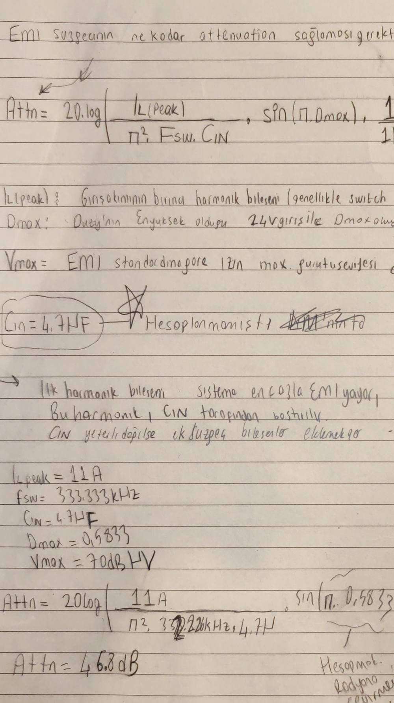

Sayfadaki ifade, giris akiminin ilk harmonik bileseninden hareketle olusan gerilim seviyesini `dBµV` cinsinden okuyup, izin verilen ust sinir ile karsilastiriyor. Formul satiri tam temiz degil; ama sayfada korunacak ana iliski su mantikta:

$$
Attn \approx 20\log_{10}\!\left( \frac{I_{L,\text{peak}}}{\pi^2 f_{sw} C_{in}} \sin(\pi D_{max}) \frac{1}{1\,\mu V} \right) - V_{max}
$$
Sayfanin altinda kullanilan sayisal girdiler su sekilde not edilmis:

- `I_{L,peak} = 11 A`
- `f_{sw} = 332.333 kHz`
- `C_{in} = 4.7 uF`
- `D_{max} = 0.5833`
- `V_{max} = 30 dBµV`

ve defterde yazilan sonuc:

$$
Attn \approx 46.80\,dB
$$
Sayfadaki yan notlarin ana fikri su:

- ilk harmonik bilesen, giris kapasitörü ve duty oranindan etkilenir
- bu harmonik yeterince kucultulmezse EMI limitini asabilir
- dolayisiyla filtre, yalnizca "var olsun" diye degil; belirli bir `dB` bastirma hedefiyle boyutlandirilmalidir

Burada, `7.2 Differential-mode EMI` bolumunde eksik duran "nicel attenuation hedefi" fikrini ilk kez sayisal olarak yaziyorum. Formuldaki bazi semboller hafif silik; o yuzden orayi temkinli okumak gerekiyor. Benim icin asil iz, filtre hedefinin artik "biraz bastirsin" seviyesinden cikmasi ve kabaca `46.8 dB` mertebesinde bir zayiflatma ihtiyacinin not edilmesi.

Defterden aktarilan not (`W.137`):

Burada `W.103`teki diferansiyel-mod EMI attenuation hesabinin daha dikkatli bir tekrar denemesi var. Bu kez hesapta hangi `C_{in}` degerinin kullanildigina ozellikle dikkat cekiliyor ve "bulk capacitor ihmal edilirse attenuation hesabinin kayabilecegi" fikri not ediliyor.


Sayfanin ustunde yine ayni mantikla su tip bir ifade yazilmis:

$$
Attn \approx 20\log_{10}\!\left( \frac{I_{L,\text{peak}}}{\pi^2 f_{sw} C_{in,\text{etkin}}} \sin(\pi D_{max}) \frac{1}{1\,\mu V} \right) - V_{max}
$$
Bu kez sayfadaki ara notlardan korunacak ana girdiler sunlar:

- `I_{L,peak} \approx 10.9 A \approx 11 A`
- `f_{sw} \approx 332 kHz`
- `D_{max} \approx 0.6481`
- `V_{max} \approx 63\,dB\mu V`
- en kritik not:
  - `C_{in,\text{etkin}}` olarak `8.22 uF` alinmis
  - yanina da "dikkat dikkat bulk cap haric tutulursa" notu dusulmus

Sayfanin ortasindaki uyari bu bolum icin ozellikle degerlidir:

- EMI attenuation hesabi yapilirken hangi giris kapasitör grubunun gercekten etkili oldugu secilmeli
- bulk kapasitör, dusuk frekansta ve transientte cok etkili olsa da EMI hesabinda ayni agirlikta davranmayabilir
- bu nedenle filtre attenuation hesabinda "hangi `C_{in}`?" sorusu ayrica kontrol edilmelidir

Sayfadaki sayisal sonuc, okunabildigi kadariyla, su yone cikiyor:

$$
Attn \gtrsim 43.14\,\text{dB}
$$
ve en altta da kisa bir ters yon sezgiyi not ediyorum:

- `C_{in}` azalirsa
- gereken `Attn` artar

Burada, `W.103`e gore daha rafine bir adim var; cunku attenuation hesabinda kullandigim `C_{in}` degerinin ne oldugu ve bulk capacitorun bu hesaba nasil dahil / haric tutulacagi sorununu acikca gundeme getiriyorum. `46.8 dB` ile `43.14 dB` arasindaki fark da buyuk olasilikla sectigim `C_{in}` taniminin farkli olmasindan geliyor. Son okuma su: EMI filtresi icin hedef mertebe `40 dB` ustu gibi duruyor, ama final attenuation hedefi etkili MLCC banki, bulk'un frekanstaki davranisi, LISN/standart olcum kosulu ve LTspice/olcum sonucu ile tekrar kapatilacak.

Final tabloya tasirken bu iki defter hesabini ayni satirda ancak kosullariyla gostermek gerekiyor: hangi harmonik / frekans noktasi, hangi `C_{in,etkin}`, hangi limit cizgisi, hangi LISN portu ve filtre oncesi/sonrasi hangi dugum kullanildi? `dB` cinsinden attenuation hedefi ile `dBuV` cinsinden olcum seviyesi ayni sey degil. Bu ayrim yazilmazsa `43-47 dB` hedefi sanki dogrudan standart gecildi anlamina gelir; burada henuz sadece filtre gereksiniminin buyukluk mertebesi kuruluyor.


### 7.3 Common-mode EMI

Bu kisim henuz sayisal EMI hesabi degil. Daha cok `switch-node` ve yarim kopru etrafindaki hizli `dv/dt` alanlarini layout asamasinda unutmayayim diye duran kontrol notu. Differential-mode tarafinda giris akimi darbeleri baskinken, common-mode tarafinda kapasitif kacis yollari ve olcum/kablo ortami daha baskin hale geliyor.


Common-mode EMI, yalnizca giris akim dalgalanmasindan degil, hizli `dv/dt` ureten switch-node'un parasitik kapasiteler uzerinden cevreye enerji baglamasindan da kaynaklanir. Bu nedenle ortak-mod acisindan en hassas bolgeler:

- switch-node bakiri

- yarim kopruye yakin sicak alanlar

- kabloya, saseye veya olcum duzenine kapasitif bag yapabilecek yuzeyler


Bu tasarimda common-mode davranisini iyilestirmek icin ilk yerlesim kararlarini su sekilde okuyorum:

- switch-node bakirini gereksiz buyutmeme

- feedback, COMP ve benzeri kucuk isaret hatlarini switch-node altindan veya yakinindan gecirmeme

- kirli guc alani ile sakin analog alani fiziksel olarak ayirma

- gerekiyorsa shield / ekranlama seceneklerini en sonda degerlendirme

Bu bolumdeki kararlar differential-mode attenuation tablosuyla ayni sey degil. Burada asil kontrol, switch-node'un hangi alana baktigi, `dv/dt` hizinin `R_{boot}` / gate direnci / snubber kararlariyla nasil ayarlandigi, kablo veya saseye kapasitif yol kalip kalmadigi ve `FB-COMP-SS` gibi kucuk isaret hatlarinin bu alanlardan fiziksel olarak uzak tutulup tutulmadigi. Yani common-mode tarafinda ilk kabul sayisi degil, PCB uzerinde isaretlenecek risk bolgeleri var.


Common-mode EMI bu asamada henuz hesaplanmis degildir; ama layout kararlarini bastan yonlendiren bir sinir olarak yazilmali. Sonraki kontrolde switch-node alaninin buyuklugu, MOSFET `dv/dt` notlari (`5.6.2` civarindaki Miller / parasitik kapasitans izleri), kablo/LISN baglami ve gerekirse ekranlama birlikte tekrar okunacak.


### 7.4 Giris filtresi kararliligi


Giris EMI filtresi eklendiginde mesele yalnizca bastirma elde etmek degil, donusturucunun bu filtre ile birlikte kararliligini korumaktir. Bu bolumde defter izleri uc hatta ayriliyor: once filtre rezonansi (`W.100`), sonra damping fikri (`W.101`), sonra da ilk `L_{IN}-C_F` adaylari ve alternatif rezonans kontrolleri (`W.102`, `W.138` ve devam sayfalari).


Bu bolumde asil fikir su:

- EMI filtresinin cikis empedansi ile donusturucunun giris tarafi dinamik davranisi tehlikeli bir etkilesime girmemelidir
- filtre rezonansi kontrol dongusu ve guc kati ile problemli bir cift kutup / negatif empedans etkisi olusturmamalidir
- gerekli ise elektrolitik parallel damping veya ayri damping agi kullanilmalidir


Bu kisimda ilk esitlikler ve aday sayilar var; ama final Middlebrook kapanisi henuz yok. `22.46 kHz` ve `19.21 kHz` gibi rezonans notlari, `35 kHz` crossover hedefinin altinda ama ona yeterince yakin oldugu icin dikkat istiyor. Burada sonraki teknik baglama icin su adimlari acik biraktim:

Bu yakinlik tek basina "filtre olmadi" demek degil. Benim icin uyari su: filtre cikis empedansinin tepe yaptigi bolge ile converter'in negatif giris empedansi / kontrol loop'u ayni frekans civarinda ust uste gelirse marj bozulabilir. O yuzden finalde `Z_{filter,out}` ve `Z_{in}` ayni port tanimiyla, dampingli/dampingsiz ve ozellikle `Vin_min / Pout_max` kosulunda karsilastirilmali; ardindan averaged AC sweep ve switching transient ile ayni davranis gorulmeli.

1. secilen `L_f` ve `C_in,filter` ile rezonans frekansi hesaplanacak

2. damping yaklasimi secilecek

3. LTspice veya PSpice ile filtreli ve filtresiz giris davranisi karsilastirilacak

4. Middlebrook uyumu rapora acik bir kontrol maddesi olarak yazilacak

Defterden aktarilan not (`W.100`):

Burada dogrudan giris EMI filtresi ile donusturucunun etkilesimine odaklaniliyor. Baslikta acikca su soru yazilmis:

- `Filterin EMI resonance frekansini nasil belirleriz?`


Sayfada filtre rezonans frekansi icin temel iliski not edilmis:

$$
f_{res} = \frac{1}{2\pi\sqrt{L_{IN}\,C_F}}
$$
Sayfadaki sayisal yerlestirmede su tip bir ornek yazili:

$$
f_{res} \approx \frac{1}{2\pi\sqrt{10.68\,\mu H \times 4.7\,\mu F}} \approx 22.46\,kHz
$$
Sayfanin orta kisminin ana fikri su:

- `L_{IN}` ve `C_F` tarafindan olusan filtre devresi bu frekansta kendi rezonansina sahip olur
- bu rezonans, buck'in `control-to-output` davranisini dolayli olarak etkileyebilir
- dolayisiyla open-loop / closed-loop cevap bozulabilir ya da kontrol marjlari zayiflayabilir

Sayfanin altinda Middlebrook uyumuna giden not bulunuyor:

$$
\left|Z_{filter,out}(j\omega)\right| < \left|Z_{in}(j\omega)\right|
$$
yanina da su aciklama dusulmus:

- giris kaynagi / filtre tarafinin gordugu cikis empedansi, donusturucunun giris empedansindan kucuk olmalidir

Sayfadaki son mesaj su yone cikiyor:

- aksi halde giris tarafinda rezonans olusabilir
- bu rezonans uncompensated / open-loop davranisi bozabilir
- phase margin azalabilir
- sistem osilasyona gidebilir

Buradaki not, `7.4 Giris filtresi kararliligi` basliginin defterdeki en net omurgalarindan biri. Filtre rezonans frekansinin yalnizca EMI bastirma acisindan degil, kararlilik acisindan da kontrol edilmesi gerektigini acikca gosteriyor. `f_{res} \approx 22.46 kHz` notu final filtre secimi degil; ama secilecek EMI filter tarafinda `f_c`, plant davranisi ve Middlebrook kontroluyle etkilesim riski oldugunu gosteren yararli bir ilk iz.

Defterden aktarilan not (`W.101`):

Burada `W.100`deki rezonans probleminden sonra damping koluna geciyorum. Bu sayfa final `R_D-C_D` secimi degil; "rezonansi nasil yumusatirim?" sorusunun kaynak/defter cevabi. Baslikta acikca su ifade var:

- `EMI line resonance-type impedance bastirmak icin kullanilan ... damping`


Sayfanin orta kismina kutu icinde su tasarim kurali yazilmis:

$$
C_D \gg 4\,C_{IN}
$$
Sayfadaki metne gore bu `C_D` elemani:

- rezonans frekansinda dusuk empedansli davranmali
- boylece damping kolu rezonans civarinda etkili olabilmeli
- `R_D` ile birlikte rezonansin genligini bastirmaya yardim etmeli

Alt satirlarda `C_D` secimi icin su sezgiler not edilmis:

- `C_D`'nin buyuk olmasi iyi; cunku
  - `DC` bileseni bloke etmeli
  - yani `R_D` uzerinden surekli isi kaybi olusturmamali
  - ama rezonans frekansinda da devreye girebilmeli
- bu nedenle `C_D`, `C_{IN}`'den "cok daha buyuk" secilmek istenmis

Buradaki not, filtre rezonansina karsi klasik seri `R_D - C_D` damping kolunu deftere aldigimi gosteriyor. Burada yazilan `C_D \gg 4C_{IN}` kurali, tam nihai esitlik gibi degil; daha cok kaynak anlatimdan alinmis bir tasarim yonlendirmesi. Ama teknik niyet net: `C_D`, `DC`'de acik devreye yakin kalirken rezonans civarinda damping etkisi uretebilmeli. Sonraki adimda bu kuralin secilen `C_F`, bulk / MLCC banki ve `f_{res}` civarindaki empedansla birlikte kontrol edilmesi gerekiyor.

Defterden aktarilan not (`W.102`):

Burada `W.100-W.101` zinciri bir adim ileri gidip EMI filtresi icin ilk `L_{IN}` ve `C_F` boyutlandirma notlari yaziliyor.


Sayfanin ustunde su iliski not edilmis:

$$
C_F = \frac{1}{L_{IN}} \left(\frac{10}{2\pi f_{sw}}\right)^2
$$
Bu iliski, EMI suppress tasariminda giris akiminin ozellikle ilk harmonik bileseni etrafinda dusunuldugunu ima eden bir notla birlikte yazilmis.

Sayfanin orta kismina dusulen notlardan korunacak ana fikirler:

- buck donusturucude MOSFET anahtarlanirken kaynaktan darbeli / pulsating giris akimi cekilir
- bu nedenle giris EMI filtresi, yalnizca `DC` akimi degil bu darbeli icerigi de dusunerek secilmelidir
- `L_{IN}` secimi icin yaklasik `1 uH - 10 uH` bandi not edilmis
- yuksek akim uygulamalarinda daha dusuk `L_{IN}` secmenin yararli olabilecegi dusunulmus

Sayfanin altindaki sayisal yerlestirmede su secim yaziyor:

- `L_{IN} = 4.7 uH`
- `f_{sw} = 332 kHz`

ve buna bagli olarak:

$$
C_F \approx \frac{1}{4.7\,\mu H} \left(\frac{10}{2\pi\cdot 332\,kHz}\right)^2 \approx 10.68\,\mu F
$$
Burada `W.100`de not edilen `f_{res}` iliskisiyle birlikte dusunulmus ilk EMI filtre boyutlandirma adimi var. `L_{IN} = 4.7 uH` ve `C_F \approx 10.68 uF` cifti, `W.100`deki rezonans ornegine de zemin hazirliyor. Bunu final BOM diye degil, `W.100-W.101` hattindaki ilk filtre adayi olarak tutuyorum. Sayfanin bazi cumleleri silik olsa da ana fikir net: giris EMI filtresi, buck'in darbeli giris akimi ve ilk harmonik icerigi dusunulerek secilmeli; secim de damping ve Middlebrook kontroluyle kapanmali.

Burada kucuk bir etiket dikkatini de acik tutuyorum: `W.100` rezonans satirinda `10.68 uH x 4.7 uF` gibi okunuyor, `W.102` ise `L_{IN}=4.7 uH`, `C_F \approx 10.68 uF` diyor. Carpim ayni kaldigi icin `f_{res}` sayisi benzer cikar; ama final tasarimda bu iki eleman yer degistirmis gibi davranamaz. Bobinin doyma akimi / DCR'i, kapasitörun ESR/ESL'i ve damping kolu baska seylerdir. Final filtre tablosunda `L_{IN}` ve `C_F` etiketleri tek satirda netlestirilecek.

Defterden aktarilan not (`W.138`):

Burada `W.100` ve `W.102`de kurulan EMI filtre rezonansi dusuncesi baska bir `L_{IN} - C_F` adayi uzerinden yeniden kontrol ediliyor.


Sayfanin ustunde yine filtre rezonans frekansi iliskisi yazilmis:

$$
f_{EMI} = \frac{1}{2\pi\sqrt{L_{IN}\,C_F}}
$$
Sayfadaki sayisal yerlestirme, okunabildigi kadariyla, onceki adaydan farkli bir filtre kombinasyonuna isaret ediyor:

- `L_{IN} \approx 2.2\,\mu H`
- `C_F` onlarca `\mu F` mertebesinde bir deger

ve defterde yazilan sonuc:

$$
f_{EMI} \approx 19.21\,kHz
$$
Sayfanin yan notlarinda korunacak ana fikirler sunlar:

- `f_{EMI}` bu adayda `f_c` ile kiyaslaniyor
- ayni zamanda `f_{EMI} << f_s` olmasi gerektigi not ediliyor
- yani filtre rezonansinin kontrol dongusu ve switching frekansiyla iliskisi birlikte dusunuluyor

Sayfanin altinda ayrica kisa bir kural notu var:

- `f_{EMI}` icin `0.7 f_s` benzeri bir taslak / hizli kontrol notu dusulmus

Bu satir tam baglamiyla net okunmadigi icin, onu nihai tasarim kurali diye degil hizli bir kontrol notu olarak ele almak daha dogru. Bu sayfada benim icin daha saglam kalan iz, `f_{EMI}` degerinin hem `f_c` hem de `f_s` ile karsilastirilmis olmasi.

Burada, `W.100`deki `22.46 kHz` ornegine alternatif bir filtre adayi daha denedigim goruluyor. En degerli tarafi, filtre rezonans frekansini yalnizca tek kez hesaplamamis olmam; sectigim `L_{IN}` ve `C_F` ciftine gore tekrar tekrar kontrol etmisim. `f_{EMI} \approx 19.21 kHz` notu da filtre rezonansinin `f_c` civarina yaklasabilecegini ve bu nedenle Middlebrook / damping tarafinin dikkatle ele alinmasi gerektigini destekliyor.

Defterden aktarilan not (`W.139`):

Burada `W.138`deki ayni EMI filtre adayi icin bu kez karakteristik empedans benzeri `R_0` buyuklugu hesaplanmis tek satirlik bir kontrol notu var. Buradaki `C_{IN}` sembolunu, onceki ana giris kapasitör banki ile birebir ayni anlamda degil, bu EMI filtre adayinin shunt / etkili kapasitesi gibi okumak daha guvenli.


Sayfada yazilan temel iliski su:

$$
R_0 = \sqrt{\frac{L_{IN}}{C_{IN}}}
$$
Sayfadaki sayisal yerlestirme, okunabildigi kadariyla, su aday filtre ciftine isaret ediyor:

- `L_{IN} = 2.2\,\mu H`
- `C_{IN} = 25\,\mu F`

ve buradan su sonucu not etmisim:

$$
R_0 \approx \sqrt{\frac{2.2\,\mu H}{25\,\mu F}} \approx 0.296\,\Omega
$$
Burada yeni topoloji veya yeni filtre adayi yok; `W.138`deki aday icin bir ek parametre cikariliyor. `R_0` benzeri bu buyukluk, damping kolu secimi ve filtre empedansinin buyukluk mertebesini sezmek icin yararli. Tek satir olsa da, filtreyi yalnizca `f_{res}` ile degil karakteristik empedans olcegi ile de dusundugumu gosteriyor. Final `R_D` secimi buradan dogrudan cikmiyor; ama damping kolunun hangi mertebede aranacagini hissettiren iyi bir ara kontrol.

Bu `0.296 ohm` degerini `R_D` icin dogrudan secim gibi yazmiyorum. Damping direnci secilirken `C_D`'nin rezonans civarindaki empedansi, `R_D` uzerindeki kayip/isinma, filtre tepesinin ne kadar bastigi ve Middlebrook kosulunda `Z_{filter,out}` egrisinin neye donustugu birlikte gorulmeli. Yani `R_0`, final BOM satiri degil; `R_D-C_D` aramasina baslarken kullandigim buyukluk mertebesi pusulasi.

Defterden aktarilan not (`W.104`):

Burada `W.101`de anlatilan damping kolu EMI filtresi semasina acikca yerlestiriliyor ve filtre tarafinin toplam empedansi yaziliyor.


Sayfadaki cizimde:

- seri kolda `L_{IN}` bulunuyor
- bir yanda ana filtre kapasitörü `C_F`
- diger yanda ise seri `C_D - R_D` damping kolu var

Yani giris filtresi artik yalnizca ideal `L_{IN} - C_F` cifti olarak degil, damping agi ile birlikte dusunulmeye baslaniyor.

Sayfanin altinda filtre empedansi su sekilde yazilmis:

$$
Z_{Filter} = \left( R_D + \frac{1}{j\omega C_D} \right) \parallel \left( j\omega L_{IN} + \frac{1}{j\omega C_F} \right)
$$
Bu ifadenin anlattigi ana fikir su:

- rezonans civarinda `C_D - R_D` kolu devreye girerek sönum saglayabilir
- `C_F` ve `L_{IN}` tarafinin tek basina uretecegi keskin rezonans, bu ek kolla daha yumusak hale getirilebilir
- dolayisiyla Middlebrook uyumu ve filtre kararliligi yalnizca `L` ve `C` ile degil, damping kolunun empedansi ile birlikte degerlendirilmelidir

Burada, `W.101`deki tasarim kurali seviyesindeki damping notunu artik dogrudan devre ve empedans ifadesi seviyesine tasiyorum. Yazdigim `Z_{Filter}` ifadesi, daha sonra `|Z_{filter,out}| < |Z_{in}|` kontrolunde hangi agin karsilastirildigini netlestirdigi icin cok degerli. Port tanimi ve efektif kapasitans degeri yine LTspice / Middlebrook kontrolunde netlesecek; bu sayfa simdilik "hangi elemanlar birlikte kontrol edilecek?" sorusunu kapatiyor.

Burada bir port notu da lazim: bu `Z_{Filter}` ifadesi devre aginin icindeki empedans iskeletini gosteriyor, ama Middlebrook karsilastirmasinda kullanilacak buyukluk converter girisine dogru bakilan `Z_{filter,out}` olmali. Kaynak/LISN tarafi, seri `L_{IN}` konumu, `C_F` noktasi ve damping kolunun hangi dugume baglandigi bu portu degistirebilir. Final AC sweep'te enjeksiyon noktasi ve olcum dugumu acik yazilmazsa `Z_{Filter}` ile `Z_{filter,out}` ayni sey sanilabilir.

Defterden aktarilan not (`W.105`):

Burada giris filtresi kararliligi konusunun neden dikkat gerektirdigi kavramsal olarak aciklaniyor. `f_{res}` hesabindan sonra asil mesele empedans karsilastirmasina geliyor: donusturucunun giris tarafi bazi kosullarda `negative input impedance` gibi davranabilir.


Sayfanin ust kisiminda su temel iliski yazili:

$$
Z_{IN} = \frac{V_{IN}}{I_{IN}}
$$
Hemen altindaki notlardan korunacak ana fikirler:

- sabit guce yakin calisan bir donusturucude giris akimi ile gerilim arasindaki kucuk isaret iliskisi, siradan pasif bir yukten farkli olabilir
- bu nedenle giris tarafi bazi frekans araliklarinda negatif artimsal empedans gibi davranabilir
- filtre ile bu dinamik davranis kotu etkilesirse rezonans buyuyebilir

Sayfanin orta bolgesinde su kavram acikca vurgulanmis:

- `Negative input impedance`

Buradaki "negative" ifadesini DC ohmmetre direnci gibi okumamak gerekiyor. Benim icin burada anlatilan sey, sabit guce yakin calisan converter'in kucuk-isaret / dinamik giris davranisi.

Bu durumun filtre ile etkisi su mantikta anlatilmis:

- LC filtresinin giris / cikis empedansi ile converter'in `Z_{in}` davranisi tehlikeli bicimde ust uste gelirse
- salinim veya osilasyon riski artabilir

Sayfada alti cizili kiyas notu da onemli:

```text
Z0 > Zin ise
LC filtresinin giris empedansi, converter'in negatif empedansi ile etkilesir
```

Burada, `W.100`de not ettigim `|Z_{filter,out}| < |Z_{in}|` iliskisinin arkasindaki fiziksel nedeni acikliyorum. Ana fikir su: EMI filtresi yalnizca pasif bir bastirma agi degil; converter'in giris tarafindaki dinamik davranisla da etkilesime giriyor. `Z0 > Zin` notunu da isaret olarak degil, buyukluk ve frekans baglaminda okunacak bir uyari gibi tutuyorum.

Defterden aktarilan not (`W.106`):

Burada `W.105`te kavramsal olarak anlatilan negatif / dinamik giris empedansi dusuncesi bu kez worst-case bir buyukluk ifadesiyle yaziliyor.


Sayfanin ustunde denklem `(17)` olarak su ifade not edilmis:

$$
\left| Z_{IN} \right|_{min} = \left|\, -\frac{V_{IN(min)}^2}{P_{IN}} \right|
$$
Sayfanin altindaki aciklamalarda:

- `Z_{IN}` : giris empedansi
- `V_{IN(min)}` : converter'in minimum giris gerilimi
- `P_{IN}` : giris gucu

olarak tanimlanmis.

Sayfanin notuna gore bu denklem:

- en kotu durum / `worst-case` giris empedansini tahmin etmek icin kullaniliyor
- giris filtresi tasariminda kritik bir parametre olarak dusunuluyor

En alttaki yorumdan korunacak ana fikir su:

- denklemde daha dusuk empedans, daha buyuk enerji emme egilimi anlamina gelir
- bu da giris filtresi ile etkilesimde daha kritik / daha zorlayici bir durum olabilir

Burada, `W.105`te anlattigim negatif giris empedansi fikrini ilk kez dogrudan hesaplanabilir bir buyukluge indiriyorum. `V_{IN(min)}` ile yazilmis olmasi da Middlebrook turu karsilastirmada neden genellikle minimum giris gerilimi / worst-case kosulun kullanildigini acikliyor. Bu yine tam frekans egrisi degil; final kontrol icin once elde tutulacak worst-case referans buyukluk.

Bu satiri sabit bir direnç modeli gibi kullanmamam gerekiyor. `|Z_{IN}| = V_{IN}^2/P_{IN}` constant-power yaklasimindan gelen buyukluk mertebesi; gercek `Z_{in}(j\omega)` kontrol dongusu, duty feedforward, giris kapasitörleri, ESR/ESL ve calisma noktasi ile frekansa gore degisecek. Final Middlebrook kapanisinda bu `4.15 ohm` cizgisi baslangic / worst-case referans olarak duracak, ama asil karar `Z_{in}(j\omega)` ve `Z_{filter,out}(j\omega)` egrilerinin ayni frekans ekseninde karsilastirilmasiyla verilecek.


Bu ekran goruntusu, `7.4` altinda anlatilan Middlebrook mantigini kendi not dilimle toparladigimi gosteriyor. Uzerinde acikca "daha dusuk empedans = daha buyuk enerji emme egilimi" notu var ve alt kisimda `|Z_{Filter}(f_{res})| < |Z_{IN(min)}|` karsilastirmasi kirmizi/mavi isaretlerle vurgulanmis. `W.105-W.106-W.136` zincirindeki negatif giris empedansi dusuncesini gorsel ve kavramsal olarak iyi destekliyor.

Defterden aktarilan not (`W.136`):

Burada `W.106`daki negatif / dinamik giris empedansi denklemi bu kez dogrudan proje sayilariyla uygulanmis.


Sayfanin ustunde denklem tekrar yazilmis:

$$
\left| Z_{IN} \right| = \left| -\frac{V_{IN(min)}^2}{P_{IN}} \right|
$$
Sayfadaki aciklamalarda bu ifadenin neden kullanildigi da not edilmis:

- bu denklem, en kotu durum / `worst-case` giris empedansini tahmin etmek icin kullaniliyor
- denklemde daha dusuk `|Z_{in}|`, daha buyuk enerji emme egilimi anlamina geliyor
- bu da EMI filtresiyle etkilesimin daha kritik hale gelmesine neden olabilir

Sayfada proje kosullarini su sekilde yerlestiriyorum:

- `V_{IN(min)} = 24\,\text{V}`
- `P_{out,max} = 125\,\text{W}`
- `\eta \approx 0.90`

Buradan once giris gucunu hesapliyor:

$$
P_{IN} = \frac{P_{out}}{\eta} = \frac{125\,\text{W}}{0.9} \approx 138.88\,\text{W}
$$
Ardindan da worst-case giris empedansi:

$$
\left| Z_{IN} \right| = \left| -\frac{24^2}{138.88} \right| \approx 4.15\,\Omega
$$
Sayfanin yan notunda bu sonuc acikca isaretlenmis:

- "Bu `Z_N = 4.15 \Omega` degerimiz"

Burada, `W.106`ya gore daha ileri bir adim var; cunku artik yalnizca denklem degil, ikinci projenin gercek `24 V / 125 W / %90` varsayimlariyla net sayisal sonuc da veriyorum. `|Z_{in}| \approx 4.15 \Omega` degeri daha sonra `Z_{filter,out}` ile karsilastirilacak ana referanslardan biri haline geliyor. Tek basina "filtre tamam" sonucu degil; ayni frekansta, ayni port tanimiyla ve damping dahil edilerek bakilacak karsilastirma cizgisi.


### 7.5 Yerlesim kurallari


Bu bolum, `7.1`deki hot-loop gorsellerini ve `7.2-7.4`teki EMI / giris filtresi notlarini PCB uzerinde kontrol listesine ceviriyor. Burada yeni hesap yok; asil konu kirli akim yollarini, sakin analog bolgeyi ve olcum noktalarini daha bastan ayirmak.

Guc yolu ve hizli donguler:

- giris MLCC'lerini high-side / low-side guc yoluna olabildigince yakin koy
- bootstrap yolu, gate-drive dongusu ve yarim kopru alanini kisa tut
- switch-node alanini minimumda tut; analog hatlari bu bolgeden uzaklastir

Kucuk sinyal ve referans hatlari:

- feedback gerilimini gurultulu switch-node'dan degil, sakin cikis dugumunden Kelvin benzeri mantikla al
- analog toprak ile guc topragi iliskisini kontrolcu datasheet'indeki mantiga gore kur; kirli geri donus akislarini analog referans uzerinden gecirme

EMI filtresi ve test:

- giris EMI filtresinin "kirli taraf" ve "temiz taraf" yerlestirmesini fiziksel olarak ayir
- olcum ve dogrulama icin kritik dugumlere test noktasi birak
- filtre oncesi, filtre sonrasi ve converter girisi dugumlerini karistirmayacak sekilde ayri isimlendir; Middlebrook icin `Z_{filter,out}` portu ve LISN/EMI olcumu icin kullanilan dugum ayni sey olmayabilir

Bu liste final PCB incelemesi degil. Gercek PCB / EVM goruntusu uzerinde her madde iz uzunlugu, donus yolu, katman gecisi, test noktasi ve filtre portlariyla tek tek isaretlenecek.


## 8. LTspice Dogrulama Plani


Burada simulasyonu hesaplarin yerine koymuyorum; daha cok daha once actigim hesap izlerini tek tek yoklayacak ikinci kontrol olarak kullaniyorum. Ozellikle acik kalan yerler belli: loop cevabi, load/line transient, giris filtresi rezonansi, damping ve 44 V survive kosulu.


### 8.1 Baslangic model seti


YENI klasorunde simdiden kullanilabilecek bazi aday dosyalar bulunuyor. Bunlari uc grupta okuyorum:

Averaged / closed-loop hizli kontrol:

- `LTspice_InputFilterDesign/SyncBuck_average_CL.asc`

- `LTspice_InputFilterDesign/SyncBuck_average_CL_IF.asc`

Switching LTspice modeli:

- `LTspice_InputFilterDesign/SyncBuck_switching_CL.asc`

- `LTspice_InputFilterDesign/SyncBuck_switching_CL_IF.asc`

- `LTspice_InputFilterDesign/SyncBuck_switching_OL_IF.asc`

Uretici makromodeline daha yakin PSpice tarafi:

- `LM5146-Q1_PSPICE_TRANS/LM5146-Q1_TRANS.DSN`


Bu dosyalari nihai tasarimin birebir modeli gibi gormuyorum. `*_IF` dosyalari giris filtresini karsilastirmak icin, `switching` dosyalari ripple / anahtarlama ayrintisini gormek icin, `average` dosyalari ise daha hizli loop ve filtre sezgisi icin kullanilacak. PSpice dosyasi da LTspice sonucunu uretici makromodeline yakin bir taraftan tekrar yoklamak icin duruyor.

Bu model setini karsilastirirken dosya adindaki farkin gercekten tek fark olmasina dikkat edecegim. `*_CL` ile `*_CL_IF` arasinda ayni yuk, ayni kompanzator, ayni `Vin/Vout` kosulu ve ayni olcum dugumleri korunmazsa giris filtresinin etkisini degil, iki farkli test duzenini karsilastirmis olurum. `Z_{filter,out}`, LISN dugumu, filtre oncesi/sonrasi ve converter girisi isimleri de bu dosyalarda ayni mantikla etiketlenmeli.


### 8.2 Simulasyon asamalari


Bu proje icin en temiz sira su. Bunu resmi test proseduru gibi degil, hatanin hangi katmanda geldigini ayirmak icin kullandigim debug sirasi gibi okuyorum:

1. averaged model ile ilk kontrol ve giris filtresi etkisini anlamak

2. switching model ile ripple, duty sinirlari ve transient davranisini gormek

3. gerekiyorsa TI PSpice makromodeli ile denetleyiciye daha yakin bir dogrulama yapmak

4. en sonda parasitikler ve damping detaylarini eklemek


Bu sirada her katmanin bende kapatacagi soru farkli:

- `averaged` model: loop / giris filtresi rezonansi / Middlebrook tarafi hizli gorulecek
- `switching` model: ripple, `tON/tOFF`, MOSFET stresleri ve load-step dalga sekilleri gorulecek
- PSpice / uretici makromodeli: LM5146'nin startup, soft-start, gate-drive ve kontrolcu ic davranisina daha yakin bir kontrol verecek
- parasitik + damping turu: layout ve gercek eleman etkileri eklendiginde kararlar bozuluyor mu ona bakilacak

Boyle gidince bir sorun ciktiginda bunun hesap mi, ideal model mi, switching modeli mi, yoksa parasitik / damping tarafi mi oldugunu ayirmak daha kolay oluyor.

Her asama sonunda kucuk bir sonuc satiri tutmak iyi olur: kullanilan `.asc/.DSN`, `Vin/Iout`, yuk adimi veya line adimi, giris filtresi / damping durumu, bakilan dugumler (`Vout`, `SW`, `IL`, `Vin_pre/post_filter`, `COMP`, `HO/LO`) ve kisa karar. Boyle yazmazsam averaged modelde gordugum rezonansi switching veya PSpice tarafinda ararken hangi kosulun degistigini kacirabilirim.


### 8.3 Steady-state kontrol listesi


Ilk tur steady-state kontrolunde en az su koselere bakmak gerekir:

- $V_{in} = 24\,\text{V}$, minimum yuk

- $V_{in} = 24\,\text{V}$, maksimum yuk

- $V_{in} = 36\,\text{V}$, minimum yuk

- $V_{in} = 36\,\text{V}$, maksimum yuk

Buradaki minimum / maksimum yuk, hedef tablosundaki `50 W - 125 W` araligindan geliyor. Yani yaklasik `3.571 A` ve `8.929 A`; defterde ve simulasyon listesinde maksimum taraf pratik olarak `9 A` diye yuvarlaniyor. Bu kisim transient degil, once statik calisma noktalarinin temiz oturup oturmadigini gormek icin.

Ayni dort koseyi once filtresiz ana modelde, sonra gerekiyorsa `*_IF` kopyasinda tekrar etmek lazim. Buradaki amac EMI sonucunu kanitlamak degil; giris filtresi eklendiginde DC regülasyon, duty araligi, bobin akimi ve giris/cikis ripple'i ayni calisma noktasinda bozuluyor mu onu ayirmak. Olcumleri startup gecip oturduktan sonra ayni zaman penceresinden almak da onemli.


Bu koselerde kaydedilecek temel buyuklukler:

- `Vout` statik dogruluk

- cikis ripple

- giris ripple / giris akim darbeleri

- bobin akim ripple'i

- MOSFET gerilim ve akim stresleri

- tahmini verim veya kayip dagilimi

Burada asil kabul zarfim `14 V +- 3%` statik hedefi, `100 mVpp` cikis ripple'i, `0.24 Vpp` giris ripple'i ve sicaklik / kayip tarafinin makul kalmasi. Eger bu koselerde temel dalga sekli zaten bozuksa, load-step veya EMI sonucunu yorumlamak anlamli olmaz.

[Çapraz Teyit] `WEBENCH` operating-values tablosu bu steady-state kontrol listesinin erken snapshot'i olarak duruyor:


Bu ekran tek bir final tablo degil; owner dagilimi su sekilde okunacak: `f_{sw}` / `Mode` notlari `5.1.5`, `I_{L,pp}` ve ripple orani `5.3`, `Vout Actual` ve `Vout p-p` `5.4`, `Vin p-p` `5.5`, verim snapshot'i `5.6`, loop-response sayilari ise `6.6` altinda kapatiliyor. Boylece `WEBENCH` goruntusu burada kaynak izi olarak kaliyor; final karar ilgili teknik owner basliginda.


### 8.4 Dinamik testler


Bu tasarimin asil karakteri yalnizca steady-state'te degil transientlerde ortaya cikiyor. O yuzden asagidaki testleri atlamamak gerekiyor:

- load step: `3.571 A -> 9 A`

- ters load step: `9 A -> 3.571 A`

- line step: `24 V <-> 36 V`

- startup / soft-start

- duty cycle ve `tON(min) / tOFF(min)` sinirlarina yakin koseler

`3.571 A -> 9 A` adimi, hedef tablosundaki yaklasik `5.429 A` load-step notunun simulasyondaki temiz karsiligi. Yuk artisi daha cok undershoot / bobin slew-rate / cikis capacitor destegi tarafini, ters adim ise overshoot ve dongu sönumunu gosterir. Bu yuzden ikisini de ayri ayri tutuyorum.

Bu adimlari yazarken yuk kaynaginin kenar hizini ve bekleme suresini de yanina yazmam gerekiyor. Cok ideal/dik bir akim adimi, gercek yukun istediginden daha sert bir test olabilir; cok yavas bir adim ise loop'u gereksiz iyi gosterir. Her transient once temiz steady-state noktasindan baslamali, `Vout`, `IL`, `COMP`, `SW` ve giris dugumu ayni anda izlenmeli.


Burada ozellikle izlenecek ciktilar:

- `14 V +- 20%` transient sinirinin asilip asilmayacagi

- settling suresi

- ringing ve olasi snubber ihtiyaci

- cikis bulk kapasitörsuz yaklasimin yeterli olup olmadigi


### 8.5 Giris filtresi ve EMI ile baglantili testler


Giris EMI filtresi eklenecegi icin filtreli ve filtresiz durumlari birlikte gormek gerekiyor:

- filtre yokken temel davranis

- filtre varken line / load transient

- damping elemani varken ve yokken giris ringing'i

- averaged model ile filtre rezonansi yorumu

- gerekiyorsa LISN benzeri yapiyla ilk iletilen EMI fikir taramasi

Bu testi iki ayri hatta okuyorum:

- zaman alaninda: filtre eklendiginde line / load transient, giris ringing'i ve damping ihtiyaci bozuluyor mu?
- frekans alaninda: `7.2`deki `43-47 dB` mertebesindeki attenuation hedefi ve `7.4`teki `19-22 kHz` filtre rezonansi nasil gorunuyor?

Bu iki hattin olcum dugumlerini ayri isimlendirmem gerekiyor. Zaman alaninda `Vin_src/LISN`, `Vin_pre_filter`, `Vin_post_filter`, `Iin_src`, `Iin_conv` ve `Vout` ayri ayri gorunmeli. Frekans alaninda ise `V(lisn)`, filtre oncesi/sonrasi oran, `Z_{filter,out}` ve `Z_{in}` ayni testin icinde birbirine karismamali. Port ve referans birim yazilmadan tek bir `dB` sayisi karar degil.

Yani burada sadece "EMI azaldi mi?" sorusu yok. Ayni zamanda filtre, kontrol dongusunu ve giris tarafindaki Middlebrook kosulunu bozuyor mu ona bakiyorum.


Buradaki hedef tam standart EMI olcumu yapmak degil. Asil amac, tasarim karari vermeye yetecek ilk elektronik resmi gormek.


Bu ekran goruntusu, LISN benzeri bir olcum dugumu uzerinden differential-mode EMI'yi simulasyonda izlemeye basladigimi gosteren iyi bir ara iz. Cursor penceresinde `200.0001 kHz` civarinda `|V(lisn)| \approx 31.87 dB` okunuyor. Bu deger, `W.103-W.137`deki `43-47 dB` attenuation hedefinin dogrudan sonucu gibi okunmamali; olcum dugumu, referans birim ve filtre oncesi/sonrasi karsilastirma henuz tam raporlanmis degil. Tek basina standart uyum kaniti degil; ama `8.5` altindaki "ilk iletilen EMI fikir taramasi" maddesinin gercekte de denendigini gostermesi acisindan faydali.


### 8.6 44 V transient notu


Specification notuna gore `44 V for up to 1 ms` olayi bir "survive" kosulu. Donusturucunun bu anda regule calismasi zorunlu degil. Bu, `24-36 V` normal calisma araligi veya `0.24 Vpp / 0.36 V` giris ripple-transient siniriyle ayni test degil. O yuzden bu testi ayri bir kategori gibi dusunmek daha dogru:

- asiri gerilim stresini gormek

- kritik dugumlerde abs max veya guvenlik payi asimi olup olmadigina bakmak

- gerekiyorsa clamp, TVS veya input filter revizyonunu dusunmek

Bu testte benim icin asil bakilacak noktalar:

- `VIN` tarafinda kontrolcu ve giris kapasitörlerinin gerilim marji
- high-side / low-side MOSFET `VDS` stresi ve switch-node spike'i
- bootstrap / `VCC` dugumlerinin beklenmedik sekilde zorlanip zorlanmadigi
- giris filtresi veya TVS / clamp eklenirse bunun normal `24-36 V` calismayi ve EMI filtresi kararliligini bozup bozmadigi

Bu testin kaynak modeli de acik yazilmali. `44 V` darbeyi ideal sonsuz sertlikte bir gerilim adimi gibi vermek, giris filtresi / TVS / kapasitör akimlarini gereksiz abartabilir; fazla yumusak vermek de stresi saklayabilir. O yuzden pulse baslangic gerilimi, yuk durumu, yukselme/inme suresi, kaynak direnci veya LISN modeli ve filtre ekli/eksiz hali ayni sonuc satirinda durmali.

Simulasyon sonucu burada "44 V'ta regule calisiyor" diye kapanmayacak. Daha dogru sonuc, "44 V / 1 ms aninda hangi eleman hangi gerilimi goruyor ve hasar marji kaliyor mu?" sorusuna cevap vermek olacak.


### 8.7 Hesapla simulasyonun birlestirilmesi


Her simulasyon turunu bir hesap maddesine baglamak en saglikli yol:

- her grafik icin hangi hesap veya spesifikasyon kontrol ediliyor acik yaz

- uyusmayan sonuc varsa once model varsayimini, sonra hesap varsayimini sorgula

- simulasyonu hesap yerine gecen bir "hakem" gibi degil, hesapla birlikte calisan ikinci goz gibi kullan

Bir grafik veya ekran goruntusu buraya girdiginde yaninda kucuk bir iz birakmali: hangi defter/hesap satirina baglaniyor, hangi model surumuyle alindi, hangi eleman degerleri farkliydi ve sonuc "gecer", "supheli" veya "tekrar bakilacak" mi? Simulasyon eski bir hesabi zayiflatiyorsa o eski izi silmek yerine neden zayifladigini not etmek daha dogru; bu README'nin defter olma degeri biraz da buradan geliyor.


Bu liste tamamlandi isareti degil; final dogrulamada tek tek bakacagim cikis kapisi gibi duruyor:

- [ ] steady-state

- [ ] load transient

- [ ] line transient

- [ ] startup

- [ ] min/max `Vin`

- [ ] min/max yuk

- [ ] kompanzasyon dogrulama

- [ ] ringing / snubber ihtiyaci

- [ ] giris filtresi etkisi


Simulasyon dosyalarini bu kontrol listesine soyle baglayacagim:

- `SyncBuck_average_CL.asc`: kompanzasyon / loop cevabi icin hizli ilk kontrol

- `SyncBuck_average_CL_IF.asc`: giris filtresi eklenince averaged modelde rezonans ve Middlebrook etkisi

- `SyncBuck_switching_CL.asc`: ripple, MOSFET stresleri, load-step ve gercek anahtarlama dalga sekilleri

- `SyncBuck_switching_CL_IF.asc`: filtreli switching modelde ringing, damping ve giris akimi dalga sekli

- `SyncBuck_switching_OL_IF.asc`: kapali donguden ayri, filtrenin kendi etkisini ve acik-cevrim davranisi daha sade gormek icin

- `LM5146-Q1_TRANS.DSN`: TI makromodeli ile startup, soft-start, driver / kontrolcu davranisini ayrica yoklamak icin

Her sonuc ekraninda hangi dosya, hangi kosul, hangi hesap maddesi ve hangi kabul zarfi kontrol edildi not edilmeli. Aksi halde simulasyon gorseli guzel dursa bile tasarim kararina baglanmiyor.


## 9. Secilmis Gorseller

Bu belgede gorselleri susleme gibi kullanmiyorum; her biri bir hesap izi, kaynak teyidi veya ekran uzerinden alinmis karar notu tasiyor. Uc ana kaynak var:

- `images/odt_embedded/`: eski taslaktan gelen semalar ve ODT icindeki orijinal gorsel izleri
- `images/foto_selected/`: datasheet, calculator, WEBENCH, LTspice ve secim ekranlarindan alinmis destek gorselleri
- `images/defter_snippets_web/`: defter sayfalarindan konuya tam oturan kucuk hesap / not kirpimlari

Bu secimin mantigi su oldu:

- tam sayfa yerine, mumkun oldugunca konuya tam oturan kucuk parcalari kullanmak
- hesaplarin ve kararlarin elde ciktigi izleri korumak
- ayni konuyu destekleyen gorseli ilgili hesap metninin yaninda tutmak
- ama belgeyi gereksiz gorsel kalabalikla doldurmamak

Gorsel tasirken veya yeni kirpim eklerken alt yazinin da is yapmasi gerekiyor: `W.xx`, `p.xx`, ODT veya simulasyon kaynagi gorunsun; yanindaki cumle de "bu gorsel hangi hesabi / hangi karari destekliyor?" sorusuna cevap versin. Sadece dosya adini koyup gecmek, defter izini korumuyor.

Bir gorsel eski iterasyonu veya hatali/zayif hesap zincirini gosteriyorsa bile otomatik silinmeyecek. O durumda metinde "eski aday", "ara kontrol", "kaynak notu" veya "tekrar dogrulanacak" diye isaretlemek daha dogru. Gorsel envanteri ve takip notlari `tracking/` altindaki ilgili dosyalarda tutuluyor.

## 10. Acik Sorular

Ayrintili takip icin `tracking/open_questions.md` dosyasini kullanmak daha iyi olur. Buradaki liste, README icinde daginik duran "tekrar bak" maddelerinin kisa haritasi. Hepsi sifirdan eksik anlamina gelmiyor; bazilari sadece final BOM, LTspice veya yerlesimle kapanacak son kontrol.

Buradaki `[ ]` kutularini "hic bakilmadi" diye okumuyorum. Daha cok final kapanista kanit izi isteyen kapilar gibi duruyorlar. Bir madde kapandiginda yanina hangi bolum, hangi simulasyon dosyasi veya hangi BOM/derating kontroluyle kapandigini yazmak lazim; yoksa ayni soru sonraki turda tekrar aciliyor.

Kisa liste:

- [ ] Spesifikasyon tablosu son haline geldi mi? (`24-36 V`, `44 V / 1 ms`, `14 V +- 3%`, transient zarflari)
- [ ] Tum hesaplarda kaynak satiri, birim ve kullanilan worst-case kosul ayni mi?
- [ ] Final BOM / sema / LTspice modelindeki degerler ayni revizyonu mu anlatiyor? (`L`, `DCR`, derated `C`, `RDS(on)`, `Rboot`, `CBST`, giris filtresi)
- [ ] LM5146 dahili `VCC/LDO`, `EN/UVLO`, `SS/TRK` startup ve kontrolcu termal marjlari ayni ic-besleme kabulunde kapandi mi?
- [ ] LTspice/PSpice sonuc satirlarinda model dosyasi, kosul, olcum dugumu, kabul zarfi ve karar etiketi birlikte yaziliyor mu?
- [ ] Cikis bobini / `Cout` / load-step sonucu LTspice'ta `14 V +- 20%` transient penceresinde kaliyor mu?
- [ ] Giris MLCC + bulk banki icin etkin kapasite, ripple/RMS akimi, sicaklik ve DC-bias ayni BOM uzerinden tekrar kontrol edildi mi?
- [ ] MOSFET kayiplari, `VDS` spike / avalanche marji, termal yol ve layout kaynakli parasitiklerle birlikte kapandi mi?
- [ ] Bootstrap zincirinde `Qg`, `Qtotal`, `CBST`, `CVCC`, diyot dusumu ve UVLO kosullari ayni varsayimlarla yeniden baglandi mi?
- [ ] Type-III / K-factor adaylari calculator, averaged LTspice ve switching transient sonucuyla ayni yone isaret ediyor mu?
- [ ] Giris filtresi icin `L_IN-C_F-R_D-C_D`, Middlebrook, LISN taramasi ve `35 kHz` crossover etkilesimi birlikte kapandi mi?
- [ ] Yerlesim tarafinda hot-loop, gate-drive donusleri, switch-node alani, sense/FB yolu ve EMI test noktalari somut PCB karari haline geldi mi?


## 11. Degisiklik Gunlugu

Bu gunluk, teknik dogrulama raporu degil; README'nin hangi aktarim ve duzenleme adimlarindan gectigini tutan kisa iz. Tasarim kararinin gecerli olup olmadigina bakarken asil referans ilgili hesap bolumu, gorsel/defter izi ve `10. Acik Sorular` listesi.

Bu liste her kucuk README temizlik gecisini tek tek saymak icin degil. Buraya daha cok belge omurgasini degistiren, yeni kaynak/defter grubu ekleyen veya teknik hikayenin yerini degistiren adimlar girmeli. Kucuk duzeltmelerin izi git diff'te kalir; burada asil onemli olan belgenin hangi buyuk aktarim evrelerinden gectigini kaybetmemek.

### 2026-03-20

- `yeni.odt` ve defter notlari icin ilk Markdown iskeleti olusturuldu.
- Belge, tez metni gibi degil, yasayan tasarim defteri gibi okunacak sekilde kurulmaya baslandi.
- Ana calisma plani belgeye eklendi.
- `yeni.odt` icindeki giris ve genel yaklasim bolumu temizlenerek Markdown yapisina aktarilmaya baslandi.
- Specification tablosu G94 notlarina gore dolduruldu.
- `FB` divider ve duty / min on-off bolumu ilk turda yazildi.
- Bobin ve bootstrap bolumleri ilk cerceveyle acildi.
- MOSFET secimi ve kayiplar bolumu ilk cerceveyle acildi.
- Kontrolcu bolumunun modulator, K-factor ve ilk frekans yerlestirmesi iskeleti yazildi.
- Faz/kazanc marji icin ilk taslak hedef bandi eklendi.
- EMI, giris filtresi kararliligi ve layout bolumune ilk omurga eklendi.
- LTspice/PSpice baslangic dosyalari taranarak simulasyon plani daha gorunur hale getirildi.
- Cikis kapasiteleri bolumu, transient / output impedance / slew-rate mantigiyla genisletildi.
- Giris kapasiteleri bolumu, minimum Cin, RMS/thermal, ESL ve bulk mantigiyla genisletildi.
- Kontrolcu bolumune ilk donemden K-factor gecisi ve plant modelindeki ihmal notlari eklendi.
- `yeni.odt -> yeni.md` teknik aktarimi tamamlandi; acik kalan maddeler tasarim dogrulama fazina tasindi.
- Defter notlari fazi icin `foto/defter_raw/` ve `tracking/notebook_*` takip yapisi kuruldu.
- Mevcut `foto/` arsivi icin ilk triage envanteri ve `B001` batch kaydi olusturuldu.
- Gorsel kullanim kurali ilk asamada netlestirildi: once `yeni.odt` icindeki gomulu gorseller duzenlendi, sonra secilmis arsiv gorselleri ve defter kirpimlari eklendi.
- `yeni.odt` icindeki 26 gomulu gorsel `images/odt_embedded/` altina cikarildi.
- Bu 26 gorsel ilgili teknik bolumlere dagitildi; `/foto` arsivi ilk asamada disarida tutuldu.
- ODT'de kalan stability criterion ve compensator basliklari yeni.md icinde karsiliklandi.
